---
output:
  html_document:
    toc: yes
    df_print: paged
  html_notebook: default
  pdf_document:
    toc: yes
  classoption:
  - twocolumn
---

```{r, echo=FALSE}
library(knitr)
options(scipen = F)
#This code automatically tidies code so that it does not reach over the page
opts_chunk$set(tidy.opts=list(width.cutoff=50),tidy=TRUE, rownames.print = FALSE, rows.print = 10)
```

# (PART) Lecture notes {-}

# Preliminaries

This chapter provides an overview of the parameters you need to consider when planning a marketing research study. It is crucial to carefully consider these parameters *before* conducting your research because empirical studies can be costly and you need to make sure that you will be able to interpret the results from your research in the desired way. For example, in many cases marketing research is about measuring the effectiveness of a firm's marketing activities but quantifying the return on marketing expenditures is not a trivial task. As the nineteenth century Philadelphia retailer John Wanamaker supposedly said 

> "Half the money I spend on advertising is wasted;  
> the trouble is I don't know which half."
>
> `r tufte::quote_footer('--- John Wanamaker')`

This quote underlines the high level of uncertainty marketing managers face regarding the effective allocation of marketing budgets. Because marketing budgets are allocated across different channels (TV, out-of-home, online, ...) it is challenging to attribute market responses, such as an increase in sales, to one specific channel. Although in digital environments it became generally easier to measure responses to advertising (e.g., by tracing views or clicks of banner ads), other issues remain. For example, the exposure to online ads may be a function of a
consumer’s browsing behavior (e.g., through targeting), which may reflect other unobservable characteristics that have nothing to do with the advertising. If these characteristics are not properly controlled for, it is easy to overestimate advertising effects. This chapter discusses ways to avoid such potential pitfalls through the careful planning of your research. In particular, in this chapter you will learn:

* Why marketing research is important
* What type of research design is appropriate in which situation
* The difference between correlation and causation
* Which scales of measurement to use in which situation
* The difference between validity and reliability

## Marketing foundations (recap)

You will surely have come across various definitions of the term *Marketing* during your studies. For example, the popular textbook by Kotler & Armstrong (2009) defines Marketing as: 

> "The process by which companies create value for customers and build strong 
> customer relationships in order to capture value from customers in return."
>
> `r tufte::quote_footer('--- Kotler & Armstrong (2009)')`

The corresponding marketing process can be depicted by as follows: 

```{r,echo=FALSE,out.width = '90%',fig.align='center', fig.cap = "The marketing process Kotler & Armstrong (2009)"}
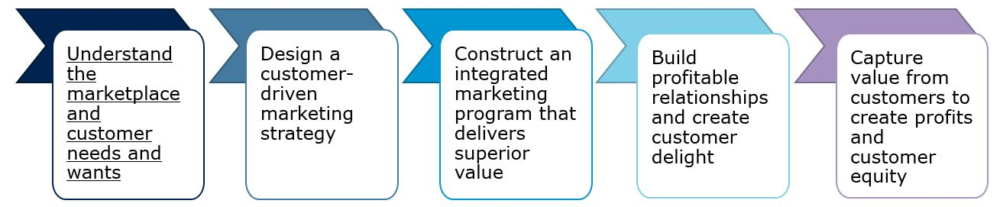
```

As the figure above shows, the goal of marketing is to capture value from customers in order to create profits and customer equity. However, in order to achieve this goal, a company needs to first build profitable relationships by creating customer value through an integrated marketing program. As you will likely also recall, a firm's set of controllable tactical marketing tools can be described in terms of the 'four Ps' taxonomy, which is also referred to as the **Marketing Mix**, consisting of:

* **Product** (design, quality, branding, technology, services, etc.)
* **Price** (list price, discounts, payment period, payment methods, etc.)
* **Place** (trade channels, locations, logistics, e-commerce, etc.)
* **Promotion** (advertising, sales promotion, public relations, etc.)

The firm blends these marketing tools to produce the desired response in the target market. As can be seen from the marketing process, the first step towards capturing customer value is to understand the marketplace and customer needs. Thus, gaining an understanding of the target customers through marketing research enables firms to design their marketing mix in accordance with the consumers needs and wants, which in turn will then lead to positive outcomes on the customer side (e.g., trust, loyalty, satisfaction, engagement) and on the firm side (e.g., revenue, sales, profit, stock prices). As such, marketing research can be seen as the foundation of the marketing process. 

## The research process

Now that it is clear why marketing research is important, let's have a closer look at the underlying process. The flow chart below shows a general depiction of the research process based on Field et al. (2012), which will be discussed subsequently. 

```{r,echo=FALSE,out.width = '70%',fig.align='center',fig.cap = "The research process (based on Field et al. 2012)"}
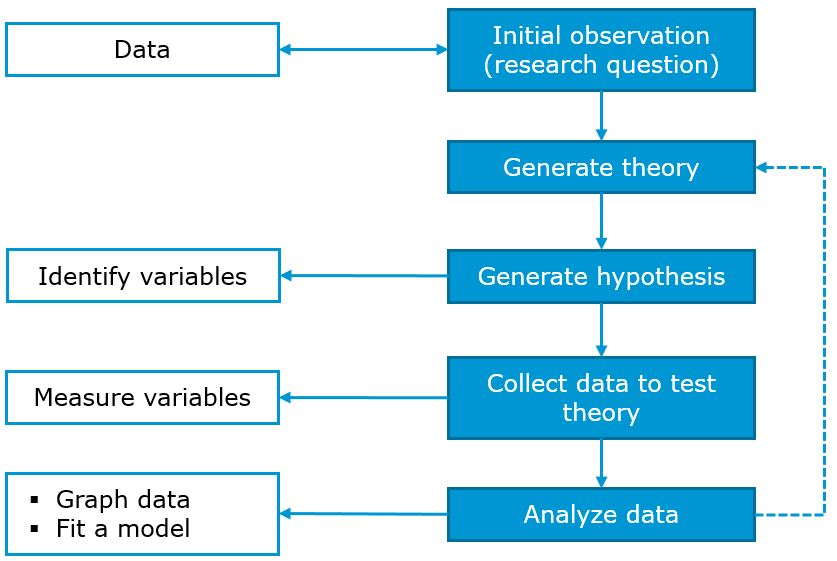
```

### Research question and hypothesis

The first step in the research process is to identify a management problem and to derive a research question from it. As a motivating example, imagine that you are a marketing manager at a firm and you are running online advertising campaigns to promote your products. In order to reach your target group more effectively, you make use of targeting criteria based on user profiles, which are available at an additional cost. The head of your department wonders if the extra expenditures associated with the targeting of the advertising campaigns are justified or if the advertising would be similarly effective without the targeting. As depicted in the stylized flow chart above, the research process often starts with the identification of a **management problem**; something that needs explaining. In our example, this would be the extra expenditures associated with the targeting of online advertising campaigns. This leads to your research question: *Is advertising with behavioral targeting more effective compared to advertising without targeting?* 

Based on this research question, you should, if possible, collect some existing data and look for initial evidence. If you have used behavioral targeting in the past, you may want to compare the performance of campaign that used targeting to campaigns that didn't. Following this initial data screening, you should try to come up with a **theory** that could explain the effects of targeting. A theory can be thought of as a hypothesized general principle or set of principles that explains known findings about a topic and from which new hypotheses can be generated. In our example, we could build on a rich body of literature on tailoring communications that consistently indicates that tailoring improves communications’ performance (e.g., Lambrecht & Tucker 2013, Lewis et al. 2011). Following this theory, you should formulate a prediction regarding the direction of the expected effects. This **hypothesis** can be thought of as a prediction from a theory, i.e., in our example: targeting online ads increases, on average, the probability of purchasing from our store. 

In a next step, you should identify the variables you need to consider in order to test your hypothesis. Particularly, you should clarify what your dependent variable and independent variables are. The **dependent variable** is the outcome variable referring to the proposed effect. If we would, for example, conduct an experiment to test our hypothesis regarding targeting, the dependent variable would be a relevant response variable we are interested in (e.g., the number of sales). The **independent variable**, in contrast, is the proposed cause (a predictor variable). In our experiment, this would be the variable we manipulate, i.e., the type of advertising (targeted vs. non-targeted) in the above example. 

### Choosing a research design

Once you have sufficient clarity on your research hypothesis, you should specify the **research design**. Research designs can be classified according to different criteria, including the data source, the method of analysis, and by the research objective (Malhotra 2010).  

```{r,echo=FALSE,out.width = '80%',fig.align='center',fig.cap = "Research designs (based on Malhotra 2010)"}
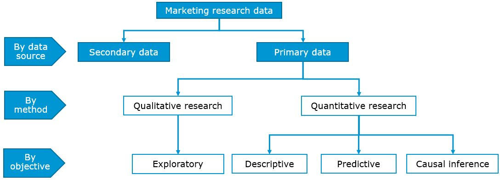
```

#### By data source

A first classification of research designs is by the data source, i.e., whether the research is based on **primary data** or **secondary data**. **Primary data** has the main advantage that it is collected by the researcher for the specific purpose of addressing the research problem at hand. In contrast, with **secondary data** the data has been collected for some purpose other than the problem at hand and was published in the form of books, articles, and databases by governments, business sources, or market research firms. Although it may be less costly to obtain, secondary data has the disadvantage that not all detail are know about the processing of the data and often the won't fit the research question you are trying to answer. That is, in many cases research questions are so specific to a particular management problem that you will need to collect primary data to answer it.   

#### By method of analysis

One high level distinction between methods of data analysis is the distinction between **qualitative research** and **quantitative research**. The differences between these two types of analysis are summarized in the table below. One of the core distinctions is that while the aim of qualitative research is to explore underlying reasons and motivations based on a small, non-representative samples, the aim of quantitative research is to generalize the results from a large, representative sample to the population of interest using statistical techniques. Qualitative research is often used as a first step in the research process to gain an understanding of the research problem which is then followed by quantitative research. Thus, qualitative research is also referred to as exploratory research in line with its objective. In this course, we will not cover qualitative research methods and will focus our attention on quantitative research methods.

```{r,echo=FALSE,out.width = '70%',fig.align='center',fig.cap = "Qualitative vs. quantitative research (based on Malhotra 2010)"}
knitr::include_graphics("./images/quantitative_qualitative.JPG")
```

#### By research objective

One of the most important aspects you need to reflect on when choosing an appropriate research design is the nature of the research objective. That is, whether the objective you would like to achieve with your quantitative research can be classified as *descriptive*, *predictive*, or *causal inference*. The following table shows examples of research questions that fall in each of these categories.

```{r eval = TRUE, echo = FALSE, warning=FALSE, message = FALSE, fig.cap="Test"}
library(dplyr)
library(kableExtra)
mytable_sub_1 = data.frame(
  "X" = c("Example of scientific questions", 
             "Data",
             "Example of analytics"
             ),
    Descriptive = c("How can the customers of our online store be partitioned in classes defined by their characteristics?", 
             "<b>Features</b>: user characteristics (age, gender, location, ...), product characteristics of visited pages, ...; ",
             "Cluster Anaylsis <br> ..."
             ),
    Predictive = c(
      "What is the probability that users who visited our online store last year will purchase from our store within the next month?", 
             "<b>Output</b>: making a purchases within the next month<br>
              <b>Inputs</b>: age, gender, frequency of past purchases, recency of last purchases, monetary value of past purchases, past ad exposures, ...",
             "Regression<br>Decision trees<br>Random forests<br>Support vector machines<br>Neural networks<br> ..."
    ),
    Prescriptive = c(
      "Will behavioral targeting in online advertising increase, on average, the probability of purchasing from our store within the next month?", 
             "<b>Outcome</b>: making a purchases within the next month<br>
              <b>Treatment</b>: initiation of targeting campaign<br>
              <b>Confounders</b>: for non-experimental settings (interest in product category, eligibility criteria used for targeting ...)",
             "Experiments with random assignment<br>
              Regression<br>
              Instrumental variables<br>
              Regression discontinuity<br>
              Difference-in-differences<br>
              ...
              "
             )
    )

#pander::pander(mytable_sub, keep.line.breaks = TRUE, style = 'grid', justify = 'left')
mytable_sub_1 %>% kable(escape = F,col.names = c("","Description","Prediction","Causal Inference")) %>% 
  column_spec(1,width =  "100",extra_css = 'vertical-align: top !important;') %>% 
  column_spec(2,width =  "100",extra_css = "vertical-align: top !important;") %>% 
  column_spec(3,width =  "100",extra_css = "vertical-align: top !important;") %>% 
  column_spec(4,width =  "100",extra_css = "vertical-align: top !important;") %>%
  kable_paper(full_width = F) %>%
  footnote(general = "Based on the classification of data science tasks by Hernán et al. (2019)",
           general_title = "Note: ", 
           footnote_as_chunk = T, title_format = c("italic")
           ) %>% 
  #add_header_above(c("Data Science Tasks" = 4), font_size = 20) %>% 
  row_spec(2, background = "#E0E0E0") %>% row_spec(c(0,1,3), background = "white") %>%
  row_spec(0, align = "c",bold=T) 
```

##### Descriptive research

Descriptive research is aimed at capturing the structure of your data and representing it in a compact manner. Descriptive modeling differs from explanatory (prescriptive) modeling because an underlying causal theory is either absent or incorporated in a less formal way. This means that there is less emphasize on the theory and hypothesis building part of the research process in descriptive research. Descriptive modeling further differs from predictive modeling because it is not aimed at prediction. Having said that, fitting a regression model could be descriptive if it is used for capturing the association between the dependent and independent variables rather than for causal inference or for prediction.

An example of descriptive research is the grouping a firm's customers according to observable customer characteristics (i.e., Features) using cluster analysis. This type of analysis represents the original data in a compact manner by capturing the underlying data structure using clusters. Another example would be the reduction of the dimensionality of a data set using principal component analysis. Similar to cluster analysis, this type of model captures the underlying structure of the data by grouping highly correlated input variables using factors. This type of analysis can be useful, e.g., if predictors in a regression model are highly correlated as we will see later.    

It should be noted that the computational capacity of many firms has increased drastically over the past years due to a substantial decline of the costs associated with computational power and data storage. These developments have made it feasible for many firms to analyze very large data sets ('big data') with the aim of deriving managerial insights. With the rising relevance of big data sets, descriptive research has received increasing attention. The reason is that identifying patters in such vast amounts of data requires structure and often, an initial exploratory, descriptive investigation of large data sets enables the researcher to discover patterns, which then give rise to predictive or prescriptive modeling tasks. This is especially true for unstructured data (social media text, voice data) which can be analyzed using machine learning methods.   

##### Predictive research

Predictive research uses statistical modeling techniques with the aim of predicting new or future observations based on a training data set. That is, the goal is to predict the output value (Y) for new observations given their input values (X). Back in our motivating example, a predictive modeling task would be to predict whether a customer of our web shop will make a purchase within the next month, given a set of input variables. Different from prescriptive research, the focus of predictive models is on the prediction of future observations. For example, in a regression model the amount of explained variance ($R^2$) would be a relevant statistic to inspect after fitting a model. It is important to note that in predictive models, the focus in much less on causality, i.e., explaining the effect of a specific input variable (X) on the outcome (Y). This is the job of prescriptive models. A a consequence, theory often does not play a major role in predictive research. What matters in predictive models is that the model produces reasonable predictions of (Y). One major concern in such models is overfitting. Overfitting means that a model is so highly tuned to the particularities of one specific data set that it produces very good predictions within this sample, but it doesn't generalize to other data sets. To assess the predictive ability of a model outside the sample, it is also useful split the data set into a training data set and a test data set. The training data set is used to calibrate the model and the test data set (or 'hold-out data set') is used for validation, i.e., to assess how well the model predicts values for observations that were not used to calibrate the model. Over the past years, machine learning methods (e.g., random forests, support vector machines, neural networks) have particularly advanced the field of predictive modeling. Hence, these methods are often used in predictive modeling tasks as the table shows. 

##### Causal inference

In many scientific fields, and especially the social sciences, the focus is almost exclusively on research that tests causal hypotheses. To stay within our motivating example, we could be interested in investigating the effect of targeting of online advertising on the effectiveness of a firm's online marketing efforts. Notice the different focus compared to predictive modeling: in the predictive modeling example, we use observations from the past to predict the probability that a given customer will purchase in the future. In the causal inference task, we are interested in causal effect, such as '(By how much) Can we increase the probability that a customer will make a purchase using targeted online advertising?' Or in other words, what should managers do differently in order to increase the purchase probability? To answer this type of question, a set of theoretically derived constructs are measured by variables X and these variables are assumed to cause an underlying effect, measured by variable Y. Since the focus here is on explaining causal effects, this type of research is also often referred to as explanatory modeling. Another alternatve term you may come across is prescriptive modeling, empasizing that the goal is to make recommendations to managers or policy makers regarding the course of action. For these type of questions, theory has a more important role compared to predictive and descriptive research. Hence, the focus when it comes to the model output is more on the coefficients associated with the explanatory variables, rather than on the predictive ability of the model. If you are interested in more details, the article 'To Explain or to Predict?' by Shmueli (2010) has a nice discussion regarding the difference between explanatory and predictive models.  

While managers and marketing researchers care most about causal research questions finding answers to these type of questions is challenging for various reasons. Consider our targeting example. In order to estimate the effect of targeting on sales we could, for example, compare the conversion rates between two groups of users: 1) users exposed to the targeted advertising campaign, and 2) users who were not exposed to the same targeted advertising campaign. The problem with this type of comparison is that the targeting algorithm uses unobserved variables to decide which users to show the ad. Thus, the exposed and unexposed users may be different in outcomes for reasons that have nothing to do with the advertising. If we advertise products from a particular category, it might simply mean that the users targeted with our advertising might have a stronger preference for this category and might have purchased from our store even without seeing the ad. With regard to the underlying model, the interest in the product category can be seen as an unobserved confounder, as the following graphic shows and if this omitted variable is not properly controlled for, we will overestimate the advertising effect (see also Lewis et al. 2011). 

```{r,echo=FALSE,out.width = '70%',fig.align='center',fig.cap = "Unobserved confounders"}
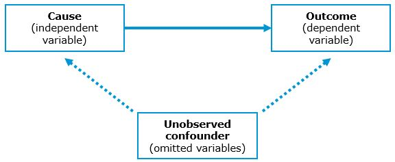
```

In other words, the correlations observed between the dependent measure and advertising are often due to unobserved variables, leading to so-called 'spurious correlations', i.e., a connection between two variables that appears causal but is not. There are plenty of examples for [spurious correlations](https://www.tylervigen.com/spurious-correlations) and you can see one of them in the figure below. 

```{r,echo=FALSE,out.width = '50%',fig.align='center',fig.cap = "Spurious correlation"}
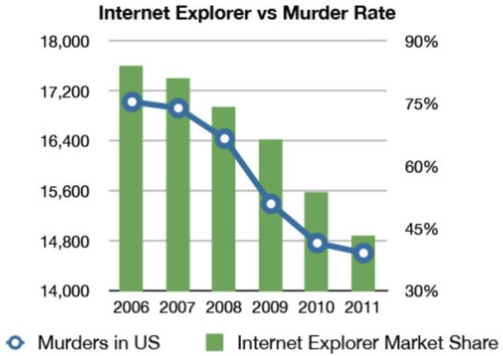
```

Although it appears from the graphic that there is an association between the Internet Explorer market share and the number of murders in the U.S., it wouldn't really make sense to assume that one of them *causes* the other. The main difference between **correlation** and **causality** is that with correlation we observe changes in an input variable (X) and a change in the outcome (Y), whereas causality means that we change the input variable (X) and observe the resulting changes in the outcome variable (Y). For a causal relationship, three conditions have to be met (Field et al. 2012):

1. **Concomitant variation**: A cause, X, and an effect, Y, should vary together in the way predicted by the hypothesis under consideration.  
2. **Time order of occurrence**: The causing event must occur before the effect; it cannot occur afterwards.
3. **Absence of other possible causal factors**: The factor or variable being investigated should be the only possible causal explanation. 

However, with explanatory models, the existence of a spurious correlation is often less obvious and we will explore different methods of data collection to avoid such pitfalls in the next section. Another important aspect regarding the research design is to create a sampling plan. That is, to decide on which units (e.g., survey participants) to include in the sample. This aspect will be discussed later on in chapter 5. 

### Collecting data

Once you have decided on the research design, the next step is to choose 1) the methods of data collection and 2) how to measure the variables of interest, which will be discussed in this section.  

#### Methods of data collection

There are some standard ways of collecting data and two of them will be discussed here: 1) experimental research and 2) observational research. 

##### Experimental research

In the last section, we saw that causal research questions are the ones that matter most to marketing managers. In our example, the question we asked was '(By how much) Can we increase the probability that a customer will make a purchase within the next month using targeted online advertising?'. In this section, we will see that experiments are a proper way of establishing a causal relationship. Or, as the famous quote by Box, Hunter, and Hunter (1978) puts is: 
 
> "To find out what happens when you change something, 
> it is necessary to change it."
>
> `r tufte::quote_footer('--- Box, Hunter, and Hunter 1978')`

###### The counterfactual - what would have happened without the intervention? {-}

When answering these type of causal questions, we would ideally observe the world in two different states simultaneously. In our example, we would ideally observe the same customers at the same time in two states: 1) with targeted online advertising, and 2) without online advertising. Generally, if a customer is exposed to an ad, we would like to know how this customer would have behaved without seeing the ad. This is often referred to as the **counterfactual**. However since we can only observe the same customer in one state at a given time, we need to find other ways to get as close as possible to this ideal counterfactual. As already indicated above, experiments are a proper way of establishing a causal relationship. The procedure of conducting experiments is usually as follows: 

* Divide test units into homogeneous subsamples
* Manipulate independent variables and measure dependent variable
* Random assignment of test units to experimental groups to control for extraneous (potentially confounding) variables

###### Randomization helps to reduce unsystematic variation {-}

To see why this is the preferred method of data collection when the focus is on causal effects, it is useful to acknowledge that there are two types of variation in the data: 

* Systematic variation: Differences in the dependent variable (in our example: sales) created by a specific experimental manipulation (in our example, targeted advertising)
* Unsystematic variation: Differences in the dependent variable created by unknown factors (age, gender, IQ, time of day, measurement error etc.)

In order to measure a causal effect, our goal is to minimize the unsystematic variation while maximizing the systematic variation and **the goal of randomization is to minimizes unsystematic variation**. That is why running experiments is typically superior to other methods of controlling unobserved variables. Or, as Angrist and Pischke (2009) put it: 

> "The most credible and influential research designs use 
> random assignment."
>
> `r tufte::quote_footer('--- Angrist and Pischke 2009')`

###### Between-subsjects and within-subjects designs {-}

In the example above, different customers are assigned to the different groups and one group sees the targeted ads (test group) while the other doesn't (control group). By assigning the customers randomly to the test and control groups, we can be fairly certain that the groups are comparable in terms of unobserved factors. For example, the groups should be similar in terms of their preferences for certain product categories. Assigning different units (in our case: customers) to the test and control conditions in an experiment is also referred to as a **between-subjects design** as visually depicted by the following figure:

```{r,echo=FALSE,out.width = '70%',fig.align='center',fig.cap = "Between-subjects design"}
knitr::include_graphics("./images/between_design.JPG")
```

The counterpart of the between-subject design is the within-subject design. Using a **within-subject design** we would manipulate the independent variable and the same units (in our case: customers) would be exposed to both conditions. In our example, the same customers would first see no advertising and the response (purchase probability) would be recorded. Then the same customers would be exposed to the targeted add and the response would be recorded again as depeicted by the figure below. Because we record multiple responses per unit, this design is also referred to as a repeated-measures designs. In some settings, this type of design my be beneficial because it helps us to reduce unsystematic various due to the fact that different units (customers) are assigned to each group (although they have been assigned randomly to the groups, they will still be slightly different). When we compare the same units (customers) in the two conditions there is less of such unsystematic variation because we know that the units we compare are the same. However, often it is difficult to expose the same units to two experimental condition and to ensure that exposing a unit to the first condition has no effect on the measurement of the second condition (crossover effects). 

```{r,echo=FALSE,out.width = '80%',fig.align='center',fig.cap = "Within-subjects design"}
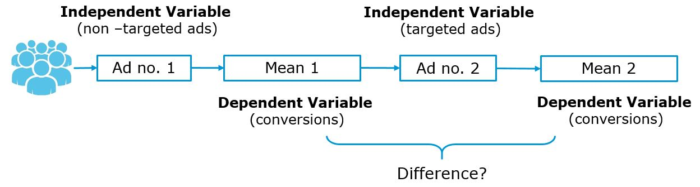
```

With regard to the specification of the test and control conditions there are different options, as the following figure shows.

<br>

:::: {style="display: grid; grid-template-columns: 1fr 4fr; grid-column: 2; grid-row: 3; grid-template-rows: 1fr 1fr 1fr;"}
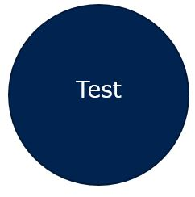

* Measures the effect of a targeted advertising on the entire customer base and compares the purchase probability vs. the historical average 
* Disadvantage: cannot rule out alternative explanations  

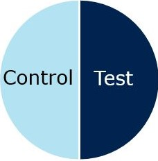

* Measures the effect of a targeted advertising on a subset of the customer base (as compared to a group with no advertising)
* Advantage: controls for alternative explanations using random assignment   
* Disadvantage: can only test one version of advertising (e.g., does not include a strict control group with standard advertising)

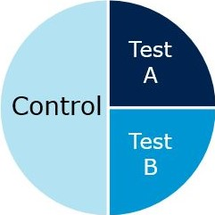

* Measure the effect of multiple actions on different test groups (e.g., include a group with standard (non-targeted) ads)
* Advantages: controls for alternative explanations using random assignment & allows to test multiple advertising strategies
* Disadvantage: fewer observations per test group

::::

With regard to the experimental design, note that the variables we manipulate are also referred to as **factors** and a particular combination of factor levels is called **treatment**. In our case, we only have one factor with three levels (i.e., factor: advertising with levels i. targeted advertising, ii. standard advertising, iii. no advertising). If we would have also systematically varied prices with two levels (i.e., high and low), the variable price would be the second factor and the experimental design would be a 3 x 2 factorial design with three levels of advertising and two levels of price that can be combined using all ($3*2= 6$) possible combinations.  

###### Conducting field experiments {-}

There are different types of settings for experiments. One option is to run the experiments in a lab (**lab experiment**), which offers a high degree of control over potentially confounding factors. However, often it is beneficial/more realistic to test marketing strategies in a real business setting using a **field experiment**. A visual depiction of a typical A/B test, where arriving visitors of a website are randomly assigned to one of three groups in a field experiment is shown in the figure below. 

```{r,echo=FALSE,out.width = '70%',fig.align='center',fig.cap = "Stylized depiction of A/B testing process"}
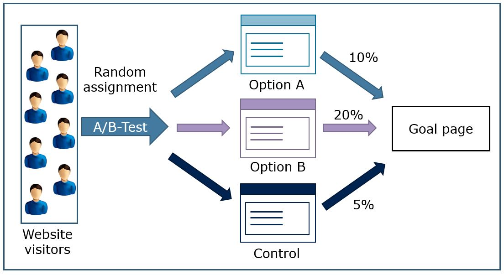
```

Especially for online firms it is very typical to run a large number of field experiments per day in order to optimize their services according to a specified target (e.g., number of conversions). The figure below summarizes some important issues to consider when running field experiments.  

```{r,echo=FALSE,out.width = '90%',fig.align='center',fig.cap = "Guidelines for field experiments"}
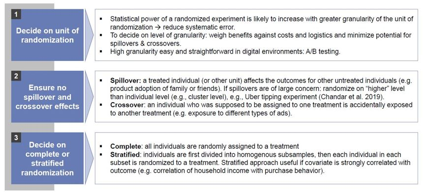
```

1. **Decide on unit of randomization**: In the first step, you should decide on the unit of randomization. In our example, the unit of randomization was on the customer level, which ensures a high granularity. This means that each customer is assigned to one of the groups and the resulting analysis could be conducted on the user level (i.e., each user represents one line in our data set). The larger the data set, the more statistical power we have to estimate the effects as we will see later. An alternative would be, for example, to assign the membership to the test and control groups according to the postcode. This would mean a lower granularity because customers with the same postcode would be grouped together. Since this would mean one postcode per line in the data set, the statistical power decreases. At the same time this could also increase the unsystematic variation (systematic error) because there might be systematic (unobserved) differences between postcodes (e.g., with respect to income).  

2. **Ensure not spillover and crossover effects**: When **spillover effects** are likely, you should consider randomizing at a lower granularity. For example, if you conduct a price experiment and your customers would exchange information that would reveal the different price points and thus potentially jeopardize the experiment (e.g., if a person in the low price condition would order for a person in the high price condition). Randomization at the postcode level would, for example, ensure that all customers within the same area are assigned to the same condition (i.e., either low or high price). As another example, in an experiment with Uber drivers about tipping behavior, Chandar et al. (2019) randomize at the city level (low granularity) to avoid that the drivers would obtain information about the experiment when talking to their colleagues. In addition, to avoid **crossover effects**, you should ensure that a customer get exposed to only one condition to avoid that the exposure to multiple treatments will jeopardize the outcome of the experiment. In an online setting you could, for example, use cookies to ensure that a website visitor will see the same version of the website - even for multiple visits. 

3. **Decide on complete or stratified randomization**: Stratified sampling might help to ensure that the units in each group are comparable across crucial dimensions. For example, if you expect a strong impact of household income and our dependent variable and there are systematic differences regarding this variable (e.g., by postcode), you first divide the individuals into subgroups (stratas) and then sample the units equally from these subgroups (e.g., equal number of treated and control units from one postcode). Although randomly assigning units should also ensure an approximately equal distribution of income groups, using stratified randomization it is less likely that the group composition will systematically differ by chance. 

##### Observational research

In contrast to experimental research, in observational research the researcher observes what happens naturally, **without interfering**. In the previous section we saw that experiments are a proper way of establishing causal relationships. The question then is when the most interesting research questions are causal questions and experiments are the gold standard to infer causal effects from data, why are researchers often confronted with observational data? As the statistician Andrew Gelman (2010) puts it:

> "Given the manifest virtues of experiments, why do I almost always analyze observational data? 
> The short answer is almost all data out there are observational."
>
> `r tufte::quote_footer('--- Gelman (2010)')`

###### What's your identification  strategy? {-}

The answer to this question is related to the fact that in many situations, experiments are not feasible, not appropriate, or simply too costly to conduct. Going back to the 'four Ps' taxonomy from the beginning of this chapter, experimentation is increasingly used to inform advertising decisions where many platforms such as the [Google Ad Manager](https://support.google.com/admanager/answer/7661678?hl=en) offer easy-to-use solutions for the implementation of A/B testing. However, as Goldfarb & Tucker (2014) note, it is far more difficult for practitioners and researchers to run field experiments to inform channels and product development decisions because such experiments would be too time-consuming or often require a level of measurement of long-term implications that is difficult to attain. In addition, field experiments with varying prices are often challenging to conduct because customers may find them unfair. In these situations, experiments are difficult to conduct and Observational data, in contrast, are often easy to obtain. Many firms, for example, keep records about prices and sales of products over time. With this retrospective observational data it is possible to calculate price elasticity, i.e., the relative change in sales due to a relative change in price. The problem with this type of data is, however, that the price setting behavior of managers may be driven by unobserved factors that could bias the estimates. As an example, consider an ice cream seller who sets her prices according to the weather - if the weather is good, she increases prices and if the weather is bad, she decreases prices. As you can image, the sales pattern reveals that, despite the higher prices, she sells more ice cream on warmer than on colder days. If you would attempt to estimate the price elasticity without controlling for weather, the analysis would suggest a positive relationship between price and sales, i.e., the higher the prices, the more ice cream she will sell. It is easy to see that the weather is an unobserved factor in the analysis that confounds the effect of price on sales. Similar issues can often be observed when estimating advertising effects in settings where managers set advertising budgets according to unobserved factors. This, among other things, is the reason why it is generally more challenging to estimate causal effects from observational data. In cases like this, researchers need to carefully consider their identification strategy, i.e., the procedure of estimating causal effects from observational data. As Angrist and Pischke (2009) put it:

> "Underlying this is the recognition, description, and presentation of the identification strategy, 
> or the manner in which a researcher uses observational data (i.e., data not generated by a 
> randomized trial) to approximate a real experiment"
>
> `r tufte::quote_footer('--- Angrist and Pischke (2009), p. 7')`

There are different approaches available to identify causal effects with observational data. Angrist and Pischke (2009, p. 7) describe the five most common approaches as the “Furious Five methods of causal inference,” and they refer to 1) random assignment, 2) regression, 3) instrumental variables, 4) regression discontinuity, and 5) differences in differences. Varian (2016) provides a concise overview over these identification strategies. While we won't cover all of the approaches here, will discuss quasi-experiments and their analysis using difference-in-differences analysis in more detail because of their high practical relevance.  

###### Analyzing quasi-experiments {-}

As Goldfarb & Tucker (2014) note:

> "Quasi-experimental tools mimic the random assignment that is inherent in lab experiments 
> and that is often referred to as the `gold standard' for identifying causal relationships."
>
> `r tufte::quote_footer('--- Goldfarb & Tucker (2014), p. 7')`

Different from an experiment with random assignment of test units, in quasi-experiments the intervention occurs naturally and the units self-select into the test and control conditions without an intervention of the researcher. As an example, assume that you are interested in estimating the effect of music streaming services (e.g., Spotify) on consumers expenditures for music products. On the one hand, consumers might spend less money for music products in other channels (e.g., paid downloads, CDs) after adopting a streaming service. On the other hand, the streaming service also generates income for the industry (e.g., 9.99 EUR per month) and this income might offset the substitution of expenditures in other channels. This is an example of a typical multi-channel distribution problem in marketing. 

Wlömert & Papies (2016) study a panel of music consumers by tracking their music expenditures over time. The intervention occurred when a popular streaming service (i.e., Spotify) entered the market. In this study, the research had no control over who would start using the streaming service and the surveyed consumers self-selected into the test and control conditions. A data set like this where you observe multiple units (here: music consumers) over time time is called a panel data set and it has two variance components: 1) the variance across consumers at each given point in time is referred to as the cross-sectional variance, and 2) the variance for each consumer over time is the longitudinal variance. Hence, a research design that focuses on one point in time is also referred to as a **cross-sectional design** and a research design where the same units are observed at multiple points in time is referred to as a **longitudinal design** as shown in the figure below.  

```{r,echo=FALSE,out.width = '60%',fig.align='center',fig.cap = "Cross-sectional vs. longitudinal design"}
knitr::include_graphics("./images/longitudinal.JPG")
```

The main advantage of a longitudinal design is that it allows researcher to observe changes over time, which is particularly helpful for the identification of causal effects. Although the test units self-select into the test and control conditions, it is often possible to account for unobserved individual-level differences by focusing on the change over time. A method that lends itself very well for this purpose is the difference-in-differences (DiD) estimator. Continuing with the example from above, imagine we would have only conducted one cross-sectional study at T2 (after the streaming service had been introduced to the market). Es can be seen from the figure below, Spotify users spend, on average, more money on music products from other channels (CDs & downloads). However, you cannot conclude from this observation that Spotify *causes* them to spend more money on music from other channels. Rather, in the absence of random assignment, the users self-selected into the test and control conditions and it is likely that music enthusiasts (i.e., consumers with a high interest in music) adopted the streaming service. The unobserved factor in this case is the interest in music products.     

```{r,echo=FALSE,out.width = '70%',fig.align='center',fig.cap = "Example of DID study design (Wlömert & Papies 2016)"}
knitr::include_graphics("./images/spotify_study.JPG")
```
The DiD estimator exploits the longitudinal dimension of the data and focuses on the change over time. This is shown in the following figure:  

```{r message=FALSE, warning=FALSE, echo=FALSE, eval=TRUE, fig.align="center", fig.width=5.5, fig.height=3.75, fig.cap = "Difference-In-Differences Estimation"}
library(ggplot2)
library(ggthemes)
x <- c("pre", "post") 
y1 <- c(1.5,2.5)
y2 <- c(2,3)
y3 <- c(2,3.5)
data_1 <- data.frame(x,y1,y2,y3)
title_size = 10
font_size = 10
line_size = 0.5
ggplot(data_1) + 
  geom_point(aes(x=reorder(x, y1),y=y1), color="cyan4", size = 3) + 
  geom_path(aes(x=reorder(x, y1),y=y1), color="cyan4", size = 1, group = 1) + 
  geom_point(aes(x=reorder(x, y1),y=y3), color="purple4", size = 3) + 
  geom_path(aes(x=reorder(x, y1),y=y3), color="purple4", size = 1, group = 1) + 
  geom_point(aes(x=reorder(x, y2),y=y2), color="steelblue", size = 3) + 
  geom_path(aes(x=reorder(x, y2),y=y2), color="steelblue", size = 1, linetype = "dashed", group = 1) + 
  geom_segment(aes(x="post",y=data_1$y2[2], xend="post", yend=data_1$y3[2]),size=1, color="darkmagenta", arrow = arrow(length = unit(0.1, "inches"))) + 
  geom_segment(aes(x="post",y=data_1$y3[2], xend="post", yend=data_1$y2[2]),size=1, color="darkmagenta", arrow = arrow(length = unit(0.1, "inches"))) + 
  annotate("text", x = 2.03, y = (data_1$y3[2]+data_1$y2[2])/2, label =  expression(Delta), size = 5, color = "darkmagenta") +
  geom_vline(xintercept = 1.5, col='grey', lwd=1,linetype="dotted") +
  annotate("text", x = 1.59, y = 0.5, label =  "Intervention", size = 3) +
  annotate("text", x = 2.08, y = data_1$y3[2], label =  "Yt,post", size = 3) +
  annotate("text", x = 2.08, y = data_1$y1[2], label =  "Yc,post", size = 3) +
  annotate("text", x = 0.93, y = data_1$y3[1], label =  "Yt,pre", size = 3) +
  annotate("text", x = 0.93, y = data_1$y1[1], label =  "Yc,pre", size = 3) +
  theme_base() +
  labs(y="Outcome",x="Time",
       title = "Difference-In-Differences Estimation"
  ) +
  scale_x_discrete("Time", expand=c(0.05,0.1)) +
  theme( legend.position = "none",
         plot.title = element_text(size=title_size,hjust = 0.5),
         axis.title=element_text(size=font_size),
         axis.text.x =element_text(size=font_size),
         axis.text.y =element_blank(),
         axis.ticks.y = element_blank(), 
         plot.background = element_rect(colour = NA)
         )
```

In this stylized example, we observe both groups the test group and the control group at two points in time - before the intervention (pre) and after the intervention (post). If the intervention has no effect on the outcome variable, the difference between the groups should be the same before and after (assuming, of course, that no other intervention occurred that might have induced a change in one of the groups). In the figure above, the blue dotted line represents our expectation regarding the outcome variable for the test group after the intervention and the greed solid line represents the observations for the control group. We can see that the actually observed outcome (purple line) for the test group is larger then expected based on the difference before the intervention. This difference (denoted as $\Delta$) is the difference-in-differences estimate and in this example the intervention had a positive effect on the outcome. It can be derived as follows (see Varian 2016): 

* $Yt,pre$: outcome before intervention for treated groups
* $Yt,post$: outcome after intervention for treated groups
* $Yc,pre$: outcome before intervention for control groups
* $Yc,post$: outcome after intervention for control groups

As mentioned above, the counterfactual is based on the assumption that the (unobserved) change in the outcome by the treated would be the same as the (observed) change in purchases by the control group. To get the impact of the intervention, we then compare the predicted counterfactual outcome to the actual outcome base on the following table:

<br>
```{r eval = TRUE, echo = FALSE, warning=FALSE, message = FALSE, fig.cap="Test"}
library(dplyr)
library(kableExtra)
mytable_sub_1 = data.frame(
   Period = c("Before", 
             "After"
             ),
    Treatment = c("Yt,pre", 
             "Yt,post"
             ),
    Control = c(
      "Yc,pre", 
      "Yc,post"
    ),
    Counterfactual = c(
      "Yt,pre", 
             "Yt,pre + (Yc,post - Yc,pre)"
             )
    )

#pander::pander(mytable_sub, keep.line.breaks = TRUE, style = 'grid', justify = 'left')
mytable_sub_1 %>% kable(escape = F,full_width = F) %>% 
  column_spec(1,width =  "100",extra_css = 'vertical-align: top !important;') %>% 
  column_spec(2,width =  "100",extra_css = "vertical-align: top !important;") %>% 
  column_spec(3,width =  "100",extra_css = "vertical-align: top !important;") %>% 
  column_spec(4,width =  "100",extra_css = "vertical-align: top !important;") %>%
  kable_paper(full_width = F) %>%
  #row_spec(1, background = "#E0E0E0") %>% row_spec(c(0,2), background = "white") %>%
  row_spec(0, align = "c",bold=T) 
```
<br>

Hence, the effect of the treatment on the treated is $(Yt,post - Yt,pre) − (Yc,post - Yc,pre)$.

Going back to our music example above, the effect of the treatment on the treated can be computed as follows: $(7.90 - 10.40) - (4.60 - 4.60) = 2.50$. This means that the introduction of Spotify reduces the expenditures in other channels by 2.50EUR per user per month on average.     

There are other approaches that researchers may use to mimic random assignment using data from quasi-experiments, which we won't discuss in detail. For example, matching procedures may be used to make the control and test groups comparable across a set of observable characteristics. In their study of the music market, Datta et al. (2017), for example, investigate whether the adoption of streaming services leads users to diversify their tastes. Similar to the example above, consumers self-selected into the conditions of Spotify users and non-users. Through statistical matching procedures they identified 'statistical twins', i.e., for each Spotify user they identified one person from the group of non-users who is as comparable as possible to the respective user across the set of observable characteristics. The goal is to make the two groups as comparable as possible except for the fact that users in one group adopted the music services and the users in the other group didn't.      

::: {.infobox_orange .hint data-latex="{hint}"}
Although causal models for observational data are often challenging to implement, there are some packages that make it easier for researchers to apply fairly complex models using just a few lines of code. One such example is the [Causal Impact Package](https://google.github.io/CausalImpact/CausalImpact.html) which has been developed by Google. We will cover regression models later, but if you are interested you could already have a look at the package description to see what it can do. 
:::

#### Measurement and scaling

After deciding on the method of data collection, you need to clarify how you will measure the specified variables.  

##### Levels of measurement

The first distinction you need to consider pertains to the level of measurement. This step is important because the level of measurement determines what type of analysis you will be able to apply once the data has been collected. Thus, you should make sure that your plan for the data analysis is aligned with the levels of measurement of the dependent and independent variables. There are different characteristics that a scale can have:   

* **Description**: Unique labels or descriptors that are used to designate each value of the scale.
* **Order**: Relative sizes or positions of the descriptors. Described “greater than”, “less than”, and “equal to”.
* **Distance**: Absolute differences between the scale descriptors are known and may be expressed in units.
* **Origin**: Scale has a unique or fixed beginning or true zero point. 

These characteristics determine a variable's level of measurement as we will see next.

###### Categorical (non-metric) variables {-}

There are two types of categorical scales: nominal scales and ordinal scales. 

**Nominal scales** only exhibit the most basic of the characteristics above, namely description. Thus, this the values we observe on a nominal scale only serve as labels for identification and categorization. If the scale values are numbers, these numbers do not reflect the amount of the characteristic possessed by the objects. As an example, consider the starting number of boats in a boat race as the picture below shows. 

```{r,echo=FALSE,out.width = '50%',fig.align='center',fig.cap = "Example: nominal scale (starting numbers)"}

```

Note that for a scale with two categories, a nominal variable is also called a *binary* variable. The only permissible mathematical operation with nominal scales is counting. For example, you may count how many participants you have from different occupations. 

Besides description, **ordinal scales** also exhibit the characteristic of order. That is, the numbers indicate the relative position of objects. As an example, consider the order that boats cross the finish line in a boat race. 

```{r,echo=FALSE,out.width = '50%',fig.align='center',fig.cap = "Example: ordinal scale (finishing order)"}

```

Besides counting, you can also order objects. However, note that while the order of objects is known, the scale does not reveal the magnitude of difference between objects. For ordinal variable, all statistics that are based on ranking the data are permissible, such as computing the median, percentiles, ranges, and minimum/maximum values. For example, if you have a 7-point Likert-scale ranging from "fully agree" to "fully disagree" you may compute the median response across objects.    

###### Continuous (metric) variables {-}

There are two types of continuous scales: interval scales and ratio scales. 

Besides description and order, **interval scales** also possess the characteristic of distance. Hence, with interval scales, the differences between objects can be compared. As an example, an expert jury might rate the design of the boats on a scale from 0 to 10. 

```{r,echo=FALSE,out.width = '50%',fig.align='center',fig.cap = "Example: interval scale (design rating 1-10)"}
knitr::include_graphics("./images/scaletype_3.JPG")
```
For interval scales - as the name suggests - the intervals at different levels of the scale need to be the equal. For example, the difference between, say 8 and 9 is the same as the difference between, say 3 and 4. However, the zero point for interval scales is arbitrary. In our example, the jury might have also judged the boats on a scale from 10 to 20 and the result would have been the same. Also then, the difference between, say 18 and 19 would be the same as the difference between, say 13 and 14 (1 scale point). Note, however, that it is not meaningful to take ratios of scale values. Because the zero point is arbitrary it is not meaningful, for example, to say that the second boat (rating: 8.4) is twice as good as the third boat (rating: 4.2). If you would change the scale to the range between, say 10 and 20, the ratio wouldn't be preserved (i.e., $8.4/4.2 \neq 18.4/14.2$) but the difference in scale points would be the same (4.2 points). Because the distance between the objects is know, we may compute statistics such as mean and standard deviation with interval level data. 

Lastly, **ratio scales** possess all properties of nominal, ordinal and interval scales. What's more, ratio scales have an absolute zero point. As an example, consider the time it takes a boat in a race to cross the finish line as shown below. 

```{r,echo=FALSE,out.width = '50%',fig.align='center',fig.cap = "Example: ratio scale (time to finish)"}
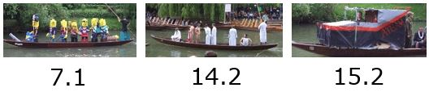
```
In this case ratios are a meaningful way fo comparing objects. For example, the first boat (7.1 sec.) is twice as fast as the second boat (14.2 sec.). A good way to check whether a variable in measure on a ratio scale is to think about the interpretation of the zero point. With ratio scales, the zero points indicates the absence of something (time in our example). All statistical techniques can be applied to ratio data. 

The following table summarizes which statistics may be applied to which scale type. Don't worry if not all of it makes sense now. We will revisit this table in chapter 4 when we will go through the different statistics.  

```{r,echo=FALSE,out.width = '80%',fig.align='center',fig.cap = "Permissible statistics for different levels of measurement"}
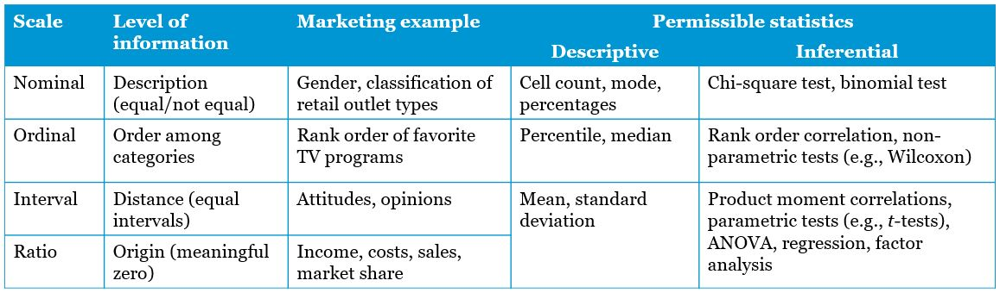
```

As already mentioned, a good understanding of scale types is important to decide which method to apply to test your hypothesis given the data at hand. There are many different flow charts like the one below that can be used as a guide to decide which method to select based on the scale types. 

```{r,echo=FALSE,out.width = '70%',fig.align='center',fig.cap = "Flow chart for test selection (McElreath 2015)"}
knitr::include_graphics("./images/testselection.JPG")
```


::: {.infobox_orange .hint data-latex="{hint}"}
There are also many web resources that are useful to determine what type of test is appropriate given the scale type of the dependent and independent variables. For example, check out [this website](https://stats.idre.ucla.edu/other/mult-pkg/whatstat/) by UCLA which not only shows which type of test is appropriate but also has R code available for each of these tests. 
:::

For survey-based research, there are many different scale types to choose from. Below you can find a summary of some of the most common scaling techniques. For details regarding these scaling techniques, please refer to chapter 10, which dedicated to the topic of questionnaire design.   

```{r,echo=FALSE,out.width = '80%',fig.align='center',fig.cap = "Scaling techniques"}
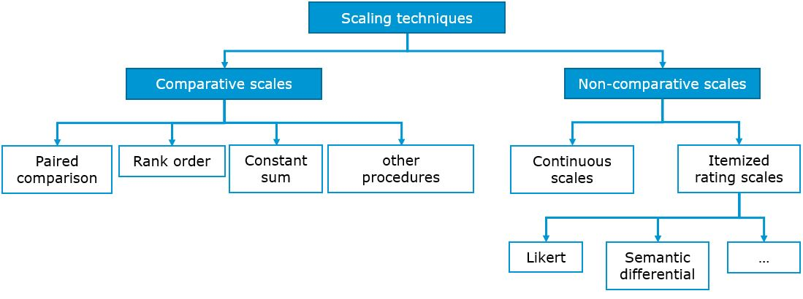
```

##### Measurement accuracy

Once you have decided on which scale types to use you should ensure that your measures accurately represent the variable you intended to measure. More precisely, the two goals of measurement are validity (truthfulness; i.e., our measure captures the variable we intended to measure), and reliability (consistency; i.e., the measure consistently measures the same variable). However, it is important to acknowledge that a measurement is not the true value of the characteristic of interest but rather an observation of it. Hence, the difference between the information sought by the researcher and the information generated by the measurement process is the *measurement error*. There are two types of measurement errors: 1) random error, leading to an overall less precise measurement of the variable of interest, and 2) systematic error, causing the observed value to consistently deviate from the variable of interest. Thus, the observed measurement of a variable $X$ can be expressed in terms of the deviation from the true value with respect to the random and systematic measurement errors as follows: 
<br><br>
$X_O = X_T + X_S + X_R$, where<br>
$X_O$ =	Observed value of a variable X<br>
$X_T$ =	True value of the variable X<br>
$X_S$ =	Systematic error in measuring X<br>
$X_R$ =	Random error in measuring X<br>

Hence, the relationship between the two types of errors and our goals of reliability and validity can be expressed as follows. 

###### Reliability (i.e., consistency) {-}

Reliability refers to the extent to which a scale produces consistent results in repeated measurements. This implies the absence of random error: $X_R \rightarrow 0$. However, this does not necessarily imply the absence of systematic error. Thus, $X_0 = X_T + X_S |  \rightarrow X_R = 0$. In the lower left corner of the figure below, you can find an example for a measurement with a high reliability that consistently misses the true value of the variable (i.e., low validity). As an example consider you wish to measure the intelligence of a person using the head circumference. While the head circumference should produce consistent results in repeated measurements, it is probably not a good proxy for intelligence (low validity). This shows that perfect while perfect reliability requires the absence of random error, it doesn't require the absence of systematic error. 

###### Validity (i.e., truthfulness) {-}

Validity refer to the extent to which differences in observed scale scores reflect true differences among objects on the characteristic being measured. Hence, perfect validity requires the absence of both type of errors. Thus, $X_0 = X_T | \rightarrow X_S = 0, X_R = 0$. The figure below visualizes the to goals of reliability and validity as a function of the two types of measurement error. 

```{r,echo=FALSE,out.width = '60%',fig.align='center',fig.cap = "Validity vs. reliability"}
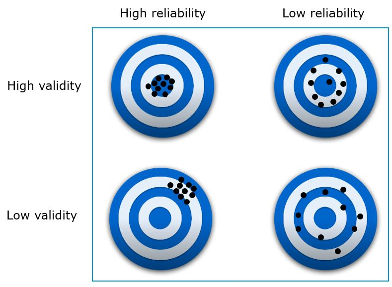
```


###### Single vs. multi-item scales {-}

Related to the concept of measurement accuracy are some choices that the researcher can make to increase the reliability and validity of the measures. The first choice is between single and multi-item scales to measure a construct. A **construct** is a specific type of concept that exists at a higher level of abstraction than everyday concepts. The construct is unobservable (‘latent’) but can be inferred from other measurable variables (‘items’) that together comprise a scale (latent construct). A multi-item scale consists of multiple items, where an item is a single question or statement to be evaluated. The following figure depicts and example of a multi-item scales to measure the construct 'satisfaction'. 

```{r,echo=FALSE,out.width = '60%',fig.align='center',fig.cap = "Multi-item scales"}
knitr::include_graphics("./images/construct.JPG")
```

Instead of using three different items, we could have also simply used one general item to measure satisfaction.The decision whether to use one or more items depends on the complexity of the construct and usually the rule of thumb is to use as few items as necessary given the complexity of a construct. Given that the empirical evidence regarding the use of single-item vs. multi-item scales is mixed (Bergkvist & Rossiter 2007, Bergvist 2015, Kamakura 2015), the decision should be made on a case-by-case basis, taking the advantages and disadvantages of both approaches into account (see table below).     

```{r,echo=FALSE,out.width = '80%',fig.align='center',fig.cap = "Formative vs. reflective measurement"}
knitr::include_graphics("./images/single_multi_theory.JPG")
```

As another example, consider the two versions for measuring a person's statistical ability below. The first version uses a single item scale while the second uses a multi-item scale. Note that the last item of the multi-item scale is *reverse-coded*, meaning that while all other statements are worded positively, this item is worded negatively. This is often done as a reliability check to prevent that, for example, respondents become inattentive and always provide answers in the same response category. If the reverse-coded item shows a low correlation with the remaining items, this signals a low reliability of the scale.  

```{r,echo=FALSE,out.width = '90%',fig.align='center',fig.cap = "Single vs. multi-item scale"}
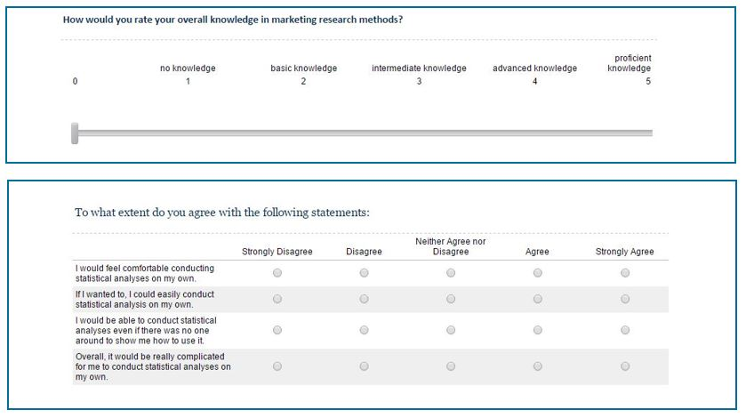
```


###### Formative vs. reflective scales {-}

Another decision related to the concept of measurement accuracy is the choice between formative and reflective measurement. As can be see from the following example, the construct "degree of drunkenness" can be measured in two different ways. While a **formative measurement** uses items that cause the construct, the **reflective measurement** uses items that reflect the construct. One advantage of formative measurement is that managers are often interested to know which specific aspects cause a change in the underlying latent construct so that they can address these aspects. However, this approach also has a downside. Imagine in the example below that a person got drunk by drinking wine. Because our measure doesn't include this specific item, it would have a low validity. This example shows that using formative measures it is important that you consider all possible aspects that might possibly cause the construct of interest. Because this is often difficult to ensure, reflective measurements tend to be more popular. Here, the items are highly correlated and even if we would remove one of them, we would still end up with a fairly accurate measurement of the construct. Reflective measurements have the additional advantage that it is possible to test their reliability using statistical tests, as we will see later.   

```{r,echo=FALSE,out.width = '80%',fig.align='center',fig.cap = "Formative vs. reflective measurement"}
knitr::include_graphics("./images/formative_reflextive.JPG")
```

After discussing all the steps in the research process up to the data collection, the subsequent sections will be concerned with data analysis.    

## Learning check {-}

**(LC1.1) Indicate the level of measurement of the following variables:**

* Occupation of survey participants
* Willingness-to-pay for a product 
* Your grade in the marketing research course (1, 2, 3, 4, 5) 
* Rank order of most important product attributes 
* Student registration number
* Gender of survey participants
* Consumer preferences measured on a 5-point Likert scale
* Mileage (kilometers per liter) a car gets
* Age of survey participants
* Temperature in °C
* Number of products sold

**(LC1.2) Which of the answers is correct? A nominal scale …**

- [ ] …has an absolute zero point
- [ ] …possesses all properties of an ordinal scale
- [ ] …can have numerical values
- [ ] …serves as a label to classify/categorize objects
- [ ] None of the above 	

**(LC1.3) Which of these statements regarding formative constructs are true?**

- [ ] Indicators (items) measure the cause for the change of the not directly observable construct
- [ ] Indicators (items) measure the effect of the change in a not directly observable construct
- [ ] The indicators (items) of the scale should be highly correlated
- [ ] Multi-item measurement is particularly important for the increase in the reliability of the measurement
- [ ] None of the above

**(LC1.4) In causal inference tasks, ...**

- [ ] …the main concern is to generate predictions of future outcomes 
- [ ] …the main concern is to maximize the explained variance
- [ ] …observational research is the 'gold standard'
- [ ] …randomization minimizes unsystematic variation
- [ ] None of the above 	

**(LC1.5) True or false? Reliability refers to the consistency of a measurement.**

- [ ] True 
- [ ] False

**(LC1.5) Using a between-subjects design, we ... **

- [ ] ... manipulate the independent variable (treatment) using different persons for each group
- [ ] ... manipulate independent variable using the same participants for each group 
- [ ] ... manipulate the dependent variable (treatment) using different persons for each group
- [ ] ... manipulate dependent variable using the same participants for each group 
- [ ] None of the above

**(LC1.6) When conducting field experiments, the term crossover effect means ...**

- [ ] ... that an individual who was supposed to be assigned to one treatment is accidentally exposed to another treatment 
- [ ] ... that a treated individual affects the outcomes for other untreated individuals  
- [ ] ... that individuals can be part of both the test and the control condition
- [ ] None of the above

**(LC1.7) Conditions for causality are ...**

- [ ] ... a cause and an effect should vary together in the way predicted by the hypothesis under consideration 
- [ ] ... random assignment of test units
- [ ] ... the causing event must occur before the effect
- [ ] ... absence of other possible causal factors
- [ ] None of the above

**(LC1.8) The effect of the treatment on the treated in DID models can be written as ...**

- [ ] $(Yt,pre - Yt,post) − (Yc,post - Yc,pre)$  
- [ ] $(Yt,post - Yt,pre) − (Yc,post - Yc,pre)$ 
- [ ] $(Yt,pre - Yt,post) − (Yc,pre - Yc,post)$  
- [ ] $(Yt,post - Yt,pre) − (Yc,pre - Yc,post)$  
- [ ] None of the above

**(LC1.9) In predictive modeling tasks ...**

- [ ] ... once major concern are unobserved confounders
- [ ] ... one major concern is overfitting 
- [ ] ... we primarily care about the predictive ability of the model  
- [ ] ... we primarily care about causal effects 
- [ ] None of the above

**(LC1.10) True or false? For ordinal scales, the magnitude of difference between scale points is known**

- [ ] True 
- [ ] False


## References {-}

* Angrist J.D. & Pischke, J.S. (2009) Mostly Harmless Econometrics (Princeton Univ Press,Princeton).
* Bergkvist, L., & J.R. Rossiter (2007), “The Predictive Validity of Multiple-Item Versus Single-Item Measures of the Same Constructs,” Journal of Marketing Research.
* Bergvist, L. (2015): Appropriate Use of Single-Item Measures is Here to Stay, Marketing Letters, 26(3).
* Box, Hunter, & Hunter (1978). Statistics for experimenters, John Wiley & Sons, Inc.
* Chandar, B., Gneezy, U., List, J.A., Muir, I. (2019). The Drivers of Social Preferences: Evidence from a Nationwide Tipping Field Experiment, Working Paper. 
* Datta et al. (2017). Changing Their Tune: How Consumers’ Adoption of Online Streaming Affects Music Consumption and Discovery, Marketing Science, 37(1), 1-175. 
* Field, A., Miles J., & Field, Z. (2012). Discovering Statistics Using R. Sage Publications.
* Gelman (2010). Experimental Reasoning in Social Science in Field Experiments and their Critics. Yale University Press.
* Goldfarb, A. & Tucker, C. E. (2014). Conducting Research with Quasi-Experiments: A Guide for Marketers. Working Paper.
* Kamakura, W. (2015): Measure twice and cut once: the carpenter’s rule still applies , Marketing Letters, 26(3).
* Kotler, P. & Armstrong, G. (2009). Principles of Marketing (13th ed.), Prentice Hall.
* Lambrecht, A., & Tucker, C. E. (2018). Field experiments. In: Hanssens, D M & Mizik, N. (eds.), Handbook of Marketing Analytics, Edward Elgar, 32-51. 
* Lambrecht, A. & Tucker, C. E. (2013). When Does Retargeting Work? Information Specificity in Online Advertising, Journal of Markering Research 50(5), 561–576.
* Lewis, Randall A., Justin M. Rao, and David H. Reiley (2011). Here, There, Everywhere: Correlated Online Behaviors Can Lead to Overestimates of the Effects of Advertising,” in Proceedings of the International Conference on World Wide Web. New York: Association for Computing Machinery, 156–66.
* Malhotra, N. K.(2010). Marketing Research: An Applied Orientation (6th. ed.). Prentice Hall.
* Miguel A. Hernán, John Hsu & Brian Healy (2019). A Second Chance to Get Causal Inference Right: A Classification of Data Science Tasks, CHANCE, 32:1, 42-49.
* Pearl, J. (2009). Causal inference in statistics: An overview. Statistics Surveys, 3, 96–146. 
* Pearl, J. (2018). The Book of Why: The New Science of Cause and Effect, Basic Books.
* Shmueli, G. (2010). To Explain or to Predict?, Statistical Science, 25(3), 289-310.
* Varian, H.R. (2016). Causal inference in economics and marketing, Proceedings of the National Academy of Sciences, 113(27), 7310-7315.
* Wlömert N, Papies D (2016) On-demand streaming services and music industry revenues - Insights from Spotify's market entry. Internat. J. Res. Marketing 33(2):314-327.


