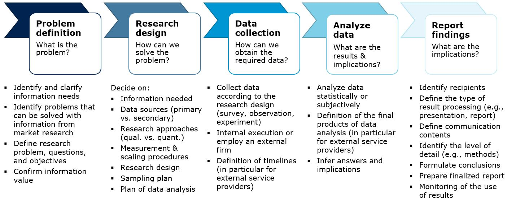
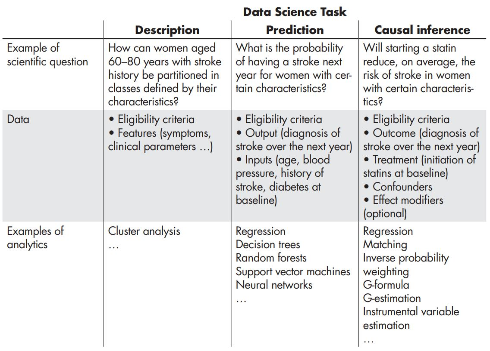

---
output:
  html_document:
    toc: yes
    df_print: paged
  html_notebook: default
  pdf_document:
    toc: yes
  classoption:
  - twocolumn
---

```{r, echo=FALSE}
library(knitr)
options(scipen = F)
#This code automatically tidies code so that it does not reach over the page
opts_chunk$set(tidy.opts=list(width.cutoff=50),tidy=TRUE, rownames.print = FALSE, rows.print = 10)
```

# (PART) Lecture notes {-}

# Preliminaries

Before we will discuss , it is useful to re In this chapter you will learn:

* Why marketing research is important
* The marketing research process
* What type of research design is appropriate in which situation
* The difference between causality and correlation
* The primary scales of measurement
* The difference between measurement validity and reliability

## The marketing research process


> "The process by which companies create value for customers and build strong 
> customer relationships in order to capture value from customers in return."
>
> `r tufte::quote_footer('--- Kotler & Armstrong (2009)')`

<br>
```{r,echo=FALSE,out.width = '90%',fig.align='center', fig.cap = "The marketing process Kotler & Armstrong (2009)"}
knitr::include_graphics("./images/mr_process.JPG")
```

<br><br><br>
```{r,echo=FALSE,out.width = '90%',fig.align='center', fig.cap = "The marketing research process"}

```

* Primary vs. secondary data
* Qualitative vs. quantitative data
* Longitudinal vs. cross-sectional data
* Exploratory vs. conclusive research
* Focus on quantitative conclusive studies

<br><br><br>
```{r,echo=FALSE,out.width = '50%',fig.align='center',fig.cap = "The research process (Field et al. 2012)"}
knitr::include_graphics("./images/research_process.JPG")
```

## Choosing a research design

<br><br><br>
```{r,echo=FALSE,out.width = '70%',fig.align='center',fig.cap = "Data Science Tasks (Hernán et al. (2019))"}

```

* Determine the research objective
* Descriptive, predictive, prescriptive

### Descriptive research

* Capture the data structure

Although not the focus of this article, a third type of modeling, which is the most commonly used and developed by statisticians, is descriptive modeling. This type of modeling is aimed at summarizing or representing the data structure in a compact manner. Unlike explanatory modeling, in descriptive modeling the reliance on an underlying causal theory is absent or incorporated in a less formal way. Also, the focus is at the measurable level rather than at the construct level. Unlike predictive modeling, descriptive modeling is not aimed at prediction. Fitting a regression model can be descriptive if it is used for capturing the association between the dependent and independent variables rather than for causal inference or for prediction.We mention this type of modeling to avoid confusion with causal explanatory and predictive modeling, and also to highlight the different approaches of statisticians and nonstatisticians.

### Predictive research

* Interest in predictions of future observations (e.g., R2, hold-out prediction)
* No concern about causality
* E.g., concerns about overfitting

### Causal inference

In social sciences, most research questions are causal.

* Theory: interest in regression coefficient
* Testing and comparing existing causal theories
* Concerns about e.g., 
    * unobserved confounders
    * selection bias (e.g., panel attrition)
    * measurement error


```{r,echo=FALSE,out.width = '50%',fig.align='center',fig.cap = "Spurious correlation"}
knitr::include_graphics("./images/murder_rate.JPG")
```

<br><br><br>
```{r,echo=FALSE,out.width = '70%',fig.align='center',fig.cap = "Unobserved confounders"}
knitr::include_graphics("./images/confounder.JPG")
```

* A.k.a. explanatory; prescriptive; counter-factual
* Role of theory ...
* Examples for spurious correlation
* Shmueli
* E.g., rooster crow in the morning to prevent the sun from coming up

#### Experimentation

> "To find out what happens when you change something, 
> it is necessary to change it."
>
> `r tufte::quote_footer('--- Box, Hunter, and Hunter 1978')`


> "\The most credible and influential research designs use 
> random assignment."
>
> `r tufte::quote_footer('--- Angrist and Pischke 2009')`


* Systematic vs. unsystematic variation (the signal and the noise)
* Within vs. between subject 
* Control groups --> within vs. between

<br><br><br>

:::: {style="display: grid; grid-template-columns: 1fr 4fr; grid-column: 2; grid-row: 3; grid-template-rows: 1fr 1fr 1fr;"}


* Measures the effect of a set of actions over time on an entire channel and compare vs. historical average, 
* e.g., impact of an email marketing campaign on the entire customer base


* Measures the effect of a specific action on a subset of my business
* e.g., impact of changing assortment of a single product on my sales


* Measure the effect of multiple actions on a test group
* e.g. impact of two marketing campaigns with different content/design on my sales

::::


<br><br><br>

```{r,echo=FALSE,out.width = '70%',fig.align='center',fig.cap = "Stylized depiction of A/B testing process"}
knitr::include_graphics("./images/ab_test.JPG")
```

```{r,echo=FALSE,out.width = '90%',fig.align='center',fig.cap = "Guidelines for field experiments"}
knitr::include_graphics("./images/field_experiments_1.JPG")
```

#### Observational research

* Longitudinal research; 
* Difference-in-Differences Design
* Simulate an experiment - get as close as possible. 

However, in many situations, experiments are not feasible, not appropriate, or too costly. In general, if we think of the `four Ps' taxonomy, while experimentation is increasingly used to inform advertising decisions, practitioners and researchers rarely run field experiments to inform channels and product development because they are too time-consuming or often require a level of measurement of long-term implications that precludes feasible experimentation. In addition, field experiments with pricing are often problematic in that customers can find them unfair. More generally, as Andrew Gelman writes, Given the manifest virtues of experiments, why do I almost always analyze observational data? The short answer is ...

## Measurement and scaling

### Scale characteristics

### Levels of measurement

#### Categorical (non-metric) variables

##### Nominal scales

* Numbers only serve as labels for identification and categorization
* Numbers do not reflect the amount of the characteristic possessed by the objects  
* Called “binary” for two categories
* Only permissible operation is counting

<br>
```{r,echo=FALSE,out.width = '50%',fig.align='center',fig.cap = "Example: nominal scale"}
knitr::include_graphics("./images/scaletype_1.JPG")
```

##### Ordinal scales

* Numbers indicate the relative position of objects
* But not the magnitude of difference between them
* Besides counting, less than/greater than relations are possible
* Also statistics based on centiles, e.g., quartile, median

<br>
```{r,echo=FALSE,out.width = '50%',fig.align='center',fig.cap = "Example: ordinal scale"}
knitr::include_graphics("./images/scaletype_2.JPG")
```

#### Continuous (metric) variables

##### Interval scales

* Differences between objects can be compared (equal intervals)
* But zero point is arbitrary
* Not meaningful to take ratios of scale values
* In addition, statistics such as range, mean, and standard deviation can be computed

<br>
```{r,echo=FALSE,out.width = '50%',fig.align='center',fig.cap = "Example: interval scale"}
knitr::include_graphics("./images/scaletype_3.JPG")
```

##### Ratio scales

* Possesses all properties of nominal, ordinal and interval scales
* Has an absolute zero point
* Meaningful to compute ratios of scale values  
* All statistical techniques can be applied to ratio data

<br>
```{r,echo=FALSE,out.width = '50%',fig.align='center',fig.cap = "Example: ratio scale"}
knitr::include_graphics("./images/scaletype_4.JPG")
```

### Measurement accuracy

<br>
```{r,echo=FALSE,out.width = '60%',fig.align='center',fig.cap = "Example: nominal scale"}
knitr::include_graphics("./images/validity_reliability.JPG")
```

### Scaling techniques

#### Single vs. multi-item scales

#### Formative vs. reflective scales

<br><br><br>
```{r,echo=FALSE,out.width = '90%',fig.align='center',fig.cap = "Formative vs. reflective measurement"}
knitr::include_graphics("./images/formative_reflextive.JPG")
```


## Learning check {-}

::: {.infobox_green .check data-latex="{check}"}

**(LC1.1) Indicate the level of measurement of the following variables:**

* Occupation of survey participants
* Willingness-to-pay for a product 
* Your grade in the marketing research course (1, 2, 3, 4, 5) 
* Rank order of most important product attributes 
* Student registration number
* Gender of survey participants
* Consumer preferences measured on a 5-point Likert scale
* Mileage (kilometers per liter) a car gets
* Age of survey participants
* Temperature in °C
* Number of products sold

:::

## References {-}

* Goldfarb, A. & Tucker, C. E. (2014). Conducting Research with Quasi-Experiments: A Guide for Marketers. Working Paper.
* Kotler, P. & Armstrong, G. (2009). Principles of Marketing (13th ed.), Prentice Hall.
* Field, A., Miles J., & Field, Z. (2012). Discovering Statistics Using R. Sage Publications.
* Miguel A. Hernán, John Hsu & Brian Healy (2019). A Second Chance to Get Causal Inference Right: A Classification of Data Science Tasks, CHANCE, 32:1, 42-49, DOI:10.1080/09332480.2019.1579578 
* Pearl, J. (2009). Causal inference in statistics: An overview. Statistics Surveys, 3, 96–146. 
* Pearl, J. (2018). The Book of Why: The New Science of Cause and Effect, Basic Books.
* Box, Hunter, & Hunter (1978). Statistics for experimenters, John Wiley & Sons, Inc.
* Lambrecht, A., & Tucker, C. E. (2018). Field experiments. In: Hanssens, D M & Mizik, N. (eds.), Handbook of Marketing Analytics, Edward Elgar, 32-51. 
* Chandar, B., Gneezy, U., List, J.A., Muir, I. (2019). The Drivers of Social Preferences: Evidence from a Nationwide Tipping Field Experiment, Working Paper. 


