---
output:
  html_document:
    toc: yes
  html_notebook: default
  pdf_document:
    toc: yes
---


## Data visualization

::: {.infobox .download data-latex="{download}"}
[You can download the corresponding R-Code here](./Code/04-visualization.R)
:::

This section discusses the important topic of data visualization and how to produce appropriate graphics to describe your data visually. You should always visualize your data first. 

<div class="figure" style="text-align: center">

<p class="caption">(\#fig:unnamed-chunk-3)source: https://twitter.com/heyblake/status/1432070055949258752?s=20</p>
</div>

The plots we created in the previous chapters used R's in-built functions. In this section, we will be using the `ggplot2` package by Hadley Wickham. It has the advantage of being fairly straightforward to learn and being very flexible when it comes to building more complex plots. For a more in depth discussion you can refer to chapter 4 of the book "Discovering Statistics Using R" by Andy Field et al. or read the following chapter from the book <a href="http://r4ds.had.co.nz/data-visualisation.html" target="_blank">"R for Data science"</a> by Hadley Wickham as well as <a href="https://r-graphics.org/" target="_blank">"R Graphics Cookbook"</a> by Winston Chang.

ggplot2 is built around the idea of constructing plots by stacking layers on top of one another. Every plot starts with the ```ggplot(data)``` function, after which layers can be added with the "+" symbol. The following figures show the layered structure of creating plots with ggplot. 

<p style="text-align:center;">
&nbsp;&nbsp;&nbsp;

</p>

### Categorical variables

<br>
<div align="center">
<iframe width="560" height="315" src="https://www.youtube-nocookie.com/embed/FCx9yrkwm68" frameborder="0" allowfullscreen></iframe>
</div>
<br>

#### Bar plot

To give you an example of how the graphics are composed, let's go back to the frequency table from the previous chapter, where we created a table showing the relative frequencies of songs in the Austrian streaming charts by genre.  


```r
library(tidyverse)
music_data <- read.csv2("https://short.wu.ac.at/ma22_musicdata") |> # pipe music data into mutate
  mutate(release_date = as.Date(release_date), # convert to date
         explicit = factor(explicit, levels = 0:1, labels = c("not explicit", "explicit")), # convert to factor w. new labels
         label = as.factor(label), # convert to factor with values as labels
         genre = as.factor(genre),
         top10 = as.logical(top10),
         # Create an ordered factor for the ratings (e.g., for arranging the data)
         expert_rating = factor(expert_rating, 
                                levels = c("poor", "fair", "good", "excellent", "masterpiece"), 
                                ordered = TRUE)
         ) |>
  filter(!is.na(valence))
head(music_data)
```

<div data-pagedtable="false">
  <script data-pagedtable-source type="application/json">
{"columns":[{"label":["isrc"],"name":[1],"type":["chr"],"align":["left"]},{"label":["artist_id"],"name":[2],"type":["int"],"align":["right"]},{"label":["streams"],"name":[3],"type":["dbl"],"align":["right"]},{"label":["weeks_in_charts"],"name":[4],"type":["int"],"align":["right"]},{"label":["n_regions"],"name":[5],"type":["int"],"align":["right"]},{"label":["danceability"],"name":[6],"type":["dbl"],"align":["right"]},{"label":["energy"],"name":[7],"type":["dbl"],"align":["right"]},{"label":["speechiness"],"name":[8],"type":["dbl"],"align":["right"]},{"label":["instrumentalness"],"name":[9],"type":["dbl"],"align":["right"]},{"label":["liveness"],"name":[10],"type":["dbl"],"align":["right"]},{"label":["valence"],"name":[11],"type":["dbl"],"align":["right"]},{"label":["tempo"],"name":[12],"type":["dbl"],"align":["right"]},{"label":["song_length"],"name":[13],"type":["dbl"],"align":["right"]},{"label":["song_age"],"name":[14],"type":["dbl"],"align":["right"]},{"label":["explicit"],"name":[15],"type":["fct"],"align":["left"]},{"label":["n_playlists"],"name":[16],"type":["int"],"align":["right"]},{"label":["sp_popularity"],"name":[17],"type":["int"],"align":["right"]},{"label":["youtube_views"],"name":[18],"type":["dbl"],"align":["right"]},{"label":["tiktok_counts"],"name":[19],"type":["int"],"align":["right"]},{"label":["ins_followers_artist"],"name":[20],"type":["int"],"align":["right"]},{"label":["monthly_listeners_artist"],"name":[21],"type":["int"],"align":["right"]},{"label":["playlist_total_reach_artist"],"name":[22],"type":["int"],"align":["right"]},{"label":["sp_fans_artist"],"name":[23],"type":["int"],"align":["right"]},{"label":["shazam_counts"],"name":[24],"type":["int"],"align":["right"]},{"label":["artistName"],"name":[25],"type":["chr"],"align":["left"]},{"label":["trackName"],"name":[26],"type":["chr"],"align":["left"]},{"label":["release_date"],"name":[27],"type":["date"],"align":["right"]},{"label":["genre"],"name":[28],"type":["fct"],"align":["left"]},{"label":["label"],"name":[29],"type":["fct"],"align":["left"]},{"label":["top10"],"name":[30],"type":["lgl"],"align":["right"]},{"label":["expert_rating"],"name":[31],"type":["ord"],"align":["right"]}],"data":[{"1":"BRRGE1603547","2":"3679","3":"11944813","4":"141","5":"1","6":"50.9","7":"80.3","8":"4.00","9":"0.050000","10":"46.30","11":"65.1","12":"166.018","13":"3.118650","14":"228.28571","15":"not explicit","16":"450","17":"51","18":"145030723","19":"9740","20":"29613108","21":"4133393","22":"24286416","23":"3308630","24":"73100","25":"Luan Santana","26":"Eu, Você, O Mar e Ela","27":"2016-06-20","28":"other","29":"Independent","30":"TRUE","31":"excellent"},{"1":"USUM71808193","2":"5239","3":"8934097","4":"51","5":"21","6":"35.3","7":"75.5","8":"73.30","9":"0.000000","10":"39.00","11":"43.7","12":"191.153","13":"3.228000","14":"144.28571","15":"not explicit","16":"768","17":"54","18":"13188411","19":"358700","20":"3693566","21":"18367363","22":"143384531","23":"465412","24":"588550","25":"Alessia Cara","26":"Growing Pains","27":"2018-06-14","28":"Pop","29":"Universal Music","30":"FALSE","31":"good"},{"1":"ES5701800181","2":"776407","3":"38835","4":"1","5":"1","6":"68.3","7":"67.6","8":"14.70","9":"0.000000","10":"7.26","11":"43.4","12":"98.992","13":"3.015550","14":"112.28571","15":"not explicit","16":"48","17":"32","18":"6116639","19":"0","20":"623778","21":"888273","22":"4846378","23":"23846","24":"0","25":"Ana Guerra","26":"El Remedio","27":"2018-04-26","28":"Pop","29":"Universal Music","30":"FALSE","31":"good"},{"1":"ITRSE2000050","2":"433730","3":"46766","4":"1","5":"1","6":"70.4","7":"56.8","8":"26.80","9":"0.000253","10":"8.91","11":"49.5","12":"91.007","13":"3.453417","14":"50.71429","15":"not explicit","16":"6","17":"44","18":"0","19":"13","20":"81601","21":"143761","22":"156521","23":"1294","24":"0","25":"Claver Gold feat. Murubutu","26":"Ulisse","27":"2020-03-31","28":"HipHop/Rap","29":"Independent","30":"FALSE","31":"poor"},{"1":"QZJ842000061","2":"526471","3":"2930573","4":"7","5":"4","6":"84.2","7":"57.8","8":"13.80","9":"0.000000","10":"22.80","11":"19.0","12":"74.496","13":"3.946317","14":"58.28571","15":"not explicit","16":"475","17":"52","18":"0","19":"515","20":"11962358","21":"15551876","22":"90841884","23":"380204","24":"55482","25":"Trippie Redd feat. Young Thug","26":"YELL OH","27":"2020-02-07","28":"HipHop/Rap","29":"Universal Music","30":"FALSE","31":"excellent"},{"1":"USIR20400274","2":"1939","3":"72199738","4":"226","5":"8","6":"35.2","7":"91.1","8":"7.47","9":"0.000000","10":"9.95","11":"23.6","12":"148.033","13":"3.716217","14":"876.71429","15":"not explicit","16":"20591","17":"81","18":"20216069","19":"67300","20":"1169284","21":"16224250","22":"80408253","23":"1651866","24":"5281161","25":"The Killers","26":"Mr. Brightside","27":"2004-06-07","28":"Rock","29":"Universal Music","30":"TRUE","31":"fair"}],"options":{"columns":{"min":{},"max":[10]},"rows":{"min":[10],"max":[10]},"pages":{}}}
  </script>
</div>
How can we plot this kind of data? Since we have a categorical variable, we will use a bar plot. However, to be able to use the table for your plot, you first need to assign it to an object as a data frame using the ```as.data.frame()```-function.


```r
table_plot_rel <- as.data.frame(prop.table(table(music_data$genre))) #relative frequencies
head(table_plot_rel)
```

<div data-pagedtable="false">
  <script data-pagedtable-source type="application/json">
{"columns":[{"label":["Var1"],"name":[1],"type":["fct"],"align":["left"]},{"label":["Freq"],"name":[2],"type":["dbl"],"align":["right"]}],"data":[{"1":"Classics/Jazz","2":"0.001197677"},{"1":"Country","2":"0.007545362"},{"1":"Electro/Dance","2":"0.040466495"},{"1":"German Folk","2":"0.008069345"},{"1":"HipHop/Rap","2":"0.316351279"},{"1":"other","2":"0.078268160"}],"options":{"columns":{"min":{},"max":[10]},"rows":{"min":[10],"max":[10]},"pages":{}}}
  </script>
</div>

Since ```Var1``` is not a very descriptive name, let's rename the variable to something more meaningful


```r
table_plot_rel <- rename(table_plot_rel, Genre = Var1)
head(table_plot_rel)
```

<div data-pagedtable="false">
  <script data-pagedtable-source type="application/json">
{"columns":[{"label":["Genre"],"name":[1],"type":["fct"],"align":["left"]},{"label":["Freq"],"name":[2],"type":["dbl"],"align":["right"]}],"data":[{"1":"Classics/Jazz","2":"0.001197677"},{"1":"Country","2":"0.007545362"},{"1":"Electro/Dance","2":"0.040466495"},{"1":"German Folk","2":"0.008069345"},{"1":"HipHop/Rap","2":"0.316351279"},{"1":"other","2":"0.078268160"}],"options":{"columns":{"min":{},"max":[10]},"rows":{"min":[10],"max":[10]},"pages":{}}}
  </script>
</div>

Once we have our data set we can begin constructing the plot. As mentioned previously, we start with the ```ggplot()``` function, with the argument specifying the data set to be used. Within the function, we further specify the scales to be used using the aesthetics argument, specifying which variable should be plotted on which axis. In our example, we would like to plot the categories on the x-axis (horizontal axis) and the relative frequencies on the y-axis (vertical axis). 


```r
bar_chart <- ggplot(table_plot_rel, aes(x = Genre,y = Freq))
bar_chart
```

<div class="figure" style="text-align: center">
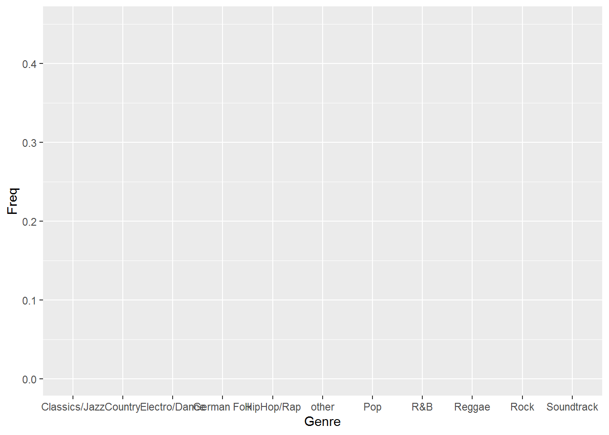
<p class="caption">(\#fig:unnamed-chunk-7)Bar chart (step 1)</p>
</div>

You can see that the coordinate system is empty. This is because so far, we have told R only which variables we would like to plot but we haven't specified which geometric figures (points, bars, lines, etc.) we would like to use. This is done using the ```geom_xxx()``` function. ggplot includes many different geoms, for a wide range of plots (e.g., geom_line, geom_histogram, geom_boxplot, etc.). A good overview of the various geom functions can be found <a href="https://github.com/rstudio/cheatsheets/blob/a9d72b61746ceabb94ef247af14b263ab5fbf15f/data-visualization-2.1.pdf" target="_blank">here</a>. In our case, we would like to use a bar chart for which ```geom_col``` is appropriate.


```r
bar_chart + geom_col() 
```

<div class="figure" style="text-align: center">

<p class="caption">(\#fig:unnamed-chunk-8)Bar chart (step 2)</p>
</div>

Now we have specified the data, the scales and the shape. Specifying this information is essential for plotting data using ggplot. Everything that follows now just serves the purpose of making the plot look nicer by modifying the appearance of the plot. How about some more meaningful axis labels? We can specify the axis labels using the ```ylab()``` and ```xlab()``` functions:


```r
bar_chart + geom_col() +
  ylab("Relative frequency") + 
  xlab("Genre") 
```

<div class="figure" style="text-align: center">

<p class="caption">(\#fig:unnamed-chunk-9)Bar chart (step 3)</p>
</div>

How about adding some value labels to the bars? This can be done using ```geom_text()```. Note that the ```sprintf()``` function is not mandatory and is only added to format the numeric labels here. The function takes two arguments: the first specifies the format wrapped in two ```%``` signs. Thus, ```%.0f``` means to format the value as a fixed point value with no digits after the decimal point, and ```%%``` is a literal that prints a "%" sign. The second argument is simply the numeric value to be used. In this case, the relative frequencies multiplied by 100 to obtain the percentage values. Using the ```vjust = ``` argument, we can adjust the vertical alignment of the label. In this case, we would like to display the label slightly above the bars.  


```r
bar_chart + geom_col() +
  ylab("Relative frequency") + 
  xlab("Genre") + 
  geom_text(aes(label = sprintf("%.0f%%", Freq * 100)), vjust=-0.2) 
```

<div class="figure" style="text-align: center">

<p class="caption">(\#fig:unnamed-chunk-10)Bar chart (step 4)</p>
</div>

We could go ahead and specify the appearance of every single element of the plot now. However, there are also pre-specified themes that include various formatting steps in one singe function. For example ```theme_bw()``` would make the plot appear like this: 


```r
bar_chart + geom_col() +
  ylab("Relative frequency") + 
  xlab("Genre") + 
  geom_text(aes(label = sprintf("%.1f%%", Freq/sum(Freq) * 100)), vjust=-0.2) +
  theme_bw()
```

<div class="figure" style="text-align: center">

<p class="caption">(\#fig:unnamed-chunk-11)Bar chart (step 5)</p>
</div>

and ```theme_minimal()``` looks like this:


```r
bar_chart + geom_col() +
  ylab("Relative frequency") + 
  xlab("Genre") + 
  geom_text(aes(label = sprintf("%.1f%%", Freq/sum(Freq) * 100)), vjust=-0.2) +
  theme_minimal() 
```

<div class="figure" style="text-align: center">

<p class="caption">(\#fig:unnamed-chunk-12)Bar chart (options 1)</p>
</div>
In a next step, let's prevent the axis labels from overlapping by rotating the labels.


```r
bar_chart + geom_col() +
  ylab("Relative frequency") + 
  xlab("Genre") + 
  geom_text(aes(label = sprintf("%.1f%%", Freq/sum(Freq) * 100)), vjust=-0.2) +
  theme_minimal() +
  theme(axis.text.x = element_text(angle=45,vjust=0.75)) 
```

<div class="figure" style="text-align: center">

<p class="caption">(\#fig:unnamed-chunk-13)Bar chart (options 1)</p>
</div>

We could also add a title and combine all labels using the `labs` function.  


```r
bar_chart + geom_col() +
  labs(x = "Genre", y = "Relative frequency", title = "Chart songs by genre") + 
  geom_text(aes(label = sprintf("%.1f%%", Freq/sum(Freq) * 100)), vjust=-0.2) +
  theme_minimal() +
  theme(axis.text.x = element_text(angle=45,vjust=0.75),
        plot.title = element_text(hjust = 0.5, color = "#666666")
        ) 
```

<div class="figure" style="text-align: center">

<p class="caption">(\#fig:unnamed-chunk-14)Bar chart (options 1)</p>
</div>
We could also add some color to the bars using the `colorspace` library, which comes with a range of <a href="https://colorspace.r-forge.r-project.org/articles/ggplot2_color_scales.html" target="_blank">color palettes</a>. For example the shading of the bar could reflect the frequency:


```r
library(colorspace)
bar_chart + geom_col(aes(fill = Freq)) +
  labs(x = "Genre", y = "Relative frequency", title = "Chart share by genre") + 
  geom_text(aes(label = sprintf("%.1f%%", Freq/sum(Freq) * 100)), vjust=-0.2) +
  theme_minimal() +
  ylim(0,0.5) +
  scale_fill_continuous_sequential(palette = "Blues") +
  theme(axis.text.x = element_text(angle=45,vjust=0.75),
        plot.title = element_text(hjust = 0.5,color = "#666666"),
        legend.title = element_blank()
        ) 
```

<div class="figure" style="text-align: center">

<p class="caption">(\#fig:unnamed-chunk-15)Bar chart (options 1)</p>
</div>

Finally, we can reorder the bars by size using `fct_reorder`. The first argument to the function is the `factor` we want to reorder (genre) and the second the variable by which we want to order it (frequency):


```r
bar_chart + geom_col(aes(x=fct_reorder(Genre, Freq), fill = Freq)) +
  labs(x = "Genre", y = "Relative frequency", title = "Chart share by genre") + 
  geom_text(aes(label = sprintf("%.1f%%", Freq/sum(Freq) * 100)), vjust=-0.2) +
  theme_minimal() +
  ylim(0,0.5) +
  scale_fill_continuous_sequential(palette = "Blues") +
  theme(axis.text.x = element_text(angle=45,vjust=0.75),
        plot.title = element_text(hjust = 0.5,color = "#666666"),
        legend.title = element_blank()
        )
```

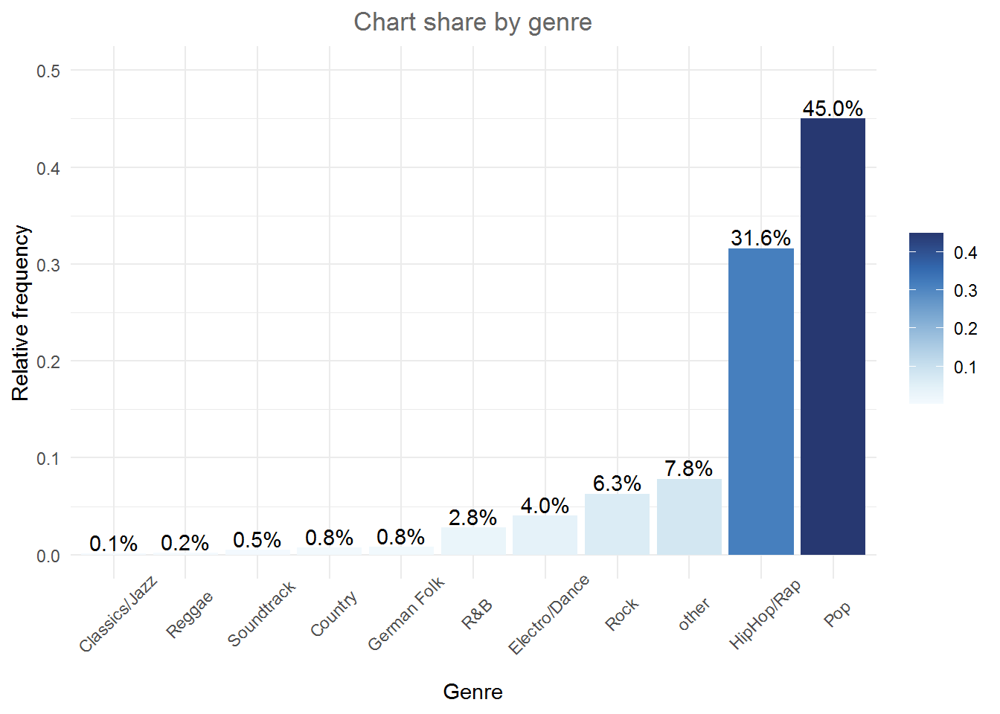

The default theme in `ggplot` is ```theme_classic()```. For even more options, check out the ```ggthemes``` package, which includes formats for specific publications. You can check out the different themes <a href="https://cran.r-project.org/web/packages/ggthemes/vignettes/ggthemes.html" target="_blank">here</a>. For example ```theme_economist()``` uses the formatting of the journal "The Economist":


```r
library(ggthemes)
bar_chart + geom_col(aes(x=fct_reorder(Genre, Freq))) +
  labs(x = "Genre", y = "Relative frequency", title = "Chart songs by genre") + 
  geom_text(aes(label = sprintf("%.1f%%", Freq/sum(Freq) * 100)), vjust=-0.2) +
  theme_economist() +
  ylim(0,0.5) +
  theme(axis.text.x = element_text(angle=45,vjust=0.55),
        plot.title = element_text(hjust = 0.5,color = "#666666")
        ) 
```

<div class="figure" style="text-align: center">

<p class="caption">(\#fig:unnamed-chunk-17)Bar chart (options 2)</p>
</div>

::: {.infobox_orange .hint data-latex="{hint}"}
There are various similar packages with pre-specified themes, like the <a href="https://github.com/cttobin/ggthemr" target="_blank">`ggthemr`</a> package, the <a href="https://github.com/ricardo-bion/ggtech" target="_blank">`ggtech`</a> package, the <a href="https://github.com/johnmackintosh/rockthemes" target="_blank">`rockthemes`</a> package, or the <a href="https://github.com/Ryo-N7/tvthemes" target="_blank">`tvthemes`</a> package. 
:::

In a next step, we might want to investigate whether the relative frequencies differ between songs with explicit and song without explicit lyrics. For this purpose we first construct the conditional relative frequency table from the previous chapter again. Recall that the latter gives us the relative frequency within a group (in our case genres), as compared to the relative frequency within the entire sample.


```r
table_plot_cond_rel <- as.data.frame(prop.table(table(select(music_data, genre, explicit)),2)) #conditional relative frequencies
table_plot_cond_rel
```

<div data-pagedtable="false">
  <script data-pagedtable-source type="application/json">
{"columns":[{"label":["genre"],"name":[1],"type":["fct"],"align":["left"]},{"label":["explicit"],"name":[2],"type":["fct"],"align":["left"]},{"label":["Freq"],"name":[3],"type":["dbl"],"align":["right"]}],"data":[{"1":"Classics/Jazz","2":"not explicit","3":"0.001126222"},{"1":"Country","2":"not explicit","3":"0.008429603"},{"1":"Electro/Dance","2":"not explicit","3":"0.030442128"},{"1":"German Folk","2":"not explicit","3":"0.006450182"},{"1":"HipHop/Rap","2":"not explicit","3":"0.341996144"},{"1":"other","2":"not explicit","3":"0.082265413"},{"1":"Pop","2":"not explicit","3":"0.433424910"},{"1":"R&B","2":"not explicit","3":"0.029605993"},{"1":"Reggae","2":"not explicit","3":"0.001877037"},{"1":"Rock","2":"not explicit","3":"0.059553265"},{"1":"Soundtrack","2":"not explicit","3":"0.004829104"},{"1":"Classics/Jazz","2":"explicit","3":"0.001708776"},{"1":"Country","2":"explicit","3":"0.001220554"},{"1":"Electro/Dance","2":"explicit","3":"0.112168925"},{"1":"German Folk","2":"explicit","3":"0.019650922"},{"1":"HipHop/Rap","2":"explicit","3":"0.132918345"},{"1":"other","2":"explicit","3":"0.049676553"},{"1":"Pop","2":"explicit","3":"0.569876724"},{"1":"R&B","2":"explicit","3":"0.017820090"},{"1":"Reggae","2":"explicit","3":"0.001342610"},{"1":"Rock","2":"explicit","3":"0.088368119"},{"1":"Soundtrack","2":"explicit","3":"0.005248383"}],"options":{"columns":{"min":{},"max":[10]},"rows":{"min":[10],"max":[10]},"pages":{}}}
  </script>
</div>
We can now take these tables to construct plots grouped by explicitness. To achieve this we simply need to add the `facet_wrap()` function, which replicates a plot multiple times, split by a specified grouping factor. Note that the grouping factor has to be supplied in R’s formula notation, hence it is preceded by a “~” symbol.


```r
ggplot(table_plot_cond_rel, aes(x = fct_reorder(genre,
    Freq), y = Freq)) + geom_col(aes(fill = Freq)) +
    facet_wrap(~explicit) + labs(x = "", y = "Relative frequency",
    title = "Distribution of genres for explicit and non-explicit songs") +
    geom_text(aes(label = sprintf("%.0f%%", Freq *
        100)), vjust = -0.2) + theme_minimal() + ylim(0,
    1) + scale_fill_continuous_sequential(palette = "Blues") +
    theme(axis.text.x = element_text(angle = 45, vjust = 1.1,
        hjust = 1), plot.title = element_text(hjust = 0.5,
        color = "#666666"), legend.position = "none")
```

<div class="figure" style="text-align: center">

<p class="caption">(\#fig:unnamed-chunk-19)Grouped bar chart (facet_wrap)</p>
</div>

Alternatively, we might be interested to investigate the relative frequencies of explicit and non-explicit lyrics for each genre. To achieve this, we can also use the fill argument, which tells ggplot to fill the bars by a specified variable (in our case “explicit”). The position = "dodge" argument causes the bars to be displayed next to each other (as opposed to stacked on top of one another).


```r
table_plot_cond_rel_1 <- as.data.frame(prop.table(table(select(music_data, genre, explicit)),1)) #conditional relative frequencies
ggplot(table_plot_cond_rel_1, aes(x = genre, y = Freq, fill = explicit)) + #use "fill" argument for different colors
  geom_col(position = "dodge") + #use "dodge" to display bars next to each other (instead of stacked on top)
  geom_text(aes(label = sprintf("%.0f%%", Freq * 100)),position=position_dodge(width=0.9), vjust=-0.25) +
    scale_fill_discrete_qualitative(palette = "Dynamic") +
  labs(x = "Genre", y = "Relative frequency", title = "Explicit lyrics share by genre") + 
  theme_minimal() +
  theme(axis.text.x = element_text(angle=45,vjust=1.1,hjust=1),
        plot.title = element_text(hjust = 0.5,color = "#666666"),
        legend.position = "none"
        ) 
```

<div class="figure" style="text-align: center">

<p class="caption">(\#fig:unnamed-chunk-20)Grouped bar chart (fill)</p>
</div>


### Continuous variables

<br>
<div align="center">
<iframe width="560" height="315" src="https://www.youtube-nocookie.com/embed/WuMp80qZGc4" frameborder="0" allowfullscreen></iframe>
</div>
<br>

#### Histogram

Histograms can be created for continuous data using the ```geom_histogram()``` function. Note that the ```aes()``` function only needs one argument here, since a histogram is a plot of the distribution of only one variable. As an example, let's consider our data set containing the music data: 


```r
head(music_data)
```

<div data-pagedtable="false">
  <script data-pagedtable-source type="application/json">
{"columns":[{"label":["isrc"],"name":[1],"type":["chr"],"align":["left"]},{"label":["artist_id"],"name":[2],"type":["int"],"align":["right"]},{"label":["streams"],"name":[3],"type":["dbl"],"align":["right"]},{"label":["weeks_in_charts"],"name":[4],"type":["int"],"align":["right"]},{"label":["n_regions"],"name":[5],"type":["int"],"align":["right"]},{"label":["danceability"],"name":[6],"type":["dbl"],"align":["right"]},{"label":["energy"],"name":[7],"type":["dbl"],"align":["right"]},{"label":["speechiness"],"name":[8],"type":["dbl"],"align":["right"]},{"label":["instrumentalness"],"name":[9],"type":["dbl"],"align":["right"]},{"label":["liveness"],"name":[10],"type":["dbl"],"align":["right"]},{"label":["valence"],"name":[11],"type":["dbl"],"align":["right"]},{"label":["tempo"],"name":[12],"type":["dbl"],"align":["right"]},{"label":["song_length"],"name":[13],"type":["dbl"],"align":["right"]},{"label":["song_age"],"name":[14],"type":["dbl"],"align":["right"]},{"label":["explicit"],"name":[15],"type":["fct"],"align":["left"]},{"label":["n_playlists"],"name":[16],"type":["int"],"align":["right"]},{"label":["sp_popularity"],"name":[17],"type":["int"],"align":["right"]},{"label":["youtube_views"],"name":[18],"type":["dbl"],"align":["right"]},{"label":["tiktok_counts"],"name":[19],"type":["int"],"align":["right"]},{"label":["ins_followers_artist"],"name":[20],"type":["int"],"align":["right"]},{"label":["monthly_listeners_artist"],"name":[21],"type":["int"],"align":["right"]},{"label":["playlist_total_reach_artist"],"name":[22],"type":["int"],"align":["right"]},{"label":["sp_fans_artist"],"name":[23],"type":["int"],"align":["right"]},{"label":["shazam_counts"],"name":[24],"type":["int"],"align":["right"]},{"label":["artistName"],"name":[25],"type":["chr"],"align":["left"]},{"label":["trackName"],"name":[26],"type":["chr"],"align":["left"]},{"label":["release_date"],"name":[27],"type":["date"],"align":["right"]},{"label":["genre"],"name":[28],"type":["fct"],"align":["left"]},{"label":["label"],"name":[29],"type":["fct"],"align":["left"]},{"label":["top10"],"name":[30],"type":["lgl"],"align":["right"]},{"label":["expert_rating"],"name":[31],"type":["ord"],"align":["right"]}],"data":[{"1":"BRRGE1603547","2":"3679","3":"11944813","4":"141","5":"1","6":"50.9","7":"80.3","8":"4.00","9":"0.050000","10":"46.30","11":"65.1","12":"166.018","13":"3.118650","14":"228.28571","15":"not explicit","16":"450","17":"51","18":"145030723","19":"9740","20":"29613108","21":"4133393","22":"24286416","23":"3308630","24":"73100","25":"Luan Santana","26":"Eu, Você, O Mar e Ela","27":"2016-06-20","28":"other","29":"Independent","30":"TRUE","31":"excellent"},{"1":"USUM71808193","2":"5239","3":"8934097","4":"51","5":"21","6":"35.3","7":"75.5","8":"73.30","9":"0.000000","10":"39.00","11":"43.7","12":"191.153","13":"3.228000","14":"144.28571","15":"not explicit","16":"768","17":"54","18":"13188411","19":"358700","20":"3693566","21":"18367363","22":"143384531","23":"465412","24":"588550","25":"Alessia Cara","26":"Growing Pains","27":"2018-06-14","28":"Pop","29":"Universal Music","30":"FALSE","31":"good"},{"1":"ES5701800181","2":"776407","3":"38835","4":"1","5":"1","6":"68.3","7":"67.6","8":"14.70","9":"0.000000","10":"7.26","11":"43.4","12":"98.992","13":"3.015550","14":"112.28571","15":"not explicit","16":"48","17":"32","18":"6116639","19":"0","20":"623778","21":"888273","22":"4846378","23":"23846","24":"0","25":"Ana Guerra","26":"El Remedio","27":"2018-04-26","28":"Pop","29":"Universal Music","30":"FALSE","31":"good"},{"1":"ITRSE2000050","2":"433730","3":"46766","4":"1","5":"1","6":"70.4","7":"56.8","8":"26.80","9":"0.000253","10":"8.91","11":"49.5","12":"91.007","13":"3.453417","14":"50.71429","15":"not explicit","16":"6","17":"44","18":"0","19":"13","20":"81601","21":"143761","22":"156521","23":"1294","24":"0","25":"Claver Gold feat. Murubutu","26":"Ulisse","27":"2020-03-31","28":"HipHop/Rap","29":"Independent","30":"FALSE","31":"poor"},{"1":"QZJ842000061","2":"526471","3":"2930573","4":"7","5":"4","6":"84.2","7":"57.8","8":"13.80","9":"0.000000","10":"22.80","11":"19.0","12":"74.496","13":"3.946317","14":"58.28571","15":"not explicit","16":"475","17":"52","18":"0","19":"515","20":"11962358","21":"15551876","22":"90841884","23":"380204","24":"55482","25":"Trippie Redd feat. Young Thug","26":"YELL OH","27":"2020-02-07","28":"HipHop/Rap","29":"Universal Music","30":"FALSE","31":"excellent"},{"1":"USIR20400274","2":"1939","3":"72199738","4":"226","5":"8","6":"35.2","7":"91.1","8":"7.47","9":"0.000000","10":"9.95","11":"23.6","12":"148.033","13":"3.716217","14":"876.71429","15":"not explicit","16":"20591","17":"81","18":"20216069","19":"67300","20":"1169284","21":"16224250","22":"80408253","23":"1651866","24":"5281161","25":"The Killers","26":"Mr. Brightside","27":"2004-06-07","28":"Rock","29":"Universal Music","30":"TRUE","31":"fair"}],"options":{"columns":{"min":{},"max":[10]},"rows":{"min":[10],"max":[10]},"pages":{}}}
  </script>
</div>

Now we can create the histogram using ```geom_histogram()```. The argument ```binwidth``` specifies the range that each bar spans, ```col = "black"``` specifies the border to be black and ```fill = "darkblue"``` sets the inner color of the bars to dark blue. For brevity, we have now also started naming the x and y axis with the single function ```labs()```, instead of using the two distinct functions ```xlab()``` and ```ylab()```. Let's look at the distribution of streams of R&B songs:


```r
music_data |>
  filter(genre=="R&B") |>
  ggplot(aes(streams)) + 
    geom_histogram(binwidth = 20000000, col = "black", fill = "darkblue") + 
    labs(x = "Number of streams", y = "Frequency", title = "Distribution of streams") + 
    theme_bw()
```

<div class="figure" style="text-align: center">

<p class="caption">(\#fig:unnamed-chunk-22)Histogram</p>
</div>

If you would like to highlight certain points of the distribution, you can use the `geom_vline` (short for vertical line) function to do this. For example, we may want to highlight the mean and the median of the distribution.


```r
music_data |>
  filter(genre=="R&B") |>
ggplot(aes(streams)) + 
  geom_histogram(binwidth = 20000000, col = "black", fill = "darkblue") + 
  labs(x = "Number of streams", y = "Frequency", title = "Distribution of streams", subtitle = "Red vertical line = mean, green vertical line = median") + 
  geom_vline(aes(xintercept = mean(streams)), color = "red", size = 1) +
  geom_vline(aes(xintercept = median(streams)), color = "green", size = 1) +
  theme_bw()
```

<div class="figure" style="text-align: center">

<p class="caption">(\#fig:unnamed-chunk-23)Histogram 2</p>
</div>
In this case, you should indicate what the lines refer to. In the plot above, the 'subtitle' argument was used to add this information to the plot. 

::: {.infobox_orange .hint data-latex="{hint}"}
Note the difference between a bar chart and the histogram. While a bar chart is used to visualize the frequency of observations for categorical variables, the histogram shows the frequency distribution for continuous variables.    
:::

#### Boxplot

Another common way to display the distribution of continuous variables is through boxplots. ggplot will construct a boxplot if given the geom ```geom_boxplot()```. In our case we might want to show the difference in streams between the genres. For this analysis, we will transform the streaming variable using a logarithmic transformation, which is common with such data (as we will see later). So let's first create a new variable by taking the logarithm of the streams variable. 


```r
music_data$log_streams <- log(music_data$streams)
```

Now, let's create a boxplot based on these variables and plot the log-transformed number of streams by genre. 


```r
ggplot(music_data, aes(x = fct_reorder(genre, log_streams),
    y = log_streams)) + geom_boxplot(coef = 3) + labs(x = "Genre",
    y = "Number of streams (log-scale)") + theme_minimal() +
    theme(axis.text.x = element_text(angle = 45, vjust = 1.1,
        hjust = 1), plot.title = element_text(hjust = 0.5,
        color = "#666666"), legend.position = "none")
```

<div class="figure" style="text-align: center">

<p class="caption">(\#fig:unnamed-chunk-25)Boxplot by group</p>
</div>
The following graphic shows you how to interpret the boxplot:


Note that you could also flip the boxplot. To do this, you only need to exchange the x- and y-variables. If we provide the categorical variable to the y-axis as follows, the axis will be flipped.   


```r
ggplot(music_data, aes(x = log_streams, y = fct_reorder(genre,
    log_streams))) + geom_boxplot(coef = 3) + labs(x = "Number of streams (log-scale)",
    y = "Genre") + theme_minimal() + theme(plot.title = element_text(hjust = 0.5,
    color = "#666666"), legend.position = "none")
```

<div class="figure" style="text-align: center">

<p class="caption">(\#fig:unnamed-chunk-26)Boxplot by group</p>
</div>

It is often meaningful to augment the boxplot with the data points using ```geom_jitter()```. This way, differences in the distribution of the variable between the genres become even more apparent. 


```r
ggplot(music_data, aes(x = log_streams, y = fct_reorder(genre,
    log_streams))) + geom_jitter(colour = "red", alpha = 0.1) +
    geom_boxplot(coef = 3, alpha = 0.1) + labs(x = "Number of streams (log-scale)",
    y = "Genre") + theme_minimal()
```

<div class="figure" style="text-align: center">

<p class="caption">(\#fig:unnamed-chunk-27)Boxplot by group</p>
</div>

In case you would like to create the boxplot on the total data (i.e., not by group), just leave the ```y = ``` argument within the ```aes()``` function empty: 


```r
ggplot(music_data,aes(x = log_streams, y = "")) +
  geom_boxplot(coef = 3,width=0.3) + 
  labs(x = "Number of streams (log-scale)", y = "") 
```

<div class="figure" style="text-align: center">

<p class="caption">(\#fig:unnamed-chunk-28)Single Boxplot</p>
</div>


#### Plot of means

Another way to get an overview of the difference between two groups is to plot their respective means with confidence intervals. The mean and confidence intervals will enter the plot separately, using the geoms ```geom_bar()``` and ```geom_errorbar()```. Don't worry if you don't know exactly how to interpret the confidence interval at this stage - we will cover this topic in the next chapter. Let's assume we would like to plot the difference in streams between the HipHop & Rap genre and all other genres. For this, we first need to create a dummy variable (i.e., a categorical variable with two levels) that indicates if a song is from the HipHop & Rap genre or from any of the other genres. We can use the `ifelse()` function to do this, which takes 3 arguments, namely 1) the if-statement, 2) the returned value if this if-statement is true, and 3) the value if the if-statement is not true.   


```r
music_data$genre_dummy <- as.factor(ifelse(music_data$genre=="HipHop/Rap","HipHop & Rap","other"))
```

To make plotting the desired comparison easier, we can compute all relevant statistics first, using the ```summarySE()``` function from the `Rmisc` package.  


```r
library(Rmisc)
mean_data <- summarySE(music_data, measurevar="streams", groupvars=c("genre_dummy"))
mean_data
```

<div data-pagedtable="false">
  <script data-pagedtable-source type="application/json">
{"columns":[{"label":["genre_dummy"],"name":[1],"type":["fct"],"align":["left"]},{"label":["N"],"name":[2],"type":["dbl"],"align":["right"]},{"label":["streams"],"name":[3],"type":["dbl"],"align":["right"]},{"label":["sd"],"name":[4],"type":["dbl"],"align":["right"]},{"label":["se"],"name":[5],"type":["dbl"],"align":["right"]},{"label":["ci"],"name":[6],"type":["dbl"],"align":["right"]}],"data":[{"1":"HipHop & Rap","2":"21131","3":"6772815","4":"37100201","5":"255220.9","6":"500252.4"},{"1":"other","2":"45665","3":"7565413","4":"41208925","5":"192841.1","6":"377971.6"}],"options":{"columns":{"min":{},"max":[10]},"rows":{"min":[10],"max":[10]},"pages":{}}}
  </script>
</div>

The output tells you how many observations there are per group, the mean number of streams per group, as well as the group-specific standard deviation, the standard error, and the confidence interval (more on this in the next chapter). You can now create the plot as follows:


```r
ggplot(mean_data,aes(x = genre_dummy, y = streams)) + 
  geom_bar(position=position_dodge(.9), colour="black", fill = "#CCCCCC", stat="identity", width = 0.65) +
  geom_errorbar(position=position_dodge(.9), width=.15, aes(ymin=streams-ci, ymax=streams+ci)) +
  theme_bw() +
  labs(x = "Genre", y = "Average number of streams", title = "Average number of streams by genre")+
  theme_bw() +
  theme(plot.title = element_text(hjust = 0.5,color = "#666666")) 
```

<div class="figure" style="text-align: center">

<p class="caption">(\#fig:unnamed-chunk-31)Plot of means</p>
</div>

As can be seen, there is a large difference between the genres with respect to the average number of streams. 

#### Grouped plot of means

We might also be interested to investigate a second factor. Say, we would like to find out if there is a difference between genres with respect to the lyrics (i.e., whether the lyrics are explicit or not). Can we find evidence that explicit lyrics affect streams of songs from the HipHop & Rap genre differently compared to other genres. We can compute the statistics using the ```summarySE()``` function by simply adding the second variable to the 'groupvars' argument.  


```r
mean_data2 <- summarySE(music_data, measurevar="streams", groupvars=c("genre_dummy","explicit"))
mean_data2
```

<div data-pagedtable="false">
  <script data-pagedtable-source type="application/json">
{"columns":[{"label":["genre_dummy"],"name":[1],"type":["fct"],"align":["left"]},{"label":["explicit"],"name":[2],"type":["fct"],"align":["left"]},{"label":["N"],"name":[3],"type":["dbl"],"align":["right"]},{"label":["streams"],"name":[4],"type":["dbl"],"align":["right"]},{"label":["sd"],"name":[5],"type":["dbl"],"align":["right"]},{"label":["se"],"name":[6],"type":["dbl"],"align":["right"]},{"label":["ci"],"name":[7],"type":["dbl"],"align":["right"]}],"data":[{"1":"HipHop & Rap","2":"not explicit","3":"20042","4":"7009717","5":"38037891","6":"268686.5","7":"526647.7"},{"1":"HipHop & Rap","2":"explicit","3":"1089","4":"2412873","5":"7734491","6":"234378.5","7":"459885.0"},{"1":"other","2":"not explicit","3":"38561","4":"8459087","5":"44385299","6":"226029.4","7":"443023.5"},{"1":"other","2":"explicit","3":"7104","4":"2714494","5":"13949731","6":"165506.2","7":"324441.5"}],"options":{"columns":{"min":{},"max":[10]},"rows":{"min":[10],"max":[10]},"pages":{}}}
  </script>
</div>
Now we obtained the results for four different groups (2 genres x 2 lyric types) and we can amend the plot easily by adding the 'fill' argument to the ```ggplot()``` function. The ```scale_fill_manual()``` function is optional and specifies the color of the bars manually. 


```r
ggplot(mean_data2,aes(x = genre_dummy, y = streams, fill = explicit)) + 
  geom_bar(position=position_dodge(.9), colour="black", stat="identity") +
  geom_errorbar(position=position_dodge(.9), width=.2, aes(ymin=streams-ci, ymax=streams+ci)) +
  scale_fill_manual(values=c("#CCCCCC","#FFFFFF")) +
  theme_bw() +
  labs(x = "Genre", y = "Average number of streams", title = "Average number of streams by genre and lyric type")+
  theme_bw() +
  theme(plot.title = element_text(hjust = 0.5,color = "#666666")) 
```

<div class="figure" style="text-align: center">

<p class="caption">(\#fig:unnamed-chunk-33)Grouped plot of means</p>
</div>
The results of the analysis show that also in the HipHop & Rap genre, songs with non-explicit lyrics obtain more streams on average, contrary to our expectations. 

#### Scatter plot

The most common way to show the relationship between two continuous variables is a scatterplot. As an example, let's investigate if there is an association between the number of streams a song receives and the speechiness of the song. The following code creates a scatterplot with some additional components. The ```geom_smooth()``` function creates a smoothed line from the data provided. In this particular example we tell the function to draw the best possible straight line (i.e., minimizing the distance between the line and the points) through the data (via the argument ```method = "lm"```). Note that the "shape = 1" argument passed to the ```geom_point()``` function produces hollow circles (instead of solid) and the "fill" and "alpha" arguments passed to the ```geom_smooth()``` function specify the color and the opacity of the confidence interval, respectively. 


```r
ggplot(music_data, aes(speechiness, log_streams)) + 
  geom_point(shape =1) +
  labs(x = "Genre", y = "Relative frequency") + 
  geom_smooth(method = "lm", fill = "blue", alpha = 0.1) +
  labs(x = "Speechiness", y = "Number of streams (log-scale)", title = "Scatterplot of streams and speechiness") + 
  theme_bw() +
  theme(plot.title = element_text(hjust = 0.5,color = "#666666")) 
```

<div class="figure" style="text-align: center">
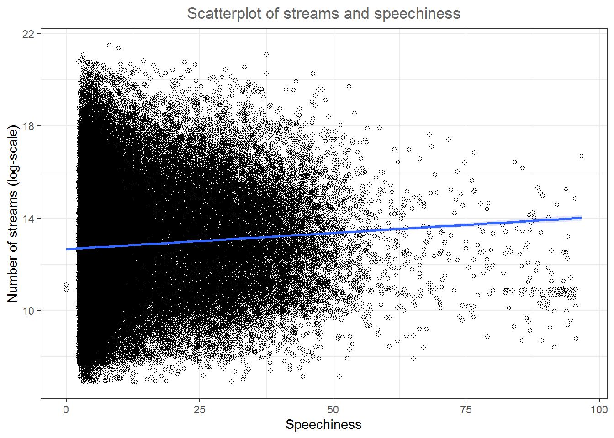
<p class="caption">(\#fig:unnamed-chunk-34)Scatter plot</p>
</div>
As you can see, there appears to be a positive relationship between advertising and sales.

##### Grouped scatter plot

It could be that customers from different store respond differently to advertising. We can visually capture such differences with a grouped scatter plot. By adding the argument ```colour = store``` to the aesthetic specification, ggplot automatically treats the two stores as distinct groups and plots accordingly. 


```r
ggplot(music_data, aes(speechiness, log_streams, colour = explicit)) +
  geom_point(shape =1) + 
  geom_smooth(method="lm", alpha = 0.1) + 
  labs(x = "Speechiness", y = "Number of streams (log-scale)", title = "Scatterplot of streams and speechiness by lyric type", colour="Explicit") + 
  scale_color_manual(values=c("lightblue","darkblue")) +
  theme_bw() +
  theme(plot.title = element_text(hjust = 0.5,color = "#666666")) 
```

<div class="figure" style="text-align: center">

<p class="caption">(\#fig:unnamed-chunk-35)Grouped scatter plot</p>
</div>

It appears from the plot that the association between speechiness and the number of streams is stronger for songs without explicit lyrics. 

#### Line plot

Another important type of plot is the line plot used if, for example, you have a variable that changes over time and you want to plot how it develops over time. To demonstrate this we will investigate a data set that show the development of the number of streams of the Top200 songs on a popular music streaming service for different region. Let's investigate the data first and bring all variables to the correct format. 


```r
music_data_ctry <- read.table("https://raw.githubusercontent.com/IMSMWU/Teaching/master/MRDA2017/streaming_charts_ctry.csv", 
                        sep = ",", 
                        header = TRUE) |>
  mutate(week = as.Date(week),
         region = as.factor(region))
head(music_data_ctry)
```

<div data-pagedtable="false">
  <script data-pagedtable-source type="application/json">
{"columns":[{"label":["week"],"name":[1],"type":["date"],"align":["right"]},{"label":["region"],"name":[2],"type":["fct"],"align":["left"]},{"label":["streams"],"name":[3],"type":["int"],"align":["right"]}],"data":[{"1":"2017-01-01","2":"ar","3":"45390029"},{"1":"2017-01-01","2":"at","3":"5111149"},{"1":"2017-01-01","2":"au","3":"46201117"},{"1":"2017-01-01","2":"be","3":"8082253"},{"1":"2017-01-01","2":"bg","3":"86293"},{"1":"2017-01-01","2":"bo","3":"1055670"}],"options":{"columns":{"min":{},"max":[10]},"rows":{"min":[10],"max":[10]},"pages":{}}}
  </script>
</div>

In a first step, let's investigate the development for Austria, by filtering the data to region 'at'. 


```r
music_data_at <- filter(music_data_ctry, region == 'at')
```

Given the correct ```aes()``` and geom specification ggplot constructs the correct plot for us. In order to make large numbers more readable we use the `label_comma` function from the `scales` package in the `scale_y_continuous` layer. 


```r
ggplot(music_data_at, aes(x = week, y = streams)) + 
  geom_line() + 
  labs(x = "", y = "Total streams in Austria", title = "Weekly number of streams in Austria") +
  theme_bw() +
  scale_y_continuous(labels = scales::label_comma()) +
  theme(plot.title = element_text(hjust = 0.5,color = "#666666")) 
```

<div class="figure" style="text-align: center">
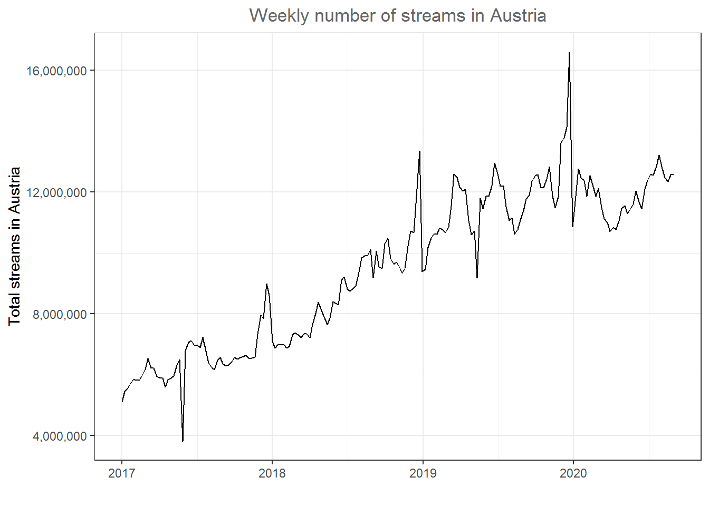
<p class="caption">(\#fig:unnamed-chunk-38)Line plot</p>
</div>
There appears to be a positive trend in the market. Now let's compare Austria to other countries. Note that the ```%in%``` operator checks for us if any of the region names specified in the vector are included in the region column. 


```r
music_data_at_compare <- filter(music_data_ctry, region %in% c('at','de','ch','se','dk','nl'))
```

We can now include the other specified countries in the plot by using the 'color' argument. 


```r
ggplot(music_data_at_compare, aes(x = week, y = streams, color = region)) + 
  geom_line() + 
  labs(x = "Week", y = "Total streams", title = "Weekly number of streams by country") +
  theme_bw() +
  theme(plot.title = element_text(hjust = 0.5,color = "#666666")) +
  scale_y_continuous(labels = scales::label_comma())
```

<div class="figure" style="text-align: center">
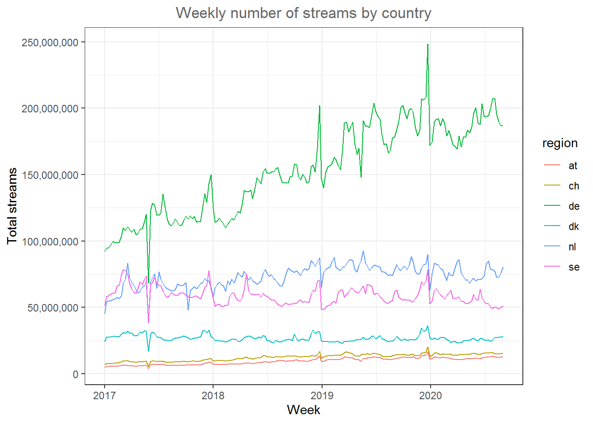
<p class="caption">(\#fig:unnamed-chunk-40)Line plot (by region)</p>
</div>
One issue in plot like this can be that the scales between countries is very different (i.e., in Germany there are many more streams because Germany is larger than the other countries). You could also use the ```facet_wrap()``` function to create one individual plot by region and specify 'scales = "free_y"' so that each individual plot has its own scale on the y-axis. We should also indicate the number of streams in millions by dividing the number of streams. 


```r
ggplot(music_data_at_compare, aes(x = week, y = streams/1000000)) + 
  geom_line() + 
  facet_wrap(~region, scales = "free_y") +
  labs(x = "Week", y = "Total streams (in million)", title = "Weekly number of streams by country") +
  theme_bw() +
  theme(plot.title = element_text(hjust = 0.5,color = "#666666")) 
```

<div class="figure" style="text-align: center">
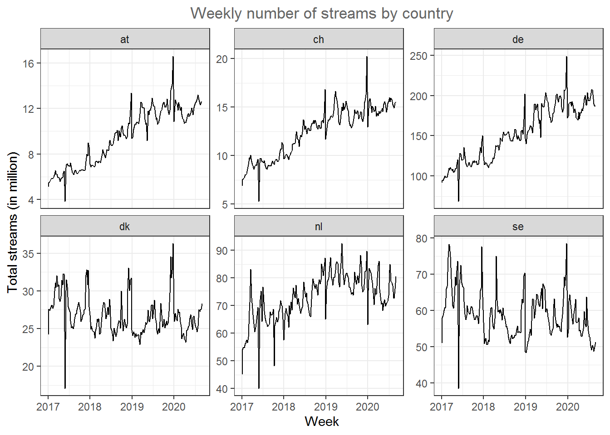
<p class="caption">(\#fig:unnamed-chunk-41)Line plot (facet wrap)</p>
</div>
Now it's easier to see that the trends are different between countries. While Sweden and Denmark appear to be saturated, the other market show strong growth. 

#### Area plots

A slightly different way to plot this data is through area plot using the ```geom_area()``` function. 


```r
ggplot(music_data_at_compare, aes(x = week, y = streams/1000000)) + 
  geom_area(fill = "steelblue", color = "steelblue", alpha = 0.5) + 
  facet_wrap(~region, scales = "free_y") +
  labs(x = "Week", y = "Total streams (in million)", title = "Weekly number of streams by country") +
  theme_bw() +
  theme(plot.title = element_text(hjust = 0.5,color = "#666666")) 
```

<div class="figure" style="text-align: center">
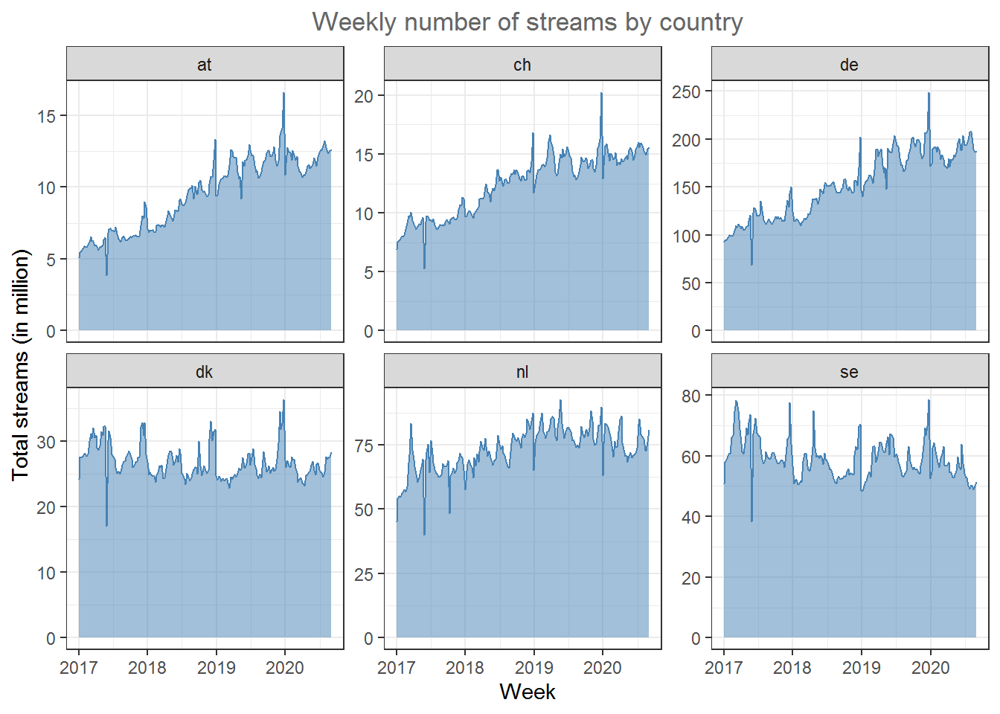
<p class="caption">(\#fig:unnamed-chunk-42)Line plot (facet wrap)</p>
</div>

If the relative share of the overall streaming volume is of interest, you could use a stacked area plot to visualize this. 


```r
ggplot(music_data_at_compare, aes(x = week, y = streams/1000000,group=region,fill=region,color=region)) + 
  geom_area(position="stack",alpha = 0.65) + 
  labs(x = "Week", y = "Total streams (in million)", title = "Weekly number of streams by country") +
  theme_bw() +
  theme(plot.title = element_text(hjust = 0.5,color = "#666666")) 
```

<div class="figure" style="text-align: center">
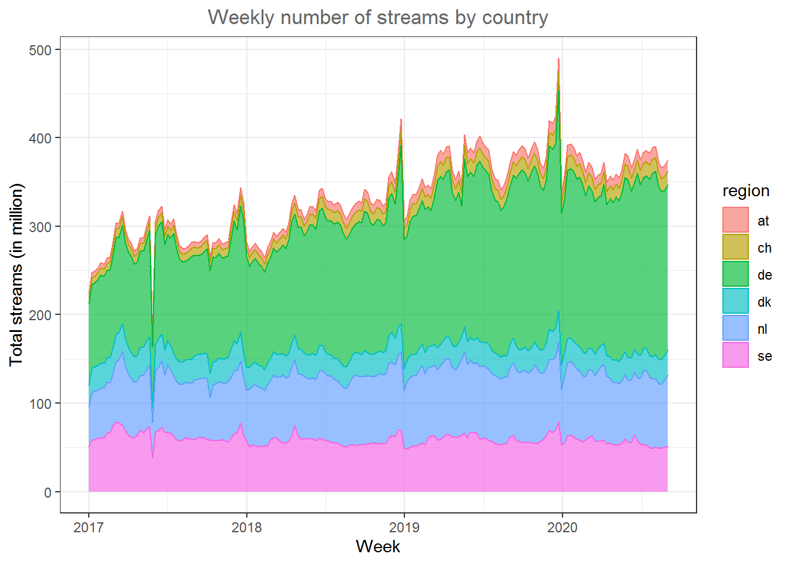
<p class="caption">(\#fig:unnamed-chunk-43)Line plot (facet wrap)</p>
</div>

In this type of plot it is easy to spot the relative size of the regions. 

In some cases it could also make sense to add a secondary y-axis, for example, if you would like to compare two regions with very different scales in one plot. Let's assume, we would like to compare Austria and Sweden and take the corresponding subset. 


```r
music_data_at_se_compare <- filter(music_data_ctry, region %in% c('at','se'))
```

In order to add the secondary y-axis, we need the data in a slightly different format where we have one column for each country. This is called the 'wide format' as opposed to the 'long format' where the data is stacked on top of each other for all regions. We can easily convert the data to the wide format by using the ```pivot_wider()``` function from the `tidyr` package. 


```r
library(tidyr)
data_wide <- pivot_wider(music_data_at_se_compare, names_from = region, values_from = streams)
data_wide
```

<div data-pagedtable="false">
  <script data-pagedtable-source type="application/json">
{"columns":[{"label":["week"],"name":[1],"type":["date"],"align":["right"]},{"label":["at"],"name":[2],"type":["int"],"align":["right"]},{"label":["se"],"name":[3],"type":["int"],"align":["right"]}],"data":[{"1":"2017-01-01","2":"5111149","3":"50954037"},{"1":"2017-01-08","2":"5457685","3":"57939416"},{"1":"2017-01-15","2":"5567194","3":"58641186"},{"1":"2017-01-22","2":"5710706","3":"59964443"},{"1":"2017-01-29","2":"5863767","3":"60842736"},{"1":"2017-02-05","2":"5818891","3":"60719187"},{"1":"2017-02-12","2":"5825375","3":"66030167"},{"1":"2017-02-19","2":"5980088","3":"66757766"},{"1":"2017-02-26","2":"6193209","3":"74623078"},{"1":"2017-03-05","2":"6530977","3":"78206599"},{"1":"2017-03-12","2":"6226134","3":"77844328"},{"1":"2017-03-19","2":"6224872","3":"74846520"},{"1":"2017-03-26","2":"5935317","3":"68795434"},{"1":"2017-04-02","2":"5901265","3":"64042942"},{"1":"2017-04-09","2":"5893873","3":"61359075"},{"1":"2017-04-16","2":"5593692","3":"60586098"},{"1":"2017-04-23","2":"5834484","3":"64093428"},{"1":"2017-04-30","2":"5892671","3":"69214046"},{"1":"2017-05-07","2":"5957329","3":"66993832"},{"1":"2017-05-14","2":"6319769","3":"70942864"},{"1":"2017-05-21","2":"6489634","3":"73616050"},{"1":"2017-05-28","2":"3822981","3":"38417005"},{"1":"2017-06-04","2":"6792423","3":"67314409"},{"1":"2017-06-11","2":"7074928","3":"68548091"},{"1":"2017-06-18","2":"7124538","3":"72516107"},{"1":"2017-06-25","2":"6964368","3":"67589714"},{"1":"2017-07-02","2":"6983387","3":"66675817"},{"1":"2017-07-09","2":"6888585","3":"66359870"},{"1":"2017-07-16","2":"7216108","3":"62463985"},{"1":"2017-07-23","2":"6774841","3":"59025668"},{"1":"2017-07-30","2":"6389690","3":"57462425"},{"1":"2017-08-06","2":"6233255","3":"58626561"},{"1":"2017-08-13","2":"6167533","3":"61417216"},{"1":"2017-08-20","2":"6487694","3":"59700505"},{"1":"2017-08-27","2":"6573919","3":"59203552"},{"1":"2017-09-03","2":"6353101","3":"58975936"},{"1":"2017-09-10","2":"6281075","3":"60682178"},{"1":"2017-09-17","2":"6322028","3":"61128401"},{"1":"2017-09-24","2":"6436003","3":"60897296"},{"1":"2017-10-01","2":"6566325","3":"59258270"},{"1":"2017-10-08","2":"6514220","3":"58066807"},{"1":"2017-10-15","2":"6574221","3":"57515067"},{"1":"2017-10-22","2":"6594969","3":"57560676"},{"1":"2017-10-29","2":"6634297","3":"58450258"},{"1":"2017-11-05","2":"6527862","3":"58620014"},{"1":"2017-11-12","2":"6552978","3":"57411055"},{"1":"2017-11-19","2":"6589219","3":"56351245"},{"1":"2017-11-26","2":"7329651","3":"60497960"},{"1":"2017-12-03","2":"7975501","3":"65448656"},{"1":"2017-12-10","2":"7840166","3":"66274099"},{"1":"2017-12-17","2":"8984392","3":"77632442"},{"1":"2017-12-24","2":"8600238","3":"63800716"},{"1":"2017-12-31","2":"7094323","3":"56793029"},{"1":"2018-01-07","2":"6870002","3":"50831657"},{"1":"2018-01-14","2":"6991513","3":"52079009"},{"1":"2018-01-21","2":"6981959","3":"52314970"},{"1":"2018-01-28","2":"7000187","3":"50642379"},{"1":"2018-02-04","2":"6878098","3":"50723636"},{"1":"2018-02-11","2":"6928693","3":"51877673"},{"1":"2018-02-18","2":"7312801","3":"51313490"},{"1":"2018-02-25","2":"7376682","3":"58164053"},{"1":"2018-03-04","2":"7311333","3":"60596534"},{"1":"2018-03-11","2":"7219855","3":"60861182"},{"1":"2018-03-18","2":"7351333","3":"56762085"},{"1":"2018-03-25","2":"7338904","3":"55578497"},{"1":"2018-04-01","2":"7210715","3":"54897186"},{"1":"2018-04-08","2":"7638906","3":"57766543"},{"1":"2018-04-15","2":"8024212","3":"62921675"},{"1":"2018-04-22","2":"8377625","3":"74953763"},{"1":"2018-04-29","2":"8100646","3":"62715074"},{"1":"2018-05-06","2":"7893350","3":"59640978"},{"1":"2018-05-13","2":"7649154","3":"60139521"},{"1":"2018-05-20","2":"7859856","3":"59290790"},{"1":"2018-05-27","2":"8397087","3":"60186580"},{"1":"2018-06-03","2":"8354560","3":"59608555"},{"1":"2018-06-10","2":"8295721","3":"57321411"},{"1":"2018-06-17","2":"9103653","3":"60784888"},{"1":"2018-06-24","2":"9207930","3":"58820359"},{"1":"2018-07-01","2":"8818919","3":"58350687"},{"1":"2018-07-08","2":"8744804","3":"57196152"},{"1":"2018-07-15","2":"8836175","3":"55481376"},{"1":"2018-07-22","2":"8912585","3":"55674376"},{"1":"2018-07-29","2":"9368540","3":"54558108"},{"1":"2018-08-05","2":"9829448","3":"52554600"},{"1":"2018-08-12","2":"9906687","3":"51444869"},{"1":"2018-08-19","2":"9898121","3":"50851455"},{"1":"2018-08-26","2":"10105085","3":"52316821"},{"1":"2018-09-02","2":"9174147","3":"53295695"},{"1":"2018-09-09","2":"10061693","3":"52217967"},{"1":"2018-09-16","2":"9549335","3":"52495246"},{"1":"2018-09-23","2":"9491921","3":"52542562"},{"1":"2018-09-30","2":"10311351","3":"53289236"},{"1":"2018-10-07","2":"10474952","3":"53167882"},{"1":"2018-10-14","2":"9817948","3":"54699351"},{"1":"2018-10-21","2":"9629039","3":"55686856"},{"1":"2018-10-28","2":"9698251","3":"53904664"},{"1":"2018-11-04","2":"9557680","3":"54293480"},{"1":"2018-11-11","2":"9340503","3":"53978440"},{"1":"2018-11-18","2":"9484414","3":"53871334"},{"1":"2018-11-25","2":"10217990","3":"60204283"},{"1":"2018-12-02","2":"10724804","3":"63167161"},{"1":"2018-12-09","2":"10672749","3":"62086922"},{"1":"2018-12-16","2":"11858217","3":"69676977"},{"1":"2018-12-23","2":"13352779","3":"70341374"},{"1":"2018-12-30","2":"9381104","3":"48623033"},{"1":"2019-01-06","2":"9454079","3":"48358663"},{"1":"2019-01-13","2":"10184422","3":"50033836"},{"1":"2019-01-20","2":"10501999","3":"51531920"},{"1":"2019-01-27","2":"10607532","3":"51622715"},{"1":"2019-02-03","2":"10611347","3":"53436670"},{"1":"2019-02-10","2":"10814685","3":"54811458"},{"1":"2019-02-17","2":"10756763","3":"53062949"},{"1":"2019-02-24","2":"10668243","3":"61231360"},{"1":"2019-03-03","2":"10838916","3":"63089488"},{"1":"2019-03-10","2":"11542267","3":"63070648"},{"1":"2019-03-17","2":"12587709","3":"57907553"},{"1":"2019-03-24","2":"12484040","3":"59622489"},{"1":"2019-03-31","2":"12147418","3":"61396086"},{"1":"2019-04-07","2":"12037677","3":"64501050"},{"1":"2019-04-14","2":"12085668","3":"64302627"},{"1":"2019-04-21","2":"11063034","3":"62063397"},{"1":"2019-04-28","2":"10606324","3":"61195740"},{"1":"2019-05-05","2":"10721762","3":"61179590"},{"1":"2019-05-12","2":"9175810","3":"64162362"},{"1":"2019-05-19","2":"11785543","3":"66182059"},{"1":"2019-05-26","2":"11450679","3":"60471102"},{"1":"2019-06-02","2":"11859801","3":"67385318"},{"1":"2019-06-09","2":"11863200","3":"66792488"},{"1":"2019-06-16","2":"12203011","3":"66015729"},{"1":"2019-06-23","2":"12944558","3":"59674605"},{"1":"2019-06-30","2":"12603219","3":"60434954"},{"1":"2019-07-07","2":"12190141","3":"60409679"},{"1":"2019-07-14","2":"12214762","3":"58192990"},{"1":"2019-07-21","2":"11517456","3":"56838735"},{"1":"2019-07-28","2":"11057405","3":"54786644"},{"1":"2019-08-04","2":"11159869","3":"53572169"},{"1":"2019-08-11","2":"10614307","3":"53102432"},{"1":"2019-08-18","2":"10764191","3":"54326334"},{"1":"2019-08-25","2":"11075215","3":"54990692"},{"1":"2019-09-01","2":"11385671","3":"61685580"},{"1":"2019-09-08","2":"11768547","3":"63201032"},{"1":"2019-09-15","2":"11891137","3":"58195884"},{"1":"2019-09-22","2":"12339671","3":"56475489"},{"1":"2019-09-29","2":"12534512","3":"55388648"},{"1":"2019-10-06","2":"12570974","3":"56213316"},{"1":"2019-10-13","2":"12130776","3":"55458272"},{"1":"2019-10-20","2":"12138057","3":"55765630"},{"1":"2019-10-27","2":"12428253","3":"54536084"},{"1":"2019-11-03","2":"12829031","3":"54128046"},{"1":"2019-11-10","2":"11863437","3":"56792297"},{"1":"2019-11-17","2":"11485691","3":"58857446"},{"1":"2019-11-24","2":"11842684","3":"63285122"},{"1":"2019-12-01","2":"13615723","3":"69302394"},{"1":"2019-12-08","2":"13784812","3":"66689184"},{"1":"2019-12-15","2":"14135110","3":"69729834"},{"1":"2019-12-22","2":"16591888","3":"78477555"},{"1":"2019-12-29","2":"10859375","3":"52613125"},{"1":"2020-01-05","2":"11684918","3":"54684965"},{"1":"2020-01-12","2":"12768413","3":"62520981"},{"1":"2020-01-19","2":"12469021","3":"64383133"},{"1":"2020-01-26","2":"12385678","3":"61578360"},{"1":"2020-02-02","2":"11860183","3":"59243997"},{"1":"2020-02-09","2":"12539941","3":"57951071"},{"1":"2020-02-16","2":"12247738","3":"56180328"},{"1":"2020-02-23","2":"11865790","3":"59095788"},{"1":"2020-03-01","2":"12117208","3":"60714300"},{"1":"2020-03-08","2":"11485139","3":"63165796"},{"1":"2020-03-15","2":"11123890","3":"56869946"},{"1":"2020-03-22","2":"11000026","3":"56613893"},{"1":"2020-03-29","2":"10695164","3":"56993066"},{"1":"2020-04-05","2":"10832377","3":"58005108"},{"1":"2020-04-12","2":"10767502","3":"54400674"},{"1":"2020-04-19","2":"11044092","3":"54567926"},{"1":"2020-04-26","2":"11458096","3":"52955805"},{"1":"2020-05-03","2":"11557207","3":"52797787"},{"1":"2020-05-10","2":"11290500","3":"53669537"},{"1":"2020-05-17","2":"11420307","3":"54971848"},{"1":"2020-05-24","2":"11594740","3":"59703269"},{"1":"2020-05-31","2":"12031735","3":"56234708"},{"1":"2020-06-07","2":"11678290","3":"55459464"},{"1":"2020-06-14","2":"11444403","3":"63778995"},{"1":"2020-06-21","2":"12108934","3":"57346797"},{"1":"2020-06-28","2":"12381525","3":"54303152"},{"1":"2020-07-05","2":"12581848","3":"52759080"},{"1":"2020-07-12","2":"12561026","3":"52722096"},{"1":"2020-07-19","2":"12843394","3":"50403416"},{"1":"2020-07-26","2":"13207944","3":"49056566"},{"1":"2020-08-02","2":"12761873","3":"50404184"},{"1":"2020-08-09","2":"12465932","3":"49776530"},{"1":"2020-08-16","2":"12337469","3":"48766818"},{"1":"2020-08-23","2":"12567150","3":"50032662"},{"1":"2020-08-30","2":"12571707","3":"51258093"}],"options":{"columns":{"min":{},"max":[10]},"rows":{"min":[10],"max":[10]},"pages":{}}}
  </script>
</div>

As another intermediate step, we need to compute the ratio between the two variables we would like to plot on the two axis, since the scale of the second axis is determined based on the ratio with the other variable. 


```r
ratio <- mean(data_wide$at/1000000)/mean(data_wide$se/1000000)
```

Now we can create the plot with the secondary y-axis as follows: 


```r
ggplot(data_wide) + 
    geom_area(aes(x = week, y = at/1000000, colour = "Austria", fill = "Austria"), alpha = 0.5) + 
    geom_area(aes(x = week, y = (se/1000000)*ratio, colour = "Sweden", fill = "Sweden"), alpha = 0.5) + 
    scale_y_continuous(sec.axis = sec_axis(~./ratio, name = "Total streams SE (in million)")) +
    scale_fill_manual(values = c("#999999", "#E69F00")) + 
    scale_colour_manual(values = c("#999999", "#E69F00"),guide=FALSE) + 
    theme_minimal() +
    labs(x = "Week", y = "Total streams AT (in million)", title = "Weekly number of streams by country") +
    theme(plot.title = element_text(hjust = 0.5,color = "#666666"),
          legend.title = element_blank(),
          legend.position = "bottom"
          ) 
```

<div class="figure" style="text-align: center">

<p class="caption">(\#fig:unnamed-chunk-47)Secondary y-axis</p>
</div>

In this plot it is easy to see the difference in trends between the countries.  

### Saving plots

To save the last displayed plot, simply use the function ```ggsave()```, and it will save the plot to your working directory. Use the arguments ```height```and ```width``` to specify the size of the file. You may also choose the file format by adjusting the ending of the file name. E.g., ```file_name.jpg``` will create a file in JPG-format, whereas ```file_name.png``` saves the file in PNG-format, etc.. 


```r
ggsave("test_plot.jpg", height = 5, width = 8.5)
```

### ggplot extensions

<br>
<div align="center">
<iframe width="560" height="315" src="https://www.youtube.com/embed/X8zGovLeCrk" frameborder="0" allowfullscreen></iframe>
</div>
<br>

As the ggplot2 package became more and more popular over the past years, more and more extensions have been developed by users that can be used for specific purposes that are not yet covered by the standard functionality of ggplot2. You can find a list of the extensions <a href="https://exts.ggplot2.tidyverse.org/gallery/" target="_blank">here</a>. Below, you can find some example for the additional options.  

#### Results of statistical tests (ggstatsplot)

You may use the <a href="https://indrajeetpatil.github.io/ggstatsplot/index.html" target="_blank">ggstatplot</a> package to augment your plots with the results from statistical tests, such as an ANOVA. You can find a presentation about the capabilities of this package <a href="https://indrajeetpatil.github.io/ggstatsplot_slides/slides/ggstatsplot_presentation.html#1" target="_blank">here</a>. The boxplot below shows an example. 


```r
library(ggstatsplot)
music_data_subs <- filter(music_data, genre %in% c("HipHop/Rap", "Soundtrack","Pop","Rock"))
ggbetweenstats(
   data = music_data_subs,
   title = "Number of streams by genre", # title for the plot
   plot.type = "box",
   x = genre, # 4 groups
   y = log_streams,
   type = "p", # default
   messages = FALSE,
   bf.message = FALSE,
   pairwise.comparisons = TRUE # display results from pairwise comparisons
 )
```

<div class="figure" style="text-align: center">
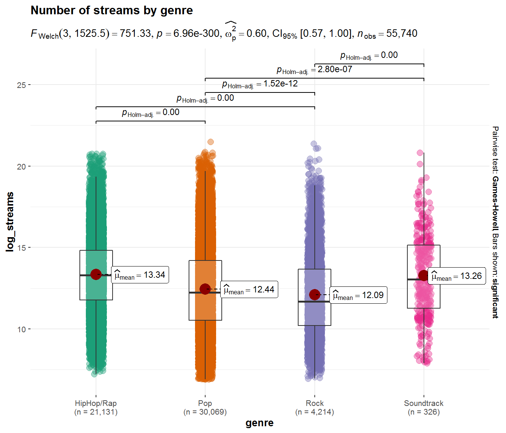
<p class="caption">(\#fig:unnamed-chunk-49)Boxplot using ggstatsplot package</p>
</div>

##### Combination of plots (ggExtra)

Using the ```ggExtra()``` package, you may combine two type of plots. For example, the following plot combines a scatterplot with a histogram:


```r
library(ggExtra)
p <- ggplot(music_data, aes(x = speechiness, y = log_streams)) + 
  geom_point() +
    labs(x = "Speechiness", y = "Number of streams (log-scale)", title = "Scatterplot & histograms of streams and speechiness") + 
  theme_bw() +
  theme(plot.title = element_text(hjust = 0.5,color = "#666666")) 
ggExtra::ggMarginal(p, type = "histogram")
```

<div class="figure" style="text-align: center">
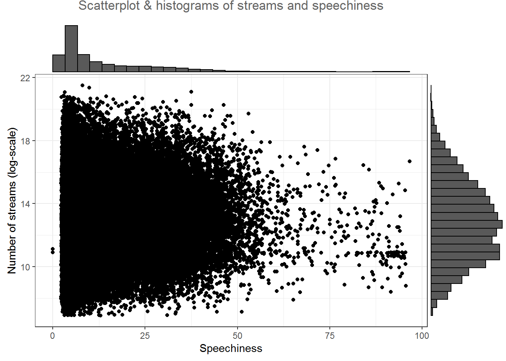
<p class="caption">(\#fig:unnamed-chunk-50)Scatter plot with histogram</p>
</div>

In this case, the ```type = "histogram"``` argument specifies that we would like to plot a histogram. However, you could also opt for ```type = "boxplot"``` or ```type = "density"``` to use a boxplot or density plot instead.

#### Appendix 

##### Covariation plots

To visualize the co-variation between categorical variables, you’ll need to count the number of observations for each combination stored in the frequency table. Say, we wanted to investigate the association between the popularity of a song and the level of 'speechiness'. For this exercise, let's assume we have both variables measured as categorical (factor) variables. We can use the `quantcut()` function to create categorical variables based on the continuous variables. All we need to do is tell the function how many categories we would like to obtain and it will divide the data based on the percentiles equally.  


```r
library(gtools)
music_data$streams_cat <- as.numeric(quantcut(music_data$streams, 5, na.rm=TRUE))
music_data$speech_cat <- as.numeric(quantcut(music_data$speechiness, 3, na.rm=TRUE))

music_data$streams_cat <- factor(music_data$streams_cat, levels = 1:5, labels = c("low", "low-med", "medium", "med-high", "high")) #convert to factor
music_data$speech_cat <- factor(music_data$speech_cat, levels = 1:3, labels = c("low", "medium", "high")) #convert to factor
```

Now we have multiple ways to visualize a relationship between the two variables with ggplot. One option would be to use a variation of the scatterplot which counts how many points overlap at any given point and increases the dot size accordingly. This can be achieved with ```geom_count()``` as the example below shows where the `stat(prop)` argument assures that we get relative frequencies and with the `group` argument we tell R to compute the relative frequencies by speechiness.


```r
ggplot(data = music_data) + 
  geom_count(aes(x = speech_cat, y = streams_cat, size = stat(prop), group = speech_cat))  + 
  ylab("Popularity") + 
  xlab("Speechiness") + 
  labs(size = "Proportion") +
  theme_bw()
```

<div class="figure" style="text-align: center">
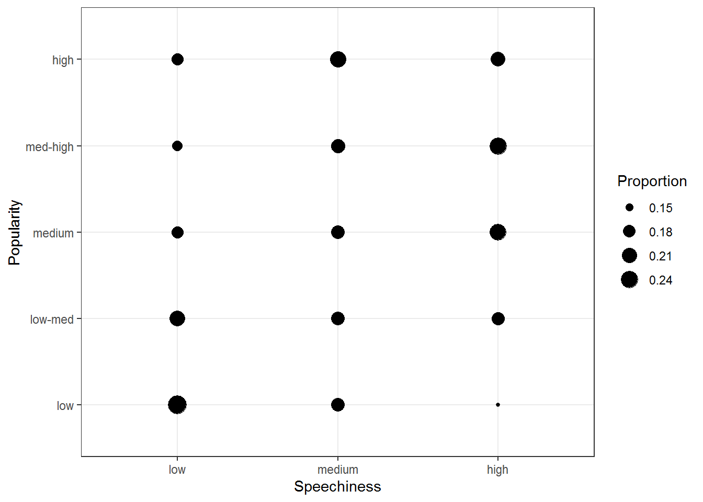
<p class="caption">(\#fig:unnamed-chunk-52)Covariation between categorical data (1)</p>
</div>
The plot shows that there appears to be a positive association between the popularity of a song and its level of speechiness. 

Another option would be to use a tile plot that changes the color of the tile based on the frequency of the combination of factors. To achieve this, we first have to create a dataframe that contains the relative frequencies of all combinations of factors. Then we can take this dataframe and pass it to ```geom_tile()```, while specifying that the fill of each tile should be dependent on the observed frequency of the factor combination, which is done by specifying the fill in the ```aes()``` function.  


```r
table_plot_rel <- prop.table(table(music_data[,c("speech_cat", "streams_cat")]),1)
table_plot_rel <- as.data.frame(table_plot_rel)

ggplot(table_plot_rel, aes(x = speech_cat, y = streams_cat)) + 
  geom_tile(aes(fill = Freq)) + 
  ylab("Populartiy") + 
  xlab("Speechiness") + 
  theme_bw()
```

<div class="figure" style="text-align: center">
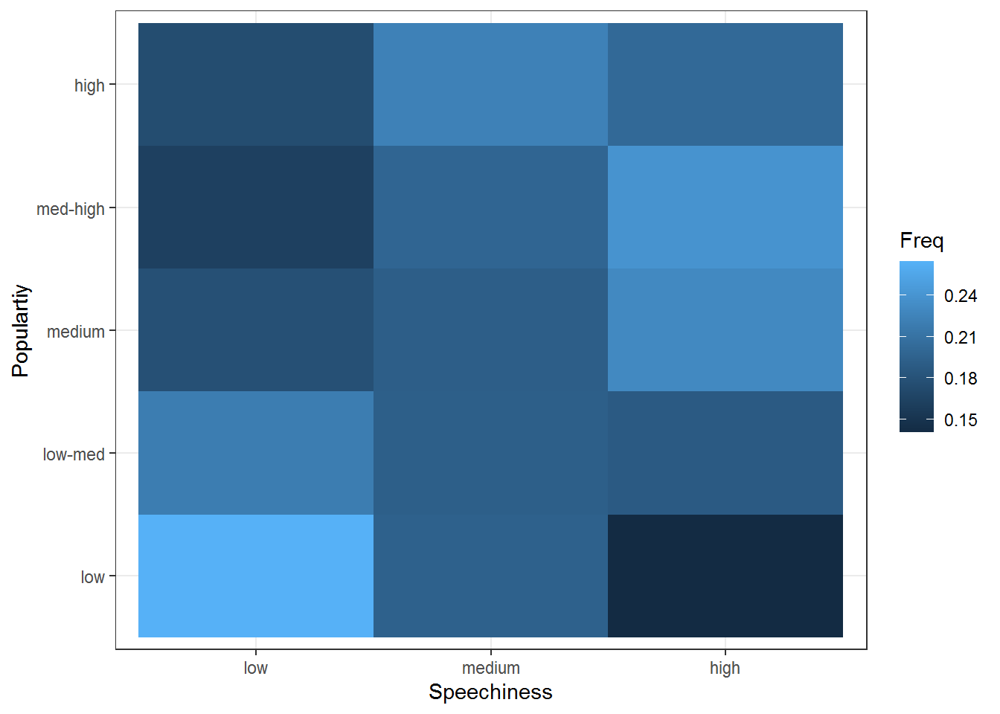
<p class="caption">(\#fig:unnamed-chunk-53)Covariation between categorical data (2)</p>
</div>

##### Location data (ggmap)

Now that we have covered the most important plots, we can look at what other type of data you may come across. One type of data that is increasingly available is the geo-location of customers and users (e.g., from app usage data). The following data set contains the app usage data of Shazam users from Germany. The data contains the latitude and longitude information where a music track was "shazamed". 


```r
library(ggmap)
library(dplyr)
geo_data <- read.table("https://raw.githubusercontent.com/IMSMWU/Teaching/master/MRDA2017/geo_data.dat", 
                       sep = "\t", 
                       header = TRUE)
head(geo_data)
```

<div data-pagedtable="false">
  <script data-pagedtable-source type="application/json">
{"columns":[{"label":["lat"],"name":[1],"type":["dbl"],"align":["right"]},{"label":["lon"],"name":[2],"type":["dbl"],"align":["right"]},{"label":["latlon"],"name":[3],"type":["chr"],"align":["left"]}],"data":[{"1":"50.7","2":"7.7","3":"50.7_7.7"},{"1":"51.0","2":"6.3","3":"51_6.3"},{"1":"52.2","2":"10.5","3":"52.2_10.5"},{"1":"50.9","2":"11.0","3":"50.9_11"},{"1":"49.9","2":"8.2","3":"49.9_8.2"},{"1":"53.3","2":"13.4","3":"53.3_13.4"}],"options":{"columns":{"min":{},"max":[10]},"rows":{"min":[10],"max":[10]},"pages":{}}}
  </script>
</div>

There is a package called "ggmap", which is an augmentation for the ggplot packages. It lets you load maps from different web services (e.g., Google maps) and maps the user location within the coordination system of ggplot. With this information, you can create interesting plots like heat maps. We won't go into detail here but you may go through the following code on your own if you are interested. However, please note that you need to register an API with Google in order to make use of this package. 


```r
#register_google(key = "your_api_key")

# Download the base map
de_map_g_str <- get_map(location=c(10.018343,51.133481), zoom=6, scale=2) # results in below map (wohoo!)

# Draw the heat map
ggmap(de_map_g_str, extent = "device") + 
  geom_density2d(data = geo_data, aes(x = lon, y = lat), size = 0.3) + 
  stat_density2d(data = geo_data, aes(x = lon, y = lat, fill = ..level.., alpha = ..level..), 
                 size = 0.01, bins = 16, geom = "polygon") + 
  scale_fill_gradient(low = "green", high = "red") + 
  scale_alpha(range = c(0, 0.3), guide = FALSE)
```


## Learning check {-}

**(LC4.1) For which data types is it meaningful to compute the mean?**

- [ ] Nominal
- [ ] Ordinal
- [x] Interval
- [x] Ratio

**(LC4.2) How can you compute the standardized variate of a variable X?**

- [x] $Z=\frac{X_i-\bar{X}}{s}$
- [ ] $Z=\frac{\bar{X}+X_i}{s}$
- [ ] $Z=\frac{s}{\bar{X}+X_i}$
- [ ] $Z=s*({\bar{X}+X_i)}$
- [ ] None of the above 	

**You wish to analyze the following data frame 'df' containing information about cars**

<div data-pagedtable="false">
  <script data-pagedtable-source type="application/json">
{"columns":[{"label":["mpg"],"name":[1],"type":["dbl"],"align":["right"]},{"label":["cyl"],"name":[2],"type":["dbl"],"align":["right"]},{"label":["disp"],"name":[3],"type":["dbl"],"align":["right"]},{"label":["hp"],"name":[4],"type":["dbl"],"align":["right"]},{"label":["drat"],"name":[5],"type":["dbl"],"align":["right"]},{"label":["wt"],"name":[6],"type":["dbl"],"align":["right"]},{"label":["qsec"],"name":[7],"type":["dbl"],"align":["right"]},{"label":["vs"],"name":[8],"type":["dbl"],"align":["right"]},{"label":["am"],"name":[9],"type":["dbl"],"align":["right"]},{"label":["gear"],"name":[10],"type":["dbl"],"align":["right"]},{"label":["carb"],"name":[11],"type":["dbl"],"align":["right"]}],"data":[{"1":"21.0","2":"6","3":"160","4":"110","5":"3.90","6":"2.620","7":"16.46","8":"0","9":"1","10":"4","11":"4"},{"1":"21.0","2":"6","3":"160","4":"110","5":"3.90","6":"2.875","7":"17.02","8":"0","9":"1","10":"4","11":"4"},{"1":"22.8","2":"4","3":"108","4":"93","5":"3.85","6":"2.320","7":"18.61","8":"1","9":"1","10":"4","11":"1"},{"1":"21.4","2":"6","3":"258","4":"110","5":"3.08","6":"3.215","7":"19.44","8":"1","9":"0","10":"3","11":"1"},{"1":"18.7","2":"8","3":"360","4":"175","5":"3.15","6":"3.440","7":"17.02","8":"0","9":"0","10":"3","11":"2"},{"1":"18.1","2":"6","3":"225","4":"105","5":"2.76","6":"3.460","7":"20.22","8":"1","9":"0","10":"3","11":"1"}],"options":{"columns":{"min":{},"max":[10]},"rows":{"min":[10],"max":[10]},"pages":{}}}
  </script>
</div>

**(LC4.3) How could you add a new variable containing the z-scores of the variable 'mpg' in R?**

- [ ] `df$mpg_std <- zscore(df$mpg)`
- [ ] `df$mpg_std <- stdv(df$mpg)`
- [ ] `df$mpg_std <- std.scale(df$mpg)`
- [x] `df$mpg_std <- scale(df$mpg)`
- [ ] None of the above 	

**(LC4.4) How could you produce the below output?**

<div data-pagedtable="false">
  <script data-pagedtable-source type="application/json">
{"columns":[{"label":["vars"],"name":[1],"type":["int"],"align":["right"]},{"label":["n"],"name":[2],"type":["dbl"],"align":["right"]},{"label":["mean"],"name":[3],"type":["dbl"],"align":["right"]},{"label":["sd"],"name":[4],"type":["dbl"],"align":["right"]},{"label":["median"],"name":[5],"type":["dbl"],"align":["right"]},{"label":["trimmed"],"name":[6],"type":["dbl"],"align":["right"]},{"label":["mad"],"name":[7],"type":["dbl"],"align":["right"]},{"label":["min"],"name":[8],"type":["dbl"],"align":["right"]},{"label":["max"],"name":[9],"type":["dbl"],"align":["right"]},{"label":["range"],"name":[10],"type":["dbl"],"align":["right"]},{"label":["skew"],"name":[11],"type":["dbl"],"align":["right"]},{"label":["kurtosis"],"name":[12],"type":["dbl"],"align":["right"]},{"label":["se"],"name":[13],"type":["dbl"],"align":["right"]}],"data":[{"1":"1","2":"32","3":"146.68750","4":"68.562868","5":"123.00","6":"141.19231","7":"77.095200","8":"52.0","9":"335.0","10":"283.0","11":"0.7260237","12":"-0.1355511","13":"12.1203173"},{"1":"2","2":"32","3":"20.09062","4":"6.026948","5":"19.20","6":"19.69615","7":"5.411490","8":"10.4","9":"33.9","10":"23.5","11":"0.6106550","12":"-0.3727660","13":"1.0654240"},{"1":"3","2":"32","3":"17.84875","4":"1.786943","5":"17.71","6":"17.82769","7":"1.415883","8":"14.5","9":"22.9","10":"8.4","11":"0.3690453","12":"0.3351142","13":"0.3158899"}],"options":{"columns":{"min":{},"max":[10]},"rows":{"min":[10],"max":[10]},"pages":{}}}
  </script>
</div>

- [x] `describe(select(mtcars, hp, mpg, qsec))`
- [ ] `summary(select(mtcars, hp, mpg, qsec))`
- [ ] `table(select(mtcars, hp, mpg, qsec))`
- [ ] `str(select(mtcars, hp, mpg, qsec))`
- [ ] None of the above 	

**(LC4.5) The last column "carb" indicates the number of carburetors each model has. By using a function we got to know the number of car models that have a certain number carburetors. Which function helped us to obtain this information?** 


```
## 
##  1  2  3  4  6  8 
##  7 10  3 10  1  1
```

- [ ] `describe(mtcars$carb)`
- [x] `table(mtcars$carb)`
- [ ] `str(mtcars$carb)`
- [ ] `prop.table(mtcars$carb)`
- [ ] None of the above 	

**(LC4.6) What type of data can be meaningfully depicted in a scatter plot?**

- [ ] Two categorical variables
- [ ] One categorical and one continuous variable
- [x] Two continuous variables
- [ ] One continuous variable
- [ ] None of the above 	

**(LC4.7) Which statement about the graph below is true?** 

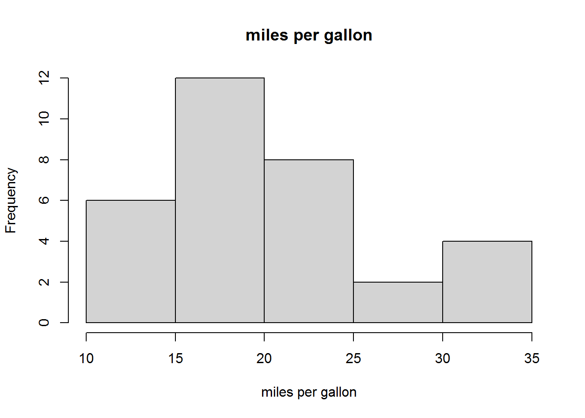

- [ ] This is a bar chart
- [x] This is a histogram
- [x] It shows the frequency distribution of a continuous variable
- [ ] It shows the frequency distribution of a categorical variable
- [ ] None of the above 	

**(LC4.8) Which statement about the graph below is true?** 

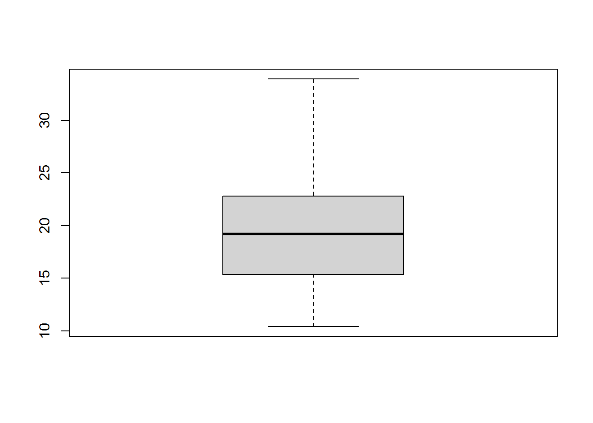

- [ ] This is a bar chart
- [x] 50% of observations are contained in the gray area
- [ ] The horizontal black line indicates the mean
- [x] This is a boxplot
- [ ] None of the above 	

**(LC4.9) Which function can help you to save a graph made with `ggplot()`?** 

- [x] `ggsave()`
- [ ] `write.plot()`
- [ ] `save.plot()`
- [ ] `export.plot()`

**(LC4.10) For a variable that follows a normal distribution, within how many standard deviations of the mean are 95% of values?**

- [ ] 1.645
- [x] 1.960
- [ ] 2.580
- [ ] 3.210
- [ ] None of the above 	

## References {-}

* Field, A., Miles J., & Field, Z. (2012). Discovering Statistics Using R. Sage Publications.
* Chang, W. (2020). R Graphics Cookbook, 2nd edition (https://r-graphics.org/)
* Grolemund, G. & Wickham, H. (2020). R for Data Science (https://r4ds.had.co.nz/)


