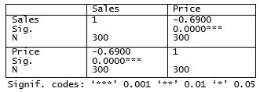

---
output:
  html_document:
    toc: yes
  pdf_document:
    toc: yes
  html_notebook: default
---
```{r echo=FALSE, eval=TRUE, message=FALSE, warning=FALSE, purl=FALSE}
library(knitr)
options(scipen = 999)
#This code automatically tidies code so that it does not reach over the page
opts_chunk$set(tidy.opts=list(width.cutoff=50),tidy=TRUE, rownames.print = FALSE, rows.print = 10)
opts_chunk$set(cache=T)
```

```{r message=FALSE, warning=FALSE, echo=F, eval=TRUE,paged.print = FALSE}
options(digits = 8)
```

# Supervised learning


## Linear regression

::: {.infobox .download data-latex="{download}"}
[You can download the corresponding R-Code here](./Code/10-regression.R)
:::

### Correlation

<br>
<div align="center">
<iframe width="560" height="315" src="https://www.youtube.com/embed/HeIW9_ijHF4" frameborder="0" allowfullscreen></iframe>
</div>
<br>

Before we start with regression analysis, we will review the basic concept of correlation first. Correlation helps us to determine the degree to which the variation in one variable, X, is related to the variation in another variable, Y. 

#### Correlation coefficient

The correlation coefficient summarizes the strength of the linear relationship between two metric (interval or ratio scaled) variables. Let's consider a simple example. Say you conduct a survey to investigate the relationship between the attitude towards a city and the duration of residency. The "Attitude" variable can take values between 1 (very unfavorable) and 12 (very favorable), and the "duration of residency" is measured in years. Let's further assume for this example that the attitude measurement represents an interval scale (although it is usually not realistic to assume that the scale points on an itemized rating scale have the same distance). To keep it simple, let's further assume that you only asked 12 people. We can create a short data set like this:    

```{r message=FALSE, warning=FALSE, echo=TRUE, eval=TRUE,paged.print = FALSE}
library(psych)
attitude <- c(6,9,8,3,10,4,5,2,11,9,10,2)
duration <- c(10,12,12,4,12,6,8,2,18,9,17,2)
att_data <- data.frame(attitude, duration)
att_data <- att_data[order(-attitude), ]
att_data$respodentID <- c(1:12)
str(att_data)
psych::describe(att_data[, c("attitude","duration")])
att_data
```

Let's look at the data first. The following graph shows the individual data points for the "duration of residency"" variable, where the y-axis shows the duration of residency in years and the x-axis shows the respondent ID. The blue horizontal line represents the mean of the variable (`r round(mean(att_data$duration),2)`) and the vertical lines show the distance of the individual data points from the mean.

```{r message=FALSE, warning=FALSE, echo=FALSE, eval=TRUE, fig.align="center", fig.cap = "Scores for duration of residency variable"}
library(ggplot2)
h <- round(mean(att_data$duration), 2)
ggplot(att_data, aes(x = respodentID, y = duration)) + 
  geom_point(size = 3, color = "deepskyblue4") + 
  scale_x_continuous(breaks = 1:12) + 
  geom_hline(data = att_data, aes(yintercept = mean(duration)), color ="deepskyblue4") +
  labs(x = "Observations",y = "Duration of residency", size = 11) +
  coord_cartesian(ylim = c(0, 18)) +
  geom_segment(aes(x = respodentID,y = duration, xend = respodentID, 
                   yend = mean(duration)), color = "deepskyblue4", size = 1) + 
  theme(axis.title = element_text(size = 16),
        axis.text  = element_text(size=16),
        strip.text.x = element_text(size = 16),
        legend.position="none") + 
  theme_bw()
```

You can see that there are some respondents that have been living in the city longer than average and some respondents that have been living in the city shorter than average. Let's do the same for the second variable ("Attitude"). Again, the y-axis shows the observed scores for this variable and the x-axis shows the respondent ID.  

```{r message=FALSE, warning=FALSE, echo=FALSE, eval=TRUE, fig.align="center", fig.cap = "Scores for attitude variable"}
ggplot(att_data, aes(x = respodentID, y = attitude)) + 
  geom_point(size = 3, color = "#f9756d") + 
  scale_x_continuous(breaks = 1:12) + 
  geom_hline(data = att_data, aes(yintercept = mean(attitude)), color = "#f9756d") +
  labs(x = "Observations",y = "Attitude", size = 11) +
  coord_cartesian(ylim = c(0,18)) +
  geom_segment(aes(x = respodentID, y = attitude, xend = respodentID, 
                   yend = mean(attitude)), color = "#f9756d", size = 1) + 
  theme_bw()
```

Again, we can see that some respondents have an above average attitude towards the city (more favorable) and some respondents have a below average attitude towards the city. Let's combine both variables in one graph now to see if there is some co-movement: 

```{r message=FALSE, warning=FALSE, echo=FALSE, eval=TRUE,fig.align="center", fig.cap = "Scores for attitude and duration of residency variables"}
ggplot(att_data) + 
  geom_point(size = 3, aes(respodentID, attitude), color = "#f9756d") +
  geom_point(size = 3, aes(respodentID, duration), color = "deepskyblue4")  + 
  scale_x_continuous(breaks = 1:12) + 
  geom_hline(data = att_data, aes(yintercept = mean(duration)), color = "deepskyblue4") +
  geom_hline(data = att_data, aes(yintercept = mean(attitude)), color = "#f9756d") +
  labs(x = "Observations", y = "Duration/Attitude", size = 11) +
  coord_cartesian(ylim = c(0, 18)) +
  scale_color_manual(values = c("#f9756d", "deepskyblue4")) +
  theme_bw()
```

We can see that there is indeed some co-movement here. The variables <b>covary</b> because respondents who have an above (below) average attitude towards the city also appear to have been living in the city for an above (below) average amount of time and vice versa. Correlation helps us to quantify this relationship. Before you proceed to compute the correlation coefficient, you should first look at the data. We usually use a scatterplot to visualize the relationship between two metric variables:

```{r message=FALSE, warning=FALSE, echo=FALSE, eval=TRUE, fig.align="center", fig.cap = "Scatterplot for durationand attitute variables"}
ggplot(att_data) + 
  geom_point(size = 3, aes(duration, attitude)) + 
  labs(x = "Duration",y = "Attitude", size = 11) +
  theme_bw()
```

How can we compute the correlation coefficient? Remember that the variance measures the average deviation from the mean of a variable:

\begin{equation} 
\begin{split}
s_x^2&=\frac{\sum_{i=1}^{N} (X_i-\overline{X})^2}{N-1} \\
     &= \frac{\sum_{i=1}^{N} (X_i-\overline{X})*(X_i-\overline{X})}{N-1}
\end{split}
(\#eq:variance)
\end{equation} 

When we consider two variables, we multiply the deviation for one variable by the respective deviation for the second variable: 

<p style="text-align:center;">
$(X_i-\overline{X})*(Y_i-\overline{Y})$
</p>

This is called the cross-product deviation. Then we sum the cross-product deviations:

<p style="text-align:center;">
$\sum_{i=1}^{N}(X_i-\overline{X})*(Y_i-\overline{Y})$
</p>

... and compute the average of the sum of all cross-product deviations to get the <b>covariance</b>:

\begin{equation} 
Cov(x, y) =\frac{\sum_{i=1}^{N}(X_i-\overline{X})*(Y_i-\overline{Y})}{N-1}
(\#eq:covariance)
\end{equation} 

You can easily compute the covariance manually as follows

```{r message=FALSE, warning=FALSE, echo=TRUE, eval=TRUE}
x <- att_data$duration
x_bar <- mean(att_data$duration)
y <- att_data$attitude
y_bar <- mean(att_data$attitude)
N <- nrow(att_data)
cov <- (sum((x - x_bar)*(y - y_bar))) / (N - 1)
cov
```

Or you simply use the built-in ```cov()``` function:

```{r message=FALSE, warning=FALSE, echo=TRUE, eval=TRUE}
cov(att_data$duration, att_data$attitude)          # apply the cov function 
```

A positive covariance indicates that as one variable deviates from the mean, the other variable deviates in the same direction. A negative covariance indicates that as one variable deviates from the mean (e.g., increases), the other variable deviates in the opposite direction (e.g., decreases).

However, the size of the covariance depends on the scale of measurement. Larger scale units will lead to larger covariance. To overcome the problem of dependence on measurement scale, we need to convert the covariance to a standard set of units through standardization by dividing the covariance by the standard deviation (similar to how we compute z-scores).

With two variables, there are two standard deviations. We simply multiply the two standard deviations. We then divide the covariance by the product of the two standard deviations to get the standardized covariance, which is known as a correlation coefficient r:

\begin{equation} 
r=\frac{Cov_{xy}}{s_x*s_y}
(\#eq:corcoeff)
\end{equation} 

This is known as the product moment correlation (r) and it is straight-forward to compute:

```{r message=FALSE, warning=FALSE, echo=TRUE, eval=TRUE}
x_sd <- sd(att_data$duration)
y_sd <- sd(att_data$attitude)
r <- cov/(x_sd*y_sd)
r
```

Or you could just use the ```cor()``` function:

```{r message=FALSE, warning=FALSE, echo=TRUE, eval=TRUE}
cor(att_data[, c("attitude", "duration")], method = "pearson", use = "complete")
```

The properties of the correlation coefficient ('r') are:

* ranges from -1 to + 1
* +1 indicates perfect linear relationship
* -1 indicates perfect negative relationship
* 0 indicates no linear relationship
* ± .1 represents small effect
* ± .3 represents medium effect
* ± .5 represents large effect

#### Significance testing

How can we determine if our two variables are significantly related? To test this, we denote the population moment correlation *&rho;*. Then we test the null of no relationship between variables:

$$H_0:\rho=0$$
$$H_1:\rho\ne0$$

The test statistic is: 

\begin{equation} 
t=\frac{r*\sqrt{N-2}}{\sqrt{1-r^2}}
(\#eq:cortest)
\end{equation} 

It has a t distribution with n - 2 degrees of freedom. Then, we follow the usual procedure of calculating the test statistic and comparing the test statistic to the critical value of the underlying probability distribution. If the calculated test statistic is larger than the critical value, the null hypothesis of no relationship between X and Y is rejected. 

```{r message=FALSE, warning=FALSE, echo=TRUE, eval=TRUE}
t_calc <- r*sqrt(N - 2)/sqrt(1 - r^2) #calculated test statistic
t_calc
df <- (N - 2) #degrees of freedom
t_crit <- qt(0.975, df) #critical value
t_crit
pt(q = t_calc, df = df, lower.tail = F) * 2 #p-value 
```

Or you can simply use the ```cor.test()``` function, which also produces the 95% confidence interval:

```{r message=FALSE, warning=FALSE, echo=TRUE, eval=TRUE}
cor.test(att_data$attitude, att_data$duration, alternative = "two.sided", method = "pearson", conf.level = 0.95)
```

To determine the linear relationship between variables, the data only needs to be measured using interval scales. If you want to test the significance of the association, the sampling distribution needs to be normally distributed (we usually assume this when our data are normally distributed or when N is large). If parametric assumptions are violated, you should use non-parametric tests:

* Spearman's correlation coefficient: requires ordinal data and ranks the data before applying Pearson's equation.
* Kendall's tau: use when N is small or the number of tied ranks is large.

```{r message=FALSE, warning=FALSE, echo=TRUE, eval=TRUE}
cor.test(att_data$attitude, att_data$duration, alternative = "two.sided", method = "spearman", conf.level = 0.95)
cor.test(att_data$attitude, att_data$duration, alternative = "two.sided", method = "kendall", conf.level = 0.95)
```

Report the results:

A Pearson product-moment correlation coefficient was computed to assess the relationship between the duration of residence in a city and the attitude toward the city. There was a positive correlation between the two variables, r = 0.936, n = 12, p < 0.05. A scatterplot summarizes the results (Figure XY).

**A note on the interpretation of correlation coefficients:**

As we have already seen in chapter 1, correlation coefficients give no indication of the direction of causality. In our example, we can conclude that the attitude toward the city is more positive as the years of residence increases. However, we cannot say that the years of residence cause the attitudes to be more positive. There are two main reasons for caution when interpreting correlations:

* Third-variable problem: there may be other unobserved factors that affect both the 'attitude towards a city' and the 'duration of residency' variables
* Direction of causality: Correlations say nothing about which variable causes the other to change (reverse causality: attitudes may just as well cause the years of residence variable).


### Regression analysis

<br>
<div align="center">
<iframe width="560" height="315" src="https://www.youtube.com/embed/rtvDHLuXUEI" frameborder="0" allowfullscreen></iframe>
</div>
<br>

Correlations measure relationships between variables (i.e., how much two variables covary). Using regression analysis we can predict the outcome of a dependent variable (Y) from one or more independent variables (X). For example, we could be interested in how many products will we will sell if we increase the advertising expenditures by 1000 Euros? In regression analysis, we fit a model to our data and use it to predict the values of the dependent variable from one predictor variable (bivariate regression) or several predictor variables (multiple regression). The following table shows a comparison of correlation and regression analysis:

<br>

&nbsp; | Correlation	 | Regression	
-------------|--------------------------  | -------------------------- 
Estimated coefficient  | Coefficient of correlation (bounded between -1 and +1) | Regression coefficient (not bounded a priori)
Interpretation  | Linear association between two variables; Association is bidirectional | (Linear) relation between one or more independent variables and dependent variable; Relation is directional
Role of theory | Theory neither required nor testable  | Theory required and testable

<br>

#### Simple linear regression

In simple linear regression, we assess the relationship between one dependent (regressand) and one independent (regressor) variable. The goal is to fit a line through a scatterplot of observations in order to find the line that best describes the data (scatterplot).

Suppose you are a marketing research analyst at a music label and your task is to suggest, on the basis of historical data, a marketing plan for the next year that will maximize product sales. The data set that is available to you includes information on the sales of music downloads (thousands of units), advertising expenditures (in Euros), the number of radio plays an artist received per week (airplay), the number of previous releases of an artist (starpower), repertoire origin (country; 0 = local, 1 = international), and genre (1 = rock, 2 = pop, 3 = electronic). Let's load and inspect the data first: 

```{r message=FALSE, warning=FALSE, echo=TRUE, eval=TRUE}
regression <- read.table("https://raw.githubusercontent.com/IMSMWU/Teaching/master/MRDA2017/music_sales_regression.dat", 
                          sep = "\t", 
                          header = TRUE) #read in data
regression$country <- factor(regression$country, levels = c(0:1), labels = c("local", "international")) #convert grouping variable to factor
regression$genre <- factor(regression$genre, levels = c(1:3), labels = c("rock", "pop","electronic")) #convert grouping variable to factor
head(regression)
```

```{r message=FALSE, warning=FALSE, eval=TRUE, echo=TRUE, paged.print = FALSE}
psych::describe(regression) #descriptive statistics using psych
```

As stated above, regression analysis may be used to relate a quantitative response ("dependent variable") to one or more predictor variables ("independent variables"). In a simple linear regression, we have one dependent and one independent variable and we regress the dependent variable on the independent variable.  

Here are a few important questions that we might seek to address based on the data:

* Is there a relationship between advertising budget and sales? 
* How strong is the relationship between advertising budget and sales?
* Which other variables contribute to sales?
* How accurately can we estimate the effect of each variable on sales?
* How accurately can we predict future sales?
* Is the relationship linear?
* Is there synergy among the advertising activities?

We may use linear regression to answer these questions. We will see later that the interpretation of the results strongly depends on the goal of the analysis - whether you would like to simply predict an outcome variable or you would like to explain the causal effect of the independent variable on the dependent variable (see chapter 1). Let's start with the first question and investigate the relationship between advertising and sales. 

##### Estimating the coefficients

A simple linear regression model only has one predictor and can be written as:

\begin{equation} 
Y=\beta_0+\beta_1X+\epsilon
(\#eq:regequ)
\end{equation} 

In our specific context, let's consider only the influence of advertising on sales for now:

\begin{equation} 
Sales=\beta_0+\beta_1*adspend+\epsilon
(\#eq:regequadv)
\end{equation} 

The word "adspend" represents data on advertising expenditures that we have observed and &beta;<sub>1</sub> (the "slope"") represents the unknown relationship between advertising expenditures and sales. It tells you by how much sales will increase for an additional Euro spent on advertising. &beta;<sub>0</sub> (the "intercept") is the number of sales we would expect if no money is spent on advertising. Together, &beta;<sub>0</sub> and &beta;<sub>1</sub> represent the model coefficients or *parameters*. The error term (&epsilon;) captures everything that we miss by using our model, including, (1) misspecifications (the true relationship might not be linear), (2) omitted variables (other variables might drive sales), and (3) measurement error (our measurement of the variables might be imperfect).

Once we have used our training data to produce estimates for the model coefficients, we can predict future sales on the basis of a particular value of advertising expenditures by computing:

\begin{equation} 
\hat{Sales}=\hat{\beta_0}+\hat{\beta_1}*adspend
(\#eq:predreg)
\end{equation} 

We use the hat symbol, <sup>^</sup>, to denote the estimated value for an unknown parameter or coefficient, or to denote the predicted value of the response (sales). In practice, &beta;<sub>0</sub> and &beta;<sub>1</sub> are unknown and must be estimated from the data to make predictions. In the case of our advertising example, the data set consists of the advertising budget and product sales of 200 music songs (n = 200). Our goal is to obtain coefficient estimates such that the linear model fits the available data well. In other words, we fit a line through the scatterplot of observations and try to find the line that best describes the data. The following graph shows the scatterplot for our data, where the black line shows the regression line. The grey vertical lines shows the difference between the predicted values (the regression line) and the observed values. This difference is referred to as the residuals ("e").

```{r message=FALSE, warning=FALSE, echo=FALSE, eval=TRUE, fig.align="center", fig.cap = "Ordinary least squares (OLS)"}
library(dplyr)
options(scipen = 999)
rm(regression)
rm(advertising)
regression <- read.table("https://raw.githubusercontent.com/IMSMWU/Teaching/master/MRDA2017/multiple_regression.dat", 
                          sep = "\t", 
                          header = TRUE) #read in data
lm <- lm(sales ~ adspend, data = regression)
regression$yhat <- predict(lm)

ggplot(regression, aes(x = adspend,y = sales)) + 
  geom_point(size = 2, color = "deepskyblue4") + 
  labs(x = "Advertising expenditure (in Euros)", y = "Sales", size = 11) +
  geom_segment(aes(x = adspend, y = sales, xend = adspend, yend = yhat), 
               color = "grey",size = 0.5, linetype = "solid", alpha = 0.8) +
  geom_smooth(method = "lm", se = FALSE, color = "black") +
  theme(axis.title = element_text(size = 16),
        axis.text  = element_text(size = 16),
        strip.text.x = element_text(size = 16),
        legend.position="none") + 
  theme_bw()
```

The estimation of the regression function is based on the idea of the method of least squares (OLS = ordinary least squares). The first step is to calculate the residuals by subtracting the observed values from the predicted values.

<p style="text-align:center;">
$e_i = Y_i-(\beta_0+\beta_1X_i)$
</p>

This difference is then minimized by minimizing the sum of the squared residuals:

\begin{equation} 
\sum_{i=1}^{N} e_i^2= \sum_{i=1}^{N} [Y_i-(\beta_0+\beta_1X_i)]^2\rightarrow min!
(\#eq:rss)
\end{equation} 

e<sub>i</sub>: Residuals (i = 1,2,...,N)<br>
Y<sub>i</sub>: Values of the dependent variable (i = 1,2,...,N) <br>
&beta;<sub>0</sub>: Intercept<br>
&beta;<sub>1</sub>: Regression coefficient / slope parameters<br>
X<sub>ni</sub>: Values of the nth independent variables and the i*th* observation<br>
N: Number of observations<br>

This is also referred to as the <b>residual sum of squares (RSS)</b>, which you may still remember from the previous chapter on ANOVA. Now we need to choose the values for &beta;<sub>0</sub> and &beta;<sub>1</sub> that minimize RSS. So how can we derive these values for the regression coefficient? The equation for &beta;<sub>1</sub> is given by:

\begin{equation} 
\hat{\beta_1}=\frac{COV_{XY}}{s_x^2}
(\#eq:slope)
\end{equation} 

The exact mathematical derivation of this formula is beyond the scope of this script, but the intuition is to calculate the first derivative of the squared residuals with respect to &beta;<sub>1</sub> and set it to zero, thereby finding the &beta;<sub>1</sub> that minimizes the term. Using the above formula, you can easily compute &beta;<sub>1</sub> using the following code:

```{r message=FALSE, warning=FALSE, eval=TRUE, echo=TRUE}
cov_y_x <- cov(regression$adspend, regression$sales)
cov_y_x
var_x <- var(regression$adspend)
var_x
beta_1 <- cov_y_x/var_x
beta_1
```

The interpretation of &beta;<sub>1</sub> is as follows: 

For every extra Euro spent on advertising, sales can be expected to increase by `r round(beta_1,3)` units. Or, in other words, if we increase our marketing budget by 1,000 Euros, sales can be expected to increase by `r round(beta_1,3)*1000` units.

Using the estimated coefficient for &beta;<sub>1</sub>, it is easy to compute &beta;<sub>0</sub> (the intercept) as follows:

\begin{equation} 
\hat{\beta_0}=\overline{Y}-\hat{\beta_1}\overline{X}
(\#eq:intercept)
\end{equation} 

The R code for this is:

```{r message=FALSE, warning=FALSE, eval=TRUE, echo=TRUE}
beta_0 <- mean(regression$sales) - beta_1*mean(regression$adspend)
beta_0
```

The interpretation of &beta;<sub>0</sub> is as follows: 

If we spend no money on advertising, we would expect to sell `r round(beta_0,3)` units.

You may also verify this based on a scatterplot of the data. The following plot shows the scatterplot including the regression line, which is estimated using OLS.  

```{r message=FALSE, warning=FALSE, echo=TRUE, eval=TRUE, fig.align="center", fig.cap = "Scatterplot"}
ggplot(regression, mapping = aes(adspend, sales)) + 
  geom_point(shape = 1) +
  geom_smooth(method = "lm", fill = "blue", alpha = 0.1) + 
  labs(x = "Advertising expenditures (EUR)", y = "Number of sales") + 
  theme_bw()
```

You can see that the regression line intersects with the y-axis at `r round(beta_0,2)`, which corresponds to the expected sales level when advertising expenditure (on the x-axis) is zero (i.e., the intercept &beta;<sub>0</sub>). The slope coefficient (&beta;<sub>1</sub>) tells you by how much sales (on the y-axis) would increase if advertising expenditures (on the x-axis) are increased by one unit.   

##### Significance testing

In a next step, we assess if the effect of advertising on sales is statistically significant. This means that we test the null hypothesis H<sub>0</sub>: "There is no relationship between advertising and sales" versus the alternative hypothesis H<sub>1</sub>: "The is some relationship between advertising and sales". Or, to state this formally:

$$H_0:\beta_1=0$$
$$H_1:\beta_1\ne0$$

How can we test if the effect is statistically significant? Recall the generalized equation to derive a test statistic:

\begin{equation} 
test\ statistic = \frac{effect}{error}
(\#eq:teststatgeneral)
\end{equation} 

The effect is given by the &beta;<sub>1</sub> coefficient in this case. To compute the test statistic, we need to come up with a measure of uncertainty around this estimate (the error). This is because we use information from a sample to estimate the least squares line to make inferences regarding the regression line in the entire population. Since we only have access to one sample, the regression line will be slightly different every time we take a different sample from the population. This is sampling variation and it is perfectly normal! It just means that we need to take into account the uncertainty around the estimate, which is achieved by the standard error. Thus, the test statistic for our hypothesis is given by:

\begin{equation} 
t = \frac{\hat{\beta_1}}{SE(\hat{\beta_1})}
(\#eq:teststatreg)
\end{equation} 

After calculating the test statistic, we compare its value to the values that we would expect to find if there was no effect based on the t-distribution. In a regression context, the degrees of freedom are given by ```N - p - 1``` where N is the sample size and p is the number of predictors. In our case, we have 200 observations and one predictor. Thus, the degrees of freedom is 200 - 1 - 1 = 198. In the regression output below, R provides the exact probability of observing a t value of this magnitude (or larger) if the null hypothesis was true. This probability - as we already saw in chapter 6 - is the p-value. A small p-value indicates that it is unlikely to observe such a substantial association between the predictor and the outcome variable due to chance in the absence of any real association between the predictor and the outcome.

To estimate the regression model in R, you can use the ```lm()``` function. Within the function, you first specify the dependent variable ("sales") and independent variable ("adspend") separated by a ```~``` (tilde). As mentioned previously, this is known as _formula notation_ in R. The ```data = regression``` argument specifies that the variables come from the data frame named "regression". Strictly speaking, you use the ```lm()``` function to create an object called "simple_regression," which holds the regression output. You can then view the results using the ```summary()``` function: 

```{r message=FALSE, warning=FALSE, echo=TRUE, eval=TRUE}
simple_regression <- lm(sales ~ adspend, data = regression) #estimate linear model
summary(simple_regression) #summary of results
```

Note that the estimated coefficients for &beta;<sub>0</sub> (`r round(summary(simple_regression)$coefficients[1],3)`) and &beta;<sub>1</sub> (`r round(summary(simple_regression)$coefficients[2],3)`) correspond to the results of our manual computation above. The associated t-values and p-values are given in the output. The t-values are larger than the critical t-values for the 95% confidence level, since the associated p-values are smaller than 0.05. In case of the coefficient for &beta;<sub>1</sub>, this means that the probability of an association between the advertising and sales of the observed magnitude (or larger) is smaller than 0.05, if the value of &beta;<sub>1</sub> was, in fact, 0. This finding leads us to reject the null hypothesis of no association between advertising and sales. 

The coefficients associated with the respective variables represent <b>point estimates</b>. To obtain a better understanding of the range of values that the coefficients could take, it is helpful to compute <b>confidence intervals</b>. A 95% confidence interval is defined as a range of values such that with a 95% probability, the range will contain the true unknown value of the parameter. For example, for &beta;<sub>1</sub>, the confidence interval can be computed as.

\begin{equation} 
CI = \hat{\beta_1}\pm(t_{1-\frac{\alpha}{2}}*SE(\beta_1))
(\#eq:regCI)
\end{equation} 

It is easy to compute confidence intervals in R using the ```confint()``` function. You just have to provide the name of you estimated model as an argument:

```{r message=FALSE, warning=FALSE, echo=TRUE, eval=TRUE}
confint(simple_regression)
```

For our model, the 95% confidence interval for &beta;<sub>0</sub> is [`r round(confint(simple_regression)[1,1],2)`,`r round(confint(simple_regression)[1,2],2)`], and the 95% confidence interval for &beta;<sub>1</sub> is [`r round(confint(simple_regression)[2,1],2)`,`r round(confint(simple_regression)[2,2],2)`]. Thus, we can conclude that when we do not spend any money on advertising, sales will be somewhere between `r round(confint(simple_regression)[1,1],0)` and `r round(confint(simple_regression)[1,2],0)` units on average. In addition, for each increase in advertising expenditures by one Euro, there will be an average increase in sales of between `r round(confint(simple_regression)[2,1],2)` and `r round(confint(simple_regression)[2,2],2)`. If you revisit the graphic depiction of the regression model above, the uncertainty regarding the intercept and slope parameters can be seen in the confidence bounds (blue area) around the regression line. 

##### Assessing model fit

<br>
<div align="center">
<iframe width="560" height="315" src="https://www.youtube.com/embed/nG4_st29Qe8" frameborder="0" allowfullscreen></iframe>
</div>
<br>

Once we have rejected the null hypothesis in favor of the alternative hypothesis, the next step is to investigate how well the model represents ("fits") the data. How can we assess the model fit?

* First, we calculate the fit of the most basic model (i.e., the mean)
* Then, we calculate the fit of the best model (i.e., the regression model)
* A good model should fit the data significantly better than the basic model
* R<sup>2</sup>: Represents the percentage of the variation in the outcome that can be explained by the model
* The F-ratio measures how much the model has improved the prediction of the outcome compared to the level of inaccuracy in the model

Similar to ANOVA, the calculation of model fit statistics relies on estimating the different sum of squares values. SS<sub>T</sub> is the difference between the observed data and the mean value of Y (aka. total variation). In the absence of any other information, the mean value of Y ($\overline{Y}$) represents the best guess on where a particular observation $Y_{i}$ at a given level of advertising will fall:

\begin{equation} 
SS_T= \sum_{i=1}^{N} (Y_i-\overline{Y})^2
(\#eq:regSST)
\end{equation} 

The following graph shows the total sum of squares:

```{r message=FALSE, warning=FALSE, echo=FALSE, eval=TRUE, fig.align="center", fig.cap = "Total sum of squares"}
library(dplyr)
options(scipen = 999)
rm(regression)
rm(advertising)
regression <- read.table("https://raw.githubusercontent.com/IMSMWU/Teaching/master/MRDA2017/music_sales_regression.dat", 
                          sep = "\t", 
                          header = TRUE) #read in data
lm <- lm(sales ~ adspend, data = regression)

regression$yhat <- predict(lm)

ggplot(regression, aes(x = adspend, y = sales)) + 
  geom_point(size = 2, color = "deepskyblue4") + 
  labs(x = "Advertising", y = "Sales", size = 11) +
  geom_segment(aes(x = adspend, y = sales, xend = adspend, 
                   yend = mean(sales)), color = "grey", 
               size = 0.5, linetype = "solid", alpha = 0.8) + 
  geom_hline(data = regression, aes(yintercept = mean(sales)), color = "black", size = 1) +
  theme(axis.title = element_text(size = 16),
        axis.text  = element_text(size = 16),
        strip.text.x = element_text(size = 16),
        legend.position="none") + 
  theme_bw()
```

Based on our linear model, the best guess about the sales level at a given level of advertising is the predicted value $\hat{Y}_i$. The model sum of squares (SS<sub>M</sub>) therefore has the mathematical representation:

\begin{equation} 
SS_M= \sum_{i=1}^{N}  (\hat{Y}_i-\overline{Y})^2
(\#eq:regSSM)
\end{equation} 

The model sum of squares represents the improvement in prediction resulting from using the regression model rather than the mean of the data. The following graph shows the model sum of squares for our example:

```{r message=FALSE, warning=FALSE, echo=FALSE, eval=TRUE, fig.align="center", fig.cap = "Ordinary least squares (OLS)"}
ggplot(regression, aes(x = adspend, y = sales)) + 
  geom_point(size = 2, color = "deepskyblue4") + 
  labs(x = "Advertising",y = "Sales", size = 11) +
  geom_segment(aes(x = adspend, y = yhat, xend = adspend, yend = mean(sales)), 
               color = "grey", size = 0.5, linetype = "solid", alpha = 0.8) + 
  geom_smooth(method = "lm", se = FALSE, color = "black") +
  geom_hline(data = regression, aes(yintercept = mean(sales)), color = "black", size = 1) +
  theme(axis.title = element_text(size = 16),
        axis.text  = element_text(size = 16),
        strip.text.x = element_text(size = 16),
        legend.position = "none") + 
  theme_bw()
```

The residual sum of squares (SS<sub>R</sub>) is the difference between the observed data points ($Y_{i}$) and the predicted values along the regression line ($\hat{Y}_{i}$), i.e., the variation *not* explained by the model.

\begin{equation} 
SS_R= \sum_{i=1}^{N} ({Y}_{i}-\hat{Y}_{i})^2
(\#eq:regSSR)
\end{equation} 

The following graph shows the residual sum of squares for our example:

```{r message=FALSE, warning=FALSE, echo=FALSE, eval=TRUE, fig.align="center", fig.cap = "Ordinary least squares (OLS)"}
ggplot(regression, aes(x = adspend, y = sales)) + 
  geom_point(size = 2, color = "deepskyblue4") + 
  labs(x = "Advertising",y = "Sales", size = 11) +
  geom_segment(aes(x = adspend, y = sales, xend = adspend, yend = yhat),
               color = "grey", size = 0.5, linetype = "solid", alpha = 0.8) +
  geom_smooth(method = "lm", se = FALSE, color = "black") +
  theme(axis.title = element_text(size = 16),
        axis.text  = element_text(size = 16),
        strip.text.x = element_text(size = 16),
        legend.position = "none") + 
  theme_bw()
```

Based on these statistics, we can determine have well the model fits the data as we will see next. 

###### R-squared {-}

The R<sup>2</sup> statistic represents the proportion of variance that is explained by the model and is computed as:

\begin{equation} 
R^2= \frac{SS_M}{SS_T}
(\#eq:regSSR)
\end{equation} 

It takes values between 0 (very bad fit) and 1 (very good fit). Note that when the goal of your model is to *predict* future outcomes, a "too good" model fit can pose severe challenges. The reason is that the model might fit your specific sample so well, that it will only predict well within the sample but not generalize to other samples. This is called **overfitting** and it shows that there is a trade-off between model fit and out-of-sample predictive ability of the model, if the goal is to predict beyond the sample. We will come back to this point later in this chapter. 

You can get a first impression of the fit of the model by inspecting the scatter plot as can be seen in the plot below. If the observations are highly dispersed around the regression line (left plot), the fit will be lower compared to a data set where the values are less dispersed (right plot).

```{r message=FALSE, warning=FALSE, echo=FALSE, eval=TRUE, fig.align="center", fig.height = 4, fig.width = 10, fig.cap="Good vs. bad model fit"}
library(cowplot)
library(gridExtra)
library(grid)
set.seed(44)
#x3 <- rlnorm(250, log(1), log(0.6))
options(scipen = 999)
options(digits = 2)
x1 <- rnorm(200,614.41,485)
x <- as.data.frame(subset(x1,x1>0))
names(x)<-c('adspend')
error <- rnorm(nrow(x))
sales <- round(134 + 0.094*x$adspend + 50*error)
sales_data <- data.frame(sales,x$adspend) 
names(sales_data)<-c('sales','adspend')
examplereg <- subset(sales_data,sales>0 & adspend>0)
#summary(examplereg)
lm <- lm(sales ~ adspend, data = examplereg)
#summary(lm)
examplereg$yhat <- predict(lm)

scatter_plot1 <- ggplot(examplereg,aes(adspend,sales)) +  
  geom_point(size=2,shape=1) +    # Use hollow circles
  geom_smooth(method="lm") + # Add linear examplereg line (by default includes 95% confidence region);
  scale_x_continuous(name="advertising expenditures", limits=c(0, 1800)) +
  scale_y_continuous(name="sales", limits=c(0, 400)) +
  theme_bw() +
  labs(title = paste0("R-squared: ",round(summary(lm)$r.squared,2))) 

#x3 <- rlnorm(250, log(1), log(0.6))
options(scipen = 999)
options(digits = 2)
x1 <- rnorm(200,614.41,485)
x <- as.data.frame(subset(x1,x1>0))
names(x)<-c('adspend')
error <- rnorm(nrow(x))
sales <- round(134 + 0.094*x$adspend + 20*error)
sales_data <- data.frame(sales,x$adspend) 
names(sales_data)<-c('sales','adspend')
#summary(sales_data)
examplereg <- subset(sales_data,sales>0 & adspend>0)
#summary(examplereg)

lm <- lm(sales ~ adspend, data = examplereg)
examplereg$yhat <- predict(lm)

scatter_plot2 <- ggplot(examplereg,aes(adspend,sales)) +  
  geom_point(size=2,shape=1) +    # Use hollow circles
  geom_smooth(method="lm") + # Add linear examplereg line (by default includes 95% confidence region);
  scale_x_continuous(name="advertising expenditures", limits=c(0, 1800)) +
  scale_y_continuous(name="sales", limits=c(0, 400)) +
  theme_bw() +
  labs(title = paste0("R-squared: ",round(summary(lm)$r.squared,2))) 

#p <- plot_grid(plot1, plot2, ncol = 2)
p <- plot_grid(scatter_plot1,scatter_plot2, ncol = 2)
print(p)
# now add the title
#title <- ggdraw() + draw_label("", fontface='bold')
#plot_full <- plot_grid(title, p, ncol=1, rel_heights=c(0.1, 1)) # rel_heights values control title margins
#print(plot_full)
```

The R<sup>2</sup> statistic is reported in the regression output (see above). However, you could also extract the relevant sum of squares statistics from the regression object using the ```anova()``` function to compute it manually: 

```{r message=FALSE, warning=FALSE, eval=TRUE, echo=TRUE,paged.print = FALSE}
anova(simple_regression) #anova results
```

Now we can compute R<sup>2</sup> in the same way that we have computed Eta<sup>2</sup> in the last section:

```{r message=FALSE, warning=FALSE, eval=TRUE, echo=TRUE,paged.print = FALSE}
r2 <- anova(simple_regression)$'Sum Sq'[1]/(anova(simple_regression)$'Sum Sq'[1] + anova(simple_regression)$'Sum Sq'[2]) #compute R2
r2
```

###### Adjusted R-squared {-}

Due to the way the R<sup>2</sup> statistic is calculated, it will never decrease if a new explanatory variable is introduced into the model. This means that every new independent variable either doesn't change the R<sup>2</sup> or increases it, even if there is no real relationship between the new variable and the dependent variable. Hence, one could be tempted to just add as many variables as possible to increase the R<sup>2</sup> and thus obtain a "better" model. However, this actually only leads to more noise and therefore a worse model. 

To account for this, there exists a test statistic closely related to the R<sup>2</sup>, the **adjusted R<sup>2</sup>**. It can be calculated as follows:

\begin{equation} 
\overline{R^2} = 1 - (1 - R^2)\frac{n-1}{n - k - 1}
(\#eq:adjustedR2)
\end{equation} 

where ```n``` is the total number of observations and ```k``` is the total number of explanatory variables. The adjusted R<sup>2</sup> is equal to or less than the regular R<sup>2</sup> and can be negative. It will only increase if the added variable adds more explanatory power than one would expect by pure chance. Essentially, it contains a "penalty" for including unnecessary variables and therefore favors more parsimonious models. As such, it is a measure of suitability, good for comparing different models and is very useful in the model selection stage of a project. In R, the standard ```lm()``` function automatically also reports the adjusted R<sup>2</sup> as you can see above.

###### F-test {-}

Similar to the ANOVA in chapter 6, another significance test is the F-test, which tests the null hypothesis:

$$H_0:R^2=0$$

<br>

Or, to state it slightly differently: 

$$H_0:\beta_1=\beta_2=\beta_3=\beta_k=0$$
<br>
This means that, similar to the ANOVA, we test whether any of the included independent variables has a significant effect on the dependent variable. So far, we have only included one independent variable, but we will extend the set of predictor variables below.   

The F-test statistic is calculated as follows:

\begin{equation} 
F=\frac{\frac{SS_M}{k}}{\frac{SS_R}{(n-k-1)}}=\frac{MS_M}{MS_R}
(\#eq:regSSR)
\end{equation} 

which has a F distribution with k number of predictors and n degrees of freedom. In other words, you divide the systematic ("explained") variation due to the predictor variables by the unsystematic ("unexplained") variation. 

The result of the F-test is provided in the regression output. However, you might manually compute the F-test using the ANOVA results from the model:  

```{r message=FALSE, warning=FALSE, eval=TRUE, echo=TRUE,paged.print = FALSE}
anova(simple_regression) #anova results
f_calc <- anova(simple_regression)$'Mean Sq'[1]/anova(simple_regression)$'Mean Sq'[2] #compute F
f_calc
f_crit <- qf(.95, df1 = 1, df2 = 100) #critical value
f_crit
f_calc > f_crit #test if calculated test statistic is larger than critical value
```

##### Using the model

After fitting the model, we can use the estimated coefficients to predict sales for different values of advertising. Suppose you want to predict sales for a new product, and the company plans to spend 800 Euros on advertising. How much will it sell? You can easily compute this either by hand:

$$\hat{sales}=134.134 + 0.09612*800=211$$

<br>

... or by extracting the estimated coefficients from the model summary:

```{r message=FALSE, warning=FALSE, eval=TRUE, echo=TRUE}
summary(simple_regression)$coefficients[1,1] + # the intercept
summary(simple_regression)$coefficients[2,1]*800 # the slope * 800
```

The predicted value of the dependent variable is 211 units, i.e., the product will (on average) sell 211 units.

#### Multiple linear regression

<br>
<div align="center">
<iframe width="560" height="315" src="https://www.youtube.com/embed/SDB2PhHMgxg" frameborder="0" allowfullscreen></iframe>
</div>
<br>

Multiple linear regression is a statistical technique that simultaneously tests the relationships between two or more independent variables and an interval-scaled dependent variable. The general form of the equation is given by:

\begin{equation} 
Y=(\beta_0+\beta_1*X_1+\beta_2*X_2+\beta_n*X_n)+\epsilon
(\#eq:regequ)
\end{equation} 

Again, we aim to find the linear combination of predictors that correlate maximally with the outcome variable. Note that if you change the composition of predictors, the partial regression coefficient of an independent variable will be different from that of the bivariate regression coefficient. This is because the regressors are usually correlated, and any variation in Y that was shared by X1 and X2 was attributed to X1. The interpretation of the partial regression coefficients is the expected change in Y when X is changed by one unit and all other predictors are held constant. 

Let's extend the previous example. Say, in addition to the influence of advertising, you are interested in estimating the influence of radio airplay on the number of album downloads. The corresponding equation would then be given by:

\begin{equation} 
Sales=\beta_0+\beta_1*adspend+\beta_2*airplay+\epsilon
(\#eq:regequadv)
\end{equation} 

The words "adspend" and "airplay" represent data that we have observed on advertising expenditures and number of radio plays, and &beta;<sub>1</sub> and &beta;<sub>2</sub> represent the unknown relationship between sales and advertising expenditures and radio airplay, respectively. The corresponding coefficients tell you by how much sales will increase for an additional Euro spent on advertising (when radio airplay is held constant) and by how much sales will increase for an additional radio play (when advertising expenditures are held constant). Thus, we can make predictions about album sales based not only on advertising spending, but also on radio airplay.

With several predictors, the partitioning of sum of squares is the same as in the bivariate model, except that the model is no longer a 2-D straight line. With two predictors, the regression line becomes a 3-D regression plane. In our example:

```{r message=FALSE, warning=FALSE, echo=FALSE, eval=TRUE,fig.align="center", fig.cap = "Regression plane"}
#https://stackoverflow.com/questions/44322350/add-regression-plane-in-r-using-plotly
library(plotly)
library(reshape2)
n <- nrow(regression)
x1 <- regression$adspend
x2 <- regression$airplay
x3 <- rnorm(n)>0.5
y <- regression$sales
df <- data.frame(y, x1, x2)

### Estimation of the regression plane
mod <- lm(y ~ x1+x2)
cf.mod <- coef(mod)

### Calculate z on a grid of x-y values
x1.seq <- seq(min(x1),max(x1),length.out=25)
x2.seq <- seq(min(x2),max(x2),length.out=25)
z <- t(outer(x1.seq, x2.seq, function(x,y) cf.mod[1]+cf.mod[2]*x+cf.mod[3]*y))

#### Draw the plane with "plot_ly" and add points with "add_trace"
cols <- c("darkgray", "steelblue")
cols <- cols[x3+1] 
library(plotly)
p <- plot_ly(x=~x1.seq, y=~x2.seq, z=~z,
  colors = c("#A9D0F5", "#08088A"),type="surface") %>%
  add_trace(data=df, x=x1, y=x2, z=y, mode="markers", type="scatter3d",
  marker = list(color=cols, size=3, opacity=0.8, symbol=75)) %>%
  layout(scene = list(
    xaxis = list(title = "adspend"),
    yaxis = list(title = "airplay"),
    zaxis = list(title = "sales")))
p
```

Like in the bivariate case, the plane is fitted to the data with the aim to predict the observed data as good as possible. The deviation of the observations from the plane represent the residuals (the error we make in predicting the observed data from the model). Note that this is conceptually the same as in the bivariate case, except that the computation is more complex (we won't go into details here). The model is fairly easy to plot using a 3-D scatterplot, because we only have two predictors. While multiple regression models that have more than two predictors are not as easy to visualize, you may apply the same principles when interpreting the model outcome:

* Total sum of squares (SS<sub>T</sub>) is still the difference between the observed data and the mean value of Y (total variation)
* Residual sum of squares (SS<sub>R</sub>) is still the difference between the observed data and the values predicted by the model (unexplained variation)
* Model sum of squares (SS<sub>M</sub>) is still the difference between the values predicted by the model and the mean value of Y (explained variation)
* R measures the multiple correlation between the predictors and the outcome
* R<sup>2</sup> is the amount of variation in the outcome variable explained by the model

Estimating multiple regression models is straightforward using the ```lm()``` function. You just need to separate the individual predictors on the right hand side of the equation using the ```+``` symbol. For example, the model:

\begin{equation} 
Sales=\beta_0+\beta_1*adspend+\beta_2*airplay+\beta_3*starpower+\epsilon
(\#eq:regequadv)
\end{equation} 

could be estimated as follows: 

```{r message=FALSE, warning=FALSE, echo=TRUE, eval=TRUE}
multiple_regression <- lm(sales ~ adspend + airplay + starpower, data = regression) #estimate linear model
summary(multiple_regression) #summary of results
```

The interpretation of the coefficients is as follows: 

* adspend (&beta;<sub>1</sub>): when advertising expenditures increase by 1 Euro, sales will increase by `r round(summary(multiple_regression)$coefficients[2],3)` units
* airplay (&beta;<sub>2</sub>): when radio airplay increases by 1 play per week, sales will increase by `r round(summary(multiple_regression)$coefficients[3],3)` units
* starpower (&beta;<sub>3</sub>): when the number of previous albums increases by 1, sales will increase by `r round(summary(multiple_regression)$coefficients[4],3)` units

The associated t-values and p-values are also given in the output. You can see that the p-values are smaller than 0.05 for all three coefficients. Hence, all effects are "significant". This means that if the null hypothesis was true (i.e., there was no effect between the variables and sales), the probability of observing associations of the estimated magnitudes (or larger) is very small (e.g., smaller than 0.05).     

Again, to get a better feeling for the range of values that the coefficients could take, it is helpful to compute <b>confidence intervals</b>. 

```{r message=FALSE, warning=FALSE, echo=TRUE, eval=TRUE}
confint(multiple_regression)
```

What does this tell you? Recall that a 95% confidence interval is defined as a range of values such that with a 95% probability, the range will contain the true unknown value of the parameter. For example, for &beta;<sub>3</sub>, the confidence interval is [`r confint(multiple_regression)[4,1]`,`r confint(multiple_regression)[4,2]`]. Thus, although we have computed a point estimate of `r round(summary(multiple_regression)$coefficients[4],3)` for the effect of starpower on sales based on our sample, the effect might actually just as well take any other value within this range, considering the sample size and the variability in our data. You could also visualize the output from your regression model including the confidence intervals using the `ggstatsplot` package as follows: 

```{r message=FALSE, warning=FALSE, eval=TRUE, echo=TRUE,fig.align="center", fig.cap = "Confidence intervals for regression model"}
library(ggstatsplot)
ggcoefstats(x = multiple_regression,
            title = "Sales predicted by adspend, airplay, & starpower")
```

The output also tells us that `r summary(multiple_regression)$r.squared*100`% of the variation can be explained by our model. You may also visually inspect the fit of the model by plotting the predicted values against the observed values. We can extract the predicted values using the ```predict()``` function. So let's create a new variable ```yhat```, which contains those predicted values.  

```{r message=FALSE, warning=FALSE, eval=TRUE, echo=TRUE}
regression$yhat <- predict(simple_regression)
```

We can now use this variable to plot the predicted values against the observed values. In the following plot, the model fit would be perfect if all points would fall on the diagonal line. The larger the distance between the points and the line, the worse the model fit. In other words, if all points would fall exactly on the diagonal line, the model would perfectly predict the observed values. 

```{r message=FALSE, warning=FALSE, eval=TRUE, echo=TRUE,fig.align="center", fig.cap = "Model fit"}
ggplot(regression,aes(yhat,sales)) +  
  geom_point(size=2,shape=1) +  #Use hollow circles
  scale_x_continuous(name="predicted values") +
  scale_y_continuous(name="observed values") +
  geom_abline(intercept = 0, slope = 1) +
  theme_bw()
```

**Partial plots**

In the context of a simple linear regression (i.e., with a single independent variable), a scatter plot of the dependent variable against the independent variable provides a good indication of the nature of the relationship. If there is more than one independent variable, however, things become more complicated. The reason is that although the scatter plot still show the relationship between the two variables, it does not take into account the effect of the other independent variables in the model. Partial regression plot show the effect of adding another variable to a model that already controls for the remaining variables in the model. In other words, it is a scatterplot of the residuals of the outcome variable and each predictor when both variables are regressed separately on the remaining predictors. As an example, consider the effect of advertising expenditures on sales. In this case, the partial plot would show the effect of adding advertising expenditures as an explanatory variable while controlling for the variation that is explained by airplay and starpower in both variables (sales and advertising). Think of it as the purified relationship between advertising and sales that remains after controlling for other factors. The partial plots can easily be created using the ```avPlots()``` function from the ```car``` package:

```{r message=FALSE, warning=FALSE, echo=TRUE, eval=TRUE,fig.align="center", fig.cap = "Partial plots"}
library(car)
avPlots(multiple_regression)
```

**Using the model**

After fitting the model, we can use the estimated coefficients to predict sales for different values of advertising, airplay, and starpower. Suppose you would like to predict sales for a new music album with advertising expenditures of 800, airplay of 30 and starpower of 5. How much will it sell?

$$\hat{sales}=−26.61 + 0.084 * 800 + 3.367*30 + 11.08 ∗ 5= 197.74$$

<br>

... or by extracting the estimated coefficients:

```{r message=FALSE, warning=FALSE, eval=TRUE, echo=TRUE}
summary(multiple_regression)$coefficients[1,1] + 
  summary(multiple_regression)$coefficients[2,1]*800 + 
  summary(multiple_regression)$coefficients[3,1]*30 + 
  summary(multiple_regression)$coefficients[4,1]*5
```

The predicted value of the dependent variable is 198 units, i.e., the product will sell 198 units.

**Comparing effects**

Using the output from the regression model above, it is difficult to compare the effects of the independent variables because they are all measured on different scales (Euros, radio plays, releases). Standardized regression coefficients can be used to judge the relative importance of the predictor variables. Standardization is achieved by multiplying the unstandardized coefficient by the ratio of the standard deviations of the independent and dependent variables:

\begin{equation} 
B_{k}=\beta_{k} * \frac{s_{x_k}}{s_y}
(\#eq:stdcoeff)
\end{equation}

Hence, the standardized coefficient will tell you by how many standard deviations the outcome will change as a result of a one standard deviation change in the predictor variable. Standardized coefficients can be easily computed using the ```lm.beta()``` function from the ```lm.beta``` package.

```{r message=FALSE, warning=FALSE, eval=TRUE, echo=TRUE}
library(lm.beta)
lm.beta(multiple_regression)
```

The results show that for ```adspend``` and ```airplay```, a change by one standard deviation will result in a 0.51 standard deviation change in sales, whereas for ```starpower```, a one standard deviation change will only lead to a 0.19 standard deviation change in sales. Hence, while the effects of ```adspend``` and ```airplay``` are comparable in magnitude, the effect of ```starpower``` is less strong. 

<br>

### Categorical predictors

<div align="center">
<iframe width="560" height="315" src="https://www.youtube.com/embed/Zttj2HWFL2M" frameborder="0" allow="accelerometer; autoplay; encrypted-media; gyroscope; picture-in-picture" allowfullscreen></iframe>
</div>

```{r message=FALSE, warning=FALSE, echo=FALSE, eval=TRUE}
regression$country <- factor(regression$country, levels = c(0:1), labels = c("local", "international")) #convert grouping variable to factor
regression$genre <- factor(regression$genre, levels = c(1:3), labels = c("rock", "pop","electronic")) #convert grouping variable to factor
```

#### Two categories

Suppose, you wish to investigate the effect of the variable "country" on sales, which is a categorical variable that can only take two levels (i.e., 0 = local artist, 1 = international artist). Categorical variables with two levels are also called binary predictors. It is straightforward to include these variables in your model as "dummy" variables. Dummy variables are factor variables that can only take two values. For our "country" variable, we can create a new predictor variable that takes the form:

\begin{equation} 
x_4 =
  \begin{cases}
    1       & \quad \text{if } i \text{th artist is international}\\
    0  & \quad \text{if } i \text{th artist is local}
  \end{cases}
(\#eq:dummycoding)
\end{equation} 

This new variable is then added to our regression equation from before, so that the equation becomes 

\begin{align}
Sales =\beta_0 &+\beta_1*adspend\\
      &+\beta_2*airplay\\
      &+\beta_3*starpower\\ 
      &+\beta_4*international+\epsilon
\end{align}

where "international" represents the new dummy variable and $\beta_4$ is the coefficient associated with this variable. Estimating the model is straightforward - you just need to include the variable as an additional predictor variable. Note that the variable needs to be specified as a factor variable before including it in your model. If you haven't converted it to a factor variable before, you could also use the wrapper function ```as.factor()``` within the equation. 

```{r message=FALSE, warning=FALSE, echo=TRUE, eval=TRUE}
multiple_regression_bin <- lm(sales ~ adspend + airplay + starpower + country, data = regression) #estimate linear model
summary(multiple_regression_bin) #summary of results
```

You can see that we now have an additional coefficient in the regression output, which tells us the effect of the binary predictor. The dummy variable can generally be interpreted as the average difference in the dependent variable between the two groups (similar to a t-test), conditional on the other variables you have included in your model. In this case, the coefficient tells you the difference in sales between international and local artists, and whether this difference is significant. Specifically, it means that international artists on average sell 45.67 units more than local artists, and this difference is significant (i.e., p < 0.05).  

#### More than two categories

Predictors with more than two categories, like our "genre"" variable, can also be included in your model. However, in this case one dummy variable cannot represent all possible values, since there are three genres (i.e., 1 = Rock, 2 = Pop, 3 = Electronic). Thus, we need to create additional dummy variables. For example, for our "genre" variable, we create two dummy variables as follows:

\begin{equation} 
x_5 =
  \begin{cases}
    1       & \quad \text{if } i \text{th  product is from Pop genre}\\
    0  & \quad \text{if } i \text{th product is from Rock genre}
  \end{cases}
(\#eq:dummycoding1)
\end{equation} 

\begin{equation} 
x_6 =
  \begin{cases}
    1       & \quad \text{if } i \text{th  product is from Electronic genre}\\
    0  & \quad \text{if } i \text{th product is from Rock genre}
  \end{cases}
(\#eq:dummycoding2)
\end{equation} 

We would then add these variables as additional predictors in the regression equation and obtain the following model

\begin{align}
Sales =\beta_0 &+\beta_1*adspend\\
      &+\beta_2*airplay\\
      &+\beta_3*starpower\\ 
      &+\beta_4*international\\
      &+\beta_5*Pop\\
      &+\beta_6*Electronic+\epsilon
\end{align}

where "Pop" and "Rock" represent our new dummy variables, and $\beta_5$ and $\beta_6$ represent the associated regression coefficients. 

The interpretation of the coefficients is as follows: $\beta_5$ is the difference in average sales between the genres "Rock" and "Pop", while $\beta_6$ is the difference in average sales between the genres "Rock" and "Electro". Note that the level for which no dummy variable is created is also referred to as the *baseline*. In our case, "Rock" would be the baseline genre. This means that there will always be one fewer dummy variable than the number of levels.

You don't have to create the dummy variables manually as R will do this automatically when you add the variable to your equation: 

```{r message=FALSE, warning=FALSE, echo=TRUE, eval=TRUE}
multiple_regression <- lm(sales ~ adspend + airplay + starpower+ country + genre, data = regression) #estimate linear model
summary(multiple_regression) #summary of results
```

How can we interpret the coefficients? It is estimated based on our model that products from the "Pop" genre will on average sell 47.69 units more than products from the "Rock" genre, and that products from the "Electronic" genre will sell on average 27.62 units more than the products from the "Rock" genre. The p-value of both variables is smaller than 0.05, suggesting that there is statistical evidence for a real difference in sales between the genres.

The level of the baseline category is arbitrary. As you have seen, R simply selects the first level as the baseline. If you would like to use a different baseline category, you can use the ```relevel()``` function and set the reference category using the ```ref``` argument. The following would estimate the same model using the second category as the baseline:

```{r message=FALSE, warning=FALSE, echo=TRUE, eval=TRUE}
multiple_regression <- lm(sales ~ adspend + airplay + starpower+ country + relevel(genre,ref=2), data = regression) #estimate linear model
summary(multiple_regression) #summary of results
```

Note that while your choice of the baseline category impacts the coefficients and the significance level, the prediction for each group will be the same regardless of this choice.

## Logistic regression

::: {.infobox .download data-latex="{download}"}
[You can download the corresponding R-Code here](./Code/10-regression.R)
:::

<br>
<div align="center">
<iframe width="560" height="315" src="https://www.youtube.com/embed/J7T7_ulyQ0I" frameborder="0" allowfullscreen></iframe>
</div>
<br>


### Motivation and intuition

In the last section we saw how to predict continuous outcomes (sales, height, etc.) via linear regression models. Another interesting case is that of binary outcomes, i.e. when the variable we want to model can only take two values (yes or no, group 1 or group 2, dead or alive, etc.). To this end we would like to estimate how our predictor variables change the probability of a value being 0 or 1. In this case we can technically still use a linear model (e.g. OLS). However, its predictions will most likely not be particularly useful. A more useful method is the logistic regression. In particular we are going to have a look at the logit model. In the following dataset we are trying to predict whether a song will be a top-10 hit on a popular music streaming platform. In a first step we are going to use only the danceability index as a predictor. Later we are going to add more independent variables. 

```{r, echo=TRUE, warning=FALSE, message=FALSE, fig.align='center', fig.cap="Simulated binary outcome data"}
library(ggplot2)
library(gridExtra)

chart_data <- read.delim2("https://raw.githubusercontent.com/IMSMWU/MRDA2018/master/data/chart_data_logistic.dat",header=T, sep = "\t",stringsAsFactors = F, dec = ".")
#Create a new dummy variable "top10", which is 1 if a song made it to the top10 and 0 else:
chart_data$top10 <- ifelse(chart_data$rank<11,1,0)

# Inspect data
head(chart_data)
str(chart_data)
```

Below are two attempts to model the data. The left assumes a linear probability model (calculated with the same methods that we used in the last chapter), while the right model is a __logistic regression model__. As you can see, the linear probability model produces probabilities that are above 1 and below 0, which are not valid probabilities, while the logistic model stays between 0 and 1. Notice that songs with a higher danceability index (on the right of the x-axis) seem to cluster more at $1$ and those with a lower more at $0$ so we expect a positive influence of danceability on the probability of a song to become a top-10 hit. 

```{r, echo=FALSE, warning=FALSE, message=FALSE, fig.align='center', fig.cap="The same binary data explained by two models; A linear probability model (on the left) and a logistic regression model (on the right)"}
#Scatterplot showing the association between two variables using a linear model
plt.lin <- ggplot(chart_data,aes(danceability,top10)) +  
  geom_point(shape=1) +
  geom_smooth(method = "lm") +
  theme_bw()

#Scatterplot showing the association between two variables using a glm
plt.logit <- ggplot(chart_data,aes(danceability,top10)) +  
  geom_point(shape=1) +
  geom_smooth(method = "glm", 
              method.args = list(family = "binomial"), 
              se = FALSE) +
  theme_bw()
grid.arrange(plt.lin, plt.logit, ncol = 2)
```

A key insight at this point is that the connection between $\mathbf{X}$ and $Y$ is __non-linear__ in the logistic regression model. As we can see in the plot, the probability of success is most strongly affected by danceability around values of $0.5$, while higher and lower values have a smaller marginal effect. This obviously also has consequences for the interpretation of the coefficients later on.  

### Technical details of the model

As the name suggests, the logistic function is an important component of the logistic regression model. It has the following form:

$$
f(\mathbf{X}) = \frac{1}{1 + e^{-\mathbf{X}}}
$$
This function transforms all real numbers into the range between 0 and 1. We need this to model probabilities, as probabilities can only be between 0 and 1. 

```{r, echo = FALSE}
library(latex2exp)
x <- seq(-10, 10, length.out = 1000)
fx <- 1/(1+exp(-x))
df <- data.frame(x = x, fx = fx)
ggplot(df, aes(x = x, y = fx)) + 
  geom_line()+
  labs(y = TeX("$\\frac{1}{1+e^{-\\mathbf{X}}}$"), x = TeX("$\\mathbf{X}$"))+
  theme(axis.title.y = element_text(angle = 0, vjust = 0.5)) + 
  theme_bw()
```


The logistic function on its own is not very useful yet, as we want to be able to determine how predictors influence the probability of a value to be equal to 1. To this end we replace the $\mathbf{X}$ in the function above with our familiar linear specification, i.e.

$$
\mathbf{X} = \beta_0 + \beta_1 * x_{1,i} + \beta_2 * x_{2,i} + ... +\beta_m * x_{m,i}\\
f(\mathbf{X}) = P(y_i = 1) = \frac{1}{1 + e^{-(\beta_0 + \beta_1 * x_{1,i} + \beta_2 * x_{2,i} + ... +\beta_m * x_{m,i})}}
$$

In our case we only have $\beta_0$ and $\beta_1$, the coefficient associated with danceability. 

In general we now have a mathematical relationship between our predictor variables $(x_1, ..., x_m)$ and the probability of $y_i$ being equal to one. The last step is to estimate the parameters of this model $(\beta_0, \beta_1, ..., \beta_m)$ to determine the magnitude of the effects.  

### Estimation in R

We are now going to show how to perform logistic regression in R. Instead of ```lm()``` we now use ```glm(Y~X, family=binomial(link = 'logit'))``` to use the logit model. We can still use the ```summary()``` command to inspect the output of the model. 

```{r}
#Run the glm
logit_model <- glm(top10 ~ danceability,family=binomial(link='logit'),data=chart_data)
#Inspect model summary
summary(logit_model )
```

Noticeably this output does not include an $R^2$ value to asses model fit. Multiple "Pseudo $R^2$s", similar to the one used in OLS, have been developed. There are packages that return the $R^2$ given a logit model (see ```rcompanion``` or ```pscl```). The calculation by hand is also fairly simple. We define the function ```logisticPseudoR2s()``` that takes a logit model as an input and returns three popular pseudo $R^2$ values.

```{r}
logisticPseudoR2s <- function(LogModel) {
  dev <- LogModel$deviance 
  nullDev <- LogModel$null.deviance 
  modelN <- length(LogModel$fitted.values)
  R.l <-  1 -  dev / nullDev
  R.cs <- 1- exp ( -(nullDev - dev) / modelN)
  R.n <- R.cs / ( 1 - ( exp (-(nullDev / modelN))))
  cat("Pseudo R^2 for logistic regression\n")
  cat("Hosmer and Lemeshow R^2  ", round(R.l, 3), "\n")
  cat("Cox and Snell R^2        ", round(R.cs, 3), "\n")
  cat("Nagelkerke R^2           ", round(R.n, 3),    "\n")
}
#Inspect Pseudo R2s
logisticPseudoR2s(logit_model )
```

The coefficients of the model give the change in the [log odds](https://en.wikipedia.org/wiki/Odds#Statistical_usage) of the dependent variable due to a unit change in the regressor. This makes the exact interpretation of the coefficients difficult, but we can still interpret the signs and the p-values which will tell us if a variable has a significant positive or negative impact on the probability of the dependent variable being $1$. In order to get the odds ratios we can simply take the exponent of the coefficients. 

```{r}
exp(coef(logit_model ))
```

Notice that the coefficient is extremely large. That is (partly) due to the fact that the danceability variable is constrained to values between $0$ and $1$ and the coefficients are for a unit change. We can make the "unit-change" interpretation more meaningful by multiplying the danceability index by $100$. This linear transformation does not affect the model fit or the p-values.

```{r message=FALSE, warning=FALSE}
#Re-scale independet variable
chart_data$danceability_100 <- chart_data$danceability*100 
#Run the regression model
logit_model <- glm(top10 ~ danceability_100,family=binomial(link='logit'),data=chart_data)
#Inspect model summary
summary(logit_model )
#Inspect Pseudo R2s
logisticPseudoR2s(logit_model )
#Convert coefficients to odds ratios
exp(coef(logit_model ))
```

We observe that danceability positively affects the likelihood of becoming at top-10 hit. To get the confidence intervals for the coefficients we can use the same function as with OLS

```{r message=FALSE, warning=FALSE}
confint(logit_model)
```

In order to get a rough idea about the magnitude of the effects we can calculate the partial effects at the mean of the data (that is the effect for the average observation). Alternatively, we can calculate the mean of the effects (that is the average of the individual effects). Both can be done with the ```logitmfx(...)``` function from the ```mfx``` package. If we set ```logitmfx(logit_model, data = my_data, atmean = FALSE)``` we calculate the latter. Setting ```atmean = TRUE``` will calculate the former. However, in general we are most interested in the sign and significance of the coefficient.

```{r, message = FALSE, warning = FALSE}
library(mfx)
# Average partial effect
logitmfx(logit_model, data = chart_data, atmean = FALSE)
```

This now gives the average partial effects in percentage points. An additional point on the danceability scale (from $1$ to $100$), on average, makes it $1.57%$ more likely for a song to become at top-10 hit.

To get the effect of an additional point at a specific value, we can calculate the odds ratio by predicting the probability at a value and at the value $+1$. For example if we are interested in how much more likely a song with 51 compared to 50 danceability is to become a hit we can simply calculate the following

```{r}
#Probability of a top 10 hit with a danceability of 50
prob_50 <- exp(-(-summary(logit_model)$coefficients[1,1]-summary(logit_model)$coefficients[2,1]*50 ))
prob_50

#Probability of a top 10 hit with a danceability of 51
prob_51 <- exp(-(-summary(logit_model)$coefficients[1,1]-summary(logit_model)$coefficients[2,1]*51 ))
prob_51

#Odds ratio
prob_51/prob_50
```

So the odds are 20% higher at 51 than at 50. 

#### Logistic model with multiple predictors

Of course we can also use multiple predictors in logistic regression as shown in the formula above. We might want to add spotify followers (in million) and weeks since the release of the song.
```{r}
chart_data$spotify_followers_m <- chart_data$spotifyFollowers/1000000
chart_data$weeks_since_release <- chart_data$daysSinceRelease/7
```

Again, the familiar formula interface can be used with the ```glm()``` function. All the model summaries shown above still work with multiple predictors.

```{r}
multiple_logit_model <- glm(top10 ~ danceability_100 + spotify_followers_m + weeks_since_release,family=binomial(link='logit'),data=chart_data)
summary(multiple_logit_model)
logisticPseudoR2s(multiple_logit_model)
exp(coef(multiple_logit_model))
confint(multiple_logit_model)
```


#### Model selection

The question remains, whether a variable *should* be added to the model. We will present two methods for model selection for logistic regression. The first is based on the _Akaike Information Criterium_ (AIC). It is reported with the summary output for logit models. The value of the AIC is __relative__, meaning that it has no interpretation by itself. However, it can be used to compare and select models. The model with the lowest AIC value is the one that should be chosen. Note that the AIC does not indicate how well the model fits the data, but is merely used to compare models. 

For example, consider the following model, where we exclude the ```followers``` covariate. Seeing as it was able to contribute significantly to the explanatory power of the model, the AIC increases, indicating that the model including ```followers``` is better suited to explain the data. We always want the lowest possible AIC. 

```{r, message = FALSE, warning = FALSE}
multiple_logit_model2 <- glm(top10 ~ danceability_100 + weeks_since_release,family=binomial(link='logit'),data=chart_data)

summary(multiple_logit_model2)

```

As a second measure for variable selection, you can use the pseudo $R^2$s as shown above. The fit is distinctly worse according to all three values presented here, when excluding the Spotify followers. 

```{r}
logisticPseudoR2s(multiple_logit_model2)
```


#### Predictions

We can predict the probability given an observation using the ```predict(my_logit, newdata = ..., type = "response")``` function. Replace ```...``` with the observed values for which you would like to predict the outcome variable.


```{r, message = FALSE, warning = FALSE}
# Prediction for one observation
predict(multiple_logit_model, newdata = data.frame(danceability_100=50, spotify_followers_m=10, weeks_since_release=1), type = "response")
```

The prediction indicates that a song with danceability of $50$ from an artist with $10M$ Spotify followers has a $66%$ chance of being in the top-10, 1 week after its release. 

#### Perfect Prediction Logit

Perfect prediction occurs whenever a linear function of $X$ can perfectly separate the $1$s from the $0$s in the dependent variable. This is problematic when estimating a logit model as it will result in biased estimators (also check to p-values in the example!). R will return the following message if this occurs:

```glm.fit: fitted probabilities numerically 0 or 1 occurred```

Given this error, one should not use the output of the ```glm(...)``` function for the analysis. There are [various ways](https://stats.stackexchange.com/a/68917) to deal with this problem, one of which is to use Firth's bias-reduced penalized-likelihood logistic regression with the ```logistf(Y~X)``` function in the ```logistf``` package.  

##### Example

In this example data $Y = 0$ if $x_1 <0$ and $Y=1$ if $x_1>0$ and we thus have perfect prediction. As we can see the output of the regular logit model is not interpretable. The standard errors are huge compared to the coefficients and thus the p-values are $1$ despite $x_1$ being a predictor of $Y$. Thus, we turn to the penalized-likelihood version. This model correctly indicates that $x_1$ is in fact a predictor for $Y$ as the coefficient is significant.  

```{r, message = FALSE, warning = FALSE}
Y <- c(0,0,0,0,1,1,1,1)
X <- cbind(c(-1,-2,-3,-3,5,6,10,11),c(3,2,-1,-1,2,4,1,0))

# Perfect prediction with regular logit
summary(glm(Y~X, family=binomial(link="logit")))

library(logistf)
# Perfect prediction with penalized-likelihood logit
summary(logistf(Y~X))
```


## Learning check {-}

**(LC6.1) What is a correlation coefficient?**

- [ ] It describes the difference in means of two variables
- [ ] It describes the causal relation between two variables
- [x] It is the standardized covariance
- [x] It describes the degree to which the variation in one variable is related to the variation in another variable
- [ ] None of the above 

**(LC6.2) Which line through a scatterplot produces the best fit in a linear regression model?**

- [ ] The line associated with the steepest slope parameter
- [x] The line that minimizes the sum of the squared deviations of the predicted values (regression line) from the observed values
- [x] The line that minimizes the sum of the squared residuals
- [ ] The line that maximizes the sum of the squared residuals
- [ ] None of the above 

**(LC6.3) Which of the following statements about the adjusted R-squared is TRUE?**

- [ ] It is always larger than the regular $R^{2}$
- [ ] It increases with every additional variable
- [x] It increases only with additional variables that add more explanatory power than pure chance
- [x] It contains a “penalty” for including unnecessary variables
- [ ] None of the above 

**(LC6.4) When do you use a logistic regression model?**

- [ ] When the dependent variable is continuous
- [ ] When the independent and dependent variables are binary
- [x] When the dependent variable is binary
- [ ] None of the above 

**(LC6.5) What is the correct way to implement a linear regression model in R? (x = independent variable, y = dependent variable)?**

- [x] `lm(y~x, data=data)`
- [ ] `lm(x~y + error, data=data)`
- [ ] `lm(x~y, data=data)`
- [ ] `lm(y~x + error, data=data)`
- [ ] None of the above 

**(LC6.6) Consider the output from a bivariate correlation below**

- [ ] …lower prices cause higher sales.
- [x] …lower prices are associated with higher sales and vice versa.
- [ ] None of the above


```{r,echo=FALSE,out.width = '75%',fig.align='center',fig.cap = ""}

```
**(LC6.7) When interpreting the statistical significance of a regression coefficient, the p-value…**

- [ ] …of 0.05 means that, if the null hypothesis is true (i.e., if the independent variable would NOT affect the outcome), the odds are 19 in 20 of getting a regression coefficient as large or larger than the estimated coefficient
- [x] …of 0.05 means that, if the null hypothesis is true (i.e., if the independent variable would NOT affect the outcome), the odds are 1 in 20 of getting a regression coefficient as large or larger than the estimated coefficient
- [x] ...of 0.05 means that the effect is statistically significant at the 5% level. 
- [x] ...does not tell you anything about the importance of the effect
- [x] …will get smaller, the larger the calculated value of the test statistic (t-value).

**(LC6.8) In which setting(s) would a regression coefficient be interpreted as "statistically significant"?**

- [x] When the absolute value of the calculated test-statistic (e.g., t-value) exceeds the critical value of the test statistic at your specified significance level (e.g., 0.05)
- [ ] When the test-statistic (e.g., t-value) is lower than the critical value of the test statistic at your specified significance level (e.g., 0.05)
- [x] When the confidence interval associated with the test does not contain zero
- [x] When the p-value is smaller than your specified significance level (e.g., 0.05)

**(LC6.9) When interpreting the significance of the coefficients in a regression model, what is the relationship between the test statistic (e.g., t-value) and the p-value?**

- [ ] The lower the absolute value of the test statistic, the lower the p-value
- [ ] The higher the absolute value of the test statistic, the higher the p-value
- [ ] There is no connection between the test statistic and the p-value
- [x] The higher the absolute value of the test statistic, the lower the p-value

**(LC6.10) What does the term overfitting refer to?**

- [ ] A regression model that fits to a specific data set so poorly, that it will not generalize to other samples
- [ ] A regression model that fits to a specific data set so well, that it will generalize to other samples particularly well
- [ ] A regression model that has too many predictor variables
- [x] A regression model that fits to a specific data set so well, that it will only predict well within the sample but not generalize to other samples

## References {-}

* Field, A., Miles J., & Field, Z. (2012): Discovering Statistics Using R. Sage Publications (**chapters 6, 7, 8**).
* James, G., Witten, D., Hastie, T., & Tibshirani, R. (2013): An Introduction to Statistical Learning with Applications in R, Springer (**chapter 3**)
