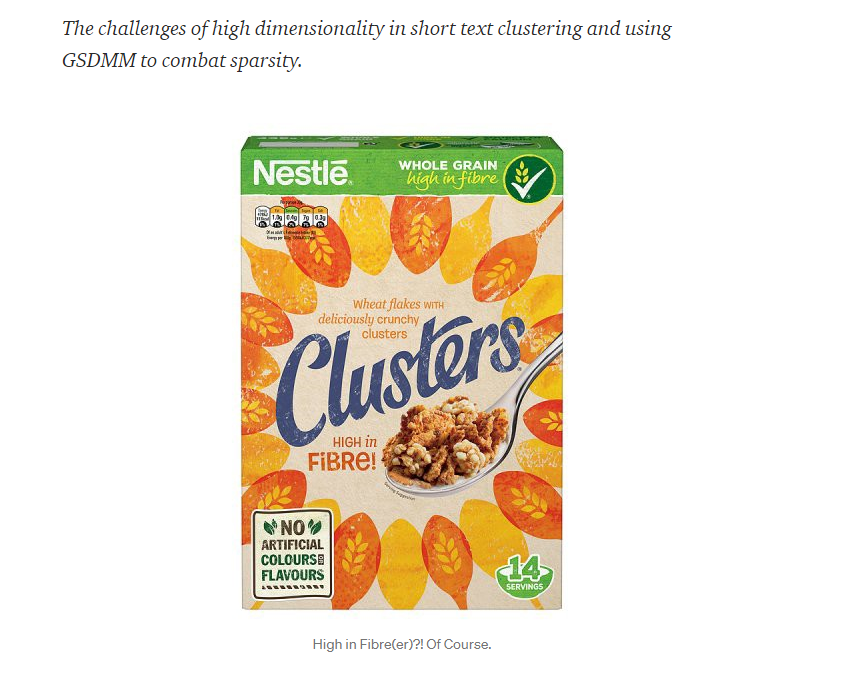
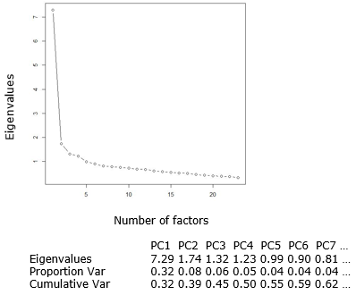

---
output:
  html_document:
    toc: yes
  pdf_document:
    toc: yes
  html_notebook: default
---
```{r echo=FALSE, eval=TRUE, message=FALSE, warning=FALSE, purl=FALSE}
library(knitr)
options(scipen = 999)
#This code automatically tidies code so that it does not reach over the page
opts_chunk$set(tidy.opts=list(width.cutoff=50),tidy=TRUE, rownames.print = FALSE, rows.print = 10)
opts_chunk$set(cache=T)
#knitr::clean_cache(clean = FALSE, path = opts_chunk$get("cache.path"))
set.seed(1)
```

```{r message=FALSE, warning=FALSE, echo=F, eval=TRUE,paged.print = FALSE}
options(digits = 8)
```

# Unsupervised learning

## Principal component analysis 

::: {.infobox .download data-latex="{download}"}
[You can download the corresponding R-Code here](./Code/11-pca.R)
:::

### Introduction

<br>
<div align="center">
<iframe width="560" height="315" src="https://www.youtube.com/embed/kY4fGoFhNUQ" frameborder="0" allowfullscreen></iframe>
</div>
<br>

In this chapter, we will focus on exploratory factor analysis. 

Generally, factor analysis is a class of procedures used for data reduction or summary. It is an **interdependence technique**, meaning that there is no distinction between dependent and independent variables and all variables are considered simultaneously. In **exploratory factor analysis**, specific hypotheses about how many factors will emerge, and what items these factors will comprise are not requires (as opposed to confirmatory factor analysis). Principal Components Analysis (PCA) is one of the most frequently used techniques. The goals are …

* To identify underlying dimensions, or factors, that explain the correlations among a set of variables
* To identify a new, smaller set of uncorrelated variables to replace the original set of correlated variables in subsequent multivariate analysis (e.g., regression analysis, t-test, etc.)  

To see what this means, let's use a simple example. Say, you wanted to explain the motives underlying the purchasing of toothpaste. You come up with six items that represent different motives of purchasing toothpaste:

* **Item 1**: It is important to buy toothpaste that prevents cavities.
* **Item 2**: I like a toothpaste that gives shiny teeth.
* **Item 3**: A toothpaste should strengthen your gums.
* **Item 4**: I prefer a toothpaste that freshens breath.
* **Item 5**: Prevention of tooth decay should not be an important benefit offered by a toothpaste.
* **Item 6**: The most important consideration in buying a toothpaste is attractive teeth.

Let's assume you collect data from 30 respondents and you use 7-point itemized rating scales to measure the extent of agreement to each of these statements. This is the data that you have collected: 

```{r message=FALSE, warning=FALSE, eval=TRUE, echo=TRUE}
factor_analysis <- read.table("https://raw.githubusercontent.com/IMSMWU/Teaching/master/MRDA2017/toothpaste.dat", 
                          sep = "\t", 
                          header = TRUE) #read in data
str(factor_analysis) #inspect data
head(factor_analysis) #inspect data
```
<br>

A **construct** is a specific type of concept that exists at a higher level of abstraction than everyday concepts. In this example, the *perceived benefits* of toothpaste represent the construct that we would like to measure. The construct is unobservable (‘latent’) but it can be inferred from other measurable variables (items) that together comprise a scale (latent construct). A **multi-item scale** consists of multiple items, where an item is a single question or statement to be evaluated. In the above example, we use six items to measure the perceived benefits of toothpaste. If several items correlate highly, they might measure aspects of a common underlying dimension (a.k.a. factors). That is, specific patterns in the correlation matrix signal the existence of one or more factors underlying the data. Let's inspect the correlation matrix using the ```rcorr()``` function from the ```Hmisc``` package.

<br>
```{r, warning=FALSE, message=FALSE}
library("Hmisc")
rcorr(as.matrix(factor_analysis))
```
<br>

You can see that some of the items correlate highly, while others don't. Specifically, there appear to be two groups of items that correlate highly and that might represent underlying dimensions of the construct: 

* Factor 1: Items 1, 3, 5 
* Factor 2: Items 2, 4, 6

Going back to the specific wording of the items you can see that the first group of items (i.e., items 1,3,5) refer to the **health benefits**, while the second item group (i.e., items 2,4,6) refer to the **social benefits**. Imagine now, for example, you would like to include the above variables as explanatory variables in a regression model. Due to the high degree of correlation among the items, you are likely to run into problems of multicollinearity. Instead of omitting some of the items, you might try to combine highly correlated items into one variable. Another application could be when you are developing a new measurement scale for a construct and you wish to explore the underlying dimensions of this construct. In these applications, you need to make sure that the questions that you are asking actually relate to the construct that you intend to measure.  

The goal of factor analysis is to explain the maximum amount of total variance in a correlation matrix by transforming the original variables into linear components. This means that the correlation matrix is broken down into a smaller set of dimensions. The generalized formal representation of the linear relationship between a latent factor *Y* and the set of variables can be written as:     

\begin{equation} 
Y_i=b_1X_{1i} + b_2X_{2i} + b_nX_{ni}+\epsilon_i
(\#eq:factor1)
\end{equation}

where X<sub>n</sub> represents the data that we have collected for the different variables. To make it more explicit, the equation could also be written as 

\begin{equation} 
Factor_i=b_1Variable_{1i} + b_2Variable_{2i} + b_nVariable_{ni}+\epsilon_i
(\#eq:factor2)
\end{equation}

where the dependent variable "Factor" refers to the factor score of person *i* on the underlying dimensions. In our case, the initial inspection suggested two underlying factors (i.e., health benefits and social benefits), so that we can construct two equations that describe both factors in terms of the variables that we have measured:

\begin{equation} 
Health_i=b_1X_{1i} + b_2X_{2i} + b_3X_{3i}+ b_4X_{4i}+ b_5X_{5i}+ b_6X_{6i}+\epsilon_i
(\#eq:factor3)
\end{equation}

\begin{equation} 
Social_i=b_1X_{1i} + b_2X_{2i} + b_3X_{3i}+ b_4X_{4i}+ b_5X_{5i}+ b_6X_{6i}+\epsilon_i
(\#eq:factor4)
\end{equation}

where the b's in each equation represent the **factor loadings**. You can see that both equations include the same set of predictors. However, their values in each equation will be different, depending on the importance of each variable to the respective factor. Once the factor loadings have been computed (we will see how this is done below), we can summarize them in a component matrix, which is usually denoted as ```A```:

$$\mathbf{A} = \left[\begin{array}
{rrr}
0.93 & 0.25 \\
-0.30 & 0.80 \\
0.94 & 0.13 \\
-0.34 & 0.79 \\
0.87 & 0.35 \\
-0.18 & 0.87
\end{array}\right]$$

The linear relation between the factors and the factor loadings can also be shown in a graph, where each axis represents a factor and the variables are placed on the coordinates according to the strength of the relationship between the variable and each factor. The greater the loading of variables on a factor, the more that factor explains relationships between those variables. You can also think of the factor loadings as the correlations between a factor and a variable.

<br>

```{r, message=FALSE, warning=FALSE, eval=TRUE, echo=FALSE, fig.align="center", fig.cap="Factor loadings"}
library(ggplot2)
library(psych)
library(GPArotation)
#values1 <- c(0.93,0.94,0.87,-0.30,-0.34,-0.18)
#values2 <- c(-0.08,-0.04,0.1,0.78,0.85,0.95)
values1 <- principal(factor_analysis, nfactors = 2, rotate = "none")$Structure[,1]
values2 <- principal(factor_analysis, nfactors = 2, rotate = "none")$Structure[,2]
group <- c(1,2,1,2,1,2)
label <- c("X1","X2","X3","X4","X5","X6")
df <- data.frame(values1,values2)
ggplot(df, aes(x=values2,y=values1)) +
  geom_point(size=3,color=group,shape=group) +
  geom_text(aes(x=values2, y=values1, label=label), size=4, vjust=c(1.5,-1,1.5,1.5,1.5,1.5), hjust=c(0.5,0.5,0.5,0.5,0.5,0.5)) +
  labs(x = "Social benefits",y = "Health benefits", size=11) +
  geom_hline(size=1,aes(yintercept=0))+
  geom_vline(size=1,aes(xintercept=0))+
  scale_y_continuous(breaks=seq(-1, 2, 0.25)) +
  scale_x_continuous(breaks=seq(-1, 2, 0.25)) +
  coord_cartesian(ylim=c(-1,1),xlim=c(-1,1)) +
  theme_bw() +
  theme(axis.title = element_text(size = 18),
        axis.text  = element_text(size=14),
        strip.text.x = element_text(size = 14),
        legend.position="none")
```

<br>

The factor loadings may then be used to compute the two new variables (i.e., factor scores) representing the two underlying dimensions. Using a rather simplistic approach, the factor scores for person *i* could be computed by

\begin{equation} 
\begin{split}
Health_i=& 0.93*preventCavities_{i} -0.3*shinyTeeth_{i} + 0.94*strengthenGum_{i}\\
          &-0.34*freshBreath_{i} + 0.87*preventDecay_{i} - 0.18*attractTeeth_{i}
\end{split}
(\#eq:factor5)
\end{equation}

\begin{equation} 
\begin{split}
Social_i=& 0.25*preventCavities_{i} + 0.80*shinyTeeth_{i} + 0.13*strengthenGum_{i}\\
         &+ 0.79*freshBreath_{i}+ 0.35*preventDecay_{i}+ 0.87*attractTeeth_{i}
\end{split}
(\#eq:factor6)
\end{equation}

where the variable names are replaced by the values that were observed for respondent *i* to compute the factor scores for respondent *i*. This means that we have reduced the number of variables from six to two. Note that this is a rather simple approach that is intended to explain the underlying logic. However, that the resulting factor scores will depend on the measurement scales of the variables. If different measurement scales would be used, the resulting factor scores for different factors could not be compared. Thus, R will compute the factor scores using more sophisticated methods as we will see below.  

### Steps in factor analysis

<br>
<div align="center">
<iframe width="560" height="315" src="https://www.youtube.com/embed/pIlsdFcTV5o" frameborder="0" allowfullscreen></iframe>
</div>
<br>

Now that we have a broad understanding of how factor analysis works, let's use another example to go through the process of deriving factors step by step. In this section, we will use the R anxiety questionnaire from the book by Andy Field et al.. The questionnaire is intended to measure the various aspects of student's anxiety towards learning R. It includes 23 items for which respondents are asked to indicate on a five-point Likert scale to what extent they agree with the respective statements. The questionnaire is shown in the following figure:     


Let's assume, we have collected data from 2,571 respondents and stored the results in the data set "raq.dat".

```{r message=FALSE, warning=FALSE, eval=TRUE, echo=TRUE}
raq_data <- read.table("https://raw.githubusercontent.com/IMSMWU/Teaching/master/MRDA2017/raq.dat", 
                          sep = "\t", 
                          header = TRUE) #read in data
```

#### Are the assumptions satisfied?

Since PCA is based the correlation between variables, the first step is to inspect the correlation matrix, which can be created using the ```cor()``` function. 

```{r message=FALSE, warning=FALSE, eval=TRUE, echo=TRUE}
raq_matrix <- cor(raq_data)
round(raq_matrix,3)
```

If the variables measure the same construct, we would expect to see a certain degree of correlation between the variables. Even if the variables turn out to measure different dimensions of the same underlying construct, we would still expect to see some degree of correlation. So the first problem that could occur is that the **correlations are not high enough**. A first approach would be to scan the correlation matrix for correlations lower than about 0.3 and identify variables that have many correlations below this threshold. If your data set contains many variables, this task can be quite tedious. To make the task a little easier, you could proceed as follows. 

Create a dataframe from the correlation matrix and set the diagonal elements to missing since these are always 1:

```{r message=FALSE, warning=FALSE, eval=TRUE, echo=TRUE}
correlations <- as.data.frame(raq_matrix)
diag(correlations) <- NA
```

Now we can use the ```apply()``` function to count the number of correlations for each variable that are below a certain threshold (say, 0.3). The ```apply()``` function is very useful as it lets you apply function by the rows or columns in your dataframe. In the following example ```abs(correlations) < 0.3``` returns a logical value for the correlation matrix that returns ```TRUE``` if the statement is true. The second argument ```1``` means that the function should be applied to the rows (```2``` would apply it to the columns). The third argument states the function that should be applied. In our case, we would like to count the number of absolute correlations below 0.3 so we apply the ```sum``` function, which sums the number of ```TRUE``` occurrences by row. The final argument ```na.rm = TRUE``` simply tells R to neglect the missing values that we have created for the diagonals of the matrix.   

```{r message=FALSE, warning=FALSE, eval=TRUE, echo=TRUE}
apply(abs(correlations) < 0.3, 1, sum, na.rm = TRUE)
```

The output shows you the number of correlations below the threshold for each variable. In a similar way, it would also be possible to compute the mean correlation for each variable. 

```{r message=FALSE, warning=FALSE, eval=TRUE, echo=TRUE, fig.align="center", fig.width=10, fig.cap="Correlation matrix"}
apply(abs(correlations),1,mean,na.rm=TRUE)
```

Another way to make the correlations more salient is to plot the correlation matrix using different colors that indicate the strength of the correlations. This can be done using the ```corPolot()``` function from the ```psych``` package. 

```{r message=FALSE, warning=FALSE, eval=TRUE, echo=TRUE, fig.align="center", fig.width=10, fig.cap="Correlation matrix"}
corPlot(correlations,numbers=TRUE,upper=FALSE,diag=FALSE,main="Correlations between variables")
```

You will, however, notice that this is a rather subjective approach. The **Bartlett's test** is a statistical test that can be used to test whether all the off-diagonal elements in the population correlation matrix are zero (i.e., whether the population correlation matrix resembles an identify matrix). Thus, it tests whether the correlations are overall too small. If the matrix is an identify matrix, it means that all variables are independent. Thus, a significant test statistic (i.e., p < 0.05) indicates that there is some relationship between variables. The test can be implemented using the ```cortest.bartlett()``` function from the ```psych``` package:

```{r message=FALSE, warning=FALSE, eval=TRUE, echo=TRUE}
library(psych)
cortest.bartlett(raq_matrix, n = nrow(raq_data))
```

In our example, the p-value is less than 0.05, which is good news since it confirms that overall the correlation between variables is different from zero. 

The other problem that might occur is that **the correlations are too high**. Actually, a certain degree of multicollinearity is not a problem in PCA. However, it is important to avoid extreme multicollinearity (i.e., variables are highly correlated) and singularity (i.e., variables are perfectly correlated). Multicollinearity causes problems, because it becomes difficult to determine the unique contribution of a variable (as was the case in linear regression analysis). Again, inspecting the entire correlation matrix when there are many variables will be a tedious task. .  

```{r message=FALSE, warning=FALSE, eval=TRUE, echo=TRUE}
apply(abs(correlations) > 0.8, 1, sum, na.rm = TRUE)
```

The results do not suggest any extreme or perfect correlations. Again, there is a more objective measure that could be applied. The **determinant** tells us whether the correlation matrix is singular (determinant = 0), or if all variables are completely unrelated (determinant = 1), or somewhere in between. As a rule of thumb, the determinant should be greater than 0.00001. The ```det()``` function can be used to compute the determinant:

```{r message=FALSE, warning=FALSE, eval=TRUE, echo=TRUE}
det(raq_matrix)
det(raq_matrix) > 0.00001
```

As you can see, the determinant is larger than the threshold, indicating that the overall correlation between variables is not too strong. 

Finally, you should test if the correlation pattern in the matrix is appropriate for factor analysis using the Kaiser-Meyer-Olkin (KMO) measure of sampling adequacy. This statistic is a measure of the proportion of variance among variables that might be common variance. 

\begin{equation} 
MSA_j=\frac{\sum_{k\ne j}^{}{r^2_{jk}}}{\sum_{k\ne j}^{}{r^2_{jk}}+\sum_{k\ne j}^{}{p^2_{jk}}}
(\#eq:MSA)
\end{equation}

where $r_{jk}$ is the correlation between two variables of interest and $p_{jk}$ is their partial correlation. The partial correlation measures the degree of association between the two variables, when the effect of the remaining variables is controlled for. It can takes values between 0 (bad) and 1 (good), where a value of 0 indicates that the sum of partial correlations is large relative to the sum of correlations. If the remaining correlation between two variables remains high if you control for all the other variables, this provides an indication that the correlation is fairly concentrated and on a subset of the variables and factor analysis is likely to be inappropriate. In contrast, a value close to 1 means that the sum of the partial correlations is fairly is low, indicating a more compact pattern of correlations between a larger set of variables. Values should at least exceed 0.50, with the thresholds:

*  <.50 = unacceptable
* \>.50 = miserable
* \>.60 = mediocre
* \>.70 = middling
* \>.80 = meritorious
* \>.90 = marvelous

The KMO measure of sampling adequacy can be computed using the ```KMO()``` function from the ```psych``` package:

```{r message=FALSE, warning=FALSE, eval=TRUE, echo=TRUE}
KMO(raq_data)
```

You can see that the statistic is calculated for the entire matrix and for each variable individually. In our example, the values for all variables as well as the overall matrix is above 0.5, suggesting that factor analysis is appropriate.  

#### Deriving factors

<br>
<div align="center">
<iframe width="560" height="315" src="https://www.youtube.com/embed/HfDyoNjJ6Rs" frameborder="0" allowfullscreen></iframe>
</div>
<br>

After testing that the data can be used for PCA, we can move on to conducting PCA. Conducting PCA is fairly simple in R using the ```pricipal()``` function from the ```psych``` package. However, before the apply the function to our data, it is useful to reflect on the goals of PCA again. The goal is to explain the maximum amount of total variance in a correlation matrix by transforming the original variables into a smaller set of linear components (factors). So the first decision we have to make is how many factors we should extract. There are different methods that can be used to decide on the appropriate number of factors, including: 

* **A priori determination**: Requires prior knowledge
* **Determination based on percentage of variance**: When cumulative percentage of variance extracted by the factors reaches a satisfactory level (e.g., factors extracted should account for at least 60% of the variance)
* **Eigenvalues**: Eigenvalues refer to the total variance that is explained by each factor. Factors with eigenvalues greater than 1.0 are retained (factors with a variance less than 1.0 are no better than a single variable)
* **Scree plot**: Is a plot of the eigenvalues against the number of factors in order of extraction. Assumption: the point at which the scree begins denotes the true number of factors. 

Often, the decision is made based on a combination of different criteria. 

By extracting as many factors as there are variables we can inspect their eigenvalues and make decisions about which factors to extract. Since we have 23 variables, we set the argument ```nfactors``` to 23.

```{r message=FALSE, warning=FALSE, eval=TRUE, echo=TRUE}
pc1 <- principal(raq_data, nfactors = 23, rotate = "none")
pc1
```

The output is quite complex, but we will focus only on the ```SS loadings``` for now, which are the Eigenvalues (a.k.a. sum of squared loadings). One common rule is to retain factors with eigenvalues greater than 1.0. So based on this rule, we would extract four factors (i.e., the SS loadings for the fifth factor is < 1).

You can also plot the eigenvalues against the number of factors in order of extraction using a so-called **Scree plot**: 

```{r message=FALSE, warning=FALSE, eval=TRUE, echo=TRUE, fig.align="center", fig.cap="Scree plot"}
plot(pc1$values, type="b")
abline(h=1, lty=2)
```

The dashed line is simply a visualization of the rule that we will retain factors with Eigenvalues > 1 (suggesting four factors). Another criterion based on this plot would be to find the point where the curve flattens (point of inflection). If the largest few eigenvalues in the covariance matrix dominate in magnitude, then the scree plot will exhibit an “elbow”. From that point onward, the incremental gain in explained variance is rather low. Also according to this criterion, we would extract four factors. Taken together, the results suggest that we should extract four factors.   

Now that we know how many components we want to extract, we can rerun the analysis, specifying that number:

```{r message=FALSE, warning=FALSE, eval=TRUE, echo=TRUE}
pc2 <- principal(raq_data, nfactors = 4, rotate = "none")
pc2
```

Now that the output is less complex, we can inspect the remaining statistics. The first part of the output is the **factor matrix**, which contains the factor loadings of all the variables on the four extracted factors (i.e., PC1, PC2, PC3, PC4). As we have said before, the **factor loadings** are the correlations between the variables and the factors. The factor matrix also contains the columns "h2" and "u2". "h2" refers to the **communality**, which is the proportion of variance a variable shares with all the other variables being considered. This is also the proportion of variance explained by the common factors. In contrast, "u2" refers to the unique variance, which is the proportion of the variance that is unique to a particular variable. In PCA, we are primarily interested in the common variance. When the communality is very low (say <.30), a variable is “quite unique” and  should be removed, as it is definitely measuring “something else”. In our example, all communalities (i.e., h2) are above 0.3 so that we retain all variables.

Note that there is a difference between PCA and common factor analysis. PCA focuses on the variance and aims to reproduce the total variable variance. This means that the components reflect both common and unique variance of the variables. Factor analysis, in contrast, focuses on the correlation and aims to reproduce the correlations among variables. Here, the factors only represent the common variance that variable share and do not include the unique variance. In other words, while factor analysis focuses on explaining the off-diagonal terms in the correlation matrix (i.e., shared co-variance), PCA focuses on explaining the diagonal terms (i.e., the variances). However, although PCA aims to reproduce the on-diagonal terms in the correlation matrix, it also tends to fit the off-diagonal correlations quite well. Hence, the results are often comparable. See also <a href="https://en.wikipedia.org/wiki/Principal_component_analysis#Relation_between_PCA_and_factor_analysis" target="_blank">here</a>.

You should also take a closer look at the residuals in order to check whether you have extracted the correct number of factors. The difference between the reproduced and the actual correlation matrices are the residuals. We can extract the residuals from our model using the ```factor.residuals()``` function from the ```psych``` package. It takes the original correlation matrix and the factor loadings as arguments:

```{r message=FALSE, warning=FALSE, eval=TRUE, echo=TRUE}
residuals <- factor.residuals(raq_matrix, pc2$loadings)
round(residuals,3)
```

Note that the diagonal elements in the residual matrix correspond to the unique variance in each variable that cannot be explained by the factors (i.e., "u2" in the output above). For example, the proportion of unique variance for question 1 is 0.57, which is reflected in the first cell in the residual matrix. The off-diagonal elements represent the difference between the actual correlations and the correlation based on the reproduced correlation matrix for all variable pairs. To see this, the reproduced correlation matrix could be generated by using the ```factor.model()``` function:   

```{r message=FALSE, warning=FALSE, eval=TRUE, echo=TRUE}
reproduced_matrix <- factor.model(pc2$loadings)
round(reproduced_matrix,3)
```

You can see that the reproduced correlation between the first and second variable is -0.112. From the correlation table from the beginning we know, however, that the observed correlation was -0.099. Hence, the difference between the observed and reproduced correlation is: (-0.099)-(-0.112) = 0.013, which corresponds to the residual of this variable pair in the residual matrix. Note that the diagonal elements in the reproduced matrix correspond to the communalities in the model summary above (i.e., "h2"). 

A measure of fit can now be computed based on the size of the residuals. In the worst case, the residuals would be as large as the correlations in the original matrix, which would be the case if we extracted no factors at all. A measure of fit could therefore be the sum of the squared residuals divided by the sum of the squared correlations. We square the residuals to account for positive and negative deviations. **Values >0.90 are considered indicators of good fit.** From the output above, you can see that: "Fit based upon off diagonal values = 0.96". Thus, we conclude that the model fit is sufficient. 

You could also manually compute this statistic by summing over the squared residuals and correlations, take their ratio and subtract it from one (note that we use the ```upper.tri()``` function to use the upper triangle of the matrix only; this has the effect of discarding the diagonal elements and the elements below the diagonal).  

```{r message=FALSE, warning=FALSE, eval=TRUE, echo=TRUE}
ssr <- (sum(residuals[upper.tri((residuals))]^2)) #sum of squared residuals 
ssc <- (sum(raq_matrix[upper.tri((raq_matrix))]^2)) #sum of squared correlations
1-(ssr/ssc) #model fit
```

In a next step, we check the size of the residuals. **If fewer residuals than 50% have absolute values greater than 0.05 the model is a good fit.** This can be tested using the following code. We first convert the residuals to a matrix and select the upper triangular again to avoid duplicates. Finally, we count all occurrences where the absolute value is larger than 0.05 and divide it by the number of total observations to get the proportion.

```{r message=FALSE, warning=FALSE, eval=TRUE, echo=TRUE}
residuals <- as.matrix(residuals[upper.tri((residuals))])
large_res <- abs(residuals) > 0.05
sum(large_res)
sum(large_res)/nrow(residuals)
```

In our example, we can confirm that the proportion of residuals > 0.05 is less than 50%.

Another way to evaluate the residuals is by looking at their mean value (rather, we square the residuals first to account for positive and negative values, compute the mean and then take the square root). 

```{r message=FALSE, warning=FALSE, eval=TRUE, echo=TRUE}
sqrt(mean(residuals^2))
```

This means that our mean residual is 0.055 and this value should be as low as possible. 

Finally, we need to validate if the residuals are approximately normally distributed, which we do by using a histogram, a Q-Q plot and the Shapiro test. 

```{r message=FALSE, warning=FALSE, eval=TRUE, echo=TRUE, fig.align="center", fig.cap="Hinstogram of residuals"}
hist(residuals)
```

```{r message=FALSE, warning=FALSE, eval=TRUE, echo=TRUE, fig.align="center", fig.cap="Q-Q plot"}
qqnorm(residuals) 
qqline(residuals)
shapiro.test(residuals)
```

All of the tests suggest that the distribution of the residuals is approximately normal.  

#### Factor interpretation

<br>
<div align="center">
<iframe width="560" height="315" src="https://www.youtube.com/embed/9WicakaJvdU" frameborder="0" allowfullscreen></iframe>
</div>
<br>

To aid interpretation, it is possible to maximize the loading of a variable on one factor while minimizing its loading on all other factors. This is known as factor rotation. There are two types of factor rotation:

* orthogonal (assumes that factors are uncorrelated)
* oblique (assumes that factors are intercorrelated)

To carry out a orthogonal rotation, we change the rotate option in the ```principal()``` function from “none” to “varimax” (we could also exclude it altogether because varimax is the default if the option is not specified):

```{r message=FALSE, warning=FALSE, eval=TRUE, echo=TRUE}
pc3 <- principal(raq_data, nfactors = 4, rotate = "varimax")
pc3
```

Interpreting the factor loading matrix is a little complex, so we can make it easier by using the ```print.psych()``` function, which we can use to exclude loading below a cutoff from the display and order the variables by their loading within each factor. In the following, we will only display loadings that exceed the value 0.3. 

```{r message=FALSE, warning=FALSE, eval=TRUE, echo=TRUE}
print.psych(pc3, cut = 0.3, sort = TRUE)
```

After obtaining the rotated matrix, variables with high loading are used for interpreting (=naming) the factor. Note that factor loading can be positive or negative (depends on scaling of the variable), thus take care when interpreting! Look for simple structure: each variable (hopefully) loads high on 1 factor and low on other factors.

As an example, we could name our factors as follows:

* **Factor 1:** fear of computers
* **Factor 2:** fear of statistics
* **Factor 3:** fear of maths
* **Factor 4:** Peer evaluation

The previous type of rotation (i.e., "varimax") assumed that the the factors are independent. Oblique rotation is another type of rotation that can handle correlation between the factors. The command for an oblique rotation is very similar to that for an orthogonal rotation – we just change the rotate option from “varimax” to “oblimin”.

```{r message=FALSE, warning=FALSE, eval=TRUE, echo=TRUE}
pc4 <- principal(raq_data, nfactors = 4, rotate = "oblimin", scores = TRUE)
print.psych(pc4, cut = 0.3, sort = TRUE)
```

The component correlations indicate that the factors might indeed be correlated, so oblique rotation might actually be more appropriate in this case. 

#### Creating new variables

Once we have decided on the final model, we can calculate the new variables as the weighted sum of the variables that form a factor. This means, we estimate a person's score on a factor based on their scores on the items that constitute the measurement scales. These scores are also referred to as the **factor scores**. Because we have used the ```scores = TRUE``` argument in the previous command, the factor scores have already been created for us. By default, R uses the regression method to compute the factor scores, which controls for differences in the units of measurement. You can access the residuals as follows: 

```{r message=FALSE, warning=FALSE, eval=TRUE, echo=TRUE}
head(pc4$scores)
```

We can also use the ```cbind()``` function to add the computed factor scores to the existing data set:

```{r message=FALSE, warning=FALSE, eval=TRUE, echo=TRUE}
raq_data <- cbind(raq_data, pc4$scores)
```

This way, it is easier to use the new variables in subsequent analysis (e.g., t-tests, regression, ANOVA, cluster analysis).

#### Reliability analysis

<br>
<div align="center">
<iframe width="560" height="315" src="https://www.youtube.com/embed/inQgMCzFRAc" frameborder="0" allowfullscreen></iframe>
</div>
<br>

When you are using multi-item scales to measure a latent construct (e.g., the output from the PCA above), it is useful to check the reliability of your scale. Reliability means that our items should consistently reflect the construct that they are intended to measure. In other words, individual items should produce results consistent with the overall scale. This means that for a scale to be reliable, the score of a person on one half of the items should be similar to the score derived based on the other half of the items (split-half reliability). The problem is that there are several ways in which data can be split. A measure that reflects this underlying intuition is **Cronbach's alpha**, which is approximately equal to the average of all possible split-half reliabilities. It is computed as follows:

\begin{equation} 
\alpha=\frac{N^2\overline{Cov}}{\sum{s^2_{item}}+\sum{Cov_{item}}}
(\#eq:calpha)
\end{equation}

The share of the items common variance (inter-correlation) in the total variance is supposed to be as high as possible across all items. The thresholds are as follows:

* \>0.7 reasonable for practical application/exploratory research
* \>0.8 necessary for fundamental research
* \>0.9 desirable for applied research

To see if the subscales that were derived from the previous PCA exhibit a sufficient degree of reliability, we first create subsets of our data set that contain the respective items for each of the factors (we use the results from the oblimin rotation here):  

```{r message=FALSE, warning=FALSE, eval=TRUE, echo=TRUE}
computer_fear <- raq_data[,c(6,7,10,13,14,15,18)]
statistics_fear <- raq_data[,c(1,3,4,5,12,16,20,21)]
math_fear <- raq_data[,c(8,11,17)]
peer_evaluation <- raq_data[,c(2,9,19,22,23)]
```

Now we can use the ```alpha()``` function from the ```psych``` package to test the reliability. Note that the ```keys``` argument may be used to indicate reverse coded items. In the example below, the second item of the "statistics_fear" factor is reverse coded as indicated by the ```-1```, meaning that it is phrased in a "positive" way, while the remaining items belonging to this factor are phrased in a "negative" way. This is often done to check if respondents are giving consistent answers. 


```{r message=FALSE, warning=FALSE, eval=TRUE, echo=TRUE}
psych::alpha(computer_fear)
psych::alpha(statistics_fear, keys=c(1,-1,1,1,1,1,1,1))
psych::alpha(math_fear)
psych::alpha(peer_evaluation)
```

The above output would lead us to conclude that the fear of computers, fear of statistics and fear of maths subscales of the RAQ all had sufficiently high levels of reliability (i.e., Cronbach’s alpha > 0.70). However, the fear of negative peer evaluation subscale had relatively low reliability (Cronbach’s alpha = 0.57). As the output under "Reliability if an item is dropped" suggests, the alpha score would also not increase if an item was dropped from the scale. 

## Cluster analysis

```{r,echo=FALSE,out.width = '25%',fig.align='center',fig.cap = ""}

```

::: {.infobox .download data-latex="{download}"}
[You can download the corresponding R-Code here](./Code/12-cluster.R)
:::

<br>
<div align="center">
<iframe width="560" height="315" src="https://www.youtube.com/embed/JtYBQcWqzWk" frameborder="0" allowfullscreen></iframe>
</div>
<br>

In the previous chapter on factor analysis we tried to reduce the number of variables or columns by identifying underlying dimensions. In order to do so we exploited the fact that some items are highly correlated and therefore might represent the same underlying concept (e.g., health benefits or social benefits). Similarly, in cluster analysis we again do not distinguish between dependent and independent variables. However, in the case of cluster analysis we do not try to reduce the number of variables but the number of observations by grouping similar ones into "clusters". What exactly defines "similarity" depends on the use case. In the case of music, audio features of songs might be used to identify clusters of similar songs (similar to the genre classification) which can be used for recommendation systems. Other use cases are customer segmentation and anomaly (e.g., fraud) detection.


<br>
<div align="center">
<iframe width="560" height="315" src="https://www.youtube.com/embed/Pv7gf-2lMHE" frameborder="0" allowfullscreen></iframe>
</div>
<br>


Let's try to create a recommendation system using track features. In our data we have the ISRC, name of the track, name of the artist and audio features of the track. We are going to use the audio features to cluster tracks together such that given one track we can easily identify similar tracks by looking at which cluster it belongs to.

```{r}
load(url("https://github.com/WU-RDS/MRDA2021/raw/main/trackfeatures.RData"))
# remove duplicates
tracks <- na.omit(tracks[!duplicated(tracks$isrc), ])
```

To get an idea of how clustering might work let's first take a look at just  with two variables, energy and acousticness, and two artists, Robin Schulz and Adele. We immediately see that Adele's songs are more to the top left (high acousticness, low energy) whereas Robin Schulz's songs are mostly on the bottom right (low acousticness, high energy).

```{r}
library(ggplot2)
library(stringr)
robin_schulz <- tracks[str_detect(tracks$artistName, "Robin Schulz"), ]
robin_schulz$artist <- "Robin Schulz"
adele <- tracks[str_detect(tracks$artistName, "Adele"), ]
adele$artist <- "Adele"

example_tracks <- rbind(robin_schulz, adele)
ggplot(example_tracks, aes(x = energy, y = acousticness, color = artist)) +
  geom_point() +
  theme_bw()
```

### K-Means

One of the most popular algorithms for clustering is the **K-means** algorithm. The "K" stands for the number of clusters that are specified as a hyperparameter (more on how to set that parameter later). The algorithm then tries to separate the observations into K clusters such that the within-cluster sum of squared differences form the cluster mean of the features (e.g., our audio features) is minimized.  Therefore, it is important to `scale` all variables before performing clustering such that they all contribute equally to the  distance between the observations. Minimizing the within-cluster sum of squares is equivalent to minimizing the sum of the squared deviations of observations pairwise in the same cluster and maximizing the sum of squared deviations of observations in different clusters. Intuitively the algorithm groups observations by iteratively calculating the mean or center of each cluster, assigning each observation to the cluster with the closest mean and re-calculating the mean... The algorithm has "converged" (i.e., is done) when the assignments no longer change. 
Let's try it out with our two artists. In order to perform clustering we first have to remove all missing values from the used variables as for those we cannot calculate distances. Because we know that there are two artists in the sample we will start with two clusters.

```{r}
tracks_scale <- data.frame(artist = example_tracks$artist, energy = scale(example_tracks$energy), acousticness = scale(example_tracks$acousticness))
tracks_scale <- na.omit(tracks_scale)
kmeans_clusters <- kmeans(tracks_scale[-1], 2)
kmeans_clusters$centers
```

The `kmeans` function returns, among other statistics, the centers of each cluster and a cluster identifier for each observation which we can add to our original data. In our case one cluster's center is rather low in energy and high acousticness and the second one has higher energy and lower acousticness. 

In our plot we can add a color for each cluster and a different marker shape for each artist. We observe that cluster 1 corresponds mostly to Robin Schulz songs and cluster 2 mostly to Adele. Alternatively we can also look at the counts in each cluster per artist using the `table` function.

```{r}
tracks_scale$cluster <- as.factor(kmeans_clusters$cluster)
ggplot(tracks_scale, aes(x = energy, y = acousticness, color = cluster, shape = artist)) +
  geom_point(size = 3) +
  theme_bw()
table(tracks_scale$artist, tracks_scale$cluster)
```

In the previous example it was easy to set the number of clusters. However, if we use all artists in our data the best value for "K" is not immediately obvious. Surely some artists should be in the same cluster. We can user the `NbClust` package to determine the best number of clusters according to various indices (see `?NbClust`). First we scale all our variables and then we use the scaled versions to determine "K". To make computations faster we will use songs by 5 famous artists. Then we count how many indices would choose a certain number of clusters. The two best candidates are 3 clusters, chosen by 13 indices and 2 clusters, chosen by 5 indices.

```{r echo=TRUE, results='hide', cache=TRUE}
library(NbClust)
famous_artists <- c(
	'Ed Sheeran',
	'Eminem',
	'Rihanna',	
	'Taylor Swift',
	'Queen'
	)
famous_tracks <- tracks[tracks$artistName %in% famous_artists, ]
famous_tracks_scale <- scale(famous_tracks[4:ncol(famous_tracks)])
set.seed(123)
opt_K <- NbClust(famous_tracks_scale, method = "kmeans", max.nc = 10)
```

```{r}
table(opt_K$Best.nc["Number_clusters",])
```

We can now proceed as before with running the k-means algorithm. Looking at the centers for each of the clusters could give us an indication for the types of songs we can expect in each of them (recall that they are assigned based on their distance to the center). Cluster 2, for example will include acoustic soungs and cluster 3 includes more energetic, faster songs.


```{r}
kmeans_tracks <- kmeans(famous_tracks_scale, 3)
kmeans_tracks$centers
```

To get a quick overview of the centers we can user a radar plot. This allows us to quickly observe similarities and distinguishing features of clusters.

```{r}
library(ggiraph)
library(ggiraphExtra)

centers <- data.frame(kmeans_tracks$centers)
centers$cluster <- 1:3
ggRadar(centers, aes(color = cluster), rescale = FALSE) + 
  ggtitle("Centers") +
  theme_bw()
```


We can use a barplot to visualize the number of songs an artist has in each cluster. While Eminem's songs are mostly in cluster 3, Taylor Swift's and Ed Sheeran's are mostly in cluster 1 and 2. 

```{r}
famous_tracks$cluster <- as.factor(kmeans_tracks$cluster)
ggplot(famous_tracks, aes(y = cluster, fill = artistName)) +
  geom_bar() +
  theme_bw()
table(famous_tracks$artistName, famous_tracks$cluster)
```

We could use the clustering to make recommendations on both the artist and song level (assuming that people like songs with similar audio features). If you like "Lose Yourself" by Eminem (cluster 3), we would recommend "I Forgot That You Existed" (cluster 3) bu not "The Archer" (cluster 2) by Taylor Swift. 

```{r}
recommendation <- famous_tracks[str_detect(famous_tracks$trackName, "Lose Yourself|I Forgot That You Existed|The Archer"),]
recommendation[c("trackName", "artistName", "cluster")]
ggplot(recommendation, aes(instrumentalness, speechiness, color = cluster)) +
  geom_point() +
  geom_label(aes(label=trackName), hjust = "inward") +
  theme_bw()
```

We can use the `fviz_cluster` function from the `factoextra` library to get a partial picture. If there are more than 2 variables used for clustering, the package performs a PCA and uses the first two principal components for the visualization.

```{r, message=FALSE,warning=FALSE, cache=FALSE}
library(factoextra)
fviz_cluster(kmeans_tracks, data = famous_tracks_scale,
             palette = hcl.colors(3, palette = "Dynamic"), 
             geom = "point",
             ellipse.type = "convex", 
             ggtheme = theme_bw()
             )
```

## Learning check {-}

**(LC7.1) The goals of PCA are...**

- [x] ...to identify underlying dimensions that explain correlations among variables.
- [ ] ...to identify multiplicative effects in a linear regression.
- [x] ...to identify a smaller set of uncorrelated variables.
- [ ] ...to identify interaction terms in a linear regression.
- [ ] None of the above 

**(LC7.2) What are typical hypotheses in PCA concerning how many factors will emerge?**

- [ ] A reduction greater than 50% of the input variables
- [ ] Between a third and a fourth of the input variables
- [ ] A reduction smaller than 50% of the input variables
- [x] None of the above 

**(LC7.3) What assumptions have to be fulfilled for using PCA?**

- [x] Variables must be in interval or ratio scale
- [x] Existence of some underlying factor structure
- [x] The correlation matrix must have sufficient number of correlations
- [ ] Variables must be measured using ordinal scales
- [ ] None of the above

**(LC7.4) What is the correct interpretation of the b-values in the following mathematical representation concerning exploratory factor analysis (EFA)?** $Factor_i=b_1*Variable_1 + b_2*Variable_2+…+b_nVariable_n$

- [ ] Regression coefficients
- [ ] Correlations between the variables
- [x] Weights of a variable on a factor
- [x] Factor loadings
- [ ] None of the above 

**(LC7.5) What is the null hypothesis of the Bartlett’s test of sphericity?**

- [ ] All variables are correlated in the population
- [ ] The correlation matrix is singular
- [ ] All variables are uncorrelated in the population
- [x] The correlation matrix is an identity matrix
- [ ] None of the above 

**(LC7.6) Before conducting PCA, how can you test the sampling adequacy of your data (i.e., how suited your data is for Factor Analysis)?**

- [ ] Kaiser-Meyer-Olkin (KMO) test with scores <0.5
- [x] Kaiser-Meyer-Olkin (KMO) test with scores >0.5
- [ ] By inspecting the scree plot
- [ ] Cronbach's alpha test with scores >0.7
- [ ] None of the above 

**(LC7.7) What is communality?**

- [x] Proportion of common variance in a variable
- [ ] Variance that is unique to a particular variable
- [ ] Proportion of unique variance in a variable
- [ ] Covariance between two factors
- [ ] None of the above 

**(LC7.8) Orthogonal factor rotation assumes:**

- [ ] Inter-correlated factors
- [x] Uncorrelated factors
- [ ] Outer-correlated factors
- [ ] None of the above 

**(LC7.9) Imagine you want to conduct a PCA on 10 variables without factor rotation and in a first step, you wish to find out how many components you should extract. How would the corresponding R Code look?**

- [x] `principal(data, nfactors = 10, rotate = "none")`
- [ ] `principal(data, nfactors = “varimax”, rotate = 10)`
- [ ] `principal(data, nfactors = 10, rotate = "oblimin")`
- [ ] `principal(data, nfactors = 10, rotate = "varimax")`
- [ ] None of the above 


**(LC7.10) How many factors should be extracted based on the Scree Plot and the Eigenvalues below?**

- [ ] 1
- [ ] 2
- [ ] 3
- [x] 4
- [ ] 5
- [ ] 15
- [ ] 23

```{r,echo=FALSE,out.width = '75%',fig.align='center',fig.cap = ""}

```

**(LC7.11) Which of the following statements regarding cluster analysis are TRUE?**

- [ ] The goal is to reduce the number of columns in a data set
- [x] The goal is to reduce the number of rows in a data set
- [ ] H-Means is a popular clustering method
- [ ] The goal is to establish a relationship between a dependent variable and an independent variable 
- [x] The goal is to group observations into clusters such that those in the same cluster are more “similar” than those of other clusters
- [x] It is an unsupervised learning method

**(LC7.12) What is the main objective of k-means clustering in data analysis?**

- [ ] To find the best-fitting linear regression model.
- [ ] To identify underlying factors that explain correlations among variables.
- [x] To partition data into clusters based on similarity.
- [ ] To calculate the correlation between variables.
- [ ] None of the above 

**(LC7.13) In the k-means algorithm, what does "k" represent?**

- [ ] The number of variables in the dataset.
- [x] The number of clusters to be formed.
- [ ] The number of iterations to converge.
- [ ] The number of outliers in the data.
- [ ] None of the above 

**(LC7.14) What is the primary limitation of the k-means clustering algorithm?**

- [ ] It is computationally expensive.
- [x] It requires specifying the number of clusters in advance.
- [ ] It cannot handle categorical data.
- [ ] It always produces spherical clusters.
- [ ] None of the above 


## References {-}

* Field, A., Miles J., & Field, Z. (2012): Discovering Statistics Using R. Sage Publications, **chapter 17**
* Malhotra, N. K.(2010). Marketing Research: An Applied	Orientation (6th. ed.). Prentice Hall. **chapter 19**

