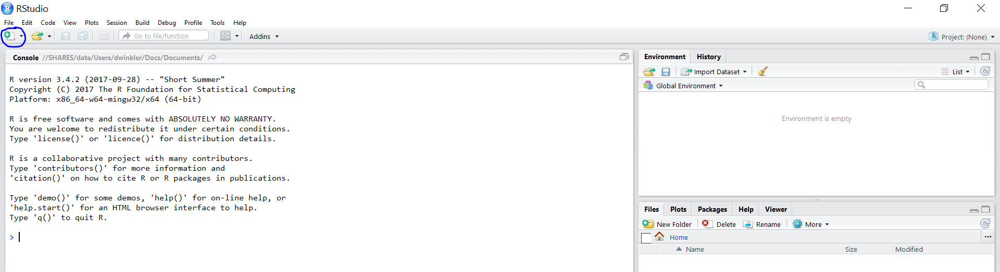
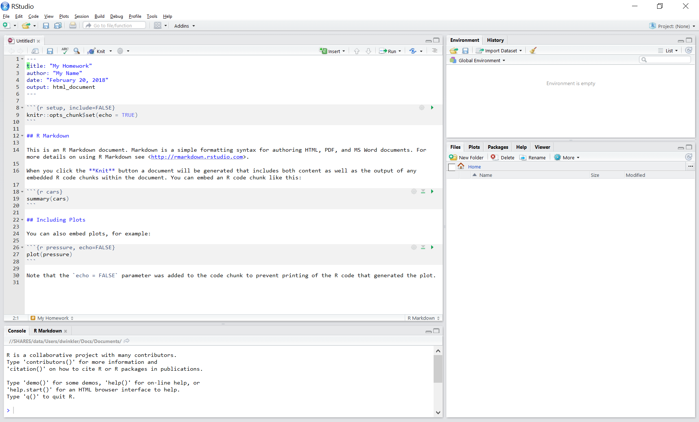
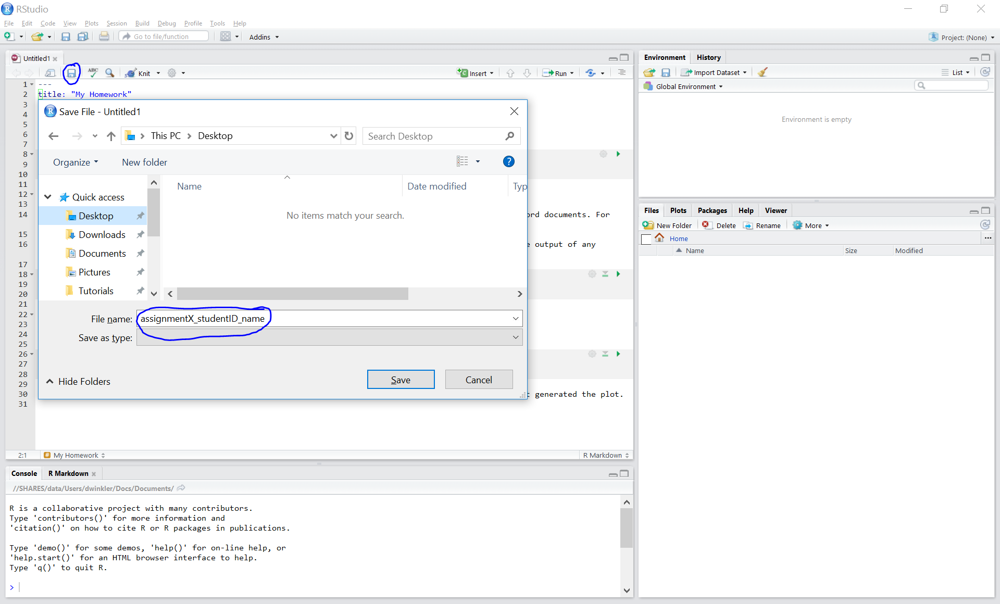
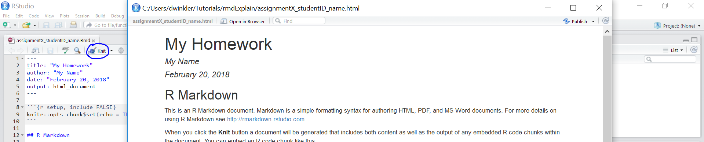
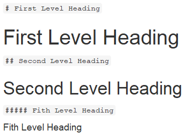

```{r, echo=FALSE, warning=FALSE}
library(knitr)
#rm(list = ls())
#This code automatically tidies code so that it does not reach over the page
opts_chunk$set(tidy.opts=list(width.cutoff=50),tidy=TRUE, rownames.print = FALSE, rows.print = 10)
```

# (PART) Assignments {-}

# R Markdown 


## Introduction to R Markdown

::: {.infobox .download data-latex="{download}"}
[You can download the example markdown file here](./Code/rmarkdown_example.Rmd)
:::

This page will guide you through creating and editing R Markdown documents. This is a useful tool for reporting your analysis (e.g. for homework assignments). Of course, there is also [a cheat sheet for R-Markdown](https://www.rstudio.org/links/r_markdown_cheat_sheet) and [this book](https://bookdown.org/yihui/rmarkdown/) contains a comprehensive discussion of the format. 

The following video contains a short introduction to the R Markdown format.

<br>
<div align="center">
<iframe width="560" height="315" src="https://www.youtube.com/embed/o8FdyMAR-g4" frameborder="0" allowfullscreen></iframe>
</div>
<br>

### Creating a new R Markdown document {-}

In addition to the video, the following text contains a short description of the most important formatting options.  

Let's start to go through the steps of creating and .Rmd file and outputting the content to an HTML file. 

0. If an R-Markdown file was provided to you, open it with R-Studio and skip to [step 4](#step4) after adding your answers.

1. Open R-Studio

2. Create a new R-Markdown document





3. Save with appropriate name


    3.1. Add your answers

    3.2. Save again

 <a name="step4"></a>
 
4. "Knit" to HTML 


5. Hand in appropriate file (ending in `.html`) on learn\@WU


### Text and Equations {-}

R-Markdown documents are plain text files that include both text and R-code. Using RStudio they can be converted ('knitted') to HTML or PDF files that include both the text and the results of the R-code. In fact this website is written using R-Markdown and RStudio. In order for RStudio to be able to interpret the document you have to use certain characters or combinations of characters when formatting text and including R-code to be evaluated. By default the document starts with the options for the text part. You can change the title, date, author and a few more advanced options. 


The default is text mode, meaning that lines in an Rmd document will be interpreted as text, unless specified otherwise.

#### Headings {-}

Usually you want to include some kind of heading to structure your text. A heading is created using `#` signs. A single `#` creates a first level heading, two `##` a second level and so on. 



It is important to note here that the ```#``` symbol means something different within the code chunks as opposed to outside of them. If you continue to put a ```#``` in front of all your regular text, it will all be interpreted as a first level heading, making your text very large.

#### Lists {-}

Bullet point lists are created using `*`, `+` or `-`. Sub-items are created by indenting the item using 4 spaces or 2 tabs. 

````
* First Item
* Second Item
    + first sub-item
        - first sub-sub-item
    + second sub-item
````
* First Item
* Second Item
    + first sub-item
        - first sub-sub-item
    + second sub-item


Ordered lists can be created using numbers and letters. If you need sub-sub-items use `A)` instead of `A.` on the third level. 

````
1. First item
    a. first sub-item
        A) first sub-sub-item 
     b. second sub-item
2. Second item
````

1. First item
    a. first sub-item
        A) first sub-sub-item
    b. second sub-item
2. Second item


#### Text formatting {-}

Text can be formatted in *italics* (`*italics*`) or **bold** (`**bold**`). In addition, you can ad block quotes with `>`

````
> Lorem ipsum dolor amet chillwave lomo ramps, four loko green juice messenger bag raclette forage offal shoreditch chartreuse austin. Slow-carb poutine meggings swag blog, pop-up salvia taxidermy bushwick freegan ugh poke.
````
> Lorem ipsum dolor amet chillwave lomo ramps, four loko green juice messenger bag raclette forage offal shoreditch chartreuse austin. Slow-carb poutine meggings swag blog, pop-up salvia taxidermy bushwick freegan ugh poke.

### R-Code {-}

R-code is contained in so called "chunks". These chunks always start with three backticks and ```r``` in curly braces (``` ```{r} ```) and end with three backticks (``` ``` ```). Optionally, parameters can be added after the ```r``` to influence how a chunk behaves. Additionally, you can also give each chunk a name. Note that these have to be **unique**, otherwise R will refuse to knit your document.

#### Global and chunk options {-}

The first chunk always looks as follows


    ```{r setup, include = FALSE}`r ''`
    knitr::opts_chunk$set(echo = TRUE)
    ```

It is added to the document automatically and sets options for all the following chunks. These options can be overwritten on a per-chunk basis. 

Keep `knitr::opts_chunk$set(echo = TRUE)` to print your code to the document you will hand in. Changing it to `knitr::opts_chunk$set(echo = FALSE)` will not print your code by default. This can be changed on a per-chunk basis.


```{r setup, include=FALSE}
knitr::opts_chunk$set(echo = TRUE)
```

    ```{r cars, echo = FALSE}`r ''`
    summary(cars)

    plot(dist~speed, cars)
    ```


```{r cars, echo = FALSE}
summary(cars)

plot(dist~speed, cars)
```

 
    ```{r cars2, echo = TRUE}`r ''`
    summary(cars)

    plot(dist~speed, cars)
    ```


```{r cars2, echo = TRUE}
summary(cars)

plot(dist~speed, cars)
```

A good overview of all available global/chunk options can be found [here](https://yihui.name/knitr/options/#chunk_options).

### LaTeX Math {-}

Writing well formatted mathematical formulas is done the same way as in [LaTeX](https://en.wikipedia.org/wiki/LaTeX). Math mode is started and ended using `$$`. 
````
$$
 f_1(\omega) = \frac{\sigma^2}{2 \pi},\ \omega \in[-\pi, \pi]
$$
````

$$
 f_1(\omega) = \frac{\sigma^2}{2 \pi},\ \omega \in[-\pi, \pi]
$$

(for those interested this is the spectral density of [white noise](https://en.wikipedia.org/wiki/White_noise))

Including inline mathematical notation is done with a single ```$``` symbol. 

````
${2\over3}$ of my code is inline.

````
${2\over3}$ of my code is inline.

<br>

Take a look at [this wikibook on Mathematics in LaTeX](https://en.wikibooks.org/wiki/LaTeX/Mathematics#Symbols) and [this list of Greek letters and mathematical symbols](https://www.sharelatex.com/learn/List_of_Greek_letters_and_math_symbols) if you are not familiar with LaTeX.

In order to write multi-line equations in the same math environment, use `\\` after every line. In order to insert a space use a single `\`. To render text inside a math environment use `\text{here is the text}`. In order to align equations start with `\begin{align}` and place an `&` in each line at the point around which it should be aligned. Finally end with `\end{align}`

````
$$
\begin{align}
\text{First equation: }\ Y &= X \beta + \epsilon_y,\ \forall X \\
\text{Second equation: }\ X &= Z \gamma + \epsilon_x
\end{align}
$$
````

$$
\begin{align}
\text{First equation: }\ Y &= X \beta + \epsilon_y,\ \forall X \\
\text{Second equation: }\ X &= Z \gamma + \epsilon_x
\end{align}
$$

#### Important symbols {-}

```{r, echo=FALSE, include=TRUE, results="asis", warning = FALSE}
library(knitr)
library(kableExtra)

lat <- readLines("./lat.txt")

lat1 <- paste0("$", lat, "$")
lat2 <- paste0("```", lat, "```")

mathy.df <- data.frame(Symbol = lat1, Code = lat2) 

kable(mathy.df, escape=FALSE) %>%
  kable_styling(bootstrap_options = "striped", full_width = F)
```

The `{}` after `_` and `^` are not strictly necessary if there is only one character in the sub-/superscript. However, in order to place multiple characters in the sub-/superscript they are necessary. 
e.g.


```{r, echo=FALSE, include=TRUE, results="asis", warning = FALSE}
lat <- readLines("./lat2.txt")

lat1 <- paste0("$", lat, "$")
lat2 <- paste0("```", lat, "```")

mathy.df <- data.frame(Symbol = lat1, Code = lat2) 

kable(mathy.df, escape=FALSE) %>%
  kable_styling(bootstrap_options = "striped", full_width = F)
```

#### Greek letters {-}

[Greek letters](https://en.wikipedia.org/wiki/Greek_alphabet#Letters) are preceded by a `\` followed by their name (`$\beta$` = $\beta$). In order to capitalize them simply capitalize the first letter of the name (`$\Gamma$` = $\Gamma$).


# Assignment solutions


## Assignment 1

We'll use the music data set from the last session as the basis for the assignment. 

Please use R to solve the tasks. When you finished the assignment, click on the "Knit to HTML" in the RStudio menu. This will create an html document in the folder in which the assignment1.Rmd file is stored. Open this file in your browser to check if everything is correct. If you are happy with the output, pleas submit the .html-file via the assignment on Learn\@WU using the following file name: "assignment1_studendID_lastname.html".

We'll first load the data that is needed for the assignment.

```{r load_data, message = FALSE, warning = FALSE}
library(dplyr)
library(psych)
library(ggplot2)

music_data <- read.csv2("https://raw.githubusercontent.com/WU-RDS/RMA2022/main/data/music_data_fin.csv",
                        sep = ";", header = TRUE, dec = ",")
str(music_data)
head(music_data) 
```

You should then convert the variables to the correct types:  
  
```{r convert_variables, message=FALSE, warning=FALSE}
music_data <-  music_data %>% 
  mutate(label = as.factor(label), # convert label and genre variables to factor with values as labels
         genre = as.factor(genre)) %>% as.data.frame()
```

### Q1

Create a new data frame containing the most successful songs of the artist "Billie Eilish" by filtering the original data set by the artist "Billie Eilish" and order the observations in an descending order.  

```{r question_1, message = FALSE, warning = FALSE}
billie_eilish <- music_data %>% 
  select(artistName,trackName,streams) %>% #select relevant variables
  filter(artistName == "Billie Eilish") %>% #filter by artist name
  arrange(desc(streams)) #arrange by number of streams (in descending order)
billie_eilish #print output
```

### Q2

Create a new data frame containing the 100 overall most successful songs in the data frame and order them descending by the number of streams.

Here you could simply arrange the whole data set by streams and then take 100 first rows using the `head()`-function:
  
```{r question_2, message = FALSE, warning = FALSE}
top_100 <- music_data %>% 
  select(artistName,trackName,streams) %>% #select relevant variables
  arrange(desc(streams)) %>% #arrange by number of streams (in descending order)
  head(100) #select first 100 observations
top_100
```

### Q3

Which genres are most popular? Group the data by genre and compute the sum of streams by genre. 

Using `dplyr` functions, you could first group the observations by genre, then summarize the streams using `sum()`:
  
```{r question_3_1, message = FALSE, warning = FALSE}
genres_popularity <- music_data %>% 
  group_by(genre) %>% #group by genre
  summarize(streams = sum(streams)) #compute sum of streams per genre
genres_popularity
```

### Q4

Which music label is most successful? Group the data by music label and compute the sum of streams by label and the average number of streams for all songs associated with a label. 

Just like in the previous task, it would be enough to group the observations (in this case, by labels), and get the sums and averages of streams:
  
```{r question_4_1, message = FALSE, warning = FALSE}
label_success <- music_data %>% 
  group_by(label) %>% #group by label
  summarize(sum_streams = sum(streams),
            avg_streams = mean(streams)) #compute sum of streams and average streams per label
label_success
```

### Q5

How do the songs differ in terms of the song features? Please first select the relevant variables (7 song features) and compute the descriptive statistics for these variables by genre.     

All audio features (danceability, energy, speechiness, instrumentalness, liveness, valence, and tempo) are variables measured on a **ratio scale**, which means that we can evaluate their **average values**. We can use `describeBy()` function, which displays mean by default alongside with range and other values:
  
```{r question_5_1, message = FALSE, warning = FALSE}
library(psych)
describeBy(select(music_data, 
                  danceability, energy, speechiness, instrumentalness, liveness, valence, tempo), 
           music_data$genre, skew = FALSE) 
```


### Q6

How many songs in the data set are associated with each label? 
  
You could use `table()` to get the number of songs by label:
  
```{r question_6, message = FALSE, warning = FALSE}
table(music_data$label)
```


### Q7

Which share of streams do the different genres account for?
  
```{r question_7, message = FALSE, warning = FALSE}
genre_streams <- music_data %>% 
  group_by(genre) %>%
  summarise(genre_streams=sum(streams)) #first compute sum of streams by genre
genre_streams_share <- genre_streams %>%
  mutate(genre_share = genre_streams/sum(genre_streams)) #then divide the sum by the total streams
genre_streams_share
```

### Q8

Create a histogram for the variable "Valence" 

This is a simple plot of valence distribution across all songs in your data (we can see that it follows normal distribution):
  
```{r question_8, message = FALSE, warning = FALSE, fig.cap=c("Distribution of valence"), fig.align="center", echo=TRUE}
ggplot(music_data,aes(x = valence)) + 
  geom_histogram(binwidth = 4, col = "white", fill = "lavenderblush3") + 
  labs(x = "Valence", y = "Frequency") +
  theme_minimal()
```

### Q9

Create a grouped boxplot for the variable "energy" by genre.

```{r question_9, message = FALSE, warning = FALSE, fig.cap=c("Boxplot of energy by genre"), fig.align="center", echo=TRUE}
ggplot(music_data, aes(x = genre, y = energy, color = genre)) + 
  geom_boxplot(coef = 3) + 
  labs(x = "Genre", y = "Energy") + 
  theme_minimal() + 
  coord_flip()
```

### Q10

Create a scatterplot for the variables "valence" and "energy"

Finally, we can visualize the relationship between valence and energy of songs in our data:
  
```{r question_10, message = FALSE, warning = FALSE, fig.cap=c("Scatterplot of energy and valence"), fig.align="center", echo=TRUE}
ggplot(music_data, aes(x = valence, y = energy)) +
  geom_point(shape = 1) + 
  labs(x = "Valence", y = "Energy") +
  theme_minimal()
```

## Assignment 2

As a marketing manager of a consumer electronics company, you are assigned the task to analyze the relative influence of different marketing activities. Specifically, you are supposed to analyze the effects of (1) TV advertising, (2) online advertising, and (3) radio advertising on the sales of fitness trackers (wristbands). Your data set consists of sales of the product in different markets (each line represents one market) from the past year, along with the advertising budgets for the product in each of those markets for three different media: TV, online, and radio. 

The following variables are available to you:
  
* Sales (in thousands of units)
* TV advertising budget (in thousands of Euros)
* Online advertising budget (in thousands of Euros)
* Radio advertising budget (in thousands of Euros)

Please conduct the following analyses: 
  
1. Formally state the regression equation, which you will use to determine the relative influence of the marketing activities on sales.
2. Describe the model variables using appropriate statistics and plots
3. Estimate a multiple linear regression model and interpret the model results:
  * Which variables have a significant influence on sales and what is the interpretation of the coefficients?
  * How do you judge the fit of the model? Please also visualize the model fit using an appropriate graph.
4. What sales quantity would you predict based on your model for a product when the marketing activities are planned as follows: TV: EUR 150 thsd., Online: EUR 26 thsd., Radio: EUR 15 thsd.? Please provide the equation you used for your prediction. 

When you are done with your analysis, click on "Knit to HTML" button above the code editor. This will create a HTML document of your results in the folder where the "assignment2.Rmd" file is stored. Open this file in your Internet browser to see if the output is correct. If the output is correct, submit the HTML file via Learn\@WU. The file name should be "assignment2_studendID_name.html".


```{r load_data2, message = FALSE, warning = FALSE}
library(tidyverse)
library(psych)
library(Hmisc)
library(ggstatsplot)
options(scipen = 999)

sales_data <- read.table("https://raw.githubusercontent.com/IMSMWU/MRDA2018/master/data/assignment4.dat", 
                         sep = "\t", 
                         header = TRUE) #read in data
sales_data$market_id <- 1:nrow(sales_data)
head(sales_data)
str(sales_data)
```

### Q1

In a first step, we specify the regression equation. In this case, sales is the **dependent variable** which is regressed on the different types of advertising expenditures that represent the **independent variables** for product *i*. Thus, the regression equation is:
  
$$sales_{i}=\beta_0 + \beta_1 * tv\_adspend_{i} + \beta_2 * online\_adspend_{i} + \beta_3 * radio\_adspend_{i} + \epsilon$$
  
This equation will be used later to turn the output of the regression analysis (namely the coefficients: $\beta_0$ - intersect coefficient, and $\beta_1$, $\beta_2$, and $\beta_3$ that represent the unknown relationship between sales and advertising expenditures on TV, online channels and radio, respectively) to the "managerial" form and draw marketing conclusions.  

### Q2

The descriptive statistics for the variables can be checked using the ```describe()``` function:
  
```{r message=FALSE, warning=FALSE, echo=TRUE, eval=TRUE, paged.print = FALSE}
psych::describe(sales_data)
```

Inspecting the correlation matrix reveals that the sales variable is positively correlated with TV advertising and online advertising expenditures. The correlations among the independent variables appear to be low to moderate. 

```{r, eval = TRUE, echo = TRUE, warning = FALSE, message = FALSE}
rcorr(as.matrix(sales_data[,c("sales","tv_adspend","online_adspend","radio_adspend")]))
```

Since we have continuous variables, we use scatterplots to investigate the relationship between sales and each of the predictor variables.

```{r message=FALSE, warning=FALSE, echo=TRUE, eval=TRUE, fig.show="hold", out.width="50%"}
ggplot(sales_data, aes(x = tv_adspend, y = sales)) + geom_point(shape = 1) + geom_smooth(method = "lm", 
                                                                                         fill = "gray", color = "lavenderblush3", alpha = 0.1) + theme_minimal()
ggplot(sales_data, aes(x = online_adspend, y = sales)) + geom_point(shape = 1) + geom_smooth(method = "lm", 
                                                                                             fill = "gray", color = "lavenderblush3", alpha = 0.1) + theme_minimal()
ggplot(sales_data, aes(x = radio_adspend, y = sales)) + geom_point(shape = 1) + geom_smooth(method = "lm", 
                                                                                            fill = "gray", color = "lavenderblush3", alpha = 0.1) + theme_minimal()
```

The plots including the fitted lines from a simple linear model already suggest that there might be a positive linear relationship between sales and TV- and online-advertising. However, there does not appear to be a strong relationship between sales and radio advertising. 

Further steps include estimate of a multiple linear regression model in order to determine the relative influence of each type of advertising on sales.

### Q3

The estimate the model, we will use the ```lm()``` function:
  
```{r message=FALSE, warning=FALSE, echo=TRUE, eval=TRUE}
linear_model <- lm(sales ~ tv_adspend + online_adspend + radio_adspend, data = sales_data) 
```

In a next step, we will investigate the results from the model using the ```summary()``` function. 

```{r message=FALSE, warning=FALSE, echo=TRUE, eval=TRUE}
summary(linear_model)
```


For each of the individual predictors, we test the following hypothesis: 
  
$$H_0: \beta_k=0$$
$$H_1: \beta_k\ne0$$
  
where k denotes the number of the regression coefficient. In the present example, we reject the null hypothesis for tv_adspend and online_adspend, where we observe a significant effect (i.e., p-value < 0.05). However, we fail to reject the null for the "radio_adspend" variable (i.e., the effect is insignificant). 

The interpretation of the coefficients is as follows: 
  
* tv_adspend (&beta;<sub>1</sub>): when TV advertising expenditures increase by 1000 Euro, sales will increase by `r round(summary(linear_model)$coefficients[2],3)*1000` units;
* online_adspend (&beta;<sub>2</sub>): when online advertising expenditures increase by 1000 Euro, sales will increase by `r round(summary(linear_model)$coefficients[3],3)*1000` units;
* radio_adspend (&beta;<sub>3</sub>): when radio advertising expenditures increase by 1000 Euro, sales will increase by `r round(summary(linear_model)$coefficients[4],3)*1000` units (i.e., decrease by `r round(summary(linear_model)$coefficients[4],3)*1000*(-1)` units).

You should always provide a measure of uncertainty that is associated with the estimates. You could compute the confidence intervals around the coefficients using the ```confint()``` function.

```{r message=FALSE, warning=FALSE, echo=TRUE, eval=TRUE}
confint(linear_model)
```

The results show that, for example, the 95% confidence interval associated with coefficient capturing the effect of online advertising on sales is between 0.168 and 0.205. 

Regarding the model fit, the R<sup>2</sup> statistic tells us that **approximately 86% of the variance can be explained by the model**. This can be visualized as follows: 
  
```{r message=FALSE, warning=FALSE, echo=TRUE, eval=TRUE, fig.align="center", fig.width=7, fig.height=5}
sales_data$yhat <- predict(linear_model)
ggplot(sales_data,aes(yhat,sales)) +  
  geom_point(size=2,shape=1) +
  scale_x_continuous(name="predicted values") +
  scale_y_continuous(name="observed values") +
  geom_abline(intercept = 0, slope = 1) +
  theme_minimal()
```

In addition, the output tells us that our predictions on average deviate from the observed values by 2048 units (see residual standard error, remember that the sales variable is measures in thousand units).

Of course, you could have also used the functions included in the ggstatsplot package to report the results from your regression model. 

```{r message=FALSE, warning=FALSE, echo=TRUE, eval=TRUE, fig.align="center", fig.width=7, fig.height=5}
ggcoefstats(x = linear_model, k = 3, title = "Sales predicted by TV-, online-, & radio advertising")
```

### Q4

Finally, we can predict the outcome for the given marketing mix using the following equation: 
  
$$\hat{Sales} = \beta_0 + \beta_1*150 + \beta_2*26 + \beta_3*15 $$
  
The coefficients can be extracted from the summary of the linear model and used for quick sales value prediction as follows:

```{r message=FALSE, warning=FALSE, echo=TRUE, eval=TRUE}
summary(linear_model)$coefficients[1,1] + 
  summary(linear_model)$coefficients[2,1]*150 + 
  summary(linear_model)$coefficients[3,1]*26 +
  summary(linear_model)$coefficients[4,1]*15
```

$$\hat{sales}= 3.6 + 0.045*150 + 0.187*26 + 0.011*15 = 15.11$$
  
This means that given the planned marketing mix, we would expect to sell around 15,112 units. 
