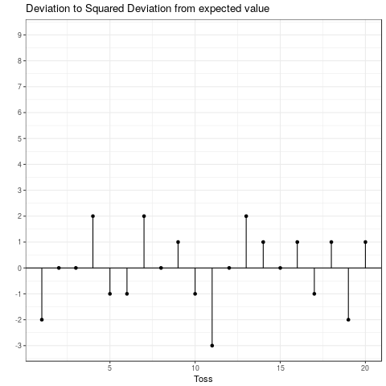

---
output:
  html_document:
    df_print: paged
  html_notebook: default
---

```{r, include=FALSE}
knitr::opts_chunk$set(echo = TRUE)
options(digits = 7)
```


### Probability Distributions

This chapter is primarily based on:

* Casella, G., & Berger, R. L. (2002). Statistical inference (Vol. 2). Pacific Grove, CA: Duxbury (**chapters 2&3**).

#### Introduction

In the previous chapter we talked about probability density/mass functions (PDFs/PMFs) and cumulative distribution functions (CDFs). We also discussed plots of those functions. 
A natural question to ask is "where do these distributions come from?". It turns out that many random variables follow well known distributions, the properties of which have been studied extensively. Furthermore, many observations in the real world (e.g. height data) can also be approximated with theoretical distributions. 
Let's consider our coin toss example. We did not actually toss thousands of coins to come up with their probability distribution. We modeled the population of coin tosses using their theoretical distribution (the [binomial distribution](#binomial-distribution)).

We say that a random variable $X$ *follows* or *has* some distribution. Distributions have parameters that influence the shape of the distribution function and if we do not explicitly specify the parameters we usually speak of a *family of distributions*. If $X$ follows the distribution $D$ and $a,\ b$ are its parameters, we write:

$$
X \sim D(a, b)
$$

Two important properties of a distribution are the *expected value* and the *variance*. We usually want to know what outcome we expect on average given a distribution. For this, we can use the concept of an expected value, denoted $\mathbb{E}[X]$. On the other hand, the variance $\left(Var(X)\right)$ gives us a measure of spread around the expected value. If the variance is high, values far away from the expected value are more likely. Similarly, if the variance is low, values far away from the mean are less likely. These concepts may seem somewhat abstract, but will become clear after a few examples.

We will now introduce common families of distributions, starting again with discrete examples and then moving on to the continuous case.

#### Discrete Distributions

For discrete distributions the expected value is defined as the sum of all possible values weighted by their respective probability. Intuitively, values that are very unlikely get less weight and those that are very likely get more weight. This can be written as

$$
	\mathbb{E}[X] = \sum_{x} x f_{X}(x) = \sum_x x P(X = x) 
$$

The variance is defined as

$$
Var(X) = \mathbb{E}\left[\left(X - \mathbb{E}[X] \right)^2 \right] = \mathbb{E}[X^{2}] - ( \mathbb{E}[X])^{2}
$$

This is the expected squared deviation from the expected value. Taking the squared deviation always yields a positive value. Additionally, larger deviations are emphasized. This is visualized in the plot below, which shows the transformation from the deviation from the expected value to the squared deviation from the expected value. Some observations: The tosses that do not deviate from the mean and those that only deviate by 1 stay the same when squared. Those that are $-1$ become $+1$ and all others become positive and increase compared to their absolute value.

<center>

</center>

<a id="binom"></a>

##### Binomial Distribution

Our first example of a discrete distribution has to do with coin tosses again. It turns out that the random variable "number of heads observed" follows a very common distribution, the **binomial distribution**. This can be written as follows: $X$ being the number of heads observed,

$$
X \sim binomial(n, p)
$$

where $n$ is the number of coins and $p$ is the probability of observing heads. Here $n,\ p$ are the _parameters_ of the *binomial* distribution. 

<p><iframe src="https://learn.wu.ac.at/shiny/imsm/dist_binom/" style="border: medium; width: 800px; height: 400px"></iframe></p>

The binomial distribution can be used whenever you conduct an experiment composed of multiple trials where there are two or more possible outcomes, one of which is seen as "success". The idea is based on the concept of [Bernoulli trials](https://en.wikipedia.org/wiki/Bernoulli_trial), which are basically a binomial distribution with $n=1$. A binomial distribution can also be used for dice, if we are interested in the number of dice that show a particular value, say $1$. 

1. Throw any number of dice, say $5$.
2. For each die check if it shows $1$.
3. If yes add 1, if no, do not add anything.
4. The random variable is the final number and follows a binomial distribution with $p = \frac{1}{6},\ n = 5$.

So, given the parameters $p,\ n$ of the binomial distribution what are the expected value and the variance?

Let's start with the coin toss with a fair coin:
Let $p = 0.5,\ n = 1$ and $X_{0}$ is again the number of heads observed. We sum over all possibilities and weigh by the probability:

$$
0.5 * 1 + 0.5 * 0 = 0.5 = \mathbb{E}[X_{0}]
$$

What happens if we change the probability of observing heads to $0.8$?
Then the random variable $X_1$ has expectation

$$ 
0.8 * 1 + 0.2 * 0 = 0.8 = \mathbb{E}[X_{1}]
$$ 

What happens if we change the number of coins to $2$ and keep $p = 0.8$?
Then the random variable $X_2$ has expectation

$$
\underbrace{0.8 * 1 + 0.2 * 0}_{\text{first coin}} + \underbrace{0.8 * 1 + 0.2 * 0}_{\text{second coin}} = 2 * 0.8 = 1.6 = \mathbb{E}[X_{2}]
$$

In general you can just sum up the probability of "success" of all the coins tossed.
If $X\sim binomial(n,\ p)$ then

$$
\mathbb{E}[X] = n * p
$$

for any appropriate $p$ and $n$. 

The variance is the expected squared deviation from the expected value. Let's look at a single toss of a fair coin again ($p = 0.5,\ n = 1$). We already know the expected value is $\mathbb{E}[X_0] = 0.5$. When we toss the coin we could get heads such that $x = 1$ with probability $p = 0.5$ or we could get tails such that $x = 0$ with probability $1-p = 0.5$. In either case we deviate from the expected value by $0.5$. Now we use the definition of the expectation as the weighted sum and the fact that we are interested in the squared deviation

$$
Var(X_0) = 0.5 * (0.5^2) + 0.5 * (0.5^2) = 2 * 0.5 * (0.5^2) = 0.5 - 0.5^2 = 0.25
$$

What happens if we change the probability of observing heads to $0.8$?
Now the expected value is $\mathbb{E}[X_{1}] = 0.8$ and we deviate from it by $0.2$ if we get heads and by $0.8$ if we get tails. We get

$$
Var(X_1) = \underbrace{0.8}_{p(h)} * \underbrace{(0.2^2)}_{deviation} + 0.2 * (0.8^2) = 0.8 - 0.8^2 = 0.16
$$

Generally, for any $n$ and $p$, the variance of the binomial distribution is given by 

$$
Var(X_i) = n * (p-p^2)
$$

or, equivalently:

$$
n * (p - p^2) = np - np^2 = np * (1-p) = Var(X_i)
$$

The derivation of this equation can be found in the [Appendix](#appendix).


You can work with the binomial distribution in R using the ```binom``` family of functions. In R, a distribution usually has four different functions associated with it, differentiated by the letter it begins with. The four letters these functions start with are ```r```, ```q```, ```p``` and ```d```.

* ```rbinom()```: Returns ```r```andom draws from the binomial distribution with specified $p$ and $n$ values.
* ```pbinom()```: Returns the cumulative ```p```robability of a value, i.e. how likely is the specified number or less, given $n$ and $p$. 
* ```qbinom()```: Returns the ```q```uantile (See [Quantile Function](https://en.wikipedia.org/wiki/Quantile_function)) of a specified probability value. This can be understood as the inverse of the ```pbinom()``` function.
* ```dbinom()```: Returns the value of the probability mass function, evaluated at the specified value (in case of a continuous distribution, it evaluates the probability ```d```ensity function). 

<iframe width='100%' height='600' src='https://rdrr.io/snippets/embed/?code=print(%22Random%20sample%20with%2010%20observations%3A%22)%0Arbinom(10%2C%202%2C%20%20prob%20%3D%200.8)%20%0Aprint(%22Quantile%20function%3A%22)%0Aqbinom(0.37%2C%202%2C%20prob%20%3D%200.8)%20%0Aprint(%22CDF%3A%22)%20%0Apbinom(1%2C%202%2C%20prob%20%3D%200.8)%0Aprint(%22PMF%3A%22)%20%0Adbinom(2%2C%202%2C%20prob%20%3D%200.8)%0A' frameborder='0'></iframe>

##### Discrete Uniform Distribution

The discrete uniform distribution assigns the same probability to all possible values. Below you can find the PMF and CDF of a uniform distribution that starts at one and goes to ten.

```{r, echo = FALSE}
library(ggplot2)
dat <- data.frame(x = 1:10, y = rep( ( 1 / 10), time = 10))
ggplot(dat, aes(x = x, y = y)) +
  geom_linerange(aes(ymin = 0, ymax = y)) +
  geom_point() +
  geom_line(aes(x = 1:10, y = rep(0, times = 10))) +
  theme_bw() +
  scale_x_continuous(breaks = c(1:10)) +
  lims(y = c(0, 0.15)) +
  labs(y = "Probability Mass", x = "Event",
       title = "PMF of a Discrete Uniform Distribution")

cdfdat <- data.frame(y = cumsum(rep(0.1, times = 10)), x = 1:10)
ggplot(cdfdat, aes(x = x, y = y)) +
  geom_segment(aes(x = x, xend = (x + 1), yend = y)) +
  geom_point() +
  theme_bw() +
  labs(y = "Cumulative Probability", x = "Event",
       title = "CDF of a Discrete Uniform distribution") +
  scale_x_continuous(breaks = c(0:10))
```

To calculate the expected value of this distribution let's first look at how to easily sum the numbers from $1$ to some arbitrary $N$. That is $1 + 2 + 3 + \dots + N =$ ?. Let $S = 1 + 2 + 3 + \dots + N = \sum_{i = 1}^N i$. Then

\begin{align*}
S &= 1 + 2 + 3 + \dots + (N-2) + (N-1) + N \\
\text{This can be rearranged to:} \\
S &= N + (N-1) + (N-2) + \dots + 3 + 2 + 1 \\
\text{Summing the two yields:} \\
2 * S &= (1 + N) + (2 + N - 1) + (3 + N - 2) + \dots + (N -2 + 3) + (N - 1 + 2) + (N + 1)\\
&= (1 + N) + (1+N) + (1+N) + \dots + (1+N) + (1+N) + (1+N) \\
&= N * (1 + N) = 2 * S \\
\text{It follows that:}\\
S&= \frac{N * (1 + N)}{2}
\end{align*}

The weight given to each possible outcome must be equal and is thus $p = \frac{1}{N}$. 
Recall that the expected value is the weighted sum of all possible outcomes.
Thus if $X \sim discrete\ uniform(N)$
$$
\mathbb{E}[X] = \sum_{i = 1}^N p * i = \sum_{i = 1}^N \frac{1}{N}* i = \frac{1}{N} \sum_{i = 1}^N i = \frac{1}{N} * S = \frac{1}{N} * \frac{N * (1 + N)}{2} = \frac{(1 + N)}{2}
$$

Figuring out the variance is a bit more involved. Since we already know $\mathbb{E}[X]$ we still need $\mathbb{E}[X^{2}]$. Again we apply our equal weight to all the elements and get

$$
\mathbb{E}[X^{2}] = \sum_{x = 1}^n x^2 * \frac{1}{N} = \frac{1}{N} \sum_{x = 1}^N x^2 
$$

Therefore we need to find out what $1 + 4 + 9 + 16 + \dots + N^2$ is equal to. Luckily, [there exists a formula for that](https://www.khanacademy.org/math/calculus-home/series-calc/series-basics-challenge/v/sum-n-squares-2):

$$
\sum_{x=1}^N x^2 = \frac{N * (N + 1) * (2*N + 1)}{6}
$$

Thus,

$$
\mathbb{E}[X^{2}] = \frac{(N + 1) * (2*N + 1)}{6}
$$

and

$$
Var(X) = \mathbb{E}[X^2] - \mathbb{E}[X]^2 = \frac{(N + 1) * (2*N + 1)}{6} - \left(\frac{(1 + N)}{2}\right)^{2} = \frac{(N+1) * (N-1)}{12}
$$

Note that these derivations are only valid for a uniform distribution that starts at one. However the generalization to a distribution with an arbitrary starting point is [fairly straightforward](https://en.wikipedia.org/wiki/Discrete_uniform_distribution). 

#### Continuous Distributions

As mentioned in the last chapter, a distribution is continuous if the cumulative distribution function is a continuous function (no steps!). 

```{r, echo = FALSE, message = FALSE, warnings = FALSE}
library(cowplot)

cdf <- ggplot(data.frame(x = c(-5, 5)), aes(x)) +
  stat_function(fun = punif, args = list(min = -5, max = 5), geom = "line", aes(color = "Uniform")) +
  stat_function(fun = pnorm, geom = "line", aes(color = "Normal")) + 
  labs(x = "Value", y = "Cumulative Probability", title = "CDF of continuous distributions") +
  theme_bw() +
  theme(legend.title=element_blank(), legend.pos = "bottom")
pdf <- ggplot(data.frame(x = c(-5, 5)), aes(x)) +
  stat_function(fun = dunif, args = list(min = -5, max = 5), geom = "line", aes(color = "Uniform")) +
  stat_function(fun = dnorm, geom = "line", aes(color = "Normal")) + 
  labs(x = "Value", y = "Probability density", title = "PDF of  continuous distributions") +
  theme_bw() +
  theme(legend.title=element_blank(), legend.pos="bottom")
plot_grid(cdf, pdf, align = c(axis = "b"), rel_widths = 1)
```

As a consequence we cannot simply sum up values to get an expected value or a variance. We are now dealing with real numbers and thus there are infinitely many values between any two arbitrary numbers that are not equal.

Therefore, instead of the sum we have to evaluate the integral of all the possible values weighted by the probability density function (the continuous equivalent to the probability mass function). 

$$
\mathbb{E}[X] = \int_{-∞}^{∞} x f_{X}(x) dx
$$

where $f_X(x)$ is the density of the random variable $X$ evaluated at some point $x$ and the integral over $x$ ("$dx$") has the same purpose as the sum over $x$ before. 

##### Uniform Distribution

To illustrate the concept of the integral the continuous uniform distribution provides a simple example. As in the discrete case it assigns equal weight to each equally sized interval in the area on which the variable is defined ($[a, b]$). Why each interval and not each value? Since there are infinitely many values between $a$ and $b$ (again due to real numbers) each individual value cannot be assigned a probability small enough for all of the probabilities to sum to $1$ (which is a basic requirement of a probability). Thus we can only assign a probability to an interval, e.g. $[0, 0.001]$, of which only *finitely* many exist between $a$ and $b$, e.g. $a = -2$ and $b = 1$. In this example there exist $3,000$ intervals of values $[x, x + 0.001]$. Since we are dealing with intervals the probability density can be thought of as the area under the PDF for a given interval or the sum of the areas of *very small* intervals within the chosen interval. 


The PDF is defined as

$$
f_X(x) = \frac{1}{b-a} \text{ if } x \in [a, b], \ 0 \text{ otherwise}
$$

That is, the weight $\frac{1}{b-a}$ is assign to values in the interval of interest and all other values have weight $0$. As already mentioned *all* values between $a$ and $b$ have to be considered. Thus, in order to calculate the expected value and the variance we have to integrate over $x$.

$$
\mathbb{E}[X] = ∫_a^b x * \frac{1}{b-a} dx = \frac{b+a}{2}
$$

If you plug in $a = 1$ in the formula above you can see the relation to the discrete uniform distribution and the similar role of integral and summation. Notice also how the expectation operator "translates" to the integral. For the expectation of $X$ we integrate over all $x$, the possible realizations of $X$, weighted by the PDF of $X$. Now, in order to get the variance we want to calculate the expected squared deviation from the expected value.

\begin{align*}
Var(X) &= \mathbb{E}\left[(X - \mathbb{E}[X])^{2} \right] = \mathbb{E}\left[\left(X - \frac{b+a}{2}\right)^2\right] \\
&= ∫_a^b \left(x - \frac{b+a}{2}\right)^2 * \frac{1}{b-a} dx = \frac{(b-a)^2}{12}
\end{align*}

Clearly the Uniform distribution can be used whenever we want to model a population in which all possible outcomes are equally likely. 

<iframe src="https://learn.wu.ac.at/shiny/imsm/dist_uniform/" style="border: none; width: 800px; height: 650px"></iframe>

##### Normal distribution

The normal distribution is probably the most widely known one. Its PDF is the famous bell curve. It has two parameters $\mu$, and $\sigma^2$. $\mu$ is the mean and $\sigma^2$ the variance of the distribution. In the case of $\mu = 0,\ \sigma^2 = 1$ it is called the *standard normal distribution*.

The Normal distribution has a few nice properties. It is symmetric around the mean which is nice whenever we want to express the believe that values are less likely the further we get away from the mean but we do not care in which direction. In addition, it can be used to approximate many other distributions including the Binomial distribution under certain conditions (see [Central Limit Theorem](#central-limit-theorem)). The normal distribution can be *standardized*, i.e. given any random normal variable, $X\sim N(\mu, \sigma^2)$, we can get a *standard normal* variable $Y \sim N(0, 1)$ where $Y = \frac{X - \mu}{\sigma}$. This means that we can perform calculations using the standard normal distribution and then recover the results for any normal distribution since for a standard normal $Y\sim N(0,1)$ we can get to any $X \sim N(\mu, \sigma^{2})$ by defining $X = \mu + \sigma * Y$ by just rearranging the formula above. In the application below you can see the PDF and CDF of the normal distribution and set a mean and a standard deviation. Try to get an intuition about why this simple transformation works. First change only the mean and observe that the shape of the PDF stays the same and its *location* is shifted. Starting from a normal distribution with $μ = 0$ and setting $\mu = 4$ is equivalent to adding $4$ to each value (see table of percentiles). Similarly changing the standard deviation from $σ = 1$ to $σ = 2,\ 3,\ 4, \dots$ is equivalent to multiplying each value with $2,\ 3,\ 4, \dots$. 

<iframe src="https://learn.wu.ac.at/shiny/imsm/dist_normal/" style="border: none; width: 800px; height: 550px"></iframe>

The normal PDF is defined as

$$
f(x | μ, σ) = \frac{1}{\sqrt{2πσ^{2}}} e^{-\frac{1}{2}\frac{(x-\mu)^2}{σ^2}}
$$

The first part $\left(\frac{1}{\sqrt{2\piσ^2}}\right)$ scales the density down at each point as the standard deviation is increased because $\sigma$ is in the denominator. When you increase the standard deviation in the application above you will see that the density gets lower on the whole range. Intuitively the total mass of $1$ needs to be distributed over more values and is thus less in each region. The second part $\left(e^{-\frac{1}{2}\frac{(x-μ)^2}{\sigma^2}}\right)$ re-scales regions based on how far they are away from the mean due to the $(x-\mu)^2$ part. Notice that values further away from the mean are re-scaled more due to this. The negative sign in the exponent means that the scaling is downward. $\sigma^2$ in the denominator tells us that this scaling is reduced for higher $\sigma^2$ and "stronger" for lower $\sigma^2$. In other words: as $\sigma$ is increased regions further away from the mean get more probability density. If the standard deviation is set to $1$ for example there is almost no mass for values that deviate from the mean by more than $2$. However, if we set $\sigma = 10$ the 75th percentile is at $6.75$. That is, 25\% of values lie above that value. Equivalently, if we take the integral from $6.75$ to $∞$ we will get $0.25$. Remember that the integral is just the surface area under the curve in that interval. This is also equivalent to saying that if we draw from a normal distribution with $\mu=0,\ \sigma = 10$ the probability of getting *at least* $6.75$ is 25\%.

The CDF is defined as

$$
P(X \leq x) = \frac{1}{\sqrt{2 \pi σ^2}} \int_{-∞}^x e^{-\frac{1}{2}\frac{-(t-μ)^2}{σ^2}} dt
$$

Notice that this is just the integral of the density up to a point $x$. 

<iframe src="https://learn.wu.ac.at/shiny/imsm/dist_normal_integral/" style="border: none; width: 800px; height: 340px"></iframe>

When using the Normal distribution in R one has to specify the standard deviation $\sigma$ rather than the variance $\sigma^2$. Of course sometimes it is easier to pass `sqrt(variance)` instead of typing in the standard deviation. For example if $Var(X) = 2$ then $SD(X) = \sqrt{2} =  1.41421356\dots$ and it is easier to call `rnorm(10, 0, sqrt(2))` to generate 10 random numbers from a Normal distribution with $\mu = 0, \sigma^2 = 2$.

<iframe width='100%' height='600' src='https://rdrr.io/snippets/embed/?code=print(%22Random%20sample%3A%22)%0Arnorm(10%2C%20mean%20%3D%200%2C%20sd%20%3D%2010)%0Aprint(%22Quantile%20function%3A%22)%0Aqnorm(0.75%2C%20mean%20%3D%200%2C%20sd%20%3D%2010)%0Aprint(%22CDF%3A%22)%0Apnorm(6.75%2C%20mean%20%3D%200%2C%20sd%20%3D%2010)%0Aprint(%22PDF%3A%22)%0Adnorm(c(-10%2C%200%2C%2010)%2C%20mean%20%3D%200%2C%20sd%20%3D%2010)' frameborder='0'></iframe>
<!-- <iframe src="http://localhost:3838/learnNormaldens/normalCommands/" style="border: none; width: 800px; height: 900px"></iframe> -->

##### $\chi^2$ Distribution

The $\chi^2$ ("Chi-Squared") distribution has only one parameter, its *degrees of freedom*. The exact meaning of degrees of freedom will be discussed later when we are talking about hypothesis testing. Roughly, they give the number of *independent* points of information that can be used to estimate a statistic. Naming the parameter of the $\chi^2$ distribution degrees of freedom reflects its importance for hypothesis testing. That is the case since many models assume the data to be normally distributed and the $\chi^2$ distribution is closely related to the normal distribution. Explicitly if $X \sim N(0, 1)$ then $X^2 \sim \chi^2(1)$. That is, if we have one random variable with standard normal distribution and square it, we get a $\chi^2$ random variable with $1$ degree of freedom. How to exactly count the variables that go into a specific statistic will be discussed at a later point. If multiple squared independent standard normal variables are summed up the degrees of freedom increase accordingly.

$$
Q = ∑_{i = 1}^k X_i^2,\ X_{i} \sim N(0,1) \Rightarrow Q \sim \chi^2(k) 
$$

That is, if we square $k$ normal variables and sum them up the result is a $\chi^2$ variable with $k$ degrees of freedom

<iframe src="https://learn.wu.ac.at/shiny/imsm/dist_chisq/" style="border: none; width: 800px; height: 550px"></iframe>

Calculating the expected value, using the properties of the standard normal distribution, is simple.

Let $X \sim N(0,1)$. Then $Var(X) = \mathbb{E}[X^{2}] - \mathbb{E}[X]^2 =  \sigma^2 = 1$. Also, $\mathbb{E}[X] = \mu = 0$. Therefore, $\mathbb{E}[X^{2}] = 1$. Thus, the expected value of one squared standard normal variable is $1$. If we sum $k$ *independent* normal variables we get 

$$
\mathbb{E}[Q] = \sum_{i = 1}^k \mathbb{E}[X^{2}] = \sum_{i = 1 }^k 1 = k
$$

The derivation of the variance is a bit more involved because it involves calculating 

$$
\mathbb{E}[Q^{2}] = \mathbb{E}\left[\left(X^{2}\right)^2\right] = \mathbb{E}[X^{4}]
$$

where $Q\sim \chi^2(1)$ and $X \sim N(0,1)$. However, above we claimed that the Normal distribution has only two parameters, $\mu,\text{ and } \sigma^2$, for which we only need $\mathbb{E}[X]$ and $\mathbb{E}[X^{2}]$ to fully describe the Normal distribution. These are called the first and second <a target="_blank"  href="https://en.wikipedia.org/wiki/Moment_(mathematics)">moments</a> of the distribution. Equivalently, $\mathbb{E}[X^{4}]$ is the $4^{th}$ moment. We can express the $4^th$ moment in terms of the second moment for any variable that follows a Normal distribution. $\mathbb{E}[X^{4}] = 3 * \sigma^2$ for any Normal variable and thus $\mathbb{E}[X^{4}] = 3$ for Standard Normal variables. Therefore, $\mathbb{E}[Q^{2}] = 3 - \mathbb{E}[Q]^2 = 2$ for $Q \sim \chi^2(1)$. In general $Var(Q) = 2k$ for $Q \sim \chi^2(k)$ due to the *variance sum law* which states that the variance of a sum of independent variables is equal to the sum of the variances. Notice that this does not hold if the variables are **not** independent, which is why the independence of the Normal variables that go into the $\chi^2$ distribution has been emphasized. 

#### t-Distribution

Another important distribution for hypothesis testing is the t-distribution, also called Student's t-distribution. It is the distribution of the location of the mean of a sample from the normal distribution relative to the "true" mean ($\mu$). Like the $\chi^2$ distribution it also has only one parameter called the degrees of freedom. However, in this case the degrees of freedom are the number of draws from the normal distribution minus 1. They are denoted by the Greek letter nu ($\nu$). We take $n$ draws from a Normal distribution with mean $\mu$ and standard deviation $\sigma^2$ and let $\bar X = \frac{1}{n} \sum_{i = 1}^n x_i$ the sample mean and $S^{2} = \frac{1}{n-1}\sum_{i = 1}^n (x_i - \bar X)^2$ the sample variance. Then

 $$
 \frac{\bar X - \mu}{S/ \sqrt{n}}
 $$
 
 has a t-distribution with $\nu = n-1$ degrees of freedom.  Why $n-1$ and not $n$ as in the $\chi^2$ distribution? Recall that when constructing a $\chi^2(k)$ variable we sum up $k$ independent standard normally distributed variables but we have no intermediate calculations with these variables. In the case of the t-Distribution we "lose" a degree of freedom due to the intermediary calculations. We can notice this by multiplying and dividing the formula above by $\sigma$, the "true" variance of the $x_i$.
 
 \begin{align*}
& \frac{\bar X - \mu}{S/ \sqrt{n}} \\
=& \frac{\bar X - \mu}{S/ \sqrt{n}} \frac{\frac{1}{\sigma/\sqrt{n}}}{\frac{1}{\sigma/\sqrt{n}}}  = \frac{(\bar X - \mu)/(\sigma/\sqrt{n})}{\frac{(S/\sqrt{n})}{(\sigma/\sqrt{n})}}\\
=& \frac{(\bar X - \mu)/(\sigma/\sqrt{n})}{\frac{S}{\sigma}}\\
=& \frac{(\bar X - \mu)/(\sigma/\sqrt{n})}{\sqrt{S^2/\sigma^2}}
\end{align*}

Now recall the definition of $S^2 = \frac{1}{n-1} \sum_{i=1}^n (x_i - \bar X)^2$ which is the sum of $n-1$ independent normally distributed variables, divided by $n-1$. Only $n-1$ are independent since given an mean computed from $n$ variables only $n-1$ can be chosen arbitrarily. 

Let $\bar X(n) = \frac{1}{n} \sum_{i=1}^n x_i$ 
Then

$$
x_n = \bar X(n) - \sum_{i = 1}^{n-1} x_i
$$

and thus $x_n$ is not independent. 

We already know the distribution of $n-1$ squared standard normally distributed variables. We introduced the $\sigma$ term in order to normalize the variable. Therefore the denominator is 

$$
\sqrt{\frac{\chi^2_{n-1}}{(n-1)}}
$$

Notice that as the degrees of freedom approach infinity the t-Distribution becomes the Standard Normal Distribution.

<iframe src="https://learn.wu.ac.at/shiny/imsm/dist_t/" style="border: none; width: 800px; height: 400px"></iframe>


#### F-Distribution

The F-Distribution is another derived distribution which is important for hypothesis testing. It can be used  to compare the variability (i.e. variance) of two populations given that they are normally distributed and independent. Given samples from these two populations the F-Distribution is the distribution of

$$
\frac{S^2_1 / S^2_2}{\sigma^2_1/\sigma^2_2} = \frac{S^2_1/\sigma^{2}_1}{S^2_2/\sigma^2_2}
$$

As shown above both the numerator and the denominator are $\chi^2(n-1)$ divided by the degrees of freedom

$$
F_{n-1, m-1} = \frac{\chi^2_{n-1}/(n-1)}{\chi^2_{m-1}/(m-1)}
$$


### Appendix

#### Derivation of the varaince of the binomial distribution

Notice that the sum follows this pattern for $n = 1$ and any appropriate $p$:

$$
Var(X_i) = p * (1-p)^2 + (1-p) * p^2 
$$

If we expand the squared term and simplify:

\begin{align*}
Var(X_i) &= p * (1 - 2*p + p^2) + p^2 - p^3 \\
&= p - 2*p^2 + p^3 + p^2 - p^3 \\
&= p - p^2
\end{align*}

What happens if we change the number of coins to $2$ and keep $p=0.8$?

$$
Var(X_2) = 0.8 * 0.2^2 + 0.2 * 0.8^2 + 0.8 * 0.2^2 + 0.2 * 0.8^2 = 2 * (0.8 * 0.2^2 + 0.2 * 0.8^2) = 2 * (0.8 - 0.8^2) = 0.32
$$

Since increasing $n$ further simply adds more of the same terms we can easily adapt the general formula above for any appropriate $n$ and $p$:

$$
Var(X_i) = n * (p-p^2)
$$

Equivalently this formula can be written as:

$$
n * (p - p^2) = np - np^2 = np * (1-p) = Var(X_i)
$$

