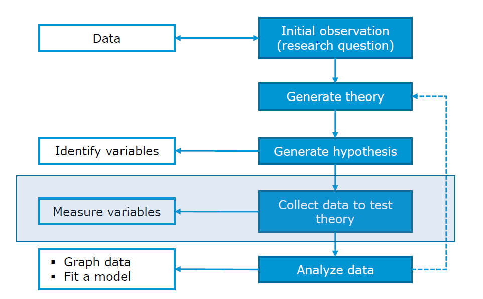
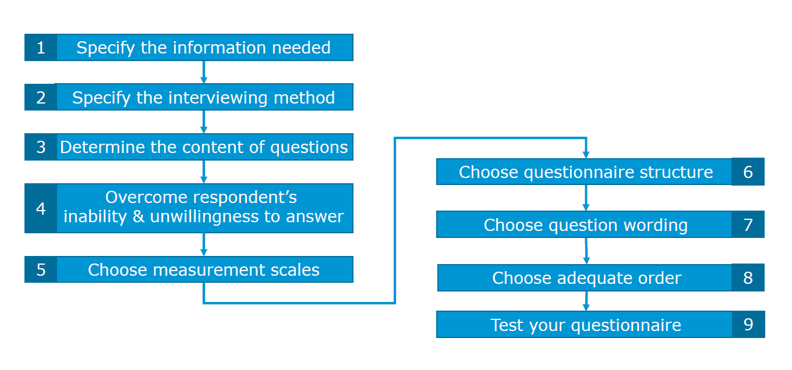
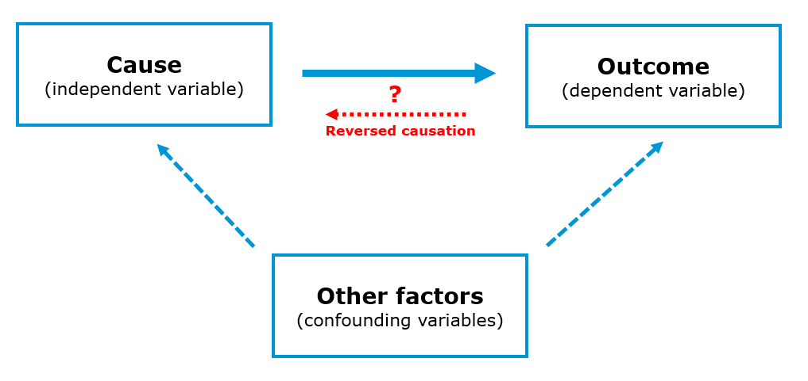
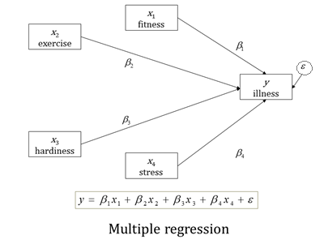

---
title:"18-Questionnaire_design"
output:
  pdf_document:
    toc: yes
  html_notebook: default
  html_document:
    toc: yes
    df_print: paged
---

```{r setup, include=FALSE}
knitr::opts_chunk$set(echo = TRUE)
```


# Questionnaire design  
Welcome to the questionnaire design guide!

An aim of this course is to develop your ability to translate business problems into actionable research questions and to design an adequate research plan to answer these questions. In order to do so, you need to become familiar with conducting a survey.

Generally, what you can expect from the survey design is similar to what one experiences in a relationship. If you try to take more than you commit, it doesn’t work out. Now on a serious note, if you follow guidelines mentioned here, you will certainly avoid usual traps your fellow collegues were caught in.

In a research process, conducting a survey is a part of (primary) data collection. Before we collect data we have to make sure that preceding steps such as problem definition are correctly done. However, in the following sections we will focus on the process of designing a questionnaire, so that you are eventually able to collect relevant data and apply appropriate statistical tests.    

```{r,echo=FALSE,out.width = '70%',fig.align='center'}

```


## Questionnaire design process  
A structured questionnaire is a research instrument designed to elicit specific information from a sample of a target population. Usually it is used in a standardized way with fixed-alternative questions (same questions and response options for all respondents).

An objective of a questionnaire is threefold:

* to translate the information need into a set of specific questions that the respondent can and will answer,
* to motivate, and encourage respondents to become involved, to cooperate, and to complete the questionnaire,
*  to minimize response error.

In order to meet these objectives, a questionnaire design process suggests the following sequence of steps:

```{r,echo=FALSE, out.width = '70%',fig.align='center'}

```

### Specification of the information needed  
The questionnaire design should be aligned with the research design!
In order to do make it aligned, it is necessary to review components of the problem and the approach. In particular, you should review the research questions, hypotheses and characteristics that influence the research design.  

If you are interested in the causal effect of one particular (independent) variable on another (dependent) variable, think about an experimental design that might allow you to manipulate this variable. In this case, you particularly have to decide on the following:  

* Which variable to manipulate?  
* Whether to use a between-subjects or within-subjects design?  
* The cause-effect sequence (the cause must occur before the effect)  
* The number of experimental conditions  
* Potential interactions and relationships with other variables (does the effect depend on another variable?)

What you need to be careful about is the effect of **reversed causation**. The effect refers to the situation where the causal relationship could possible have an opposite direction from what we assumed at the first place. For instance, it is often assumed that an increase in individual income leads to increase in well-being (happiness). However, some [researches](https://www.ncbi.nlm.nih.gov/pubmed/16949692) suggest that this causation could have an opposite direction, i.e. that actually increase in well-being of an individual leads to an increase in income.  

Here are some examples of causal research design applications:  

* To assess how a product's country-of-origin impacts attractiveness across different countries.  
* To analyse the effects of rebranding on customer loyalty.  

```{r,echo=FALSE, out.width = '70%',fig.align='center'}

```


If you would like to analyze the effects of multiple categorical or continuous (independent) variables on one continuous (dependent) variable, you might use a regression model. When doing this, you particularly have to decide on:  

* How to measure **the dependent variable (DV)**. This is particularly important, since you need a variable that is powerful in uncovering variation between subjects (e.g., open-ended questions, such as "How much are you willing to pay for this product" are good candidates). Moreover, you also need to consider the nature of your DV,i.e. whether it is an interval variable, ordinal or categorical variable. The nature of your DV will heavily influence your choice of a correct statistical test.

* How to measure **the independent variables (IV)** (single-item vs. multi-item scales, categorical vs. continuous). Bear in mind that the nature of the IV, together with DV, affects your choice of a statistical test as well.  

* What other variables might cause the effect that you would like to investigate (to prevent omitted variable bias, i.e. variables that are not part of your model but still influence the dependent variable).

* Potential interactions (e.g., is the effect of variable X stronger for group A vs. B?)


```{r, echo=FALSE, out.width = '70%',fig.align='center'}

```

### Specify the interviewing method  
In the next step you should review the type of interviewing method you will use.
At this point you need to think in which setting you aim to conduct your survery. For instance, should you do it in a face-to-face setting or rather online. Here you can find some advantages and disadvantages of online surveys:
```{r, echo=F, fig.align='center'}
knitr::include_graphics("adv-disadv-online-questionnaire.png")
```

Additionally, here is the list of the online tools you can use to conduct an online survey (usually for free):  

- [Qualtrics](http://www.qualtrics.com/free-account/)
- [Google form](https://www.google.com/forms/about/)
- [Survey monkey](https://www.surveymonkey.com/)
- [Free online surverys](http://freeonlinesurveys.com/)
- [Kwik surveys](http://kwiksurveys.com/)

### Determine the content of questions  
In this step you are starting to work on the content of you questions. There are several questions you should ask yourself when writing questions:  

* Is the question necessary? Will I obtain the needed information?  
* Are several questions needed instead of one?  
* What type of data I will receive by asking that question (categorical or continuious)?  

In your survey try to avoid asking **double-barrelled questions.**Those are 
a single question that attempts to cover two issues. Such questions can be confusing to respondents and result in ambiguous responses. Instead, you might ask multiple questions in order to obtain the inteded information.  

<span style="color: red;"><B>Incorrect:</B></span>  
Do you think Nike Town offers better variety and prices than other Nike stores?    

<span style="color: green;"><B>Correct:</B></span>  
Do you think Nike Town offers better variety than other Nike stores?  
Do you think Nike Town offers better prices than other Nike stores?
           
### Inability and unwillingness to answer  
The quality of collected data you highly depends on your ability to address correct participants. Therefore, you need to make sure that your respondents are able to meaningfully answer your questions.   

Examples:  

* Not every household member might be informed about monthly expenses for groceries purchases if someone else makes these purchases.   
* Use filter questions that measure familiarity and product use.  
* Include a “don’t know” option.  
* If you ask participants for monteray values (e.g. how much are you ready to pay for the XY product?) across several EU, make sure you indicate correct currency (e.g. HRK for Croatia or HUF for Hungary).  
* Think about how mobile friendly is the layout of your survey (if it is an online survey).
* Good case practices suggest that there should not be more than 2 questions per page (for online surveys displayed on mobile phones).


If you are asking participants to recall certain brands for instance, make sure you use **unaided recall question:**  

<span style="color: green;"><B>Example of unaided recall question:</B></span>  
What brands of soft drinks do you remember being advertised on TV last night?  
<span style="color: red;"><B>Example of aided recall question:</B></span>  
Which of these brands were advertised last night on TV?  
a) Coca-Cola  
b) Pepsi  
c) Red Bull        
d) Evian     
e) Don’t know


If you are asking participants to list something, the good case practice is **to minimize the effort required by respondents:**  

<span style="color: red;"><B>Incorrect:</B></span>     
Please list all the departments from which you purchased merchandise on your most recent shopping trip to department store X.    
<span style="color: green;"><B>Correct:</B></span>     
Please check all the departments from which you purchased merchandise on your most recent shopping trip to a department store:    
a) Women’s dresses  
b) Men’s apparel  
c) Children’s apparel  
d) Cosmetics  
e) Jewelry    
f) Other (please specify) ___________


In a case you are asking for information that could be considered sensitive (e.g. money, family life, political beliefs, religion), they should come at the end of the questionnaire. Moreover, it is recommendable to provide response categories rather than asking for specific figures:  

<span style="color: red;"><B>Incorrect:</B></span>         
What is your household’s exact annual income?      
<span style="color: green;"><B>Correct:</B></span>           
Which one of the following categories best describes your household’s annual gross income?    
a) under 25.001 €    
b) 25.001€ to 50.000 €    
c) 50.001€ to 75.000 €    
d) 75.001€ to 100.000 €   
e) over 100.000 €    


