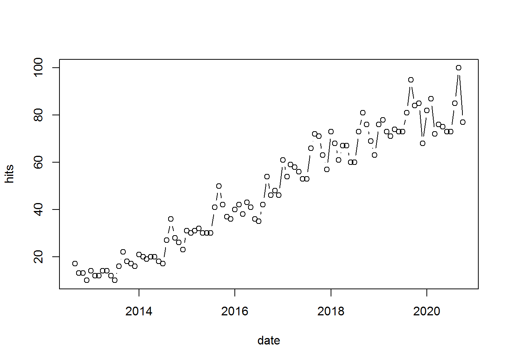
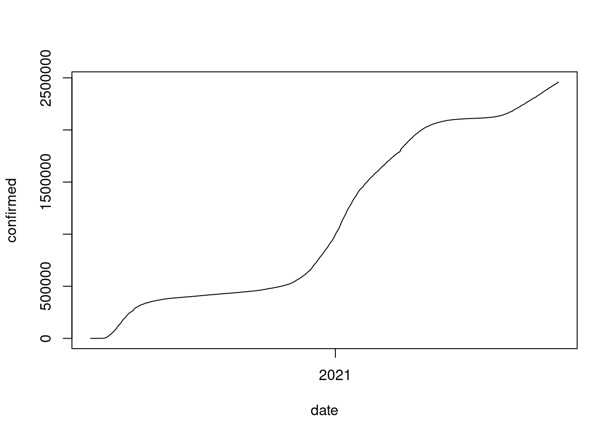

---
output:
  html_document:
    toc: yes
  html_notebook: default
  pdf_document:
    toc: yes
---

## Data import and export 


::: {.infobox .download data-latex="{download}"}
[You can download the corresponding R-Code here](./Code/02-data_import.R)
:::

<br>
<div align="center">
<iframe width="560" height="315" src="https://www.youtube.com/embed/rMArARTb-jo" frameborder="0" allowfullscreen></iframe>
</div>
<br>

Before you can start your analysis in R, you first need to import the data you wish to perform the analysis on. You will often be faced with different types of data formats (usually produced by some other statistical software like SPSS or Excel or a text editor). Fortunately, R is fairly flexible with respect to the sources from which data may be imported and you can import the most common data formats into R with the help of a few packages. R can, among others, handle data from the following sources: 


In the previous chapter, we saw how we may use the keyboard to input data in R. In the following sections, we will learn how to import data from text files and other statistical software packages. 

### Getting data for this course

Most of the data sets we will be working with in this course will be stored in text files (i.e., .dat, .txt, .csv). All data sets we will be working with are stored in a repository on GitHub (similar to other cloud storage services such as Dropbox). You can directly import these data sets from GitHub without having to copy data sets from one place to another. If you know the location, where the files are stored, you may conveniently load the data directly from GitHub into R using the ```read.table()``` function. The ```header=TRUE``` argument indicates that the first line of data represents the header, i.e., it contains the names of the columns. The ```sep="\t"```-argument specifies the delimiter (the character used to separate the columns), which is a TAB in this case.


```r
test_data <- read.table("https://raw.githubusercontent.com/IMSMWU/Teaching/master/MRDA2017/test_data.dat",
    sep = "\t", header = TRUE)
head(test_data)
```

Note that it is also possible to download the data from the respective folder on the "Learn\@WU" platform, placing it in the working directory and importing it from there. However, this requires an additional step to download the file manually first. If you chose this option, please **remember to put the data file in the working directory first**. If the import is not working, check your working directory setting using ```getwd()```. Once you placed the file in the working directory, you can import it using the same command as above. Note that the file must be given as a character string (i.e., in quotation marks) and has to end with the file extension (e.g., .csv, .tsv, etc.).


```r
test_data <- read.table("test_data.csv", header = TRUE,
    sep = ",")
head(test_data)
```

### Import data created by other software packages

Sometimes, you may need to import data files created by other software packages, such as Excel or SPSS. In this section we will use the ```readxl``` and ```haven``` packages to do this. To import a certain file you should first make sure that the file is stored in your current working directory. You can list all file names in your working directory using the ```list.files()``` function. If the file is not there, either copy it to your current working directory, or set your working directory to the folder where the file is located using ```setwd("/path/to/file")```. This tells R the folder you are working in. Remember that you have to use ```/``` instead of ```\``` to specify the path (if you use Windows paths copied from the explorer they will not work). When your file is in your working directory you can simply enter the filename into the respective import command. The import commands offer various options. For more details enter ```?read_excel```, ```?read_spss``` after loading the packages.


```r
# import excel files
library(readxl)  #load package to import Excel files
excel_sheets("test_data.xlsx")
survey_data_xlsx <- read_excel("test_data.xlsx", sheet = "mrda_2016_survey")  # 'sheet=x'' specifies which sheet to import
head(survey_data_xlsx)

library(haven)  #load package to import SPSS files
# import SPSS files
survey_data_spss <- read_sav("test_data.sav")
head(survey_data_spss)
```

The import of other file formats works in a very similar way (e.g., Stata, SAS). Please refer to the respective help-files (e.g., ```?read_dta```, ```?read_sas``` ...) if you wish to import data created by other software packages. 

### Import data from Qualtrics

There is also a dedicated package 'qualtRics' which lets you conveniently import data from surveys you conducted via Qualtrics. Simply export your data from Qualtrics as a .csv file (standard option) and you can read it into R as follows:  


```r
library(qualtRics)
qualtrics <- read_survey("qualtrics_survey.csv")
head(qualtrics)
```

<div data-pagedtable="false">
  <script data-pagedtable-source type="application/json">
{"columns":[{"label":["StartDate"],"name":[1],"type":["dttm"],"align":["right"]},{"label":["EndDate"],"name":[2],"type":["dttm"],"align":["right"]},{"label":["Status"],"name":[3],"type":["dbl"],"align":["right"]},{"label":["IPAddress"],"name":[4],"type":["chr"],"align":["left"]},{"label":["Progress"],"name":[5],"type":["dbl"],"align":["right"]},{"label":["Duration (in seconds)"],"name":[6],"type":["dbl"],"align":["right"]},{"label":["Finished"],"name":[7],"type":["dbl"],"align":["right"]},{"label":["RecordedDate"],"name":[8],"type":["dttm"],"align":["right"]},{"label":["ResponseId"],"name":[9],"type":["chr"],"align":["left"]},{"label":["RecipientLastName"],"name":[10],"type":["lgl"],"align":["right"]},{"label":["RecipientFirstName"],"name":[11],"type":["lgl"],"align":["right"]},{"label":["RecipientEmail"],"name":[12],"type":["lgl"],"align":["right"]},{"label":["ExternalReference"],"name":[13],"type":["lgl"],"align":["right"]},{"label":["LocationLatitude"],"name":[14],"type":["dbl"],"align":["right"]},{"label":["LocationLongitude"],"name":[15],"type":["dbl"],"align":["right"]},{"label":["DistributionChannel"],"name":[16],"type":["chr"],"align":["left"]},{"label":["UserLanguage"],"name":[17],"type":["chr"],"align":["left"]},{"label":["Q2"],"name":[18],"type":["dbl"],"align":["right"]},{"label":["Q2_3_TEXT"],"name":[19],"type":["lgl"],"align":["right"]},{"label":["Q3_1"],"name":[20],"type":["dbl"],"align":["right"]},{"label":["Q3_2"],"name":[21],"type":["dbl"],"align":["right"]},{"label":["Q3_3"],"name":[22],"type":["dbl"],"align":["right"]},{"label":["Q3_4"],"name":[23],"type":["dbl"],"align":["right"]},{"label":["Q4_1"],"name":[24],"type":["dbl"],"align":["right"]},{"label":["Q4_2"],"name":[25],"type":["dbl"],"align":["right"]},{"label":["Q4_3"],"name":[26],"type":["dbl"],"align":["right"]},{"label":["Q4_4"],"name":[27],"type":["dbl"],"align":["right"]},{"label":["Q5_1"],"name":[28],"type":["dbl"],"align":["right"]},{"label":["Q13_1"],"name":[29],"type":["dbl"],"align":["right"]},{"label":["Q13_2"],"name":[30],"type":["dbl"],"align":["right"]},{"label":["Q13_3"],"name":[31],"type":["dbl"],"align":["right"]},{"label":["Q13_4"],"name":[32],"type":["dbl"],"align":["right"]},{"label":["Q15...33"],"name":[33],"type":["dbl"],"align":["right"]},{"label":["Q15_1"],"name":[34],"type":["dbl"],"align":["right"]},{"label":["Q15_2"],"name":[35],"type":["dbl"],"align":["right"]},{"label":["Q15_3"],"name":[36],"type":["dbl"],"align":["right"]},{"label":["Q15_4"],"name":[37],"type":["dbl"],"align":["right"]},{"label":["Q15_5"],"name":[38],"type":["dbl"],"align":["right"]},{"label":["Q15_6"],"name":[39],"type":["dbl"],"align":["right"]},{"label":["Q6"],"name":[40],"type":["dbl"],"align":["right"]},{"label":["Q6_4_TEXT"],"name":[41],"type":["chr"],"align":["left"]},{"label":["Q12_1"],"name":[42],"type":["dbl"],"align":["right"]},{"label":["Q14"],"name":[43],"type":["dbl"],"align":["right"]},{"label":["Q15...44"],"name":[44],"type":["dbl"],"align":["right"]},{"label":["Q16"],"name":[45],"type":["dbl"],"align":["right"]},{"label":["Q8"],"name":[46],"type":["chr"],"align":["left"]}],"data":[{"1":"2020-10-01 10:22:59","2":"2020-10-01 10:25:14","3":"0","4":"137.208.216.243","5":"100","6":"134","7":"1","8":"2020-10-01 10:25:15","9":"R_sN04PjxtCINkx8d","10":"NA","11":"NA","12":"NA","13":"NA","14":"48.19820","15":"16.39169","16":"anonymous","17":"EN","18":"4","19":"NA","20":"3","21":"3","22":"3","23":"3","24":"2","25":"2","26":"2","27":"2","28":"3","29":"2","30":"1","31":"1","32":"4","33":"60","34":"1","35":"3","36":"3","37":"2","38":"1","39":"1","40":"2","41":"NA","42":"4","43":"2","44":"1","45":"1","46":"Please good explanation of the tools! Thank you!"},{"1":"2020-10-01 10:59:08","2":"2020-10-01 11:01:35","3":"0","4":"212.95.5.104","5":"100","6":"147","7":"1","8":"2020-10-01 11:01:36","9":"R_etFjdrEoiuFW9MJ","10":"NA","11":"NA","12":"NA","13":"NA","14":"48.20490","15":"16.36620","16":"anonymous","17":"EN","18":"1","19":"NA","20":"2","21":"1","22":"3","23":"2","24":"4","25":"2","26":"4","27":"2","28":"1","29":"2","30":"2","31":"2","32":"4","33":"30","34":"1","35":"2","36":"1","37":"3","38":"1","39":"1","40":"2","41":"NA","42":"3","43":"2","44":"1","45":"2","46":"NA"},{"1":"2020-10-01 11:51:20","2":"2020-10-01 12:00:23","3":"0","4":"153.206.44.76","5":"100","6":"542","7":"1","8":"2020-10-01 12:00:23","9":"R_12ffeAmb47abiGF","10":"NA","11":"NA","12":"NA","13":"NA","14":"35.67780","15":"139.70819","16":"anonymous","17":"EN","18":"1","19":"NA","20":"3","21":"2","22":"2","23":"2","24":"1","25":"4","26":"3","27":"4","28":"2","29":"1","30":"1","31":"1","32":"5","33":"30","34":"1","35":"1","36":"2","37":"2","38":"1","39":"2","40":"2","41":"NA","42":"5","43":"2","44":"2","45":"2","46":"The most useful marketing research method in reality. More focus on the practice than the theories, for example, how R or Python be used when facing a real project."},{"1":"2020-10-01 12:12:30","2":"2020-10-01 12:16:34","3":"0","4":"212.95.8.240","5":"100","6":"243","7":"1","8":"2020-10-01 12:16:34","9":"R_2tln3oakBkxOXQJ","10":"NA","11":"NA","12":"NA","13":"NA","14":"48.21690","15":"16.49969","16":"anonymous","17":"EN","18":"4","19":"NA","20":"1","21":"2","22":"1","23":"1","24":"2","25":"3","26":"1","27":"1","28":"1","29":"1","30":"3","31":"1","32":"4","33":"40","34":"1","35":"1","36":"1","37":"4","38":"1","39":"1","40":"7","41":"NA","42":"4","43":"2","44":"1","45":"2","46":"I have not had the opportunity to learn a lot about marketing research so far, that’s why a general overview of the most used methods would be nice."},{"1":"2020-10-01 12:14:36","2":"2020-10-01 12:17:33","3":"0","4":"185.69.244.110","5":"100","6":"176","7":"1","8":"2020-10-01 12:17:33","9":"R_2fJOrbsRaKtgMTd","10":"NA","11":"NA","12":"NA","13":"NA","14":"48.20309","15":"16.35271","16":"anonymous","17":"EN","18":"1","19":"NA","20":"2","21":"2","22":"2","23":"2","24":"4","25":"4","26":"4","27":"4","28":"2","29":"3","30":"2","31":"3","32":"4","33":"40","34":"2","35":"1","36":"1","37":"4","38":"1","39":"1","40":"1","41":"NA","42":"5","43":"2","44":"1","45":"1","46":"NA"},{"1":"2020-10-01 12:25:44","2":"2020-10-01 12:29:12","3":"0","4":"185.69.244.212","5":"100","6":"207","7":"1","8":"2020-10-01 12:29:12","9":"R_2bK4w2y7ZbiJ8Tc","10":"NA","11":"NA","12":"NA","13":"NA","14":"48.20309","15":"16.35271","16":"anonymous","17":"EN","18":"1","19":"NA","20":"2","21":"2","22":"2","23":"1","24":"4","25":"4","26":"4","27":"2","28":"2","29":"4","30":"2","31":"2","32":"2","33":"50","34":"2","35":"2","36":"1","37":"3","38":"1","39":"1","40":"2","41":"NA","42":"4","43":"2","44":"1","45":"1","46":"NA"}],"options":{"columns":{"min":{},"max":[10]},"rows":{"min":[10],"max":[10]},"pages":{}}}
  </script>
</div>

When you inspect the data frame in R after you imported the data, you will find that it has some additional information compared to a standard .csv file. For example, each question (column) has the question number that you assigned in Qualtrics but also the Question text as an additional label. 

### Export data

Exporting to different formats is also easy, as you can just replace "read" with "write" in many of the previously discussed functions (e.g. ```write.table(object, "file_name")```). This will save the data file to the working directory. To check what the current working directory is you can use ```getwd()```. By default, the ```write.table(object, "file_name")```function includes the row number as the first variable. By specifying ```row.names = FALSE```, you may exclude this variable since it doesn't contain any useful information.  


```r
write.table(music_data, "musicData.dat", row.names = FALSE,
    sep = "\t")  #writes to a tab-delimited text file
write.table(music_data, "musicData.csv", row.names = FALSE,
    sep = ",")  #writes to a comma-separated value file 
write_sav(music_data, "my_file.sav")
```

### Import data from the Web

#### Scraping data from websites

Sometimes you may come across interesting data on websites that you would like to analyze. Reading data from websites is possible in R, e.g., using the ```rvest``` package. Let's assume you would like to read a table that lists the population of different countries from <a href="https://en.wikipedia.org/wiki/List_of_countries_and_dependencies_by_population" target="_blank">this Wikipedia page</a>. It helps to first inspect the structure of the website (e.g., using tools like <a href="http://selectorgadget.com/" target="_blank">SelectorGadget</a>), so you know which elements you would like to extract. In this case it is fairly obvious that the data are stored in a table for which the associated html-tag is ```<table>```. So let's read the entire website using ```read_html(url)``` and filter all tables using ```read_html(html_nodes(...,"table"))```.


```r
library(rvest)
url <- "https://en.wikipedia.org/wiki/List_of_countries_and_dependencies_by_population"
population <- read_html(url)
population <- html_nodes(population, "table.wikitable")
print(population)
```

```
## {xml_nodeset (1)}
## [1] <table class="wikitable sortable"><tbody>\n<tr>\n<th>Rank</th>\n<th><a hr ...
```

The output shows that there are two tables on the website and the first one appears to contain the relevant information. So let's read the first table using the  ```html_table()``` function. Note that ```population``` is of class "list". A list is a vector that has other R objects (e.g., other vectors, data frames, matrices, etc.) as its elements. If we want to access the data of one of the elements, we have to use two square brackets on each side instead of just one (e.g., ```population[[1]]``` gets us the first table from the list of tables on the website; the argument ```fill = TRUE``` ensures that empty cells are replaced with missing values when reading the table).


```r
population <- population[[1]] %>%
    html_table(fill = TRUE)
head(population)  #checks if we scraped the desired data
```

<div data-pagedtable="false">
  <script data-pagedtable-source type="application/json">
{"columns":[{"label":["Rank"],"name":[1],"type":["chr"],"align":["left"]},{"label":["Country or dependent territory"],"name":[2],"type":["chr"],"align":["left"]},{"label":["Region"],"name":[3],"type":["chr"],"align":["left"]},{"label":["Population"],"name":[4],"type":["chr"],"align":["left"]},{"label":["% of world"],"name":[5],"type":["chr"],"align":["left"]},{"label":["Date"],"name":[6],"type":["chr"],"align":["left"]},{"label":["Source (official or from the United Nations)"],"name":[7],"type":["chr"],"align":["left"]},{"label":["Notes"],"name":[8],"type":["chr"],"align":["left"]}],"data":[{"1":"–","2":"N/A","3":"World","4":"7,904,859,000","5":"N/A","6":"26 Oct 2021","7":"UN projection[2]","8":"N/A"},{"1":"1","2":"China","3":"Asia","4":"1,411,778,724","5":"17.9%","6":"1 Nov 2020","7":"2020 census result[3]","8":"The census figure refers to mainland China, excluding its special administrative regions of Hong Kong and Macau, the former of which returned to Chinese sovereignty on 1 July 1997 and the latter on 20 December 1999."},{"1":"2","2":"India","3":"Asia","4":"1,383,565,156","5":"17.5%","6":"26 Oct 2021","7":"National population clock[4]","8":"The figure includes the population of India-administered Kashmir but not of China- or Pakistan-administered Kashmir."},{"1":"3","2":"United States","3":"Americas","4":"332,599,051","5":"4.21%","6":"26 Oct 2021","7":"National population clock[5]","8":"Includes the 50 states and the District of Columbia, but excludes the U.S. territories."},{"1":"4","2":"Indonesia","3":"Asia","4":"271,350,000","5":"3.43%","6":"31 Dec 2020","7":"National annual estimate[6]","8":""},{"1":"5","2":"Pakistan","3":"Asia","4":"225,200,000","5":"2.85%","6":"1 Jul 2021","7":"UN projection[2]","8":"The figure includes the population of Pakistan-administered Kashmir but not of China- or India-administered Kashmir."}],"options":{"columns":{"min":{},"max":[10]},"rows":{"min":[10],"max":[10]},"pages":{}}}
  </script>
</div>

You can see that population is read as a character variable because of the commas. 


```r
class(population$Population)
```

```
## [1] "character"
```

If we wanted to use this variable for some kind of analysis, we would first need to convert it to numeric format using the ```as.numeric()``` function. However, before we can do this, we can use the ```str_replace_all()``` function from the stringr package, which replaces all matches of a string. In our case, we would like to replace the commas (```","```) with nothing (```""```).


```r
library(stringr)
population$Population <- as.numeric(str_replace_all(population$Population,
    pattern = ",", replacement = ""))  #convert to numeric
head(population)  #checks if we scraped the desired data
```

<div data-pagedtable="false">
  <script data-pagedtable-source type="application/json">
{"columns":[{"label":["Rank"],"name":[1],"type":["chr"],"align":["left"]},{"label":["Country or dependent territory"],"name":[2],"type":["chr"],"align":["left"]},{"label":["Region"],"name":[3],"type":["chr"],"align":["left"]},{"label":["Population"],"name":[4],"type":["dbl"],"align":["right"]},{"label":["% of world"],"name":[5],"type":["chr"],"align":["left"]},{"label":["Date"],"name":[6],"type":["chr"],"align":["left"]},{"label":["Source (official or from the United Nations)"],"name":[7],"type":["chr"],"align":["left"]},{"label":["Notes"],"name":[8],"type":["chr"],"align":["left"]}],"data":[{"1":"–","2":"N/A","3":"World","4":"7904859000","5":"N/A","6":"26 Oct 2021","7":"UN projection[2]","8":"N/A"},{"1":"1","2":"China","3":"Asia","4":"1411778724","5":"17.9%","6":"1 Nov 2020","7":"2020 census result[3]","8":"The census figure refers to mainland China, excluding its special administrative regions of Hong Kong and Macau, the former of which returned to Chinese sovereignty on 1 July 1997 and the latter on 20 December 1999."},{"1":"2","2":"India","3":"Asia","4":"1383565156","5":"17.5%","6":"26 Oct 2021","7":"National population clock[4]","8":"The figure includes the population of India-administered Kashmir but not of China- or Pakistan-administered Kashmir."},{"1":"3","2":"United States","3":"Americas","4":"332599051","5":"4.21%","6":"26 Oct 2021","7":"National population clock[5]","8":"Includes the 50 states and the District of Columbia, but excludes the U.S. territories."},{"1":"4","2":"Indonesia","3":"Asia","4":"271350000","5":"3.43%","6":"31 Dec 2020","7":"National annual estimate[6]","8":""},{"1":"5","2":"Pakistan","3":"Asia","4":"225200000","5":"2.85%","6":"1 Jul 2021","7":"UN projection[2]","8":"The figure includes the population of Pakistan-administered Kashmir but not of China- or India-administered Kashmir."}],"options":{"columns":{"min":{},"max":[10]},"rows":{"min":[10],"max":[10]},"pages":{}}}
  </script>
</div>

Now the variable is of type "numeric" and could be used for analysis.


```r
class(population$Population)
```

```
## [1] "numeric"
```

#### Scraping data from APIs

##### Scraping data from APIs directly

Reading data from websites can be tricky since you need to analyze the page structure first. Many web-services (e.g., Facebook, Twitter, YouTube) actually have application programming interfaces (API's), which you can use to obtain data in a pre-structured format. JSON (JavaScript Object Notation) is a popular lightweight data-interchange format in which data can be obtained. The process of obtaining data is visualized in the following graphic:


The process of obtaining data from APIs consists of the following steps:

* Identify an API that has enough data to be relevant and reliable (e.g., <a href="http://www.programmableweb.com:" target="_blank">www.programmableweb.com</a> has >12,000 open web APIs in 63 categories).
* Request information by calling (or, more technically speaking, creating a request to) the API (e.g., R, python, php or JavaScript).
* Receive response messages, which is usually in JavaScript Object Notation (JSON) or Extensible Markup Language (XML) format.
* Write a parser to pull out the elements you want and put them into a of simpler format
* Store, process or analyze data according the marketing research question.

Let's assume that you would like to obtain population data again. The World Bank has an API that allows you to easily obtain this kind of data. The details are usually provided in the API reference, e.g., <a href="https://datahelpdesk.worldbank.org/knowledgebase/articles/889392-api-documentation" target="_blank">here</a>. You simply "call" the API for the desired information and get a structured JSON file with the desired key-value pairs in return. For example, the population for Austria from 1960 to 2019 can be obtained using <a href="http://api.worldbank.org/v2/countries/AT/indicators/SP.POP.TOTL/?date=1960:2019&format=json&per_page=100" target="_blank">this call</a>. The file can be easily read into R using the ```fromJSON()```-function from the ```jsonlite```-package. Again, the result is a list and the second element ```ctrydata[[2]]``` contains the desired data, from which we select the "value" and "data" columns using the square brackets as usual ```[,c("value","date")]```


```r
library(jsonlite)
url <- "http://api.worldbank.org/v2/countries/AT/indicators/SP.POP.TOTL/?date=1960:2019&format=json&per_page=100"  #specifies url
ctrydata <- fromJSON(url)  #parses the data 
str(ctrydata)
```

```
## List of 2
##  $ :List of 7
##   ..$ page       : int 1
##   ..$ pages      : int 1
##   ..$ per_page   : int 100
##   ..$ total      : int 60
##   ..$ sourceid   : chr "2"
##   ..$ sourcename : chr "World Development Indicators"
##   ..$ lastupdated: chr "2021-09-15"
##  $ :'data.frame':	60 obs. of  8 variables:
##   ..$ indicator      :'data.frame':	60 obs. of  2 variables:
##   .. ..$ id   : chr [1:60] "SP.POP.TOTL" "SP.POP.TOTL" "SP.POP.TOTL" "SP.POP.TOTL" ...
##   .. ..$ value: chr [1:60] "Population, total" "Population, total" "Population, total" "Population, total" ...
##   ..$ country        :'data.frame':	60 obs. of  2 variables:
##   .. ..$ id   : chr [1:60] "AT" "AT" "AT" "AT" ...
##   .. ..$ value: chr [1:60] "Austria" "Austria" "Austria" "Austria" ...
##   ..$ countryiso3code: chr [1:60] "AUT" "AUT" "AUT" "AUT" ...
##   ..$ date           : chr [1:60] "2019" "2018" "2017" "2016" ...
##   ..$ value          : int [1:60] 8879920 8840521 8797566 8736668 8642699 8546356 8479823 8429991 8391643 8363404 ...
##   ..$ unit           : chr [1:60] "" "" "" "" ...
##   ..$ obs_status     : chr [1:60] "" "" "" "" ...
##   ..$ decimal        : int [1:60] 0 0 0 0 0 0 0 0 0 0 ...
```

```r
head(ctrydata[[2]][, c("value", "date")])  #checks if we scraped the desired data
```

<div data-pagedtable="false">
  <script data-pagedtable-source type="application/json">
{"columns":[{"label":["value"],"name":[1],"type":["int"],"align":["right"]},{"label":["date"],"name":[2],"type":["chr"],"align":["left"]}],"data":[{"1":"8879920","2":"2019"},{"1":"8840521","2":"2018"},{"1":"8797566","2":"2017"},{"1":"8736668","2":"2016"},{"1":"8642699","2":"2015"},{"1":"8546356","2":"2014"}],"options":{"columns":{"min":{},"max":[10]},"rows":{"min":[10],"max":[10]},"pages":{}}}
  </script>
</div>

##### Scraping data from APIs via R packages

An even more convenient way to obtain data from web APIs is to use existing R packages that someone else has already created. There are R packages available for various web-services. For example, the ```gtrendsR``` package can be used to conveniently obtain data from the <a href="https://trends.google.at/trends/" target="_blank">Google Trends</a> page. The ```gtrends()``` function is easy to use and returns a list of elements (e.g., "interest over time", "interest by city", "related topics"), which can be inspected using the ```ls()``` function. The following example can be used to obtain data for the search term "data science" in the US between September 1 and October 6: 


```r
library(gtrendsR)
```

```
## Warning: Paket 'gtrendsR' wurde unter R Version 4.0.5 erstellt
```

```r
# specify search term, area, source and time
# frame
google_trends <- gtrends("data science", geo = c("US"),
    gprop = c("web"), time = "2012-09-01 2020-10-06")
# inspect trend over time data frame
head(google_trends$interest_over_time)
```

<div data-pagedtable="false">
  <script data-pagedtable-source type="application/json">
{"columns":[{"label":["date"],"name":[1],"type":["dttm"],"align":["right"]},{"label":["hits"],"name":[2],"type":["int"],"align":["right"]},{"label":["keyword"],"name":[3],"type":["chr"],"align":["left"]},{"label":["geo"],"name":[4],"type":["chr"],"align":["left"]},{"label":["time"],"name":[5],"type":["chr"],"align":["left"]},{"label":["gprop"],"name":[6],"type":["chr"],"align":["left"]},{"label":["category"],"name":[7],"type":["int"],"align":["right"]}],"data":[{"1":"2012-09-01","2":"14","3":"data science","4":"US","5":"2012-09-01 2020-10-06","6":"web","7":"0"},{"1":"2012-10-01","2":"10","3":"data science","4":"US","5":"2012-09-01 2020-10-06","6":"web","7":"0"},{"1":"2012-11-01","2":"12","3":"data science","4":"US","5":"2012-09-01 2020-10-06","6":"web","7":"0"},{"1":"2012-12-01","2":"10","3":"data science","4":"US","5":"2012-09-01 2020-10-06","6":"web","7":"0"},{"1":"2013-01-01","2":"11","3":"data science","4":"US","5":"2012-09-01 2020-10-06","6":"web","7":"0"},{"1":"2013-02-01","2":"13","3":"data science","4":"US","5":"2012-09-01 2020-10-06","6":"web","7":"0"}],"options":{"columns":{"min":{},"max":[10]},"rows":{"min":[10],"max":[10]},"pages":{}}}
  </script>
</div>

Although we haven't covered data visualization yet (see chapter 5), you could also easily plot the data to see the increasing trend for the search term we selected using the `plot()`-function. Note that the argument `type = "b"` indicates that <u>b</u>oth - a combination of line and points - should be used.   


```r
# plot data
plot(google_trends$interest_over_time[, c("date", "hits")],
    type = "b")
```



Another advantage of R is that it is open to user contributions. This often means that packages that allow users to collect data to investigate timely issues are available fairly quickly. As an example, consider the recent pandemic where many resources were made available via R packages to researchers (see [here](https://mine-cetinkaya-rundel.github.io/covid19-r/) for an overview). For example, we might want to get information on the number of daily confirmed cases in the US on the state level. We could obtain this information in just one line of code using the 'COVID19' package. 


```r
library(COVID19)
covid_data <- covid19(country = "US", level = 2, start = "2020-01-01")
```

```
## We have invested a lot of time and effort in creating COVID-19 Data Hub, please cite the following when using it:
## 
##   Guidotti, E., Ardia, D., (2020), "COVID-19 Data Hub", Journal of Open
##   Source Software 5(51):2376, doi: 10.21105/joss.02376.
## 
## A BibTeX entry for LaTeX users is
## 
##   @Article{,
##     title = {COVID-19 Data Hub},
##     year = {2020},
##     doi = {10.21105/joss.02376},
##     author = {Emanuele Guidotti and David Ardia},
##     journal = {Journal of Open Source Software},
##     volume = {5},
##     number = {51},
##     pages = {2376},
##   }
## 
## To retrieve citation and metadata of the data sources see ?covid19cite. To hide this message use 'verbose = FALSE'.
```

```r
head(covid_data)
```

<div data-pagedtable="false">
  <script data-pagedtable-source type="application/json">
{"columns":[{"label":["id"],"name":[1],"type":["chr"],"align":["left"]},{"label":["date"],"name":[2],"type":["date"],"align":["right"]},{"label":["vaccines"],"name":[3],"type":["dbl"],"align":["right"]},{"label":["tests"],"name":[4],"type":["dbl"],"align":["right"]},{"label":["confirmed"],"name":[5],"type":["dbl"],"align":["right"]},{"label":["recovered"],"name":[6],"type":["dbl"],"align":["right"]},{"label":["deaths"],"name":[7],"type":["int"],"align":["right"]},{"label":["hosp"],"name":[8],"type":["dbl"],"align":["right"]},{"label":["vent"],"name":[9],"type":["int"],"align":["right"]},{"label":["icu"],"name":[10],"type":["int"],"align":["right"]},{"label":["population"],"name":[11],"type":["int"],"align":["right"]},{"label":["school_closing"],"name":[12],"type":["int"],"align":["right"]},{"label":["workplace_closing"],"name":[13],"type":["int"],"align":["right"]},{"label":["cancel_events"],"name":[14],"type":["int"],"align":["right"]},{"label":["gatherings_restrictions"],"name":[15],"type":["int"],"align":["right"]},{"label":["transport_closing"],"name":[16],"type":["int"],"align":["right"]},{"label":["stay_home_restrictions"],"name":[17],"type":["int"],"align":["right"]},{"label":["internal_movement_restrictions"],"name":[18],"type":["int"],"align":["right"]},{"label":["international_movement_restrictions"],"name":[19],"type":["int"],"align":["right"]},{"label":["information_campaigns"],"name":[20],"type":["int"],"align":["right"]},{"label":["testing_policy"],"name":[21],"type":["int"],"align":["right"]},{"label":["contact_tracing"],"name":[22],"type":["int"],"align":["right"]},{"label":["stringency_index"],"name":[23],"type":["dbl"],"align":["right"]},{"label":["iso_alpha_3"],"name":[24],"type":["chr"],"align":["left"]},{"label":["iso_alpha_2"],"name":[25],"type":["chr"],"align":["left"]},{"label":["iso_numeric"],"name":[26],"type":["int"],"align":["right"]},{"label":["currency"],"name":[27],"type":["chr"],"align":["left"]},{"label":["administrative_area_level"],"name":[28],"type":["int"],"align":["right"]},{"label":["administrative_area_level_1"],"name":[29],"type":["chr"],"align":["left"]},{"label":["administrative_area_level_2"],"name":[30],"type":["chr"],"align":["left"]},{"label":["administrative_area_level_3"],"name":[31],"type":["lgl"],"align":["right"]},{"label":["latitude"],"name":[32],"type":["dbl"],"align":["right"]},{"label":["longitude"],"name":[33],"type":["dbl"],"align":["right"]},{"label":["key"],"name":[34],"type":["lgl"],"align":["right"]},{"label":["key_alpha_2"],"name":[35],"type":["lgl"],"align":["right"]},{"label":["key_numeric"],"name":[36],"type":["lgl"],"align":["right"]},{"label":["key_local"],"name":[37],"type":["chr"],"align":["left"]},{"label":["key_google_mobility"],"name":[38],"type":["chr"],"align":["left"]},{"label":["key_apple_mobility"],"name":[39],"type":["chr"],"align":["left"]},{"label":["key_jhu_csse"],"name":[40],"type":["chr"],"align":["left"]}],"data":[{"1":"10b692cc","2":"2020-03-16","3":"NA","4":"NA","5":"NA","6":"NA","7":"NA","8":"NA","9":"NA","10":"NA","11":"55144","12":"NA","13":"NA","14":"NA","15":"NA","16":"NA","17":"NA","18":"NA","19":"NA","20":"NA","21":"NA","22":"NA","23":"NA","24":"USA","25":"US","26":"840","27":"USN","28":"2","29":"United States","30":"Northern Mariana Islands","31":"NA","32":"14.15569","33":"145.2119","34":"NA","35":"NA","36":"NA","37":"69","38":"Northern Mariana Islands","39":"Northern Mariana Islands","40":"US69"},{"1":"10b692cc","2":"2020-03-17","3":"NA","4":"NA","5":"NA","6":"NA","7":"NA","8":"NA","9":"NA","10":"NA","11":"55144","12":"NA","13":"NA","14":"NA","15":"NA","16":"NA","17":"NA","18":"NA","19":"NA","20":"NA","21":"NA","22":"NA","23":"NA","24":"USA","25":"US","26":"840","27":"USN","28":"2","29":"United States","30":"Northern Mariana Islands","31":"NA","32":"14.15569","33":"145.2119","34":"NA","35":"NA","36":"NA","37":"69","38":"Northern Mariana Islands","39":"Northern Mariana Islands","40":"US69"},{"1":"10b692cc","2":"2020-03-18","3":"NA","4":"NA","5":"NA","6":"NA","7":"NA","8":"NA","9":"NA","10":"NA","11":"55144","12":"NA","13":"NA","14":"NA","15":"NA","16":"NA","17":"NA","18":"NA","19":"NA","20":"NA","21":"NA","22":"NA","23":"NA","24":"USA","25":"US","26":"840","27":"USN","28":"2","29":"United States","30":"Northern Mariana Islands","31":"NA","32":"14.15569","33":"145.2119","34":"NA","35":"NA","36":"NA","37":"69","38":"Northern Mariana Islands","39":"Northern Mariana Islands","40":"US69"},{"1":"10b692cc","2":"2020-03-19","3":"NA","4":"NA","5":"NA","6":"NA","7":"NA","8":"NA","9":"NA","10":"NA","11":"55144","12":"NA","13":"NA","14":"NA","15":"NA","16":"NA","17":"NA","18":"NA","19":"NA","20":"NA","21":"NA","22":"NA","23":"NA","24":"USA","25":"US","26":"840","27":"USN","28":"2","29":"United States","30":"Northern Mariana Islands","31":"NA","32":"14.15569","33":"145.2119","34":"NA","35":"NA","36":"NA","37":"69","38":"Northern Mariana Islands","39":"Northern Mariana Islands","40":"US69"},{"1":"10b692cc","2":"2020-03-20","3":"NA","4":"NA","5":"NA","6":"NA","7":"NA","8":"NA","9":"NA","10":"NA","11":"55144","12":"NA","13":"NA","14":"NA","15":"NA","16":"NA","17":"NA","18":"NA","19":"NA","20":"NA","21":"NA","22":"NA","23":"NA","24":"USA","25":"US","26":"840","27":"USN","28":"2","29":"United States","30":"Northern Mariana Islands","31":"NA","32":"14.15569","33":"145.2119","34":"NA","35":"NA","36":"NA","37":"69","38":"Northern Mariana Islands","39":"Northern Mariana Islands","40":"US69"},{"1":"10b692cc","2":"2020-03-21","3":"NA","4":"NA","5":"NA","6":"NA","7":"NA","8":"NA","9":"NA","10":"NA","11":"55144","12":"NA","13":"NA","14":"NA","15":"NA","16":"NA","17":"NA","18":"NA","19":"NA","20":"NA","21":"NA","22":"NA","23":"NA","24":"USA","25":"US","26":"840","27":"USN","28":"2","29":"United States","30":"Northern Mariana Islands","31":"NA","32":"14.15569","33":"145.2119","34":"NA","35":"NA","36":"NA","37":"69","38":"Northern Mariana Islands","39":"Northern Mariana Islands","40":"US69"}],"options":{"columns":{"min":{},"max":[10]},"rows":{"min":[10],"max":[10]},"pages":{}}}
  </script>
</div>

Again, we could plot this data easily. In the following example, we first subset the data to the state of New York and then plot the development over time using the `plot()`-function. The argument `type = "l"` indicates that a <u>l</u>ine plot should be produced.   


```r
# plot data
plot(covid_data[covid_data$administrative_area_level_2 ==
    "New York", c("date", "confirmed")], type = "l")
```



## Learning check {-}

**(LC3.1) Which of the following are data types are recognized by R?**

- [ ] Factor
- [ ] Date
- [ ] Decimal
- [ ] Vector
- [ ] None of the above 	

**(LC3.2) What function should you use to check if an object is a data frame?**

- [ ] `type()`
- [ ] `str()`
- [ ] `class()`
- [ ] `object.type()`
- [ ] None of the above 	

**(LC3.3) You would like to combine three vectors (student, grade, date) in a data frame. What would happen when executing the following code?** 


```r
student <- c("Max", "Jonas", "Saskia", "Victoria")
grade <- c(3, 2, 1, 2)
date <- as.Date(c("2020-10-06", "2020-10-08", "2020-10-09"))
df <- data.frame(student, grade, date)
```

- [ ] Error because a data frame can not have different data types
- [ ] Error because you should use `as.data.frame()` instead of `data.frame()`
- [ ] Error because all vectors need to have the same length
- [ ] Error because the column names are not specified
- [ ] This code should not report an error	

**You would like to analyze the following data frame**

<div data-pagedtable="false">
  <script data-pagedtable-source type="application/json">
{"columns":[{"label":["student"],"name":[1],"type":["chr"],"align":["left"]},{"label":["grade"],"name":[2],"type":["dbl"],"align":["right"]},{"label":["country"],"name":[3],"type":["chr"],"align":["left"]}],"data":[{"1":"Christian","2":"1","3":"AT"},{"1":"Matthias","2":"1","3":"AT"},{"1":"Max","2":"NA","3":"AT"},{"1":"Christina","2":"3","3":"AT"},{"1":"Ines","2":"2","3":"DE"},{"1":"Eddie","2":"1","3":"DE"},{"1":"Janine","2":"2","3":"DE"},{"1":"Victoria","2":"3","3":"SK"},{"1":"Pia","2":"1","3":"US"},{"1":"Julia","2":"2","3":"CA"},{"1":"Lena","2":"3","3":"AT"}],"options":{"columns":{"min":{},"max":[10]},"rows":{"min":[10],"max":[10]},"pages":{}}}
  </script>
</div>

**(LC3.4) How can you obtain Christina's grade from the data frame?**

- [ ] `df[4,2]`
- [ ] `df[2,4]`
- [ ] `df[student="Christina","grade"]`
- [ ] `df[student=="Christina","grade"]`
- [ ] None of the above 	

**(LC3.5) How can you add a new variable 'student_id' to the data frame that assigns numbers to students in an ascending order?**

- [ ] `df$student_id <- 1:nrow(df)`
- [ ] `df&student_id <- 1:nrow(df)`
- [ ] `df[,"student_id"] <- 1:nrow(df)`
- [ ] `df$student_id <- 1:length(df)`
- [ ] None of the above 	

**(LC3.6) How could you obtain all rows with students who obtained a 1?**

- [ ] `df[df$grade==1,]`
- [ ] `df[grade == min(df$grade),]`
- [ ] `df[,df$grade==1]`
- [ ] `df[grade==1,]`
- [ ] None of the above 	

**(LC3.7) How could you create a subset of observations where the grade is not missing (NA) **

- [ ] `df_subset <- df[grade!=NA,]`
- [ ] `df_subset <- df[isnot.na(grade),]`
- [ ] `df_subset <- df[!is.na(grade),]`
- [ ] `df_subset <- df[,grade!=NA]`
- [ ] None of the above 

**(LC3.8) What is the share of students with a grade better than 3?**

- [ ] `df[grade<3,]/nrow(df)`
- [ ] `nrow(df[grade<3,])/length(df)`
- [ ] `nrow(df[grade<3,])/nrow(df)`
- [ ] `nrow(df[,grade<3])/nrow(df)`
- [ ] None of the above

**(LC3.9) You would like to load a .csv file from your working directory. What function would you use do it?**

- [ ] `read.table(file_name.csv)`
- [ ] `load.csv("file.csv")`
- [ ] `read.table("file.csv")`
- [ ] `get.table(file_name.csv)`
- [ ] None of the above

**(LC3.10) After you loaded the file, you would like to inspect the types of data contained in it. How would you do it?**

- [ ] `ncol(df)`
- [ ] `nrow(df)`
- [ ] `dim(df)`
- [ ] `str(df)`
- [ ] None of the above
