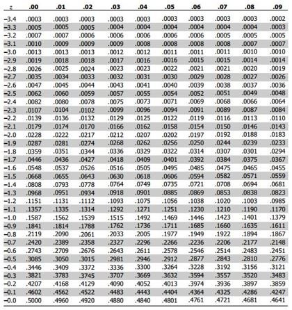

---
output:
  html_document:
    toc: yes
  html_notebook: default
  pdf_document:
    toc: yes

---

# Summarizing data

## Summary statistics

::: {.infobox .download data-latex="{download}"}
[You can download the corresponding R-Code here](./Code/03-basic_statistics.R)
:::

<br>
<div align="center">
<iframe width="560" height="315" src="https://www.youtube.com/embed/wGBbLyjUquY" frameborder="0" allowfullscreen></iframe>
</div>
<br>


This section discusses how to produce and analyze basic summary statistics. Summary statistics are often used to describe variables in terms of 1) the central tendency of the frequency distribution, and 2) the dispersion of values.  

<br>

A **measure of central tendency** is a single value that attempts to describe the data by identifying the central position within the data. There are various measures of central tendency as the following table shows. 

Statistic    | Description   | Definition 
---- | ------------------------------  | -----
Mean | The average value when you sum up all elements and divide by the number of elements  | $\bar{X}=\frac{\sum_{i=1}^{n}{X_i}}{n}$  
Mode  | The value that occurs most frequently (i.e., the highest peak of the frequency distribution)  |   
Median | The middle value when the data are arranged in ascending or descending order (i.e., the 50th percentile) |   

<br>

The **dispersion** refers to the degree to which the data is distributed around the central tendency and can be described in terms of the range, interquartile range, variance, and standard deviation. 

Statistic    | Description   | Definition 
---- | ------------------------------  | -----
Range | The difference between the largest and smallest values in the sample | $Range=X_{largest}-X_{smallest}$  
Interquartile range  | The range of the middle 50% of scores | $IQR=Q_3-Q_1$   
Variance | The mean squared deviation of all the values of the mean | $s^2=\frac{1}{n-1}*\sum_{i=1}^{n}{(X_i-\bar{X})^2}$
Standard deviation | The square root of the variance | $s_x=\sqrt{s^2}$

<br>

The answer to the question which measures to use depends on the level of measurement. Based on the discussion in chapter 1, we make a distinction between categorical and continuous variables, for which different statistics are permissible as summarized in the following table.

OK to compute...    | Nominal   | Ordinal   | Interval    | Ratio
------------- | ------------- | ------------- | --- | ---
frequency distribution  | Yes  | Yes  | Yes  | Yes
median and percentiles  | No  | Yes  | Yes  | Yes
mean, standard deviation, standard error of the mean | No  | No  | Yes  | Yes
ratio, or coefficient of variation  | No  | No  | No  | Yes

<br>

As an example data set, we will be using a data set containing music streaming data from a popular streaming service. Let's load and inspect the data first.


```r
music_data <- read.table("https://raw.githubusercontent.com/IMSMWU/Teaching/master/MRDA2017/music_data_at.csv",
    sep = ",", header = TRUE)
dim(music_data)
```

```
## [1] 6196   19
```

```r
head(music_data)
```

<div data-pagedtable="false">
  <script data-pagedtable-source type="application/json">
{"columns":[{"label":["track_id"],"name":[1],"type":["chr"],"align":["left"]},{"label":["min_rank"],"name":[2],"type":["int"],"align":["right"]},{"label":["streams"],"name":[3],"type":["int"],"align":["right"]},{"label":["isrc"],"name":[4],"type":["chr"],"align":["left"]},{"label":["artist_id"],"name":[5],"type":["chr"],"align":["left"]},{"label":["release_date"],"name":[6],"type":["chr"],"align":["left"]},{"label":["explicit"],"name":[7],"type":["int"],"align":["right"]},{"label":["danceability"],"name":[8],"type":["dbl"],"align":["right"]},{"label":["duration_ms"],"name":[9],"type":["dbl"],"align":["right"]},{"label":["energy"],"name":[10],"type":["dbl"],"align":["right"]},{"label":["loudness"],"name":[11],"type":["dbl"],"align":["right"]},{"label":["speechiness"],"name":[12],"type":["dbl"],"align":["right"]},{"label":["instrumentalness"],"name":[13],"type":["dbl"],"align":["right"]},{"label":["liveness"],"name":[14],"type":["dbl"],"align":["right"]},{"label":["valence"],"name":[15],"type":["dbl"],"align":["right"]},{"label":["tempo"],"name":[16],"type":["dbl"],"align":["right"]},{"label":["label"],"name":[17],"type":["chr"],"align":["left"]},{"label":["rep_ctry"],"name":[18],"type":["chr"],"align":["left"]},{"label":["genre"],"name":[19],"type":["chr"],"align":["left"]}],"data":[{"1":"000xQL6tZNLJzIrtIgxqSl","2":"65","3":"4066","4":"USRC11700675","5":"5ZsFI1h6hIdQRw2ti0hz81","6":"2017-03-23","7":"0","8":"0.748","9":"188491","10":"0.627","11":"-6.029","12":"0.0644","13":"0.0000","14":"0.0852","15":"0.524","16":"120.963","17":"SONY","18":"US","19":"Rock"},{"1":"003eoIwxETJujVWmNFMoZy","2":"136","3":"3871","4":"USUM71808193","5":"2wUjUUtkb5lvLKcGKsKqsR","6":"2018-06-15","7":"0","8":"0.353","9":"193680","10":"0.755","11":"-6.276","12":"0.7330","13":"0.0000","14":"0.3900","15":"0.437","16":"191.153","17":"UMG","18":"US","19":"Pop"},{"1":"003vvx7Niy0yvhvHt4a68B","2":"197","3":"4574","4":"USIR20400274","5":"0C0XlULifJtAgn6ZNCW2eu","6":"2004-06-01","7":"0","8":"0.352","9":"222973","10":"0.911","11":"-5.230","12":"0.0747","13":"0.0000","14":"0.0995","15":"0.236","16":"148.033","17":"UMG","18":"US","19":"Rock"},{"1":"009CKw0AJZiyaIFG8uGl5C","2":"22","3":"11633","4":"ATR211823101","5":"5DxtpBc8OxcLW5KvAwtzBy","6":"2018-07-27","7":"0","8":"0.761","9":"184274","10":"0.956","11":"-4.320","12":"0.0283","13":"0.0000","14":"0.3160","15":"0.973","16":"133.989","17":"INDEP","18":"AT","19":"Pop"},{"1":"00adbfJZUIpz8vRycsR7WV","2":"168","3":"5076","4":"DEA621801609","5":"6gto7HVNhu4ARE3P3g8Y5Y","6":"2018-12-07","7":"1","8":"0.560","9":"183400","10":"0.734","11":"-5.976","12":"0.0635","13":"0.0001","14":"0.1700","15":"0.191","16":"76.042","17":"WARNER","18":"DE","19":"HipHop & Rap"},{"1":"00gv2BypA7ieovRSsD7rO8","2":"32","3":"11951","4":"DEYD21901001","5":"0lFLP59V4TY3XgnrkFIwxK","6":"2019-07-26","7":"1","8":"0.827","9":"163195","10":"0.671","11":"-5.942","12":"0.0394","13":"0.0007","14":"0.0694","15":"0.668","16":"102.003","17":"WARNER","18":"DE","19":"HipHop & Rap"}],"options":{"columns":{"min":{},"max":[10]},"rows":{"min":[10],"max":[10]},"pages":{}}}
  </script>
</div>

The data set contains information about all songs that appeared in the Top200 charts of a popular streaming service in Austria between 2017 and 2020. The `dim()`-function returns the dimensions of the data frame (i.e., the number of rows and columns). As can be seen, the data set comprises information for 6,196 songs and 19 variables. The variables in the data set are:

* track_id: unique ID of a song
* min_rank: the minimum chart rank
* streams: the maximum number of daily streams
* isrc: alternative song ID
* artist_id: unique ID of the performing artist
* release_date: release_date of the song
* explicit: indicates whether a song has explicit lyrics (1) or not (0)
* duration: the duration in milliseconds
* danceability, energy, loudness, speechiness, instrumentalness, liveness, valence, tempo are the [audio features](https://developer.spotify.com/documentation/web-api/reference/tracks/get-audio-features/), describing the music style across various dimension
* label: the music label an artist is signed to
* rep_ctry: the repertoire country
* genre: the song genre

In a first step, we need to make sure all variables are in the correct format, according to these variable definitions: 


```r
music_data$release_date <- as.Date(music_data$release_date)  #convert to date
music_data$explicit <- factor(music_data$explicit,
    levels = 0:1, labels = c("not explicit", "explicit"))  #convert to factor
music_data$label <- as.factor(music_data$label)  #convert to factor
music_data$rep_ctry <- as.factor(music_data$rep_ctry)  #convert to factor
music_data$genre <- as.factor(music_data$genre)  #convert to factor
```

In the following sections, we will inspect the data in more detail.

### Categorical variables

Categorical variables contain a finite number of categories or distinct groups and are also known as qualitative or non-metric variables. There are different types of categorical variables:

* **Nominal variables**: variables that have two or more categories but no logical order (e.g., music genres). A dichotomous variable (also referred to as dummy variable or binary variable) is simply a nominal variable that only has two categories (e.g., indicator for explicit lyrics).
* **Ordinal variables**: variables that have two or more categories that can also be ordered or ranked (e.g., chart ranks in our example).

Let's now start to investigate the **nominal variables** in our data set (i.e., explicit, genre, label, rep_ctry).

As the table above shows, the only permissible operation with nominal variables is counting. That is, we can inspect the frequency distribution, which tells us how many observations we have per category. The ```table()``` function creates a frequency table that counts how many observations we have in each category. 


```r
table(music_data[, c("genre")])  #absolute frequencies
```

```
## 
##    Classics & Jazz Electronic & Dance       HipHop & Rap              other 
##                 10                586               2898                223 
##                Pop               Rock         Soundtrack 
##               1869                545                 65
```

```r
table(music_data[, c("label")])  #absolute frequencies
```

```
## 
##  INDEP   SONY    UMG WARNER 
##   1441   1256   2508    991
```

```r
table(music_data[, c("rep_ctry")])  #absolute frequencies
```

```
## 
##   AL   AT   AU   BE   BG   BR   CA   CH   CY   CZ   DE   DK   ES   FI   FR   GB 
##    2  271   33    9    1    1   10   26    7    4 2432   15    1    8  162  578 
##   GM   GR   HU   IE   IL   IN   IS   IT   KR   NL   NO   NZ   PL   PT   RO   RS 
##    1    1    1    2    3   23    1    8   12  114   32   11    3    1    1    3 
##   RU   SE   TC   US   ZA 
##    3  100   22 2291    3
```

```r
table(music_data[, c("explicit")])  #absolute frequencies
```

```
## 
## not explicit     explicit 
##         3626         2570
```

The numbers associated with the factor level in the output tell you, how many observations there are per category. For example, there are 2,898 songs from the HipHop & Rap genre. 

Often, we are interested in the relative frequencies, which can be obtained by using the ```prop.table()``` function.


```r
prop.table(table(music_data[, c("genre")]))  #relative frequencies
```

```
## 
##    Classics & Jazz Electronic & Dance       HipHop & Rap              other 
##        0.001613944        0.094577147        0.467721110        0.035990962 
##                Pop               Rock         Soundtrack 
##        0.301646223        0.087959974        0.010490639
```

```r
prop.table(table(music_data[, c("label")]))  #relative frequencies
```

```
## 
##     INDEP      SONY       UMG    WARNER 
## 0.2325694 0.2027114 0.4047773 0.1599419
```

```r
prop.table(table(music_data[, c("rep_ctry")]))  #relative frequencies
```

```
## 
##           AL           AT           AU           BE           BG           BR 
## 0.0003227889 0.0437378954 0.0053260168 0.0014525500 0.0001613944 0.0001613944 
##           CA           CH           CY           CZ           DE           DK 
## 0.0016139445 0.0041962556 0.0011297611 0.0006455778 0.3925112976 0.0024209167 
##           ES           FI           FR           GB           GM           GR 
## 0.0001613944 0.0012911556 0.0261459006 0.0932859910 0.0001613944 0.0001613944 
##           HU           IE           IL           IN           IS           IT 
## 0.0001613944 0.0003227889 0.0004841833 0.0037120723 0.0001613944 0.0012911556 
##           KR           NL           NO           NZ           PL           PT 
## 0.0019367334 0.0183989671 0.0051646223 0.0017753389 0.0004841833 0.0001613944 
##           RO           RS           RU           SE           TC           US 
## 0.0001613944 0.0004841833 0.0004841833 0.0161394448 0.0035506779 0.3697546804 
##           ZA 
## 0.0004841833
```

```r
prop.table(table(music_data[, c("explicit")]))  #relative frequencies
```

```
## 
## not explicit     explicit 
##    0.5852163    0.4147837
```

Now the output gives you the relative frequencies. For example, the market share of Warner Music in the Austrian Top200 charts is ~16%, ~8.8% of songs are from the Rock genre, ~4.4% of songs are from Austrian artists, and ~41.5% of the songs have explicit lyrics. 

Note that the above output shows the overall relative frequencies. In many cases, it is meaningful to consider conditional relative frequencies. This can be achieved by adding a ```,1``` to the ```prop.table()``` command, which tells R to compute the relative frequencies by row (which is in our case the genre variable). The following code can be used to show the relative frequency of songs with explicit lyrics by genre.  


```r
prop.table(table(music_data[, c("genre", "explicit")]),
    1)  #conditional relative frequencies
```

```
##                     explicit
## genre                not explicit   explicit
##   Classics & Jazz      1.00000000 0.00000000
##   Electronic & Dance   0.90273038 0.09726962
##   HipHop & Rap         0.26501035 0.73498965
##   other                0.97757848 0.02242152
##   Pop                  0.83092563 0.16907437
##   Rock                 0.88807339 0.11192661
##   Soundtrack           0.98461538 0.01538462
```
As can be seen, the presence of explicit lyrics greatly varies across genres. While in the HipHop genre ~73% of songs have explicit lyrics, in the Rock genre, this share is only ~11.2%.  

The 'min_rank' variable is an example of an **ordinal variable**. Although we can now rank order the songs with respect to their minimum chart rank, this variable doesn't contain information about the distance between two songs. Music popularity charts are often highly skewed towards the top songs, so that the absolute difference in streams between ranks 1 and 2 is larger compared to the differences between songs with ranks, say 101 and 102. This means that the distance between ranks 1 and 2 is not the same as the distance between ranks 101 and 102. To get a measure of central tendency, we could, for example, compute the median of this variable using the `median()`-function. 


```r
median(music_data$min_rank)
```

```
## [1] 85
```
This means that the middle value when the data are arranged is rank number 85 (median = 50th percentile). Note that you could also compute other percentiles using the `quanile()`-function. For example, to get the median and the interquartile range, we could compute the 25th, 50th, and 75th percentile.  


```r
quantile(music_data$min_rank, c(0.25, 0.5, 0.75))
```

```
##    25%    50%    75% 
##  38.75  85.00 141.00
```
This means that the interquartile range is between ranks 39 and 141. If you wanted to compare different genres according to these statistics, you could do this using the `by()`-function as follows:


```r
by(music_data$min_rank, music_data$genre, quantile,
    c(0.25, 0.5, 0.75))
```

```
## music_data$genre: Classics & Jazz
##    25%    50%    75% 
##  55.00  96.50 114.25 
## ------------------------------------------------------------ 
## music_data$genre: Electronic & Dance
##   25%   50%   75% 
##  43.0  90.5 144.0 
## ------------------------------------------------------------ 
## music_data$genre: HipHop & Rap
## 25% 50% 75% 
##  28  69 124 
## ------------------------------------------------------------ 
## music_data$genre: other
##   25%   50%   75% 
##  47.5  98.0 153.5 
## ------------------------------------------------------------ 
## music_data$genre: Pop
## 25% 50% 75% 
##  50 102 152 
## ------------------------------------------------------------ 
## music_data$genre: Rock
## 25% 50% 75% 
##  70 113 159 
## ------------------------------------------------------------ 
## music_data$genre: Soundtrack
## 25% 50% 75% 
##  79 113 143
```

The results show that, for example, HipHop artists achieve higher chart ranks compared to artists from other genres and the dispersion of values (IQR) is somewhat lower for this genre. This means that artists from the HipHop Genre consistently achieve higher ranks compared to other artists from other genres.   

### Continuous variables

#### Descriptive statistics

Continuous variables (also know as metric variables) are numeric variables that can take on any value on a measurement scale (i.e., there is an infinite number of values between any two values). There are different types of continuous variables as we have seen in chapter 1:

* **Interval variables**: while the zero point is arbitrary, equal intervals on the scale represent equal differences in the property being measured. E.g., on a temperature scale measured in Celsius the difference between a temperature of 15 degrees and 25 degrees is the same difference as between 25 degrees and 35 degrees but the zero point is arbitrary (there are different scales to measure temperature, such as Fahrenheit or Celsius, and zero in this case doesn't indicate the absence of temperature). 
* **Ratio variables**: has all the properties of an interval variable, but also has an absolute zero point. When the variable equals 0.0, it means that there is none of that variable (e.g., the number of streams or duration variables in our example). 

For interval and ratio variables we can also compute the mean as a measure of central tendency, as well as the variance and the standard deviation as measures of dispersion. Computing descriptive statistics for continuous variables is easy and there are many functions from different packages that let you calculate summary statistics (including the ```summary()``` function from the ```base``` package). In this tutorial, we will use the ```describe()``` function from the ```psych``` package. Note that you could just as well use other packages to compute the descriptive statistics (e.g., the ```stat.desc()``` function from the ```pastecs``` package). Which one you choose depends on what type of information you seek (the results provide slightly different information) and on personal preferences. 

We could, for example, compute the summary statistics for the variables "streams", "duration_ms", "danceability", and "valence" in our data set as follows:


```r
library(psych)
psych::describe(music_data[, c("streams", "duration_ms",
    "danceability", "valence")])
```

```
##              vars    n      mean       sd    median   trimmed      mad      min
## streams         1 6196   9724.05 11153.77   6006.00   7389.25  4283.23  1235.00
## duration_ms     2 6195 200493.84 47667.10 196770.00 197686.44 34559.41 30133.00
## danceability    3 6195      0.67     0.14      0.69      0.68     0.14     0.06
## valence         4 6195      0.48     0.21      0.47      0.47     0.24     0.03
##                     max      range  skew kurtosis     se
## streams       136500.00  135265.00  3.81    21.41 141.70
## duration_ms  1109080.00 1078947.00  3.39    44.98 605.62
## danceability       0.98       0.91 -0.62     0.33   0.00
## valence            0.98       0.95  0.15    -0.70   0.00
```
You can see that the output contains measures of central tendency (e.g., the mean) and dispersion (e.g., sd) for the selected variables. It can be seen, for example, that the mean of the streams variable is 9,724 while the median is 6,006. This already tells us something about the distribution of the data. Because the mean is substantially higher than the median, we can conclude that there are a few songs with many streams, resulting in a right skew of the distribution. The median as a measure of central tendency is generally less susceptible to outliers.   

In the above command, we used the ```psych::``` prefix to avoid confusion and to make sure that R uses the ```describe()``` function from the ```psych``` package since there are many other packages that also contain a ```desribe()``` function. Note that you could also compute these statistics separately by using the respective functions (e.g., ```mean()```, ```sd()```, ```median()```, ```min()```, ```max()```, etc.). There are many options for additional statistics for this function. For example, you could add the argument `IQR = TRUE` to add the interquartile range to the output.   

The ```psych``` package also contains the ```describeBy()``` function, which lets you compute the summary statistics by sub-groups separately. For example, we could compute the summary statistics by genre as follows: 


```r
describeBy(music_data[, c("streams", "duration_ms",
    "danceability", "valence")], music_data$genre,
    skew = FALSE, range = FALSE)
```

```
## 
##  Descriptive statistics by group 
## group: Classics & Jazz
##              vars  n      mean        sd       se
## streams         1 10  13729.20   7344.33  2322.48
## duration_ms     2 10 180488.80 114042.08 36063.27
## danceability    3 10      0.45      0.21     0.07
## valence         4 10      0.39      0.27     0.08
## ------------------------------------------------------------ 
## group: Electronic & Dance
##              vars   n      mean       sd      se
## streams         1 586   7175.36  6176.63  255.15
## duration_ms     2 586 199832.24 38105.84 1574.14
## danceability    3 586      0.66     0.12    0.00
## valence         4 586      0.48     0.20    0.01
## ------------------------------------------------------------ 
## group: HipHop & Rap
##              vars    n      mean       sd     se
## streams         1 2898  11613.50 12424.51 230.80
## duration_ms     2 2897 196080.76 53206.56 988.53
## danceability    3 2897      0.72     0.13   0.00
## valence         4 2897      0.46     0.20   0.00
## ------------------------------------------------------------ 
## group: other
##              vars   n      mean       sd      se
## streams         1 223  15573.18 16122.11 1079.62
## duration_ms     2 223 196179.61 45117.62 3021.30
## danceability    3 223      0.58     0.16    0.01
## valence         4 223      0.54     0.23    0.02
## ------------------------------------------------------------ 
## group: Pop
##              vars    n      mean       sd     se
## streams         1 1869   8110.02  9839.75 227.60
## duration_ms     2 1869 202909.12 36232.29 838.09
## danceability    3 1869      0.65     0.14   0.00
## valence         4 1869      0.51     0.22   0.01
## ------------------------------------------------------------ 
## group: Rock
##              vars   n      mean       sd      se
## streams         1 545   5948.28  6808.37  291.64
## duration_ms     2 545 221585.99 49133.40 2104.64
## danceability    3 545      0.59     0.14    0.01
## valence         4 545      0.45     0.22    0.01
## ------------------------------------------------------------ 
## group: Soundtrack
##              vars  n      mean       sd      se
## streams         1 65   5845.43  4595.23  569.97
## duration_ms     2 65 174727.02 71809.75 8906.90
## danceability    3 65      0.44     0.20    0.03
## valence         4 65      0.24     0.19    0.02
```

In this example, we used the arguments `skew = FALSE` and `range = FALSE` to exclude some statistics from the output. 

R is open to user contributions and various users have contributed packages that aim at making it easier for researchers to summarize statistics. For example, the <a href="https://cran.r-project.org/web/packages/summarytools/vignettes/Recommendations-rmarkdown.html" target="_blank">summarytools</a> package can be used to summarize the variables. If you would like to use this package and you are a Mac user, you may need to also install XQuartz (X11) too. To do this, go to <a href="https://www.xquartz.org/" target="_blank">this page</a> and download the XQuartz-2.7.7.dmg, then open the downloaded folder and click XQuartz.pkg and follow the instruction on screen and install XQuartz. If you still encouter an error after installing XQuartz, you may find a solution <a href="href="https://www.xquartz.org/" target="_blank">here</a>.

<style type="text/css">
 img {   background-color: transparent;   border: 0; }  .st-table td, .st-table th {   padding: 8px; }  .st-table > thead > tr {    background-color: #eeeeee; }  .st-cross-table td {   text-align: center; }  .st-descr-table td {   text-align: right; }  table.st-table th {   text-align: center; }  table.st-table > thead > tr {    background-color: #eeeeee; }  table.st-table td span {   display: block; }  table.st-table > tfoot > tr > td {   border:none; }  .st-container {   width: 100%;   padding-right: 15px;   padding-left: 15px;   margin-right: auto;   margin-left: auto;   margin-top: 15px; }  .st-multiline {   white-space: pre; }  .st-table {     width: auto;     table-layout: auto;     margin-top: 20px;     margin-bottom: 20px;     max-width: 100%;     background-color: transparent;     border-collapse: collapse; }  .st-table > thead > tr > th, .st-table > tbody > tr > th, .st-table > tfoot > tr > th, .st-table > thead > tr > td, .st-table > tbody > tr > td, .st-table > tfoot > tr > td {   vertical-align: middle; }  .st-table-bordered {   border: 1px solid #bbbbbb; }  .st-table-bordered > thead > tr > th, .st-table-bordered > tbody > tr > th, .st-table-bordered > thead > tr > td, .st-table-bordered > tbody > tr > td {   border: 1px solid #cccccc; }  .st-table-bordered > thead > tr > th, .st-table-bordered > thead > tr > td, .st-table thead > tr > th {   border-bottom: none; }  .st-freq-table > thead > tr > th, .st-freq-table > tbody > tr > th, .st-freq-table > tfoot > tr > th, .st-freq-table > thead > tr > td, .st-freq-table > tbody > tr > td, .st-freq-table > tfoot > tr > td, .st-freq-table-nomiss > thead > tr > th, .st-freq-table-nomiss > tbody > tr > th, .st-freq-table-nomiss > tfoot > tr > th, .st-freq-table-nomiss > thead > tr > td, .st-freq-table-nomiss > tbody > tr > td, .st-freq-table-nomiss > tfoot > tr > td, .st-cross-table > thead > tr > th, .st-cross-table > tbody > tr > th, .st-cross-table > tfoot > tr > th, .st-cross-table > thead > tr > td, .st-cross-table > tbody > tr > td, .st-cross-table > tfoot > tr > td {   padding-left: 20px;   padding-right: 20px; }  .st-table-bordered > thead > tr > th, .st-table-bordered > tbody > tr > th, .st-table-bordered > thead > tr > td, .st-table-bordered > tbody > tr > td {   border: 1px solid #cccccc; }  .st-table-striped > tbody > tr:nth-of-type(odd) {   background-color: #ffffff; }  .st-table-striped > tbody > tr:nth-of-type(even) {   background-color: #f9f9f9; }  .st-descr-table > thead > tr > th, .st-descr-table > tbody > tr > th, .st-descr-table > thead > tr > td, .st-descr-table > tbody > tr > td {   padding-left: 24px;   padding-right: 24px;   word-wrap: break-word; }  .st-freq-table, .st-freq-table-nomiss, .st-cross-table {   border: medium none; }  .st-freq-table > thead > tr:nth-child(1) > th:nth-child(1), .st-cross-table > thead > tr:nth-child(1) > th:nth-child(1), .st-cross-table > thead > tr:nth-child(1) > th:nth-child(3) {   border: none;   background-color: #ffffff;   text-align: center; }  .st-protect-top-border {   border-top: 1px solid #cccccc !important; }  .st-ws-char {   display: inline;   color: #999999;   letter-spacing: 0.2em; }  /* Optional classes */ .st-small {   font-size: 13px; }  .st-small td, .st-small th {   padding: 8px; }  .st-small > thead > tr > th, .st-small > tbody > tr > th, .st-small > thead > tr > td, .st-small > tbody > tr > td {   padding-left: 12px;   padding-right: 12px; } </style>


```r
library(summarytools)
print(dfSummary(music_data[, c("streams", "duration_ms",
    "valence", "genre", "label", "explicit")], plain.ascii = FALSE,
    style = "grid", valid.col = FALSE, tmp.img.dir = "tmp"),
    method = "render", headings = FALSE, footnote = NA)
```

Error in pryr::where(obj_name) : length(name) == 1 is not TRUE

```{=html}
<div class="container st-container"><table class="table table-striped table-bordered st-table st-table-striped st-table-bordered st-multiline ">
  <thead>
    <tr>
      <th align="center" class="st-protect-top-border"><strong>No</strong></th>
      <th align="center" class="st-protect-top-border"><strong>Variable</strong></th>
      <th align="center" class="st-protect-top-border"><strong>Stats / Values</strong></th>
      <th align="center" class="st-protect-top-border"><strong>Freqs (% of Valid)</strong></th>
      <th align="center" class="st-protect-top-border"><strong>Graph</strong></th>
      <th align="center" class="st-protect-top-border"><strong>Missing</strong></th>
    </tr>
  </thead>
  <tbody>
    <tr>
      <td align="center">1</td>
      <td align="left">streams
[integer]</td>
      <td align="left" style="padding:8;vertical-align:middle"><table style="border-collapse:collapse;border:none;margin:0"><tr style="background-color:transparent"><td style="padding:0;margin:0;border:0" align="left">Mean (sd) : 9724 (11153.8)</td></tr><tr style="background-color:transparent"><td style="padding:0;margin:0;border:0" align="left">min &le; med &le; max:</td></tr><tr style="background-color:transparent"><td style="padding:0;margin:0;border:0" align="left">1235 &le; 6006 &le; 136500</td></tr><tr style="background-color:transparent"><td style="padding:0;margin:0;border:0" align="left">IQR (CV) : 7262.2 (1.1)</td></tr></table></td>
      <td align="left" style="vertical-align:middle">5009 distinct values</td>
      <td align="left" style="vertical-align:middle;padding:0;background-color:transparent;"></td>
      <td align="center">0
(0.0%)</td>
    </tr>
    <tr>
      <td align="center">2</td>
      <td align="left">duration_ms
[numeric]</td>
      <td align="left" style="padding:8;vertical-align:middle"><table style="border-collapse:collapse;border:none;margin:0"><tr style="background-color:transparent"><td style="padding:0;margin:0;border:0" align="left">Mean (sd) : 200493.8 (47667.1)</td></tr><tr style="background-color:transparent"><td style="padding:0;margin:0;border:0" align="left">min &le; med &le; max:</td></tr><tr style="background-color:transparent"><td style="padding:0;margin:0;border:0" align="left">30133 &le; 196770 &le; 1109080</td></tr><tr style="background-color:transparent"><td style="padding:0;margin:0;border:0" align="left">IQR (CV) : 46900.5 (0.2)</td></tr></table></td>
      <td align="left" style="vertical-align:middle">5031 distinct values</td>
      <td align="left" style="vertical-align:middle;padding:0;background-color:transparent;"></td>
      <td align="center">1
(0.0%)</td>
    </tr>
    <tr>
      <td align="center">3</td>
      <td align="left">valence
[numeric]</td>
      <td align="left" style="padding:8;vertical-align:middle"><table style="border-collapse:collapse;border:none;margin:0"><tr style="background-color:transparent"><td style="padding:0;margin:0;border:0" align="left">Mean (sd) : 0.5 (0.2)</td></tr><tr style="background-color:transparent"><td style="padding:0;margin:0;border:0" align="left">min &le; med &le; max:</td></tr><tr style="background-color:transparent"><td style="padding:0;margin:0;border:0" align="left">0 &le; 0.5 &le; 1</td></tr><tr style="background-color:transparent"><td style="padding:0;margin:0;border:0" align="left">IQR (CV) : 0.3 (0.4)</td></tr></table></td>
      <td align="left" style="vertical-align:middle">990 distinct values</td>
      <td align="left" style="vertical-align:middle;padding:0;background-color:transparent;"></td>
      <td align="center">1
(0.0%)</td>
    </tr>
    <tr>
      <td align="center">4</td>
      <td align="left">genre
[factor]</td>
      <td align="left" style="padding:8;vertical-align:middle"><table style="border-collapse:collapse;border:none;margin:0"><tr style="background-color:transparent"><td style="padding:0;margin:0;border:0" align="left">1. Classics & Jazz</td></tr><tr style="background-color:transparent"><td style="padding:0;margin:0;border:0" align="left">2. Electronic & Dance</td></tr><tr style="background-color:transparent"><td style="padding:0;margin:0;border:0" align="left">3. HipHop & Rap</td></tr><tr style="background-color:transparent"><td style="padding:0;margin:0;border:0" align="left">4. other</td></tr><tr style="background-color:transparent"><td style="padding:0;margin:0;border:0" align="left">5. Pop</td></tr><tr style="background-color:transparent"><td style="padding:0;margin:0;border:0" align="left">6. Rock</td></tr><tr style="background-color:transparent"><td style="padding:0;margin:0;border:0" align="left">7. Soundtrack</td></tr></table></td>
      <td align="left" style="padding:0;vertical-align:middle"><table style="border-collapse:collapse;border:none;margin:0"><tr style="background-color:transparent"><td style="padding:0 5px 0 7px;margin:0;border:0" align="right">10</td><td style="padding:0 2px 0 0;border:0;" align="left">(</td><td style="padding:0;border:0" align="right">0.2%</td><td style="padding:0 4px 0 2px;border:0" align="left">)</td></tr><tr style="background-color:transparent"><td style="padding:0 5px 0 7px;margin:0;border:0" align="right">586</td><td style="padding:0 2px 0 0;border:0;" align="left">(</td><td style="padding:0;border:0" align="right">9.5%</td><td style="padding:0 4px 0 2px;border:0" align="left">)</td></tr><tr style="background-color:transparent"><td style="padding:0 5px 0 7px;margin:0;border:0" align="right">2898</td><td style="padding:0 2px 0 0;border:0;" align="left">(</td><td style="padding:0;border:0" align="right">46.8%</td><td style="padding:0 4px 0 2px;border:0" align="left">)</td></tr><tr style="background-color:transparent"><td style="padding:0 5px 0 7px;margin:0;border:0" align="right">223</td><td style="padding:0 2px 0 0;border:0;" align="left">(</td><td style="padding:0;border:0" align="right">3.6%</td><td style="padding:0 4px 0 2px;border:0" align="left">)</td></tr><tr style="background-color:transparent"><td style="padding:0 5px 0 7px;margin:0;border:0" align="right">1869</td><td style="padding:0 2px 0 0;border:0;" align="left">(</td><td style="padding:0;border:0" align="right">30.2%</td><td style="padding:0 4px 0 2px;border:0" align="left">)</td></tr><tr style="background-color:transparent"><td style="padding:0 5px 0 7px;margin:0;border:0" align="right">545</td><td style="padding:0 2px 0 0;border:0;" align="left">(</td><td style="padding:0;border:0" align="right">8.8%</td><td style="padding:0 4px 0 2px;border:0" align="left">)</td></tr><tr style="background-color:transparent"><td style="padding:0 5px 0 7px;margin:0;border:0" align="right">65</td><td style="padding:0 2px 0 0;border:0;" align="left">(</td><td style="padding:0;border:0" align="right">1.0%</td><td style="padding:0 4px 0 2px;border:0" align="left">)</td></tr></table></td>
      <td align="left" style="vertical-align:middle;padding:0;background-color:transparent;"></td>
      <td align="center">0
(0.0%)</td>
    </tr>
    <tr>
      <td align="center">5</td>
      <td align="left">label
[factor]</td>
      <td align="left" style="padding:8;vertical-align:middle"><table style="border-collapse:collapse;border:none;margin:0"><tr style="background-color:transparent"><td style="padding:0;margin:0;border:0" align="left">1. INDEP</td></tr><tr style="background-color:transparent"><td style="padding:0;margin:0;border:0" align="left">2. SONY</td></tr><tr style="background-color:transparent"><td style="padding:0;margin:0;border:0" align="left">3. UMG</td></tr><tr style="background-color:transparent"><td style="padding:0;margin:0;border:0" align="left">4. WARNER</td></tr></table></td>
      <td align="left" style="padding:0;vertical-align:middle"><table style="border-collapse:collapse;border:none;margin:0"><tr style="background-color:transparent"><td style="padding:0 5px 0 7px;margin:0;border:0" align="right">1441</td><td style="padding:0 2px 0 0;border:0;" align="left">(</td><td style="padding:0;border:0" align="right">23.3%</td><td style="padding:0 4px 0 2px;border:0" align="left">)</td></tr><tr style="background-color:transparent"><td style="padding:0 5px 0 7px;margin:0;border:0" align="right">1256</td><td style="padding:0 2px 0 0;border:0;" align="left">(</td><td style="padding:0;border:0" align="right">20.3%</td><td style="padding:0 4px 0 2px;border:0" align="left">)</td></tr><tr style="background-color:transparent"><td style="padding:0 5px 0 7px;margin:0;border:0" align="right">2508</td><td style="padding:0 2px 0 0;border:0;" align="left">(</td><td style="padding:0;border:0" align="right">40.5%</td><td style="padding:0 4px 0 2px;border:0" align="left">)</td></tr><tr style="background-color:transparent"><td style="padding:0 5px 0 7px;margin:0;border:0" align="right">991</td><td style="padding:0 2px 0 0;border:0;" align="left">(</td><td style="padding:0;border:0" align="right">16.0%</td><td style="padding:0 4px 0 2px;border:0" align="left">)</td></tr></table></td>
      <td align="left" style="vertical-align:middle;padding:0;background-color:transparent;"></td>
      <td align="center">0
(0.0%)</td>
    </tr>
    <tr>
      <td align="center">6</td>
      <td align="left">explicit
[factor]</td>
      <td align="left" style="padding:8;vertical-align:middle"><table style="border-collapse:collapse;border:none;margin:0"><tr style="background-color:transparent"><td style="padding:0;margin:0;border:0" align="left">1. not explicit</td></tr><tr style="background-color:transparent"><td style="padding:0;margin:0;border:0" align="left">2. explicit</td></tr></table></td>
      <td align="left" style="padding:0;vertical-align:middle"><table style="border-collapse:collapse;border:none;margin:0"><tr style="background-color:transparent"><td style="padding:0 5px 0 7px;margin:0;border:0" align="right">3626</td><td style="padding:0 2px 0 0;border:0;" align="left">(</td><td style="padding:0;border:0" align="right">58.5%</td><td style="padding:0 4px 0 2px;border:0" align="left">)</td></tr><tr style="background-color:transparent"><td style="padding:0 5px 0 7px;margin:0;border:0" align="right">2570</td><td style="padding:0 2px 0 0;border:0;" align="left">(</td><td style="padding:0;border:0" align="right">41.5%</td><td style="padding:0 4px 0 2px;border:0" align="left">)</td></tr></table></td>
      <td align="left" style="vertical-align:middle;padding:0;background-color:transparent;"></td>
      <td align="center">0
(0.0%)</td>
    </tr>
  </tbody>
</table></div>
```

The 'Missing' column in the output above tells us that there is one missing value on the 'duration_ms' and 'valence' variables. We might want to exclude this observation by creating a subset of the data.  


```r
music_data <- music_data[!is.na(music_data$valence) &
    !is.na(music_data$duration_ms), ]
```

In the command above, `!is.na()` is used to filter the rows for observations where the respective variable does not have missing values. The "!" in this case translates to "is not" and the function `is.na()` checks for missing values. Hence, the entire statement can be read as "select the rows from the 'music_data' data set where the values of the 'valence' and 'duration_ms' variables are not missing".

As you can see, the output also includes a visualization of the frequency distribution using a histogram for the continuous variables and a bar chart for the categorical variables. The frequency distribution is an important element that allows us to assign probabilities to observed values if the observations come from a known probability distribution. How to derive these probability statements will be discussed next.   

#### Using frequency distributions to go beyond the data

<br>
<div align="center">
<iframe width="560" height="315" src="https://www.youtube.com/embed/O6zyyV1ycgA" frameborder="0" allowfullscreen></iframe>
</div>
<br>

The frequency distribution can be used to make statements about the probability that a certain observed value will occur if the observations come from a known probability distribution. For normally distributed data, the following table can be used to look up the probability that a certain value will occur. For example, the value of -1.96 has a probability of 2.5% (i.e., .0250).  

<div class="figure" style="text-align: center">

<p class="caption">(\#fig:unnamed-chunk-15)Standard normal table</p>
</div>
There are two things worth noting. First, the normal distribution has two tails as the following figure shows and we need to take the probability mass at each side of the distribution into account. Hence, there is a 2.5% probability of observing a value of -1.96 or smaller and a 2.5% of observing a value of 1.96 or larger. Hence, the probability mass within this interval is 0.95.  

<div class="figure" style="text-align: center">

<p class="caption">(\#fig:unnamed-chunk-16)Standard normal distribution</p>
</div>
The second point is related to the scale of the distribution. Since the variables that we will collect can be measured at many different scales (e.g., number of streams, duration in milliseconds), we need a way to convert the scale into a standardized measure that would allow us to compare the observations against the values from the probability table. The **standardized variate**, or z-score, allows us to do exactly that. It is computed as follows: 

$$\begin{align}
Z=\frac{X_i-\bar{X}}{s}
\end{align}
$$

By subtracting the mean of the variable from each observation and dividing by the standard deviation, the data is converted to a scale with mean = 0 and SD = 1, so we can use the tables of probabilities for the normal distribution to see how likely it is that a particular score will occur in the data. In other words, **the z-score tells us how many standard deviations above or below the mean a particular x-value is**. 


To see how this works in practice, let's inspect the distribution of the 'tempo' variable from the music data set, which is defined as the overall estimated tempo of a track in beats per minute (BPM). The `hist()`-function can be used to draw the corresponding histogram.


```r
hist(music_data$tempo)
```

<div class="figure" style="text-align: center">

<p class="caption">(\#fig:unnamed-chunk-17)Histogram of tempo variable</p>
</div>
In this case, the variable is measured on the scale "beats per minute". To standardize this variable, we will subtract the mean of this variable from each observation and then divide by the standard deviation. We can compute the standardized variable by hand as follows:


```r
music_data$tempo_std <- (music_data$tempo - mean(music_data$tempo))/sd(music_data$tempo)
```

If we create the histogram again, we can see that the scale has changed and now we can compare the standardized values to the values we find in the probability table.  


```r
hist(music_data$tempo_std)
```

<div class="figure" style="text-align: center">

<p class="caption">(\#fig:unnamed-chunk-19)Histogram of standardized tempo variable</p>
</div>
Not that you could have also used the `scale()`-function instead of computing the z-scores manually, which leads to the same result: 


```r
music_data$tempo_std <- scale(music_data$tempo)
```

Instead of manually comparing the observed values to the values in the table, it is much easier to use the in-built functions to obtain the probabilities. The `pnorm()`-function gives the probability of obtaining values lower than the indicated values (i.e., the probability mass left of that value). For the value of 1.96, this probability mass is ~0.025, in line with the table above. 


```r
pnorm(-1.96)
```

```
## [1] 0.0249979
```
To also take the other end of the distribution into consideration, we would need to multiply this value by to. This way, we arrive at a value of 5%.


```r
pnorm(-1.96) * 2
```

```
## [1] 0.04999579
```
Regarding the standard normal distribution, it is helpful to remember the following numbers, indicating the points on the standard normal distribution, where the sum of the probability mass to the left at the lower end and to the right of the upper end exceed a certain threshold:  

* +/-**1.645** - 10% of probability mass outside this region
* +/-**1.960** - 5% of probability mass outside this region
* +/-**2.580** - 1% of probability mass outside this region

Going back to our example, we could also ask: what is the probability of obtaining the minimum (or maximum) observed value in our data? The minimum value on the standardized scale is:


```r
min(music_data$tempo_std)
```

```
## [1] -3.006525
```
And the associated probability is:  


```r
pnorm(min(music_data$tempo_std)) * 2
```

```
## [1] 0.002642526
```
Although the probability of observing this minimum value is very low, there are very few observations in the extreme regions at each end of the histogram, so this doesn't seem too unusual. As a rule of thumb, you can remember that 68% of the observations of a normally distributed variable should be within 1 standard deviation of the mean, 95% within 2 standard deviations, and 99.7% within 3 standard deviations. This is also shown in the following plot: 

<div class="figure" style="text-align: center">

<p class="caption">(\#fig:unnamed-chunk-25)The 68, 95, 99.7 rule (source: Wikipedia)</p>
</div>

In case of our 'tempo' variable, we do not observe values that are more than 3 standard deviations away from the mean. In other instances, checking the standardized values of a variable may help you to identify outliers. For example, if you conducted a survey and you would like to exclude respondents who answered the survey too fast, you may exclude cases with a low probability based on the distribution of the duration variable.   

