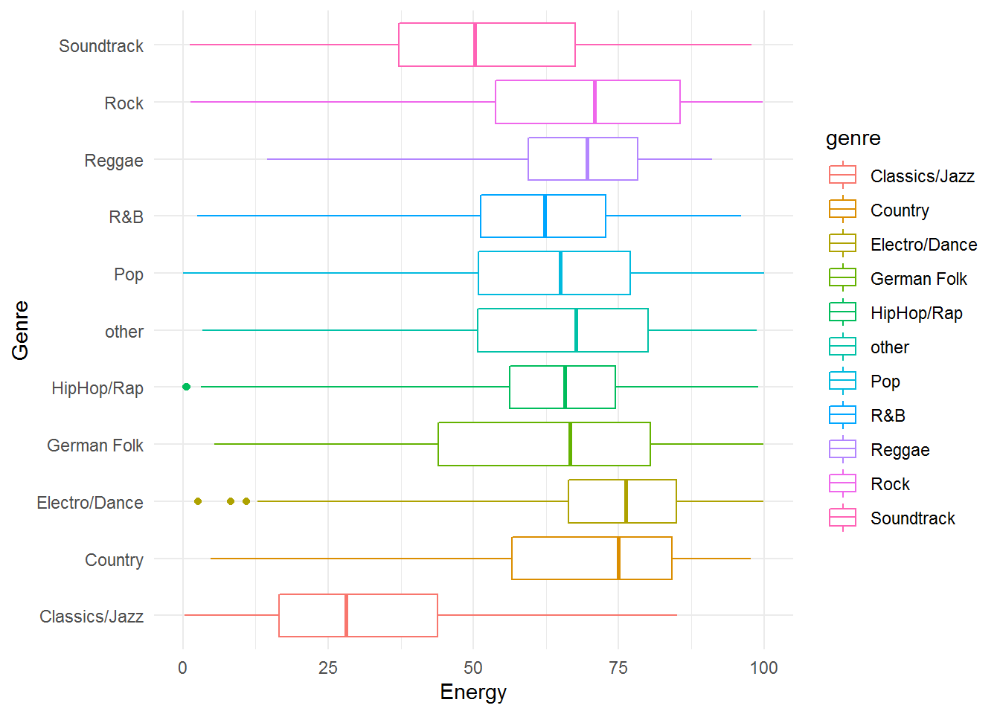
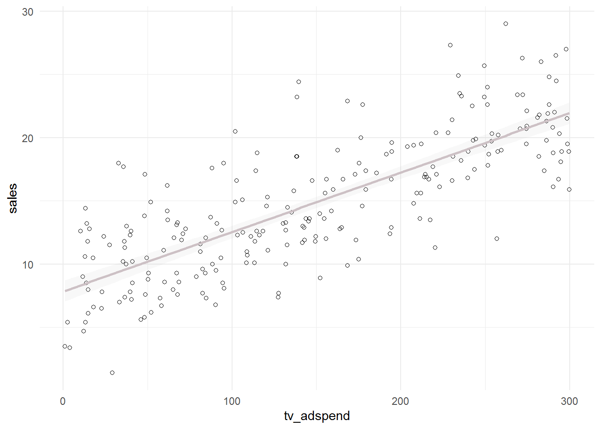
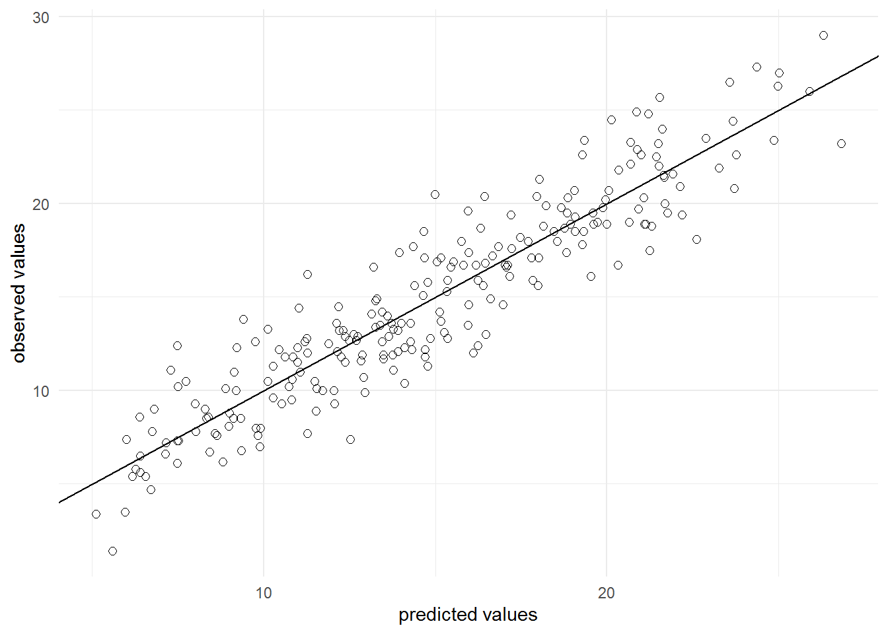
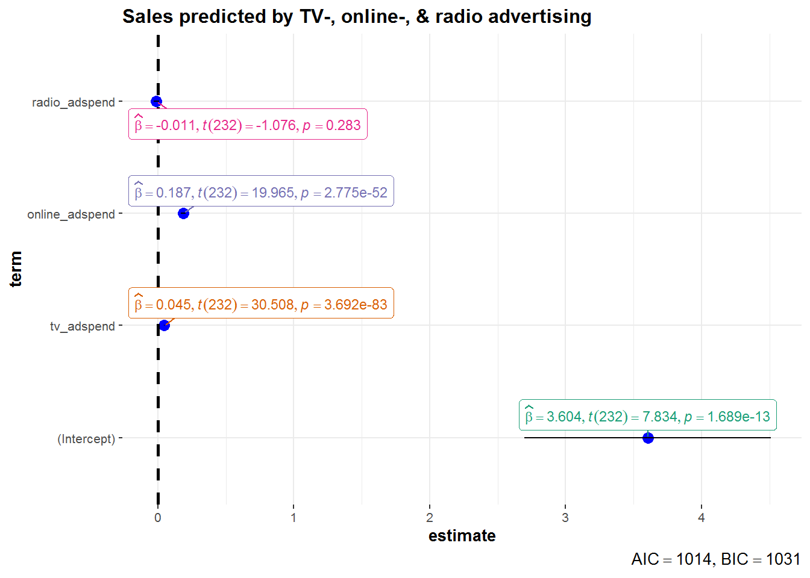

# (PART) Assignments {-}

# R Markdown 


## Introduction to R Markdown

::: {.infobox .download data-latex="{download}"}
[You can download the example markdown file here](./Code/rmarkdown_example.Rmd)
:::

This page will guide you through creating and editing R Markdown documents. This is a useful tool for reporting your analysis (e.g. for homework assignments). Of course, there is also [a cheat sheet for R-Markdown](https://www.rstudio.org/links/r_markdown_cheat_sheet) and [this book](https://bookdown.org/yihui/rmarkdown/) contains a comprehensive discussion of the format. 

The following video contains a short introduction to the R Markdown format.

<br>
<div align="center">
<iframe width="560" height="315" src="https://www.youtube.com/embed/o8FdyMAR-g4" frameborder="0" allowfullscreen></iframe>
</div>
<br>

### Creating a new R Markdown document {-}

In addition to the video, the following text contains a short description of the most important formatting options.  

Let's start to go through the steps of creating and .Rmd file and outputting the content to an HTML file. 

0. If an R-Markdown file was provided to you, open it with R-Studio and skip to [step 4](#step4) after adding your answers.

1. Open R-Studio

2. Create a new R-Markdown document


3. Save with appropriate name


    3.1. Add your answers

    3.2. Save again

 <a name="step4"></a>
 
4. "Knit" to HTML 


5. Hand in appropriate file (ending in `.html`) on learn\@WU


### Text and Equations {-}

R-Markdown documents are plain text files that include both text and R-code. Using RStudio they can be converted ('knitted') to HTML or PDF files that include both the text and the results of the R-code. In fact this website is written using R-Markdown and RStudio. In order for RStudio to be able to interpret the document you have to use certain characters or combinations of characters when formatting text and including R-code to be evaluated. By default the document starts with the options for the text part. You can change the title, date, author and a few more advanced options. 


The default is text mode, meaning that lines in an Rmd document will be interpreted as text, unless specified otherwise.

#### Headings {-}

Usually you want to include some kind of heading to structure your text. A heading is created using `#` signs. A single `#` creates a first level heading, two `##` a second level and so on. 


It is important to note here that the ```#``` symbol means something different within the code chunks as opposed to outside of them. If you continue to put a ```#``` in front of all your regular text, it will all be interpreted as a first level heading, making your text very large.

#### Lists {-}

Bullet point lists are created using `*`, `+` or `-`. Sub-items are created by indenting the item using 4 spaces or 2 tabs. 

````
* First Item
* Second Item
    + first sub-item
        - first sub-sub-item
    + second sub-item
````
* First Item
* Second Item
    + first sub-item
        - first sub-sub-item
    + second sub-item


Ordered lists can be created using numbers and letters. If you need sub-sub-items use `A)` instead of `A.` on the third level. 

````
1. First item
    a. first sub-item
        A) first sub-sub-item 
     b. second sub-item
2. Second item
````

1. First item
    a. first sub-item
        A) first sub-sub-item
    b. second sub-item
2. Second item


#### Text formatting {-}

Text can be formatted in *italics* (`*italics*`) or **bold** (`**bold**`). In addition, you can ad block quotes with `>`

````
> Lorem ipsum dolor amet chillwave lomo ramps, four loko green juice messenger bag raclette forage offal shoreditch chartreuse austin. Slow-carb poutine meggings swag blog, pop-up salvia taxidermy bushwick freegan ugh poke.
````
> Lorem ipsum dolor amet chillwave lomo ramps, four loko green juice messenger bag raclette forage offal shoreditch chartreuse austin. Slow-carb poutine meggings swag blog, pop-up salvia taxidermy bushwick freegan ugh poke.

### R-Code {-}

R-code is contained in so called "chunks". These chunks always start with three backticks and ```r``` in curly braces (``` ```{r} ```) and end with three backticks (``` ``` ```). Optionally, parameters can be added after the ```r``` to influence how a chunk behaves. Additionally, you can also give each chunk a name. Note that these have to be **unique**, otherwise R will refuse to knit your document.

#### Global and chunk options {-}

The first chunk always looks as follows


    ```{r setup, include = FALSE}
    knitr::opts_chunk$set(echo = TRUE)
    ```

It is added to the document automatically and sets options for all the following chunks. These options can be overwritten on a per-chunk basis. 

Keep `knitr::opts_chunk$set(echo = TRUE)` to print your code to the document you will hand in. Changing it to `knitr::opts_chunk$set(echo = FALSE)` will not print your code by default. This can be changed on a per-chunk basis.


    ```{r cars, echo = FALSE}
    summary(cars)

    plot(dist~speed, cars)
    ```


```
##      speed           dist       
##  Min.   : 4.0   Min.   :  2.00  
##  1st Qu.:12.0   1st Qu.: 26.00  
##  Median :15.0   Median : 36.00  
##  Mean   :15.4   Mean   : 42.98  
##  3rd Qu.:19.0   3rd Qu.: 56.00  
##  Max.   :25.0   Max.   :120.00
```


 
    ```{r cars2, echo = TRUE}
    summary(cars)

    plot(dist~speed, cars)
    ```


```r
summary(cars)
```

```
##      speed           dist       
##  Min.   : 4.0   Min.   :  2.00  
##  1st Qu.:12.0   1st Qu.: 26.00  
##  Median :15.0   Median : 36.00  
##  Mean   :15.4   Mean   : 42.98  
##  3rd Qu.:19.0   3rd Qu.: 56.00  
##  Max.   :25.0   Max.   :120.00
```

```r
plot(dist ~ speed, cars)
```


A good overview of all available global/chunk options can be found [here](https://yihui.name/knitr/options/#chunk_options).

### LaTeX Math {-}

Writing well formatted mathematical formulas is done the same way as in [LaTeX](https://en.wikipedia.org/wiki/LaTeX). Math mode is started and ended using `$$`. 
````
$$
 f_1(\omega) = \frac{\sigma^2}{2 \pi},\ \omega \in[-\pi, \pi]
$$
````

$$
 f_1(\omega) = \frac{\sigma^2}{2 \pi},\ \omega \in[-\pi, \pi]
$$

(for those interested this is the spectral density of [white noise](https://en.wikipedia.org/wiki/White_noise))

Including inline mathematical notation is done with a single ```$``` symbol. 

````
${2\over3}$ of my code is inline.

````
${2\over3}$ of my code is inline.

<br>

Take a look at [this wikibook on Mathematics in LaTeX](https://en.wikibooks.org/wiki/LaTeX/Mathematics#Symbols) and [this list of Greek letters and mathematical symbols](https://www.sharelatex.com/learn/List_of_Greek_letters_and_math_symbols) if you are not familiar with LaTeX.

In order to write multi-line equations in the same math environment, use `\\` after every line. In order to insert a space use a single `\`. To render text inside a math environment use `\text{here is the text}`. In order to align equations start with `\begin{align}` and place an `&` in each line at the point around which it should be aligned. Finally end with `\end{align}`

````
$$
\begin{align}
\text{First equation: }\ Y &= X \beta + \epsilon_y,\ \forall X \\
\text{Second equation: }\ X &= Z \gamma + \epsilon_x
\end{align}
$$
````

$$
\begin{align}
\text{First equation: }\ Y &= X \beta + \epsilon_y,\ \forall X \\
\text{Second equation: }\ X &= Z \gamma + \epsilon_x
\end{align}
$$

#### Important symbols {-}

<table class="table table-striped" style="width: auto !important; margin-left: auto; margin-right: auto;">
 <thead>
  <tr>
   <th style="text-align:left;"> Symbol </th>
   <th style="text-align:left;"> Code </th>
  </tr>
 </thead>
<tbody>
  <tr>
   <td style="text-align:left;"> $a^{2} + b$ </td>
   <td style="text-align:left;"> ```a^{2} + b``` </td>
  </tr>
  <tr>
   <td style="text-align:left;"> $a^{2+b}$ </td>
   <td style="text-align:left;"> ```a^{2+b}``` </td>
  </tr>
  <tr>
   <td style="text-align:left;"> $a_{1}$ </td>
   <td style="text-align:left;"> ```a_{1}``` </td>
  </tr>
  <tr>
   <td style="text-align:left;"> $a \leq b$ </td>
   <td style="text-align:left;"> ```a \leq b``` </td>
  </tr>
  <tr>
   <td style="text-align:left;"> $a \geq b$ </td>
   <td style="text-align:left;"> ```a \geq b``` </td>
  </tr>
  <tr>
   <td style="text-align:left;"> $a \neq b$ </td>
   <td style="text-align:left;"> ```a \neq b``` </td>
  </tr>
  <tr>
   <td style="text-align:left;"> $a \approx b$ </td>
   <td style="text-align:left;"> ```a \approx b``` </td>
  </tr>
  <tr>
   <td style="text-align:left;"> $a \in (0,1)$ </td>
   <td style="text-align:left;"> ```a \in (0,1)``` </td>
  </tr>
  <tr>
   <td style="text-align:left;"> $a \rightarrow \infty$ </td>
   <td style="text-align:left;"> ```a \rightarrow \infty``` </td>
  </tr>
  <tr>
   <td style="text-align:left;"> $\frac{a}{b}$ </td>
   <td style="text-align:left;"> ```\frac{a}{b}``` </td>
  </tr>
  <tr>
   <td style="text-align:left;"> $\frac{\partial a}{\partial b}$ </td>
   <td style="text-align:left;"> ```\frac{\partial a}{\partial b}``` </td>
  </tr>
  <tr>
   <td style="text-align:left;"> $\sqrt{a}$ </td>
   <td style="text-align:left;"> ```\sqrt{a}``` </td>
  </tr>
  <tr>
   <td style="text-align:left;"> $\sum_{i = 1}^{b} a_i$ </td>
   <td style="text-align:left;"> ```\sum_{i = 1}^{b} a_i``` </td>
  </tr>
  <tr>
   <td style="text-align:left;"> $\int_{a}^b f(c) dc$ </td>
   <td style="text-align:left;"> ```\int_{a}^b f(c) dc``` </td>
  </tr>
  <tr>
   <td style="text-align:left;"> $\prod_{i = 0}^b a_i$ </td>
   <td style="text-align:left;"> ```\prod_{i = 0}^b a_i``` </td>
  </tr>
  <tr>
   <td style="text-align:left;"> $c \left( \sum_{i=1}^b a_i \right)$ </td>
   <td style="text-align:left;"> ```c \left( \sum_{i=1}^b a_i \right)``` </td>
  </tr>
</tbody>
</table>

The `{}` after `_` and `^` are not strictly necessary if there is only one character in the sub-/superscript. However, in order to place multiple characters in the sub-/superscript they are necessary. 
e.g.


<table class="table table-striped" style="width: auto !important; margin-left: auto; margin-right: auto;">
 <thead>
  <tr>
   <th style="text-align:left;"> Symbol </th>
   <th style="text-align:left;"> Code </th>
  </tr>
 </thead>
<tbody>
  <tr>
   <td style="text-align:left;"> $a^b = a^{b}$ </td>
   <td style="text-align:left;"> ```a^b = a^{b}``` </td>
  </tr>
  <tr>
   <td style="text-align:left;"> $a^b+c \neq a^{b+c}$ </td>
   <td style="text-align:left;"> ```a^b+c \neq a^{b+c}``` </td>
  </tr>
  <tr>
   <td style="text-align:left;"> $\sum_i a_i = \sum_{i} a_{i}$ </td>
   <td style="text-align:left;"> ```\sum_i a_i = \sum_{i} a_{i}``` </td>
  </tr>
  <tr>
   <td style="text-align:left;"> $\sum_{i=1}^{b+c} a_i \neq \sum_i=1^b+c a_i$ </td>
   <td style="text-align:left;"> ```\sum_{i=1}^{b+c} a_i \neq \sum_i=1^b+c a_i``` </td>
  </tr>
</tbody>
</table>

#### Greek letters {-}

[Greek letters](https://en.wikipedia.org/wiki/Greek_alphabet#Letters) are preceded by a `\` followed by their name (`$\beta$` = $\beta$). In order to capitalize them simply capitalize the first letter of the name (`$\Gamma$` = $\Gamma$).


# Assignment solutions


## Assignment 1

We'll use the music data set from the last session as the basis for the assignment. 

Please use R to solve the tasks. When you finished the assignment, click on the "Knit to HTML" in the RStudio menu. This will create an html document in the folder in which the assignment1.Rmd file is stored. Open this file in your browser to check if everything is correct. If you are happy with the output, pleas submit the .html-file via the assignment on Learn\@WU using the following file name: "assignment1_studendID_lastname.html".

We'll first load the data that is needed for the assignment.


```r
library(dplyr)
library(psych)
library(ggplot2)

music_data <- read.csv2("https://raw.githubusercontent.com/WU-RDS/RMA2022/main/data/music_data_fin.csv",
    sep = ";", header = TRUE, dec = ",")
str(music_data)
```

```
## 'data.frame':	66796 obs. of  31 variables:
##  $ isrc                       : chr  "BRRGE1603547" "USUM71808193" "ES5701800181" "ITRSE2000050" ...
##  $ artist_id                  : int  3679 5239 776407 433730 526471 1939 210184 212546 4938 119985 ...
##  $ streams                    : num  11944813 8934097 38835 46766 2930573 ...
##  $ weeks_in_charts            : int  141 51 1 1 7 226 13 1 64 7 ...
##  $ n_regions                  : int  1 21 1 1 4 8 1 1 5 1 ...
##  $ danceability               : num  50.9 35.3 68.3 70.4 84.2 35.2 73 55.6 71.9 34.6 ...
##  $ energy                     : num  80.3 75.5 67.6 56.8 57.8 91.1 69.6 24.5 85 43.3 ...
##  $ speechiness                : num  4 73.3 14.7 26.8 13.8 7.47 35.5 3.05 3.17 6.5 ...
##  $ instrumentalness           : num  0.05 0 0 0.000253 0 0 0 0 0.02 0 ...
##  $ liveness                   : num  46.3 39 7.26 8.91 22.8 9.95 32.1 9.21 11.4 10.1 ...
##  $ valence                    : num  65.1 43.7 43.4 49.5 19 23.6 58.4 27.6 36.7 76.8 ...
##  $ tempo                      : num  166 191.2 99 91 74.5 ...
##  $ song_length                : num  3.12 3.23 3.02 3.45 3.95 ...
##  $ song_age                   : num  228.3 144.3 112.3 50.7 58.3 ...
##  $ explicit                   : int  0 0 0 0 0 0 0 0 1 0 ...
##  $ n_playlists                : int  450 768 48 6 475 20591 6 105 547 688 ...
##  $ sp_popularity              : int  51 54 32 44 52 81 44 8 59 68 ...
##  $ youtube_views              : num  1.45e+08 1.32e+07 6.12e+06 0.00 0.00 ...
##  $ tiktok_counts              : int  9740 358700 0 13 515 67300 0 0 653 3807 ...
##  $ ins_followers_artist       : int  29613108 3693566 623778 81601 11962358 1169284 1948850 39381 9751080 343 ...
##  $ monthly_listeners_artist   : int  4133393 18367363 888273 143761 15551876 16224250 2683086 1318874 4828847 3088232 ...
##  $ playlist_total_reach_artist: int  24286416 143384531 4846378 156521 90841884 80408253 7332603 24302331 8914977 8885252 ...
##  $ sp_fans_artist             : int  3308630 465412 23846 1294 380204 1651866 214001 10742 435457 1897685 ...
##  $ shazam_counts              : int  73100 588550 0 0 55482 5281161 0 0 39055 0 ...
##  $ artistName                 : chr  "Luan Santana" "Alessia Cara" "Ana Guerra" "Claver Gold feat. Murubutu" ...
##  $ trackName                  : chr  "Eu, Você, O Mar e Ela" "Growing Pains" "El Remedio" "Ulisse" ...
##  $ release_date               : chr  "2016-06-20" "2018-06-14" "2018-04-26" "2020-03-31" ...
##  $ genre                      : chr  "other" "Pop" "Pop" "HipHop/Rap" ...
##  $ label                      : chr  "Independent" "Universal Music" "Universal Music" "Independent" ...
##  $ top10                      : int  1 0 0 0 0 1 0 0 0 0 ...
##  $ expert_rating              : chr  "excellent" "good" "good" "poor" ...
```

```r
head(music_data)
```

<div data-pagedtable="false">
  <script data-pagedtable-source type="application/json">
{"columns":[{"label":["isrc"],"name":[1],"type":["chr"],"align":["left"]},{"label":["artist_id"],"name":[2],"type":["int"],"align":["right"]},{"label":["streams"],"name":[3],"type":["dbl"],"align":["right"]},{"label":["weeks_in_charts"],"name":[4],"type":["int"],"align":["right"]},{"label":["n_regions"],"name":[5],"type":["int"],"align":["right"]},{"label":["danceability"],"name":[6],"type":["dbl"],"align":["right"]},{"label":["energy"],"name":[7],"type":["dbl"],"align":["right"]},{"label":["speechiness"],"name":[8],"type":["dbl"],"align":["right"]},{"label":["instrumentalness"],"name":[9],"type":["dbl"],"align":["right"]},{"label":["liveness"],"name":[10],"type":["dbl"],"align":["right"]},{"label":["valence"],"name":[11],"type":["dbl"],"align":["right"]},{"label":["tempo"],"name":[12],"type":["dbl"],"align":["right"]},{"label":["song_length"],"name":[13],"type":["dbl"],"align":["right"]},{"label":["song_age"],"name":[14],"type":["dbl"],"align":["right"]},{"label":["explicit"],"name":[15],"type":["int"],"align":["right"]},{"label":["n_playlists"],"name":[16],"type":["int"],"align":["right"]},{"label":["sp_popularity"],"name":[17],"type":["int"],"align":["right"]},{"label":["youtube_views"],"name":[18],"type":["dbl"],"align":["right"]},{"label":["tiktok_counts"],"name":[19],"type":["int"],"align":["right"]},{"label":["ins_followers_artist"],"name":[20],"type":["int"],"align":["right"]},{"label":["monthly_listeners_artist"],"name":[21],"type":["int"],"align":["right"]},{"label":["playlist_total_reach_artist"],"name":[22],"type":["int"],"align":["right"]},{"label":["sp_fans_artist"],"name":[23],"type":["int"],"align":["right"]},{"label":["shazam_counts"],"name":[24],"type":["int"],"align":["right"]},{"label":["artistName"],"name":[25],"type":["chr"],"align":["left"]},{"label":["trackName"],"name":[26],"type":["chr"],"align":["left"]},{"label":["release_date"],"name":[27],"type":["chr"],"align":["left"]},{"label":["genre"],"name":[28],"type":["chr"],"align":["left"]},{"label":["label"],"name":[29],"type":["chr"],"align":["left"]},{"label":["top10"],"name":[30],"type":["int"],"align":["right"]},{"label":["expert_rating"],"name":[31],"type":["chr"],"align":["left"]}],"data":[{"1":"BRRGE1603547","2":"3679","3":"11944813","4":"141","5":"1","6":"50.9","7":"80.3","8":"4.00","9":"0.050000","10":"46.30","11":"65.1","12":"166.018","13":"3.118650","14":"228.28571","15":"0","16":"450","17":"51","18":"145030723","19":"9740","20":"29613108","21":"4133393","22":"24286416","23":"3308630","24":"73100","25":"Luan Santana","26":"Eu, Você, O Mar e Ela","27":"2016-06-20","28":"other","29":"Independent","30":"1","31":"excellent"},{"1":"USUM71808193","2":"5239","3":"8934097","4":"51","5":"21","6":"35.3","7":"75.5","8":"73.30","9":"0.000000","10":"39.00","11":"43.7","12":"191.153","13":"3.228000","14":"144.28571","15":"0","16":"768","17":"54","18":"13188411","19":"358700","20":"3693566","21":"18367363","22":"143384531","23":"465412","24":"588550","25":"Alessia Cara","26":"Growing Pains","27":"2018-06-14","28":"Pop","29":"Universal Music","30":"0","31":"good"},{"1":"ES5701800181","2":"776407","3":"38835","4":"1","5":"1","6":"68.3","7":"67.6","8":"14.70","9":"0.000000","10":"7.26","11":"43.4","12":"98.992","13":"3.015550","14":"112.28571","15":"0","16":"48","17":"32","18":"6116639","19":"0","20":"623778","21":"888273","22":"4846378","23":"23846","24":"0","25":"Ana Guerra","26":"El Remedio","27":"2018-04-26","28":"Pop","29":"Universal Music","30":"0","31":"good"},{"1":"ITRSE2000050","2":"433730","3":"46766","4":"1","5":"1","6":"70.4","7":"56.8","8":"26.80","9":"0.000253","10":"8.91","11":"49.5","12":"91.007","13":"3.453417","14":"50.71429","15":"0","16":"6","17":"44","18":"0","19":"13","20":"81601","21":"143761","22":"156521","23":"1294","24":"0","25":"Claver Gold feat. Murubutu","26":"Ulisse","27":"2020-03-31","28":"HipHop/Rap","29":"Independent","30":"0","31":"poor"},{"1":"QZJ842000061","2":"526471","3":"2930573","4":"7","5":"4","6":"84.2","7":"57.8","8":"13.80","9":"0.000000","10":"22.80","11":"19.0","12":"74.496","13":"3.946317","14":"58.28571","15":"0","16":"475","17":"52","18":"0","19":"515","20":"11962358","21":"15551876","22":"90841884","23":"380204","24":"55482","25":"Trippie Redd feat. Young Thug","26":"YELL OH","27":"2020-02-07","28":"HipHop/Rap","29":"Universal Music","30":"0","31":"excellent"},{"1":"USIR20400274","2":"1939","3":"72199738","4":"226","5":"8","6":"35.2","7":"91.1","8":"7.47","9":"0.000000","10":"9.95","11":"23.6","12":"148.033","13":"3.716217","14":"876.71429","15":"0","16":"20591","17":"81","18":"20216069","19":"67300","20":"1169284","21":"16224250","22":"80408253","23":"1651866","24":"5281161","25":"The Killers","26":"Mr. Brightside","27":"2004-06-07","28":"Rock","29":"Universal Music","30":"1","31":"fair"}],"options":{"columns":{"min":{},"max":[10]},"rows":{"min":[10],"max":[10]},"pages":{}}}
  </script>
</div>

You should then convert the variables to the correct types:  
  

```r
music_data <-  music_data %>% 
  mutate(label = as.factor(label), # convert label and genre variables to factor with values as labels
         genre = as.factor(genre)) %>% as.data.frame()
```

### Q1

Create a new data frame containing the most successful songs of the artist "Billie Eilish" by filtering the original data set by the artist "Billie Eilish" and order the observations in an descending order.  


```r
billie_eilish <- music_data %>% 
  select(artistName,trackName,streams) %>% #select relevant variables
  filter(artistName == "Billie Eilish") %>% #filter by artist name
  arrange(desc(streams)) #arrange by number of streams (in descending order)
billie_eilish #print output
```

<div data-pagedtable="false">
  <script data-pagedtable-source type="application/json">
{"columns":[{"label":["artistName"],"name":[1],"type":["chr"],"align":["left"]},{"label":["trackName"],"name":[2],"type":["chr"],"align":["left"]},{"label":["streams"],"name":[3],"type":["dbl"],"align":["right"]}],"data":[{"1":"Billie Eilish","2":"bad guy","3":"1459149566"},{"1":"Billie Eilish","2":"everything i wanted","3":"594991676"},{"1":"Billie Eilish","2":"bury a friend","3":"298707880"},{"1":"Billie Eilish","2":"Therefore I Am","3":"269394372"},{"1":"Billie Eilish","2":"ocean eyes","3":"228294513"},{"1":"Billie Eilish","2":"wish you were gay","3":"199352351"},{"1":"Billie Eilish","2":"bury a friend","3":"171699755"},{"1":"Billie Eilish","2":"idontwannabeyouanymore","3":"134877101"},{"1":"Billie Eilish","2":"i love you","3":"128265348"},{"1":"Billie Eilish","2":"No Time To Die","3":"121455669"},{"1":"Billie Eilish","2":"bellyache","3":"114384636"},{"1":"Billie Eilish","2":"you should see me in a crown","3":"109741912"},{"1":"Billie Eilish","2":"all the good girls go to hell","3":"105095062"},{"1":"Billie Eilish","2":"my strange addiction","3":"81688070"},{"1":"Billie Eilish","2":"my future","3":"77747843"},{"1":"Billie Eilish","2":"xanny","3":"75431724"},{"1":"Billie Eilish","2":"you should see me in a crown","3":"55975472"},{"1":"Billie Eilish","2":"idontwannabeyouanymore","3":"48966600"},{"1":"Billie Eilish","2":"wish you were gay","3":"46356201"},{"1":"Billie Eilish","2":"come out and play","3":"42644497"},{"1":"Billie Eilish","2":"ilomilo","3":"39796217"},{"1":"Billie Eilish","2":"listen before i go","3":"36231682"},{"1":"Billie Eilish","2":"8","3":"28632208"},{"1":"Billie Eilish","2":"ocean eyes","3":"27799975"},{"1":"Billie Eilish","2":"my boy","3":"20712656"},{"1":"Billie Eilish","2":"goodbye","3":"16134884"},{"1":"Billie Eilish","2":"WHEN I WAS OLDER - Music Inspired By The Film ROMA","3":"6951014"},{"1":"Billie Eilish","2":"bitches broken hearts","3":"5117114"},{"1":"Billie Eilish","2":"my boy","3":"2770987"},{"1":"Billie Eilish","2":"COPYCAT","3":"2662176"},{"1":"Billie Eilish","2":"bitches broken hearts","3":"2628953"},{"1":"Billie Eilish","2":"COPYCAT","3":"1494523"},{"1":"Billie Eilish","2":"watch","3":"889256"},{"1":"Billie Eilish","2":"watch","3":"98178"},{"1":"Billie Eilish","2":"watch","3":"63376"},{"1":"Billie Eilish","2":"watch","3":"20764"},{"1":"Billie Eilish","2":"idontwannabeyouanymore","3":"12768"},{"1":"Billie Eilish","2":"watch","3":"11480"},{"1":"Billie Eilish","2":"watch","3":"2929"}],"options":{"columns":{"min":{},"max":[10]},"rows":{"min":[10],"max":[10]},"pages":{}}}
  </script>
</div>

### Q2

Create a new data frame containing the 100 overall most successful songs in the data frame and order them descending by the number of streams.

Here you could simply arrange the whole data set by streams and then take 100 first rows using the `head()`-function:
  

```r
top_100 <- music_data %>% 
  select(artistName,trackName,streams) %>% #select relevant variables
  arrange(desc(streams)) %>% #arrange by number of streams (in descending order)
  head(100) #select first 100 observations
top_100
```

<div data-pagedtable="false">
  <script data-pagedtable-source type="application/json">
{"columns":[{"label":["artistName"],"name":[1],"type":["chr"],"align":["left"]},{"label":["trackName"],"name":[2],"type":["chr"],"align":["left"]},{"label":["streams"],"name":[3],"type":["dbl"],"align":["right"]}],"data":[{"1":"Ed Sheeran","2":"Shape of You","3":"2165692479"},{"1":"Tones and I","2":"Dance Monkey","3":"1909947000"},{"1":"Billie Eilish","2":"bad guy","3":"1459149566"},{"1":"Lewis Capaldi","2":"Someone You Loved","3":"1419867299"},{"1":"Shawn Mendes feat. Camila Cabello","2":"Señorita","3":"1156206588"},{"1":"XXXTENTACION","2":"SAD!","3":"1103693478"},{"1":"Lady Gaga feat. Bradley Cooper","2":"Shallow","3":"1095593020"},{"1":"Ed Sheeran","2":"Perfect","3":"1045189446"},{"1":"Marshmello feat. Bastille","2":"Happier","3":"1040018252"},{"1":"Post Malone","2":"Circles","3":"1033994547"},{"1":"Travis Scott","2":"SICKO MODE","3":"1032407145"},{"1":"Post Malone","2":"Better Now","3":"1020891071"},{"1":"Roddy Ricch","2":"The Box","3":"995059793"},{"1":"Luis Fonsi feat. Daddy Yankee feat. Justin Bieber","2":"Despacito - Remix","3":"956567836"},{"1":"James Arthur","2":"Say You Won't Let Go","3":"949840761"},{"1":"Kendrick Lamar","2":"HUMBLE.","3":"946692345"},{"1":"XXXTENTACION","2":"Jocelyn Flores","3":"936906948"},{"1":"Harry Styles","2":"Watermelon Sugar","3":"912812908"},{"1":"DaBaby feat. Roddy Ricch","2":"ROCKSTAR (feat. Roddy Ricch)","3":"908563621"},{"1":"Dua Lipa","2":"New Rules","3":"899361369"},{"1":"Travis Scott","2":"goosebumps","3":"885410605"},{"1":"Post Malone feat. Quavo","2":"Congratulations","3":"876828681"},{"1":"Post Malone","2":"I Fall Apart","3":"853129702"},{"1":"Maroon 5","2":"Memories","3":"840176116"},{"1":"Ariana Grande","2":"7 rings","3":"829033275"},{"1":"The Chainsmokers feat. Coldplay","2":"Something Just Like This","3":"818014494"},{"1":"Maroon 5 feat. Cardi B","2":"Girls Like You (feat. Cardi B)","3":"808796253"},{"1":"Post Malone feat. 21 Savage","2":"rockstar","3":"798643747"},{"1":"Cardi B feat. Bad Bunny feat. J Balvin","2":"I Like It","3":"788587558"},{"1":"24kGoldn feat. iann dior","2":"Mood (feat. Iann Dior)","3":"764725273"},{"1":"Drake","2":"God's Plan","3":"760650552"},{"1":"Halsey","2":"Without Me","3":"757392659"},{"1":"KAROL G feat. Nicki Minaj","2":"Tusa","3":"756602731"},{"1":"Juice WRLD","2":"Lucid Dreams","3":"743680155"},{"1":"Billie Eilish feat. Khalid","2":"lovely (with Khalid)","3":"736917003"},{"1":"XXXTENTACION","2":"Moonlight","3":"728758339"},{"1":"Calvin Harris feat. Dua Lipa","2":"One Kiss (with Dua Lipa)","3":"725852183"},{"1":"Powfu feat. beabadoobee","2":"death bed (feat. beabadoobee)","3":"721854372"},{"1":"Lil Uzi Vert","2":"XO Tour Llif3","3":"718056532"},{"1":"Luis Fonsi feat. Daddy Yankee","2":"Despacito (Featuring Daddy Yankee)","3":"716267413"},{"1":"DJ Snake feat. Selena Gomez feat. Ozuna feat. Cardi B","2":"Taki Taki (with Selena Gomez, Ozuna & Cardi B)","3":"711683906"},{"1":"Ava Max","2":"Sweet but Psycho","3":"708945613"},{"1":"Post Malone feat. Swae Lee","2":"Sunflower - Spider-Man: Into the Spider-Verse","3":"698637220"},{"1":"Lewis Capaldi","2":"Before You Go","3":"673256732"},{"1":"Travis Scott","2":"HIGHEST IN THE ROOM","3":"671834884"},{"1":"French Montana feat. Swae Lee","2":"Unforgettable","3":"664523097"},{"1":"Dua Lipa","2":"Don't Start Now","3":"662931410"},{"1":"Ed Sheeran feat. Justin Bieber","2":"I Don't Care (with Justin Bieber)","3":"661619647"},{"1":"Ed Sheeran feat. Khalid","2":"Beautiful People (feat. Khalid)","3":"645594217"},{"1":"Daddy Yankee feat. Snow","2":"Con Calma","3":"641512230"},{"1":"5 Seconds of Summer","2":"Youngblood","3":"630620840"},{"1":"Cardi B feat. Megan Thee Stallion","2":"WAP (feat. Megan Thee Stallion)","3":"628693128"},{"1":"Drake","2":"In My Feelings","3":"628416077"},{"1":"Bruno Mars","2":"That's What I Like","3":"626610789"},{"1":"Dua Lipa","2":"IDGAF","3":"625837067"},{"1":"Khalid","2":"Young Dumb & Broke","3":"620192359"},{"1":"Charlie Puth","2":"Attention","3":"618037150"},{"1":"Panic! At The Disco","2":"High Hopes","3":"617513542"},{"1":"Dynoro feat. Gigi D'Agostino","2":"In My Mind","3":"617150168"},{"1":"The Chainsmokers feat. Halsey","2":"Closer","3":"616860951"},{"1":"Harry Styles","2":"Adore You","3":"605863996"},{"1":"Marshmello feat. Khalid","2":"Silence","3":"597974176"},{"1":"Bad Bunny feat. Drake","2":"MIA (feat. Drake)","3":"597084944"},{"1":"Logic feat. Alessia Cara feat. Khalid","2":"1-800-273-8255","3":"595389235"},{"1":"Billie Eilish","2":"everything i wanted","3":"594991676"},{"1":"J Balvin feat. Willy William","2":"Mi Gente","3":"591160912"},{"1":"Post Malone","2":"Wow.","3":"590232906"},{"1":"Kygo feat. Selena Gomez","2":"It Ain't Me (with Selena Gomez)","3":"589126392"},{"1":"Pedro Capó feat. Farruko","2":"Calma - Remix","3":"586985863"},{"1":"Mithoon feat. Arijit Singh","2":"Chal Ghar Chalen (From \"\"Malang - Unleash The Madness\"\") [Mithoon feat. Arijit Singh]","3":"582308170"},{"1":"Mariah Carey","2":"All I Want for Christmas Is You","3":"581830387"},{"1":"Post Malone feat. 21 Savage","2":"rockstar","3":"567757276"},{"1":"Marshmello feat. Anne-Marie","2":"FRIENDS","3":"566399912"},{"1":"Dua Lipa","2":"Don't Start Now","3":"559248821"},{"1":"Post Malone feat. Swae Lee","2":"Sunflower - Spider-Man: Into the Spider-Verse","3":"557862968"},{"1":"Camila Cabello feat. Young Thug","2":"Havana","3":"554032710"},{"1":"Bad Bunny feat. Tainy","2":"Callaita","3":"551285702"},{"1":"ZAYN feat. Taylor Swift","2":"I Donâ\\200\\231t Wanna Live Forever (Fifty Shades Darker) - From \"\"Fifty Shades Darker (Original Motion Picture Soundtrack)\"\"","3":"550678451"},{"1":"Tyga feat. Offset","2":"Taste (feat. Offset)","3":"549014318"},{"1":"J. Cole","2":"MIDDLE CHILD","3":"539371861"},{"1":"Lil Baby feat. Gunna","2":"Drip Too Hard","3":"537625961"},{"1":"Post Malone feat. Young Thug","2":"Goodbyes (Feat. Young Thug)","3":"534832406"},{"1":"Regard","2":"Ride It","3":"530000154"},{"1":"Juice WRLD","2":"Robbery","3":"528728435"},{"1":"XXXTENTACION feat. Trippie Redd","2":"Fuck Love (feat. Trippie Redd)","3":"525695922"},{"1":"Topic feat. A7S","2":"Breaking Me (feat. A7S)","3":"524982001"},{"1":"Danny Ocean","2":"Me Rehúso","3":"523590834"},{"1":"Shawn Mendes","2":"There's Nothing Holdin' Me Back","3":"520429071"},{"1":"Camila Cabello feat. Young Thug","2":"Havana","3":"516295447"},{"1":"Justin Bieber feat. Quavo","2":"Intentions","3":"514862825"},{"1":"Post Malone feat. Ty Dolla $ign","2":"Psycho (feat. Ty Dolla $ign)","3":"513812937"},{"1":"Nio Garcia feat. Casper Magico feat. Bad Bunny feat. Darell feat. Ozuna feat. Nicky Jam","2":"Te Boté - Remix","3":"513303473"},{"1":"Sam Smith","2":"Too Good At Goodbyes - Edit","3":"512836763"},{"1":"Anuel AA feat. Daddy Yankee feat. KAROL G feat. J Balvin feat. Ozuna","2":"China","3":"511648110"},{"1":"Doja Cat","2":"Say So","3":"507466329"},{"1":"BlocBoy JB feat. Drake","2":"Look Alive (feat. Drake)","3":"504359415"},{"1":"Meek Mill feat. Drake","2":"Going Bad (feat. Drake)","3":"504025912"},{"1":"Sam Smith feat. Normani","2":"Dancing With A Stranger (with Normani)","3":"502577475"},{"1":"Ed Sheeran","2":"Castle on the Hill","3":"498013905"},{"1":"Zedd feat. Alessia Cara","2":"Stay (with Alessia Cara)","3":"490037377"}],"options":{"columns":{"min":{},"max":[10]},"rows":{"min":[10],"max":[10]},"pages":{}}}
  </script>
</div>

### Q3

Which genres are most popular? Group the data by genre and compute the sum of streams by genre. 

Using `dplyr` functions, you could first group the observations by genre, then summarize the streams using `sum()`:
  

```r
genres_popularity <- music_data %>% 
  group_by(genre) %>% #group by genre
  summarize(streams = sum(streams)) #compute sum of streams per genre
genres_popularity
```

<div data-pagedtable="false">
  <script data-pagedtable-source type="application/json">
{"columns":[{"label":["genre"],"name":[1],"type":["fct"],"align":["left"]},{"label":["streams"],"name":[2],"type":["dbl"],"align":["right"]}],"data":[{"1":"Classics/Jazz","2":"58854804"},{"1":"Country","2":"7575073860"},{"1":"Electro/Dance","2":"33815774273"},{"1":"German Folk","2":"1521744994"},{"1":"HipHop/Rap","2":"143116357087"},{"1":"other","2":"65952433233"},{"1":"Pop","2":"173713597202"},{"1":"R&B","2":"28843269808"},{"1":"Reggae","2":"775976707"},{"1":"Rock","2":"29085255798"},{"1":"Soundtrack","2":"4132622529"}],"options":{"columns":{"min":{},"max":[10]},"rows":{"min":[10],"max":[10]},"pages":{}}}
  </script>
</div>

### Q4

Which music label is most successful? Group the data by music label and compute the sum of streams by label and the average number of streams for all songs associated with a label. 

Just like in the previous task, it would be enough to group the observations (in this case, by labels), and get the sums and averages of streams:
  

```r
label_success <- music_data %>% 
  group_by(label) %>% #group by label
  summarize(sum_streams = sum(streams),
            avg_streams = mean(streams)) #compute sum of streams and average streams per label
label_success
```

<div data-pagedtable="false">
  <script data-pagedtable-source type="application/json">
{"columns":[{"label":["label"],"name":[1],"type":["fct"],"align":["left"]},{"label":["sum_streams"],"name":[2],"type":["dbl"],"align":["right"]},{"label":["avg_streams"],"name":[3],"type":["dbl"],"align":["right"]}],"data":[{"1":"Independent","2":"94289773362","3":"4177659"},{"1":"Sony Music","2":"108111852495","3":"8725735"},{"1":"Universal Music","2":"197499391883","3":"9129964"},{"1":"Warner Music","2":"88689942555","3":"8691684"}],"options":{"columns":{"min":{},"max":[10]},"rows":{"min":[10],"max":[10]},"pages":{}}}
  </script>
</div>

### Q5

How do the songs differ in terms of the song features? Please first select the relevant variables (7 song features) and compute the descriptive statistics for these variables by genre.     

All audio features (danceability, energy, speechiness, instrumentalness, liveness, valence, and tempo) are variables measured on a **ratio scale**, which means that we can evaluate their **average values**. We can use `describeBy()` function, which displays mean by default alongside with range and other values:
  

```r
library(psych)
describeBy(select(music_data, danceability, energy,
    speechiness, instrumentalness, liveness, valence,
    tempo), music_data$genre, skew = FALSE)
```

```
## 
##  Descriptive statistics by group 
## group: Classics/Jazz
##                  vars  n   mean    sd   min    max  range   se
## danceability        1 80  46.00 18.34  7.33  83.70  76.37 2.05
## energy              2 80  30.85 19.51  0.26  85.00  84.74 2.18
## speechiness         3 80   6.11  6.55  2.46  46.70  44.24 0.73
## instrumentalness    4 80  11.34 25.65  0.00  96.10  96.10 2.87
## liveness            5 80  13.44  7.63  4.61  39.50  34.89 0.85
## valence             6 80  38.24 24.30  3.60  90.00  86.40 2.72
## tempo               7 80 113.23 33.74 56.72 232.69 175.97 3.77
## ------------------------------------------------------------ 
## group: Country
##                  vars   n   mean    sd   min    max  range   se
## danceability        1 504  59.67 11.98 19.20  92.20  73.00 0.53
## energy              2 504  69.71 18.71  4.84  97.70  92.86 0.83
## speechiness         3 504   5.16  4.10  2.48  35.10  32.62 0.18
## instrumentalness    4 504   0.24  4.04  0.00  89.10  89.10 0.18
## liveness            5 504  23.70 21.43  3.35  98.50  95.15 0.95
## valence             6 504  58.90 21.08  7.40  96.70  89.30 0.94
## tempo               7 504 124.52 31.19 48.72 203.93 155.21 1.39
## ------------------------------------------------------------ 
## group: Electro/Dance
##                  vars    n   mean    sd   min   max  range   se
## danceability        1 2703  66.55 11.87 22.40  97.3  74.90 0.23
## energy              2 2703  74.51 13.99  2.62  99.9  97.28 0.27
## speechiness         3 2703   7.82  6.33  2.37  47.4  45.03 0.12
## instrumentalness    4 2703   5.05 16.75  0.00  98.5  98.50 0.32
## liveness            5 2703  18.57 14.12  2.21  96.5  94.29 0.27
## valence             6 2703  47.50 21.49  3.15  97.8  94.65 0.41
## tempo               7 2703 120.74 19.42 73.99 215.9 141.91 0.37
## ------------------------------------------------------------ 
## group: German Folk
##                  vars   n   mean    sd   min    max  range   se
## danceability        1 539  63.03 15.36 20.60  96.40  75.80 0.66
## energy              2 539  61.73 22.56  5.48  99.90  94.42 0.97
## speechiness         3 539   9.80 10.20  2.45  49.90  47.45 0.44
## instrumentalness    4 539   1.75 10.02  0.00  96.10  96.10 0.43
## liveness            5 539  18.65 15.38  1.91  98.80  96.89 0.66
## valence             6 539  56.07 24.07  6.92  98.00  91.08 1.04
## tempo               7 539 119.38 28.53 58.69 202.12 143.43 1.23
## ------------------------------------------------------------ 
## group: HipHop/Rap
##                  vars     n   mean    sd   min    max  range   se
## danceability        1 21131  73.05 12.30  8.39  98.00  89.61 0.08
## energy              2 21131  65.10 13.28  0.54  99.00  98.46 0.09
## speechiness         3 21131  20.92 13.55  2.54  96.60  94.06 0.09
## instrumentalness    4 21131   0.61  5.03  0.00  97.80  97.80 0.03
## liveness            5 21131  16.90 12.49  1.19  97.60  96.41 0.09
## valence             6 21131  49.04 20.73  3.33  97.90  94.57 0.14
## tempo               7 21131 121.68 28.22 38.80 230.27 191.47 0.19
## ------------------------------------------------------------ 
## group: other
##                  vars    n   mean    sd   min    max  range   se
## danceability        1 5228  64.53 15.39  7.83  96.70  88.87 0.21
## energy              2 5228  63.91 20.46  3.32  98.80  95.48 0.28
## speechiness         3 5228   9.30 10.38  2.36  95.50  93.14 0.14
## instrumentalness    4 5228   0.72  6.32  0.00  97.00  97.00 0.09
## liveness            5 5228  21.91 20.27  1.51  99.10  97.59 0.28
## valence             6 5228  60.16 22.73  3.84  99.00  95.16 0.31
## tempo               7 5228 123.65 31.98 46.72 210.16 163.44 0.44
## ------------------------------------------------------------ 
## group: Pop
##                  vars     n   mean    sd min   max range   se
## danceability        1 30069  63.74 14.46   0  98.3  98.3 0.08
## energy              2 30069  62.91 18.62   0 100.0 100.0 0.11
## speechiness         3 30069   9.85 10.20   0  95.6  95.6 0.06
## instrumentalness    4 30069   1.16  7.76   0  98.7  98.7 0.04
## liveness            5 30069  17.26 13.16   0  98.9  98.9 0.08
## valence             6 30069  50.33 22.57   0  98.7  98.7 0.13
## tempo               7 30069 120.94 28.44   0 217.4 217.4 0.16
## ------------------------------------------------------------ 
## group: R&B
##                  vars    n   mean    sd   min    max  range   se
## danceability        1 1881  67.97 13.43  8.66  97.00  88.34 0.31
## energy              2 1881  61.25 15.80  2.46  96.10  93.64 0.36
## speechiness         3 1881  12.34 10.10  2.29  85.60  83.31 0.23
## instrumentalness    4 1881   0.96  6.86  0.00  94.20  94.20 0.16
## liveness            5 1881  16.04 11.62  2.07  89.10  87.03 0.27
## valence             6 1881  52.83 23.01  3.21  98.20  94.99 0.53
## tempo               7 1881 120.17 32.02 58.39 215.93 157.54 0.74
## ------------------------------------------------------------ 
## group: Reggae
##                  vars   n   mean    sd   min    max  range   se
## danceability        1 121  75.06  9.33 40.40  94.40  54.00 0.85
## energy              2 121  67.61 14.91 14.50  91.10  76.60 1.36
## speechiness         3 121  11.96  8.69  2.62  36.30  33.68 0.79
## instrumentalness    4 121   1.82  9.52  0.00  86.10  86.10 0.87
## liveness            5 121  18.02 14.89  1.38  78.40  77.02 1.35
## valence             6 121  69.73 18.38 13.80  96.60  82.80 1.67
## tempo               7 121 111.80 31.03 66.86 214.02 147.17 2.82
## ------------------------------------------------------------ 
## group: Rock
##                  vars    n   mean    sd   min    max  range   se
## danceability        1 4214  54.75 13.98  6.28  98.00  91.72 0.22
## energy              2 4214  67.77 21.37  1.37  99.80  98.43 0.33
## speechiness         3 4214   6.19  5.22  2.22  54.60  52.38 0.08
## instrumentalness    4 4214   5.69 17.47  0.00  98.20  98.20 0.27
## liveness            5 4214  18.65 14.52  2.08  98.80  96.72 0.22
## valence             6 4214  45.65 22.53  2.62  97.30  94.68 0.35
## tempo               7 4214 122.25 28.70 46.22 209.79 163.57 0.44
## ------------------------------------------------------------ 
## group: Soundtrack
##                  vars   n   mean    sd   min    max  range   se
## danceability        1 326  52.82 16.25 15.00  91.50  76.50 0.90
## energy              2 326  52.05 21.96  1.26  97.90  96.64 1.22
## speechiness         3 326   6.82  7.51  2.42  81.80  79.38 0.42
## instrumentalness    4 326   5.02 19.37  0.00  93.50  93.50 1.07
## liveness            5 326  17.49 14.80  2.37  84.20  81.83 0.82
## valence             6 326  37.99 22.44  3.09  96.50  93.41 1.24
## tempo               7 326 119.50 30.80 60.81 205.54 144.73 1.71
```


### Q6

How many songs in the data set are associated with each label? 
  
You could use `table()` to get the number of songs by label:
  

```r
table(music_data$label)
```

```
## 
##     Independent      Sony Music Universal Music    Warner Music 
##           22570           12390           21632           10204
```


### Q7

Which share of streams do the different genres account for?
  

```r
genre_streams <- music_data %>%
    group_by(genre) %>%
    summarise(genre_streams = sum(streams))  #first compute sum of streams by genre
genre_streams_share <- genre_streams %>%
    mutate(genre_share = genre_streams/sum(genre_streams))  #then divide the sum by the total streams
genre_streams_share
```

<div data-pagedtable="false">
  <script data-pagedtable-source type="application/json">
{"columns":[{"label":["genre"],"name":[1],"type":["fct"],"align":["left"]},{"label":["genre_streams"],"name":[2],"type":["dbl"],"align":["right"]},{"label":["genre_share"],"name":[3],"type":["dbl"],"align":["right"]}],"data":[{"1":"Classics/Jazz","2":"58854804","3":"0.0001204582"},{"1":"Country","2":"7575073860","3":"0.0155039173"},{"1":"Electro/Dance","2":"33815774273","3":"0.0692108062"},{"1":"German Folk","2":"1521744994","3":"0.0031145582"},{"1":"HipHop/Rap","2":"143116357087","3":"0.2929165063"},{"1":"other","2":"65952433233","3":"0.1349849641"},{"1":"Pop","2":"173713597202","3":"0.3555399328"},{"1":"R&B","2":"28843269808","3":"0.0590335724"},{"1":"Reggae","2":"775976707","3":"0.0015881929"},{"1":"Rock","2":"29085255798","3":"0.0595288455"},{"1":"Soundtrack","2":"4132622529","3":"0.0084582460"}],"options":{"columns":{"min":{},"max":[10]},"rows":{"min":[10],"max":[10]},"pages":{}}}
  </script>
</div>

### Q8

Create a histogram for the variable "Valence" 

This is a simple plot of valence distribution across all songs in your data (we can see that it follows normal distribution):
  

```r
ggplot(music_data, aes(x = valence)) + geom_histogram(binwidth = 4,
    col = "white", fill = "lavenderblush3") + labs(x = "Valence",
    y = "Frequency") + theme_minimal()
```

<div class="figure" style="text-align: center">

<p class="caption">(\#fig:question_8)Distribution of valence</p>
</div>

### Q9

Create a grouped boxplot for the variable "energy" by genre.


```r
ggplot(music_data, aes(x = genre, y = energy, color = genre)) +
    geom_boxplot(coef = 3) + labs(x = "Genre", y = "Energy") +
    theme_minimal() + coord_flip()
```

<div class="figure" style="text-align: center">

<p class="caption">(\#fig:question_9)Boxplot of energy by genre</p>
</div>

### Q10

Create a scatterplot for the variables "valence" and "energy"

Finally, we can visualize the relationship between valence and energy of songs in our data:
  

```r
ggplot(music_data, aes(x = valence, y = energy)) +
    geom_point(shape = 1) + labs(x = "Valence", y = "Energy") +
    theme_minimal()
```

<div class="figure" style="text-align: center">

<p class="caption">(\#fig:question_10)Scatterplot of energy and valence</p>
</div>

## Assignment 2

As a marketing manager of a consumer electronics company, you are assigned the task to analyze the relative influence of different marketing activities. Specifically, you are supposed to analyze the effects of (1) TV advertising, (2) online advertising, and (3) radio advertising on the sales of fitness trackers (wristbands). Your data set consists of sales of the product in different markets (each line represents one market) from the past year, along with the advertising budgets for the product in each of those markets for three different media: TV, online, and radio. 

The following variables are available to you:
  
* Sales (in thousands of units)
* TV advertising budget (in thousands of Euros)
* Online advertising budget (in thousands of Euros)
* Radio advertising budget (in thousands of Euros)

Please conduct the following analyses: 
  
1. Formally state the regression equation, which you will use to determine the relative influence of the marketing activities on sales.
2. Describe the model variables using appropriate statistics and plots
3. Estimate a multiple linear regression model and interpret the model results:
  * Which variables have a significant influence on sales and what is the interpretation of the coefficients?
  * How do you judge the fit of the model? Please also visualize the model fit using an appropriate graph.
4. What sales quantity would you predict based on your model for a product when the marketing activities are planned as follows: TV: EUR 150 thsd., Online: EUR 26 thsd., Radio: EUR 15 thsd.? Please provide the equation you used for your prediction. 

When you are done with your analysis, click on "Knit to HTML" button above the code editor. This will create a HTML document of your results in the folder where the "assignment2.Rmd" file is stored. Open this file in your Internet browser to see if the output is correct. If the output is correct, submit the HTML file via Learn\@WU. The file name should be "assignment2_studendID_name.html".


```r
library(tidyverse)
library(psych)
library(Hmisc)
library(ggstatsplot)
options(scipen = 999)

sales_data <- read.table("https://raw.githubusercontent.com/IMSMWU/MRDA2018/master/data/assignment4.dat",
    sep = "\t", header = TRUE)  #read in data
sales_data$market_id <- 1:nrow(sales_data)
head(sales_data)
```

<div data-pagedtable="false">
  <script data-pagedtable-source type="application/json">
{"columns":[{"label":["tv_adspend"],"name":[1],"type":["dbl"],"align":["right"]},{"label":["online_adspend"],"name":[2],"type":["dbl"],"align":["right"]},{"label":["radio_adspend"],"name":[3],"type":["int"],"align":["right"]},{"label":["sales"],"name":[4],"type":["dbl"],"align":["right"]},{"label":["market_id"],"name":[5],"type":["int"],"align":["right"]}],"data":[{"1":"68.6","2":"10.3","3":"24","4":"8.6","5":"1"},{"1":"136.6","2":"29.0","3":"40","4":"15.8","5":"2"},{"1":"14.5","2":"44.3","3":"25","4":"11.8","5":"3"},{"1":"214.6","2":"26.2","3":"40","4":"17.1","5":"4"},{"1":"285.0","2":"13.9","3":"31","4":"17.4","5":"5"},{"1":"139.6","2":"74.9","3":"24","4":"24.4","5":"6"}],"options":{"columns":{"min":{},"max":[10]},"rows":{"min":[10],"max":[10]},"pages":{}}}
  </script>
</div>

```r
str(sales_data)
```

```
## 'data.frame':	236 obs. of  5 variables:
##  $ tv_adspend    : num  68.6 136.6 14.5 214.6 285 ...
##  $ online_adspend: num  10.3 29 44.3 26.2 13.9 74.9 31.1 14.1 24.5 13.9 ...
##  $ radio_adspend : int  24 40 25 40 31 24 12 9 38 18 ...
##  $ sales         : num  8.6 15.8 11.8 17.1 17.4 24.4 19.5 4.7 20.7 19.5 ...
##  $ market_id     : int  1 2 3 4 5 6 7 8 9 10 ...
```

### Q1

In a first step, we specify the regression equation. In this case, sales is the **dependent variable** which is regressed on the different types of advertising expenditures that represent the **independent variables** for product *i*. Thus, the regression equation is:
  
$$sales_{i}=\beta_0 + \beta_1 * tv\_adspend_{i} + \beta_2 * online\_adspend_{i} + \beta_3 * radio\_adspend_{i} + \epsilon$$
  
This equation will be used later to turn the output of the regression analysis (namely the coefficients: $\beta_0$ - intersect coefficient, and $\beta_1$, $\beta_2$, and $\beta_3$ that represent the unknown relationship between sales and advertising expenditures on TV, online channels and radio, respectively) to the "managerial" form and draw marketing conclusions.  

### Q2

The descriptive statistics for the variables can be checked using the ```describe()``` function:
  

```r
psych::describe(sales_data)
```

```
##                vars   n   mean    sd median trimmed    mad min   max range skew
## tv_adspend        1 236 148.65 89.77 141.85  147.45 117.27 1.1 299.6 298.5 0.12
## online_adspend    2 236  25.61 14.33  24.35   24.70  14.53 1.6  74.9  73.3 0.61
## radio_adspend     3 236  27.70 12.57  27.00   27.36  13.34 2.0  63.0  61.0 0.22
## sales             4 236  14.83  5.40  14.15   14.72   5.93 1.4  29.0  27.6 0.16
## market_id         5 236 118.50 68.27 118.50  118.50  87.47 1.0 236.0 235.0 0.00
##                kurtosis   se
## tv_adspend        -1.26 5.84
## online_adspend     0.08 0.93
## radio_adspend     -0.53 0.82
## sales             -0.57 0.35
## market_id         -1.22 4.44
```

Inspecting the correlation matrix reveals that the sales variable is positively correlated with TV advertising and online advertising expenditures. The correlations among the independent variables appear to be low to moderate. 


```r
rcorr(as.matrix(sales_data[, c("sales", "tv_adspend",
    "online_adspend", "radio_adspend")]))
```

```
##                sales tv_adspend online_adspend radio_adspend
## sales           1.00       0.78           0.54         -0.04
## tv_adspend      0.78       1.00           0.05          0.03
## online_adspend  0.54       0.05           1.00         -0.07
## radio_adspend  -0.04       0.03          -0.07          1.00
## 
## n= 236 
## 
## 
## P
##                sales  tv_adspend online_adspend radio_adspend
## sales                 0.0000     0.0000         0.5316       
## tv_adspend     0.0000            0.4127         0.6735       
## online_adspend 0.0000 0.4127                    0.2790       
## radio_adspend  0.5316 0.6735     0.2790
```

Since we have continuous variables, we use scatterplots to investigate the relationship between sales and each of the predictor variables.


```r
ggplot(sales_data, aes(x = tv_adspend, y = sales)) +
    geom_point(shape = 1) + geom_smooth(method = "lm",
    fill = "gray", color = "lavenderblush3", alpha = 0.1) +
    theme_minimal()
ggplot(sales_data, aes(x = online_adspend, y = sales)) +
    geom_point(shape = 1) + geom_smooth(method = "lm",
    fill = "gray", color = "lavenderblush3", alpha = 0.1) +
    theme_minimal()
ggplot(sales_data, aes(x = radio_adspend, y = sales)) +
    geom_point(shape = 1) + geom_smooth(method = "lm",
    fill = "gray", color = "lavenderblush3", alpha = 0.1) +
    theme_minimal()
```



The plots including the fitted lines from a simple linear model already suggest that there might be a positive linear relationship between sales and TV- and online-advertising. However, there does not appear to be a strong relationship between sales and radio advertising. 

Further steps include estimate of a multiple linear regression model in order to determine the relative influence of each type of advertising on sales.

### Q3

The estimate the model, we will use the ```lm()``` function:
  

```r
linear_model <- lm(sales ~ tv_adspend + online_adspend +
    radio_adspend, data = sales_data)
```

In a next step, we will investigate the results from the model using the ```summary()``` function. 


```r
summary(linear_model)
```

```
## 
## Call:
## lm(formula = sales ~ tv_adspend + online_adspend + radio_adspend, 
##     data = sales_data)
## 
## Residuals:
##     Min      1Q  Median      3Q     Max 
## -5.1113 -1.4161 -0.0656  1.3233  5.5198 
## 
## Coefficients:
##                 Estimate Std. Error t value             Pr(>|t|)    
## (Intercept)     3.604140   0.460057   7.834    0.000000000000169 ***
## tv_adspend      0.045480   0.001491  30.508 < 0.0000000000000002 ***
## online_adspend  0.186859   0.009359  19.965 < 0.0000000000000002 ***
## radio_adspend  -0.011469   0.010656  -1.076                0.283    
## ---
## Signif. codes:  0 '***' 0.001 '**' 0.01 '*' 0.05 '.' 0.1 ' ' 1
## 
## Residual standard error: 2.048 on 232 degrees of freedom
## Multiple R-squared:  0.8582,	Adjusted R-squared:  0.8564 
## F-statistic: 468.1 on 3 and 232 DF,  p-value: < 0.00000000000000022
```


For each of the individual predictors, we test the following hypothesis: 
  
$$H_0: \beta_k=0$$
$$H_1: \beta_k\ne0$$
  
where k denotes the number of the regression coefficient. In the present example, we reject the null hypothesis for tv_adspend and online_adspend, where we observe a significant effect (i.e., p-value < 0.05). However, we fail to reject the null for the "radio_adspend" variable (i.e., the effect is insignificant). 

The interpretation of the coefficients is as follows: 
  
* tv_adspend (&beta;<sub>1</sub>): when TV advertising expenditures increase by 1000 Euro, sales will increase by 45 units;
* online_adspend (&beta;<sub>2</sub>): when online advertising expenditures increase by 1000 Euro, sales will increase by 187 units;
* radio_adspend (&beta;<sub>3</sub>): when radio advertising expenditures increase by 1000 Euro, sales will increase by -11 units (i.e., decrease by 11 units).

You should always provide a measure of uncertainty that is associated with the estimates. You could compute the confidence intervals around the coefficients using the ```confint()``` function.


```r
confint(linear_model)
```

```
##                      2.5 %     97.5 %
## (Intercept)     2.69771633 4.51056393
## tv_adspend      0.04254244 0.04841668
## online_adspend  0.16841843 0.20529924
## radio_adspend  -0.03246402 0.00952540
```

The results show that, for example, the 95% confidence interval associated with coefficient capturing the effect of online advertising on sales is between 0.168 and 0.205. 

Regarding the model fit, the R<sup>2</sup> statistic tells us that **approximately 86% of the variance can be explained by the model**. This can be visualized as follows: 
  

```r
sales_data$yhat <- predict(linear_model)
ggplot(sales_data, aes(yhat, sales)) + geom_point(size = 2,
    shape = 1) + scale_x_continuous(name = "predicted values") +
    scale_y_continuous(name = "observed values") +
    geom_abline(intercept = 0, slope = 1) + theme_minimal()
```



In addition, the output tells us that our predictions on average deviate from the observed values by 2048 units (see residual standard error, remember that the sales variable is measures in thousand units).

Of course, you could have also used the functions included in the ggstatsplot package to report the results from your regression model. 


```r
ggcoefstats(x = linear_model, k = 3, title = "Sales predicted by TV-, online-, & radio advertising")
```



### Q4

Finally, we can predict the outcome for the given marketing mix using the following equation: 
  
$$\hat{Sales} = \beta_0 + \beta_1*150 + \beta_2*26 + \beta_3*15 $$
  
The coefficients can be extracted from the summary of the linear model and used for quick sales value prediction as follows:


```r
summary(linear_model)$coefficients[1, 1] + summary(linear_model)$coefficients[2,
    1] * 150 + summary(linear_model)$coefficients[3,
    1] * 26 + summary(linear_model)$coefficients[4,
    1] * 15
```

```
## [1] 15.11236
```

$$\hat{sales}= 3.6 + 0.045*150 + 0.187*26 + 0.011*15 = 15.11$$
  
This means that given the planned marketing mix, we would expect to sell around 15,112 units. 
