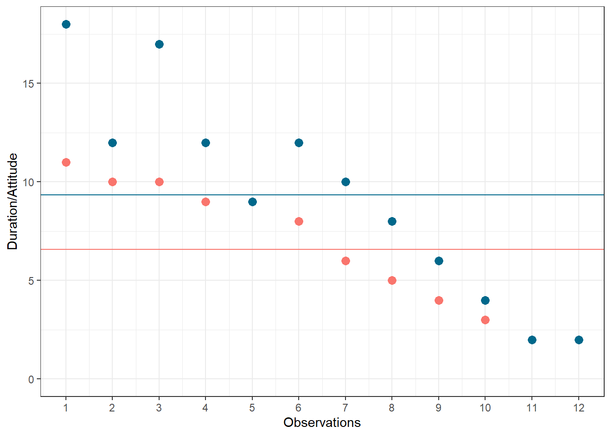
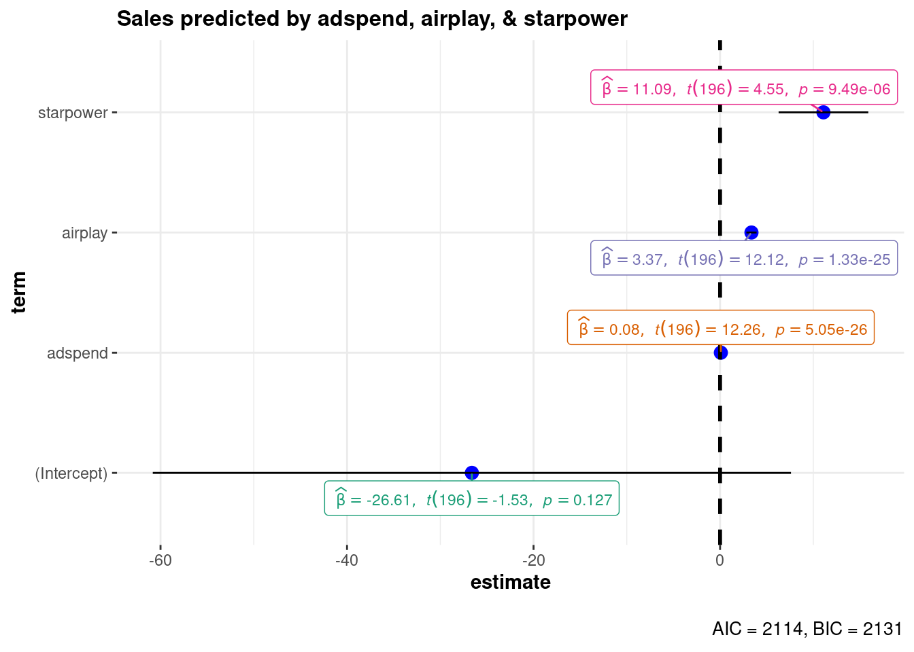
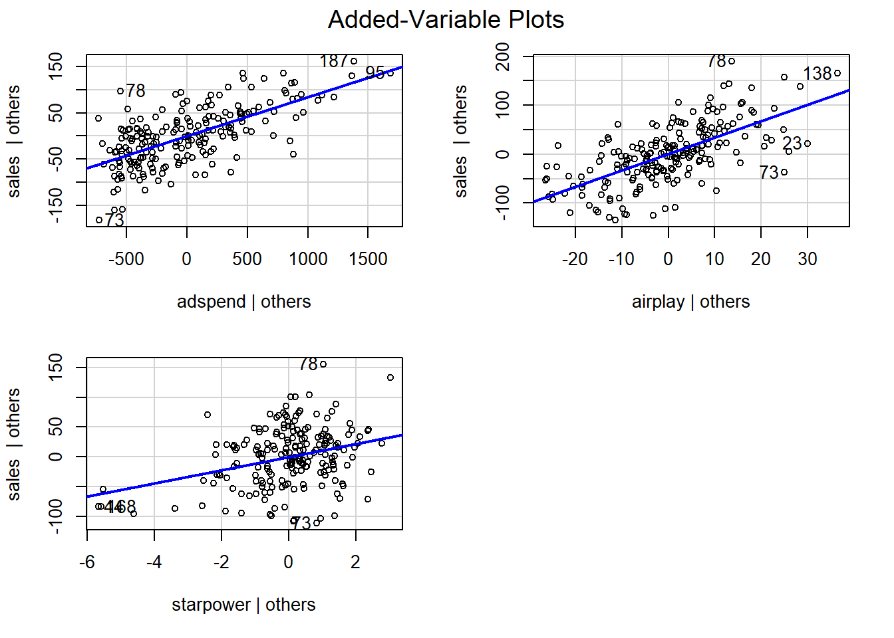
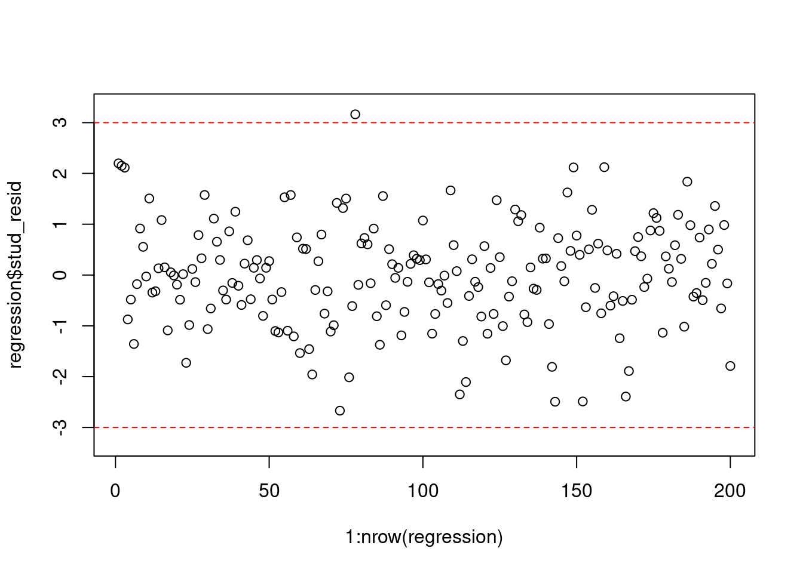
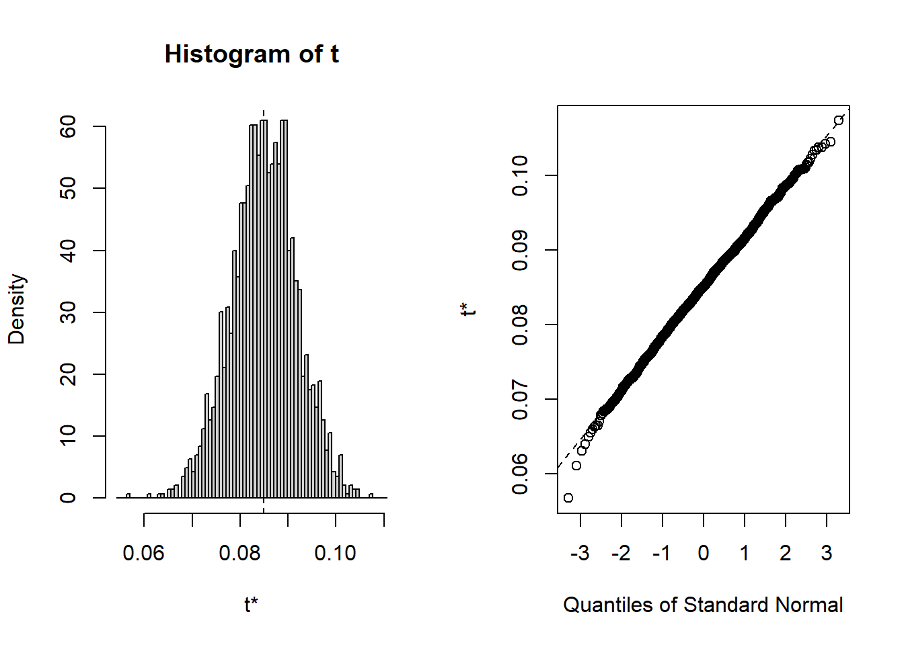
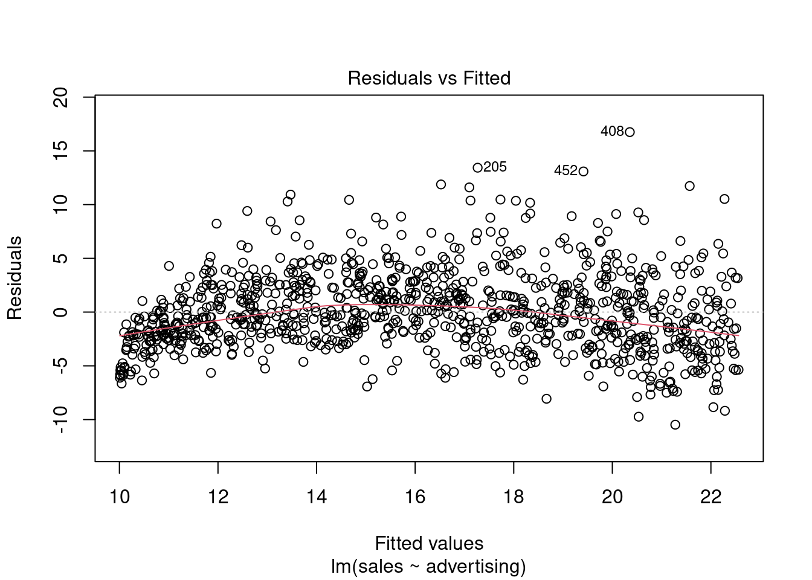

---
output:
  html_document:
    toc: yes
  pdf_document:
    toc: yes
  html_notebook: default
---


# Regression 

::: {.infobox .download data-latex="{download}"}
[You can download the corresponding R-Code here](./Code/10-regression.R)
:::


## Correlation

<br>
<div align="center">
<iframe width="560" height="315" src="https://www.youtube.com/embed/HeIW9_ijHF4" frameborder="0" allowfullscreen></iframe>
</div>
<br>

Before we start with regression analysis, we will review the basic concept of correlation first. Correlation helps us to determine the degree to which the variation in one variable, X, is related to the variation in another variable, Y. 

### Correlation coefficient

The correlation coefficient summarizes the strength of the linear relationship between two metric (interval or ratio scaled) variables. Let's consider a simple example. Say you conduct a survey to investigate the relationship between the attitude towards a city and the duration of residency. The "Attitude" variable can take values between 1 (very unfavorable) and 12 (very favorable), and the "duration of residency" is measured in years. Let's further assume for this example that the attitude measurement represents an interval scale (although it is usually not realistic to assume that the scale points on an itemized rating scale have the same distance). To keep it simple, let's further assume that you only asked 12 people. We can create a short data set like this:    


```r
library(psych)
attitude <- c(6, 9, 8, 3, 10, 4, 5, 2, 11, 9, 10, 2)
duration <- c(10, 12, 12, 4, 12, 6, 8, 2, 18, 9, 17,
    2)
att_data <- data.frame(attitude, duration)
att_data <- att_data[order(-attitude), ]
att_data$respodentID <- c(1:12)
str(att_data)
```

```
## 'data.frame':	12 obs. of  3 variables:
##  $ attitude   : num  11 10 10 9 9 8 6 5 4 3 ...
##  $ duration   : num  18 12 17 12 9 12 10 8 6 4 ...
##  $ respodentID: int  1 2 3 4 5 6 7 8 9 10 ...
```

```r
psych::describe(att_data[, c("attitude", "duration")])
```

```
##          vars  n mean   sd median trimmed  mad min max range  skew kurtosis
## attitude    1 12 6.58 3.32    7.0     6.6 4.45   2  11     9 -0.14    -1.74
## duration    2 12 9.33 5.26    9.5     9.2 4.45   2  18    16  0.10    -1.27
##            se
## attitude 0.96
## duration 1.52
```

```r
att_data
```

```
##    attitude duration respodentID
## 9        11       18           1
## 5        10       12           2
## 11       10       17           3
## 2         9       12           4
## 10        9        9           5
## 3         8       12           6
## 1         6       10           7
## 7         5        8           8
## 6         4        6           9
## 4         3        4          10
## 8         2        2          11
## 12        2        2          12
```

Let's look at the data first. The following graph shows the individual data points for the "duration of residency"" variable, where the y-axis shows the duration of residency in years and the x-axis shows the respondent ID. The blue horizontal line represents the mean of the variable (9.33) and the vertical lines show the distance of the individual data points from the mean.

<div class="figure" style="text-align: center">

<p class="caption">(\#fig:unnamed-chunk-4)Scores for duration of residency variable</p>
</div>

You can see that there are some respondents that have been living in the city longer than average and some respondents that have been living in the city shorter than average. Let's do the same for the second variable ("Attitude"). Again, the y-axis shows the observed scores for this variable and the x-axis shows the respondent ID.  

<div class="figure" style="text-align: center">

<p class="caption">(\#fig:unnamed-chunk-5)Scores for attitude variable</p>
</div>

Again, we can see that some respondents have an above average attitude towards the city (more favorable) and some respondents have a below average attitude towards the city. Let's combine both variables in one graph now to see if there is some co-movement: 

<div class="figure" style="text-align: center">

<p class="caption">(\#fig:unnamed-chunk-6)Scores for attitude and duration of residency variables</p>
</div>

We can see that there is indeed some co-movement here. The variables <b>covary</b> because respondents who have an above (below) average attitude towards the city also appear to have been living in the city for an above (below) average amount of time and vice versa. Correlation helps us to quantify this relationship. Before you proceed to compute the correlation coefficient, you should first look at the data. We usually use a scatterplot to visualize the relationship between two metric variables:

<div class="figure" style="text-align: center">

<p class="caption">(\#fig:unnamed-chunk-7)Scatterplot for durationand attitute variables</p>
</div>

How can we compute the correlation coefficient? Remember that the variance measures the average deviation from the mean of a variable:

\begin{equation} 
\begin{split}
s_x^2&=\frac{\sum_{i=1}^{N} (X_i-\overline{X})^2}{N-1} \\
     &= \frac{\sum_{i=1}^{N} (X_i-\overline{X})*(X_i-\overline{X})}{N-1}
\end{split}
(\#eq:variance)
\end{equation} 

When we consider two variables, we multiply the deviation for one variable by the respective deviation for the second variable: 

<p style="text-align:center;">
$(X_i-\overline{X})*(Y_i-\overline{Y})$
</p>

This is called the cross-product deviation. Then we sum the cross-product deviations:

<p style="text-align:center;">
$\sum_{i=1}^{N}(X_i-\overline{X})*(Y_i-\overline{Y})$
</p>

... and compute the average of the sum of all cross-product deviations to get the <b>covariance</b>:

\begin{equation} 
Cov(x, y) =\frac{\sum_{i=1}^{N}(X_i-\overline{X})*(Y_i-\overline{Y})}{N-1}
(\#eq:covariance)
\end{equation} 

You can easily compute the covariance manually as follows


```r
x <- att_data$duration
x_bar <- mean(att_data$duration)
y <- att_data$attitude
y_bar <- mean(att_data$attitude)
N <- nrow(att_data)
cov <- (sum((x - x_bar) * (y - y_bar)))/(N - 1)
cov
```

```
## [1] 16.333333
```

Or you simply use the built-in ```cov()``` function:


```r
cov(att_data$duration, att_data$attitude)  # apply the cov function 
```

```
## [1] 16.333333
```

A positive covariance indicates that as one variable deviates from the mean, the other variable deviates in the same direction. A negative covariance indicates that as one variable deviates from the mean (e.g., increases), the other variable deviates in the opposite direction (e.g., decreases).

However, the size of the covariance depends on the scale of measurement. Larger scale units will lead to larger covariance. To overcome the problem of dependence on measurement scale, we need to convert the covariance to a standard set of units through standardization by dividing the covariance by the standard deviation (similar to how we compute z-scores).

With two variables, there are two standard deviations. We simply multiply the two standard deviations. We then divide the covariance by the product of the two standard deviations to get the standardized covariance, which is known as a correlation coefficient r:

\begin{equation} 
r=\frac{Cov_{xy}}{s_x*s_y}
(\#eq:corcoeff)
\end{equation} 

This is known as the product moment correlation (r) and it is straight-forward to compute:


```r
x_sd <- sd(att_data$duration)
y_sd <- sd(att_data$attitude)
r <- cov/(x_sd * y_sd)
r
```

```
## [1] 0.93607782
```

Or you could just use the ```cor()``` function:


```r
cor(att_data[, c("attitude", "duration")], method = "pearson",
    use = "complete")
```

```
##            attitude   duration
## attitude 1.00000000 0.93607782
## duration 0.93607782 1.00000000
```

The properties of the correlation coefficient ('r') are:

* ranges from -1 to + 1
* +1 indicates perfect linear relationship
* -1 indicates perfect negative relationship
* 0 indicates no linear relationship
* ± .1 represents small effect
* ± .3 represents medium effect
* ± .5 represents large effect

### Significance testing

How can we determine if our two variables are significantly related? To test this, we denote the population moment correlation *&rho;*. Then we test the null of no relationship between variables:

$$H_0:\rho=0$$
$$H_1:\rho\ne0$$

The test statistic is: 

\begin{equation} 
t=\frac{r*\sqrt{N-2}}{\sqrt{1-r^2}}
(\#eq:cortest)
\end{equation} 

It has a t distribution with n - 2 degrees of freedom. Then, we follow the usual procedure of calculating the test statistic and comparing the test statistic to the critical value of the underlying probability distribution. If the calculated test statistic is larger than the critical value, the null hypothesis of no relationship between X and Y is rejected. 


```r
t_calc <- r * sqrt(N - 2)/sqrt(1 - r^2)  #calculated test statistic
t_calc
```

```
## [1] 8.4144314
```

```r
df <- (N - 2)  #degrees of freedom
t_crit <- qt(0.975, df)  #critical value
t_crit
```

```
## [1] 2.2281389
```

```r
pt(q = t_calc, df = df, lower.tail = F) * 2  #p-value 
```

```
## [1] 0.0000075451612
```

Or you can simply use the ```cor.test()``` function, which also produces the 95% confidence interval:


```r
cor.test(att_data$attitude, att_data$duration, alternative = "two.sided",
    method = "pearson", conf.level = 0.95)
```

```
## 
## 	Pearson's product-moment correlation
## 
## data:  att_data$attitude and att_data$duration
## t = 8.41443, df = 10, p-value = 0.0000075452
## alternative hypothesis: true correlation is not equal to 0
## 95 percent confidence interval:
##  0.78260411 0.98228152
## sample estimates:
##        cor 
## 0.93607782
```

To determine the linear relationship between variables, the data only needs to be measured using interval scales. If you want to test the significance of the association, the sampling distribution needs to be normally distributed (we usually assume this when our data are normally distributed or when N is large). If parametric assumptions are violated, you should use non-parametric tests:

* Spearman's correlation coefficient: requires ordinal data and ranks the data before applying Pearson's equation.
* Kendall's tau: use when N is small or the number of tied ranks is large.


```r
cor.test(att_data$attitude, att_data$duration, alternative = "two.sided",
    method = "spearman", conf.level = 0.95)
```

```
## 
## 	Spearman's rank correlation rho
## 
## data:  att_data$attitude and att_data$duration
## S = 14.1969, p-value = 0.0000021833
## alternative hypothesis: true rho is not equal to 0
## sample estimates:
##        rho 
## 0.95036059
```

```r
cor.test(att_data$attitude, att_data$duration, alternative = "two.sided",
    method = "kendall", conf.level = 0.95)
```

```
## 
## 	Kendall's rank correlation tau
## 
## data:  att_data$attitude and att_data$duration
## z = 3.90948, p-value = 0.000092496
## alternative hypothesis: true tau is not equal to 0
## sample estimates:
##        tau 
## 0.89602867
```

Report the results:

A Pearson product-moment correlation coefficient was computed to assess the relationship between the duration of residence in a city and the attitude toward the city. There was a positive correlation between the two variables, r = 0.936, n = 12, p < 0.05. A scatterplot summarizes the results (Figure XY).

**A note on the interpretation of correlation coefficients:**

As we have already seen in chapter 1, correlation coefficients give no indication of the direction of causality. In our example, we can conclude that the attitude toward the city is more positive as the years of residence increases. However, we cannot say that the years of residence cause the attitudes to be more positive. There are two main reasons for caution when interpreting correlations:

* Third-variable problem: there may be other unobserved factors that affect both the 'attitude towards a city' and the 'duration of residency' variables
* Direction of causality: Correlations say nothing about which variable causes the other to change (reverse causality: attitudes may just as well cause the years of residence variable).


## Regression

<br>
<div align="center">
<iframe width="560" height="315" src="https://www.youtube.com/embed/rtvDHLuXUEI" frameborder="0" allowfullscreen></iframe>
</div>
<br>

Correlations measure relationships between variables (i.e., how much two variables covary). Using regression analysis we can predict the outcome of a dependent variable (Y) from one or more independent variables (X). For example, we could be interested in how many products will we will sell if we increase the advertising expenditures by 1000 Euros? In regression analysis, we fit a model to our data and use it to predict the values of the dependent variable from one predictor variable (bivariate regression) or several predictor variables (multiple regression). The following table shows a comparison of correlation and regression analysis:

<br>

&nbsp; | Correlation	 | Regression	
-------------|--------------------------  | -------------------------- 
Estimated coefficient  | Coefficient of correlation (bounded between -1 and +1) | Regression coefficient (not bounded a priori)
Interpretation  | Linear association between two variables; Association is bidirectional | (Linear) relation between one or more independent variables and dependent variable; Relation is directional
Role of theory | Theory neither required nor testable  | Theory required and testable

<br>

### Simple linear regression

In simple linear regression, we assess the relationship between one dependent (regressand) and one independent (regressor) variable. The goal is to fit a line through a scatterplot of observations in order to find the line that best describes the data (scatterplot).

Suppose you are a marketing research analyst at a music label and your task is to suggest, on the basis of historical data, a marketing plan for the next year that will maximize product sales. The data set that is available to you includes information on the sales of music downloads (thousands of units), advertising expenditures (in Euros), the number of radio plays an artist received per week (airplay), the number of previous releases of an artist (starpower), repertoire origin (country; 0 = local, 1 = international), and genre (1 = rock, 2 = pop, 3 = electronic). Let's load and inspect the data first: 


```r
regression <- read.table("https://raw.githubusercontent.com/IMSMWU/Teaching/master/MRDA2017/music_sales_regression.dat",
    sep = "\t", header = TRUE)  #read in data
regression$country <- factor(regression$country, levels = c(0:1),
    labels = c("local", "international"))  #convert grouping variable to factor
regression$genre <- factor(regression$genre, levels = c(1:3),
    labels = c("rock", "pop", "electronic"))  #convert grouping variable to factor
head(regression)
```

<div data-pagedtable="false">
  <script data-pagedtable-source type="application/json">
{"columns":[{"label":["sales"],"name":[1],"type":["int"],"align":["right"]},{"label":["adspend"],"name":[2],"type":["dbl"],"align":["right"]},{"label":["airplay"],"name":[3],"type":["int"],"align":["right"]},{"label":["starpower"],"name":[4],"type":["int"],"align":["right"]},{"label":["genre"],"name":[5],"type":["fct"],"align":["left"]},{"label":["country"],"name":[6],"type":["fct"],"align":["left"]}],"data":[{"1":"330","2":"10.256","3":"43","4":"10","5":"electronic","6":"international"},{"1":"300","2":"174.093","3":"40","4":"7","5":"electronic","6":"international"},{"1":"250","2":"1000.000","3":"5","4":"7","5":"pop","6":"international"},{"1":"120","2":"75.896","3":"34","4":"6","5":"rock","6":"local"},{"1":"290","2":"1351.254","3":"37","4":"9","5":"electronic","6":"local"},{"1":"60","2":"202.705","3":"13","4":"8","5":"rock","6":"local"}],"options":{"columns":{"min":{},"max":[10]},"rows":{"min":[10],"max":[10]},"pages":{}}}
  </script>
</div>


```r
psych::describe(regression)  #descriptive statistics using psych
```

```
##           vars   n   mean     sd median trimmed    mad  min     max   range
## sales        1 200 193.20  80.70 200.00  192.69  88.96 10.0  360.00  350.00
## adspend      2 200 614.41 485.66 531.92  560.81 489.09  9.1 2271.86 2262.76
## airplay      3 200  27.50  12.27  28.00   27.46  11.86  0.0   63.00   63.00
## starpower    4 200   6.77   1.40   7.00    6.88   1.48  1.0   10.00    9.00
## genre*       5 200   2.40   0.79   3.00    2.50   0.00  1.0    3.00    2.00
## country*     6 200   1.17   0.38   1.00    1.09   0.00  1.0    2.00    1.00
##            skew kurtosis    se
## sales      0.04    -0.72  5.71
## adspend    0.84     0.17 34.34
## airplay    0.06    -0.09  0.87
## starpower -1.27     3.56  0.10
## genre*    -0.83    -0.91  0.06
## country*   1.74     1.05  0.03
```

As stated above, regression analysis may be used to relate a quantitative response ("dependent variable") to one or more predictor variables ("independent variables"). In a simple linear regression, we have one dependent and one independent variable and we regress the dependent variable on the independent variable.  

Here are a few important questions that we might seek to address based on the data:

* Is there a relationship between advertising budget and sales? 
* How strong is the relationship between advertising budget and sales?
* Which other variables contribute to sales?
* How accurately can we estimate the effect of each variable on sales?
* How accurately can we predict future sales?
* Is the relationship linear?
* Is there synergy among the advertising activities?

We may use linear regression to answer these questions. We will see later that the interpretation of the results strongly depends on the goal of the analysis - whether you would like to simply predict an outcome variable or you would like to explain the causal effect of the independent variable on the dependent variable (see chapter 1). Let's start with the first question and investigate the relationship between advertising and sales. 

#### Estimating the coefficients

A simple linear regression model only has one predictor and can be written as:

\begin{equation} 
Y=\beta_0+\beta_1X+\epsilon
(\#eq:regequ)
\end{equation} 

In our specific context, let's consider only the influence of advertising on sales for now:

\begin{equation} 
Sales=\beta_0+\beta_1*adspend+\epsilon
(\#eq:regequadv)
\end{equation} 

The word "adspend" represents data on advertising expenditures that we have observed and &beta;<sub>1</sub> (the "slope"") represents the unknown relationship between advertising expenditures and sales. It tells you by how much sales will increase for an additional Euro spent on advertising. &beta;<sub>0</sub> (the "intercept") is the number of sales we would expect if no money is spent on advertising. Together, &beta;<sub>0</sub> and &beta;<sub>1</sub> represent the model coefficients or *parameters*. The error term (&epsilon;) captures everything that we miss by using our model, including, (1) misspecifications (the true relationship might not be linear), (2) omitted variables (other variables might drive sales), and (3) measurement error (our measurement of the variables might be imperfect).

Once we have used our training data to produce estimates for the model coefficients, we can predict future sales on the basis of a particular value of advertising expenditures by computing:

\begin{equation} 
\hat{Sales}=\hat{\beta_0}+\hat{\beta_1}*adspend
(\#eq:predreg)
\end{equation} 

We use the hat symbol, <sup>^</sup>, to denote the estimated value for an unknown parameter or coefficient, or to denote the predicted value of the response (sales). In practice, &beta;<sub>0</sub> and &beta;<sub>1</sub> are unknown and must be estimated from the data to make predictions. In the case of our advertising example, the data set consists of the advertising budget and product sales of 200 music songs (n = 200). Our goal is to obtain coefficient estimates such that the linear model fits the available data well. In other words, we fit a line through the scatterplot of observations and try to find the line that best describes the data. The following graph shows the scatterplot for our data, where the black line shows the regression line. The grey vertical lines shows the difference between the predicted values (the regression line) and the observed values. This difference is referred to as the residuals ("e").

<div class="figure" style="text-align: center">

<p class="caption">(\#fig:unnamed-chunk-17)Ordinary least squares (OLS)</p>
</div>

The estimation of the regression function is based on the idea of the method of least squares (OLS = ordinary least squares). The first step is to calculate the residuals by subtracting the observed values from the predicted values.

<p style="text-align:center;">
$e_i = Y_i-(\beta_0+\beta_1X_i)$
</p>

This difference is then minimized by minimizing the sum of the squared residuals:

\begin{equation} 
\sum_{i=1}^{N} e_i^2= \sum_{i=1}^{N} [Y_i-(\beta_0+\beta_1X_i)]^2\rightarrow min!
(\#eq:rss)
\end{equation} 

e<sub>i</sub>: Residuals (i = 1,2,...,N)<br>
Y<sub>i</sub>: Values of the dependent variable (i = 1,2,...,N) <br>
&beta;<sub>0</sub>: Intercept<br>
&beta;<sub>1</sub>: Regression coefficient / slope parameters<br>
X<sub>ni</sub>: Values of the nth independent variables and the i*th* observation<br>
N: Number of observations<br>

This is also referred to as the <b>residual sum of squares (RSS)</b>, which you may still remember from the previous chapter on ANOVA. Now we need to choose the values for &beta;<sub>0</sub> and &beta;<sub>1</sub> that minimize RSS. So how can we derive these values for the regression coefficient? The equation for &beta;<sub>1</sub> is given by:

\begin{equation} 
\hat{\beta_1}=\frac{COV_{XY}}{s_x^2}
(\#eq:slope)
\end{equation} 

The exact mathematical derivation of this formula is beyond the scope of this script, but the intuition is to calculate the first derivative of the squared residuals with respect to &beta;<sub>1</sub> and set it to zero, thereby finding the &beta;<sub>1</sub> that minimizes the term. Using the above formula, you can easily compute &beta;<sub>1</sub> using the following code:


```r
cov_y_x <- cov(regression$adspend, regression$sales)
cov_y_x
```

```
## [1] 22672.016
```

```r
var_x <- var(regression$adspend)
var_x
```

```
## [1] 235860.98
```

```r
beta_1 <- cov_y_x/var_x
beta_1
```

```
## [1] 0.096124486
```

The interpretation of &beta;<sub>1</sub> is as follows: 

For every extra Euro spent on advertising, sales can be expected to increase by 0.096 units. Or, in other words, if we increase our marketing budget by 1,000 Euros, sales can be expected to increase by 96 units.

Using the estimated coefficient for &beta;<sub>1</sub>, it is easy to compute &beta;<sub>0</sub> (the intercept) as follows:

\begin{equation} 
\hat{\beta_0}=\overline{Y}-\hat{\beta_1}\overline{X}
(\#eq:intercept)
\end{equation} 

The R code for this is:


```r
beta_0 <- mean(regression$sales) - beta_1 * mean(regression$adspend)
beta_0
```

```
## [1] 134.13994
```

The interpretation of &beta;<sub>0</sub> is as follows: 

If we spend no money on advertising, we would expect to sell 134.14 units.

You may also verify this based on a scatterplot of the data. The following plot shows the scatterplot including the regression line, which is estimated using OLS.  


```r
ggplot(regression, mapping = aes(adspend, sales)) +
    geom_point(shape = 1) + geom_smooth(method = "lm",
    fill = "blue", alpha = 0.1) + labs(x = "Advertising expenditures (EUR)",
    y = "Number of sales") + theme_bw()
```

<div class="figure" style="text-align: center">

<p class="caption">(\#fig:unnamed-chunk-20)Scatterplot</p>
</div>

You can see that the regression line intersects with the y-axis at 134.14, which corresponds to the expected sales level when advertising expenditure (on the x-axis) is zero (i.e., the intercept &beta;<sub>0</sub>). The slope coefficient (&beta;<sub>1</sub>) tells you by how much sales (on the y-axis) would increase if advertising expenditures (on the x-axis) are increased by one unit.   

#### Significance testing

In a next step, we assess if the effect of advertising on sales is statistically significant. This means that we test the null hypothesis H<sub>0</sub>: "There is no relationship between advertising and sales" versus the alternative hypothesis H<sub>1</sub>: "The is some relationship between advertising and sales". Or, to state this formally:

$$H_0:\beta_1=0$$
$$H_1:\beta_1\ne0$$

How can we test if the effect is statistically significant? Recall the generalized equation to derive a test statistic:

\begin{equation} 
test\ statistic = \frac{effect}{error}
(\#eq:teststatgeneral)
\end{equation} 

The effect is given by the &beta;<sub>1</sub> coefficient in this case. To compute the test statistic, we need to come up with a measure of uncertainty around this estimate (the error). This is because we use information from a sample to estimate the least squares line to make inferences regarding the regression line in the entire population. Since we only have access to one sample, the regression line will be slightly different every time we take a different sample from the population. This is sampling variation and it is perfectly normal! It just means that we need to take into account the uncertainty around the estimate, which is achieved by the standard error. Thus, the test statistic for our hypothesis is given by:

\begin{equation} 
t = \frac{\hat{\beta_1}}{SE(\hat{\beta_1})}
(\#eq:teststatreg)
\end{equation} 

After calculating the test statistic, we compare its value to the values that we would expect to find if there was no effect based on the t-distribution. In a regression context, the degrees of freedom are given by ```N - p - 1``` where N is the sample size and p is the number of predictors. In our case, we have 200 observations and one predictor. Thus, the degrees of freedom is 200 - 1 - 1 = 198. In the regression output below, R provides the exact probability of observing a t value of this magnitude (or larger) if the null hypothesis was true. This probability - as we already saw in chapter 6 - is the p-value. A small p-value indicates that it is unlikely to observe such a substantial association between the predictor and the outcome variable due to chance in the absence of any real association between the predictor and the outcome.

To estimate the regression model in R, you can use the ```lm()``` function. Within the function, you first specify the dependent variable ("sales") and independent variable ("adspend") separated by a ```~``` (tilde). As mentioned previously, this is known as _formula notation_ in R. The ```data = regression``` argument specifies that the variables come from the data frame named "regression". Strictly speaking, you use the ```lm()``` function to create an object called "simple_regression," which holds the regression output. You can then view the results using the ```summary()``` function: 


```r
simple_regression <- lm(sales ~ adspend, data = regression)  #estimate linear model
summary(simple_regression)  #summary of results
```

```
## 
## Call:
## lm(formula = sales ~ adspend, data = regression)
## 
## Residuals:
##       Min        1Q    Median        3Q       Max 
## -152.9493  -43.7961   -0.3933   37.0404  211.8658 
## 
## Coefficients:
##                Estimate  Std. Error t value              Pr(>|t|)    
## (Intercept) 134.1399378   7.5365747 17.7985 < 0.00000000000000022 ***
## adspend       0.0961245   0.0096324  9.9793 < 0.00000000000000022 ***
## ---
## Signif. codes:  0 '***' 0.001 '**' 0.01 '*' 0.05 '.' 0.1 ' ' 1
## 
## Residual standard error: 65.991 on 198 degrees of freedom
## Multiple R-squared:  0.33465,	Adjusted R-squared:  0.33129 
## F-statistic: 99.587 on 1 and 198 DF,  p-value: < 0.000000000000000222
```

Note that the estimated coefficients for &beta;<sub>0</sub> (134.14) and &beta;<sub>1</sub> (0.096) correspond to the results of our manual computation above. The associated t-values and p-values are given in the output. The t-values are larger than the critical t-values for the 95% confidence level, since the associated p-values are smaller than 0.05. In case of the coefficient for &beta;<sub>1</sub>, this means that the probability of an association between the advertising and sales of the observed magnitude (or larger) is smaller than 0.05, if the value of &beta;<sub>1</sub> was, in fact, 0. This finding leads us to reject the null hypothesis of no association between advertising and sales. 

The coefficients associated with the respective variables represent <b>point estimates</b>. To obtain a better understanding of the range of values that the coefficients could take, it is helpful to compute <b>confidence intervals</b>. A 95% confidence interval is defined as a range of values such that with a 95% probability, the range will contain the true unknown value of the parameter. For example, for &beta;<sub>1</sub>, the confidence interval can be computed as.

\begin{equation} 
CI = \hat{\beta_1}\pm(t_{1-\frac{\alpha}{2}}*SE(\beta_1))
(\#eq:regCI)
\end{equation} 

It is easy to compute confidence intervals in R using the ```confint()``` function. You just have to provide the name of you estimated model as an argument:


```r
confint(simple_regression)
```

```
##                     2.5 %       97.5 %
## (Intercept) 119.277680821 149.00219480
## adspend       0.077129291   0.11511968
```

For our model, the 95% confidence interval for &beta;<sub>0</sub> is [119.28,149], and the 95% confidence interval for &beta;<sub>1</sub> is [0.08,0.12]. Thus, we can conclude that when we do not spend any money on advertising, sales will be somewhere between 119 and 149 units on average. In addition, for each increase in advertising expenditures by one Euro, there will be an average increase in sales of between 0.08 and 0.12. If you revisit the graphic depiction of the regression model above, the uncertainty regarding the intercept and slope parameters can be seen in the confidence bounds (blue area) around the regression line. 

#### Assessing model fit

<br>
<div align="center">
<iframe width="560" height="315" src="https://www.youtube.com/embed/nG4_st29Qe8" frameborder="0" allowfullscreen></iframe>
</div>
<br>

Once we have rejected the null hypothesis in favor of the alternative hypothesis, the next step is to investigate how well the model represents ("fits") the data. How can we assess the model fit?

* First, we calculate the fit of the most basic model (i.e., the mean)
* Then, we calculate the fit of the best model (i.e., the regression model)
* A good model should fit the data significantly better than the basic model
* R<sup>2</sup>: Represents the percentage of the variation in the outcome that can be explained by the model
* The F-ratio measures how much the model has improved the prediction of the outcome compared to the level of inaccuracy in the model

Similar to ANOVA, the calculation of model fit statistics relies on estimating the different sum of squares values. SS<sub>T</sub> is the difference between the observed data and the mean value of Y (aka. total variation). In the absence of any other information, the mean value of Y ($\overline{Y}$) represents the best guess on where a particular observation $Y_{i}$ at a given level of advertising will fall:

\begin{equation} 
SS_T= \sum_{i=1}^{N} (Y_i-\overline{Y})^2
(\#eq:regSST)
\end{equation} 

The following graph shows the total sum of squares:

<div class="figure" style="text-align: center">

<p class="caption">(\#fig:unnamed-chunk-23)Total sum of squares</p>
</div>

Based on our linear model, the best guess about the sales level at a given level of advertising is the predicted value $\hat{Y}_i$. The model sum of squares (SS<sub>M</sub>) therefore has the mathematical representation:

\begin{equation} 
SS_M= \sum_{i=1}^{N}  (\hat{Y}_i-\overline{Y})^2
(\#eq:regSSM)
\end{equation} 

The model sum of squares represents the improvement in prediction resulting from using the regression model rather than the mean of the data. The following graph shows the model sum of squares for our example:

<div class="figure" style="text-align: center">

<p class="caption">(\#fig:unnamed-chunk-24)Ordinary least squares (OLS)</p>
</div>

The residual sum of squares (SS<sub>R</sub>) is the difference between the observed data points ($Y_{i}$) and the predicted values along the regression line ($\hat{Y}_{i}$), i.e., the variation *not* explained by the model.

\begin{equation} 
SS_R= \sum_{i=1}^{N} ({Y}_{i}-\hat{Y}_{i})^2
(\#eq:regSSR)
\end{equation} 

The following graph shows the residual sum of squares for our example:

<div class="figure" style="text-align: center">

<p class="caption">(\#fig:unnamed-chunk-25)Ordinary least squares (OLS)</p>
</div>

Based on these statistics, we can determine have well the model fits the data as we will see next. 

##### R-squared {-}

The R<sup>2</sup> statistic represents the proportion of variance that is explained by the model and is computed as:

\begin{equation} 
R^2= \frac{SS_M}{SS_T}
(\#eq:regSSR)
\end{equation} 

It takes values between 0 (very bad fit) and 1 (very good fit). Note that when the goal of your model is to *predict* future outcomes, a "too good" model fit can pose severe challenges. The reason is that the model might fit your specific sample so well, that it will only predict well within the sample but not generalize to other samples. This is called **overfitting** and it shows that there is a trade-off between model fit and out-of-sample predictive ability of the model, if the goal is to predict beyond the sample. We will come back to this point later in this chapter. 

You can get a first impression of the fit of the model by inspecting the scatter plot as can be seen in the plot below. If the observations are highly dispersed around the regression line (left plot), the fit will be lower compared to a data set where the values are less dispersed (right plot).

<div class="figure" style="text-align: center">

<p class="caption">(\#fig:unnamed-chunk-26)Good vs. bad model fit</p>
</div>

The R<sup>2</sup> statistic is reported in the regression output (see above). However, you could also extract the relevant sum of squares statistics from the regression object using the ```anova()``` function to compute it manually: 


```r
anova(simple_regression)  #anova results
```

```
## Analysis of Variance Table
## 
## Response: sales
##            Df Sum Sq Mean Sq F value              Pr(>F)    
## adspend     1 433688  433688    99.6 <0.0000000000000002 ***
## Residuals 198 862264    4355                                
## ---
## Signif. codes:  0 '***' 0.001 '**' 0.01 '*' 0.05 '.' 0.1 ' ' 1
```

Now we can compute R<sup>2</sup> in the same way that we have computed Eta<sup>2</sup> in the last section:


```r
r2 <- anova(simple_regression)$"Sum Sq"[1]/(anova(simple_regression)$"Sum Sq"[1] +
    anova(simple_regression)$"Sum Sq"[2])  #compute R2
r2
```

```
## [1] 0.33
```

##### Adjusted R-squared {-}

Due to the way the R<sup>2</sup> statistic is calculated, it will never decrease if a new explanatory variable is introduced into the model. This means that every new independent variable either doesn't change the R<sup>2</sup> or increases it, even if there is no real relationship between the new variable and the dependent variable. Hence, one could be tempted to just add as many variables as possible to increase the R<sup>2</sup> and thus obtain a "better" model. However, this actually only leads to more noise and therefore a worse model. 

To account for this, there exists a test statistic closely related to the R<sup>2</sup>, the **adjusted R<sup>2</sup>**. It can be calculated as follows:

\begin{equation} 
\overline{R^2} = 1 - (1 - R^2)\frac{n-1}{n - k - 1}
(\#eq:adjustedR2)
\end{equation} 

where ```n``` is the total number of observations and ```k``` is the total number of explanatory variables. The adjusted R<sup>2</sup> is equal to or less than the regular R<sup>2</sup> and can be negative. It will only increase if the added variable adds more explanatory power than one would expect by pure chance. Essentially, it contains a "penalty" for including unnecessary variables and therefore favors more parsimonious models. As such, it is a measure of suitability, good for comparing different models and is very useful in the model selection stage of a project. In R, the standard ```lm()``` function automatically also reports the adjusted R<sup>2</sup> as you can see above.

##### F-test {-}

Similar to the ANOVA in chapter 6, another significance test is the F-test, which tests the null hypothesis:

$$H_0:R^2=0$$

<br>

Or, to state it slightly differently: 

$$H_0:\beta_1=\beta_2=\beta_3=\beta_k=0$$
<br>
This means that, similar to the ANOVA, we test whether any of the included independent variables has a significant effect on the dependent variable. So far, we have only included one independent variable, but we will extend the set of predictor variables below.   

The F-test statistic is calculated as follows:

\begin{equation} 
F=\frac{\frac{SS_M}{k}}{\frac{SS_R}{(n-k-1)}}=\frac{MS_M}{MS_R}
(\#eq:regSSR)
\end{equation} 

which has a F distribution with k number of predictors and n degrees of freedom. In other words, you divide the systematic ("explained") variation due to the predictor variables by the unsystematic ("unexplained") variation. 

The result of the F-test is provided in the regression output. However, you might manually compute the F-test using the ANOVA results from the model:  


```r
anova(simple_regression)  #anova results
```

```
## Analysis of Variance Table
## 
## Response: sales
##            Df Sum Sq Mean Sq F value              Pr(>F)    
## adspend     1 433688  433688    99.6 <0.0000000000000002 ***
## Residuals 198 862264    4355                                
## ---
## Signif. codes:  0 '***' 0.001 '**' 0.01 '*' 0.05 '.' 0.1 ' ' 1
```

```r
f_calc <- anova(simple_regression)$"Mean Sq"[1]/anova(simple_regression)$"Mean Sq"[2]  #compute F
f_calc
```

```
## [1] 100
```

```r
f_crit <- qf(0.95, df1 = 1, df2 = 100)  #critical value
f_crit
```

```
## [1] 3.9
```

```r
f_calc > f_crit  #test if calculated test statistic is larger than critical value
```

```
## [1] TRUE
```

#### Using the model

After fitting the model, we can use the estimated coefficients to predict sales for different values of advertising. Suppose you want to predict sales for a new product, and the company plans to spend 800 Euros on advertising. How much will it sell? You can easily compute this either by hand:

$$\hat{sales}=134.134 + 0.09612*800=211$$

<br>

... or by extracting the estimated coefficients from the model summary:


```r
summary(simple_regression)$coefficients[1,1] + # the intercept
summary(simple_regression)$coefficients[2,1]*800 # the slope * 800
```

```
## [1] 211
```

The predicted value of the dependent variable is 211 units, i.e., the product will (on average) sell 211 units.

### Multiple linear regression

<br>
<div align="center">
<iframe width="560" height="315" src="https://www.youtube.com/embed/SDB2PhHMgxg" frameborder="0" allowfullscreen></iframe>
</div>
<br>

Multiple linear regression is a statistical technique that simultaneously tests the relationships between two or more independent variables and an interval-scaled dependent variable. The general form of the equation is given by:

\begin{equation} 
Y=(\beta_0+\beta_1*X_1+\beta_2*X_2+\beta_n*X_n)+\epsilon
(\#eq:regequ)
\end{equation} 

Again, we aim to find the linear combination of predictors that correlate maximally with the outcome variable. Note that if you change the composition of predictors, the partial regression coefficient of an independent variable will be different from that of the bivariate regression coefficient. This is because the regressors are usually correlated, and any variation in Y that was shared by X1 and X2 was attributed to X1. The interpretation of the partial regression coefficients is the expected change in Y when X is changed by one unit and all other predictors are held constant. 

Let's extend the previous example. Say, in addition to the influence of advertising, you are interested in estimating the influence of radio airplay on the number of album downloads. The corresponding equation would then be given by:

\begin{equation} 
Sales=\beta_0+\beta_1*adspend+\beta_2*airplay+\epsilon
(\#eq:regequadv)
\end{equation} 

The words "adspend" and "airplay" represent data that we have observed on advertising expenditures and number of radio plays, and &beta;<sub>1</sub> and &beta;<sub>2</sub> represent the unknown relationship between sales and advertising expenditures and radio airplay, respectively. The corresponding coefficients tell you by how much sales will increase for an additional Euro spent on advertising (when radio airplay is held constant) and by how much sales will increase for an additional radio play (when advertising expenditures are held constant). Thus, we can make predictions about album sales based not only on advertising spending, but also on radio airplay.

With several predictors, the partitioning of sum of squares is the same as in the bivariate model, except that the model is no longer a 2-D straight line. With two predictors, the regression line becomes a 3-D regression plane. In our example:

<div class="figure" style="text-align: center">

```{=html}
<div id="htmlwidget-d5079acbc85567375398" style="width:672px;height:480px;" class="plotly html-widget"></div>
<script type="application/json" data-for="htmlwidget-d5079acbc85567375398">{"x":{"visdat":{"c55632e8d176":["function () ","plotlyVisDat"],"c5567ec5f480":["function () ","data"]},"cur_data":"c5567ec5f480","attrs":{"c55632e8d176":{"x":{},"y":{},"z":{},"colors":["#A9D0F5","#08088A"],"alpha_stroke":1,"sizes":[10,100],"spans":[1,20],"type":"surface"},"c5567ec5f480":{"x":[10.256,174.093,1000,75.896,1351.254,202.705,365.985,305.268,263.268,513.694,152.609,35.987,1720.806,102.568,215.368,426.784,507.772,233.291,1035.433,102.642,526.142,624.538,912.349,611.479,215.994,561.963,474.76,231.523,678.596,70.922,1567.548,263.598,1423.568,715.678,251.192,777.237,509.43,964.11,583.627,923.373,344.392,1095.578,100.025,30.425,1080.342,97.972,799.899,1071.752,893.355,283.161,917.017,234.568,456.897,206.973,1294.099,826.859,406.814,564.158,192.607,10.652,45.689,42.568,20.456,635.192,1002.273,1177.047,507.638,265.398,215.689,526.48,26.895,883.877,9.104,103.568,169.583,429.504,223.639,145.585,1323.287,985.968,500.922,226.652,1051.168,68.093,1547.159,393.774,804.282,801.577,450.562,196.65,26.598,179.061,345.687,295.84,2271.86,1134.575,601.434,45.298,759.518,832.869,1326.598,56.894,709.399,56.895,767.134,503.172,700.929,910.851,888.569,800.615,1500,985.685,1380.689,785.694,792.345,957.167,1789.659,656.137,613.697,313.362,336.51,1544.899,68.954,1445.563,785.692,125.628,377.925,217.994,759.862,1163.444,842.957,125.179,236.598,669.811,1188.193,612.234,922.019,50,2000,1054.027,385.045,1507.972,102.568,204.568,1170.918,574.513,689.547,784.22,405.913,179.778,607.258,1542.329,1112.47,856.985,836.331,236.908,568.954,1077.855,579.321,1500,731.364,25.689,391.749,233.999,275.7,56.895,255.117,471.814,566.501,102.568,250.568,68.594,642.786,1500,102.563,756.984,51.229,644.151,537.352,15.313,243.237,256.894,22.464,45.689,724.938,1126.461,1985.119,1837.516,135.986,514.068,237.703,976.641,1452.689,1600,268.598,900.889,982.063,201.356,746.024,1132.877],"y":[43,40,5,34,37,13,23,54,18,2,11,30,32,22,36,37,9,2,12,5,14,20,57,20,19,35,22,16,53,4,29,43,26,28,24,37,32,34,30,15,23,31,21,28,18,38,28,37,26,30,10,21,18,14,38,36,24,32,9,39,24,45,13,17,32,23,0,25,35,26,19,26,53,29,28,17,26,42,35,17,36,45,20,15,28,27,17,32,46,36,47,19,22,55,31,39,21,36,21,44,27,27,16,33,33,21,35,26,14,34,11,28,33,20,33,28,30,34,49,40,20,42,35,35,8,49,19,42,6,36,32,28,25,34,33,21,34,63,31,25,42,37,25,26,39,44,46,36,12,2,29,33,28,10,38,19,19,13,30,38,22,23,22,20,18,37,16,20,32,26,53,28,32,24,37,30,19,47,22,22,10,1,1,39,8,38,35,40,22,21,27,31,19,24,1,38,26,11,34,55],"z":[330,300,250,120,290,60,140,290,160,100,160,150,290,140,230,230,30,80,190,90,120,150,230,70,150,210,180,140,360,10,240,270,290,220,150,230,220,240,260,170,130,270,140,60,210,190,210,240,210,200,140,90,120,100,360,180,240,150,110,90,160,230,40,60,230,230,120,100,150,120,60,280,120,230,230,40,140,360,250,210,260,250,200,150,250,100,260,210,290,210,220,70,110,250,320,300,180,180,200,320,280,140,100,120,230,150,250,190,240,250,230,120,230,110,210,230,320,210,230,250,60,330,150,360,150,180,80,180,130,320,280,200,130,190,270,150,230,310,340,240,180,220,40,190,290,220,340,250,190,120,230,190,210,170,310,90,170,140,300,340,170,100,200,80,100,70,50,70,240,160,290,140,210,300,230,280,160,200,210,110,110,70,100,190,70,360,360,300,120,200,150,220,280,300,140,290,180,140,210,250],"colors":["#A9D0F5","#08088A"],"alpha_stroke":1,"sizes":[10,100],"spans":[1,20],"type":"scatter3d","mode":"markers","marker":{"color":["darkgray","steelblue","steelblue","darkgray","steelblue","darkgray","darkgray","darkgray","darkgray","darkgray","darkgray","steelblue","darkgray","steelblue","steelblue","darkgray","darkgray","darkgray","darkgray","darkgray","darkgray","darkgray","steelblue","darkgray","darkgray","steelblue","darkgray","darkgray","steelblue","darkgray","darkgray","darkgray","darkgray","steelblue","darkgray","steelblue","steelblue","steelblue","darkgray","steelblue","steelblue","darkgray","darkgray","darkgray","darkgray","steelblue","darkgray","darkgray","steelblue","darkgray","steelblue","darkgray","steelblue","darkgray","steelblue","darkgray","darkgray","darkgray","darkgray","steelblue","steelblue","darkgray","darkgray","steelblue","darkgray","darkgray","darkgray","darkgray","darkgray","steelblue","steelblue","darkgray","darkgray","darkgray","darkgray","darkgray","darkgray","darkgray","darkgray","steelblue","darkgray","darkgray","darkgray","darkgray","darkgray","darkgray","darkgray","darkgray","darkgray","steelblue","darkgray","darkgray","steelblue","darkgray","darkgray","steelblue","darkgray","darkgray","darkgray","steelblue","darkgray","darkgray","steelblue","steelblue","darkgray","darkgray","steelblue","steelblue","darkgray","darkgray","darkgray","darkgray","steelblue","darkgray","darkgray","darkgray","darkgray","darkgray","darkgray","darkgray","steelblue","steelblue","darkgray","steelblue","steelblue","steelblue","darkgray","darkgray","steelblue","darkgray","darkgray","darkgray","darkgray","darkgray","darkgray","darkgray","steelblue","darkgray","darkgray","darkgray","darkgray","darkgray","darkgray","darkgray","darkgray","darkgray","darkgray","darkgray","steelblue","darkgray","darkgray","darkgray","darkgray","darkgray","darkgray","darkgray","darkgray","darkgray","darkgray","darkgray","darkgray","darkgray","darkgray","darkgray","darkgray","steelblue","steelblue","darkgray","darkgray","darkgray","steelblue","steelblue","darkgray","darkgray","darkgray","darkgray","darkgray","darkgray","darkgray","darkgray","steelblue","steelblue","darkgray","darkgray","darkgray","darkgray","darkgray","darkgray","steelblue","steelblue","darkgray","darkgray","darkgray","steelblue","darkgray","darkgray","darkgray","darkgray","steelblue","darkgray"],"size":3,"opacity":0.8,"symbol":75},"inherit":true}},"layout":{"margin":{"b":40,"l":60,"t":25,"r":10},"scene":{"xaxis":{"title":"adspend"},"yaxis":{"title":"airplay"},"zaxis":{"title":"sales"}},"hovermode":"closest","showlegend":false,"legend":{"yanchor":"top","y":0.5}},"source":"A","config":{"showSendToCloud":false},"data":[{"colorbar":{"title":"z","ticklen":2,"len":0.5,"lenmode":"fraction","y":1,"yanchor":"top"},"colorscale":[["0","rgba(169,208,245,1)"],["0.0416666666666667","rgba(164,199,241,1)"],["0.0833333333333333","rgba(159,191,236,1)"],["0.125","rgba(154,182,232,1)"],["0.166666666666667","rgba(149,174,227,1)"],["0.208333333333333","rgba(144,165,223,1)"],["0.25","rgba(139,157,218,1)"],["0.291666666666667","rgba(134,148,214,1)"],["0.333333333333333","rgba(128,140,209,1)"],["0.375","rgba(123,132,205,1)"],["0.416666666666667","rgba(118,124,200,1)"],["0.458333333333333","rgba(112,115,196,1)"],["0.5","rgba(106,107,191,1)"],["0.541666666666667","rgba(101,99,187,1)"],["0.583333333333333","rgba(95,91,183,1)"],["0.625","rgba(89,84,178,1)"],["0.666666666666667","rgba(83,76,174,1)"],["0.708333333333333","rgba(76,68,169,1)"],["0.75","rgba(70,60,165,1)"],["0.791666666666667","rgba(63,52,160,1)"],["0.833333333333333","rgba(55,44,156,1)"],["0.875","rgba(47,36,151,1)"],["0.916666666666667","rgba(37,28,147,1)"],["0.958333333333333","rgba(26,19,142,1)"],["1","rgba(8,8,138,1)"]],"showscale":true,"x":[9.104,103.3855,197.667,291.9485,386.23,480.5115,574.793,669.0745,763.356,857.6375,951.919,1046.2005,1140.482,1234.7635,1329.045,1423.3265,1517.608,1611.8895,1706.171,1800.4525,1894.734,1989.0155,2083.297,2177.5785,2271.86],"y":[0,2.625,5.25,7.875,10.5,13.125,15.75,18.375,21,23.625,26.25,28.875,31.5,34.125,36.75,39.375,42,44.625,47.25,49.875,52.5,55.125,57.75,60.375,63],"z":[[41.9148312294276,50.1066740811476,58.2985169328676,66.4903597845876,74.6822026363075,82.8740454880275,91.0658883397475,99.2577311914675,107.449574043187,115.641416894907,123.833259746627,132.025102598347,140.216945450067,148.408788301787,156.600631153507,164.792474005227,172.984316856947,181.176159708667,189.368002560387,197.559845412107,205.751688263827,213.943531115547,222.135373967267,230.327216818987,238.519059670707],[51.3354036298894,59.5272464816094,67.7190893333294,75.9109321850494,84.1027750367694,92.2946178884894,100.486460740209,108.678303591929,116.870146443649,125.061989295369,133.253832147089,141.445674998809,149.637517850529,157.829360702249,166.021203553969,174.213046405689,182.404889257409,190.596732109129,198.788574960849,206.980417812569,215.172260664289,223.364103516009,231.555946367729,239.747789219449,247.939632071169],[60.7559760303513,68.9478188820713,77.1396617337913,85.3315045855112,93.5233474372312,101.715190288951,109.907033140671,118.098875992391,126.290718844111,134.482561695831,142.674404547551,150.866247399271,159.058090250991,167.249933102711,175.441775954431,183.633618806151,191.825461657871,200.017304509591,208.209147361311,216.400990213031,224.592833064751,232.784675916471,240.976518768191,249.168361619911,257.360204471631],[70.1765484308131,78.3683912825331,86.5602341342531,94.7520769859731,102.943919837693,111.135762689413,119.327605541133,127.519448392853,135.711291244573,143.903134096293,152.094976948013,160.286819799733,168.478662651453,176.670505503173,184.862348354893,193.054191206613,201.246034058333,209.437876910053,217.629719761773,225.821562613493,234.013405465213,242.205248316933,250.397091168653,258.588934020373,266.780776872093],[79.597120831275,87.788963682995,95.9808065347149,104.172649386435,112.364492238155,120.556335089875,128.748177941595,136.940020793315,145.131863645035,153.323706496755,161.515549348475,169.707392200195,177.899235051915,186.091077903635,194.282920755355,202.474763607075,210.666606458795,218.858449310515,227.050292162235,235.242135013955,243.433977865675,251.625820717395,259.817663569115,268.009506420835,276.201349272555],[89.0176932317368,97.2095360834568,105.401378935177,113.593221786897,121.785064638617,129.976907490337,138.168750342057,146.360593193777,154.552436045497,162.744278897217,170.936121748937,179.127964600657,187.319807452377,195.511650304097,203.703493155817,211.895336007537,220.087178859257,228.279021710977,236.470864562696,244.662707414416,252.854550266136,261.046393117856,269.238235969576,277.430078821296,285.621921673016],[98.4382656321987,106.630108483919,114.821951335639,123.013794187359,131.205637039079,139.397479890799,147.589322742519,155.781165594239,163.973008445958,172.164851297678,180.356694149398,188.548537001118,196.740379852838,204.932222704558,213.124065556278,221.315908407998,229.507751259718,237.699594111438,245.891436963158,254.083279814878,262.275122666598,270.466965518318,278.658808370038,286.850651221758,295.042494073478],[107.85883803266,116.05068088438,124.2425237361,132.43436658782,140.62620943954,148.81805229126,157.00989514298,165.2017379947,173.39358084642,181.58542369814,189.77726654986,197.96910940158,206.1609522533,214.35279510502,222.54463795674,230.73648080846,238.92832366018,247.1201665119,255.31200936362,263.50385221534,271.69569506706,279.88753791878,288.0793807705,296.27122362222,304.46306647394],[117.279410433122,125.471253284842,133.663096136562,141.854938988282,150.046781840002,158.238624691722,166.430467543442,174.622310395162,182.814153246882,191.005996098602,199.197838950322,207.389681802042,215.581524653762,223.773367505482,231.965210357202,240.157053208922,248.348896060642,256.540738912362,264.732581764082,272.924424615802,281.116267467522,289.308110319242,297.499953170962,305.691796022682,313.883638874402],[126.699982833584,134.891825685304,143.083668537024,151.275511388744,159.467354240464,167.659197092184,175.851039943904,184.042882795624,192.234725647344,200.426568499064,208.618411350784,216.810254202504,225.002097054224,233.193939905944,241.385782757664,249.577625609384,257.769468461104,265.961311312824,274.153154164544,282.344997016264,290.536839867984,298.728682719704,306.920525571424,315.112368423144,323.304211274864],[136.120555234046,144.312398085766,152.504240937486,160.696083789206,168.887926640926,177.079769492646,185.271612344366,193.463455196086,201.655298047806,209.847140899526,218.038983751246,226.230826602966,234.422669454686,242.614512306406,250.806355158126,258.998198009846,267.190040861566,275.381883713286,283.573726565006,291.765569416726,299.957412268446,308.149255120166,316.341097971886,324.532940823606,332.724783675326],[145.541127634508,153.732970486228,161.924813337948,170.116656189668,178.308499041388,186.500341893108,194.692184744828,202.884027596548,211.075870448268,219.267713299988,227.459556151708,235.651399003428,243.843241855148,252.035084706868,260.226927558588,268.418770410308,276.610613262028,284.802456113748,292.994298965468,301.186141817187,309.377984668907,317.569827520627,325.761670372347,333.953513224067,342.145356075787],[154.96170003497,163.15354288669,171.34538573841,179.53722859013,187.72907144185,195.92091429357,204.11275714529,212.30459999701,220.49644284873,228.68828570045,236.88012855217,245.07197140389,253.263814255609,261.455657107329,269.647499959049,277.839342810769,286.031185662489,294.223028514209,302.414871365929,310.606714217649,318.798557069369,326.990399921089,335.182242772809,343.374085624529,351.565928476249],[164.382272435432,172.574115287152,180.765958138871,188.957800990591,197.149643842311,205.341486694031,213.533329545751,221.725172397471,229.917015249191,238.108858100911,246.300700952631,254.492543804351,262.684386656071,270.876229507791,279.068072359511,287.259915211231,295.451758062951,303.643600914671,311.835443766391,320.027286618111,328.219129469831,336.410972321551,344.602815173271,352.794658024991,360.986500876711],[173.802844835893,181.994687687613,190.186530539333,198.378373391053,206.570216242773,214.762059094493,222.953901946213,231.145744797933,239.337587649653,247.529430501373,255.721273353093,263.913116204813,272.104959056533,280.296801908253,288.488644759973,296.680487611693,304.872330463413,313.064173315133,321.256016166853,329.447859018573,337.639701870293,345.831544722013,354.023387573733,362.215230425453,370.407073277173],[183.223417236355,191.415260088075,199.607102939795,207.798945791515,215.990788643235,224.182631494955,232.374474346675,240.566317198395,248.758160050115,256.950002901835,265.141845753555,273.333688605275,281.525531456995,289.717374308715,297.909217160435,306.101060012155,314.292902863875,322.484745715595,330.676588567315,338.868431419035,347.060274270755,355.252117122475,363.443959974195,371.635802825915,379.827645677635],[192.643989636817,200.835832488537,209.027675340257,217.219518191977,225.411361043697,233.603203895417,241.795046747137,249.986889598857,258.178732450577,266.370575302297,274.562418154017,282.754261005737,290.946103857457,299.137946709177,307.329789560897,315.521632412617,323.713475264337,331.905318116057,340.097160967777,348.289003819497,356.480846671217,364.672689522937,372.864532374657,381.056375226377,389.248218078097],[202.064562037279,210.256404888999,218.448247740719,226.640090592439,234.831933444159,243.023776295879,251.215619147599,259.407461999319,267.599304851039,275.791147702759,283.982990554479,292.174833406199,300.366676257919,308.558519109639,316.750361961359,324.942204813079,333.134047664799,341.325890516519,349.517733368239,357.709576219959,365.901419071679,374.093261923398,382.285104775118,390.476947626838,398.668790478558],[211.485134437741,219.676977289461,227.868820141181,236.060662992901,244.252505844621,252.444348696341,260.636191548061,268.828034399781,277.019877251501,285.211720103221,293.403562954941,301.595405806661,309.787248658381,317.9790915101,326.170934361821,334.36277721354,342.55462006526,350.74646291698,358.9383057687,367.13014862042,375.32199147214,383.51383432386,391.70567717558,399.8975200273,408.08936287902],[220.905706838203,229.097549689923,237.289392541643,245.481235393363,253.673078245083,261.864921096803,270.056763948522,278.248606800242,286.440449651962,294.632292503682,302.824135355402,311.015978207122,319.207821058842,327.399663910562,335.591506762282,343.783349614002,351.975192465722,360.167035317442,368.358878169162,376.550721020882,384.742563872602,392.934406724322,401.126249576042,409.318092427762,417.509935279482],[230.326279238664,238.518122090384,246.709964942104,254.901807793824,263.093650645544,271.285493497264,279.477336348984,287.669179200704,295.861022052424,304.052864904144,312.244707755864,320.436550607584,328.628393459304,336.820236311024,345.012079162744,353.203922014464,361.395764866184,369.587607717904,377.779450569624,385.971293421344,394.163136273064,402.354979124784,410.546821976504,418.738664828224,426.930507679944],[239.746851639126,247.938694490846,256.130537342566,264.322380194286,272.514223046006,280.706065897726,288.897908749446,297.089751601166,305.281594452886,313.473437304606,321.665280156326,329.857123008046,338.048965859766,346.240808711486,354.432651563206,362.624494414926,370.816337266646,379.008180118366,387.200022970086,395.391865821806,403.583708673526,411.775551525246,419.967394376966,428.159237228686,436.351080080406],[249.167424039588,257.359266891308,265.551109743028,273.742952594748,281.934795446468,290.126638298188,298.318481149908,306.510324001628,314.702166853348,322.894009705068,331.085852556788,339.277695408508,347.469538260228,355.661381111948,363.853223963668,372.045066815388,380.236909667108,388.428752518828,396.620595370548,404.812438222268,413.004281073988,421.196123925708,429.387966777428,437.579809629148,445.771652480868],[258.58799644005,266.77983929177,274.97168214349,283.16352499521,291.35536784693,299.54721069865,307.73905355037,315.93089640209,324.12273925381,332.31458210553,340.50642495725,348.69826780897,356.89011066069,365.08195351241,373.27379636413,381.46563921585,389.65748206757,397.84932491929,406.04116777101,414.23301062273,422.42485347445,430.61669632617,438.80853917789,447.00038202961,455.192224881329],[268.008568840512,276.200411692232,284.392254543952,292.584097395672,300.775940247392,308.967783099112,317.159625950832,325.351468802552,333.543311654272,341.735154505992,349.926997357712,358.118840209432,366.310683061152,374.502525912872,382.694368764592,390.886211616311,399.078054468031,407.269897319751,415.461740171471,423.653583023191,431.845425874911,440.037268726631,448.229111578351,456.420954430071,464.612797281791]],"type":"surface","frame":null},{"x":[10.256,174.093,1000,75.896,1351.254,202.705,365.985,305.268,263.268,513.694,152.609,35.987,1720.806,102.568,215.368,426.784,507.772,233.291,1035.433,102.642,526.142,624.538,912.349,611.479,215.994,561.963,474.76,231.523,678.596,70.922,1567.548,263.598,1423.568,715.678,251.192,777.237,509.43,964.11,583.627,923.373,344.392,1095.578,100.025,30.425,1080.342,97.972,799.899,1071.752,893.355,283.161,917.017,234.568,456.897,206.973,1294.099,826.859,406.814,564.158,192.607,10.652,45.689,42.568,20.456,635.192,1002.273,1177.047,507.638,265.398,215.689,526.48,26.895,883.877,9.104,103.568,169.583,429.504,223.639,145.585,1323.287,985.968,500.922,226.652,1051.168,68.093,1547.159,393.774,804.282,801.577,450.562,196.65,26.598,179.061,345.687,295.84,2271.86,1134.575,601.434,45.298,759.518,832.869,1326.598,56.894,709.399,56.895,767.134,503.172,700.929,910.851,888.569,800.615,1500,985.685,1380.689,785.694,792.345,957.167,1789.659,656.137,613.697,313.362,336.51,1544.899,68.954,1445.563,785.692,125.628,377.925,217.994,759.862,1163.444,842.957,125.179,236.598,669.811,1188.193,612.234,922.019,50,2000,1054.027,385.045,1507.972,102.568,204.568,1170.918,574.513,689.547,784.22,405.913,179.778,607.258,1542.329,1112.47,856.985,836.331,236.908,568.954,1077.855,579.321,1500,731.364,25.689,391.749,233.999,275.7,56.895,255.117,471.814,566.501,102.568,250.568,68.594,642.786,1500,102.563,756.984,51.229,644.151,537.352,15.313,243.237,256.894,22.464,45.689,724.938,1126.461,1985.119,1837.516,135.986,514.068,237.703,976.641,1452.689,1600,268.598,900.889,982.063,201.356,746.024,1132.877],"y":[43,40,5,34,37,13,23,54,18,2,11,30,32,22,36,37,9,2,12,5,14,20,57,20,19,35,22,16,53,4,29,43,26,28,24,37,32,34,30,15,23,31,21,28,18,38,28,37,26,30,10,21,18,14,38,36,24,32,9,39,24,45,13,17,32,23,0,25,35,26,19,26,53,29,28,17,26,42,35,17,36,45,20,15,28,27,17,32,46,36,47,19,22,55,31,39,21,36,21,44,27,27,16,33,33,21,35,26,14,34,11,28,33,20,33,28,30,34,49,40,20,42,35,35,8,49,19,42,6,36,32,28,25,34,33,21,34,63,31,25,42,37,25,26,39,44,46,36,12,2,29,33,28,10,38,19,19,13,30,38,22,23,22,20,18,37,16,20,32,26,53,28,32,24,37,30,19,47,22,22,10,1,1,39,8,38,35,40,22,21,27,31,19,24,1,38,26,11,34,55],"z":[330,300,250,120,290,60,140,290,160,100,160,150,290,140,230,230,30,80,190,90,120,150,230,70,150,210,180,140,360,10,240,270,290,220,150,230,220,240,260,170,130,270,140,60,210,190,210,240,210,200,140,90,120,100,360,180,240,150,110,90,160,230,40,60,230,230,120,100,150,120,60,280,120,230,230,40,140,360,250,210,260,250,200,150,250,100,260,210,290,210,220,70,110,250,320,300,180,180,200,320,280,140,100,120,230,150,250,190,240,250,230,120,230,110,210,230,320,210,230,250,60,330,150,360,150,180,80,180,130,320,280,200,130,190,270,150,230,310,340,240,180,220,40,190,290,220,340,250,190,120,230,190,210,170,310,90,170,140,300,340,170,100,200,80,100,70,50,70,240,160,290,140,210,300,230,280,160,200,210,110,110,70,100,190,70,360,360,300,120,200,150,220,280,300,140,290,180,140,210,250],"type":"scatter3d","mode":"markers","marker":{"color":["darkgray","steelblue","steelblue","darkgray","steelblue","darkgray","darkgray","darkgray","darkgray","darkgray","darkgray","steelblue","darkgray","steelblue","steelblue","darkgray","darkgray","darkgray","darkgray","darkgray","darkgray","darkgray","steelblue","darkgray","darkgray","steelblue","darkgray","darkgray","steelblue","darkgray","darkgray","darkgray","darkgray","steelblue","darkgray","steelblue","steelblue","steelblue","darkgray","steelblue","steelblue","darkgray","darkgray","darkgray","darkgray","steelblue","darkgray","darkgray","steelblue","darkgray","steelblue","darkgray","steelblue","darkgray","steelblue","darkgray","darkgray","darkgray","darkgray","steelblue","steelblue","darkgray","darkgray","steelblue","darkgray","darkgray","darkgray","darkgray","darkgray","steelblue","steelblue","darkgray","darkgray","darkgray","darkgray","darkgray","darkgray","darkgray","darkgray","steelblue","darkgray","darkgray","darkgray","darkgray","darkgray","darkgray","darkgray","darkgray","darkgray","steelblue","darkgray","darkgray","steelblue","darkgray","darkgray","steelblue","darkgray","darkgray","darkgray","steelblue","darkgray","darkgray","steelblue","steelblue","darkgray","darkgray","steelblue","steelblue","darkgray","darkgray","darkgray","darkgray","steelblue","darkgray","darkgray","darkgray","darkgray","darkgray","darkgray","darkgray","steelblue","steelblue","darkgray","steelblue","steelblue","steelblue","darkgray","darkgray","steelblue","darkgray","darkgray","darkgray","darkgray","darkgray","darkgray","darkgray","steelblue","darkgray","darkgray","darkgray","darkgray","darkgray","darkgray","darkgray","darkgray","darkgray","darkgray","darkgray","steelblue","darkgray","darkgray","darkgray","darkgray","darkgray","darkgray","darkgray","darkgray","darkgray","darkgray","darkgray","darkgray","darkgray","darkgray","darkgray","darkgray","steelblue","steelblue","darkgray","darkgray","darkgray","steelblue","steelblue","darkgray","darkgray","darkgray","darkgray","darkgray","darkgray","darkgray","darkgray","steelblue","steelblue","darkgray","darkgray","darkgray","darkgray","darkgray","darkgray","steelblue","steelblue","darkgray","darkgray","darkgray","steelblue","darkgray","darkgray","darkgray","darkgray","steelblue","darkgray"],"size":3,"opacity":0.8,"symbol":75,"line":{"color":"rgba(255,127,14,1)"}},"error_y":{"color":"rgba(255,127,14,1)"},"error_x":{"color":"rgba(255,127,14,1)"},"line":{"color":"rgba(255,127,14,1)"},"frame":null}],"highlight":{"on":"plotly_click","persistent":false,"dynamic":false,"selectize":false,"opacityDim":0.2,"selected":{"opacity":1},"debounce":0},"shinyEvents":["plotly_hover","plotly_click","plotly_selected","plotly_relayout","plotly_brushed","plotly_brushing","plotly_clickannotation","plotly_doubleclick","plotly_deselect","plotly_afterplot","plotly_sunburstclick"],"base_url":"https://plot.ly"},"evals":[],"jsHooks":[]}</script>
```

<p class="caption">(\#fig:unnamed-chunk-31)Regression plane</p>
</div>

Like in the bivariate case, the plane is fitted to the data with the aim to predict the observed data as good as possible. The deviation of the observations from the plane represent the residuals (the error we make in predicting the observed data from the model). Note that this is conceptually the same as in the bivariate case, except that the computation is more complex (we won't go into details here). The model is fairly easy to plot using a 3-D scatterplot, because we only have two predictors. While multiple regression models that have more than two predictors are not as easy to visualize, you may apply the same principles when interpreting the model outcome:

* Total sum of squares (SS<sub>T</sub>) is still the difference between the observed data and the mean value of Y (total variation)
* Residual sum of squares (SS<sub>R</sub>) is still the difference between the observed data and the values predicted by the model (unexplained variation)
* Model sum of squares (SS<sub>M</sub>) is still the difference between the values predicted by the model and the mean value of Y (explained variation)
* R measures the multiple correlation between the predictors and the outcome
* R<sup>2</sup> is the amount of variation in the outcome variable explained by the model

Estimating multiple regression models is straightforward using the ```lm()``` function. You just need to separate the individual predictors on the right hand side of the equation using the ```+``` symbol. For example, the model:

\begin{equation} 
Sales=\beta_0+\beta_1*adspend+\beta_2*airplay+\beta_3*starpower+\epsilon
(\#eq:regequadv)
\end{equation} 

could be estimated as follows: 


```r
multiple_regression <- lm(sales ~ adspend + airplay +
    starpower, data = regression)  #estimate linear model
summary(multiple_regression)  #summary of results
```

```
## 
## Call:
## lm(formula = sales ~ adspend + airplay + starpower, data = regression)
## 
## Residuals:
##     Min      1Q  Median      3Q     Max 
## -121.32  -28.34   -0.45   28.97  144.13 
## 
## Coefficients:
##              Estimate Std. Error t value             Pr(>|t|)    
## (Intercept) -26.61296   17.35000   -1.53                 0.13    
## adspend       0.08488    0.00692   12.26 < 0.0000000000000002 ***
## airplay       3.36743    0.27777   12.12 < 0.0000000000000002 ***
## starpower    11.08634    2.43785    4.55            0.0000095 ***
## ---
## Signif. codes:  0 '***' 0.001 '**' 0.01 '*' 0.05 '.' 0.1 ' ' 1
## 
## Residual standard error: 47 on 196 degrees of freedom
## Multiple R-squared:  0.665,	Adjusted R-squared:  0.66 
## F-statistic:  129 on 3 and 196 DF,  p-value: <0.0000000000000002
```

The interpretation of the coefficients is as follows: 

* adspend (&beta;<sub>1</sub>): when advertising expenditures increase by 1 Euro, sales will increase by 0.085 units
* airplay (&beta;<sub>2</sub>): when radio airplay increases by 1 play per week, sales will increase by 3.367 units
* starpower (&beta;<sub>3</sub>): when the number of previous albums increases by 1, sales will increase by 11.086 units

The associated t-values and p-values are also given in the output. You can see that the p-values are smaller than 0.05 for all three coefficients. Hence, all effects are "significant". This means that if the null hypothesis was true (i.e., there was no effect between the variables and sales), the probability of observing associations of the estimated magnitudes (or larger) is very small (e.g., smaller than 0.05).     

Again, to get a better feeling for the range of values that the coefficients could take, it is helpful to compute <b>confidence intervals</b>. 


```r
confint(multiple_regression)
```

```
##               2.5 % 97.5 %
## (Intercept) -60.830  7.604
## adspend       0.071  0.099
## airplay       2.820  3.915
## starpower     6.279 15.894
```

What does this tell you? Recall that a 95% confidence interval is defined as a range of values such that with a 95% probability, the range will contain the true unknown value of the parameter. For example, for &beta;<sub>3</sub>, the confidence interval is [6.2785522,15.8941182]. Thus, although we have computed a point estimate of 11.086 for the effect of starpower on sales based on our sample, the effect might actually just as well take any other value within this range, considering the sample size and the variability in our data. You could also visualize the output from your regression model including the confidence intervals using the `ggstatsplot` package as follows: 


```r
library(ggstatsplot)
ggcoefstats(x = multiple_regression, title = "Sales predicted by adspend, airplay, & starpower")
```

<div class="figure" style="text-align: center">

<p class="caption">(\#fig:unnamed-chunk-34)Confidence intervals for regression model</p>
</div>

The output also tells us that 66.4667687% of the variation can be explained by our model. You may also visually inspect the fit of the model by plotting the predicted values against the observed values. We can extract the predicted values using the ```predict()``` function. So let's create a new variable ```yhat```, which contains those predicted values.  


```r
regression$yhat <- predict(simple_regression)
```

We can now use this variable to plot the predicted values against the observed values. In the following plot, the model fit would be perfect if all points would fall on the diagonal line. The larger the distance between the points and the line, the worse the model fit. In other words, if all points would fall exactly on the diagonal line, the model would perfectly predict the observed values. 


```r
ggplot(regression,aes(yhat,sales)) +  
  geom_point(size=2,shape=1) +  #Use hollow circles
  scale_x_continuous(name="predicted values") +
  scale_y_continuous(name="observed values") +
  geom_abline(intercept = 0, slope = 1) +
  theme_bw()
```

<div class="figure" style="text-align: center">

<p class="caption">(\#fig:unnamed-chunk-36)Model fit</p>
</div>

**Partial plots**

In the context of a simple linear regression (i.e., with a single independent variable), a scatter plot of the dependent variable against the independent variable provides a good indication of the nature of the relationship. If there is more than one independent variable, however, things become more complicated. The reason is that although the scatter plot still show the relationship between the two variables, it does not take into account the effect of the other independent variables in the model. Partial regression plot show the effect of adding another variable to a model that already controls for the remaining variables in the model. In other words, it is a scatterplot of the residuals of the outcome variable and each predictor when both variables are regressed separately on the remaining predictors. As an example, consider the effect of advertising expenditures on sales. In this case, the partial plot would show the effect of adding advertising expenditures as an explanatory variable while controlling for the variation that is explained by airplay and starpower in both variables (sales and advertising). Think of it as the purified relationship between advertising and sales that remains after controlling for other factors. The partial plots can easily be created using the ```avPlots()``` function from the ```car``` package:


```r
library(car)
avPlots(multiple_regression)
```

<div class="figure" style="text-align: center">

<p class="caption">(\#fig:unnamed-chunk-37)Partial plots</p>
</div>

**Using the model**

After fitting the model, we can use the estimated coefficients to predict sales for different values of advertising, airplay, and starpower. Suppose you would like to predict sales for a new music album with advertising expenditures of 800, airplay of 30 and starpower of 5. How much will it sell?

$$\hat{sales}=−26.61 + 0.084 * 800 + 3.367*30 + 11.08 ∗ 5= 197.74$$

<br>

... or by extracting the estimated coefficients:


```r
summary(multiple_regression)$coefficients[1, 1] + summary(multiple_regression)$coefficients[2,
    1] * 800 + summary(multiple_regression)$coefficients[3,
    1] * 30 + summary(multiple_regression)$coefficients[4,
    1] * 5
```

```
## [1] 198
```

The predicted value of the dependent variable is 198 units, i.e., the product will sell 198 units.

**Comparing effects**

Using the output from the regression model above, it is difficult to compare the effects of the independent variables because they are all measured on different scales (Euros, radio plays, releases). Standardized regression coefficients can be used to judge the relative importance of the predictor variables. Standardization is achieved by multiplying the unstandardized coefficient by the ratio of the standard deviations of the independent and dependent variables:

\begin{equation} 
B_{k}=\beta_{k} * \frac{s_{x_k}}{s_y}
(\#eq:stdcoeff)
\end{equation}

Hence, the standardized coefficient will tell you by how many standard deviations the outcome will change as a result of a one standard deviation change in the predictor variable. Standardized coefficients can be easily computed using the ```lm.beta()``` function from the ```lm.beta``` package.


```r
library(lm.beta)
lm.beta(multiple_regression)
```

```
## 
## Call:
## lm(formula = sales ~ adspend + airplay + starpower, data = regression)
## 
## Standardized Coefficients::
## (Intercept)     adspend     airplay   starpower 
##        0.00        0.51        0.51        0.19
```

The results show that for ```adspend``` and ```airplay```, a change by one standard deviation will result in a 0.51 standard deviation change in sales, whereas for ```starpower```, a one standard deviation change will only lead to a 0.19 standard deviation change in sales. Hence, while the effects of ```adspend``` and ```airplay``` are comparable in magnitude, the effect of ```starpower``` is less strong. 

<br>

## Potential problems

Once you have built and estimated your model it is important to run diagnostics to ensure that the results are accurate. In the following section we will discuss common problems.

### Outliers

<br>
<div align="center">
<iframe width="560" height="315" src="https://www.youtube.com/embed/TphnIgvRUlA" frameborder="0" allowfullscreen></iframe>
</div>
<br>

Outliers are data points that differ vastly from the trend. They can introduce bias into a model due to the fact that they alter the parameter estimates. Consider the example below. A linear regression was performed twice on the same data set, except during the second estimation the two green points were changed to be outliers by being moved to the positions indicated in red. The solid red line is the regression line based on the unaltered data set, while the dotted line was estimated using the altered data set. As you can see the second regression would lead to  different conclusions than the first. Therefore it is important to identify outliers and further deal with them. 

<div class="figure" style="text-align: center">

<p class="caption">(\#fig:unnamed-chunk-40)Effects of outliers</p>
</div>

One quick way to visually detect outliers is by creating a scatterplot (as above) to see whether anything seems off. Another approach is to inspect the studentized residuals. If there are no outliers in your data, about 95% will be between -2 and 2, as per the assumptions of the normal distribution. Values well outside of this range are unlikely to happen by chance and warrant further inspection. As a rule of thumb, observations whose studentized residuals are greater than 3 in absolute values are potential outliers.

The studentized residuals can be obtained in R with the function ```rstudent()```. We can use this function to create a new variable that contains the studentized residuals e music sales regression from before yields the following residuals:


```r
regression$stud_resid <- rstudent(multiple_regression)
head(regression)
```

<div data-pagedtable="false">
  <script data-pagedtable-source type="application/json">
{"columns":[{"label":["sales"],"name":[1],"type":["int"],"align":["right"]},{"label":["adspend"],"name":[2],"type":["dbl"],"align":["right"]},{"label":["airplay"],"name":[3],"type":["int"],"align":["right"]},{"label":["starpower"],"name":[4],"type":["int"],"align":["right"]},{"label":["genre"],"name":[5],"type":["int"],"align":["right"]},{"label":["country"],"name":[6],"type":["int"],"align":["right"]},{"label":["yhat"],"name":[7],"type":["dbl"],"align":["right"]},{"label":["stud_resid"],"name":[8],"type":["dbl"],"align":["right"]}],"data":[{"1":"330","2":"10","3":"43","4":"10","5":"3","6":"1","7":"135","8":"2.20"},{"1":"300","2":"174","3":"40","4":"7","5":"3","6":"1","7":"229","8":"2.15"},{"1":"250","2":"1000","3":"5","4":"7","5":"2","6":"1","7":"273","8":"2.11"},{"1":"120","2":"76","3":"34","4":"6","5":"1","6":"0","7":"248","8":"-0.87"},{"1":"290","2":"1351","3":"37","4":"9","5":"3","6":"0","7":"189","8":"-0.48"},{"1":"60","2":"203","3":"13","4":"8","5":"1","6":"0","7":"189","8":"-1.36"}],"options":{"columns":{"min":{},"max":[10]},"rows":{"min":[10],"max":[10]},"pages":{}}}
  </script>
</div>

A good way to visually inspect the studentized residuals is to plot them in a scatterplot and roughly check if most of the observations are within the -3, 3 bounds. 


```r
plot(1:nrow(regression), regression$stud_resid, ylim = c(-3.3,
    3.3))  #create scatterplot 
abline(h = c(-3, 3), col = "red", lty = 2)  #add reference lines
```

<div class="figure" style="text-align: center">

<p class="caption">(\#fig:unnamed-chunk-42)Plot of the studentized residuals</p>
</div>

To identify potentially influential observations in our data set, we can apply a filter to our data:


```r
outliers <- subset(regression, abs(stud_resid) > 3)
outliers
```

<div data-pagedtable="false">
  <script data-pagedtable-source type="application/json">
{"columns":[{"label":["sales"],"name":[1],"type":["int"],"align":["right"]},{"label":["adspend"],"name":[2],"type":["dbl"],"align":["right"]},{"label":["airplay"],"name":[3],"type":["int"],"align":["right"]},{"label":["starpower"],"name":[4],"type":["int"],"align":["right"]},{"label":["genre"],"name":[5],"type":["int"],"align":["right"]},{"label":["country"],"name":[6],"type":["int"],"align":["right"]},{"label":["yhat"],"name":[7],"type":["dbl"],"align":["right"]},{"label":["stud_resid"],"name":[8],"type":["dbl"],"align":["right"]}],"data":[{"1":"360","2":"146","3":"42","4":"8","5":"3","6":"0","7":"139","8":"3.2"}],"options":{"columns":{"min":{},"max":[10]},"rows":{"min":[10],"max":[10]},"pages":{}}}
  </script>
</div>

After a detailed inspection of the potential outliers, you might decide to delete the affected observations from the data set or not. If an outlier has resulted from an error in data collection, then you might simply remove the observation. However, even though data may have extreme values, they might not be influential to determine a regression line. That means, the results wouldn’t be much different if we either include or exclude them from analysis. This means that the decision of whether to exclude an outlier or not is closely related to the question whether this observation is an influential observation, as will be discussed next.  

### Influential observations

Related to the issue of outliers is that of influential observations, meaning observations that exert undue influence on the parameters. It is possible to determine whether or not the results are driven by an influential observation by calculating how far the predicted values for your data would move if the model was fitted without this particular observation. This calculated total distance is called **Cook's distance**. To identify influential observations, we can inspect the respective plots created from the model output. A rule of thumb to determine whether an observation should be classified as influential or not is to look for observation with a Cook's distance > 1 (although opinions vary on this). The following plot can be used to see the Cook's distance associated with each data point:


```r
plot(multiple_regression, 4)
```

<div class="figure" style="text-align: center">

<p class="caption">(\#fig:unnamed-chunk-44)Cook's distance</p>
</div>

It is easy to see that none of the Cook's distance values is close to the critical value of 1. Another useful plot to identify influential observations is plot number 5 from the output: 


```r
plot(multiple_regression, 5)
```

<div class="figure" style="text-align: center">

<p class="caption">(\#fig:unnamed-chunk-45)Residuals vs. Leverage</p>
</div>

In this plot, we look for cases outside of a dashed line, which represents **Cook’s distance**. Lines for Cook’s distance thresholds of 0.5 and 1 are included by default. In our example, this line is not even visible, since the Cook’s distance values are far away from the critical values. Generally, you would watch out for outlying values at the upper right corner or at the lower right corner of the plot. Those spots are the places where cases can be influential against a regression line. In our example, there are no influential cases.

To see how influential observations can impact your regression, have a look at <a href="https://en.wikipedia.org/wiki/Anscombe%27s_quartet" target="_blank">this example</a>.

::: {.infobox_orange .hint data-latex="{hint}"}
To summarize, if you detected outliers in your data, you should test if these observations exert undue influence on your results using the Cook's distance statistic as described above. If you detect observations which bias your results, you should remove these observations.  
:::

### Non-linearity

<br>
<div align="center">
<iframe width="560" height="315" src="https://www.youtube.com/embed/Fsf0q_6sKKY" frameborder="0" allowfullscreen></iframe>
</div>
<br>

An important underlying assumption for OLS is that of linearity, meaning that the relationship between the dependent and the independent variable can be reasonably approximated in linear terms. One quick way to assess whether a linear relationship can be assumed is to inspect the added variable plots that we already came across earlier:  


```r
library(car)
avPlots(multiple_regression)
```

<div class="figure" style="text-align: center">

<p class="caption">(\#fig:unnamed-chunk-46)Partial plots</p>
</div>

In our example, it appears that linear relationships can be reasonably assumed. Please note, however, that the linear model implies two things:

* Constant marginal returns
* Elasticities increase with X 

These assumptions may not be justifiable in certain contexts. As an example, consider the effect of marketing expenditures on sales. The linear model assumes that if you change your advertising expenditures from, say 10€ to 11€, this will change sales by the same amount as if you would change your marketing expenditure from, say 100,000€ to 100,001€. This is what we mean by **constant marginal returns** - irrespective of the level of advertising, spending an additional Euro on advertising will change sales by the same amount. Or consider the effect of price on sales. A linear model assumes that changing the price from, say 10€ to 11€, will change the sales by the same amount as increasing the price from, say 20€ to 21€. An elasticity tells you the relative change in the outcome variable (e.g., sales) due to a relative change in the predictor variable. For example, if we change our advertising expenditures by 1%, sales will change by XY%. As we have seen, the linear model assumes constant marginal returns, which implies that the **elasticity increases** with the level of the independent variable. In our example, advertising becomes relatively more effective since as we move to higher levels of advertising expenditures, a relatively smaller change in advertising expenditure will yield the same return.

In marketing applications, it is often more realistic to assume **decreasing marginal returns**, meaning that the return from an increase in advertising is decreasing with increasing levels of advertising (e.g., and increase in advertising expenditures from 10€ to 11€ will lead to larger changes in sales, compared to a change from, say 100,000€ to 100,001€). We will see how to implement such a model further below in the section on extensions of the non-linear model.  

::: {.infobox_orange .hint data-latex="{hint}"}
To summarize, if you find indications that the linear specification might not represent your data well, you should consider a non-linear specification, which we will cover below. One popular and easy way to implement a non-linear specification in marketing applications is the so-called log-log model, where you take the logarithm of the dependent variable and independent variable(s). This type of model allows for decreasing marginal returns and yields constant elasticity, which is more realistic in many marketing settings. Constant elasticity means that a 1% change in the independent variable yields the same *relative* return for different levels of the independent variable. If you are unsure which model specification represents your data better, you can also compare different model specifications, e.g., by comparing the explained variance of the models (the better fitting model explains more of the variation in your data), and then opt for the specification that fits your data best.    
:::

### Non-constant error variance

The following video summarizes how to identify non-constant error variance in R

<div align="center">
<iframe width="560" height="315" src="https://www.youtube.com/embed/orrpr8if_Xc" frameborder="0" allow="accelerometer; autoplay; encrypted-media; gyroscope; picture-in-picture" allowfullscreen></iframe>
</div>

Another important assumption of the linear model is that the error terms have a constant variance (i.e., homoskedasticity). The following plot from the model output shows the residuals (the vertical distance from an observed value to the predicted values) versus the fitted values (the predicted value from the regression model). If all the points fell exactly on the dashed grey line, it would mean that we have a perfect prediction. The residual variance (i.e., the spread of the values on the y-axis) should be similar across the scale of the fitted values on the x-axis. 


```r
plot(multiple_regression, 1)
```

<div class="figure" style="text-align: center">

<p class="caption">(\#fig:unnamed-chunk-47)Residuals vs. fitted values</p>
</div>

In our case, this appears to be the case. You can identify non-constant variances in the errors (i.e., heteroscedasticity) from the presence of a funnel shape in the above plot. When the assumption of constant error variances is not met, this might be due to a misspecification of your model (e.g., the relationship might not be linear). In these cases, it often helps to transform your data (e.g., using log-transformations). The red line also helps you to identify potential misspecification of your model. It is a smoothed curve that passes through the residuals and if it lies close to the gray dashed line (as in our case) it suggest a correct specification. If the line would deviate from the dashed grey line a lot (e.g., a U-shape or inverse U-shape), it would suggest that the linear model specification is not reasonable and you should try different specifications. You can also test for heterogskedasticity in you regression model by using the Breusch-Pagan test, which has the null hypothesis that the error variances are equal (i.e., homoskedasticity) versus the alternative that the error variances are not equal (i.e., heteroskedasticity). The test can be implemented using the `bptest()` function from the `lmtest` package. 


```r
library(lmtest)
bptest(multiple_regression)
```

```
## 
## 	studentized Breusch-Pagan test
## 
## data:  multiple_regression
## BP = 6, df = 3, p-value = 0.1
```

As the *p*-value is larger than 0.05, we cannot reject the null hypothesis of equal error variances so that the assumption of homoskedasticity is met. 

If OLS is performed despite heteroscedasticity, the estimates of the coefficient will still be correct on average. However, the estimator is _inefficient_, meaning that the standard error is wrong, which will impact the significance tests (i.e., the *p*-values will be wrong). 

Assume that the test would have suggested a violation of the assumption of homoskedasticity - how could you proceed in this case? In the presence of heteroskedasticity, you could rely on robust regression methods, which correct the standard errors. You could implement a robust regression model in R using the `coeftest()` function from the `sandwich` package as follows:  


```r
library(sandwich)
coeftest(multiple_regression, vcov = vcovHC(multiple_regression))
```

```
## 
## t test of coefficients:
## 
##              Estimate Std. Error t value             Pr(>|t|)    
## (Intercept) -26.61296   16.17045   -1.65                  0.1    
## adspend       0.08488    0.00693   12.25 < 0.0000000000000002 ***
## airplay       3.36743    0.31510   10.69 < 0.0000000000000002 ***
## starpower    11.08634    2.24743    4.93            0.0000017 ***
## ---
## Signif. codes:  0 '***' 0.001 '**' 0.01 '*' 0.05 '.' 0.1 ' ' 1
```

As you can see, the standard errors (and thus the t-values and p-values) are different compared to the non-robust specification above while the coefficients remain unchanged. However, the difference in this example is not too large since the Breusch-Pagan test suggested the presence of homoskedasticity and we could thus rely on the standard output. 

::: {.infobox_orange .hint data-latex="{hint}"}
To summarize, you can inspect if the assumption of homoskedasticity is met using the residual plot and the Breusch-Pagan test. If the assumption is violated, you should try to transform your data (e.g., using a log-transformation) first and see if this solves the problem. If the problem persists, you can rely on the robust standard errors as it is shown in the example above.  
:::

### Non-normally distributed errors

<div align="center">
<iframe width="560" height="315" src="https://www.youtube.com/embed/oZMET3J6v7Q" frameborder="0" allow="accelerometer; autoplay; encrypted-media; gyroscope; picture-in-picture" allowfullscreen></iframe>
</div>

Another assumption of OLS is that the error term is normally distributed. This can be a reasonable assumption for many scenarios, but we still need a way to check if it is actually the case. As we can not directly observe the actual error term, we have to work with the next best thing - the residuals. 

A quick way to assess whether a given sample is approximately normally distributed is by using Q-Q plots. These plot the theoretical position of the observations (under the assumption that they are normally distributed) against the actual position. The plot below is created by the model output and shows the residuals in a Q-Q plot. As you can see, most of the points roughly follow the theoretical distribution, as given by the straight line. If most of the points are close to the line, the data is approximately normally distributed.


```r
plot(multiple_regression, 2)
```

<div class="figure" style="text-align: center">

<p class="caption">(\#fig:unnamed-chunk-50)Q-Q plot</p>
</div>

Another way to check for normal distribution of the data is to employ statistical tests that test the null hypothesis that the data is normally distributed, such as the Shapiro–Wilk test. We can extract the residuals from our model using the ```resid()``` function and apply the ```shapiro.test()``` function to it:


```r
shapiro.test(resid(multiple_regression))
```

```
## 
## 	Shapiro-Wilk normality test
## 
## data:  resid(multiple_regression)
## W = 1, p-value = 0.7
```

As you can see, we can not reject the H<sub>0</sub> of normally distributed residuals, which means that we can assume the residuals to be approximately normally distributed in our example.

When the assumption of normally distributed errors is not met, this might again be due to a misspecification of your model, in which case it might help to transform your data (e.g., using log-transformations). If transforming your data doesn't solve the issue, you may use **bootstrapping** to obtain corrected results. Bootstrapping is a so-called resampling method in which we use repeated random sampling with replacement to estimate the sampling distribution based on the sample itself, rather than relying on some assumptions about the shape of the sampling distribution to determine the probability of obtaining a test statistic of a particular magnitude. In other words, the data from our sample are treated as the population from which smaller random samples (so-called bootstrap samples) are repeatedly taken with replacement. The statistic of interest, e.g., the regression coefficients in our example, is calculated in each sample, and by taking many samples, the sampling distribution can be estimated. Similar to the simulations we did in chapter 5, the standard error of the statistic can be estimated using the standard deviation of the sampling distribution. Once we have computed the standard error, we can use it to compute the confidence intervals and significance tests. You can find a description of how to implement this procedure in R e.g., <a href="https://www.statmethods.net/advstats/bootstrapping.html" target="_blank">here</a>).

Essentially, we can use the `boot()` function contained in the `boot` package to obtain the bootstrapped results. However, we need to pass this function a statistic to apply the bootstrapping on - in our case, this would be the coefficients from our regression model. To make this easier, we can write a function that returns the coefficients from the model for every bootstrap sample that we take. In the following code block, we specify a function called `bs()`, which does exactly this (don't worry if you don't understand all the details - its basically just another function we can use to automate certain steps in the analysis, only that in this case we have written the function ourselves rather than relying on functions contained in existing packages).    


```r
# function to obtain regression coefficients
bs <- function(formula, data, indices) {
    d <- data[indices, ]  # allows boot to select sample
    fit <- lm(formula, data = d)
    return(coef(fit))
}
```

Now that we have specified this function, we can use it within the `boot` function to obtained the bootstrapped results for the regression coefficients. To do this, we first load the `boot` package and use the `boot` function by specifying the following arguments:

* **data**: the data set we use (the regression data set in our example)
* **statistic**: the statistic(s) we would like to bootstrap (in our example, we use the function we have specified above to obtain the regression coefficients)
* **R**: the number of bootstrap samples to use (we will use 2000 samples)
* **formula**: the regression equation from which we obtain the coefficients for the bootstrapping procedure 

We create an object called `boot_out`, which contains the output from the bootstrapping.


```r
# If the residuals do not follow a normal
# distribution, transform the data or use
# bootstrapping
library(boot)
# bootstrapping with 2000 replications
boot_out <- boot(data = regression, statistic = bs,
    R = 2000, formula = sales ~ adspend + airplay +
        starpower)
```

In a next step, let's extract the 95% confidence intervals for the regression coefficients. The intercept is the first element in the `boot_out` object and we can use the `boot.ci()` function and use argument `index=1` to obtain the bootstrapped confidence interval for the intercept. The `type` argument specifies the type of confidence interval we would like to obtain (in this case, we use bias corrected and accelerated, i.e., bca):  


```r
# get 95% confidence intervals
boot.ci(boot_out, type = "bca", index = 1)  # intercept
```

```
## BOOTSTRAP CONFIDENCE INTERVAL CALCULATIONS
## Based on 2000 bootstrap replicates
## 
## CALL : 
## boot.ci(boot.out = boot_out, type = "bca", index = 1)
## 
## Intervals : 
## Level       BCa          
## 95%   (-57.3,   7.8 )  
## Calculations and Intervals on Original Scale
```
We can obtain the confidence intervals for the remaining coefficients in the same way: 


```r
# get 95% confidence intervals
boot.ci(boot_out, type = "bca", index = 2)  # adspend
```

```
## BOOTSTRAP CONFIDENCE INTERVAL CALCULATIONS
## Based on 2000 bootstrap replicates
## 
## CALL : 
## boot.ci(boot.out = boot_out, type = "bca", index = 2)
## 
## Intervals : 
## Level       BCa          
## 95%   ( 0.071,  0.098 )  
## Calculations and Intervals on Original Scale
```

```r
boot.ci(boot_out, type = "bca", index = 3)  # airplay
```

```
## BOOTSTRAP CONFIDENCE INTERVAL CALCULATIONS
## Based on 2000 bootstrap replicates
## 
## CALL : 
## boot.ci(boot.out = boot_out, type = "bca", index = 3)
## 
## Intervals : 
## Level       BCa          
## 95%   ( 2.7,  3.9 )  
## Calculations and Intervals on Original Scale
```

```r
boot.ci(boot_out, type = "bca", index = 4)  # starpower
```

```
## BOOTSTRAP CONFIDENCE INTERVAL CALCULATIONS
## Based on 2000 bootstrap replicates
## 
## CALL : 
## boot.ci(boot.out = boot_out, type = "bca", index = 4)
## 
## Intervals : 
## Level       BCa          
## 95%   ( 6.5, 15.3 )  
## Calculations and Intervals on Original Scale
```
As usual, we can judge the significance of a coefficient by inspecting whether the null hypothesis (0 in this case) is contained in the intervals. As can be seen, zero is not included in any of the intervals leading us to conclude that all of the predictor variables have a significant effect on the outcome variable. 

We could also compare the bootstrapped confidence intervals to the once we obtained from the model without bootstrapping. 


```r
# get 95% confidence intervals for standard model
confint(multiple_regression)
```

```
##               2.5 % 97.5 %
## (Intercept) -60.830  7.604
## adspend       0.071  0.099
## airplay       2.820  3.915
## starpower     6.279 15.894
```
As you can see, the bootstrapped confidence interval is very similar to the once obtained without bootstrapping, which is not unexpected since in our example, the tests indicated that our assumptions about the distribution of errors is actually met so that we wouldn't have needed to apply the bootstrapping. You could also inspect the distribution of the obtained regression coefficients from the 2000 bootstrap samples using the `plot()` function and passing it the respective index. Inspecting the plots reveals that for all coefficients (with the exception of the intercept) zero is not contained in the range of plausible values, indicating the the coefficients are significant at the 5% level. 


```r
plot(boot_out, index = 1)  # intercept
```


```r
plot(boot_out, index = 2)  # adspend
```



```r
plot(boot_out, index = 3)  # airplay
```


```r
plot(boot_out, index = 4)  # starpower
```


::: {.infobox_orange .hint data-latex="{hint}"}
To summarize, you can inspect if the assumption of normally distributed errors is violated by visually examining the QQ-plot and using the Shapiro-Wilk test. If the results suggest a non-normal distribution of the errors, you should first try to transform your data (e.g., by using a log-transformation). If this doesn't solve the issue, you should apply the bootstrapping procedure as shown above to obtain a robust test of the significance of the regression coefficients.
:::

### Correlation of errors

The assumption of independent errors implies that for any two observations the residual terms should be uncorrelated. This is also known as a _lack of autocorrelation_. In theory, this could be tested with the Durbin-Watson test, which checks whether adjacent residuals are correlated. However, be aware that the test is sensitive to the order of your data. Hence, it only makes sense if there is a natural order in the data (e.g., time-series data) when the presence of dependent errors indicates autocorrelation. **Since there is no natural order in our data, we don't need to apply this test**.

If you are confronted with data that has a natural order, you can performed the test using the command ```durbinWatsonTest()```, which takes the object that the ```lm()``` function generates as an argument. The test statistic varies between 0 and 4, with values close to 2 being desirable. As a rule of thumb values below 1 and above 3 are causes for concern. 

### Collinearity

<div align="center">
<iframe width="560" height="315" src="https://www.youtube.com/embed/9TV2nqsBwMk" frameborder="0" allow="accelerometer; autoplay; encrypted-media; gyroscope; picture-in-picture" allowfullscreen></iframe>
</div>

Linear dependence of regressors, also known as multicollinearity, is when there is a strong linear relationship between the independent variables. Some correlation will always be present, but severe correlation can make proper estimation impossible. When present, it affects the model in several ways:

* Limits the size of R<sup>2</sup>: when two variables are highly correlated, the amount of unique explained variance is low; therefore the incremental change in R<sup>2</sup> by including an additional predictor is larger if the predictor is uncorrelated with the other predictors.
* Increases the standard errors of the coefficients, making them less trustworthy.
* Uncertainty about the importance of predictors: if two predictors explain similar variance in the outcome, we cannot know which of these variables is important.  

A quick way to find obvious multicollinearity is to examine the correlation matrix of the data. Any value > 0.8 - 0.9 should be cause for concern. You can, for example, create a correlation matrix using the ```rcorr()``` function from the ```Hmisc``` package.


```r
library("Hmisc")
rcorr(as.matrix(regression[, c("adspend", "airplay",
    "starpower")]))
```

```
##           adspend airplay starpower
## adspend      1.00    0.10      0.08
## airplay      0.10    1.00      0.18
## starpower    0.08    0.18      1.00
## 
## n= 200 
## 
## 
## P
##           adspend airplay starpower
## adspend           0.1511  0.2557   
## airplay   0.1511          0.0099   
## starpower 0.2557  0.0099
```

The bivariate correlations can also be show in a plot:


```r
plot(regression[, c("adspend", "airplay", "starpower")])
```

<div class="figure" style="text-align: center">

<p class="caption">(\#fig:unnamed-chunk-59)Bivariate correlation plots</p>
</div>

However, this only spots bivariate multicollinearity. Variance inflation factors can be used to spot more subtle multicollinearity arising from multivariate relationships. It is calculated by regressing X<sub>i</sub> on all other X and using the resulting R<sup>2</sup> to calculate

\begin{equation} 
\begin{split}
\frac{1}{1 - R_i^2}
\end{split}
(\#eq:VIF)
\end{equation} 

VIF values of over 4 are certainly cause for concern and values over 2 should be further investigated. If the average VIF is over 1 the regression may be biased. The VIF for all variables can easily be calculated in R with the ```vif()``` function contained in the `car` package. 


```r
library(car)
vif(multiple_regression)
```

```
##   adspend   airplay starpower 
##         1         1         1
```

As you can see the values are well below the cutoff, indicating that we do not have to worry about multicollinearity in our example. If multicollinearity turns out to be an issue in your analysis, there are at least two ways to proceed. First, you could eliminate one of the predictors, e.g., by using variable selection procedures which will be covered below. Second, you could combine predictors that are highly correlated using statistical methods aiming at reducing the dimensionality of the data based on the correlation matrix, such as the Pricipal Component Analysis (PCA), which will be covered in the next chapter.  

::: {.infobox_orange .hint data-latex="{hint}"}
To summarize, you can inspect if the assumption of multicollinearity is violated by inspecting the variance inflation factor associated with the regression coefficients. Values over 4 are a cause for concern. In case multicollinearity turns out to be an issue, you can address it by 1) eliminating one of the regressors (e.g., using variable selection procedures) or combining variables that are highly correlated in one factor (e.g., using Principal Component Analysis).
:::

### Omitted Variables

<div align="center">
<iframe width="560" height="315" src="https://www.youtube.com/embed/sVPu3f0log4" frameborder="0" allow="accelerometer; autoplay; encrypted-media; gyroscope; picture-in-picture" allowfullscreen></iframe>
</div>

If the goal of your analysis is to explain the effect of one variable on an outcome (rather than just predicting an outcome), one main concern that you need to be aware of is related to omitted variables. This issue relates back to the choice of research design. If you are interested in causal inference and you did not obtain your data from a randomized trial, the issue of omitted variables bias is of great importance. If your goal is to make predictions, you don't need to worry about this too much - in this case other potential problems such as overfitting (see below) should receive more attention. 

What do we mean by "omitted variables"? If a variable that influences the outcome is left out of the model (i.e., it is "omitted"), a bias in other variables' coefficients might be introduced. Specifically, the other coefficients will be biased if the omitted variable influences the outcome *and* the independent variable(s) in your model. Intuitively, the variables left in the model "pick up" the effect of the omitted variable to the degree that they are related. Let's illustrate this with an example.


Consider the following data set containing information on the number of streams that a sample of artists receive on a streaming service in one month.


```r
head(streaming_data)
```

<div data-pagedtable="false">
  <script data-pagedtable-source type="application/json">
{"columns":[{"label":["popularity"],"name":[1],"type":["dbl"],"align":["right"]},{"label":["playlists"],"name":[2],"type":["dbl"],"align":["right"]},{"label":["streams"],"name":[3],"type":["dbl"],"align":["right"]}],"data":[{"1":"2.88","2":"8","3":"1160"},{"1":"7.88","2":"99","3":"1538"},{"1":"4.09","2":"31","3":"1232"},{"1":"8.83","2":"58","3":"1464"},{"1":"9.40","2":"5","3":"1442"},{"1":"0.46","2":"4","3":"1159"}],"options":{"columns":{"min":{},"max":[10]},"rows":{"min":[10],"max":[10]},"pages":{}}}
  </script>
</div>

The data set contains three variables:

 * **popularity**: The average popularity rating of an artist measured on a scale from 0-10
 * **playlists**: The number of playlists the artist is listen on
 * **streams**: The number of streams an artist generates during the observation month (in thousands) 

Say, as a marketing manager we are interested in estimating the effect of the number of playlists on the number of streams. If we estimate a model to explain the number of streams as a function of only the number of playlists, the results would look as follows:


```r
stream_model_1 <- lm(streams ~ playlists, data = streaming_data)
summary(stream_model_1)
```

```
## 
## Call:
## lm(formula = streams ~ playlists, data = streaming_data)
## 
## Residuals:
##    Min     1Q Median     3Q    Max 
## -394.7  -87.9   -5.6   92.9  334.5 
## 
## Coefficients:
##             Estimate Std. Error t value            Pr(>|t|)    
## (Intercept) 1248.065     15.814    78.9 <0.0000000000000002 ***
## playlists      3.032      0.198    15.3 <0.0000000000000002 ***
## ---
## Signif. codes:  0 '***' 0.001 '**' 0.01 '*' 0.05 '.' 0.1 ' ' 1
## 
## Residual standard error: 135 on 170 degrees of freedom
## Multiple R-squared:  0.581,	Adjusted R-squared:  0.578 
## F-statistic:  235 on 1 and 170 DF,  p-value: <0.0000000000000002
```
As you can see, the results suggest that being listed on one more playlist leads to 3,032 more streams on average (recall that the dependent variable is given in thousands in this case, so we need multiply the coefficient by 1,000 to obtain the effect). Now let's see what happens when we add the popularity of an artist as an additional predictor:


```r
stream_model_2 <- lm(streams ~ playlists + popularity,
    data = streaming_data)
summary(stream_model_2)
```

```
## 
## Call:
## lm(formula = streams ~ playlists + popularity, data = streaming_data)
## 
## Residuals:
##     Min      1Q  Median      3Q     Max 
## -278.94  -62.28    7.23   72.35  246.51 
## 
## Coefficients:
##             Estimate Std. Error t value            Pr(>|t|)    
## (Intercept) 1120.721     17.124    65.5 <0.0000000000000002 ***
## playlists      1.923      0.185    10.4 <0.0000000000000002 ***
## popularity    37.782      3.545    10.7 <0.0000000000000002 ***
## ---
## Signif. codes:  0 '***' 0.001 '**' 0.01 '*' 0.05 '.' 0.1 ' ' 1
## 
## Residual standard error: 105 on 169 degrees of freedom
## Multiple R-squared:  0.749,	Adjusted R-squared:  0.746 
## F-statistic:  252 on 2 and 169 DF,  p-value: <0.0000000000000002
```
What happens to the coefficient of ```playlists```? As you can see, the magnitude of the coefficient decreased substantially. Because the popularity of an artist influences both the number of playlists (more popular artists are listed on a larger number of playlists) *and* the number of streams (more popular artists receive more streams), the coefficient will be biased upwards. In this case, the popularity of an artists is said to be an **unobserved confounder** if it is not included in the model and the playlist variable is referred to as an endogenous predictor (i.e., the assumption of exogeneity is violated). As you could see, this unobserved confounder would lead us to overestimate the effect of playlists on the number of streams. It is therefore crucially important that you carefully consider what other factors could explain the dependent variable besides your main independent variable of interest. This is also the reason why it is much more difficult to estimate causal effects from observational data compared to randomized experiments, where you could, e.g., randomly assign artists to be included on playlists or not. But in real life, it is often not feasible to run field experiments, e.g., because we may not have control over which artists get included on a playlists and which artists don't.      

::: {.infobox_orange .hint data-latex="{hint}"}
To summarize, if your goal is to identify a causal effect of one variable on another variable using observational (non-experimental) data, you need to carefully think about which potentially omitting variable may influence both the dependent and independent variable in your model. Unfortunately, there is no test that would tell you if you have indeed included all variables in your model so that you need to put forth arguments why you think that unobserved confounders are not a reason for concern in your analysis. 
:::

### Overfitting

<div align="center">
<iframe width="560" height="315" src="https://www.youtube.com/embed/G1hDFXZa9CQ" frameborder="0" allow="accelerometer; autoplay; encrypted-media; gyroscope; picture-in-picture" allowfullscreen></iframe>
</div>

If the goal of your analysis is to predict an outcome, rather than explaining a causal effect of one variable on another variable, the issue of overfitting is a major concern. Overfitting basically means that your model is tuned so much to the specific data set that you have used to estimate the model that it won't perform well when you would like to use the model to predict observations outside of your sample. So far, we have considered ‘in-sample’ statistics (e.g., R2) to judge the model fit. However, when the model building purpose is forecasting, we should test the predictive performance of the model on new data (i.e., ‘out-of-sample’ prediction). We can easily achieve this by splitting the sample in two parts:

* **Training data set**: used to estimate the model parameters
* **Test data set (‘hold-out set’)**: predict values based training data

By inspecting how well the model based on the training data is able to predict the observations in the test data, we can judge the predictive ability of a model on new data. This is also referred to as the out-of-sample predictive accuracy. You can easily test the out-of-sample predictive accuracy of your model by splitting the data set in two parts - the training data and the test data. In the following code, we randomly 2/3 of the observations to estimate the model and retain the remaining 1/3 of observations to test how well we can predict the outcome based on our model. 


```r
# randomly split into training and test data:
set.seed(123)
n <- nrow(regression)
train <- sample(1:n, round(n * 2/3))
test <- (1:n)[-train]
```

Now we have created two data sets - the training data set and the test data set. Next, let's estimate the model using the training data and inspect the results 


```r
# estimate linear model based on training data
multiple_train <- lm(sales ~ adspend + airplay + starpower,
    data = regression, subset = train)
summary(multiple_train)  #summary of results
```

```
## 
## Call:
## lm(formula = sales ~ adspend + airplay + starpower, data = regression, 
##     subset = train)
## 
## Residuals:
##     Min      1Q  Median      3Q     Max 
## -109.89  -30.21   -0.16   28.19  146.84 
## 
## Coefficients:
##              Estimate Std. Error t value            Pr(>|t|)    
## (Intercept) -36.52425   20.15595   -1.81              0.0723 .  
## adspend       0.09015    0.00868   10.38 <0.0000000000000002 ***
## airplay       3.49391    0.35649    9.80 <0.0000000000000002 ***
## starpower    11.22697    2.93189    3.83              0.0002 ***
## ---
## Signif. codes:  0 '***' 0.001 '**' 0.01 '*' 0.05 '.' 0.1 ' ' 1
## 
## Residual standard error: 47 on 129 degrees of freedom
## Multiple R-squared:   0.7,	Adjusted R-squared:  0.693 
## F-statistic:  100 on 3 and 129 DF,  p-value: <0.0000000000000002
```

As you can see, the model results are similar to the results from the model from the beginning, which is not surprising since it is based on the same data with the only difference that we discarded 1/3 of the observations for validation purposes. In a next step, we can use the `predict()` function and the argument `newdata` to predict observations in the test data set based on our estimated model. To test the our-of-sample predictive accuracy of the model, we can then compute the squared correlation coefficient between the predicted and observed values, which will give us the out-of-sample model fit (i.e., the R2).  


```r
# using coefficients to predict test data
pred_lm <- predict(multiple_train, newdata = regression[test,
    ])
cor(regression[test, "sales"], pred_lm)^2  # R^2 for test data
```

```
## [1] 0.57
```
As you can see, the R2 is about 0.57, suggesting that 57% of the variation in the test data set can be explained by our model. Note that this share is somewhat lower compared to the within-sample fit that you can see in the model above (i.e., R2 = 0.7), which is not unexpected since the test data were not used to estimate the model. The value of 0.57 suggests that the model generalizes to other data sets quite well. We could also visualize the out-of-sample model fit as follows: 


```r
# plot predicted vs. observed values for test
# data
plot(regression[test, "sales"], pred_lm, xlab = "y measured",
    ylab = "y predicted", cex.lab = 1.3)
abline(c(0, 1))
```


::: {.infobox_orange .hint data-latex="{hint}"}
To summarize, overfitting is a concern in predictive models and it means that your model is so highly tuned to the data set you used to estimate the model that it does not generalize well to new data. To make sure that overfitting is not a reason for concern, you should test the out-of-sample predictive ability of your model using the process explained above.  
:::

### Variable selection

<div align="center">
<iframe width="560" height="315" src="https://www.youtube.com/embed/SODPyrVruB8" frameborder="0" allow="accelerometer; autoplay; encrypted-media; gyroscope; picture-in-picture" allowfullscreen></iframe>
</div>

A *parsimonious* model is a model that accomplishes a desired level of explanation or prediction with as few predictor variables as possible. Parsimonious models are desired because smaller models are easier to interpret and redundant or unnecessary variables should be left out (also to combat overfitting). Note that this is especially true for predictive models. If our goal was to explain a relationship between two variables and the variable we formulated a hypothesis for turns out to be insignificant, this result would also be interesting and, hence, you should also report the effect even though it may be insignificant. 

Let's use an example to see how we could identify variables that do not add any explanatory power to the model and should thus be excluded from the model. First, we will add a random variable to our existing regression data set. We can use the `rnorm()` function to generate random observations from a normal distribution. 


```r
set.seed(123)
# Add another random variable
regression$var_test <- rnorm(nrow(regression), 0, 1)
```

The model selection process should tell us that we should favor a model without this predictor since it does not add any explanatory power. In the following code, we specify our model by gradually adding one predictor after the other and then we will use the `anova()` function to test the differences between the models. 


```r
# Model comparison with anova
lm0 <- lm(sales ~ 1, data = regression)
lm1 <- lm(sales ~ adspend, data = regression)
lm2 <- lm(sales ~ adspend + airplay, data = regression)
lm3 <- lm(sales ~ adspend + airplay + starpower, data = regression)
lm4 <- lm(sales ~ adspend + airplay + starpower + var_test,
    data = regression)
anova(lm0, lm1, lm2, lm3, lm4)
```

<div data-pagedtable="false">
  <script data-pagedtable-source type="application/json">
{"columns":[{"label":["Res.Df"],"name":[1],"type":["dbl"],"align":["right"]},{"label":["RSS"],"name":[2],"type":["dbl"],"align":["right"]},{"label":["Df"],"name":[3],"type":["dbl"],"align":["right"]},{"label":["Sum of Sq"],"name":[4],"type":["dbl"],"align":["right"]},{"label":["F"],"name":[5],"type":["dbl"],"align":["right"]},{"label":["Pr(>F)"],"name":[6],"type":["dbl"],"align":["right"]}],"data":[{"1":"199","2":"1295952","3":"NA","4":"NA","5":"NA","6":"NA"},{"1":"198","2":"862264","3":"1","4":"433688","5":"195.9","6":"0.00000000000000000000000000000028"},{"1":"197","2":"480428","3":"1","4":"381836","5":"172.5","6":"0.00000000000000000000000000012130"},{"1":"196","2":"434575","3":"1","4":"45853","5":"20.7","6":"0.00000936444748619836851212007434"},{"1":"195","2":"431640","3":"1","4":"2935","5":"1.3","6":"0.25095438927991031707875890788273"}],"options":{"columns":{"min":{},"max":[10]},"rows":{"min":[10],"max":[10]},"pages":{}}}
  </script>
</div>
The output shows that the last model, in which we add the random variable as an additional predictor, does not significantly improve the model compared to the previous model (the results from the F-test is insignificant). Hence, we should use model "lm3" in this case. 

Alternatively, we could also select the variables to be included in our model using a stepwise procedure with the `step()` function. To do this, we pass the most complete model from above, i.e., 'lm4' to the function and inspect the results:  


```r
options(digits = 8)
# Stepwise variable selection Automatic model
# selection with step
model_lmstep <- step(lm4)
```

```
## Start:  AIC=1545.41
## sales ~ adspend + airplay + starpower + var_test
## 
##             Df Sum of Sq    RSS     AIC
## - var_test   1      2935 434575 1544.76
## <none>                   431640 1545.41
## - starpower  1     41322 472962 1561.69
## - airplay    1    318263 749902 1653.88
## - adspend    1    335612 767252 1658.45
## 
## Step:  AIC=1544.76
## sales ~ adspend + airplay + starpower
## 
##             Df Sum of Sq    RSS     AIC
## <none>                   434575 1544.76
## - starpower  1     45853 480428 1562.82
## - airplay    1    325860 760434 1654.67
## - adspend    1    333332 767907 1656.62
```

```r
model_lmstep
```

```
## 
## Call:
## lm(formula = sales ~ adspend + airplay + starpower, data = regression)
## 
## Coefficients:
## (Intercept)      adspend      airplay    starpower  
##  -26.612958     0.084885     3.367425    11.086335
```
In this case, the model selection is based on the information criterion *AIC*, which is defined as $AIC=-2*maxLL+2k$, where LL refers to the log-likelihood and $k$ denotes the number of parameters in the model. Maximizing the log-likelihood-function corresponds to a minimization of the residual sum of squares RSS (i.e., OLS estimator). Information criteria based on the maximized log-likelihood (e.g., AIC) provide an estimate of model parsimony, i.e., resolve the trade-off between model fit and model complexity, to achieve the best predictive ability (similar to adjusted R2). They include a penalty for model complexity and penalize overly complex models (i.e., $k$ in case of the AIC), where complexity refers to the number of parameters in the model. The model with lowest AIC value is the most parsimonious. The information criteria and LL statistics should not be interpreted in absolute terms, but rather in comparison to nested model specifications. 

The output above indicates that removing the `var_test` variable  would change the AIC from 1545.41 to 1544.76 (i.e., lead to a more parsimonious model). For all the other predictor variables, the results indicate that removing these variables would actually lead to a higher AIC statistic (i.e., leading to a less parsimonious model). Similar to the conclusion for the comparison above, this model would correctly suggest to drop the `var_test` variable and retain all the other variables in the model. 

::: {.infobox_orange .hint data-latex="{hint}"}
To summarize, to obtain a parsimonious model, you should test if any of the model variables could be left out without decreasing the fit of your model using the procedures explained above.  
:::

## Categorical predictors

<div align="center">
<iframe width="560" height="315" src="https://www.youtube.com/embed/Zttj2HWFL2M" frameborder="0" allow="accelerometer; autoplay; encrypted-media; gyroscope; picture-in-picture" allowfullscreen></iframe>
</div>


### Two categories

Suppose, you wish to investigate the effect of the variable "country" on sales, which is a categorical variable that can only take two levels (i.e., 0 = local artist, 1 = international artist). Categorical variables with two levels are also called binary predictors. It is straightforward to include these variables in your model as "dummy" variables. Dummy variables are factor variables that can only take two values. For our "country" variable, we can create a new predictor variable that takes the form:

\begin{equation} 
x_4 =
  \begin{cases}
    1       & \quad \text{if } i \text{th artist is international}\\
    0  & \quad \text{if } i \text{th artist is local}
  \end{cases}
(\#eq:dummycoding)
\end{equation} 

This new variable is then added to our regression equation from before, so that the equation becomes 

\begin{align}
Sales =\beta_0 &+\beta_1*adspend\\
      &+\beta_2*airplay\\
      &+\beta_3*starpower\\ 
      &+\beta_4*international+\epsilon
\end{align}

where "international" represents the new dummy variable and $\beta_4$ is the coefficient associated with this variable. Estimating the model is straightforward - you just need to include the variable as an additional predictor variable. Note that the variable needs to be specified as a factor variable before including it in your model. If you haven't converted it to a factor variable before, you could also use the wrapper function ```as.factor()``` within the equation. 


```r
multiple_regression_bin <- lm(sales ~ adspend + airplay +
    starpower + country, data = regression)  #estimate linear model
summary(multiple_regression_bin)  #summary of results
```

```
## 
## Call:
## lm(formula = sales ~ adspend + airplay + starpower + country, 
##     data = regression)
## 
## Residuals:
##       Min        1Q    Median        3Q       Max 
## -109.1987  -24.2970   -1.8219   29.1854  156.3111 
## 
## Coefficients:
##                         Estimate  Std. Error t value              Pr(>|t|)    
## (Intercept)          -16.4006000  16.3953963 -1.0003                0.3184    
## adspend                0.0814637   0.0065285 12.4781 < 0.00000000000000022 ***
## airplay                3.0376582   0.2680852 11.3309 < 0.00000000000000022 ***
## starpower             10.0809967   2.2954638  4.3917          0.0000184294 ***
## countryinternational  45.6727416   8.6911720  5.2551          0.0000003862 ***
## ---
## Signif. codes:  0 '***' 0.001 '**' 0.01 '*' 0.05 '.' 0.1 ' ' 1
## 
## Residual standard error: 44.183 on 195 degrees of freedom
## Multiple R-squared:  0.70627,	Adjusted R-squared:  0.70024 
## F-statistic: 117.22 on 4 and 195 DF,  p-value: < 0.000000000000000222
```

You can see that we now have an additional coefficient in the regression output, which tells us the effect of the binary predictor. The dummy variable can generally be interpreted as the average difference in the dependent variable between the two groups (similar to a t-test), conditional on the other variables you have included in your model. In this case, the coefficient tells you the difference in sales between international and local artists, and whether this difference is significant. Specifically, it means that international artists on average sell 45.67 units more than local artists, and this difference is significant (i.e., p < 0.05).  

### More than two categories

Predictors with more than two categories, like our "genre"" variable, can also be included in your model. However, in this case one dummy variable cannot represent all possible values, since there are three genres (i.e., 1 = Rock, 2 = Pop, 3 = Electronic). Thus, we need to create additional dummy variables. For example, for our "genre" variable, we create two dummy variables as follows:

\begin{equation} 
x_5 =
  \begin{cases}
    1       & \quad \text{if } i \text{th  product is from Pop genre}\\
    0  & \quad \text{if } i \text{th product is from Rock genre}
  \end{cases}
(\#eq:dummycoding1)
\end{equation} 

\begin{equation} 
x_6 =
  \begin{cases}
    1       & \quad \text{if } i \text{th  product is from Electronic genre}\\
    0  & \quad \text{if } i \text{th product is from Rock genre}
  \end{cases}
(\#eq:dummycoding2)
\end{equation} 

We would then add these variables as additional predictors in the regression equation and obtain the following model

\begin{align}
Sales =\beta_0 &+\beta_1*adspend\\
      &+\beta_2*airplay\\
      &+\beta_3*starpower\\ 
      &+\beta_4*international\\
      &+\beta_5*Pop\\
      &+\beta_6*Electronic+\epsilon
\end{align}

where "Pop" and "Rock" represent our new dummy variables, and $\beta_5$ and $\beta_6$ represent the associated regression coefficients. 

The interpretation of the coefficients is as follows: $\beta_5$ is the difference in average sales between the genres "Rock" and "Pop", while $\beta_6$ is the difference in average sales between the genres "Rock" and "Electro". Note that the level for which no dummy variable is created is also referred to as the *baseline*. In our case, "Rock" would be the baseline genre. This means that there will always be one fewer dummy variable than the number of levels.

You don't have to create the dummy variables manually as R will do this automatically when you add the variable to your equation: 


```r
multiple_regression <- lm(sales ~ adspend + airplay +
    starpower + country + genre, data = regression)  #estimate linear model
summary(multiple_regression)  #summary of results
```

```
## 
## Call:
## lm(formula = sales ~ adspend + airplay + starpower + country + 
##     genre, data = regression)
## 
## Residuals:
##       Min        1Q    Median        3Q       Max 
## -116.1848  -26.5420    0.0528   27.9780  154.5628 
## 
## Coefficients:
##                         Estimate  Std. Error t value              Pr(>|t|)    
## (Intercept)          -30.6790082  16.5998893 -1.8481             0.0661114 .  
## adspend                0.0723302   0.0065726 11.0048 < 0.00000000000000022 ***
## airplay                2.7141773   0.2682446 10.1183 < 0.00000000000000022 ***
## starpower             10.4962794   2.1937951  4.7845           0.000003398 ***
## countryinternational  40.8798829   8.4086835  4.8616           0.000002407 ***
## genrepop              47.6963967  10.4871650  4.5481           0.000009550 ***
## genreelectronic       27.6203374   8.1722318  3.3798             0.0008778 ***
## ---
## Signif. codes:  0 '***' 0.001 '**' 0.01 '*' 0.05 '.' 0.1 ' ' 1
## 
## Residual standard error: 42.181 on 193 degrees of freedom
## Multiple R-squared:  0.73502,	Adjusted R-squared:  0.72678 
## F-statistic: 89.226 on 6 and 193 DF,  p-value: < 0.000000000000000222
```

How can we interpret the coefficients? It is estimated based on our model that products from the "Pop" genre will on average sell 47.69 units more than products from the "Rock" genre, and that products from the "Electronic" genre will sell on average 27.62 units more than the products from the "Rock" genre. The p-value of both variables is smaller than 0.05, suggesting that there is statistical evidence for a real difference in sales between the genres.

The level of the baseline category is arbitrary. As you have seen, R simply selects the first level as the baseline. If you would like to use a different baseline category, you can use the ```relevel()``` function and set the reference category using the ```ref``` argument. The following would estimate the same model using the second category as the baseline:


```r
multiple_regression <- lm(sales ~ adspend + airplay +
    starpower + country + relevel(genre, ref = 2),
    data = regression)  #estimate linear model
summary(multiple_regression)  #summary of results
```

```
## 
## Call:
## lm(formula = sales ~ adspend + airplay + starpower + country + 
##     relevel(genre, ref = 2), data = regression)
## 
## Residuals:
##       Min        1Q    Median        3Q       Max 
## -116.1848  -26.5420    0.0528   27.9780  154.5628 
## 
## Coefficients:
##                                      Estimate  Std. Error t value
## (Intercept)                        17.0173885  18.1970368  0.9352
## adspend                             0.0723302   0.0065726 11.0048
## airplay                             2.7141773   0.2682446 10.1183
## starpower                          10.4962794   2.1937951  4.7845
## countryinternational               40.8798829   8.4086835  4.8616
## relevel(genre, ref = 2)rock       -47.6963967  10.4871650 -4.5481
## relevel(genre, ref = 2)electronic -20.0760593   7.9874725 -2.5134
##                                                Pr(>|t|)    
## (Intercept)                                     0.35087    
## adspend                           < 0.00000000000000022 ***
## airplay                           < 0.00000000000000022 ***
## starpower                                   0.000003398 ***
## countryinternational                        0.000002407 ***
## relevel(genre, ref = 2)rock                 0.000009550 ***
## relevel(genre, ref = 2)electronic               0.01277 *  
## ---
## Signif. codes:  0 '***' 0.001 '**' 0.01 '*' 0.05 '.' 0.1 ' ' 1
## 
## Residual standard error: 42.181 on 193 degrees of freedom
## Multiple R-squared:  0.73502,	Adjusted R-squared:  0.72678 
## F-statistic: 89.226 on 6 and 193 DF,  p-value: < 0.000000000000000222
```

Note that while your choice of the baseline category impacts the coefficients and the significance level, the prediction for each group will be the same regardless of this choice.

## Extensions of the linear model

The standard linear regression model provides results that are easy to interpret and is useful to address many real-world problems. However, it makes rather restrictive assumptions that might be violated in many cases. Notably, it assumes that the relationships between the response and predictor variable is *additive* and *linear*. The additive assumption states that the effect of an independent variable on the dependent variable is independent of the values of the other independent variables included in the model. The linear assumption means that the effect of a one-unit change in the independent variable on the dependent variable is the same, regardless of the values of the value of the independent variable. This is also referred to as constant *marginal returns*. For example, an increase in ad-spend from 10€ to 11€ yields the same increase in sales as an increase from 100,000€ to 100,001€. This section presents alternative model specifications if the assumptions do not hold. 

### Interaction effects

<div align="center">
<iframe width="560" height="315" src="https://www.youtube.com/embed/AP2vZ7V-qrw" frameborder="0" allow="accelerometer; autoplay; encrypted-media; gyroscope; picture-in-picture" allowfullscreen></iframe>
</div>

Regarding the additive assumption, it might be argued that the effect of some variables are not fully independent of the values of other variables. In our example, one could argue that the effect of advertising depends on the type of artist. For example, for local artist advertising might be more effective. We can investigate if this is the case using a grouped scatterplot:


```r
ggplot(regression, aes(adspend, sales, colour = as.factor(country))) +
    geom_point() + geom_smooth(method = "lm", alpha = 0.1) +
    labs(x = "Advertising expenditures (EUR)", y = "Number of sales",
        colour = "country") + theme_bw()
```

<div class="figure" style="text-align: center">

<p class="caption">(\#fig:unnamed-chunk-76)Effect of advertising by group</p>
</div>

The scatterplot indeed suggests that there is a difference in advertising effectiveness between local and international artists. You can see this from the two different regression lines. We can incorporate this interaction effect by including an interaction term in the regression equation as follows:

\begin{align}
Sales =\beta_0 &+\beta_1*adspend\\
      &+\beta_2*airplay\\
      &+\beta_3*starpower\\ 
      &+\beta_4*international\\
      &+\beta_5*(adspend*international)\\
      &+\epsilon
\end{align}

You can see that the effect of advertising now depends on the type of artist. Hence, the additive assumption is removed. Note that if you decide to include an interaction effect, you should always include the main effects of the variables that are included in the interaction (even if the associated p-values do not suggest significant effects). It is easy to include an interaction effect in you model by adding an additional variable that has the format ```var1:var2````. In our example, this could be achieved using the following specification:  


```r
multiple_regression <- lm(sales ~ adspend + airplay +
    starpower + country + adspend:country, data = regression)  #estimate linear model
summary(multiple_regression)  #summary of results
```

```
## 
## Call:
## lm(formula = sales ~ adspend + airplay + starpower + country + 
##     adspend:country, data = regression)
## 
## Residuals:
##      Min       1Q   Median       3Q      Max 
## -105.431  -26.259   -2.717   29.353  161.525 
## 
## Coefficients:
##                                 Estimate  Std. Error t value
## (Intercept)                  -14.1169481  16.2937062 -0.8664
## adspend                        0.0884725   0.0072955 12.1270
## airplay                        2.9574474   0.2685930 11.0109
## starpower                      9.4373011   2.2969371  4.1086
## countryinternational          71.5753078  15.1287682  4.7311
## adspend:countryinternational  -0.0347189   0.0166667 -2.0831
##                                           Pr(>|t|)    
## (Intercept)                                0.38734    
## adspend                      < 0.00000000000000022 ***
## airplay                      < 0.00000000000000022 ***
## starpower                              0.000058669 ***
## countryinternational                   0.000004293 ***
## adspend:countryinternational               0.03855 *  
## ---
## Signif. codes:  0 '***' 0.001 '**' 0.01 '*' 0.05 '.' 0.1 ' ' 1
## 
## Residual standard error: 43.809 on 194 degrees of freedom
## Multiple R-squared:  0.71269,	Adjusted R-squared:  0.70529 
## F-statistic: 96.247 on 5 and 194 DF,  p-value: < 0.000000000000000222
```

How can we interpret the coefficient? The ```adspend``` main effect tells you the effect of advertising for the reference group that has the factor level zero. In our example, it is the advertising effect for local artist. This means that for local artists, spending an additional 1,000 Euros on advertising will result in approximately 89 additional unit sales. The interaction effect tells you by how much the effect differs for the other group (i.e., international artists) and whether this difference is significant. In our example, it means that the effect for international artists can be computed as: 0.0885 - 0.0347 = 0.0538. This means that for international artists, spending an additional 1,000 Euros on advertising will result in approximately 54 additional unit sales. Since the interaction effect is significant (p < 0.05) we can conclude that advertising is less effective for international artists.

The above example showed the interaction between a categorical variable (i.e., "country") and a continuous variable (i.e., "adspend"). However, interaction effects can be defined for different combinations of variable types. For example, you might just as well specify an interaction between two continuous variables. In our example, you might suspect that there are synergy effects between advertising expenditures and radio airplay. It could be that advertising is more effective when an artist receives a large number of radio plays. In this case, we would specify our model as:

\begin{align}
Sales =\beta_0 &+\beta_1*adspend\\
      &+\beta_2*airplay\\
      &+\beta_3*starpower\\ 
      &+\beta_4*(adspend*airplay)\\
      &+\epsilon
\end{align}

In this case, we can interpret $\beta_4$ as the increase in the effectiveness of advertising for a one unit increase in radio airplay (or vice versa). This can be translated to R using:


```r
multiple_regression <- lm(sales ~ adspend + airplay +
    starpower + adspend:airplay, data = regression)  #estimate linear model
summary(multiple_regression)  #summary of results
```

```
## 
## Call:
## lm(formula = sales ~ adspend + airplay + starpower + adspend:airplay, 
##     data = regression)
## 
## Residuals:
##      Min       1Q   Median       3Q      Max 
## -128.301  -28.587   -2.152   28.041  141.591 
## 
## Coefficients:
##                     Estimate   Std. Error t value             Pr(>|t|)    
## (Intercept)     -34.52047735  19.31153974 -1.7876               0.0754 .  
## adspend           0.10438741   0.02200443  4.7439 0.000004043410591583 ***
## airplay           3.68042650   0.43539815  8.4530 0.000000000000006556 ***
## starpower        10.89024162   2.44767207  4.4492 0.000014470121505845 ***
## adspend:airplay  -0.00064885   0.00069488 -0.9338               0.3516    
## ---
## Signif. codes:  0 '***' 0.001 '**' 0.01 '*' 0.05 '.' 0.1 ' ' 1
## 
## Residual standard error: 47.103 on 195 degrees of freedom
## Multiple R-squared:  0.66616,	Adjusted R-squared:  0.65931 
## F-statistic: 97.278 on 4 and 195 DF,  p-value: < 0.000000000000000222
```

However, since the p-value of the interaction is larger than 0.05, there is little statistical evidence for an interaction between the two variables.

### Non-linear relationships


#### Multiplicative model 

<div align="center">
<iframe width="560" height="315" src="https://www.youtube.com/embed/SizQ5BgnraY" frameborder="0" allow="accelerometer; autoplay; encrypted-media; gyroscope; picture-in-picture" allowfullscreen></iframe>
</div>

In our example above, it appeared that linear relationships could be reasonably assumed. In many practical applications, however, this might not be the case. Let's review the implications of a linear specification again:

* Constant marginal returns (e.g., an increase in ad-spend from 10€ to 11€ yields the same increase in sales as an increase from 100,000€ to 100,001€)
* Elasticities increase with X (e.g., advertising becomes relatively more effective; i.e., a relatively smaller change in advertising expenditure will yield the same return)

In many marketing contexts, these might not be reasonable assumptions. Consider the case of advertising. It is unlikely that the return on advertising will not depend on the level of advertising expenditures. It is rather likely that saturation occurs at some level, meaning that the return from an additional Euro spend on advertising is decreasing with the level of advertising expenditures (i.e., decreasing marginal returns). In other words, at some point the advertising campaign has achieved a certain level of penetration and an additional Euro spend on advertising won't yield the same return as in the beginning.

Let's use an example data set, containing the advertising expenditures of a company and the sales (in thousand units).


```r
non_linear_reg <- read.table("https://raw.githubusercontent.com/IMSMWU/Teaching/master/MRDA2017/non_linear.dat",
    sep = "\t", header = TRUE)  #read in data
head(non_linear_reg)
```

<div data-pagedtable="false">
  <script data-pagedtable-source type="application/json">
{"columns":[{"label":["sales"],"name":[1],"type":["dbl"],"align":["right"]},{"label":["advertising"],"name":[2],"type":["dbl"],"align":["right"]}],"data":[{"1":"16.2","2":"13817.4"},{"1":"17.1","2":"5074.6"},{"1":"15.3","2":"3501.3"},{"1":"27.3","2":"23662.2"},{"1":"13.6","2":"9977.2"},{"1":"18.8","2":"11972.5"}],"options":{"columns":{"min":{},"max":[10]},"rows":{"min":[10],"max":[10]},"pages":{}}}
  </script>
</div>

Now we inspect if a linear specification is appropriate by looking at the scatterplot:


```r
ggplot(data = non_linear_reg, aes(x = advertising,
    y = sales)) + geom_point(shape = 1) + geom_smooth(method = "lm",
    fill = "blue", alpha = 0.1) + theme_bw()
```

<div class="figure" style="text-align: center">

<p class="caption">(\#fig:unnamed-chunk-80)Non-linear relationship</p>
</div>

It appears that a linear model might **not** represent the data well. It rather appears that the effect of an additional Euro spend on advertising is decreasing with increasing levels of advertising expenditures. Thus, we have decreasing marginal returns. We could put this to a test and estimate a linear model:


```r
linear_reg <- lm(sales ~ advertising, data = non_linear_reg)
summary(linear_reg)
```

```
## 
## Call:
## lm(formula = sales ~ advertising, data = non_linear_reg)
## 
## Residuals:
##       Min        1Q    Median        3Q       Max 
## -10.47733  -2.38863  -0.35584   2.18843  16.74527 
## 
## Coefficients:
##                Estimate  Std. Error t value              Pr(>|t|)    
## (Intercept) 9.957521554 0.225115083  44.233 < 0.00000000000000022 ***
## advertising 0.000502446 0.000015611  32.186 < 0.00000000000000022 ***
## ---
## Signif. codes:  0 '***' 0.001 '**' 0.01 '*' 0.05 '.' 0.1 ' ' 1
## 
## Residual standard error: 3.5931 on 998 degrees of freedom
## Multiple R-squared:  0.50932,	Adjusted R-squared:  0.50883 
## F-statistic: 1035.9 on 1 and 998 DF,  p-value: < 0.000000000000000222
```

Advertising appears to be positively related to sales with an additional Euro that is spent on advertising resulting in 0.0005 additional sales. The R<sup>2</sup> statistic suggests that approximately 51% of the total variation can be explained by the model

To test if the linear specification is appropriate, let's inspect some of the plots that are generated by R. We start by inspecting the residuals plot. 


```r
plot(linear_reg, 1)
```

<div class="figure" style="text-align: center">

<p class="caption">(\#fig:unnamed-chunk-82)Residuals vs. Fitted</p>
</div>

The plot suggests that the assumption of homoscedasticity is violated (i.e., the spread of values on the y-axis is different for different levels of the fitted values). In addition, the red line deviates from the dashed grey line, suggesting that the relationship might not be linear. Finally, the Q-Q plot of the residuals suggests that the residuals are not normally distributed. 


```r
plot(linear_reg, 2)
```

<div class="figure" style="text-align: center">

<p class="caption">(\#fig:unnamed-chunk-83)Q-Q plot</p>
</div>

To sum up, a linear specification might not be the best model for this data set. 

In this case, a multiplicative model might be a better representation of the data. The multiplicative model has the following formal representation: 

\begin{equation} 
Y =\beta_0 *X_1^{\beta_1}*X_2^{\beta_2}*...*X_J^{\beta_J}*\epsilon
(\#eq:multiplicative)
\end{equation} 

This functional form can be linearized by taking the logarithm of both sides of the equation:

\begin{equation} 
log(Y) =log(\beta_0) + \beta_1*log(X_1) + \beta_2*log(X_2) + ...+ \beta_J*log(X_J) + log(\epsilon)
(\#eq:multiplicativetransformed)
\end{equation}

This means that taking logarithms of both sides of the equation makes linear estimation possible. The above transformation follows from two logarithm rules that we apply here: 

1. the product rule states that $log(xy)=log(x)+log(y)$; thus, when taking the logarithm of the right hand side of the multiplicative model, we can write $log(X_1) + log(X_2)... log(X_J)$ instead of $log(X_1*X_2*...X_J)$, and
2. the power rule states that $log(x^y) = ylog(x)$; thus, we can write $\beta*log(X)$ instead of $X^{\beta}$

Let's test how the scatterplot would look like if we use the logarithm of our variables using the ```log()``` function instead of the original values.  


```r
ggplot(data = non_linear_reg, aes(x = log(advertising),
    y = log(sales))) + geom_point(shape = 1) + geom_smooth(method = "lm",
    fill = "blue", alpha = 0.1) + theme_bw()
```

<div class="figure" style="text-align: center">

<p class="caption">(\#fig:unnamed-chunk-84)Linearized effect</p>
</div>

It appears that now, with the log-transformed variables, a linear specification is a much better representation of the data. Hence, we can log-transform our variables and estimate the following equation: 

\begin{equation} 
log(sales) = log(\beta_0) + \beta_1*log(advertising) + log(\epsilon)
(\#eq:multiplicativetransformed1)
\end{equation}

This can be easily implemented in R by transforming the variables using the ```log()``` function:


```r
log_reg <- lm(log(sales) ~ log(advertising), data = non_linear_reg)
summary(log_reg)
```

```
## 
## Call:
## lm(formula = log(sales) ~ log(advertising), data = non_linear_reg)
## 
## Residuals:
##       Min        1Q    Median        3Q       Max 
## -0.665943 -0.127226  0.002988  0.134372  0.639636 
## 
## Coefficients:
##                    Estimate Std. Error t value            Pr(>|t|)    
## (Intercept)      -0.0149269  0.0597141  -0.250              0.8027    
## log(advertising)  0.3007687  0.0065095  46.205 <0.0000000000000002 ***
## ---
## Signif. codes:  0 '***' 0.001 '**' 0.01 '*' 0.05 '.' 0.1 ' ' 1
## 
## Residual standard error: 0.20181 on 998 degrees of freedom
## Multiple R-squared:  0.68144,	Adjusted R-squared:  0.68113 
## F-statistic: 2134.9 on 1 and 998 DF,  p-value: < 0.000000000000000222
```

Note that this specification implies decreasing marginal returns (i.e., the returns of advertising are decreasing with the level of advertising), which appear to be more consistent with the data. The specification is also consistent with proportional changes in advertising being associated with proportional changes in sales (i.e., advertising does not become more effective with increasing levels). This has important implications on the interpretation of the coefficients. In our example, you would interpret the coefficient as follows: **A 1% increase in advertising leads to a 0.3% increase in sales**. Hence, the interpretation is in proportional terms and no longer in units. This means that the coefficients in a log-log model can be directly interpreted as elasticities, which also makes communication easier. We can generally also inspect the R<sup>2</sup> statistic to see that the model fit has increased compared to the linear specification (i.e., R<sup>2</sup> has increased to 0.681 from 0.509). However, please note that the variables are now measured on a different scale, which means that the model fit in theory is not directly comparable. Also, we could use the residuals plot to confirm that the revised specification is more appropriate:


```r
plot(log_reg, 1)
```

<div class="figure" style="text-align: center">

<p class="caption">(\#fig:unnamed-chunk-86-1)Residuals plot</p>
</div>

```r
plot(log_reg, 2)
```

<div class="figure" style="text-align: center">

<p class="caption">(\#fig:unnamed-chunk-86-2)Q-Q plot</p>
</div>

Finally, we can plot the predicted values against the observed values to see that the results from the log-log model (red) provide a better prediction than the results from the linear model (blue). 


```r
non_linear_reg$pred_lin_reg <- predict(linear_reg)
non_linear_reg$pred_log_reg <- predict(log_reg)
ggplot(data = non_linear_reg) + geom_point(aes(x = advertising,
    y = sales), shape = 1) + geom_line(data = non_linear_reg,
    aes(x = advertising, y = pred_lin_reg), color = "blue",
    size = 1.05) + geom_line(data = non_linear_reg,
    aes(x = advertising, y = exp(pred_log_reg)), color = "red",
    size = 1.05) + theme_bw()
```

<div class="figure" style="text-align: center">

<p class="caption">(\#fig:unnamed-chunk-87)Comparison if model fit</p>
</div>

#### Quadratic model 

<div align="center">
<iframe width="560" height="315" src="https://www.youtube.com/embed/05OItolOlLw" frameborder="0" allow="accelerometer; autoplay; encrypted-media; gyroscope; picture-in-picture" allowfullscreen></iframe>
</div>


Another way of modeling non-linearities is including a squared term if there are decreasing or increasing effects. In fact, we can model non-constant slopes as long as the form is a linear combination of exponentials (i.e. squared, cubed, ...) of the explanatory variables. Usually we do not expect *many* inflection points so squared or third power terms suffice. Note that the degree of the polynomial has to be equal to the number of inflection points.  

When using squared terms we can model diminishing and eventually negative returns. Think about advertisement spending. If a brand is not well known, spending on ads will increase brand awareness and have a large effect on sales. In a regression model this translates to a steep slope for spending at the origin (i.e. for lower spending). However, as more and more people will already know the brand we expect that an additional Euro spent on advertisement will have less and less of an effect the more the company spends. We say that the returns are diminishing. Eventually, if they keep putting more and more ads out, people get annoyed and some will stop buying from the company. In that case the return might even get negative. To model such a situation we need a linear as well as a squared term in the regression.

```lm(...)``` can take squared (or any power) terms as input by adding ```I(X^2)``` as explanatory variable. In the example below we see a clear quadratic relationship with an inflection point at around 70. If we try to model this using the level of the covariates without the quadratic term we do not get a very good fit. 


```r
set.seed(1234)
X <- as.integer(runif(1000, 0, 12000))
Y <- 80000 + 140 * X - 0.01 * (X^2) + rnorm(1000, 0,
    35000)
modLinear <- lm(Y/100000 ~ X)
sales_quad <- data.frame(sales = Y/100000, advertising = X *
    0.01, Prediction = fitted(modLinear))
ggplot(sales_quad) + geom_point(aes(x = advertising,
    y = sales, color = "Data")) + geom_line(aes(x = advertising,
    y = Prediction, color = "Prediction")) + theme_bw() +
    ggtitle("Linear Predictor") + theme(legend.title = element_blank())
```


The graph above clearly shows that advertising spending of between 0 and 50 increases sales. However, the marginal increase (i.e. the slope of the data curve) is decreasing. Around 70 there is an inflection point. After that point additional ad-spending actually decreases sales (e.g. people get annoyed). 
Notice that the prediction line is straight, that is, the marginal increase of sales due to additional spending on advertising is the same for any amount of spending. This shows the danger of basing business decisions on wrongly specified models. But even in the area in which the sign of the prediction is correct, we are quite far off. Lets take a look at the top 5 sales values and the corresponding predictions:


```r
top5 <- which(sales_quad$sales %in% head(sort(sales_quad$sales,
    decreasing = TRUE), 5))
dplyr::arrange(sales_quad[top5, ], desc(sales_quad[top5,
    1]))
```

<div data-pagedtable="false">
  <script data-pagedtable-source type="application/json">
{"columns":[{"label":["sales"],"name":[1],"type":["dbl"],"align":["right"]},{"label":["advertising"],"name":[2],"type":["dbl"],"align":["right"]},{"label":["Prediction"],"name":[3],"type":["dbl"],"align":["right"]}],"data":[{"1":"6.5310412","2":"71.83","3":"4.5906120"},{"1":"6.3341788","2":"80.98","3":"4.7559082"},{"1":"6.3257561","2":"62.82","3":"4.4278448"},{"1":"6.3222325","2":"61.73","3":"4.4081538"},{"1":"6.3102048","2":"67.95","3":"4.5205191"}],"options":{"columns":{"min":{},"max":[10]},"rows":{"min":[10],"max":[10]},"pages":{}}}
  </script>
</div>

By including a quadratic term we can fit the data very well. This is still a linear model since the outcome variable is still explained by a linear combination of regressors even though one of the regressors is now just a non-linear function of the same variable (i.e. the squared value).


```r
quad_mod <- lm(sales ~ advertising + I(advertising^2),
    data = sales_quad)
summary(quad_mod)
```

```
## 
## Call:
## lm(formula = sales ~ advertising + I(advertising^2), data = sales_quad)
## 
## Residuals:
##       Min        1Q    Median        3Q       Max 
## -1.021614 -0.220140  0.003639  0.223573  0.956181 
## 
## Coefficients:
##                       Estimate    Std. Error  t value              Pr(>|t|)    
## (Intercept)       0.8162719014  0.0317011155   25.749 < 0.00000000000000022 ***
## advertising       0.1396425755  0.0011994504  116.422 < 0.00000000000000022 ***
## I(advertising^2) -0.0009997164  0.0000095479 -104.706 < 0.00000000000000022 ***
## ---
## Signif. codes:  0 '***' 0.001 '**' 0.01 '*' 0.05 '.' 0.1 ' ' 1
## 
## Residual standard error: 0.33218 on 997 degrees of freedom
## Multiple R-squared:  0.93596,	Adjusted R-squared:  0.93583 
## F-statistic: 7285.7 on 2 and 997 DF,  p-value: < 0.000000000000000222
```

```r
confint(quad_mod)
```

```
##                          2.5 %         97.5 %
## (Intercept)       0.7540633367  0.87848046615
## advertising       0.1372888385  0.14199631240
## I(advertising^2) -0.0010184526 -0.00098098016
```

```r
sales_quad$Prediction <- predict(quad_mod)
ggplot(data = sales_quad, aes(x = Prediction, y = sales)) +
    geom_point(shape = 1) + geom_smooth(method = "lm",
    fill = "blue", alpha = 0.1) + theme_bw()
```

```
## `geom_smooth()` using formula 'y ~ x'
```


```r
plot(quad_mod, 1)
```


```r
plot(quad_mod, 2)
```


```r
shapiro.test(resid(quad_mod))
```

```
## 
## 	Shapiro-Wilk normality test
## 
## data:  resid(quad_mod)
## W = 0.997653, p-value = 0.16559
```

```r
sales_quad$pred_lin_reg <- predict(modLinear)
ggplot(data = sales_quad) + geom_point(aes(x = advertising,
    y = sales), shape = 1) + geom_line(data = sales_quad,
    aes(x = advertising, y = pred_lin_reg), color = "blue",
    size = 1.05) + geom_line(data = sales_quad, aes(x = advertising,
    y = Prediction), color = "red", size = 1.05) +
    theme_bw() + xlab("Advertising (thsd. Euro)") +
    ylab("Sales (million units)")
```


Now the prediction of the model is very close to the actual data and we could base our production decisions on that model.


```r
top5 <- which(sales_quad$sales %in% head(sort(sales_quad$sales,
    decreasing = TRUE), 5))
dplyr::arrange(sales_quad[top5, ], desc(sales_quad[top5,
    1]))
```

<div data-pagedtable="false">
  <script data-pagedtable-source type="application/json">
{"columns":[{"label":["sales"],"name":[1],"type":["dbl"],"align":["right"]},{"label":["advertising"],"name":[2],"type":["dbl"],"align":["right"]},{"label":["Prediction"],"name":[3],"type":["dbl"],"align":["right"]},{"label":["pred_lin_reg"],"name":[4],"type":["dbl"],"align":["right"]}],"data":[{"1":"6.5310412","2":"71.83","3":"5.6887126","4":"4.5906120"},{"1":"6.3341788","2":"80.98","3":"5.5686272","4":"4.7559082"},{"1":"6.3257561","2":"62.82","3":"5.6433854","4":"4.4278448"},{"1":"6.3222325","2":"61.73","3":"5.6268960","4":"4.4081538"},{"1":"6.3102048","2":"67.95","3":"5.6890920","4":"4.5205191"}],"options":{"columns":{"min":{},"max":[10]},"rows":{"min":[10],"max":[10]},"pages":{}}}
  </script>
</div>

When interpreting the coefficients of the predictor in this model we have to be careful. Since we included the squared term, the slope is now different at each level of production (this can be seen in the graph above). That is, we do not have a single coefficient to interpret as the slope anymore. This can easily be shown by calculating the derivative of the model with respect to production. 

$$
\text{Sales} = \alpha + \beta_1 \text{ Advertising} + \beta_2 \text{ Advertising}^2 + \varepsilon\\
{\delta \text{ Sales} \over \delta \text{ Advertising}} = \beta_1 + 2 \beta_2 \text{ Advertising} \equiv \text{Slope}
$$

Intuitively, this means that the change of sales due to an additional Euro spent on advertising depends on the current level of advertising. $\alpha$, the intercept can still be interpreted as the expected value of sales given that we do not advertise at all (set advertising to 0 in the model). The sign of the squared term ($\beta_2$) can be used to determine the curvature of the function. If the sign is positive, the function is convex (curvature is upwards), if it is negative it is concave curvature is downwards). We can interpret $\beta_1$ and $\beta_2$ separately in terms of their influence on the *slope*. By setting advertising to $0$ we observe that $\beta_1$ is the slope at the origin. By taking the derivative of the slope with respect to advertising we see that the change of the slope due to additional spending on advertising is two times $\beta_2$. 

$$
{\delta Slope \over \delta Advertising} = 2\beta_2
$$


At the maximum predicted value the slope is close to $0$ (theoretically it is equal to $0$ but this would require decimals and we can only sell whole pieces). Above we only calculated the prediction for the observed data, so let's first predict the profit for all possible values between $1$ and $200$ to get the optimal production level according to our model. 


```r
predictionAll <- predict(quad_mod, newdata = data.frame(advertising = 1:200))
(optimalAdvertising <- as.integer(which.max(predictionAll)))
```

```
## [1] 70
```

```r
# Slope at optimum:
coef(quad_mod)[["advertising"]] + 2 * coef(quad_mod)[["I(advertising^2)"]] *
    optimalAdvertising
```

```
## [1] -0.00031771725
```

For all other levels of advertising we insert the pieces produced into the formula to obtain the slope at that point. In the following example you can choose the level of advertising.

<p><iframe src="https://learn.wu.ac.at/shiny/imsm/sqrag/" style="border: medium none; width: 100%; height: 650px; transform: scale(1.0);"></iframe></p>

