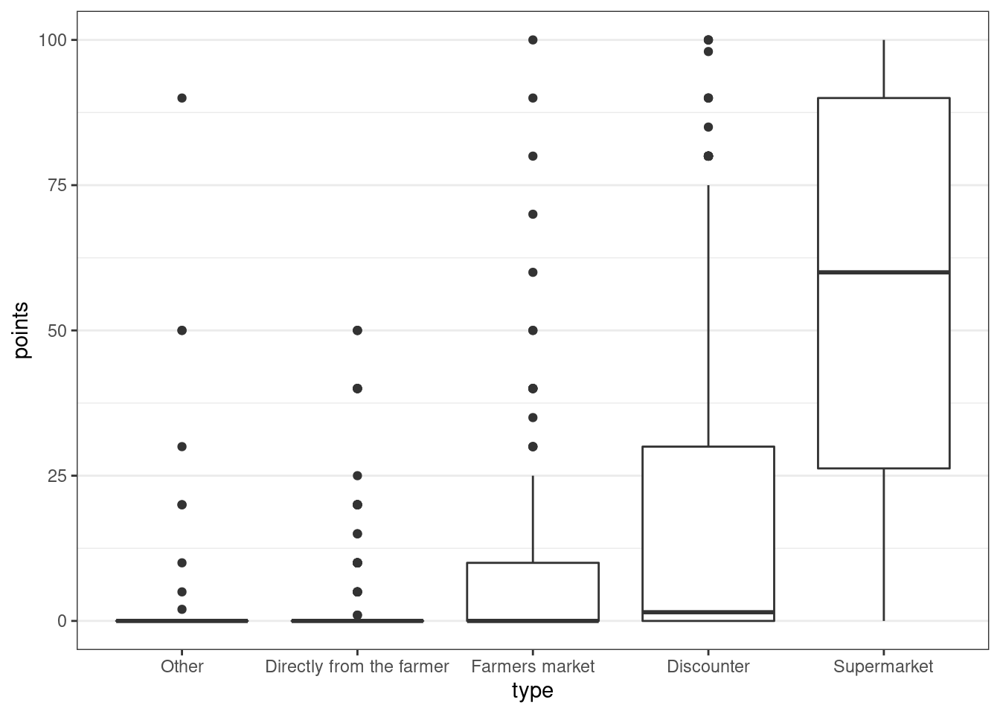

---
output:
  html_document: 
    toc: yes
    df_print: paged
  html_notebook: default
  pdf_document:
    toc: yes
---
<link rel="stylesheet" type="text/css" media="all" href="style.css" />


# (PART) Group project {-}

# Survey design & analysis

## Your tasks

In this section you will find all information related to the group project. Generally, the group project comprises two parts:

1. **Questionnaire design & data collection**: In the first part, you will work with your group on creating a questionnaire. Once you have created a draft of your questionnaire, you will present the draft to us and we will provide feedback. After implementing the feedback, you will submit the final version of the questionnaire and start the data collection using an online survey. 
2. **Data analysis & presentation**: In the second part, you will apply the statistical knowledge acquired during the course to analyze your data and present your findings using a video recording and submit your report (R code and video presentation).

<div class="figure" style="text-align: center">

<p class="caption">(\#fig:unnamed-chunk-2)Structure of the group project</p>
</div>


::: {.infobox_red .caution data-latex="{caution}"}
Note that this assignment may require you to deal with and integrate
knowledge that has not yet been covered in class! Students are
expected to read ahead and collect additional information to the
extent to which their project requires this.
:::

### Topics for the group project

The first step is to select a topic from the list below. We will send out a survey, asking you to rank the top 3 topics so that we can assign the topics according to your preferences. Please note that only one person per group needs to fill out the survey after you discussed which topic to chose within your groups. If two or more groups have the same preference for a topic, we will select one group randomly. 

<style>
    th, td { 
      font-size: 12px;
      border-collapse: collapse;
      border-width:3px
    }
</style>
    
No.    | Topic   | Description 
--- | ------------  | ---------------------------------------------------
1 | The most liveable city  | **Topic:**<br />Vienna is frequently listed as one of the most liveable cities in the world (e.g., by the Economist Intelligence Unit). Develop a questionnaire to investigate the reasons why Vienna ranks so high in different rankings. What are the factors that contribute to its image? Are there differences between different groups of people? What dimensions should be considered when measuring the liveability of a city?<br /><br />**Literature:**<br />Merrilees, B., D. Miller, & C. Herington (2009). Antecedents of residents' city brand attitudes. Journal of Business Research, 62 (3), 362-367.<br />Economist Intelligence Unit (2021). The Global Liveability Index 2021.<br />Kennedy, R. & L. Buys. Dimensions of Liveability: A Tool for Sustainable Cities<br />Paul. A. & J.  Sen (2017). Identifying Factors for Evaluating Livability Potential within a Metropolis: A Case of Kolkata. International Journal of Urban and Civil Engineering, 11(1), 50-55.
2  | Drivers of green consumption  | **Topic:**<br />The climate debate is currently on the agenda of many news media outlets. Explore in how far consumers are willing to change their consumption behavior to help protect the environment when it comes to grocery shopping. What factors influence the willingness to change (e.g., social factors, convenience, quality)? What are barriers that hinder consumers from shopping more sustainable products. Select one specific product and explore the impact of front of package labels indicating the carbon footprint of a product on consumer choice and willingness-to-pay. Can you identify different segments of consumers?<br /><br />**Literature:**<br />Carrero, I., C. Valor, E. Díaz, & V. Labajo (2021). Designed to Be Noticed: A Reconceptualization of Carbon Food Labels as Warning Labels. Sustainability, 13, 1581.<br />Rondonia, A. & S. Grassob (2021). Consumers behaviour towards carbon footprint labels on food: A review of the literature and discussion of industry implications. Journal of Cleaner Production, 301 (June), 127031.<br />White, K., Habib, R., & Hardisty, D.J. (2019).How to SHIFT Consumer Behaviors to be More Sustainable: A Literature Review and Guiding Framework. Journal of Marketing, 83(3), 22-49.  
3 | Consumers’ willingness to pay for organic products | **Topic:**<br />Develop a questionnaire to measure consumers’ willingness to pay for organic products when it comes to groceries. Select one specific product and explore how much consumers are willing to pay for organic vs. conventional products? What is the observed price premium and what are its drivers? What dimensions can you identify when it comes to organic food preferences? For example, does it reflect a desire to achieve better health, eat better quality food, comply with social norms, or to contribute to environmental protection? What marketing messages are effective in stimulating demand for organic products?<br /><br />**Literature:**<br />Testa et al. (2021). Drivers to green consumption: a systematic review Environment, Development and Sustainability, 23, 4826–4880.<br />Bailey, A., A. Mishra, M. Tiamiyu (2016). GREEN consumption values and Indian consumers' response to marketing communications. The Journal of Consumer Marketing. 33 (7), 562-573.<br />Aigner et al. (2019). The Effectiveness of Promotional Cues for Organic Products in the German Retail Market. Sustainability, 11, 6986.<br />Krystallis, A., C. Fotopoulos, & Y. Zotos (2006). Organic Consumers' Profile and Their Willingness to Pay (WTP) for Selected Organic Food Products in Greece. Journal of International Consumer Marketing, 19(1), 81-106.
4 | Privacy in social media – consumers’ willingness to pay for a secure social network | **Topic:**<br />Over the last years, media reports about data leaks and questionable business practices through the exploitation of user data by social networks (e.g., Facebook) have increased. Develop a questionnaire to measure consumers’ willingness to pay for a social network that does not track online behavior and exploits this data for different purposes. WHat is the price premium users are willing to pay for privacy? What are the main consumers concerns when it comes to privacy on social media? What factors make users give up their privacy? Can you identify distinct consumer segments? for how much money would users be willing to give up their privacy?<br /><br />**Literature:**<br />Kokolakis, S. (2017). Privacy attitudes and privacy behaviour: A review of current research on the privacy paradox phenomenon. Computers & Security, 64, 122-134.<br />Schreiner, M. and T. Hess (2015). Why Are Consumers Willing to Pay for Privacy? An Application of the Privacy-freemium Model to Media Companies, in Proceedings of the 23rd European Conference on Information. Muenster, Germany.<br />Orito1, Y., Y. Fukuta, & K. Murata (2014). I Will Continue to Use This Nonetheless: Social Media Survive Users' Privacy Concerns. International Journal of Virtual Worlds and Human Computer Interaction, 2, 92-107.
5 | Consumers‘ attitude and willingness to pay for store brands | **Topic:**<br />Develop a questionnaire to measure consumers’ attitude towards and willingness to pay for store brands (e.g., “Clever”, “Billa”). Select specific product categories and explore if consumers are willing to pay more for the manufacturer’s brand than for the store brand? What factors affect consumers’ choice? Along which dimensions are private label brands perceived differently compared to store brands (e.g., quality, price)? Are there differences in consumer choice across different consumption settings (e.g., private consumption vs. social consumption with friends)?<br /><br />**Literature:**<br />Burton, S. et al. (1998). A Scale for Measuring Attitude Toward Private Label Products and an Examination of Its Psychological and Behavioral Correlates.Journal of the Academy of Marketing Science. 26(4), 293-306.<br />Mostafa, R. & R. Elseidi (2018). Factors affecting consumers’ willingness to buy private label brands (PLBs): Applied study on hypermarkets. Spanish Journal of Marketing - ESIC, 22(3).<br />Steenkamp, J.B., Van Heerde, H.J., & Geyskens, I. (2010). What Makes Consumers Willing to Pay a Price Premium for National Brands over Private Labels?, Journal of Marketing Research, 47(6), 1011-1024.
6 | Front-of-package nutrition labels | **Topic:**<br />Frequent consumption of unhealthy foods can lead to overweight or obesity, hypertension, and cardiovascular disease. The consequences of poor diets is putting a burden on health care systems and front-of-package labels have been proposed as a means to help consumers to gain a better understanding of the ingredients of a product. Develop a questionnaire to test how front-of-package nutrition labels affect consumer choice. Which type of label is most effective? <br /><br />**Literature:**<br />Ikonen, I. et al. (2020). Consumer effects of front-of-package nutrition labeling: an interdisciplinary meta-analysis. Journal of the Academy of Marketing Science, 48, 360–383.<br />Hamlin, R. & L. McNeill (2018). The Impact of the Australasian ‘Health Star Rating’, Front-of-Pack Nutritional Label, on Consumer Choice: A Longitudinal Study, Nutrients, 10, 906.
7 | Going and being vegan: consumers willingness to make the change | **Topic:**<br />More and more people are turning to a vegan diet for many reasons, including health, concerns about animal welfare or a desire to protect environment. Develop a questionnaire to measure consumers’ willingness to become a vegan and its drivers (e.g., health, environment, compassion for animals). Find out what dimensions underlie the decision making process. What type of messaging might change consumers attitude towards veganism? How large is the vegan segment, what characteristics does it have, and what are the implications for marketing?<br /><br />**Literature:**<br />Proveg (2021). European consumer survey on plant-based foods.<br />Miguel, I., A. Coelho, & C. Bairrada (2020). Modelling Attitude towards Consumption of Vegan Products, Sustainability, 13, 9.<br />Raggiotto, F., M. Mason, & A. Moretti (2017). Religiosity, materialism, consumer environmental predisposition. Some insights on vegan purchasing intentions in Italy. International Journal of Consumer Studies, 42, 613-626.
8 |  Consumers’ preference and attitude towards online grocery shopping | **Topic:**<br />More and more people use online grocery shopping services and new companies in this space provide fast and convenient delivery options (e.g., Jokr, Gurkerl.at). In addition, the Coronavirus outbreak has lead to an increase in online shopping adoption. Develop a questionnaire to measure consumers’ attitude and its drivers towards the online grocery shopping. How does online shopping compare to the conventional shopping experience across important dimensions (e.g., price, service, experience)? Are online channels a substitute or a complementary service to shopping in physical stores. What role does the speed of delivery play? In which situations is the online channels preferred and how large is the segment of online shoppers? Are there differences before, during and after the pandemic? What factors can explain the intention of consumers to continue using online shopping services in the future?<br /><br />**Literature:**<br />Frank, D. & A. Peschel. (2020). Sweetening the Deal: The Ingredients that Drive Consumer Adoption of Online Grocery Shopping. Journal of Food Products Marketing, 26(8), 535-544.<br />Amorim, P. & N. DeHoratius (2021). Online Shoppers Don’t Always Care About Faster Delivery, MITSloan Management Review, Fall issue.
9 | Car-sharing vs. vehicle ownership | **Topic:**<br />Develop a questionnaire to explore the attractiveness of car sharing options for consumers (e.g., Share Now). Are consumers willing and planning to substitute a personal vehicle through car sharing option? Is car sharing likely to affect the amount of driving? Which factors influence these decisions? What are the benefits and deterrents of car sharing services?<br /><br />**Literature:**<br />Möhlmann, M. (2015). Collaborative consumption: determinants of satisfaction and the likelihood of using a sharing economy option again, Journal of Consumer Behaviour, 14, 193-207.<br />Martínez-González, J., E. Parra-López, & A. Barrientos-Báez (2021). Young Consumers’ Intention to Participate in the Sharing Economy: An Integrated Model, Sustainability, 13, 430.<br />Prieto, M. et al. (2019). Shifting consumers into gear: car sharing services in urban areas.International Journal of Retail & Distribution Management, 47(5), 552-570.
10 | Consumers’ attitude towards legal video streaming providers and piracy | **Topic:**<br />Video streaming providers like Netflix record a continuous increase in registered users. On the other hand, illegal video streaming portals (e.g., Popcorn Time) are heavily used by other consumers. Develop a questionnaire to measure consumers’ attitude towards and drivers (e.g. occupation, gender, usage behavior etc.) of legal video streaming service usage. What could be reasons for piracy and how can pirates be converted to paying customers? What is the willingness-to-pay for legal video streaming services in the current form and what is the price that users would pay if the service features (e.g., content selection) would be improved? How large is the piracy segment?<br /><br />**Literature:**<br />Papies, D. & M. Clement (2008). Adoption of New Movie Distribution Services on the Internet, Journal of Media Economics, 21(3), 131-157.<br />Hennig-Thurau, T., Henning, V., Sattler, H. (2007). Consumer File Sharing of Motion Pictures. Journal of Marketing, 71(4), 63-83.<br />Phau, I., Teah, M., & Liang, J. (2016). Investigating the Factors Influencing Digital Movie Piracy. Journal of Promotion Management, 22(5), 637-664.
11 | Local vs. global brands | **Topic:**<br />Some researchers argue that the increasing globalization leads to the homogenization of consumer needs and desires across the globe and some companies address this trend with standardized global products. However, some consumers appear to prefer local brands over global brands. Develop a questionnaire that investigates the drivers of consumers’ attitudes toward global and local brands. How do consumers rate global vs. local brands on relevant dimensions with regard to product choice (price, quality, sustainability, etc.)? Select a product category and conduct an experiment to find out what marketing messages for local brands might lead to a more favorable outcome in terms of consumer choice when competing with global brands (use a fictitious brand to avoid confounding effects of existing brand preferences). Can you identify different segments of consumers?<br /><br />**Literature:**<br />Riefler, P. (2019). Local versus global food consumption: the role of brand authenticity. Journal of Consumer Marketing, 37(3), 317–327.<br />Alden, D., J.B. Steenkamp, & R. Batra (2006). Consumer attitudes toward marketplace globalization: Structure, antecedents and consequences. 23, 227-239.<br />Özsomer, A. (2012). The Interplay Between Global and Local Brands: A Closer Look at Perceived Brand Globalness and Local Iconness. Journal of International Marketing, 20(2), 72-95.<br />Zhou, L., Z. Yang, & M. Hui (2010). Non-local or local brands? A multi-level investigation into confidence in brand origin identification and its strategic implications. Journal of the Academy of Marketing Science, 38, 202–218.<br />Steenkamp, J.B. & M. de Jong (2010). A Global Investigation into the Constellation of Consumer Attitudes Toward Global and Local Products. Journal of Marketing, 74(6), 18-40.
12 | The impact of social distancing on student's learning experience and outcomes | **Topic:**<br />The recent COVID-19 pandemic affected virtually all aspects of people's lives. For university students, many courses that were previously delivered on campus switched to distance learning mode. Develop a questionnaire to assess how distance learning affects student's learning experiences. What are advantages and disadvantages of online teaching? How do students rate distance learning compared to in-person teaching on important dimensions with regard to the learning experience? What teaching aids are most helpful to students? What tools should teachers use to overcome the disadvantages? What mode of teaching would students prefer for the time after the pandemic?<br /><br />**Literature:**<br />Armstrong-Mensah, E. et al. (2020). COVID-19 and Distance Learning: Effects on Georgia State University School of Public Health Students, Frontiers in Public Health, 8, 576227.<br />Gonzalez, T. et al. (2020). Influence of COVID-19 confinement on students’ performance in higher education, PLoS ONE, 15(10), e0239490.<br />Aucejo, E. et al. (2020). The impact of COVID-19 on student experiences and expectations: Evidence from a survey, Journal of Public Economics, 191, 1-15.
13 | Consumer preferences for fair-trade products in the apparel industry | **Topic:**<br />Develop a questionnaire to measure consumers’ preferences for sustainable brands and eco-fashion. How do consumers rate eco vs. standard brands on relevant dimensions with regard to product choice (price, quality, sustainability, style, etc.)? Select a specific product and conduct an experiment to find out what the price premium consumers are willing to pay for fair-trade products (use a fictitious brand to avoid confounding effects of existing brand preferences). What factors can you identify that predict the price premium? Can you identify different segments of consumers?<br /><br />**Literature:**<br />Balasubramanian, P. & S. Soman (2019). Awareness regarding fair trade concept and the factors influencing the fair trade apparel buying behaviour of consumers in Cochin City. Journal of Strategic Marketing, 27(7), 612-629.<br />Irwin, J. & R. Walker Naylor (2009). Ethical Decisions and Response Mode Compatibility:Weighting of Ethical Attributes in Consideration Sets Formed by Excluding Versus Including Product Alternatives, Journal of Marketing Research, 46(2), 234–246.<br />Ma, Y., Littrell, M., & Niehm, L. (2011). Young female consumers’ intentions toward fair trade consumption. International Journal of Retail & Distribution Management. 40(1), 41-63.<br />Nilssen, R., G. Bick, & R. Abratt (2018). Comparing the relative importance of sustainability as a consumer purchase criterion of food and clothing in the retail sector. Journal of Brand Management, 26, 71-83.<br />Harris, F., H. Roby, & S. Dibb (2016). Sustainable clothing: challenges, barriers and interventions for encouraging more sustainable consumer behaviour. International Journal of Consumer Studies, 40, 309–318.
14 | Freemium business models in the music industry | **Topic:**<br />Many music streaming services (e.g., Spotify, YouTube) offer a baseline version free of charge to consumers but charge for a premium version with additional features. Develop a questionnaire to measure consumers’ willingness to pay for legal music streaming services. What factors (e.g., product range, sharing features, price, occupation, gender, usage behavior) drive the conversion  from the free tier of the service to the paid tier, and how could companies motivate consumers to convert to the premium version of the service? What is the market potential for paid music subscription services?<br /><br />**Literature:**<br />Wagner, T. & T. Hess (2013). What Drives Users to Pay for Freemium Services? Examining People’s Willingness to Pay for Music Services. Proceedings of the Nineteenth Americas Conference on Information Systems, Chicago, Illinois, August 15-17.<br />Mäntymäki M, Islam AN, Benbasat I. What drives subscribing to premium in freemium services? A consumer value-based view of differences between upgrading to and staying with premium. Informations Systems Journal,30, 295–333.<br />Hamari, J., N. Hanner, & J. Koivisto (2020). "Why pay premium in freemium services?" A study on perceived value, continued use and purchase intentions in free-to-play games, International Journal of Information Management, 51, 102040.<br />Papies, D., F. Eggers, & N. Wlömert (2011). Music for free? How free ad-funded downloads affect consumer choice. Journal of the Academy of Marketing Science volume 39, 777–794. 
15 | Perceived influence of Social Media Influencers | **Topic:**<br />Confronted with declining effectiveness of traditional marketing channels, companies invest increasing amounts in Influencer Marketing, especially to reach a younger demographic. Develop a questionnaire to assess in which product categories influencer marketing is particularly prevalent. Can you identify changes in media consumption behavior that can explain why social media is so important to reach younger demographics (e.g., differences in media consumption patters across demographics). Conduct an experiment to find out the drivers of the perceived influence of social media Influencers. Particularly, you should investigate if the number of accounts that an Influencer follows affects the perceived influence of this influencer. What could be moderators of this effect?<br /><br />**Literature:**<br />Valsesia, F., D. Proserpio, & J. Nunes (2020). The Positive Effect of Not Following Others on Social Media. Journal of Marketing, 57(6), 1152-1168.<br />Haenlein, M., Anadol, E., Farnsworth, T., Hugo, H., Hunichen, J., & Welte, D. (2020): Navigating the New Era of Influencer Marketing: How to be Successful on Instagram, TikTok, & Co. In: California Management Review 63 (1), 5–25.

### Guidelines

In this section, you can find some guidelines regarding the design of your questionnaire and the final presentation.

**Individual responsibility:**

* Group members should plan to share responsibilities equally
* All members of the group must contribute to the project
* Each student will receive an individual grade for presentation 
* To ensure an equal contribution of group members, a peer assessment will be conducted, which enters into the computation of the individual grades for the group project 

**Submission**

There are two grading components: 

* Questionnaire design & data collection: When you submit your questionnaire draft, please submit 1) the pdf printout from Qualtrics, 2) a short slide deck explaining your research problem and how you intend to solve it (research design, measurement & scaling, intended analyses). We will go through the presentation during the first coaching session. After this, you'll have time to revise the questionnaire based on the feedback that you received.
* Data analysis & presentation: When you submit your final presentation, please submit a .zip folder containing 1) the video recording, 2) the data, 3) the R code file, and 4) your slides.

#### Questionnaire design & data collection

In the presentation of your questionnaire design, you should address the following points:

**Problem statement & research hypotheses**

* What is the research problem & why is it relevant from a managerial perspective?
* What research questions do you intend to answer with your research?
* What are your hypotheses?

**Questionnaire structure & research design**

* Please provide a justification for the structure of your questionnaire
* Use appropriate wording in the questionnaire to obtain the desired information
* Provide explanations regarding your choice of research design to answer the research questions

**Reasons for variable selection & measurement and scaling**

* Please provide a justification of why you chose your variables and the associated choices regarding the measurement & scaling of these variables
* What are the expected relationships between the independent variable(s) and your dependent variable(s)?

**Plan your statistical analyses**

* Although we won't have covered all methods when you submit your questionnaire design, you should plan ahead and present some ideas on how you plan to analyze your data
* It is important to consider this before collecting your data, since the type of data you will obtain affects the type of methods you can use

#### Data analysis & presentation

For your data analysis & final presentation, you should consider the following points:

**Problem statement**

* Be clear about the problem that you are trying to solve or the research question(s) you would like to answer
* Why is the problem relevant from a managerial perspective?

**Presentation structure**

* Think about the overall structure of your presentation before you start designing the individual slides.
* Given your research problem/question, what slides/content do you need to have in the presentation to answer your research question or solve your problem?
* Please don’t include an accumulation of visualizations that lead nowhere. Instead, ask yourself, is this chart contributing to the answer of your research question?
* It is usually a good idea to start with an introduction to the topic and the research question(s). Next, you may describe and justify your research design (e.g., causal inference vs. predictive vs. descriptive) that you chose to address the research questions(s). After that, you should provide some descriptive statistics about your sample. In a next step, you should present your results regarding the central research questions. Remember to include all the necessary information that are required to understand the results (e.g., number of observations, wording of questions, etc.). It is usually a good idea to include appropriate visualizations of the variables that you are investigating. You do not need to include all assumption tests for the methods in the main body of the presentation. However, you should still test if the assumptions are met and include the results in the appendix in case there are questions. Finally, you should discuss/interpret your results with regard to the managerial research question(s) and list potential limitations of your research.

**Choice of appropriate statistical tests**

* Please provide a justification for the choice of statistical test (e.g., t-test, regression, ANOVA, parametric vs. non-parametric) given your choices regarding the types of variables.
* Remember to use the correct terminology and e.g., state the dependent and independent variables.
* If you use a regression model, also include a formal statement of the regression equation so it is clear what is being analyzed, e.g., $log(DV)=\beta_0+\beta_1*log(IDV1)+\beta_2*log(IDV2)+\epsilon$. From the regression equation, it should be clear what type of model it is (linear regression vs. logistic regression), what the dependent variable is, what the independent variables are, and whether the values are transformed (e.g., logarithms) or not.
* If your analyses include multiple steps, make sure that it is clear to the audience why the individual steps were conducted and how they relate to each other (e.g., if you do a PCA first to reduce the dimensionality of the data and then include the resulting factor scores in a regression model, make sure that the purpose of each step is clear).

**Implementation of analysis**

* Make sure that you store the R code you used for your analysis and submit it along with your data & the slides to the assignment on Learn. This way, it is transparent how you arrived at your results.
* We should be able to replicate your results by running the code.

**Visualizations**

* Select appropriate plots to visualize your variables (e.g., scatter plot, boxplot, mean plot, histogram)
* Not every visualization that you could potentially come up with really makes sense to put into a presentation. Again, ask yourself, is this chart contributing to the answer of your research question(s)?
* Do not forget legends and labels of the axes in your visualization!
* Remember to include all information that are required to understand the visualization (e.g., the wording of the question, the number of observations, axis labels)
* Keep it simple and make sure that a visualization can be easily understood. Adding too much information into a visualization is very often misleading for your audience and hurts more than you might think.
* In case a visualization is not easily comprehensible, you might think about adding a note that explains the audience how-to-read the visualization using an example.

**Reporting and interpretation of model results**

* Report your analysis in an appropriate way (e.g., use the ‘stargazer’ package to report the results of regression models or use the ‘ggstatsplot’ package to provide test summaries).
* Interpret all relevant test statistics (e.g., test statistics, confidence intervals, coefficients and their significance and relative importance, R-squared, effect sizes, etc.).
* Discuss the recommendations derived from analysis. Do not skip this part! Always assume that you have an audience of decision makers. You need to tell them what to do based on your analysis.


### Timeline

This section summarizes important dates for the first part of your group project:

<table class=" lightable-paper lightable-hover" style='font-family: "Arial Narrow", arial, helvetica, sans-serif; width: auto !important; margin-left: auto; margin-right: auto;border-bottom: 0;'>
 <thead>
  <tr>
   <th style="text-align:left;"> Date_A </th>
   <th style="text-align:left;"> Time_A </th>
   <th style="text-align:left;"> Date_B </th>
   <th style="text-align:left;"> Time_B </th>
   <th style="text-align:left;"> Task </th>
   <th style="text-align:left;"> Chapters </th>
   <th style="text-align:left;"> Link </th>
  </tr>
 </thead>
<tbody>
  <tr>
   <td style="text-align:left;"> Oct. 21 </td>
   <td style="text-align:left;"> 11:59PM </td>
   <td style="text-align:left;"> Oct. 25 </td>
   <td style="text-align:left;"> 11:59PM </td>
   <td style="text-align:left;"> * Submit questionnaire draft </td>
   <td style="text-align:left;"> 10 </td>
   <td style="text-align:left;">  </td>
  </tr>
  <tr>
   <td style="text-align:left;"> Oct. 23* </td>
   <td style="text-align:left;"> 09:00AM - 02:30PM </td>
   <td style="text-align:left;"> Oct. 27* </td>
   <td style="text-align:left;"> 02:00PM - 08:00PM </td>
   <td style="text-align:left;"> * Coaching: Questionnaire design (live video coaching) </td>
   <td style="text-align:left;"> 10 </td>
   <td style="text-align:left;"> TBC </td>
  </tr>
  <tr>
   <td style="text-align:left;"> Nov. 1 </td>
   <td style="text-align:left;"> 11:59PM </td>
   <td style="text-align:left;"> Nov. 4 </td>
   <td style="text-align:left;"> 11:59PM </td>
   <td style="text-align:left;"> * Submit revised questionnaire </td>
   <td style="text-align:left;"> 10 </td>
   <td style="text-align:left;">  </td>
  </tr>
</tbody>
<tfoot><tr><td style="padding: 0; " colspan="100%">
<span style="font-style: italic;">Note: </span> <sup></sup> Dates and times are indicated for groups A and B respectively.<br>           Sessions indicated with '*' are group coaching sessions. Slots of 45 min. are assigned to each group within the indicated times.</td></tr></tfoot>
</table>

<br>
In the second part of your project, after you have collected your data, the following dates are important:
<br>

<table class=" lightable-paper lightable-hover" style='font-family: "Arial Narrow", arial, helvetica, sans-serif; width: auto !important; margin-left: auto; margin-right: auto;border-bottom: 0;'>
 <thead>
  <tr>
   <th style="text-align:left;"> Date_A </th>
   <th style="text-align:left;"> Time_A </th>
   <th style="text-align:left;"> Date_B </th>
   <th style="text-align:left;"> Time_B </th>
   <th style="text-align:left;"> Task </th>
   <th style="text-align:left;"> Chapters </th>
   <th style="text-align:left;"> Link </th>
  </tr>
 </thead>
<tbody>
  <tr>
   <td style="text-align:left;"> Nov. 16* </td>
   <td style="text-align:left;"> 01:30PM - 04:30PM </td>
   <td style="text-align:left;"> Nov. 18* </td>
   <td style="text-align:left;"> 02:00PM - 05:00PM </td>
   <td style="text-align:left;"> * Coaching: Data handling (live video coaching) </td>
   <td style="text-align:left;">  </td>
   <td style="text-align:left;"> TBC </td>
  </tr>
  <tr>
   <td style="text-align:left;"> Nov. 23* </td>
   <td style="text-align:left;"> 01:30PM - 06:30PM </td>
   <td style="text-align:left;"> Nov. 25* </td>
   <td style="text-align:left;"> 03:00PM - 08:00PM </td>
   <td style="text-align:left;"> * Coaching: Data analysis (live video coaching) </td>
   <td style="text-align:left;">  </td>
   <td style="text-align:left;"> TBC </td>
  </tr>
  <tr>
   <td style="text-align:left;"> Dec. 7 </td>
   <td style="text-align:left;"> 11:59PM </td>
   <td style="text-align:left;"> Dec. 9 </td>
   <td style="text-align:left;"> 11:59PM </td>
   <td style="text-align:left;"> * Submit video recording of presentation (pre-recorded) </td>
   <td style="text-align:left;">  </td>
   <td style="text-align:left;">  </td>
  </tr>
</tbody>
<tfoot><tr><td style="padding: 0; " colspan="100%">
<span style="font-style: italic;">Note: </span> <sup></sup> Dates and times are indicated for groups A and B respectively.<br>           Sessions indicated with '*' are group coaching sessions. Slots of 45 min. are assigned to each group within the indicated times.</td></tr></tfoot>
</table>


## Part 1: Before collecting data

This section provides some information regarding the first part of the group project: questionnaire design & data collection. 

An aim of this course is to develop your ability to translate business problems into actionable research questions and to design an adequate research plan to answer these questions. Therefore, you need to be equipped with knowledge on how to create a survey and properly conduct a research. 

Generally, what you can expect from the survey design is similar to what one experiences in a relationship. If you try to take more than you commit, it doesn’t work out. Now on a serious note, if you follow guidelines mentioned here, you will certainly avoid usual traps your fellow colleagues were caught in.

In a research process, conducting a survey is a part of (primary) data collection. Before we collect data, we have to make sure that preceding steps are correctly done. However, in the following sections we will focus on the process of designing a questionnaire. Eventually, you will be able to collect relevant data and apply appropriate statistical tests.    


### Research design

<div style="text-align: justify">

As you aim to conduct a real marketing research, before you start writing down questions for a questionnaire, you need to come up with a research design. In particular, you should review the research questions, hypotheses and characteristics that influence the research design.  

If you are interested in the causal effect of one particular (independent) variable on another (dependent) variable, think about an experimental design that might allow you to manipulate this variable. In this case, you particularly have to decide on the following:  

* Which variable to manipulate?  
* Whether to use a between-subjects or within-subjects design?  
* The cause-effect sequence (the cause must occur before the effect)  
* The number of experimental conditions  
* Potential interactions and relationships with other variables (does the effect depend on another variable?)

What you need to be careful about is the effect of **reversed causation**. The effect refers to the situation where the causal relationship could possible have an opposite direction from what we assumed at the first place. For instance, it is often assumed that an increase in individual income leads to increase in well-being (happiness). However, some [researches](https://www.ncbi.nlm.nih.gov/pubmed/16949692) suggest that this causation could have an opposite direction, i.e. that actually increase in well-being of an individual leads to an increase in income.  

Here are some examples of causal research design applications:  

* To assess how a product's country-of-origin impacts attractiveness across different countries.  
* To analyse the effects of rebranding on customer loyalty.  


If you would like to analyze the effects of multiple categorical or continuous (independent) variables on one continuous (dependent) variable, you might use a regression model. When doing this, you particularly have to decide on:  

* How to measure **the dependent variable (DV)**. This is particularly important, since you need a variable that is powerful in uncovering variation between subjects (e.g., open-ended questions, such as "How much are you willing to pay for this product" are good candidates). Moreover, you also need to consider the nature of your DV,i.e. whether it is an interval variable, ordinal or categorical variable. The nature of your DV will heavily influence your choice of a correct statistical test.

* How to measure **the independent variables (IV)** (single-item vs. multi-item scales, categorical vs. continuous). Bear in mind that the nature of the IV, together with DV, affects your choice of a statistical test as well.  

* What other variables might cause the effect that you would like to investigate (to prevent omitted variable bias, i.e. variables that are not part of your model but still influence the dependent variable).

* Potential interactions (e.g., is the effect of variable X stronger for group A vs. B?)

</div>


### Survey method  

In the next step you should review the type of survey method you will use.

At this point you need to think in which setting you aim to conduct your survey. For instance, should you do it in a face-to-face setting or rather online. Here you can find some advantages and disadvantages of online surveys:

<table class=" lightable-paper lightable-hover" style='font-family: "Arial Narrow", arial, helvetica, sans-serif; width: auto !important; margin-left: auto; margin-right: auto;'>
 <thead>
  <tr>
   <th style="text-align:left;"> Advantages </th>
   <th style="text-align:left;"> Disadvantages </th>
  </tr>
 </thead>
<tbody>
  <tr>
   <td style="text-align:left;"> Speed </td>
   <td style="text-align:left;"> Sampling issues </td>
  </tr>
  <tr>
   <td style="text-align:left;"> Cost </td>
   <td style="text-align:left;"> Access issues </td>
  </tr>
  <tr>
   <td style="text-align:left;"> Quality of response </td>
   <td style="text-align:left;"> Technical problems </td>
  </tr>
  <tr>
   <td style="text-align:left;"> No interviewer bias </td>
   <td style="text-align:left;">  </td>
  </tr>
  <tr>
   <td style="text-align:left;"> Access to unique populations </td>
   <td style="text-align:left;">  </td>
  </tr>
</tbody>
</table>


Here is the list of the online tools you can use to conduct an online survey (usually for free):  

- [Qualtrics](http://www.qualtrics.com/free-account/)
- [Google form](https://www.google.com/forms/about/)
- [Survey monkey](https://www.surveymonkey.com/)
- [Free online surverys](http://freeonlinesurveys.com/)
- [Kwik surveys](http://kwiksurveys.com/)

For the purpose of this course, we suggest to use **Qualtrics**.

A questionnaire creation in Qualtrics starts with creation of a Qulatrics project. Each project consists of a survey, distribution record, and collection of responses and reports. There are three ways to create a questionnaire. First, you can create a new survey project from scratch. Second, you can create a new questionnaire from a copy of an existing questionnaire. Eventually, you can create from a template in your Survey Library, or from an exported QSF file.

::: {.infobox .download data-latex="{download}"}
[Here you can find a template of a questionnaire in Qualtrics with guidelines and suggestions related to each question type.](./ExampleQuestionnaireQualtrics.qsf)
:::


In order to create a completely new questionnaire, you need to do the following:  

Go to the Projects page by clicking the Qualtric XM logo or clicking Projects on the top-right.  


Create new project by clicking the blue button on the right side.  
In the "Create your own" section click on the survey button.


Enter a name for your survey and get started with a survey creation.


If you would like to create a new questionnaire on a basis of an already existing one, then you choose "From a Copy". Subsequently, you need to indicate the questionnaire you would like to copy. Now you are good to go! 


If there is a questionnaire in the Qualtrics Library you would like to use, then you need to choose "From Library", and indicate one library name in the dropdown menu. 


### Questionnaire

After you set up everything, you should develop 20 - 25 questions. However, there are some important objectives to keep in mind while developing a questionnaire:

* Information you are primarily interested in (dependent variable)
* Information which might explain the dependent variable (independent variables)
* Other factors related to both dependent and independent factors
* Who’s answering the questions?

If you have sorted out all answers on the previous questions, you are ready to start writing the content. Again, here are some important things to remember:

* The purpose of the questionnaire
* Why it is important for you and why it could be useful for the respondent
* How long it should take to complete & the final date for a reply
* Ask questions in a logical order & use the right type of questions
* Aim for brevity & use simple language

#### Questionnaire and research design

The questionnaire design should be aligned with the research design! Therefore, in the following sections we will explain some suggested steps on how to approach questionnaire creation.

Let's start with what is a questionnaire. A structured questionnaire is a research instrument designed to elicit specific information from a sample of a target population. Usually it is used in a standardized way with fixed-alternative questions (same questions and response options for all respondents).

An objective of a questionnaire is threefold:

* to translate the information need into a set of specific questions that the respondent can and will answer,
* to motivate, and encourage respondents to become involved, to cooperate, and to complete the questionnaire,
* to minimize response error.

#### Content in a questionnaire

In this step you are starting to work on the content of you questions.

At the beginning of the questionnaire you should give a brief introduction to your respondents in the context of your research and the content of the questionnaire. Try to use simple language and avoid technical terms. Additionally, in the introduction you should state how long the survey will approximately take. 

When you start thinking about the questions to ask, there are several points to consider:  

* Is the question necessary?
* Will I obtain the needed information?  
* Are several questions needed instead of one?  
* What type of data can I collect by asking that question (categorical or continuious)?  

In your survey try to avoid asking **double-barrelled questions.**Those are 
a single question that attempts to cover two issues. Such questions can be confusing to respondents and result in ambiguous responses. Instead, you might ask multiple questions in order to obtain the inteded information.  


<div class="incorrect">

<p>Incorrect </p>
</div>

Do you think Nike Town offers better variety and prices than other Nike stores?    

<div class="incorrect">

</div>


<div class="correct">

<p>Correct </p>
</div>

Do you think Nike Town offers better variety than other Nike stores?  
Do you think Nike Town offers better prices than other Nike stores?

<div class="correct">

</div>
           
#### Inability and unwillingness to answer  

The quality of collected data you highly depends on your ability to address correct participants. Therefore, you need to make sure that your respondents are able to meaningfully answer your questions.   

Examples:  

* Not every household member might be informed about monthly expenses for groceries purchases if someone else makes these purchases.   
* Use filter questions that measure familiarity and product use.  
* Include a “don’t know” option.  
* If you ask participants for monteray values (e.g. how much are you ready to pay for the XY product?) across several EU, make sure you indicate correct currency (e.g. HRK for Croatia or HUF for Hungary).  
* Think about how mobile friendly is the layout of your survey (if it is an online survey).
* Good case practices suggest that there should not be more than 2 questions per page (for online surveys displayed on mobile phones).


If you are asking participants to recall certain brands for instance, make sure you use **unaided recall question:**  

<div class="correct">

<p>Correct </p>
</div>

What brands of soft drinks do you remember being advertised on TV last night?  

<div class="correct">

</div>


<div class="incorrect">

<p>Incorrect </p>
</div>

Which of these brands were advertised last night on TV?  
a) Coca-Cola  
b) Pepsi  
c) Red Bull        
d) Evian     
e) Don’t know

<div class="incorrect">

</div>


If you are asking participants to list something, the good case practice is **to minimize the effort required by respondents:**  

<div class="correct">

<p>Correct </p>
</div>

Please check all the departments from which you purchased merchandise on your most recent shopping trip to a department store:    
a) Women’s dresses  
b) Men’s apparel  
c) Children’s apparel  
d) Cosmetics  
e) Jewelry    
f) Other (please specify) ___________

<div class="correct">

</div>

<div class="incorrect">

<p>Incorrect </p>
</div>

Please list all the departments from which you purchased merchandise on your most recent shopping trip to department store X.    

<div class="incorrect">

</div>


In a case you are asking for information that could be considered sensitive (e.g. money, family life, political beliefs, religion), they should come at the end of the questionnaire. Moreover, it is recommendable to provide response categories rather than asking for specific figures:  

<div class="correct">

<p>Correct </p>
</div>

Which one of the following categories best describes your household’s annual gross income?    
a) under 25.001 €    
b) 25.001€ to 50.000 €    
c) 50.001€ to 75.000 €    
d) 75.001€ to 100.000 €   
e) over 100.000 €   

<div class="correct">

</div>


<div class="incorrect">

<p>Incorrect </p>
</div>

What is your household’s exact annual income?

<div class="incorrect">

</div>

#### Decide on measurement scales and scaling techniques

Every statistical analysis requires that variables have a specific levels of measurement. Measurement scales you choose for your questions in a survey will affect the answers you get and eventually statistical test you can apply.
For instance, it would not make sense to compute an average of genders. An average of a categorical variable does not make much sense. Moreover, if you tried to compute the average of genders defined in numeric values (e.g. male=0, female=1), the output would be interpretable.

::: {.infobox_red .caution data-latex="{caution}"}
It is crucial to become familiar with possibilities of each scale **before** you choose to add another question to your survey. Consequently, chances to obtain data you did not intend to collect and chances that you will not be able to apply tests you intended are significantly lower.
:::

In the following table you can get a quick overview of possibilities per each measurement scale. :


In the figure below you can find general procedure for choosing a correct analysis based on the measurement scale of your data and number of variables. It shows statistical analyses we covered during the course and aims to help you choose among them based on the nature of dependent variables on the side, and the nature and the number of your independent variables on the other side: 


::: {.infobox_red .caution data-latex="{caution}"}

It is highly recommended to think about what type of data you want to collect and what test to use, before you form a question and add to the survey. We highly recommend you NOT to add questions without thinking what type of data you are going to collect with it. If you do so, you may end up with data you did not want to collect, and moreover, with data unsuitable for the test you intended to use.

Here you can find extremely nice overview of statistical test associated with different types of variables:[LINK](https://stats.idre.ucla.edu/other/mult-pkg/whatstat/)

:::


#### The most frequent types of questions

Here we want to show you the most frequent types of questions students use and what type of data can be collected by using them.


##### Number entry question

<div class="figure" style="text-align: center">

<p class="caption">(\#fig:unnamed-chunk-33)Text or number entry question</p>
</div>

A number entry question is a recommended type of question if you are interested in obtaining **ratio data type**. Ratio data type gives you flexibility to apply a broad range of statistical analyses such as regression analysis, correlation computation, t-test (or ANOVA), or factor analysis. Data collected by number entry question is handy to use with data collected by slider questions or with a constant sum question. Note that in this case we treat constant sum data as ratio data and therefore assume that 0 means complete absence.


##### Multiple choice question

Multiple Choice with a single answer is a type of closed-ended question that lets respondents select **one answer** from a defined list of choices.Type of data you obtain is **categorical.** 

<div class="figure" style="text-align: center">

<p class="caption">(\#fig:unnamed-chunk-34)Multiple choice question with single answer</p>
</div>

::: {.infobox_orange .hint data-latex="{hint}"}

Statistical test that you can think of when analysing categorical data:

* **Fisher's exact test**
    + Used when frequency in at least one cell is **less than 5 **. When frequencies in each cell are greater than 5, Chi-square test should be used
    + 1 dependent variable and  1 independent variable with 2 or more levels/factors
    + Hypothesis: Is there a significant difference in frequencies between values observed in cells and values expected in cells

* Chi-square test
    + **Goodness of fit: ** when you only have 1 dependent variable and none independent variables
        - Hypothesis: Is there a significant difference in frequencies between values observed in cells and values expected in cells ?
    + **Chi-Square Test of Independence:** when you have 1 dependent variable and  1 independent variable with 2 or more levels/factors.
        - Hypothesis: Is there an association between categorical variable X and categorical variable Y?
        
* **Binomial logistic regression**
    + Used when you have an independent variable of at least interval scale and dependent variable is a categorical variable that can take on exactly two values (1 or 0, i.e., yes or no).

* Categorical variables can be used as predictors in regression (as dummy variables).

:::


<div class="figure" style="text-align: center">

<p class="caption">(\#fig:unnamed-chunk-35)Multiple choice question with multiple answers</p>
</div>

It is important to distinguish multiple choice questions with single and multiple answers (which will be presented later) as their analysis looks differently.

For the analysis of results collected with multiple choice question with multiple possible answers, we can use **Cochran's Q test.** Although we did not mention it before, it is not too different from what you have already learned about other tests. 

::: {.infobox_orange .hint data-latex="{hint}"}
The Cochran’s Q test and associated multiple comparisons require the following assumptions:

  1. Responses are dichotomous and from k number of matched samples.
  2. The subjects are independent of one another and were selected at random from a larger population.
  3. The sample size is sufficiently “large”. (As a rule of thumb, the number of subjects for which the responses are not all 0’s or 1’s, n, should be ≥ 4 and nk should be ≥ 24)
:::

##### Rank order question

<div class="figure" style="text-align: center">

<p class="caption">(\#fig:unnamed-chunk-36)Rank order question</p>
</div>

A rank order question asks respondents to compare items to each other by placing them in order of preference. Note that the data obtained from a rank order question shows an order of a respondent's preference, but not the difference between items. For instance, if it turns out that the most important feature of a fitness tracker for a respondent XY is "Measuring steps" and the second most important feature "Calories burned", we don't know for how much more important is the former one in comparison to the latter one. 

In order to analyze results from a rank order question, we use **Friedman rank sum test.**

::: {.infobox_orange .hint data-latex="{hint}"}
Friedman rank sum test is used to identify whether there are any statistically significant differences between the distributions of 3 or more paired groups. It is used when the normality assumptions for using one-way repeated measures ANOVA are not met. Another case when Friedman rank rum test is used is when the dependent variable is measured on an ordinal scale, as in our case.
:::

##### Constant Sum question

<div class="figure" style="text-align: center">

<p class="caption">(\#fig:unnamed-chunk-37)Constant sum question</p>
</div>

If you wish to obtain information about how much one attribute is preferred over another one, you may use a constant sum scale. The total box should always be displayed at the bottom to make it easier for respondents. A constant sum question permits collection of ratio data type. With data obtained we would be able to express the relative importance of the options.

With the data collected we are able to answer the question: what factor is the most important for our respondents when they go out for a dinner?

In order to answer this question we need to conduct **a repeated measures ANOVA**.

::: {.infobox_orange .hint data-latex="{hint}"}
This type of ANOVA is used for analyzing data where the same subjects are measured more than once. In our case we have every respondent measured on each of the factors (locations, price, ambience and customer service). Repeated measures ANOVA is an extension of the paired-samples t-test. This test is also referred to as a within-subjects ANOVA. In the within-subject experimental design the same individuals are measured on the same outcome variable under different time points or conditions.
:::


#### Scaling techniques

When it comes to scaling techniques, they are meant to study the relationship between objects. The basic scaling techniques classification is on **comparative** and **non-comparative scales**. 


**The noncomparative scale** each object is scaled independently of the other objects. The resulting data is supposed to be measured in an interval and ratio scaled.

**Comparative scales (or nonmetric scaling)** compare direclty the stimulus object. For example, the respondent might be asked directly about his preference between domestic and foreign beer brands. As a result, the comparative data collected can only be interpreted in relative terms. In the following sections we will walk through both types of comparative scales and briefly introduce them.


##### Comparative scale: Paired Comparison    

* Respondent is presented with two objects and asked to select one according to some criterion.
* The nature of resulting data is ordinal
* Assumption of transitivity (if X > Y and Y > Z, then X > Z) enables the paired comparison data to be converted into a rank order. To do so, you need to indetify the number of times the object is preferred by adding up all the matrices.
* Effective when the number of objects is limited as it requires the direct comparison, and a bigger number of objects makes the comparison becomes unmanagable.
* *Example:*  
For each pair, please indicate which of the two brands of beer in the pair you prefer.


##### Comparative scale: Rank Order  

* Allow a certain set of brands or products to be simultaneously ranked based upon a specific attribute or characteristic.
* The rank order scaling is a good proxy for to the shopping setting as there are simultaneous comparisons of objects.
* The rank order scaling results in the data of ordinal nature.
* *Example:*  
Rank the various brands of beer in order of preference. Begin by picking out the one brand that you like most and assign it a number 1. Then find the second most preferred brand and assign it a number 2. Continue this procedure until you have ranked all the brands of beer in order of preference.
No two brands should received the same rank number.


##### Comparative scale: Constant sum  

* Respondents allocate a constant sum of units (e.g., points, dollars) among a set of stimulus objects with respect to some criterion.  
* Constant sum is similar to rank order, but it carries specific units.  
* The resulting data does not just indicate important factors, but also by how much a factor supersedes another one.  
* Constant sum scaling can be used to observe the comparative significance respondents assigned to various factors of a subject.  
* *Example:*  
There are 8 attributes of bottled beers. Please allocate 100 points among the attributes so that your allocation reflects the relative importance you attach to each attribute.


* Basic analysis of constant-sum data involves tabulation of responses and presenting them as either quantities (e.g., "on average, 7 points were allocated to "high alcohol level"), or, as proportions ("On average, 7% of points were allocated to "high alcohol level").  


##### Non-Comparative Scales: Continuous Rating Scales  

* Participants rate the objects by placing a mark at the appropriate position on a line that runs from one extreme of the criterion variable to the other.  
* One of the advantages of the continuous rating scale is that it is easy to administer.  


* Once the ratings are collected, you can splits up the obtained ratings into categories and then assign those depending on the category in which the ratings fall.


##### Non-Comparative Scales: Itemized Rating Scales 

* The respondents are provided with a scale that has a number or brief description associated with each category.  
* The categories are ordered in terms of scale position, and the respondents are required to select the specified category that best describes the object being rated.  
* The commonly used itemized rating scales are **the Likert, semantic differential and Stapel scales.**

##### Itemized Rating Scales: Likert scale

* Requires respondents to indicate their attitude towards the given object through the degree of agreement or disagreement with each of a series of statements within typically five or seven categories.  
* Reversed code of some items increases validity.  
* One limitation is time required to answer a question on a Likert scale. Compared to other itemized scaling techniques, Likert scale is more time consuming as each respondent is required to read every statement given in a questionnaire before assigning a numerical value to it.


In the table below you can find a couple of commonly measured constructs in marketing research such as attitude, importance, purchase intention and similar.


##### Itemized Rating Scales: Semantic Differential

* Typically, participants rate objects on a number of itemized, seven-point rating scales bounded at each end by one of two bipolar adjectives.  

* Semantic differential can measure respondent attitudes towards something (products,concepts, items, people...).

* It helps you find the respondent's position is on a scale between two bipolar adjectives such as “Sweet-Sour” or “Bright-Dark”. In comparison to Likert scale, which uses generic scales (e.g. extremely dissatisfied to extremely satisfied), semantic differential questions are posed within the context of evaluating attitudes.

* Widely used rating scale in marketing research due to its versatility


When creating a semantical difference question, you should consider the following:

* **Number of categories:** 


* **Balanced vs. unbalanced:**


* **Odd/even number of categories:**


* **Forced vs. non-forced response**


* **Verbal description:**


#### Questionnaire structure

The sequence of questions in a questionnaire could play important role. For instance, more sensitive questions (such as demographic-related questions) are usually placed at the end as they can trigger change in respondent's behavior. 

If you plan to conduct an online survey, then you need to think about the respondent's experience while doing your questionnaire. For instance, spread the content over more short pages and do not have fewer long pages. In online surveys, two questions on one page is a useful rule of thumb. Generally, respondents are reluctant to read and fill out long questionnaire pages. Hence, long pages will lead to a higher dropout rate.
In order to reduce dropout rate state how long the survey will approximately take in the introduction of the questionnaire. Take into account that tools like Qualtrics provide the estimated response time in the survey overview.

::: {.infobox_red .caution data-latex="{caution}"}
Consider that the most of people usually use their phones to fill it out. Think about how the questionnaire will appear on a phone screen too. In that regard, think of length of questions especially.
:::

In the end, the questionnaire structure has to be aligned with the research design. For example, if your research design features an experiment, this needs to be reflected in the questionnaire (e.g., you need to assign the respondents randomly to the experimental conditions in case of a between-subjects comparison).

##### Questionnaire structure for a between-subjects design

In a between-subject design you randomly assign each respondent to different experimental conditions. They would then complete tasks only in the condition to which they are assigned.

For instance, we would like to test the effect of two advertisements on purchase intention. Therefore, one group of (randomly assigned) respondents will be exposed to one advertisement version while the other group (of randomly assigned respondents) will be exposed to another version. After that, both groups of respondents should express their willingness to buy the advertised product. Evenutally, if the dependent variable (e.g. willingness to buy) is measured on interval or ratio scale, then you can use independent t-test to compare group means. The whole experimental design should be organised as following:


::: {.infobox_red .caution data-latex="{caution}"}

Qualtrics is a great tool to conduct an appropriate survey in between-subject design. In order to randomly assign your respondents to a test group or a control group, and to know to which condition each respondent belongs, **a randomizer** needs to be set up in advance in the survey flow. Below you can find detailed explanation how to add it to your survey.

:::


###### How to set up a randomizer in Qualtrics {-}

Here is how to set up a randomizer in Qualtrics, so that your participants are going to be assigned either to A or B condition.

First, navigate to the Survey tab and open your Survey Flow.


Then click Add Below or Add a New Element Here, depending to where you want to place a randomizer. 


Then choose Randomizer.


Finally, you set the number (the one between - and +) to 1 and check the option "Evenly Present Elements". Next you edit embedded data fields by naming it (e.g., "Group" and "Control","Test Group 1","Test Group 2".)


It is very imporant to think about the place to set a randomizer in a survey workflow. You want to place it always before you branch your survey flow, so that you can keep track of which respondent was exposed to which condition. If you do not set a randomizer before branching, it would remain unknown what condition each respondent was exposed to. Here is how it was done in our example of Qualtrics survey.


After respondents are randomly assigned either to A or B condition, this was used as a criterion for branching, i.e., asking respondents in a condition A and B different block of questions.

##### Questionnaire structure for a within-subjects design

This type of experimental design involves exposing each respondent to all of the user experimental conditions you’re testing. This way, each respondent will test all of the conditions.

For instance, we would like to test again the effect of two advertisements on purchase intentions, but this time in a within-subject design. First, each respondent will be exposed to the first version of advertisement and right after that asked to rate his/her willingness to buy the advertised product. Subsequently, each participant will be shown another version of advertisement and again rate his/her willingness to purchase the advertised product. Finally, we can compare group means with paired sample t-test (given that data is measured on interval or ratio scale). 


#### Question wording

Generally, question wording should enable each respondent to understand  questions and to be able to answer them with reliability. Reliability means that, if a respondent was asked the same question again, he/she would give the same answer again. A number of common problems regarding the question wording have been identified, so we will address the most important ones. 

In order to ensure reliability, the issue in terms of **who, what, when and where** should be defined in each question.  

<div class="incorrect">

<p>Incorrect </p>
</div>

*Example:* Which brand of shampoo do you use?  
**Who (the respondent):** It is not clear whether this question relates to the individual respondent or the respondent’s total household.  
**What (the brand of shampoo):** It is unclear how the respondent is to answer this question if more than one brand is used.  
**When (unclear):** The time frame is not specified in this question. The respondent could interpret it as meaning the shampoo used this morning, this week, or over the past year.  
**Where (not specified):** At home, at the gym? Where?
<div class="incorrect">

</div>

<div class="correct">

<p>Correct </p>
</div>

*A more clearly defined question is:*  
Which brand or brands of shampoo have you personally used at home during the last month? In the case of more than one brand, please list all the brands that apply.

<div class="correct">

</div>

**Use ordinary words.** Words should match the vocabulary level of the participants.

<div class="incorrect">

<p>Incorrect </p>
</div>

“Do you think the distribution of soft drinks is adequate?”   

<div class="incorrect">

</div>


<div class="correct">

<p>Correct </p>
</div>

“Do you think soft drinks are easily available when you want to buy them?”

<div class="correct">

</div>

**Avoid double negative form**. Double negative question forms can confuse respondents, especially when they need to answer with “Agree” or “Disagree”.

<div class="incorrect">

<p>Incorrect </p>
</div>

Do you think that it is not uncommon that boys play basketball?  

<div class="incorrect">

</div>

<div class="correct">

<p>Correct </p>
</div>

In your opinion, is it common that boys play basketball?

<div class="correct">

</div>

**Avoid leading questions.**Leading questions clue the participant to what the answer should be. Such questions introduce a bias in a particular direction.  

<div class="incorrect">

<p>Incorrect </p>
</div>

“Is Colgate your favorite toothpaste?”  

<div class="incorrect">

</div>

<div class="correct">

<p>Correct </p>
</div>

“What is your favorite brand of toothpaste?”

<div class="correct">

</div>

**Avoid ambiguous words.** Words such as usually, normally, frequently, often, regularly, and other similar words, do not define frequency clearly enough.

<div class="incorrect">

<p>Incorrect </p>
</div>

“In a typically month, how often do you go to a movie theater to see a movie?”  
a) Never  
b) Occasionally  
c) Sometimes   
d) Often   
e) Regularly  

<div class="incorrect">

</div>

<div class="correct">

<p>Correct </p>
</div>

"In a typically month, how often do you go to a movie theater to see a movie?"    
a) Less than once  
b) 1 or 2 times  
c) 3 or 4 times  
d) More than 4 times

<div class="correct">

</div>

#### Choose adequate order

One of the last steps in a process of designing a questionnaire is choosing adequate order of questions and instructions for respondents. 

At the beginning, you should provide a short and easy-to-understand introduction to the topic. Use simple language and avoid technical terms (e.g., not many people will know the terms “manufacturer brand” and “store brand”). Additionally, in the introduction you should state how long the survey will approximately take.

The opening questions should be interesting, simple and non-threatening.
They are crucial because it is the respondent's first exposure to the questionnaire and is likely to set the tone for the rest of questions in the questionnaire. If too difficult to understand, or sensitive in some way, respondents are likely to stop answering your questions. Qualifying questions (or screening questions) should serve as the opening questions (if applicable). Their purpose is to identify a potential respondent that is eligible to proceed with the research survey.

After the opening part, you should establish an optimal question flow.
General questions should precede the specific questions. Questions on one subject, or one particular aspect of a subject, should be grouped together. It may feel confusing to be asked to return to some subject they thought they already gave their opinions about.

As respondents are moving towards the end of the questionnaire, they are likely to become increasingly indifferent and might give careless answers. Therefore, questions of special importance should ideally be included in the earlier part of the questionnaire. 

Finally, you should pay particular attention to provide all prescribed definitions and explanations before you ask a question. This ensures that the questions are understood in consistent way by every respondent.

#### Test your questionnaire

Finally, before you distribute the final questionnaire, there are some things to consider. First, you should always pretest your questionnaire before sharing it!
Test all aspects of the questionnaire (content, wording, sequence, form & layout, etc.). If possible, use respondents in the pretest that are similar to those who will be included in the actual survey. Ideally, the pretest sample size should be small (in a real scenario this could vary from 15 to 30 respondents; for the group project, a lower number will be sufficient). After each significant revision of the questionnaire, conduct another pretest, using a different sample of respondents. Eventually, code and analyze the responses obtained from the pretest so that you make sure that you collected information you intended to collect.

After testing your questionnaire you should be able to determine whether:

* The questions are properly framed  
* The questions wording triggers any biases  
* The questions are placed in the optimal order  
* The questions are understandable  
* Specifying questions are needed or some need to be eliminated  

::: {.infobox_orange .hint data-latex="{hint}"}

Some useful tips:

* Add a progress bar so that respondents know how many pages are left (see "Look & Feel" menu in Qualtrics).

* Remember to activate the "Force Response" field under "Validation Options" if you don't want to allow respondents to skip questions.

* Check the usability on mobile devices using the preview option (make sure the "Mobile friendly" option is checked).
:::


## Part 2: Data collection and analysis

The following type of visualization includes statistical test as well:
  
### Collecting data

Your task in this part is to collect real data from real people. More specifically, 
each group member is supposed to administer the questionnaire to 20 persons, i.e. a group of 6 = 120 people per group project.

### Data analysis


In this chapter we will encounter the nature of data you collect when conducting a survey. It will help you in handling your survey data in R, and show you which statistical tests you might apply. Note that in focus of this chapter are not statistical test as they are extensively discussed in the previous chapters.

::: {.infobox_red .caution data-latex="{caution}"}
The purpose of this chapter is primary to help you handle and determine data types from your Qualtrics survey. For more information in regards to what statistical tests to use, assumptions or other details, please consult relevant chapters. 
:::

#### Load in a Qualtrics survey data via package "qualtRics" {-}

After downloading your survey in CSV format, you need to install `qualtRics` and load it in.


```r
# Load in qualtRics package
# install.packages("qualtRics")
library(sjlabelled)
library(qualtRics)
```

`read_survey()` is a function that loads in survey results in CSV to R.


```r
# Read the qualtrics survey data
qualtrics<-read_survey('data_analysis_survey.csv')
head(qualtrics,3)
```

<div data-pagedtable="false">
  <script data-pagedtable-source type="application/json">
{"columns":[{"label":["StartDate"],"name":[1],"type":["chr"],"align":["left"]},{"label":["EndDate"],"name":[2],"type":["chr"],"align":["left"]},{"label":["Status"],"name":[3],"type":["dbl"],"align":["right"]},{"label":["IPAddress"],"name":[4],"type":["lgl"],"align":["right"]},{"label":["Progress"],"name":[5],"type":["dbl"],"align":["right"]},{"label":["Duration (in seconds)"],"name":[6],"type":["dbl"],"align":["right"]},{"label":["Finished"],"name":[7],"type":["dbl"],"align":["right"]},{"label":["RecordedDate"],"name":[8],"type":["chr"],"align":["left"]},{"label":["ResponseId"],"name":[9],"type":["chr"],"align":["left"]},{"label":["RecipientLastName"],"name":[10],"type":["lgl"],"align":["right"]},{"label":["RecipientFirstName"],"name":[11],"type":["lgl"],"align":["right"]},{"label":["RecipientEmail"],"name":[12],"type":["lgl"],"align":["right"]},{"label":["ExternalReference"],"name":[13],"type":["lgl"],"align":["right"]},{"label":["LocationLatitude"],"name":[14],"type":["chr"],"align":["left"]},{"label":["LocationLongitude"],"name":[15],"type":["chr"],"align":["left"]},{"label":["DistributionChannel"],"name":[16],"type":["chr"],"align":["left"]},{"label":["UserLanguage"],"name":[17],"type":["chr"],"align":["left"]},{"label":["Q3_Rank_Order_1"],"name":[18],"type":["dbl"],"align":["right"]},{"label":["Q3_Rank_Order_2"],"name":[19],"type":["dbl"],"align":["right"]},{"label":["Q3_Rank_Order_3"],"name":[20],"type":["dbl"],"align":["right"]},{"label":["Q3_Rank_Order_4"],"name":[21],"type":["dbl"],"align":["right"]},{"label":["Q3_Rank_Order_5"],"name":[22],"type":["dbl"],"align":["right"]},{"label":["Q4_Constant_Sum_1"],"name":[23],"type":["dbl"],"align":["right"]},{"label":["Q4_Constant_Sum_2"],"name":[24],"type":["dbl"],"align":["right"]},{"label":["Q4_Constant_Sum_3"],"name":[25],"type":["dbl"],"align":["right"]},{"label":["Q4_Constant_Sum_4"],"name":[26],"type":["dbl"],"align":["right"]},{"label":["Q5_Matrix_table_1"],"name":[27],"type":["dbl"],"align":["right"]},{"label":["Q5_Matrix_table_2"],"name":[28],"type":["dbl"],"align":["right"]},{"label":["Q5_Matrix_table_3"],"name":[29],"type":["dbl"],"align":["right"]},{"label":["Q5_Matrix_table_4"],"name":[30],"type":["dbl"],"align":["right"]},{"label":["Q5_Matrix_table_5"],"name":[31],"type":["dbl"],"align":["right"]},{"label":["Q6_Bipolar_scale_1"],"name":[32],"type":["dbl"],"align":["right"]},{"label":["Q6_Bipolar_scale_2"],"name":[33],"type":["dbl"],"align":["right"]},{"label":["Q6_Bipolar_scale_3"],"name":[34],"type":["dbl"],"align":["right"]},{"label":["Q7_MC_sa_country"],"name":[35],"type":["dbl"],"align":["right"]},{"label":["Q7_MC_sa_country_3_TEXT"],"name":[36],"type":["lgl"],"align":["right"]},{"label":["Q8_MC_SA_Likert_Time"],"name":[37],"type":["dbl"],"align":["right"]},{"label":["Q9_MC_ma_1"],"name":[38],"type":["dbl"],"align":["right"]},{"label":["Q9_MC_ma_2"],"name":[39],"type":["dbl"],"align":["right"]},{"label":["Q9_MC_ma_3"],"name":[40],"type":["dbl"],"align":["right"]},{"label":["Q9_MC_ma_4"],"name":[41],"type":["dbl"],"align":["right"]},{"label":["Q10_Slider_1"],"name":[42],"type":["dbl"],"align":["right"]},{"label":["Q11_Open_ended_EUR_1"],"name":[43],"type":["dbl"],"align":["right"]},{"label":["Q12_cond_question"],"name":[44],"type":["dbl"],"align":["right"]},{"label":["Q13_YES_following_q"],"name":[45],"type":["dbl"],"align":["right"]},{"label":["Q17_1"],"name":[46],"type":["dbl"],"align":["right"]},{"label":["Q18"],"name":[47],"type":["dbl"],"align":["right"]},{"label":["Q19"],"name":[48],"type":["dbl"],"align":["right"]},{"label":["Q21#1_1_1"],"name":[49],"type":["dbl"],"align":["right"]},{"label":["Q21#2_1_1"],"name":[50],"type":["dbl"],"align":["right"]},{"label":["Q23_Gender"],"name":[51],"type":["dbl"],"align":["right"]},{"label":["Q23_Gender_3_TEXT"],"name":[52],"type":["lgl"],"align":["right"]},{"label":["Q24"],"name":[53],"type":["dbl"],"align":["right"]},{"label":["Condition"],"name":[54],"type":["chr"],"align":["left"]}],"data":[{"1":"25- 5-2 2   3:2 :45 PM","2":"25- 5-2 2   3:22:22 PM","3":"1","4":"NA","5":"1","6":"96","7":"1","8":"25- 5-2 2   3:22:23 PM","9":"R_2P5PIcN9kqNJNCG","10":"NA","11":"NA","12":"NA","13":"NA","14":"44.5384 6372 7 3","15":"18.667 98999 234","16":"preview","17":"EN","18":"2","19":"4","20":"1","21":"5","22":"3","23":"32","24":"23","25":"32","26":"13","27":"2","28":"3","29":"4","30":"4","31":"4","32":"7","33":"2","34":"5","35":"2","36":"NA","37":"3","38":"NA","39":"1","40":"NA","41":"1","42":"57","43":"153","44":"1","45":"2","46":"23","47":"5","48":"7","49":"12","50":"54","51":"2","52":"NA","53":"3","54":"A"},{"1":"4- 6-2 2   2:56:36 AM","2":"4- 6-2 2   2:58:26 AM","3":"1","4":"NA","5":"1","6":"11","7":"1","8":"4- 6-2 2   2:58:26 AM","9":"R_3JgUt8HfVB6vFXf","10":"NA","11":"NA","12":"NA","13":"NA","14":"48.19819641","15":"16.39169312","16":"preview","17":"EN","18":"1","19":"3","20":"5","21":"2","22":"4","23":"25","24":"30","25":"22","26":"23","27":"1","28":"2","29":"3","30":"4","31":"5","32":"4","33":"3","34":"4","35":"2","36":"NA","37":"4","38":"1","39":"1","40":"NA","41":"NA","42":"42","43":"7","44":"2","45":"NA","46":"5","47":"6","48":"6","49":"4","50":"3","51":"2","52":"NA","53":"4","54":"B"},{"1":"4- 6-2 2   3: 1:58 AM","2":"4- 6-2 2   3: 4:52 AM","3":"1","4":"NA","5":"1","6":"173","7":"1","8":"4- 6-2 2   3: 4:52 AM","9":"R_zerJWBGzioeaoLv","10":"NA","11":"NA","12":"NA","13":"NA","14":"48.19819641","15":"16.39169312","16":"preview","17":"EN","18":"1","19":"2","20":"4","21":"5","22":"3","23":"19","24":"21","25":"30","26":"30","27":"4","28":"4","29":"3","30":"4","31":"4","32":"3","33":"6","34":"7","35":"1","36":"NA","37":"5","38":"1","39":"NA","40":"NA","41":"1","42":"84","43":"7","44":"1","45":"2","46":"21","47":"6","48":"2","49":"21","50":"32","51":"2","52":"NA","53":"5","54":"A"}],"options":{"columns":{"min":{},"max":[10]},"rows":{"min":[10],"max":[10]},"pages":{}}}
  </script>
</div>
Current column names are not much helpful in identifying questions from the questionnaire. In order to name columns after corresponding question, the function `label_to_colnames()` from package `sjlabelled` can help. 


```r
# Using labels as column name
new.colnames <-colnames(label_to_colnames(qualtrics))
```

As it can happen that two or more column names are identical, we can use `make.unique()` function to assign different names to columns that are supposed to have same names. For instance, in our case it is column name 'Selected choice' that appears twice for two different questions. After we run the function, the resulting names will be 'Selected choice' and 'Selected choice_1'. 


```r
new.colnames <- make.unique(new.colnames, sep="_")
```

Finally, we can assign unique corresponding names to the columns in our survey data.


```r
colnames(qualtrics)<- new.colnames
head(qualtrics,3)
```

<div data-pagedtable="false">
  <script data-pagedtable-source type="application/json">
{"columns":[{"label":["Start Date"],"name":[1],"type":["chr"],"align":["left"]},{"label":["End Date"],"name":[2],"type":["chr"],"align":["left"]},{"label":["Response Type"],"name":[3],"type":["dbl"],"align":["right"]},{"label":["IP Address"],"name":[4],"type":["lgl"],"align":["right"]},{"label":["Progress"],"name":[5],"type":["dbl"],"align":["right"]},{"label":["Duration (in seconds)"],"name":[6],"type":["dbl"],"align":["right"]},{"label":["Finished"],"name":[7],"type":["dbl"],"align":["right"]},{"label":["Recorded Date"],"name":[8],"type":["chr"],"align":["left"]},{"label":["Response ID"],"name":[9],"type":["chr"],"align":["left"]},{"label":["Recipient Last Name"],"name":[10],"type":["lgl"],"align":["right"]},{"label":["Recipient First Name"],"name":[11],"type":["lgl"],"align":["right"]},{"label":["Recipient Email"],"name":[12],"type":["lgl"],"align":["right"]},{"label":["External Data Reference"],"name":[13],"type":["lgl"],"align":["right"]},{"label":["Location Latitude"],"name":[14],"type":["chr"],"align":["left"]},{"label":["Location Longitude"],"name":[15],"type":["chr"],"align":["left"]},{"label":["Distribution Channel"],"name":[16],"type":["chr"],"align":["left"]},{"label":["User Language"],"name":[17],"type":["chr"],"align":["left"]},{"label":[" Measuring steps"],"name":[18],"type":["dbl"],"align":["right"]},{"label":[" Calories burned"],"name":[19],"type":["dbl"],"align":["right"]},{"label":[" Measuring heartbeat"],"name":[20],"type":["dbl"],"align":["right"]},{"label":[" Exercise tracking"],"name":[21],"type":["dbl"],"align":["right"]},{"label":[" Measuring distance"],"name":[22],"type":["dbl"],"align":["right"]},{"label":[" Location"],"name":[23],"type":["dbl"],"align":["right"]},{"label":[" Price"],"name":[24],"type":["dbl"],"align":["right"]},{"label":[" Ambience"],"name":[25],"type":["dbl"],"align":["right"]},{"label":[" Customer Service"],"name":[26],"type":["dbl"],"align":["right"]},{"label":[" Active"],"name":[27],"type":["dbl"],"align":["right"]},{"label":[" Cool"],"name":[28],"type":["dbl"],"align":["right"]},{"label":[" Sophisticated"],"name":[29],"type":["dbl"],"align":["right"]},{"label":[" Masculine"],"name":[30],"type":["dbl"],"align":["right"]},{"label":[" Funny"],"name":[31],"type":["dbl"],"align":["right"]},{"label":[" good:bad"],"name":[32],"type":["dbl"],"align":["right"]},{"label":[" pleasant:unpleasant"],"name":[33],"type":["dbl"],"align":["right"]},{"label":[" helpful:not helpful"],"name":[34],"type":["dbl"],"align":["right"]},{"label":[" Selected Choice"],"name":[35],"type":["dbl"],"align":["right"]},{"label":[" Other - Text"],"name":[36],"type":["lgl"],"align":["right"]},{"label":["During a typical day, in what period of the day you prefer watching movies or TV series on Netflix?"],"name":[37],"type":["dbl"],"align":["right"]},{"label":[" ja! Natürlich."],"name":[38],"type":["dbl"],"align":["right"]},{"label":[" Clever"],"name":[39],"type":["dbl"],"align":["right"]},{"label":[" Spar Vital"],"name":[40],"type":["dbl"],"align":["right"]},{"label":[" ..."],"name":[41],"type":["dbl"],"align":["right"]},{"label":[" Percentage groceries"],"name":[42],"type":["dbl"],"align":["right"]},{"label":[" Willingness-to-pay (in EUR)"],"name":[43],"type":["dbl"],"align":["right"]},{"label":["Conditional Questions     Sometimes, you may want to ask questions that are only appropriate for a sub-group of respondents. In this case, you may use filters that can be used to show questions depending on an answer to a previous question. Say, you want to ask a follow-up questions only to respondents who answered \"Yes\" to a previous question. First, you would collect the response to the initial question: Initial question:"],"name":[44],"type":["dbl"],"align":["right"]},{"label":["This is the follow-up questions that is only displayed if the initial question has been answered \"Yes\" (see Option \"Add Display Logic\" in the question menu. Follow-up question:"],"name":[45],"type":["dbl"],"align":["right"]},{"label":[" Willingness to pay (in EUR):"],"name":[46],"type":["dbl"],"align":["right"]},{"label":["In a within-subjects design, you manipulate the independent variable using the same participants (a.k.a. repeated-measures designs). This means, you collect information twice from the same respondents under the different experimental conditions. For example, at the beginning of the questionnaire, you may show respondents the current advertising of Brand X and ask for the purchase probability:     Please consider the follwing advertisement:     A     How likely are you to purchase Brand X in the following 6 months?"],"name":[47],"type":["dbl"],"align":["right"]},{"label":["At a later stage in the questionnaire, you may show the respondent the new advertisement of Brand X and ask for the purchase likelihood again.       Please consider the follwing advertisement:     B     How likely are you to purchase Brand X in the following 6 months?"],"name":[48],"type":["dbl"],"align":["right"]},{"label":[" A"],"name":[49],"type":["dbl"],"align":["right"]},{"label":[" B"],"name":[50],"type":["dbl"],"align":["right"]},{"label":[" Selected Choice_1"],"name":[51],"type":["dbl"],"align":["right"]},{"label":[" Text"],"name":[52],"type":["lgl"],"align":["right"]},{"label":["In a typical week, how many hours do you spend using fitness tracker?"],"name":[53],"type":["dbl"],"align":["right"]},{"label":["Condition"],"name":[54],"type":["chr"],"align":["left"]}],"data":[{"1":"25- 5-2 2   3:2 :45 PM","2":"25- 5-2 2   3:22:22 PM","3":"1","4":"NA","5":"1","6":"96","7":"1","8":"25- 5-2 2   3:22:23 PM","9":"R_2P5PIcN9kqNJNCG","10":"NA","11":"NA","12":"NA","13":"NA","14":"44.5384 6372 7 3","15":"18.667 98999 234","16":"preview","17":"EN","18":"2","19":"4","20":"1","21":"5","22":"3","23":"32","24":"23","25":"32","26":"13","27":"2","28":"3","29":"4","30":"4","31":"4","32":"7","33":"2","34":"5","35":"2","36":"NA","37":"3","38":"NA","39":"1","40":"NA","41":"1","42":"57","43":"153","44":"1","45":"2","46":"23","47":"5","48":"7","49":"12","50":"54","51":"2","52":"NA","53":"3","54":"A"},{"1":"4- 6-2 2   2:56:36 AM","2":"4- 6-2 2   2:58:26 AM","3":"1","4":"NA","5":"1","6":"11","7":"1","8":"4- 6-2 2   2:58:26 AM","9":"R_3JgUt8HfVB6vFXf","10":"NA","11":"NA","12":"NA","13":"NA","14":"48.19819641","15":"16.39169312","16":"preview","17":"EN","18":"1","19":"3","20":"5","21":"2","22":"4","23":"25","24":"30","25":"22","26":"23","27":"1","28":"2","29":"3","30":"4","31":"5","32":"4","33":"3","34":"4","35":"2","36":"NA","37":"4","38":"1","39":"1","40":"NA","41":"NA","42":"42","43":"7","44":"2","45":"NA","46":"5","47":"6","48":"6","49":"4","50":"3","51":"2","52":"NA","53":"4","54":"B"},{"1":"4- 6-2 2   3: 1:58 AM","2":"4- 6-2 2   3: 4:52 AM","3":"1","4":"NA","5":"1","6":"173","7":"1","8":"4- 6-2 2   3: 4:52 AM","9":"R_zerJWBGzioeaoLv","10":"NA","11":"NA","12":"NA","13":"NA","14":"48.19819641","15":"16.39169312","16":"preview","17":"EN","18":"1","19":"2","20":"4","21":"5","22":"3","23":"19","24":"21","25":"30","26":"30","27":"4","28":"4","29":"3","30":"4","31":"4","32":"3","33":"6","34":"7","35":"1","36":"NA","37":"5","38":"1","39":"NA","40":"NA","41":"1","42":"84","43":"7","44":"1","45":"2","46":"21","47":"6","48":"2","49":"21","50":"32","51":"2","52":"NA","53":"5","54":"A"}],"options":{"columns":{"min":{},"max":[10]},"rows":{"min":[10],"max":[10]},"pages":{}}}
  </script>
</div>

::: {.infobox_orange .hint data-latex="{hint}"}
In this [link](https://cran.csiro.au/web/packages/qualtRics/vignettes/qualtRics.html
) you can find a brief, but insightful Introduction to qualtRics package and how to combine Qualtrics and R
:::


#### Multiple choice with a single answer {-}

Type of data you obtain is **categorical**, and the output comes in the following form:  

<table class=" lightable-paper lightable-hover" style='font-family: "Arial Narrow", arial, helvetica, sans-serif; width: auto !important; margin-left: auto; margin-right: auto;'>
 <thead>
  <tr>
   <th style="text-align:center;"> During a typical day, in what period of the day you prefer watching movies or TV series on Netflix? </th>
  </tr>
 </thead>
<tbody>
  <tr>
   <td style="text-align:center;"> 3 </td>
  </tr>
  <tr>
   <td style="text-align:center;"> 4 </td>
  </tr>
  <tr>
   <td style="text-align:center;"> 5 </td>
  </tr>
  <tr>
   <td style="text-align:center;"> 4 </td>
  </tr>
  <tr>
   <td style="text-align:center;"> 5 </td>
  </tr>
  <tr>
   <td style="text-align:center;"> 2 </td>
  </tr>
</tbody>
</table>


What to do with this data now? First, we need to load it in R and prepare for analysis. The numbers you see in the output R recognizes **as numeric**. In order to conduct statistical modeling and properly visualize our results, we need to convert our data to **a factor class.**

A factor (or coding variable) represents different groups of data by using numbers (integers). In fact, factors appear as numeric variables, but they hold meaning of labels/names of data groups, i.e. nominal variable. These data groups are represented in a form of 'levels'.  
In our case, our multiple choice question output will contain 5 data groups after converting it to factor:


```r
# Convert numeric value to factors
qualtrics$`During a typical day, in what period of the day you prefer watching movies or TV series on Netflix?` <- factor(qualtrics$`During a typical day, in what period of the day you prefer watching movies or TV series on Netflix?`, levels = c(1:5), labels = c('Never','Early morning(00:00-06:00)','Morning(06:00-12:00)','Afternoon(12:00-18:00','Evening (18:00-22:00)'))
# Table
table(qualtrics$`During a typical day, in what period of the day you prefer watching movies or TV series on Netflix?`)
```

```
## 
##                      Never Early morning(00:00-06:00) 
##                         19                         18 
##       Morning(06:00-12:00)      Afternoon(12:00-18:00 
##                         22                         35 
##      Evening (18:00-22:00) 
##                         23
```

##### Fischer's exact

Fisher's exact test is used to test a hypothesis with data obtained from multiple choice questions with single answer. Results from multiple choice questions with multiple answers are treated with different test.
<ul><li> <B> Application: </B> when you have <B> 1 dependent variable and  1 independent variable with 2 or more levels/factors </B></ul></li>
<ul><li> Used when frequency in at least one cell is <B> less than 5 </B>. When frequencies in each cell are greater than 5, Chi-square test should be used.</ul></li>
<ul><li> <B>Hypothesis:</B> Is there a significant difference in frequencies between values observed in cells and values expected in cells ? </ul></li>
<ul><li> <B>H0:</B> There is no relationship between the two categorical variables.Therefore, two categorical variables are <B> independent.</B> Knowing the value of one variable does not help to predict the value of the other variable.</ul></li>
<ul><li> <B>H1:</B> There is a relationship between the two categorical variables.Therefore, two categorical variables are <B> dependent.</B>Knowing the value of one variable helps to predict the value of the other variable.</ul></li>
<ul><li> Usually, this type of test is used on 2x2 contingency tables. However, it can be applicable on contingency tables of larger dimensions.</ul></li>

<B>Example:</B> We would like to know whether the preferred period of the day for watching Netflix depends on the respondents' country of origin.


```r
# Converting characters to factors
#qualtrics$`What is your gender? - Selected Choice` <- factor(qualtrics$`What is your gender? - Selected Choice`,levels = c(1:2),labels = c("Male","Female"))
#qualtrics$`What is your country of origin? - Selected Choice` <- factor(qualtrics$`What is your country of origin? - Selected Choice`, levels = c(1:2), labels=c("Austria","Germany"))
# Creation of contingency table
#fisher_test_table <-table(qualtrics$`What is your country of origin? - Selected Choice`,qualtrics$`During a typical day, in what period of the day you prefer watching movies or TV series on Netflix?`)
# Since we have a count less than 5, we should apply Fisher's test instead of Chi-square.
# Fisher's test
#test <- fisher.test(fisher_test_table)
#test
```

From the output and from `test$p.value` we see that the p-value is higher than the significance level of 5%. Like any other statistical test, if the p-value is higher than the significance level, we can not reject the null hypothesis.

In our case, not rejecting the null hypothesis for the Fisher’s exact test of independence means that there is no significant relationship between the two categorical variables. Therefore, knowing the value of one variable does not help to predict the value of the other variable.

##### Chi-square test: Goodness of fit & Independence test {-}

1) Goodness of fit
<div><ul><li><B> Application: </B>when you only have <B> 1 dependent variable and none independent variables </B></ul></li>
<ul><li> <B> Hypothesis:</B> Is there a significant difference in frequencies between values observed in cells and values expected in cells ? </ul></li>
<ul><li> <B> H0: </B> There is no significant difference between the observed and the expected frequencies.</ul></li>
<ul><li> <B> H1: </B> There is a significant difference between the observed and the expected frequencies. </ul></li>
<ul><li> If we don't specify expected frequency per cell (see in the code below), then it is expected that all cells show an eqaul frequency. </ul></li>
<ul><li> <B> Example</B> :'Do the numbers of respondents who prefer watching Netflix in different periods of a day <B> significantly differ from each other?</B>'</ul></li></div>
<ul><li><B> Note that we did not assume any specific distribution, so we are assuming that each count will have the same or similar number. </ul></li></B>


```r
# Creating table 
mlc_chi_square <- table(qualtrics$`During a typical day, in what period of the day you prefer watching movies or TV series on Netflix?`)
      
# Chi-square test (without given expected values = equal values )
chisq.test(mlc_chi_square)
```

```
## 
## 	Chi-squared test for given probabilities
## 
## data:  mlc_chi_square
## X-squared = 7.9145, df = 4, p-value = 0.09476
```

The p-value of the test is higher than 0.05. We can conclude that the numbers of respondents who watch Netflix in different periods of a day are commonly distributed. Observed distribution does not differ significantly from the expected. This result does not surprise if you take a look at the values for each level in the table we created before conducting the test. There you can see that count of answers in each level is more or less not deviating too much. It is visible if you take a look at the previous visualizations as well.

If we are interested in testing more specific distribution, i.e. expect that 40% of our respondents are watching Netflix during evening hours, we can introduce corresponding distribution in the test. 

```r
# Expected values in percentages for each alternative. The sum must be 1.
expected_values <- c(0.10, # We expect that 10% of our respondents do not watch Netflix at all.
                     0.20, # We expect that 20% of our respondents watch Netflix in early morning.
                     0.10, # We expect that 10% of our respondents watch Netflix in morning.
                     0.20, # We expect that 20% of our respondents watch Netflix in afternoon.
                     0.40  # We expect that 40% of our respondents watch Netflix in evening.
                    )
# Chi-square test with expected values
chisq.test(mlc_chi_square, p=expected_values)
```

```
## 
## 	Chi-squared test for given probabilities
## 
## data:  mlc_chi_square
## X-squared = 32.722, df = 4, p-value = 1.362e-06
```

This time the p-value of the test is lower than 0.05. We have an evidence that observed distribution does significantly differ from the expected distribution (10%/20%/10%/20%/40%).  


2) Chi-Square Test of Independence
Application:when you have 1 dependent variable and  1 independent variable with 2 or more levels/factors 
Hypothesis: Is there an association between categorical variable X and categorical variable Y?
H0: There is no association between the two variables.
H1: There is an association between the two variables.
Example: Is there an association between gender and the preferred period of a day for watching Netflix? 


```r
# Creation of contingency table
#chi_square_table <-table(qualtrics$`What is your gender? - Selected Choice`,qualtrics$'During a typical day, in what period of the day you prefer watching movies or TV series on Netflix?')
# Chi-square independence test
#chisq.test(chi_square_table)
```

Since the p-value (0.8135) is higher than the significance level (0.05), we cannot reject the null hypothesis. Thus, we conclude that there is no association relationship between gender and the preferred period of a day for watching Netflix. Therefore, we can say that the hours spent is independent from the gender of participant.

#### Multiple choice with multiple answers {-}

In Qualtrics, multiple answers on multiple choice questions are captured in separate columns. For instance, the second respondents chose "Ja!Natürlich" and "Clever" as answers, thus, the rest of alternatives have none value in this row.

<table class=" lightable-paper lightable-hover" style='font-family: "Arial Narrow", arial, helvetica, sans-serif; width: auto !important; margin-left: auto; margin-right: auto;'>
 <thead>
  <tr>
   <th style="text-align:center;">  ja! Natürlich. </th>
   <th style="text-align:center;">  Clever </th>
   <th style="text-align:center;">  Spar Vital </th>
   <th style="text-align:center;">  ... </th>
  </tr>
 </thead>
<tbody>
  <tr>
   <td style="text-align:center;"> NA </td>
   <td style="text-align:center;"> 1 </td>
   <td style="text-align:center;"> NA </td>
   <td style="text-align:center;"> 1 </td>
  </tr>
  <tr>
   <td style="text-align:center;"> 1 </td>
   <td style="text-align:center;"> 1 </td>
   <td style="text-align:center;"> NA </td>
   <td style="text-align:center;"> NA </td>
  </tr>
  <tr>
   <td style="text-align:center;"> 1 </td>
   <td style="text-align:center;"> NA </td>
   <td style="text-align:center;"> NA </td>
   <td style="text-align:center;"> 1 </td>
  </tr>
  <tr>
   <td style="text-align:center;"> 1 </td>
   <td style="text-align:center;"> NA </td>
   <td style="text-align:center;"> 1 </td>
   <td style="text-align:center;"> NA </td>
  </tr>
  <tr>
   <td style="text-align:center;"> 1 </td>
   <td style="text-align:center;"> NA </td>
   <td style="text-align:center;"> 1 </td>
   <td style="text-align:center;"> 1 </td>
  </tr>
  <tr>
   <td style="text-align:center;"> 1 </td>
   <td style="text-align:center;"> NA </td>
   <td style="text-align:center;"> 1 </td>
   <td style="text-align:center;"> NA </td>
  </tr>
</tbody>
</table>

Since this type of question provides multiple possible answers, one way to analyze data obtained from this question is in the following form:


```r
# Replacing NA with 0
#qualtrics$`Which of the following store brands do you know? (multiple answers possible) - ja! Natürlich.`[is.na(qualtrics$`Which of the following store brands do you know? (multiple answers possible) - ja! Natürlich.`)]=0
#qualtrics$`Which of the following store brands do you know? (multiple answers possible) - Clever`[is.na(qualtrics$`Which of the following store brands do you know? (multiple answers possible) - Clever`)]=0
#qualtrics$`Which of the following store brands do you know? (multiple answers possible) - Spar Vital`[is.na(qualtrics$`Which of the following store brands do you know? (multiple answers possible) - Spar Vital`)]=0
#qualtrics$`Which of the following store brands do you know? (multiple answers possible) - ...`[is.na(qualtrics$`Which of the following store brands do you know? (multiple answers possible) - ...`)]=0
# qualtrics[38] accesses ja!Natürlich column
# qualtrics[39] accesses Clever column
# qualtrics[40] accesses  Spar Vital column
# qualtrics[41] accesses ... column
# Calculating frequency, percentage of respondents and percentage of cases
#df.cochran <- data.frame(Frequnecy = colSums(qualtrics[38:41]),
#                         Share_of_respondents = (colSums(qualtrics[38:41])/sum(qualtrics[38:41]))*100,
#                                Share_of_cases =((colSums(qualtrics[38:41]))/nrow(qualtrics[38:41]))*100)
#df.cochran %>%
#  kableExtra::kbl(align = "c") %>%
#  kable_paper("hover", full_width = F)
```

The share of cases column suggests that, for instance, almost 70% percent of people are familiar with the brand "ja!Naturlich". 

For the analysis of results collected with multiple choice question with multiple possible answers, we can use **Cochran's Q test.**Although we did not mention it before, it is not too different from what you have already learned about other tests. 

The Cochran’s Q test and associated multiple comparisons require the following assumptions:  

1. Responses are dichotomous and from k number of matched samples.  

2. The subjects are independent of one another and were selected at random from a larger population.  

3. The sample size is sufficiently “large”. (As a rule of thumb, the number of subjects for which the responses are not all 0’s or 1’s, n, should be ≥ 4 and nk should be ≥ 24)  

In a within-subjects experiment design with three or more observations of a dichotomous(= just two levels such as "Yes" or "No") categorical outcome, you utilize Cochran's Q test to assess main effects. Similarly, in a multiple choice question with multiple answers we have the same respondent going through three or more potential answers with dichotomous(=yes or no) categorical outcome, meaning that responses are **not independent from each other.** 


```r
library(DescTools)
#list.cochran <- list(qualtrics$`Which of the following store brands do you know? (multiple answers possible) - ja! Natürlich.`,
#                   qualtrics$`Which of the following store brands do you know? (multiple answers possible) - Clever`,
#                   qualtrics$`Which of the following store brands do you know? (multiple answers possible) - Spar Vital`,
#                   qualtrics$`Which of the following store brands do you know? (multiple answers possible) - ...`) # imaginary brand
# Replacing NAs in the list with 0 in order to be able to run the test
#list.cochran <- rapply(list.cochran, f=function(x) ifelse(is.na(x),0,x), how="replace" )
# Cochran test
#matrix.cochran <- do.call(cbind,list.cochran)
#DescTools::CochranQTest(matrix.cochran, alpha=0.05)
```
The p-value less than 0.05 indicates that there is enough evidence to conclude that some of the store brands are better known among our respondents than other. In order to take a closer look at it, we need to conduct a post hoc test.


```r
# Post hoc test (Dunn Test)
#DunnTest(list.cochran, method="bonferroni")
```

From the results of the Dunn Test, we can see that there is a big difference between 1 ("ja!Natürlich") and 4("..."), as well as between 4("...") and 3("Spar Vital"). 

#### Rank order question

Intuitive question to ask when it comes to this type of question is the following: which feature is the most important for respondents?

We can answer this question by calculating a mean rank for each feature. Before we do so, we will create a separate data frame and add columns of the response data.


```r
rank.data <- subset(qualtrics, select = stringr::str_detect(names(qualtrics),"Measuring steps|Calories burned|Measuring heartbeat|Exercise tracking|Measuring distance")) 
head(rank.data)%>%
  kableExtra::kbl(align = "c") %>%
  kable_paper("hover", full_width = F)
```

<table class=" lightable-paper lightable-hover" style='font-family: "Arial Narrow", arial, helvetica, sans-serif; width: auto !important; margin-left: auto; margin-right: auto;'>
 <thead>
  <tr>
   <th style="text-align:center;">  Measuring steps </th>
   <th style="text-align:center;">  Calories burned </th>
   <th style="text-align:center;">  Measuring heartbeat </th>
   <th style="text-align:center;">  Exercise tracking </th>
   <th style="text-align:center;">  Measuring distance </th>
  </tr>
 </thead>
<tbody>
  <tr>
   <td style="text-align:center;"> 2 </td>
   <td style="text-align:center;"> 4 </td>
   <td style="text-align:center;"> 1 </td>
   <td style="text-align:center;"> 5 </td>
   <td style="text-align:center;"> 3 </td>
  </tr>
  <tr>
   <td style="text-align:center;"> 1 </td>
   <td style="text-align:center;"> 3 </td>
   <td style="text-align:center;"> 5 </td>
   <td style="text-align:center;"> 2 </td>
   <td style="text-align:center;"> 4 </td>
  </tr>
  <tr>
   <td style="text-align:center;"> 1 </td>
   <td style="text-align:center;"> 2 </td>
   <td style="text-align:center;"> 4 </td>
   <td style="text-align:center;"> 5 </td>
   <td style="text-align:center;"> 3 </td>
  </tr>
  <tr>
   <td style="text-align:center;"> 2 </td>
   <td style="text-align:center;"> 1 </td>
   <td style="text-align:center;"> 3 </td>
   <td style="text-align:center;"> 4 </td>
   <td style="text-align:center;"> 5 </td>
  </tr>
  <tr>
   <td style="text-align:center;"> 5 </td>
   <td style="text-align:center;"> 4 </td>
   <td style="text-align:center;"> 3 </td>
   <td style="text-align:center;"> 1 </td>
   <td style="text-align:center;"> 2 </td>
  </tr>
  <tr>
   <td style="text-align:center;"> 4 </td>
   <td style="text-align:center;"> 2 </td>
   <td style="text-align:center;"> 1 </td>
   <td style="text-align:center;"> 3 </td>
   <td style="text-align:center;"> 5 </td>
  </tr>
</tbody>
</table>

First information we would like to know is how many preference combinations there are, and how repetitive they are. We can obtain that information by creating a summary of the ranking data frame we created. 


```r
library(pmr)
test <- rankagg(rank.data)
test
```

```
##                  n
##  [1,] 2 1 3 4 5 10
##  [2,] 1 3 2 4 5 19
##  [3,] 2 3 1 4 5 17
##  [4,] 1 2 4 3 5  4
##  [5,] 4 2 1 3 5  3
##  [6,] 3 2 1 5 4 15
##  [7,] 1 3 5 2 4 10
##  [8,] 1 2 4 5 3 10
##  [9,] 2 4 1 5 3  9
## [10,] 1 2 5 4 3  9
## [11,] 5 4 3 1 2  3
## [12,] 2 3 4 5 1  8
```


The matrix we received as an output is the summary of our ranking data. It shows that, for instance, the preference combination "2,1,3,4,5" repeats 10 times in the data frame. More specifically, it means that there are 10 respondents who prefer the item 2("Calories burned") the most, then the item 1("Measuring steps"), and so on.

Now we can calculate the mean rank for each feature and conclude which feature is the most important to our respondents:


```r
# Mean rank of each fitness tracker feature
destat(test)$mean.rank
```

```
## [1] 1.811966 2.581197 2.598291 4.051282 3.957265
```

As we can observe from the output, the item 1("Measuring steps") shows the best mean rank among all items. Therefore, we can assume that the "Measuring steps" is most important for our respondents. However, in order to statistically prove it and become sure that this is not just by mere chance, we can conduct **Friedman rank sum test**.

Friedman rank sum test is used to identify whether there are any statistically significant differences between the distributions of 3 or more paired groups. It is used when the normality assumptions for using one-way repeated measures ANOVA are not met. Another case when Friedman rank rum test is used is when the dependent variable is measured on an ordinal scale, as in our case.


```r
# Friedman test 
friedman.test(as.matrix(rank.data))
```

```
## 
## 	Friedman rank sum test
## 
## data:  as.matrix(rank.data)
## Friedman chi-squared = 176.42, df = 4, p-value < 2.2e-16
```

Friedman rank sum test has a p-value lower than 0.05, so we can conclude that here are significant differences between at least two features (what we have already seen in our visualization). Even though we have identified differences between preferences towards features in our advanced visualization, we will conduct a post hoc test in order to demonstrate traditional way of calculating pairwise comparisons.


```r
library(rstatix)
rank.data.long <- reshape2::melt(rank.data,value.name = "Rank",variable.name = "Feature", stringsAsFactors=TRUE)
posthoc <- wilcox_test(Rank ~ Feature, paired = TRUE, p.adjust.method = "bonferroni", data = rank.data.long)
posthoc%>%
  kableExtra::kbl(align = "c") %>%
  kable_paper("hover", full_width = F)
```

<table class=" lightable-paper lightable-hover" style='font-family: "Arial Narrow", arial, helvetica, sans-serif; width: auto !important; margin-left: auto; margin-right: auto;'>
 <thead>
  <tr>
   <th style="text-align:center;"> .y. </th>
   <th style="text-align:center;"> group1 </th>
   <th style="text-align:center;"> group2 </th>
   <th style="text-align:center;"> n1 </th>
   <th style="text-align:center;"> n2 </th>
   <th style="text-align:center;"> statistic </th>
   <th style="text-align:center;"> p </th>
   <th style="text-align:center;"> p.adj </th>
   <th style="text-align:center;"> p.adj.signif </th>
  </tr>
 </thead>
<tbody>
  <tr>
   <td style="text-align:center;"> Rank </td>
   <td style="text-align:center;"> Measuring steps </td>
   <td style="text-align:center;"> Calories burned </td>
   <td style="text-align:center;"> 117 </td>
   <td style="text-align:center;"> 117 </td>
   <td style="text-align:center;"> 1369.0 </td>
   <td style="text-align:center;"> 0.000000 </td>
   <td style="text-align:center;"> 0.000 </td>
   <td style="text-align:center;"> **** </td>
  </tr>
  <tr>
   <td style="text-align:center;"> Rank </td>
   <td style="text-align:center;"> Measuring steps </td>
   <td style="text-align:center;"> Measuring heartbeat </td>
   <td style="text-align:center;"> 117 </td>
   <td style="text-align:center;"> 117 </td>
   <td style="text-align:center;"> 2231.0 </td>
   <td style="text-align:center;"> 0.000753 </td>
   <td style="text-align:center;"> 0.008 </td>
   <td style="text-align:center;"> ** </td>
  </tr>
  <tr>
   <td style="text-align:center;"> Rank </td>
   <td style="text-align:center;"> Measuring steps </td>
   <td style="text-align:center;"> Exercise tracking </td>
   <td style="text-align:center;"> 117 </td>
   <td style="text-align:center;"> 117 </td>
   <td style="text-align:center;"> 354.0 </td>
   <td style="text-align:center;"> 0.000000 </td>
   <td style="text-align:center;"> 0.000 </td>
   <td style="text-align:center;"> **** </td>
  </tr>
  <tr>
   <td style="text-align:center;"> Rank </td>
   <td style="text-align:center;"> Measuring steps </td>
   <td style="text-align:center;"> Measuring distance </td>
   <td style="text-align:center;"> 117 </td>
   <td style="text-align:center;"> 117 </td>
   <td style="text-align:center;"> 367.5 </td>
   <td style="text-align:center;"> 0.000000 </td>
   <td style="text-align:center;"> 0.000 </td>
   <td style="text-align:center;"> **** </td>
  </tr>
  <tr>
   <td style="text-align:center;"> Rank </td>
   <td style="text-align:center;"> Calories burned </td>
   <td style="text-align:center;"> Measuring heartbeat </td>
   <td style="text-align:center;"> 117 </td>
   <td style="text-align:center;"> 117 </td>
   <td style="text-align:center;"> 3214.5 </td>
   <td style="text-align:center;"> 0.512000 </td>
   <td style="text-align:center;"> 1.000 </td>
   <td style="text-align:center;"> ns </td>
  </tr>
  <tr>
   <td style="text-align:center;"> Rank </td>
   <td style="text-align:center;"> Calories burned </td>
   <td style="text-align:center;"> Exercise tracking </td>
   <td style="text-align:center;"> 117 </td>
   <td style="text-align:center;"> 117 </td>
   <td style="text-align:center;"> 610.5 </td>
   <td style="text-align:center;"> 0.000000 </td>
   <td style="text-align:center;"> 0.000 </td>
   <td style="text-align:center;"> **** </td>
  </tr>
  <tr>
   <td style="text-align:center;"> Rank </td>
   <td style="text-align:center;"> Calories burned </td>
   <td style="text-align:center;"> Measuring distance </td>
   <td style="text-align:center;"> 117 </td>
   <td style="text-align:center;"> 117 </td>
   <td style="text-align:center;"> 940.0 </td>
   <td style="text-align:center;"> 0.000000 </td>
   <td style="text-align:center;"> 0.000 </td>
   <td style="text-align:center;"> **** </td>
  </tr>
  <tr>
   <td style="text-align:center;"> Rank </td>
   <td style="text-align:center;"> Measuring heartbeat </td>
   <td style="text-align:center;"> Exercise tracking </td>
   <td style="text-align:center;"> 117 </td>
   <td style="text-align:center;"> 117 </td>
   <td style="text-align:center;"> 1235.0 </td>
   <td style="text-align:center;"> 0.000000 </td>
   <td style="text-align:center;"> 0.000 </td>
   <td style="text-align:center;"> **** </td>
  </tr>
  <tr>
   <td style="text-align:center;"> Rank </td>
   <td style="text-align:center;"> Measuring heartbeat </td>
   <td style="text-align:center;"> Measuring distance </td>
   <td style="text-align:center;"> 117 </td>
   <td style="text-align:center;"> 117 </td>
   <td style="text-align:center;"> 1307.5 </td>
   <td style="text-align:center;"> 0.000000 </td>
   <td style="text-align:center;"> 0.000 </td>
   <td style="text-align:center;"> **** </td>
  </tr>
  <tr>
   <td style="text-align:center;"> Rank </td>
   <td style="text-align:center;"> Exercise tracking </td>
   <td style="text-align:center;"> Measuring distance </td>
   <td style="text-align:center;"> 117 </td>
   <td style="text-align:center;"> 117 </td>
   <td style="text-align:center;"> 3534.5 </td>
   <td style="text-align:center;"> 0.816000 </td>
   <td style="text-align:center;"> 1.000 </td>
   <td style="text-align:center;"> ns </td>
  </tr>
</tbody>
</table>
The output table provides us with p-values referring to significance of difference in mean ranks of each pair. For instance, the first 4 rows  proves that the differences between the mean rank of the feature "Measuring steps" and each of the rest of features are significant. Consequently, we can conclude that this feature is by far the most important among our respondents. 

Another question that may be interesting to explore is whether there are any complementary features ? Or features which overlap each other in its functionality? In order to have a look at that, we can investigate the correlation between ranks assigned to each feature.


```r
#Correlation Matrix
cor.matrix<-cor(rank.data, method=c('spearman'))
cor.matrix
```

```
##                       Measuring steps  Calories burned  Measuring heartbeat
##  Measuring steps           1.00000000      -0.04651331           -0.6569094
##  Calories burned          -0.04651331       1.00000000           -0.2221626
##  Measuring heartbeat      -0.65690943      -0.22216264            1.0000000
##  Exercise tracking         0.29633223      -0.10838758           -0.3255840
##  Measuring distance       -0.05958032      -0.11694481           -0.3817895
##                       Exercise tracking  Measuring distance
##  Measuring steps              0.2963322         -0.05958032
##  Calories burned             -0.1083876         -0.11694481
##  Measuring heartbeat         -0.3255840         -0.38178948
##  Exercise tracking            1.0000000         -0.47176821
##  Measuring distance          -0.4717682          1.00000000
```

At the first glance we can observe a lot of negative values, meaning that many features correlate negatively relative to each other. In order to make the interpretation easier, we will try to visualise correlations in a form of a correlation matrix.


```r
library(ggcorrplot)
ggcorrplot(cor.matrix)
```



From the correlation matrix we can confirm that almost all features negatively correlate to each other. An exception is the relationship between feature "Measuring steps" and "Exercise tracking", which correlates positively. This matrix can be useful for digging deeper in relationship between preferences for features. For instance, we can assume that feature "Measuring steps" and "Exercise tracking" correlate positively because users see them as complementary features. Moreover, if we say that walking is a type of exercise (in case of longer walking routes), we can assume that users, who ranked "Exercise tracking" high, ranked "Measuring steps" high as well, because they perceive it as another type of "Exercise tracking".

#### Constant Sum question

If you wish to obtain information about how much one attribute is preferred over another one, you may use a constant sum scale. The total box should always be displayed at the bottom to make it easier for respondents. A constant sum question permits collection of ratio data type. With data obtained we would be able to express the relative importance of the options.

<table class=" lightable-paper lightable-hover" style='font-family: "Arial Narrow", arial, helvetica, sans-serif; width: auto !important; margin-left: auto; margin-right: auto;'>
 <thead>
  <tr>
   <th style="text-align:center;">  Location </th>
   <th style="text-align:center;">  Price </th>
   <th style="text-align:center;">  Ambience </th>
   <th style="text-align:center;">  Customer Service </th>
   <th style="text-align:center;"> id </th>
  </tr>
 </thead>
<tbody>
  <tr>
   <td style="text-align:center;"> 32 </td>
   <td style="text-align:center;"> 23 </td>
   <td style="text-align:center;"> 32 </td>
   <td style="text-align:center;"> 13 </td>
   <td style="text-align:center;"> 1 </td>
  </tr>
  <tr>
   <td style="text-align:center;"> 25 </td>
   <td style="text-align:center;"> 30 </td>
   <td style="text-align:center;"> 22 </td>
   <td style="text-align:center;"> 23 </td>
   <td style="text-align:center;"> 2 </td>
  </tr>
  <tr>
   <td style="text-align:center;"> 19 </td>
   <td style="text-align:center;"> 21 </td>
   <td style="text-align:center;"> 30 </td>
   <td style="text-align:center;"> 30 </td>
   <td style="text-align:center;"> 3 </td>
  </tr>
  <tr>
   <td style="text-align:center;"> 20 </td>
   <td style="text-align:center;"> 20 </td>
   <td style="text-align:center;"> 20 </td>
   <td style="text-align:center;"> 40 </td>
   <td style="text-align:center;"> 4 </td>
  </tr>
  <tr>
   <td style="text-align:center;"> 30 </td>
   <td style="text-align:center;"> 30 </td>
   <td style="text-align:center;"> 10 </td>
   <td style="text-align:center;"> 30 </td>
   <td style="text-align:center;"> 5 </td>
  </tr>
  <tr>
   <td style="text-align:center;"> 0 </td>
   <td style="text-align:center;"> 20 </td>
   <td style="text-align:center;"> 20 </td>
   <td style="text-align:center;"> 60 </td>
   <td style="text-align:center;"> 6 </td>
  </tr>
</tbody>
</table>

By computing descriptive statistics per column we get very useful insight in our data: 


```r
# Compute descriptive statistics
library(pastecs) 
res <- stat.desc(constant.sum)
round(res[,1:4],2) %>%
  kableExtra::kbl(align = "c") %>%
  kable_paper("hover", full_width = F)
```

<table class=" lightable-paper lightable-hover" style='font-family: "Arial Narrow", arial, helvetica, sans-serif; width: auto !important; margin-left: auto; margin-right: auto;'>
 <thead>
  <tr>
   <th style="text-align:left;">   </th>
   <th style="text-align:center;">  Location </th>
   <th style="text-align:center;">  Price </th>
   <th style="text-align:center;">  Ambience </th>
   <th style="text-align:center;">  Customer Service </th>
  </tr>
 </thead>
<tbody>
  <tr>
   <td style="text-align:left;"> nbr.val </td>
   <td style="text-align:center;"> 117.00 </td>
   <td style="text-align:center;"> 117.00 </td>
   <td style="text-align:center;"> 117.00 </td>
   <td style="text-align:center;"> 117.00 </td>
  </tr>
  <tr>
   <td style="text-align:left;"> nbr.null </td>
   <td style="text-align:center;"> 41.00 </td>
   <td style="text-align:center;"> 2.00 </td>
   <td style="text-align:center;"> 6.00 </td>
   <td style="text-align:center;"> 9.00 </td>
  </tr>
  <tr>
   <td style="text-align:left;"> nbr.na </td>
   <td style="text-align:center;"> 0.00 </td>
   <td style="text-align:center;"> 0.00 </td>
   <td style="text-align:center;"> 0.00 </td>
   <td style="text-align:center;"> 0.00 </td>
  </tr>
  <tr>
   <td style="text-align:left;"> min </td>
   <td style="text-align:center;"> 0.00 </td>
   <td style="text-align:center;"> 0.00 </td>
   <td style="text-align:center;"> 0.00 </td>
   <td style="text-align:center;"> 0.00 </td>
  </tr>
  <tr>
   <td style="text-align:left;"> max </td>
   <td style="text-align:center;"> 40.00 </td>
   <td style="text-align:center;"> 100.00 </td>
   <td style="text-align:center;"> 60.00 </td>
   <td style="text-align:center;"> 100.00 </td>
  </tr>
  <tr>
   <td style="text-align:left;"> range </td>
   <td style="text-align:center;"> 40.00 </td>
   <td style="text-align:center;"> 100.00 </td>
   <td style="text-align:center;"> 60.00 </td>
   <td style="text-align:center;"> 100.00 </td>
  </tr>
  <tr>
   <td style="text-align:left;"> sum </td>
   <td style="text-align:center;"> 1421.00 </td>
   <td style="text-align:center;"> 3684.00 </td>
   <td style="text-align:center;"> 3014.00 </td>
   <td style="text-align:center;"> 3581.00 </td>
  </tr>
  <tr>
   <td style="text-align:left;"> median </td>
   <td style="text-align:center;"> 10.00 </td>
   <td style="text-align:center;"> 30.00 </td>
   <td style="text-align:center;"> 20.00 </td>
   <td style="text-align:center;"> 30.00 </td>
  </tr>
  <tr>
   <td style="text-align:left;"> mean </td>
   <td style="text-align:center;"> 12.15 </td>
   <td style="text-align:center;"> 31.49 </td>
   <td style="text-align:center;"> 25.76 </td>
   <td style="text-align:center;"> 30.61 </td>
  </tr>
  <tr>
   <td style="text-align:left;"> SE.mean </td>
   <td style="text-align:center;"> 1.00 </td>
   <td style="text-align:center;"> 1.50 </td>
   <td style="text-align:center;"> 1.29 </td>
   <td style="text-align:center;"> 1.48 </td>
  </tr>
  <tr>
   <td style="text-align:left;"> CI.mean.0.95 </td>
   <td style="text-align:center;"> 1.99 </td>
   <td style="text-align:center;"> 2.97 </td>
   <td style="text-align:center;"> 2.56 </td>
   <td style="text-align:center;"> 2.93 </td>
  </tr>
  <tr>
   <td style="text-align:left;"> var </td>
   <td style="text-align:center;"> 117.90 </td>
   <td style="text-align:center;"> 263.11 </td>
   <td style="text-align:center;"> 195.39 </td>
   <td style="text-align:center;"> 255.34 </td>
  </tr>
  <tr>
   <td style="text-align:left;"> std.dev </td>
   <td style="text-align:center;"> 10.86 </td>
   <td style="text-align:center;"> 16.22 </td>
   <td style="text-align:center;"> 13.98 </td>
   <td style="text-align:center;"> 15.98 </td>
  </tr>
  <tr>
   <td style="text-align:left;"> coef.var </td>
   <td style="text-align:center;"> 0.89 </td>
   <td style="text-align:center;"> 0.52 </td>
   <td style="text-align:center;"> 0.54 </td>
   <td style="text-align:center;"> 0.52 </td>
  </tr>
</tbody>
</table>


With the data collected we are able to answer the question: what factor is the most important for our respondents when they go out for a dinner?

In order to answer this question we need to conduct **a repeated measures ANOVA**.
This type of ANOVA is used for analyzing data where the same subjects are measured more than once. In our case we have every respondent measured on each of the factors (locations, price, ambiance and customer service). Repeated measures ANOVA is an extension of the paired-samples t-test. This test is also referred to as a within-subjects ANOVA. In the within-subject experimental design the same individuals are measured on the same outcome variable under different time points or conditions.

We need to check all assumptions that need to be fulfilled in order to deploy this type of ANOVA. There are three assumptions that need to check. The first to check that each level of the independent variable is approximately normally distributed. Since we have more than 30 observations at each level, we do not need to proceed further due to the central limit theorem. Second assumption refers to extreme outliers. Let's have a look at potential outliers:


```r
# Creation of the long version of data frame
library(reshape2)
constant.sum.long <-melt(constant.sum[,-5], variable.name ="Factor" ,value.name = "Points")
# Outliers
constant.sum.long %>% 
  group_by(Factor) %>%
  identify_outliers(Points)%>%
  kableExtra::kbl(align = "c") %>%
  kable_paper("hover", full_width = F)
```

<table class=" lightable-paper lightable-hover" style='font-family: "Arial Narrow", arial, helvetica, sans-serif; width: auto !important; margin-left: auto; margin-right: auto;'>
 <thead>
  <tr>
   <th style="text-align:center;"> Factor </th>
   <th style="text-align:center;"> Points </th>
   <th style="text-align:center;"> is.outlier </th>
   <th style="text-align:center;"> is.extreme </th>
  </tr>
 </thead>
<tbody>
  <tr>
   <td style="text-align:center;"> Price </td>
   <td style="text-align:center;"> 80 </td>
   <td style="text-align:center;"> TRUE </td>
   <td style="text-align:center;"> FALSE </td>
  </tr>
  <tr>
   <td style="text-align:center;"> Price </td>
   <td style="text-align:center;"> 100 </td>
   <td style="text-align:center;"> TRUE </td>
   <td style="text-align:center;"> FALSE </td>
  </tr>
  <tr>
   <td style="text-align:center;"> Price </td>
   <td style="text-align:center;"> 100 </td>
   <td style="text-align:center;"> TRUE </td>
   <td style="text-align:center;"> FALSE </td>
  </tr>
  <tr>
   <td style="text-align:center;"> Ambience </td>
   <td style="text-align:center;"> 0 </td>
   <td style="text-align:center;"> TRUE </td>
   <td style="text-align:center;"> FALSE </td>
  </tr>
  <tr>
   <td style="text-align:center;"> Ambience </td>
   <td style="text-align:center;"> 50 </td>
   <td style="text-align:center;"> TRUE </td>
   <td style="text-align:center;"> FALSE </td>
  </tr>
  <tr>
   <td style="text-align:center;"> Ambience </td>
   <td style="text-align:center;"> 60 </td>
   <td style="text-align:center;"> TRUE </td>
   <td style="text-align:center;"> FALSE </td>
  </tr>
  <tr>
   <td style="text-align:center;"> Ambience </td>
   <td style="text-align:center;"> 50 </td>
   <td style="text-align:center;"> TRUE </td>
   <td style="text-align:center;"> FALSE </td>
  </tr>
  <tr>
   <td style="text-align:center;"> Ambience </td>
   <td style="text-align:center;"> 60 </td>
   <td style="text-align:center;"> TRUE </td>
   <td style="text-align:center;"> FALSE </td>
  </tr>
  <tr>
   <td style="text-align:center;"> Ambience </td>
   <td style="text-align:center;"> 50 </td>
   <td style="text-align:center;"> TRUE </td>
   <td style="text-align:center;"> FALSE </td>
  </tr>
  <tr>
   <td style="text-align:center;"> Ambience </td>
   <td style="text-align:center;"> 0 </td>
   <td style="text-align:center;"> TRUE </td>
   <td style="text-align:center;"> FALSE </td>
  </tr>
  <tr>
   <td style="text-align:center;"> Ambience </td>
   <td style="text-align:center;"> 0 </td>
   <td style="text-align:center;"> TRUE </td>
   <td style="text-align:center;"> FALSE </td>
  </tr>
  <tr>
   <td style="text-align:center;"> Ambience </td>
   <td style="text-align:center;"> 50 </td>
   <td style="text-align:center;"> TRUE </td>
   <td style="text-align:center;"> FALSE </td>
  </tr>
  <tr>
   <td style="text-align:center;"> Ambience </td>
   <td style="text-align:center;"> 60 </td>
   <td style="text-align:center;"> TRUE </td>
   <td style="text-align:center;"> FALSE </td>
  </tr>
  <tr>
   <td style="text-align:center;"> Ambience </td>
   <td style="text-align:center;"> 50 </td>
   <td style="text-align:center;"> TRUE </td>
   <td style="text-align:center;"> FALSE </td>
  </tr>
  <tr>
   <td style="text-align:center;"> Ambience </td>
   <td style="text-align:center;"> 0 </td>
   <td style="text-align:center;"> TRUE </td>
   <td style="text-align:center;"> FALSE </td>
  </tr>
  <tr>
   <td style="text-align:center;"> Ambience </td>
   <td style="text-align:center;"> 50 </td>
   <td style="text-align:center;"> TRUE </td>
   <td style="text-align:center;"> FALSE </td>
  </tr>
  <tr>
   <td style="text-align:center;"> Ambience </td>
   <td style="text-align:center;"> 0 </td>
   <td style="text-align:center;"> TRUE </td>
   <td style="text-align:center;"> FALSE </td>
  </tr>
  <tr>
   <td style="text-align:center;"> Ambience </td>
   <td style="text-align:center;"> 50 </td>
   <td style="text-align:center;"> TRUE </td>
   <td style="text-align:center;"> FALSE </td>
  </tr>
  <tr>
   <td style="text-align:center;"> Ambience </td>
   <td style="text-align:center;"> 50 </td>
   <td style="text-align:center;"> TRUE </td>
   <td style="text-align:center;"> FALSE </td>
  </tr>
  <tr>
   <td style="text-align:center;"> Ambience </td>
   <td style="text-align:center;"> 50 </td>
   <td style="text-align:center;"> TRUE </td>
   <td style="text-align:center;"> FALSE </td>
  </tr>
  <tr>
   <td style="text-align:center;"> Ambience </td>
   <td style="text-align:center;"> 0 </td>
   <td style="text-align:center;"> TRUE </td>
   <td style="text-align:center;"> FALSE </td>
  </tr>
  <tr>
   <td style="text-align:center;"> Ambience </td>
   <td style="text-align:center;"> 50 </td>
   <td style="text-align:center;"> TRUE </td>
   <td style="text-align:center;"> FALSE </td>
  </tr>
  <tr>
   <td style="text-align:center;"> Customer Service </td>
   <td style="text-align:center;"> 100 </td>
   <td style="text-align:center;"> TRUE </td>
   <td style="text-align:center;"> FALSE </td>
  </tr>
</tbody>
</table>

The p value seems to be significant, i.e., less than 0.05. As we cannot identify any extreme outliers, we can proceed with deploying repeated measures ANOVA.


```r
# Formatting data 
constant.sum.aov <- gather(constant.sum, key = "Factor", value = "Points",names(constant.sum)[stringr::str_detect(names(constant.sum), "Location|Price|Ambience|Customer Service")])
# One-way repeated measures ANOVA  
res.aov <- anova_test(data = constant.sum.aov, dv = Points, wid = id ,within = Factor)
get_anova_table(res.aov)%>%
  kableExtra::kbl(align = "c") %>%
  kable_paper("hover", full_width = F)
```

<table class=" lightable-paper lightable-hover" style='font-family: "Arial Narrow", arial, helvetica, sans-serif; width: auto !important; margin-left: auto; margin-right: auto;'>
 <thead>
  <tr>
   <th style="text-align:center;"> Effect </th>
   <th style="text-align:center;"> DFn </th>
   <th style="text-align:center;"> DFd </th>
   <th style="text-align:center;"> F </th>
   <th style="text-align:center;"> p </th>
   <th style="text-align:center;"> p&lt;.05 </th>
   <th style="text-align:center;"> ges </th>
  </tr>
 </thead>
<tbody>
  <tr>
   <td style="text-align:center;"> Factor </td>
   <td style="text-align:center;"> 2.56 </td>
   <td style="text-align:center;"> 297.36 </td>
   <td style="text-align:center;"> 33.668 </td>
   <td style="text-align:center;"> 0 </td>
   <td style="text-align:center;"> * </td>
   <td style="text-align:center;"> 0.225 </td>
  </tr>
</tbody>
</table>
As we know that ANOVA is an omnibus test, we need to conduct post hoc test for further details:


```r
# Post hoc test
pairwise.t.test(constant.sum.long$Points,constant.sum.long$Factor, paired = T, p.adjust.method = "holm")
```

```
## 
## 	Pairwise comparisons using paired t tests 
## 
## data:  constant.sum.long$Points and constant.sum.long$Factor 
## 
##                    Location  Price  Ambience
##  Price            2.7e-15   -      -        
##  Ambience         3.2e-10   0.030  -        
##  Customer Service < 2e-16   0.742  0.079    
## 
## P value adjustment method: holm
```

Now we can clearly see that difference between perceived importance of price and location, or price and ambiance, are significant. On the other hand, the difference in perceived importance between customer service and price is not significant.

#### Number entry question


A number entry question is a recommended type of question if you are interested in obtaining ratio data type. We will use this type of question together with a constant sum question type to collect data that can be analyzed with regression analysis.**Note that in this case we treat constant sum data as ratio data and therefore assume that 0 means complete absence.**  

Here is a glimpse in answers on how important is each factor to our respondents when it comes to dinning outside:

<table class=" lightable-paper lightable-hover" style='font-family: "Arial Narrow", arial, helvetica, sans-serif; width: auto !important; margin-left: auto; margin-right: auto;'>
 <thead>
  <tr>
   <th style="text-align:center;">  Location </th>
   <th style="text-align:center;">  Price </th>
   <th style="text-align:center;">  Ambience </th>
   <th style="text-align:center;">  Customer Service </th>
  </tr>
 </thead>
<tbody>
  <tr>
   <td style="text-align:center;"> 32 </td>
   <td style="text-align:center;"> 23 </td>
   <td style="text-align:center;"> 32 </td>
   <td style="text-align:center;"> 1 </td>
  </tr>
  <tr>
   <td style="text-align:center;"> 25 </td>
   <td style="text-align:center;"> 30 </td>
   <td style="text-align:center;"> 22 </td>
   <td style="text-align:center;"> 43 </td>
  </tr>
  <tr>
   <td style="text-align:center;"> 19 </td>
   <td style="text-align:center;"> 21 </td>
   <td style="text-align:center;"> 30 </td>
   <td style="text-align:center;"> 34 </td>
  </tr>
  <tr>
   <td style="text-align:center;"> 20 </td>
   <td style="text-align:center;"> 20 </td>
   <td style="text-align:center;"> 20 </td>
   <td style="text-align:center;"> 46 </td>
  </tr>
  <tr>
   <td style="text-align:center;"> 30 </td>
   <td style="text-align:center;"> 30 </td>
   <td style="text-align:center;"> 10 </td>
   <td style="text-align:center;"> 17 </td>
  </tr>
  <tr>
   <td style="text-align:center;"> 0 </td>
   <td style="text-align:center;"> 20 </td>
   <td style="text-align:center;"> 20 </td>
   <td style="text-align:center;"> 4 </td>
  </tr>
</tbody>
</table>

Additionally, we asked our respondents how much are they willing to spend on dinner on average. In order to handle data easier, we will create a new data frame where we merge all the data together:


```r
dinner <- subset(qualtrics, select = stringr::str_detect(names(qualtrics), paste0(c(" Location"," Price"," Ambience"," Customer Service", " Willingness-to-pay"), collapse = "|")))
head(dinner)%>%
  kableExtra::kbl(align = "c") %>%
  kable_paper("hover", full_width = T)
```

<table class=" lightable-paper lightable-hover" style='font-family: "Arial Narrow", arial, helvetica, sans-serif; margin-left: auto; margin-right: auto;'>
 <thead>
  <tr>
   <th style="text-align:center;">  Location </th>
   <th style="text-align:center;">  Price </th>
   <th style="text-align:center;">  Ambience </th>
   <th style="text-align:center;">  Customer Service </th>
   <th style="text-align:center;">  Willingness-to-pay (in EUR) </th>
  </tr>
 </thead>
<tbody>
  <tr>
   <td style="text-align:center;"> 32 </td>
   <td style="text-align:center;"> 23 </td>
   <td style="text-align:center;"> 32 </td>
   <td style="text-align:center;"> 1 </td>
   <td style="text-align:center;"> 29 </td>
  </tr>
  <tr>
   <td style="text-align:center;"> 25 </td>
   <td style="text-align:center;"> 30 </td>
   <td style="text-align:center;"> 22 </td>
   <td style="text-align:center;"> 43 </td>
   <td style="text-align:center;"> 77 </td>
  </tr>
  <tr>
   <td style="text-align:center;"> 19 </td>
   <td style="text-align:center;"> 21 </td>
   <td style="text-align:center;"> 30 </td>
   <td style="text-align:center;"> 34 </td>
   <td style="text-align:center;"> 52 </td>
  </tr>
  <tr>
   <td style="text-align:center;"> 20 </td>
   <td style="text-align:center;"> 20 </td>
   <td style="text-align:center;"> 20 </td>
   <td style="text-align:center;"> 46 </td>
   <td style="text-align:center;"> 31 </td>
  </tr>
  <tr>
   <td style="text-align:center;"> 30 </td>
   <td style="text-align:center;"> 30 </td>
   <td style="text-align:center;"> 10 </td>
   <td style="text-align:center;"> 17 </td>
   <td style="text-align:center;"> 22 </td>
  </tr>
  <tr>
   <td style="text-align:center;"> 0 </td>
   <td style="text-align:center;"> 20 </td>
   <td style="text-align:center;"> 20 </td>
   <td style="text-align:center;"> 4 </td>
   <td style="text-align:center;"> 35 </td>
  </tr>
</tbody>
</table>

Before we conduct a linear regression analysis, we need to take a look at correlation matrix:  


```r
correlation <-cor(dinner, method=c('pearson'))
correlation
```

```
##                                Location       Price    Ambience
##  Location                     1.0000000 -0.31732620 -0.36134355
##  Price                       -0.3173262  1.00000000 -0.21962027
##  Ambience                    -0.3613436 -0.21962027  1.00000000
##  Customer Service            -0.1668810  0.08894752 -0.02405881
##  Willingness-to-pay (in EUR)  0.1414540 -0.07438388 -0.32550607
##                               Customer Service  Willingness-to-pay (in EUR)
##  Location                          -0.16688104                   0.14145397
##  Price                              0.08894752                  -0.07438388
##  Ambience                          -0.02405881                  -0.32550607
##  Customer Service                   1.00000000                   0.12125571
##  Willingness-to-pay (in EUR)        0.12125571                   1.00000000
```
From our data we see, for instance, that some negative correlation between willingness to pay and importance of ambiance as well as some positive correlation between importance of customer service and willingness-to-pay. Let us observe descriptive statistics as well:  


```r
psych::describe(dinner)%>%
  kableExtra::kbl(align = "c") %>%
  kable_paper("hover", full_width = F)
```

<table class=" lightable-paper lightable-hover" style='font-family: "Arial Narrow", arial, helvetica, sans-serif; width: auto !important; margin-left: auto; margin-right: auto;'>
 <thead>
  <tr>
   <th style="text-align:left;">   </th>
   <th style="text-align:center;"> vars </th>
   <th style="text-align:center;"> n </th>
   <th style="text-align:center;"> mean </th>
   <th style="text-align:center;"> sd </th>
   <th style="text-align:center;"> median </th>
   <th style="text-align:center;"> trimmed </th>
   <th style="text-align:center;"> mad </th>
   <th style="text-align:center;"> min </th>
   <th style="text-align:center;"> max </th>
   <th style="text-align:center;"> range </th>
   <th style="text-align:center;"> skew </th>
   <th style="text-align:center;"> kurtosis </th>
   <th style="text-align:center;"> se </th>
  </tr>
 </thead>
<tbody>
  <tr>
   <td style="text-align:left;"> Location </td>
   <td style="text-align:center;"> 1 </td>
   <td style="text-align:center;"> 117 </td>
   <td style="text-align:center;"> 12.14530 </td>
   <td style="text-align:center;"> 10.85823 </td>
   <td style="text-align:center;"> 10 </td>
   <td style="text-align:center;"> 11.25263 </td>
   <td style="text-align:center;"> 14.8260 </td>
   <td style="text-align:center;"> 0 </td>
   <td style="text-align:center;"> 40 </td>
   <td style="text-align:center;"> 40 </td>
   <td style="text-align:center;"> 0.3585257 </td>
   <td style="text-align:center;"> -0.8903393 </td>
   <td style="text-align:center;"> 1.003844 </td>
  </tr>
  <tr>
   <td style="text-align:left;"> Price </td>
   <td style="text-align:center;"> 2 </td>
   <td style="text-align:center;"> 117 </td>
   <td style="text-align:center;"> 31.48718 </td>
   <td style="text-align:center;"> 16.22079 </td>
   <td style="text-align:center;"> 30 </td>
   <td style="text-align:center;"> 29.83158 </td>
   <td style="text-align:center;"> 14.8260 </td>
   <td style="text-align:center;"> 0 </td>
   <td style="text-align:center;"> 100 </td>
   <td style="text-align:center;"> 100 </td>
   <td style="text-align:center;"> 1.5662904 </td>
   <td style="text-align:center;"> 4.1917874 </td>
   <td style="text-align:center;"> 1.499613 </td>
  </tr>
  <tr>
   <td style="text-align:left;"> Ambience </td>
   <td style="text-align:center;"> 3 </td>
   <td style="text-align:center;"> 117 </td>
   <td style="text-align:center;"> 25.76068 </td>
   <td style="text-align:center;"> 13.97822 </td>
   <td style="text-align:center;"> 20 </td>
   <td style="text-align:center;"> 25.09474 </td>
   <td style="text-align:center;"> 14.8260 </td>
   <td style="text-align:center;"> 0 </td>
   <td style="text-align:center;"> 60 </td>
   <td style="text-align:center;"> 60 </td>
   <td style="text-align:center;"> 0.3807401 </td>
   <td style="text-align:center;"> -0.3100357 </td>
   <td style="text-align:center;"> 1.292286 </td>
  </tr>
  <tr>
   <td style="text-align:left;"> Customer Service </td>
   <td style="text-align:center;"> 4 </td>
   <td style="text-align:center;"> 117 </td>
   <td style="text-align:center;"> 49.35897 </td>
   <td style="text-align:center;"> 29.47777 </td>
   <td style="text-align:center;"> 47 </td>
   <td style="text-align:center;"> 49.29474 </td>
   <td style="text-align:center;"> 40.0302 </td>
   <td style="text-align:center;"> 0 </td>
   <td style="text-align:center;"> 98 </td>
   <td style="text-align:center;"> 98 </td>
   <td style="text-align:center;"> 0.0342022 </td>
   <td style="text-align:center;"> -1.1897398 </td>
   <td style="text-align:center;"> 2.725221 </td>
  </tr>
  <tr>
   <td style="text-align:left;"> Willingness-to-pay (in EUR) </td>
   <td style="text-align:center;"> 5 </td>
   <td style="text-align:center;"> 117 </td>
   <td style="text-align:center;"> 32.99145 </td>
   <td style="text-align:center;"> 26.26801 </td>
   <td style="text-align:center;"> 30 </td>
   <td style="text-align:center;"> 30.28421 </td>
   <td style="text-align:center;"> 29.6520 </td>
   <td style="text-align:center;"> 0 </td>
   <td style="text-align:center;"> 110 </td>
   <td style="text-align:center;"> 110 </td>
   <td style="text-align:center;"> 0.8007002 </td>
   <td style="text-align:center;"> 0.0124325 </td>
   <td style="text-align:center;"> 2.428479 </td>
  </tr>
</tbody>
</table>

We see that difference between mean and median does not suggest (at the first sight) great effect of outliers.

Let us now do linear regression analysis:


```r
dinner <- as_tibble(dinner)
dinner <- dplyr::rename(dinner, 
              Location = ends_with("Location", ignore.case = FALSE),
                 Price = ends_with("Price", ignore.case = FALSE),
                Ambience = ends_with("Ambience", ignore.case = FALSE)
                )

mlr.dinner <- lm(` Willingness-to-pay (in EUR)` ~ Location + Price + Ambience+` Customer Service`, data = dinner)
summary(mlr.dinner)
```

```
## 
## Call:
## lm(formula = ` Willingness-to-pay (in EUR)` ~ Location + Price + 
##     Ambience + ` Customer Service`, data = dinner)
## 
## Residuals:
##     Min      1Q  Median      3Q     Max 
## -40.810 -18.205  -3.314  14.059  74.274 
## 
## Coefficients:
##                     Estimate Std. Error t value Pr(>|t|)    
## (Intercept)         55.31553   11.57393   4.779 5.38e-06 ***
## Location            -0.06739    0.25556  -0.264 0.792503    
## Price               -0.28455    0.16117  -1.765 0.080205 .  
## Ambience            -0.69755    0.19088  -3.654 0.000394 ***
## ` Customer Service`  0.10988    0.07931   1.386 0.168646    
## ---
## Signif. codes:  0 '***' 0.001 '**' 0.01 '*' 0.05 '.' 0.1 ' ' 1
## 
## Residual standard error: 24.72 on 112 degrees of freedom
## Multiple R-squared:  0.1449,	Adjusted R-squared:  0.1144 
## F-statistic: 4.745 on 4 and 112 DF,  p-value: 0.001421
```


Out of all factors of importance when dinning out, the only one that suggests significance at 0.05 level of significance is ambience. From the summary we can conclude that increase in importance of ambience by 1 point, leads to decrease in willingness to pay by -0.697554.


```r
confint(mlr.dinner)%>%
  kableExtra::kbl(align = "c") %>%
  kable_paper("hover", full_width = F)
```

<table class=" lightable-paper lightable-hover" style='font-family: "Arial Narrow", arial, helvetica, sans-serif; width: auto !important; margin-left: auto; margin-right: auto;'>
 <thead>
  <tr>
   <th style="text-align:left;">   </th>
   <th style="text-align:center;"> 2.5 % </th>
   <th style="text-align:center;"> 97.5 % </th>
  </tr>
 </thead>
<tbody>
  <tr>
   <td style="text-align:left;"> (Intercept) </td>
   <td style="text-align:center;"> 32.3832720 </td>
   <td style="text-align:center;"> 78.2477971 </td>
  </tr>
  <tr>
   <td style="text-align:left;"> Location </td>
   <td style="text-align:center;"> -0.5737479 </td>
   <td style="text-align:center;"> 0.4389706 </td>
  </tr>
  <tr>
   <td style="text-align:left;"> Price </td>
   <td style="text-align:center;"> -0.6038940 </td>
   <td style="text-align:center;"> 0.0347931 </td>
  </tr>
  <tr>
   <td style="text-align:left;"> Ambience </td>
   <td style="text-align:center;"> -1.0757599 </td>
   <td style="text-align:center;"> -0.3193481 </td>
  </tr>
  <tr>
   <td style="text-align:left;"> ` Customer Service` </td>
   <td style="text-align:center;"> -0.0472542 </td>
   <td style="text-align:center;"> 0.2670130 </td>
  </tr>
</tbody>
</table>

From confidence intervals, We can conclude that when we do not consider any of given factors (location, price, ambience and customer service), willingness to pay  will be somewhere between 32.383272EUR and 78.2477971EUR. Besides that, for each increase in importance of dinner ambiance by one point, there will be an average decrease of willingness to pay between -1.0757599 and -0.3193481.


```r
library(ggstatsplot)
ggcoefstats(x = mlr.dinner,
            title = "Willingness to pay predicted by importance of factors")
```


There are couple of things we need to consider when we do multiple linear regression. One of them are potential outliers in our data. Here we identify and visualize them:


```r
# Outliers
outlier_values <- boxplot.stats(mlr.dinner$residuals)$out  # outlier values.
outlier_values
```

```
##       12       44       49 
## 70.56037 64.19796 74.27359
```

We identified observations that belong to outlier values. We can even visualize them too:


```r
boxplot(mlr.dinner$residuals, main="Willingnes to pay", boxwex=0.1)
```


In addition, we need to observe whether there are any influential observations:


```r
plot(mlr.dinner,4)
```


A rule of thumb to determine whether an observation should be classified as influential or not is to look for observation with a Cook’s distance > 1 .We see from the graph that there are no influential observations.


Another thing to consider is linearity, i.e. that the relationship between the dependent and the independent variable can be reasonably approximated in linear terms:


```r
# Linear specification
library(car)
avPlots(mlr.dinner)
```


In our example it does not seem that linear relationships can be reasonably assumed for all variables.

As we already learned, another important assumption of the linear model is that the error terms have a constant variance (i.e., homoscedasticity):

```r
# Breusch-Pagan Test
library(lmtest)
bptest(mlr.dinner)
```

```
## 
## 	studentized Breusch-Pagan test
## 
## data:  mlr.dinner
## BP = 1.1478, df = 4, p-value = 0.8866
```

The null hypothesis for this test is that the error variances are all equal, and our result is insignificant. Therefore, this assumption is met. 

Another assumption to be met is that the error term is normally distributed. One way to check for normal distribution of the data is to employ statistical with the null hypothesis that the data is normally distributed. One of these is a Shapiro–Wilk test:


```r
shapiro.test(resid(mlr.dinner))
```

```
## 
## 	Shapiro-Wilk normality test
## 
## data:  resid(mlr.dinner)
## W = 0.94757, p-value = 0.0001763
```

When the assumption of normally distributed errors is not met (as it is not met in our case), this might again be due to a misspecification of your model, in which case it might help to transform your data.


Finally, we need to check for multicollinearity, the case when there is a strong linear relationship between the independent variables:


```r
correlation <-cor(dinner, method=c('pearson'))
correlation
```

```
##                                Location       Price    Ambience
## Location                      1.0000000 -0.31732620 -0.36134355
## Price                        -0.3173262  1.00000000 -0.21962027
## Ambience                     -0.3613436 -0.21962027  1.00000000
##  Customer Service            -0.1668810  0.08894752 -0.02405881
##  Willingness-to-pay (in EUR)  0.1414540 -0.07438388 -0.32550607
##                               Customer Service  Willingness-to-pay (in EUR)
## Location                           -0.16688104                   0.14145397
## Price                               0.08894752                  -0.07438388
## Ambience                           -0.02405881                  -0.32550607
##  Customer Service                   1.00000000                   0.12125571
##  Willingness-to-pay (in EUR)        0.12125571                   1.00000000
```

By observing our correlation matrix, we can see that non of the coefficients suggest values close to 0.8 or 0.9. Consequently, we conclude that there are no concerns regarding the multicolinearity between independent variables.

### Reporting

After you are done with statistical analysis, you are ready to create visually appealing and understandable graphs for your final report. In the following sections you can get certain ideas (and R code) for visualization of data obtained by frequently asked types of questions.

::: {.infobox_orange .hint data-latex="{hint}"}

The format (e.g., data frame, matrix, list or similar) in which you have your data stored in R plays important role when you visualize that data. Therefore, reshaping data to the required form will be always a prerequisite for any visualization.  

:::

::: {.infobox_red .caution data-latex="{caution}"}

The focus of the reporting section is on data visualisation, but do not forget to make correct interpretations and add them to your final report. How to communicate results of respective statistical test is a part of chapters before, so consult corresponding chapters if you are not sure how to report results of certain statistical test.

:::

##### Multiple choice question visualisation {-}

In order to visualize a survey data obtained from multiple choice question with single answer, a data format needs to be in the appropriate format. Here we proceed with data format adaptation from the point where we stopped:


```r
# Converting long format to the visualisation-friendly format
mlc_visualisation <- as.data.frame(table(qualtrics$`During a typical day, in what period of the day you prefer watching movies or TV series on Netflix?`))
# Naming columns
names(mlc_visualisation) <- c('Time','Count')
# Observing
library(kableExtra)
mlc_visualisation %>%
kableExtra::kbl(align = "c") %>%
  kable_paper("hover", full_width = F)
```

<table class=" lightable-paper lightable-hover" style='font-family: "Arial Narrow", arial, helvetica, sans-serif; width: auto !important; margin-left: auto; margin-right: auto;'>
 <thead>
  <tr>
   <th style="text-align:center;"> Time </th>
   <th style="text-align:center;"> Count </th>
  </tr>
 </thead>
<tbody>
  <tr>
   <td style="text-align:center;"> Never </td>
   <td style="text-align:center;"> 19 </td>
  </tr>
  <tr>
   <td style="text-align:center;"> Early morning(00:00-06:00) </td>
   <td style="text-align:center;"> 18 </td>
  </tr>
  <tr>
   <td style="text-align:center;"> Morning(06:00-12:00) </td>
   <td style="text-align:center;"> 22 </td>
  </tr>
  <tr>
   <td style="text-align:center;"> Afternoon(12:00-18:00 </td>
   <td style="text-align:center;"> 35 </td>
  </tr>
  <tr>
   <td style="text-align:center;"> Evening (18:00-22:00) </td>
   <td style="text-align:center;"> 23 </td>
  </tr>
</tbody>
</table>

R package `ggplot2` allows you to create visually appealing graphs. Below you can see how to create simple versions of a bar chart and a pie chart.


```r
# Multiple choice question with single answer - a bar chart
library(ggplot2)
p <- ggplot(data=mlc_visualisation,aes(x=Time, y=Count, fill=Time)) +
  geom_bar(stat='identity') + 
  geom_text(aes(label = paste0("n=",round(Count))), position = position_stack(vjust = 0.5))+
  scale_fill_brewer(palette = "Blues") +
  labs(x = NULL, y = NULL, fill = NULL, title = "The period of the day you prefer watching movies?") +
  theme_classic() + 
  theme(axis.line = element_blank(),
        axis.text = element_blank(),
        axis.ticks = element_blank(),
        plot.title = element_text(hjust = 0.5, color = "#666666"))
p
```


```r
# Multiple choice question with single answer - a pie chart
p<-ggplot(mlc_visualisation, aes(x="", y=Count, fill=Time))+
  geom_bar(width = 1, stat = "identity") + 
  coord_polar("y", start=0) +
  geom_text(aes(label = paste0("n=",round(Count))), position = position_stack(vjust = 0.5))+
  scale_fill_brewer(palette = "Blues") +
  labs(x = NULL, y = NULL, fill = NULL, title = "The period of the day you prefer watching movies?") +
  theme_minimal() + 
  theme(axis.line = element_blank(),
        axis.text = element_blank(),
        axis.ticks = element_blank(),
        plot.title = element_text(hjust = 0.5, color = "#666666"))
p
```


#### Multiple choice question with multiple answers

If our multiple choice question has more possible answers, we would need first to calculate share of cases when each possible answer was selected.


```r
#setDT(df.cochran, keep.rownames = TRUE)
#colnames(df.cochran)[1]<-"Brand"
#df.cochran %>%
#kableExtra::kbl(align = "c") %>%
#  kable_paper("hover", full_width = F)
```
After we make sure we have our data in the required form, we can create a nice bar chart:


```r
# Multiple choice question with multiple answers - a bar chart
library(ggplot2)
#p <- ggplot(data=df.cochran,aes(x=Brand, y=Share_of_cases, fill=Brand)) +
#  geom_bar(stat='identity') + 
#  geom_text(aes(label = paste0(round(Share_of_cases),"%")), position = position_stack(vjust = 0.5))+
#  scale_fill_brewer(palette = "Blues") +
#  labs(x = NULL, y = NULL, fill = NULL, title = "Brands repsondents are familiar with") +
#  theme_minimal() + 
#  theme(axis.line = element_blank(),
#        axis.ticks = element_blank(),
#        plot.title = element_text(hjust = 0.5, color = "#666666"))
#p
```

##### Rank order question

In case of ranked data, one need to transform data from wide format to long format first.


```r
# Packages
library(reshape2)
library(ggpubr)
library(rstatix)
library(ggstatsplot)
# Data in wide format
head(rank.data)%>%
kableExtra::kbl(align = "c") %>%
  kable_paper("hover", full_width = F)
```

<table class=" lightable-paper lightable-hover" style='font-family: "Arial Narrow", arial, helvetica, sans-serif; width: auto !important; margin-left: auto; margin-right: auto;'>
 <thead>
  <tr>
   <th style="text-align:center;">  Measuring steps </th>
   <th style="text-align:center;">  Calories burned </th>
   <th style="text-align:center;">  Measuring heartbeat </th>
   <th style="text-align:center;">  Exercise tracking </th>
   <th style="text-align:center;">  Measuring distance </th>
  </tr>
 </thead>
<tbody>
  <tr>
   <td style="text-align:center;"> 2 </td>
   <td style="text-align:center;"> 4 </td>
   <td style="text-align:center;"> 1 </td>
   <td style="text-align:center;"> 5 </td>
   <td style="text-align:center;"> 3 </td>
  </tr>
  <tr>
   <td style="text-align:center;"> 1 </td>
   <td style="text-align:center;"> 3 </td>
   <td style="text-align:center;"> 5 </td>
   <td style="text-align:center;"> 2 </td>
   <td style="text-align:center;"> 4 </td>
  </tr>
  <tr>
   <td style="text-align:center;"> 1 </td>
   <td style="text-align:center;"> 2 </td>
   <td style="text-align:center;"> 4 </td>
   <td style="text-align:center;"> 5 </td>
   <td style="text-align:center;"> 3 </td>
  </tr>
  <tr>
   <td style="text-align:center;"> 2 </td>
   <td style="text-align:center;"> 1 </td>
   <td style="text-align:center;"> 3 </td>
   <td style="text-align:center;"> 4 </td>
   <td style="text-align:center;"> 5 </td>
  </tr>
  <tr>
   <td style="text-align:center;"> 5 </td>
   <td style="text-align:center;"> 4 </td>
   <td style="text-align:center;"> 3 </td>
   <td style="text-align:center;"> 1 </td>
   <td style="text-align:center;"> 2 </td>
  </tr>
  <tr>
   <td style="text-align:center;"> 4 </td>
   <td style="text-align:center;"> 2 </td>
   <td style="text-align:center;"> 1 </td>
   <td style="text-align:center;"> 3 </td>
   <td style="text-align:center;"> 5 </td>
  </tr>
</tbody>
</table>

```r
# Data in long format
head(rank.data.long)%>%
kableExtra::kbl(align = "c") %>%
  kable_paper("hover", full_width = F)
```

<table class=" lightable-paper lightable-hover" style='font-family: "Arial Narrow", arial, helvetica, sans-serif; width: auto !important; margin-left: auto; margin-right: auto;'>
 <thead>
  <tr>
   <th style="text-align:center;"> Feature </th>
   <th style="text-align:center;"> Rank </th>
  </tr>
 </thead>
<tbody>
  <tr>
   <td style="text-align:center;"> Measuring steps </td>
   <td style="text-align:center;"> 2 </td>
  </tr>
  <tr>
   <td style="text-align:center;"> Measuring steps </td>
   <td style="text-align:center;"> 1 </td>
  </tr>
  <tr>
   <td style="text-align:center;"> Measuring steps </td>
   <td style="text-align:center;"> 1 </td>
  </tr>
  <tr>
   <td style="text-align:center;"> Measuring steps </td>
   <td style="text-align:center;"> 2 </td>
  </tr>
  <tr>
   <td style="text-align:center;"> Measuring steps </td>
   <td style="text-align:center;"> 5 </td>
  </tr>
  <tr>
   <td style="text-align:center;"> Measuring steps </td>
   <td style="text-align:center;"> 4 </td>
  </tr>
</tbody>
</table>
Simple way to depict ranks is a chart of box plots:


```r
# Rank order question - box plots
p <- ggplot(rank.data.long, aes(x=Feature, y=Rank, fill= Feature)) +
    geom_boxplot()  +
    theme_minimal() +
    ggtitle(label="Perceived importance of features")+
    theme(axis.text = element_blank())
p
```


Package `ggstatsplot()` provides a great feature, which enables creation of a plot and conducting a statistical test at the same time. 


```r
# Rank order question - ggstatsplot
ggstatsplot::ggwithinstats(
  data = rank.data.long,
  x = Feature,
  y = Rank,
  type = "np",
  pairwise.comparisons = TRUE, # show pairwise comparison test results
  title = "What features are important to you when evualting fitness trackers?")
```


#### Constant Sum question

Required data format for a data obtained from constant sum question is similar to ranked data.


```r
# Data in long format
head(constant.sum.long) %>%
kableExtra::kbl(align = "c") %>%
  kable_paper("hover", full_width = F)
```

<table class=" lightable-paper lightable-hover" style='font-family: "Arial Narrow", arial, helvetica, sans-serif; width: auto !important; margin-left: auto; margin-right: auto;'>
 <thead>
  <tr>
   <th style="text-align:center;"> Factor </th>
   <th style="text-align:center;"> Points </th>
  </tr>
 </thead>
<tbody>
  <tr>
   <td style="text-align:center;"> Location </td>
   <td style="text-align:center;"> 32 </td>
  </tr>
  <tr>
   <td style="text-align:center;"> Location </td>
   <td style="text-align:center;"> 25 </td>
  </tr>
  <tr>
   <td style="text-align:center;"> Location </td>
   <td style="text-align:center;"> 19 </td>
  </tr>
  <tr>
   <td style="text-align:center;"> Location </td>
   <td style="text-align:center;"> 20 </td>
  </tr>
  <tr>
   <td style="text-align:center;"> Location </td>
   <td style="text-align:center;"> 30 </td>
  </tr>
  <tr>
   <td style="text-align:center;"> Location </td>
   <td style="text-align:center;"> 0 </td>
  </tr>
</tbody>
</table>

Here is one way to visualize data obtained from constant sum question.


```r
# Constant sum question
p<-constant.sum.long %>% 
  filter(Factor!="id") %>%
  ggplot(aes(x=Factor, y=Points, fill= Factor)) +
    geom_boxplot()  +
    theme_minimal() +
    ggtitle("What factors do you consider when choosing a place to go for a dinner?") 
p
```


```r
ggstatsplot::ggwithinstats(
  data = constant.sum.long %>% filter(Factor!="id"), # excluding "id" column from the data
  x = Factor,
  y = Points,
  type = "p",
  bf.message = F,
  pairwise.comparisons = TRUE, # show pairwise comparison test results
  title = "What factors do you consider when choosing a place to go for a dinner?")
```


## Frequently asked questions

Here we will post the most frequent issues you might face with handling Qualtrics data in R.

### Multiple answers stored in one cell in CSV


*Issue:* When exported from Qualtrics to CSV, answers on multiple choice questions with multiple answers are stored in one cell. In the picture below you can see that this issue appears in the column "Q2", where a respondent chose two answers ("1" and "2"), and these two answers are merged together in one cell.


*Solution:*
  
  First, when you go to export your data from Qualtrics ("Data & Analysis" > "Export & Import" > "Export data") choose CSV, and in the bottom-right corner you will find "More options". After you click it, scroll down a bit, and there you should tick "Split multi-value fields into columns". Please make sure that you are using the correct settings in Qualtrics export as depicted below:
  


So, make sure you tick:
  
  * Use numeric values
* Remove line breaks
* Split multi-value fields into columns

This should result in your multi-value fields being divided into columns as depicted below.


### Labels for numeric values in CSV output 

**Issue**: When exported from Qualtrics to CSV, answers are coded as numeric values, and I don't know which value corresponds to which label(=answer)?

**Solution:**

You can check it or even change it in Qualtrics by doing the following steps:

1. Navigate to the Survey tab and select the question you want to check labels for.


2. Click the gray gear to the left to access the Question Options and choose Recode Values.


There you can see how Qualtrics coded your responses and you can potentially change it.


### Bar chart for multiple choice question with multiple answers

**Issue:** How to create a bar chart for multiple answers on multiple choice questions?

**Solution:**

Let's load the packages `qualtRics` and `ggplot2` and Qualtrics survey data first:
  

```r
library(qualtRics)
library(ggplot2)
qualtrics_1 <- read_survey("data/mrda_2.csv")
```

We would like to visualize question 2 (multiple choice question with multiple answers) which has 4 categories:
  

```r
qualtrics_1[,c("Q2_1","Q2_2","Q2_3","Q2_4")]
```

<div data-pagedtable="false">
  <script data-pagedtable-source type="application/json">
{"columns":[{"label":["Q2_1"],"name":[1],"type":["dbl"],"align":["right"]},{"label":["Q2_2"],"name":[2],"type":["dbl"],"align":["right"]},{"label":["Q2_3"],"name":[3],"type":["lgl"],"align":["right"]},{"label":["Q2_4"],"name":[4],"type":["dbl"],"align":["right"]}],"data":[{"1":"NA","2":"NA","3":"NA","4":"1"},{"1":"1","2":"NA","3":"NA","4":"NA"},{"1":"1","2":"NA","3":"NA","4":"NA"},{"1":"NA","2":"NA","3":"NA","4":"1"},{"1":"1","2":"NA","3":"NA","4":"NA"},{"1":"1","2":"NA","3":"NA","4":"NA"},{"1":"1","2":"1","3":"NA","4":"NA"},{"1":"1","2":"NA","3":"NA","4":"NA"},{"1":"1","2":"NA","3":"NA","4":"NA"},{"1":"1","2":"NA","3":"NA","4":"NA"},{"1":"1","2":"NA","3":"NA","4":"NA"},{"1":"1","2":"NA","3":"NA","4":"NA"},{"1":"1","2":"NA","3":"NA","4":"NA"},{"1":"1","2":"NA","3":"NA","4":"NA"},{"1":"1","2":"NA","3":"NA","4":"NA"},{"1":"1","2":"NA","3":"NA","4":"NA"},{"1":"1","2":"NA","3":"NA","4":"NA"},{"1":"NA","2":"NA","3":"NA","4":"1"},{"1":"NA","2":"NA","3":"NA","4":"1"},{"1":"1","2":"1","3":"NA","4":"NA"},{"1":"1","2":"NA","3":"NA","4":"NA"},{"1":"1","2":"NA","3":"NA","4":"NA"},{"1":"1","2":"NA","3":"NA","4":"NA"},{"1":"NA","2":"NA","3":"NA","4":"1"},{"1":"NA","2":"NA","3":"NA","4":"1"},{"1":"NA","2":"NA","3":"NA","4":"1"},{"1":"1","2":"NA","3":"NA","4":"NA"},{"1":"NA","2":"NA","3":"NA","4":"1"},{"1":"1","2":"NA","3":"NA","4":"NA"},{"1":"1","2":"NA","3":"NA","4":"NA"},{"1":"1","2":"NA","3":"NA","4":"NA"},{"1":"1","2":"NA","3":"NA","4":"NA"},{"1":"NA","2":"NA","3":"NA","4":"1"},{"1":"NA","2":"NA","3":"NA","4":"1"},{"1":"1","2":"NA","3":"NA","4":"NA"},{"1":"1","2":"NA","3":"NA","4":"NA"},{"1":"NA","2":"NA","3":"NA","4":"1"},{"1":"1","2":"NA","3":"NA","4":"NA"},{"1":"NA","2":"NA","3":"NA","4":"1"},{"1":"1","2":"NA","3":"NA","4":"NA"},{"1":"NA","2":"NA","3":"NA","4":"1"},{"1":"1","2":"NA","3":"NA","4":"NA"},{"1":"1","2":"NA","3":"NA","4":"NA"},{"1":"1","2":"NA","3":"NA","4":"NA"},{"1":"1","2":"1","3":"NA","4":"NA"},{"1":"1","2":"NA","3":"NA","4":"NA"},{"1":"1","2":"NA","3":"NA","4":"NA"},{"1":"1","2":"NA","3":"NA","4":"NA"},{"1":"NA","2":"NA","3":"NA","4":"1"},{"1":"NA","2":"NA","3":"NA","4":"1"},{"1":"1","2":"NA","3":"NA","4":"NA"},{"1":"1","2":"NA","3":"NA","4":"NA"},{"1":"NA","2":"NA","3":"NA","4":"1"},{"1":"1","2":"NA","3":"NA","4":"NA"},{"1":"NA","2":"1","3":"NA","4":"NA"},{"1":"1","2":"NA","3":"NA","4":"NA"},{"1":"1","2":"NA","3":"NA","4":"NA"},{"1":"1","2":"NA","3":"NA","4":"NA"},{"1":"1","2":"NA","3":"NA","4":"NA"},{"1":"1","2":"NA","3":"NA","4":"NA"},{"1":"NA","2":"NA","3":"NA","4":"1"},{"1":"1","2":"NA","3":"NA","4":"NA"},{"1":"1","2":"NA","3":"NA","4":"NA"},{"1":"NA","2":"1","3":"NA","4":"NA"},{"1":"1","2":"NA","3":"NA","4":"NA"},{"1":"NA","2":"NA","3":"NA","4":"1"},{"1":"NA","2":"NA","3":"NA","4":"1"},{"1":"1","2":"NA","3":"NA","4":"NA"},{"1":"NA","2":"NA","3":"NA","4":"1"},{"1":"NA","2":"NA","3":"NA","4":"NA"},{"1":"1","2":"NA","3":"NA","4":"NA"},{"1":"NA","2":"NA","3":"NA","4":"NA"}],"options":{"columns":{"min":{},"max":[10]},"rows":{"min":[10],"max":[10]},"pages":{}}}
  </script>
</div>

We see that we have some NA values that needs to be handeled. Therefore, we replace NA values with 0 for each category:
  

```r
qualtrics_1$Q2_1 <- ifelse(is.na(qualtrics_1$Q2_1),0,qualtrics_1$Q2_1)
qualtrics_1$Q2_2 <- ifelse(is.na(qualtrics_1$Q2_2),0,qualtrics_1$Q2_2)
qualtrics_1$Q2_3 <- ifelse(is.na(qualtrics_1$Q2_3),0,qualtrics_1$Q2_3)
qualtrics_1$Q2_4 <- ifelse(is.na(qualtrics_1$Q2_4),0,qualtrics_1$Q2_4)
```

Third, we compute share for each category:
  

```r
share_1 <- sum(qualtrics_1$Q2_1)/nrow(qualtrics_1)
share_2 <- sum(qualtrics_1$Q2_2)/nrow(qualtrics_1)
share_3 <- sum(qualtrics_1$Q2_3)/nrow(qualtrics_1)
share_4 <- sum(qualtrics_1$Q2_4)/nrow(qualtrics_1)
```

Finally, we add category shares to the rest of the data:
  

```r
shares <- data.frame(share = rbind(share_1,share_2,share_3,share_4),response=c("yes, at uni", "yes, at job", "yes, other", "no"))
head(shares)
```

<div data-pagedtable="false">
  <script data-pagedtable-source type="application/json">
{"columns":[{"label":[""],"name":["_rn_"],"type":[""],"align":["left"]},{"label":["share"],"name":[1],"type":["dbl"],"align":["right"]},{"label":["response"],"name":[2],"type":["chr"],"align":["left"]}],"data":[{"1":"0.66666667","2":"yes, at uni","_rn_":"share_1"},{"1":"0.06944444","2":"yes, at job","_rn_":"share_2"},{"1":"0.00000000","2":"yes, other","_rn_":"share_3"},{"1":"0.27777778","2":"no","_rn_":"share_4"}],"options":{"columns":{"min":{},"max":[10]},"rows":{"min":[10],"max":[10]},"pages":{}}}
  </script>
</div>

::: {.infobox_red .caution data-latex="{caution}"}
If you are not sure which numeric value refers to which label, you can find how to do it under question **"Labels for numeric values in CSV output"**.
:::
  
Now we are set to produce a bar chart. Please note two important points:
  
* We use `reorder()` function to wrap around the variable on x-axis in aesthetics part of ggplot function. In this way our bar chart will be shown in descending order.
* We use `coord_flip()` function to turn our bar chart from being vertical to horizontal position. 


```r
ggplot(shares, aes(x =reorder(response,share), y = share)) + 
  geom_col(aes(fill = response)) + 
  labs(x = "", y = "", title = "Share of responses") + 
  geom_text(aes(label = sprintf("%.0f%%", share/sum(share) * 100)), hjust = -0.2, size=6) + 
  theme_minimal() + ylim(0,0.8) + scale_fill_brewer(palette = "Blues") + 
  theme(axis.text.x = element_text(size=16), 
        axis.text.y = element_text(size=16), 
        plot.title = element_text(hjust = 0.5, color = "#666666"), 
        legend.position = "none", title = element_text(size=20)) + 
  coord_flip()
```


In the end, to save generated plot, we can use `ggsave()` function. The plot will be saved in your working directory.


```r
ggsave("bar_chart.jpg", height = 5, width = 8.5)  
```

### How to create a radar plot?

**Issue:** How can I create a radar plot and compare numeric values across different categories or groups?
  
**Solution:**
  


To explain this issue, we will use a data frame with two categories and several numeric variables. 


```r
head(Radar_chart)
```

<div data-pagedtable="false">
  <script data-pagedtable-source type="application/json">
{"columns":[{"label":[""],"name":["_rn_"],"type":[""],"align":["left"]},{"label":["R_Stability"],"name":[1],"type":["dbl"],"align":["right"]},{"label":["R_Education"],"name":[2],"type":["dbl"],"align":["right"]},{"label":["R_Healthcare"],"name":[3],"type":["dbl"],"align":["right"]},{"label":["R_Culture"],"name":[4],"type":["dbl"],"align":["right"]},{"label":["I_Stability"],"name":[5],"type":["dbl"],"align":["right"]},{"label":["I_Education"],"name":[6],"type":["dbl"],"align":["right"]},{"label":["I_Healthcare"],"name":[7],"type":["dbl"],"align":["right"]},{"label":["I_Culture"],"name":[8],"type":["dbl"],"align":["right"]}],"data":[{"1":"6.000000","2":"7.000000","3":"6.000000","4":"6.666667","5":"7","6":"7","7":"7","8":"7","_rn_":"1"},{"1":"4.666667","2":"6.666667","3":"4.666667","4":"6.333333","5":"6","6":"7","7":"7","8":"7","_rn_":"2"},{"1":"5.333333","2":"5.000000","3":"6.000000","4":"6.333333","5":"7","6":"7","7":"7","8":"6","_rn_":"3"},{"1":"4.666667","2":"6.000000","3":"3.333333","4":"7.000000","5":"5","6":"7","7":"7","8":"6","_rn_":"4"},{"1":"4.666667","2":"4.000000","3":"4.666667","4":"6.333333","5":"7","6":"7","7":"7","8":"5","_rn_":"5"},{"1":"5.000000","2":"5.666667","3":"3.000000","4":"6.333333","5":"7","6":"5","7":"7","8":"5","_rn_":"6"}],"options":{"columns":{"min":{},"max":[10]},"rows":{"min":[10],"max":[10]},"pages":{}}}
  </script>
</div>

In this data frame we merged two information from a survey:
  
* Ranking(R) - how participants evaluated the city of Vienna on the dimensions of stability, education, health care, and culture (the scores for each dimension are derived from multi-item scales consisting of 7-point Likert-scales).
* Importance(I) - how important participants judge each of the dimensions to be on a 7-point Likert-scale.

We wish to create a radar plot to directly compare ranking and importance of each variable.

First, we create to separate data frames; one for "Ranking" 


```r
library(dplyr)
library(ggplot2)
library(ggiraph)
library(ggiraphExtra)

# Creation of Ranking table
Ranking <- Radar_chart[,1:4]
# Assigning the corresponding row name
Ranking$group <- "Ranking"

head(Ranking)
```

<div data-pagedtable="false">
  <script data-pagedtable-source type="application/json">
{"columns":[{"label":[""],"name":["_rn_"],"type":[""],"align":["left"]},{"label":["R_Stability"],"name":[1],"type":["dbl"],"align":["right"]},{"label":["R_Education"],"name":[2],"type":["dbl"],"align":["right"]},{"label":["R_Healthcare"],"name":[3],"type":["dbl"],"align":["right"]},{"label":["R_Culture"],"name":[4],"type":["dbl"],"align":["right"]},{"label":["group"],"name":[5],"type":["chr"],"align":["left"]}],"data":[{"1":"6.000000","2":"7.000000","3":"6.000000","4":"6.666667","5":"Ranking","_rn_":"1"},{"1":"4.666667","2":"6.666667","3":"4.666667","4":"6.333333","5":"Ranking","_rn_":"2"},{"1":"5.333333","2":"5.000000","3":"6.000000","4":"6.333333","5":"Ranking","_rn_":"3"},{"1":"4.666667","2":"6.000000","3":"3.333333","4":"7.000000","5":"Ranking","_rn_":"4"},{"1":"4.666667","2":"4.000000","3":"4.666667","4":"6.333333","5":"Ranking","_rn_":"5"},{"1":"5.000000","2":"5.666667","3":"3.000000","4":"6.333333","5":"Ranking","_rn_":"6"}],"options":{"columns":{"min":{},"max":[10]},"rows":{"min":[10],"max":[10]},"pages":{}}}
  </script>
</div>

...and one for "Importance"


```r
# Creation of Importance table
Importance <- Radar_chart[,5:8]
# Assigning the corresponding row name
Importance$group <- "Importance"
head(Importance)
```

<div data-pagedtable="false">
  <script data-pagedtable-source type="application/json">
{"columns":[{"label":[""],"name":["_rn_"],"type":[""],"align":["left"]},{"label":["I_Stability"],"name":[1],"type":["dbl"],"align":["right"]},{"label":["I_Education"],"name":[2],"type":["dbl"],"align":["right"]},{"label":["I_Healthcare"],"name":[3],"type":["dbl"],"align":["right"]},{"label":["I_Culture"],"name":[4],"type":["dbl"],"align":["right"]},{"label":["group"],"name":[5],"type":["chr"],"align":["left"]}],"data":[{"1":"7","2":"7","3":"7","4":"7","5":"Importance","_rn_":"1"},{"1":"6","2":"7","3":"7","4":"7","5":"Importance","_rn_":"2"},{"1":"7","2":"7","3":"7","4":"6","5":"Importance","_rn_":"3"},{"1":"5","2":"7","3":"7","4":"6","5":"Importance","_rn_":"4"},{"1":"7","2":"7","3":"7","4":"5","5":"Importance","_rn_":"5"},{"1":"7","2":"5","3":"7","4":"5","5":"Importance","_rn_":"6"}],"options":{"columns":{"min":{},"max":[10]},"rows":{"min":[10],"max":[10]},"pages":{}}}
  </script>
</div>

Now we want to bind these two data frames (Ranking and Importance), but beforehand we need to make sure that they have the same names of columns.


```r
colnames(Ranking) <- c("Stability","Education","Healthcare","Culture","group")  
colnames(Importance) <- c("Stability","Education","Healthcare","Culture","group")
```

Our data frames are now prepared to be combined in one:
  

```r
# Connecting two data frames by rows
Radar_chart_new <- rbind(Ranking,Importance)
```

Now we can run `ggRadar()` to create a radar plot as follows:


```r
# Radar plot
ggRadar(data=Radar_chart_new,
        aes(color=group), # Each category in the column "Name" will be assigned to different color
        interactive = FALSE, # When hover over the graph values appear
        rescale = FALSE, # If TRUE, all continuous variables in the data.frame are rescaled.
        ylim = 2, # y coordinates ranges.
        alpha = 0.35) # Transparency of colors in the graph
```

<div class="figure" style="text-align: center">

<p class="caption">(\#fig:unnamed-chunk-152)Radar chart</p>
</div>

### Vertical Likert line chart

Additionally, we can calculate mean values and compare them with `ggPair()`:
  

```r
Ranking_mean <- apply(Radar_chart_new[Radar_chart_new$group=="Ranking",1:4],2,mean)
Ranking_mean <- data.frame(mean =t(Ranking_mean),group="Ranking")
```


```r
Importance_mean <- apply(Radar_chart_new[Radar_chart_new$group=="Importance",1:4],2,mean)
Importance_mean <- data.frame(mean = t(Importance_mean),group="Importance")
```

Before plotting we need to bind two data frames by rows:
  

```r
Pair_chart <- rbind(Ranking_mean,Importance_mean)
Pair_chart$group <- as.factor(Pair_chart$group)
```

Finally, we can create a pair plot using the `ggPair()` function as follows:
  

```r
library(ggiraph)
library(ggiraphExtra)
# Pair plot
ggPair(Pair_chart,
       horizontal=TRUE,
       interactive=FALSE,
       aes(color=group))
```

<div class="figure" style="text-align: center">

<p class="caption">(\#fig:unnamed-chunk-156)Pair chart</p>
</div>

### Diverging stacked barchart


Let's use an example data frame again, where we observe the scores on 4 variables on a 7-point Likert-scale.


```r
head(likert_chart)
```

<div data-pagedtable="false">
  <script data-pagedtable-source type="application/json">
{"columns":[{"label":[""],"name":["_rn_"],"type":[""],"align":["left"]},{"label":["I_Stability"],"name":[1],"type":["dbl"],"align":["right"]},{"label":["I_Education"],"name":[2],"type":["dbl"],"align":["right"]},{"label":["I_Healthcare"],"name":[3],"type":["dbl"],"align":["right"]},{"label":["I_Culture"],"name":[4],"type":["dbl"],"align":["right"]}],"data":[{"1":"7","2":"7","3":"7","4":"7","_rn_":"1"},{"1":"6","2":"7","3":"7","4":"7","_rn_":"2"},{"1":"7","2":"7","3":"7","4":"6","_rn_":"3"},{"1":"5","2":"7","3":"7","4":"6","_rn_":"4"},{"1":"7","2":"7","3":"7","4":"5","_rn_":"5"},{"1":"7","2":"5","3":"7","4":"5","_rn_":"6"}],"options":{"columns":{"min":{},"max":[10]},"rows":{"min":[10],"max":[10]},"pages":{}}}
  </script>
</div>

Now we can use the `likert()` function from the `HH` package to create the Diverging stacked barchart as follows:


```r
library(HH)
likert(t(likert_chart)[,7:1], horizontal = TRUE,
       main = "Diverging stacked barcharts", 
       xlab = "Percent", 
       auto.key = list(space = "right", columns = 1,
                     reverse = TRUE))
```


### Collapse/recode categories

**Issue:** If you have certain number of categories (e.g. countries) and you would like to aggregate them by specific criteria (e.g. continents), how can you do it?

**Solution:** 

There are several ways to do it, but we will show you the most intuitive.

For this purpose we will create a data frame:


```r
#generate random data
df <- data.frame(country_id = round(runif(n = 100, min = 1, max = 7),0))
#code factor variable for country
df$country <- factor(df$country_id, levels = 1:7, labels = c("Bangladesh","Japan", "Austria", "Germany","Italy", "USA", "Taiwan"))
str(df)
```

```
## 'data.frame':	100 obs. of  2 variables:
##  $ country_id: num  2 4 5 6 4 3 6 1 4 6 ...
##  $ country   : Factor w/ 7 levels "Bangladesh","Japan",..: 2 4 5 6 4 3 6 1 4 6 ...
```

In our data frame we have two columns, "country_id" and "country". 

Now we will create a third column, "region", and assign each country to corresponding continent. For that purpose, we use `recode` function to assign region by country and create new variable for region:
 

```r
library(car)
df$region = recode(df$country, "'Bangladesh'='Asia'; 'Japan'='Asia'; 'Austria'='Europe'; 'Germany'='Europe'; 'Italy'='Europe'; 'Taiwan'='Asia'; 'USA'='other'")
head(df)
```

<div data-pagedtable="false">
  <script data-pagedtable-source type="application/json">
{"columns":[{"label":[""],"name":["_rn_"],"type":[""],"align":["left"]},{"label":["country_id"],"name":[1],"type":["dbl"],"align":["right"]},{"label":["country"],"name":[2],"type":["fct"],"align":["left"]},{"label":["region"],"name":[3],"type":["fct"],"align":["left"]}],"data":[{"1":"2","2":"Japan","3":"Asia","_rn_":"1"},{"1":"4","2":"Germany","3":"Europe","_rn_":"2"},{"1":"5","2":"Italy","3":"Europe","_rn_":"3"},{"1":"6","2":"USA","3":"other","_rn_":"4"},{"1":"4","2":"Germany","3":"Europe","_rn_":"5"},{"1":"3","2":"Austria","3":"Europe","_rn_":"6"}],"options":{"columns":{"min":{},"max":[10]},"rows":{"min":[10],"max":[10]},"pages":{}}}
  </script>
</div>

This also works with numeric values:


```r
df$region_1 = as.factor(recode(df$country_id, "1='Asia'; 2='Asia'; 3='Europe'; 3='Europe'; 4='Europe'; 5='Asia'; 6='other'; 7 = 'Asia'"))
head(df)
```

<div data-pagedtable="false">
  <script data-pagedtable-source type="application/json">
{"columns":[{"label":[""],"name":["_rn_"],"type":[""],"align":["left"]},{"label":["country_id"],"name":[1],"type":["dbl"],"align":["right"]},{"label":["country"],"name":[2],"type":["fct"],"align":["left"]},{"label":["region"],"name":[3],"type":["fct"],"align":["left"]},{"label":["region_1"],"name":[4],"type":["fct"],"align":["left"]}],"data":[{"1":"2","2":"Japan","3":"Asia","4":"Asia","_rn_":"1"},{"1":"4","2":"Germany","3":"Europe","4":"Europe","_rn_":"2"},{"1":"5","2":"Italy","3":"Europe","4":"Asia","_rn_":"3"},{"1":"6","2":"USA","3":"other","4":"other","_rn_":"4"},{"1":"4","2":"Germany","3":"Europe","4":"Europe","_rn_":"5"},{"1":"3","2":"Austria","3":"Europe","4":"Europe","_rn_":"6"}],"options":{"columns":{"min":{},"max":[10]},"rows":{"min":[10],"max":[10]},"pages":{}}}
  </script>
</div>

Alternatively, you can use `gsub()` function to replace each category individually:


```r
df$region_2 = gsub("Bangladesh","Asia",df$country)
df$region_2 = gsub("Japan","Asia",df$region_2)
df$region_2 = gsub("Austria","Europe",df$region_2)
df$region_2 = gsub("Germany","Europe",df$region_2)
df$region_2 = gsub("Italy","Europe",df$region_2)
df$region_2 = gsub("Taiwan","Asia",df$region_2)
df$region_2 = gsub("USA","other",df$region_2)
df$region_2 <- as.factor(df$region_2)
head(df)
```

<div data-pagedtable="false">
  <script data-pagedtable-source type="application/json">
{"columns":[{"label":[""],"name":["_rn_"],"type":[""],"align":["left"]},{"label":["country_id"],"name":[1],"type":["dbl"],"align":["right"]},{"label":["country"],"name":[2],"type":["fct"],"align":["left"]},{"label":["region"],"name":[3],"type":["fct"],"align":["left"]},{"label":["region_1"],"name":[4],"type":["fct"],"align":["left"]},{"label":["region_2"],"name":[5],"type":["fct"],"align":["left"]}],"data":[{"1":"2","2":"Japan","3":"Asia","4":"Asia","5":"Asia","_rn_":"1"},{"1":"4","2":"Germany","3":"Europe","4":"Europe","5":"Europe","_rn_":"2"},{"1":"5","2":"Italy","3":"Europe","4":"Asia","5":"Europe","_rn_":"3"},{"1":"6","2":"USA","3":"other","4":"other","5":"other","_rn_":"4"},{"1":"4","2":"Germany","3":"Europe","4":"Europe","5":"Europe","_rn_":"5"},{"1":"3","2":"Austria","3":"Europe","4":"Europe","5":"Europe","_rn_":"6"}],"options":{"columns":{"min":{},"max":[10]},"rows":{"min":[10],"max":[10]},"pages":{}}}
  </script>
</div>

