---
output:
  html_document: 
    toc: yes
    df_print: paged
  html_notebook: default
  pdf_document:
    toc: yes
---
<link rel="stylesheet" type="text/css" media="all" href="style.css" />


# (PART) Group project {-}

# Survey design & analysis

## Your tasks

In this section you will find all information related to the group project. Generally, the group project comprises two parts:

1. **Questionnaire design & data collection**: In the first part, you will work with your group on creating a questionnaire. Once you have created a draft of your questionnaire, you will present the draft to us and we will provide feedback. After implementing the feedback, you will submit the final version of the questionnaire and start the data collection using an online survey. 
2. **Data analysis & presentation**: In the second part, you will apply the statistical knowledge acquired during the course to analyze your data and present your findings using a video recording and submit your report (data, R code, and video presentation).

<div class="figure" style="text-align: center">

<p class="caption">(\#fig:unnamed-chunk-2)Structure of the group project</p>
</div>


::: {.infobox_red .caution data-latex="{caution}"}
Note that this assignment may require you to deal with and integrate
knowledge that has not yet been covered in class! Students are
expected to read ahead and collect additional information to the
extent to which their project requires this.
:::

## Topics for the group project

The first step is to select a topic from the list below. We will use an online survey, asking you to rank the top 5 topics that you would like to work on so that we can assign the topics according to your preferences. You can reach the online survey via [this link](https://wumarketing.eu.qualtrics.com/jfe/form/SV_bIbbROWUholqvsi). Please note that only one person per group needs to fill out the survey after you discussed which topic to chose within your groups. If two or more groups have the same preference for a topic, we will select one group randomly and the other group will receive the next topic in the order of their preference.

Below, you can find the **list of topics** including a short description and some references to published studies on the respective topics that should help you with the design of your questionnaire. We expect you to read the stated papers and incorporate the relevant aspects into your own survey design. 

<style>
    th, td { 
      font-size: 12px;
      border-collapse: collapse;
      border-width:3px
    }
</style>
    
No.    | Topic   | Description 
--- | ------------  | ---------------------------------------------------
1 | The most liveable city  | **Topic:**<br />Vienna is frequently listed as one of the most liveable cities in the world (e.g., by the Economist Intelligence Unit). Develop a questionnaire to investigate the reasons why Vienna ranks so high in different rankings. What are the factors that contribute to its image? Are there differences between different groups of people? What dimensions should be considered when measuring the liveability of a city? During the Corona pandemic, Vienna dropped by some positions in the ranking. How does this impact people's opinions about the city?<br /><br />**Literature:**<br />Merrilees, B., D. Miller, & C. Herington (2009). Antecedents of residents' city brand attitudes. Journal of Business Research, 62 (3), 362-367.<br />Economist Intelligence Unit (2021). The Global Liveability Index 2021.<br />Kennedy, R. & L. Buys. Dimensions of Liveability: A Tool for Sustainable Cities<br />Paul. A. & J.  Sen (2017). Identifying Factors for Evaluating Livability Potential within a Metropolis: A Case of Kolkata. International Journal of Urban and Civil Engineering, 11(1), 50-55.
2  | Drivers of green consumption  | **Topic:**<br />The climate debate is currently on the agenda of many news media outlets. Explore in how far consumers are willing to change their consumption behavior to help protect the environment when it comes to grocery shopping. What factors influence the willingness to change (e.g., social factors, convenience, quality)? What are barriers that hinder consumers from shopping more sustainable products. Select one specific product and explore the impact of front of package labels indicating the carbon footprint of a product on consumer choice and willingness-to-pay. Can you identify different segments of consumers?<br /><br />**Literature:**<br />Carrero, I., C. Valor, E. Díaz, & V. Labajo (2021). Designed to Be Noticed: A Reconceptualization of Carbon Food Labels as Warning Labels. Sustainability, 13, 1581.<br />Rondonia, A. & S. Grassob (2021). Consumers behaviour towards carbon footprint labels on food: A review of the literature and discussion of industry implications. Journal of Cleaner Production, 301 (June), 127031.<br />White, K., Habib, R., & Hardisty, D.J. (2019).How to SHIFT Consumer Behaviors to be More Sustainable: A Literature Review and Guiding Framework. Journal of Marketing, 83(3), 22-49.  
3 | Consumers’ willingness to pay for organic products | **Topic:**<br />Develop a questionnaire to measure consumers’ willingness to pay for organic products when it comes to groceries. Select one specific product and explore how much consumers are willing to pay for organic vs. conventional products? What is the observed price premium and what are its drivers? What dimensions can you identify when it comes to organic food preferences? For example, does it reflect a desire to achieve better health, eat better quality food, comply with social norms, or to contribute to environmental protection? What marketing messages are effective in stimulating demand for organic products?<br /><br />**Literature:**<br />Testa et al. (2021). Drivers to green consumption: a systematic review Environment, Development and Sustainability, 23, 4826–4880.<br />Bailey, A., A. Mishra, M. Tiamiyu (2016). GREEN consumption values and Indian consumers' response to marketing communications. The Journal of Consumer Marketing. 33 (7), 562-573.<br />Aigner et al. (2019). The Effectiveness of Promotional Cues for Organic Products in the German Retail Market. Sustainability, 11, 6986.<br />Krystallis, A., C. Fotopoulos, & Y. Zotos (2006). Organic Consumers' Profile and Their Willingness to Pay (WTP) for Selected Organic Food Products in Greece. Journal of International Consumer Marketing, 19(1), 81-106.
4 | Privacy in social media – consumers’ willingness to pay for a secure social network | **Topic:**<br />Over the last years, media reports about data leaks and questionable business practices through the exploitation of user data by social networks (e.g., Facebook) have increased. Develop a questionnaire to measure consumers’ willingness to pay for a social network that does not track online behavior and exploits this data for different purposes. What is the price premium users are willing to pay for privacy? How well are consumers informed about how their data is being used? How would measures aimed at increasing the awareness for privacy affect consumers attitude and willingness to pay? What are the main consumers concerns when it comes to privacy on social media? What factors (e.g., free content) make users give up their privacy? Can you identify distinct consumer segments? For how much money would users be willing to give up their privacy?<br /><br />**Literature:**<br />Kokolakis, S. (2017). Privacy attitudes and privacy behavior: A review of current research on the privacy paradox phenomenon. Computers & Security, 64, 122-134.<br />Schreiner, M. and T. Hess (2015). Why Are Consumers Willing to Pay for Privacy? An Application of the Privacy-freemium Model to Media Companies, in Proceedings of the 23rd European Conference on Information. Muenster, Germany.<br />Orito1, Y., Y. Fukuta, & K. Murata (2014). I Will Continue to Use This Nonetheless: Social Media Survive Users' Privacy Concerns. International Journal of Virtual Worlds and Human Computer Interaction, 2, 92-107.
5 | Consumers‘ attitude and willingness to pay for store brands | **Topic:**<br />Develop a questionnaire to measure consumers’ attitude towards and willingness to pay for store brands (e.g., “Clever”, “Billa”). Select specific product categories and explore if consumers are willing to pay more for the manufacturer’s brand than for the store brand? What factors affect consumers’ choice? Along which dimensions are private label brands perceived differently compared to store brands (e.g., quality, price)? Are there differences in consumer choice across different consumption settings (e.g., private consumption vs. social consumption with friends)?<br /><br />**Literature:**<br />Burton, S. et al. (1998). A Scale for Measuring Attitude Toward Private Label Products and an Examination of Its Psychological and Behavioral Correlates.Journal of the Academy of Marketing Science. 26(4), 293-306.<br />Mostafa, R. & R. Elseidi (2018). Factors affecting consumers’ willingness to buy private label brands (PLBs): Applied study on hypermarkets. Spanish Journal of Marketing - ESIC, 22(3).<br />Steenkamp, J.B., Van Heerde, H.J., & Geyskens, I. (2010). What Makes Consumers Willing to Pay a Price Premium for National Brands over Private Labels?, Journal of Marketing Research, 47(6), 1011-1024.
6 | Front-of-package nutrition labels | **Topic:**<br />Frequent consumption of unhealthy foods can lead to overweight or obesity, hypertension, and cardiovascular disease. The consequences of poor diets is putting a burden on health care systems and front-of-package labels have been proposed as a means to help consumers to gain a better understanding of the ingredients of a product. Develop a questionnaire to test how front-of-package nutrition labels affect consumer choice. Which type of label is most effective? <br /><br />**Literature:**<br />Ikonen, I. et al. (2020). Consumer effects of front-of-package nutrition labeling: an interdisciplinary meta-analysis. Journal of the Academy of Marketing Science, 48, 360–383.<br />Hamlin, R. & L. McNeill (2018). The Impact of the Australasian ‘Health Star Rating’, Front-of-Pack Nutritional Label, on Consumer Choice: A Longitudinal Study, Nutrients, 10, 906.
7 | Going and being vegan: consumers willingness to make the change | **Topic:**<br />More and more people are turning to a vegan diet for many reasons, including health, concerns about animal welfare or a desire to protect the environment. Develop a questionnaire to measure consumers’ willingness to become a vegan and its drivers (e.g., health, environment, compassion for animals). Find out what dimensions underlie the decision making process. What type of messaging might change consumers attitude towards veganism? Are consumers willing to pay more or less for meat replacement products compared to conventional meat products. How large is the vegan segment, what characteristics does it have, and what are the implications for marketing?<br /><br />**Literature:**<br />Proveg (2021). European consumer survey on plant-based foods.<br />Miguel, I., A. Coelho, & C. Bairrada (2020). Modelling Attitude towards Consumption of Vegan Products, Sustainability, 13, 9.<br />Raggiotto, F., M. Mason, & A. Moretti (2017). Religiosity, materialism, consumer environmental predisposition. Some insights on vegan purchasing intentions in Italy. International Journal of Consumer Studies, 42, 613-626.
8 |  Consumers’ preference and attitude towards online grocery shopping | **Topic:**<br />More and more people use online grocery shopping services and new companies in this space provide fast and convenient delivery options (e.g., Jokr, Gurkerl.at). In addition, the Coronavirus outbreak has lead to an increase in online shopping adoption. Develop a questionnaire to measure consumers’ attitudes and its drivers towards the online grocery shopping. How does online shopping compare to the conventional shopping experience across important dimensions (e.g., price, service, experience)? Are online channels a substitute or a complementary service to shopping in physical stores. What role does the speed of delivery play? In which situations is the online channels preferred and how large is the segment of online shoppers? Are there differences before, during and after the pandemic? What factors can explain the intention of consumers to continue using online shopping services in the future?<br /><br />**Literature:**<br />Frank, D. & A. Peschel. (2020). Sweetening the Deal: The Ingredients that Drive Consumer Adoption of Online Grocery Shopping. Journal of Food Products Marketing, 26(8), 535-544.<br />Amorim, P. & N. DeHoratius (2021). Online Shoppers Don’t Always Care About Faster Delivery, MITSloan Management Review, Fall issue.
9 | Urban mobility in the sharing economy | **Topic:**<br />Develop a questionnaire to explore the attractiveness of mobility sharing options for consumers (e.g., e-scooters). Are consumers willing and planning to substitute other transportation through sharing options? Is mobility sharing likely to affect the amount of spending and driving in other transport options? Which factors influence these decisions? What are the benefits and deterrents of e-scooter services?<br /><br />**Literature:**<br />Möhlmann, M. (2015). Collaborative consumption: determinants of satisfaction and the likelihood of using a sharing economy option again, Journal of Consumer Behaviour, 14, 193-207.<br />Martínez-González, J., E. Parra-López, & A. Barrientos-Báez (2021). Young Consumers’ Intention to Participate in the Sharing Economy: An Integrated Model, Sustainability, 13, 430.<br />Prieto, M. et al. (2019). Shifting consumers into gear: car sharing services in urban areas.International Journal of Retail & Distribution Management, 47(5), 552-570.
10 | Consumers’ attitude towards legal video streaming providers and piracy | **Topic:**<br /> On the one hand, video streaming providers like Netflix record a continuous increase in registered users. On the other hand, illegal video streaming portals (e.g., Popcorn Time) are heavily used by other consumers. Develop a questionnaire to measure consumers’ attitude towards and drivers (e.g. occupation, gender, usage behavior etc.) of legal video streaming service usage. What could be reasons for piracy and how can pirates be converted to paying customers? What is the willingness-to-pay for legal video streaming services in the current form and what is the price that users would pay if the service features (e.g., content selection) would be improved? How large is the piracy segment?<br /><br />**Literature:**<br />Papies, D. & M. Clement (2008). Adoption of New Movie Distribution Services on the Internet, Journal of Media Economics, 21(3), 131-157.<br />Hennig-Thurau, T., Henning, V., Sattler, H. (2007). Consumer File Sharing of Motion Pictures. Journal of Marketing, 71(4), 63-83.<br />Phau, I., Teah, M., & Liang, J. (2016). Investigating the Factors Influencing Digital Movie Piracy. Journal of Promotion Management, 22(5), 637-664.
11 | Local vs. global brands | **Topic:**<br />Some researchers argue that the increasing globalization leads to the homogenization of consumer needs and desires across the globe and some companies address this trend with standardized global products. However, some consumers appear to prefer local brands over global brands. Develop a questionnaire that investigates the drivers of consumers’ attitudes toward global and local brands. How do consumers rate global vs. local brands on relevant dimensions with regard to product choice (price, quality, sustainability, etc.)? Select a product category and conduct an experiment to find out what marketing messages for local brands might lead to a more favorable outcome in terms of consumer choice when competing with global brands (use a fictitious brand to avoid confounding effects of existing brand preferences). Can you identify different segments of consumers?<br /><br />**Literature:**<br />Riefler, P. (2019). Local versus global food consumption: the role of brand authenticity. Journal of Consumer Marketing, 37(3), 317–327.<br />Alden, D., J.B. Steenkamp, & R. Batra (2006). Consumer attitudes toward marketplace globalization: Structure, antecedents and consequences. 23, 227-239.<br />Özsomer, A. (2012). The Interplay Between Global and Local Brands: A Closer Look at Perceived Brand Globalness and Local Iconness. Journal of International Marketing, 20(2), 72-95.<br />Zhou, L., Z. Yang, & M. Hui (2010). Non-local or local brands? A multi-level investigation into confidence in brand origin identification and its strategic implications. Journal of the Academy of Marketing Science, 38, 202–218.<br />Steenkamp, J.B. & M. de Jong (2010). A Global Investigation into the Constellation of Consumer Attitudes Toward Global and Local Products. Journal of Marketing, 74(6), 18-40.
12 | The impact of social distancing on student's learning experience and outcomes | **Topic:**<br />The recent COVID-19 pandemic affected virtually all aspects of people's lives. For university students, many courses that were previously delivered on campus switched to distance learning mode. Develop a questionnaire to assess how distance learning affects student's learning experiences. What are advantages and disadvantages of online teaching? How do students rate distance learning compared to in-person teaching on important dimensions with regard to the learning experience? What teaching aids are most helpful to students? What tools should teachers use to overcome the disadvantages? What mode of teaching would students prefer for the time after the pandemic?<br /><br />**Literature:**<br />Armstrong-Mensah, E. et al. (2020). COVID-19 and Distance Learning: Effects on Georgia State University School of Public Health Students, Frontiers in Public Health, 8, 576227.<br />Gonzalez, T. et al. (2020). Influence of COVID-19 confinement on students’ performance in higher education, PLoS ONE, 15(10), e0239490.<br />Aucejo, E. et al. (2020). The impact of COVID-19 on student experiences and expectations: Evidence from a survey, Journal of Public Economics, 191, 1-15.
13 | Consumer preferences for fair-trade products in the apparel industry | **Topic:**<br />Develop a questionnaire to measure consumers’ preferences for sustainable brands and eco-fashion. How do consumers rate eco vs. standard brands on relevant dimensions with regard to product choice (price, quality, sustainability, style, etc.)? Select a specific product and conduct an experiment to find out what the price premium consumers are willing to pay for fair-trade products (use a fictitious brand to avoid confounding effects of existing brand preferences). What factors can you identify that predict the price premium? Can you identify different segments of consumers?<br /><br />**Literature:**<br />Balasubramanian, P. & S. Soman (2019). Awareness regarding fair trade concept and the factors influencing the fair trade apparel buying behaviour of consumers in Cochin City. Journal of Strategic Marketing, 27(7), 612-629.<br />Irwin, J. & R. Walker Naylor (2009). Ethical Decisions and Response Mode Compatibility:Weighting of Ethical Attributes in Consideration Sets Formed by Excluding Versus Including Product Alternatives, Journal of Marketing Research, 46(2), 234–246.<br />Ma, Y., Littrell, M., & Niehm, L. (2011). Young female consumers’ intentions toward fair trade consumption. International Journal of Retail & Distribution Management. 40(1), 41-63.<br />Nilssen, R., G. Bick, & R. Abratt (2018). Comparing the relative importance of sustainability as a consumer purchase criterion of food and clothing in the retail sector. Journal of Brand Management, 26, 71-83.<br />Harris, F., H. Roby, & S. Dibb (2016). Sustainable clothing: challenges, barriers and interventions for encouraging more sustainable consumer behaviour. International Journal of Consumer Studies, 40, 309–318.
14 | Freemium business models in the music industry | **Topic:**<br />Many music streaming services (e.g., Spotify, YouTube) offer a baseline version free of charge to consumers but charge for a premium version with additional features. Develop a questionnaire to measure consumers’ willingness to pay for legal music streaming services. What factors (e.g., product range, sharing features, price, occupation, gender, usage behavior) drive the conversion  from the free tier of the service to the paid tier, and how could companies motivate consumers to convert to the premium version of the service? What is the market potential for paid music subscription services?<br /><br />**Literature:**<br />Wagner, T. & T. Hess (2013). What Drives Users to Pay for Freemium Services? Examining People’s Willingness to Pay for Music Services. Proceedings of the Nineteenth Americas Conference on Information Systems, Chicago, Illinois, August 15-17.<br />Mäntymäki M, Islam AN, Benbasat I. What drives subscribing to premium in freemium services? A consumer value-based view of differences between upgrading to and staying with premium. Informations Systems Journal,30, 295–333.<br />Hamari, J., N. Hanner, & J. Koivisto (2020). "Why pay premium in freemium services?" A study on perceived value, continued use and purchase intentions in free-to-play games, International Journal of Information Management, 51, 102040.<br />Papies, D., F. Eggers, & N. Wlömert (2011). Music for free? How free ad-funded downloads affect consumer choice. Journal of the Academy of Marketing Science volume 39, 777–794. 
15 | Perceived influence of Social Media Influencers | **Topic:**<br />Confronted with declining effectiveness of traditional marketing channels, companies invest increasing amounts in Influencer Marketing, especially to reach a younger demographic. Develop a questionnaire to assess in which product categories influencer marketing is particularly prevalent. Can you identify changes in media consumption behavior that can explain why social media is so important to reach younger demographics (e.g., differences in media consumption patters across demographics). Conduct an experiment to find out the drivers of the perceived influence of social media Influencers. Particularly, you should investigate if the number of accounts that an Influencer follows affects the perceived influence of this influencer and the willingness to share the content for his/her followers. What could be moderators of these effects?<br /><br />**Literature:**<br />Valsesia, F., D. Proserpio, & J. Nunes (2020). The Positive Effect of Not Following Others on Social Media. Journal of Marketing, 57(6), 1152-1168.<br />Haenlein, M., Anadol, E., Farnsworth, T., Hugo, H., Hunichen, J., & Welte, D. (2020): Navigating the New Era of Influencer Marketing: How to be Successful on Instagram, TikTok, & Co. In: California Management Review 63 (1), 5–25.

## General information

In this section, we provide some general guidelines regarding the group project. You will also find some additional guideline regarding the individual grading components below. 

**Individual responsibility:**

* Group members should plan to share responsibilities equally
* All members of the group must contribute to the project
* Each student will receive an individual grade 
* To ensure an equal contribution of group members, a peer assessment will be conducted, which enters into the computation of the individual grades for the group project 

**Submission**

There are two grading components: 

* Questionnaire design & data collection: When you submit your questionnaire draft, please submit 1) the pdf printout from Qualtrics, 2) a short slide deck explaining your research problem and how you intend to solve it (research design, measurement & scaling, intended types of analyses). We will go through the presentation during the first coaching session. After this, you'll have time to revise the questionnaire based on the feedback that you received.
* Data analysis & presentation: When you submit your final presentation, please submit a .zip folder containing 1) the video recording, 2) the data, 3) the R code file, and 4) your slides. The code should be provided in a reproducible format, i.e., we should be able to reproduce your results by running the code.  

## Part 1: Questionnaire design

### Guidelines for the submission and presentation

In the presentation of your questionnaire design, you should address the following points:

**Problem statement & research hypotheses**

* What is the research problem & why is it relevant from a managerial perspective?
* What research questions do you intend to answer with your research? What type are they (descriptive, preictive, causal inference)
* What are your hypotheses?
* What are the references that you used?

**Questionnaire structure & research design**

* Please provide a justification for the structure of your questionnaire
* Use appropriate wording in the questionnaire to obtain the desired information
* Provide explanations regarding your choice of research design to answer the research questions

**Reasons for variable selection & measurement and scaling**

* Please provide a justification of why you chose your variables and the associated choices regarding the measurement & scaling of these variables
* What are the expected relationships between the independent variable(s) and your dependent variable(s)?

**Plan your statistical analyses**

* Although we won't have covered all methods when you submit your questionnaire design, you should plan ahead and present some ideas on how you plan to analyze your data
* It is important to consider this before collecting your data, since the type of data you will obtain affects the type of methods you can use

### Guidelines for the design of your questionnaire

This section provides some information regarding the first part of the group project: questionnaire design & data collection. 

One aim of this course is to develop your ability to translate business problems into actionable research questions and to design an adequate research plan to answer these questions. Therefore, you need to be equipped with knowledge on how to create a survey and properly conduct a research project. The following sections are meant to assist you with the questionnaire design process to avoid common pitfalls. 

#### Research design

<div style="text-align: justify">

As you aim to conduct real marketing research, before you start writing down questions for a questionnaire, you need to come up with a research design. In particular, you should review the research questions and hypotheses to decide on which research design is appropriate. That is, if your research objective is descriptive, predictive, or to identify a causal relationship (see chapter 1).  

If you are interested in a **causal effect** of one particular (independent) variable on another (dependent) variable, an experimental design with random assignment of participants to the experimental groups is generally the best way to proceed. In this case, you particularly have to decide on the following:  

* Which variable to manipulate?  
* Whether to use a between-subjects or within-subjects design?  
* The cause-effect sequence (the cause must occur before the effect)  
* The number of experimental conditions  
* Potential interactions and relationships with other variables (does the effect depend on another variable?)

Here are some examples of causal research design applications:  

* To assess the effect of Front-of-package nutrition labels on product choice
* To assess the effect of different marketing messages on consumer attitudes and purchase intentions

If it is not feasible to run an experiment with random assignment (aka randomized controlled trial), you may still obtain non-experimental observational data from your survey to find answers to causal research questions. However, in this case you need to carefully consider whether there could be other variables (aka confounding factors) that may explain the relationship between the dependent and independent variables as the following figure shows.


You should also carefully consider the direction of the hypothesized relationships of interest. Consider the example of a study analyzing the effect of the time that a person has been living in a city on the attitude that this person has towards that city. In this case, it could be that the living duration leads to a more positive attitude towards the city but it is just as well possible that a more positive attitude leads a person to stay in the city longer. Potentially bidirectional relationships like this naturally carry the risk of **reversed causation** and you should be certain when drafting your research design, that the effect only runs in one direction. 

In the case that you suspect that there could be potentially confounding variables, the best way would be to measure these variables in your survey and include them as control variables in your model. Consider the example of a study analyzing the effect of illegal movie streaming services (e.g., Popcorn Time) on paid movie streaming services (e.g., Netflix) and whether piracy harms movie revenues. If you would only measure the number of movies that someone consumes via illegal channels (independent variable) and via legal channels (dependent variables), you are likely to find a positive relationship. However, this does not mean that because someone uses illegal services, this person watches more movies via legal channels. Instead, it is likely that users with a high interest in movies in general have a higher consumption of both legal *and* illegal channels. In this case, if we would collect information about the general interest in movies and include this variable as a control variable, we may adjust for the general preference for movie products and the effect of illegal channels on legal channels might show a negative sign.   

If you would like to estimate the effects of multiple independent variables on one dependent variable as described above, you would need to use a regression model. In this case, you particularly have to decide on:  

* How to measure **the dependent variable (DV)**. This is particularly important, since you need a variable that is powerful in uncovering variation between subjects (e.g., ratio variables like "How much are you willing to pay for this product" are good candidates). Moreover, you also need to consider the nature of your DV, i.e., whether it is an continuous variable or a categorical variable. In the former case, you would run a linear regression model and in the latter case, you would run a logistic regression if the categorical variable only has two categories (i.e., it is a binary variable). Note that there are also models for categorical variables with more than two categories (e.g., ordinal regression) but we don't cover them here. 

* How to measure **the independent variables (IV)** (single-item vs. multi-item scales, categorical vs. continuous). In a regression model you may include nearly all of these variable types as independent variables. 

Bear in mind that the nature of the IV, together with DV, affects your choice of a statistical model as well. If you are uncertain, which model to use, you may check for example [this website](https://stats.idre.ucla.edu/other/mult-pkg/whatstat/) by UCLA which not only shows which type of test is appropriate but also has R code available for each of these tests given the nature of the DV and IV.    


On a more general note, in many cases it is also interesting to think about potential interaction effects (e.g., is the effect of variable X stronger for group A vs. B?). It rarely happens that an effect of one variable on another is the same for all people and there is usually heterogeneity between them. It could even be that the main effect of one variable on another variable is insignificant because the effect is positive for one group of people and negative for another group of people so that the effects cancel each other out. 

#### Method of data collection  

In the next step you should review the method of data collection. For your group project, you will use an online survey, so this part does not require too much consideration. For the purpose of this course, we will provide you with a free [Qualtrics](http://www.qualtrics.com/free-account/) account, which you may use to program your questionnaire. Here is the list of the online tools you can use to conduct an online survey (usually for free) outside the scope of this course:  

* [Google form](https://www.google.com/forms/about/)
* [Survey monkey](https://www.surveymonkey.com/)
* [Free online surverys](http://freeonlinesurveys.com/)
* [Kwik surveys](http://kwiksurveys.com/)

A questionnaire creation in Qualtrics starts with creation of a Qualtrics project. Each project consists of a survey, distribution record, and collection of responses and reports. There are three ways to create a questionnaire. First, you can create a new survey project from scratch. Second, you can create a new questionnaire from a copy of an existing questionnaire. Eventually, you can create surveys from a template in your Survey Library, or from an exported QSF file.

::: {.infobox .download data-latex="{download}"}
By clicking on the following [link](./ExampleQuestionnaireQualtrics.qsf) you can download a template of a questionnaire in Qualtrics with guidelines and suggestions related to each question type. 
:::


In order to create a completely new questionnaire, you need to do the following:  

1. Go to the Projects page by clicking "Projects" next to the XM logo

2. Create a new project by clicking the blue button on the right side "Create project":  

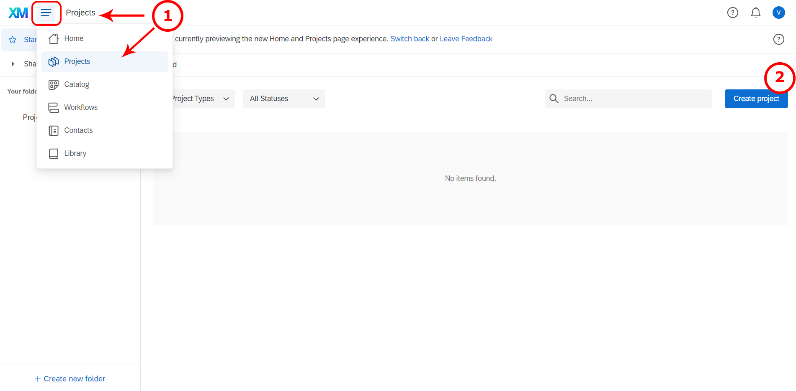

 
3. Go to "Create a project" 
4. Click on "survey".
5. Get started


6. Enter a name for your survey and get started with a survey creation "Create a blank survey project".


7./8./9. **If you would like to import the example questionnaire, I provide above, you may do so using the "import from QSF file" option.** If you would like to create a new questionnaire on the basis of an already existing one, then you choose "Copy a survey from an existing project" (you most likely will not need this option). If there is a questionnaire in the Qualtrics Library you would like to use, then you need to choose "From Library", and indicate one library name in the dropdown menu (you most likely will not need this option). If you use the library or copy option, then you need to indicate the questionnaire you would like to copy. Now you are good to go! 
10. Create your project

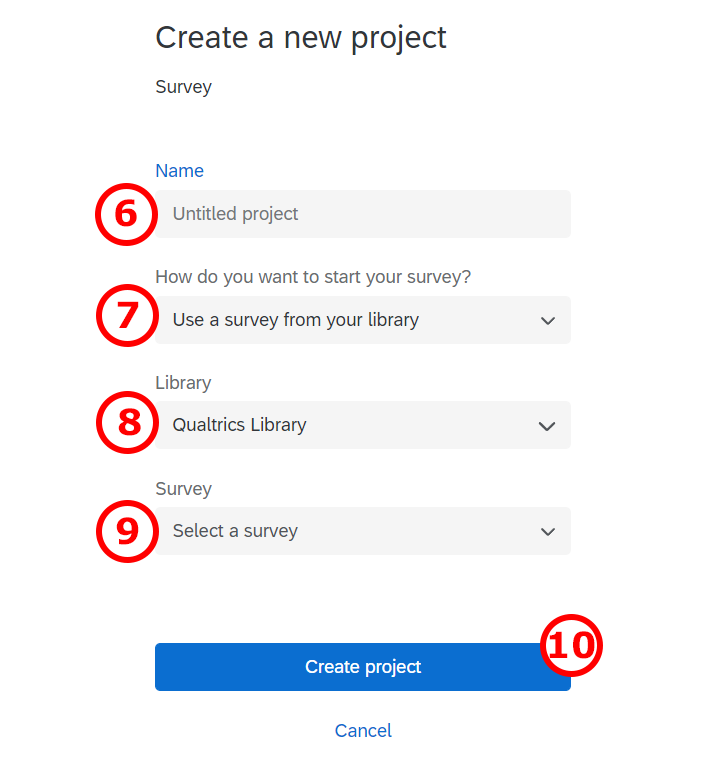

### Questionnaire structure and contents

Your task is to develop a questionnaire with approx. 30 questions (5 questions per person in your group) and there are some important things to keep in mind while developing a questionnaire, which will be highlighted in this section. 

#### General structure

The sequence of questions in a questionnaire plays an important role. Your questionnaire will usually start with an introductory page with a call-to-action to fill out the survey and a brief statement regarding the details about the survey (e.g., topic, duration). Note that you should carefully consider how much information you would like to disclose about the goal of the survey. If respondents are aware of the goal of the survey, they might strategically answer to influence the results. Nowadays, with the increasing sensitivity of respondents to privacy issues, it is also common practice to provide information about the usage of the data and if the responses are anonymous or not. If the questionnaire asks the respondents for personal information (e.g., an email address) you may also need a privacy statement. For transparency it is also recommended to provide an email-address that respondents may use in case of questions regarding the survey.

After the introduction, it is usually a good idea to collect some information about the topic of your survey that you can later use to present descriptive statistics. At the same time, this is a good opportunity to familiarize the participants with the survey topic. For example, in a survey about store brands, you may show some logos of store brands and ask the respondents which store brands they know or purchase using a multiple-choice question. 

After the introductory questions you may proceed to collect information about your dependent and independent variables. If your research design contains an experimental manipulation, you need to carefully consider at which part of the questionnaire you will include the manipulation. The reason is that all questions that respondents answer after the manipulation may be influenced by it. It is usually a good idea to include most independent variables before the manipulation, while the dependent variable needs to be measured after the manipulation. 

Demographics (e.g., age, gender) should generally be included at the end of the questionnaire because these questions usually require less cognitive effort so that respondents can answer them reliably even at the end of the survey. It is also recommended to include sensitive questions at the end of the questionnaire since sensitive questions may lead respondents to exit the survey.

You should also think about the respondents' experience. For instance, it is usually better to spread the content over more short pages than have fewer long pages. Generally, respondents are reluctant to read and fill out long questionnaire pages. Hence, long pages will lead to a higher dropout rate. In order to reduce the dropout rate, you should state how long the survey will approximately take, in the introduction of the questionnaire. 

::: {.infobox_red .caution data-latex="{caution}"}
Consider that most people usually use their phones to fill it out. Think about how the questionnaire will appear on a phone screen too. In that regard, think of the length of questions especially. It should generally not take longer than 10 minutes to fill out the survey (depending on the incentive). 
:::

Finally, the questionnaire structure should be aligned with the research design. For example, if your research design features an experiment, this needs to be reflected in the questionnaire (e.g., you need to assign the respondents randomly to the experimental conditions in case of a between-subjects comparison).

##### Questionnaire structure for experimental designs

**Questionnaire structure for a between-subjects experimental design**

In a between-subject design you randomly assign each respondent to different experimental conditions. They would then complete tasks only in the condition to which they are assigned.

Consider the example of a survey analyzing the effect of different versions of an advertisement on purchase intention. Thus, one group of (randomly assigned) respondents will be exposed to one advertisement version while the other group (of randomly assigned respondents) will be exposed to another version. After that, both groups of respondents should express their intention to purchase the advertised product as shown in the following figure:

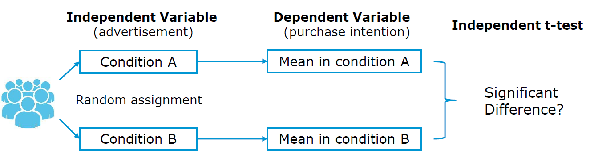

**Setting a randomizer in Qualtrics**

Here is a short description of how to set up a randomizer in Qualtrics, so that your participants are going to be assigned either to specific conditions.

First, navigate to the Survey tab and open your Survey Flow.


Then click Add Below or Add a New Element Here, depending to where you want to place a randomizer. 

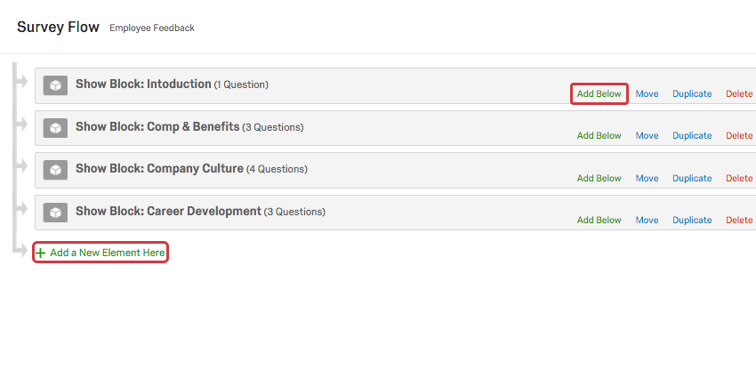
Then choose Randomizer.

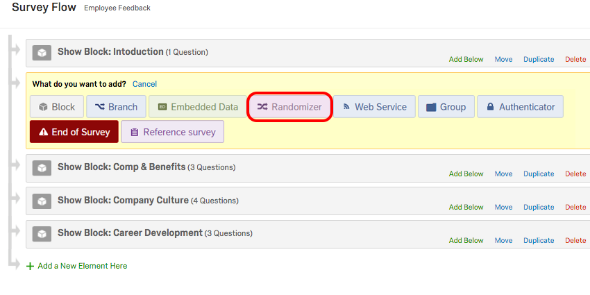

Finally, you set the number (the one between - and +) to 1 and check the option "Evenly Present Elements". Next you edit embedded data fields by naming it (e.g., "Group" and "Control","Test Group 1","Test Group 2".)


It is very important to think about the place to set a randomizer in a survey workflow. You want to place it always before you branch your survey flow, so that you can keep track of which respondent was exposed to which condition. If you do not set a randomizer before branching, it would remain unknown what condition each respondent was exposed to. Here is how it was done in our example of Qualtrics survey.


After respondents are randomly assigned either to a specific condition, the embedded data field can be used as a criterion for branching, i.e., asking respondents in a condition A and B different blocks of questions.

**Questionnaire structure for a within-subjects experimental design**

This type of experimental design involves exposing each respondent to all experimental conditions you’re testing.

For instance, we would like to test again the effect of two versions of an advertisement on purchase intentions, but this time in a within-subject design. First, each respondent will be exposed to the first version of advertisement and right after that asked to rate his/her intention to buy the advertised product. Subsequently, each participant will be shown another version of advertisement and again rate his/her intention to purchase the advertised product as shown in the figure below. Note that in situations in which the sequence of the conditions should not matter, a randomizer should be used to assign participants to see one or the other condition first. This is, for example, the case when you want to measure the effectiveness of two versions of an ad (i.e., you are interested in the effectiveness of a single ad and not the sequence of ads). However, in some cases (e.g., when measuring changes in attitudes due to a treatment) the order is important and everyone should be shown the questions in the same order.

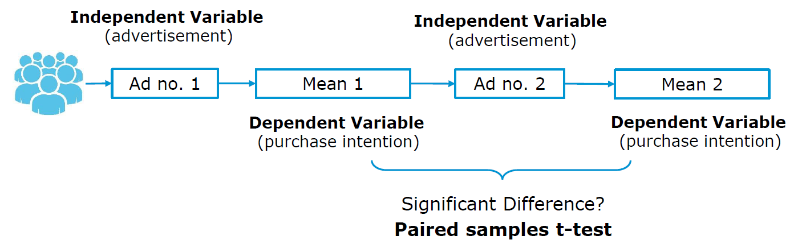

#### General contents

In this section, we will discuss some important issues regarding the contents of your questions. Generally, how you phrase the question impacts the reliability and validity of your variables, i.e., if it is possible for the respondent to understand what we intended to measure and whether the measure consistently measures the same variable across respondents.

First, we will briefly highlight some points regarding the language and wording:

* Aim for **brevity & use simple language** and avoid technical terms
* Don't use more questions then needed (usually **respondents' fatigue** increases when many questions with the same contents are included)
* Avoid asking **double-barreled questions**, i.e., a single question covering two issues (e.g., instead of asking "Do you think Nike Town offers better variety and prices than other Nike stores?"; --> ask for price and variety separately)
* Make sure that your **respondents are able** to meaningfully answer your questions (e.g., asking for an opinion about a topic that the respondent may not be familiar with; --> include a "don't know" option; it is better than obtaining unreliable information)   
* When asking participants to recall e.g., certain brands, decide between **unaided and aided recall questions** (unaided means you do not show the possible response option, which is harder but may also provide more valuable information)
* Use **different question types** to avoid respondent fatigue
* When asking participants to list something, **minimize the effort required by respondents** (e.g., open-ended questions like "Please list all the departments from which you purchased merchandise on your most recent shopping trip to department store X." require more effort compared to providing the response options in the form of a multiple-choice question)
* When asking for **information that could be considered sensitive** (e.g. income, political beliefs), they should come at the end of the questionnaire and in form of response categories, rather than asking for specific figures (e.g., instead of asking the exact income, ask for income categories)  
* **Avoid leading questions** that provide clues to what the answer should be and induce bias in a particular direction (e.g., ask “What is your favorite brand of toothpaste?” instead of “Is Colgate your favorite toothpaste?”). 
* **Avoid ambiguous words** such as usually, normally, frequently, often, regularly, and other similar words that do not define frequency clearly enough.

#### Measurement scales and scaling techniques

Every statistical analysis requires that variables have a specific levels of measurement (i.e., categorical = nominal & ordinal; continuous = interval & ratio). The measurement scales you choose for your questions in a survey will affect the answers you get and eventually determines the choice of statistical test you can apply. The flow chart below should help you to choosing a correct measurement scale for your variables depending on which type of analyses you plan to conduct (source: McElreath 2015). [Here](https://stats.idre.ucla.edu/other/mult-pkg/whatstat/) you can find another overview of statistical test associated with different types of independent and dependent variables. 


When it comes to **scaling techniques**, they are meant to study the relationship between objects. The basic scaling techniques classification is on **comparative** and **non-comparative scales**. 


##### Non-comparative scales

For non-comparative scales, each object is scaled independently of the other objects. The resulting data is supposed to be measured in an interval and ratio scaled. 

**Itemized rating scales**

One of the most frequently used type of non-comparative scales are itemized rating scales:  

* The respondents are provided with a scale that has a number or brief description associated with each category.  
* The categories are ordered in terms of scale position, and the respondents are required to select the specified category that best describes the object being rated.  
* The commonly used itemized rating scales are **the Likert scale and the semantic differential**

A **Likert scale** has the following properties:

* Requires respondents to indicate their attitude towards the given object through the degree of agreement or disagreement with each of a series of statements within typically five or seven categories.  
* Reversed code of some items increases validity.  
* One limitation is time required to answer a question on a Likert scale. Compared to other itemized scaling techniques, Likert scale is more time consuming as each respondent is required to read every statement given in a questionnaire before assigning a numerical value to it.


In the table below you can find a couple of commonly measured constructs in marketing research such as attitude, importance, purchase intention and similar.


**Semantic Differential**

A semantic differential scale has the following properties:

* Typically, participants rate objects on a number of itemized, seven-point rating scales bounded at each end by one of two bipolar adjectives.  
* Semantic differential can measure respondent attitudes towards something (products,concepts, items, people...).
* It helps you find the respondent's position is on a scale between two bipolar adjectives such as “Sweet-Sour” or “Bright-Dark”. In comparison to Likert scale, which uses generic scales (e.g. extremely dissatisfied to extremely satisfied), semantic differential questions are posed within the context of evaluating attitudes.
* Widely used rating scale in marketing research due to its versatility

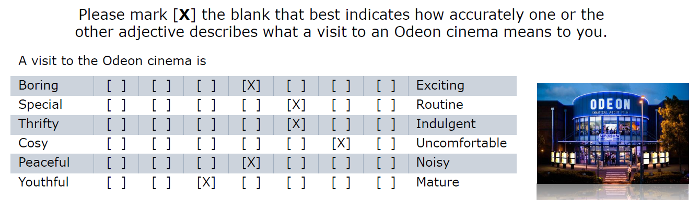

When using itemized rating questions (Likert and semantic differential), you should consider the following:

* **Number of categories:** 

Generally, there is no optimal number but the most frequently used number of categories are 5 and 7, depending on the context (e.g., how detailed the question can be answered). 

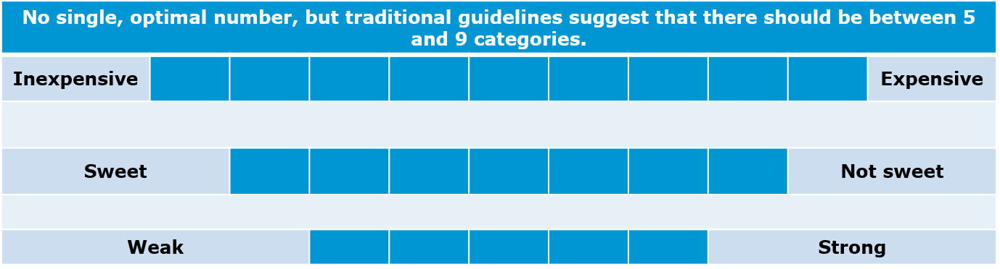

* **Balanced vs. unbalanced:**


* **Odd/even number of categories:**


* **Forced vs. non-forced response**


* **Verbal description:**

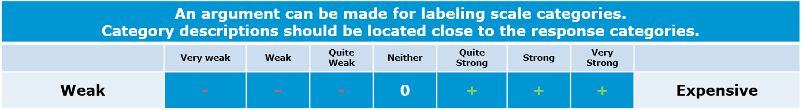

**Continuous Rating Scales**

A continuous rating scale has the following properties:

* Participants rate the objects by placing a mark at the appropriate position on a line that runs from one extreme of the criterion variable to the other.  
* One of the advantages of the continuous rating scale is that it is easy to administer. 
* Once the ratings are collected, you also have the option of splitting up the obtained ratings into categories and then assign those depending on the category in which the ratings fall.

You can see one example for a continuous rating scale below:


##### Comparative scales

Comparative scales (or non-metric scaling) compare the stimulus object directly. As a result, the comparative data collected can only be interpreted in relative terms. In this section we will walk through the most important comparative scale types.

**Rank order**  

A rank order question asks respondents to compare items to each other by placing them in order of preference. Note that the data obtained from a rank order question shows an order of a respondent's preference, but not the difference between items. In the example below, if it turns out that the most important feature of a fitness tracker for a respondent is "Measuring steps" and the second most important feature "Calories burned", we don't know for how much more important the former is in comparison to the latter. 


**Constant sum**  

Using a constant sum question, respondents allocate a constant sum of units (e.g., points, dollars) among a set of stimulus objects with respect to some criterion. Thus, if you wish to obtain information about how much one attribute is preferred over another one, you may use a constant sum scale. The total box should always be displayed at the bottom to make it easier for respondents. A constant sum question permits collection of ratio data type. Constant sum is similar to rank order, but it carries specific units. With the data collected we are able to answer the question: what factor is the most important for our respondents when they go out for a dinner? With data obtained we would be able to express the relative importance of the options. 


#### Other question types

In this section, we present some examples of the most frequent types of questions students use.


##### Single choice question

Single choice questions are questions where respondents select one response option from a set of pre-specified options. This usually makes sence, when the response options are mutually exclusive. In the example below, it is not possible to watch Netflix for 1-2 hours *and* more than 6 hours. Other examples are typical questions regarding the demographics (e.g., gender, education). Strictly speaking, Likert scales also represent a type of single choice question but since they usually appear in the form of multi-item batteries, this question type is highlighted separately here. The type of data obtained from this scale is categorical and you may use this type of scale, for example, to test for associations with other categorical variables (e.g., "Is there an association between gender and the hours of Netflix consumption?"). 


##### Multiple choice question

Multiple choice questions are questions where respondents select none, one or more response options from a set of pre-specified options. As an example, consider the question below regarding the familiarity of respondents with various store brands. Respondents could be familiar with none, one or more of the brands. The type of data you obtain from this scale is again **categorical**. It is usually a good idea to include a question like this at the beginning of the questionnaire to measure a respondents familiarity with brands and use this information to describe the sample (i.e., counting of responses per brand). For example, if you would conduct this research for one of the mentioned store brands, it would be interesting to know the share of respondents who are familiar with this brand compared to other brands. 

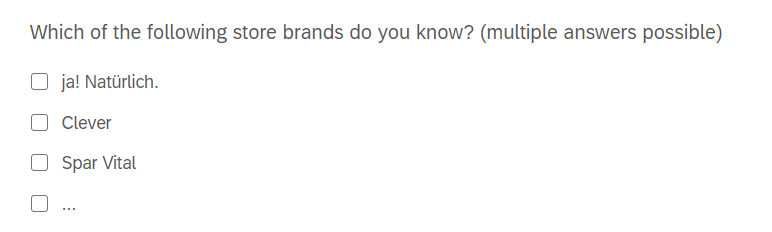

##### Open-ended entry question

An open entry type of question as a question asking the respondent to enter input in a specific format (e.g., text or numeric). Since this format requires cognitive effort, you should use it sparsely. However, the information that you can obtain from these scales can be quite valuable. In the first example below for numeric entries, you will obtain **ratio data**, which usually gives you lots of flexibility in terms of how what type of analyses you can run. For example, the willingness to pay measure in the example may be used as a dependent variable in a regression model. To avoid wrong entry types (e.g., someone might try to input text), you can specify the desired response format in most online survey software packages and it will conduct a validation check if the input format is correct when a respondent proceeds in the questionnaire. 

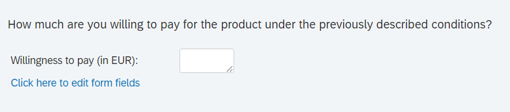

If you suspect that respondents might have issues using the intended input format, you may also use other scales types like the example below to make it easier for respondents to input the information (and for you to save time when analyzing the data). 


Our course, you may also include open-ended text questions like in the example below. The results could, for example be visualized in a word cloud or you could count the number of times a word has been stated. Since this question type requires cognitive effort, it is generally not recommended to force responses on these type of questions and allow respondents to proceed even if they may not be able to come up with three words.   


#### More tipps for your questionnaire

##### Introduction

As stated above, you should write a short an concise introduction to the questionnaire including a call-to-action, and information on the duration, topic, confidentiality, as well as contact details like in the example below. 

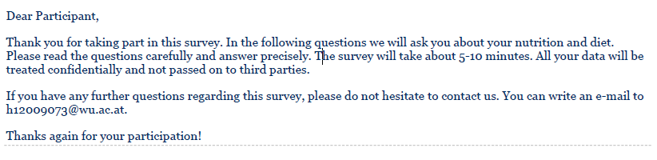

##### Demographics

As stated above, demographic questions are usually asked at the end of the questionnaire. You may generally include different demographic questions depending on the context and use different entry formats for them. For example, when asking about the respondents' **age**, you may use response categories, or a drop-down menu, as shown below. The decision which format to choose generally requires you to trade-off between the additional information you gain by asking for the specific information (e.g., age, income) and the sensitivity of the information you ask. While it is generally desirable to have more detailed information (e.g., the exact age), this may not be feasible if many respondents may not want to disclose the exact information for privacy reasons.  

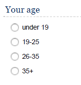


Hence, for **income**, it is usually recommended not to ask the specific income but to use categories instead. The selection of categories to include depends on the sample (e.g., if you expect many students with lower income levels, it might make sense to include categories in smaller increments at the lower end of the scale).

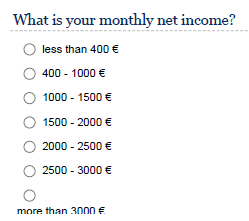
If the **place of residence** is relevant to your research context, you may also collect this information in different ways, depending on the research context and sample. Note that there is also a difference between the current place of living and the nationality of a respondent as the examples show and you need to decide which one is relevant to your research context. It might even be relevant to ask for the place of residence within a country (e.g., if it is meaningful to differentiate between urban and non-urban areas).  


**Education**, **gender**, and **occupation** are other potentially relevant variables to include in the questionnaire. 


##### Think carefully about your dependent variable

When analyzing your data, the nature of the dependent variable is one limiting factor regarding the types of methods you can use. Usually, it is desirable to have more than less variability to explain in the data and for many methods (e.g., linear regression) you need the data to be measured using continuous scales. Thus, variables like the willingness to pay (ratio scale) are usually good candidates like in the example below.  


You may also be creative in the definition of your dependent variable. For example, you may also ask for the willingness to pay under two different scenarios and then compute the difference between the variables and use this difference (in Euros) as your dependent variable. In the example below, it was first assessed how much consumers are willing to pay for video streaming services like Netflix in the current form after describing the features (e.g., range of available content) of the service in detail. After that, respondents were told to imagine that the service is configured in the best possible way (e.g., all movies and TV series are available) and to state their willingness to pay under this scenario. In the analysis, you could now use the difference between the two values as the dependent variable and explain this additional willingness to pay as a function of the perceived limitations of the current offer to find our what the services need to improve. 

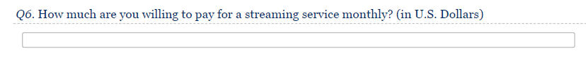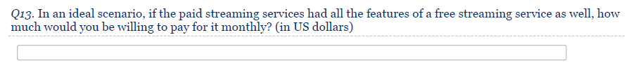

Individual itemized rating scales (e.g., Likert scales) are usually not good candidates for dependent variables since the variability is limited by the response option provided. For example, a 5-point Likert scale only provides 5 response options. In this case, it would be better to either use multiple items to measure the dependent variables, or use a different scale types like the ones below when measuring the purchase intention. 

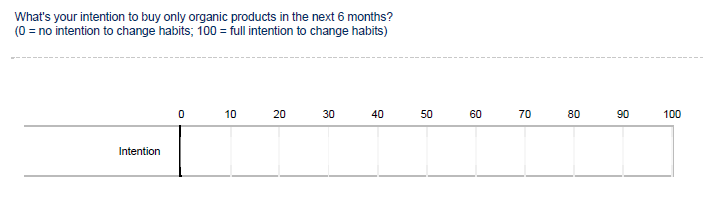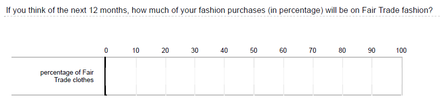

##### Uncovering dimensions underlying the topic of interest

If the goal of your analysis is to uncover dimensions underlying the phenomenon of interest, it is usually best to do this using item-batteries in the example below. In your analysis, you may later inspect the relationships between the variables and explore if they can be meaningfully grouped together using principal component analysis.


##### Controlling for potentially confounding variables

As indicated above, it is important to consider if there may be omitted variables that may bias the results you obtain from your model, especially if you did not obtain the data from an experiment with random assignment of participants to groups. For example, if you seek to explain the price premium that consumers are willing to spend for organic products and the level of education is one of your independent variables, you should consider which variables may be correlated with the education *and* the price premium variables. If, for example, consumers with a higher level of education are more likely to be vegetarians and vegetarians are willing to pay a higher price premium, you should control for the type of diet in your model in order not to overestimate the effect of education. 

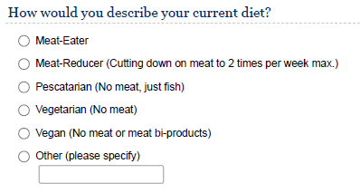

##### Using semantic differential questions

Semantic differential questions like the ones shown below are usually a nice way of describing the perceptions of the products or brands under investigation. You may also use this type of data to highlight differences between groups (e.g., by visualizing the means for male and female consumers on each dimension).

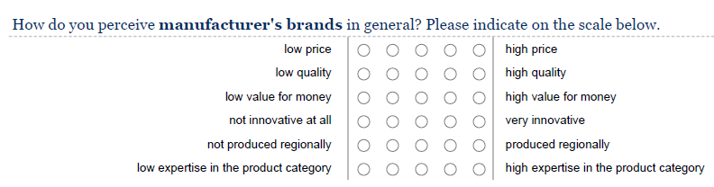

##### Constant sum questions

Although constant sum questions require more cognitive effort compared to simple ranking questions, you obtain more information from this type of question. An additional benefit of including a question like this is that it gets respondents to reflect on their own behavior and this might help to obtain more reliable responses when asking related questions later in the questionnaire. 


##### Be precise in your wording of scenarios

If you would like to obtain information about a specific aspect of a product or service, it is important to describe all other relevant aspects to ensure that all respondents base their response on the same information. If you are asking for the willingness to pay for a car-sharing service (like in the example below), it is important to provide information that describe all relevant aspects of this service (e.g., availability, parking options, etc.). Otherwise you might run the risk that respondents might put in information under the assumption that the service is not available in their hometown.  

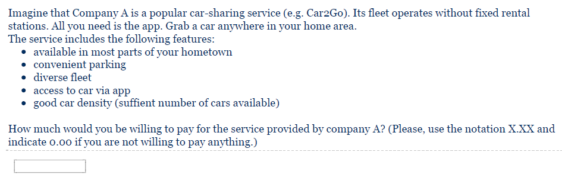

##### Price anchors

If respondents are required to make a comparisons and it is reasonable to assume that your respondents are not fully informed, you may consider providing additional pieces of information. For example, when asking about the price premium for organic products, you may state the price of standard products like in the example below.   


##### Keeping everything else contant in experiments

If your questionnaire includes an experiment in which respondents are randomly assigned to different groups, it is usually important to keep all information constant, except for the variable that you are interested in. For example, if you are interested in differences between fair-trade and conventional apparel products, you should use the same brand and the same pictures and only vary the piece of information that you are interested in. Note that if you would like to avoid any existing associations with a brand, it is also an option to consider using a ficticious brand instead of real brand names.     

**Condition A**


**Condition B**


### Test your questionnaire

Finally, before you distribute the questionnaire, there are some things to consider. First, you should always pretest your questionnaire before you start to collect data. Double-check all aspects of the questionnaire (content, wording, sequence, form & layout, etc.). If possible, use test-respondents in the pretest that are similar to those who will be included in the actual survey. After each significant revision of the questionnaire, conduct another pretest, using a different sample of respondents. 

After pretesting your questionnaire you should be able to determine whether:

* The questions are properly framed  
* The questions wording triggers any biases  
* The questions are placed in the optimal order  
* The questions are understandable  
* Specifying questions are needed or some need to be eliminated  

Here are some more useful hints when setting up an online questionnaire:

* Add a progress bar so that respondents know how many pages are left (see "Look & Feel" menu in Qualtrics).
* Remember to activate the "Force Response" field under "Validation Options" if you don't want to allow respondents to skip questions.
* Check the usability on mobile devices using the preview option (make sure the "Mobile friendly" option is checked).

### Data collection

Your task in this group project is to collect real data from real people. More specifically, each group member is supposed to administer the questionnaire to 20 persons, i.e. a group of 6 = 120 people per group project. Usually, you would also need to take your sampling strategy into consideration (i.e., how to select the individuals who participate in the survey so that the sample is representative for the population). In this project, it is okay for you to use a convenience sampling approach and distribute the survey link to your family and friends. However, keep in mind that it usually helps with the analysis to have a heterogeneous sample (i.e., a more diverse sample). That is, if you only have students within a narrow age range in your sample, you may be limited in the ways you can explore heterogeneity (e.g., if the effects differ across age groups) because there is not enough variability to explore in your data. Usually, the story gets more interesting if you manage to uncover differences between individuals. Thus, if you can manage to increase the diversity of your sample (e.g., by including participants of different age groups, nationalities), this will allow you to explore the heterogeneity between these groups in your analyses.  

## Part 2: Data analysis

### Guidelines for the submission and presentation

For your data analysis & final presentation, you should consider the following points:

**Problem statement**

* Be clear about the management problem that you are trying to solve and the research question(s) you would like to answer
* Why is the problem relevant from a managerial perspective?

**Presentation structure**

* Think about the overall structure of your presentation before you start designing the individual slides.
* Given your research problem/question, what slides/content do you need to have in the presentation to answer your research question or solve your problem?
* Please don’t include an accumulation of visualizations that lead nowhere. Instead, ask yourself, is this chart contributing to the answer of your research question?
* It is usually a good idea to start with an introduction to the topic and the research question(s) (e.g., include screenshots to explain the problem or show market figures that lead up to your research question). 
* Next, you may describe and justify your research design (e.g., causal inference vs. predictive vs. descriptive) that you chose to address the research questions(s).
* After that, you should provide some descriptive statistics about your sample. 
* In a next step, you should present your results regarding the central research questions. Remember to include all the necessary information that are required to understand the results (e.g., number of observations, wording of questions, etc.). 
* It is usually a good idea to include appropriate visualizations of the variables that you are investigating. In fact, usually it is the visualizations in a presentation that tell the story. Thus, invest time to carefully consider different ways to visualize your data in order to tell your story.
* You do not need to include all assumption tests for the methods in the main body of the presentation. However, you should still test if the assumptions are met and include the results in the appendix in case there are questions. Finally, you should discuss/interpret your results with regard to the managerial research question(s) and list potential limitations of your research.

**Choice of appropriate statistical tests**

* Please provide a justification for the choice of statistical test (e.g., t-test, regression, ANOVA, parametric vs. non-parametric) given your choices regarding the types of variables. This does not necessarily have to be in writing on the slides but it can also mean that you mention it briefly during your presentation which test you used. 
* Remember to use the correct terminology and e.g., state the dependent and independent variables.
* If you use a regression model, also include a formal statement of the regression equation so it is clear what is being analyzed, e.g., $log(DV)=\beta_0+\beta_1*log(IDV1)+\beta_2*log(IDV2)+\epsilon$. From the regression equation, it should be clear what type of model it is (linear regression vs. logistic regression), what the dependent variable is, what the independent variables are, and whether the values are transformed (e.g., logarithms) or not.
* If your analyses include multiple steps, make sure that it is clear to the audience why the individual steps were conducted and how they relate to each other (e.g., if you do a PCA first to reduce the dimensionality of the data and then include the resulting factor scores in a regression model, make sure that the purpose of each step is clear).

**Implementation of analysis**

* Make sure that you store the R code you used for your analysis and submit it along with your data & the slides to the assignment on Learn. This way, it is transparent how you arrived at your results. 
* We should be able to replicate your results by running the code. This usually makes sence when you work on a project jointly with other team members.

**Visualizations**

* Select appropriate plots to visualize your variables (e.g., scatter plot, boxplot, mean plot, histogram, wordcloud, cluster plots etc.)
* Not every visualization that you could potentially come up with really makes sense to put into a presentation. Again, ask yourself, is this chart contributing to the answer of your research question(s)?
* Do not forget legends and labels of the axes in your visualization!
* Make sure that the text on your graphics can be read easily. This means that when creating visualizations in ggplot, you may need to play around with the text size and plot size when writing the plot from R. If the text is too small relative to the graphic, you should either decrease the plot size, or increase the text size, or both. 
* Remember to include all information that are required to understand the visualization (e.g., the wording of the question, the number of observations, axis labels)
* Keep it simple and make sure that a visualization can be easily understood. Adding too much information into a visualization is very often misleading for your audience and hurts more than you might think.
* In case a visualization is not easily comprehensible, you might think about adding a note that explains the audience how-to-read the visualization using an example.

**Reporting and interpretation of model results**

* Report your analysis in an appropriate way (e.g., use the ‘stargazer’ package to report the results of regression models or use the ‘ggstatsplot’ package to provide test summaries).
* Interpret all relevant test statistics (e.g., test statistics, confidence intervals, coefficients and their significance and relative importance, R-squared, effect sizes, etc.).
* Discuss the recommendations derived from analysis. Do not skip this part! Always assume that you have an audience of decision makers. You need to tell them what to do based on your analysis.

### Data export from Qualtrics

You can export the answers to your survey in Qualtrics by going to the "Data & Analysis" tab in your survey and clicking on the "Export & Import" button on the right.


One you choose the "Export Data..." option you will be presented with options for the data export. Make sure to choose "Use numeric values" and "Split multi-value fields into columns" (the latter is visible by expanding to "More options")


If you are not sure which numeric value corresponds to which answer, select a question in the "Survey" tab and click on "Recode values" to see/change which options correspond to which value.


### Randomized groups

You can check out the grouping variable(s)'s name(s) under "Survey Flow" in the "Survey" tab. These will be added to the exported data as a column with the name of the group as the value. In the example below there will be a column named "Group" with values "treat1", "treat2", and "ctrl".

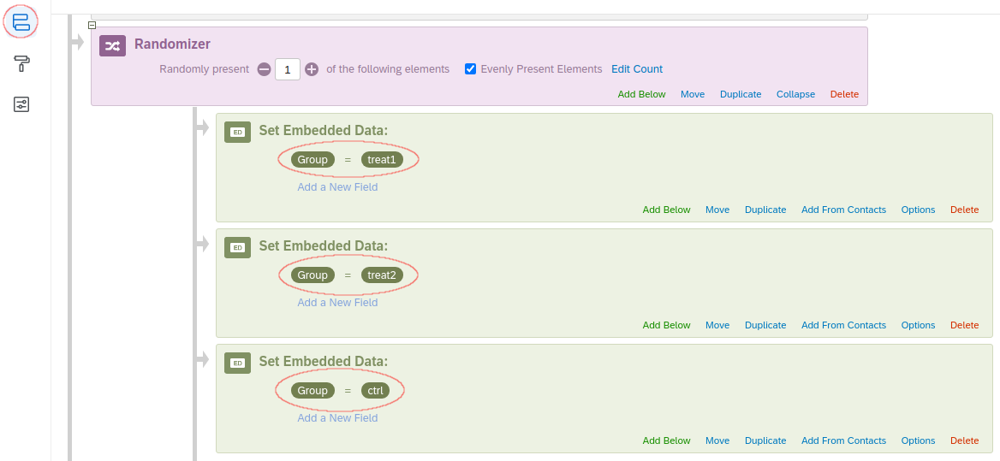


### Importing Qualtrics data

To import the data to R you can use the "read_survey" function from the "qualtRics" library.


```r
library(qualtRics)
green_consumption <- read_survey("data/Green_Consumption.csv")
head(green_consumption)
```

<div data-pagedtable="false">
  <script data-pagedtable-source type="application/json">
{"columns":[{"label":["StartDate"],"name":[1],"type":["dttm"],"align":["right"]},{"label":["EndDate"],"name":[2],"type":["dttm"],"align":["right"]},{"label":["Status"],"name":[3],"type":["dbl"],"align":["right"]},{"label":["IPAddress"],"name":[4],"type":["chr"],"align":["left"]},{"label":["Progress"],"name":[5],"type":["dbl"],"align":["right"]},{"label":["Duration (in seconds)"],"name":[6],"type":["dbl"],"align":["right"]},{"label":["Finished"],"name":[7],"type":["dbl"],"align":["right"]},{"label":["RecordedDate"],"name":[8],"type":["dttm"],"align":["right"]},{"label":["ResponseId"],"name":[9],"type":["chr"],"align":["left"]},{"label":["RecipientLastName"],"name":[10],"type":["lgl"],"align":["right"]},{"label":["RecipientFirstName"],"name":[11],"type":["lgl"],"align":["right"]},{"label":["RecipientEmail"],"name":[12],"type":["lgl"],"align":["right"]},{"label":["ExternalReference"],"name":[13],"type":["lgl"],"align":["right"]},{"label":["LocationLatitude"],"name":[14],"type":["dbl"],"align":["right"]},{"label":["LocationLongitude"],"name":[15],"type":["dbl"],"align":["right"]},{"label":["DistributionChannel"],"name":[16],"type":["chr"],"align":["left"]},{"label":["UserLanguage"],"name":[17],"type":["chr"],"align":["left"]},{"label":["Q8"],"name":[18],"type":["dbl"],"align":["right"]},{"label":["Q34_1...19"],"name":[19],"type":["dbl"],"align":["right"]},{"label":["Q34_2"],"name":[20],"type":["dbl"],"align":["right"]},{"label":["Q34_3"],"name":[21],"type":["dbl"],"align":["right"]},{"label":["Q34_4"],"name":[22],"type":["dbl"],"align":["right"]},{"label":["Q34_5"],"name":[23],"type":["dbl"],"align":["right"]},{"label":["Q34_5_TEXT"],"name":[24],"type":["chr"],"align":["left"]},{"label":["Q33_1"],"name":[25],"type":["dbl"],"align":["right"]},{"label":["Q33_2"],"name":[26],"type":["dbl"],"align":["right"]},{"label":["Q33_3"],"name":[27],"type":["dbl"],"align":["right"]},{"label":["Q33_4"],"name":[28],"type":["dbl"],"align":["right"]},{"label":["Q33_5"],"name":[29],"type":["dbl"],"align":["right"]},{"label":["Q33_6"],"name":[30],"type":["dbl"],"align":["right"]},{"label":["Q33_7"],"name":[31],"type":["dbl"],"align":["right"]},{"label":["Q37...32"],"name":[32],"type":["chr"],"align":["left"]},{"label":["Q33"],"name":[33],"type":["chr"],"align":["left"]},{"label":["Q43"],"name":[34],"type":["chr"],"align":["left"]},{"label":["Q45"],"name":[35],"type":["chr"],"align":["left"]},{"label":["Q47"],"name":[36],"type":["chr"],"align":["left"]},{"label":["Q49"],"name":[37],"type":["chr"],"align":["left"]},{"label":["Q1_1"],"name":[38],"type":["dbl"],"align":["right"]},{"label":["Q1_2"],"name":[39],"type":["dbl"],"align":["right"]},{"label":["Q1_3"],"name":[40],"type":["dbl"],"align":["right"]},{"label":["Q1_4"],"name":[41],"type":["dbl"],"align":["right"]},{"label":["Q1_5"],"name":[42],"type":["dbl"],"align":["right"]},{"label":["Q3"],"name":[43],"type":["lgl"],"align":["right"]},{"label":["Q30_1"],"name":[44],"type":["dbl"],"align":["right"]},{"label":["Q4_1"],"name":[45],"type":["dbl"],"align":["right"]},{"label":["Q4_2"],"name":[46],"type":["dbl"],"align":["right"]},{"label":["Q4_3"],"name":[47],"type":["dbl"],"align":["right"]},{"label":["Q4_4"],"name":[48],"type":["dbl"],"align":["right"]},{"label":["Q5_1"],"name":[49],"type":["dbl"],"align":["right"]},{"label":["Q5_2"],"name":[50],"type":["dbl"],"align":["right"]},{"label":["Q5_3"],"name":[51],"type":["dbl"],"align":["right"]},{"label":["Q5_4"],"name":[52],"type":["dbl"],"align":["right"]},{"label":["Q5_5"],"name":[53],"type":["dbl"],"align":["right"]},{"label":["Q10_1"],"name":[54],"type":["dbl"],"align":["right"]},{"label":["Q10_2"],"name":[55],"type":["dbl"],"align":["right"]},{"label":["Q10_3"],"name":[56],"type":["dbl"],"align":["right"]},{"label":["Q10_4"],"name":[57],"type":["dbl"],"align":["right"]},{"label":["Q40"],"name":[58],"type":["dbl"],"align":["right"]},{"label":["Q41_1"],"name":[59],"type":["dbl"],"align":["right"]},{"label":["Q41_2"],"name":[60],"type":["dbl"],"align":["right"]},{"label":["Q41_3"],"name":[61],"type":["dbl"],"align":["right"]},{"label":["Q41_4"],"name":[62],"type":["dbl"],"align":["right"]},{"label":["Q41_5"],"name":[63],"type":["dbl"],"align":["right"]},{"label":["Q41_5_TEXT"],"name":[64],"type":["chr"],"align":["left"]},{"label":["Q42_1"],"name":[65],"type":["dbl"],"align":["right"]},{"label":["Q34_1...66"],"name":[66],"type":["dbl"],"align":["right"]},{"label":["Q13"],"name":[67],"type":["dbl"],"align":["right"]},{"label":["Q11"],"name":[68],"type":["dbl"],"align":["right"]},{"label":["Q29_1"],"name":[69],"type":["dbl"],"align":["right"]},{"label":["Q29_2"],"name":[70],"type":["dbl"],"align":["right"]},{"label":["Q29_3"],"name":[71],"type":["dbl"],"align":["right"]},{"label":["Q29_4"],"name":[72],"type":["dbl"],"align":["right"]},{"label":["Q41"],"name":[73],"type":["dbl"],"align":["right"]},{"label":["Q39"],"name":[74],"type":["dbl"],"align":["right"]},{"label":["Q37...75"],"name":[75],"type":["dbl"],"align":["right"]},{"label":["Q50"],"name":[76],"type":["dbl"],"align":["right"]},{"label":["Q24"],"name":[77],"type":["dbl"],"align":["right"]},{"label":["Q29"],"name":[78],"type":["dbl"],"align":["right"]},{"label":["Q25"],"name":[79],"type":["dbl"],"align":["right"]},{"label":["Q30"],"name":[80],"type":["dbl"],"align":["right"]},{"label":["Q28_1"],"name":[81],"type":["dbl"],"align":["right"]},{"label":["Q28_2"],"name":[82],"type":["dbl"],"align":["right"]},{"label":["Q28_3"],"name":[83],"type":["dbl"],"align":["right"]},{"label":["Q28_3_TEXT"],"name":[84],"type":["chr"],"align":["left"]},{"label":["Q31"],"name":[85],"type":["chr"],"align":["left"]},{"label":["Q44"],"name":[86],"type":["dbl"],"align":["right"]}],"data":[{"1":"2019-11-01 02:13:07","2":"2019-11-01 02:21:41","3":"0","4":"89.144.204.52","5":"100","6":"513","7":"1","8":"2019-11-01 02:21:42","9":"R_1YbbIFT2P1b6ekN","10":"NA","11":"NA","12":"NA","13":"NA","14":"48.20000","15":"16.36670","16":"anonymous","17":"EN","18":"2","19":"0","20":"90","21":"10","22":"0","23":"0","24":"NA","25":"5","26":"4","27":"6","28":"5","29":"4","30":"3","31":"6","32":"02.50","33":"02.50","34":"01.90","35":"01.50","36":"06.90","37":"06.90","38":"6","39":"6","40":"6","41":"1","42":"5","43":"NA","44":"55","45":"87","46":"100","47":"84","48":"74","49":"100","50":"80","51":"100","52":"75","53":"30","54":"4","55":"4","56":"3","57":"4","58":"2","59":"100","60":"0","61":"0","62":"100","63":"0","64":"NA","65":"4","66":"45","67":"2","68":"7","69":"1","70":"3","71":"3","72":"4","73":"3","74":"4","75":"3","76":"NA","77":"23","78":"2","79":"3","80":"1","81":"1","82":"NA","83":"NA","84":"NA","85":"1","86":"1"},{"1":"2019-11-01 02:14:06","2":"2019-11-01 02:26:02","3":"0","4":"213.142.96.124","5":"100","6":"715","7":"1","8":"2019-11-01 02:26:03","9":"R_w7Ph2h8lppYIJ6V","10":"NA","11":"NA","12":"NA","13":"NA","14":"48.20770","15":"16.37050","16":"anonymous","17":"EN","18":"3","19":"0","20":"50","21":"50","22":"0","23":"0","24":"NA","25":"4","26":"5","27":"5","28":"5","29":"4","30":"4","31":"6","32":"2.5","33":"3","34":"0.60","35":"1","36":"0","37":"0","38":"6","39":"6","40":"6","41":"2","42":"2","43":"NA","44":"66","45":"61","46":"80","47":"44","48":"65","49":"0","50":"0","51":"0","52":"100","53":"0","54":"5","55":"5","56":"5","57":"2","58":"1","59":"0","60":"0","61":"100","62":"0","63":"0","64":"NA","65":"3","66":"51","67":"6","68":"0","69":"1","70":"1","71":"1","72":"1","73":"2","74":"4","75":"2","76":"NA","77":"24","78":"2","79":"4","80":"1","81":"1","82":"NA","83":"NA","84":"NA","85":"1","86":"1"},{"1":"2019-11-01 02:27:00","2":"2019-11-01 02:38:38","3":"0","4":"212.95.5.90","5":"100","6":"698","7":"1","8":"2019-11-01 02:38:38","9":"R_3RwjJqp399Ga5LM","10":"NA","11":"NA","12":"NA","13":"NA","14":"48.21690","15":"16.49969","16":"anonymous","17":"EN","18":"2","19":"98","20":"2","21":"0","22":"0","23":"0","24":"NA","25":"6","26":"5","27":"1","28":"2","29":"6","30":"4","31":"5","32":"1.99","33":"1.99","34":"0.89","35":"0.99","36":"0.00","37":"3.50","38":"5","39":"5","40":"4","41":"3","42":"5","43":"NA","44":"49","45":"81","46":"100","47":"71","48":"52","49":"80","50":"10","51":"5","52":"0","53":"5","54":"5","55":"2","56":"2","57":"5","58":"1","59":"0","60":"0","61":"0","62":"100","63":"0","64":"NA","65":"3","66":"2","67":"6","68":"2","69":"3","70":"3","71":"3","72":"2","73":"2","74":"1","75":"NA","76":"2","77":"24","78":"2","79":"4","80":"1","81":"1","82":"NA","83":"NA","84":"NA","85":"1","86":"1"},{"1":"2019-11-01 02:46:17","2":"2019-11-01 02:53:37","3":"0","4":"213.162.73.140","5":"100","6":"440","7":"1","8":"2019-11-01 02:53:37","9":"R_1N7TIk9MjEKYI0t","10":"NA","11":"NA","12":"NA","13":"NA","14":"47.13519","15":"15.46010","16":"anonymous","17":"EN","18":"2","19":"30","20":"40","21":"20","22":"10","23":"0","24":"NA","25":"4","26":"2","27":"5","28":"4","29":"5","30":"5","31":"6","32":"02.49","33":"02.99","34":"01.99","35":"2.49","36":"06.99","37":"07.99","38":"4","39":"4","40":"4","41":"4","42":"5","43":"NA","44":"52","45":"53","46":"52","47":"100","48":"47","49":"30","50":"20","51":"20","52":"20","53":"10","54":"3","55":"3","56":"3","57":"3","58":"2","59":"20","60":"0","61":"20","62":"60","63":"0","64":"NA","65":"4","66":"10","67":"6","68":"7","69":"1","70":"3","71":"4","72":"5","73":"3","74":"3","75":"3","76":"NA","77":"25","78":"2","79":"2","80":"1","81":"1","82":"NA","83":"NA","84":"NA","85":"1","86":"1"},{"1":"2019-11-01 03:08:06","2":"2019-11-01 03:17:40","3":"0","4":"80.110.125.99","5":"100","6":"574","7":"1","8":"2019-11-01 03:17:40","9":"R_3OkSPNyYYVv8YLU","10":"NA","11":"NA","12":"NA","13":"NA","14":"48.16400","15":"16.44630","16":"anonymous","17":"EN","18":"3","19":"60","20":"20","21":"20","22":"0","23":"0","24":"NA","25":"4","26":"4","27":"4","28":"4","29":"4","30":"3","31":"6","32":"2.00","33":"02.50","34":"01.50","35":"01.50","36":"04.00","37":"04.00","38":"5","39":"5","40":"4","41":"2","42":"5","43":"NA","44":"45","45":"65","46":"100","47":"50","48":"68","49":"50","50":"15","51":"30","52":"0","53":"5","54":"4","55":"4","56":"3","57":"4","58":"2","59":"0","60":"0","61":"80","62":"20","63":"0","64":"NA","65":"4","66":"62","67":"6","68":"4","69":"1","70":"3","71":"4","72":"2","73":"4","74":"4","75":"NA","76":"4","77":"24","78":"2","79":"4","80":"1","81":"1","82":"NA","83":"NA","84":"NA","85":"1","86":"1"},{"1":"2019-11-01 03:39:03","2":"2019-11-01 03:54:54","3":"0","4":"212.197.132.62","5":"100","6":"950","7":"1","8":"2019-11-01 03:54:54","9":"R_3kHzNH3NUqDTHzl","10":"NA","11":"NA","12":"NA","13":"NA","14":"48.23380","15":"16.29010","16":"anonymous","17":"EN","18":"3","19":"50","20":"50","21":"0","22":"0","23":"0","24":"NA","25":"5","26":"4","27":"4","28":"4","29":"5","30":"4","31":"6","32":"4,50","33":"04,50","34":"04,50€","35":"1,50","36":"10","37":"09,50","38":"6","39":"5","40":"4","41":"2","42":"4","43":"NA","44":"60","45":"82","46":"83","47":"61","48":"62","49":"40","50":"20","51":"20","52":"10","53":"10","54":"3","55":"3","56":"3","57":"5","58":"3","59":"0","60":"0","61":"50","62":"0","63":"50","64":"Nicht Mainstream","65":"3","66":"40","67":"7","68":"5","69":"1","70":"3","71":"5","72":"3","73":"4","74":"3","75":"NA","76":"4","77":"20","78":"1","79":"3","80":"1","81":"1","82":"NA","83":"NA","84":"NA","85":"2","86":"1"}],"options":{"columns":{"min":{},"max":[10]},"rows":{"min":[10],"max":[10]},"pages":{}}}
  </script>
</div>

At first some of the column names will be the question number. Question 8 in our example is:

"How many times in a week do you do the grocery shopping for your household?"

We can see the question and the first values using the `str` function


```r
str(green_consumption$Q8)
```

```
##  num [1:278] 2 3 2 2 3 3 2 2 2 2 ...
##  - attr(*, "label")= Named chr "How many times in a week do you do the grocery shopping for your household?"
##   ..- attr(*, "names")= chr "Q8"
```

Be careful when interpreting the values! They do not necessarily correspond directly to the answer given. Let's take a look at "Recode values" for this question:


The value $1$ in our data actually corresponds to the answer $0$, $2$ to $1-2$ and so on. It is important to keep that in mind when interpreting any results. 

### Data handling

We can also get just the text of the question using `get_label` from the `sjlabelled` library. This function creates a labelled vector that we can subset using the column names in the `data.frame` to get the corresponding question. It is important to save the labels to a variable before transforming the data as some of the labels will be removed from the `data.frame` in the process (e.g., by transforming to a factor variable).


```r
library(sjlabelled)
questions_green_consumption <- get_label(green_consumption)
questions_green_consumption["Q8"]
```

```
##                                                                            Q8 
## "How many times in a week do you do the grocery shopping for your household?"
```


#### Mutiple-choice, single answer

For single answer multiple choice questions we can create a `factor` variable using the corresponding answers as labels.


```r
green_consumption$Q8 <- factor(green_consumption$Q8,
                               levels = 1:4, 
                               labels = c("0", "1-2", "3-4", ">4"))
head(green_consumption$Q8)
```

```
## [1] 1-2 3-4 1-2 1-2 3-4 3-4
## Levels: 0 1-2 3-4 >4
```


#### Multiple answers

In case there are multiple possible answers there will be multiple columns corresponding to the same question but different answers. For example, if we ask people for reasons why they use a car there are multiple options which are not mutually exclusive.


```r
carsharing <- read_survey("data/Car_sharing.csv")
questions_carsharing <- get_label(carsharing)
questions_carsharing["Q6_1"]
```

```
##                                                          Q6_1 
## "For what reason(s) do you use your car? - to visit somebody"
```

```r
questions_carsharing["Q6_2"]
```

```
##                                                       Q6_2 
## "For what reason(s) do you use your car? - to go shopping"
```

```r
questions_carsharing["Q6_3"]
```

```
##                                                          Q6_3 
## "For what reason(s) do you use your car? - to commute (work)"
```

The value of such a column is going to be $1$ for the participants that chose the option and `NA` otherwise. We can easily replace all `NA`s with $0$ if we would like to. The `startsWith` function can be helpful to select the names of multiple columns corresponding to the same question. Then `replace` function can replace the `NA` values with 0:


```r
head(carsharing$Q6_1)
```

```
## [1]  1 NA NA NA NA  1
```

```r
carsharing[, startsWith(names(carsharing), "Q6")]  <- replace(carsharing[, startsWith(names(carsharing), "Q6")], 
                                                              is.na(carsharing[, startsWith(names(carsharing), "Q6")]), 0)
carsharing[, startsWith(names(carsharing), "Q6")]
```

<div data-pagedtable="false">
  <script data-pagedtable-source type="application/json">
{"columns":[{"label":["Q6_1"],"name":[1],"type":["dbl"],"align":["right"]},{"label":["Q6_2"],"name":[2],"type":["dbl"],"align":["right"]},{"label":["Q6_3"],"name":[3],"type":["dbl"],"align":["right"]},{"label":["Q6_4"],"name":[4],"type":["dbl"],"align":["right"]},{"label":["Q6_5"],"name":[5],"type":["dbl"],"align":["right"]},{"label":["Q6_6"],"name":[6],"type":["dbl"],"align":["right"]},{"label":["Q6_7"],"name":[7],"type":["dbl"],"align":["right"]},{"label":["Q6_8"],"name":[8],"type":["dbl"],"align":["right"]},{"label":["Q6_9"],"name":[9],"type":["dbl"],"align":["right"]}],"data":[{"1":"1","2":"1","3":"0","4":"0","5":"0","6":"0","7":"0","8":"0","9":"1"},{"1":"0","2":"0","3":"0","4":"1","5":"1","6":"0","7":"0","8":"0","9":"1"},{"1":"0","2":"0","3":"0","4":"0","5":"0","6":"0","7":"0","8":"0","9":"0"},{"1":"0","2":"0","3":"0","4":"0","5":"0","6":"0","7":"0","8":"0","9":"0"},{"1":"0","2":"0","3":"1","4":"0","5":"0","6":"0","7":"1","8":"0","9":"0"},{"1":"1","2":"1","3":"0","4":"0","5":"1","6":"0","7":"0","8":"0","9":"1"},{"1":"0","2":"1","3":"0","4":"0","5":"1","6":"1","7":"1","8":"0","9":"1"},{"1":"1","2":"1","3":"0","4":"1","5":"0","6":"1","7":"1","8":"1","9":"1"},{"1":"0","2":"0","3":"0","4":"0","5":"0","6":"0","7":"0","8":"0","9":"0"},{"1":"1","2":"1","3":"1","4":"0","5":"0","6":"0","7":"1","8":"0","9":"1"},{"1":"1","2":"1","3":"1","4":"0","5":"1","6":"1","7":"1","8":"0","9":"1"},{"1":"1","2":"1","3":"1","4":"0","5":"0","6":"0","7":"0","8":"0","9":"0"},{"1":"0","2":"0","3":"0","4":"0","5":"0","6":"0","7":"0","8":"0","9":"0"},{"1":"0","2":"0","3":"0","4":"0","5":"0","6":"0","7":"0","8":"0","9":"0"},{"1":"0","2":"1","3":"0","4":"0","5":"0","6":"0","7":"0","8":"0","9":"0"},{"1":"0","2":"0","3":"0","4":"0","5":"0","6":"0","7":"0","8":"0","9":"0"},{"1":"0","2":"0","3":"0","4":"0","5":"0","6":"0","7":"0","8":"0","9":"0"},{"1":"1","2":"1","3":"1","4":"0","5":"0","6":"0","7":"1","8":"0","9":"1"},{"1":"0","2":"0","3":"0","4":"0","5":"1","6":"0","7":"0","8":"0","9":"0"},{"1":"0","2":"0","3":"0","4":"0","5":"0","6":"0","7":"0","8":"0","9":"0"},{"1":"0","2":"0","3":"0","4":"0","5":"0","6":"0","7":"0","8":"0","9":"0"},{"1":"0","2":"0","3":"0","4":"0","5":"1","6":"0","7":"0","8":"0","9":"1"},{"1":"0","2":"0","3":"0","4":"0","5":"0","6":"0","7":"0","8":"0","9":"0"},{"1":"0","2":"0","3":"0","4":"0","5":"0","6":"0","7":"0","8":"0","9":"0"},{"1":"0","2":"0","3":"0","4":"0","5":"0","6":"0","7":"0","8":"0","9":"0"},{"1":"0","2":"0","3":"0","4":"0","5":"0","6":"0","7":"0","8":"0","9":"0"},{"1":"0","2":"0","3":"1","4":"0","5":"0","6":"0","7":"0","8":"0","9":"0"},{"1":"0","2":"0","3":"0","4":"0","5":"0","6":"0","7":"1","8":"0","9":"0"},{"1":"0","2":"0","3":"0","4":"0","5":"0","6":"0","7":"0","8":"0","9":"0"},{"1":"0","2":"0","3":"1","4":"1","5":"0","6":"0","7":"0","8":"0","9":"0"},{"1":"0","2":"1","3":"1","4":"1","5":"0","6":"0","7":"0","8":"0","9":"0"},{"1":"0","2":"0","3":"0","4":"0","5":"0","6":"0","7":"0","8":"0","9":"0"},{"1":"0","2":"0","3":"0","4":"0","5":"0","6":"0","7":"0","8":"0","9":"0"},{"1":"0","2":"0","3":"0","4":"0","5":"0","6":"0","7":"0","8":"0","9":"0"},{"1":"1","2":"1","3":"0","4":"0","5":"0","6":"0","7":"0","8":"0","9":"1"},{"1":"0","2":"0","3":"0","4":"0","5":"0","6":"0","7":"0","8":"0","9":"0"},{"1":"0","2":"1","3":"0","4":"1","5":"1","6":"0","7":"0","8":"0","9":"1"},{"1":"0","2":"0","3":"0","4":"0","5":"0","6":"0","7":"0","8":"0","9":"0"},{"1":"1","2":"1","3":"1","4":"0","5":"1","6":"0","7":"0","8":"0","9":"1"},{"1":"0","2":"0","3":"0","4":"0","5":"0","6":"0","7":"0","8":"0","9":"1"},{"1":"0","2":"0","3":"0","4":"0","5":"0","6":"0","7":"0","8":"0","9":"0"},{"1":"1","2":"1","3":"1","4":"0","5":"1","6":"0","7":"1","8":"0","9":"0"},{"1":"0","2":"0","3":"0","4":"0","5":"0","6":"0","7":"0","8":"0","9":"0"},{"1":"1","2":"1","3":"1","4":"0","5":"0","6":"0","7":"0","8":"0","9":"1"},{"1":"1","2":"1","3":"0","4":"0","5":"1","6":"1","7":"1","8":"1","9":"1"},{"1":"0","2":"0","3":"0","4":"0","5":"0","6":"0","7":"1","8":"0","9":"0"},{"1":"1","2":"1","3":"1","4":"1","5":"1","6":"1","7":"1","8":"0","9":"1"},{"1":"1","2":"1","3":"1","4":"0","5":"1","6":"1","7":"0","8":"0","9":"1"},{"1":"0","2":"0","3":"0","4":"1","5":"0","6":"0","7":"0","8":"0","9":"0"},{"1":"1","2":"1","3":"0","4":"1","5":"0","6":"0","7":"0","8":"0","9":"1"},{"1":"0","2":"0","3":"0","4":"0","5":"0","6":"0","7":"0","8":"0","9":"0"},{"1":"0","2":"0","3":"0","4":"1","5":"0","6":"0","7":"0","8":"0","9":"0"},{"1":"0","2":"1","3":"0","4":"1","5":"0","6":"0","7":"0","8":"0","9":"1"},{"1":"1","2":"0","3":"0","4":"0","5":"0","6":"0","7":"0","8":"0","9":"0"},{"1":"1","2":"1","3":"0","4":"0","5":"1","6":"0","7":"0","8":"0","9":"1"},{"1":"1","2":"1","3":"0","4":"0","5":"0","6":"0","7":"0","8":"1","9":"1"},{"1":"0","2":"0","3":"0","4":"0","5":"0","6":"0","7":"0","8":"0","9":"0"},{"1":"0","2":"0","3":"0","4":"0","5":"0","6":"0","7":"0","8":"0","9":"1"},{"1":"1","2":"1","3":"0","4":"0","5":"1","6":"0","7":"0","8":"0","9":"0"},{"1":"0","2":"0","3":"0","4":"0","5":"0","6":"0","7":"0","8":"0","9":"0"},{"1":"0","2":"0","3":"0","4":"0","5":"0","6":"0","7":"0","8":"0","9":"0"},{"1":"0","2":"1","3":"1","4":"0","5":"0","6":"0","7":"0","8":"0","9":"1"},{"1":"0","2":"0","3":"0","4":"0","5":"0","6":"0","7":"0","8":"0","9":"0"},{"1":"0","2":"0","3":"0","4":"0","5":"0","6":"0","7":"0","8":"0","9":"0"},{"1":"0","2":"0","3":"0","4":"0","5":"0","6":"0","7":"0","8":"0","9":"0"},{"1":"0","2":"0","3":"0","4":"0","5":"0","6":"0","7":"0","8":"0","9":"0"},{"1":"0","2":"0","3":"0","4":"0","5":"0","6":"0","7":"0","8":"0","9":"0"},{"1":"0","2":"1","3":"0","4":"0","5":"0","6":"0","7":"0","8":"1","9":"0"},{"1":"1","2":"0","3":"0","4":"0","5":"0","6":"0","7":"0","8":"0","9":"0"},{"1":"0","2":"0","3":"0","4":"0","5":"0","6":"0","7":"0","8":"0","9":"1"},{"1":"0","2":"1","3":"0","4":"1","5":"0","6":"0","7":"0","8":"0","9":"0"},{"1":"1","2":"0","3":"0","4":"0","5":"0","6":"0","7":"1","8":"0","9":"0"},{"1":"0","2":"0","3":"0","4":"0","5":"0","6":"0","7":"0","8":"0","9":"0"},{"1":"0","2":"0","3":"0","4":"0","5":"0","6":"0","7":"0","8":"0","9":"0"},{"1":"1","2":"1","3":"0","4":"0","5":"1","6":"1","7":"0","8":"1","9":"1"},{"1":"1","2":"1","3":"1","4":"0","5":"1","6":"0","7":"1","8":"1","9":"1"},{"1":"1","2":"1","3":"0","4":"0","5":"0","6":"0","7":"0","8":"0","9":"1"},{"1":"0","2":"0","3":"0","4":"0","5":"0","6":"0","7":"0","8":"0","9":"0"},{"1":"0","2":"0","3":"1","4":"0","5":"1","6":"1","7":"1","8":"0","9":"1"},{"1":"0","2":"0","3":"0","4":"0","5":"0","6":"0","7":"0","8":"0","9":"0"},{"1":"1","2":"1","3":"0","4":"1","5":"0","6":"0","7":"0","8":"0","9":"1"},{"1":"1","2":"0","3":"0","4":"0","5":"0","6":"0","7":"0","8":"1","9":"1"},{"1":"0","2":"0","3":"0","4":"0","5":"0","6":"0","7":"0","8":"0","9":"0"},{"1":"0","2":"0","3":"0","4":"0","5":"0","6":"0","7":"0","8":"0","9":"0"},{"1":"0","2":"0","3":"0","4":"0","5":"0","6":"0","7":"0","8":"0","9":"0"},{"1":"1","2":"1","3":"0","4":"0","5":"0","6":"0","7":"0","8":"0","9":"1"},{"1":"1","2":"1","3":"1","4":"0","5":"0","6":"1","7":"1","8":"1","9":"1"},{"1":"0","2":"0","3":"0","4":"0","5":"0","6":"0","7":"0","8":"0","9":"0"},{"1":"1","2":"1","3":"0","4":"0","5":"1","6":"0","7":"0","8":"0","9":"1"},{"1":"0","2":"0","3":"0","4":"0","5":"0","6":"0","7":"0","8":"0","9":"0"},{"1":"1","2":"1","3":"0","4":"0","5":"1","6":"0","7":"0","8":"0","9":"1"},{"1":"1","2":"1","3":"0","4":"1","5":"0","6":"0","7":"0","8":"0","9":"1"},{"1":"0","2":"0","3":"0","4":"0","5":"0","6":"0","7":"0","8":"0","9":"0"},{"1":"0","2":"0","3":"0","4":"0","5":"0","6":"0","7":"0","8":"0","9":"0"},{"1":"1","2":"1","3":"0","4":"0","5":"1","6":"0","7":"0","8":"0","9":"1"},{"1":"0","2":"0","3":"0","4":"0","5":"0","6":"0","7":"0","8":"0","9":"0"},{"1":"1","2":"1","3":"0","4":"1","5":"1","6":"0","7":"0","8":"0","9":"0"},{"1":"1","2":"1","3":"1","4":"0","5":"1","6":"1","7":"0","8":"1","9":"1"},{"1":"1","2":"1","3":"1","4":"1","5":"1","6":"1","7":"1","8":"0","9":"0"},{"1":"1","2":"1","3":"1","4":"0","5":"1","6":"1","7":"1","8":"1","9":"1"},{"1":"1","2":"1","3":"0","4":"0","5":"0","6":"0","7":"0","8":"0","9":"1"},{"1":"1","2":"1","3":"1","4":"1","5":"0","6":"0","7":"0","8":"0","9":"1"},{"1":"1","2":"1","3":"1","4":"0","5":"0","6":"0","7":"1","8":"0","9":"1"},{"1":"1","2":"1","3":"0","4":"0","5":"1","6":"0","7":"0","8":"0","9":"1"},{"1":"0","2":"1","3":"0","4":"0","5":"1","6":"1","7":"1","8":"0","9":"1"},{"1":"1","2":"0","3":"1","4":"0","5":"0","6":"0","7":"0","8":"0","9":"1"},{"1":"1","2":"1","3":"1","4":"0","5":"1","6":"1","7":"1","8":"1","9":"1"},{"1":"1","2":"1","3":"1","4":"0","5":"1","6":"1","7":"0","8":"0","9":"1"},{"1":"0","2":"0","3":"0","4":"0","5":"0","6":"0","7":"0","8":"0","9":"0"},{"1":"0","2":"0","3":"0","4":"0","5":"0","6":"0","7":"0","8":"0","9":"0"},{"1":"0","2":"0","3":"0","4":"0","5":"0","6":"0","7":"0","8":"0","9":"0"},{"1":"0","2":"0","3":"0","4":"0","5":"0","6":"0","7":"0","8":"0","9":"0"},{"1":"1","2":"1","3":"1","4":"0","5":"1","6":"1","7":"1","8":"0","9":"1"},{"1":"0","2":"0","3":"0","4":"0","5":"0","6":"0","7":"0","8":"0","9":"0"},{"1":"0","2":"0","3":"0","4":"0","5":"0","6":"0","7":"0","8":"0","9":"0"},{"1":"1","2":"1","3":"1","4":"1","5":"0","6":"0","7":"0","8":"0","9":"1"},{"1":"1","2":"0","3":"0","4":"0","5":"1","6":"0","7":"1","8":"0","9":"1"},{"1":"1","2":"1","3":"1","4":"1","5":"1","6":"1","7":"1","8":"0","9":"1"},{"1":"1","2":"1","3":"1","4":"0","5":"0","6":"1","7":"1","8":"0","9":"0"},{"1":"1","2":"0","3":"0","4":"0","5":"1","6":"0","7":"0","8":"0","9":"1"},{"1":"0","2":"0","3":"1","4":"0","5":"0","6":"0","7":"1","8":"0","9":"0"},{"1":"1","2":"1","3":"1","4":"1","5":"0","6":"1","7":"0","8":"0","9":"1"},{"1":"0","2":"0","3":"0","4":"0","5":"0","6":"0","7":"0","8":"0","9":"0"},{"1":"1","2":"0","3":"0","4":"0","5":"1","6":"0","7":"0","8":"0","9":"1"},{"1":"0","2":"0","3":"0","4":"0","5":"0","6":"0","7":"0","8":"0","9":"0"},{"1":"1","2":"0","3":"0","4":"0","5":"0","6":"0","7":"0","8":"0","9":"0"},{"1":"0","2":"0","3":"0","4":"0","5":"0","6":"0","7":"0","8":"0","9":"0"},{"1":"1","2":"1","3":"0","4":"1","5":"0","6":"0","7":"0","8":"0","9":"1"},{"1":"1","2":"1","3":"0","4":"0","5":"0","6":"1","7":"0","8":"0","9":"1"},{"1":"1","2":"1","3":"0","4":"0","5":"1","6":"0","7":"0","8":"0","9":"1"},{"1":"0","2":"0","3":"0","4":"0","5":"0","6":"0","7":"0","8":"0","9":"1"},{"1":"0","2":"0","3":"0","4":"0","5":"0","6":"0","7":"0","8":"0","9":"0"},{"1":"1","2":"0","3":"0","4":"0","5":"0","6":"0","7":"0","8":"0","9":"0"},{"1":"0","2":"0","3":"0","4":"0","5":"0","6":"0","7":"0","8":"0","9":"0"},{"1":"0","2":"0","3":"0","4":"0","5":"0","6":"0","7":"0","8":"0","9":"0"},{"1":"1","2":"1","3":"1","4":"0","5":"1","6":"1","7":"1","8":"1","9":"1"},{"1":"0","2":"0","3":"0","4":"0","5":"0","6":"0","7":"0","8":"0","9":"0"},{"1":"0","2":"0","3":"0","4":"0","5":"1","6":"0","7":"0","8":"0","9":"0"},{"1":"0","2":"0","3":"0","4":"0","5":"0","6":"0","7":"0","8":"0","9":"0"},{"1":"1","2":"1","3":"0","4":"0","5":"0","6":"1","7":"1","8":"0","9":"1"},{"1":"0","2":"0","3":"0","4":"0","5":"0","6":"0","7":"0","8":"0","9":"0"},{"1":"0","2":"0","3":"0","4":"0","5":"0","6":"0","7":"0","8":"0","9":"0"},{"1":"0","2":"0","3":"0","4":"0","5":"0","6":"0","7":"0","8":"0","9":"0"},{"1":"0","2":"0","3":"0","4":"0","5":"0","6":"0","7":"0","8":"0","9":"0"},{"1":"1","2":"0","3":"0","4":"0","5":"1","6":"0","7":"0","8":"0","9":"0"},{"1":"1","2":"1","3":"0","4":"0","5":"1","6":"0","7":"0","8":"1","9":"0"},{"1":"1","2":"0","3":"0","4":"0","5":"0","6":"0","7":"1","8":"0","9":"1"},{"1":"0","2":"0","3":"0","4":"0","5":"0","6":"0","7":"0","8":"0","9":"0"},{"1":"0","2":"0","3":"0","4":"0","5":"0","6":"1","7":"0","8":"0","9":"0"},{"1":"0","2":"0","3":"0","4":"0","5":"0","6":"0","7":"0","8":"0","9":"0"},{"1":"1","2":"1","3":"1","4":"1","5":"1","6":"1","7":"0","8":"1","9":"0"},{"1":"0","2":"0","3":"0","4":"0","5":"0","6":"1","7":"0","8":"0","9":"0"},{"1":"0","2":"0","3":"0","4":"0","5":"0","6":"0","7":"0","8":"0","9":"0"},{"1":"0","2":"0","3":"0","4":"0","5":"0","6":"0","7":"0","8":"0","9":"0"},{"1":"0","2":"0","3":"0","4":"0","5":"0","6":"0","7":"0","8":"0","9":"0"},{"1":"0","2":"1","3":"0","4":"0","5":"0","6":"0","7":"0","8":"1","9":"0"},{"1":"0","2":"0","3":"0","4":"0","5":"0","6":"0","7":"0","8":"0","9":"0"},{"1":"0","2":"0","3":"1","4":"0","5":"0","6":"0","7":"0","8":"0","9":"0"},{"1":"0","2":"0","3":"0","4":"0","5":"0","6":"0","7":"0","8":"0","9":"0"},{"1":"0","2":"0","3":"0","4":"0","5":"0","6":"0","7":"0","8":"0","9":"0"},{"1":"0","2":"0","3":"0","4":"0","5":"0","6":"0","7":"0","8":"0","9":"0"},{"1":"0","2":"0","3":"0","4":"0","5":"0","6":"0","7":"0","8":"0","9":"0"},{"1":"0","2":"0","3":"0","4":"0","5":"0","6":"0","7":"0","8":"0","9":"0"},{"1":"0","2":"0","3":"0","4":"0","5":"0","6":"0","7":"0","8":"0","9":"0"},{"1":"1","2":"0","3":"0","4":"0","5":"1","6":"0","7":"0","8":"0","9":"0"},{"1":"1","2":"1","3":"0","4":"0","5":"1","6":"0","7":"1","8":"0","9":"1"},{"1":"0","2":"0","3":"0","4":"0","5":"0","6":"0","7":"0","8":"0","9":"0"},{"1":"1","2":"1","3":"0","4":"0","5":"1","6":"0","7":"0","8":"0","9":"1"},{"1":"0","2":"0","3":"0","4":"0","5":"0","6":"0","7":"0","8":"0","9":"0"},{"1":"0","2":"0","3":"0","4":"0","5":"0","6":"0","7":"0","8":"0","9":"0"},{"1":"0","2":"0","3":"0","4":"0","5":"0","6":"0","7":"0","8":"0","9":"0"},{"1":"1","2":"1","3":"1","4":"0","5":"1","6":"0","7":"0","8":"0","9":"0"},{"1":"0","2":"0","3":"0","4":"0","5":"0","6":"0","7":"0","8":"0","9":"0"},{"1":"0","2":"0","3":"0","4":"0","5":"0","6":"0","7":"0","8":"0","9":"1"}],"options":{"columns":{"min":{},"max":[10]},"rows":{"min":[10],"max":[10]},"pages":{}}}
  </script>
</div>

This is useful, for example, to easily calculate the share of respondents who chose a given option


```r
share_go_shopping <- mean(carsharing$Q6_2)
share_go_shopping
```

```
## [1] 0.362069
```


#### Input text fields for numeric values

Some fields allow for text input but we expect a certain format (e.g., a currency value formated as xxx.xx to assess willingness to pay). However, even if we instruct participants to enter values in that format they might not follow the instructions exactly. Let's look at some example answers we might get:


```r
questions_green_consumption["Q33"]
```

```
##                                                                                                                           Q33 
## "How much would you pay for a kg (kilogram) of these apples?Please state your willingness to pay in the field below (xx.xx)."
```

```r
green_consumption$Q33[c(1,2,6,24,34,58,82,98,102,157,158)]
```

```
##  [1] "02.50"         "3"             "04,50"         "5,10€"        
##  [5] "€4,--"         "04.00 Euro"    "15 USD"        "90,000.00"    
##  [9] "$5"            NA              "Error picture"
```

The first two examples can be converted to numbers easily:


```r
as.numeric(green_consumption$Q33[c(1,2)])
```

```
## [1] 2.5 3.0
```

However the third will fail due to the comma.


```r
as.numeric(green_consumption$Q33[6])
```

```
## [1] NA
```

We can use the `stringr` package to replace all `,` with `.` and convert the third example (and equivalent values in the data) to numeric:


```r
library(stringr)
green_consumption$Q33 <- str_replace(green_consumption$Q33, ',', '.')
as.numeric(green_consumption$Q33[6])
```

```
## [1] 4.5
```
However, this creates a problem for values like $90,000.00$ since those are now $90.000.00$. We can identify them with `which(str_count(..., fixed('.')) > 1)` which returns the row numbers of rows containing more than one `.`: 


```r
bad_rows <- which(str_count(green_consumption$Q33, fixed('.')) > 1)
green_consumption$Q33[bad_rows]
```

```
## [1] "90.000.00"
```

In this case we only need to replace the first `.` but not the second. `str_remove` removes only the first occurrence (whether the resulting value is reasonable is up to you to judge): 


```r
green_consumption$Q33[bad_rows] <- str_remove(green_consumption$Q33[bad_rows], fixed('.'))
green_consumption$Q33[bad_rows]
```

```
## [1] "90000.00"
```

If we had values with a varying number of "." we would like to remove we can use a `while` loop that runs as long as we still have rows with more than one `.`:


```r
values <- c("90.1", "12.345.000.23", "12.000.4")
bad_rows <- which(str_count(values, fixed('.')) > 1)
while(length(bad_rows) > 0){
  values[bad_rows] <-  str_remove(values[bad_rows], fixed('.'))
  bad_rows <- which(str_count(values, fixed('.')) > 1)
}
values
```

```
## [1] "90.1"        "12345000.23" "12000.4"
```

Similarly we can remove `€` and the word `euro` or `eur` and `--` with `str_remove_all` by chaining them together using `|`. It is also beneficial to ignore the case of the characters by wrapping the strings to be replaced in `regex(..., ingnore_case = TRUE)`:


```r
green_consumption$Q33 <- str_remove_all(green_consumption$Q33, regex('€|euro|eur|-', ignore_case = TRUE))
green_consumption$Q33[c(1,2,6,24,34,58,82,98,102,157,158)]
```

```
##  [1] "02.50"         "3"             "04.50"         "5.10"         
##  [5] "4."            "04.00 "        "15 USD"        "90000.00"     
##  [9] "$5"            NA              "Error picture"
```

Values in a different currency can be converted using a given exchange rate. We first look for rows including `$` or `USD` using the `grepl` function which unfortunately uses a slightly different syntax than `stringr`. Since `$` also has a special meaning we need to prepend `\\` to let R know that we mean a literal `$`.


```r
dollar_rows <- grepl("\\$|usd", green_consumption$Q33, ignore.case = TRUE)
dollar_values <- green_consumption$Q33[dollar_rows]
dollar_values
```

```
## [1] "0.50$"  "5$"     "15 USD" "$4.50"  "$5"     "$5"
```

Now we can remove everything non-numeric, multiply by the exchange rate, and replace the dollar values in the column with the corresponding euro equivalent.


```r
exchange_rate <- 0.9
dollar_values <- str_remove_all(dollar_values, regex("\\$|usd", ignore_case = TRUE))
green_consumption$Q33[dollar_rows] <- as.numeric(dollar_values) * exchange_rate
green_consumption$Q33[dollar_rows]
```

```
## [1] "0.45" "4.5"  "13.5" "4.05" "4.5"  "4.5"
```


```r
green_consumption$Q33[c(1,2,6,24,34,58,82,98,102,157,158)]
```

```
##  [1] "02.50"         "3"             "04.50"         "5.10"         
##  [5] "4."            "04.00 "        "13.5"          "90000.00"     
##  [9] "4.5"           NA              "Error picture"
```

Once we have formatted all values that are actually numbers correctly we can simply convert the whole variable to numeric replacing all non-numeric values with `NA` (which will result in a warning that we can ignore):


```r
as.numeric(green_consumption$Q33[c(1,2,6,24,34,58,82,98,102,157,158)])
```

```
##  [1]     2.5     3.0     4.5     5.1     4.0     4.0    13.5 90000.0     4.5
## [10]      NA      NA
```
For the whole variable:


```r
green_consumption$Q33 <- as.numeric(green_consumption$Q33)
str(green_consumption$Q33)
```

```
##  num [1:278] 2.5 3 1.99 2.99 2.5 4.5 1.3 3 4 1.6 ...
```
#### Rankings

In the following example we use data generated from a topic selection process similar to the one you did when you chose your project topic. In order to make ranking questions easier to analyze we first want to get them into a format where we have one column for the group (this could also be a user id), one column for the rank, and one for the topic (i.e., a "long" format). We can use the `pivot_longer` function from the `tidyr` package to combine all columns that start with "Q1" (our ranking question; `cols = starts_with("Q1")`) into one long column. 


```r
library(tidyr)
topic_selection <- read_survey("data/topic_selection.csv")
topic_selection <- pivot_longer(topic_selection, cols = starts_with("Q1"), values_to = "rank")
topic_selection
```

<div data-pagedtable="false">
  <script data-pagedtable-source type="application/json">
{"columns":[{"label":["Q2"],"name":[1],"type":["chr"],"align":["left"]},{"label":["name"],"name":[2],"type":["chr"],"align":["left"]},{"label":["rank"],"name":[3],"type":["dbl"],"align":["right"]}],"data":[{"1":"A5","2":"Q1_0_GROUP_1","3":"NA"},{"1":"A5","2":"Q1_0_GROUP_2","3":"1"},{"1":"A5","2":"Q1_0_GROUP_3","3":"1"},{"1":"A5","2":"Q1_0_GROUP_4","3":"NA"},{"1":"A5","2":"Q1_0_GROUP_5","3":"NA"},{"1":"A5","2":"Q1_0_GROUP_6","3":"1"},{"1":"A5","2":"Q1_0_GROUP_7","3":"1"},{"1":"A5","2":"Q1_0_GROUP_8","3":"NA"},{"1":"A5","2":"Q1_0_GROUP_9","3":"NA"},{"1":"A5","2":"Q1_0_GROUP_10","3":"NA"},{"1":"A5","2":"Q1_0_GROUP_11","3":"NA"},{"1":"A5","2":"Q1_0_GROUP_12","3":"NA"},{"1":"A5","2":"Q1_0_GROUP_13","3":"NA"},{"1":"A5","2":"Q1_0_GROUP_14","3":"1"},{"1":"A5","2":"Q1_0_GROUP_15","3":"NA"},{"1":"A5","2":"Q1_0_1_RANK","3":"NA"},{"1":"A5","2":"Q1_0_2_RANK","3":"4"},{"1":"A5","2":"Q1_0_3_RANK","3":"5"},{"1":"A5","2":"Q1_0_4_RANK","3":"NA"},{"1":"A5","2":"Q1_0_5_RANK","3":"NA"},{"1":"A5","2":"Q1_0_6_RANK","3":"2"},{"1":"A5","2":"Q1_0_7_RANK","3":"1"},{"1":"A5","2":"Q1_0_8_RANK","3":"NA"},{"1":"A5","2":"Q1_0_9_RANK","3":"NA"},{"1":"A5","2":"Q1_0_10_RANK","3":"NA"},{"1":"A5","2":"Q1_0_11_RANK","3":"NA"},{"1":"A5","2":"Q1_0_12_RANK","3":"NA"},{"1":"A5","2":"Q1_0_13_RANK","3":"NA"},{"1":"A5","2":"Q1_0_14_RANK","3":"3"},{"1":"A5","2":"Q1_0_15_RANK","3":"NA"},{"1":"A2","2":"Q1_0_GROUP_1","3":"NA"},{"1":"A2","2":"Q1_0_GROUP_2","3":"1"},{"1":"A2","2":"Q1_0_GROUP_3","3":"1"},{"1":"A2","2":"Q1_0_GROUP_4","3":"NA"},{"1":"A2","2":"Q1_0_GROUP_5","3":"NA"},{"1":"A2","2":"Q1_0_GROUP_6","3":"NA"},{"1":"A2","2":"Q1_0_GROUP_7","3":"1"},{"1":"A2","2":"Q1_0_GROUP_8","3":"1"},{"1":"A2","2":"Q1_0_GROUP_9","3":"NA"},{"1":"A2","2":"Q1_0_GROUP_10","3":"NA"},{"1":"A2","2":"Q1_0_GROUP_11","3":"NA"},{"1":"A2","2":"Q1_0_GROUP_12","3":"NA"},{"1":"A2","2":"Q1_0_GROUP_13","3":"1"},{"1":"A2","2":"Q1_0_GROUP_14","3":"NA"},{"1":"A2","2":"Q1_0_GROUP_15","3":"NA"},{"1":"A2","2":"Q1_0_1_RANK","3":"NA"},{"1":"A2","2":"Q1_0_2_RANK","3":"5"},{"1":"A2","2":"Q1_0_3_RANK","3":"1"},{"1":"A2","2":"Q1_0_4_RANK","3":"NA"},{"1":"A2","2":"Q1_0_5_RANK","3":"NA"},{"1":"A2","2":"Q1_0_6_RANK","3":"NA"},{"1":"A2","2":"Q1_0_7_RANK","3":"2"},{"1":"A2","2":"Q1_0_8_RANK","3":"3"},{"1":"A2","2":"Q1_0_9_RANK","3":"NA"},{"1":"A2","2":"Q1_0_10_RANK","3":"NA"},{"1":"A2","2":"Q1_0_11_RANK","3":"NA"},{"1":"A2","2":"Q1_0_12_RANK","3":"NA"},{"1":"A2","2":"Q1_0_13_RANK","3":"4"},{"1":"A2","2":"Q1_0_14_RANK","3":"NA"},{"1":"A2","2":"Q1_0_15_RANK","3":"NA"},{"1":"A3","2":"Q1_0_GROUP_1","3":"1"},{"1":"A3","2":"Q1_0_GROUP_2","3":"NA"},{"1":"A3","2":"Q1_0_GROUP_3","3":"NA"},{"1":"A3","2":"Q1_0_GROUP_4","3":"1"},{"1":"A3","2":"Q1_0_GROUP_5","3":"NA"},{"1":"A3","2":"Q1_0_GROUP_6","3":"NA"},{"1":"A3","2":"Q1_0_GROUP_7","3":"1"},{"1":"A3","2":"Q1_0_GROUP_8","3":"1"},{"1":"A3","2":"Q1_0_GROUP_9","3":"NA"},{"1":"A3","2":"Q1_0_GROUP_10","3":"1"},{"1":"A3","2":"Q1_0_GROUP_11","3":"NA"},{"1":"A3","2":"Q1_0_GROUP_12","3":"NA"},{"1":"A3","2":"Q1_0_GROUP_13","3":"NA"},{"1":"A3","2":"Q1_0_GROUP_14","3":"NA"},{"1":"A3","2":"Q1_0_GROUP_15","3":"NA"},{"1":"A3","2":"Q1_0_1_RANK","3":"5"},{"1":"A3","2":"Q1_0_2_RANK","3":"NA"},{"1":"A3","2":"Q1_0_3_RANK","3":"NA"},{"1":"A3","2":"Q1_0_4_RANK","3":"2"},{"1":"A3","2":"Q1_0_5_RANK","3":"NA"},{"1":"A3","2":"Q1_0_6_RANK","3":"NA"},{"1":"A3","2":"Q1_0_7_RANK","3":"1"},{"1":"A3","2":"Q1_0_8_RANK","3":"4"},{"1":"A3","2":"Q1_0_9_RANK","3":"NA"},{"1":"A3","2":"Q1_0_10_RANK","3":"3"},{"1":"A3","2":"Q1_0_11_RANK","3":"NA"},{"1":"A3","2":"Q1_0_12_RANK","3":"NA"},{"1":"A3","2":"Q1_0_13_RANK","3":"NA"},{"1":"A3","2":"Q1_0_14_RANK","3":"NA"},{"1":"A3","2":"Q1_0_15_RANK","3":"NA"},{"1":"A5","2":"Q1_0_GROUP_1","3":"1"},{"1":"A5","2":"Q1_0_GROUP_2","3":"1"},{"1":"A5","2":"Q1_0_GROUP_3","3":"NA"},{"1":"A5","2":"Q1_0_GROUP_4","3":"NA"},{"1":"A5","2":"Q1_0_GROUP_5","3":"NA"},{"1":"A5","2":"Q1_0_GROUP_6","3":"1"},{"1":"A5","2":"Q1_0_GROUP_7","3":"1"},{"1":"A5","2":"Q1_0_GROUP_8","3":"NA"},{"1":"A5","2":"Q1_0_GROUP_9","3":"NA"},{"1":"A5","2":"Q1_0_GROUP_10","3":"NA"},{"1":"A5","2":"Q1_0_GROUP_11","3":"1"},{"1":"A5","2":"Q1_0_GROUP_12","3":"NA"},{"1":"A5","2":"Q1_0_GROUP_13","3":"NA"},{"1":"A5","2":"Q1_0_GROUP_14","3":"NA"},{"1":"A5","2":"Q1_0_GROUP_15","3":"NA"},{"1":"A5","2":"Q1_0_1_RANK","3":"1"},{"1":"A5","2":"Q1_0_2_RANK","3":"3"},{"1":"A5","2":"Q1_0_3_RANK","3":"NA"},{"1":"A5","2":"Q1_0_4_RANK","3":"NA"},{"1":"A5","2":"Q1_0_5_RANK","3":"NA"},{"1":"A5","2":"Q1_0_6_RANK","3":"2"},{"1":"A5","2":"Q1_0_7_RANK","3":"4"},{"1":"A5","2":"Q1_0_8_RANK","3":"NA"},{"1":"A5","2":"Q1_0_9_RANK","3":"NA"},{"1":"A5","2":"Q1_0_10_RANK","3":"NA"},{"1":"A5","2":"Q1_0_11_RANK","3":"5"},{"1":"A5","2":"Q1_0_12_RANK","3":"NA"},{"1":"A5","2":"Q1_0_13_RANK","3":"NA"},{"1":"A5","2":"Q1_0_14_RANK","3":"NA"},{"1":"A5","2":"Q1_0_15_RANK","3":"NA"},{"1":"B4","2":"Q1_0_GROUP_1","3":"1"},{"1":"B4","2":"Q1_0_GROUP_2","3":"1"},{"1":"B4","2":"Q1_0_GROUP_3","3":"NA"},{"1":"B4","2":"Q1_0_GROUP_4","3":"NA"},{"1":"B4","2":"Q1_0_GROUP_5","3":"NA"},{"1":"B4","2":"Q1_0_GROUP_6","3":"NA"},{"1":"B4","2":"Q1_0_GROUP_7","3":"1"},{"1":"B4","2":"Q1_0_GROUP_8","3":"NA"},{"1":"B4","2":"Q1_0_GROUP_9","3":"NA"},{"1":"B4","2":"Q1_0_GROUP_10","3":"NA"},{"1":"B4","2":"Q1_0_GROUP_11","3":"NA"},{"1":"B4","2":"Q1_0_GROUP_12","3":"1"},{"1":"B4","2":"Q1_0_GROUP_13","3":"NA"},{"1":"B4","2":"Q1_0_GROUP_14","3":"NA"},{"1":"B4","2":"Q1_0_GROUP_15","3":"1"},{"1":"B4","2":"Q1_0_1_RANK","3":"3"},{"1":"B4","2":"Q1_0_2_RANK","3":"4"},{"1":"B4","2":"Q1_0_3_RANK","3":"NA"},{"1":"B4","2":"Q1_0_4_RANK","3":"NA"},{"1":"B4","2":"Q1_0_5_RANK","3":"NA"},{"1":"B4","2":"Q1_0_6_RANK","3":"NA"},{"1":"B4","2":"Q1_0_7_RANK","3":"5"},{"1":"B4","2":"Q1_0_8_RANK","3":"NA"},{"1":"B4","2":"Q1_0_9_RANK","3":"NA"},{"1":"B4","2":"Q1_0_10_RANK","3":"NA"},{"1":"B4","2":"Q1_0_11_RANK","3":"NA"},{"1":"B4","2":"Q1_0_12_RANK","3":"2"},{"1":"B4","2":"Q1_0_13_RANK","3":"NA"},{"1":"B4","2":"Q1_0_14_RANK","3":"NA"},{"1":"B4","2":"Q1_0_15_RANK","3":"1"},{"1":"B1","2":"Q1_0_GROUP_1","3":"1"},{"1":"B1","2":"Q1_0_GROUP_2","3":"NA"},{"1":"B1","2":"Q1_0_GROUP_3","3":"1"},{"1":"B1","2":"Q1_0_GROUP_4","3":"NA"},{"1":"B1","2":"Q1_0_GROUP_5","3":"NA"},{"1":"B1","2":"Q1_0_GROUP_6","3":"NA"},{"1":"B1","2":"Q1_0_GROUP_7","3":"1"},{"1":"B1","2":"Q1_0_GROUP_8","3":"NA"},{"1":"B1","2":"Q1_0_GROUP_9","3":"NA"},{"1":"B1","2":"Q1_0_GROUP_10","3":"NA"},{"1":"B1","2":"Q1_0_GROUP_11","3":"1"},{"1":"B1","2":"Q1_0_GROUP_12","3":"1"},{"1":"B1","2":"Q1_0_GROUP_13","3":"NA"},{"1":"B1","2":"Q1_0_GROUP_14","3":"NA"},{"1":"B1","2":"Q1_0_GROUP_15","3":"NA"},{"1":"B1","2":"Q1_0_1_RANK","3":"4"},{"1":"B1","2":"Q1_0_2_RANK","3":"NA"},{"1":"B1","2":"Q1_0_3_RANK","3":"3"},{"1":"B1","2":"Q1_0_4_RANK","3":"NA"},{"1":"B1","2":"Q1_0_5_RANK","3":"NA"},{"1":"B1","2":"Q1_0_6_RANK","3":"NA"},{"1":"B1","2":"Q1_0_7_RANK","3":"1"},{"1":"B1","2":"Q1_0_8_RANK","3":"NA"},{"1":"B1","2":"Q1_0_9_RANK","3":"NA"},{"1":"B1","2":"Q1_0_10_RANK","3":"NA"},{"1":"B1","2":"Q1_0_11_RANK","3":"2"},{"1":"B1","2":"Q1_0_12_RANK","3":"5"},{"1":"B1","2":"Q1_0_13_RANK","3":"NA"},{"1":"B1","2":"Q1_0_14_RANK","3":"NA"},{"1":"B1","2":"Q1_0_15_RANK","3":"NA"},{"1":"C2","2":"Q1_0_GROUP_1","3":"NA"},{"1":"C2","2":"Q1_0_GROUP_2","3":"1"},{"1":"C2","2":"Q1_0_GROUP_3","3":"1"},{"1":"C2","2":"Q1_0_GROUP_4","3":"NA"},{"1":"C2","2":"Q1_0_GROUP_5","3":"1"},{"1":"C2","2":"Q1_0_GROUP_6","3":"NA"},{"1":"C2","2":"Q1_0_GROUP_7","3":"NA"},{"1":"C2","2":"Q1_0_GROUP_8","3":"1"},{"1":"C2","2":"Q1_0_GROUP_9","3":"NA"},{"1":"C2","2":"Q1_0_GROUP_10","3":"NA"},{"1":"C2","2":"Q1_0_GROUP_11","3":"1"},{"1":"C2","2":"Q1_0_GROUP_12","3":"NA"},{"1":"C2","2":"Q1_0_GROUP_13","3":"NA"},{"1":"C2","2":"Q1_0_GROUP_14","3":"NA"},{"1":"C2","2":"Q1_0_GROUP_15","3":"NA"},{"1":"C2","2":"Q1_0_1_RANK","3":"NA"},{"1":"C2","2":"Q1_0_2_RANK","3":"5"},{"1":"C2","2":"Q1_0_3_RANK","3":"2"},{"1":"C2","2":"Q1_0_4_RANK","3":"NA"},{"1":"C2","2":"Q1_0_5_RANK","3":"4"},{"1":"C2","2":"Q1_0_6_RANK","3":"NA"},{"1":"C2","2":"Q1_0_7_RANK","3":"NA"},{"1":"C2","2":"Q1_0_8_RANK","3":"3"},{"1":"C2","2":"Q1_0_9_RANK","3":"NA"},{"1":"C2","2":"Q1_0_10_RANK","3":"NA"},{"1":"C2","2":"Q1_0_11_RANK","3":"1"},{"1":"C2","2":"Q1_0_12_RANK","3":"NA"},{"1":"C2","2":"Q1_0_13_RANK","3":"NA"},{"1":"C2","2":"Q1_0_14_RANK","3":"NA"},{"1":"C2","2":"Q1_0_15_RANK","3":"NA"},{"1":"C4","2":"Q1_0_GROUP_1","3":"1"},{"1":"C4","2":"Q1_0_GROUP_2","3":"1"},{"1":"C4","2":"Q1_0_GROUP_3","3":"1"},{"1":"C4","2":"Q1_0_GROUP_4","3":"NA"},{"1":"C4","2":"Q1_0_GROUP_5","3":"NA"},{"1":"C4","2":"Q1_0_GROUP_6","3":"NA"},{"1":"C4","2":"Q1_0_GROUP_7","3":"NA"},{"1":"C4","2":"Q1_0_GROUP_8","3":"NA"},{"1":"C4","2":"Q1_0_GROUP_9","3":"NA"},{"1":"C4","2":"Q1_0_GROUP_10","3":"NA"},{"1":"C4","2":"Q1_0_GROUP_11","3":"1"},{"1":"C4","2":"Q1_0_GROUP_12","3":"NA"},{"1":"C4","2":"Q1_0_GROUP_13","3":"1"},{"1":"C4","2":"Q1_0_GROUP_14","3":"NA"},{"1":"C4","2":"Q1_0_GROUP_15","3":"NA"},{"1":"C4","2":"Q1_0_1_RANK","3":"5"},{"1":"C4","2":"Q1_0_2_RANK","3":"4"},{"1":"C4","2":"Q1_0_3_RANK","3":"2"},{"1":"C4","2":"Q1_0_4_RANK","3":"NA"},{"1":"C4","2":"Q1_0_5_RANK","3":"NA"},{"1":"C4","2":"Q1_0_6_RANK","3":"NA"},{"1":"C4","2":"Q1_0_7_RANK","3":"NA"},{"1":"C4","2":"Q1_0_8_RANK","3":"NA"},{"1":"C4","2":"Q1_0_9_RANK","3":"NA"},{"1":"C4","2":"Q1_0_10_RANK","3":"NA"},{"1":"C4","2":"Q1_0_11_RANK","3":"1"},{"1":"C4","2":"Q1_0_12_RANK","3":"NA"},{"1":"C4","2":"Q1_0_13_RANK","3":"3"},{"1":"C4","2":"Q1_0_14_RANK","3":"NA"},{"1":"C4","2":"Q1_0_15_RANK","3":"NA"},{"1":"C3","2":"Q1_0_GROUP_1","3":"1"},{"1":"C3","2":"Q1_0_GROUP_2","3":"NA"},{"1":"C3","2":"Q1_0_GROUP_3","3":"NA"},{"1":"C3","2":"Q1_0_GROUP_4","3":"NA"},{"1":"C3","2":"Q1_0_GROUP_5","3":"1"},{"1":"C3","2":"Q1_0_GROUP_6","3":"NA"},{"1":"C3","2":"Q1_0_GROUP_7","3":"NA"},{"1":"C3","2":"Q1_0_GROUP_8","3":"1"},{"1":"C3","2":"Q1_0_GROUP_9","3":"NA"},{"1":"C3","2":"Q1_0_GROUP_10","3":"NA"},{"1":"C3","2":"Q1_0_GROUP_11","3":"1"},{"1":"C3","2":"Q1_0_GROUP_12","3":"NA"},{"1":"C3","2":"Q1_0_GROUP_13","3":"1"},{"1":"C3","2":"Q1_0_GROUP_14","3":"NA"},{"1":"C3","2":"Q1_0_GROUP_15","3":"NA"},{"1":"C3","2":"Q1_0_1_RANK","3":"3"},{"1":"C3","2":"Q1_0_2_RANK","3":"NA"},{"1":"C3","2":"Q1_0_3_RANK","3":"NA"},{"1":"C3","2":"Q1_0_4_RANK","3":"NA"},{"1":"C3","2":"Q1_0_5_RANK","3":"4"},{"1":"C3","2":"Q1_0_6_RANK","3":"NA"},{"1":"C3","2":"Q1_0_7_RANK","3":"NA"},{"1":"C3","2":"Q1_0_8_RANK","3":"1"},{"1":"C3","2":"Q1_0_9_RANK","3":"NA"},{"1":"C3","2":"Q1_0_10_RANK","3":"NA"},{"1":"C3","2":"Q1_0_11_RANK","3":"5"},{"1":"C3","2":"Q1_0_12_RANK","3":"NA"},{"1":"C3","2":"Q1_0_13_RANK","3":"2"},{"1":"C3","2":"Q1_0_14_RANK","3":"NA"},{"1":"C3","2":"Q1_0_15_RANK","3":"NA"},{"1":"C1","2":"Q1_0_GROUP_1","3":"NA"},{"1":"C1","2":"Q1_0_GROUP_2","3":"NA"},{"1":"C1","2":"Q1_0_GROUP_3","3":"1"},{"1":"C1","2":"Q1_0_GROUP_4","3":"NA"},{"1":"C1","2":"Q1_0_GROUP_5","3":"1"},{"1":"C1","2":"Q1_0_GROUP_6","3":"NA"},{"1":"C1","2":"Q1_0_GROUP_7","3":"NA"},{"1":"C1","2":"Q1_0_GROUP_8","3":"NA"},{"1":"C1","2":"Q1_0_GROUP_9","3":"NA"},{"1":"C1","2":"Q1_0_GROUP_10","3":"NA"},{"1":"C1","2":"Q1_0_GROUP_11","3":"1"},{"1":"C1","2":"Q1_0_GROUP_12","3":"NA"},{"1":"C1","2":"Q1_0_GROUP_13","3":"NA"},{"1":"C1","2":"Q1_0_GROUP_14","3":"1"},{"1":"C1","2":"Q1_0_GROUP_15","3":"1"},{"1":"C1","2":"Q1_0_1_RANK","3":"NA"},{"1":"C1","2":"Q1_0_2_RANK","3":"NA"},{"1":"C1","2":"Q1_0_3_RANK","3":"4"},{"1":"C1","2":"Q1_0_4_RANK","3":"NA"},{"1":"C1","2":"Q1_0_5_RANK","3":"1"},{"1":"C1","2":"Q1_0_6_RANK","3":"NA"},{"1":"C1","2":"Q1_0_7_RANK","3":"NA"},{"1":"C1","2":"Q1_0_8_RANK","3":"NA"},{"1":"C1","2":"Q1_0_9_RANK","3":"NA"},{"1":"C1","2":"Q1_0_10_RANK","3":"NA"},{"1":"C1","2":"Q1_0_11_RANK","3":"2"},{"1":"C1","2":"Q1_0_12_RANK","3":"NA"},{"1":"C1","2":"Q1_0_13_RANK","3":"NA"},{"1":"C1","2":"Q1_0_14_RANK","3":"3"},{"1":"C1","2":"Q1_0_15_RANK","3":"5"},{"1":"B3","2":"Q1_0_GROUP_1","3":"NA"},{"1":"B3","2":"Q1_0_GROUP_2","3":"1"},{"1":"B3","2":"Q1_0_GROUP_3","3":"1"},{"1":"B3","2":"Q1_0_GROUP_4","3":"NA"},{"1":"B3","2":"Q1_0_GROUP_5","3":"1"},{"1":"B3","2":"Q1_0_GROUP_6","3":"NA"},{"1":"B3","2":"Q1_0_GROUP_7","3":"NA"},{"1":"B3","2":"Q1_0_GROUP_8","3":"1"},{"1":"B3","2":"Q1_0_GROUP_9","3":"NA"},{"1":"B3","2":"Q1_0_GROUP_10","3":"NA"},{"1":"B3","2":"Q1_0_GROUP_11","3":"NA"},{"1":"B3","2":"Q1_0_GROUP_12","3":"NA"},{"1":"B3","2":"Q1_0_GROUP_13","3":"1"},{"1":"B3","2":"Q1_0_GROUP_14","3":"NA"},{"1":"B3","2":"Q1_0_GROUP_15","3":"NA"},{"1":"B3","2":"Q1_0_1_RANK","3":"NA"},{"1":"B3","2":"Q1_0_2_RANK","3":"4"},{"1":"B3","2":"Q1_0_3_RANK","3":"1"},{"1":"B3","2":"Q1_0_4_RANK","3":"NA"},{"1":"B3","2":"Q1_0_5_RANK","3":"5"},{"1":"B3","2":"Q1_0_6_RANK","3":"NA"},{"1":"B3","2":"Q1_0_7_RANK","3":"NA"},{"1":"B3","2":"Q1_0_8_RANK","3":"3"},{"1":"B3","2":"Q1_0_9_RANK","3":"NA"},{"1":"B3","2":"Q1_0_10_RANK","3":"NA"},{"1":"B3","2":"Q1_0_11_RANK","3":"NA"},{"1":"B3","2":"Q1_0_12_RANK","3":"NA"},{"1":"B3","2":"Q1_0_13_RANK","3":"2"},{"1":"B3","2":"Q1_0_14_RANK","3":"NA"},{"1":"B3","2":"Q1_0_15_RANK","3":"NA"},{"1":"C5","2":"Q1_0_GROUP_1","3":"NA"},{"1":"C5","2":"Q1_0_GROUP_2","3":"1"},{"1":"C5","2":"Q1_0_GROUP_3","3":"NA"},{"1":"C5","2":"Q1_0_GROUP_4","3":"NA"},{"1":"C5","2":"Q1_0_GROUP_5","3":"NA"},{"1":"C5","2":"Q1_0_GROUP_6","3":"NA"},{"1":"C5","2":"Q1_0_GROUP_7","3":"1"},{"1":"C5","2":"Q1_0_GROUP_8","3":"NA"},{"1":"C5","2":"Q1_0_GROUP_9","3":"NA"},{"1":"C5","2":"Q1_0_GROUP_10","3":"NA"},{"1":"C5","2":"Q1_0_GROUP_11","3":"1"},{"1":"C5","2":"Q1_0_GROUP_12","3":"1"},{"1":"C5","2":"Q1_0_GROUP_13","3":"1"},{"1":"C5","2":"Q1_0_GROUP_14","3":"NA"},{"1":"C5","2":"Q1_0_GROUP_15","3":"NA"},{"1":"C5","2":"Q1_0_1_RANK","3":"NA"},{"1":"C5","2":"Q1_0_2_RANK","3":"4"},{"1":"C5","2":"Q1_0_3_RANK","3":"NA"},{"1":"C5","2":"Q1_0_4_RANK","3":"NA"},{"1":"C5","2":"Q1_0_5_RANK","3":"NA"},{"1":"C5","2":"Q1_0_6_RANK","3":"NA"},{"1":"C5","2":"Q1_0_7_RANK","3":"1"},{"1":"C5","2":"Q1_0_8_RANK","3":"NA"},{"1":"C5","2":"Q1_0_9_RANK","3":"NA"},{"1":"C5","2":"Q1_0_10_RANK","3":"NA"},{"1":"C5","2":"Q1_0_11_RANK","3":"5"},{"1":"C5","2":"Q1_0_12_RANK","3":"2"},{"1":"C5","2":"Q1_0_13_RANK","3":"3"},{"1":"C5","2":"Q1_0_14_RANK","3":"NA"},{"1":"C5","2":"Q1_0_15_RANK","3":"NA"},{"1":"A1","2":"Q1_0_GROUP_1","3":"1"},{"1":"A1","2":"Q1_0_GROUP_2","3":"NA"},{"1":"A1","2":"Q1_0_GROUP_3","3":"NA"},{"1":"A1","2":"Q1_0_GROUP_4","3":"NA"},{"1":"A1","2":"Q1_0_GROUP_5","3":"NA"},{"1":"A1","2":"Q1_0_GROUP_6","3":"NA"},{"1":"A1","2":"Q1_0_GROUP_7","3":"NA"},{"1":"A1","2":"Q1_0_GROUP_8","3":"1"},{"1":"A1","2":"Q1_0_GROUP_9","3":"1"},{"1":"A1","2":"Q1_0_GROUP_10","3":"NA"},{"1":"A1","2":"Q1_0_GROUP_11","3":"1"},{"1":"A1","2":"Q1_0_GROUP_12","3":"1"},{"1":"A1","2":"Q1_0_GROUP_13","3":"NA"},{"1":"A1","2":"Q1_0_GROUP_14","3":"NA"},{"1":"A1","2":"Q1_0_GROUP_15","3":"NA"},{"1":"A1","2":"Q1_0_1_RANK","3":"3"},{"1":"A1","2":"Q1_0_2_RANK","3":"NA"},{"1":"A1","2":"Q1_0_3_RANK","3":"NA"},{"1":"A1","2":"Q1_0_4_RANK","3":"NA"},{"1":"A1","2":"Q1_0_5_RANK","3":"NA"},{"1":"A1","2":"Q1_0_6_RANK","3":"NA"},{"1":"A1","2":"Q1_0_7_RANK","3":"NA"},{"1":"A1","2":"Q1_0_8_RANK","3":"4"},{"1":"A1","2":"Q1_0_9_RANK","3":"1"},{"1":"A1","2":"Q1_0_10_RANK","3":"NA"},{"1":"A1","2":"Q1_0_11_RANK","3":"2"},{"1":"A1","2":"Q1_0_12_RANK","3":"5"},{"1":"A1","2":"Q1_0_13_RANK","3":"NA"},{"1":"A1","2":"Q1_0_14_RANK","3":"NA"},{"1":"A1","2":"Q1_0_15_RANK","3":"NA"},{"1":"B2","2":"Q1_0_GROUP_1","3":"1"},{"1":"B2","2":"Q1_0_GROUP_2","3":"NA"},{"1":"B2","2":"Q1_0_GROUP_3","3":"1"},{"1":"B2","2":"Q1_0_GROUP_4","3":"NA"},{"1":"B2","2":"Q1_0_GROUP_5","3":"1"},{"1":"B2","2":"Q1_0_GROUP_6","3":"NA"},{"1":"B2","2":"Q1_0_GROUP_7","3":"NA"},{"1":"B2","2":"Q1_0_GROUP_8","3":"1"},{"1":"B2","2":"Q1_0_GROUP_9","3":"NA"},{"1":"B2","2":"Q1_0_GROUP_10","3":"NA"},{"1":"B2","2":"Q1_0_GROUP_11","3":"NA"},{"1":"B2","2":"Q1_0_GROUP_12","3":"1"},{"1":"B2","2":"Q1_0_GROUP_13","3":"NA"},{"1":"B2","2":"Q1_0_GROUP_14","3":"NA"},{"1":"B2","2":"Q1_0_GROUP_15","3":"NA"},{"1":"B2","2":"Q1_0_1_RANK","3":"2"},{"1":"B2","2":"Q1_0_2_RANK","3":"NA"},{"1":"B2","2":"Q1_0_3_RANK","3":"3"},{"1":"B2","2":"Q1_0_4_RANK","3":"NA"},{"1":"B2","2":"Q1_0_5_RANK","3":"4"},{"1":"B2","2":"Q1_0_6_RANK","3":"NA"},{"1":"B2","2":"Q1_0_7_RANK","3":"NA"},{"1":"B2","2":"Q1_0_8_RANK","3":"1"},{"1":"B2","2":"Q1_0_9_RANK","3":"NA"},{"1":"B2","2":"Q1_0_10_RANK","3":"NA"},{"1":"B2","2":"Q1_0_11_RANK","3":"NA"},{"1":"B2","2":"Q1_0_12_RANK","3":"5"},{"1":"B2","2":"Q1_0_13_RANK","3":"NA"},{"1":"B2","2":"Q1_0_14_RANK","3":"NA"},{"1":"B2","2":"Q1_0_15_RANK","3":"NA"},{"1":"A4","2":"Q1_0_GROUP_1","3":"1"},{"1":"A4","2":"Q1_0_GROUP_2","3":"NA"},{"1":"A4","2":"Q1_0_GROUP_3","3":"NA"},{"1":"A4","2":"Q1_0_GROUP_4","3":"NA"},{"1":"A4","2":"Q1_0_GROUP_5","3":"NA"},{"1":"A4","2":"Q1_0_GROUP_6","3":"NA"},{"1":"A4","2":"Q1_0_GROUP_7","3":"1"},{"1":"A4","2":"Q1_0_GROUP_8","3":"1"},{"1":"A4","2":"Q1_0_GROUP_9","3":"NA"},{"1":"A4","2":"Q1_0_GROUP_10","3":"NA"},{"1":"A4","2":"Q1_0_GROUP_11","3":"1"},{"1":"A4","2":"Q1_0_GROUP_12","3":"NA"},{"1":"A4","2":"Q1_0_GROUP_13","3":"NA"},{"1":"A4","2":"Q1_0_GROUP_14","3":"NA"},{"1":"A4","2":"Q1_0_GROUP_15","3":"1"},{"1":"A4","2":"Q1_0_1_RANK","3":"2"},{"1":"A4","2":"Q1_0_2_RANK","3":"NA"},{"1":"A4","2":"Q1_0_3_RANK","3":"NA"},{"1":"A4","2":"Q1_0_4_RANK","3":"NA"},{"1":"A4","2":"Q1_0_5_RANK","3":"NA"},{"1":"A4","2":"Q1_0_6_RANK","3":"NA"},{"1":"A4","2":"Q1_0_7_RANK","3":"5"},{"1":"A4","2":"Q1_0_8_RANK","3":"1"},{"1":"A4","2":"Q1_0_9_RANK","3":"NA"},{"1":"A4","2":"Q1_0_10_RANK","3":"NA"},{"1":"A4","2":"Q1_0_11_RANK","3":"3"},{"1":"A4","2":"Q1_0_12_RANK","3":"NA"},{"1":"A4","2":"Q1_0_13_RANK","3":"NA"},{"1":"A4","2":"Q1_0_14_RANK","3":"NA"},{"1":"A4","2":"Q1_0_15_RANK","3":"4"},{"1":"B5","2":"Q1_0_GROUP_1","3":"1"},{"1":"B5","2":"Q1_0_GROUP_2","3":"NA"},{"1":"B5","2":"Q1_0_GROUP_3","3":"NA"},{"1":"B5","2":"Q1_0_GROUP_4","3":"NA"},{"1":"B5","2":"Q1_0_GROUP_5","3":"NA"},{"1":"B5","2":"Q1_0_GROUP_6","3":"1"},{"1":"B5","2":"Q1_0_GROUP_7","3":"NA"},{"1":"B5","2":"Q1_0_GROUP_8","3":"NA"},{"1":"B5","2":"Q1_0_GROUP_9","3":"NA"},{"1":"B5","2":"Q1_0_GROUP_10","3":"NA"},{"1":"B5","2":"Q1_0_GROUP_11","3":"1"},{"1":"B5","2":"Q1_0_GROUP_12","3":"NA"},{"1":"B5","2":"Q1_0_GROUP_13","3":"NA"},{"1":"B5","2":"Q1_0_GROUP_14","3":"1"},{"1":"B5","2":"Q1_0_GROUP_15","3":"1"},{"1":"B5","2":"Q1_0_1_RANK","3":"3"},{"1":"B5","2":"Q1_0_2_RANK","3":"NA"},{"1":"B5","2":"Q1_0_3_RANK","3":"NA"},{"1":"B5","2":"Q1_0_4_RANK","3":"NA"},{"1":"B5","2":"Q1_0_5_RANK","3":"NA"},{"1":"B5","2":"Q1_0_6_RANK","3":"4"},{"1":"B5","2":"Q1_0_7_RANK","3":"NA"},{"1":"B5","2":"Q1_0_8_RANK","3":"NA"},{"1":"B5","2":"Q1_0_9_RANK","3":"NA"},{"1":"B5","2":"Q1_0_10_RANK","3":"NA"},{"1":"B5","2":"Q1_0_11_RANK","3":"1"},{"1":"B5","2":"Q1_0_12_RANK","3":"NA"},{"1":"B5","2":"Q1_0_13_RANK","3":"NA"},{"1":"B5","2":"Q1_0_14_RANK","3":"5"},{"1":"B5","2":"Q1_0_15_RANK","3":"2"}],"options":{"columns":{"min":{},"max":[10]},"rows":{"min":[10],"max":[10]},"pages":{}}}
  </script>
</div>

Next we want to filter out all the rows that do not contain ranks and those that have missing values for the ranks (i.e., were not selected at all by a given group; `[endsWith(topic_selection$name, "RANK") & !is.na(topic_selection$rank), ]`). To get the topic of a row we extract the digits  (`[0-9]+`, where the plus indicates one or more) from the `name` variable that come before `_RANK` (`(?=_RANK)`).


```r
topic_selection <- topic_selection[endsWith(topic_selection$name, "RANK") & !is.na(topic_selection$rank), ]
topic_selection$topic <- as.factor(as.numeric(str_extract(topic_selection$name, "[0-9]+(?=_RANK)")))
topic_selection
```

<div data-pagedtable="false">
  <script data-pagedtable-source type="application/json">
{"columns":[{"label":["Q2"],"name":[1],"type":["chr"],"align":["left"]},{"label":["name"],"name":[2],"type":["chr"],"align":["left"]},{"label":["rank"],"name":[3],"type":["dbl"],"align":["right"]},{"label":["topic"],"name":[4],"type":["fct"],"align":["left"]}],"data":[{"1":"A5","2":"Q1_0_2_RANK","3":"4","4":"2"},{"1":"A5","2":"Q1_0_3_RANK","3":"5","4":"3"},{"1":"A5","2":"Q1_0_6_RANK","3":"2","4":"6"},{"1":"A5","2":"Q1_0_7_RANK","3":"1","4":"7"},{"1":"A5","2":"Q1_0_14_RANK","3":"3","4":"14"},{"1":"A2","2":"Q1_0_2_RANK","3":"5","4":"2"},{"1":"A2","2":"Q1_0_3_RANK","3":"1","4":"3"},{"1":"A2","2":"Q1_0_7_RANK","3":"2","4":"7"},{"1":"A2","2":"Q1_0_8_RANK","3":"3","4":"8"},{"1":"A2","2":"Q1_0_13_RANK","3":"4","4":"13"},{"1":"A3","2":"Q1_0_1_RANK","3":"5","4":"1"},{"1":"A3","2":"Q1_0_4_RANK","3":"2","4":"4"},{"1":"A3","2":"Q1_0_7_RANK","3":"1","4":"7"},{"1":"A3","2":"Q1_0_8_RANK","3":"4","4":"8"},{"1":"A3","2":"Q1_0_10_RANK","3":"3","4":"10"},{"1":"A5","2":"Q1_0_1_RANK","3":"1","4":"1"},{"1":"A5","2":"Q1_0_2_RANK","3":"3","4":"2"},{"1":"A5","2":"Q1_0_6_RANK","3":"2","4":"6"},{"1":"A5","2":"Q1_0_7_RANK","3":"4","4":"7"},{"1":"A5","2":"Q1_0_11_RANK","3":"5","4":"11"},{"1":"B4","2":"Q1_0_1_RANK","3":"3","4":"1"},{"1":"B4","2":"Q1_0_2_RANK","3":"4","4":"2"},{"1":"B4","2":"Q1_0_7_RANK","3":"5","4":"7"},{"1":"B4","2":"Q1_0_12_RANK","3":"2","4":"12"},{"1":"B4","2":"Q1_0_15_RANK","3":"1","4":"15"},{"1":"B1","2":"Q1_0_1_RANK","3":"4","4":"1"},{"1":"B1","2":"Q1_0_3_RANK","3":"3","4":"3"},{"1":"B1","2":"Q1_0_7_RANK","3":"1","4":"7"},{"1":"B1","2":"Q1_0_11_RANK","3":"2","4":"11"},{"1":"B1","2":"Q1_0_12_RANK","3":"5","4":"12"},{"1":"C2","2":"Q1_0_2_RANK","3":"5","4":"2"},{"1":"C2","2":"Q1_0_3_RANK","3":"2","4":"3"},{"1":"C2","2":"Q1_0_5_RANK","3":"4","4":"5"},{"1":"C2","2":"Q1_0_8_RANK","3":"3","4":"8"},{"1":"C2","2":"Q1_0_11_RANK","3":"1","4":"11"},{"1":"C4","2":"Q1_0_1_RANK","3":"5","4":"1"},{"1":"C4","2":"Q1_0_2_RANK","3":"4","4":"2"},{"1":"C4","2":"Q1_0_3_RANK","3":"2","4":"3"},{"1":"C4","2":"Q1_0_11_RANK","3":"1","4":"11"},{"1":"C4","2":"Q1_0_13_RANK","3":"3","4":"13"},{"1":"C3","2":"Q1_0_1_RANK","3":"3","4":"1"},{"1":"C3","2":"Q1_0_5_RANK","3":"4","4":"5"},{"1":"C3","2":"Q1_0_8_RANK","3":"1","4":"8"},{"1":"C3","2":"Q1_0_11_RANK","3":"5","4":"11"},{"1":"C3","2":"Q1_0_13_RANK","3":"2","4":"13"},{"1":"C1","2":"Q1_0_3_RANK","3":"4","4":"3"},{"1":"C1","2":"Q1_0_5_RANK","3":"1","4":"5"},{"1":"C1","2":"Q1_0_11_RANK","3":"2","4":"11"},{"1":"C1","2":"Q1_0_14_RANK","3":"3","4":"14"},{"1":"C1","2":"Q1_0_15_RANK","3":"5","4":"15"},{"1":"B3","2":"Q1_0_2_RANK","3":"4","4":"2"},{"1":"B3","2":"Q1_0_3_RANK","3":"1","4":"3"},{"1":"B3","2":"Q1_0_5_RANK","3":"5","4":"5"},{"1":"B3","2":"Q1_0_8_RANK","3":"3","4":"8"},{"1":"B3","2":"Q1_0_13_RANK","3":"2","4":"13"},{"1":"C5","2":"Q1_0_2_RANK","3":"4","4":"2"},{"1":"C5","2":"Q1_0_7_RANK","3":"1","4":"7"},{"1":"C5","2":"Q1_0_11_RANK","3":"5","4":"11"},{"1":"C5","2":"Q1_0_12_RANK","3":"2","4":"12"},{"1":"C5","2":"Q1_0_13_RANK","3":"3","4":"13"},{"1":"A1","2":"Q1_0_1_RANK","3":"3","4":"1"},{"1":"A1","2":"Q1_0_8_RANK","3":"4","4":"8"},{"1":"A1","2":"Q1_0_9_RANK","3":"1","4":"9"},{"1":"A1","2":"Q1_0_11_RANK","3":"2","4":"11"},{"1":"A1","2":"Q1_0_12_RANK","3":"5","4":"12"},{"1":"B2","2":"Q1_0_1_RANK","3":"2","4":"1"},{"1":"B2","2":"Q1_0_3_RANK","3":"3","4":"3"},{"1":"B2","2":"Q1_0_5_RANK","3":"4","4":"5"},{"1":"B2","2":"Q1_0_8_RANK","3":"1","4":"8"},{"1":"B2","2":"Q1_0_12_RANK","3":"5","4":"12"},{"1":"A4","2":"Q1_0_1_RANK","3":"2","4":"1"},{"1":"A4","2":"Q1_0_7_RANK","3":"5","4":"7"},{"1":"A4","2":"Q1_0_8_RANK","3":"1","4":"8"},{"1":"A4","2":"Q1_0_11_RANK","3":"3","4":"11"},{"1":"A4","2":"Q1_0_15_RANK","3":"4","4":"15"},{"1":"B5","2":"Q1_0_1_RANK","3":"3","4":"1"},{"1":"B5","2":"Q1_0_6_RANK","3":"4","4":"6"},{"1":"B5","2":"Q1_0_11_RANK","3":"1","4":"11"},{"1":"B5","2":"Q1_0_14_RANK","3":"5","4":"14"},{"1":"B5","2":"Q1_0_15_RANK","3":"2","4":"15"}],"options":{"columns":{"min":{},"max":[10]},"rows":{"min":[10],"max":[10]},"pages":{}}}
  </script>
</div>

To get a feeling for how popular a question is we might also want to calculate the counts for each topic and rank. For plotting it is also convenient to have the rank as a factor in decreasing order of the rank (see below).


```r
rank_counts <- data.frame(table(topic_selection$rank, topic_selection$topic))
colnames(rank_counts) <- c("rank", "topic", "count")
rank_counts$rank <- factor(rank_counts$rank, 
                           levels = unique(rank_counts$rank)[order(unique(rank_counts$rank), decreasing = TRUE)])
rank_counts
```

<div data-pagedtable="false">
  <script data-pagedtable-source type="application/json">
{"columns":[{"label":["rank"],"name":[1],"type":["fct"],"align":["left"]},{"label":["topic"],"name":[2],"type":["fct"],"align":["left"]},{"label":["count"],"name":[3],"type":["int"],"align":["right"]}],"data":[{"1":"1","2":"1","3":"1"},{"1":"2","2":"1","3":"2"},{"1":"3","2":"1","3":"4"},{"1":"4","2":"1","3":"1"},{"1":"5","2":"1","3":"2"},{"1":"1","2":"2","3":"0"},{"1":"2","2":"2","3":"0"},{"1":"3","2":"2","3":"1"},{"1":"4","2":"2","3":"5"},{"1":"5","2":"2","3":"2"},{"1":"1","2":"3","3":"2"},{"1":"2","2":"3","3":"2"},{"1":"3","2":"3","3":"2"},{"1":"4","2":"3","3":"1"},{"1":"5","2":"3","3":"1"},{"1":"1","2":"4","3":"0"},{"1":"2","2":"4","3":"1"},{"1":"3","2":"4","3":"0"},{"1":"4","2":"4","3":"0"},{"1":"5","2":"4","3":"0"},{"1":"1","2":"5","3":"1"},{"1":"2","2":"5","3":"0"},{"1":"3","2":"5","3":"0"},{"1":"4","2":"5","3":"3"},{"1":"5","2":"5","3":"1"},{"1":"1","2":"6","3":"0"},{"1":"2","2":"6","3":"2"},{"1":"3","2":"6","3":"0"},{"1":"4","2":"6","3":"1"},{"1":"5","2":"6","3":"0"},{"1":"1","2":"7","3":"4"},{"1":"2","2":"7","3":"1"},{"1":"3","2":"7","3":"0"},{"1":"4","2":"7","3":"1"},{"1":"5","2":"7","3":"2"},{"1":"1","2":"8","3":"3"},{"1":"2","2":"8","3":"0"},{"1":"3","2":"8","3":"3"},{"1":"4","2":"8","3":"2"},{"1":"5","2":"8","3":"0"},{"1":"1","2":"9","3":"1"},{"1":"2","2":"9","3":"0"},{"1":"3","2":"9","3":"0"},{"1":"4","2":"9","3":"0"},{"1":"5","2":"9","3":"0"},{"1":"1","2":"10","3":"0"},{"1":"2","2":"10","3":"0"},{"1":"3","2":"10","3":"1"},{"1":"4","2":"10","3":"0"},{"1":"5","2":"10","3":"0"},{"1":"1","2":"11","3":"3"},{"1":"2","2":"11","3":"3"},{"1":"3","2":"11","3":"1"},{"1":"4","2":"11","3":"0"},{"1":"5","2":"11","3":"3"},{"1":"1","2":"12","3":"0"},{"1":"2","2":"12","3":"2"},{"1":"3","2":"12","3":"0"},{"1":"4","2":"12","3":"0"},{"1":"5","2":"12","3":"3"},{"1":"1","2":"13","3":"0"},{"1":"2","2":"13","3":"2"},{"1":"3","2":"13","3":"2"},{"1":"4","2":"13","3":"1"},{"1":"5","2":"13","3":"0"},{"1":"1","2":"14","3":"0"},{"1":"2","2":"14","3":"0"},{"1":"3","2":"14","3":"2"},{"1":"4","2":"14","3":"0"},{"1":"5","2":"14","3":"1"},{"1":"1","2":"15","3":"1"},{"1":"2","2":"15","3":"1"},{"1":"3","2":"15","3":"0"},{"1":"4","2":"15","3":"1"},{"1":"5","2":"15","3":"1"}],"options":{"columns":{"min":{},"max":[10]},"rows":{"min":[10],"max":[10]},"pages":{}}}
  </script>
</div>


### Visualizations

#### Multiple-choice

Multiple choice questions can be visualized using barplots of the counts of each possible answer. First we want to get appropriate labels for the different possible choices. For that we need to extract the part of the question that is specific to the option. Since the answers are appended to the question and separated by a `-` in the labels assigned by Qualtrics we can use pattern matching function to extract the relevant part. This pattern looks as follows:

1. It starts with `(?<=- )` which tells the program to look for a `-` followed by a space. The `(?<=)` part indicates that we want to look for the pattern but only extract text that comes _after_ it.
2. `.*` will extract any text

Therefore, we will get any text that follows the `- ` pattern. Similarly we can extract just the question with `.*(?= -)` matching anything _before_ the ` -` pattern.


```r
q6_columns <- names(carsharing)[startsWith(names(carsharing), "Q6")]
q6_labels <- questions_carsharing[q6_columns]
q6_answers <- str_extract(q6_labels, "(?<=- ).*")
q6_answers
```

```
## [1] "to visit somebody"               "to go shopping"                 
## [3] "to commute (work)"               "to commute (education)"         
## [5] "to transport goods"              "to escort somebody"             
## [7] "for business reasons"            "for airport transfer"           
## [9] "for leisure/cultural activities"
```

```r
q6_question <- str_extract(questions_carsharing["Q6_1"], ".*(?= -)")
q6_question
```

```
## [1] "For what reason(s) do you use your car?"
```

The counts are just the column sums of the variables we transformed above. We add the reasons as labels for the y-axis and sort the factor by the corresponding counts. This ensures that the categories with the largest counts will come first in the plot. In addition we can aid interpretability of counts by adding sequential coloring based on the count by setting `fill=count` in the aesthetics (`aes`). A nice package to help with colors is `colorspace` which is a companion to R's internal color system. R (since version 4.0) distinguishes colors by hue (type of color), chroma (colorfulness), and luminance (brightness). To get a feeling for these parameters let's take a look at a plot that keeps all but one fixed (the last color is always the first blue in the "Blues 2" palette used in the visualization below):

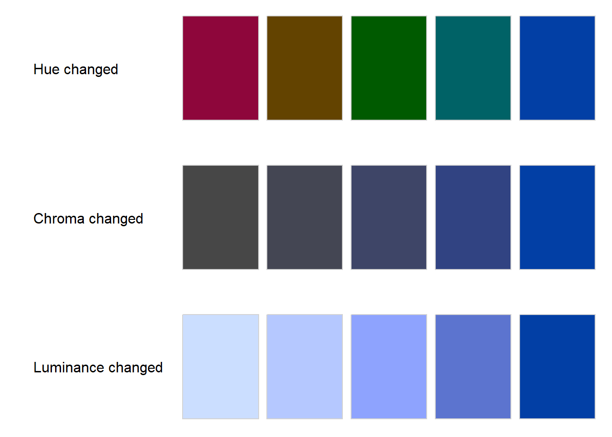

In addition the grid on the y-axis does not add to the interpretability of the plot and should therefore be removed ` theme(panel.grid.major.y = element_blank())`. Optionally the counts can be added to the plot (`geom_text(aes(label = count), hjust = -.2)`).


```r
library(ggplot2)
library(colorspace)
q6_counts <- colSums(carsharing[,q6_columns])
q6_data <- data.frame(count = q6_counts, reason = q6_answers)
q6_data$reason <- factor(q6_data$reason, levels = q6_data$reason[order(q6_data$count)])
ggplot(q6_data[order(q6_data$count, decreasing = TRUE),], aes(x = count, y = reason, fill = count)) + 
  geom_bar(stat="identity", show.legend = FALSE) + 
  geom_text(aes(label = count), hjust = -.2) +
  ylab("") + 
  theme_bw() +
  theme(panel.grid.major.y = element_blank()) +
  scale_fill_continuous_sequential(palette = "Blues 2")
```

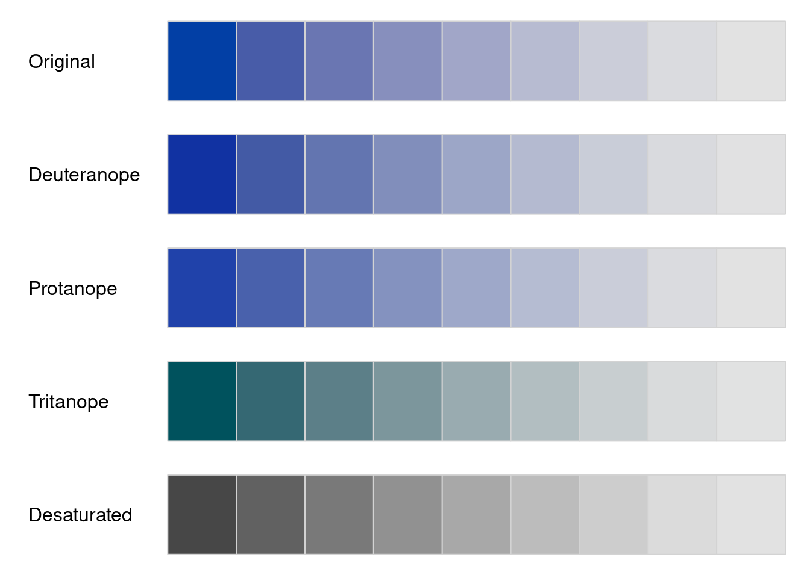

An important aspect when choosing colors for your plots is color vision deficiency (cvd) which affects about 10% of men (and 0.4% of women). 

For our plot we can simulate cvd as follows and observe that it works well even for people with cvd (the colors you use in your projects should work well for people with cvd but you should not include this plot):


```r
swatchplot(hcl.colors(nrow(q6_data), palette = "Blues 2"), cvd = TRUE)
```


If you would like to explore the available colors more check out the `hcl_wizard()` function (or visit [hclwizard.org](https://hclwizard.org)) which launches a small app and lets you choose a color scheme. Once you click on `Return to R` in the app a function which generates the selected colors will be returned.

Another option to visualize multiple choice questions is to plot the percentage of respondents who chose a certain answer (note that this will not generally sum up to 1 if multiple answers are possible). The only thing we have to change is to calculate the shares (careful with the denominator!). In this case we might also want to expand the x-axis to 0.4 (`expand_limits(x = 0.4`) to account for the extra space necessary for the labels.


```r
q6_data$share <- q6_data$count / nrow(carsharing)
ggplot(q6_data[order(q6_data$share, decreasing = TRUE),], aes(x = share, y = reason, fill = share)) + 
  geom_bar(stat="identity", show.legend = FALSE) + 
  geom_text(aes(label = round(share, digits =2)), hjust = -.1) +
  ylab("") + 
  theme_bw() +
  theme(panel.grid.major.y = element_blank()) +
  scale_fill_continuous_sequential(palette = "Blues 2") +
  expand_limits(x = 0.4)
```


#### Rankings 

To visualize the distribution of rankings we can use boxplots. Since 1 is the highest rank and 5 the lowest, we can reverse the y-axis (`scale_y_reverse`).


```r
ggplot(topic_selection, aes(x = topic, y = rank, group = topic)) +
  geom_boxplot() +
  theme_bw() +
  theme(panel.grid.major.x = element_blank(), 
        panel.grid.minor.x = element_blank()) +
  scale_y_reverse()
```

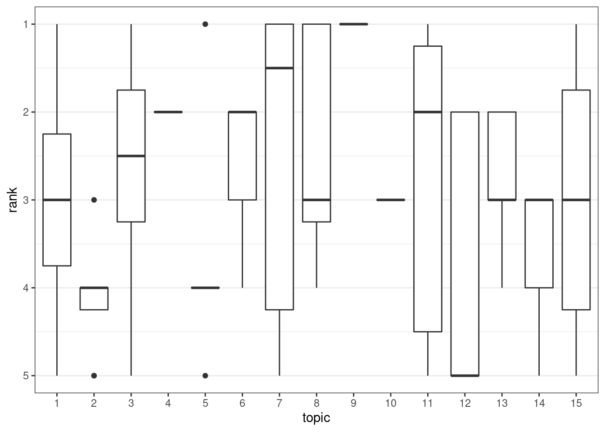

Another way to visualize the rankings is a stacked barplot in which we stack the counts of all ranks. Compared to the barplot in the carsharing example above the colors are now more important since we need them to distinguish the ranks. Therefore, a multi-hue sequential (see `hcl_palettes("sequential multi", plot = TRUE)`) scheme is appropriate. One has to be careful with this type of approach if the number of groups gets larger. It is not easy to find more than 7-8 easily distinguishable colors. In addition we can emphasize the y-grid lines (`panel.grid.major.y = element_line(color="black")`) and make the bars slightly transparent (`alpha = 0.8`) to make it easier to see the counts. 


```r
ggplot(rank_counts, aes(x=topic, y=count, fill=rank)) + 
  geom_bar(stat="identity") +
  theme_bw() +
  scale_y_continuous(breaks = 0:10) +
  theme(panel.grid.minor.y = element_blank(), 
        panel.grid.major.x = element_blank(),
        panel.grid.major.y = element_line(color="black")) +
  scale_fill_discrete_sequential("Inferno", alpha = 0.8) 
```


#### Constant sum 

In many cases we want to assess the relative frequency or share of usage of different products/services. One such case is the share of wallet of different types of grocery providers. 


```r
questions_green_consumption["Q34_1...19"]
```

```
##                                                                                                                                                     Q34_1...19 
## "Where do you usually shop for groceries?\n\n\nPlease allocate 100 points among the different options according to the frequency you shop there. - Discounter"
```

```r
questions_green_consumption["Q34_2"]
```

```
##                                                                                                                                                           Q34_2 
## "Where do you usually shop for groceries?\n\n\nPlease allocate 100 points among the different options according to the frequency you shop there. - Supermarket"
```

```r
questions_green_consumption["Q34_3"]
```

```
##                                                                                                                                                              Q34_3 
## "Where do you usually shop for groceries?\n\n\nPlease allocate 100 points among the different options according to the frequency you shop there. - Farmers market"
```

In this case the searching the names for "Q34" also yields a question that we are not interested in and it is removed when getting the full labels. In addition, we have to distinguish between pre-defined answers and "other" which also has a text field.


```r
shareofwallet_names <- names(green_consumption)[startsWith(names(green_consumption), "Q34")] 
shareofwallet_labels <- questions_green_consumption[shareofwallet_names[-length(shareofwallet_names)]]
shareofwallet_answers <- str_extract(shareofwallet_labels, "(?<=- ).*")
shareofwallet_answers
```

```
## [1] "Discounter"               "Supermarket"             
## [3] "Farmers market"           "Directly from the farmer"
## [5] "Other:"                   "Other: - Text"
```

```r
shareofwallet_data <- green_consumption[, shareofwallet_names[-length(shareofwallet_names)]]
shareofwallet_text <- shareofwallet_data$Q34_5_TEXT
c(na.omit(shareofwallet_text))
```

```
## [1] "Online"                                             
## [2] "Small family owned market"                          
## [3] "Grocery Store"                                      
## [4] "Got Chicken & self made bread from my mother in-law"
## [5] "Online"                                             
## [6] "Small grocery store"                                
## [7] "Organic shops"
```

```r
shareofwallet_data <- na.omit(subset(shareofwallet_data, select = -Q34_5_TEXT))
colnames(shareofwallet_data) <- shareofwallet_answers[-length(shareofwallet_answers)]
shareofwallet_data
```

<div data-pagedtable="false">
  <script data-pagedtable-source type="application/json">
{"columns":[{"label":["Discounter"],"name":[1],"type":["dbl"],"align":["right"]},{"label":["Supermarket"],"name":[2],"type":["dbl"],"align":["right"]},{"label":["Farmers market"],"name":[3],"type":["dbl"],"align":["right"]},{"label":["Directly from the farmer"],"name":[4],"type":["dbl"],"align":["right"]},{"label":["Other:"],"name":[5],"type":["dbl"],"align":["right"]}],"data":[{"1":"0","2":"90","3":"10","4":"0","5":"0"},{"1":"0","2":"50","3":"50","4":"0","5":"0"},{"1":"98","2":"2","3":"0","4":"0","5":"0"},{"1":"30","2":"40","3":"20","4":"10","5":"0"},{"1":"60","2":"20","3":"20","4":"0","5":"0"},{"1":"50","2":"50","3":"0","4":"0","5":"0"},{"1":"10","2":"90","3":"0","4":"0","5":"0"},{"1":"85","2":"15","3":"0","4":"0","5":"0"},{"1":"0","2":"100","3":"0","4":"0","5":"0"},{"1":"100","2":"0","3":"0","4":"0","5":"0"},{"1":"55","2":"30","3":"15","4":"0","5":"0"},{"1":"0","2":"100","3":"0","4":"0","5":"0"},{"1":"0","2":"100","3":"0","4":"0","5":"0"},{"1":"0","2":"100","3":"0","4":"0","5":"0"},{"1":"0","2":"100","3":"0","4":"0","5":"0"},{"1":"80","2":"20","3":"0","4":"0","5":"0"},{"1":"2","2":"1","3":"1","4":"0","5":"0"},{"1":"0","2":"100","3":"0","4":"0","5":"0"},{"1":"40","2":"55","3":"0","4":"5","5":"0"},{"1":"0","2":"100","3":"0","4":"0","5":"0"},{"1":"60","2":"0","3":"0","4":"40","5":"0"},{"1":"0","2":"20","3":"40","4":"10","5":"30"},{"1":"30","2":"70","3":"0","4":"0","5":"0"},{"1":"30","2":"70","3":"0","4":"0","5":"0"},{"1":"20","2":"80","3":"0","4":"0","5":"0"},{"1":"0","2":"100","3":"0","4":"0","5":"0"},{"1":"0","2":"25","3":"25","4":"50","5":"0"},{"1":"100","2":"0","3":"0","4":"0","5":"0"},{"1":"20","2":"70","3":"10","4":"0","5":"0"},{"1":"25","2":"75","3":"0","4":"0","5":"0"},{"1":"0","2":"100","3":"0","4":"0","5":"0"},{"1":"100","2":"0","3":"0","4":"0","5":"0"},{"1":"50","2":"50","3":"0","4":"0","5":"0"},{"1":"30","2":"30","3":"40","4":"0","5":"0"},{"1":"0","2":"90","3":"10","4":"0","5":"0"},{"1":"10","2":"70","3":"10","4":"10","5":"0"},{"1":"1","2":"3","3":"0","4":"0","5":"0"},{"1":"0","2":"100","3":"0","4":"0","5":"0"},{"1":"10","2":"90","3":"0","4":"0","5":"0"},{"1":"15","2":"80","3":"0","4":"5","5":"0"},{"1":"0","2":"70","3":"30","4":"0","5":"0"},{"1":"50","2":"50","3":"0","4":"0","5":"0"},{"1":"20","2":"70","3":"10","4":"0","5":"0"},{"1":"0","2":"90","3":"0","4":"10","5":"0"},{"1":"20","2":"60","3":"20","4":"0","5":"0"},{"1":"40","2":"60","3":"0","4":"0","5":"0"},{"1":"1","2":"2","3":"0","4":"0","5":"0"},{"1":"80","2":"20","3":"0","4":"0","5":"0"},{"1":"70","2":"30","3":"0","4":"0","5":"0"},{"1":"25","2":"70","3":"5","4":"0","5":"0"},{"1":"90","2":"9","3":"1","4":"0","5":"0"},{"1":"20","2":"80","3":"0","4":"0","5":"0"},{"1":"0","2":"90","3":"0","4":"0","5":"0"},{"1":"0","2":"2","3":"0","4":"0","5":"0"},{"1":"50","2":"50","3":"0","4":"0","5":"0"},{"1":"0","2":"99","3":"1","4":"0","5":"0"},{"1":"60","2":"40","3":"0","4":"0","5":"0"},{"1":"70","2":"30","3":"0","4":"0","5":"0"},{"1":"0","2":"100","3":"0","4":"0","5":"0"},{"1":"20","2":"80","3":"0","4":"0","5":"0"},{"1":"80","2":"15","3":"0","4":"5","5":"0"},{"1":"50","2":"50","3":"0","4":"0","5":"0"},{"1":"0","2":"70","3":"30","4":"0","5":"0"},{"1":"20","2":"80","3":"0","4":"0","5":"0"},{"1":"80","2":"20","3":"0","4":"0","5":"0"},{"1":"20","2":"70","3":"0","4":"10","5":"0"},{"1":"40","2":"60","3":"0","4":"0","5":"0"},{"1":"80","2":"20","3":"0","4":"0","5":"0"},{"1":"90","2":"10","3":"0","4":"0","5":"0"},{"1":"0","2":"100","3":"0","4":"0","5":"0"},{"1":"30","2":"70","3":"0","4":"0","5":"0"},{"1":"0","2":"100","3":"0","4":"0","5":"0"},{"1":"80","2":"20","3":"0","4":"0","5":"0"},{"1":"10","2":"10","3":"70","4":"5","5":"5"},{"1":"30","2":"70","3":"0","4":"0","5":"0"},{"1":"0","2":"80","3":"20","4":"0","5":"0"},{"1":"0","2":"80","3":"20","4":"0","5":"0"},{"1":"0","2":"100","3":"0","4":"0","5":"0"},{"1":"10","2":"50","3":"20","4":"20","5":"0"},{"1":"0","2":"90","3":"10","4":"0","5":"0"},{"1":"60","2":"40","3":"0","4":"0","5":"0"},{"1":"0","2":"100","3":"0","4":"0","5":"0"},{"1":"0","2":"10","3":"0","4":"0","5":"90"},{"1":"30","2":"70","3":"0","4":"0","5":"0"},{"1":"30","2":"40","3":"20","4":"0","5":"10"},{"1":"0","2":"100","3":"0","4":"0","5":"0"},{"1":"0","2":"90","3":"10","4":"0","5":"0"},{"1":"0","2":"1","3":"1","4":"0","5":"0"},{"1":"0","2":"100","3":"0","4":"0","5":"0"},{"1":"0","2":"100","3":"0","4":"0","5":"0"},{"1":"0","2":"40","3":"60","4":"0","5":"0"},{"1":"0","2":"20","3":"80","4":"0","5":"0"},{"1":"30","2":"40","3":"20","4":"10","5":"0"},{"1":"0","2":"100","3":"0","4":"0","5":"0"},{"1":"0","2":"100","3":"0","4":"0","5":"0"},{"1":"0","2":"90","3":"10","4":"0","5":"0"},{"1":"90","2":"10","3":"0","4":"0","5":"0"},{"1":"0","2":"90","3":"10","4":"0","5":"0"},{"1":"0","2":"1","3":"0","4":"0","5":"0"},{"1":"0","2":"0","3":"0","4":"0","5":"0"},{"1":"0","2":"80","3":"0","4":"20","5":"0"},{"1":"0","2":"100","3":"0","4":"0","5":"0"},{"1":"49","2":"50","3":"0","4":"1","5":"0"},{"1":"0","2":"100","3":"0","4":"0","5":"0"},{"1":"40","2":"60","3":"0","4":"0","5":"0"},{"1":"0","2":"0","3":"0","4":"0","5":"0"},{"1":"80","2":"20","3":"0","4":"0","5":"0"},{"1":"0","2":"100","3":"0","4":"0","5":"0"},{"1":"5","2":"60","3":"35","4":"0","5":"0"},{"1":"20","2":"30","3":"50","4":"0","5":"0"},{"1":"20","2":"70","3":"10","4":"0","5":"0"},{"1":"60","2":"30","3":"10","4":"0","5":"0"},{"1":"10","2":"50","3":"40","4":"0","5":"0"},{"1":"0","2":"0","3":"0","4":"0","5":"0"},{"1":"0","2":"50","3":"0","4":"0","5":"50"},{"1":"80","2":"20","3":"0","4":"0","5":"0"},{"1":"70","2":"5","3":"0","4":"5","5":"20"},{"1":"30","2":"50","3":"10","4":"10","5":"0"},{"1":"0","2":"2","3":"0","4":"0","5":"0"},{"1":"50","2":"50","3":"0","4":"0","5":"0"},{"1":"0","2":"80","3":"0","4":"20","5":"0"},{"1":"0","2":"100","3":"0","4":"0","5":"0"},{"1":"0","2":"100","3":"0","4":"0","5":"0"},{"1":"0","2":"100","3":"0","4":"0","5":"0"},{"1":"0","2":"40","3":"20","4":"40","5":"0"},{"1":"0","2":"100","3":"0","4":"0","5":"0"},{"1":"20","2":"80","3":"0","4":"0","5":"0"},{"1":"10","2":"80","3":"10","4":"0","5":"0"},{"1":"0","2":"100","3":"0","4":"0","5":"0"},{"1":"0","2":"100","3":"0","4":"0","5":"0"},{"1":"20","2":"80","3":"0","4":"0","5":"0"},{"1":"55","2":"30","3":"15","4":"0","5":"0"},{"1":"0","2":"100","3":"0","4":"0","5":"0"},{"1":"0","2":"100","3":"0","4":"0","5":"0"},{"1":"0","2":"20","3":"10","4":"50","5":"20"},{"1":"70","2":"30","3":"0","4":"0","5":"0"},{"1":"0","2":"40","3":"20","4":"40","5":"0"},{"1":"0","2":"25","3":"25","4":"50","5":"0"},{"1":"0","2":"90","3":"10","4":"0","5":"0"},{"1":"0","2":"90","3":"10","4":"0","5":"0"},{"1":"40","2":"60","3":"0","4":"0","5":"0"},{"1":"80","2":"20","3":"0","4":"0","5":"0"},{"1":"20","2":"60","3":"20","4":"0","5":"0"},{"1":"0","2":"100","3":"0","4":"0","5":"0"},{"1":"80","2":"20","3":"0","4":"0","5":"0"},{"1":"0","2":"0","3":"0","4":"0","5":"0"},{"1":"0","2":"100","3":"0","4":"0","5":"0"},{"1":"0","2":"100","3":"0","4":"0","5":"0"},{"1":"30","2":"50","3":"20","4":"0","5":"0"},{"1":"2","2":"1","3":"0","4":"0","5":"0"},{"1":"10","2":"80","3":"10","4":"0","5":"0"},{"1":"0","2":"100","3":"0","4":"0","5":"0"},{"1":"0","2":"80","3":"20","4":"0","5":"0"},{"1":"0","2":"100","3":"0","4":"0","5":"0"},{"1":"0","2":"1","3":"3","4":"0","5":"0"},{"1":"0","2":"80","3":"20","4":"0","5":"0"},{"1":"5","2":"35","3":"40","4":"20","5":"0"},{"1":"0","2":"100","3":"0","4":"0","5":"0"},{"1":"0","2":"80","3":"100","4":"0","5":"0"},{"1":"0","2":"80","3":"0","4":"20","5":"0"},{"1":"0","2":"1","3":"0","4":"0","5":"0"},{"1":"0","2":"0","3":"0","4":"0","5":"0"},{"1":"30","2":"70","3":"0","4":"0","5":"0"},{"1":"30","2":"60","3":"10","4":"0","5":"0"},{"1":"0","2":"50","3":"0","4":"0","5":"50"},{"1":"20","2":"80","3":"0","4":"0","5":"0"},{"1":"10","2":"70","3":"20","4":"0","5":"0"},{"1":"0","2":"50","3":"90","4":"0","5":"0"},{"1":"30","2":"50","3":"10","4":"10","5":"0"},{"1":"0","2":"80","3":"20","4":"0","5":"0"},{"1":"25","2":"70","3":"5","4":"0","5":"0"},{"1":"0","2":"80","3":"0","4":"0","5":"0"},{"1":"2","2":"1","3":"1","4":"0","5":"0"},{"1":"0","2":"2","3":"0","4":"0","5":"0"},{"1":"5","2":"40","3":"40","4":"15","5":"0"},{"1":"30","2":"40","3":"30","4":"0","5":"0"},{"1":"0","2":"2","3":"0","4":"0","5":"2"},{"1":"0","2":"0","3":"0","4":"0","5":"0"},{"1":"0","2":"80","3":"0","4":"0","5":"0"},{"1":"50","2":"50","3":"0","4":"0","5":"0"},{"1":"50","2":"50","3":"0","4":"0","5":"0"},{"1":"0","2":"60","3":"0","4":"40","5":"0"},{"1":"0","2":"60","3":"0","4":"40","5":"0"},{"1":"20","2":"80","3":"0","4":"0","5":"0"},{"1":"20","2":"80","3":"0","4":"0","5":"0"},{"1":"0","2":"100","3":"0","4":"0","5":"0"},{"1":"40","2":"60","3":"0","4":"0","5":"0"},{"1":"0","2":"0","3":"0","4":"0","5":"0"},{"1":"0","2":"99","3":"1","4":"0","5":"0"},{"1":"0","2":"0","3":"0","4":"0","5":"0"},{"1":"50","2":"50","3":"0","4":"0","5":"0"},{"1":"75","2":"20","3":"0","4":"5","5":"0"},{"1":"0","2":"50","3":"25","4":"25","5":"0"},{"1":"20","2":"70","3":"10","4":"0","5":"0"},{"1":"0","2":"2","3":"3","4":"1","5":"0"},{"1":"20","2":"80","3":"0","4":"0","5":"0"},{"1":"0","2":"90","3":"10","4":"0","5":"0"},{"1":"80","2":"10","3":"0","4":"10","5":"0"},{"1":"0","2":"80","3":"20","4":"0","5":"0"},{"1":"20","2":"60","3":"20","4":"0","5":"0"},{"1":"0","2":"60","3":"20","4":"20","5":"0"},{"1":"0","2":"80","3":"0","4":"20","5":"0"},{"1":"20","2":"80","3":"0","4":"0","5":"0"},{"1":"50","2":"50","3":"0","4":"0","5":"0"},{"1":"0","2":"100","3":"0","4":"0","5":"0"},{"1":"80","2":"20","3":"0","4":"0","5":"0"},{"1":"50","2":"35","3":"0","4":"15","5":"0"},{"1":"0","2":"100","3":"0","4":"0","5":"0"},{"1":"0","2":"80","3":"10","4":"10","5":"0"},{"1":"0","2":"80","3":"20","4":"0","5":"0"},{"1":"60","2":"40","3":"0","4":"0","5":"0"},{"1":"0","2":"1","3":"0","4":"0","5":"0"},{"1":"20","2":"80","3":"0","4":"0","5":"0"},{"1":"50","2":"100","3":"0","4":"0","5":"0"}],"options":{"columns":{"min":{},"max":[10]},"rows":{"min":[10],"max":[10]},"pages":{}}}
  </script>
</div>

First we can take a look at the correlation of the points allocated to different types. In this case a diverging color scheme is appropriate.


```r
library(ggcorrplot)
colors <- hcl.colors(3, palette = "Blue-Yellow")
ggcorrplot(cor(shareofwallet_data), lab = TRUE, colors = colors)
```


For easier plotting of distributions we should transform the data to a long format and remove the `:` from `Other:`.


```r
shareofwallet_data <- pivot_longer(shareofwallet_data, cols = everything(), names_to = "type", values_to = "points")
shareofwallet_data$type <- str_remove(shareofwallet_data$type, ":")
shareofwallet_data
```

<div data-pagedtable="false">
  <script data-pagedtable-source type="application/json">
{"columns":[{"label":["type"],"name":[1],"type":["chr"],"align":["left"]},{"label":["points"],"name":[2],"type":["dbl"],"align":["right"]}],"data":[{"1":"Discounter","2":"0"},{"1":"Supermarket","2":"90"},{"1":"Farmers market","2":"10"},{"1":"Directly from the farmer","2":"0"},{"1":"Other","2":"0"},{"1":"Discounter","2":"0"},{"1":"Supermarket","2":"50"},{"1":"Farmers market","2":"50"},{"1":"Directly from the farmer","2":"0"},{"1":"Other","2":"0"},{"1":"Discounter","2":"98"},{"1":"Supermarket","2":"2"},{"1":"Farmers market","2":"0"},{"1":"Directly from the farmer","2":"0"},{"1":"Other","2":"0"},{"1":"Discounter","2":"30"},{"1":"Supermarket","2":"40"},{"1":"Farmers market","2":"20"},{"1":"Directly from the farmer","2":"10"},{"1":"Other","2":"0"},{"1":"Discounter","2":"60"},{"1":"Supermarket","2":"20"},{"1":"Farmers market","2":"20"},{"1":"Directly from the farmer","2":"0"},{"1":"Other","2":"0"},{"1":"Discounter","2":"50"},{"1":"Supermarket","2":"50"},{"1":"Farmers market","2":"0"},{"1":"Directly from the farmer","2":"0"},{"1":"Other","2":"0"},{"1":"Discounter","2":"10"},{"1":"Supermarket","2":"90"},{"1":"Farmers market","2":"0"},{"1":"Directly from the farmer","2":"0"},{"1":"Other","2":"0"},{"1":"Discounter","2":"85"},{"1":"Supermarket","2":"15"},{"1":"Farmers market","2":"0"},{"1":"Directly from the farmer","2":"0"},{"1":"Other","2":"0"},{"1":"Discounter","2":"0"},{"1":"Supermarket","2":"100"},{"1":"Farmers market","2":"0"},{"1":"Directly from the farmer","2":"0"},{"1":"Other","2":"0"},{"1":"Discounter","2":"100"},{"1":"Supermarket","2":"0"},{"1":"Farmers market","2":"0"},{"1":"Directly from the farmer","2":"0"},{"1":"Other","2":"0"},{"1":"Discounter","2":"55"},{"1":"Supermarket","2":"30"},{"1":"Farmers market","2":"15"},{"1":"Directly from the farmer","2":"0"},{"1":"Other","2":"0"},{"1":"Discounter","2":"0"},{"1":"Supermarket","2":"100"},{"1":"Farmers market","2":"0"},{"1":"Directly from the farmer","2":"0"},{"1":"Other","2":"0"},{"1":"Discounter","2":"0"},{"1":"Supermarket","2":"100"},{"1":"Farmers market","2":"0"},{"1":"Directly from the farmer","2":"0"},{"1":"Other","2":"0"},{"1":"Discounter","2":"0"},{"1":"Supermarket","2":"100"},{"1":"Farmers market","2":"0"},{"1":"Directly from the farmer","2":"0"},{"1":"Other","2":"0"},{"1":"Discounter","2":"0"},{"1":"Supermarket","2":"100"},{"1":"Farmers market","2":"0"},{"1":"Directly from the farmer","2":"0"},{"1":"Other","2":"0"},{"1":"Discounter","2":"80"},{"1":"Supermarket","2":"20"},{"1":"Farmers market","2":"0"},{"1":"Directly from the farmer","2":"0"},{"1":"Other","2":"0"},{"1":"Discounter","2":"2"},{"1":"Supermarket","2":"1"},{"1":"Farmers market","2":"1"},{"1":"Directly from the farmer","2":"0"},{"1":"Other","2":"0"},{"1":"Discounter","2":"0"},{"1":"Supermarket","2":"100"},{"1":"Farmers market","2":"0"},{"1":"Directly from the farmer","2":"0"},{"1":"Other","2":"0"},{"1":"Discounter","2":"40"},{"1":"Supermarket","2":"55"},{"1":"Farmers market","2":"0"},{"1":"Directly from the farmer","2":"5"},{"1":"Other","2":"0"},{"1":"Discounter","2":"0"},{"1":"Supermarket","2":"100"},{"1":"Farmers market","2":"0"},{"1":"Directly from the farmer","2":"0"},{"1":"Other","2":"0"},{"1":"Discounter","2":"60"},{"1":"Supermarket","2":"0"},{"1":"Farmers market","2":"0"},{"1":"Directly from the farmer","2":"40"},{"1":"Other","2":"0"},{"1":"Discounter","2":"0"},{"1":"Supermarket","2":"20"},{"1":"Farmers market","2":"40"},{"1":"Directly from the farmer","2":"10"},{"1":"Other","2":"30"},{"1":"Discounter","2":"30"},{"1":"Supermarket","2":"70"},{"1":"Farmers market","2":"0"},{"1":"Directly from the farmer","2":"0"},{"1":"Other","2":"0"},{"1":"Discounter","2":"30"},{"1":"Supermarket","2":"70"},{"1":"Farmers market","2":"0"},{"1":"Directly from the farmer","2":"0"},{"1":"Other","2":"0"},{"1":"Discounter","2":"20"},{"1":"Supermarket","2":"80"},{"1":"Farmers market","2":"0"},{"1":"Directly from the farmer","2":"0"},{"1":"Other","2":"0"},{"1":"Discounter","2":"0"},{"1":"Supermarket","2":"100"},{"1":"Farmers market","2":"0"},{"1":"Directly from the farmer","2":"0"},{"1":"Other","2":"0"},{"1":"Discounter","2":"0"},{"1":"Supermarket","2":"25"},{"1":"Farmers market","2":"25"},{"1":"Directly from the farmer","2":"50"},{"1":"Other","2":"0"},{"1":"Discounter","2":"100"},{"1":"Supermarket","2":"0"},{"1":"Farmers market","2":"0"},{"1":"Directly from the farmer","2":"0"},{"1":"Other","2":"0"},{"1":"Discounter","2":"20"},{"1":"Supermarket","2":"70"},{"1":"Farmers market","2":"10"},{"1":"Directly from the farmer","2":"0"},{"1":"Other","2":"0"},{"1":"Discounter","2":"25"},{"1":"Supermarket","2":"75"},{"1":"Farmers market","2":"0"},{"1":"Directly from the farmer","2":"0"},{"1":"Other","2":"0"},{"1":"Discounter","2":"0"},{"1":"Supermarket","2":"100"},{"1":"Farmers market","2":"0"},{"1":"Directly from the farmer","2":"0"},{"1":"Other","2":"0"},{"1":"Discounter","2":"100"},{"1":"Supermarket","2":"0"},{"1":"Farmers market","2":"0"},{"1":"Directly from the farmer","2":"0"},{"1":"Other","2":"0"},{"1":"Discounter","2":"50"},{"1":"Supermarket","2":"50"},{"1":"Farmers market","2":"0"},{"1":"Directly from the farmer","2":"0"},{"1":"Other","2":"0"},{"1":"Discounter","2":"30"},{"1":"Supermarket","2":"30"},{"1":"Farmers market","2":"40"},{"1":"Directly from the farmer","2":"0"},{"1":"Other","2":"0"},{"1":"Discounter","2":"0"},{"1":"Supermarket","2":"90"},{"1":"Farmers market","2":"10"},{"1":"Directly from the farmer","2":"0"},{"1":"Other","2":"0"},{"1":"Discounter","2":"10"},{"1":"Supermarket","2":"70"},{"1":"Farmers market","2":"10"},{"1":"Directly from the farmer","2":"10"},{"1":"Other","2":"0"},{"1":"Discounter","2":"1"},{"1":"Supermarket","2":"3"},{"1":"Farmers market","2":"0"},{"1":"Directly from the farmer","2":"0"},{"1":"Other","2":"0"},{"1":"Discounter","2":"0"},{"1":"Supermarket","2":"100"},{"1":"Farmers market","2":"0"},{"1":"Directly from the farmer","2":"0"},{"1":"Other","2":"0"},{"1":"Discounter","2":"10"},{"1":"Supermarket","2":"90"},{"1":"Farmers market","2":"0"},{"1":"Directly from the farmer","2":"0"},{"1":"Other","2":"0"},{"1":"Discounter","2":"15"},{"1":"Supermarket","2":"80"},{"1":"Farmers market","2":"0"},{"1":"Directly from the farmer","2":"5"},{"1":"Other","2":"0"},{"1":"Discounter","2":"0"},{"1":"Supermarket","2":"70"},{"1":"Farmers market","2":"30"},{"1":"Directly from the farmer","2":"0"},{"1":"Other","2":"0"},{"1":"Discounter","2":"50"},{"1":"Supermarket","2":"50"},{"1":"Farmers market","2":"0"},{"1":"Directly from the farmer","2":"0"},{"1":"Other","2":"0"},{"1":"Discounter","2":"20"},{"1":"Supermarket","2":"70"},{"1":"Farmers market","2":"10"},{"1":"Directly from the farmer","2":"0"},{"1":"Other","2":"0"},{"1":"Discounter","2":"0"},{"1":"Supermarket","2":"90"},{"1":"Farmers market","2":"0"},{"1":"Directly from the farmer","2":"10"},{"1":"Other","2":"0"},{"1":"Discounter","2":"20"},{"1":"Supermarket","2":"60"},{"1":"Farmers market","2":"20"},{"1":"Directly from the farmer","2":"0"},{"1":"Other","2":"0"},{"1":"Discounter","2":"40"},{"1":"Supermarket","2":"60"},{"1":"Farmers market","2":"0"},{"1":"Directly from the farmer","2":"0"},{"1":"Other","2":"0"},{"1":"Discounter","2":"1"},{"1":"Supermarket","2":"2"},{"1":"Farmers market","2":"0"},{"1":"Directly from the farmer","2":"0"},{"1":"Other","2":"0"},{"1":"Discounter","2":"80"},{"1":"Supermarket","2":"20"},{"1":"Farmers market","2":"0"},{"1":"Directly from the farmer","2":"0"},{"1":"Other","2":"0"},{"1":"Discounter","2":"70"},{"1":"Supermarket","2":"30"},{"1":"Farmers market","2":"0"},{"1":"Directly from the farmer","2":"0"},{"1":"Other","2":"0"},{"1":"Discounter","2":"25"},{"1":"Supermarket","2":"70"},{"1":"Farmers market","2":"5"},{"1":"Directly from the farmer","2":"0"},{"1":"Other","2":"0"},{"1":"Discounter","2":"90"},{"1":"Supermarket","2":"9"},{"1":"Farmers market","2":"1"},{"1":"Directly from the farmer","2":"0"},{"1":"Other","2":"0"},{"1":"Discounter","2":"20"},{"1":"Supermarket","2":"80"},{"1":"Farmers market","2":"0"},{"1":"Directly from the farmer","2":"0"},{"1":"Other","2":"0"},{"1":"Discounter","2":"0"},{"1":"Supermarket","2":"90"},{"1":"Farmers market","2":"0"},{"1":"Directly from the farmer","2":"0"},{"1":"Other","2":"0"},{"1":"Discounter","2":"0"},{"1":"Supermarket","2":"2"},{"1":"Farmers market","2":"0"},{"1":"Directly from the farmer","2":"0"},{"1":"Other","2":"0"},{"1":"Discounter","2":"50"},{"1":"Supermarket","2":"50"},{"1":"Farmers market","2":"0"},{"1":"Directly from the farmer","2":"0"},{"1":"Other","2":"0"},{"1":"Discounter","2":"0"},{"1":"Supermarket","2":"99"},{"1":"Farmers market","2":"1"},{"1":"Directly from the farmer","2":"0"},{"1":"Other","2":"0"},{"1":"Discounter","2":"60"},{"1":"Supermarket","2":"40"},{"1":"Farmers market","2":"0"},{"1":"Directly from the farmer","2":"0"},{"1":"Other","2":"0"},{"1":"Discounter","2":"70"},{"1":"Supermarket","2":"30"},{"1":"Farmers market","2":"0"},{"1":"Directly from the farmer","2":"0"},{"1":"Other","2":"0"},{"1":"Discounter","2":"0"},{"1":"Supermarket","2":"100"},{"1":"Farmers market","2":"0"},{"1":"Directly from the farmer","2":"0"},{"1":"Other","2":"0"},{"1":"Discounter","2":"20"},{"1":"Supermarket","2":"80"},{"1":"Farmers market","2":"0"},{"1":"Directly from the farmer","2":"0"},{"1":"Other","2":"0"},{"1":"Discounter","2":"80"},{"1":"Supermarket","2":"15"},{"1":"Farmers market","2":"0"},{"1":"Directly from the farmer","2":"5"},{"1":"Other","2":"0"},{"1":"Discounter","2":"50"},{"1":"Supermarket","2":"50"},{"1":"Farmers market","2":"0"},{"1":"Directly from the farmer","2":"0"},{"1":"Other","2":"0"},{"1":"Discounter","2":"0"},{"1":"Supermarket","2":"70"},{"1":"Farmers market","2":"30"},{"1":"Directly from the farmer","2":"0"},{"1":"Other","2":"0"},{"1":"Discounter","2":"20"},{"1":"Supermarket","2":"80"},{"1":"Farmers market","2":"0"},{"1":"Directly from the farmer","2":"0"},{"1":"Other","2":"0"},{"1":"Discounter","2":"80"},{"1":"Supermarket","2":"20"},{"1":"Farmers market","2":"0"},{"1":"Directly from the farmer","2":"0"},{"1":"Other","2":"0"},{"1":"Discounter","2":"20"},{"1":"Supermarket","2":"70"},{"1":"Farmers market","2":"0"},{"1":"Directly from the farmer","2":"10"},{"1":"Other","2":"0"},{"1":"Discounter","2":"40"},{"1":"Supermarket","2":"60"},{"1":"Farmers market","2":"0"},{"1":"Directly from the farmer","2":"0"},{"1":"Other","2":"0"},{"1":"Discounter","2":"80"},{"1":"Supermarket","2":"20"},{"1":"Farmers market","2":"0"},{"1":"Directly from the farmer","2":"0"},{"1":"Other","2":"0"},{"1":"Discounter","2":"90"},{"1":"Supermarket","2":"10"},{"1":"Farmers market","2":"0"},{"1":"Directly from the farmer","2":"0"},{"1":"Other","2":"0"},{"1":"Discounter","2":"0"},{"1":"Supermarket","2":"100"},{"1":"Farmers market","2":"0"},{"1":"Directly from the farmer","2":"0"},{"1":"Other","2":"0"},{"1":"Discounter","2":"30"},{"1":"Supermarket","2":"70"},{"1":"Farmers market","2":"0"},{"1":"Directly from the farmer","2":"0"},{"1":"Other","2":"0"},{"1":"Discounter","2":"0"},{"1":"Supermarket","2":"100"},{"1":"Farmers market","2":"0"},{"1":"Directly from the farmer","2":"0"},{"1":"Other","2":"0"},{"1":"Discounter","2":"80"},{"1":"Supermarket","2":"20"},{"1":"Farmers market","2":"0"},{"1":"Directly from the farmer","2":"0"},{"1":"Other","2":"0"},{"1":"Discounter","2":"10"},{"1":"Supermarket","2":"10"},{"1":"Farmers market","2":"70"},{"1":"Directly from the farmer","2":"5"},{"1":"Other","2":"5"},{"1":"Discounter","2":"30"},{"1":"Supermarket","2":"70"},{"1":"Farmers market","2":"0"},{"1":"Directly from the farmer","2":"0"},{"1":"Other","2":"0"},{"1":"Discounter","2":"0"},{"1":"Supermarket","2":"80"},{"1":"Farmers market","2":"20"},{"1":"Directly from the farmer","2":"0"},{"1":"Other","2":"0"},{"1":"Discounter","2":"0"},{"1":"Supermarket","2":"80"},{"1":"Farmers market","2":"20"},{"1":"Directly from the farmer","2":"0"},{"1":"Other","2":"0"},{"1":"Discounter","2":"0"},{"1":"Supermarket","2":"100"},{"1":"Farmers market","2":"0"},{"1":"Directly from the farmer","2":"0"},{"1":"Other","2":"0"},{"1":"Discounter","2":"10"},{"1":"Supermarket","2":"50"},{"1":"Farmers market","2":"20"},{"1":"Directly from the farmer","2":"20"},{"1":"Other","2":"0"},{"1":"Discounter","2":"0"},{"1":"Supermarket","2":"90"},{"1":"Farmers market","2":"10"},{"1":"Directly from the farmer","2":"0"},{"1":"Other","2":"0"},{"1":"Discounter","2":"60"},{"1":"Supermarket","2":"40"},{"1":"Farmers market","2":"0"},{"1":"Directly from the farmer","2":"0"},{"1":"Other","2":"0"},{"1":"Discounter","2":"0"},{"1":"Supermarket","2":"100"},{"1":"Farmers market","2":"0"},{"1":"Directly from the farmer","2":"0"},{"1":"Other","2":"0"},{"1":"Discounter","2":"0"},{"1":"Supermarket","2":"10"},{"1":"Farmers market","2":"0"},{"1":"Directly from the farmer","2":"0"},{"1":"Other","2":"90"},{"1":"Discounter","2":"30"},{"1":"Supermarket","2":"70"},{"1":"Farmers market","2":"0"},{"1":"Directly from the farmer","2":"0"},{"1":"Other","2":"0"},{"1":"Discounter","2":"30"},{"1":"Supermarket","2":"40"},{"1":"Farmers market","2":"20"},{"1":"Directly from the farmer","2":"0"},{"1":"Other","2":"10"},{"1":"Discounter","2":"0"},{"1":"Supermarket","2":"100"},{"1":"Farmers market","2":"0"},{"1":"Directly from the farmer","2":"0"},{"1":"Other","2":"0"},{"1":"Discounter","2":"0"},{"1":"Supermarket","2":"90"},{"1":"Farmers market","2":"10"},{"1":"Directly from the farmer","2":"0"},{"1":"Other","2":"0"},{"1":"Discounter","2":"0"},{"1":"Supermarket","2":"1"},{"1":"Farmers market","2":"1"},{"1":"Directly from the farmer","2":"0"},{"1":"Other","2":"0"},{"1":"Discounter","2":"0"},{"1":"Supermarket","2":"100"},{"1":"Farmers market","2":"0"},{"1":"Directly from the farmer","2":"0"},{"1":"Other","2":"0"},{"1":"Discounter","2":"0"},{"1":"Supermarket","2":"100"},{"1":"Farmers market","2":"0"},{"1":"Directly from the farmer","2":"0"},{"1":"Other","2":"0"},{"1":"Discounter","2":"0"},{"1":"Supermarket","2":"40"},{"1":"Farmers market","2":"60"},{"1":"Directly from the farmer","2":"0"},{"1":"Other","2":"0"},{"1":"Discounter","2":"0"},{"1":"Supermarket","2":"20"},{"1":"Farmers market","2":"80"},{"1":"Directly from the farmer","2":"0"},{"1":"Other","2":"0"},{"1":"Discounter","2":"30"},{"1":"Supermarket","2":"40"},{"1":"Farmers market","2":"20"},{"1":"Directly from the farmer","2":"10"},{"1":"Other","2":"0"},{"1":"Discounter","2":"0"},{"1":"Supermarket","2":"100"},{"1":"Farmers market","2":"0"},{"1":"Directly from the farmer","2":"0"},{"1":"Other","2":"0"},{"1":"Discounter","2":"0"},{"1":"Supermarket","2":"100"},{"1":"Farmers market","2":"0"},{"1":"Directly from the farmer","2":"0"},{"1":"Other","2":"0"},{"1":"Discounter","2":"0"},{"1":"Supermarket","2":"90"},{"1":"Farmers market","2":"10"},{"1":"Directly from the farmer","2":"0"},{"1":"Other","2":"0"},{"1":"Discounter","2":"90"},{"1":"Supermarket","2":"10"},{"1":"Farmers market","2":"0"},{"1":"Directly from the farmer","2":"0"},{"1":"Other","2":"0"},{"1":"Discounter","2":"0"},{"1":"Supermarket","2":"90"},{"1":"Farmers market","2":"10"},{"1":"Directly from the farmer","2":"0"},{"1":"Other","2":"0"},{"1":"Discounter","2":"0"},{"1":"Supermarket","2":"1"},{"1":"Farmers market","2":"0"},{"1":"Directly from the farmer","2":"0"},{"1":"Other","2":"0"},{"1":"Discounter","2":"0"},{"1":"Supermarket","2":"0"},{"1":"Farmers market","2":"0"},{"1":"Directly from the farmer","2":"0"},{"1":"Other","2":"0"},{"1":"Discounter","2":"0"},{"1":"Supermarket","2":"80"},{"1":"Farmers market","2":"0"},{"1":"Directly from the farmer","2":"20"},{"1":"Other","2":"0"},{"1":"Discounter","2":"0"},{"1":"Supermarket","2":"100"},{"1":"Farmers market","2":"0"},{"1":"Directly from the farmer","2":"0"},{"1":"Other","2":"0"},{"1":"Discounter","2":"49"},{"1":"Supermarket","2":"50"},{"1":"Farmers market","2":"0"},{"1":"Directly from the farmer","2":"1"},{"1":"Other","2":"0"},{"1":"Discounter","2":"0"},{"1":"Supermarket","2":"100"},{"1":"Farmers market","2":"0"},{"1":"Directly from the farmer","2":"0"},{"1":"Other","2":"0"},{"1":"Discounter","2":"40"},{"1":"Supermarket","2":"60"},{"1":"Farmers market","2":"0"},{"1":"Directly from the farmer","2":"0"},{"1":"Other","2":"0"},{"1":"Discounter","2":"0"},{"1":"Supermarket","2":"0"},{"1":"Farmers market","2":"0"},{"1":"Directly from the farmer","2":"0"},{"1":"Other","2":"0"},{"1":"Discounter","2":"80"},{"1":"Supermarket","2":"20"},{"1":"Farmers market","2":"0"},{"1":"Directly from the farmer","2":"0"},{"1":"Other","2":"0"},{"1":"Discounter","2":"0"},{"1":"Supermarket","2":"100"},{"1":"Farmers market","2":"0"},{"1":"Directly from the farmer","2":"0"},{"1":"Other","2":"0"},{"1":"Discounter","2":"5"},{"1":"Supermarket","2":"60"},{"1":"Farmers market","2":"35"},{"1":"Directly from the farmer","2":"0"},{"1":"Other","2":"0"},{"1":"Discounter","2":"20"},{"1":"Supermarket","2":"30"},{"1":"Farmers market","2":"50"},{"1":"Directly from the farmer","2":"0"},{"1":"Other","2":"0"},{"1":"Discounter","2":"20"},{"1":"Supermarket","2":"70"},{"1":"Farmers market","2":"10"},{"1":"Directly from the farmer","2":"0"},{"1":"Other","2":"0"},{"1":"Discounter","2":"60"},{"1":"Supermarket","2":"30"},{"1":"Farmers market","2":"10"},{"1":"Directly from the farmer","2":"0"},{"1":"Other","2":"0"},{"1":"Discounter","2":"10"},{"1":"Supermarket","2":"50"},{"1":"Farmers market","2":"40"},{"1":"Directly from the farmer","2":"0"},{"1":"Other","2":"0"},{"1":"Discounter","2":"0"},{"1":"Supermarket","2":"0"},{"1":"Farmers market","2":"0"},{"1":"Directly from the farmer","2":"0"},{"1":"Other","2":"0"},{"1":"Discounter","2":"0"},{"1":"Supermarket","2":"50"},{"1":"Farmers market","2":"0"},{"1":"Directly from the farmer","2":"0"},{"1":"Other","2":"50"},{"1":"Discounter","2":"80"},{"1":"Supermarket","2":"20"},{"1":"Farmers market","2":"0"},{"1":"Directly from the farmer","2":"0"},{"1":"Other","2":"0"},{"1":"Discounter","2":"70"},{"1":"Supermarket","2":"5"},{"1":"Farmers market","2":"0"},{"1":"Directly from the farmer","2":"5"},{"1":"Other","2":"20"},{"1":"Discounter","2":"30"},{"1":"Supermarket","2":"50"},{"1":"Farmers market","2":"10"},{"1":"Directly from the farmer","2":"10"},{"1":"Other","2":"0"},{"1":"Discounter","2":"0"},{"1":"Supermarket","2":"2"},{"1":"Farmers market","2":"0"},{"1":"Directly from the farmer","2":"0"},{"1":"Other","2":"0"},{"1":"Discounter","2":"50"},{"1":"Supermarket","2":"50"},{"1":"Farmers market","2":"0"},{"1":"Directly from the farmer","2":"0"},{"1":"Other","2":"0"},{"1":"Discounter","2":"0"},{"1":"Supermarket","2":"80"},{"1":"Farmers market","2":"0"},{"1":"Directly from the farmer","2":"20"},{"1":"Other","2":"0"},{"1":"Discounter","2":"0"},{"1":"Supermarket","2":"100"},{"1":"Farmers market","2":"0"},{"1":"Directly from the farmer","2":"0"},{"1":"Other","2":"0"},{"1":"Discounter","2":"0"},{"1":"Supermarket","2":"100"},{"1":"Farmers market","2":"0"},{"1":"Directly from the farmer","2":"0"},{"1":"Other","2":"0"},{"1":"Discounter","2":"0"},{"1":"Supermarket","2":"100"},{"1":"Farmers market","2":"0"},{"1":"Directly from the farmer","2":"0"},{"1":"Other","2":"0"},{"1":"Discounter","2":"0"},{"1":"Supermarket","2":"40"},{"1":"Farmers market","2":"20"},{"1":"Directly from the farmer","2":"40"},{"1":"Other","2":"0"},{"1":"Discounter","2":"0"},{"1":"Supermarket","2":"100"},{"1":"Farmers market","2":"0"},{"1":"Directly from the farmer","2":"0"},{"1":"Other","2":"0"},{"1":"Discounter","2":"20"},{"1":"Supermarket","2":"80"},{"1":"Farmers market","2":"0"},{"1":"Directly from the farmer","2":"0"},{"1":"Other","2":"0"},{"1":"Discounter","2":"10"},{"1":"Supermarket","2":"80"},{"1":"Farmers market","2":"10"},{"1":"Directly from the farmer","2":"0"},{"1":"Other","2":"0"},{"1":"Discounter","2":"0"},{"1":"Supermarket","2":"100"},{"1":"Farmers market","2":"0"},{"1":"Directly from the farmer","2":"0"},{"1":"Other","2":"0"},{"1":"Discounter","2":"0"},{"1":"Supermarket","2":"100"},{"1":"Farmers market","2":"0"},{"1":"Directly from the farmer","2":"0"},{"1":"Other","2":"0"},{"1":"Discounter","2":"20"},{"1":"Supermarket","2":"80"},{"1":"Farmers market","2":"0"},{"1":"Directly from the farmer","2":"0"},{"1":"Other","2":"0"},{"1":"Discounter","2":"55"},{"1":"Supermarket","2":"30"},{"1":"Farmers market","2":"15"},{"1":"Directly from the farmer","2":"0"},{"1":"Other","2":"0"},{"1":"Discounter","2":"0"},{"1":"Supermarket","2":"100"},{"1":"Farmers market","2":"0"},{"1":"Directly from the farmer","2":"0"},{"1":"Other","2":"0"},{"1":"Discounter","2":"0"},{"1":"Supermarket","2":"100"},{"1":"Farmers market","2":"0"},{"1":"Directly from the farmer","2":"0"},{"1":"Other","2":"0"},{"1":"Discounter","2":"0"},{"1":"Supermarket","2":"20"},{"1":"Farmers market","2":"10"},{"1":"Directly from the farmer","2":"50"},{"1":"Other","2":"20"},{"1":"Discounter","2":"70"},{"1":"Supermarket","2":"30"},{"1":"Farmers market","2":"0"},{"1":"Directly from the farmer","2":"0"},{"1":"Other","2":"0"},{"1":"Discounter","2":"0"},{"1":"Supermarket","2":"40"},{"1":"Farmers market","2":"20"},{"1":"Directly from the farmer","2":"40"},{"1":"Other","2":"0"},{"1":"Discounter","2":"0"},{"1":"Supermarket","2":"25"},{"1":"Farmers market","2":"25"},{"1":"Directly from the farmer","2":"50"},{"1":"Other","2":"0"},{"1":"Discounter","2":"0"},{"1":"Supermarket","2":"90"},{"1":"Farmers market","2":"10"},{"1":"Directly from the farmer","2":"0"},{"1":"Other","2":"0"},{"1":"Discounter","2":"0"},{"1":"Supermarket","2":"90"},{"1":"Farmers market","2":"10"},{"1":"Directly from the farmer","2":"0"},{"1":"Other","2":"0"},{"1":"Discounter","2":"40"},{"1":"Supermarket","2":"60"},{"1":"Farmers market","2":"0"},{"1":"Directly from the farmer","2":"0"},{"1":"Other","2":"0"},{"1":"Discounter","2":"80"},{"1":"Supermarket","2":"20"},{"1":"Farmers market","2":"0"},{"1":"Directly from the farmer","2":"0"},{"1":"Other","2":"0"},{"1":"Discounter","2":"20"},{"1":"Supermarket","2":"60"},{"1":"Farmers market","2":"20"},{"1":"Directly from the farmer","2":"0"},{"1":"Other","2":"0"},{"1":"Discounter","2":"0"},{"1":"Supermarket","2":"100"},{"1":"Farmers market","2":"0"},{"1":"Directly from the farmer","2":"0"},{"1":"Other","2":"0"},{"1":"Discounter","2":"80"},{"1":"Supermarket","2":"20"},{"1":"Farmers market","2":"0"},{"1":"Directly from the farmer","2":"0"},{"1":"Other","2":"0"},{"1":"Discounter","2":"0"},{"1":"Supermarket","2":"0"},{"1":"Farmers market","2":"0"},{"1":"Directly from the farmer","2":"0"},{"1":"Other","2":"0"},{"1":"Discounter","2":"0"},{"1":"Supermarket","2":"100"},{"1":"Farmers market","2":"0"},{"1":"Directly from the farmer","2":"0"},{"1":"Other","2":"0"},{"1":"Discounter","2":"0"},{"1":"Supermarket","2":"100"},{"1":"Farmers market","2":"0"},{"1":"Directly from the farmer","2":"0"},{"1":"Other","2":"0"},{"1":"Discounter","2":"30"},{"1":"Supermarket","2":"50"},{"1":"Farmers market","2":"20"},{"1":"Directly from the farmer","2":"0"},{"1":"Other","2":"0"},{"1":"Discounter","2":"2"},{"1":"Supermarket","2":"1"},{"1":"Farmers market","2":"0"},{"1":"Directly from the farmer","2":"0"},{"1":"Other","2":"0"},{"1":"Discounter","2":"10"},{"1":"Supermarket","2":"80"},{"1":"Farmers market","2":"10"},{"1":"Directly from the farmer","2":"0"},{"1":"Other","2":"0"},{"1":"Discounter","2":"0"},{"1":"Supermarket","2":"100"},{"1":"Farmers market","2":"0"},{"1":"Directly from the farmer","2":"0"},{"1":"Other","2":"0"},{"1":"Discounter","2":"0"},{"1":"Supermarket","2":"80"},{"1":"Farmers market","2":"20"},{"1":"Directly from the farmer","2":"0"},{"1":"Other","2":"0"},{"1":"Discounter","2":"0"},{"1":"Supermarket","2":"100"},{"1":"Farmers market","2":"0"},{"1":"Directly from the farmer","2":"0"},{"1":"Other","2":"0"},{"1":"Discounter","2":"0"},{"1":"Supermarket","2":"1"},{"1":"Farmers market","2":"3"},{"1":"Directly from the farmer","2":"0"},{"1":"Other","2":"0"},{"1":"Discounter","2":"0"},{"1":"Supermarket","2":"80"},{"1":"Farmers market","2":"20"},{"1":"Directly from the farmer","2":"0"},{"1":"Other","2":"0"},{"1":"Discounter","2":"5"},{"1":"Supermarket","2":"35"},{"1":"Farmers market","2":"40"},{"1":"Directly from the farmer","2":"20"},{"1":"Other","2":"0"},{"1":"Discounter","2":"0"},{"1":"Supermarket","2":"100"},{"1":"Farmers market","2":"0"},{"1":"Directly from the farmer","2":"0"},{"1":"Other","2":"0"},{"1":"Discounter","2":"0"},{"1":"Supermarket","2":"80"},{"1":"Farmers market","2":"100"},{"1":"Directly from the farmer","2":"0"},{"1":"Other","2":"0"},{"1":"Discounter","2":"0"},{"1":"Supermarket","2":"80"},{"1":"Farmers market","2":"0"},{"1":"Directly from the farmer","2":"20"},{"1":"Other","2":"0"},{"1":"Discounter","2":"0"},{"1":"Supermarket","2":"1"},{"1":"Farmers market","2":"0"},{"1":"Directly from the farmer","2":"0"},{"1":"Other","2":"0"},{"1":"Discounter","2":"0"},{"1":"Supermarket","2":"0"},{"1":"Farmers market","2":"0"},{"1":"Directly from the farmer","2":"0"},{"1":"Other","2":"0"},{"1":"Discounter","2":"30"},{"1":"Supermarket","2":"70"},{"1":"Farmers market","2":"0"},{"1":"Directly from the farmer","2":"0"},{"1":"Other","2":"0"},{"1":"Discounter","2":"30"},{"1":"Supermarket","2":"60"},{"1":"Farmers market","2":"10"},{"1":"Directly from the farmer","2":"0"},{"1":"Other","2":"0"},{"1":"Discounter","2":"0"},{"1":"Supermarket","2":"50"},{"1":"Farmers market","2":"0"},{"1":"Directly from the farmer","2":"0"},{"1":"Other","2":"50"},{"1":"Discounter","2":"20"},{"1":"Supermarket","2":"80"},{"1":"Farmers market","2":"0"},{"1":"Directly from the farmer","2":"0"},{"1":"Other","2":"0"},{"1":"Discounter","2":"10"},{"1":"Supermarket","2":"70"},{"1":"Farmers market","2":"20"},{"1":"Directly from the farmer","2":"0"},{"1":"Other","2":"0"},{"1":"Discounter","2":"0"},{"1":"Supermarket","2":"50"},{"1":"Farmers market","2":"90"},{"1":"Directly from the farmer","2":"0"},{"1":"Other","2":"0"},{"1":"Discounter","2":"30"},{"1":"Supermarket","2":"50"},{"1":"Farmers market","2":"10"},{"1":"Directly from the farmer","2":"10"},{"1":"Other","2":"0"},{"1":"Discounter","2":"0"},{"1":"Supermarket","2":"80"},{"1":"Farmers market","2":"20"},{"1":"Directly from the farmer","2":"0"},{"1":"Other","2":"0"},{"1":"Discounter","2":"25"},{"1":"Supermarket","2":"70"},{"1":"Farmers market","2":"5"},{"1":"Directly from the farmer","2":"0"},{"1":"Other","2":"0"},{"1":"Discounter","2":"0"},{"1":"Supermarket","2":"80"},{"1":"Farmers market","2":"0"},{"1":"Directly from the farmer","2":"0"},{"1":"Other","2":"0"},{"1":"Discounter","2":"2"},{"1":"Supermarket","2":"1"},{"1":"Farmers market","2":"1"},{"1":"Directly from the farmer","2":"0"},{"1":"Other","2":"0"},{"1":"Discounter","2":"0"},{"1":"Supermarket","2":"2"},{"1":"Farmers market","2":"0"},{"1":"Directly from the farmer","2":"0"},{"1":"Other","2":"0"},{"1":"Discounter","2":"5"},{"1":"Supermarket","2":"40"},{"1":"Farmers market","2":"40"},{"1":"Directly from the farmer","2":"15"},{"1":"Other","2":"0"},{"1":"Discounter","2":"30"},{"1":"Supermarket","2":"40"},{"1":"Farmers market","2":"30"},{"1":"Directly from the farmer","2":"0"},{"1":"Other","2":"0"},{"1":"Discounter","2":"0"},{"1":"Supermarket","2":"2"},{"1":"Farmers market","2":"0"},{"1":"Directly from the farmer","2":"0"},{"1":"Other","2":"2"},{"1":"Discounter","2":"0"},{"1":"Supermarket","2":"0"},{"1":"Farmers market","2":"0"},{"1":"Directly from the farmer","2":"0"},{"1":"Other","2":"0"},{"1":"Discounter","2":"0"},{"1":"Supermarket","2":"80"},{"1":"Farmers market","2":"0"},{"1":"Directly from the farmer","2":"0"},{"1":"Other","2":"0"},{"1":"Discounter","2":"50"},{"1":"Supermarket","2":"50"},{"1":"Farmers market","2":"0"},{"1":"Directly from the farmer","2":"0"},{"1":"Other","2":"0"},{"1":"Discounter","2":"50"},{"1":"Supermarket","2":"50"},{"1":"Farmers market","2":"0"},{"1":"Directly from the farmer","2":"0"},{"1":"Other","2":"0"},{"1":"Discounter","2":"0"},{"1":"Supermarket","2":"60"},{"1":"Farmers market","2":"0"},{"1":"Directly from the farmer","2":"40"},{"1":"Other","2":"0"},{"1":"Discounter","2":"0"},{"1":"Supermarket","2":"60"},{"1":"Farmers market","2":"0"},{"1":"Directly from the farmer","2":"40"},{"1":"Other","2":"0"},{"1":"Discounter","2":"20"},{"1":"Supermarket","2":"80"},{"1":"Farmers market","2":"0"},{"1":"Directly from the farmer","2":"0"},{"1":"Other","2":"0"},{"1":"Discounter","2":"20"},{"1":"Supermarket","2":"80"},{"1":"Farmers market","2":"0"},{"1":"Directly from the farmer","2":"0"},{"1":"Other","2":"0"},{"1":"Discounter","2":"0"},{"1":"Supermarket","2":"100"},{"1":"Farmers market","2":"0"},{"1":"Directly from the farmer","2":"0"},{"1":"Other","2":"0"},{"1":"Discounter","2":"40"},{"1":"Supermarket","2":"60"},{"1":"Farmers market","2":"0"},{"1":"Directly from the farmer","2":"0"},{"1":"Other","2":"0"},{"1":"Discounter","2":"0"},{"1":"Supermarket","2":"0"},{"1":"Farmers market","2":"0"},{"1":"Directly from the farmer","2":"0"},{"1":"Other","2":"0"},{"1":"Discounter","2":"0"},{"1":"Supermarket","2":"99"},{"1":"Farmers market","2":"1"},{"1":"Directly from the farmer","2":"0"},{"1":"Other","2":"0"},{"1":"Discounter","2":"0"},{"1":"Supermarket","2":"0"},{"1":"Farmers market","2":"0"},{"1":"Directly from the farmer","2":"0"},{"1":"Other","2":"0"},{"1":"Discounter","2":"50"},{"1":"Supermarket","2":"50"},{"1":"Farmers market","2":"0"},{"1":"Directly from the farmer","2":"0"},{"1":"Other","2":"0"},{"1":"Discounter","2":"75"},{"1":"Supermarket","2":"20"},{"1":"Farmers market","2":"0"},{"1":"Directly from the farmer","2":"5"},{"1":"Other","2":"0"},{"1":"Discounter","2":"0"},{"1":"Supermarket","2":"50"},{"1":"Farmers market","2":"25"},{"1":"Directly from the farmer","2":"25"},{"1":"Other","2":"0"},{"1":"Discounter","2":"20"},{"1":"Supermarket","2":"70"},{"1":"Farmers market","2":"10"},{"1":"Directly from the farmer","2":"0"},{"1":"Other","2":"0"},{"1":"Discounter","2":"0"},{"1":"Supermarket","2":"2"},{"1":"Farmers market","2":"3"},{"1":"Directly from the farmer","2":"1"},{"1":"Other","2":"0"},{"1":"Discounter","2":"20"},{"1":"Supermarket","2":"80"},{"1":"Farmers market","2":"0"},{"1":"Directly from the farmer","2":"0"},{"1":"Other","2":"0"},{"1":"Discounter","2":"0"},{"1":"Supermarket","2":"90"},{"1":"Farmers market","2":"10"},{"1":"Directly from the farmer","2":"0"},{"1":"Other","2":"0"},{"1":"Discounter","2":"80"},{"1":"Supermarket","2":"10"},{"1":"Farmers market","2":"0"},{"1":"Directly from the farmer","2":"10"},{"1":"Other","2":"0"},{"1":"Discounter","2":"0"},{"1":"Supermarket","2":"80"},{"1":"Farmers market","2":"20"},{"1":"Directly from the farmer","2":"0"},{"1":"Other","2":"0"},{"1":"Discounter","2":"20"},{"1":"Supermarket","2":"60"},{"1":"Farmers market","2":"20"},{"1":"Directly from the farmer","2":"0"},{"1":"Other","2":"0"},{"1":"Discounter","2":"0"},{"1":"Supermarket","2":"60"},{"1":"Farmers market","2":"20"},{"1":"Directly from the farmer","2":"20"},{"1":"Other","2":"0"},{"1":"Discounter","2":"0"},{"1":"Supermarket","2":"80"},{"1":"Farmers market","2":"0"},{"1":"Directly from the farmer","2":"20"},{"1":"Other","2":"0"},{"1":"Discounter","2":"20"},{"1":"Supermarket","2":"80"},{"1":"Farmers market","2":"0"},{"1":"Directly from the farmer","2":"0"},{"1":"Other","2":"0"},{"1":"Discounter","2":"50"},{"1":"Supermarket","2":"50"},{"1":"Farmers market","2":"0"},{"1":"Directly from the farmer","2":"0"},{"1":"Other","2":"0"},{"1":"Discounter","2":"0"},{"1":"Supermarket","2":"100"},{"1":"Farmers market","2":"0"},{"1":"Directly from the farmer","2":"0"},{"1":"Other","2":"0"},{"1":"Discounter","2":"80"},{"1":"Supermarket","2":"20"},{"1":"Farmers market","2":"0"},{"1":"Directly from the farmer","2":"0"},{"1":"Other","2":"0"},{"1":"Discounter","2":"50"},{"1":"Supermarket","2":"35"},{"1":"Farmers market","2":"0"},{"1":"Directly from the farmer","2":"15"},{"1":"Other","2":"0"},{"1":"Discounter","2":"0"},{"1":"Supermarket","2":"100"},{"1":"Farmers market","2":"0"},{"1":"Directly from the farmer","2":"0"},{"1":"Other","2":"0"},{"1":"Discounter","2":"0"},{"1":"Supermarket","2":"80"},{"1":"Farmers market","2":"10"},{"1":"Directly from the farmer","2":"10"},{"1":"Other","2":"0"},{"1":"Discounter","2":"0"},{"1":"Supermarket","2":"80"},{"1":"Farmers market","2":"20"},{"1":"Directly from the farmer","2":"0"},{"1":"Other","2":"0"},{"1":"Discounter","2":"60"},{"1":"Supermarket","2":"40"},{"1":"Farmers market","2":"0"},{"1":"Directly from the farmer","2":"0"},{"1":"Other","2":"0"},{"1":"Discounter","2":"0"},{"1":"Supermarket","2":"1"},{"1":"Farmers market","2":"0"},{"1":"Directly from the farmer","2":"0"},{"1":"Other","2":"0"},{"1":"Discounter","2":"20"},{"1":"Supermarket","2":"80"},{"1":"Farmers market","2":"0"},{"1":"Directly from the farmer","2":"0"},{"1":"Other","2":"0"},{"1":"Discounter","2":"50"},{"1":"Supermarket","2":"100"},{"1":"Farmers market","2":"0"},{"1":"Directly from the farmer","2":"0"},{"1":"Other","2":"0"}],"options":{"columns":{"min":{},"max":[10]},"rows":{"min":[10],"max":[10]},"pages":{}}}
  </script>
</div>


It is easier to see the relative popularity of each store type if we sort the boxplots by the respective medians. This is done by sorting the factor levels accordingly.


```r
shareofwallet_median <- sort(c(by(shareofwallet_data$points, shareofwallet_data$type, median)), decreasing = TRUE)
shareofwallet_data$type <- factor(shareofwallet_data$type, levels = names(shareofwallet_median))
ggplot(shareofwallet_data, aes(y = points, x=type)) +
  geom_boxplot() +
  theme_bw() +
  theme(panel.grid.major.x = element_blank())
```

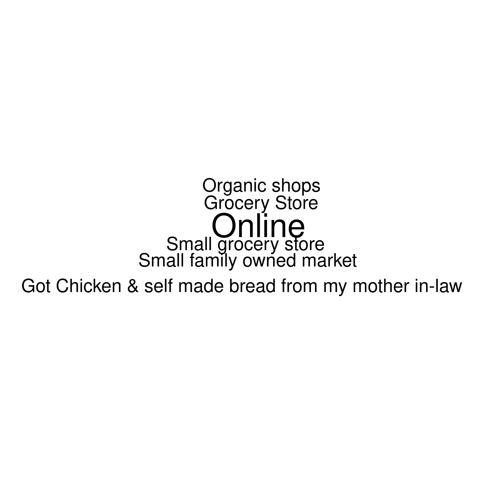

For the text part of the "Other" variable a word cloud can be used to visualize the answers


```r
library(wordcloud)
shareofwallet_counts <- c(by(na.omit(shareofwallet_text), na.omit(shareofwallet_text), length))
wordcloud(names(shareofwallet_counts), shareofwallet_counts)
```

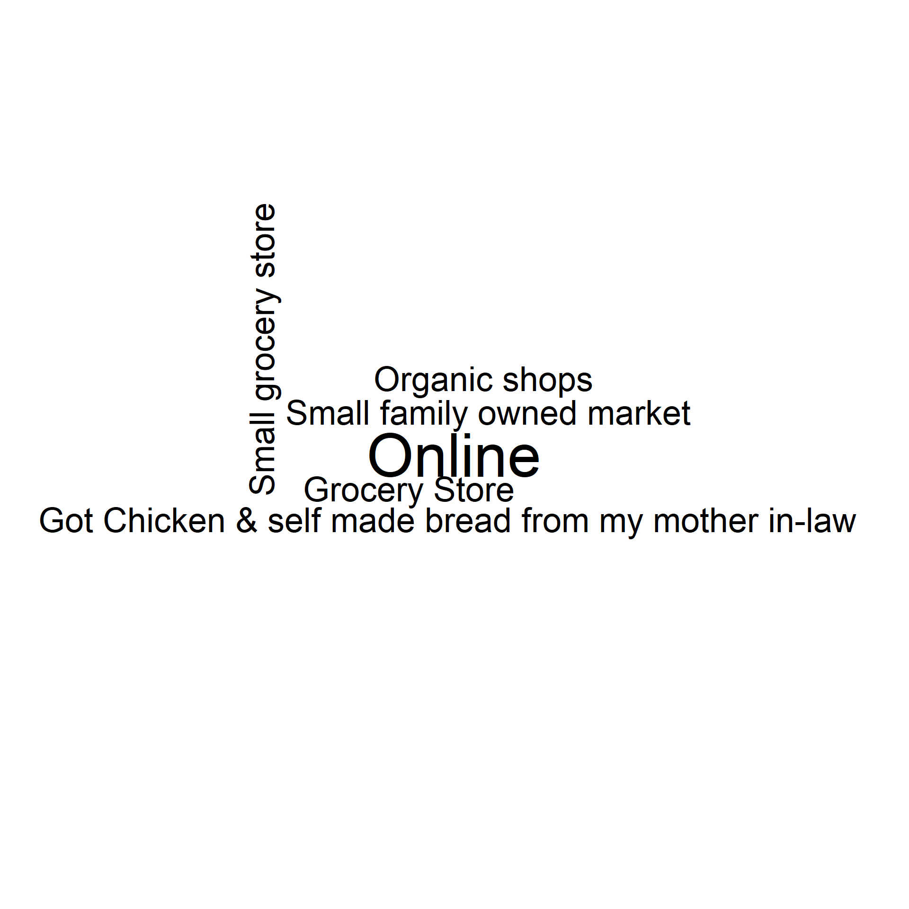

#### Comparing groups

We can also use the previous plots to show differences between groups (gender, experimental, etc.). A natural fit to add another "dimension" is the `facet_wrap` layer in `ggplot2`. First we select the appropriate variables.


```r
green_consumption$gender <- factor(green_consumption$Q29, levels = c(1,2), labels = c("F", "M"))
gender_sow <- green_consumption[,c(shareofwallet_names[1:4], "gender")]
names(gender_sow)[1:4] <- shareofwallet_answers[1:4]
gender_sow
```

<div data-pagedtable="false">
  <script data-pagedtable-source type="application/json">
{"columns":[{"label":["Discounter"],"name":[1],"type":["dbl"],"align":["right"]},{"label":["Supermarket"],"name":[2],"type":["dbl"],"align":["right"]},{"label":["Farmers market"],"name":[3],"type":["dbl"],"align":["right"]},{"label":["Directly from the farmer"],"name":[4],"type":["dbl"],"align":["right"]},{"label":["gender"],"name":[5],"type":["fct"],"align":["left"]}],"data":[{"1":"0","2":"90","3":"10","4":"0","5":"M"},{"1":"0","2":"50","3":"50","4":"0","5":"M"},{"1":"98","2":"2","3":"0","4":"0","5":"M"},{"1":"30","2":"40","3":"20","4":"10","5":"M"},{"1":"60","2":"20","3":"20","4":"0","5":"M"},{"1":"50","2":"50","3":"0","4":"0","5":"F"},{"1":"10","2":"90","3":"0","4":"0","5":"F"},{"1":"85","2":"15","3":"0","4":"0","5":"M"},{"1":"0","2":"100","3":"0","4":"0","5":"M"},{"1":"100","2":"0","3":"0","4":"0","5":"M"},{"1":"55","2":"30","3":"15","4":"0","5":"M"},{"1":"0","2":"100","3":"0","4":"0","5":"F"},{"1":"0","2":"100","3":"0","4":"0","5":"M"},{"1":"0","2":"100","3":"0","4":"0","5":"M"},{"1":"0","2":"100","3":"0","4":"0","5":"M"},{"1":"80","2":"20","3":"0","4":"0","5":"M"},{"1":"2","2":"1","3":"1","4":"0","5":"M"},{"1":"0","2":"100","3":"0","4":"0","5":"F"},{"1":"40","2":"55","3":"0","4":"5","5":"F"},{"1":"0","2":"100","3":"0","4":"0","5":"F"},{"1":"60","2":"0","3":"0","4":"40","5":"F"},{"1":"0","2":"20","3":"40","4":"10","5":"F"},{"1":"30","2":"70","3":"0","4":"0","5":"M"},{"1":"30","2":"70","3":"0","4":"0","5":"M"},{"1":"20","2":"80","3":"0","4":"0","5":"F"},{"1":"0","2":"100","3":"0","4":"0","5":"M"},{"1":"0","2":"25","3":"25","4":"50","5":"M"},{"1":"100","2":"0","3":"0","4":"0","5":"F"},{"1":"20","2":"70","3":"10","4":"0","5":"M"},{"1":"25","2":"75","3":"0","4":"0","5":"M"},{"1":"0","2":"100","3":"0","4":"0","5":"M"},{"1":"100","2":"0","3":"0","4":"0","5":"M"},{"1":"50","2":"50","3":"0","4":"0","5":"M"},{"1":"30","2":"30","3":"40","4":"0","5":"M"},{"1":"0","2":"90","3":"10","4":"0","5":"M"},{"1":"10","2":"70","3":"10","4":"10","5":"F"},{"1":"1","2":"3","3":"0","4":"0","5":"M"},{"1":"0","2":"100","3":"0","4":"0","5":"M"},{"1":"10","2":"90","3":"0","4":"0","5":"M"},{"1":"15","2":"80","3":"0","4":"5","5":"F"},{"1":"0","2":"70","3":"30","4":"0","5":"M"},{"1":"50","2":"50","3":"0","4":"0","5":"M"},{"1":"20","2":"70","3":"10","4":"0","5":"F"},{"1":"0","2":"90","3":"0","4":"10","5":"M"},{"1":"20","2":"60","3":"20","4":"0","5":"F"},{"1":"40","2":"60","3":"0","4":"0","5":"M"},{"1":"1","2":"2","3":"0","4":"0","5":"M"},{"1":"80","2":"20","3":"0","4":"0","5":"M"},{"1":"70","2":"30","3":"0","4":"0","5":"M"},{"1":"25","2":"70","3":"5","4":"0","5":"F"},{"1":"90","2":"9","3":"1","4":"0","5":"F"},{"1":"20","2":"80","3":"0","4":"0","5":"M"},{"1":"0","2":"90","3":"0","4":"0","5":"F"},{"1":"0","2":"2","3":"0","4":"0","5":"M"},{"1":"50","2":"50","3":"0","4":"0","5":"M"},{"1":"0","2":"99","3":"1","4":"0","5":"M"},{"1":"60","2":"40","3":"0","4":"0","5":"M"},{"1":"70","2":"30","3":"0","4":"0","5":"M"},{"1":"0","2":"100","3":"0","4":"0","5":"F"},{"1":"20","2":"80","3":"0","4":"0","5":"M"},{"1":"80","2":"15","3":"0","4":"5","5":"F"},{"1":"50","2":"50","3":"0","4":"0","5":"F"},{"1":"0","2":"70","3":"30","4":"0","5":"M"},{"1":"20","2":"80","3":"0","4":"0","5":"F"},{"1":"80","2":"20","3":"0","4":"0","5":"F"},{"1":"20","2":"70","3":"0","4":"10","5":"F"},{"1":"40","2":"60","3":"0","4":"0","5":"F"},{"1":"80","2":"20","3":"0","4":"0","5":"F"},{"1":"90","2":"10","3":"0","4":"0","5":"M"},{"1":"0","2":"100","3":"0","4":"0","5":"M"},{"1":"30","2":"70","3":"0","4":"0","5":"M"},{"1":"0","2":"100","3":"0","4":"0","5":"M"},{"1":"80","2":"20","3":"0","4":"0","5":"M"},{"1":"10","2":"10","3":"70","4":"5","5":"M"},{"1":"30","2":"70","3":"0","4":"0","5":"F"},{"1":"0","2":"80","3":"20","4":"0","5":"M"},{"1":"0","2":"80","3":"20","4":"0","5":"M"},{"1":"0","2":"100","3":"0","4":"0","5":"M"},{"1":"10","2":"50","3":"20","4":"20","5":"M"},{"1":"0","2":"90","3":"10","4":"0","5":"M"},{"1":"60","2":"40","3":"0","4":"0","5":"M"},{"1":"0","2":"100","3":"0","4":"0","5":"M"},{"1":"0","2":"10","3":"0","4":"0","5":"M"},{"1":"30","2":"70","3":"0","4":"0","5":"M"},{"1":"30","2":"40","3":"20","4":"0","5":"F"},{"1":"0","2":"100","3":"0","4":"0","5":"M"},{"1":"0","2":"90","3":"10","4":"0","5":"M"},{"1":"0","2":"1","3":"1","4":"0","5":"M"},{"1":"0","2":"100","3":"0","4":"0","5":"M"},{"1":"0","2":"100","3":"0","4":"0","5":"M"},{"1":"0","2":"40","3":"60","4":"0","5":"F"},{"1":"0","2":"20","3":"80","4":"0","5":"M"},{"1":"30","2":"40","3":"20","4":"10","5":"F"},{"1":"0","2":"100","3":"0","4":"0","5":"M"},{"1":"0","2":"100","3":"0","4":"0","5":"F"},{"1":"0","2":"90","3":"10","4":"0","5":"M"},{"1":"90","2":"10","3":"0","4":"0","5":"M"},{"1":"0","2":"90","3":"10","4":"0","5":"F"},{"1":"0","2":"1","3":"0","4":"0","5":"M"},{"1":"0","2":"0","3":"0","4":"0","5":"M"},{"1":"0","2":"80","3":"0","4":"20","5":"F"},{"1":"0","2":"100","3":"0","4":"0","5":"M"},{"1":"49","2":"50","3":"0","4":"1","5":"M"},{"1":"0","2":"100","3":"0","4":"0","5":"F"},{"1":"40","2":"60","3":"0","4":"0","5":"M"},{"1":"0","2":"0","3":"0","4":"0","5":"F"},{"1":"80","2":"20","3":"0","4":"0","5":"M"},{"1":"0","2":"100","3":"0","4":"0","5":"M"},{"1":"5","2":"60","3":"35","4":"0","5":"F"},{"1":"20","2":"30","3":"50","4":"0","5":"M"},{"1":"20","2":"70","3":"10","4":"0","5":"M"},{"1":"60","2":"30","3":"10","4":"0","5":"M"},{"1":"10","2":"50","3":"40","4":"0","5":"M"},{"1":"0","2":"0","3":"0","4":"0","5":"M"},{"1":"0","2":"50","3":"0","4":"0","5":"F"},{"1":"80","2":"20","3":"0","4":"0","5":"M"},{"1":"70","2":"5","3":"0","4":"5","5":"M"},{"1":"30","2":"50","3":"10","4":"10","5":"M"},{"1":"0","2":"2","3":"0","4":"0","5":"M"},{"1":"50","2":"50","3":"0","4":"0","5":"M"},{"1":"0","2":"80","3":"0","4":"20","5":"M"},{"1":"0","2":"100","3":"0","4":"0","5":"F"},{"1":"0","2":"100","3":"0","4":"0","5":"M"},{"1":"0","2":"100","3":"0","4":"0","5":"F"},{"1":"0","2":"40","3":"20","4":"40","5":"M"},{"1":"0","2":"100","3":"0","4":"0","5":"M"},{"1":"20","2":"80","3":"0","4":"0","5":"NA"},{"1":"10","2":"80","3":"10","4":"0","5":"NA"},{"1":"0","2":"100","3":"0","4":"0","5":"NA"},{"1":"0","2":"100","3":"0","4":"0","5":"NA"},{"1":"20","2":"80","3":"0","4":"0","5":"NA"},{"1":"55","2":"30","3":"15","4":"0","5":"NA"},{"1":"0","2":"100","3":"0","4":"0","5":"NA"},{"1":"0","2":"100","3":"0","4":"0","5":"NA"},{"1":"0","2":"20","3":"10","4":"50","5":"NA"},{"1":"70","2":"30","3":"0","4":"0","5":"NA"},{"1":"0","2":"40","3":"20","4":"40","5":"NA"},{"1":"0","2":"25","3":"25","4":"50","5":"NA"},{"1":"0","2":"90","3":"10","4":"0","5":"NA"},{"1":"0","2":"90","3":"10","4":"0","5":"NA"},{"1":"NA","2":"NA","3":"NA","4":"NA","5":"NA"},{"1":"NA","2":"NA","3":"NA","4":"NA","5":"NA"},{"1":"NA","2":"NA","3":"NA","4":"NA","5":"NA"},{"1":"NA","2":"NA","3":"NA","4":"NA","5":"NA"},{"1":"40","2":"60","3":"0","4":"0","5":"NA"},{"1":"80","2":"20","3":"0","4":"0","5":"NA"},{"1":"NA","2":"NA","3":"NA","4":"NA","5":"NA"},{"1":"NA","2":"NA","3":"NA","4":"NA","5":"NA"},{"1":"20","2":"60","3":"20","4":"0","5":"NA"},{"1":"0","2":"100","3":"0","4":"0","5":"NA"},{"1":"NA","2":"NA","3":"NA","4":"NA","5":"NA"},{"1":"NA","2":"NA","3":"NA","4":"NA","5":"NA"},{"1":"NA","2":"NA","3":"NA","4":"NA","5":"NA"},{"1":"NA","2":"NA","3":"NA","4":"NA","5":"NA"},{"1":"80","2":"20","3":"0","4":"0","5":"NA"},{"1":"NA","2":"NA","3":"NA","4":"NA","5":"NA"},{"1":"0","2":"0","3":"0","4":"0","5":"NA"},{"1":"0","2":"100","3":"0","4":"0","5":"NA"},{"1":"0","2":"100","3":"0","4":"0","5":"NA"},{"1":"NA","2":"NA","3":"NA","4":"NA","5":"NA"},{"1":"NA","2":"NA","3":"NA","4":"NA","5":"NA"},{"1":"30","2":"50","3":"20","4":"0","5":"NA"},{"1":"2","2":"1","3":"0","4":"0","5":"NA"},{"1":"10","2":"80","3":"10","4":"0","5":"NA"},{"1":"0","2":"100","3":"0","4":"0","5":"NA"},{"1":"0","2":"80","3":"20","4":"0","5":"NA"},{"1":"NA","2":"NA","3":"NA","4":"NA","5":"NA"},{"1":"0","2":"100","3":"0","4":"0","5":"NA"},{"1":"0","2":"1","3":"3","4":"0","5":"NA"},{"1":"0","2":"80","3":"20","4":"0","5":"NA"},{"1":"5","2":"35","3":"40","4":"20","5":"NA"},{"1":"0","2":"100","3":"0","4":"0","5":"NA"},{"1":"NA","2":"NA","3":"NA","4":"NA","5":"NA"},{"1":"NA","2":"NA","3":"NA","4":"NA","5":"NA"},{"1":"0","2":"80","3":"100","4":"0","5":"NA"},{"1":"NA","2":"NA","3":"NA","4":"NA","5":"NA"},{"1":"NA","2":"NA","3":"NA","4":"NA","5":"NA"},{"1":"0","2":"80","3":"0","4":"20","5":"NA"},{"1":"NA","2":"NA","3":"NA","4":"NA","5":"NA"},{"1":"0","2":"1","3":"0","4":"0","5":"NA"},{"1":"0","2":"0","3":"0","4":"0","5":"NA"},{"1":"30","2":"70","3":"0","4":"0","5":"NA"},{"1":"30","2":"60","3":"10","4":"0","5":"NA"},{"1":"0","2":"50","3":"0","4":"0","5":"NA"},{"1":"20","2":"80","3":"0","4":"0","5":"NA"},{"1":"10","2":"70","3":"20","4":"0","5":"NA"},{"1":"0","2":"50","3":"90","4":"0","5":"NA"},{"1":"30","2":"50","3":"10","4":"10","5":"NA"},{"1":"0","2":"80","3":"20","4":"0","5":"NA"},{"1":"NA","2":"NA","3":"NA","4":"NA","5":"NA"},{"1":"25","2":"70","3":"5","4":"0","5":"NA"},{"1":"NA","2":"NA","3":"NA","4":"NA","5":"NA"},{"1":"NA","2":"NA","3":"NA","4":"NA","5":"NA"},{"1":"0","2":"80","3":"0","4":"0","5":"NA"},{"1":"2","2":"1","3":"1","4":"0","5":"NA"},{"1":"NA","2":"NA","3":"NA","4":"NA","5":"NA"},{"1":"NA","2":"NA","3":"NA","4":"NA","5":"NA"},{"1":"NA","2":"NA","3":"NA","4":"NA","5":"NA"},{"1":"0","2":"2","3":"0","4":"0","5":"NA"},{"1":"NA","2":"NA","3":"NA","4":"NA","5":"NA"},{"1":"NA","2":"NA","3":"NA","4":"NA","5":"NA"},{"1":"NA","2":"NA","3":"NA","4":"NA","5":"NA"},{"1":"NA","2":"NA","3":"NA","4":"NA","5":"NA"},{"1":"5","2":"40","3":"40","4":"15","5":"NA"},{"1":"30","2":"40","3":"30","4":"0","5":"NA"},{"1":"NA","2":"NA","3":"NA","4":"NA","5":"NA"},{"1":"0","2":"2","3":"0","4":"0","5":"NA"},{"1":"NA","2":"NA","3":"NA","4":"NA","5":"NA"},{"1":"0","2":"0","3":"0","4":"0","5":"NA"},{"1":"NA","2":"NA","3":"NA","4":"NA","5":"NA"},{"1":"NA","2":"NA","3":"NA","4":"NA","5":"NA"},{"1":"0","2":"80","3":"0","4":"0","5":"NA"},{"1":"50","2":"50","3":"0","4":"0","5":"NA"},{"1":"NA","2":"NA","3":"NA","4":"NA","5":"NA"},{"1":"50","2":"50","3":"0","4":"0","5":"NA"},{"1":"0","2":"60","3":"0","4":"40","5":"NA"},{"1":"NA","2":"NA","3":"NA","4":"NA","5":"NA"},{"1":"0","2":"60","3":"0","4":"40","5":"NA"},{"1":"20","2":"80","3":"0","4":"0","5":"NA"},{"1":"20","2":"80","3":"0","4":"0","5":"NA"},{"1":"0","2":"100","3":"0","4":"0","5":"NA"},{"1":"40","2":"60","3":"0","4":"0","5":"NA"},{"1":"NA","2":"NA","3":"NA","4":"NA","5":"NA"},{"1":"NA","2":"NA","3":"NA","4":"NA","5":"NA"},{"1":"NA","2":"NA","3":"NA","4":"NA","5":"NA"},{"1":"NA","2":"NA","3":"NA","4":"NA","5":"NA"},{"1":"NA","2":"NA","3":"NA","4":"NA","5":"NA"},{"1":"0","2":"0","3":"0","4":"0","5":"NA"},{"1":"0","2":"99","3":"1","4":"0","5":"NA"},{"1":"NA","2":"NA","3":"NA","4":"NA","5":"NA"},{"1":"NA","2":"NA","3":"NA","4":"NA","5":"NA"},{"1":"0","2":"NA","3":"0","4":"0","5":"NA"},{"1":"NA","2":"NA","3":"NA","4":"NA","5":"NA"},{"1":"0","2":"0","3":"0","4":"0","5":"NA"},{"1":"50","2":"50","3":"0","4":"0","5":"NA"},{"1":"75","2":"20","3":"0","4":"5","5":"NA"},{"1":"0","2":"90","3":"NA","4":"0","5":"NA"},{"1":"0","2":"50","3":"25","4":"25","5":"NA"},{"1":"NA","2":"NA","3":"NA","4":"NA","5":"NA"},{"1":"NA","2":"NA","3":"NA","4":"NA","5":"NA"},{"1":"20","2":"70","3":"10","4":"0","5":"NA"},{"1":"0","2":"2","3":"3","4":"1","5":"NA"},{"1":"20","2":"80","3":"0","4":"0","5":"NA"},{"1":"NA","2":"NA","3":"NA","4":"NA","5":"NA"},{"1":"0","2":"90","3":"10","4":"0","5":"NA"},{"1":"80","2":"10","3":"0","4":"10","5":"NA"},{"1":"NA","2":"NA","3":"NA","4":"NA","5":"NA"},{"1":"0","2":"80","3":"20","4":"0","5":"NA"},{"1":"NA","2":"NA","3":"NA","4":"NA","5":"NA"},{"1":"20","2":"60","3":"20","4":"0","5":"NA"},{"1":"NA","2":"NA","3":"NA","4":"NA","5":"NA"},{"1":"0","2":"60","3":"20","4":"20","5":"NA"},{"1":"0","2":"80","3":"0","4":"20","5":"NA"},{"1":"NA","2":"NA","3":"NA","4":"NA","5":"NA"},{"1":"NA","2":"NA","3":"NA","4":"NA","5":"NA"},{"1":"20","2":"80","3":"0","4":"0","5":"NA"},{"1":"50","2":"50","3":"0","4":"0","5":"NA"},{"1":"0","2":"100","3":"0","4":"0","5":"NA"},{"1":"80","2":"20","3":"0","4":"0","5":"NA"},{"1":"NA","2":"NA","3":"NA","4":"NA","5":"NA"},{"1":"NA","2":"NA","3":"NA","4":"NA","5":"NA"},{"1":"NA","2":"NA","3":"NA","4":"NA","5":"NA"},{"1":"NA","2":"2","3":"0","4":"0","5":"NA"},{"1":"NA","2":"NA","3":"NA","4":"NA","5":"NA"},{"1":"50","2":"35","3":"0","4":"15","5":"NA"},{"1":"0","2":"100","3":"0","4":"0","5":"NA"},{"1":"0","2":"80","3":"10","4":"10","5":"NA"},{"1":"0","2":"80","3":"20","4":"0","5":"NA"},{"1":"60","2":"40","3":"0","4":"0","5":"NA"},{"1":"0","2":"1","3":"0","4":"0","5":"NA"},{"1":"20","2":"80","3":"0","4":"0","5":"NA"},{"1":"NA","2":"NA","3":"NA","4":"NA","5":"NA"},{"1":"50","2":"100","3":"0","4":"0","5":"NA"},{"1":"NA","2":"NA","3":"NA","4":"NA","5":"NA"},{"1":"NA","2":"NA","3":"NA","4":"NA","5":"NA"},{"1":"NA","2":"NA","3":"NA","4":"NA","5":"NA"},{"1":"NA","2":"NA","3":"NA","4":"NA","5":"NA"},{"1":"NA","2":"NA","3":"NA","4":"NA","5":"NA"}],"options":{"columns":{"min":{},"max":[10]},"rows":{"min":[10],"max":[10]},"pages":{}}}
  </script>
</div>

Second the data is transformed to a long format again and then the distribution of points is shown for each gender and each store type observed in the data. By adding `scales = "free_y"` to the `facet_warp` layer, the y-axis values can vary across the plots.


```r
gender_sow <- pivot_longer(gender_sow, cols = !last_col(), names_to = "type", values_to = "points")
gender_sow <- gender_sow[!is.na(gender_sow$gender), ]
ggplot(gender_sow, aes(x = gender, y = points, fill = gender)) +
  geom_boxplot() +
  theme_bw() +
  theme(panel.grid.major.x = element_blank()) +
  facet_wrap(~type, scales = "free_y") +
  xlab("") +
  scale_fill_discrete_qualitative(palette = "Dynamic") 
```

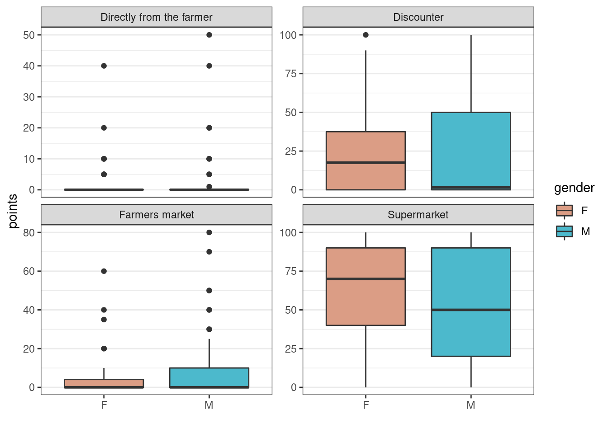

Another way to compare multiple values across groups is a radar plot. First we calculate the share of respondents by gender for a couple of car use-cases (`aggregate(. ~ gender, data = car_gender, mean)`. Then we create a radar plot where the color indicates the gender.


```r
library(ggiraphExtra)
carsharing$gender <- factor(carsharing$Q26, levels = c(1,2), labels = c("F", "M"))
car_gender <- carsharing[,c(q6_columns, "gender")]
car_gender_mean <- aggregate(. ~ gender, data = car_gender, mean)
names(car_gender_mean) <- c("gender", q6_answers)
ggRadar(car_gender_mean, aes(color = gender) ) + 
  theme_bw() + 
  theme(axis.text.x = element_text(angle = c(-30,-50,-90,0,0,0,90,45,10))) +
  scale_color_discrete_qualitative(palette = "Dynamic") 
```


