# (PART) Course outline {-}


# Welcome! {-}

<p style="text-align:center;">
&nbsp;&nbsp;&nbsp;&nbsp;&nbsp;&nbsp;&nbsp;&nbsp;&nbsp;&nbsp;&nbsp;&nbsp;

</p>
<br>
Welcome to the course **Marketing Analytics**! This course covers the conceptual foundations of data analysis techniques for marketing managers and applications of these methods to different data sets. The course will be delivered in parts using the **flipped classroom** teaching method. This means that students are required to familiarize themselves with the contents by means of **self-study** before each session (i.e., by going through the materials on their own). This website is intended to aid the self-study process by providing you with explanations regarding the relevant concepts and methods in text and video format along with code files and commented outputs that will show you how to implement these methods using the **statistical software R**. 
<br><br>
The self-learning process will be complemented with compulsory in-person **weekly interactive sessions** in the PC-lab, which provide ample opportunities to train the acquired knowledge and clarify points that require further discussion. 
<br><br>
The following pages outline the course schedule and explain how to use this tutorial in detail. If you have any questions, feel free to send me a short email.
<br>
<br>
Nils Wlömert
<br>
[nils.wloemert@wu.ac.at](mailto:nils.wloemert@wu.ac.at)


# Introduction {-}

## Course structure {-}

This course combines asynchronous teaching elements (e.g., texts and pre-recorded videos on this website) with synchronous elements (e.g., weekly in-person interactive sessions in the PC-lab). The syllabus consists of three main parts, as reflected by the structure of this website: 

1. **Lecture notes**: the lecture part will explain the theory behind the concepts and methods and provide you with example applications using the statistical software R.
2. **Individual assignments**: in the individual assignments you are asked to apply the acquired knowledge to new data sets.
3. **Group project**: in the group you will design and conduct your own market research project and transfer the knowledge to a real business setting.

The general approach is that students will first familiarize themselves with the contents by going through the materials on their own. This **self-study** process is complemented with in-person **weekly interactive sessions** in the PC-lab, which provide ample opportunities to ask questions and clarify points that require further discussion. The schedule for each of the three parts will be explained below. 

### Schedule {-}

#### In-person lecture {-}

The contents on this website are divided into weekly readings. To be able to follow the curriculum and complete the weekly assignments, you need to read the materials assigned for the respective week. The relevant chapters are indicated in the table below. The weekly readings will be complemented with the weekly interactive session in the PC-lab, which provide you with an opportunity to ask questions about the assigned readings. **Please note that you need to go through the materials on your own in the week before the respective session.** For example, chapters 2,3,4 will be discussed in the second session. The dates and times for the classroom sessions are indicated in the table below for each group separately. It is highly recommended to come with questions or comments about the materials to these sessions that you think might be interesting and helpful to the class. The sessions will also feature short interactive quizzes that allow you to self-assess your progress and identify knowledge gaps regarding the materials that were assigned for the previous week. Some of the questions for these quizzes can be found at the end of the respective chapters on this website (see section "Learning check" at the end of each chapter).       

<br>
**Lecture dates - Group A**
<br>
<table class=" lightable-paper lightable-hover" style='font-family: "Arial Narrow", arial, helvetica, sans-serif; width: auto !important; margin-left: auto; margin-right: auto;border-bottom: 0;'>
 <thead>
  <tr>
   <th style="text-align:left;"> Date </th>
   <th style="text-align:left;"> Day </th>
   <th style="text-align:left;"> Time </th>
   <th style="text-align:left;"> Room </th>
   <th style="text-align:left;"> Topics </th>
   <th style="text-align:left;"> Chapters </th>
  </tr>
 </thead>
<tbody>
  <tr>
   <td style="text-align:left;"> Oct. 11 </td>
   <td style="text-align:left;"> Monday </td>
   <td style="text-align:left;"> 08:00AM - 12:00PM </td>
   <td style="text-align:left;"> TC.-1.61 </td>
   <td style="text-align:left;"> * Introduction to the course <br>Basic concepts </td>
   <td style="text-align:left;"> 1 </td>
  </tr>
  <tr>
   <td style="text-align:left;"> Oct. 18 </td>
   <td style="text-align:left;"> Monday </td>
   <td style="text-align:left;"> 08:00AM - 12:00PM </td>
   <td style="text-align:left;"> TC.-1.61 </td>
   <td style="text-align:left;"> * Introduction to R <br>Introduction to inferential statistics </td>
   <td style="text-align:left;"> 2,3,4 </td>
  </tr>
  <tr>
   <td style="text-align:left;"> Oct. 25 </td>
   <td style="text-align:left;"> Monday </td>
   <td style="text-align:left;"> 08:00AM - 12:00PM </td>
   <td style="text-align:left;"> TC.-1.61 </td>
   <td style="text-align:left;"> * Hypothesis testing I </td>
   <td style="text-align:left;"> 5,6.1,6.2,6.3 </td>
  </tr>
  <tr>
   <td style="text-align:left;"> Nov. 8 </td>
   <td style="text-align:left;"> Monday </td>
   <td style="text-align:left;"> 08:00AM - 12:00PM </td>
   <td style="text-align:left;"> TC.-1.61 </td>
   <td style="text-align:left;"> * Hypothesis testing II </td>
   <td style="text-align:left;"> 6.4,6.5,6.6 </td>
  </tr>
  <tr>
   <td style="text-align:left;"> Nov. 15 </td>
   <td style="text-align:left;"> Monday </td>
   <td style="text-align:left;"> 08:00AM - 12:00PM </td>
   <td style="text-align:left;"> TC.-1.61 </td>
   <td style="text-align:left;"> * Regression I </td>
   <td style="text-align:left;"> 7.1,7.2,7.3 </td>
  </tr>
  <tr>
   <td style="text-align:left;"> Nov. 22 </td>
   <td style="text-align:left;"> Monday </td>
   <td style="text-align:left;"> 08:00AM - 12:00PM </td>
   <td style="text-align:left;"> TC.-1.61 </td>
   <td style="text-align:left;"> * Regression II </td>
   <td style="text-align:left;"> 7.4,7.5,7.6 </td>
  </tr>
  <tr>
   <td style="text-align:left;"> Nov. 29 </td>
   <td style="text-align:left;"> Monday </td>
   <td style="text-align:left;"> 08:00AM - 12:00PM </td>
   <td style="text-align:left;"> TC.-1.61 </td>
   <td style="text-align:left;"> * Factor analysis <br>Cluster analysis </td>
   <td style="text-align:left;"> 8,9 </td>
  </tr>
</tbody>
<tfoot><tr><td style="padding: 0; " colspan="100%">
<span style="font-style: italic;">Note: </span> <sup></sup> Dates and times are indicated for group A.</td></tr></tfoot>
</table>
<br>
**Lecture dates - Group B**
<br>
<table class=" lightable-paper lightable-hover" style='font-family: "Arial Narrow", arial, helvetica, sans-serif; width: auto !important; margin-left: auto; margin-right: auto;border-bottom: 0;'>
 <thead>
  <tr>
   <th style="text-align:left;"> Date </th>
   <th style="text-align:left;"> Day </th>
   <th style="text-align:left;"> Time </th>
   <th style="text-align:left;"> Room </th>
   <th style="text-align:left;"> Topics </th>
   <th style="text-align:left;"> Chapters </th>
  </tr>
 </thead>
<tbody>
  <tr>
   <td style="text-align:left;"> Oct. 11 </td>
   <td style="text-align:left;"> Monday </td>
   <td style="text-align:left;"> 02:00PM - 06:00PM </td>
   <td style="text-align:left;"> TC.-1.61 </td>
   <td style="text-align:left;"> * Introduction to the course <br>Basic concepts </td>
   <td style="text-align:left;"> 1 </td>
  </tr>
  <tr>
   <td style="text-align:left;"> Oct. 18 </td>
   <td style="text-align:left;"> Monday </td>
   <td style="text-align:left;"> 02:00PM - 06:00PM </td>
   <td style="text-align:left;"> TC.-1.61 </td>
   <td style="text-align:left;"> * Introduction to R <br>Introduction to inferential statistics </td>
   <td style="text-align:left;"> 2,3,4 </td>
  </tr>
  <tr>
   <td style="text-align:left;"> Oct. 25 </td>
   <td style="text-align:left;"> Monday </td>
   <td style="text-align:left;"> 02:00PM - 06:00PM </td>
   <td style="text-align:left;"> TC.-1.61 </td>
   <td style="text-align:left;"> * Hypothesis testing I </td>
   <td style="text-align:left;"> 5,6.1,6.2,6.3 </td>
  </tr>
  <tr>
   <td style="text-align:left;"> Nov. 8 </td>
   <td style="text-align:left;"> Monday </td>
   <td style="text-align:left;"> 02:00PM - 06:00PM </td>
   <td style="text-align:left;"> TC.-1.61 </td>
   <td style="text-align:left;"> * Hypothesis testing II </td>
   <td style="text-align:left;"> 6.4,6.5,6.6 </td>
  </tr>
  <tr>
   <td style="text-align:left;"> Nov. 15 </td>
   <td style="text-align:left;"> Monday </td>
   <td style="text-align:left;"> 02:00PM - 06:00PM </td>
   <td style="text-align:left;"> TC.-1.61 </td>
   <td style="text-align:left;"> * Regression I </td>
   <td style="text-align:left;"> 7.1,7.2,7.3 </td>
  </tr>
  <tr>
   <td style="text-align:left;"> Nov. 22 </td>
   <td style="text-align:left;"> Monday </td>
   <td style="text-align:left;"> 02:00PM - 06:00PM </td>
   <td style="text-align:left;"> TC.-1.61 </td>
   <td style="text-align:left;"> * Regression II </td>
   <td style="text-align:left;"> 7.4,7.5,7.6 </td>
  </tr>
  <tr>
   <td style="text-align:left;"> Nov. 29 </td>
   <td style="text-align:left;"> Monday </td>
   <td style="text-align:left;"> 02:00PM - 06:00PM </td>
   <td style="text-align:left;"> TC.-1.61 </td>
   <td style="text-align:left;"> * Factor analysis <br>Cluster analysis </td>
   <td style="text-align:left;"> 8,9 </td>
  </tr>
</tbody>
<tfoot><tr><td style="padding: 0; " colspan="100%">
<span style="font-style: italic;">Note: </span> <sup></sup> Dates and times are indicated for group B.</td></tr></tfoot>
</table>

<br>
**Lecture dates - Group C**
<br>
<table class=" lightable-paper lightable-hover" style='font-family: "Arial Narrow", arial, helvetica, sans-serif; width: auto !important; margin-left: auto; margin-right: auto;border-bottom: 0;'>
 <thead>
  <tr>
   <th style="text-align:left;"> Date </th>
   <th style="text-align:left;"> Day </th>
   <th style="text-align:left;"> Time </th>
   <th style="text-align:left;"> Room </th>
   <th style="text-align:left;"> Topics </th>
   <th style="text-align:left;"> Chapters </th>
  </tr>
 </thead>
<tbody>
  <tr>
   <td style="text-align:left;"> Oct. 13 </td>
   <td style="text-align:left;"> Wednesday </td>
   <td style="text-align:left;"> 12:00PM - 04:00PM </td>
   <td style="text-align:left;"> TC.-1.61 </td>
   <td style="text-align:left;"> * Introduction to the course <br>Basic concepts </td>
   <td style="text-align:left;"> 1 </td>
  </tr>
  <tr>
   <td style="text-align:left;"> Oct. 20 </td>
   <td style="text-align:left;"> Wednesday </td>
   <td style="text-align:left;"> 02:00PM - 06:00PM </td>
   <td style="text-align:left;"> TC.-1.61 </td>
   <td style="text-align:left;"> * Introduction to R <br>Introduction to inferential statistics </td>
   <td style="text-align:left;"> 2,3,4 </td>
  </tr>
  <tr>
   <td style="text-align:left;"> Oct. 27 </td>
   <td style="text-align:left;"> Wednesday </td>
   <td style="text-align:left;"> 02:00PM - 06:00PM </td>
   <td style="text-align:left;"> TC.-1.61 </td>
   <td style="text-align:left;"> * Hypothesis testing I </td>
   <td style="text-align:left;"> 5,6.1,6.2,6.3 </td>
  </tr>
  <tr>
   <td style="text-align:left;"> Nov. 10 </td>
   <td style="text-align:left;"> Wednesday </td>
   <td style="text-align:left;"> 02:00PM - 06:00PM </td>
   <td style="text-align:left;"> TC.-1.61 </td>
   <td style="text-align:left;"> * Hypothesis testing II </td>
   <td style="text-align:left;"> 6.4,6.5,6.6 </td>
  </tr>
  <tr>
   <td style="text-align:left;"> Nov. 17 </td>
   <td style="text-align:left;"> Wednesday </td>
   <td style="text-align:left;"> 12:00PM - 04:00PM </td>
   <td style="text-align:left;"> TC.-1.61 </td>
   <td style="text-align:left;"> * Regression I </td>
   <td style="text-align:left;"> 7.1,7.2,7.3 </td>
  </tr>
  <tr>
   <td style="text-align:left;"> Nov. 24 </td>
   <td style="text-align:left;"> Wednesday </td>
   <td style="text-align:left;"> 12:00PM - 04:00PM </td>
   <td style="text-align:left;"> TC.-1.61 </td>
   <td style="text-align:left;"> * Regression II </td>
   <td style="text-align:left;"> 7.4,7.5,7.6 </td>
  </tr>
  <tr>
   <td style="text-align:left;"> Dec. 1 </td>
   <td style="text-align:left;"> Wednesday </td>
   <td style="text-align:left;"> 12:00PM - 04:00PM </td>
   <td style="text-align:left;"> TC.-1.61 </td>
   <td style="text-align:left;"> * Factor analysis <br>Cluster analysis </td>
   <td style="text-align:left;"> 8,9 </td>
  </tr>
</tbody>
<tfoot><tr><td style="padding: 0; " colspan="100%">
<span style="font-style: italic;">Note: </span> <sup></sup> Dates and times are indicated for group C.</td></tr></tfoot>
</table>
<br>

::: {.infobox_red .caution data-latex="{caution}"}
We understand that the self-study format might pose challenges to the learning process because we cannot troubleshoot in person outside of the classroom sessions. Remember that it is very unlikely that you are the only student encountering a particular problem. So please make use of the forum on Learn\@WU (see below) to interact with your peers or ask us questions so that everyone else will benefit from the answer (there are no stupid questions). In case you cannot get answers to address a specific problem, we will be available during the in-person classroom sessions for coaching.
:::

#### Individual assignments {-}

There will be 3 individual assignments and most assignments are complemented with either compulsory or optional coaching sessions. Note that the assignments need to be submitted in the [R Markdown format](https://rmarkdown.rstudio.com/) (see chapter 10) via Learn\@wu. There will be a coaching sessions dedicated to the R Markdown reporting format after the second assignment has been assigned, in which you will need to work with this format for the first time. 

Your main point of contact for the individual assignments will be Virginia Darazs ([virginia.darazs@wu.ac.at](mailto:virginia.darazs@wu.ac.at)). You may contact Virginia to schedule individual online coaching sessions during the times indicated in the table below. However, please make sure that you have exhausted all other resources to solve a particular problem, such as the online tutorial, the forum on Learn\@wu, and other web resources (see below) before you schedule a coaching session. If you feel that other students might have similar questions and would benefit from an answer to a particular question, you should post the question in the forum on Learn\@wu.

<br>
**Assignment schedule - Group A**
<br>
<table class=" lightable-paper lightable-hover" style='font-family: "Arial Narrow", arial, helvetica, sans-serif; width: auto !important; margin-left: auto; margin-right: auto;border-bottom: 0;'>
 <thead>
  <tr>
   <th style="text-align:left;"> Assignment </th>
   <th style="text-align:left;"> Assigned </th>
   <th style="text-align:left;"> Coaching </th>
   <th style="text-align:left;"> Submission </th>
  </tr>
 </thead>
<tbody>
  <tr>
   <td style="text-align:left;"> Assignment 1: DataCamp </td>
   <td style="text-align:left;"> Oct. 18 </td>
   <td style="text-align:left;"> * no coaching </td>
   <td style="text-align:left;"> Oct. 24, 11:59PM </td>
  </tr>
  <tr>
   <td style="text-align:left;"> Assignment 2: Hypothesis testing </td>
   <td style="text-align:left;"> Oct. 25 </td>
   <td style="text-align:left;"> * Oct. 27, 08:00AM-11:00AM (room D5.0.001) <br>Nov. 10, 04:00PM-07:00PM (online)* <br>Nov. 12, 04:00PM-08:00PM (online)* </td>
   <td style="text-align:left;"> Nov. 14, 11:59PM </td>
  </tr>
  <tr>
   <td style="text-align:left;"> Assignment 3: Regression </td>
   <td style="text-align:left;"> Nov. 15 </td>
   <td style="text-align:left;"> * Nov. 23, 04:00PM-07:00PM (online)* <br>Nov. 26, 04:00PM-08:00PM (online)* </td>
   <td style="text-align:left;"> Nov. 28, 11:59PM </td>
  </tr>
</tbody>
<tfoot><tr><td style="padding: 0; " colspan="100%">
<span style="font-style: italic;">Note: </span> <sup></sup> Dates and times are indicated for group A. <br>           Dates indicated with '*' are optional time slots for individual online video coaching sessions with Virginia.<br>           If you would like to schedule a meeting during the indicated times, please contact Virginia before (virginia.darazs@wu.ac.at).</td></tr></tfoot>
</table>

<br>
**Assignment schedule - Group B**
<br>
<table class=" lightable-paper lightable-hover" style='font-family: "Arial Narrow", arial, helvetica, sans-serif; width: auto !important; margin-left: auto; margin-right: auto;border-bottom: 0;'>
 <thead>
  <tr>
   <th style="text-align:left;"> Assignment </th>
   <th style="text-align:left;"> Assigned </th>
   <th style="text-align:left;"> Coaching </th>
   <th style="text-align:left;"> Submission </th>
  </tr>
 </thead>
<tbody>
  <tr>
   <td style="text-align:left;"> Assignment 1: DataCamp </td>
   <td style="text-align:left;"> Oct. 18 </td>
   <td style="text-align:left;"> * no coaching </td>
   <td style="text-align:left;"> Oct. 24, 11:59PM </td>
  </tr>
  <tr>
   <td style="text-align:left;"> Assignment 2: Hypothesis testing </td>
   <td style="text-align:left;"> Oct. 25 </td>
   <td style="text-align:left;"> * Oct. 27, 08:00AM-11:00AM (room D5.0.001) <br>Nov. 10, 04:00PM-07:00PM (online)* <br>Nov. 12, 04:00PM-08:00PM (online)* </td>
   <td style="text-align:left;"> Nov. 14, 11:59PM </td>
  </tr>
  <tr>
   <td style="text-align:left;"> Assignment 3: Regression </td>
   <td style="text-align:left;"> Nov. 15 </td>
   <td style="text-align:left;"> * Nov. 23, 04:00PM-07:00PM (online)* <br>Nov. 26, 04:00PM-08:00PM (online)* </td>
   <td style="text-align:left;"> Nov. 28, 11:59PM </td>
  </tr>
</tbody>
<tfoot><tr><td style="padding: 0; " colspan="100%">
<span style="font-style: italic;">Note: </span> <sup></sup> Dates and times are indicated for group B. <br>           Dates indicated with '*' are optional time slots for individual online video coaching sessions with Virginia.<br>           If you would like to schedule a meeting during the indicated times, please contact Virginia before (virginia.darazs@wu.ac.at).</td></tr></tfoot>
</table>

<br>
**Assignment schedule - Group C**
<br>
<table class=" lightable-paper lightable-hover" style='font-family: "Arial Narrow", arial, helvetica, sans-serif; width: auto !important; margin-left: auto; margin-right: auto;border-bottom: 0;'>
 <thead>
  <tr>
   <th style="text-align:left;"> Assignment </th>
   <th style="text-align:left;"> Assigned </th>
   <th style="text-align:left;"> Coaching </th>
   <th style="text-align:left;"> Submission </th>
  </tr>
 </thead>
<tbody>
  <tr>
   <td style="text-align:left;"> Assignment 1: DataCamp </td>
   <td style="text-align:left;"> Oct. 20 </td>
   <td style="text-align:left;"> * no coaching </td>
   <td style="text-align:left;"> Oct. 26, 11:59PM </td>
  </tr>
  <tr>
   <td style="text-align:left;"> Assignment 2: Hypothesis testing </td>
   <td style="text-align:left;"> Oct. 27 </td>
   <td style="text-align:left;"> * Oct. 29, 08:00AM-11:00PM (room TC.-1.61) <br>Nov. 12, 04:00PM-08:00PM (online)* <br>Nov. 15, 04:00PM-07:00PM (online)* </td>
   <td style="text-align:left;"> Nov. 16, 11:59PM </td>
  </tr>
  <tr>
   <td style="text-align:left;"> Assignment 3: Regression </td>
   <td style="text-align:left;"> Nov. 17 </td>
   <td style="text-align:left;"> * Nov. 22, 04:00PM-07:00PM (online)* <br>Nov. 26, 04:00PM-08:00PM (online)* </td>
   <td style="text-align:left;"> Nov. 30, 11:59PM </td>
  </tr>
</tbody>
<tfoot><tr><td style="padding: 0; " colspan="100%">
<span style="font-style: italic;">Note: </span> <sup></sup> Dates and times are indicated for group C. <br>           Dates indicated with '*' are optional time slots for individual online video coaching sessions with Virginia.<br>           If you would like to schedule a meeting during the indicated times, please contact Virginia before (virginia.darazs@wu.ac.at).</td></tr></tfoot>
</table>

#### Group project {-}

The marketing research group project consists of multiple consecutive steps: 

* the design of a questionnaire
* data collection using an online survey
* data handling
* data analysis
* presentation of the results 

We will offer coaching sessions throughout the process, providing feedback and allowing you to ask questions. The submission dates and the dates and times for the coaching sessions are summarized in the table below. 

Your main point of contact for the group project will be Daniel Winkler ([daniel.winkler@wu.ac.at](mailto:daniel.winkler@wu.ac.at)). You may contact Daniel to schedule individual coaching sessions for your groups (in-person or online) during the following times:

* Thursdays 9:00AM - 5:00PM
* Fridays 9:00AM - 5:00PM

Again, please make sure that you have exhausted all other resources to solve a particular problem, such as the online tutorial, the forum on Learn\@wu, and other web resources (see below) before you schedule a coaching session. If you feel that other students might have similar questions and would benefit from an answer to a particular question, you should post the question in the forum on Learn\@wu.

<br>
**Group project schedule - Group A**
<br>
<table class=" lightable-paper lightable-hover" style='font-family: "Arial Narrow", arial, helvetica, sans-serif; width: auto !important; margin-left: auto; margin-right: auto;border-bottom: 0;'>
 <thead>
  <tr>
   <th style="text-align:left;"> Component </th>
   <th style="text-align:left;"> Date </th>
   <th style="text-align:left;"> Room </th>
  </tr>
 </thead>
<tbody>
  <tr>
   <td style="text-align:left;"> Submit questionnaire draft </td>
   <td style="text-align:left;"> Oct. 30, 11:59PM </td>
   <td style="text-align:left;"> --- </td>
  </tr>
  <tr>
   <td style="text-align:left;"> Coaching: Questionnaire design* </td>
   <td style="text-align:left;"> Nov. 2, 08:00AM - 12:00PM </td>
   <td style="text-align:left;"> TC.-1.61 </td>
  </tr>
  <tr>
   <td style="text-align:left;"> Submit revised questionnaire </td>
   <td style="text-align:left;"> Nov. 7, 11:59PM </td>
   <td style="text-align:left;"> --- </td>
  </tr>
  <tr>
   <td style="text-align:left;"> Coaching: Data analysis* </td>
   <td style="text-align:left;"> Dec. 6, 08:00AM - 12:00PM </td>
   <td style="text-align:left;"> TC.-1.61 </td>
  </tr>
  <tr>
   <td style="text-align:left;"> Submit video recording of presentation (pre-recorded) </td>
   <td style="text-align:left;"> Dec. 15, 11:59PM </td>
   <td style="text-align:left;"> --- </td>
  </tr>
</tbody>
<tfoot><tr><td style="padding: 0; " colspan="100%">
<span style="font-style: italic;">Note: </span> <sup></sup> Dates and times are indicated for group A.<br>           Sessions indicated with '*' are group coaching sessions. Slots of 40 min. are assigned to each group within the indicated times.</td></tr></tfoot>
</table>


<br>
**Group project schedule - Group B**
<br>
<table class=" lightable-paper lightable-hover" style='font-family: "Arial Narrow", arial, helvetica, sans-serif; width: auto !important; margin-left: auto; margin-right: auto;border-bottom: 0;'>
 <thead>
  <tr>
   <th style="text-align:left;"> Component </th>
   <th style="text-align:left;"> Date </th>
   <th style="text-align:left;"> Room </th>
  </tr>
 </thead>
<tbody>
  <tr>
   <td style="text-align:left;"> Submit questionnaire draft </td>
   <td style="text-align:left;"> Oct. 30, 11:59PM </td>
   <td style="text-align:left;"> --- </td>
  </tr>
  <tr>
   <td style="text-align:left;"> Coaching: Questionnaire design* </td>
   <td style="text-align:left;"> Nov. 2, 02:00PM - 06:00PM </td>
   <td style="text-align:left;"> TC.-1.61 </td>
  </tr>
  <tr>
   <td style="text-align:left;"> Submit revised questionnaire </td>
   <td style="text-align:left;"> Nov. 7, 11:59PM </td>
   <td style="text-align:left;"> --- </td>
  </tr>
  <tr>
   <td style="text-align:left;"> Coaching: Data analysis* </td>
   <td style="text-align:left;"> Dec. 6, 02:00PM - 06:00PM </td>
   <td style="text-align:left;"> TC.-1.61 </td>
  </tr>
  <tr>
   <td style="text-align:left;"> Submit video recording of presentation (pre-recorded) </td>
   <td style="text-align:left;"> Dec. 15, 11:59PM </td>
   <td style="text-align:left;"> --- </td>
  </tr>
</tbody>
<tfoot><tr><td style="padding: 0; " colspan="100%">
<span style="font-style: italic;">Note: </span> <sup></sup> Dates and times are indicated for group B.<br>           Sessions indicated with '*' are group coaching sessions. Slots of 40 min. are assigned to each group within the indicated times.</td></tr></tfoot>
</table>

<br>
**Group project schedule - Group C**
<br>
<table class=" lightable-paper lightable-hover" style='font-family: "Arial Narrow", arial, helvetica, sans-serif; width: auto !important; margin-left: auto; margin-right: auto;border-bottom: 0;'>
 <thead>
  <tr>
   <th style="text-align:left;"> Component </th>
   <th style="text-align:left;"> Date </th>
   <th style="text-align:left;"> Room </th>
  </tr>
 </thead>
<tbody>
  <tr>
   <td style="text-align:left;"> Submit questionnaire draft </td>
   <td style="text-align:left;"> Nov. 1, 11:59PM </td>
   <td style="text-align:left;"> --- </td>
  </tr>
  <tr>
   <td style="text-align:left;"> Coaching: Questionnaire design* </td>
   <td style="text-align:left;"> Nov. 3, 12:00AM - 04:00PM </td>
   <td style="text-align:left;"> TC.-1.61 </td>
  </tr>
  <tr>
   <td style="text-align:left;"> Submit revised questionnaire </td>
   <td style="text-align:left;"> Nov. 9, 11:59PM </td>
   <td style="text-align:left;"> --- </td>
  </tr>
  <tr>
   <td style="text-align:left;"> Coaching: Data analysis* </td>
   <td style="text-align:left;"> Dec. 7, 02:00PM - 06:00PM </td>
   <td style="text-align:left;"> TC.-1.61 </td>
  </tr>
  <tr>
   <td style="text-align:left;"> Submit video recording of presentation (pre-recorded) </td>
   <td style="text-align:left;"> Dec. 15, 11:59PM </td>
   <td style="text-align:left;"> --- </td>
  </tr>
</tbody>
<tfoot><tr><td style="padding: 0; " colspan="100%">
<span style="font-style: italic;">Note: </span> <sup></sup> Dates and times are indicated for group C.<br>           Sessions indicated with '*' are group coaching sessions. Slots of 40 min. are assigned to each group within the indicated times.</td></tr></tfoot>
</table>


### Grading {-}

Grading is based on the following components:

* **Market research group project** (questionnaire design, data collection & analysis, reporting & presentations) [weight: 30%]
* **Individual take-home computer exercises** (statistical analysis of data sets; 3 assignments accounting for 5% (A1), 10% (A2), and 10% (A3)) [weight: 25%]
* **Final online exam** (concepts & methods) [weight: 35%]
* **Class participation** (quantity & quality of contributions during the weekly Q&A sessions, contributions in the online forum, etc.) [weight: 10%]

These grading components will be weighted with the respective weights to arrive at the final grade percentage.

The **final exam** will take place on December 22, 2021 in room TC.0.10 (Audimax). The exam covers questions about the concepts and methods (no coding) and we will provide example exams from the previous years to give you an idea about what type of questions you can expect.   

To ensure an equal contribution of group members for the group assignment, a **peer assessment** will be conducted among group members, which enters into the computation of the individual grades for the project. This means that the members of a group are required to assess other students regarding their relative contribution. 

**To successfully pass this course, your weighted final grade needs to exceed 60%.**

## Course materials {-}

### Main reference {-}

The main reference for this course is this website along with the corresponding slides and the pre-recorded video lectures. The relevant materials for each week are indicated in the tables above. The aim of the materials is to condense the contents and direct your attention to the most relevant aspects. This should enable students to study the materials on their own and we can focus our attention during the classroom sessions on clarifying points that require further discussion. 

At the end of each chapter, you will find a section with references. It is highly recommended that you consult these references for further clarification in case you require additional information on a topic.  

### Further readings {-}

<p style="text-align:center;">
&nbsp;
&nbsp;
&nbsp;
&nbsp;
&nbsp;


</p>

In addition to these lecture notes, there are many excellent books available (many of them for free) that focus on different aspects of R. In fact, there are so many free resources available by now that a team of R programmers has set up a website that provides an overview over the available resources by topic. You can find this overview here: [Big Book of R](https://www.bigbookofr.com/).

In case you would like to learn more about the capabilities of R related to the contents of this course, I can particularly recommend the following books:

* __"[R for Data Science](http://r4ds.had.co.nz/)"__ An excellent book by Hadley Wickham, which introduces you to R as a tool for doing data science, focusing on a consistent set of packages known as the tidyverse. [FREE online version]

* __"[An Introduction to Statistical Learning](http://www-bcf.usc.edu/~gareth/ISL/)"__ This book provides an introduction to statistical learning methods and covers basic methods (e.g., linear regression) as well as more advanced methods (e.g., Support Vector Machines). [FREE online version]

* __"[R for Marketing Research and Analytics](http://r-marketing.r-forge.r-project.org/)"__ A great book that is designed to teach R to marketing practitioners and data scientists.

* __"[Statistical Inference via Data Science](https://moderndive.com/)"__ Another book covering topics around Statistical Inference. [FREE online version]

* __"[Text Mining with R](http://tidytextmining.com/)"__ This book explains how you can analyze unstructured data (texts) using R. [FREE online version]

* __"[Advanced R](http://adv-r.had.co.nz/)"__ Another great book written by Hadley Wickham. Explains more advanced R concepts. [FREE online version]

* __"[Hands-On Machine Learning with R](https://bradleyboehmke.github.io/HOML/)"__ A great reference to learn about machine learning methods in R. The book favors a hands-on approach, growing an intuitive understanding of machine learning through concrete examples and little bit of theory.[FREE online version]

* __"[Hands-On Data Science for Marketing](https://github.com/PacktPublishing/Hands-On-Data-Science-for-Marketing)"__ Another good reference regarding Data Science for Marketing. [FREE Code exercises]

* __"[R Markdown](https://bookdown.org/yihui/rmarkdown/)"__ A great book about the reporting format 'R Markdown', which we will also use for the assignments in this course. [FREE Code exercises]

* __"[R Packages](http://r-pkgs.had.co.nz/)"__ A book which teaches you how to make the most of R's fantastic package system. [FREE online version]

* __"[R Graphics Cookbook](https://r-graphics.org/)"__ A practical guide that provides more than 150 recipes to help you generate high-quality graphs quickly. [FREE online version]

* __"[Using R For Introductory Econometrics](http://www.urfie.net/read/index.html)"__ This book covers a nice introduction to R with a focus on the implementation of standard tools and methods used in econometrics. [FREE online version]

* __"[Data Science in a Box](https://datasciencebox.org/)"__ Another book covering topics around Data Science using R. [FREE online version]

* __"[Efficient R Programming](https://csgillespie.github.io/efficientR/)"__ A good reference to learn efficient workflows using R. [FREE online version]

* __"[Discovering Statistics Using R](https://www.amazon.de/Discovering-Statistics-Using-Andy-Field/dp/1446200469)"__ (Field, A., Miles, J., & Field Zoe, 2012, 1st Edtn.) This textbook offers an accessible and comprehensive introduction to statistics. 

### Discussion forum {-}

We strongly encourage you to ask your questions via the online forum on the course page on the WU learning platform. The purpose of the forum is to allow you to discuss questions related to the contents with your class mates. Please make use of this forum as much as possible and ask questions if something remained unclear. Remember that there are no stupid questions. And if you know the answer to a question that is asked in the forum, it is also a good exercise to explain the concepts to your class mates. 

### DataCamp {-}

<p style="text-align:center;">
&nbsp;
</p>

Please also make use of the abundance of web resources. For students who would like to further train the materials covered in class, we recommend DataCamp, an online platform that offers interactive courses in data science at different levels. To facilitate the learning process you will obtain full access to the entire DataCamp course curriculum for the duration of the course. You will receive and invitation via your WU student email address. Please note that you need to sign up to DataCamp to complete the first assignment.  

### Other web-resources {-}

* __"[https://www.r-project.org/](https://www.r-project.org/)"__ official website
  
* __"[http://www.statmethods.net/](http://www.statmethods.net/)"__ R reference by the author of “R in action”

* __"[http://www.rdocumentation.org/](http://adv-r.had.co.nz/)"__ R documentation aggregator

* __"[http://stackoverflow.com/](http://stackoverflow.com/)"__ general discussion forum for programmers incl. R
  
* __"[http://stats.stackexchange.com/](http://stats.stackexchange.com/)"__ discussion forum on statistics and data analytics

* __"[http://www.r-bloggers.com/](http://www.r-bloggers.com/)"__ R blog aggregator

* __"[http://www.cookbook-r.com/](http://www.cookbook-r.com/)"__ useful examples for all kind of R problems

* __"[https://ggplot2.tidyverse.org/reference/index.html](https://ggplot2.tidyverse.org/reference/index.html)"__ reference for data visualization

### Contact {-}

I am happy to answer your questions, so feel free to send me a short email ([nils.wloemert@wu.ac.at](mailto:nils.wloemert@wu.ac.at)). Daniel Winkler will co-teach the course with me this semester ([daniel.winkler\@wu.ac.at](mailto:daniel.winkler\@wu.ac.at)) and Virginia Darazs will be the tutor for the course ([virginia.darazs@wu.ac.at](mailto:virginia.darazs@wu.ac.at)). We will be available during the weekly sessions to clarify your questions. Daniel will be your point of contact for questions regarding the group project and Virginia will be your point of contact for the individual assignments. **However, please note that before you contact us, you should try to solve problems on your own first (e.g., by using the online tutorial, doing research online, or asking class mates).** 

### Acknowledgements {-}

This tutorial is supported through Digital Learning Project Funding by WU Vienna. None of the materials covered in this tutorial are new. We intend to provide a summary of existing methods from a marketing research perspective and cite the corresponding sources. If you should have any comments or suggestions, please [contact us through the github page of this course](https://github.com/WU-RDS). 

<!--chapter:end:index.rmd-->

---
output:
  html_document:
    toc: yes
    df_print: paged
  html_notebook: default
  pdf_document:
    toc: yes
  classoption:
  - twocolumn
---


# (PART) Lecture notes {-}

# Preliminaries

This chapter provides an overview of the parameters you need to consider when planning a marketing research study. It is crucial to carefully consider these parameters *before* conducting your research because empirical studies can be costly and you need to make sure that you will be able to interpret the results from your research in the desired way. For example, in many cases marketing research is about measuring the effectiveness of a firm's marketing activities. However, quantifying the return on marketing expenditures is not a trivial task. As the nineteenth century Philadelphia retailer John Wanamaker supposedly said 

> "Half the money I spend on advertising is wasted;  
> the trouble is I don't know which half."
>
> <footer>--- John Wanamaker</footer>

This quote underlines the high level of uncertainty marketing managers face regarding the effective allocation of marketing budgets. Because marketing budgets are allocated across different channels (TV, out-of-home, online, ...) it is challenging to attribute market responses, such as an increase in sales, to one specific channel. Although in digital environments it became generally easier to measure responses to advertising (e.g., by tracing views or clicks of banner ads), other issues remain. For example, the exposure to online ads may be a function of a consumer’s browsing behavior (e.g., through targeting), which may reflect other (unobservable) user characteristics that have nothing to do with the advertising. If these characteristics are not properly controlled for, it is easy to overestimate advertising effects (i.e., advertising would appear more effective than it actually is). This chapter discusses ways to avoid such potential pitfalls through the careful planning of your research. In particular, in this chapter you will learn:

* Why marketing research is important
* What type of research design is appropriate in which situation
* The difference between correlation and causality
* Which scales of measurement to use in which situation
* The difference between validity and reliability

## Marketing foundations (recap)

<div align="center">
<iframe width="500" height="310" src="https://www.youtube.com/embed/9t-eoue2YOk" frameborder="0" allowfullscreen></iframe>
</div>

You will surely have come across various definitions of the term *Marketing* during your studies. For example, the popular textbook by Kotler & Armstrong (2009) defines Marketing as: 

> "The process by which companies create value for customers and build strong 
> customer relationships in order to capture value from customers in return."
>
> <footer>--- Kotler & Armstrong (2009)</footer>

The corresponding marketing process can be depicted by as follows: 

<div class="figure" style="text-align: center">

<p class="caption">(\#fig:unnamed-chunk-2)The marketing process Kotler & Armstrong (2009)</p>
</div>

As the figure above shows, the goal of marketing is to capture value from customers in order to create profits and customer equity. However, in order to achieve this goal, a company needs to first build profitable relationships by creating customer value through an integrated marketing program. As you will likely also recall, a firm's set of controllable tactical marketing tools can be described in terms of the 'four Ps' taxonomy, which is also referred to as the **Marketing Mix**, consisting of:

* **Product** (design, quality, branding, technology, services, etc.)
* **Price** (list price, discounts, payment period, payment methods, etc.)
* **Place** (trade channels, locations, logistics, e-commerce, etc.)
* **Promotion** (advertising, sales promotion, public relations, etc.)

The firm blends these marketing tools to produce the desired response in the target market. As can be seen from the marketing process, the first step towards capturing customer value is to understand the marketplace and customer needs. Thus, gaining an understanding of the target customers through marketing research enables firms to design their marketing mix in accordance with the consumers needs and wants, which in turn will then lead to positive outcomes on the customer side (e.g., trust, loyalty, satisfaction, engagement) and on the firm side (e.g., revenue, sales, profit, stock prices). As such, marketing research can be seen as the foundation of the marketing process. 

## The research process

Now that it is clear why marketing research is important, let's have a closer look at the underlying process. The flow chart below shows a general depiction of the research process, which will be discussed subsequently. 

<div class="figure" style="text-align: center">

<p class="caption">(\#fig:unnamed-chunk-3)The research process (based on Field et al. 2012)</p>
</div>

### Research question and hypothesis

The first step in the research process is to identify a management problem and to derive a research question from it. As a motivating example, imagine that you are a marketing manager at a firm and you are running online advertising campaigns to promote your products. In order to reach your target group more effectively, you make use of targeting criteria based on user profiles, which are available at an additional cost. The head of your department wonders if the extra expenditures associated with the targeting of the advertising campaigns are justified or if the advertising would be similarly effective without the targeting. As depicted in the stylized flow chart above, the research process often starts with the identification of a **management problem**; something that needs explaining. In our example, this would be the extra expenditures associated with the targeting of online advertising campaigns. This leads to your research question: *Is advertising with behavioral targeting more effective compared to advertising without targeting?* 

Based on this research question, you should, if possible, collect some existing data and look for initial evidence. If you have used behavioral targeting in the past, you may want to compare the performance of campaign that used targeting to campaigns that didn't. Following this initial data screening, you should try to come up with a **theory** that could explain the effects of targeting. A theory can be thought of as a hypothesized general principle or set of principles that explains known findings about a topic and from which new hypotheses can be generated. In our example, we could build on a rich body of literature on tailoring communications that consistently indicates that tailoring improves communications’ performance (e.g., Lambrecht & Tucker 2013, Lewis et al. 2011). Following this theory, you should formulate a prediction regarding the direction of the expected effects. This **hypothesis** can be thought of as a prediction from a theory, i.e., in our example: *targeting online ads increases, on average, the probability of purchasing from our store.* 

In a next step, you should identify the variables you need to consider in order to test your hypothesis. Particularly, you should clarify what your dependent variable and independent variables are. The **dependent variable** is the outcome variable referring to the proposed effect. If we would, for example, conduct an experiment to test our hypothesis regarding targeting of online advertising, the dependent variable would be a relevant response variable we are interested in (e.g., the number of sales). The **independent variable**, in contrast, is the proposed cause (a predictor variable). In our experiment, this would be the variable we manipulate, i.e., the type of advertising (targeted vs. non-targeted). 

### Choosing a research design

<div align="center">
<iframe width="500" height="310" src="https://www.youtube.com/embed/yItQ7O4NqRc" frameborder="0" allowfullscreen></iframe>
</div>

Once you have sufficient clarity on your research hypothesis, you should specify the **research design**. Research designs can be classified according to different criteria, including the data source, the method of analysis, and by the research objective (Malhotra 2010).  

<div class="figure" style="text-align: center">

<p class="caption">(\#fig:unnamed-chunk-4)Research designs (based on Malhotra 2010)</p>
</div>

#### By data source

A first classification of research designs is by the data source, i.e., whether the research is based on **primary data** or **secondary data**. **Primary data** has the main advantage that it is collected by the researcher for the specific purpose of addressing the research problem at hand. In contrast, with **secondary data**, the data has been collected for some purpose other than the problem at hand and was published in the form of books, articles, and databases by governments, business sources, or market research firms. Although it may be less costly to obtain, secondary data has the disadvantage that not all details are know about the processing of the data and often the data won't fit the research question you are trying to answer. Hence, in many cases research questions are so specific to a particular management problem that you will need to collect primary data to answer it.   

#### By method of analysis

Another high level distinction between methods of data analysis is the distinction between **qualitative research** and **quantitative research**. The differences between these two types of analysis are summarized in the table below. One of the core distinctions is that while the aim of qualitative research is to explore underlying reasons and motivations based on a small, non-representative samples, the aim of quantitative research is to generalize the results from a large, representative sample to the population of interest using statistical techniques. Thus, qualitative research is often used as a first step in the research process to gain an understanding of the research problem which is then followed by quantitative research. This is why qualitative research is also referred to as exploratory research, in line with its objective. In this course, we will not cover qualitative research methods and will focus our attention on quantitative research methods.

<div class="figure" style="text-align: center">

<p class="caption">(\#fig:unnamed-chunk-5)Qualitative vs. quantitative research (based on Malhotra 2010)</p>
</div>

#### By research objective

One of the most important aspects you need to reflect on when choosing an appropriate research design is the nature of the research objective. That is, whether the objective you would like to achieve with your quantitative research can be classified as *descriptive*, *predictive*, or *causal inference*. The following table shows examples of research questions that fall in each of these categories.

<table class=" lightable-paper" style='font-family: "Arial Narrow", arial, helvetica, sans-serif; width: auto !important; margin-left: auto; margin-right: auto;border-bottom: 0;'>
 <thead>
  <tr>
   <th style="text-align:left;background-color: white !important;font-weight: bold;text-align: center;">  </th>
   <th style="text-align:left;background-color: white !important;font-weight: bold;text-align: center;"> Description </th>
   <th style="text-align:left;background-color: white !important;font-weight: bold;text-align: center;"> Prediction </th>
   <th style="text-align:left;background-color: white !important;font-weight: bold;text-align: center;"> Causal Inference </th>
  </tr>
 </thead>
<tbody>
  <tr>
   <td style="text-align:left;width: 100; vertical-align: top !important;background-color: white !important;"> Example of scientific questions </td>
   <td style="text-align:left;width: 100; vertical-align: top !important;background-color: white !important;"> How can the customers of our online store be partitioned in classes defined by their characteristics? </td>
   <td style="text-align:left;width: 100; vertical-align: top !important;background-color: white !important;"> What is the probability that users who visited our online store last year will purchase from our store within the next month? </td>
   <td style="text-align:left;width: 100; vertical-align: top !important;background-color: white !important;"> Will behavioral targeting in online advertising increase, on average, the probability of purchasing from our store within the next month? </td>
  </tr>
  <tr>
   <td style="text-align:left;width: 100; vertical-align: top !important;background-color: #E0E0E0 !important;"> Data </td>
   <td style="text-align:left;width: 100; vertical-align: top !important;background-color: #E0E0E0 !important;"> <b>Features</b>: user characteristics (age, gender, location, ...), product characteristics of visited pages, ...; </td>
   <td style="text-align:left;width: 100; vertical-align: top !important;background-color: #E0E0E0 !important;"> <b>Output</b>: making a purchases within the next month<br>
              <b>Inputs</b>: age, gender, frequency of past purchases, recency of last purchases, monetary value of past purchases, past ad exposures, ... </td>
   <td style="text-align:left;width: 100; vertical-align: top !important;background-color: #E0E0E0 !important;"> <b>Outcome</b>: making a purchases within the next month<br>
              <b>Treatment</b>: initiation of targeting campaign<br>
              <b>Confounders</b>: for non-experimental settings (interest in product category, eligibility criteria used for targeting ...) </td>
  </tr>
  <tr>
   <td style="text-align:left;width: 100; vertical-align: top !important;background-color: white !important;"> Example of analytics </td>
   <td style="text-align:left;width: 100; vertical-align: top !important;background-color: white !important;"> Cluster Anaylsis <br> ... </td>
   <td style="text-align:left;width: 100; vertical-align: top !important;background-color: white !important;"> Regression<br>Decision trees<br>Random forests<br>Support vector machines<br>Neural networks<br> ... </td>
   <td style="text-align:left;width: 100; vertical-align: top !important;background-color: white !important;"> Experiments with random assignment<br>
              Regression<br>
              Instrumental variables<br>
              Regression discontinuity<br>
              Difference-in-differences<br>
              ... </td>
  </tr>
</tbody>
<tfoot><tr><td style="padding: 0; " colspan="100%">
<span style="font-style: italic;">Note: </span> <sup></sup> Based on the classification of data science tasks by Hernán et al. (2019)</td></tr></tfoot>
</table>

##### Descriptive research

Descriptive research is aimed at capturing the structure of your data and representing it in a compact manner. Descriptive modeling differs from explanatory (prescriptive) modeling because an underlying causal theory is either absent or incorporated in a less formal way. This means that there is less emphasize on the theory and hypothesis building part of the research process in descriptive research. Descriptive modeling further differs from predictive modeling because it is not aimed at prediction. Having said that, fitting a regression model could be descriptive if it is used for capturing the association between the dependent and independent variables rather than for causal inference or for prediction.

An example of descriptive research is the grouping a firm's customers according to observable customer characteristics (i.e., features) using cluster analysis. This type of analysis represents the original data in a compact manner by capturing the underlying data structure using clusters. Another example would be the reduction of the dimensionality of a data set using principal component analysis. Similar to cluster analysis, this type of model captures the underlying structure of the data by grouping highly correlated input variables into so-called 'factors'. This type of analysis can be useful, e.g., if predictors in a regression model are highly correlated as we will see later.    

It should be noted that the computational capacity of many firms has increased drastically over the past years due to a substantial decline of the costs associated with computational power and data storage. These developments have made it feasible for many firms to analyze very large data sets ('big data') with the aim of deriving managerial insights. With the rising relevance of large data sets, descriptive research has received increasing attention. The reason is that identifying patters in such vast amounts of data requires structure and often, an initial exploratory, descriptive investigation of large data sets enables the researcher to discover patterns, which then give rise to predictive or causal inference modeling tasks. This is especially true for unstructured data (social media texts, voice data) which can be analyzed using machine learning methods.   

##### Predictive research

Predictive research uses statistical modeling techniques with the aim of predicting new or future observations based on a training data set. That is, the goal is to predict the output value (Y) for new observations given their input values (X). Back in our motivating example, a predictive modeling task would be to predict whether a customer of our web shop will make a purchase within the next month, given a set of input variables. Different from causal inference, the focus of predictive models is on the prediction of future observations. For example, in a regression model the amount of explained variance ($R^2$) would be a relevant statistic to inspect after fitting a model. It is important to note that in predictive models, the focus in much less on causality, i.e., explaining the effect of a specific input variable (X) on the outcome (Y). This is the job of causal inference. As a consequence, theory often does not play a major role in predictive research. What matters in predictive models is that the model produces reasonable predictions of the outcome of interest (Y). One major concern in such models is overfitting. Overfitting means that a model is so highly tuned to the particularities of one specific data set that it produces very good predictions within this sample, but it doesn't generalize to other data sets. To assess the predictive ability of a model outside the sample, it is therefore useful split the data set into a training data set and a test data set. The training data set is used to calibrate the model and the test data set (or 'hold-out data set') is used for validation, i.e., to assess how well the model predicts values for observations that were not used to calibrate the model. Over the past years, machine learning methods (e.g., random forests, support vector machines, neural networks) have particularly advanced the field of predictive modeling. Hence, these methods are often used in predictive modeling tasks as the table shows. 

##### Causal inference (aka 'prescriptive' research)

In many scientific fields, and especially the social sciences, the focus is almost exclusively on research that tests causal hypotheses. To stay within our motivating example, we could be interested in investigating the effect of targeting of online advertising on the effectiveness of a firm's online marketing efforts. Notice the different focus compared to predictive modeling: in the predictive modeling example, we use observations from the past to predict the probability that a given customer will purchase in the future. In the causal inference task, we are interested in causal effect, such as '(By how much) Can we increase the probability that a customer will make a purchase using targeted online advertising?' Or in other words, what should managers do differently in order to increase the purchase probability? To answer this type of question, a set of theoretically derived constructs are measured by variables X and these variables are assumed to cause an underlying effect, measured by variable Y. Since the focus here is on explaining causal effects, this type of research is also often referred to as explanatory modeling. Another alternative term you may come across is 'prescriptive modeling', empasizing that the goal is to make recommendations to managers or policy makers regarding the course of action. For these type of questions, theory has a much more important role compared to predictive and descriptive research. Hence, the focus when it comes to the model output is more on the coefficients associated with the explanatory variables, rather than on the predictive ability of the model. If you are interested in more details, the article 'To Explain or to Predict?' by Shmueli (2010) has a nice discussion regarding the difference between explanatory and predictive models.  

While managers and marketing researchers care most about causal research questions, finding answers to these type of questions is challenging for various reasons. Consider our targeting example. In order to estimate the effect of targeting on sales, we could, for example, compare the conversion rates between two groups of users: 1) users exposed to the targeted advertising campaign, and 2) users who were not exposed to the same targeted advertising campaign. The problem with this type of comparison is that the targeting algorithm uses unobserved variables to decide which users to show the ad. Thus, the exposed and unexposed users may be different in outcomes for reasons that have nothing to do with the advertising. If we advertise products from a particular category, it might simply mean that the users targeted with our advertising might have a stronger preference for this category and might have purchased from our store even without seeing the ad. With regard to the underlying model, the 'interest in the product category' can be seen as an unobserved confounder, as the following figure shows. Note that if this omitted variable is not properly controlled for, we will overestimate the advertising effect (see also Lewis et al. 2011). 

<div class="figure" style="text-align: center">

<p class="caption">(\#fig:unnamed-chunk-7)Unobserved confounders</p>
</div>

In other words, the correlations observed between the dependent measure and advertising are often due to unobserved variables, leading to so-called 'spurious correlations', i.e., a connection between two variables that appears causal but is not. There are plenty of examples for [spurious correlations](https://www.tylervigen.com/spurious-correlations) and you can see one of them in the figure below. 

<div class="figure" style="text-align: center">

<p class="caption">(\#fig:unnamed-chunk-8)Spurious correlation</p>
</div>

Although it appears from the graphic that there is an association between the Internet Explorer market share and the number of murders in the U.S., it wouldn't really make sense to assume that one of them *causes* the other. The main difference between **correlation** and **causality** is that with correlation we observe changes in an input variable (X) and a change in the outcome (Y), whereas causality means that we change the input variable (X) and observe the resulting changes in the outcome variable (Y). For a causal relationship, three conditions have to be met (Field et al. 2012):

1. **Concomitant variation**: A cause, X, and an effect, Y, should vary together in the way predicted by the hypothesis under consideration.  
2. **Time order of occurrence**: The causing event must occur before the effect; it cannot occur afterwards.
3. **Absence of other possible causal factors**: The factor or variable being investigated should be the only possible causal explanation. 

However, with explanatory models, the existence of a spurious correlation is often less obvious and we will explore different methods of data collection to avoid such pitfalls in the next section. Another important aspect regarding the research design is to create a sampling plan. This means that we need to decide on which units (e.g., survey participants) we will include in our sample. This aspect will be discussed in chapter 5. 

### Collecting data

Once you have decided on the research design, the next step is to choose 1) the methods of data collection and 2) how to measure the variables of interest, which will be discussed in this section.  

#### Methods of data collection

There are some standard ways of collecting data and two of them will be discussed here: 1) experimental research and 2) observational research. 

##### Experimental research

<div align="center">
<iframe width="500" height="310" src="https://www.youtube.com/embed/BvZzmyld8Wc" frameborder="0" allowfullscreen></iframe>
</div>

In the last section, we saw that causal research questions are the ones that matter most to marketing managers. In our example, the question we asked was '(By how much) Can we increase the probability that a customer will make a purchase within the next month using targeted online advertising?'. In this section, we will see that experiments are a proper way of establishing a causal relationship. Or, as the famous quote by Box, Hunter, and Hunter (1978) puts is: 
 
> "To find out what happens when you change something, 
> it is necessary to change it."
>
> <footer>--- Box, Hunter, and Hunter 1978</footer>

###### The counterfactual - what would have happened without the intervention? {-}

When answering these type of causal questions, we would ideally observe the world in two different states simultaneously. In our example, we would ideally observe the same customers at the same time in two states: 1) with targeted online advertising, and 2) without online advertising. Generally, if a customer is exposed to an ad, we would like to know how this customer would have behaved without seeing the ad. This is often referred to as the **counterfactual**. However since we can only observe the same customer in one state at a given time, we need to find other ways to get as close as possible to this ideal counterfactual. As already indicated above, experiments are a proper way of establishing a causal relationship. The procedure of conducting experiments is usually as follows: 

* Divide test units into homogeneous subsamples
* Manipulate independent variables and measure dependent variable
* Random assignment of test units to experimental groups to control for extraneous (potentially confounding) variables

###### Randomization helps to reduce unsystematic variation {-}

To see why this is the preferred method of data collection when the focus is on causal effects, it is useful to acknowledge that there are two types of variation in the data: 

* Systematic variation: Differences in the dependent variable (in our example: sales) created by a specific experimental manipulation (in our example, targeted advertising)
* Unsystematic variation: Differences in the dependent variable created by unknown factors (age, gender, IQ, time of day, measurement error etc.)

In order to measure a causal effect, our goal is to minimize the unsystematic variation while maximizing the systematic variation and **the goal of randomization is to minimizes unsystematic variation**. That is why running experiments is typically superior to other methods of controlling unobserved variables. Or, as Angrist and Pischke (2009) put it: 

> "The most credible and influential research designs use 
> random assignment."
>
> <footer>--- Angrist and Pischke 2009</footer>

###### Between-subsjects and within-subjects designs {-}

In the example above, different customers are assigned to the different groups and one group sees the targeted ads (test group) while the other doesn't (control group). By assigning the customers randomly to the test and control groups, we can be fairly certain that the groups are comparable in terms of unobserved factors (assuming a large enough sample size). For example, the groups should be similar in terms of their preferences for certain product categories. Assigning different units (in our case: customers) to the test and control conditions in an experiment is also referred to as a **between-subjects design** as visually depicted by the following figure:

<div class="figure" style="text-align: center">

<p class="caption">(\#fig:unnamed-chunk-9)Between-subjects design</p>
</div>

The counterpart of the between-subject design is the within-subject design. Using a **within-subject design** we would manipulate the independent variable and the same units (in our case: customers) would be exposed to both conditions. In our example, the same customers would first see no advertising and the response (purchase probability) would be recorded. Then the same customers would be exposed to the targeted add and the response would be recorded again as depicted by the figure below. Because we record multiple responses per unit, this design is also referred to as a repeated-measures designs. In some settings, this type of design my be beneficial because it helps us to reduce unsystematic variation due to the fact that different units (customers) are assigned to each group (although they have been assigned randomly to the groups, they will still be slightly different). When we compare the same units (customers) in the two conditions there is less of such unsystematic variation because we know that the units we compare are the same. However, often it is difficult to expose the same units to two experimental condition and to ensure that exposing a unit to the first condition has no effect on the measurement of the second condition (crossover effects). 

<div class="figure" style="text-align: center">

<p class="caption">(\#fig:unnamed-chunk-10)Within-subjects design</p>
</div>

With regard to the specification of the test and control conditions there are different options, as the following figure shows.

<br>

:::: {style="display: grid; grid-template-columns: 1fr 4fr; grid-column: 2; grid-row: 3; grid-template-rows: 1fr 1fr 1fr;"}


* Measures the effect of a targeted advertising on the entire customer base and compares the purchase probability vs. the historical average 
* Disadvantage: cannot rule out alternative explanations  


* Measures the effect of a targeted advertising on a subset of the customer base (as compared to a group with no advertising)
* Advantage: controls for alternative explanations using random assignment   
* Disadvantage: can only test one version of advertising (e.g., does not include a strict control group with standard advertising)


* Measure the effect of multiple actions on different test groups (e.g., include a group with standard (non-targeted) ads)
* Advantages: controls for alternative explanations using random assignment & allows to test multiple advertising strategies
* Disadvantage: fewer observations per test group

::::

Note that the variables we manipulate are also referred to as **factors** and a particular combination of factor levels is called **treatment** in an experimental design. In our case, we only have one factor with three levels (i.e., factor: advertising with levels i. targeted advertising, ii. standard advertising, iii. no advertising). If we would have also systematically varied prices with two levels (i.e., high and low), the variable price would be the second factor and the experimental design would be a 3 x 2 factorial design with three levels of advertising and two levels of price that can be combined in ($3*2= 6$) possible combinations.  

###### Conducting field experiments {-}

There are different types of settings for experiments. One option is to run the experiments in a lab (**lab experiment**), which offers a high degree of control over potentially confounding factors. However, often it is beneficial/more realistic to test marketing strategies in a real business setting using a **field experiment**. A visual depiction of a typical A/B test, where arriving visitors of a website are randomly assigned to one of three groups in a field experiment is shown in the figure below. 

<div class="figure" style="text-align: center">

<p class="caption">(\#fig:unnamed-chunk-11)Stylized depiction of A/B testing process</p>
</div>

Especially for online firms it is very typical to run a large number of field experiments per day in order to optimize their services according to a specified target (e.g., number of conversions). The figure below summarizes some important issues to consider when running field experiments.  

<div class="figure" style="text-align: center">

<p class="caption">(\#fig:unnamed-chunk-12)Guidelines for field experiments</p>
</div>

1. **Decide on unit of randomization**: In the first step, you should decide on the unit of randomization. In our example, the unit of randomization was on the customer level, which ensures a high granularity. This means that each customer is assigned to one of the groups and the resulting analysis could be conducted on the user level (i.e., each user represents one line in our data set). The larger the data set, the more statistical power we have to estimate the effects as we will see later. An alternative would be, for example, to assign the membership to the test and control groups according to the postcode. This would mean a lower granularity because customers with the same postcode would be grouped together. Since this would mean one postcode per line in the data set, the statistical power decreases. At the same time this could also increase the unsystematic variation (systematic error) because there might be systematic (unobserved) differences between postcodes (e.g., with respect to income).  

2. **Ensure no spillover and crossover effects**: When **spillover effects** are likely, you should consider randomizing at a lower granularity. For example, if you conduct a price experiment and your customers would exchange information that would reveal the different price points and thus, potentially jeopardize the experiment (e.g., if a person in the low price condition would order for a person in the high price condition). Randomization at the postcode level would, for example, ensure that all customers within the same area are assigned to the same condition (i.e., either low or high price). As another example, in an experiment with Uber drivers about tipping behavior, Chandar et al. (2019) randomize at the city level (low granularity) to avoid that the drivers would obtain information about the experiment when talking to their colleagues. In addition, to avoid **crossover effects**, you should ensure that a customer gets exposed to only one condition to avoid that the exposure to multiple treatments will jeopardize the outcome of the experiment. In an online setting you could, for example, use cookies to ensure that a website visitor will see the same version of the website - even for multiple visits. 

3. **Decide on complete or stratified randomization**: Stratified sampling might help to ensure that the units in each group are comparable across crucial dimensions. For example, if you expect a strong impact of household income and our dependent variable and there are systematic differences regarding this variable (e.g., by postcode), you first divide the individuals into subgroups (stratas) and then sample the units equally from these subgroups (e.g., equal number of treated and control units from one postcode). Although randomly assigning units should also ensure an approximately equal distribution of income groups, using stratified randomization it is less likely that the group composition will systematically differ by chance. 

##### Observational research

<div align="center">
<iframe width="500" height="310" src="https://www.youtube.com/embed/uxGJ-pEHPjw" frameborder="0" allowfullscreen></iframe>
</div>

In contrast to experimental research, in observational research the researcher observes what happens naturally, **without interfering**. In the previous section we saw that experiments are a proper way of establishing causal relationships. The question then is the following: when the most interesting research questions are causal questions and experiments are the 'gold standard' to infer causal effects, why are researchers often confronted with observational data? As the statistician Andrew Gelman (2010) puts it:

> "Given the manifest virtues of experiments, why do I almost always analyze observational data? 
> The short answer is almost all data out there are observational."
>
> <footer>--- Gelman (2010)</footer>

###### What's your identification  strategy? {-}

The answer to this question is related to the fact that in many situations, experiments are not feasible, not appropriate, or simply too costly to conduct. Going back to the 'four Ps' taxonomy from the beginning of this chapter, experimentation is increasingly used to inform advertising decisions where many platforms such as the [Google Ad Manager](https://support.google.com/admanager/answer/7661678?hl=en) offer easy-to-use solutions for the implementation of A/B testing. However, as Goldfarb & Tucker (2014) note, it is far more difficult for practitioners and researchers to run field experiments to inform channel and product development decisions because such experiments would be too time-consuming or often require a level of measurement of long-term implications that is difficult to attain. In addition, field experiments with varying prices are often challenging to conduct because customers may find them unfair. In these situations, experiments are difficult to conduct. Observational data, in contrast, are often fairly easy to obtain. Many firms, for example, keep records about prices and sales of products over time. With this retrospective observational data it is possible to calculate price elasticity, i.e., the relative change in sales due to a relative change in price. The problem with this type of data is, however, that the price setting behavior of managers may be driven by unobserved factors that could bias the estimates. As an example, consider an ice cream seller who sets her prices according to the weather - if the weather is good, she increases prices and if the weather is bad, she decreases prices. As you can image, the sales pattern reveals that, despite the higher prices, she sells more ice cream on warmer than on colder days. If you would attempt to estimate the price elasticity without controlling for weather, the analysis would suggest a positive relationship between price and sales, i.e., the higher the prices, the more ice cream she will sell. It is easy to see that the weather is an unobserved factor in the analysis that confounds the effect of price on sales. Similar issues can often be observed when estimating advertising effects in settings where managers set advertising budgets according to unobserved factors. This, among other things, is the reason why it is generally more challenging to estimate causal effects from observational data. In cases like this, researchers need to carefully consider their identification strategy, i.e., the procedure of estimating causal effects from observational data. As Angrist and Pischke (2009) put it:

> "Underlying this is the recognition, description, and presentation of the identification strategy, 
> or the manner in which a researcher uses observational data (i.e., data not generated by a 
> randomized trial) to approximate a real experiment"
>
> <footer>--- Angrist and Pischke (2009), p. 7</footer>

There are different approaches available to identify causal effects with observational data. Angrist and Pischke (2009, p. 7) describe the five most common approaches as the “Furious Five methods of causal inference,” and they refer to 1) random assignment, 2) regression, 3) instrumental variables, 4) regression discontinuity, and 5) differences in differences. Varian (2016) provides a concise overview over these identification strategies. While we won't cover all of the approaches here, we will discuss quasi-experiments and their analysis using difference-in-differences analysis in more detail because of their high practical relevance.  

###### Analyzing quasi-experiments {-}

As Goldfarb & Tucker (2014) note:

> "Quasi-experimental tools mimic the random assignment that is inherent in lab experiments 
> and that is often referred to as the `gold standard' for identifying causal relationships."
>
> <footer>--- Goldfarb & Tucker (2014), p. 7</footer>

Different from an experiment with random assignment of test units, in quasi-experiments the intervention occurs naturally and the units self-select into the test and control conditions without an intervention of the researcher. As an example, assume that you are interested in estimating the effect of music streaming services (e.g., Spotify) on consumers expenditures for music products in other channels (e.g., paid downloads, CDs). This is an example of a typical multi-channel distribution problem in marketing. 

Wlömert & Papies (2016) study a panel of music consumers by tracking their music expenditures over time. The intervention occurred when a popular streaming service (i.e., Spotify) entered the market. In this study, the research had no control over who would start using the streaming service and the surveyed consumers self-selected into the test and control conditions. A data set like this where you observe multiple units (here: music consumers) over time time is called a panel data set and it has two variance components: 1) the variance across consumers at each given point in time is referred to as the cross-sectional variance, and 2) the variance for each consumer over time is the longitudinal variance. Hence, a research design that focuses on one point in time is also referred to as a **cross-sectional design** and a research design where the same units are observed at multiple points in time is referred to as a **longitudinal design** as shown in the figure below.  

<div class="figure" style="text-align: center">

<p class="caption">(\#fig:unnamed-chunk-13)Cross-sectional vs. longitudinal design</p>
</div>

The main advantage of a longitudinal design is that it allows researcher to observe changes over time, which is particularly helpful for the identification of causal effects. Although the observational units self-select into the test and control conditions, it is often possible to account for unobserved individual-level differences by focusing on the change over time. A method that lends itself very well for this purpose is the difference-in-differences (DiD) estimator. Continuing with the example from above, imagine we would have only conducted one cross-sectional study at T2 (after the streaming service had been introduced to the market). As can be seen from the figure below, Spotify users spend, on average, more money on music products from other channels (CDs & downloads). However, you cannot conclude from this observation that Spotify *causes* them to spend more money on music from other channels. Rather, in the absence of random assignment, the users self-selected into the test and control conditions and it is likely that music enthusiasts (i.e., consumers with a high interest in music) started using the streaming service. The unobserved factor in this case is the 'interest in music products'.

<div class="figure" style="text-align: center">

<p class="caption">(\#fig:unnamed-chunk-14)Example of DID study design (Wlömert & Papies 2016)</p>
</div>
The DiD estimator exploits the longitudinal dimension of the data and focuses on the change over time. This is shown in the following figure:  

<div class="figure" style="text-align: center">
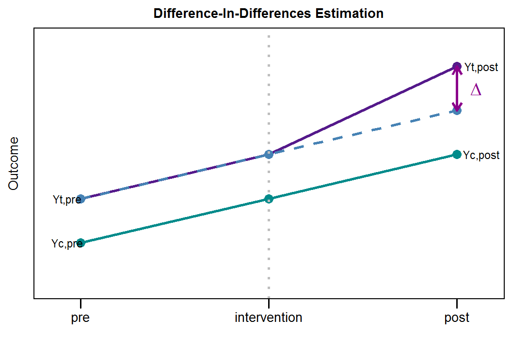
<p class="caption">(\#fig:unnamed-chunk-15)Difference-In-Differences Estimation</p>
</div>

In this stylized example, we observe both groups the test group and the control group at two points in time - before the intervention (pre) and after the intervention (post). If the intervention has no effect on the outcome variable, the difference between the groups should be the same before and after (assuming, of course, that no other intervention occurred that might have induced a change in one of the groups). In the figure above, the blue dotted line represents our expectation regarding the outcome variable for the test group after the intervention and the green solid line represents the observations for the control group. We can see that the actually observed outcome (purple line) for the test group is larger then expected based on the difference before the intervention. This difference (denoted as $\Delta$) is the difference-in-differences estimate and in this example, the intervention had a positive effect on the outcome. It can be derived as follows (see Varian 2016): 

* $Yt,pre$: outcome before intervention for treated groups
* $Yt,post$: outcome after intervention for treated groups
* $Yc,pre$: outcome before intervention for control groups
* $Yc,post$: outcome after intervention for control groups

As mentioned above, the counterfactual is based on the assumption that the (unobserved) change in the outcome by the treated would be the same as the (observed) change in purchases by the control group. To get the impact of the intervention, we then compare the predicted counterfactual outcome to the actual outcome base on the following table:

<br>
<table class=" lightable-paper" style='font-family: "Arial Narrow", arial, helvetica, sans-serif; width: auto !important; margin-left: auto; margin-right: auto;'>
 <thead>
  <tr>
   <th style="text-align:left;font-weight: bold;text-align: center;"> Period </th>
   <th style="text-align:left;font-weight: bold;text-align: center;"> Treatment </th>
   <th style="text-align:left;font-weight: bold;text-align: center;"> Control </th>
   <th style="text-align:left;font-weight: bold;text-align: center;"> Counterfactual </th>
  </tr>
 </thead>
<tbody>
  <tr>
   <td style="text-align:left;width: 100; vertical-align: top !important;"> Before </td>
   <td style="text-align:left;width: 100; vertical-align: top !important;"> Yt,pre </td>
   <td style="text-align:left;width: 100; vertical-align: top !important;"> Yc,pre </td>
   <td style="text-align:left;width: 100; vertical-align: top !important;"> Yt,pre </td>
  </tr>
  <tr>
   <td style="text-align:left;width: 100; vertical-align: top !important;"> After </td>
   <td style="text-align:left;width: 100; vertical-align: top !important;"> Yt,post </td>
   <td style="text-align:left;width: 100; vertical-align: top !important;"> Yc,post </td>
   <td style="text-align:left;width: 100; vertical-align: top !important;"> Yt,pre + (Yc,post - Yc,pre) </td>
  </tr>
</tbody>
</table>
<br>

Hence, the effect of the treatment on the treated is $(Yt,post - Yt,pre) − (Yc,post - Yc,pre)$.

Going back to our music example above, the effect of the treatment on the treated can be computed as follows: $(7.90 - 10.40) - (4.60 - 4.60) = -2.50$. This means that the introduction of Spotify reduces the expenditures in other channels by 2.50EUR per user per month on average.     

There are other approaches that researchers may use to mimic random assignment using data from quasi-experiments, which we won't discuss in detail. For example, matching procedures may be used to make the control and test groups comparable across a set of observable characteristics. In their study of the music market, Datta et al. (2017), for example, investigate whether the adoption of streaming services leads users to diversify their tastes. Similar to the example above, consumers self-selected into the conditions of Spotify users and non-users. Through statistical matching procedures they identified 'statistical twins', i.e., for each Spotify user they identified one person from the group of non-users who is as comparable as possible to the respective user across the set of observable characteristics. The goal is to make the two groups as comparable as possible except for the fact that users in one group adopted the music services and the users in the other group didn't.      

::: {.infobox_orange .hint data-latex="{hint}"}
Although causal models for observational data are often challenging to implement, there are some packages that make it easier for researchers to apply fairly complex models using just a few lines of code. One such example is the [Causal Impact Package](https://google.github.io/CausalImpact/CausalImpact.html) which has been developed by Google. We will cover regression models later, but if you are interested you could already have a look at the package description to see what it can do. The corresponding [video](https://www.youtube.com/watch?v=GTgZfCltMm8) summarizes the underlying intuition nicely.  
:::

#### Measurement and scaling

After deciding on the method of data collection, you need to clarify how you will measure the specified variables.  

##### Levels of measurement

<div align="center">
<iframe width="500" height="310" src="https://www.youtube.com/embed/QsKkuKpR2fM" frameborder="0" allowfullscreen></iframe>
</div>

The first distinction you need to consider pertains to the level of measurement. This step is important because the level of measurement determines what type of analysis you will be able to apply once the data has been collected. Thus, you should make sure that your plan for the data analysis is aligned with the levels of measurement of the dependent and independent variables. There are different characteristics that a scale can have:   

* **Description**: Unique labels or descriptors that are used to designate each value of the scale.
* **Order**: Relative sizes or positions of the descriptors. Described “greater than”, “less than”, and “equal to”.
* **Distance**: Absolute differences between the scale descriptors are known and may be expressed in units.
* **Origin**: Scale has a unique or fixed beginning or true zero point. 

These characteristics determine a variable's level of measurement as we will see next.

###### Categorical (non-metric) variables {-}

There are two types of categorical scales: nominal scales and ordinal scales. 

**Nominal scales** only exhibit the most basic of the characteristics above, namely description. Thus, the values we observe on a nominal scale only serve as labels for identification and categorization. If the scale values are numbers, these numbers do not reflect the amount of the characteristic possessed by the objects. As an example, consider the starting number of boats in a boat race as the picture below shows. 

<div class="figure" style="text-align: center">

<p class="caption">(\#fig:unnamed-chunk-17)Example: nominal scale (starting numbers)</p>
</div>

Note that for a scale with two categories, a nominal variable is also called a *binary* variable. The only permissible mathematical operation with nominal scales is counting. For example, you may count how many participants you have from different occupations. 

Besides description, **ordinal scales** also exhibit the characteristic of order. That is, the numbers indicate the relative position of objects. As an example, consider the order that boats cross the finish line in a boat race. 

<div class="figure" style="text-align: center">

<p class="caption">(\#fig:unnamed-chunk-18)Example: ordinal scale (finishing order)</p>
</div>

Besides counting, you can also order objects. However, note that while the order of objects is known, the scale does not reveal the magnitude of difference between objects. For ordinal variables, all statistics that are based on ranking the data are permissible, such as computing the median, percentiles, ranges, and minimum/maximum values. For example, if you have a 7-point Likert-scale ranging from "fully agree" to "fully disagree" you may compute the median response across objects.    

###### Continuous (metric) variables {-}

There are two types of continuous scales: interval scales and ratio scales. 

Besides description and order, **interval scales** also possess the characteristic of distance. Hence, with interval scales, the differences between objects can be compared. As an example, an expert jury might rate the design of the boats on a scale from 0 to 10. 

<div class="figure" style="text-align: center">

<p class="caption">(\#fig:unnamed-chunk-19)Example: interval scale (design rating 1-10)</p>
</div>
For interval scales - as the name suggests - the intervals at different levels of the scale need to be the equal. For example, the difference between, say 8 and 9 is the same as the difference between, say 3 and 4. However, the zero point for interval scales is arbitrary. In our example, the jury might have also judged the boats on a scale from 10 to 20 and the result would have been the same. Also then, the difference between, say 18 and 19 would be the same as the difference between, say 13 and 14 (1 scale point). Note, however, that it is not meaningful to take ratios of scale values. Because the zero point is arbitrary it is not meaningful, for example, to say that the second boat (rating: 8.4) is twice as good as the third boat (rating: 4.2). If you would change the scale to the range between, say 10 and 20, the ratio wouldn't be preserved (i.e., $8.4/4.2 \neq 18.4/14.2$) but the difference in scale points would be the same (4.2 points). Because the distance between the objects is know, we may compute statistics such as mean and standard deviation with interval level data. 

Lastly, **ratio scales** possess all properties of nominal, ordinal and interval scales. What's more, ratio scales have an absolute zero point. As an example, consider the time it takes a boat in a race to cross the finish line as shown below. 

<div class="figure" style="text-align: center">

<p class="caption">(\#fig:unnamed-chunk-20)Example: ratio scale (time to finish)</p>
</div>
In this case ratios are a meaningful way fo comparing objects. For example, the first boat (7.1 sec.) is twice as fast as the second boat (14.2 sec.). A good way to check whether a variable in measure on a ratio scale is to think about the interpretation of the zero point. With ratio scales, the zero points indicates the absence of something (time in our example). All statistical techniques can be applied to ratio data. 

The following table summarizes which statistics may be applied to which scale type. Don't worry if not all of it makes sense now. We will revisit this table in chapter 4 when we will go through the different statistics.  

<div class="figure" style="text-align: center">

<p class="caption">(\#fig:unnamed-chunk-21)Permissible statistics for different levels of measurement</p>
</div>

As already mentioned, a good understanding of scale types is important to decide which method to apply to test your hypothesis given the data at hand. There are many different flow charts like the one below that can be used as a guide to decide which method to select based on the scale types. 

<div class="figure" style="text-align: center">

<p class="caption">(\#fig:unnamed-chunk-22)Flow chart for test selection (McElreath 2015)</p>
</div>


::: {.infobox_orange .hint data-latex="{hint}"}
There are also many web resources that are useful to determine what type of test is appropriate given the scale type of the dependent and independent variables. For example, check out [this website](https://stats.idre.ucla.edu/other/mult-pkg/whatstat/) by UCLA which not only shows which type of test is appropriate but also has R code available for each of these tests. 
:::

For survey-based research, there are many different scale types to choose from. Below you can find a summary of some of the most common scaling techniques. For details regarding these scaling techniques, please refer to chapter 10, which is dedicated to the topic of questionnaire design.   

<div class="figure" style="text-align: center">

<p class="caption">(\#fig:unnamed-chunk-23)Scaling techniques</p>
</div>

##### Measurement accuracy

<div align="center">
<iframe width="500" height="310" src="https://www.youtube.com/embed/TXmisb-hpeY" frameborder="0" allowfullscreen></iframe>
</div>

Once you have decided on which scale types to use, you should ensure that your measures accurately represent the variable you intended to measure. More precisely, the two goals of measurement are validity (truthfulness; i.e., our measure captures the variable we intended to measure), and reliability (consistency; i.e., the measure consistently measures the same variable). However, it is important to acknowledge that a measurement is not the true value of the characteristic of interest but rather an observation of it. Hence, the difference between the information sought by the researcher and the information generated by the measurement process is the *measurement error*. There are two types of measurement errors: 1) random error, leading to an overall less precise measurement of the variable of interest, and 2) systematic error, causing the observed value to consistently deviate from the variable of interest. Thus, the observed measurement of a variable $X$ can be expressed in terms of the deviation from the true value with respect to the random and systematic measurement errors as follows: 
<br><br>
$X_O = X_T + X_S + X_R$, where<br>
$X_O$ =	Observed value of a variable X<br>
$X_T$ =	True value of the variable X<br>
$X_S$ =	Systematic error in measuring X<br>
$X_R$ =	Random error in measuring X<br>

Hence, the relationship between the two types of errors and our goals of reliability and validity can be expressed as follows. 

###### Reliability (= consistency) {-}

Reliability refers to the extent to which a scale produces consistent results in repeated measurements. This implies the absence of random error: $X_R \rightarrow 0$. However, this does not necessarily imply the absence of systematic error. Thus, $X_0 = X_T + X_S |  \rightarrow X_R = 0$. In the lower left corner of the figure below, you can find an example for a measurement with a high reliability that consistently misses the true value of the variable (i.e., low validity). As an example, consider you wish to measure the intelligence of a person using the head circumference. While the head circumference should produce consistent results in repeated measurements, it is probably not a good proxy for intelligence (low validity). This shows that perfect while perfect reliability requires the absence of random error, it doesn't require the absence of systematic error. 

###### Validity (= truthfulness) {-}

Validity refer to the extent to which differences in observed scale scores reflect true differences among objects on the characteristic being measured. Hence, perfect validity requires the absence of both type of errors. Thus, $X_0 = X_T | \rightarrow X_S = 0, X_R = 0$. The figure below visualizes the to goals of reliability and validity as a function of the two types of measurement error. 

<div class="figure" style="text-align: center">

<p class="caption">(\#fig:unnamed-chunk-24)Validity vs. reliability</p>
</div>


###### Single vs. multi-item scales {-}

Related to the concept of measurement accuracy are some choices that the researcher can make to increase the reliability and validity of the measures. The first choice is between single and multi-item scales to measure a construct. A **construct** is a specific type of concept that exists at a higher level of abstraction than everyday concepts. The construct is unobservable (‘latent’) but can be inferred from other measurable variables (‘items’) that together comprise a scale (latent construct). A multi-item scale consists of multiple items, where an item is a single question or statement to be evaluated. The following figure depicts and example of a multi-item scales to measure the construct 'satisfaction'. 

<div class="figure" style="text-align: center">

<p class="caption">(\#fig:unnamed-chunk-25)Multi-item scales</p>
</div>

Instead of using three different items, we could have also simply used one general item to measure satisfaction.The decision whether to use one or more items depends on the complexity of the construct and usually the rule of thumb is to use as few items as necessary given the complexity of a construct. Given that the empirical evidence regarding the use of single-item vs. multi-item scales is mixed (Bergkvist & Rossiter 2007, Bergvist 2015, Kamakura 2015), the decision should be made on a case-by-case basis, taking the advantages and disadvantages of both approaches into account (see table below).     

<div class="figure" style="text-align: center">

<p class="caption">(\#fig:unnamed-chunk-26)Formative vs. reflective measurement</p>
</div>

As another example, consider the two versions for measuring a person's statistical ability below. The first version uses a single item scale while the second uses a multi-item scale. Note that the last item of the multi-item scale is *reverse-coded*, meaning that while all other statements are worded positively, this item is worded negatively. This is often done as a reliability check to prevent that, for example, respondents become inattentive and always provide answers in the same response category. If the reverse-coded item shows a low correlation with the remaining items, this signals a low reliability of the scale.  

<div class="figure" style="text-align: center">

<p class="caption">(\#fig:unnamed-chunk-27)Single vs. multi-item scale</p>
</div>


###### Formative vs. reflective scales {-}

Another decision related to the concept of measurement accuracy is the choice between formative and reflective measurement. As can be see from the following example, the construct "degree of drunkenness" can be measured in two different ways. While a **formative measurement** uses items that cause the construct, the **reflective measurement** uses items that reflect the construct. One advantage of formative measurement is that managers are often interested to know which specific aspects cause a change in the underlying latent construct so that they can address these aspects. However, this approach also has a downside. Imagine in the example below that a person got drunk by drinking wine. Because our measure doesn't include this specific item, it would have a low validity. This example shows that using formative measures it is important that you consider all possible aspects that might possibly cause the construct of interest. Because this is often difficult to ensure, reflective measurements tend to be more popular. Here, the goal is to have a set of highly correlated items and even if we would remove one of them, we would still end up with a fairly accurate measurement of the construct. Reflective measurements have the additional advantage that it is possible to test their reliability using statistical tests, as we will see later.   

<div class="figure" style="text-align: center">

<p class="caption">(\#fig:unnamed-chunk-28)Formative vs. reflective measurement</p>
</div>

After discussing all the steps in the research process up to the data collection, the subsequent sections will be concerned with data analysis.    

## Learning check {-}

**(LC1.1) Indicate the level of measurement of the following variables:**

* Occupation of survey participants
* Willingness-to-pay for a product 
* Your grade in the marketing research course (1, 2, 3, 4, 5) 
* Rank order of most important product attributes 
* Student registration number
* Gender of survey participants
* Consumer preferences measured on a 5-point Likert scale
* Mileage (kilometers per liter) a car gets
* Age of survey participants
* Temperature in °C
* Number of products sold

**(LC1.2) Which of the answers is correct? A nominal scale …**

- [ ] …has an absolute zero point
- [ ] …possesses all properties of an ordinal scale
- [ ] …can have numerical values
- [ ] …serves as a label to classify/categorize objects
- [ ] None of the above 	

**(LC1.3) Which of these statements regarding formative constructs are true?**

- [ ] Indicators (items) measure the cause for the change of the not directly observable construct
- [ ] Indicators (items) measure the effect of the change in a not directly observable construct
- [ ] The indicators (items) of the scale should be highly correlated
- [ ] Multi-item measurement is particularly important for the increase in the reliability of the measurement
- [ ] None of the above

**(LC1.4) In causal inference tasks, ...**

- [ ] …the main concern is to generate predictions of future outcomes 
- [ ] …the main concern is to maximize the explained variance
- [ ] …observational research is the 'gold standard'
- [ ] …randomization minimizes unsystematic variation
- [ ] None of the above 	

**(LC1.5) True or false? Reliability refers to the consistency of a measurement.**

- [ ] True 
- [ ] False

**(LC1.5) Using a between-subjects design, we ... **

- [ ] ... manipulate the independent variable (treatment) using different persons for each group
- [ ] ... manipulate independent variable using the same participants for each group 
- [ ] ... manipulate the dependent variable (treatment) using different persons for each group
- [ ] ... manipulate dependent variable using the same participants for each group 
- [ ] None of the above

**(LC1.6) When conducting field experiments, the term crossover effect means ...**

- [ ] ... that an individual who was supposed to be assigned to one treatment is accidentally exposed to another treatment 
- [ ] ... that a treated individual affects the outcomes for other untreated individuals  
- [ ] ... that individuals can be part of both the test and the control condition
- [ ] None of the above

**(LC1.7) Conditions for causality are ...**

- [ ] ... a cause and an effect should vary together in the way predicted by the hypothesis under consideration 
- [ ] ... random assignment of test units
- [ ] ... the causing event must occur before the effect
- [ ] ... absence of other possible causal factors
- [ ] None of the above

**(LC1.8) The effect of the treatment on the treated in DID models can be written as ...**

- [ ] $(Yt,pre - Yt,post) − (Yc,post - Yc,pre)$  
- [ ] $(Yt,post - Yt,pre) − (Yc,post - Yc,pre)$ 
- [ ] $(Yt,pre - Yt,post) − (Yc,pre - Yc,post)$  
- [ ] $(Yt,post - Yt,pre) − (Yc,pre - Yc,post)$  
- [ ] None of the above

**(LC1.9) In predictive modeling tasks ...**

- [ ] ... once major concern are unobserved confounders
- [ ] ... one major concern is overfitting 
- [ ] ... we primarily care about the predictive ability of the model  
- [ ] ... we primarily care about causal effects 
- [ ] None of the above

**(LC1.10) True or false? For ordinal scales, the magnitude of difference between scale points is known**

- [ ] True 
- [ ] False


## References {-}

* Angrist J.D. & Pischke, J.S. (2009) Mostly Harmless Econometrics (Princeton Univ Press,Princeton).
* Bergkvist, L., & J.R. Rossiter (2007), “The Predictive Validity of Multiple-Item Versus Single-Item Measures of the Same Constructs,” Journal of Marketing Research.
* Bergvist, L. (2015): Appropriate Use of Single-Item Measures is Here to Stay, Marketing Letters, 26(3).
* Box, Hunter, & Hunter (1978). Statistics for experimenters, John Wiley & Sons, Inc.
* Chandar, B., Gneezy, U., List, J.A., Muir, I. (2019). The Drivers of Social Preferences: Evidence from a Nationwide Tipping Field Experiment, Working Paper. 
* Datta et al. (2017). Changing Their Tune: How Consumers’ Adoption of Online Streaming Affects Music Consumption and Discovery, Marketing Science, 37(1), 1-175. 
* Field, A., Miles J., & Field, Z. (2012). Discovering Statistics Using R. Sage Publications.
* Gelman (2010). Experimental Reasoning in Social Science in Field Experiments and their Critics. Yale University Press.
* Goldfarb, A. & Tucker, C. E. (2014). Conducting Research with Quasi-Experiments: A Guide for Marketers. Working Paper.
* Kamakura, W. (2015): Measure twice and cut once: the carpenter’s rule still applies , Marketing Letters, 26(3).
* Kotler, P. & Armstrong, G. (2009). Principles of Marketing (13th ed.), Prentice Hall.
* Lambrecht, A., & Tucker, C. E. (2018). Field experiments. In: Hanssens, D M & Mizik, N. (eds.), Handbook of Marketing Analytics, Edward Elgar, 32-51. 
* Lambrecht, A. & Tucker, C. E. (2013). When Does Retargeting Work? Information Specificity in Online Advertising, Journal of Markering Research 50(5), 561–576.
* Lewis, Randall A., Justin M. Rao, and David H. Reiley (2011). Here, There, Everywhere: Correlated Online Behaviors Can Lead to Overestimates of the Effects of Advertising,” in Proceedings of the International Conference on World Wide Web. New York: Association for Computing Machinery, 156–66.
* Malhotra, N. K.(2010). Marketing Research: An Applied Orientation (6th. ed.). Prentice Hall.
* Miguel A. Hernán, John Hsu & Brian Healy (2019). A Second Chance to Get Causal Inference Right: A Classification of Data Science Tasks, CHANCE, 32:1, 42-49.
* Pearl, J. (2009). Causal inference in statistics: An overview. Statistics Surveys, 3, 96–146. 
* Pearl, J. (2018). The Book of Why: The New Science of Cause and Effect, Basic Books.
* Shmueli, G. (2010). To Explain or to Predict?, Statistical Science, 25(3), 289-310.
* Varian, H.R. (2016). Causal inference in economics and marketing, Proceedings of the National Academy of Sciences, 113(27), 7310-7315.
* Wlömert N, Papies D (2016) On-demand streaming services and music industry revenues - Insights from Spotify's market entry. Internat. J. Res. Marketing 33(2):314-327.


<!--chapter:end:00-Preliminaries.Rmd-->

---
output:
  html_document:
    toc: yes
  theme: united
  html_notebook: default
  pdf_document:
    toc: yes
---

# Getting started with R

<p style="text-align:center;"></p>
<br>

<div align="center">
<iframe width="500" height="310" src="https://www.youtube.com/embed/ZrQXjeP-0t4" frameborder="0" allowfullscreen></iframe>
</div>
<br>

In this course, we will work with the statistical software package <b>R</b>. Please make sure R is already installed on your computer before the tutorials start. The Comprehensive R Archive Network (CRAN) contains compiled versions of the program that are ready to use free of charge: 

* [Download R](http://cran.r-project.org) [FREE download]

<b>RStudio</b> provides a graphical user interface (GUI) that makes working with R easier. You can also download RStudio for free:

* [Download R Studio](https://www.rstudio.com/products/rstudio/download/#download) (Windows, Linux, OSX, …).

The R Studio software is built on top of R, which means that you can use R without R Studio, but you cannot use R Studio without R. The reason why we will use R Studio is that it provides a nicer user interface compared to the standard R interface. There are several advantages of R over other statistical software packages:

* It`s free
* A lot of free training material
* Runs on a variety of platforms (Windows, Linux, OSX, …)
* Contains statistical routines not yet available in other programs.
* Active global community (e.g., <a href="https://www.r-bloggers.com/" target="_blank">https://www.r-bloggers.com/</a>).
* Many specialized user-written packages.
* It has its own journal (e.g., <a href="http://journal.r-project.org" target="_blank">http://journal.r-project.org</a>).
* Highly integrated and interfaces to other programs.
* It is becoming increasingly popular among practitioners.
* It is a valuable skill to have on the job market.
* It is not as complicated as you might think.
* R is powerful.
* …

## How to download and install R and RStudio

The following video gives you an overview of how to download and install the R and R Studio software.  

<div align="center">
<iframe width="560" height="315" src="https://www.youtube.com/embed/SAxhoYIt7pk" frameborder="0" allowfullscreen></iframe>
</div>

## The R Studio interface 

The following video gives you an introduction to the R Studio interface.  

<div align="center">
<iframe width="560" height="315" src="https://www.youtube.com/embed/dGFJjUiclZ8" frameborder="0" allowfullscreen></iframe>
</div>

## Functions

<div align="center">
<iframe width="560" height="315" src="https://www.youtube.com/embed/FgIdsSKYVSM" frameborder="0" allowfullscreen></iframe>
</div>

When analyzing data in R, you will access most of the functionalities by calling functions. A <b>function</b> is a piece of code written to carry out a specified task (e.g., the ```lm()```-function to run a linear regression). It may or may not accept arguments or parameters and it may or may not return one or more values. Functions are generally called like this:


```r
function_name(arg1 = val1, arg2 = val2, ...)
```

To give you an example, let's use the built-in ```seq()```-function to generate a sequence of numbers. RStudio has some nice features that help you when writing code. For example, when you type "se" and hit TAB, a pop-up shows you possible completions. The more letters you type in, the more precise the suggestions will become and you will notice that after typing in the third letter, a pop-up with possible completions will appear automatically and you can select the desired function using the ↑/↓ arrows and hitting ENTER. The pop-up even reminds you of the arguments that a function takes. If you require more details, you may either press the F1 key or type in ```?seq``` and you will find the details for the function in the help tab in the lower right pane. When you have selected the desired function from the pop-up, RStudio will automatically add matching opening and closing parentheses (i.e., go from ```seq``` to ```seq()```). Within the parentheses you may now type in the arguments that the function takes. Let's use ```seq()``` to generate a sequence of numbers from 1 to 10. To do this, you may include the argument names (i.e., ```from = ```, ```to = ```), or just the desired values in the correct order.  
An important thing to note is that R is case-sensitive, meaning that ```Seq()``` and ```seq()``` are viewed as two different functions by R.


```r
seq(from = 1, to = 10) #creates sequence from 1 to 10
```

```
##  [1]  1  2  3  4  5  6  7  8  9 10
```

```r
seq(1,10) #same result
```

```
##  [1]  1  2  3  4  5  6  7  8  9 10
```

Note that if you specify the argument names, you may enter them in any order. However, if do not include the argument names you must adhere to the order that is specified for the respective function. 


```r
seq(to = 10,from = 1) #produces desired results
```

```
##  [1]  1  2  3  4  5  6  7  8  9 10
```

```r
seq(10,1) #produces reversed sequence
```

```
##  [1] 10  9  8  7  6  5  4  3  2  1
```

## Packages

Most of the R functionalities are contained in distinct modules called <b>packages</b>. When R is installed, a small set of packages is also installed. For example, the Base R package contains the basic functions which let R function as a language: arithmetic, input/output, basic programming support, etc.. However, a large number of packages exist that contain specialized functions that will help you to achieve specific tasks. To access the functions outside the scope of the pre-installed packages, you have to install the package first using the ```install.packages()```-function. For example, to install the ggplot2 package to create graphics, type in ```install.packages("ggplot2")```. Note that you only have to install a package once. After you have installed a package, you may load it to access its functionalities using the ```library()```-function. E.g., to load the ggplot2-package, type in ```library(ggplot2)```. 

The number of R packages is rapidly increasing and there are many specialized packages to perform different types of analytics. 
<p style="text-align:center;">
&nbsp;
</p>


## A typical R session

1. Open RStudio. 

2. Make sure that your <b>working directory</b> is set correctly. The working directory is the location where R will look for files you would like to load and where any files you write to disk will be saved. If you open an existing R script from a specific folder, this folder will, by default, be the working directory. You can check your working directory by using the ```getwd()```-function. In case you wish to change your working directory, you can use the ```setwd()```-function and specify the desired location (i.e., ```setwd(path_to_project_folder)```). Notice that you have to use ```/``` instead of ```\``` to specify the path (i.e., Windows paths copied from the explorer will not work before you change the backward slashes with forward slashes). Alternatively, you can set the working directory with R-Studio by clicking on the "Sessions" tab and selecting "Set Working Directory".

3. Load your data that you wish to analyze (using procedures that we will cover later) 

4. Perform statistical analysis on your data (using methods that we will cover later)

5. Save your <b>workspace</b>. The R workspace is your current working environment incl. any user-defined objects (e.g., data frames, functions). You can save an image of the current workspace to a file called ”.RData”. In fact, RStudio will ask you automatically if you would like to save the workspace when you close the program at the end of the session. In addition, you may save an image of the workspace at any time during the session using the ```save.image()```-function. This saves the workspace image to the current working directory. When you re-open R from that working directory, the workspace will be loaded, and all these things will be available to you again. You may also save the image to any other location by specifying the path to the folder explicitly (i.e., ```save.image(path_to_project_folder)```). If you open R from a different location, you may load the workspace manually using the ```load("")```-function which points to the image file in the respective directory (e.g., ```load("path_to_project_folder/.RData")```. 
<br>
<br>

::: {.infobox_orange .hint data-latex="{hint}"}
Although it is quite common, saving your workspace is not always required. Especially when you save your work in an R script file (which is highly recommended), you will be able to restore your latest results by simply executing the code contained therein again. This also prevents you from carrying over potential mistakes from one session to the next.
:::
<br>

## Getting help

<p style="text-align:center;">
<br>
Source: <a href="https://github.com/allisonhorst/stats-illustrations" target="_blank">Allison Horst</a>
</p>

* Errors & warnings: because R is interactive, consider errors your friends!
* Most importantly: the more time you spend using R, the more comfortable you become with it and it will be easier to see its  advantages 
* Built-in R tutorial: type in “help.start()” to get to the official R tutorial
* Questions regarding specific functions: type in “?function_name” to get to the help page of specific functions (e.g., “?lm” gives you help on the lm() function)
* Video tutorials: Make use of one of the many video tutorials on YouTube (e.g., [http://www.r-bloggers.com/learn-r-from-the-ground-up](http://www.r-bloggers.com/learn-r-from-the-ground-up/)[/](https://www.youtube.com/watch?v=9ZrAYxWPN6c))
* R Cheatsheets: Cheat sheets make it easy to learn about and use some popular packages (<a href="https://www.rstudio.com/resources/cheatsheets/" target="_blank">https://www.rstudio.com/resources/cheatsheets/</a>). They can also be accessed from within RStudio under the "help" menu

<!--chapter:end:01-getting_started.Rmd-->

---
output:
  html_document:
    toc: yes
  theme: united
  html_notebook: default
  pdf_document:
    toc: yes
---

# Data handling

This chapter covers the basics of data handling in R.

## Basic data handling

::: {.infobox .download data-latex="{download}"}
[You can download the corresponding R-Code here](./Code/01-basic_data_handling.R)
:::

<br>
<div align="center">
<iframe width="560" height="315" src="https://www.youtube.com/embed/Q7AdksOeawU" frameborder="0" allowfullscreen></iframe>
</div>
<br>

### Creating objects

Anything created in R is an object. You can assign values to objects using the assignment operator ``` <-```:


```r
x <- "hello world" #assigns the words "hello world" to the object x
#this is a comment
```

Note that comments may be included in the code after a ```#```. The text after ```#``` is not evaluated when the code is run; they can be written directly after the code or in a separate line.

To see the value of an object, simply type its name into the console and hit enter:


```r
x #print the value of x to the console
```

```
## [1] "hello world"
```

You can also explicitly tell R to print the value of an object:


```r
print(x) #print the value of x to the console
```

```
## [1] "hello world"
```

Note that because we assign characters in this case (as opposed to e.g., numeric values), we need to wrap the words in quotation marks, which must always come in pairs. Although RStudio automatically adds a pair of quotation marks (i.e., opening and closing marks) when you enter the opening marks it could be that you end up with a mismatch by accident (e.g., ```x <- "hello```). In this case, R will show you the continuation character “+”. The same could happen if you did not execute the full command by accident. The "+" means that R is expecting more input. If this happens, either add the missing pair, or press ESCAPE to abort the expression and try again.

To change the value of an object, you can simply overwrite the previous value. For example, you could also assign a numeric value to "x" to perform some basic operations: 


```r
x <- 2 #assigns the value of 2 to the object x
print(x)
```

```
## [1] 2
```

```r
x == 2  #checks whether the value of x is equal to 2
```

```
## [1] TRUE
```

```r
x != 3  #checks whether the value of x is NOT equal to 3
```

```
## [1] TRUE
```

```r
x < 3   #checks whether the value of x is less than 3
```

```
## [1] TRUE
```

```r
x > 3   #checks whether the value of x is greater than 3
```

```
## [1] FALSE
```

Note that the name of the object is completely arbitrary. We could also define a second object "y", assign it a different value and use it to perform some basic mathematical operations:


```r
y <- 5 #assigns the value of 2 to the object x
x == y #checks whether the value of x to the value of y
```

```
## [1] FALSE
```

```r
x*y #multiplication of x and y
```

```
## [1] 10
```

```r
x + y #adds the values of x and y together
```

```
## [1] 7
```

```r
y^2 + 3*x #adds the value of y squared and 3x the value of x together
```

```
## [1] 31
```

<b>Object names</b>

Please note that object names must start with a letter and can only contain letters, numbers, as well as the ```.```, and ```_``` separators. It is important to give your objects descriptive names and to be as consistent as possible with the naming structure. In this tutorial we will be using lower case words separated by underscores (e.g., ```object_name```). There are other naming conventions, such as using a ```.``` as a separator (e.g., ```object.name```), or using upper case letters (```objectName```). It doesn't really matter which one you choose, as long as you are consistent.

### Data types

The most important types of data are:


Data type   | Description	 
-------------   | --------------------------------------------------------------------------
Numeric   | Approximations of the real numbers,  $\normalsize\mathbb{R}$ (e.g., mileage a car gets: 23.6, 20.9, etc.)
Integer   | Whole numbers,  $\normalsize\mathbb{Z}$ (e.g., number of sales: 7, 0, 120, 63, etc.)
Character   | Text data (strings, e.g., product names)
Factor    | Categorical data for classification (e.g., product groups)
Logical   | TRUE, FALSE
Date    | Date variables (e.g., sales dates: 21-06-2015, 06-21-15, 21-Jun-2015, etc.)

Variables can be converted from one type to another using the appropriate functions (e.g., ```as.numeric()```,```as.integer()```,```as.character()```, ```as.factor()```,```as.logical()```, ```as.Date()```). For example, we could convert the object ```y``` to character as follows:


```r
y <- as.character(y)
print(y)
```

```
## [1] "5"
```

Notice how the value is in quotation marks since it is now of type character. 

Entering a vector of data into R can be done with the ``` c(x1,x2,..,x_n)``` ("concatenate") command. In order to be able to use our vector (or any other variable) later on we want to assign it a name using the assignment operator ``` <-```. You can choose names arbitrarily (but the first character of a name cannot be a number). Just make sure they are descriptive and unique. Assigning the same name to two variables (e.g. vectors) will result in deletion of the first. Instead of converting a variable we can also create a new one and use an existing one as input. In this case we omit the ```as.``` and simply use the name of the type (e.g. ```factor()```). There is a subtle difference between the two: When converting a variable, with e.g. ```as.factor()```, we can only pass the variable we want to convert without additional arguments and R determines the factor levels by the existing unique values in the variable or just returns the variable itself if it is a factor already. When we specifically create a variable (just ```factor()```, ```matrix()```, etc.), we can and should set the options of this type explicitly. For a factor variable these could be the labels and levels, for a matrix the number of rows and columns and so on.  


```r
#Numeric:
top10_track_streams <- c(163608, 126687, 120480, 110022, 108630, 95639, 94690, 89011, 87869, 85599) 

#Character:
top10_artist_names <- c("Axwell /\\ Ingrosso", "Imagine Dragons", "J. Balvin", "Robin Schulz", "Jonas Blue", "David Guetta", "French Montana", "Calvin Harris", "Liam Payne", "Lauv") # Characters have to be put in ""

#Factor variable with two categories:
top10_track_explicit <- c(0,0,0,0,0,0,1,1,0,0)
top10_track_explicit <- factor(top10_track_explicit, 
                               levels = 0:1, 
                               labels = c("not explicit", "explicit"))

#Factor variable with more than two categories:
top10_artist_genre <- c("Dance","Alternative","Latino","Dance","Dance","Dance","Hip-Hop/Rap","Dance","Pop","Pop")
top10_artist_genre <- as.factor(top10_artist_genre)

#Date:
top_10_track_release_date <- as.Date(c("2017-05-24", "2017-06-23", "2017-07-03", "2017-06-30", "2017-05-05", "2017-06-09", "2017-07-14", "2017-06-16", "2017-05-18", "2017-05-19"))

#Logical
top10_track_explicit_1 <- c(FALSE,FALSE,FALSE,FALSE,FALSE,FALSE,TRUE,TRUE,FALSE,FALSE)  
```

In order to "call" a vector we can now simply enter its name:


```r
top10_track_streams
```

```
##  [1] 163608 126687 120480 110022 108630  95639  94690  89011  87869  85599
```

```r
top_10_track_release_date
```

```
##  [1] "2017-05-24" "2017-06-23" "2017-07-03" "2017-06-30" "2017-05-05"
##  [6] "2017-06-09" "2017-07-14" "2017-06-16" "2017-05-18" "2017-05-19"
```

In order to check the type of a variable the ```class()``` function is used.


```r
class(top_10_track_release_date)
```

```
## [1] "Date"
```

### Data structures

Now let's create a table that contains the variables in columns and each observation in a row (like in SPSS or Excel). There are different data structures in R (e.g., Matrix, Vector, List, Array). In this course, we will mainly use <b>data frames</b>. 

<p style="text-align:center;"></p>

Data frames are similar to matrices but are more flexible in the sense that they may contain different data types (e.g., numeric, character, etc.), where all values of vectors and matrices have to be of the same type (e.g. character). It is often more convenient to use characters instead of numbers (e.g. when indicating a persons sex: "F", "M" instead of 1 for female , 2 for male). Thus we would like to combine both numeric and character values while retaining the respective desired features. This is where "data frames" come into play. Data frames can have different types of data in each column. For example, we can combine the vectors created above in one data frame using ```data.frame()```. This creates a separate column for each vector, which is usually what we want (similar to SPSS or Excel).


```r
music_data <- data.frame(top10_track_streams, 
                         top10_artist_names, 
                         top10_track_explicit, 
                         top10_artist_genre, 
                         top_10_track_release_date, 
                         top10_track_explicit_1)
```

#### Accessing data in data frames

When entering the name of a data frame, R returns the entire data frame: 


```r
music_data # Returns the entire data frame
```

<div data-pagedtable="false">
  <script data-pagedtable-source type="application/json">
{"columns":[{"label":["top10_track_streams"],"name":[1],"type":["dbl"],"align":["right"]},{"label":["top10_artist_names"],"name":[2],"type":["chr"],"align":["left"]},{"label":["top10_track_explicit"],"name":[3],"type":["fct"],"align":["left"]},{"label":["top10_artist_genre"],"name":[4],"type":["fct"],"align":["left"]},{"label":["top_10_track_release_date"],"name":[5],"type":["date"],"align":["right"]},{"label":["top10_track_explicit_1"],"name":[6],"type":["lgl"],"align":["right"]}],"data":[{"1":"163608","2":"Axwell /\\\\ Ingrosso","3":"not explicit","4":"Dance","5":"2017-05-24","6":"FALSE"},{"1":"126687","2":"Imagine Dragons","3":"not explicit","4":"Alternative","5":"2017-06-23","6":"FALSE"},{"1":"120480","2":"J. Balvin","3":"not explicit","4":"Latino","5":"2017-07-03","6":"FALSE"},{"1":"110022","2":"Robin Schulz","3":"not explicit","4":"Dance","5":"2017-06-30","6":"FALSE"},{"1":"108630","2":"Jonas Blue","3":"not explicit","4":"Dance","5":"2017-05-05","6":"FALSE"},{"1":"95639","2":"David Guetta","3":"not explicit","4":"Dance","5":"2017-06-09","6":"FALSE"},{"1":"94690","2":"French Montana","3":"explicit","4":"Hip-Hop/Rap","5":"2017-07-14","6":"TRUE"},{"1":"89011","2":"Calvin Harris","3":"explicit","4":"Dance","5":"2017-06-16","6":"TRUE"},{"1":"87869","2":"Liam Payne","3":"not explicit","4":"Pop","5":"2017-05-18","6":"FALSE"},{"1":"85599","2":"Lauv","3":"not explicit","4":"Pop","5":"2017-05-19","6":"FALSE"}],"options":{"columns":{"min":{},"max":[10]},"rows":{"min":[10],"max":[10]},"pages":{}}}
  </script>
</div>

Hint: You may also use the ```View()```-function to view the data in a table format (like in SPSS or Excel), i.e. enter the command ```View(data)```. Note that you can achieve the same by clicking on the small table icon next to the data frame in the "Environment"-window on the right in RStudio. 

Sometimes it is convenient to return only specific values instead of the entire data frame. There are a variety of ways to identify the elements of a data frame. One easy way is to explicitly state, which rows and columns you wish to view. The general form of the command is ```data.frame[rows,columns]```. By leaving one of the arguments of ```data.frame[rows,columns]``` blank (e.g., ```data.frame[rows,]```) we tell R that we want to access either all rows or columns, respectively. Here are some examples:  


```r
music_data[ , 2:4] # all rows and columns 2,3,4
```

<div data-pagedtable="false">
  <script data-pagedtable-source type="application/json">
{"columns":[{"label":["top10_artist_names"],"name":[1],"type":["chr"],"align":["left"]},{"label":["top10_track_explicit"],"name":[2],"type":["fct"],"align":["left"]},{"label":["top10_artist_genre"],"name":[3],"type":["fct"],"align":["left"]}],"data":[{"1":"Axwell /\\\\ Ingrosso","2":"not explicit","3":"Dance"},{"1":"Imagine Dragons","2":"not explicit","3":"Alternative"},{"1":"J. Balvin","2":"not explicit","3":"Latino"},{"1":"Robin Schulz","2":"not explicit","3":"Dance"},{"1":"Jonas Blue","2":"not explicit","3":"Dance"},{"1":"David Guetta","2":"not explicit","3":"Dance"},{"1":"French Montana","2":"explicit","3":"Hip-Hop/Rap"},{"1":"Calvin Harris","2":"explicit","3":"Dance"},{"1":"Liam Payne","2":"not explicit","3":"Pop"},{"1":"Lauv","2":"not explicit","3":"Pop"}],"options":{"columns":{"min":{},"max":[10]},"rows":{"min":[10],"max":[10]},"pages":{}}}
  </script>
</div>

```r
music_data[ ,c("top10_artist_names", "top_10_track_release_date")] # all rows and columns "top10_artist_names" and "top_10_track_release_date"
```

<div data-pagedtable="false">
  <script data-pagedtable-source type="application/json">
{"columns":[{"label":["top10_artist_names"],"name":[1],"type":["chr"],"align":["left"]},{"label":["top_10_track_release_date"],"name":[2],"type":["date"],"align":["right"]}],"data":[{"1":"Axwell /\\\\ Ingrosso","2":"2017-05-24"},{"1":"Imagine Dragons","2":"2017-06-23"},{"1":"J. Balvin","2":"2017-07-03"},{"1":"Robin Schulz","2":"2017-06-30"},{"1":"Jonas Blue","2":"2017-05-05"},{"1":"David Guetta","2":"2017-06-09"},{"1":"French Montana","2":"2017-07-14"},{"1":"Calvin Harris","2":"2017-06-16"},{"1":"Liam Payne","2":"2017-05-18"},{"1":"Lauv","2":"2017-05-19"}],"options":{"columns":{"min":{},"max":[10]},"rows":{"min":[10],"max":[10]},"pages":{}}}
  </script>
</div>

```r
music_data[1:5, c("top10_artist_names", "top_10_track_release_date")] # rows 1 to 5 and columns "top10_artist_names"" and "top_10_track_release_date"
```

<div data-pagedtable="false">
  <script data-pagedtable-source type="application/json">
{"columns":[{"label":[""],"name":["_rn_"],"type":[""],"align":["left"]},{"label":["top10_artist_names"],"name":[1],"type":["chr"],"align":["left"]},{"label":["top_10_track_release_date"],"name":[2],"type":["date"],"align":["right"]}],"data":[{"1":"Axwell /\\\\ Ingrosso","2":"2017-05-24","_rn_":"1"},{"1":"Imagine Dragons","2":"2017-06-23","_rn_":"2"},{"1":"J. Balvin","2":"2017-07-03","_rn_":"3"},{"1":"Robin Schulz","2":"2017-06-30","_rn_":"4"},{"1":"Jonas Blue","2":"2017-05-05","_rn_":"5"}],"options":{"columns":{"min":{},"max":[10]},"rows":{"min":[10],"max":[10]},"pages":{}}}
  </script>
</div>

You may also create subsets of the data frame, e.g., using mathematical expressions:


```r
  music_data[top10_track_explicit == "explicit",] # show only tracks with explicit lyrics  
```

<div data-pagedtable="false">
  <script data-pagedtable-source type="application/json">
{"columns":[{"label":[""],"name":["_rn_"],"type":[""],"align":["left"]},{"label":["top10_track_streams"],"name":[1],"type":["dbl"],"align":["right"]},{"label":["top10_artist_names"],"name":[2],"type":["chr"],"align":["left"]},{"label":["top10_track_explicit"],"name":[3],"type":["fct"],"align":["left"]},{"label":["top10_artist_genre"],"name":[4],"type":["fct"],"align":["left"]},{"label":["top_10_track_release_date"],"name":[5],"type":["date"],"align":["right"]},{"label":["top10_track_explicit_1"],"name":[6],"type":["lgl"],"align":["right"]}],"data":[{"1":"94690","2":"French Montana","3":"explicit","4":"Hip-Hop/Rap","5":"2017-07-14","6":"TRUE","_rn_":"7"},{"1":"89011","2":"Calvin Harris","3":"explicit","4":"Dance","5":"2017-06-16","6":"TRUE","_rn_":"8"}],"options":{"columns":{"min":{},"max":[10]},"rows":{"min":[10],"max":[10]},"pages":{}}}
  </script>
</div>

```r
  music_data[top10_track_streams > 100000,] # show only tracks with more than 100,000 streams  
```

<div data-pagedtable="false">
  <script data-pagedtable-source type="application/json">
{"columns":[{"label":[""],"name":["_rn_"],"type":[""],"align":["left"]},{"label":["top10_track_streams"],"name":[1],"type":["dbl"],"align":["right"]},{"label":["top10_artist_names"],"name":[2],"type":["chr"],"align":["left"]},{"label":["top10_track_explicit"],"name":[3],"type":["fct"],"align":["left"]},{"label":["top10_artist_genre"],"name":[4],"type":["fct"],"align":["left"]},{"label":["top_10_track_release_date"],"name":[5],"type":["date"],"align":["right"]},{"label":["top10_track_explicit_1"],"name":[6],"type":["lgl"],"align":["right"]}],"data":[{"1":"163608","2":"Axwell /\\\\ Ingrosso","3":"not explicit","4":"Dance","5":"2017-05-24","6":"FALSE","_rn_":"1"},{"1":"126687","2":"Imagine Dragons","3":"not explicit","4":"Alternative","5":"2017-06-23","6":"FALSE","_rn_":"2"},{"1":"120480","2":"J. Balvin","3":"not explicit","4":"Latino","5":"2017-07-03","6":"FALSE","_rn_":"3"},{"1":"110022","2":"Robin Schulz","3":"not explicit","4":"Dance","5":"2017-06-30","6":"FALSE","_rn_":"4"},{"1":"108630","2":"Jonas Blue","3":"not explicit","4":"Dance","5":"2017-05-05","6":"FALSE","_rn_":"5"}],"options":{"columns":{"min":{},"max":[10]},"rows":{"min":[10],"max":[10]},"pages":{}}}
  </script>
</div>

```r
  music_data[top10_artist_names == 'Robin Schulz',] # returns all observations from artist "Robin Schulz"
```

<div data-pagedtable="false">
  <script data-pagedtable-source type="application/json">
{"columns":[{"label":[""],"name":["_rn_"],"type":[""],"align":["left"]},{"label":["top10_track_streams"],"name":[1],"type":["dbl"],"align":["right"]},{"label":["top10_artist_names"],"name":[2],"type":["chr"],"align":["left"]},{"label":["top10_track_explicit"],"name":[3],"type":["fct"],"align":["left"]},{"label":["top10_artist_genre"],"name":[4],"type":["fct"],"align":["left"]},{"label":["top_10_track_release_date"],"name":[5],"type":["date"],"align":["right"]},{"label":["top10_track_explicit_1"],"name":[6],"type":["lgl"],"align":["right"]}],"data":[{"1":"110022","2":"Robin Schulz","3":"not explicit","4":"Dance","5":"2017-06-30","6":"FALSE","_rn_":"4"}],"options":{"columns":{"min":{},"max":[10]},"rows":{"min":[10],"max":[10]},"pages":{}}}
  </script>
</div>

```r
  music_data[top10_track_explicit == "explicit",] # show only explicit tracks
```

<div data-pagedtable="false">
  <script data-pagedtable-source type="application/json">
{"columns":[{"label":[""],"name":["_rn_"],"type":[""],"align":["left"]},{"label":["top10_track_streams"],"name":[1],"type":["dbl"],"align":["right"]},{"label":["top10_artist_names"],"name":[2],"type":["chr"],"align":["left"]},{"label":["top10_track_explicit"],"name":[3],"type":["fct"],"align":["left"]},{"label":["top10_artist_genre"],"name":[4],"type":["fct"],"align":["left"]},{"label":["top_10_track_release_date"],"name":[5],"type":["date"],"align":["right"]},{"label":["top10_track_explicit_1"],"name":[6],"type":["lgl"],"align":["right"]}],"data":[{"1":"94690","2":"French Montana","3":"explicit","4":"Hip-Hop/Rap","5":"2017-07-14","6":"TRUE","_rn_":"7"},{"1":"89011","2":"Calvin Harris","3":"explicit","4":"Dance","5":"2017-06-16","6":"TRUE","_rn_":"8"}],"options":{"columns":{"min":{},"max":[10]},"rows":{"min":[10],"max":[10]},"pages":{}}}
  </script>
</div>

The same can be achieved using the ```subset()```-function


```r
  subset(music_data,top10_track_explicit == "explicit") # selects subsets of observations in a data frame
```

<div data-pagedtable="false">
  <script data-pagedtable-source type="application/json">
{"columns":[{"label":[""],"name":["_rn_"],"type":[""],"align":["left"]},{"label":["top10_track_streams"],"name":[1],"type":["dbl"],"align":["right"]},{"label":["top10_artist_names"],"name":[2],"type":["chr"],"align":["left"]},{"label":["top10_track_explicit"],"name":[3],"type":["fct"],"align":["left"]},{"label":["top10_artist_genre"],"name":[4],"type":["fct"],"align":["left"]},{"label":["top_10_track_release_date"],"name":[5],"type":["date"],"align":["right"]},{"label":["top10_track_explicit_1"],"name":[6],"type":["lgl"],"align":["right"]}],"data":[{"1":"94690","2":"French Montana","3":"explicit","4":"Hip-Hop/Rap","5":"2017-07-14","6":"TRUE","_rn_":"7"},{"1":"89011","2":"Calvin Harris","3":"explicit","4":"Dance","5":"2017-06-16","6":"TRUE","_rn_":"8"}],"options":{"columns":{"min":{},"max":[10]},"rows":{"min":[10],"max":[10]},"pages":{}}}
  </script>
</div>

```r
  #creates a new data frame that only contains tracks from genre "Dance" 
  music_data_dance <- subset(music_data,top10_artist_genre == "Dance") 
  music_data_dance
```

<div data-pagedtable="false">
  <script data-pagedtable-source type="application/json">
{"columns":[{"label":[""],"name":["_rn_"],"type":[""],"align":["left"]},{"label":["top10_track_streams"],"name":[1],"type":["dbl"],"align":["right"]},{"label":["top10_artist_names"],"name":[2],"type":["chr"],"align":["left"]},{"label":["top10_track_explicit"],"name":[3],"type":["fct"],"align":["left"]},{"label":["top10_artist_genre"],"name":[4],"type":["fct"],"align":["left"]},{"label":["top_10_track_release_date"],"name":[5],"type":["date"],"align":["right"]},{"label":["top10_track_explicit_1"],"name":[6],"type":["lgl"],"align":["right"]}],"data":[{"1":"163608","2":"Axwell /\\\\ Ingrosso","3":"not explicit","4":"Dance","5":"2017-05-24","6":"FALSE","_rn_":"1"},{"1":"110022","2":"Robin Schulz","3":"not explicit","4":"Dance","5":"2017-06-30","6":"FALSE","_rn_":"4"},{"1":"108630","2":"Jonas Blue","3":"not explicit","4":"Dance","5":"2017-05-05","6":"FALSE","_rn_":"5"},{"1":"95639","2":"David Guetta","3":"not explicit","4":"Dance","5":"2017-06-09","6":"FALSE","_rn_":"6"},{"1":"89011","2":"Calvin Harris","3":"explicit","4":"Dance","5":"2017-06-16","6":"TRUE","_rn_":"8"}],"options":{"columns":{"min":{},"max":[10]},"rows":{"min":[10],"max":[10]},"pages":{}}}
  </script>
</div>

```r
  rm(music_data_dance) # removes an object from the workspace
```

You may also change the order of the variables in a data frame by using the ```order()```-function


```r
#Orders by genre (ascending) and streams (descending)
music_data[order(top10_artist_genre,-top10_track_streams),] 
```

<div data-pagedtable="false">
  <script data-pagedtable-source type="application/json">
{"columns":[{"label":[""],"name":["_rn_"],"type":[""],"align":["left"]},{"label":["top10_track_streams"],"name":[1],"type":["dbl"],"align":["right"]},{"label":["top10_artist_names"],"name":[2],"type":["chr"],"align":["left"]},{"label":["top10_track_explicit"],"name":[3],"type":["fct"],"align":["left"]},{"label":["top10_artist_genre"],"name":[4],"type":["fct"],"align":["left"]},{"label":["top_10_track_release_date"],"name":[5],"type":["date"],"align":["right"]},{"label":["top10_track_explicit_1"],"name":[6],"type":["lgl"],"align":["right"]}],"data":[{"1":"126687","2":"Imagine Dragons","3":"not explicit","4":"Alternative","5":"2017-06-23","6":"FALSE","_rn_":"2"},{"1":"163608","2":"Axwell /\\\\ Ingrosso","3":"not explicit","4":"Dance","5":"2017-05-24","6":"FALSE","_rn_":"1"},{"1":"110022","2":"Robin Schulz","3":"not explicit","4":"Dance","5":"2017-06-30","6":"FALSE","_rn_":"4"},{"1":"108630","2":"Jonas Blue","3":"not explicit","4":"Dance","5":"2017-05-05","6":"FALSE","_rn_":"5"},{"1":"95639","2":"David Guetta","3":"not explicit","4":"Dance","5":"2017-06-09","6":"FALSE","_rn_":"6"},{"1":"89011","2":"Calvin Harris","3":"explicit","4":"Dance","5":"2017-06-16","6":"TRUE","_rn_":"8"},{"1":"94690","2":"French Montana","3":"explicit","4":"Hip-Hop/Rap","5":"2017-07-14","6":"TRUE","_rn_":"7"},{"1":"120480","2":"J. Balvin","3":"not explicit","4":"Latino","5":"2017-07-03","6":"FALSE","_rn_":"3"},{"1":"87869","2":"Liam Payne","3":"not explicit","4":"Pop","5":"2017-05-18","6":"FALSE","_rn_":"9"},{"1":"85599","2":"Lauv","3":"not explicit","4":"Pop","5":"2017-05-19","6":"FALSE","_rn_":"10"}],"options":{"columns":{"min":{},"max":[10]},"rows":{"min":[10],"max":[10]},"pages":{}}}
  </script>
</div>

#### Inspecting the content of a data frame

The ```head()``` function displays the first X elements/rows of a vector, matrix, table, data frame or function.


```r
head(music_data, 3) # returns the first X rows (here, the first 3 rows)
```

<div data-pagedtable="false">
  <script data-pagedtable-source type="application/json">
{"columns":[{"label":[""],"name":["_rn_"],"type":[""],"align":["left"]},{"label":["top10_track_streams"],"name":[1],"type":["dbl"],"align":["right"]},{"label":["top10_artist_names"],"name":[2],"type":["chr"],"align":["left"]},{"label":["top10_track_explicit"],"name":[3],"type":["fct"],"align":["left"]},{"label":["top10_artist_genre"],"name":[4],"type":["fct"],"align":["left"]},{"label":["top_10_track_release_date"],"name":[5],"type":["date"],"align":["right"]},{"label":["top10_track_explicit_1"],"name":[6],"type":["lgl"],"align":["right"]}],"data":[{"1":"163608","2":"Axwell /\\\\ Ingrosso","3":"not explicit","4":"Dance","5":"2017-05-24","6":"FALSE","_rn_":"1"},{"1":"126687","2":"Imagine Dragons","3":"not explicit","4":"Alternative","5":"2017-06-23","6":"FALSE","_rn_":"2"},{"1":"120480","2":"J. Balvin","3":"not explicit","4":"Latino","5":"2017-07-03","6":"FALSE","_rn_":"3"}],"options":{"columns":{"min":{},"max":[10]},"rows":{"min":[10],"max":[10]},"pages":{}}}
  </script>
</div>

The ```tail()``` function is similar, except it displays the last elements/rows.


```r
tail(music_data, 3) # returns the last X rows (here, the last 3 rows)
```

<div data-pagedtable="false">
  <script data-pagedtable-source type="application/json">
{"columns":[{"label":[""],"name":["_rn_"],"type":[""],"align":["left"]},{"label":["top10_track_streams"],"name":[1],"type":["dbl"],"align":["right"]},{"label":["top10_artist_names"],"name":[2],"type":["chr"],"align":["left"]},{"label":["top10_track_explicit"],"name":[3],"type":["fct"],"align":["left"]},{"label":["top10_artist_genre"],"name":[4],"type":["fct"],"align":["left"]},{"label":["top_10_track_release_date"],"name":[5],"type":["date"],"align":["right"]},{"label":["top10_track_explicit_1"],"name":[6],"type":["lgl"],"align":["right"]}],"data":[{"1":"89011","2":"Calvin Harris","3":"explicit","4":"Dance","5":"2017-06-16","6":"TRUE","_rn_":"8"},{"1":"87869","2":"Liam Payne","3":"not explicit","4":"Pop","5":"2017-05-18","6":"FALSE","_rn_":"9"},{"1":"85599","2":"Lauv","3":"not explicit","4":"Pop","5":"2017-05-19","6":"FALSE","_rn_":"10"}],"options":{"columns":{"min":{},"max":[10]},"rows":{"min":[10],"max":[10]},"pages":{}}}
  </script>
</div>

```names()``` returns the names of an R object. When, for example, it is called on a data frame, it returns the names of the columns. 


```r
names(music_data) # returns the names of the variables in the data frame
```

```
## [1] "top10_track_streams"       "top10_artist_names"       
## [3] "top10_track_explicit"      "top10_artist_genre"       
## [5] "top_10_track_release_date" "top10_track_explicit_1"
```

```str()``` displays the internal structure of an R object. In the case of a data frame, it returns the class (e.g., numeric, factor, etc.) of each variable, as well as the number of observations and the number of variables. 


```r
str(music_data) # returns the structure of the data frame
```

```
## 'data.frame':	10 obs. of  6 variables:
##  $ top10_track_streams      : num  163608 126687 120480 110022 108630 ...
##  $ top10_artist_names       : chr  "Axwell /\\ Ingrosso" "Imagine Dragons" "J. Balvin" "Robin Schulz" ...
##  $ top10_track_explicit     : Factor w/ 2 levels "not explicit",..: 1 1 1 1 1 1 2 2 1 1
##  $ top10_artist_genre       : Factor w/ 5 levels "Alternative",..: 2 1 4 2 2 2 3 2 5 5
##  $ top_10_track_release_date: Date, format: "2017-05-24" "2017-06-23" ...
##  $ top10_track_explicit_1   : logi  FALSE FALSE FALSE FALSE FALSE FALSE ...
```

```nrow()``` and ```ncol()``` return the rows and columns of a data frame or matrix, respectively. ```dim()``` displays the dimensions of an R object.


```r
nrow(music_data) # returns the number of rows 
```

```
## [1] 10
```

```r
ncol(music_data) # returns the number of columns 
```

```
## [1] 6
```

```r
dim(music_data) # returns the dimensions of a data frame
```

```
## [1] 10  6
```

```ls()``` can be used to list all objects that are associated with an R object. 


```r
ls(music_data) # list all objects associated with an object
```

```
## [1] "top_10_track_release_date" "top10_artist_genre"       
## [3] "top10_artist_names"        "top10_track_explicit"     
## [5] "top10_track_explicit_1"    "top10_track_streams"
```

#### Append and delete variables to/from data frames

To call a certain column in a data frame, we may also use the ```$``` notation. For example, this returns all values associated with the variable "top10_track_streams":
  

```r
music_data$top10_track_streams
```

```
##  [1] 163608 126687 120480 110022 108630  95639  94690  89011  87869  85599
```

Assume that you wanted to add an additional variable to the data frame. You may use the ```$``` notation to achieve this:


```r
# Create new variable as the log of the number of streams 
music_data$log_streams <- log(music_data$top10_track_streams) 
# Create an ascending count variable which might serve as an ID
music_data$obs_number <- 1:nrow(music_data)
head(music_data)
```

<div data-pagedtable="false">
  <script data-pagedtable-source type="application/json">
{"columns":[{"label":[""],"name":["_rn_"],"type":[""],"align":["left"]},{"label":["top10_track_streams"],"name":[1],"type":["dbl"],"align":["right"]},{"label":["top10_artist_names"],"name":[2],"type":["chr"],"align":["left"]},{"label":["top10_track_explicit"],"name":[3],"type":["fct"],"align":["left"]},{"label":["top10_artist_genre"],"name":[4],"type":["fct"],"align":["left"]},{"label":["top_10_track_release_date"],"name":[5],"type":["date"],"align":["right"]},{"label":["top10_track_explicit_1"],"name":[6],"type":["lgl"],"align":["right"]},{"label":["log_streams"],"name":[7],"type":["dbl"],"align":["right"]},{"label":["obs_number"],"name":[8],"type":["int"],"align":["right"]}],"data":[{"1":"163608","2":"Axwell /\\\\ Ingrosso","3":"not explicit","4":"Dance","5":"2017-05-24","6":"FALSE","7":"12.00523","8":"1","_rn_":"1"},{"1":"126687","2":"Imagine Dragons","3":"not explicit","4":"Alternative","5":"2017-06-23","6":"FALSE","7":"11.74947","8":"2","_rn_":"2"},{"1":"120480","2":"J. Balvin","3":"not explicit","4":"Latino","5":"2017-07-03","6":"FALSE","7":"11.69924","8":"3","_rn_":"3"},{"1":"110022","2":"Robin Schulz","3":"not explicit","4":"Dance","5":"2017-06-30","6":"FALSE","7":"11.60844","8":"4","_rn_":"4"},{"1":"108630","2":"Jonas Blue","3":"not explicit","4":"Dance","5":"2017-05-05","6":"FALSE","7":"11.59570","8":"5","_rn_":"5"},{"1":"95639","2":"David Guetta","3":"not explicit","4":"Dance","5":"2017-06-09","6":"FALSE","7":"11.46834","8":"6","_rn_":"6"}],"options":{"columns":{"min":{},"max":[10]},"rows":{"min":[10],"max":[10]},"pages":{}}}
  </script>
</div>

To delete a variable, you can simply create a ```subset``` of the full data frame that excludes the variables that you wish to drop:


```r
music_data <- subset(music_data,select = -c(log_streams)) # deletes the variable log streams 
head(music_data)
```

<div data-pagedtable="false">
  <script data-pagedtable-source type="application/json">
{"columns":[{"label":[""],"name":["_rn_"],"type":[""],"align":["left"]},{"label":["top10_track_streams"],"name":[1],"type":["dbl"],"align":["right"]},{"label":["top10_artist_names"],"name":[2],"type":["chr"],"align":["left"]},{"label":["top10_track_explicit"],"name":[3],"type":["fct"],"align":["left"]},{"label":["top10_artist_genre"],"name":[4],"type":["fct"],"align":["left"]},{"label":["top_10_track_release_date"],"name":[5],"type":["date"],"align":["right"]},{"label":["top10_track_explicit_1"],"name":[6],"type":["lgl"],"align":["right"]},{"label":["obs_number"],"name":[7],"type":["int"],"align":["right"]}],"data":[{"1":"163608","2":"Axwell /\\\\ Ingrosso","3":"not explicit","4":"Dance","5":"2017-05-24","6":"FALSE","7":"1","_rn_":"1"},{"1":"126687","2":"Imagine Dragons","3":"not explicit","4":"Alternative","5":"2017-06-23","6":"FALSE","7":"2","_rn_":"2"},{"1":"120480","2":"J. Balvin","3":"not explicit","4":"Latino","5":"2017-07-03","6":"FALSE","7":"3","_rn_":"3"},{"1":"110022","2":"Robin Schulz","3":"not explicit","4":"Dance","5":"2017-06-30","6":"FALSE","7":"4","_rn_":"4"},{"1":"108630","2":"Jonas Blue","3":"not explicit","4":"Dance","5":"2017-05-05","6":"FALSE","7":"5","_rn_":"5"},{"1":"95639","2":"David Guetta","3":"not explicit","4":"Dance","5":"2017-06-09","6":"FALSE","7":"6","_rn_":"6"}],"options":{"columns":{"min":{},"max":[10]},"rows":{"min":[10],"max":[10]},"pages":{}}}
  </script>
</div>

You can also rename variables in a data frame, e.g., using the ```rename()```-function from the ```plyr``` package. In the following code "::" signifies that the function "rename" should be taken from the package "plyr". This can be useful if multiple packages have a function with the same name. Calling a function this way also means that you can access a function without loading the entire package via ```library()```.


```r
library(plyr)
music_data <- plyr::rename(music_data, c(top10_artist_genre="genre",top_10_track_release_date="release_date"))
head(music_data)
```

<div data-pagedtable="false">
  <script data-pagedtable-source type="application/json">
{"columns":[{"label":[""],"name":["_rn_"],"type":[""],"align":["left"]},{"label":["top10_track_streams"],"name":[1],"type":["dbl"],"align":["right"]},{"label":["top10_artist_names"],"name":[2],"type":["chr"],"align":["left"]},{"label":["top10_track_explicit"],"name":[3],"type":["fct"],"align":["left"]},{"label":["genre"],"name":[4],"type":["fct"],"align":["left"]},{"label":["release_date"],"name":[5],"type":["date"],"align":["right"]},{"label":["top10_track_explicit_1"],"name":[6],"type":["lgl"],"align":["right"]},{"label":["obs_number"],"name":[7],"type":["int"],"align":["right"]}],"data":[{"1":"163608","2":"Axwell /\\\\ Ingrosso","3":"not explicit","4":"Dance","5":"2017-05-24","6":"FALSE","7":"1","_rn_":"1"},{"1":"126687","2":"Imagine Dragons","3":"not explicit","4":"Alternative","5":"2017-06-23","6":"FALSE","7":"2","_rn_":"2"},{"1":"120480","2":"J. Balvin","3":"not explicit","4":"Latino","5":"2017-07-03","6":"FALSE","7":"3","_rn_":"3"},{"1":"110022","2":"Robin Schulz","3":"not explicit","4":"Dance","5":"2017-06-30","6":"FALSE","7":"4","_rn_":"4"},{"1":"108630","2":"Jonas Blue","3":"not explicit","4":"Dance","5":"2017-05-05","6":"FALSE","7":"5","_rn_":"5"},{"1":"95639","2":"David Guetta","3":"not explicit","4":"Dance","5":"2017-06-09","6":"FALSE","7":"6","_rn_":"6"}],"options":{"columns":{"min":{},"max":[10]},"rows":{"min":[10],"max":[10]},"pages":{}}}
  </script>
</div>

Note that the same can be achieved using:


```r
names(music_data)[names(music_data)=="genre"] <- "top10_artist_genre"
head(music_data)
```

<div data-pagedtable="false">
  <script data-pagedtable-source type="application/json">
{"columns":[{"label":[""],"name":["_rn_"],"type":[""],"align":["left"]},{"label":["top10_track_streams"],"name":[1],"type":["dbl"],"align":["right"]},{"label":["top10_artist_names"],"name":[2],"type":["chr"],"align":["left"]},{"label":["top10_track_explicit"],"name":[3],"type":["fct"],"align":["left"]},{"label":["top10_artist_genre"],"name":[4],"type":["fct"],"align":["left"]},{"label":["release_date"],"name":[5],"type":["date"],"align":["right"]},{"label":["top10_track_explicit_1"],"name":[6],"type":["lgl"],"align":["right"]},{"label":["obs_number"],"name":[7],"type":["int"],"align":["right"]}],"data":[{"1":"163608","2":"Axwell /\\\\ Ingrosso","3":"not explicit","4":"Dance","5":"2017-05-24","6":"FALSE","7":"1","_rn_":"1"},{"1":"126687","2":"Imagine Dragons","3":"not explicit","4":"Alternative","5":"2017-06-23","6":"FALSE","7":"2","_rn_":"2"},{"1":"120480","2":"J. Balvin","3":"not explicit","4":"Latino","5":"2017-07-03","6":"FALSE","7":"3","_rn_":"3"},{"1":"110022","2":"Robin Schulz","3":"not explicit","4":"Dance","5":"2017-06-30","6":"FALSE","7":"4","_rn_":"4"},{"1":"108630","2":"Jonas Blue","3":"not explicit","4":"Dance","5":"2017-05-05","6":"FALSE","7":"5","_rn_":"5"},{"1":"95639","2":"David Guetta","3":"not explicit","4":"Dance","5":"2017-06-09","6":"FALSE","7":"6","_rn_":"6"}],"options":{"columns":{"min":{},"max":[10]},"rows":{"min":[10],"max":[10]},"pages":{}}}
  </script>
</div>

Or by referring to the index of the variable:


```r
names(music_data)[4] <- "genre"
head(music_data)
```

<div data-pagedtable="false">
  <script data-pagedtable-source type="application/json">
{"columns":[{"label":[""],"name":["_rn_"],"type":[""],"align":["left"]},{"label":["top10_track_streams"],"name":[1],"type":["dbl"],"align":["right"]},{"label":["top10_artist_names"],"name":[2],"type":["chr"],"align":["left"]},{"label":["top10_track_explicit"],"name":[3],"type":["fct"],"align":["left"]},{"label":["genre"],"name":[4],"type":["fct"],"align":["left"]},{"label":["release_date"],"name":[5],"type":["date"],"align":["right"]},{"label":["top10_track_explicit_1"],"name":[6],"type":["lgl"],"align":["right"]},{"label":["obs_number"],"name":[7],"type":["int"],"align":["right"]}],"data":[{"1":"163608","2":"Axwell /\\\\ Ingrosso","3":"not explicit","4":"Dance","5":"2017-05-24","6":"FALSE","7":"1","_rn_":"1"},{"1":"126687","2":"Imagine Dragons","3":"not explicit","4":"Alternative","5":"2017-06-23","6":"FALSE","7":"2","_rn_":"2"},{"1":"120480","2":"J. Balvin","3":"not explicit","4":"Latino","5":"2017-07-03","6":"FALSE","7":"3","_rn_":"3"},{"1":"110022","2":"Robin Schulz","3":"not explicit","4":"Dance","5":"2017-06-30","6":"FALSE","7":"4","_rn_":"4"},{"1":"108630","2":"Jonas Blue","3":"not explicit","4":"Dance","5":"2017-05-05","6":"FALSE","7":"5","_rn_":"5"},{"1":"95639","2":"David Guetta","3":"not explicit","4":"Dance","5":"2017-06-09","6":"FALSE","7":"6","_rn_":"6"}],"options":{"columns":{"min":{},"max":[10]},"rows":{"min":[10],"max":[10]},"pages":{}}}
  </script>
</div>


<br><br>

::: {.infobox_orange .hint data-latex="{hint}"}
Note that the data handling approach explained in this chapter uses the so-called 'base R' dialect. There are other dialects in R, which are basically different ways of achieving the same thing. Two other popular dialects in R are 'data.table' and the 'tidyverse' see e.g., [here](https://wetlandscapes.com/blog/a-comparison-of-r-dialects/) and [here](https://atrebas.github.io/post/2019-03-03-datatable-dplyr/). Once you become more advanced, you may want to look into the other dialects to achieve certain tasks more efficiently. For now, it is sufficient to be aware that there are other approaches to data handling and each dialect has it's strengths and weaknesses. We will be mostly using 'base R' for the tutorial on this website.   
:::


<!--chapter:end:02-basic_data_handling.Rmd-->

---
output:
  html_document:
    toc: yes
  html_notebook: default
  pdf_document:
    toc: yes
---

## Data import and export 


::: {.infobox .download data-latex="{download}"}
[You can download the corresponding R-Code here](./Code/02-data_import.R)
:::

<br>
<div align="center">
<iframe width="560" height="315" src="https://www.youtube.com/embed/rMArARTb-jo" frameborder="0" allowfullscreen></iframe>
</div>
<br>

Before you can start your analysis in R, you first need to import the data you wish to perform the analysis on. You will often be faced with different types of data formats (usually produced by some other statistical software like SPSS or Excel or a text editor). Fortunately, R is fairly flexible with respect to the sources from which data may be imported and you can import the most common data formats into R with the help of a few packages. R can, among others, handle data from the following sources: 


In the previous chapter, we saw how we may use the keyboard to input data in R. In the following sections, we will learn how to import data from text files and other statistical software packages. 

### Getting data for this course

Most of the data sets we will be working with in this course will be stored in text files (i.e., .dat, .txt, .csv). All data sets we will be working with are stored in a repository on GitHub (similar to other cloud storage services such as Dropbox). You can directly import these data sets from GitHub without having to copy data sets from one place to another. If you know the location, where the files are stored, you may conveniently load the data directly from GitHub into R using the ```read.table()``` function. The ```header=TRUE``` argument indicates that the first line of data represents the header, i.e., it contains the names of the columns. The ```sep="\t"```-argument specifies the delimiter (the character used to separate the columns), which is a TAB in this case.


```r
test_data <- read.table("https://raw.githubusercontent.com/IMSMWU/Teaching/master/MRDA2017/test_data.dat",
    sep = "\t", header = TRUE)
head(test_data)
```

Note that it is also possible to download the data from the respective folder on the "Learn\@WU" platform, placing it in the working directory and importing it from there. However, this requires an additional step to download the file manually first. If you chose this option, please **remember to put the data file in the working directory first**. If the import is not working, check your working directory setting using ```getwd()```. Once you placed the file in the working directory, you can import it using the same command as above. Note that the file must be given as a character string (i.e., in quotation marks) and has to end with the file extension (e.g., .csv, .tsv, etc.).


```r
test_data <- read.table("test_data.csv", header = TRUE,
    sep = ",")
head(test_data)
```

### Import data created by other software packages

Sometimes, you may need to import data files created by other software packages, such as Excel or SPSS. In this section we will use the ```readxl``` and ```haven``` packages to do this. To import a certain file you should first make sure that the file is stored in your current working directory. You can list all file names in your working directory using the ```list.files()``` function. If the file is not there, either copy it to your current working directory, or set your working directory to the folder where the file is located using ```setwd("/path/to/file")```. This tells R the folder you are working in. Remember that you have to use ```/``` instead of ```\``` to specify the path (if you use Windows paths copied from the explorer they will not work). When your file is in your working directory you can simply enter the filename into the respective import command. The import commands offer various options. For more details enter ```?read_excel```, ```?read_spss``` after loading the packages.


```r
# import excel files
library(readxl)  #load package to import Excel files
excel_sheets("test_data.xlsx")
survey_data_xlsx <- read_excel("test_data.xlsx", sheet = "mrda_2016_survey")  # 'sheet=x'' specifies which sheet to import
head(survey_data_xlsx)

library(haven)  #load package to import SPSS files
# import SPSS files
survey_data_spss <- read_sav("test_data.sav")
head(survey_data_spss)
```

The import of other file formats works in a very similar way (e.g., Stata, SAS). Please refer to the respective help-files (e.g., ```?read_dta```, ```?read_sas``` ...) if you wish to import data created by other software packages. 

### Import data from Qualtrics

There is also a dedicated package 'qualtRics' which lets you conveniently import data from surveys you conducted via Qualtrics. Simply export your data from Qualtrics as a .csv file (standard option) and you can read it into R as follows:  


```r
library(qualtRics)
qualtrics <- read_survey("qualtrics_survey.csv")
head(qualtrics)
```

<div data-pagedtable="false">
  <script data-pagedtable-source type="application/json">
{"columns":[{"label":["StartDate"],"name":[1],"type":["dttm"],"align":["right"]},{"label":["EndDate"],"name":[2],"type":["dttm"],"align":["right"]},{"label":["Status"],"name":[3],"type":["dbl"],"align":["right"]},{"label":["IPAddress"],"name":[4],"type":["chr"],"align":["left"]},{"label":["Progress"],"name":[5],"type":["dbl"],"align":["right"]},{"label":["Duration (in seconds)"],"name":[6],"type":["dbl"],"align":["right"]},{"label":["Finished"],"name":[7],"type":["dbl"],"align":["right"]},{"label":["RecordedDate"],"name":[8],"type":["dttm"],"align":["right"]},{"label":["ResponseId"],"name":[9],"type":["chr"],"align":["left"]},{"label":["RecipientLastName"],"name":[10],"type":["lgl"],"align":["right"]},{"label":["RecipientFirstName"],"name":[11],"type":["lgl"],"align":["right"]},{"label":["RecipientEmail"],"name":[12],"type":["lgl"],"align":["right"]},{"label":["ExternalReference"],"name":[13],"type":["lgl"],"align":["right"]},{"label":["LocationLatitude"],"name":[14],"type":["dbl"],"align":["right"]},{"label":["LocationLongitude"],"name":[15],"type":["dbl"],"align":["right"]},{"label":["DistributionChannel"],"name":[16],"type":["chr"],"align":["left"]},{"label":["UserLanguage"],"name":[17],"type":["chr"],"align":["left"]},{"label":["Q2"],"name":[18],"type":["dbl"],"align":["right"]},{"label":["Q2_3_TEXT"],"name":[19],"type":["lgl"],"align":["right"]},{"label":["Q3_1"],"name":[20],"type":["dbl"],"align":["right"]},{"label":["Q3_2"],"name":[21],"type":["dbl"],"align":["right"]},{"label":["Q3_3"],"name":[22],"type":["dbl"],"align":["right"]},{"label":["Q3_4"],"name":[23],"type":["dbl"],"align":["right"]},{"label":["Q4_1"],"name":[24],"type":["dbl"],"align":["right"]},{"label":["Q4_2"],"name":[25],"type":["dbl"],"align":["right"]},{"label":["Q4_3"],"name":[26],"type":["dbl"],"align":["right"]},{"label":["Q4_4"],"name":[27],"type":["dbl"],"align":["right"]},{"label":["Q5_1"],"name":[28],"type":["dbl"],"align":["right"]},{"label":["Q13_1"],"name":[29],"type":["dbl"],"align":["right"]},{"label":["Q13_2"],"name":[30],"type":["dbl"],"align":["right"]},{"label":["Q13_3"],"name":[31],"type":["dbl"],"align":["right"]},{"label":["Q13_4"],"name":[32],"type":["dbl"],"align":["right"]},{"label":["Q15...33"],"name":[33],"type":["dbl"],"align":["right"]},{"label":["Q15_1"],"name":[34],"type":["dbl"],"align":["right"]},{"label":["Q15_2"],"name":[35],"type":["dbl"],"align":["right"]},{"label":["Q15_3"],"name":[36],"type":["dbl"],"align":["right"]},{"label":["Q15_4"],"name":[37],"type":["dbl"],"align":["right"]},{"label":["Q15_5"],"name":[38],"type":["dbl"],"align":["right"]},{"label":["Q15_6"],"name":[39],"type":["dbl"],"align":["right"]},{"label":["Q6"],"name":[40],"type":["dbl"],"align":["right"]},{"label":["Q6_4_TEXT"],"name":[41],"type":["chr"],"align":["left"]},{"label":["Q12_1"],"name":[42],"type":["dbl"],"align":["right"]},{"label":["Q14"],"name":[43],"type":["dbl"],"align":["right"]},{"label":["Q15...44"],"name":[44],"type":["dbl"],"align":["right"]},{"label":["Q16"],"name":[45],"type":["dbl"],"align":["right"]},{"label":["Q8"],"name":[46],"type":["chr"],"align":["left"]}],"data":[{"1":"2020-10-01 10:22:59","2":"2020-10-01 10:25:14","3":"0","4":"137.208.216.243","5":"100","6":"134","7":"1","8":"2020-10-01 10:25:15","9":"R_sN04PjxtCINkx8d","10":"NA","11":"NA","12":"NA","13":"NA","14":"48.19820","15":"16.39169","16":"anonymous","17":"EN","18":"4","19":"NA","20":"3","21":"3","22":"3","23":"3","24":"2","25":"2","26":"2","27":"2","28":"3","29":"2","30":"1","31":"1","32":"4","33":"60","34":"1","35":"3","36":"3","37":"2","38":"1","39":"1","40":"2","41":"NA","42":"4","43":"2","44":"1","45":"1","46":"Please good explanation of the tools! Thank you!"},{"1":"2020-10-01 10:59:08","2":"2020-10-01 11:01:35","3":"0","4":"212.95.5.104","5":"100","6":"147","7":"1","8":"2020-10-01 11:01:36","9":"R_etFjdrEoiuFW9MJ","10":"NA","11":"NA","12":"NA","13":"NA","14":"48.20490","15":"16.36620","16":"anonymous","17":"EN","18":"1","19":"NA","20":"2","21":"1","22":"3","23":"2","24":"4","25":"2","26":"4","27":"2","28":"1","29":"2","30":"2","31":"2","32":"4","33":"30","34":"1","35":"2","36":"1","37":"3","38":"1","39":"1","40":"2","41":"NA","42":"3","43":"2","44":"1","45":"2","46":"NA"},{"1":"2020-10-01 11:51:20","2":"2020-10-01 12:00:23","3":"0","4":"153.206.44.76","5":"100","6":"542","7":"1","8":"2020-10-01 12:00:23","9":"R_12ffeAmb47abiGF","10":"NA","11":"NA","12":"NA","13":"NA","14":"35.67780","15":"139.70819","16":"anonymous","17":"EN","18":"1","19":"NA","20":"3","21":"2","22":"2","23":"2","24":"1","25":"4","26":"3","27":"4","28":"2","29":"1","30":"1","31":"1","32":"5","33":"30","34":"1","35":"1","36":"2","37":"2","38":"1","39":"2","40":"2","41":"NA","42":"5","43":"2","44":"2","45":"2","46":"The most useful marketing research method in reality. More focus on the practice than the theories, for example, how R or Python be used when facing a real project."},{"1":"2020-10-01 12:12:30","2":"2020-10-01 12:16:34","3":"0","4":"212.95.8.240","5":"100","6":"243","7":"1","8":"2020-10-01 12:16:34","9":"R_2tln3oakBkxOXQJ","10":"NA","11":"NA","12":"NA","13":"NA","14":"48.21690","15":"16.49969","16":"anonymous","17":"EN","18":"4","19":"NA","20":"1","21":"2","22":"1","23":"1","24":"2","25":"3","26":"1","27":"1","28":"1","29":"1","30":"3","31":"1","32":"4","33":"40","34":"1","35":"1","36":"1","37":"4","38":"1","39":"1","40":"7","41":"NA","42":"4","43":"2","44":"1","45":"2","46":"I have not had the opportunity to learn a lot about marketing research so far, that’s why a general overview of the most used methods would be nice."},{"1":"2020-10-01 12:14:36","2":"2020-10-01 12:17:33","3":"0","4":"185.69.244.110","5":"100","6":"176","7":"1","8":"2020-10-01 12:17:33","9":"R_2fJOrbsRaKtgMTd","10":"NA","11":"NA","12":"NA","13":"NA","14":"48.20309","15":"16.35271","16":"anonymous","17":"EN","18":"1","19":"NA","20":"2","21":"2","22":"2","23":"2","24":"4","25":"4","26":"4","27":"4","28":"2","29":"3","30":"2","31":"3","32":"4","33":"40","34":"2","35":"1","36":"1","37":"4","38":"1","39":"1","40":"1","41":"NA","42":"5","43":"2","44":"1","45":"1","46":"NA"},{"1":"2020-10-01 12:25:44","2":"2020-10-01 12:29:12","3":"0","4":"185.69.244.212","5":"100","6":"207","7":"1","8":"2020-10-01 12:29:12","9":"R_2bK4w2y7ZbiJ8Tc","10":"NA","11":"NA","12":"NA","13":"NA","14":"48.20309","15":"16.35271","16":"anonymous","17":"EN","18":"1","19":"NA","20":"2","21":"2","22":"2","23":"1","24":"4","25":"4","26":"4","27":"2","28":"2","29":"4","30":"2","31":"2","32":"2","33":"50","34":"2","35":"2","36":"1","37":"3","38":"1","39":"1","40":"2","41":"NA","42":"4","43":"2","44":"1","45":"1","46":"NA"}],"options":{"columns":{"min":{},"max":[10]},"rows":{"min":[10],"max":[10]},"pages":{}}}
  </script>
</div>

When you inspect the data frame in R after you imported the data, you will find that it has some additional information compared to a standard .csv file. For example, each question (column) has the question number that you assigned in Qualtrics but also the Question text as an additional label. 

### Export data

Exporting to different formats is also easy, as you can just replace "read" with "write" in many of the previously discussed functions (e.g. ```write.table(object, "file_name")```). This will save the data file to the working directory. To check what the current working directory is you can use ```getwd()```. By default, the ```write.table(object, "file_name")```function includes the row number as the first variable. By specifying ```row.names = FALSE```, you may exclude this variable since it doesn't contain any useful information.  


```r
write.table(music_data, "musicData.dat", row.names = FALSE,
    sep = "\t")  #writes to a tab-delimited text file
write.table(music_data, "musicData.csv", row.names = FALSE,
    sep = ",")  #writes to a comma-separated value file 
write_sav(music_data, "my_file.sav")
```

### Import data from the Web

#### Scraping data from websites

Sometimes you may come across interesting data on websites that you would like to analyze. Reading data from websites is possible in R, e.g., using the ```rvest``` package. Let's assume you would like to read a table that lists the population of different countries from <a href="https://en.wikipedia.org/wiki/List_of_countries_and_dependencies_by_population" target="_blank">this Wikipedia page</a>. It helps to first inspect the structure of the website (e.g., using tools like <a href="http://selectorgadget.com/" target="_blank">SelectorGadget</a>), so you know which elements you would like to extract. In this case it is fairly obvious that the data are stored in a table for which the associated html-tag is ```<table>```. So let's read the entire website using ```read_html(url)``` and filter all tables using ```read_html(html_nodes(...,"table"))```.


```r
library(rvest)
url <- "https://en.wikipedia.org/wiki/List_of_countries_and_dependencies_by_population"
population <- read_html(url)
population <- html_nodes(population, "table.wikitable")
print(population)
```

```
## {xml_nodeset (1)}
## [1] <table class="wikitable sortable"><tbody>\n<tr>\n<th>Rank</th>\n<th><a hr ...
```

The output shows that there are two tables on the website and the first one appears to contain the relevant information. So let's read the first table using the  ```html_table()``` function. Note that ```population``` is of class "list". A list is a vector that has other R objects (e.g., other vectors, data frames, matrices, etc.) as its elements. If we want to access the data of one of the elements, we have to use two square brackets on each side instead of just one (e.g., ```population[[1]]``` gets us the first table from the list of tables on the website; the argument ```fill = TRUE``` ensures that empty cells are replaced with missing values when reading the table).


```r
population <- population[[1]] %>%
    html_table(fill = TRUE)
head(population)  #checks if we scraped the desired data
```

<div data-pagedtable="false">
  <script data-pagedtable-source type="application/json">
{"columns":[{"label":["Rank"],"name":[1],"type":["chr"],"align":["left"]},{"label":["Country or dependent territory"],"name":[2],"type":["chr"],"align":["left"]},{"label":["Region"],"name":[3],"type":["chr"],"align":["left"]},{"label":["Population"],"name":[4],"type":["chr"],"align":["left"]},{"label":["% of world"],"name":[5],"type":["chr"],"align":["left"]},{"label":["Date"],"name":[6],"type":["chr"],"align":["left"]},{"label":["Source (official or from the United Nations)"],"name":[7],"type":["chr"],"align":["left"]},{"label":["Notes"],"name":[8],"type":["chr"],"align":["left"]}],"data":[{"1":"–","2":"","3":"World","4":"7,900,234,000","5":"100%","6":"5 Oct 2021","7":"UN projection[2]","8":""},{"1":"1","2":"China","3":"Asia","4":"1,411,778,724","5":"17.9%","6":"1 Nov 2020","7":"2020 census result[3]","8":"The census figure refers to mainland China, excluding its special administrative regions of Hong Kong and Macau, the former of which returned to Chinese sovereignty on 1 July 1997 and the latter on 20 December 1999."},{"1":"2","2":"India","3":"Asia","4":"1,382,719,717","5":"17.5%","6":"5 Oct 2021","7":"National population clock[4]","8":"The figure includes the population of India-administered Kashmir but not of China- or Pakistan-administered Kashmir."},{"1":"3","2":"United States","3":"Americas","4":"332,480,518","5":"4.21%","6":"5 Oct 2021","7":"National population clock[5]","8":"Includes the 50 states and the District of Columbia, but excludes the U.S. territories."},{"1":"4","2":"Indonesia","3":"Asia","4":"271,350,000","5":"3.43%","6":"31 Dec 2020","7":"National annual estimate[6]","8":""},{"1":"5","2":"Pakistan","3":"Asia","4":"225,200,000","5":"2.85%","6":"1 Jul 2021","7":"UN projection[2]","8":"The figure includes the population of Pakistan-administered Kashmir but not of China- or India-administered Kashmir."}],"options":{"columns":{"min":{},"max":[10]},"rows":{"min":[10],"max":[10]},"pages":{}}}
  </script>
</div>

You can see that population is read as a character variable because of the commas. 


```r
class(population$Population)
```

```
## [1] "character"
```

If we wanted to use this variable for some kind of analysis, we would first need to convert it to numeric format using the ```as.numeric()``` function. However, before we can do this, we can use the ```str_replace_all()``` function from the stringr package, which replaces all matches of a string. In our case, we would like to replace the commas (```","```) with nothing (```""```).


```r
library(stringr)
population$Population <- as.numeric(str_replace_all(population$Population,
    pattern = ",", replacement = ""))  #convert to numeric
head(population)  #checks if we scraped the desired data
```

<div data-pagedtable="false">
  <script data-pagedtable-source type="application/json">
{"columns":[{"label":["Rank"],"name":[1],"type":["chr"],"align":["left"]},{"label":["Country or dependent territory"],"name":[2],"type":["chr"],"align":["left"]},{"label":["Region"],"name":[3],"type":["chr"],"align":["left"]},{"label":["Population"],"name":[4],"type":["dbl"],"align":["right"]},{"label":["% of world"],"name":[5],"type":["chr"],"align":["left"]},{"label":["Date"],"name":[6],"type":["chr"],"align":["left"]},{"label":["Source (official or from the United Nations)"],"name":[7],"type":["chr"],"align":["left"]},{"label":["Notes"],"name":[8],"type":["chr"],"align":["left"]}],"data":[{"1":"–","2":"","3":"World","4":"7900234000","5":"100%","6":"5 Oct 2021","7":"UN projection[2]","8":""},{"1":"1","2":"China","3":"Asia","4":"1411778724","5":"17.9%","6":"1 Nov 2020","7":"2020 census result[3]","8":"The census figure refers to mainland China, excluding its special administrative regions of Hong Kong and Macau, the former of which returned to Chinese sovereignty on 1 July 1997 and the latter on 20 December 1999."},{"1":"2","2":"India","3":"Asia","4":"1382719717","5":"17.5%","6":"5 Oct 2021","7":"National population clock[4]","8":"The figure includes the population of India-administered Kashmir but not of China- or Pakistan-administered Kashmir."},{"1":"3","2":"United States","3":"Americas","4":"332480518","5":"4.21%","6":"5 Oct 2021","7":"National population clock[5]","8":"Includes the 50 states and the District of Columbia, but excludes the U.S. territories."},{"1":"4","2":"Indonesia","3":"Asia","4":"271350000","5":"3.43%","6":"31 Dec 2020","7":"National annual estimate[6]","8":""},{"1":"5","2":"Pakistan","3":"Asia","4":"225200000","5":"2.85%","6":"1 Jul 2021","7":"UN projection[2]","8":"The figure includes the population of Pakistan-administered Kashmir but not of China- or India-administered Kashmir."}],"options":{"columns":{"min":{},"max":[10]},"rows":{"min":[10],"max":[10]},"pages":{}}}
  </script>
</div>

Now the variable is of type "numeric" and could be used for analysis.


```r
class(population$Population)
```

```
## [1] "numeric"
```

#### Scraping data from APIs

##### Scraping data from APIs directly

Reading data from websites can be tricky since you need to analyze the page structure first. Many web-services (e.g., Facebook, Twitter, YouTube) actually have application programming interfaces (API's), which you can use to obtain data in a pre-structured format. JSON (JavaScript Object Notation) is a popular lightweight data-interchange format in which data can be obtained. The process of obtaining data is visualized in the following graphic:


The process of obtaining data from APIs consists of the following steps:

* Identify an API that has enough data to be relevant and reliable (e.g., <a href="http://www.programmableweb.com:" target="_blank">www.programmableweb.com</a> has >12,000 open web APIs in 63 categories).
* Request information by calling (or, more technically speaking, creating a request to) the API (e.g., R, python, php or JavaScript).
* Receive response messages, which is usually in JavaScript Object Notation (JSON) or Extensible Markup Language (XML) format.
* Write a parser to pull out the elements you want and put them into a of simpler format
* Store, process or analyze data according the marketing research question.

Let's assume that you would like to obtain population data again. The World Bank has an API that allows you to easily obtain this kind of data. The details are usually provided in the API reference, e.g., <a href="https://datahelpdesk.worldbank.org/knowledgebase/articles/889392-api-documentation" target="_blank">here</a>. You simply "call" the API for the desired information and get a structured JSON file with the desired key-value pairs in return. For example, the population for Austria from 1960 to 2019 can be obtained using <a href="http://api.worldbank.org/v2/countries/AT/indicators/SP.POP.TOTL/?date=1960:2019&format=json&per_page=100" target="_blank">this call</a>. The file can be easily read into R using the ```fromJSON()```-function from the ```jsonlite```-package. Again, the result is a list and the second element ```ctrydata[[2]]``` contains the desired data, from which we select the "value" and "data" columns using the square brackets as usual ```[,c("value","date")]```


```r
library(jsonlite)
url <- "http://api.worldbank.org/v2/countries/AT/indicators/SP.POP.TOTL/?date=1960:2019&format=json&per_page=100"  #specifies url
ctrydata <- fromJSON(url)  #parses the data 
str(ctrydata)
```

```
## List of 2
##  $ :List of 7
##   ..$ page       : int 1
##   ..$ pages      : int 1
##   ..$ per_page   : int 100
##   ..$ total      : int 60
##   ..$ sourceid   : chr "2"
##   ..$ sourcename : chr "World Development Indicators"
##   ..$ lastupdated: chr "2021-09-15"
##  $ :'data.frame':	60 obs. of  8 variables:
##   ..$ indicator      :'data.frame':	60 obs. of  2 variables:
##   .. ..$ id   : chr [1:60] "SP.POP.TOTL" "SP.POP.TOTL" "SP.POP.TOTL" "SP.POP.TOTL" ...
##   .. ..$ value: chr [1:60] "Population, total" "Population, total" "Population, total" "Population, total" ...
##   ..$ country        :'data.frame':	60 obs. of  2 variables:
##   .. ..$ id   : chr [1:60] "AT" "AT" "AT" "AT" ...
##   .. ..$ value: chr [1:60] "Austria" "Austria" "Austria" "Austria" ...
##   ..$ countryiso3code: chr [1:60] "AUT" "AUT" "AUT" "AUT" ...
##   ..$ date           : chr [1:60] "2019" "2018" "2017" "2016" ...
##   ..$ value          : int [1:60] 8879920 8840521 8797566 8736668 8642699 8546356 8479823 8429991 8391643 8363404 ...
##   ..$ unit           : chr [1:60] "" "" "" "" ...
##   ..$ obs_status     : chr [1:60] "" "" "" "" ...
##   ..$ decimal        : int [1:60] 0 0 0 0 0 0 0 0 0 0 ...
```

```r
head(ctrydata[[2]][, c("value", "date")])  #checks if we scraped the desired data
```

<div data-pagedtable="false">
  <script data-pagedtable-source type="application/json">
{"columns":[{"label":["value"],"name":[1],"type":["int"],"align":["right"]},{"label":["date"],"name":[2],"type":["chr"],"align":["left"]}],"data":[{"1":"8879920","2":"2019"},{"1":"8840521","2":"2018"},{"1":"8797566","2":"2017"},{"1":"8736668","2":"2016"},{"1":"8642699","2":"2015"},{"1":"8546356","2":"2014"}],"options":{"columns":{"min":{},"max":[10]},"rows":{"min":[10],"max":[10]},"pages":{}}}
  </script>
</div>

##### Scraping data from APIs via R packages

An even more convenient way to obtain data from web APIs is to use existing R packages that someone else has already created. There are R packages available for various web-services. For example, the ```gtrendsR``` package can be used to conveniently obtain data from the <a href="https://trends.google.at/trends/" target="_blank">Google Trends</a> page. The ```gtrends()``` function is easy to use and returns a list of elements (e.g., "interest over time", "interest by city", "related topics"), which can be inspected using the ```ls()``` function. The following example can be used to obtain data for the search term "data science" in the US between September 1 and October 6: 


```r
library(gtrendsR)
# specify search term, area, source and time
# frame
google_trends <- gtrends("data science", geo = c("US"),
    gprop = c("web"), time = "2012-09-01 2020-10-06")
# inspect trend over time data frame
head(google_trends$interest_over_time)
```

<div data-pagedtable="false">
  <script data-pagedtable-source type="application/json">
{"columns":[{"label":["date"],"name":[1],"type":["dttm"],"align":["right"]},{"label":["hits"],"name":[2],"type":["int"],"align":["right"]},{"label":["keyword"],"name":[3],"type":["chr"],"align":["left"]},{"label":["geo"],"name":[4],"type":["chr"],"align":["left"]},{"label":["time"],"name":[5],"type":["chr"],"align":["left"]},{"label":["gprop"],"name":[6],"type":["chr"],"align":["left"]},{"label":["category"],"name":[7],"type":["int"],"align":["right"]}],"data":[{"1":"2012-09-01","2":"18","3":"data science","4":"US","5":"2012-09-01 2020-10-06","6":"web","7":"0"},{"1":"2012-10-01","2":"13","3":"data science","4":"US","5":"2012-09-01 2020-10-06","6":"web","7":"0"},{"1":"2012-11-01","2":"12","3":"data science","4":"US","5":"2012-09-01 2020-10-06","6":"web","7":"0"},{"1":"2012-12-01","2":"10","3":"data science","4":"US","5":"2012-09-01 2020-10-06","6":"web","7":"0"},{"1":"2013-01-01","2":"12","3":"data science","4":"US","5":"2012-09-01 2020-10-06","6":"web","7":"0"},{"1":"2013-02-01","2":"13","3":"data science","4":"US","5":"2012-09-01 2020-10-06","6":"web","7":"0"}],"options":{"columns":{"min":{},"max":[10]},"rows":{"min":[10],"max":[10]},"pages":{}}}
  </script>
</div>

Although we haven't covered data visualization yet (see chapter 5), you could also easily plot the data to see the increasing trend for the search term we selected using the `plot()`-function. Note that the argument `type = "b"` indicates that <u>b</u>oth - a combination of line and points - should be used.   


```r
# plot data
plot(google_trends$interest_over_time[, c("date", "hits")],
    type = "b")
```


Another advantage of R is that it is open to user contributions. This often means that packages that allow users to collect data to investigate timely issues are available fairly quickly. As an example, consider the recent pandemic where many resources were made available via R packages to researchers (see [here](https://mine-cetinkaya-rundel.github.io/covid19-r/) for an overview). For example, we might want to get information on the number of daily confirmed cases in the US on the state level. We could obtain this information in just one line of code using the 'COVID19' package. 


```r
library(COVID19)
covid_data <- covid19(country = "US", level = 2, start = "2020-01-01")
```

```
## We have invested a lot of time and effort in creating COVID-19 Data Hub, please cite the following when using it:
## 
##   Guidotti, E., Ardia, D., (2020), "COVID-19 Data Hub", Journal of Open
##   Source Software 5(51):2376, doi: 10.21105/joss.02376.
## 
## A BibTeX entry for LaTeX users is
## 
##   @Article{,
##     title = {COVID-19 Data Hub},
##     year = {2020},
##     doi = {10.21105/joss.02376},
##     author = {Emanuele Guidotti and David Ardia},
##     journal = {Journal of Open Source Software},
##     volume = {5},
##     number = {51},
##     pages = {2376},
##   }
## 
## To retrieve citation and metadata of the data sources see ?covid19cite. To hide this message use 'verbose = FALSE'.
```

```r
head(covid_data)
```

<div data-pagedtable="false">
  <script data-pagedtable-source type="application/json">
{"columns":[{"label":["id"],"name":[1],"type":["chr"],"align":["left"]},{"label":["date"],"name":[2],"type":["date"],"align":["right"]},{"label":["vaccines"],"name":[3],"type":["dbl"],"align":["right"]},{"label":["tests"],"name":[4],"type":["dbl"],"align":["right"]},{"label":["confirmed"],"name":[5],"type":["dbl"],"align":["right"]},{"label":["recovered"],"name":[6],"type":["dbl"],"align":["right"]},{"label":["deaths"],"name":[7],"type":["int"],"align":["right"]},{"label":["hosp"],"name":[8],"type":["dbl"],"align":["right"]},{"label":["vent"],"name":[9],"type":["int"],"align":["right"]},{"label":["icu"],"name":[10],"type":["int"],"align":["right"]},{"label":["population"],"name":[11],"type":["dbl"],"align":["right"]},{"label":["school_closing"],"name":[12],"type":["int"],"align":["right"]},{"label":["workplace_closing"],"name":[13],"type":["int"],"align":["right"]},{"label":["cancel_events"],"name":[14],"type":["int"],"align":["right"]},{"label":["gatherings_restrictions"],"name":[15],"type":["int"],"align":["right"]},{"label":["transport_closing"],"name":[16],"type":["int"],"align":["right"]},{"label":["stay_home_restrictions"],"name":[17],"type":["int"],"align":["right"]},{"label":["internal_movement_restrictions"],"name":[18],"type":["int"],"align":["right"]},{"label":["international_movement_restrictions"],"name":[19],"type":["int"],"align":["right"]},{"label":["information_campaigns"],"name":[20],"type":["int"],"align":["right"]},{"label":["testing_policy"],"name":[21],"type":["int"],"align":["right"]},{"label":["contact_tracing"],"name":[22],"type":["int"],"align":["right"]},{"label":["stringency_index"],"name":[23],"type":["dbl"],"align":["right"]},{"label":["iso_alpha_3"],"name":[24],"type":["chr"],"align":["left"]},{"label":["iso_alpha_2"],"name":[25],"type":["chr"],"align":["left"]},{"label":["iso_numeric"],"name":[26],"type":["int"],"align":["right"]},{"label":["currency"],"name":[27],"type":["chr"],"align":["left"]},{"label":["administrative_area_level"],"name":[28],"type":["int"],"align":["right"]},{"label":["administrative_area_level_1"],"name":[29],"type":["chr"],"align":["left"]},{"label":["administrative_area_level_2"],"name":[30],"type":["chr"],"align":["left"]},{"label":["administrative_area_level_3"],"name":[31],"type":["lgl"],"align":["right"]},{"label":["latitude"],"name":[32],"type":["dbl"],"align":["right"]},{"label":["longitude"],"name":[33],"type":["dbl"],"align":["right"]},{"label":["key"],"name":[34],"type":["chr"],"align":["left"]},{"label":["key_alpha_2"],"name":[35],"type":["chr"],"align":["left"]},{"label":["key_numeric"],"name":[36],"type":["int"],"align":["right"]},{"label":["key_google_mobility"],"name":[37],"type":["chr"],"align":["left"]},{"label":["key_apple_mobility"],"name":[38],"type":["chr"],"align":["left"]},{"label":["key_jhu_csse"],"name":[39],"type":["chr"],"align":["left"]}],"data":[{"1":"121cd66e","2":"2020-01-01","3":"NA","4":"NA","5":"NA","6":"NA","7":"NA","8":"NA","9":"NA","10":"NA","11":"5639632","12":"0","13":"0","14":"0","15":"0","16":"0","17":"0","18":"0","19":"0","20":"0","21":"0","22":"0","23":"0","24":"USA","25":"US","26":"840","27":"USN","28":"2","29":"United States","30":"Minnesota","31":"NA","32":"44.52837","33":"-92.30891","34":"NA","35":"MN","36":"27","37":"Minnesota","38":"Minnesota","39":"US27"},{"1":"121cd66e","2":"2020-01-02","3":"NA","4":"NA","5":"NA","6":"NA","7":"NA","8":"NA","9":"NA","10":"NA","11":"5639632","12":"0","13":"0","14":"0","15":"0","16":"0","17":"0","18":"0","19":"0","20":"0","21":"0","22":"0","23":"0","24":"USA","25":"US","26":"840","27":"USN","28":"2","29":"United States","30":"Minnesota","31":"NA","32":"44.52837","33":"-92.30891","34":"NA","35":"MN","36":"27","37":"Minnesota","38":"Minnesota","39":"US27"},{"1":"121cd66e","2":"2020-01-03","3":"NA","4":"NA","5":"NA","6":"NA","7":"NA","8":"NA","9":"NA","10":"NA","11":"5639632","12":"0","13":"0","14":"0","15":"0","16":"0","17":"0","18":"0","19":"0","20":"0","21":"0","22":"0","23":"0","24":"USA","25":"US","26":"840","27":"USN","28":"2","29":"United States","30":"Minnesota","31":"NA","32":"44.52837","33":"-92.30891","34":"NA","35":"MN","36":"27","37":"Minnesota","38":"Minnesota","39":"US27"},{"1":"121cd66e","2":"2020-01-04","3":"NA","4":"NA","5":"NA","6":"NA","7":"NA","8":"NA","9":"NA","10":"NA","11":"5639632","12":"0","13":"0","14":"0","15":"0","16":"0","17":"0","18":"0","19":"0","20":"0","21":"0","22":"0","23":"0","24":"USA","25":"US","26":"840","27":"USN","28":"2","29":"United States","30":"Minnesota","31":"NA","32":"44.52837","33":"-92.30891","34":"NA","35":"MN","36":"27","37":"Minnesota","38":"Minnesota","39":"US27"},{"1":"121cd66e","2":"2020-01-05","3":"NA","4":"NA","5":"NA","6":"NA","7":"NA","8":"NA","9":"NA","10":"NA","11":"5639632","12":"0","13":"0","14":"0","15":"0","16":"0","17":"0","18":"0","19":"0","20":"0","21":"0","22":"0","23":"0","24":"USA","25":"US","26":"840","27":"USN","28":"2","29":"United States","30":"Minnesota","31":"NA","32":"44.52837","33":"-92.30891","34":"NA","35":"MN","36":"27","37":"Minnesota","38":"Minnesota","39":"US27"},{"1":"121cd66e","2":"2020-01-06","3":"NA","4":"NA","5":"NA","6":"NA","7":"NA","8":"NA","9":"NA","10":"NA","11":"5639632","12":"0","13":"0","14":"0","15":"0","16":"0","17":"0","18":"0","19":"0","20":"0","21":"0","22":"0","23":"0","24":"USA","25":"US","26":"840","27":"USN","28":"2","29":"United States","30":"Minnesota","31":"NA","32":"44.52837","33":"-92.30891","34":"NA","35":"MN","36":"27","37":"Minnesota","38":"Minnesota","39":"US27"}],"options":{"columns":{"min":{},"max":[10]},"rows":{"min":[10],"max":[10]},"pages":{}}}
  </script>
</div>

Again, we could plot this data easily. In the following example, we first subset the data to the state of New York and then plot the development over time using the `plot()`-function. The argument `type = "l"` indicates that a <u>l</u>ine plot should be produced.   


```r
# plot data
plot(covid_data[covid_data$administrative_area_level_2 ==
    "New York", c("date", "confirmed")], type = "l")
```


## Learning check {-}

**(LC3.1) Which of the following are data types are recognized by R?**

- [ ] Factor
- [ ] Date
- [ ] Decimal
- [ ] Vector
- [ ] None of the above 	

**(LC3.2) What function should you use to check if an object is a data frame?**

- [ ] `type()`
- [ ] `str()`
- [ ] `class()`
- [ ] `object.type()`
- [ ] None of the above 	

**(LC3.3) You would like to combine three vectors (student, grade, date) in a data frame. What would happen when executing the following code?** 


```r
student <- c("Max", "Jonas", "Saskia", "Victoria")
grade <- c(3, 2, 1, 2)
date <- as.Date(c("2020-10-06", "2020-10-08", "2020-10-09"))
df <- data.frame(student, grade, date)
```

- [ ] Error because a data frame can not have different data types
- [ ] Error because you should use `as.data.frame()` instead of `data.frame()`
- [ ] Error because all vectors need to have the same length
- [ ] Error because the column names are not specified
- [ ] This code should not report an error	

**You would like to analyze the following data frame**

<div data-pagedtable="false">
  <script data-pagedtable-source type="application/json">
{"columns":[{"label":["student"],"name":[1],"type":["chr"],"align":["left"]},{"label":["grade"],"name":[2],"type":["dbl"],"align":["right"]},{"label":["country"],"name":[3],"type":["chr"],"align":["left"]}],"data":[{"1":"Christian","2":"1","3":"AT"},{"1":"Matthias","2":"1","3":"AT"},{"1":"Max","2":"NA","3":"AT"},{"1":"Christina","2":"3","3":"AT"},{"1":"Ines","2":"2","3":"DE"},{"1":"Eddie","2":"1","3":"DE"},{"1":"Janine","2":"2","3":"DE"},{"1":"Victoria","2":"3","3":"SK"},{"1":"Pia","2":"1","3":"US"},{"1":"Julia","2":"2","3":"CA"},{"1":"Lena","2":"3","3":"AT"}],"options":{"columns":{"min":{},"max":[10]},"rows":{"min":[10],"max":[10]},"pages":{}}}
  </script>
</div>

**(LC3.4) How can you obtain Christina's grade from the data frame?**

- [ ] `df[4,2]`
- [ ] `df[2,4]`
- [ ] `df[student="Christina","grade"]`
- [ ] `df[student=="Christina","grade"]`
- [ ] None of the above 	

**(LC3.5) How can you add a new variable 'student_id' to the data frame that assigns numbers to students in an ascending order?**

- [ ] `df$student_id <- 1:nrow(df)`
- [ ] `df&student_id <- 1:nrow(df)`
- [ ] `df[,"student_id"] <- 1:nrow(df)`
- [ ] `df$student_id <- 1:length(df)`
- [ ] None of the above 	

**(LC3.6) How could you obtain all rows with students who obtained a 1?**

- [ ] `df[df$grade==1,]`
- [ ] `df[grade == min(df$grade),]`
- [ ] `df[,df$grade==1]`
- [ ] `df[grade==1,]`
- [ ] None of the above 	

**(LC3.7) How could you create a subset of observations where the grade is not missing (NA) **

- [ ] `df_subset <- df[grade!=NA,]`
- [ ] `df_subset <- df[isnot.na(grade),]`
- [ ] `df_subset <- df[!is.na(grade),]`
- [ ] `df_subset <- df[,grade!=NA]`
- [ ] None of the above 

**(LC3.8) What is the share of students with a grade better than 3?**

- [ ] `df[grade<3,]/nrow(df)`
- [ ] `nrow(df[grade<3,])/length(df)`
- [ ] `nrow(df[grade<3,])/nrow(df)`
- [ ] `nrow(df[,grade<3])/nrow(df)`
- [ ] None of the above

**(LC3.9) You would like to load a .csv file from your working directory. What function would you use do it?**

- [ ] `read.table(file_name.csv)`
- [ ] `load.csv("file.csv")`
- [ ] `read.table("file.csv")`
- [ ] `get.table(file_name.csv)`
- [ ] None of the above

**(LC3.10) After you loaded the file, you would like to inspect the types of data contained in it. How would you do it?**

- [ ] `ncol(df)`
- [ ] `nrow(df)`
- [ ] `dim(df)`
- [ ] `str(df)`
- [ ] None of the above

<!--chapter:end:03-data_import.Rmd-->

---
output:
  html_document:
    toc: yes
  html_notebook: default
  pdf_document:
    toc: yes

---

# Summarizing data

## Summary statistics

::: {.infobox .download data-latex="{download}"}
[You can download the corresponding R-Code here](./Code/03-basic_statistics.R)
:::

<br>
<div align="center">
<iframe width="560" height="315" src="https://www.youtube.com/embed/wGBbLyjUquY" frameborder="0" allowfullscreen></iframe>
</div>
<br>


This section discusses how to produce and analyze basic summary statistics. Summary statistics are often used to describe variables in terms of 1) the central tendency of the frequency distribution, and 2) the dispersion of values.  

<br>

A **measure of central tendency** is a single value that attempts to describe the data by identifying the central position within the data. There are various measures of central tendency as the following table shows. 

Statistic    | Description   | Definition 
---- | ------------------------------  | -----
Mean | The average value when you sum up all elements and divide by the number of elements  | $\bar{X}=\frac{\sum_{i=1}^{n}{X_i}}{n}$  
Mode  | The value that occurs most frequently (i.e., the highest peak of the frequency distribution)  |   
Median | The middle value when the data are arranged in ascending or descending order (i.e., the 50th percentile) |   

<br>

The **dispersion** refers to the degree to which the data is distributed around the central tendency and can be described in terms of the range, interquartile range, variance, and standard deviation. 

Statistic    | Description   | Definition 
---- | ------------------------------  | -----
Range | The difference between the largest and smallest values in the sample | $Range=X_{largest}-X_{smallest}$  
Interquartile range  | The range of the middle 50% of scores | $IQR=Q_3-Q_1$   
Variance | The mean squared deviation of all the values of the mean | $s^2=\frac{1}{n-1}*\sum_{i=1}^{n}{(X_i-\bar{X})^2}$
Standard deviation | The square root of the variance | $s_x=\sqrt{s^2}$

<br>

The answer to the question which measures to use depends on the level of measurement. Based on the discussion in chapter 1, we make a distinction between categorical and continuous variables, for which different statistics are permissible as summarized in the following table.

OK to compute...    | Nominal   | Ordinal   | Interval    | Ratio
------------- | ------------- | ------------- | --- | ---
frequency distribution  | Yes  | Yes  | Yes  | Yes
median and percentiles  | No  | Yes  | Yes  | Yes
mean, standard deviation, standard error of the mean | No  | No  | Yes  | Yes
ratio, or coefficient of variation  | No  | No  | No  | Yes

<br>

As an example data set, we will be using a data set containing music streaming data from a popular streaming service. Let's load and inspect the data first.


```r
music_data <- read.table("https://raw.githubusercontent.com/IMSMWU/Teaching/master/MRDA2017/music_data_at.csv",
    sep = ",", header = TRUE)
dim(music_data)
```

```
## [1] 6196   19
```

```r
head(music_data)
```

<div data-pagedtable="false">
  <script data-pagedtable-source type="application/json">
{"columns":[{"label":["track_id"],"name":[1],"type":["chr"],"align":["left"]},{"label":["min_rank"],"name":[2],"type":["int"],"align":["right"]},{"label":["streams"],"name":[3],"type":["int"],"align":["right"]},{"label":["isrc"],"name":[4],"type":["chr"],"align":["left"]},{"label":["artist_id"],"name":[5],"type":["chr"],"align":["left"]},{"label":["release_date"],"name":[6],"type":["chr"],"align":["left"]},{"label":["explicit"],"name":[7],"type":["int"],"align":["right"]},{"label":["danceability"],"name":[8],"type":["dbl"],"align":["right"]},{"label":["duration_ms"],"name":[9],"type":["dbl"],"align":["right"]},{"label":["energy"],"name":[10],"type":["dbl"],"align":["right"]},{"label":["loudness"],"name":[11],"type":["dbl"],"align":["right"]},{"label":["speechiness"],"name":[12],"type":["dbl"],"align":["right"]},{"label":["instrumentalness"],"name":[13],"type":["dbl"],"align":["right"]},{"label":["liveness"],"name":[14],"type":["dbl"],"align":["right"]},{"label":["valence"],"name":[15],"type":["dbl"],"align":["right"]},{"label":["tempo"],"name":[16],"type":["dbl"],"align":["right"]},{"label":["label"],"name":[17],"type":["chr"],"align":["left"]},{"label":["rep_ctry"],"name":[18],"type":["chr"],"align":["left"]},{"label":["genre"],"name":[19],"type":["chr"],"align":["left"]}],"data":[{"1":"000xQL6tZNLJzIrtIgxqSl","2":"65","3":"4066","4":"USRC11700675","5":"5ZsFI1h6hIdQRw2ti0hz81","6":"2017-03-23","7":"0","8":"0.748","9":"188491","10":"0.627","11":"-6.029","12":"0.0644","13":"0.0000","14":"0.0852","15":"0.524","16":"120.963","17":"SONY","18":"US","19":"Rock"},{"1":"003eoIwxETJujVWmNFMoZy","2":"136","3":"3871","4":"USUM71808193","5":"2wUjUUtkb5lvLKcGKsKqsR","6":"2018-06-15","7":"0","8":"0.353","9":"193680","10":"0.755","11":"-6.276","12":"0.7330","13":"0.0000","14":"0.3900","15":"0.437","16":"191.153","17":"UMG","18":"US","19":"Pop"},{"1":"003vvx7Niy0yvhvHt4a68B","2":"197","3":"4574","4":"USIR20400274","5":"0C0XlULifJtAgn6ZNCW2eu","6":"2004-06-01","7":"0","8":"0.352","9":"222973","10":"0.911","11":"-5.230","12":"0.0747","13":"0.0000","14":"0.0995","15":"0.236","16":"148.033","17":"UMG","18":"US","19":"Rock"},{"1":"009CKw0AJZiyaIFG8uGl5C","2":"22","3":"11633","4":"ATR211823101","5":"5DxtpBc8OxcLW5KvAwtzBy","6":"2018-07-27","7":"0","8":"0.761","9":"184274","10":"0.956","11":"-4.320","12":"0.0283","13":"0.0000","14":"0.3160","15":"0.973","16":"133.989","17":"INDEP","18":"AT","19":"Pop"},{"1":"00adbfJZUIpz8vRycsR7WV","2":"168","3":"5076","4":"DEA621801609","5":"6gto7HVNhu4ARE3P3g8Y5Y","6":"2018-12-07","7":"1","8":"0.560","9":"183400","10":"0.734","11":"-5.976","12":"0.0635","13":"0.0001","14":"0.1700","15":"0.191","16":"76.042","17":"WARNER","18":"DE","19":"HipHop & Rap"},{"1":"00gv2BypA7ieovRSsD7rO8","2":"32","3":"11951","4":"DEYD21901001","5":"0lFLP59V4TY3XgnrkFIwxK","6":"2019-07-26","7":"1","8":"0.827","9":"163195","10":"0.671","11":"-5.942","12":"0.0394","13":"0.0007","14":"0.0694","15":"0.668","16":"102.003","17":"WARNER","18":"DE","19":"HipHop & Rap"}],"options":{"columns":{"min":{},"max":[10]},"rows":{"min":[10],"max":[10]},"pages":{}}}
  </script>
</div>

The data set contains information about all songs that appeared in the Top200 charts of a popular streaming service in Austria between 2017 and 2020. The `dim()`-function returns the dimensions of the data frame (i.e., the number of rows and columns). As can be seen, the data set comprises information for 6,196 songs and 19 variables. The variables in the data set are:

* track_id: unique ID of a song
* min_rank: the minimum chart rank
* streams: the maximum number of daily streams
* isrc: alternative song ID
* artist_id: unique ID of the performing artist
* release_date: release_date of the song
* explicit: indicates whether a song has explicit lyrics (1) or not (0)
* duration: the duration in milliseconds
* danceability, energy, loudness, speechiness, instrumentalness, liveness, valence, tempo are the [audio features](https://developer.spotify.com/documentation/web-api/reference/tracks/get-audio-features/), describing the music style across various dimension
* label: the music label an artist is signed to
* rep_ctry: the repertoire country
* genre: the song genre

In a first step, we need to make sure all variables are in the correct format, according to these variable definitions: 


```r
music_data$release_date <- as.Date(music_data$release_date)  #convert to date
music_data$explicit <- factor(music_data$explicit,
    levels = 0:1, labels = c("not explicit", "explicit"))  #convert to factor
music_data$label <- as.factor(music_data$label)  #convert to factor
music_data$rep_ctry <- as.factor(music_data$rep_ctry)  #convert to factor
music_data$genre <- as.factor(music_data$genre)  #convert to factor
```

In the following sections, we will inspect the data in more detail.

### Categorical variables

Categorical variables contain a finite number of categories or distinct groups and are also known as qualitative or non-metric variables. There are different types of categorical variables:

* **Nominal variables**: variables that have two or more categories but no logical order (e.g., music genres). A dichotomous variable (also referred to as dummy variable or binary variable) is simply a nominal variable that only has two categories (e.g., indicator for explicit lyrics).
* **Ordinal variables**: variables that have two or more categories that can also be ordered or ranked (e.g., chart ranks in our example).

Let's now start to investigate the **nominal variables** in our data set (i.e., explicit, genre, label, rep_ctry).

As the table above shows, the only permissible operation with nominal variables is counting. That is, we can inspect the frequency distribution, which tells us how many observations we have per category. The ```table()``` function creates a frequency table that counts how many observations we have in each category. 


```r
table(music_data[, c("genre")])  #absolute frequencies
```

```
## 
##    Classics & Jazz Electronic & Dance       HipHop & Rap              other 
##                 10                586               2898                223 
##                Pop               Rock         Soundtrack 
##               1869                545                 65
```

```r
table(music_data[, c("label")])  #absolute frequencies
```

```
## 
##  INDEP   SONY    UMG WARNER 
##   1441   1256   2508    991
```

```r
table(music_data[, c("rep_ctry")])  #absolute frequencies
```

```
## 
##   AL   AT   AU   BE   BG   BR   CA   CH   CY   CZ   DE   DK   ES   FI   FR   GB 
##    2  271   33    9    1    1   10   26    7    4 2432   15    1    8  162  578 
##   GM   GR   HU   IE   IL   IN   IS   IT   KR   NL   NO   NZ   PL   PT   RO   RS 
##    1    1    1    2    3   23    1    8   12  114   32   11    3    1    1    3 
##   RU   SE   TC   US   ZA 
##    3  100   22 2291    3
```

```r
table(music_data[, c("explicit")])  #absolute frequencies
```

```
## 
## not explicit     explicit 
##         3626         2570
```

The numbers associated with the factor level in the output tell you, how many observations there are per category. For example, there are 2,898 songs from the HipHop & Rap genre. 

Often, we are interested in the relative frequencies, which can be obtained by using the ```prop.table()``` function.


```r
prop.table(table(music_data[, c("genre")]))  #relative frequencies
```

```
## 
##    Classics & Jazz Electronic & Dance       HipHop & Rap              other 
##        0.001613944        0.094577147        0.467721110        0.035990962 
##                Pop               Rock         Soundtrack 
##        0.301646223        0.087959974        0.010490639
```

```r
prop.table(table(music_data[, c("label")]))  #relative frequencies
```

```
## 
##     INDEP      SONY       UMG    WARNER 
## 0.2325694 0.2027114 0.4047773 0.1599419
```

```r
prop.table(table(music_data[, c("rep_ctry")]))  #relative frequencies
```

```
## 
##           AL           AT           AU           BE           BG           BR 
## 0.0003227889 0.0437378954 0.0053260168 0.0014525500 0.0001613944 0.0001613944 
##           CA           CH           CY           CZ           DE           DK 
## 0.0016139445 0.0041962556 0.0011297611 0.0006455778 0.3925112976 0.0024209167 
##           ES           FI           FR           GB           GM           GR 
## 0.0001613944 0.0012911556 0.0261459006 0.0932859910 0.0001613944 0.0001613944 
##           HU           IE           IL           IN           IS           IT 
## 0.0001613944 0.0003227889 0.0004841833 0.0037120723 0.0001613944 0.0012911556 
##           KR           NL           NO           NZ           PL           PT 
## 0.0019367334 0.0183989671 0.0051646223 0.0017753389 0.0004841833 0.0001613944 
##           RO           RS           RU           SE           TC           US 
## 0.0001613944 0.0004841833 0.0004841833 0.0161394448 0.0035506779 0.3697546804 
##           ZA 
## 0.0004841833
```

```r
prop.table(table(music_data[, c("explicit")]))  #relative frequencies
```

```
## 
## not explicit     explicit 
##    0.5852163    0.4147837
```

Now the output gives you the relative frequencies. For example, the market share of Warner Music in the Austrian Top200 charts is ~16%, ~8.8% of songs are from the Rock genre, ~4.4% of songs are from Austrian artists, and ~41.5% of the songs have explicit lyrics. 

Note that the above output shows the overall relative frequencies. In many cases, it is meaningful to consider conditional relative frequencies. This can be achieved by adding a ```,1``` to the ```prop.table()``` command, which tells R to compute the relative frequencies by row (which is in our case the genre variable). The following code can be used to show the relative frequency of songs with explicit lyrics by genre.  


```r
prop.table(table(music_data[, c("genre", "explicit")]),
    1)  #conditional relative frequencies
```

```
##                     explicit
## genre                not explicit   explicit
##   Classics & Jazz      1.00000000 0.00000000
##   Electronic & Dance   0.90273038 0.09726962
##   HipHop & Rap         0.26501035 0.73498965
##   other                0.97757848 0.02242152
##   Pop                  0.83092563 0.16907437
##   Rock                 0.88807339 0.11192661
##   Soundtrack           0.98461538 0.01538462
```
As can be seen, the presence of explicit lyrics greatly varies across genres. While in the HipHop genre ~73% of songs have explicit lyrics, in the Rock genre, this share is only ~11.2%.  

The 'min_rank' variable is an example of an **ordinal variable**. Although we can now rank order the songs with respect to their minimum chart rank, this variable doesn't contain information about the distance between two songs. Music popularity charts are often highly skewed towards the top songs, so that the absolute difference in streams between ranks 1 and 2 is larger compared to the differences between songs with ranks, say 101 and 102. This means that the distance between ranks 1 and 2 is not the same as the distance between ranks 101 and 102. To get a measure of central tendency, we could, for example, compute the median of this variable using the `median()`-function. 


```r
median(music_data$min_rank)
```

```
## [1] 85
```
This means that the middle value when the data are arranged is rank number 85 (median = 50th percentile). Note that you could also compute other percentiles using the `quanile()`-function. For example, to get the median and the interquartile range, we could compute the 25th, 50th, and 75th percentile.  


```r
quantile(music_data$min_rank, c(0.25, 0.5, 0.75))
```

```
##    25%    50%    75% 
##  38.75  85.00 141.00
```
This means that the interquartile range is between ranks 39 and 141. If you wanted to compare different genres according to these statistics, you could do this using the `by()`-function as follows:


```r
by(music_data$min_rank, music_data$genre, quantile,
    c(0.25, 0.5, 0.75))
```

```
## music_data$genre: Classics & Jazz
##    25%    50%    75% 
##  55.00  96.50 114.25 
## ------------------------------------------------------------ 
## music_data$genre: Electronic & Dance
##   25%   50%   75% 
##  43.0  90.5 144.0 
## ------------------------------------------------------------ 
## music_data$genre: HipHop & Rap
## 25% 50% 75% 
##  28  69 124 
## ------------------------------------------------------------ 
## music_data$genre: other
##   25%   50%   75% 
##  47.5  98.0 153.5 
## ------------------------------------------------------------ 
## music_data$genre: Pop
## 25% 50% 75% 
##  50 102 152 
## ------------------------------------------------------------ 
## music_data$genre: Rock
## 25% 50% 75% 
##  70 113 159 
## ------------------------------------------------------------ 
## music_data$genre: Soundtrack
## 25% 50% 75% 
##  79 113 143
```

The results show that, for example, HipHop artists achieve higher chart ranks compared to artists from other genres and the dispersion of values (IQR) is somewhat lower for this genre. This means that artists from the HipHop Genre consistently achieve higher ranks compared to other artists from other genres.   

### Continuous variables

#### Descriptive statistics

Continuous variables (also know as metric variables) are numeric variables that can take on any value on a measurement scale (i.e., there is an infinite number of values between any two values). There are different types of continuous variables as we have seen in chapter 1:

* **Interval variables**: while the zero point is arbitrary, equal intervals on the scale represent equal differences in the property being measured. E.g., on a temperature scale measured in Celsius the difference between a temperature of 15 degrees and 25 degrees is the same difference as between 25 degrees and 35 degrees but the zero point is arbitrary (there are different scales to measure temperature, such as Fahrenheit or Celsius, and zero in this case doesn't indicate the absence of temperature). 
* **Ratio variables**: has all the properties of an interval variable, but also has an absolute zero point. When the variable equals 0.0, it means that there is none of that variable (e.g., the number of streams or duration variables in our example). 

For interval and ratio variables we can also compute the mean as a measure of central tendency, as well as the variance and the standard deviation as measures of dispersion. Computing descriptive statistics for continuous variables is easy and there are many functions from different packages that let you calculate summary statistics (including the ```summary()``` function from the ```base``` package). In this tutorial, we will use the ```describe()``` function from the ```psych``` package. Note that you could just as well use other packages to compute the descriptive statistics (e.g., the ```stat.desc()``` function from the ```pastecs``` package). Which one you choose depends on what type of information you seek (the results provide slightly different information) and on personal preferences. 

We could, for example, compute the summary statistics for the variables "streams", "duration_ms", "danceability", and "valence" in our data set as follows:


```r
library(psych)
psych::describe(music_data[, c("streams", "duration_ms",
    "danceability", "valence")])
```

```
##              vars    n      mean       sd    median   trimmed      mad      min
## streams         1 6196   9724.05 11153.77   6006.00   7389.25  4283.23  1235.00
## duration_ms     2 6195 200493.84 47667.10 196770.00 197686.44 34559.41 30133.00
## danceability    3 6195      0.67     0.14      0.69      0.68     0.14     0.06
## valence         4 6195      0.48     0.21      0.47      0.47     0.24     0.03
##                     max      range  skew kurtosis     se
## streams       136500.00  135265.00  3.81    21.41 141.70
## duration_ms  1109080.00 1078947.00  3.39    44.98 605.62
## danceability       0.98       0.91 -0.62     0.33   0.00
## valence            0.98       0.95  0.15    -0.70   0.00
```
You can see that the output contains measures of central tendency (e.g., the mean) and dispersion (e.g., sd) for the selected variables. It can be seen, for example, that the mean of the streams variable is 9,724 while the median is 6,006. This already tells us something about the distribution of the data. Because the mean is substantially higher than the median, we can conclude that there are a few songs with many streams, resulting in a right skew of the distribution. The median as a measure of central tendency is generally less susceptible to outliers.   

In the above command, we used the ```psych::``` prefix to avoid confusion and to make sure that R uses the ```describe()``` function from the ```psych``` package since there are many other packages that also contain a ```desribe()``` function. Note that you could also compute these statistics separately by using the respective functions (e.g., ```mean()```, ```sd()```, ```median()```, ```min()```, ```max()```, etc.). There are many options for additional statistics for this function. For example, you could add the argument `IQR = TRUE` to add the interquartile range to the output.   

The ```psych``` package also contains the ```describeBy()``` function, which lets you compute the summary statistics by sub-groups separately. For example, we could compute the summary statistics by genre as follows: 


```r
describeBy(music_data[, c("streams", "duration_ms",
    "danceability", "valence")], music_data$genre,
    skew = FALSE, range = FALSE)
```

```
## 
##  Descriptive statistics by group 
## group: Classics & Jazz
##              vars  n      mean        sd       se
## streams         1 10  13729.20   7344.33  2322.48
## duration_ms     2 10 180488.80 114042.08 36063.27
## danceability    3 10      0.45      0.21     0.07
## valence         4 10      0.39      0.27     0.08
## ------------------------------------------------------------ 
## group: Electronic & Dance
##              vars   n      mean       sd      se
## streams         1 586   7175.36  6176.63  255.15
## duration_ms     2 586 199832.24 38105.84 1574.14
## danceability    3 586      0.66     0.12    0.00
## valence         4 586      0.48     0.20    0.01
## ------------------------------------------------------------ 
## group: HipHop & Rap
##              vars    n      mean       sd     se
## streams         1 2898  11613.50 12424.51 230.80
## duration_ms     2 2897 196080.76 53206.56 988.53
## danceability    3 2897      0.72     0.13   0.00
## valence         4 2897      0.46     0.20   0.00
## ------------------------------------------------------------ 
## group: other
##              vars   n      mean       sd      se
## streams         1 223  15573.18 16122.11 1079.62
## duration_ms     2 223 196179.61 45117.62 3021.30
## danceability    3 223      0.58     0.16    0.01
## valence         4 223      0.54     0.23    0.02
## ------------------------------------------------------------ 
## group: Pop
##              vars    n      mean       sd     se
## streams         1 1869   8110.02  9839.75 227.60
## duration_ms     2 1869 202909.12 36232.29 838.09
## danceability    3 1869      0.65     0.14   0.00
## valence         4 1869      0.51     0.22   0.01
## ------------------------------------------------------------ 
## group: Rock
##              vars   n      mean       sd      se
## streams         1 545   5948.28  6808.37  291.64
## duration_ms     2 545 221585.99 49133.40 2104.64
## danceability    3 545      0.59     0.14    0.01
## valence         4 545      0.45     0.22    0.01
## ------------------------------------------------------------ 
## group: Soundtrack
##              vars  n      mean       sd      se
## streams         1 65   5845.43  4595.23  569.97
## duration_ms     2 65 174727.02 71809.75 8906.90
## danceability    3 65      0.44     0.20    0.03
## valence         4 65      0.24     0.19    0.02
```

In this example, we used the arguments `skew = FALSE` and `range = FALSE` to exclude some statistics from the output. 

R is open to user contributions and various users have contributed packages that aim at making it easier for researchers to summarize statistics. For example, the <a href="https://cran.r-project.org/web/packages/summarytools/vignettes/Recommendations-rmarkdown.html" target="_blank">summarytools</a> package can be used to summarize the variables. If you would like to use this package and you are a Mac user, you may need to also install XQuartz (X11) too. To do this, go to <a href="https://www.xquartz.org/" target="_blank">this page</a> and download the XQuartz-2.7.7.dmg, then open the downloaded folder and click XQuartz.pkg and follow the instruction on screen and install XQuartz. If you still encouter an error after installing XQuartz, you may find a solution <a href="href="https://www.xquartz.org/" target="_blank">here</a>.

<style type="text/css">
 img {   background-color: transparent;   border: 0; }  .st-table td, .st-table th {   padding: 8px; }  .st-table > thead > tr {    background-color: #eeeeee; }  .st-cross-table td {   text-align: center; }  .st-descr-table td {   text-align: right; }  table.st-table th {   text-align: center; }  table.st-table > thead > tr {    background-color: #eeeeee; }  table.st-table td span {   display: block; }  table.st-table > tfoot > tr > td {   border:none; }  .st-container {   width: 100%;   padding-right: 15px;   padding-left: 15px;   margin-right: auto;   margin-left: auto;   margin-top: 15px; }  .st-multiline {   white-space: pre; }  .st-table {     width: auto;     table-layout: auto;     margin-top: 20px;     margin-bottom: 20px;     max-width: 100%;     background-color: transparent;     border-collapse: collapse; }  .st-table > thead > tr > th, .st-table > tbody > tr > th, .st-table > tfoot > tr > th, .st-table > thead > tr > td, .st-table > tbody > tr > td, .st-table > tfoot > tr > td {   vertical-align: middle; }  .st-table-bordered {   border: 1px solid #bbbbbb; }  .st-table-bordered > thead > tr > th, .st-table-bordered > tbody > tr > th, .st-table-bordered > thead > tr > td, .st-table-bordered > tbody > tr > td {   border: 1px solid #cccccc; }  .st-table-bordered > thead > tr > th, .st-table-bordered > thead > tr > td, .st-table thead > tr > th {   border-bottom: none; }  .st-freq-table > thead > tr > th, .st-freq-table > tbody > tr > th, .st-freq-table > tfoot > tr > th, .st-freq-table > thead > tr > td, .st-freq-table > tbody > tr > td, .st-freq-table > tfoot > tr > td, .st-freq-table-nomiss > thead > tr > th, .st-freq-table-nomiss > tbody > tr > th, .st-freq-table-nomiss > tfoot > tr > th, .st-freq-table-nomiss > thead > tr > td, .st-freq-table-nomiss > tbody > tr > td, .st-freq-table-nomiss > tfoot > tr > td, .st-cross-table > thead > tr > th, .st-cross-table > tbody > tr > th, .st-cross-table > tfoot > tr > th, .st-cross-table > thead > tr > td, .st-cross-table > tbody > tr > td, .st-cross-table > tfoot > tr > td {   padding-left: 20px;   padding-right: 20px; }  .st-table-bordered > thead > tr > th, .st-table-bordered > tbody > tr > th, .st-table-bordered > thead > tr > td, .st-table-bordered > tbody > tr > td {   border: 1px solid #cccccc; }  .st-table-striped > tbody > tr:nth-of-type(odd) {   background-color: #ffffff; }  .st-table-striped > tbody > tr:nth-of-type(even) {   background-color: #f9f9f9; }  .st-descr-table > thead > tr > th, .st-descr-table > tbody > tr > th, .st-descr-table > thead > tr > td, .st-descr-table > tbody > tr > td {   padding-left: 24px;   padding-right: 24px;   word-wrap: break-word; }  .st-freq-table, .st-freq-table-nomiss, .st-cross-table {   border: medium none; }  .st-freq-table > thead > tr:nth-child(1) > th:nth-child(1), .st-cross-table > thead > tr:nth-child(1) > th:nth-child(1), .st-cross-table > thead > tr:nth-child(1) > th:nth-child(3) {   border: none;   background-color: #ffffff;   text-align: center; }  .st-protect-top-border {   border-top: 1px solid #cccccc !important; }  .st-ws-char {   display: inline;   color: #999999;   letter-spacing: 0.2em; }  /* Optional classes */ .st-small {   font-size: 13px; }  .st-small td, .st-small th {   padding: 8px; }  .st-small > thead > tr > th, .st-small > tbody > tr > th, .st-small > thead > tr > td, .st-small > tbody > tr > td {   padding-left: 12px;   padding-right: 12px; } </style>


```r
library(summarytools)
print(dfSummary(music_data[, c("streams", "duration_ms",
    "valence", "genre", "label", "explicit")], plain.ascii = FALSE,
    style = "grid", valid.col = FALSE, tmp.img.dir = "tmp"),
    method = "render", headings = FALSE, footnote = NA)
```

Error in pryr::where(obj_name) : length(name) == 1 is not TRUE

```{=html}
<div class="container st-container"><table class="table table-striped table-bordered st-table st-table-striped st-table-bordered st-multiline ">
  <thead>
    <tr>
      <th align="center" class="st-protect-top-border"><strong>No</strong></th>
      <th align="center" class="st-protect-top-border"><strong>Variable</strong></th>
      <th align="center" class="st-protect-top-border"><strong>Stats / Values</strong></th>
      <th align="center" class="st-protect-top-border"><strong>Freqs (% of Valid)</strong></th>
      <th align="center" class="st-protect-top-border"><strong>Graph</strong></th>
      <th align="center" class="st-protect-top-border"><strong>Missing</strong></th>
    </tr>
  </thead>
  <tbody>
    <tr>
      <td align="center">1</td>
      <td align="left">streams
[integer]</td>
      <td align="left" style="padding:8;vertical-align:middle"><table style="border-collapse:collapse;border:none;margin:0"><tr style="background-color:transparent"><td style="padding:0;margin:0;border:0" align="left">Mean (sd) : 9724 (11153.8)</td></tr><tr style="background-color:transparent"><td style="padding:0;margin:0;border:0" align="left">min &le; med &le; max:</td></tr><tr style="background-color:transparent"><td style="padding:0;margin:0;border:0" align="left">1235 &le; 6006 &le; 136500</td></tr><tr style="background-color:transparent"><td style="padding:0;margin:0;border:0" align="left">IQR (CV) : 7262.2 (1.1)</td></tr></table></td>
      <td align="left" style="vertical-align:middle">5009 distinct values</td>
      <td align="left" style="vertical-align:middle;padding:0;background-color:transparent;"></td>
      <td align="center">0
(0.0%)</td>
    </tr>
    <tr>
      <td align="center">2</td>
      <td align="left">duration_ms
[numeric]</td>
      <td align="left" style="padding:8;vertical-align:middle"><table style="border-collapse:collapse;border:none;margin:0"><tr style="background-color:transparent"><td style="padding:0;margin:0;border:0" align="left">Mean (sd) : 200493.8 (47667.1)</td></tr><tr style="background-color:transparent"><td style="padding:0;margin:0;border:0" align="left">min &le; med &le; max:</td></tr><tr style="background-color:transparent"><td style="padding:0;margin:0;border:0" align="left">30133 &le; 196770 &le; 1109080</td></tr><tr style="background-color:transparent"><td style="padding:0;margin:0;border:0" align="left">IQR (CV) : 46900.5 (0.2)</td></tr></table></td>
      <td align="left" style="vertical-align:middle">5031 distinct values</td>
      <td align="left" style="vertical-align:middle;padding:0;background-color:transparent;"></td>
      <td align="center">1
(0.0%)</td>
    </tr>
    <tr>
      <td align="center">3</td>
      <td align="left">valence
[numeric]</td>
      <td align="left" style="padding:8;vertical-align:middle"><table style="border-collapse:collapse;border:none;margin:0"><tr style="background-color:transparent"><td style="padding:0;margin:0;border:0" align="left">Mean (sd) : 0.5 (0.2)</td></tr><tr style="background-color:transparent"><td style="padding:0;margin:0;border:0" align="left">min &le; med &le; max:</td></tr><tr style="background-color:transparent"><td style="padding:0;margin:0;border:0" align="left">0 &le; 0.5 &le; 1</td></tr><tr style="background-color:transparent"><td style="padding:0;margin:0;border:0" align="left">IQR (CV) : 0.3 (0.4)</td></tr></table></td>
      <td align="left" style="vertical-align:middle">990 distinct values</td>
      <td align="left" style="vertical-align:middle;padding:0;background-color:transparent;"></td>
      <td align="center">1
(0.0%)</td>
    </tr>
    <tr>
      <td align="center">4</td>
      <td align="left">genre
[factor]</td>
      <td align="left" style="padding:8;vertical-align:middle"><table style="border-collapse:collapse;border:none;margin:0"><tr style="background-color:transparent"><td style="padding:0;margin:0;border:0" align="left">1. Classics & Jazz</td></tr><tr style="background-color:transparent"><td style="padding:0;margin:0;border:0" align="left">2. Electronic & Dance</td></tr><tr style="background-color:transparent"><td style="padding:0;margin:0;border:0" align="left">3. HipHop & Rap</td></tr><tr style="background-color:transparent"><td style="padding:0;margin:0;border:0" align="left">4. other</td></tr><tr style="background-color:transparent"><td style="padding:0;margin:0;border:0" align="left">5. Pop</td></tr><tr style="background-color:transparent"><td style="padding:0;margin:0;border:0" align="left">6. Rock</td></tr><tr style="background-color:transparent"><td style="padding:0;margin:0;border:0" align="left">7. Soundtrack</td></tr></table></td>
      <td align="left" style="padding:0;vertical-align:middle"><table style="border-collapse:collapse;border:none;margin:0"><tr style="background-color:transparent"><td style="padding:0 5px 0 7px;margin:0;border:0" align="right">10</td><td style="padding:0 2px 0 0;border:0;" align="left">(</td><td style="padding:0;border:0" align="right">0.2%</td><td style="padding:0 4px 0 2px;border:0" align="left">)</td></tr><tr style="background-color:transparent"><td style="padding:0 5px 0 7px;margin:0;border:0" align="right">586</td><td style="padding:0 2px 0 0;border:0;" align="left">(</td><td style="padding:0;border:0" align="right">9.5%</td><td style="padding:0 4px 0 2px;border:0" align="left">)</td></tr><tr style="background-color:transparent"><td style="padding:0 5px 0 7px;margin:0;border:0" align="right">2898</td><td style="padding:0 2px 0 0;border:0;" align="left">(</td><td style="padding:0;border:0" align="right">46.8%</td><td style="padding:0 4px 0 2px;border:0" align="left">)</td></tr><tr style="background-color:transparent"><td style="padding:0 5px 0 7px;margin:0;border:0" align="right">223</td><td style="padding:0 2px 0 0;border:0;" align="left">(</td><td style="padding:0;border:0" align="right">3.6%</td><td style="padding:0 4px 0 2px;border:0" align="left">)</td></tr><tr style="background-color:transparent"><td style="padding:0 5px 0 7px;margin:0;border:0" align="right">1869</td><td style="padding:0 2px 0 0;border:0;" align="left">(</td><td style="padding:0;border:0" align="right">30.2%</td><td style="padding:0 4px 0 2px;border:0" align="left">)</td></tr><tr style="background-color:transparent"><td style="padding:0 5px 0 7px;margin:0;border:0" align="right">545</td><td style="padding:0 2px 0 0;border:0;" align="left">(</td><td style="padding:0;border:0" align="right">8.8%</td><td style="padding:0 4px 0 2px;border:0" align="left">)</td></tr><tr style="background-color:transparent"><td style="padding:0 5px 0 7px;margin:0;border:0" align="right">65</td><td style="padding:0 2px 0 0;border:0;" align="left">(</td><td style="padding:0;border:0" align="right">1.0%</td><td style="padding:0 4px 0 2px;border:0" align="left">)</td></tr></table></td>
      <td align="left" style="vertical-align:middle;padding:0;background-color:transparent;"></td>
      <td align="center">0
(0.0%)</td>
    </tr>
    <tr>
      <td align="center">5</td>
      <td align="left">label
[factor]</td>
      <td align="left" style="padding:8;vertical-align:middle"><table style="border-collapse:collapse;border:none;margin:0"><tr style="background-color:transparent"><td style="padding:0;margin:0;border:0" align="left">1. INDEP</td></tr><tr style="background-color:transparent"><td style="padding:0;margin:0;border:0" align="left">2. SONY</td></tr><tr style="background-color:transparent"><td style="padding:0;margin:0;border:0" align="left">3. UMG</td></tr><tr style="background-color:transparent"><td style="padding:0;margin:0;border:0" align="left">4. WARNER</td></tr></table></td>
      <td align="left" style="padding:0;vertical-align:middle"><table style="border-collapse:collapse;border:none;margin:0"><tr style="background-color:transparent"><td style="padding:0 5px 0 7px;margin:0;border:0" align="right">1441</td><td style="padding:0 2px 0 0;border:0;" align="left">(</td><td style="padding:0;border:0" align="right">23.3%</td><td style="padding:0 4px 0 2px;border:0" align="left">)</td></tr><tr style="background-color:transparent"><td style="padding:0 5px 0 7px;margin:0;border:0" align="right">1256</td><td style="padding:0 2px 0 0;border:0;" align="left">(</td><td style="padding:0;border:0" align="right">20.3%</td><td style="padding:0 4px 0 2px;border:0" align="left">)</td></tr><tr style="background-color:transparent"><td style="padding:0 5px 0 7px;margin:0;border:0" align="right">2508</td><td style="padding:0 2px 0 0;border:0;" align="left">(</td><td style="padding:0;border:0" align="right">40.5%</td><td style="padding:0 4px 0 2px;border:0" align="left">)</td></tr><tr style="background-color:transparent"><td style="padding:0 5px 0 7px;margin:0;border:0" align="right">991</td><td style="padding:0 2px 0 0;border:0;" align="left">(</td><td style="padding:0;border:0" align="right">16.0%</td><td style="padding:0 4px 0 2px;border:0" align="left">)</td></tr></table></td>
      <td align="left" style="vertical-align:middle;padding:0;background-color:transparent;"></td>
      <td align="center">0
(0.0%)</td>
    </tr>
    <tr>
      <td align="center">6</td>
      <td align="left">explicit
[factor]</td>
      <td align="left" style="padding:8;vertical-align:middle"><table style="border-collapse:collapse;border:none;margin:0"><tr style="background-color:transparent"><td style="padding:0;margin:0;border:0" align="left">1. not explicit</td></tr><tr style="background-color:transparent"><td style="padding:0;margin:0;border:0" align="left">2. explicit</td></tr></table></td>
      <td align="left" style="padding:0;vertical-align:middle"><table style="border-collapse:collapse;border:none;margin:0"><tr style="background-color:transparent"><td style="padding:0 5px 0 7px;margin:0;border:0" align="right">3626</td><td style="padding:0 2px 0 0;border:0;" align="left">(</td><td style="padding:0;border:0" align="right">58.5%</td><td style="padding:0 4px 0 2px;border:0" align="left">)</td></tr><tr style="background-color:transparent"><td style="padding:0 5px 0 7px;margin:0;border:0" align="right">2570</td><td style="padding:0 2px 0 0;border:0;" align="left">(</td><td style="padding:0;border:0" align="right">41.5%</td><td style="padding:0 4px 0 2px;border:0" align="left">)</td></tr></table></td>
      <td align="left" style="vertical-align:middle;padding:0;background-color:transparent;"></td>
      <td align="center">0
(0.0%)</td>
    </tr>
  </tbody>
</table></div>
```

The 'Missing' column in the output above tells us that there is one missing value on the 'duration_ms' and 'valence' variables. We might want to exclude this observation by creating a subset of the data.  


```r
music_data <- music_data[!is.na(music_data$valence) &
    !is.na(music_data$duration_ms), ]
```

In the command above, `!is.na()` is used to filter the rows for observations where the respective variable does not have missing values. The "!" in this case translates to "is not" and the function `is.na()` checks for missing values. Hence, the entire statement can be read as "select the rows from the 'music_data' data set where the values of the 'valence' and 'duration_ms' variables are not missing".

As you can see, the output also includes a visualization of the frequency distribution using a histogram for the continuous variables and a bar chart for the categorical variables. The frequency distribution is an important element that allows us to assign probabilities to observed values if the observations come from a known probability distribution. How to derive these probability statements will be discussed next.   

#### Using frequency distributions to go beyond the data

<br>
<div align="center">
<iframe width="560" height="315" src="https://www.youtube.com/embed/O6zyyV1ycgA" frameborder="0" allowfullscreen></iframe>
</div>
<br>

The frequency distribution can be used to make statements about the probability that a certain observed value will occur if the observations come from a known probability distribution. For normally distributed data, the following table can be used to look up the probability that a certain value will occur. For example, the value of -1.96 has a probability of 2.5% (i.e., .0250).  

<div class="figure" style="text-align: center">

<p class="caption">(\#fig:unnamed-chunk-15)Standard normal table</p>
</div>
There are two things worth noting. First, the normal distribution has two tails as the following figure shows and we need to take the probability mass at each side of the distribution into account. Hence, there is a 2.5% probability of observing a value of -1.96 or smaller and a 2.5% of observing a value of 1.96 or larger. Hence, the probability mass within this interval is 0.95.  

<div class="figure" style="text-align: center">

<p class="caption">(\#fig:unnamed-chunk-16)Standard normal distribution</p>
</div>
The second point is related to the scale of the distribution. Since the variables that we will collect can be measured at many different scales (e.g., number of streams, duration in milliseconds), we need a way to convert the scale into a standardized measure that would allow us to compare the observations against the values from the probability table. The **standardized variate**, or z-score, allows us to do exactly that. It is computed as follows: 

$$\begin{align}
Z=\frac{X_i-\bar{X}}{s}
\end{align}
$$

By subtracting the mean of the variable from each observation and dividing by the standard deviation, the data is converted to a scale with mean = 0 and SD = 1, so we can use the tables of probabilities for the normal distribution to see how likely it is that a particular score will occur in the data. In other words, **the z-score tells us how many standard deviations above or below the mean a particular x-value is**. 


To see how this works in practice, let's inspect the distribution of the 'tempo' variable from the music data set, which is defined as the overall estimated tempo of a track in beats per minute (BPM). The `hist()`-function can be used to draw the corresponding histogram.


```r
hist(music_data$tempo)
```

<div class="figure" style="text-align: center">

<p class="caption">(\#fig:unnamed-chunk-17)Histogram of tempo variable</p>
</div>
In this case, the variable is measured on the scale "beats per minute". To standardize this variable, we will subtract the mean of this variable from each observation and then divide by the standard deviation. We can compute the standardized variable by hand as follows:


```r
music_data$tempo_std <- (music_data$tempo - mean(music_data$tempo))/sd(music_data$tempo)
```

If we create the histogram again, we can see that the scale has changed and now we can compare the standardized values to the values we find in the probability table.  


```r
hist(music_data$tempo_std)
```

<div class="figure" style="text-align: center">
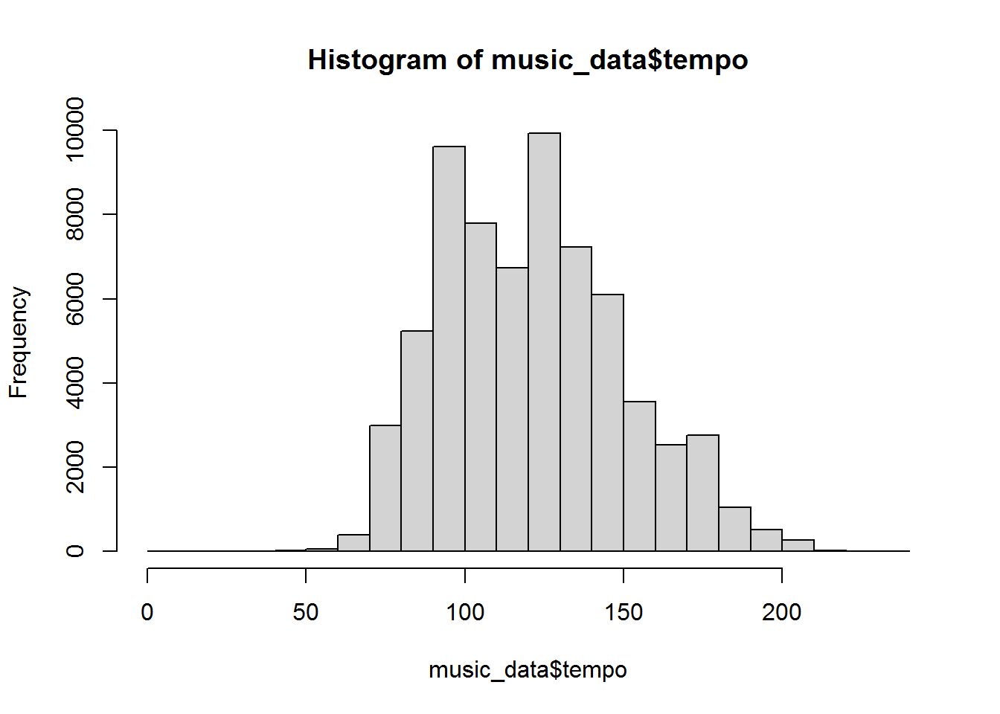
<p class="caption">(\#fig:unnamed-chunk-19)Histogram of standardized tempo variable</p>
</div>
Not that you could have also used the `scale()`-function instead of computing the z-scores manually, which leads to the same result: 


```r
music_data$tempo_std <- scale(music_data$tempo)
```

Instead of manually comparing the observed values to the values in the table, it is much easier to use the in-built functions to obtain the probabilities. The `pnorm()`-function gives the probability of obtaining values lower than the indicated values (i.e., the probability mass left of that value). For the value of 1.96, this probability mass is ~0.025, in line with the table above. 


```r
pnorm(-1.96)
```

```
## [1] 0.0249979
```
To also take the other end of the distribution into consideration, we would need to multiply this value by to. This way, we arrive at a value of 5%.


```r
pnorm(-1.96) * 2
```

```
## [1] 0.04999579
```
Regarding the standard normal distribution, it is helpful to remember the following numbers, indicating the points on the standard normal distribution, where the sum of the probability mass to the left at the lower end and to the right of the upper end exceed a certain threshold:  

* +/-**1.645** - 10% of probability mass outside this region
* +/-**1.960** - 5% of probability mass outside this region
* +/-**2.580** - 1% of probability mass outside this region

Going back to our example, we could also ask: what is the probability of obtaining the minimum (or maximum) observed value in our data? The minimum value on the standardized scale is:


```r
min(music_data$tempo_std)
```

```
## [1] -3.006525
```
And the associated probability is:  


```r
pnorm(min(music_data$tempo_std)) * 2
```

```
## [1] 0.002642526
```
Although the probability of observing this minimum value is very low, there are very few observations in the extreme regions at each end of the histogram, so this doesn't seem too unusual. As a rule of thumb, you can remember that 68% of the observations of a normally distributed variable should be within 1 standard deviation of the mean, 95% within 2 standard deviations, and 99.7% within 3 standard deviations. This is also shown in the following plot: 

<div class="figure" style="text-align: center">

<p class="caption">(\#fig:unnamed-chunk-25)The 68, 95, 99.7 rule (source: Wikipedia)</p>
</div>

In case of our 'tempo' variable, we do not observe values that are more than 3 standard deviations away from the mean. In other instances, checking the standardized values of a variable may help you to identify outliers. For example, if you conducted a survey and you would like to exclude respondents who answered the survey too fast, you may exclude cases with a low probability based on the distribution of the duration variable.   


<!--chapter:end:04-basic_statistics.Rmd-->

---
output:
  html_document:
    toc: yes
  html_notebook: default
  pdf_document:
    toc: yes
---


## Data visualization

::: {.infobox .download data-latex="{download}"}
[You can download the corresponding R-Code here](./Code/04-visualization.R)
:::

This section discusses the important topic of data visualization and how to produce appropriate graphics to describe your data visually. You should always visualize your data first. 

<div class="figure" style="text-align: center">

<p class="caption">(\#fig:unnamed-chunk-3)source: https://twitter.com/heyblake/status/1432070055949258752?s=20</p>
</div>

The plots we created in the previous chapters used R's in-built functions. In this section, we will be using the `ggplot2` package by Hadley Wickham. It has the advantage of being fairly straightforward to learn and being very flexible when it comes to building more complex plots. For a more in depth discussion you can refer to chapter 4 of the book "Discovering Statistics Using R" by Andy Field et al. or read the following chapter from the book <a href="http://r4ds.had.co.nz/data-visualisation.html" target="_blank">"R for Data science"</a> by Hadley Wickham as well as <a href="https://r-graphics.org/" target="_blank">"R Graphics Cookbook"</a> by Winston Chang.

ggplot2 is built around the idea of constructing plots by stacking layers on top of one another. Every plot starts with the ```ggplot(data)``` function, after which layers can be added with the "+" symbol. The following figures show the layered structure of creating plots with ggplot. 

<p style="text-align:center;">
&nbsp;&nbsp;&nbsp;

</p>

### Categorical variables

<br>
<div align="center">
<iframe width="560" height="315" src="https://www.youtube.com/embed/Eer3BHhS5IY" frameborder="0" allowfullscreen></iframe>
</div>
<br>

#### Bar plot

To give you an example of how the graphics are composed, let's go back to the frequency table from the previous chapter, where we created a table showing the relative frequencies of songs in the Austrian streaming charts by genre.  


```r
music_data <- read.table("https://raw.githubusercontent.com/IMSMWU/Teaching/master/MRDA2017/music_data_at.csv", 
    sep = ",", header = TRUE)
music_data$release_date <- as.Date(music_data$release_date)  #convert to date
music_data$explicit <- factor(music_data$explicit, 
    levels = 0:1, labels = c("not explicit", "explicit"))  #convert to factor
music_data$label <- as.factor(music_data$label)  #convert to factor
music_data$rep_ctry <- as.factor(music_data$rep_ctry)  #convert to factor
music_data$genre <- as.factor(music_data$genre)  #convert to factor
prop.table(table(music_data[, c("genre")]))  #relative frequencies
```

```
## 
##    Classics & Jazz Electronic & Dance       HipHop & Rap              other 
##        0.001613944        0.094577147        0.467721110        0.035990962 
##                Pop               Rock         Soundtrack 
##        0.301646223        0.087959974        0.010490639
```

```r
music_data <- music_data[!is.na(music_data$valence) & 
    !is.na(music_data$duration_ms), ]  # exclude cases with missing values
```
How can we plot this kind of data? Since we have a categorical variable, we will use a bar plot. However, to be able to use the table for your plot, you first need to assign it to an object as a data frame using the ```as.data.frame()```-function.


```r
table_plot_rel <- as.data.frame(prop.table(table(music_data[, 
    c("genre")])))  #relative frequencies #relative frequencies
head(table_plot_rel)
```

<div data-pagedtable="false">
  <script data-pagedtable-source type="application/json">
{"columns":[{"label":["Var1"],"name":[1],"type":["fct"],"align":["left"]},{"label":["Freq"],"name":[2],"type":["dbl"],"align":["right"]}],"data":[{"1":"Classics & Jazz","2":"0.001614205"},{"1":"Electronic & Dance","2":"0.094592413"},{"1":"HipHop & Rap","2":"0.467635190"},{"1":"other","2":"0.035996772"},{"1":"Pop","2":"0.301694915"},{"1":"Rock","2":"0.087974173"}],"options":{"columns":{"min":{},"max":[10]},"rows":{"min":[10],"max":[10]},"pages":{}}}
  </script>
</div>

Since ```Var1``` is not a very descriptive name, let's rename the variable to something more meaningful


```r
library(plyr)
table_plot_rel <- plyr::rename(table_plot_rel, c(Var1 = "Genre"))
head(table_plot_rel)
```

<div data-pagedtable="false">
  <script data-pagedtable-source type="application/json">
{"columns":[{"label":["Genre"],"name":[1],"type":["fct"],"align":["left"]},{"label":["Freq"],"name":[2],"type":["dbl"],"align":["right"]}],"data":[{"1":"Classics & Jazz","2":"0.001614205"},{"1":"Electronic & Dance","2":"0.094592413"},{"1":"HipHop & Rap","2":"0.467635190"},{"1":"other","2":"0.035996772"},{"1":"Pop","2":"0.301694915"},{"1":"Rock","2":"0.087974173"}],"options":{"columns":{"min":{},"max":[10]},"rows":{"min":[10],"max":[10]},"pages":{}}}
  </script>
</div>

Once we have our data set we can begin constructing the plot. As mentioned previously, we start with the ```ggplot()``` function, with the argument specifying the data set to be used. Within the function, we further specify the scales to be used using the aesthetics argument, specifying which variable should be plotted on which axis. In our example, we would like to plot the categories on the x-axis (horizontal axis) and the relative frequencies on the y-axis (vertical axis). 


```r
library(ggplot2)
bar_chart <- ggplot(table_plot_rel, aes(x = Genre, 
    y = Freq))
bar_chart
```

<div class="figure" style="text-align: center">

<p class="caption">(\#fig:unnamed-chunk-7)Bar chart (step 1)</p>
</div>

You can see that the coordinate system is empty. This is because so far, we have told R only which variables we would like to plot but we haven't specified which geometric figures (points, bars, lines, etc.) we would like to use. This is done using the ```geom_xxx()``` function. ggplot includes many different geoms, for a wide range of plots (e.g., geom_line, geom_histogram, geom_boxplot, etc.). A good overview of the various geom functions can be found <a href="https://www.rstudio.com/wp-content/uploads/2015/03/ggplot2-cheatsheet.pdf" target="_blank">here</a>. In our case, we would like to use a bar chart for which ```geom_col``` is appropriate.


```r
bar_chart + geom_col()
```

<div class="figure" style="text-align: center">

<p class="caption">(\#fig:unnamed-chunk-8)Bar chart (step 2)</p>
</div>

Now we have specified the data, the scales and the shape. Specifying this information is essential for plotting data using ggplot. Everything that follows now just serves the purpose of making the plot look nicer by modifying the appearance of the plot. How about some more meaningful axis labels? We can specify the axis labels using the ```ylab()``` and ```xlab()``` functions:


```r
bar_chart + geom_col() + ylab("Relative frequency") + 
    xlab("Genre")
```

<div class="figure" style="text-align: center">

<p class="caption">(\#fig:unnamed-chunk-9)Bar chart (step 3)</p>
</div>

How about adding some value labels to the bars? This can be done using ```geom_text()```. Note that the ```sprintf()``` function is not mandatory and is only added to format the numeric labels here. The function takes two arguments: the first specifies the format wrapped in two ```%``` signs. Thus, ```%.0f``` means to format the value as a fixed point value with no digits after the decimal point, and ```%%``` is a literal that prints a "%" sign. The second argument is simply the numeric value to be used. In this case, the relative frequencies multiplied by 100 to obtain the percentage values. Using the ```vjust = ``` argument, we can adjust the vertical alignment of the label. In this case, we would like to display the label slightly above the bars.  


```r
bar_chart + geom_col() + ylab("Relative frequency") + 
    xlab("Genre") + geom_text(aes(label = sprintf("%.0f%%", 
    Freq/sum(Freq) * 100)), vjust = -0.2)
```

<div class="figure" style="text-align: center">
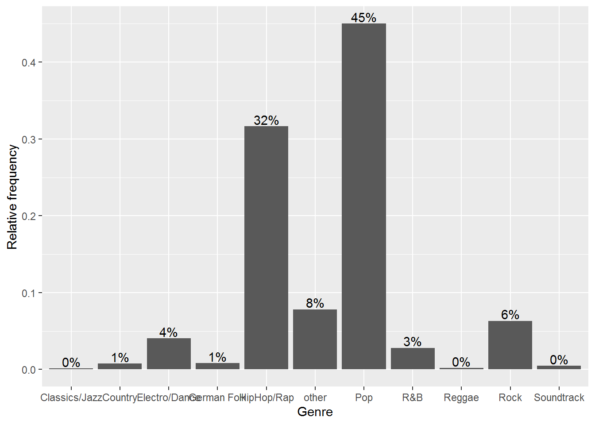
<p class="caption">(\#fig:unnamed-chunk-10)Bar chart (step 4)</p>
</div>

We could go ahead and specify the appearance of every single element of the plot now. However, there are also pre-specified themes that include various formatting steps in one singe function. For example ```theme_bw()``` would make the plot appear like this: 


```r
bar_chart + geom_col() + ylab("Relative frequency") + 
    xlab("Genre") + geom_text(aes(label = sprintf("%.0f%%", 
    Freq/sum(Freq) * 100)), vjust = -0.2) + theme_bw()
```

<div class="figure" style="text-align: center">
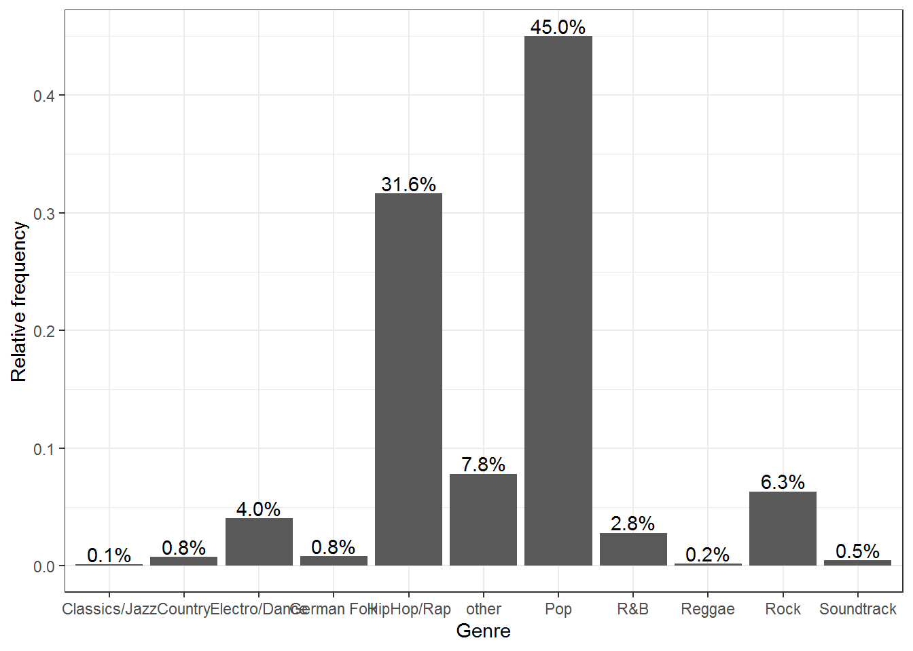
<p class="caption">(\#fig:unnamed-chunk-11)Bar chart (step 5)</p>
</div>

and ```theme_minimal()``` looks like this:


```r
bar_chart + geom_col() + ylab("Relative frequency") + 
    xlab("Genre") + geom_text(aes(label = sprintf("%.0f%%", 
    Freq/sum(Freq) * 100)), vjust = -0.2) + theme_minimal()
```

<div class="figure" style="text-align: center">

<p class="caption">(\#fig:unnamed-chunk-12)Bar chart (options 1)</p>
</div>
In a next step, let's prevent the axis labels from overlapping by rotating the labels.


```r
bar_chart + geom_col() + ylab("Relative frequency") + 
    xlab("Genre") + geom_text(aes(label = sprintf("%.0f%%", 
    Freq/sum(Freq) * 100)), vjust = -0.2) + theme_minimal() + 
    theme(axis.text.x = element_text(angle = 45, vjust = 0.75))
```

<div class="figure" style="text-align: center">
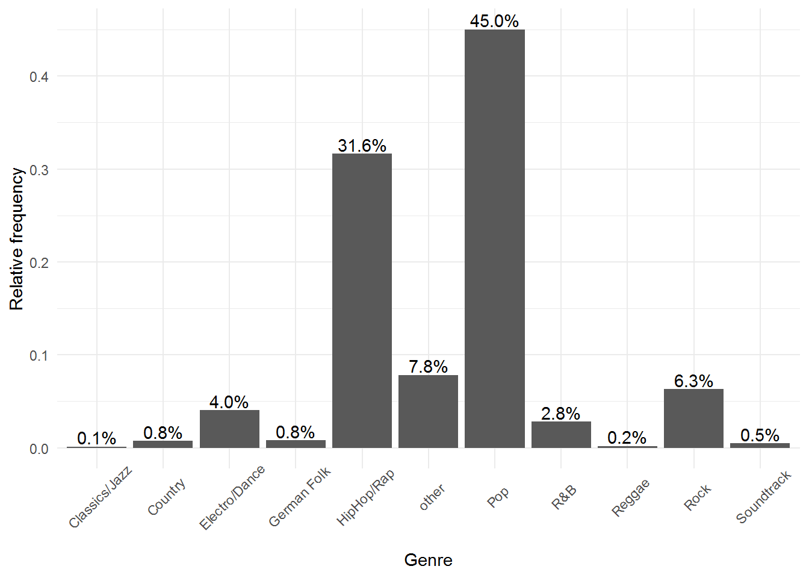
<p class="caption">(\#fig:unnamed-chunk-13)Bar chart (options 1)</p>
</div>

We could also add a title and combine all labels using the `labs` function.  


```r
bar_chart + geom_col() + labs(x = "Genre", y = "Relative frequency", 
    title = "Chart songs by genre") + geom_text(aes(label = sprintf("%.0f%%", 
    Freq/sum(Freq) * 100)), vjust = -0.2) + theme_minimal() + 
    theme(axis.text.x = element_text(angle = 45, vjust = 0.75), 
        plot.title = element_text(hjust = 0.5, color = "#666666"))
```

<div class="figure" style="text-align: center">
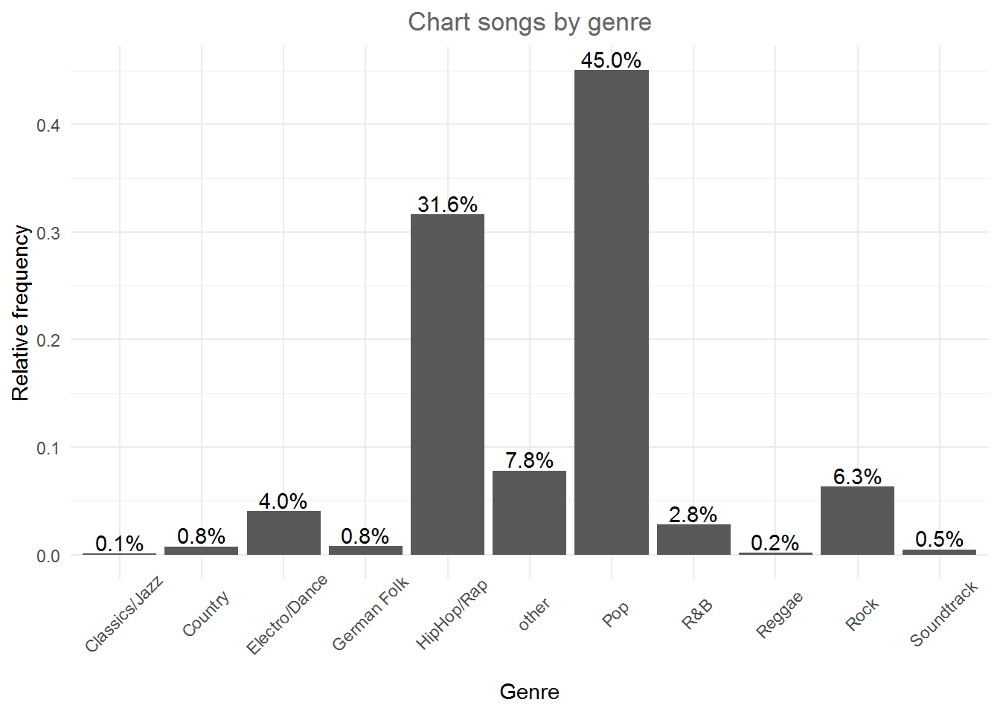
<p class="caption">(\#fig:unnamed-chunk-14)Bar chart (options 1)</p>
</div>
We could also add some color to the bars using `scale_fill_brewer`, which comes with a range of <a href="http://applied-r.com/rcolorbrewer-palettes/" target="_blank">color palettes</a>. 


```r
bar_chart + geom_col(aes(fill = Genre)) + labs(x = "Genre", 
    y = "Relative frequency", title = "Chart share by genre") + 
    geom_text(aes(label = sprintf("%.0f%%", Freq/sum(Freq) * 
        100)), vjust = -0.2) + theme_minimal() + ylim(0, 
    0.5) + scale_fill_brewer(palette = "Blues") + theme(axis.text.x = element_text(angle = 45, 
    vjust = 0.75), plot.title = element_text(hjust = 0.5, 
    color = "#666666"), legend.title = element_blank())
```

<div class="figure" style="text-align: center">

<p class="caption">(\#fig:unnamed-chunk-15)Bar chart (options 1)</p>
</div>
These were examples of built-in formatting options of ```ggolot()```, where the default is ```theme_classic()```. For even more options, check out the ```ggthemes``` package, which includes formats for specific publications. You can check out the different themes <a href="https://cran.r-project.org/web/packages/ggthemes/vignettes/ggthemes.html" target="_blank">here</a>. For example ```theme_economist()``` uses the formatting of the journal "The Economist":


```r
library(ggthemes)
bar_chart + geom_col() + labs(x = "Genre", y = "Relative frequency", 
    title = "Chart songs by genre") + geom_text(aes(label = sprintf("%.0f%%", 
    Freq/sum(Freq) * 100)), vjust = -0.2) + theme_economist() + 
    ylim(0, 0.5) + theme(axis.text.x = element_text(angle = 45, 
    vjust = 0.55), plot.title = element_text(hjust = 0.5, 
    color = "#666666"))
```

<div class="figure" style="text-align: center">
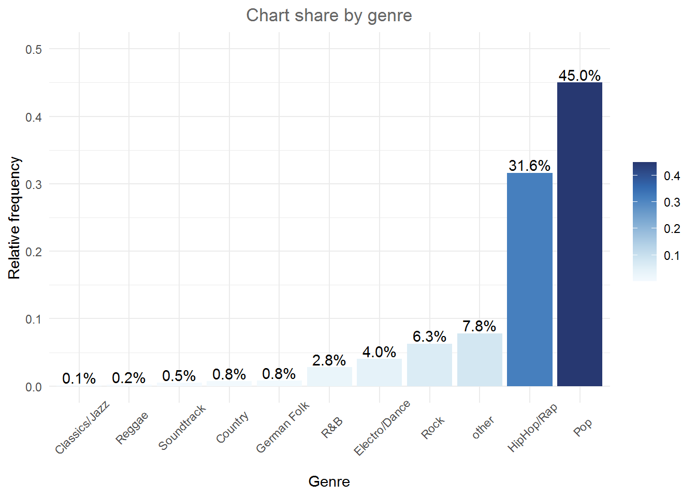
<p class="caption">(\#fig:unnamed-chunk-16)Bar chart (options 2)</p>
</div>

::: {.infobox_orange .hint data-latex="{hint}"}
There are various similar packages with pre-specified themes, like the <a href="https://github.com/cttobin/ggthemr" target="_blank">`ggthemr`</a> package, the <a href="https://github.com/ricardo-bion/ggtech" target="_blank">`ggtech`</a> package, the <a href="https://github.com/johnmackintosh/rockthemes" target="_blank">`rockthemes`</a> package, or the <a href="https://github.com/Ryo-N7/tvthemes" target="_blank">`tvthemes`</a> package. 
:::

In a next step, we might want to investigate whether the relative frequencies differ between songs with explicit and song without explicit lyrics. For this purpose we first construct the conditional relative frequency table from the previous chapter again. Recall that the latter gives us the relative frequency within a group (in our case genres), as compared to the relative frequency within the entire sample.


```r
table_plot_cond_rel <- as.data.frame(prop.table(table(music_data[, 
    c("genre", "explicit")]), 2))  #conditional relative frequencies
table_plot_cond_rel
```

<div data-pagedtable="false">
  <script data-pagedtable-source type="application/json">
{"columns":[{"label":["genre"],"name":[1],"type":["fct"],"align":["left"]},{"label":["explicit"],"name":[2],"type":["fct"],"align":["left"]},{"label":["Freq"],"name":[3],"type":["dbl"],"align":["right"]}],"data":[{"1":"Classics & Jazz","2":"not explicit","3":"0.0027586207"},{"1":"Electronic & Dance","2":"not explicit","3":"0.1459310345"},{"1":"HipHop & Rap","2":"not explicit","3":"0.2115862069"},{"1":"other","2":"not explicit","3":"0.0601379310"},{"1":"Pop","2":"not explicit","3":"0.4284137931"},{"1":"Rock","2":"not explicit","3":"0.1335172414"},{"1":"Soundtrack","2":"not explicit","3":"0.0176551724"},{"1":"Classics & Jazz","2":"explicit","3":"0.0000000000"},{"1":"Electronic & Dance","2":"explicit","3":"0.0221789883"},{"1":"HipHop & Rap","2":"explicit","3":"0.8287937743"},{"1":"other","2":"explicit","3":"0.0019455253"},{"1":"Pop","2":"explicit","3":"0.1229571984"},{"1":"Rock","2":"explicit","3":"0.0237354086"},{"1":"Soundtrack","2":"explicit","3":"0.0003891051"}],"options":{"columns":{"min":{},"max":[10]},"rows":{"min":[10],"max":[10]},"pages":{}}}
  </script>
</div>
We can now take these tables to construct plots grouped by explicitness. To achieve this we simply need to add the `facet_wrap()` function, which replicates a plot multiple times, split by a specified grouping factor. Note that the grouping factor has to be supplied in R’s formula notation, hence it is preceded by a “~” symbol.


```r
ggplot(table_plot_cond_rel, aes(x = genre, y = Freq)) + 
    geom_col(aes(fill = genre)) + facet_wrap(~explicit) + 
    labs(x = "", y = "Relative frequency", title = "Distribution of genres for explicit and non-explicit songs") + 
    geom_text(aes(label = sprintf("%.0f%%", Freq * 
        100)), vjust = -0.2) + theme_minimal() + ylim(0, 
    1) + scale_fill_brewer(palette = "Blues") + theme(axis.text.x = element_text(angle = 45, 
    vjust = 1.1, hjust = 1), plot.title = element_text(hjust = 0.5, 
    color = "#666666"), legend.position = "none")
```

<div class="figure" style="text-align: center">

<p class="caption">(\#fig:unnamed-chunk-18)Grouped bar chart (facet_wrap)</p>
</div>

Alternatively, we might be interested to investigate the relative frequencies of explicit and non-explicit lyrics for each genre. To achieve this, we can also use the fill argument, which tells ggplot to fill the bars by a specified variable (in our case “explicit”). The position = "dodge" argument causes the bars to be displayed next to each other (as opposed to stacked on top of one another).


```r
table_plot_cond_rel_1 <- as.data.frame(prop.table(table(music_data[,c("genre", "explicit")]),1)) #conditional relative frequencies
ggplot(table_plot_cond_rel_1, aes(x = genre, y = Freq, fill = explicit)) + #use "fill" argument for different colors
  geom_col(position = "dodge") + #use "dodge" to display bars next to each other (instead of stacked on top)
  geom_text(aes(label = sprintf("%.0f%%", Freq * 100)),position=position_dodge(width=0.9), vjust=-0.25) +
    scale_fill_brewer(palette = "Blues") +
  labs(x = "Genre", y = "Relative frequency", title = "Explicit lyrics share by genre") + 
  theme_minimal() +
  theme(axis.text.x = element_text(angle=45,vjust=1.1,hjust=1),
        plot.title = element_text(hjust = 0.5,color = "#666666"),
        legend.position = "none"
        ) 
```

<div class="figure" style="text-align: center">
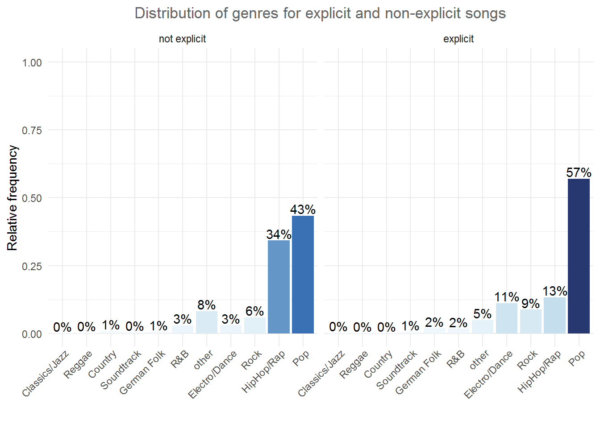
<p class="caption">(\#fig:unnamed-chunk-19)Grouped bar chart (fill)</p>
</div>


#### Pie chart

We could also visualize the same information using a pie chart.


```r
ggplot(subset(table_plot_rel,Freq > 0), aes(x="", y=Freq, fill=Genre)) + # Create a basic bar
  geom_bar(stat="identity", width=1) + 
  coord_polar("y", start=0) + #Convert to pie (polar coordinates) 
  geom_text(aes(label = paste0(round(Freq*100), "%")), position = position_stack(vjust = 0.5)) + #add labels
  scale_fill_brewer(palette = "Blues") +
  labs(x = NULL, y = NULL, fill = NULL, title = "Spotify tracks by Genre") +  #remove labels and add title
  theme_minimal() + 
  theme(axis.line = element_blank(),  # Tidy up the theme
        axis.text = element_blank(),
        axis.ticks = element_blank(),
        plot.title = element_text(hjust = 0.5, color = "#666666"))   
```

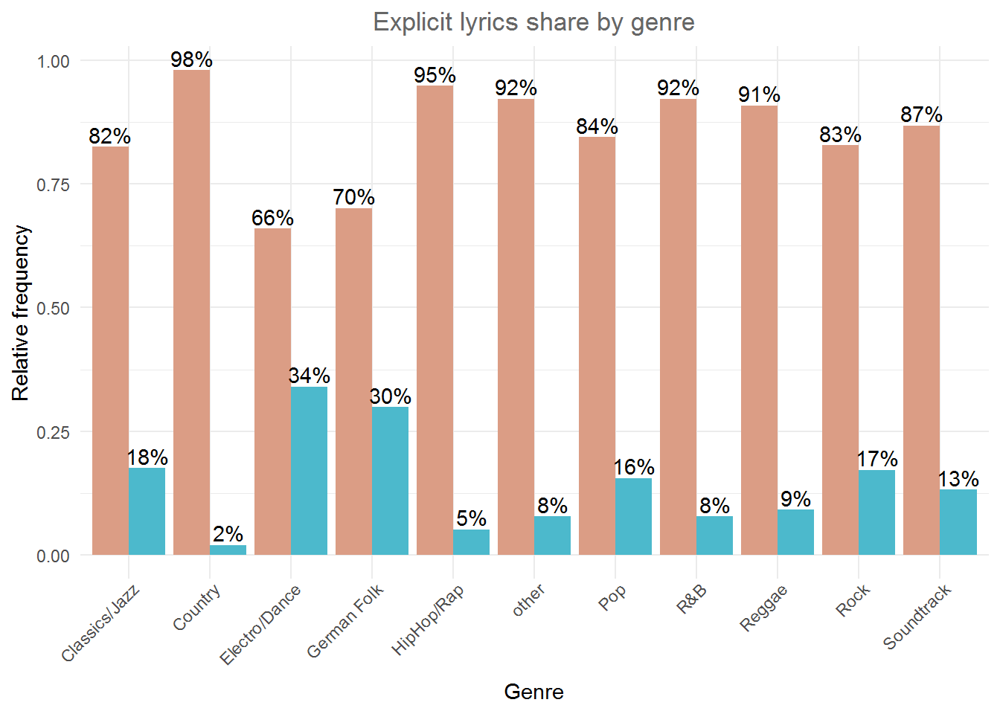

#### Covariation plots

To visualize the co-variation between categorical variables, you’ll need to count the number of observations for each combination stored in the frequency table. Say, we wanted to investigate the association between the popularity of a song and the level of 'speechiness'. For this exercise, let's assume we have both variables measured as categorical (factor) variables. We can use the `quantcut()` function to create categorical variables based on the continuous variables. All we need to do is tell the function how many categories we would like to obtain and it will divide the data based on the percentiles equally.  


```r
library(gtools)
music_data$streams_cat <- as.numeric(quantcut(music_data$streams, 
    5, na.rm = TRUE))
music_data$speech_cat <- as.numeric(quantcut(music_data$speechiness, 
    3, na.rm = TRUE))

music_data$streams_cat <- factor(music_data$streams_cat, 
    levels = 1:5, labels = c("low", "low-med", "medium", 
        "med-high", "high"))  #convert to factor
music_data$speech_cat <- factor(music_data$speech_cat, 
    levels = 1:3, labels = c("low", "medium", "high"))  #convert to factor
```

Now we have multiple ways to visualize a relationship between the two variables with ggplot. One option would be to use a variation of the scatterplot which counts how many points overlap at any given point and increases the dot size accordingly. This can be achieved with ```geom_count()``` as the example below shows where the `stat(prop)` argument assures that we get relative frequencies and with the `group` argument we tell R to compute the relative frequencies by speechiness.


```r
ggplot(data = music_data) + geom_count(aes(x = speech_cat, 
    y = streams_cat, size = stat(prop), group = speech_cat)) + 
    ylab("Popularity") + xlab("Speechiness") + labs(size = "Proportion") + 
    theme_bw()
```

<div class="figure" style="text-align: center">
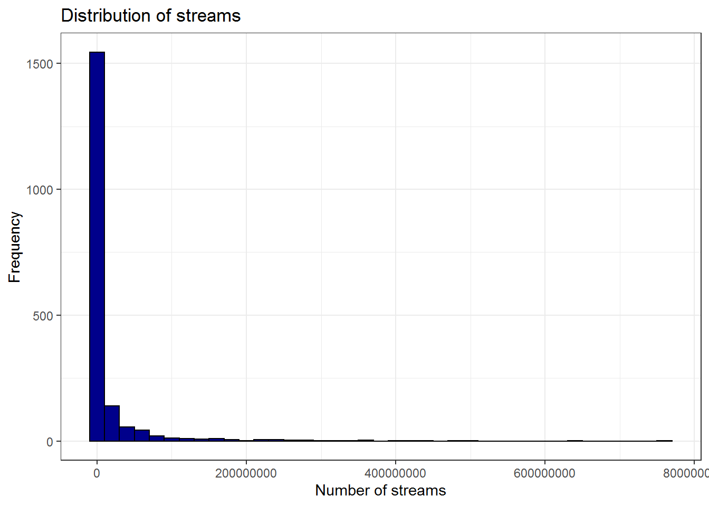
<p class="caption">(\#fig:unnamed-chunk-22)Covariation between categorical data (1)</p>
</div>
The plot shows that there appears to be a positive association between the popularity of a song and its level of speechiness. 

Another option would be to use a tile plot that changes the color of the tile based on the frequency of the combination of factors. To achieve this, we first have to create a dataframe that contains the relative frequencies of all combinations of factors. Then we can take this dataframe and pass it to ```geom_tile()```, while specifying that the fill of each tile should be dependent on the observed frequency of the factor combination, which is done by specifying the fill in the ```aes()``` function.  


```r
table_plot_rel <- prop.table(table(music_data[, c("speech_cat", 
    "streams_cat")]), 1)
table_plot_rel <- as.data.frame(table_plot_rel)

ggplot(table_plot_rel, aes(x = speech_cat, y = streams_cat)) + 
    geom_tile(aes(fill = Freq)) + ylab("Populartiy") + 
    xlab("Speechiness") + theme_bw()
```

<div class="figure" style="text-align: center">

<p class="caption">(\#fig:unnamed-chunk-23)Covariation between categorical data (2)</p>
</div>

### Continuous variables

<br>
<div align="center">
<iframe width="560" height="315" src="https://www.youtube.com/embed/1ttdoi_QMAw" frameborder="0" allowfullscreen></iframe>
</div>
<br>

#### Histogram

Histograms can be created for continuous data using the ```geom_histogram()``` function. Note that the ```aes()``` function only needs one argument here, since a histogram is a plot of the distribution of only one variable. As an example, let's consider our data set containing the music data: 


```r
head(music_data)
```

<div data-pagedtable="false">
  <script data-pagedtable-source type="application/json">
{"columns":[{"label":["track_id"],"name":[1],"type":["chr"],"align":["left"]},{"label":["min_rank"],"name":[2],"type":["int"],"align":["right"]},{"label":["streams"],"name":[3],"type":["int"],"align":["right"]},{"label":["isrc"],"name":[4],"type":["chr"],"align":["left"]},{"label":["artist_id"],"name":[5],"type":["chr"],"align":["left"]},{"label":["release_date"],"name":[6],"type":["date"],"align":["right"]},{"label":["explicit"],"name":[7],"type":["fct"],"align":["left"]},{"label":["danceability"],"name":[8],"type":["dbl"],"align":["right"]},{"label":["duration_ms"],"name":[9],"type":["dbl"],"align":["right"]},{"label":["energy"],"name":[10],"type":["dbl"],"align":["right"]},{"label":["loudness"],"name":[11],"type":["dbl"],"align":["right"]},{"label":["speechiness"],"name":[12],"type":["dbl"],"align":["right"]},{"label":["instrumentalness"],"name":[13],"type":["dbl"],"align":["right"]},{"label":["liveness"],"name":[14],"type":["dbl"],"align":["right"]},{"label":["valence"],"name":[15],"type":["dbl"],"align":["right"]},{"label":["tempo"],"name":[16],"type":["dbl"],"align":["right"]},{"label":["label"],"name":[17],"type":["fct"],"align":["left"]},{"label":["rep_ctry"],"name":[18],"type":["fct"],"align":["left"]},{"label":["genre"],"name":[19],"type":["fct"],"align":["left"]},{"label":["streams_cat"],"name":[20],"type":["fct"],"align":["left"]},{"label":["speech_cat"],"name":[21],"type":["fct"],"align":["left"]}],"data":[{"1":"000xQL6tZNLJzIrtIgxqSl","2":"65","3":"4066","4":"USRC11700675","5":"5ZsFI1h6hIdQRw2ti0hz81","6":"2017-03-23","7":"not explicit","8":"0.748","9":"188491","10":"0.627","11":"-6.029","12":"0.0644","13":"0.0000","14":"0.0852","15":"0.524","16":"120.963","17":"SONY","18":"US","19":"Rock","20":"low-med","21":"medium"},{"1":"003eoIwxETJujVWmNFMoZy","2":"136","3":"3871","4":"USUM71808193","5":"2wUjUUtkb5lvLKcGKsKqsR","6":"2018-06-15","7":"not explicit","8":"0.353","9":"193680","10":"0.755","11":"-6.276","12":"0.7330","13":"0.0000","14":"0.3900","15":"0.437","16":"191.153","17":"UMG","18":"US","19":"Pop","20":"low-med","21":"high"},{"1":"003vvx7Niy0yvhvHt4a68B","2":"197","3":"4574","4":"USIR20400274","5":"0C0XlULifJtAgn6ZNCW2eu","6":"2004-06-01","7":"not explicit","8":"0.352","9":"222973","10":"0.911","11":"-5.230","12":"0.0747","13":"0.0000","14":"0.0995","15":"0.236","16":"148.033","17":"UMG","18":"US","19":"Rock","20":"low-med","21":"medium"},{"1":"009CKw0AJZiyaIFG8uGl5C","2":"22","3":"11633","4":"ATR211823101","5":"5DxtpBc8OxcLW5KvAwtzBy","6":"2018-07-27","7":"not explicit","8":"0.761","9":"184274","10":"0.956","11":"-4.320","12":"0.0283","13":"0.0000","14":"0.3160","15":"0.973","16":"133.989","17":"INDEP","18":"AT","19":"Pop","20":"med-high","21":"low"},{"1":"00adbfJZUIpz8vRycsR7WV","2":"168","3":"5076","4":"DEA621801609","5":"6gto7HVNhu4ARE3P3g8Y5Y","6":"2018-12-07","7":"explicit","8":"0.560","9":"183400","10":"0.734","11":"-5.976","12":"0.0635","13":"0.0001","14":"0.1700","15":"0.191","16":"76.042","17":"WARNER","18":"DE","19":"HipHop & Rap","20":"medium","21":"medium"},{"1":"00gv2BypA7ieovRSsD7rO8","2":"32","3":"11951","4":"DEYD21901001","5":"0lFLP59V4TY3XgnrkFIwxK","6":"2019-07-26","7":"explicit","8":"0.827","9":"163195","10":"0.671","11":"-5.942","12":"0.0394","13":"0.0007","14":"0.0694","15":"0.668","16":"102.003","17":"WARNER","18":"DE","19":"HipHop & Rap","20":"med-high","21":"low"}],"options":{"columns":{"min":{},"max":[10]},"rows":{"min":[10],"max":[10]},"pages":{}}}
  </script>
</div>

Now we can create the histogram using ```geom_histogram()```. The argument ```binwidth``` specifies the range that each bar spans, ```col = "black"``` specifies the border to be black and ```fill = "darkblue"``` sets the inner color of the bars to dark blue. For brevity, we have now also started naming the x and y axis with the single function ```labs()```, instead of using the two distinct functions ```xlab()``` and ```ylab()```.


```r
ggplot(music_data, aes(streams)) + geom_histogram(binwidth = 4000, 
    col = "black", fill = "darkblue") + labs(x = "Number of streams", 
    y = "Frequency", title = "Distribution of streams") + 
    theme_bw()
```

<div class="figure" style="text-align: center">

<p class="caption">(\#fig:unnamed-chunk-25)Histogram</p>
</div>

If you would like to highlight certain points of the distribution, you can use the `geom_vline` (short for vertical line) function to do this. For example, we may want to highlight the mean and the median of the distribution.


```r
ggplot(music_data, aes(streams)) + geom_histogram(binwidth = 4000, 
    col = "black", fill = "darkblue") + labs(x = "Number of streams", 
    y = "Frequency", title = "Distribution of streams", 
    subtitle = "Red vertical line = mean, green vertical line = median") + 
    geom_vline(xintercept = mean(music_data$streams), 
        color = "red", size = 1) + geom_vline(xintercept = median(music_data$streams), 
    color = "green", size = 1) + theme_bw()
```

<div class="figure" style="text-align: center">
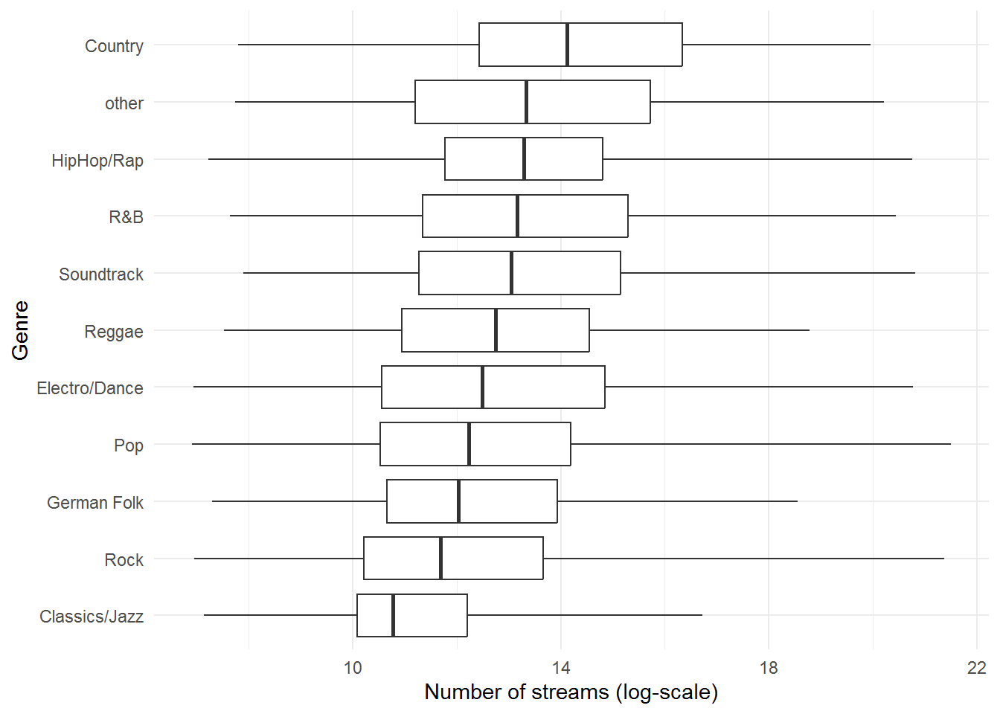
<p class="caption">(\#fig:unnamed-chunk-26)Histogram 2</p>
</div>
In this case, you should indicate what the lines refer to. In the plot above, the 'subtitle' argument was used to add this information to the plot. 

::: {.infobox_orange .hint data-latex="{hint}"}
Note the difference between a bar chart and the histogram. While a bar chart is used to visualize the frequency of observations for categorical variables, the histogram shows the frequency distribution for continuous variables.    
:::

#### Boxplot

Another common way to display the distribution of continuous variables is through boxplots. ggplot will construct a boxplot if given the geom ```geom_boxplot()```. In our case we might want to show the difference in streams between the genres. For this analysis, we will transform the streaming variable using a logarithmic transformation, which is common with such data (as we will see later). So let's first create a new variable by taking the logarithm of the streams variable. 


```r
music_data$log_streams <- log(music_data$streams)
```

Now, let's create a boxplot based on these variables and plot the log-transformed number of streams by genre. 


```r
ggplot(music_data, aes(x = genre, y = log_streams, 
    fill = genre)) + geom_boxplot(coef = 3) + labs(x = "Genre", 
    y = "Number of streams (log-scale)") + theme_minimal() + 
    scale_fill_brewer(palette = "Blues") + theme(axis.text.x = element_text(angle = 45, 
    vjust = 1.1, hjust = 1), plot.title = element_text(hjust = 0.5, 
    color = "#666666"), legend.position = "none")
```

<div class="figure" style="text-align: center">
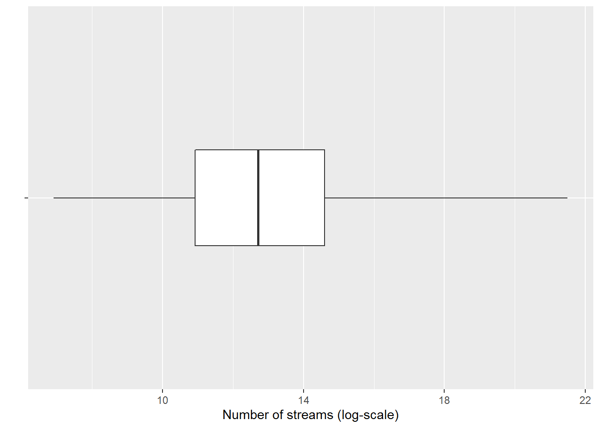
<p class="caption">(\#fig:unnamed-chunk-28)Boxplot by group</p>
</div>
The following graphic shows you how to interpret the boxplot:


Note that you could also flip the boxplot. To do this, you only need to exchange the x- and y-variables. If we provide the categorical variable to the y-axis as follows, the axis will be flipped.   


```r
ggplot(music_data, aes(x = log_streams, y = genre, 
    fill = genre)) + geom_boxplot(coef = 3) + labs(x = "Number of streams (log-scale)", 
    y = "Genre") + theme_minimal() + scale_fill_brewer(palette = "Blues") + 
    theme(plot.title = element_text(hjust = 0.5, color = "#666666"), 
        legend.position = "none")
```

<div class="figure" style="text-align: center">

<p class="caption">(\#fig:unnamed-chunk-29)Boxplot by group</p>
</div>

It is often meaningful to augment the boxplot with the data points using ```geom_jitter()```. This way, differences in the distribution of the variable between the genres become even more apparent. 


```r
ggplot(music_data, aes(x = log_streams, y = genre)) + 
    geom_boxplot(coef = 3) + labs(x = "Number of streams (log-scale)", 
    y = "Genre") + theme_minimal() + geom_jitter(colour = "red", 
    alpha = 0.1)
```

<div class="figure" style="text-align: center">

<p class="caption">(\#fig:unnamed-chunk-30)Boxplot by group</p>
</div>

In case you would like to create the boxplot on the total data (i.e., not by group), just leave the ```x = ``` argument within the ```aes()``` function empty: 


```r
ggplot(music_data, aes(x = log_streams, y = "")) + 
    geom_boxplot(coef = 3, width = 0.3) + labs(x = "Number of streams (log-scale)", 
    y = "")
```

<div class="figure" style="text-align: center">
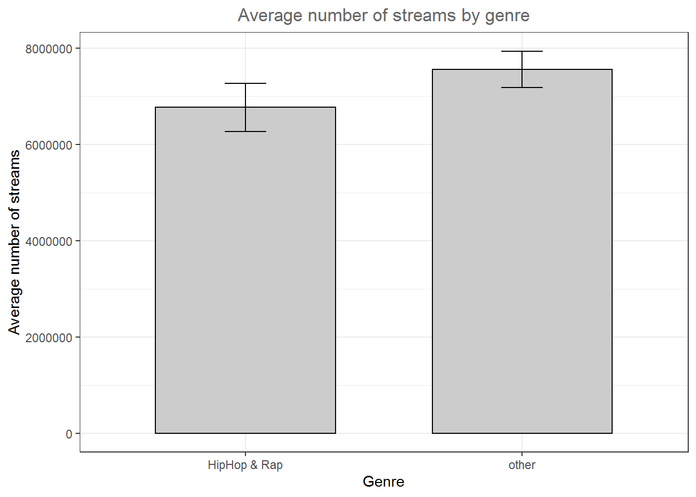
<p class="caption">(\#fig:unnamed-chunk-31)Single Boxplot</p>
</div>


#### Plot of means

Another way to get an overview of the difference between two groups is to plot their respective means with confidence intervals. The mean and confidence intervals will enter the plot separately, using the geoms ```geom_bar()``` and ```geom_errorbar()```. Don't worry if you don't know exactly how to interpret the confidence interval at this stage - we will cover this topic in the next chapter. Let's assume we would like to plot the difference in streams between the HipHop & Rap genre and all other genres. For this, we first need to create a dummy variable (i.e., a categorical variable with two levels) that indicates if a song is from the HipHop & Rap genre or from any of the other genres. We can use the `ifelse()` function to do this, which takes 3 arguments, namely 1) the if-statement, 2) the returned value if this if-statement is true, and 3) the value if the if-statement is not true.   


```r
music_data$genre_dummy <- as.factor(ifelse(music_data$genre == 
    "HipHop & Rap", "HipHop & Rap", "other"))
```

To make plotting the desired comparison easier, we can compute all relevant statistics first, using the ```summarySE()``` function from the `Rmisc` package.  


```r
library(Rmisc)
mean_data <- summarySE(music_data, measurevar = "streams", 
    groupvars = c("genre_dummy"))
mean_data
```

<div data-pagedtable="false">
  <script data-pagedtable-source type="application/json">
{"columns":[{"label":["genre_dummy"],"name":[1],"type":["fct"],"align":["left"]},{"label":["N"],"name":[2],"type":["dbl"],"align":["right"]},{"label":["streams"],"name":[3],"type":["dbl"],"align":["right"]},{"label":["sd"],"name":[4],"type":["dbl"],"align":["right"]},{"label":["se"],"name":[5],"type":["dbl"],"align":["right"]},{"label":["ci"],"name":[6],"type":["dbl"],"align":["right"]}],"data":[{"1":"HipHop & Rap","2":"2897","3":"11616.835","4":"12425.353","5":"230.8524","6":"452.6517"},{"1":"other","2":"3298","3":"8063.757","4":"9603.244","5":"167.2217","6":"327.8689"}],"options":{"columns":{"min":{},"max":[10]},"rows":{"min":[10],"max":[10]},"pages":{}}}
  </script>
</div>

The output tells you how many observations there are per group, the mean number of streams per group, as well as the group-specific standard deviation, the standard error, and the confidence interval (more on this in the next chapter). You can now create the plot as follows:


```r
ggplot(mean_data, aes(x = genre_dummy, y = streams)) + 
    geom_bar(position = position_dodge(0.9), colour = "black", 
        fill = "#CCCCCC", stat = "identity", width = 0.65) + 
    geom_errorbar(position = position_dodge(0.9), width = 0.15, 
        aes(ymin = streams - ci, ymax = streams + ci)) + 
    theme_bw() + labs(x = "Genre", y = "Average number of streams", 
    title = "Average number of streams by genre") + 
    theme_bw() + theme(plot.title = element_text(hjust = 0.5, 
    color = "#666666"))
```

<div class="figure" style="text-align: center">
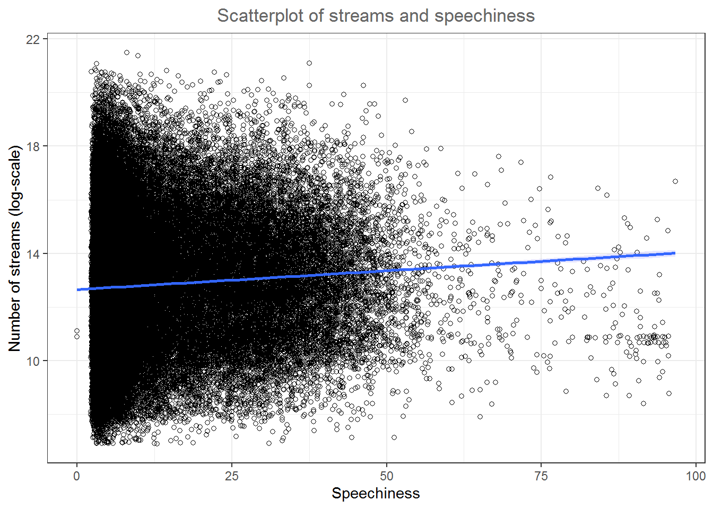
<p class="caption">(\#fig:unnamed-chunk-34)Plot of means</p>
</div>

As can be seen, there is a large difference between the genres with respect to the average number of streams. 

#### Grouped plot of means

We might also be interested to investigate a second factor. Say, we would like to find out if there is a difference between genres with respect to the lyrics (i.e., whether the lyrics are explicit or not). Can we find evidence that explicit lyrics affect streams of songs from the HipHop & Rap genre differently compared to other genres. We can compute the statistics using the ```summarySE()``` function by simply adding the second variable to the 'groupvars' argument.  


```r
mean_data2 <- summarySE(music_data, measurevar = "streams", 
    groupvars = c("genre_dummy", "explicit"))
mean_data2
```

<div data-pagedtable="false">
  <script data-pagedtable-source type="application/json">
{"columns":[{"label":["genre_dummy"],"name":[1],"type":["fct"],"align":["left"]},{"label":["explicit"],"name":[2],"type":["fct"],"align":["left"]},{"label":["N"],"name":[3],"type":["dbl"],"align":["right"]},{"label":["streams"],"name":[4],"type":["dbl"],"align":["right"]},{"label":["sd"],"name":[5],"type":["dbl"],"align":["right"]},{"label":["se"],"name":[6],"type":["dbl"],"align":["right"]},{"label":["ci"],"name":[7],"type":["dbl"],"align":["right"]}],"data":[{"1":"HipHop & Rap","2":"not explicit","3":"767","4":"12767.426","5":"13538.248","6":"488.8378","7":"959.6208"},{"1":"HipHop & Rap","2":"explicit","3":"2130","4":"11202.515","5":"11975.687","6":"259.4840","7":"508.8687"},{"1":"other","2":"not explicit","3":"2858","4":"8198.021","5":"10054.883","6":"188.0814","7":"368.7891"},{"1":"other","2":"explicit","3":"440","4":"7191.650","5":"5811.415","6":"277.0483","7":"544.5059"}],"options":{"columns":{"min":{},"max":[10]},"rows":{"min":[10],"max":[10]},"pages":{}}}
  </script>
</div>
Now we obtained the results for four different groups (2 genres x 2 lyric types) and we can amend the plot easily by adding the 'fill' argument to the ```ggplot()``` function. The ```scale_fill_manual()``` function is optional and specifies the color of the bars manually. 


```r
ggplot(mean_data2, aes(x = genre_dummy, y = streams, 
    fill = explicit)) + geom_bar(position = position_dodge(0.9), 
    colour = "black", stat = "identity") + geom_errorbar(position = position_dodge(0.9), 
    width = 0.2, aes(ymin = streams - ci, ymax = streams + 
        ci)) + scale_fill_manual(values = c("#CCCCCC", 
    "#FFFFFF")) + theme_bw() + labs(x = "Genre", y = "Average number of streams", 
    title = "Average number of streams by genre and lyric type") + 
    theme_bw() + theme(plot.title = element_text(hjust = 0.5, 
    color = "#666666"))
```

<div class="figure" style="text-align: center">

<p class="caption">(\#fig:unnamed-chunk-36)Grouped plot of means</p>
</div>
The results of the analysis show that also in the HipHop & Rap genre, songs with non-explicit lyrics obtain more streams on average, contrary to our expectations. 

#### Scatter plot

The most common way to show the relationship between two continuous variables is a scatterplot. As an example, let's investigate if there is an association between the number of streams a song receives and the speechiness of the song. The following code creates a scatterplot with some additional components. The ```geom_smooth()``` function creates a smoothed line from the data provided. In this particular example we tell the function to draw the best possible straight line (i.e., minimizing the distance between the line and the points) through the data (via the argument ```method = "lm"```). Note that the "shape = 1" argument passed to the ```geom_point()``` function produces hollow circles (instead of solid) and the "fill" and "alpha" arguments passed to the ```geom_smooth()``` function specify the color and the opacity of the confidence interval, respectively. 


```r
ggplot(music_data, aes(speechiness, log_streams)) + 
    geom_point(shape = 1) + labs(x = "Genre", y = "Relative frequency") + 
    geom_smooth(method = "lm", fill = "blue", alpha = 0.1) + 
    labs(x = "Speechiness", y = "Number of streams (log-scale)", 
        title = "Scatterplot of streams and speechiness") + 
    theme_bw() + theme(plot.title = element_text(hjust = 0.5, 
    color = "#666666"))
```

<div class="figure" style="text-align: center">

<p class="caption">(\#fig:unnamed-chunk-37)Scatter plot</p>
</div>
As you can see, there appears to be a positive relationship between advertising and sales.

##### Grouped scatter plot

It could be that customers from different store respond differently to advertising. We can visually capture such differences with a grouped scatter plot. By adding the argument ```colour = store``` to the aesthetic specification, ggplot automatically treats the two stores as distinct groups and plots accordingly. 


```r
ggplot(music_data, aes(speechiness, log_streams, colour = explicit)) + 
    geom_point(shape = 1) + geom_smooth(method = "lm", 
    alpha = 0.1) + labs(x = "Speechiness", y = "Number of streams (log-scale)", 
    title = "Scatterplot of streams and speechiness by lyric type", 
    colour = "Explicit") + scale_color_manual(values = c("lightblue", 
    "darkblue")) + theme_bw() + theme(plot.title = element_text(hjust = 0.5, 
    color = "#666666"))
```

<div class="figure" style="text-align: center">
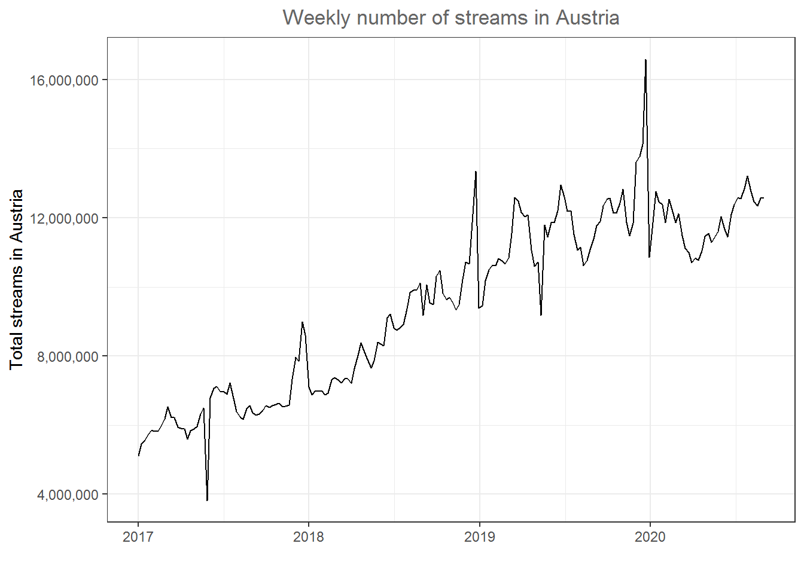
<p class="caption">(\#fig:unnamed-chunk-38)Grouped scatter plot</p>
</div>

It appears from the plot that the association between speechiness and the number of streams is stronger for songs without explicit lyrics. 

#### Line plot

Another important type of plot is the line plot used if, for example, you have a variable that changes over time and you want to plot how it develops over time. To demonstrate this we will investigate a data set that show the development of the number of streams of the Top200 songs on a popular music streaming service for different region. Let's investigate the data first and bring all variables to the correct format. 


```r
music_data_ctry <- read.table("https://raw.githubusercontent.com/IMSMWU/Teaching/master/MRDA2017/streaming_charts_ctry.csv", 
    sep = ",", header = TRUE)
music_data_ctry$week <- as.Date(music_data_ctry$week)
music_data_ctry$region <- as.factor(music_data_ctry$region)
head(music_data_ctry)
```

<div data-pagedtable="false">
  <script data-pagedtable-source type="application/json">
{"columns":[{"label":["week"],"name":[1],"type":["date"],"align":["right"]},{"label":["region"],"name":[2],"type":["fct"],"align":["left"]},{"label":["streams"],"name":[3],"type":["int"],"align":["right"]}],"data":[{"1":"2017-01-01","2":"ar","3":"45390029"},{"1":"2017-01-01","2":"at","3":"5111149"},{"1":"2017-01-01","2":"au","3":"46201117"},{"1":"2017-01-01","2":"be","3":"8082253"},{"1":"2017-01-01","2":"bg","3":"86293"},{"1":"2017-01-01","2":"bo","3":"1055670"}],"options":{"columns":{"min":{},"max":[10]},"rows":{"min":[10],"max":[10]},"pages":{}}}
  </script>
</div>

In a first step, let's investigate the development for Austria, by subsetting the data to region 'at'. 


```r
music_data_at <- subset(music_data_ctry, region == 
    "at")
```

Given the correct ```aes()``` and geom specification ggplot constructs the correct plot for us.


```r
ggplot(music_data_at, aes(x = week, y = streams)) + 
    geom_line() + labs(x = "Week", y = "Total streams in Austria", 
    title = "Weekly number of streams in Austria") + 
    theme_bw() + theme(plot.title = element_text(hjust = 0.5, 
    color = "#666666"))
```

<div class="figure" style="text-align: center">
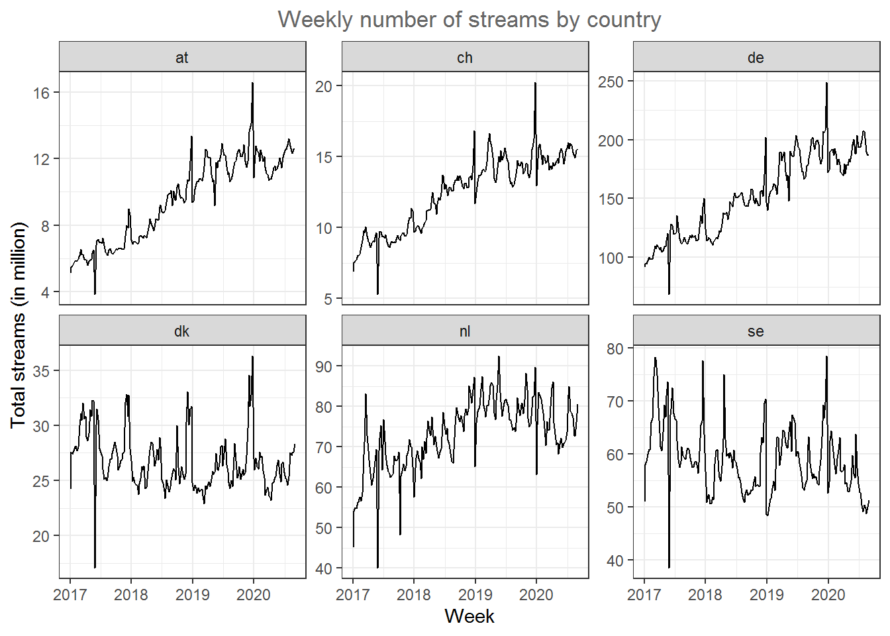
<p class="caption">(\#fig:unnamed-chunk-41)Line plot</p>
</div>
There appears to be a positive trend in the market. Now let's compare Austria to other countries. Note that the ```%in%``` operator checks for us if any of the region names specified in the vector are included in the region column. 


```r
music_data_at_compare <- subset(music_data_ctry, region %in% 
    c("at", "de", "ch", "se", "dk", "nl"))
```

We can now include the other specified countries in the plot by using the 'color' argument. 


```r
ggplot(music_data_at_compare, aes(x = week, y = streams, 
    color = region)) + geom_line() + labs(x = "Week", 
    y = "Total streams", title = "Weekly number of streams by country") + 
    theme_bw() + theme(plot.title = element_text(hjust = 0.5, 
    color = "#666666"))
```

<div class="figure" style="text-align: center">
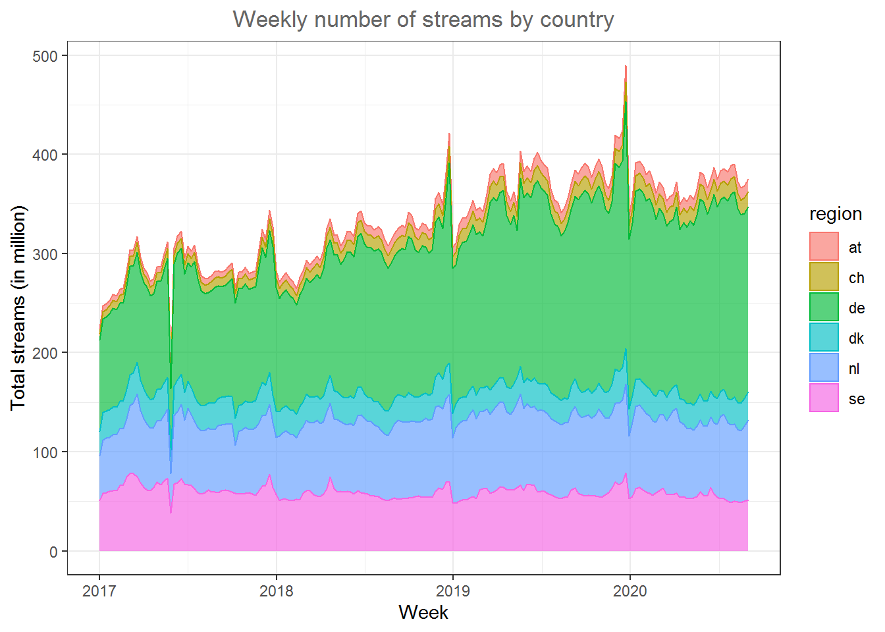
<p class="caption">(\#fig:unnamed-chunk-43)Line plot (by region)</p>
</div>
One issue in plot like this can be that the scales between countries is very different (i.e., in Germany there are many more streams because Germany is larger than the other countries). You could also use the ```facet_wrap()``` function to create one individual plot by region and specify 'scales = "free_y"' so that each individual plot has its own scale on the y-axis. We should also indicate the number of streams in millions by dividing the number of streams. 


```r
ggplot(music_data_at_compare, aes(x = week, y = streams/1000000)) + 
    geom_line() + facet_wrap(~region, scales = "free_y") + 
    labs(x = "Week", y = "Total streams (in million)", 
        title = "Weekly number of streams by country") + 
    theme_bw() + theme(plot.title = element_text(hjust = 0.5, 
    color = "#666666"))
```

<div class="figure" style="text-align: center">

<p class="caption">(\#fig:unnamed-chunk-44)Line plot (facet wrap)</p>
</div>
Now it's easier to see that the trends are different between countries. While Sweden and Denmark appear to be saturated, the other market show strong growth. 

#### Area plots

A slightly different why to plot this data is through area plot using the ```geom_area()``` function. 


```r
ggplot(music_data_at_compare, aes(x = week, y = streams/1000000)) + 
    geom_area(fill = "steelblue", color = "steelblue", 
        alpha = 0.5) + facet_wrap(~region, scales = "free_y") + 
    labs(x = "Week", y = "Total streams (in million)", 
        title = "Weekly number of streams by country") + 
    theme_bw() + theme(plot.title = element_text(hjust = 0.5, 
    color = "#666666"))
```

<div class="figure" style="text-align: center">

<p class="caption">(\#fig:unnamed-chunk-45)Line plot (facet wrap)</p>
</div>

If the relative share of the overall streaming volume is of interest, you could use a stacked area plot to visualize this. 


```r
ggplot(music_data_at_compare, aes(x = week, y = streams/1000000, 
    group = region, fill = region, color = region)) + 
    geom_area(position = "stack", alpha = 0.65) + labs(x = "Week", 
    y = "Total streams (in million)", title = "Weekly number of streams by country") + 
    theme_bw() + theme(plot.title = element_text(hjust = 0.5, 
    color = "#666666"))
```

<div class="figure" style="text-align: center">

<p class="caption">(\#fig:unnamed-chunk-46)Line plot (facet wrap)</p>
</div>

In this type of plot it is easy to spot the relative size of the regions. 

In some cases it could also make sense to add a secondary y-axis, for example, if you would like to compare two regions with very different scales in one plot. Let's assume, we would like to compare Austria and Sweden and take the corresponding subset. 


```r
music_data_at_se_compare <- subset(music_data_ctry, 
    region %in% c("at", "se"))
```

In order to add the secondary y-axis, we need the data in a slightly different format where we have one column for each country. This is called the 'wide format' as opposed to the 'long format' where the data is stacked on top of each other for all regions. We can easily convert the data to the wide format by using the ```spread()``` function from the `tidyr` package. 


```r
library(tidyr)
data_wide <- spread(music_data_at_se_compare, region, 
    streams)
data_wide
```

<div data-pagedtable="false">
  <script data-pagedtable-source type="application/json">
{"columns":[{"label":["week"],"name":[1],"type":["date"],"align":["right"]},{"label":["at"],"name":[2],"type":["int"],"align":["right"]},{"label":["se"],"name":[3],"type":["int"],"align":["right"]}],"data":[{"1":"2017-01-01","2":"5111149","3":"50954037"},{"1":"2017-01-08","2":"5457685","3":"57939416"},{"1":"2017-01-15","2":"5567194","3":"58641186"},{"1":"2017-01-22","2":"5710706","3":"59964443"},{"1":"2017-01-29","2":"5863767","3":"60842736"},{"1":"2017-02-05","2":"5818891","3":"60719187"},{"1":"2017-02-12","2":"5825375","3":"66030167"},{"1":"2017-02-19","2":"5980088","3":"66757766"},{"1":"2017-02-26","2":"6193209","3":"74623078"},{"1":"2017-03-05","2":"6530977","3":"78206599"},{"1":"2017-03-12","2":"6226134","3":"77844328"},{"1":"2017-03-19","2":"6224872","3":"74846520"},{"1":"2017-03-26","2":"5935317","3":"68795434"},{"1":"2017-04-02","2":"5901265","3":"64042942"},{"1":"2017-04-09","2":"5893873","3":"61359075"},{"1":"2017-04-16","2":"5593692","3":"60586098"},{"1":"2017-04-23","2":"5834484","3":"64093428"},{"1":"2017-04-30","2":"5892671","3":"69214046"},{"1":"2017-05-07","2":"5957329","3":"66993832"},{"1":"2017-05-14","2":"6319769","3":"70942864"},{"1":"2017-05-21","2":"6489634","3":"73616050"},{"1":"2017-05-28","2":"3822981","3":"38417005"},{"1":"2017-06-04","2":"6792423","3":"67314409"},{"1":"2017-06-11","2":"7074928","3":"68548091"},{"1":"2017-06-18","2":"7124538","3":"72516107"},{"1":"2017-06-25","2":"6964368","3":"67589714"},{"1":"2017-07-02","2":"6983387","3":"66675817"},{"1":"2017-07-09","2":"6888585","3":"66359870"},{"1":"2017-07-16","2":"7216108","3":"62463985"},{"1":"2017-07-23","2":"6774841","3":"59025668"},{"1":"2017-07-30","2":"6389690","3":"57462425"},{"1":"2017-08-06","2":"6233255","3":"58626561"},{"1":"2017-08-13","2":"6167533","3":"61417216"},{"1":"2017-08-20","2":"6487694","3":"59700505"},{"1":"2017-08-27","2":"6573919","3":"59203552"},{"1":"2017-09-03","2":"6353101","3":"58975936"},{"1":"2017-09-10","2":"6281075","3":"60682178"},{"1":"2017-09-17","2":"6322028","3":"61128401"},{"1":"2017-09-24","2":"6436003","3":"60897296"},{"1":"2017-10-01","2":"6566325","3":"59258270"},{"1":"2017-10-08","2":"6514220","3":"58066807"},{"1":"2017-10-15","2":"6574221","3":"57515067"},{"1":"2017-10-22","2":"6594969","3":"57560676"},{"1":"2017-10-29","2":"6634297","3":"58450258"},{"1":"2017-11-05","2":"6527862","3":"58620014"},{"1":"2017-11-12","2":"6552978","3":"57411055"},{"1":"2017-11-19","2":"6589219","3":"56351245"},{"1":"2017-11-26","2":"7329651","3":"60497960"},{"1":"2017-12-03","2":"7975501","3":"65448656"},{"1":"2017-12-10","2":"7840166","3":"66274099"},{"1":"2017-12-17","2":"8984392","3":"77632442"},{"1":"2017-12-24","2":"8600238","3":"63800716"},{"1":"2017-12-31","2":"7094323","3":"56793029"},{"1":"2018-01-07","2":"6870002","3":"50831657"},{"1":"2018-01-14","2":"6991513","3":"52079009"},{"1":"2018-01-21","2":"6981959","3":"52314970"},{"1":"2018-01-28","2":"7000187","3":"50642379"},{"1":"2018-02-04","2":"6878098","3":"50723636"},{"1":"2018-02-11","2":"6928693","3":"51877673"},{"1":"2018-02-18","2":"7312801","3":"51313490"},{"1":"2018-02-25","2":"7376682","3":"58164053"},{"1":"2018-03-04","2":"7311333","3":"60596534"},{"1":"2018-03-11","2":"7219855","3":"60861182"},{"1":"2018-03-18","2":"7351333","3":"56762085"},{"1":"2018-03-25","2":"7338904","3":"55578497"},{"1":"2018-04-01","2":"7210715","3":"54897186"},{"1":"2018-04-08","2":"7638906","3":"57766543"},{"1":"2018-04-15","2":"8024212","3":"62921675"},{"1":"2018-04-22","2":"8377625","3":"74953763"},{"1":"2018-04-29","2":"8100646","3":"62715074"},{"1":"2018-05-06","2":"7893350","3":"59640978"},{"1":"2018-05-13","2":"7649154","3":"60139521"},{"1":"2018-05-20","2":"7859856","3":"59290790"},{"1":"2018-05-27","2":"8397087","3":"60186580"},{"1":"2018-06-03","2":"8354560","3":"59608555"},{"1":"2018-06-10","2":"8295721","3":"57321411"},{"1":"2018-06-17","2":"9103653","3":"60784888"},{"1":"2018-06-24","2":"9207930","3":"58820359"},{"1":"2018-07-01","2":"8818919","3":"58350687"},{"1":"2018-07-08","2":"8744804","3":"57196152"},{"1":"2018-07-15","2":"8836175","3":"55481376"},{"1":"2018-07-22","2":"8912585","3":"55674376"},{"1":"2018-07-29","2":"9368540","3":"54558108"},{"1":"2018-08-05","2":"9829448","3":"52554600"},{"1":"2018-08-12","2":"9906687","3":"51444869"},{"1":"2018-08-19","2":"9898121","3":"50851455"},{"1":"2018-08-26","2":"10105085","3":"52316821"},{"1":"2018-09-02","2":"9174147","3":"53295695"},{"1":"2018-09-09","2":"10061693","3":"52217967"},{"1":"2018-09-16","2":"9549335","3":"52495246"},{"1":"2018-09-23","2":"9491921","3":"52542562"},{"1":"2018-09-30","2":"10311351","3":"53289236"},{"1":"2018-10-07","2":"10474952","3":"53167882"},{"1":"2018-10-14","2":"9817948","3":"54699351"},{"1":"2018-10-21","2":"9629039","3":"55686856"},{"1":"2018-10-28","2":"9698251","3":"53904664"},{"1":"2018-11-04","2":"9557680","3":"54293480"},{"1":"2018-11-11","2":"9340503","3":"53978440"},{"1":"2018-11-18","2":"9484414","3":"53871334"},{"1":"2018-11-25","2":"10217990","3":"60204283"},{"1":"2018-12-02","2":"10724804","3":"63167161"},{"1":"2018-12-09","2":"10672749","3":"62086922"},{"1":"2018-12-16","2":"11858217","3":"69676977"},{"1":"2018-12-23","2":"13352779","3":"70341374"},{"1":"2018-12-30","2":"9381104","3":"48623033"},{"1":"2019-01-06","2":"9454079","3":"48358663"},{"1":"2019-01-13","2":"10184422","3":"50033836"},{"1":"2019-01-20","2":"10501999","3":"51531920"},{"1":"2019-01-27","2":"10607532","3":"51622715"},{"1":"2019-02-03","2":"10611347","3":"53436670"},{"1":"2019-02-10","2":"10814685","3":"54811458"},{"1":"2019-02-17","2":"10756763","3":"53062949"},{"1":"2019-02-24","2":"10668243","3":"61231360"},{"1":"2019-03-03","2":"10838916","3":"63089488"},{"1":"2019-03-10","2":"11542267","3":"63070648"},{"1":"2019-03-17","2":"12587709","3":"57907553"},{"1":"2019-03-24","2":"12484040","3":"59622489"},{"1":"2019-03-31","2":"12147418","3":"61396086"},{"1":"2019-04-07","2":"12037677","3":"64501050"},{"1":"2019-04-14","2":"12085668","3":"64302627"},{"1":"2019-04-21","2":"11063034","3":"62063397"},{"1":"2019-04-28","2":"10606324","3":"61195740"},{"1":"2019-05-05","2":"10721762","3":"61179590"},{"1":"2019-05-12","2":"9175810","3":"64162362"},{"1":"2019-05-19","2":"11785543","3":"66182059"},{"1":"2019-05-26","2":"11450679","3":"60471102"},{"1":"2019-06-02","2":"11859801","3":"67385318"},{"1":"2019-06-09","2":"11863200","3":"66792488"},{"1":"2019-06-16","2":"12203011","3":"66015729"},{"1":"2019-06-23","2":"12944558","3":"59674605"},{"1":"2019-06-30","2":"12603219","3":"60434954"},{"1":"2019-07-07","2":"12190141","3":"60409679"},{"1":"2019-07-14","2":"12214762","3":"58192990"},{"1":"2019-07-21","2":"11517456","3":"56838735"},{"1":"2019-07-28","2":"11057405","3":"54786644"},{"1":"2019-08-04","2":"11159869","3":"53572169"},{"1":"2019-08-11","2":"10614307","3":"53102432"},{"1":"2019-08-18","2":"10764191","3":"54326334"},{"1":"2019-08-25","2":"11075215","3":"54990692"},{"1":"2019-09-01","2":"11385671","3":"61685580"},{"1":"2019-09-08","2":"11768547","3":"63201032"},{"1":"2019-09-15","2":"11891137","3":"58195884"},{"1":"2019-09-22","2":"12339671","3":"56475489"},{"1":"2019-09-29","2":"12534512","3":"55388648"},{"1":"2019-10-06","2":"12570974","3":"56213316"},{"1":"2019-10-13","2":"12130776","3":"55458272"},{"1":"2019-10-20","2":"12138057","3":"55765630"},{"1":"2019-10-27","2":"12428253","3":"54536084"},{"1":"2019-11-03","2":"12829031","3":"54128046"},{"1":"2019-11-10","2":"11863437","3":"56792297"},{"1":"2019-11-17","2":"11485691","3":"58857446"},{"1":"2019-11-24","2":"11842684","3":"63285122"},{"1":"2019-12-01","2":"13615723","3":"69302394"},{"1":"2019-12-08","2":"13784812","3":"66689184"},{"1":"2019-12-15","2":"14135110","3":"69729834"},{"1":"2019-12-22","2":"16591888","3":"78477555"},{"1":"2019-12-29","2":"10859375","3":"52613125"},{"1":"2020-01-05","2":"11684918","3":"54684965"},{"1":"2020-01-12","2":"12768413","3":"62520981"},{"1":"2020-01-19","2":"12469021","3":"64383133"},{"1":"2020-01-26","2":"12385678","3":"61578360"},{"1":"2020-02-02","2":"11860183","3":"59243997"},{"1":"2020-02-09","2":"12539941","3":"57951071"},{"1":"2020-02-16","2":"12247738","3":"56180328"},{"1":"2020-02-23","2":"11865790","3":"59095788"},{"1":"2020-03-01","2":"12117208","3":"60714300"},{"1":"2020-03-08","2":"11485139","3":"63165796"},{"1":"2020-03-15","2":"11123890","3":"56869946"},{"1":"2020-03-22","2":"11000026","3":"56613893"},{"1":"2020-03-29","2":"10695164","3":"56993066"},{"1":"2020-04-05","2":"10832377","3":"58005108"},{"1":"2020-04-12","2":"10767502","3":"54400674"},{"1":"2020-04-19","2":"11044092","3":"54567926"},{"1":"2020-04-26","2":"11458096","3":"52955805"},{"1":"2020-05-03","2":"11557207","3":"52797787"},{"1":"2020-05-10","2":"11290500","3":"53669537"},{"1":"2020-05-17","2":"11420307","3":"54971848"},{"1":"2020-05-24","2":"11594740","3":"59703269"},{"1":"2020-05-31","2":"12031735","3":"56234708"},{"1":"2020-06-07","2":"11678290","3":"55459464"},{"1":"2020-06-14","2":"11444403","3":"63778995"},{"1":"2020-06-21","2":"12108934","3":"57346797"},{"1":"2020-06-28","2":"12381525","3":"54303152"},{"1":"2020-07-05","2":"12581848","3":"52759080"},{"1":"2020-07-12","2":"12561026","3":"52722096"},{"1":"2020-07-19","2":"12843394","3":"50403416"},{"1":"2020-07-26","2":"13207944","3":"49056566"},{"1":"2020-08-02","2":"12761873","3":"50404184"},{"1":"2020-08-09","2":"12465932","3":"49776530"},{"1":"2020-08-16","2":"12337469","3":"48766818"},{"1":"2020-08-23","2":"12567150","3":"50032662"},{"1":"2020-08-30","2":"12571707","3":"51258093"}],"options":{"columns":{"min":{},"max":[10]},"rows":{"min":[10],"max":[10]},"pages":{}}}
  </script>
</div>

As another intermediate step, we need to compute the ratio between the two variables we would like to plot on the two axis, since the scale of the second axis is determined based on the ratio with the other variable. 


```r
ratio <- mean(data_wide$at/1000000)/mean(data_wide$se/1000000)
```

Now we can create the plot with the secondary y-axis as follows: 


```r
ggplot(data_wide) + geom_area(aes(x = week, y = at/1000000, 
    colour = "Austria", fill = "Austria"), alpha = 0.5) + 
    geom_area(aes(x = week, y = (se/1000000) * ratio, 
        colour = "Sweden", fill = "Sweden"), alpha = 0.5) + 
    scale_y_continuous(sec.axis = sec_axis(~./ratio, 
        name = "Total streams SE (in million)")) + 
    scale_fill_manual(values = c("#999999", "#E69F00")) + 
    scale_colour_manual(values = c("#999999", "#E69F00"), 
        guide = FALSE) + theme_minimal() + labs(x = "Week", 
    y = "Total streams AT (in million)", title = "Weekly number of streams by country") + 
    theme(plot.title = element_text(hjust = 0.5, color = "#666666"), 
        legend.title = element_blank(), legend.position = "bottom")
```

<div class="figure" style="text-align: center">
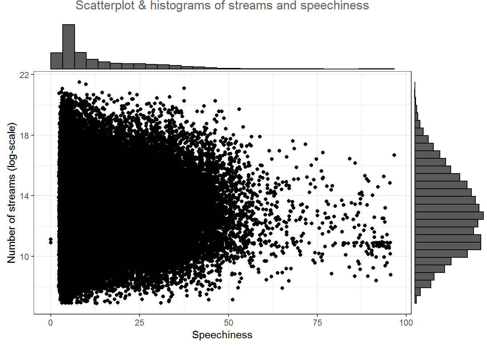
<p class="caption">(\#fig:unnamed-chunk-50)Secondary y-axis</p>
</div>

In this plot it is easy to see the difference in trends between the countries.  

### Saving plots

To save the last displayed plot, simply use the function ```ggsave()```, and it will save the plot to your working directory. Use the arguments ```height```and ```width``` to specify the size of the file. You may also choose the file format by adjusting the ending of the file name. E.g., ```file_name.jpg``` will create a file in JPG-format, whereas ```file_name.png``` saves the file in PNG-format, etc.. 


```r
ggsave("test_plot.jpg", height = 5, width = 8.5)
```

### ggplot extensions

<br>
<div align="center">
<iframe width="560" height="315" src="https://www.youtube.com/embed/X8zGovLeCrk" frameborder="0" allowfullscreen></iframe>
</div>
<br>

As the ggplot2 package became more and more popular over the past years, more and more extensions have been developed by users that can be used for specific purposes that are not yet covered by the standard functionality of ggplot2. You can find a list of the extensions <a href="https://exts.ggplot2.tidyverse.org/gallery/" target="_blank">here</a>. Below, you can find some example for the additional options.  

#### Results of statistical tests (ggstatsplot)

You may use the <a href="https://indrajeetpatil.github.io/ggstatsplot/index.html" target="_blank">ggstatplot</a> package to augment your plots with the results from statistical tests, such as an ANOVA. You can find a presentation about the capabilities of this package <a href="https://indrajeetpatil.github.io/ggstatsplot_slides/slides/ggstatsplot_presentation.html#1" target="_blank">here</a>. The boxplot below shows an example. 


```r
library(ggstatsplot)
# music_data_subs <- subset(music_data, genre %in%
# c('HipHop & Rap', 'Soundtrack','Pop','Rock'))
# ggbetweenstats( data = music_data_subs, title =
# 'Number of streams by genre', # title for the
# plot plot.type = 'box', x = genre, # 2 groups y =
# log_streams, type = 'p', # default messages =
# FALSE, bf.message = FALSE, pairwise.comparisons =
# TRUE # display results from pairwise comparisons
# )
```

##### Combination of plots (ggExtra)

Using the ```ggExtra()``` package, you may combine two type of plots. For example, the following plot combines a scatterplot with a histogram:


```r
library(ggExtra)
p <- ggplot(music_data, aes(x = speechiness, y = log_streams)) + 
    geom_point() + labs(x = "Speechiness", y = "Number of streams (log-scale)", 
    title = "Scatterplot & histograms of streams and speechiness") + 
    theme_bw() + theme(plot.title = element_text(hjust = 0.5, 
    color = "#666666"))
ggExtra::ggMarginal(p, type = "histogram")
```

<div class="figure" style="text-align: center">
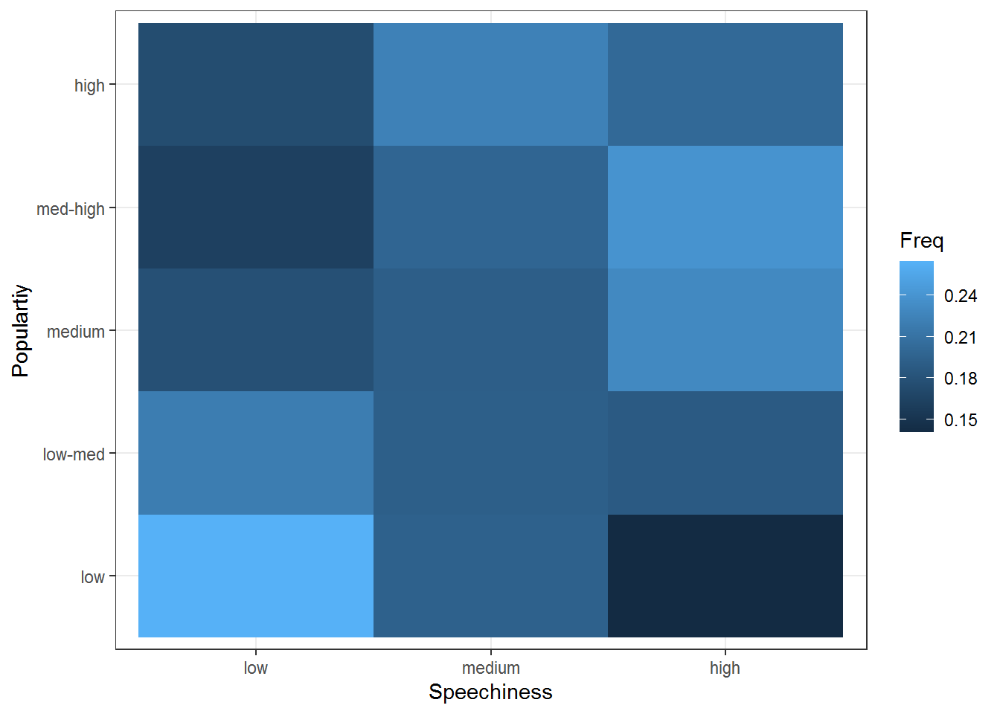
<p class="caption">(\#fig:unnamed-chunk-53)Scatter plot with histogram</p>
</div>

In this case, the ```type = "histogram"``` argument specifies that we would like to plot a histogram. However, you could also opt for ```type = "boxplot"``` or ```type = "density"``` to use a boxplot or density plot instead.

#### Location data (ggmap)

Now that we have covered the most important plots, we can look at what other type of data you may come across. One type of data that is increasingly available is the geo-location of customers and users (e.g., from app usage data). The following data set contains the app usage data of Shazam users from Germany. The data contains the latitude and longitude information where a music track was "shazamed". 


```r
library(ggmap)
library(dplyr)
geo_data <- read.table("https://raw.githubusercontent.com/IMSMWU/Teaching/master/MRDA2017/geo_data.dat", 
    sep = "\t", header = TRUE)
head(geo_data)
```

<div data-pagedtable="false">
  <script data-pagedtable-source type="application/json">
{"columns":[{"label":["lat"],"name":[1],"type":["dbl"],"align":["right"]},{"label":["lon"],"name":[2],"type":["dbl"],"align":["right"]},{"label":["latlon"],"name":[3],"type":["chr"],"align":["left"]}],"data":[{"1":"50.7","2":"7.7","3":"50.7_7.7"},{"1":"51.0","2":"6.3","3":"51_6.3"},{"1":"52.2","2":"10.5","3":"52.2_10.5"},{"1":"50.9","2":"11.0","3":"50.9_11"},{"1":"49.9","2":"8.2","3":"49.9_8.2"},{"1":"53.3","2":"13.4","3":"53.3_13.4"}],"options":{"columns":{"min":{},"max":[10]},"rows":{"min":[10],"max":[10]},"pages":{}}}
  </script>
</div>

There is a package called "ggmap", which is an augmentation for the ggplot packages. It lets you load maps from different web services (e.g., Google maps) and maps the user location within the coordination system of ggplot. With this information, you can create interesting plots like heat maps. We won't go into detail here but you may go through the following code on your own if you are interested. However, please note that you need to register an API with Google in order to make use of this package. 


```r
# register_google(key = 'your_api_key')

# Download the base map
de_map_g_str <- get_map(location = c(10.018343, 51.133481),
    zoom = 6, scale = 2)  # results in below map (wohoo!)

# Draw the heat map
ggmap(de_map_g_str, extent = "device") + geom_density2d(data = geo_data,
    aes(x = lon, y = lat), size = 0.3) + stat_density2d(data = geo_data,
    aes(x = lon, y = lat, fill = ..level.., alpha = ..level..),
    size = 0.01, bins = 16, geom = "polygon") + scale_fill_gradient(low = "green",
    high = "red") + scale_alpha(range = c(0, 0.3),
    guide = FALSE)
```


## Learning check {-}

**(LC4.1) For which data types is it meaningful to compute the mean?**

- [ ] Nominal
- [ ] Ordinal
- [ ] Interval
- [ ] Ratio

**(LC4.2) How can you compute the standardized variate of a variable X?**

- [ ] $Z=\frac{X_i-\bar{X}}{s}$
- [ ] $Z=\frac{\bar{X}+X_i}{s}$
- [ ] $Z=\frac{s}{\bar{X}+X_i}$
- [ ] $Z=s*({\bar{X}+X_i)}$
- [ ] None of the above 	

**You wish to analyze the following data frame 'df' containing information about cars**

<div data-pagedtable="false">
  <script data-pagedtable-source type="application/json">
{"columns":[{"label":["mpg"],"name":[1],"type":["dbl"],"align":["right"]},{"label":["cyl"],"name":[2],"type":["dbl"],"align":["right"]},{"label":["disp"],"name":[3],"type":["dbl"],"align":["right"]},{"label":["hp"],"name":[4],"type":["dbl"],"align":["right"]},{"label":["drat"],"name":[5],"type":["dbl"],"align":["right"]},{"label":["wt"],"name":[6],"type":["dbl"],"align":["right"]},{"label":["qsec"],"name":[7],"type":["dbl"],"align":["right"]},{"label":["vs"],"name":[8],"type":["dbl"],"align":["right"]},{"label":["am"],"name":[9],"type":["dbl"],"align":["right"]},{"label":["gear"],"name":[10],"type":["dbl"],"align":["right"]},{"label":["carb"],"name":[11],"type":["dbl"],"align":["right"]}],"data":[{"1":"21.0","2":"6","3":"160","4":"110","5":"3.90","6":"2.620","7":"16.46","8":"0","9":"1","10":"4","11":"4"},{"1":"21.0","2":"6","3":"160","4":"110","5":"3.90","6":"2.875","7":"17.02","8":"0","9":"1","10":"4","11":"4"},{"1":"22.8","2":"4","3":"108","4":"93","5":"3.85","6":"2.320","7":"18.61","8":"1","9":"1","10":"4","11":"1"},{"1":"21.4","2":"6","3":"258","4":"110","5":"3.08","6":"3.215","7":"19.44","8":"1","9":"0","10":"3","11":"1"},{"1":"18.7","2":"8","3":"360","4":"175","5":"3.15","6":"3.440","7":"17.02","8":"0","9":"0","10":"3","11":"2"},{"1":"18.1","2":"6","3":"225","4":"105","5":"2.76","6":"3.460","7":"20.22","8":"1","9":"0","10":"3","11":"1"}],"options":{"columns":{"min":{},"max":[10]},"rows":{"min":[10],"max":[10]},"pages":{}}}
  </script>
</div>

**(LC4.3) How could you add a new variable containing the z-scores of the variable 'mpg' in R?**

- [ ] `df$mpg_std <- zscore(df$mpg)`
- [ ] `df$mpg_std <- stdv(df$mpg)`
- [ ] `df$mpg_std <- std.scale(df$mpg)`
- [ ] `df$mpg_std <- scale(df$mpg)`
- [ ] None of the above 	

**(LC4.4) How could you produce the below output?**

<div data-pagedtable="false">
  <script data-pagedtable-source type="application/json">
{"columns":[{"label":["vars"],"name":[1],"type":["int"],"align":["right"]},{"label":["n"],"name":[2],"type":["dbl"],"align":["right"]},{"label":["mean"],"name":[3],"type":["dbl"],"align":["right"]},{"label":["sd"],"name":[4],"type":["dbl"],"align":["right"]},{"label":["median"],"name":[5],"type":["dbl"],"align":["right"]},{"label":["trimmed"],"name":[6],"type":["dbl"],"align":["right"]},{"label":["mad"],"name":[7],"type":["dbl"],"align":["right"]},{"label":["min"],"name":[8],"type":["dbl"],"align":["right"]},{"label":["max"],"name":[9],"type":["dbl"],"align":["right"]},{"label":["range"],"name":[10],"type":["dbl"],"align":["right"]},{"label":["skew"],"name":[11],"type":["dbl"],"align":["right"]},{"label":["kurtosis"],"name":[12],"type":["dbl"],"align":["right"]},{"label":["se"],"name":[13],"type":["dbl"],"align":["right"]}],"data":[{"1":"1","2":"32","3":"146.68750","4":"68.562868","5":"123.00","6":"141.19231","7":"77.095200","8":"52.0","9":"335.0","10":"283.0","11":"0.7260237","12":"-0.1355511","13":"12.1203173"},{"1":"2","2":"32","3":"20.09062","4":"6.026948","5":"19.20","6":"19.69615","7":"5.411490","8":"10.4","9":"33.9","10":"23.5","11":"0.6106550","12":"-0.3727660","13":"1.0654240"},{"1":"3","2":"32","3":"17.84875","4":"1.786943","5":"17.71","6":"17.82769","7":"1.415883","8":"14.5","9":"22.9","10":"8.4","11":"0.3690453","12":"0.3351142","13":"0.3158899"}],"options":{"columns":{"min":{},"max":[10]},"rows":{"min":[10],"max":[10]},"pages":{}}}
  </script>
</div>

- [ ] `describe(mtcars[,c("hp","mpg","qsec")])`
- [ ] `summary(mtcars[,c("hp","mpg","qsec")])`
- [ ] `table(mtcars[,c("hp","mpg","qsec")])`
- [ ] `str(mtcars[,c("hp","mpg","qsec")])`
- [ ] None of the above 	

**(LC4.5) The last column "carb" indicates the number of carburetors each model has. By using a function we got to know the number of car models that have a certain number carburetors. Which function helped us to obtain this information?** 


```
## 
##  1  2  3  4  6  8 
##  7 10  3 10  1  1
```

- [ ] `describe(mtcars$carb)`
- [ ] `table(mtcars$carb)`
- [ ] `str(mtcars$carb)`
- [ ] `prop.table(mtcars$carb)`
- [ ] None of the above 	

**(LC4.6) What type of data can be meaningfully depicted in a scatter plot?**

- [ ] Two categorical variables
- [ ] One categorical and one continuous variable
- [ ] Two continuous variables
- [ ] One continuous variable
- [ ] None of the above 	

**(LC4.7) Which statement about the graph below is true?** 

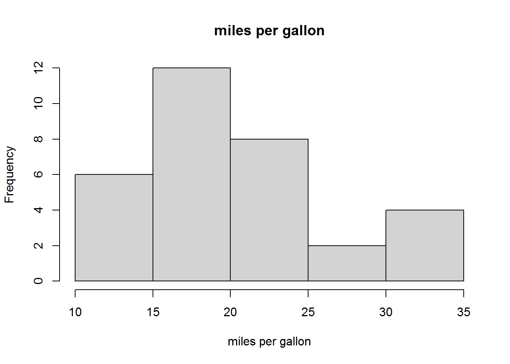

- [ ] This is a bar chart
- [ ] This is a histogram
- [ ] It shows the frequency distribution of a continuous variable
- [ ] It shows the frequency distribution of a categorical variable
- [ ] None of the above 	

**(LC4.8) Which statement about the graph below is true?** 

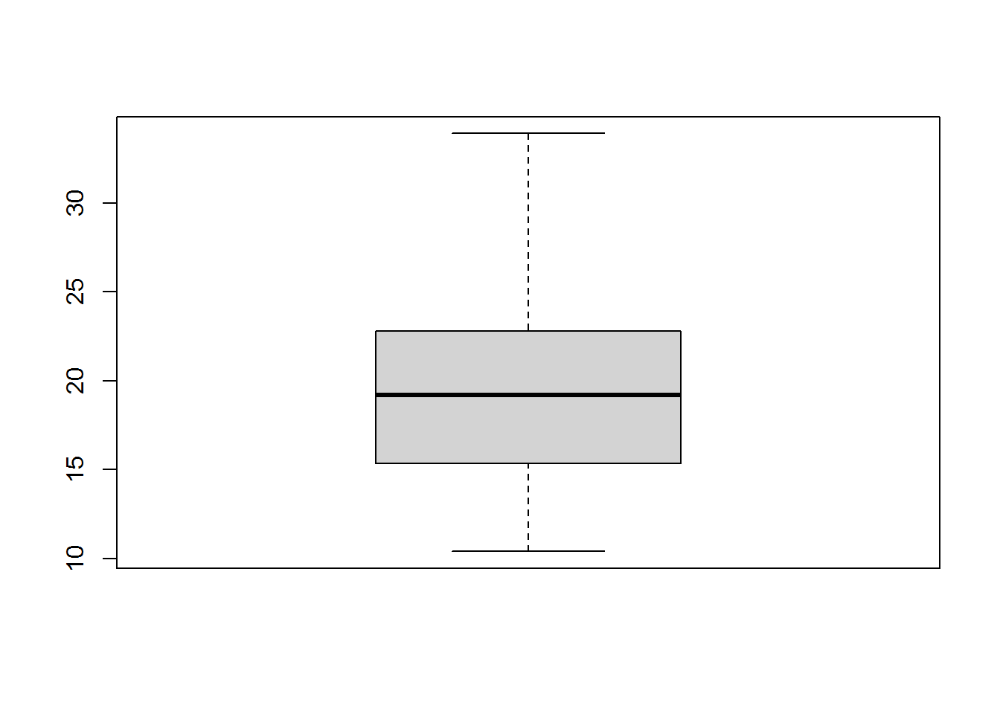

- [ ] This is a bar chart
- [ ] 50% of observations are contained in the gray area
- [ ] The horizontal black line indicates the mean
- [ ] This is a boxplot
- [ ] None of the above 	

**(LC4.9) Which function can help you to save a graph made with `ggplot()`?** 

- [ ] `ggsave()`
- [ ] `write.plot()`
- [ ] `save.plot()`
- [ ] `export.plot()`

**(LC4.10) For a variable that follows a normal distribution, within how many standard deviations of the mean are 95% of values?**

- [ ] 1.645
- [ ] 1.960
- [ ] 2.580
- [ ] 3.210
- [ ] None of the above 	

## References {-}

* Field, A., Miles J., & Field, Z. (2012). Discovering Statistics Using R. Sage Publications.
* Chang, W. (2020). R Graphics Cookbook, 2nd edition (https://r-graphics.org/)
* Grolemund, G. & Wickham, H. (2020). R for Data Science (https://r4ds.had.co.nz/)


<!--chapter:end:05-visualization.Rmd-->

---
output: html_document
---


# Statistical inference

<br>
<div align="center">
<iframe width="560" height="315" src="https://www.youtube.com/embed/8UK4-A3EFHo" frameborder="0" allowfullscreen></iframe>
</div>
<br>

::: {.infobox .download data-latex="{download}"}
[You can download the corresponding R-Code here](./Code/05-statistical_inference.R)
:::

This chapter will provide you with a basic intuition on statistical inference. As marketing researchers we are usually faced with "imperfect" data in the sense that we cannot collect **all** the data we would like. Imagine you are interested in the average amount of time WU students spend listening to music every month. Ideally, we could force all WU students to fill out our survey. Realistically we will only be able to observe a small fraction of students (maybe 500 out of the $25.000+$). With the data from this small fraction at hand, we want to make an inference about the true average listening time of all WU students. We are going to start with the assumption that we know everything. That is, we first assume that we know all WU students' listening times and analyze the distribution of the listening time in the entire population. Subsequently, we are going to look at the uncertainty that is introduced by only knowing some of the students' listening times (i.e., a sample from the population) and how that influences our analysis.

## If we knew it all 

<br>
<div align="center">
<iframe width="560" height="315" src="https://www.youtube.com/embed/In7KazRGA2I" frameborder="0" allowfullscreen></iframe>
</div>
<br>

Assume there are $25,000$ students at WU and every single one has kindly provided us with the hours they listened to music in the past month. Using the code below, the ```rnorm()``` function will be used to generate 25,000 observations from a normal distribution with a mean of 50 and a standard deviation of 10. Although you might not be used to working with this type of simulated (i.e., synthetic) data, it is useful when explaining statistical concepts because the properties of the data are known. In this case, for example, we know the true mean ($49.93$ hours) and the true standard deviation (SD = $10.02$) and thus we can easily summarize the entire distribution. Since the data follows a normal distribution, roughly 95% of the values lie within 2 standard deviations from the mean, as the following plot shows:


```r
library(tidyverse)
library(ggplot2)
library(latex2exp)
set.seed(321)
hours <- rnorm(n = 25000, mean = 50, sd = 10)
ggplot(data.frame(hours)) +
  geom_histogram(aes(hours), bins = 50, fill = 'white', color = 'black') +
  labs(title = "Histogram of listening times",
       subtitle = TeX(sprintf("Population mean ($\\mu$) = %.2f; population standard deviation ($\\sigma$) = %.2f",round(mean(hours),2),round(sd(hours),2))),
       y = 'Number of students', 
       x = 'Hours') +
  theme_bw() +
  geom_vline(xintercept = mean(hours), size = 1) +
  geom_vline(xintercept = mean(hours)+2*sd(hours), colour = "red", size = 1) +
  geom_vline(xintercept = mean(hours)-2*sd(hours), colour = "red", size = 1) +
  geom_segment(aes(x = mean(hours), y = 1100, yend = 1100, xend = (mean(hours) - 2*sd(hours))), lineend = "butt", linejoin = "round",
     size = 0.5, arrow = arrow(length = unit(0.2, "inches"))) +
  geom_segment(aes(x = mean(hours), y = 1100, yend = 1100, xend = (mean(hours) + 2*sd(hours))), lineend = "butt", linejoin = "round",
     size = 0.5, arrow = arrow(length = unit(0.2, "inches"))) +
  annotate("text", x = mean(hours) + 28, y = 1100, label = "Mean + 2 * SD" )+
  annotate("text", x = mean(hours) -28, y = 1100, label = "Mean - 2 * SD" )
```

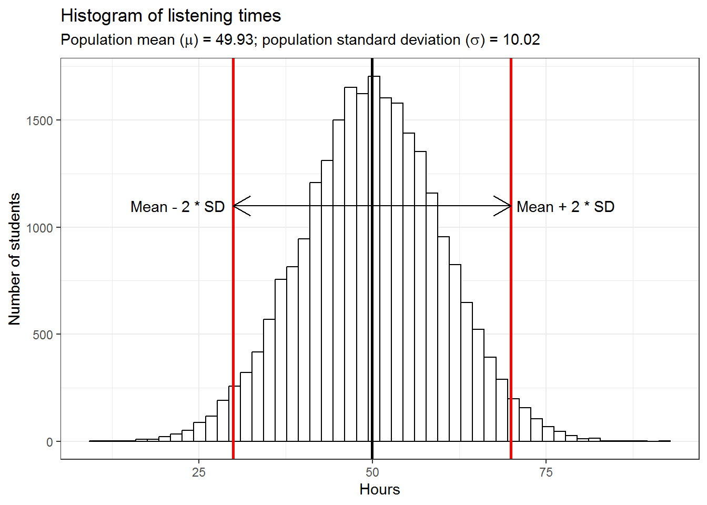

::: {.infobox_orange .hint data-latex="{hint}"}
Notice the `set.seed()` function we used in the code above. By specifying the seed, we can make sure that the results will be the same as here on the website when you execute the code on your computer. Otherwise, you would end up with a slightly different data set since the observations are generated randomly from the normal distribution. 
:::


In this case, we refer to all WU students as **the population**. In general, the population is the entire group we are interested in. This group does not have to necessarily consist of people, but could also be companies, stores, animals, etc.. The parameters of the distribution of population values (in hour case: "hours") are called population parameters. As already mentioned, we do not usually know population parameters but use inferential statistics to infer them based on our sample from the population, i.e., we measure statistics from a sample (e.g., the sample mean $\bar x$) to estimate population parameters (the population mean $\mu$). Here, we will use the following notation to refer to either the population parameters or the sample statistic: 

Variable	 | Sample statistic	 | Population parameter
---------------------- | ------------------------- | -------------------------
Size  | n  | N 
Mean  |  $\bar{x} = {1 \over n}\sum_{i=1}^n x_i$ | $\mu = {1 \over N}\sum_{i=1}^N x_i$  |
Variance  | $s^2 = {1 \over n-1}\sum_{i=1}^n (x_i-\bar{x})^2$  | $\sigma^2 = {1 \over N}\sum_{i=1}^N (x_i-\mu)^2$  
Standard deviation | $s = \sqrt{s^2}$  | $\sigma = \sqrt{\sigma^2}$  
Standard error | $SE_{\bar x} = {s \over \sqrt{n}}$  | $\sigma_{\bar x} = {\sigma \over \sqrt{n}}$  

Using this notation, $N$ refers to the number of observations in the entire population (i.e., 25,000 in our example) and $n$ refers to a subset of the population (i.e., a sample). As you can see, we will use different Greek letters to denote the sample statistics and the population parameters. Another difference, you might have noticed is that in the computation of the sample variance, we divide by $n-1$, not $n$. This is also know as the *‘Bessel’s correction’* and it corrects the bias in the estimation of the population variance based on a sample. More specifically, due to the correction, the corrected variance will be larger, since the denominator gets smaller by subtracting 1. This is done because the variance will most of the time be smaller when calculated using the sum of squared deviations from the sample mean, compared to using the sum of deviations from the population mean. The intuition is that, the larger your sample is, the more likely it is to get more population-representative points. Or, to put it another way, it is less likely to get a sample mean which results in differences which are too small. Thus, the larger your sample size $n$, the less of a correction you need and, hence, the smaller the impact the correction component will be.   

### Sampling from a known population

<br>
<div align="center">
<iframe width="560" height="315" src="https://www.youtube.com/embed/qTqI1A9hXyo" frameborder="0" allowfullscreen></iframe>
</div>
<br>

In the first step towards a realistic research setting, let us take one sample from this population and calculate the mean listening time. We can simply sample the row numbers of students and then subset the ```hours``` vector with the sampled row numbers. The ```sample()``` function will be used to draw a sample of size 100 from the population of 25,000 students, and one student can only be drawn once (i.e., ```replace = FALSE```). The following plot shows the distribution of listening times for our sample.


```r
student_sample <- sample(1:25000, size = 100, replace = FALSE)
sample_1 <- hours[student_sample]
ggplot(data.frame(sample_1)) +
  geom_histogram(aes(x = sample_1), bins = 30, fill='white', color='black') +
  theme_bw() + xlab("Hours") +
  geom_vline(aes(xintercept = mean(sample_1)), size=1) +
  ggtitle(TeX(sprintf("Distribution of listening times ($\\bar{x}$ = %.2f)",round(mean(sample_1),2))))
```

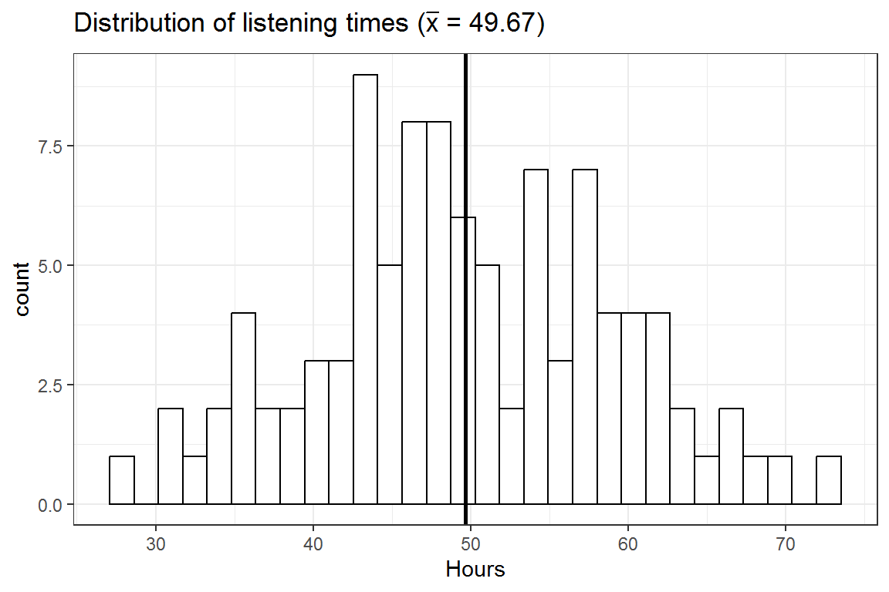

Observe that in this first draw the mean ($\bar x =$ 49.67) is quite close to the actual mean ($\mu =$ 49.93). It seems like the sample mean is a decent estimate of the population mean. However, we could just be lucky this time and the next sample could turn out to have a different mean. Let us continue by looking at four additional random samples, consisting of 100 students each. The following plot shows the distribution of listening times for the four different samples from the population.  

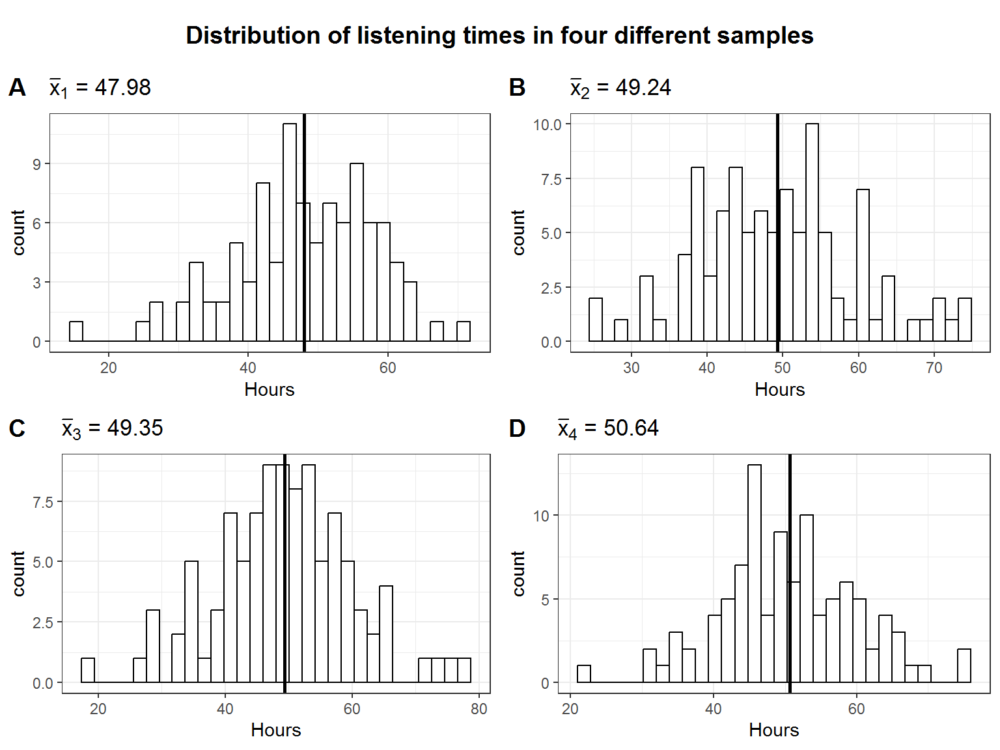

It becomes clear that the mean is slightly different for each sample. This is referred to as **sampling variation** and it is completely fine to get a slightly different mean every time we take a sample. We just need to find a way of expressing the uncertainty associated with the fact that we only have data from one sample, because in a realistic setting you are most likely only going to have access to a single sample. 

So in order to make sure that the first draw is not just pure luck and the sample mean is in fact a good estimate for the population mean, let us take **many** (e.g., $20,000$) different samples from the population. That is, we repeatedly draw 100 students randomly from the population without replacement (that is, once a student has been drawn she or he is removed from the pool and cannot be drawn again) and calculate the mean of each sample. This will show us a range within which the sample mean of any sample we take is likely going to be. We are going to store the means of all the samples in a matrix and then plot a histogram of the means to observe the likely values. 

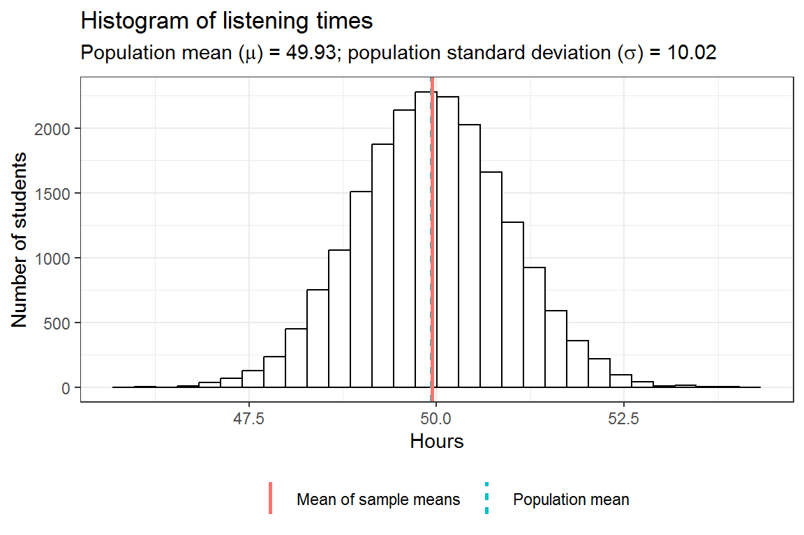

As you can see, on average the sample mean ("mean of sample means") is extremely close to the population mean, despite only sampling $100$ people at a time. This distribution of sample means is also referred to as **sampling distribution** of the sample mean. However, there is some uncertainty, and the means are slightly different for the different samples and range from 45.95 to 54.31. 

### Standard error of the mean

Due to the variation in the sample means shown in our simulation, it is never possible to say exactly what the population mean is based on a single sample. However, even with a single sample we can infer a range of values within which the population mean is likely contained. In order to do so, notice that the sample means are approximately normally distributed. Another interesting fact is that the mean of sample means (i.e., 49.94) is roughly equal to the population mean (i.e., 49.93). This tells us already that generally the sample mean is a good approximation of the population mean. However, in order to make statements about the expected range of possible values, we would need to know the standard deviation of the sampling distribution. The formal representation of the standard deviation of the sample means is

$$
\sigma_{\bar x} = {\sigma \over \sqrt{n}}
$$

where $\sigma$ is the population SD and $n$ is the sample size. $\sigma_{\bar{x}}$ is referred to as the **Standard Error** of the mean and it expresses the variation in sample means we should expect given the number of observations in our sample and the population SD. That is, it provides a measure of how precisely we can estimate the population mean from the sample mean.   

#### Sample size

The first thing to notice here is that an increase in the **number of observations per sample** $n$ decreases the range of possible sample means (i.e., the standard error). This makes intuitive sense. Think of the two extremes: sample size $1$ and sample size $25,000$. With a single person in the sample we do not gain a lot of information and our estimate is very uncertain, which is expressed through a larger standard deviation. Looking at the histogram at the beginning of this chapter showing the number of students for each of the listening times, clearly we would get values below $25$ or above $75$ for some samples. This is way farther away from the population mean than the minimum and the maximum of our $100$ person samples. On the other hand, if we sample every student we get the population mean every time and thus we do not have any uncertainty (assuming the population does not change). Even if we only sample, say $24,000$ people every time, we gain a lot of information about the population and the sample means would not be very different from each other since only up to $1,000$ people are potentially different in any given sample. Thus, with larger (smaller) samples, there is less (more) uncertainty that the sample is a good approximation of the entire population. The following plot shows the relationship between the sample size and the standard error. Samples of increasing size are randomly drawn from the population of WU students. You can see that the standard error is decreasing with the number of observations. 

<div class="figure" style="text-align: center">
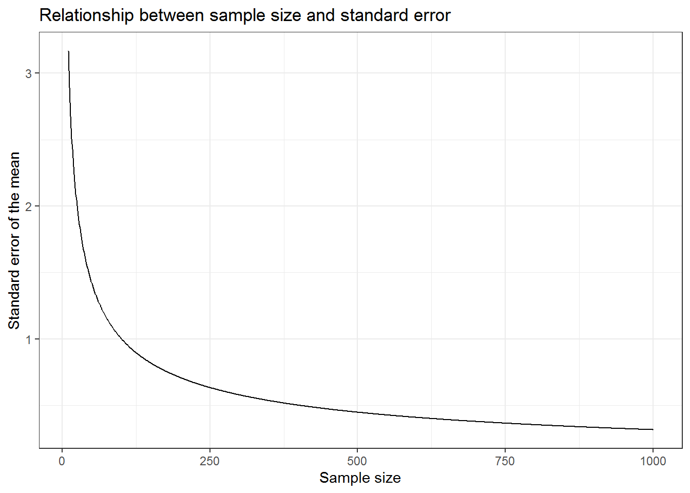
<p class="caption">(\#fig:unnamed-chunk-6)Relationship between the sample size and the standard error</p>
</div>

The following plots show the relationship between the sample size and the standard error in a slightly different way. The plots show the range of sample means resulting from the repeated sampling process for different sample sizes. Notice that the more students are contained in the individual samples, the less uncertainty there is when estimating the population mean from a sample (i.e., the possible values are more closely centered around the mean). So when the sample size is small, the sample mean can expected to be very different the next time we take a sample. When the sample size is large, we can expect the sample means to be more similar every time we take a sample.

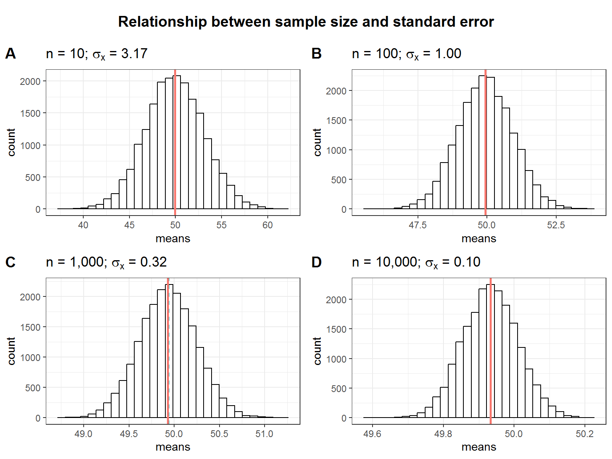

As you can see, the standard deviation of the sample means ($\sigma_{\bar x}$) decreases as the sample size increases as a consequence of the reduced uncertainty about the true sample mean when we take larger samples. 

#### Population standard deviation

A second factor determining the standard deviation of the distribution of sample means ($\sigma_{\bar x}$) is the standard deviation associated with the population parameter ($\sigma$). Again, looking at the extremes illustrates this well. If all WU students listened to music for approximately the same amount of time, the samples would not differ much from each other. In other words, if the standard deviation in the population is lower, we expect the standard deviation of the sample means to be lower as well. This is illustrated by the following plots.    

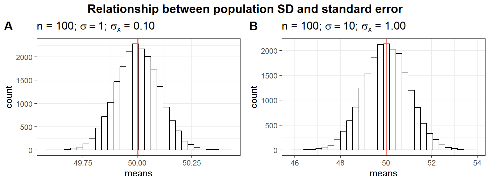

In the first plot (panel A), we assume a much smaller population standard deviation (e.g., $\sigma$ = 1 instead of $\sigma$ = 10). Notice how the smaller (larger) the population standard deviation, the less (more) uncertainty there is when estimating the population mean from a sample (i.e., the possible values are more closely centered around the mean). So when the population SD is large, the sample mean can expected to be very different the next time we take a sample. When the population SD is small, we can expect the sample means to be more similar.

## The Central Limit Theorem

The attentive reader might have noticed that the population above was generated using a normal distribution function. It would be very restrictive if we could only analyze populations whose values are normally distributed. Furthermore, we are unable in reality to check whether the population values are normally distributed since we do not know the entire population. However, it turns out that the results generalize to many other distributions. This is described by the **Central Limit Theorem**. 

The central limit theorem states that if **(1)** the population distribution has a mean (there are examples of distributions that don't have a mean , but we will ignore these here), and **(2)** we take a large enough sample, then the sampling distribution of the sample mean is approximately normally distributed. What exactly "large enough" means depends on the setting, but the interactive element at the end of this chapter illustrates how the sample size influences how accurately we can estimate the population parameters from the sample statistics.

To illustrate this, let's repeat the analysis above with a population from a gamma distribution. In the previous example, we assumed a normal distribution so it was more likely for a given student to spend around 50 hours per week listening to music. The following example depicts the case in which most students spend a similar amount of time listening to music, but there are a few students who very rarely listen to music, and some music enthusiasts with a very high level of listening time. In the following code, we will use the `rgamma()` function to generate 25,000 random observations from the gamma distribution. The gamma distribution is specified by shape and scale parameters instead of the mean and standard deviation of the normal distribution. Here is a histogram of the listening times in the population:


```r
set.seed(321)
hours <- rgamma(n = 25000, shape = 2, scale = 10)
ggplot(data.frame(hours)) +
  geom_histogram(aes(x = hours), bins = 30, fill='white', color='black') +
    geom_vline(xintercept = mean(hours), size = 1)  +  theme_bw() +
  labs(title = "Histogram of listening times",
       subtitle = TeX(sprintf("Population mean ($\\mu$) = %.2f; population standard deviation ($\\sigma$) = %.2f",round(mean(hours),2),round(sd(hours),2))),
       y = 'Number of students', 
       x = 'Hours') 
```


The vertical black line represents the population mean ($\mu$), which is 19.98 hours. The following plot depicts the histogram of listening times of four random samples from the population, each consisting of 100 students: 

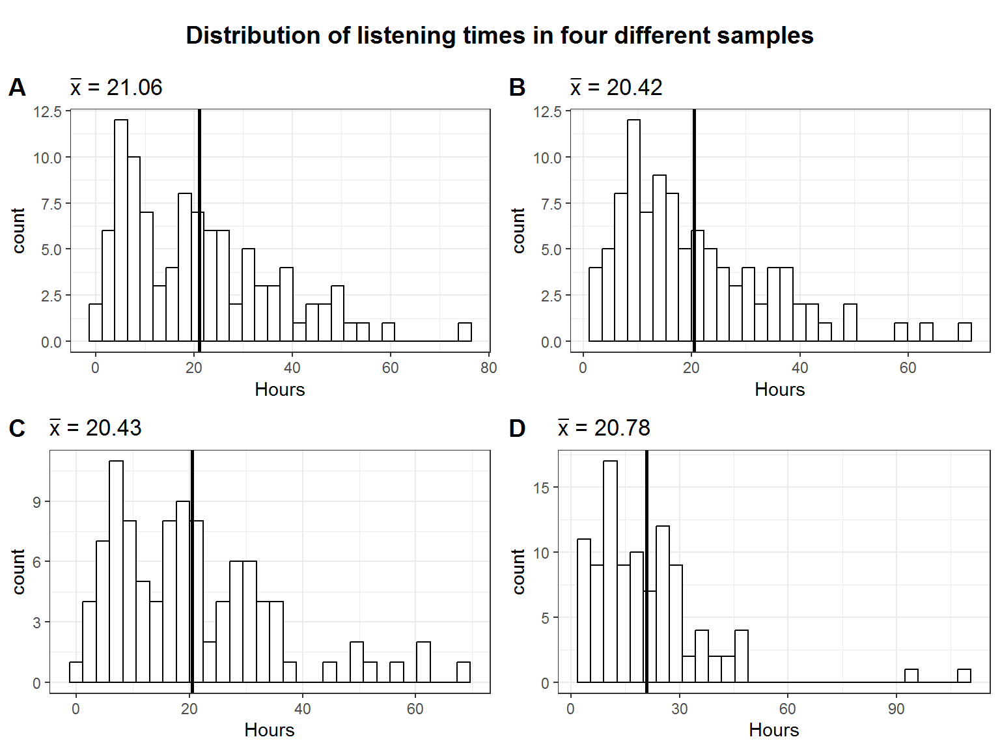

As in the previous example, the mean is slightly different every time we take a sample due to sampling variation. Also note that the distribution of listening times no longer follows a normal distribution as a result of the fact that we now assume a gamma distribution for the population with a positive skew (i.e., lower values more likely, higher values less likely). 

Let's see what happens to the distribution of sample means if we take an increasing number of samples, each drawn from the same gamma population:

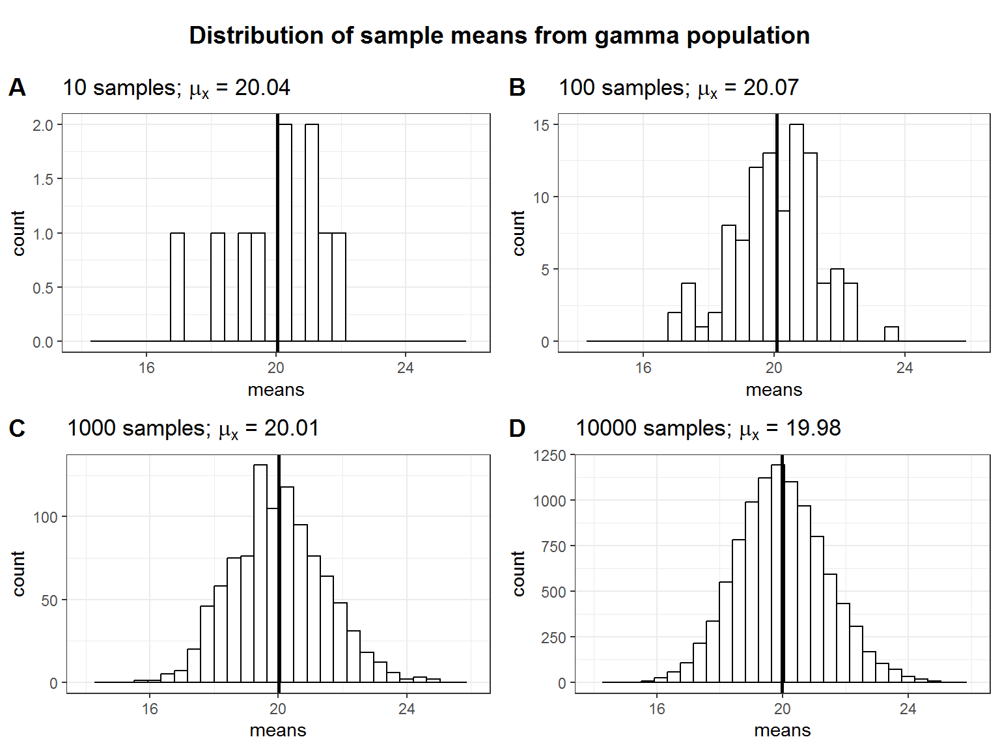

Two things are worth noting: **(1)** The more (hypothetical) samples we take, the more the sampling distribution approaches a normal distribution. **(2)** The mean of the sampling distribution of the sample mean ($\mu_{\bar x}$) is very similar to the population mean ($\mu$). From this we can see that the mean of a sample is a good estimate of the population mean. 

In summary, it is important to distinguish two types of variation: **(1)** For each individual sample that we may take in real life, the standard deviation ($s$) is used to describe the **natural variation** in the data and the data may follow a non-normal distribution. **(2)** If we would (hypothetically!) repeat the study many times, the sampling distribution of the sample mean follows a normal distribution for large samples sizes (even if data from each individual study are non-normal), and the standard error ($\sigma_{\bar x}$) is used to describe the **variation between study results**. This is an important feature, since many statistical tests assume that the sampling distribution is normally distributed. As we have seen, this does **not** mean that the data from one particular sample needs to follow a normal distribution.

## Using what we actually know

So far we have assumed to know the population standard deviation ($\sigma$). This an unrealistic assumption since we do not know the entire population. The best guess for the population standard deviation we have is the sample standard deviation, denoted $s$. Thus, the standard error of the mean is usually estimated from the sample standard deviation: 

$$
\sigma_{\bar x} \approx SE_{\bar x}={s \over \sqrt{n}}
$$

Note that $s$ itself is a sample estimate of the population parameter $\sigma$. This additional estimation introduces further uncertainty. You can see in the interactive element below that the sample SD, on average, provides a good estimate of the population SD. That is, the distribution of sample SDs that we get by drawing many samples is centered around the population value. Again, the larger the sample, the closer any given sample SD is going to be to the population parameter and we introduce less uncertainty. One conclusion is that your sample needs to be large enough to provide a reliable estimate of the population parameters. What exactly "large enough" means depends on the setting, but the interactive element illustrates how the remaining values change as a function of the sample size.

We will not go into detail about the importance of random samples but basically the correctness of your estimate depends crucially on having a sample at hand that actually represents the population. Unfortunately, we will usually not notice if the sample is non-random. Our statistics are still a good approximation of "a" population parameter, namely the one for the population that we actually sampled but not the one we are interested in. To illustrate this uncheck the "Random Sample" box below. The new sample will be only from the top $50\%$ music listeners (but this generalizes to different types of non-random samples).

<iframe src="https://learn.wu.ac.at/shiny/imsm/clt/" style="border: none; width: 800px; height: 1265px"></iframe>

## Confidence Intervals for the Sample Mean

<br>
<div align="center">
<iframe width="560" height="315" src="https://www.youtube.com/embed/zitmV6w0T4o" frameborder="0" allowfullscreen></iframe>
</div>
<br>

When we try to estimate parameters of populations (e.g., the population mean $\mu$) from a sample, the average value from a sample (e.g., the sample mean $\bar x$) only provides an estimate of what the real population parameter is. The next time you collect a sample of the same size, you could get a different average. This is sampling variation and it is completely fine to get a slightly different sample mean every time we take a sample as we have seen above. However, this inherent uncertainty about the true population parameter means that coming up with an exact estimate (i.e., a **point estimate**) for a particular population parameter is really difficult. That is why it is often informative to construct a range around that statistic (i.e., an **interval estimate**) that likely contains the population parameter with a certain level of confidence. That is, we construct an interval such that for a large share (say 95%) of the sample means we could potentially get, the population mean is within that interval.

Let us consider one random sample of 100 students from our population above. 


```r
set.seed(321)
hours <- rgamma(25000, shape = 2, scale = 10)

set.seed(6789)
sample_size <- 100
student_sample <- sample(1:25000, size = sample_size, replace = FALSE)
hours_s <- hours[student_sample]

plot2 <- ggplot(data.frame(hours_s)) +
  geom_histogram(aes(x = hours_s), bins = 30, fill='white', color='black') +
  theme_bw() + xlab("Hours") +
  geom_vline(aes(xintercept = mean(hours_s)), size=1) +
 ggtitle(TeX(sprintf("Random sample; $n$ = %d; $\\bar{x}$ = %.2f; $s$ = %.2f",sample_size,round(mean(hours_s),2),round(sd(hours_s),2))))
plot2
```

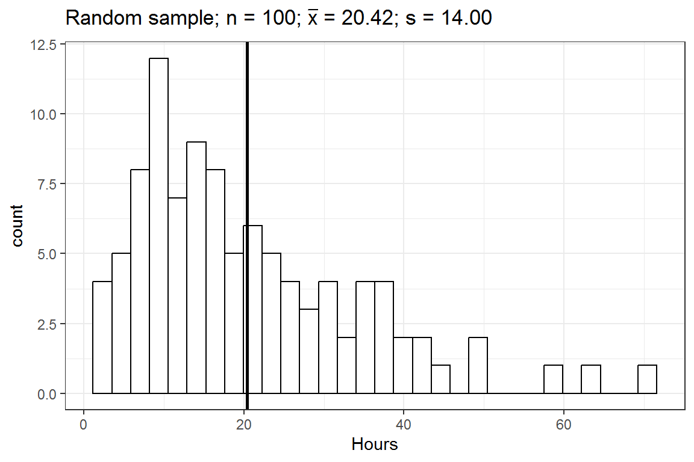

From the central limit theorem we know that the sampling distribution of the sample mean is approximately normal and we know that for the normal distribution, 95% of the values lie within about 2 standard deviations from the mean. Actually, it is not exactly 2 standard deviations from the mean. To get the exact number, we can use the quantile function for the normal distribution ```qnorm()```:  


```r
qnorm(0.975)
```

```
## [1] 1.959964
```

We use ```0.975``` (and not ```0.95```) to account for the probability at each end of the distribution (i.e., 2.5% at the lower end and 2.5% at the upper end). We can see that 95% of the values are roughly within 1.96 standard deviations from the mean. Since we know the sample mean ($\bar x$) and we can estimate the standard deviation of the sampling distribution ($\sigma_{\bar x} \approx {s \over \sqrt{n}}$), we can now easily calculate the lower and upper boundaries of our confidence interval as:

$$
CI_{lower} = {\bar x} - z_{1-{\alpha \over 2}} * \sigma_{\bar x} \\
CI_{upper} = {\bar x} + z_{1-{\alpha \over 2}} * \sigma_{\bar x}
$$ 

Here, $\alpha$ refers to the significance level. You can find a detailed discussion of this point at the end of the next chapter. For now, we will adopt the widely accepted significance level of 5% and set $\alpha$ to 0.05. Thus, $\pm z_{1-{\alpha \over 2}}$ gives us the z-scores (i.e., number of standard deviations from the mean) within which range 95% of the probability density lies. 

Plugging in the values from our sample, we get:


```r
sample_mean <- mean(hours_s)
se <- sd(hours_s)/sqrt(sample_size)
ci_lower <- sample_mean - qnorm(0.975)*se
ci_upper <- sample_mean + qnorm(0.975)*se
ci_lower
```

```
## [1] 17.67089
```

```r
ci_upper
```

```
## [1] 23.1592
```

such that if we collected 100 samples and computed the mean and confidence interval for each of them, in $95\%$ of the cases, the true population mean is going to be within this interval between 17.67 and 23.16. 

::: {.infobox_orange .hint data-latex="{hint}"}
Note the correct interpretation of the confidence interval: If we’d collected 100 samples, calculated the mean and then calculated a confidence interval for that mean, then, for 95 of these samples, the confidence intervals we constructed would contain the true value of the mean in the population.
:::

This is illustrated in the plot below that shows the mean of the first 100 samples and their confidence intervals:

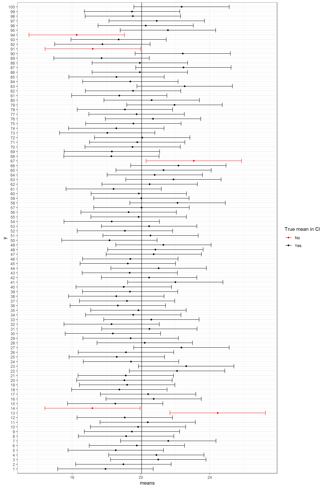


::: {.infobox_red .caution data-latex="{caution}"}
Note that this does **not** mean that for a specific sample there is a $95\%$ chance that the population mean lies within its confidence interval. The statement depends on the large number of samples we do not actually draw in a real setting. You can view the set of all possible confidence intervals similarly to the sides of a coin or a die. If we throw a coin many times, we are going to observe head roughly half of the times. This does not, however, exclude the possibility of observing tails for the first 10 throws. Similarly, any specific confidence interval might or might not include the population mean but if we take many samples on average $95\%$ of the confidence intervals are going to include the population mean.
:::

## Learning check {-}

**(LC5.1) What is the correct interpretation of a confidence interval for a significance level of $\alpha$=0.05?**

- [ ] If we take 100 samples and calculate mean and confidence interval for each one of them, then the true population mean would be included in 95% of these intervals.
- [ ] If we take 100 samples and calculate mean and confidence interval for each one of them, then the true population mean would be included in 5% of these intervals.
- [ ] If we take 100 samples and calculate mean and confidence interval for each one of them, then the true population mean would be included in 100% of these intervals.
- [ ] For a given sample, there is a 95% chance that the true population mean lies within the confidence interval.

**(LC5.2) Which statements regarding standard error are TRUE?**

- [ ] There is no connection between the standard deviation and the standard error.
- [ ] The standard error is a function of the sample size and the standard deviation.
- [ ] The standard error of the mean decreases as the sample size increases.
- [ ] The standard error of the mean increases as the standard deviation increases.
- [ ] None of the above 	

**(LC5.3) What is the correct definition for the standard error ($SE_{\bar x}$)?**

- [ ] ${s \over \sqrt{n}}$
- [ ] ${s * \sqrt{n}}$
- [ ] ${\sqrt{s^2} \over \sqrt{n}}$
- [ ] ${\sqrt{s} \over n}$
- [ ] None of the above 	

**(LC5.4) Which of the following do you need to compute a confidence interval around a sample mean?**

- [ ] The critical value of the test statistic given a certain level of confidence 
- [ ] A continuous variable (i.e., at least measured at the interval level) 
- [ ] The sample the mean
- [ ] The standard error
- [ ] None of the above 	

**(LC5.5) What is the correct definition for the confidence interval?**

- [ ] $CI=\bar{x} \pm \frac{z_{1-\frac{a}{n}}}{\sigma_{\bar{x}}}$
- [ ] $CI=\bar{x} * z_{1-\frac{a}{n}}*\sigma_{\bar{x}}$
- [ ] $CI= z_{1-\frac{a}{n}}*\sigma_{\bar{x}}-\bar{x}$
- [ ] $CI=\bar{x} \pm z_{1-\frac{a}{n}}*\sigma_{\bar{x}}$
- [ ] None of the above 	

*As a marketing manager at Spotify you wish to find the average listening time of your users. Based on a random sample of 180 users you found that the mean listening time for the sample is 7.34 hours per week and the standard deviation is 6.87 hours.* 

**(LC5.6) What is the 95% confidence interval for the mean listening time (the corresponding z-value for the 95% CI is 1.96)?**

- [ ] [6.34;8.34]
- [ ] [7.15;7.55]
- [ ] [6.25;8.15]
- [ ] [6.54;8.54]
- [ ] None of the above 

## References {-}

* Field, A., Miles J., & Field, Z. (2012). Discovering Statistics Using R. Sage Publications.
* Malhotra, N. K.(2010). Marketing Research: An Applied Orientation (6th. ed.). Prentice Hall.
* Vasishth, S. (2014). An introduction to statistical data analysis (lecture notes)

<!--chapter:end:06-statistical_inference.Rmd-->

---
output:
  html_document:
    df_print: paged
    toc: yes
  html_notebook: default
  pdf_document:
    toc: yes
---


# Hypothesis testing

## Introduction

::: {.infobox .download data-latex="{download}"}
[You can download the corresponding R-Code here](./Code/06-hypothesis_testing.R)
:::

<br>
<div align="center">
<iframe width="560" height="315" src="https://www.youtube.com/embed/cJRwmWWCpZE" frameborder="0" allowfullscreen></iframe>
</div>
<br>

We test hypotheses because we are confined to taking samples – we rarely work with the entire population. In the previous chapter, we introduced the standard error (i.e., the standard deviation of a large number of hypothetical samples) as an estimate of how well a particular sample represents the population. We also saw how we can construct confidence intervals around the sample mean $\bar x$ by computing $SE_{\bar x}$ as an estimate of $\sigma_{\bar x}$ using $s$ as an estimate of $\sigma$ and calculating the 95% CI as $\bar x \pm 1.96 * SE_{\bar x}$. Although we do not know the true population mean ($\mu$), we might have an hypothesis about it and this would tell us how the corresponding sampling distribution looks like. Based on the sampling distribution of the hypothesized population mean, we could then determine the probability of a given sample **assuming that the hypothesis is true**. 

Let us again begin by assuming we know the entire population using the example of music listening times among students from the previous example. As a reminder, the following plot shows the distribution of music listening times in the population of WU students. 


```r
library(tidyverse)
library(ggplot2)
library(latex2exp)
set.seed(321)
hours <- rgamma(n = 25000, shape = 2, scale = 10)
ggplot(data.frame(hours)) + geom_histogram(aes(x = hours), 
    bins = 30, fill = "white", color = "black") + geom_vline(xintercept = mean(hours), 
    size = 1) + theme_bw() + labs(title = "Histogram of listening times", 
    subtitle = TeX(sprintf("Population mean ($\\mu$) = %.2f; population standard deviation ($\\sigma$) = %.2f", 
        round(mean(hours), 2), round(sd(hours), 2))), 
    y = "Number of students", x = "Hours")
```


In this example, the population mean ($\mu$) is equal to 19.98, and the population standard deviation $\sigma$ is equal to 14.15. 

### The null hypothesis

<br>
<div align="center">
<iframe width="560" height="315" src="https://www.youtube.com/embed/DZOVAkWNgTg" frameborder="0" allowfullscreen></iframe>
</div>
<br>

Let us assume that we were planning to take a random sample of 50 students from this population and our hypothesis was that the mean listening time is equal to some specific value $\mu_0$, say $10$. This would be our **null hypothesis**. The null hypothesis refers to the statement that is being tested and is usually a statement of the status quo, one of no difference or no effect. In our example, the null hypothesis would state that there is no difference between the true population mean $\mu$ and the hypothesized value $\mu_0$ (in our example $10$), which can be expressed as follows:

$$
H_0: \mu = \mu_0
$$
When conducting research, we are usually interested in providing evidence against the null hypothesis. If we then observe sufficient evidence against it and our estimate is said to be significant. If the null hypothesis is rejected, this is taken as support for the **alternative hypothesis**. The alternative hypothesis assumes that some difference exists, which can be expressed as follows: 

$$
H_1: \mu \neq \mu_0
$$
Accepting the alternative hypothesis in turn will often lead to changes in opinions or actions. Note that while the null hypothesis may be rejected, it can never be accepted based on a single test. If we fail to reject the null hypothesis, it means that we simply haven't collected enough evidence against the null hypothesis to disprove it. In classical hypothesis testing, there is no way to determine whether the null hypothesis is true. **Hypothesis testing** provides a means to quantify to what extent the data from our sample is in line with the null hypothesis.

In order to quantify the concept of "sufficient evidence" we look at the theoretical distribution of the sample means given our null hypothesis and the sample standard error. Using the available information we can infer the sampling distribution for our null hypothesis. Recall that the standard deviation of the sampling distribution (i.e., the standard error of the mean) is given by $\sigma_{\bar x}={\sigma \over \sqrt{n}}$, and thus can be computed as follows:


```r
mean_pop <- mean(hours)
sigma <- sd(hours)  #population standard deviation
n <- 50  #sample size
standard_error <- sigma/sqrt(n)  #standard error
standard_error
```

```
## [1] 2.001639
```

Since we know from the central limit theorem that the sampling distribution is normal for large enough samples, we can now visualize the expected sampling distribution **if our null hypothesis was in fact true** (i.e., if the was no difference between the true population mean and the hypothesized mean of 10). 


We also know that 95% of the probability is within 1.96 standard deviations from the mean. Values higher than that are rather unlikely, if our hypothesis about the population mean was indeed true. This is shown by the shaded area, also known as the "rejection region". To test our hypothesis that the population mean is equal to $10$, let us take a random sample from the population.


```r
set.seed(12567)
H_0 <- 10
student_sample <- sample(1:25000, size = 50, replace = FALSE)
music_listening_sample <- data.frame(hours = hours[student_sample])
mean_sample <- mean(music_listening_sample$hours)
ggplot(music_listening_sample) + geom_histogram(aes(x = hours), 
    fill = "white", color = "black", bins = 20) + theme_bw() + 
    geom_vline(xintercept = mean_sample, color = "black", 
        size = 1) + labs(title = TeX(sprintf("Distribution of values in the sample ($n =$ %.0f, $\\bar{x] = $ %.2f, s = %.2f)", 
    n, mean_sample, sd(music_listening_sample$hours))), 
    x = "Hours", y = "Frequency")
```


The mean listening time in the sample (black line) $\bar x$ is 18.59. We can already see from the graphic above that such a value is rather unlikely under the hypothesis that the population mean is $10$. Intuitively, such a result would therefore provide evidence against our null hypothesis. But how could we quantify specifically how unlikely it is to obtain such a value and decide whether or not to reject the null hypothesis? Significance tests can be used to provide answers to these questions. 

### Statistical inference on a sample

#### Test statistic

##### z-scores

Let's go back to the sampling distribution above. We know that 95% of all values will fall within 1.96 standard deviations from the mean. So if we could express the distance between our sample mean and the null hypothesis in terms of standard deviations, we could make statements about the probability of getting a sample mean of the observed magnitude (or more extreme values). Essentially, we would like to know how many standard deviations ($\sigma_{\bar x}$) our sample mean ($\bar x$) is away from the population mean if the null hypothesis was true ($\mu_0$). This can be formally expressed as follows:

$$
\bar x-  \mu_0 = z \sigma_{\bar x}
$$

In this equation, ```z``` will tell us how many standard deviations the sample mean $\bar x$ is away from the null hypothesis $\mu_0$. Solving for ```z``` gives us:

$$
z = {\bar x-  \mu_0 \over \sigma_{\bar x}}={\bar x-  \mu_0 \over \sigma / \sqrt{n}}
$$

This standardized value (or "z-score") is also referred to as a **test statistic**. Let's compute the test statistic for our example above:


```r
z_score <- (mean_sample - H_0)/(sigma/sqrt(n))
z_score
```

```
## [1] 4.292454
```

To make a decision on whether the difference can be deemed statistically significant, we now need to compare this calculated test statistic to a meaningful threshold. In order to do so, we need to decide on a significance level $\alpha$, which expresses the probability of finding an effect that does not actually exist (i.e., Type I Error). You can find a detailed discussion of this point at the end of this chapter. For now, we will adopt the widely accepted significance level of 5% and set $\alpha$ to 0.05. The critical value for the normal distribution and $\alpha$ = 0.05 can be computed using the ```qnorm()``` function as follows:


```r
z_crit <- qnorm(0.975)
z_crit
```

```
## [1] 1.959964
```

We use ```0.975``` and not ```0.95``` since we are running a two-sided test and need to account for the rejection region at the other end of the distribution. Recall that for the normal distribution, 95% of the total probability falls within 1.96 standard deviations of the mean, so that higher (absolute) values provide evidence against the null hypothesis. Generally, we speak of a statistically significant effect if the (absolute) calculated test statistic is larger than the (absolute) critical value. We can easily check if this is the case in our example:


```r
abs(z_score) > abs(z_crit)
```

```
## [1] TRUE
```

Since the absolute value of the calculated test statistic is larger than the critical value, we would reject $H_0$ and conclude that the true population mean $\mu$ is significantly different from the hypothesized value $\mu_0 = 10$.

##### t-statistic

You may have noticed that the formula for the z-score above assumes that we know the true population standard deviation ($\sigma$) when computing the standard deviation of the sampling distribution ($\sigma_{\bar x}$) in the denominator. However, the population standard deviation is usually not known in the real world and therefore represents another unknown population parameter which we have to estimate from the sample. We saw in the previous chapter that we usually use $s$ as an estimate of $\sigma$ and $SE_{\bar x}$ as and estimate of $\sigma_{\bar x}$. Intuitively, we should be more conservative regarding the critical value that we used above to assess whether we have a significant effect to reflect this uncertainty about the true population standard deviation. That is, the threshold for a "significant" effect should be higher to safeguard against falsely claiming a significant effect when there is none. If we replace $\sigma_{\bar x}$ by it's estimate $SE_{\bar x}$ in the formula for the z-score, we get a new test statistic (i.e, the **t-statistic**) with its own distribution (the **t-distribution**): 

$$
t = {\bar x-  \mu_0 \over SE_{\bar x}}={\bar x-  \mu_0 \over s / \sqrt{n}}
$$

Here, $\bar X$ denotes the sample mean and $s$ the sample standard deviation. The t-distribution has more probability in its "tails", i.e. farther away from the mean. This reflects the higher uncertainty introduced by replacing the population standard deviation by its sample estimate. Intuitively, this is particularly relevant for small samples, since the uncertainty about the true population parameters decreases with increasing sample size. This is reflected by the fact that the exact shape of the t-distribution depends on the **degrees of freedom**, which is the sample size minus one (i.e., $n-1$). To see this, the following graph shows the t-distribution with different degrees of freedom for a two-tailed test and $\alpha = 0.05$. The grey curve shows the normal distribution. 


Notice that as $n$ gets larger, the t-distribution gets closer and closer to the normal distribution, reflecting the fact that the uncertainty introduced by $s$ is reduced. To summarize, we now have an estimate for the standard deviation of the distribution of the sample mean (i.e., $SE_{\bar x}$) and an appropriate distribution that takes into account the necessary uncertainty (i.e., the t-distribution). Let us now compute the t-statistic according to the formula above:


```r
SE <- (sd(music_listening_sample$hours)/sqrt(n))
t_score <- (mean_sample - H_0)/SE
t_score
```

```
## [1] 4.84204
```

Notice that the value of the t-statistic is higher compared to the z-score (4.29). This can be attributed to the fact that by using the $s$ as and estimate of $\sigma$, we underestimate the true population standard deviation. Hence, the critical value would need to be larger to adjust for this. This is what the t-distribution does. Let us compute the critical value from the t-distribution with ```n - 1```degrees of freedom.     


```r
df = n - 1
t_crit <- qt(0.975, df = df)
t_crit
```

```
## [1] 2.009575
```

Again, we use ```0.975``` and not ```0.95``` since we are running a two-sided test and need to account for the rejection region at the other end of the distribution. Notice that the new critical value based on the t-distributionis larger, to reflect the uncertainty when estimating $\sigma$ from $s$. Now we can see that the calculated test statistic is still larger than the critical value.  


```r
abs(t_score) > abs(t_crit)
```

```
## [1] TRUE
```

The following graphics shows that the calculated test statistic (red line) falls into the rejection region so that in our example, we would reject the null hypothesis that the true population mean is equal to $10$. 


**Decision:** Reject $H_0$, given that the calculated test statistic is larger than critical value.

Something to keep in mind here is the fact the test statistic is a function of the sample size. This, as $n$ gets large, the test statistic gets larger as well and we are more likely to find a significant effect. This reflects the decrease in uncertainty about the true population mean as our sample size increases.  

#### P-values

In the previous section, we computed the test statistic, which tells us how close our sample is to the null hypothesis. The p-value corresponds to the probability that the test statistic would take a value as extreme or more extreme than the one that we actually observed, **assuming that the null hypothesis is true**. It is important to note that this is a **conditional probability**: we compute the probability of observing a sample mean (or a more extreme value) conditional on the assumption that the null hypothesis is true. The ```pnorm()```function can be used to compute this probability. It is the cumulative probability distribution function of the `normal distribution. Cumulative probability means that the function returns the probability that the test statistic will take a value **less than or equal to** the calculated test statistic given the degrees of freedom. However, we are interested in obtaining the probability of observing a test statistic **larger than or equal to** the calculated test statistic under the null hypothesis (i.e., the p-value). Thus, we need to subtract the cumulative probability from 1. In addition, since we are running a two-sided test, we need to multiply the probability by 2 to account for the rejection region at the other side of the distribution.  


```r
p_value <- 2 * (1 - pt(abs(t_score), df = df))
p_value
```

```
## [1] 0.00001326885
```

This value corresponds to the probability of observing a mean equal to or larger than the one we obtained from our sample, if the null hypothesis was true. As you can see, this probability is very low. A small p-value signals that it is unlikely to observe the calculated test statistic under the null hypothesis. To decide whether or not to reject the null hypothesis, we would now compare this value to the level of significance ($\alpha$) that we chose for our test. For this example, we adopt the widely accepted significance level of 5%, so any test results with a p-value < 0.05 would be deemed statistically significant. Note that the p-value is directly related to the value of the test statistic. The relationship is such that the higher (lower) the value of the test statistic, the lower (higher) the p-value.   

**Decision:** Reject $H_0$, given that the p-value is smaller than 0.05. 

#### Confidence interval

For a given statistic calculated for a sample of observations (e.g., listening times), a 95% confidence interval can be constructed such that in 95% of samples, the true value of the true population mean will fall within its limits. If the parameter value specified in the null hypothesis (here $10$) does not lie within the bounds, we reject $H_0$. Building on what we learned about confidence intervals in the previous chapter, the 95% confidence interval based on the t-distribution can be computed as follows:

$$
CI_{lower} = {\bar x} - t_{1-{\alpha \over 2}} * SE_{\bar x} \\
CI_{upper} = {\bar x} + t_{1-{\alpha \over 2}} * SE_{\bar x}
$$ 

It is easy to compute this interval manually:


```r
ci_lower <- (mean_sample) - qt(0.975, df = df) * SE
ci_upper <- (mean_sample) + qt(0.975, df = df) * SE
ci_lower
```

```
## [1] 15.02606
```

```r
ci_upper
```

```
## [1] 22.15783
```

The interpretation of this interval is as follows: if we would (hypothetically) take 100 samples and calculated the mean and confidence interval for each of them, then the true population mean would be included in 95% of these intervals. The CI is informative when reporting the result of your test, since it provides an estimate of the uncertainty associated with the test result. From the test statistic or the p-value alone, it is not easy to judge in which range the true population parameter is located.  The CI provides an estimate of this range. 

**Decision:** Reject $H_0$, given that the parameter value from the null hypothesis ($10$) is not included in the interval. 

To summarize, you can see that we arrive at the same conclusion (i.e., reject $H_0$), irrespective if we use the test statistic, the p-value, or the confidence interval. However, keep in mind that rejecting the null hypothesis does not prove the alternative hypothesis (we can merely provide support for it). Rather, think of the p-value as the chance of obtaining the data we've collected assuming that the null hypothesis is true. You should report the confidence interval to provide an estimate of the uncertainty associated with your test results.  

### Choosing the right test

The test statistic, as we have seen, measures how close the sample is to the null hypothesis and often follows a well-known distribution (e.g., normal, t, or chi-square). To select the correct test, various factors need to be taken into consideration. Some examples are:

* On what scale are your variables measured (categorical vs. continuous)?
* Do you want to test for relationships or differences?
* If you test for differences, how many groups would you like to test?
* For parametric tests, are the assumptions fulfilled?

The previous discussion used a **one sample t-test** as an example, which requires that variable is measured on an interval or ratio scale. If you are confronted with other settings, the following flow chart provides a rough guideline on selecting the correct test:


For a detailed overview over the different type of tests, please also refer to <a href="https://stats.idre.ucla.edu/other/mult-pkg/whatstat/" target="_blank">this overview</a> by the UCLA.

#### Parametric vs. non-parametric tests

A basic distinction can be made between parametric and non-parametric tests. **Parametric tests** require that variables are measured on an interval or ratio scale and that the sampling distribution follows a known distribution. **Non-Parametric tests** on the other hand do not require the sampling distribution to be normally distributed (a.k.a. "assumption free tests"). These tests may be used when the variable of interest is measured on an ordinal scale or when the parametric assumptions do not hold. They often rely on ranking the data instead of analyzing the actual scores. By ranking the data, information on the magnitude of differences is lost. Thus, parametric tests are more powerful if the sampling distribution is normally distributed. In this chapter, we will first focus on parametric tests and cover non-parametric tests later. 

#### One-tailed vs. two-tailed test

For some tests you may choose between a **one-tailed test** versus a **two-tailed test**. The choice depends on the hypothesis you specified, i.e., whether you specified a directional or a non-directional hypotheses. In the example above, we used a **non-directional hypothesis**. That is, we stated that the mean is different from the comparison value $\mu_0$, but we did not state the direction of the effect. A **directional hypothesis** states the direction of the effect. For example, we might test whether the population mean is smaller than a comparison value:

$$
H_0: \mu \ge \mu_0 \\
H_1: \mu < \mu_0
$$

Similarly, we could test whether the population mean is larger than a comparison value:

$$
H_0: \mu \le \mu_0 \\
H_1: \mu > \mu_0
$$

Connected to the decision of how to phrase the hypotheses (directional vs. non-directional) is the choice of a **one-tailed test** versus a **two-tailed test**. Let's first think about the meaning of a one-tailed test. Using a significance level of 0.05, a one-tailed test means that 5% of the total area under the probability distribution of our test statistic is located in one tail. Thus, under a one-tailed test, we test for the possibility of the relationship in one direction only, disregarding the possibility of a relationship in the other direction. In our example, a one-tailed test could test either if the mean listening time is significantly larger or smaller compared to the control condition, but not both. Depending on the direction, the mean listening time is significantly larger (smaller) if the test statistic is located in the top (bottom) 5% of its probability distribution. 

The following graph shows the critical values that our test statistic would need to surpass so that the difference between the population mean and the comparison value would be deemed statistically significant.


It can be seen that under a one-sided test, the rejection region is at one end of the distribution or the other. In a two-sided test, the rejection region is split between the two tails. As a consequence, the critical value of the test statistic is smaller using a one-tailed test, meaning that it has more power to detect an effect. Having said that, in most applications, we would like to be able catch effects in both directions, simply because we can often not rule out that an effect might exist that is not in the hypothesized direction. For example, if we would conduct a one-tailed test for a mean larger than some specified value but the mean turns out to be substantially smaller, then testing a one-directional hypothesis ($H_0: \mu \le \mu_0 $) would not allow us to conclude that there is a significant effect because there is not rejection at this end of the distribution.   

As we have seen, the process of hypothesis testing consists of various steps:

1. Formulate null and alternative hypotheses
2. Select an appropriate test
3. Choose the level of significance ($\alpha$)
4. Descriptive statistics and data visualization
5. Conduct significance test
6. Report results and draw a marketing conclusion

In the following, we will go through the individual steps using examples for different tests. 

## One sample t-test

The example we used in the introduction was an example of the **one sample t-test** and we computed all statistics by hand to explain the underlying intuition. When you conduct hypothesis tests using R, you do not need to calculate these statistics by hand, since there are build-in routines to conduct the steps for you. Let us use the same example again to see how you would conduct hypothesis tests in R.  

**1. Formulate null and alternative hypotheses**

The null hypothesis states that there is no difference between the true population mean $\mu$ and the hypothesized value (i.e., $10$), while the alternative hypothesis states the opposite: 

$$
H_0: \mu = 10 \\
H_1: \mu \neq 10
$$

**2. Select an appropriate test**

Because we would like to test if the mean of a variable is different from a specified threshold, the one-sample t-test is appropriate. The assumptions of the test are 1) that the variable is measured using an interval or ratio scale, and 2) that the sampling distribution is normal. Both assumptions are met since 1) listening time is a ratio scale, and 2) we deem the sample size (n = 50) large enough to assume a normal sampling distribution according to the central limit theorem.  

**3. Choose the level of significance**

We choose the conventional 5% significance level. 

**4. Descriptive statistics and data visualization**

Provide descriptive statistics using the ```describe()``` function: 


```r
library(psych)
psych::describe(student_sample)
```

<div data-pagedtable="false">
  <script data-pagedtable-source type="application/json">
{"columns":[{"label":["vars"],"name":[1],"type":["dbl"],"align":["right"]},{"label":["n"],"name":[2],"type":["dbl"],"align":["right"]},{"label":["mean"],"name":[3],"type":["dbl"],"align":["right"]},{"label":["sd"],"name":[4],"type":["dbl"],"align":["right"]},{"label":["median"],"name":[5],"type":["dbl"],"align":["right"]},{"label":["trimmed"],"name":[6],"type":["dbl"],"align":["right"]},{"label":["mad"],"name":[7],"type":["dbl"],"align":["right"]},{"label":["min"],"name":[8],"type":["dbl"],"align":["right"]},{"label":["max"],"name":[9],"type":["dbl"],"align":["right"]},{"label":["range"],"name":[10],"type":["dbl"],"align":["right"]},{"label":["skew"],"name":[11],"type":["dbl"],"align":["right"]},{"label":["kurtosis"],"name":[12],"type":["dbl"],"align":["right"]},{"label":["se"],"name":[13],"type":["dbl"],"align":["right"]}],"data":[{"1":"1","2":"50","3":"11457.94","4":"7943.54","5":"10494","6":"11277.4","7":"9759.215","8":"114","9":"24979","10":"24865","11":"0.179127","12":"-1.324842","13":"1123.386"}],"options":{"columns":{"min":{},"max":[10]},"rows":{"min":[10],"max":[10]},"pages":{}}}
  </script>
</div>

From this, we can already see that the mean is different from the hypothesized value. The question however remains, whether this difference is significantly different, given the sample size and the variability in the data. Since we only have one continuous variable, we can visualize the distribution in a histogram. 


```r
ggplot(music_listening_sample) + geom_histogram(aes(x = hours), 
    fill = "white", color = "black", bins = 20) + theme_bw() + 
    labs(title = "Distribution of values in the sample", 
        x = "Hours", y = "Frequency")
```


**5. Conduct significance test**

In the beginning of the chapter, we saw, how you could conduct significance test by hand. However, R has built-in routines that you can use to conduct the analyses. The ```t.test()``` function can be used to conduct the test. To test if the listening time among WU students was 10, you can use the following code:


```r
H_0 <- 10
t.test(music_listening_sample$hours, mu = H_0, alternative = "two.sided")
```

```
## 
## 	One Sample t-test
## 
## data:  music_listening_sample$hours
## t = 4.842, df = 49, p-value = 0.00001327
## alternative hypothesis: true mean is not equal to 10
## 95 percent confidence interval:
##  15.02606 22.15783
## sample estimates:
## mean of x 
##  18.59194
```

Note that if you would have stated a directional hypothesis (i.e., the mean is either greater or smaller than 10 hours), you could easily amend the code to conduct a one sided test by changing the argument ```alternative```from ```'two.sided'``` to either ```'less'``` or ```'greater'```.

Note that you could also combine the results from the statistical test and the visualization using the `ggstatsplot` package as follows. 


```r
library(ggstatsplot)
gghistostats(
  data = music_listening_sample, # dataframe from which variable is to be taken
  x = hours, # numeric variable whose distribution is of interest
  title = "Distribution of listening times", # title for the plot
  caption = "Notes: Test based on a random sample of 50 students.",
  type = "parametric", # one sample t-test
  conf.level = 0.95, # changing confidence level for effect size
  bar.measure = "mix", # what does the bar length denote
  test.value = 10, # default value is 0
  test.value.line = TRUE, # display a vertical line at test value
  effsize.type = "d", # display effect size (Cohen's d in output)
  test.value.color = "#0072B2", # color for the line for test value
  centrality.para = "mean", # which measure of central tendency is to be plotted
  centrality.color = "darkred", # decides color for central tendency line
  binwidth = 2, # binwidth value (experiment)
  messages = FALSE, # turn off the messages
  bf.message = FALSE
)
```


You may nice some additional output in this plot related to the measure of effect size (Cohen's d). Don't worry about it at this stage, we will come back to this later in this chapter. 

**6. Report results and draw a marketing conclusion**

Note that the results are the same as above, when we computed the test by hand. You could summarize the results as follows:

On average, the listening times in our sample were different form 10 hours per month (Mean = 18.59 hours, SE = 1.77). This difference was significant t(49) = 4.842, p < .05 (95% CI = [15.03; 22.16]). Based on this evidence, we can conclude that the mean in our sample is significantly lower compared to the hypothesized population mean of $10$ hours, providing evidence against the null hypothesis. 

Note that in the reporting above, the number ```49``` in parenthesis refers to the degrees of freedom that are available from the output. 


## Comparing two means

In the one-sample test above, we tested the hypothesis that the population mean has some specific value $\mu_0$ using data from only one sample. In marketing (as in many other disciplines), you will often be confronted with a situation where you wish to compare the means of two groups. For example, you may conduct an experiment and randomly split your sample into two groups, one of which receives a treatment (experimental group) while the other doesn't (control group). In this case, the units (e.g., participants, products) in each group are different ('between-subjects design') and the samples are said to be independent. Hence, we would use a **independent-means t-test**. If you run an experiment with two experimental conditions and the same units (e.g., participants, products) were observed in both experimental conditions, the sample is said to be dependent in the sense that you have the same units in each group ('within-subjects design'). In this case, we would need to conduct an **dependent-means t-test**. Both tests are described in the following sections, beginning with the independent-means t-test.      

### Independent-means t-test

<br>
<div align="center">
<iframe width="560" height="315" src="https://www.youtube.com/embed/7APeiQ3_46A" frameborder="0" allowfullscreen></iframe>
</div>
<br>

Using an independent-means t-test, we can compare the means of two possibly different populations. It is, for example, quite common for online companies to test new service features by running an experiment and randomly splitting their website visitors into two groups: one is exposed to the website with the new feature (experimental group) and the other group is not exposed to the new feature (control group). This is a typical A/B-Test scenario.

As an example, imagine that a music streaming service would like to introduce a new playlist feature that let's their users access playlists created by other users. The goal is to analyze how the new service feature impacts the listening time of users. The service randomly splits a representative subset of their users into two groups and collects data about their listening times over one month. Let's create a data set to simulate such a scenario. 

<div data-pagedtable="false">
  <script data-pagedtable-source type="application/json">
{"columns":[{"label":["hours"],"name":[1],"type":["dbl"],"align":["right"]},{"label":["group"],"name":[2],"type":["chr"],"align":["left"]}],"data":[{"1":"2","2":"A"},{"1":"27","2":"A"},{"1":"25","2":"A"},{"1":"2","2":"A"},{"1":"46","2":"A"},{"1":"13","2":"A"}],"options":{"columns":{"min":{},"max":[10]},"rows":{"min":[10],"max":[10]},"pages":{}}}
  </script>
</div>


```r
hours_a_b <- read.table("https://raw.githubusercontent.com/IMSMWU/Teaching/master/MRDA2017/hours_a_b.csv", 
    sep = ",", header = TRUE)
head(hours_a_b)
```

<div data-pagedtable="false">
  <script data-pagedtable-source type="application/json">
{"columns":[{"label":["hours"],"name":[1],"type":["int"],"align":["right"]},{"label":["group"],"name":[2],"type":["chr"],"align":["left"]}],"data":[{"1":"2","2":"A"},{"1":"27","2":"A"},{"1":"25","2":"A"},{"1":"2","2":"A"},{"1":"46","2":"A"},{"1":"13","2":"A"}],"options":{"columns":{"min":{},"max":[10]},"rows":{"min":[10],"max":[10]},"pages":{}}}
  </script>
</div>

This data set contains two variables: the variable ```hours``` indicates the music listening times (in hours) and the variable ```group``` indicates from which group the observation comes, where 'A' refers to the control group (with the standard service) and 'B' refers to the experimental group (with the new playlist feature). Let's first look at the descriptive statistics by group using the ```describeBy``` function:


```r
library(psych)
describeBy(hours_a_b$hours, hours_a_b$group)
```

```
## 
##  Descriptive statistics by group 
## group: A
##    vars  n  mean   sd median trimmed   mad min max range skew kurtosis   se
## X1    1 98 18.11 12.1     15   16.88 10.38   2  65    63 1.08     1.21 1.22
## ------------------------------------------------------------ 
## group: B
##    vars   n mean    sd median trimmed   mad min max range skew kurtosis  se
## X1    1 112 28.5 17.97   24.5   26.56 15.57   1  83    82 0.96     0.82 1.7
```

From this, we can already see that there is a difference in means between groups A and B. We can also see that the number of observations is different, as is the standard deviation. The question that we would like to answer is whether there is a significant difference in mean listening times between the groups. Remember that different users are contained in each group ('between-subjects design') and that the observations in one group are independent of the observations in the other group. Before we will see how you can easily conduct an independent-means t-test, let's go over some theory first.

#### Theory

As a starting point, let us label the unknown population mean of group A (control group) in our experiment $\mu_1$, and that of group B (experimental group) $\mu_2$. In this setting, the null hypothesis would state that the mean in group A is equal to the mean in group B:

$$
H_0: \mu_1=\mu_2
$$

This is equivalent to stating that the difference between the two groups ($\delta$) is zero:

$$
H_0: \mu_1 - \mu_2=0=\delta
$$

That is, $\delta$ is the new unknown population parameter, so that the null and alternative hypothesis become:   

$$
H_0: \delta = 0 \\
H_1: \delta \ne 0
$$

Remember that we usually don't have access to the entire population so that we can not observe $\delta$ and have to estimate is from a sample statistic, which we define as $d = \bar x_1-\bar x_2$, i.e., the difference between the sample means from group a ($\bar x_1$) and group b ($\bar x_2$). But can we really estimate $d$ from $\delta$? Remember from the previous chapter, that we could estimate $\mu$ from $\bar x$, because if we (hypothetically) take a larger number of samples, the distribution of the means of these samples (the sampling distribution) will be normally distributed and its mean will be (in the limit) equal to the population mean. It turns out that we can use the same underlying logic here. The above samples were drawn from two different populations with $\mu_1$ and $\mu_2$. Let us compute the difference in means between these two populations:       


```r
delta_pop <- mean(hours_population_1) - mean(hours_population_2)
delta_pop
```

```
## [1] -7.422855
```

This means that the true difference between the mean listening times of groups a and b is -7.42. Let us now repeat the exercise from the previous chapter: let us repeatedly draw a large number of $20,000$ random samples of 100 users from each of these populations, compute the difference (i.e., $d$, our estimate of $\delta$), store the difference for each draw and create a histogram of $d$.


```r
set.seed(321)
hours_population_1 <- rgamma(25000, shape = 2, scale = 10)
hours_population_2 <- rgamma(25000, shape = 2.5, scale = 11)

samples <- 20000
mean_delta <- matrix(NA, nrow = samples)
for (i in 1:samples) {
    student_sample <- sample(1:25000, size = 100, replace = FALSE)
    mean_delta[i, ] <- mean(hours_population_1[student_sample]) - 
        mean(hours_population_2[student_sample])
}

ggplot(data.frame(mean_delta)) + geom_histogram(aes(x = mean_delta), 
    bins = 30, fill = "white", color = "black") + theme_bw() + 
    theme(legend.title = element_blank()) + geom_vline(aes(xintercept = mean(mean_delta)), 
    size = 1) + xlab("d") + ggtitle(TeX(sprintf("%d samples; $d_{\\bar{x}}$ = %.2f", 
    samples, round(mean(mean_delta), 2))))
```


This gives us the sampling distribution of the mean differences between the samples. You will notice that this distribution follows a normal distribution and is centered around the true difference between the populations. This means that, on average, the difference between two sample means $d$ is a good estimate of $\delta$. In our example, the difference between $\bar x_1$ and $\bar x_2$ is:


```r
mean_x1 <- mean(hours_a_b[hours_a_b$group == "A", "hours"])
mean_x1
```

```
## [1] 18.11224
```

```r
mean_x2 <- mean(hours_a_b[hours_a_b$group == "B", "hours"])
mean_x2
```

```
## [1] 28.5
```

```r
d <- mean_x1 - mean_x2
d
```

```
## [1] -10.38776
```

Now that we have $d$ as an estimate of $\delta$, how can we find out if the observed difference is significantly different from the null hypothesis (i.e., $\delta = 0$)?

Recall from the previous section, that the standard deviation of the sampling distribution $\sigma_{\bar x}$ (i.e., the standard error) gives us indication about the precision of our estimate. Further recall that the standard error can be calculated as $\sigma_{\bar x}={\sigma \over \sqrt{n}}$. So how can we calculate the standard error of the difference between two population means? According to the **variance sum law**, to find the variance of the sampling distribution of differences, we merely need to add together the variances of the sampling distributions of the two populations that we are comparing. To find the standard error, we only need to take the square root of the variance (because the standard error is the standard deviation of the sampling distribution and the standard deviation is the square root of the variance), so that we get:

$$
\sigma_{\bar x_1-\bar x_2} = \sqrt{{\sigma_1^2 \over n_1}+{\sigma_2^2 \over n_2}}
$$

But recall that we don't actually know the true population standard deviation, so we use $SE_{\bar x_1-\bar x_2}$ as an estimate of $\sigma_{\bar x_1-\bar x_2}$:

$$
SE_{\bar x_1-\bar x_2} = \sqrt{{s_1^2 \over n_1}+{s_2^2 \over n_2}}
$$

Hence, for our example, we can calculate the standard error as follows: 


```r
n1 <- 98
n2 <- 112
s1 <- var(hours_a_b[hours_a_b$group == "A", "hours"])
s1
```

```
## [1] 146.4924
```

```r
s2 <- var(hours_a_b[hours_a_b$group == "B", "hours"])
s2
```

```
## [1] 322.9189
```

```r
SE_x1_x2 <- sqrt(s1/n1 + s2/n2)
SE_x1_x2
```

```
## [1] 2.092373
```

Recall from above that we can calculate the t-statistic as:

$$
t= {\bar x - \mu_0 \over {s \over \sqrt{n}}} 
$$

Exchanging $\bar x$ for $d$, we get

$$
t= {(\bar{x}_1 - \bar{x}_2) - (\mu_1 - \mu_2) \over {\sqrt{{s_1^2 \over n_1}+{s_2^2 \over n_2}}}} 
$$

Note that according to our hypothesis $\mu_1-\mu_2=0$, so that we can calculate the t-statistic as: 


```r
t_score <- d/SE_x1_x2
t_score
```

```
## [1] -4.964581
```

Following the example of our one sample t-test above, we would now need to compare this calculated test statistic to a critical value in order to assess if $d$ is sufficiently far away from the null hypothesis to be statistically significant. To do this, we would need to know the exact t-distribution, which depends on the degrees of freedom. The problem is that deriving the degrees of freedom in this case is not that obvious. If we were willing to assume that $\sigma_1=\sigma_2$, the correct t-distribution has $n_1 -1 + n_2-1$ degrees of freedom (i.e., the sum of the degrees of freedom of the two samples). However, because in real life we don not know if $\sigma_1=\sigma_2$, we need to account for this additional uncertainty. We will not go into detail here, but R automatically uses a sophisticated approach to correct the degrees of freedom called the Welch's correction, as we will see in the subsequent application. 

#### Application

The section above explained the theory behind the independent-means t-test and showed how to compute the statistics manually. Obviously you don't have to compute these statistics by hand in this section shows you how to conduct an independent-means t-test in R using the example from above.  

**1. Formulate null and alternative hypotheses**

We wish to analyze whether there is a significant difference in music listening times between groups A and B. So our null hypothesis is that the means from the two populations are the same (i.e., there is no difference), while the alternative hypothesis states the opposite:   

$$
H_0: \mu_1=\mu_2\\
H_1: \mu_1 \ne \mu_2
$$

**2. Select an appropriate test**

Since we have a ratio scaled variable (i.e., listening times) and two independent groups, where the mean of one sample is independent of the group of the second sample (i.e., the groups contain different units), the independent-means t-test is appropriate. 

**3. Choose the level of significance**

We choose the conventional 5% significance level. 

**4. Descriptive statistics and data visualization**

We can compute the descriptive statistics for each group separately, using the ```describeBy()``` function:


```r
library(psych)
describeBy(hours_a_b$hours, hours_a_b$group)
```

```
## 
##  Descriptive statistics by group 
## group: A
##    vars  n  mean   sd median trimmed   mad min max range skew kurtosis   se
## X1    1 98 18.11 12.1     15   16.88 10.38   2  65    63 1.08     1.21 1.22
## ------------------------------------------------------------ 
## group: B
##    vars   n mean    sd median trimmed   mad min max range skew kurtosis  se
## X1    1 112 28.5 17.97   24.5   26.56 15.57   1  83    82 0.96     0.82 1.7
```

This already shows us that the mean between groups A and B are different. We can visualize the data using a boxplot and a histogram. 


```r
ggplot(hours_a_b, aes(x = group, y = hours)) + geom_boxplot() + 
    geom_jitter(alpha = 0.2, color = "red") + labs(x = "Group", 
    y = "Listening time (hours)") + ggtitle("Boxplot of listening times") + 
    theme_bw()
```


```r
ggplot(hours_a_b, aes(hours)) + geom_histogram(col = "black", 
    fill = "darkblue") + labs(x = "Listening time (hours)", 
    y = "Frequency") + ggtitle("Histogram of listening times") + 
    facet_wrap(~group) + theme_bw()
```


**5. Conduct significance test**

To conduct the independent means t-test, we can use the ```t.test()``` function:


```r
t.test(hours ~ group, data = hours_a_b, mu = 0, alternative = "two.sided", 
    conf.level = 0.95, var.equal = FALSE)
```

```
## 
## 	Welch Two Sample t-test
## 
## data:  hours by group
## t = -4.9646, df = 195.73, p-value = 0.000001494
## alternative hypothesis: true difference in means is not equal to 0
## 95 percent confidence interval:
##  -14.514246  -6.261264
## sample estimates:
## mean in group A mean in group B 
##        18.11224        28.50000
```

Again, we could combine the results of the statistical test and the visualization using the `ggstatsplot` package. 


```r
library(ggstatsplot)
ggbetweenstats(
  data = hours_a_b,
  plot.type = "box",
  x = group, # 2 groups
  y = hours ,
  type = "p", # default
  effsize.type = "d", # display effect size (Cohen's d in output)
  messages = FALSE,
  bf.message = FALSE,
  mean.ci = TRUE,
  title = "Mean listening times for different groups"
)
```


**6. Report results and draw a marketing conclusion**

The results showed that listening times were higher in the experimental group (Mean = 28.50, SE = 1.70) compared to the control group (Mean = 18.11, SE = 1.22). This means that the listening times were 10.39 hours higher on average in the experimental group, compared to the control group. An independent-means t-test showed that this difference is significant t(195.73) = 4.96, p < .05 (95% CI = [6.26, 14.51]).


### Dependent-means t-test

<br>
<div align="center">
<iframe width="560" height="315" src="https://www.youtube.com/embed/vIcrWJ6sJu8" frameborder="0" allowfullscreen></iframe>
</div>
<br>

While the independent-means t-test is used when different units (e.g., participants, products) were assigned to the different condition, the **dependent-means t-test** is used when there are two experimental conditions and the same units (e.g., participants, products) were observed in both experimental conditions.

Imagine, for example, a slightly different experimental setup for the above experiment. Imagine that we do not assign different users to the groups, but that a sample of 100 users gets to use the music streaming service with the new feature for one month and we compare the music listening times of these users during the month of the experiment with the listening time in the previous month. Let us generate data for this example: 

<div data-pagedtable="false">
  <script data-pagedtable-source type="application/json">
{"columns":[{"label":["hours_a"],"name":[1],"type":["dbl"],"align":["right"]},{"label":["hours_b"],"name":[2],"type":["dbl"],"align":["right"]}],"data":[{"1":"2","2":"24"},{"1":"27","2":"21"},{"1":"25","2":"51"},{"1":"2","2":"12"},{"1":"46","2":"54"},{"1":"13","2":"18"}],"options":{"columns":{"min":{},"max":[10]},"rows":{"min":[10],"max":[10]},"pages":{}}}
  </script>
</div>


```r
hours_a_b_paired <- read.table("https://raw.githubusercontent.com/IMSMWU/Teaching/master/MRDA2017/hours_a_b_paired.csv", 
    sep = ",", header = TRUE)
head(hours_a_b_paired)
```

<div data-pagedtable="false">
  <script data-pagedtable-source type="application/json">
{"columns":[{"label":["hours_a"],"name":[1],"type":["int"],"align":["right"]},{"label":["hours_b"],"name":[2],"type":["int"],"align":["right"]}],"data":[{"1":"2","2":"24"},{"1":"27","2":"21"},{"1":"25","2":"51"},{"1":"2","2":"12"},{"1":"46","2":"54"},{"1":"13","2":"18"}],"options":{"columns":{"min":{},"max":[10]},"rows":{"min":[10],"max":[10]},"pages":{}}}
  </script>
</div>

Note that the data set has almost the same structure as before only that we know have two variables representing the listening times of each user in the month before the experiment and during the month of the experiment when the new feature was tested.

#### Theory

In this case, we want to test the hypothesis that there is no difference in mean the mean listening times between the two months. This can be expressed as follows:

$$
H_0: \mu_D = 0 \\
$$
Note that the hypothesis only refers to one population, since both observations come from the same units (i.e., users). To use consistent notation, we replace $\mu_D$ with $\delta$ and get:

$$
H_0: \delta = 0 \\
H_1: \delta \neq 0
$$

where $\delta$ denotes the difference between the observed listening times from the two consecutive months **of the same users**. As is the previous example, since we do not observe the entire population, we estimate $\delta$ based on the sample using $d$, which is the difference in mean listening time between the two months for our sample. Note that we assume that everything else (e.g., number of new releases) remained constant over the two month to keep it simple. We can show as above that the sampling distribution follows a normal distribution with a mean that is (in the limit) the same as the population mean. This means, again, that the difference in sample means is a good estimate for the difference in population means. Let's compute a new variable $d$, which is the difference between two month. 


```r
hours_a_b_paired$d <- hours_a_b_paired$hours_a - hours_a_b_paired$hours_b
head(hours_a_b_paired)
```

<div data-pagedtable="false">
  <script data-pagedtable-source type="application/json">
{"columns":[{"label":["hours_a"],"name":[1],"type":["int"],"align":["right"]},{"label":["hours_b"],"name":[2],"type":["int"],"align":["right"]},{"label":["d"],"name":[3],"type":["int"],"align":["right"]}],"data":[{"1":"2","2":"24","3":"-22"},{"1":"27","2":"21","3":"6"},{"1":"25","2":"51","3":"-26"},{"1":"2","2":"12","3":"-10"},{"1":"46","2":"54","3":"-8"},{"1":"13","2":"18","3":"-5"}],"options":{"columns":{"min":{},"max":[10]},"rows":{"min":[10],"max":[10]},"pages":{}}}
  </script>
</div>

Note that we now have a new variable, which is the difference in listening times (in hours) between the two months. The mean of this difference is:


```r
mean_d <- mean(hours_a_b_paired$d)
mean_d
```

```
## [1] -11.65
```

Again, we use $SE_{\bar x}$ as an estimate of $\sigma_{\bar x}$:

$$
SE_{\bar d}={s \over \sqrt{n}}
$$
Hence, we can compute the standard error as:


```r
n <- nrow(hours_a_b_paired)
SE_d <- sd(hours_a_b_paired$d)/sqrt(n)
SE_d
```

```
## [1] 2.151503
```

The test statistic is therefore:

$$
t = {\bar d-  \mu_0 \over SE_{\bar d}}
$$
on 99 (i.e., n-1) degrees of freedom. Now we can compute the t-statistic as follows:


```r
t_score <- mean_d/SE_d
t_score
```

```
## [1] -5.41482
```

```r
qt(0.975, df = 99)
```

```
## [1] 1.984217
```

Note that in the case of the dependent-means t-test, we only base our hypothesis on one population and hence there is only one population variance. This is because in the dependent sample test, the observations come from the same observational units (i.e., users). Hence, there is no unsystematic variation due to potential differences between users that were assigned to the experimental groups. This means that the influence of unobserved factors (unsystematic variation) relative to the variation due to the experimental manipulation (systematic variation) is not as strong in the dependent-means test compared to the independent-means test and we don't need to correct for differences in the population variances. 

#### Application

Again, we don't have to compute all this by hand since the ```t.test(...)``` function can be used to do it for us. Now we have to use the argument ```paired=TRUE``` to let R know that we are working with dependent observations. 

**1. Formulate null and alternative hypotheses**

We would like to the test if there is a difference in music listening times between the two consecutive months, so our null hypothesis is that there is no difference, while the alternative hypothesis states the opposite:

$$
H_0: \mu_D = 0 \\
H_0: \mu_D \ne 0
$$

**2. Select an appropriate test**

Since we have a ratio scaled variable (i.e., listening times) and two observations of the same group of users (i.e., the groups contain the same units), the dependent-means t-test is appropriate. 

**3. Choose the level of significance**

We choose the conventional 5% significance level. 

**4. Descriptive statistics and data visualization**

We can compute the descriptive statistics for each month separately, using the ```describe()``` function:


```r
library(psych)
describe(hours_a_b_paired)
```

<div data-pagedtable="false">
  <script data-pagedtable-source type="application/json">
{"columns":[{"label":["vars"],"name":[1],"type":["int"],"align":["right"]},{"label":["n"],"name":[2],"type":["dbl"],"align":["right"]},{"label":["mean"],"name":[3],"type":["dbl"],"align":["right"]},{"label":["sd"],"name":[4],"type":["dbl"],"align":["right"]},{"label":["median"],"name":[5],"type":["dbl"],"align":["right"]},{"label":["trimmed"],"name":[6],"type":["dbl"],"align":["right"]},{"label":["mad"],"name":[7],"type":["dbl"],"align":["right"]},{"label":["min"],"name":[8],"type":["dbl"],"align":["right"]},{"label":["max"],"name":[9],"type":["dbl"],"align":["right"]},{"label":["range"],"name":[10],"type":["dbl"],"align":["right"]},{"label":["skew"],"name":[11],"type":["dbl"],"align":["right"]},{"label":["kurtosis"],"name":[12],"type":["dbl"],"align":["right"]},{"label":["se"],"name":[13],"type":["dbl"],"align":["right"]}],"data":[{"1":"1","2":"100","3":"17.93","4":"12.06988","5":"15","6":"16.5875","7":"10.3782","8":"2","9":"65","10":"63","11":"1.0913320","12":"1.2549609","13":"1.206988"},{"1":"2","2":"100","3":"29.58","4":"18.41562","5":"25","6":"27.6250","7":"17.0499","8":"3","9":"83","10":"80","11":"0.8966967","12":"0.5662360","13":"1.841562"},{"1":"3","2":"100","3":"-11.65","4":"21.51503","5":"-9","6":"-10.6000","7":"19.2738","8":"-76","9":"51","10":"127","11":"-0.3750444","12":"0.7209769","13":"2.151503"}],"options":{"columns":{"min":{},"max":[10]},"rows":{"min":[10],"max":[10]},"pages":{}}}
  </script>
</div>

This already shows us that the mean between the two months are different. We can visiualize the data using a plot of means, boxplot, and a histogram. 

To plot the data, we need to do some restructuring first, since the variables are now stored in two different columns ("hours_a" and "hours_b"). This is also known as the "wide" format. To plot the data we need all observations to be stored in one variable. This is also known as the "long" format. We can use the ```melt(...)``` function from the ```reshape2```package to "melt" the two variable into one column to plot the data. 


```r
library(reshape2)
hours_a_b_paired_long <- melt(hours_a_b_paired[, c("hours_a", 
    "hours_b")])
names(hours_a_b_paired_long) <- c("group", "hours")
head(hours_a_b_paired_long)
```

<div data-pagedtable="false">
  <script data-pagedtable-source type="application/json">
{"columns":[{"label":["group"],"name":[1],"type":["fct"],"align":["left"]},{"label":["hours"],"name":[2],"type":["int"],"align":["right"]}],"data":[{"1":"hours_a","2":"2"},{"1":"hours_a","2":"27"},{"1":"hours_a","2":"25"},{"1":"hours_a","2":"2"},{"1":"hours_a","2":"46"},{"1":"hours_a","2":"13"}],"options":{"columns":{"min":{},"max":[10]},"rows":{"min":[10],"max":[10]},"pages":{}}}
  </script>
</div>

Now we are ready to plot the data:


```r
ggplot(hours_a_b_paired_long, aes(x = group, y = hours)) + 
    geom_boxplot() + geom_jitter(alpha = 0.2, color = "red") + 
    labs(x = "Group", y = "Listening time (hours)") + 
    ggtitle("Boxplot of listening times") + theme_bw()
```


```r
ggplot(hours_a_b_paired_long, aes(hours)) + geom_histogram(col = "black", 
    fill = "darkblue") + labs(x = "Listening time (hours)", 
    y = "Frequency") + ggtitle("Histogram of listening times") + 
    facet_wrap(~group) + theme_bw()
```


**5. Conduct significance test**

To conduct the independent means t-test, we can use the ```t.test()``` function with the argument ```paired = TRUE```:


```r
t.test(hours_a_b_paired$hours_a, hours_a_b_paired$hours_b, 
    mu = 0, alternative = "two.sided", conf.level = 0.95, 
    paired = TRUE)
```

```
## 
## 	Paired t-test
## 
## data:  hours_a_b_paired$hours_a and hours_a_b_paired$hours_b
## t = -5.4148, df = 99, p-value = 0.00000043
## alternative hypothesis: true difference in means is not equal to 0
## 95 percent confidence interval:
##  -15.919048  -7.380952
## sample estimates:
## mean of the differences 
##                  -11.65
```
Again, we could combine the results of the statistical test and the visualization using the `ggstatsplot` package. 


```r
library(ggstatsplot)
ggwithinstats(
  data = hours_a_b_paired_long,
  x = group,
  y = hours,
  path.point = FALSE,
  path.mean = TRUE,
  sort = "descending", # ordering groups along the x-axis based on
  sort.fun = median, # values of `y` variable
  title = "Mean listening times for different treatments",
  messages = FALSE,
  bf.message = FALSE,
  mean.ci = TRUE,
  effsize.type = "d" # display effect size (Cohen's d in output)
)
```


**6. Report results and draw a marketing conclusion**

On average, the same users used the service more when it included the new feature (M = 29.58, SE = 1.84) compared to the service without the feature (M = 17.93, SE = 1.21). This difference was significant t(99) = 5.41, p < .05 (95% CI = [7.38, 15.91]).


## NHST considerations 

<br>
<div align="center">
<iframe width="560" height="315" src="https://www.youtube.com/embed/ctwQn6YYUBM" frameborder="0" allowfullscreen></iframe>
</div>
<br>

### Type I and Type II Errors

When choosing the level of significance ($\alpha$). It is important to note that the choice of the significance level affects the type 1 and type 2 error:

* Type I error: When we believe there is a genuine effect in our population, when in fact there isn't. Probability of type I error ($\alpha$) = level of significance.
* Type II error: When we believe that there is no effect in the population, when in fact there is. 

This following table shows the possible outcomes of a test (retain vs. reject $H_0$), depending on whether $H_0$ is true or false in reality.

&nbsp; | Retain <b>H<sub>0</sub></b>	 | Reject <b>H<sub>0</sub></b>	
--------------- | -------------------------------------- | --------------------------------------
<b>H<sub>0</sub> is true</b>  | Correct decision:<br>1-&alpha; (probability of correct retention); | Type 1 error:<br> &alpha; (level of significance)
<b>H<sub>0</sub> is false</b>  | Type 2 error:<br>&beta; (type 2 error rate) | Correct decision:<br>1-&beta; (power of the test)

### Significance level, sample size, power, and effect size

When you plan to conduct an experiment, there are some factors that are under direct control of the researcher:

* **Significance level ($\alpha$)**: The probability of finding an effect that does not genuinely exist.
* **Sample size (n)**: The number of observations in each group of the experimental design.

Unlike &alpha; and n, which are specified by the researcher, the magnitude of &beta; depends on the actual value of the population parameter. In addition, &beta; is influenced by the effect size (e.g., Cohen’s d), which can be used to determine a standardized measure of the magnitude of an observed effect. The following parameters are affected more indirectly:

* **Power (1-&beta;)**: The probability of finding an effect that does genuinely exists. 
* **Effect size (d)**: Standardized measure of the effect size under the alternate hypothesis. 

Although &beta; is unknown, it is related to &alpha;. For example, if we would like to be absolutely sure that we do not falsely identify an effect which does not exist (i.e., make a type I error), this means that the probability of identifying an effect that does exist (i.e., 1-&beta;) decreases and vice versa. Thus, an extremely low value of &alpha; (e.g., &alpha; = 0.0001) will result in intolerably high &beta; errors. A common approach is to set &alpha;=0.05 and &beta;=0.80. 

Unlike the t-value of our test, the effect size (d) is unaffected by the sample size and can be categorized as follows (see Cohen, J. 1988): 

* 0.2 (small effect)
* 0.5 (medium effect)
* 0.8 (large effect)

In order to test more subtle effects (smaller effect sizes), you need a larger sample size compared to the test of more obvious effects. In <a href="https://papers.ssrn.com/sol3/papers.cfm?abstract_id=2205186" target="_blank">this paper</a>, you can find a list of examples for different effect sizes and the number of observations you need to reliably find an effect of that magnitude. Although the exact effect size is unknown before the experiment, you might be able to make a guess about the effect size (e.g., based on previous studies).   

If you wish to obtain a standardized measure of the effect, you may compute the effect size (Cohen's d) using the ```cohensD()``` function from the ```lsr``` package. Using the examples from the independent-means t-test above, we would use: 


```r
library(lsr)
cohensD(hours ~ group, data = hours_a_b)
```

```
## [1] 0.6696301
```

According to the thresholds defined above, this effect would be judged to be a small-medium effect.

For the dependent-means t-test, we would use: 


```r
cohensD(hours_a_b_paired$hours_a, hours_a_b_paired$hours_b, 
    method = "paired")
```

```
## [1] 0.541482
```

According to the thresholds defined above, this effect would also be judged to be a small-medium effect.

When constructing an experimental design, your goal should be to maximize the power of the test while maintaining an acceptable significance level and keeping the sample as small as possible. To achieve this goal, you may use the ```pwr``` package, which let's you compute ```n```, ```d```, ```alpha```, and ```power```. You only need to specify three of the four input variables to get the fourth.

For example, what sample size do we need (per group) to identify an effect with d = 0.6, &alpha; = 0.05, and power = 0.8:


```r
library(pwr)
pwr.t.test(d = 0.6, sig.level = 0.05, power = 0.8, 
    type = c("two.sample"), alternative = c("two.sided"))
```

```
## 
##      Two-sample t test power calculation 
## 
##               n = 44.58577
##               d = 0.6
##       sig.level = 0.05
##           power = 0.8
##     alternative = two.sided
## 
## NOTE: n is number in *each* group
```

Or we could ask, what is the power of our test with 51 observations in each group, d = 0.6, and &alpha; = 0.05:


```r
pwr.t.test(n = 51, d = 0.6, sig.level = 0.05, type = c("two.sample"), 
    alternative = c("two.sided"))
```

```
## 
##      Two-sample t test power calculation 
## 
##               n = 51
##               d = 0.6
##       sig.level = 0.05
##           power = 0.850985
##     alternative = two.sided
## 
## NOTE: n is number in *each* group
```

### P-values, stopping rules and p-hacking

From my experience, students tend to place a lot of weight on p-values when interpreting their research findings. It is therefore important to note some points that hopefully help to put the meaning of a "significant" vs. "insignificant" test result into perspective. So what does a significant test result actually tell us? 

* The importance of an effect? &rarr; No, significance depends on sample size.
* That the null hypothesis is false? &rarr; No, it is always false.
* That the null hypothesis is true? &rarr; No, it is never true.

It is important to understand what the p-value actually tells you. 

::: {.infobox_orange .hint data-latex="{hint}"}
A p-value of < 0.05 means that the probability of finding a difference of at least the observed magnitude is less than 5% if the null hypothesis was true. In other words, if there really wouldn't be a difference between the groups, it tells you the probability of observing the difference that you found in your data (or more extreme differences).  
:::

The following points provide some guidance on how to interpret significant and insignificant test results. 

**Significant result**

* Even if the probability of the effect being a chance result is small (e.g., less than .05) it doesn't necessarily mean that the effect is important.
* Very small and unimportant effects can turn out to be statistically significant if the sample size is large enough. 

**Insignificant result**

* If the probability of the effect occurring by chance is large (greater than .05), the alternative hypothesis is rejected. However, this does not mean that the null hypothesis is true.
* Although an effect might not be large enough to be anything other than a chance finding, it doesn't mean that the effect is zero.
* In fact, two random samples will always have slightly different means that would deemed to be statistically significant if the samples were large enough.   

Thus, you should not base your research conclusion on p-values alone!

It is also crucial to **determine the sample size before you run the experiment** or before you start your analysis. Why? Consider the following example:

* You run an experiment
* After each respondent you analyze the data and look at the mean difference between the two groups with a t-test
* You stop when you have a significant effect

This is called p-hacking and should be avoided at all costs. Assuming that both groups come from the same population (i.e., there is **no difference** in the means): What is the likelihood that the result will be significant at some point? In other words, what is the likelihood that you will draw the wrong conclusion from your data that there is an effect, while there is none? This is shown in the following graph using simulated data - the color red indicates significant test results that arise although there is no effect (i.e., false positives).  

<div class="figure" style="text-align: center">

<p class="caption">(\#fig:unnamed-chunk-47)p-hacking (red indicates false positives)</p>
</div>


<!--chapter:end:07-hypothesis_testing.Rmd-->

---
output:
  html_document:
    toc: yes
  html_notebook: 
    default: TRUE
  pdf_document:
    toc: yes
---


## Comparing several means

<br>
<div align="center">
<iframe width="560" height="315" src="https://www.youtube.com/embed/9cGZcALfU5k" frameborder="0" allowfullscreen></iframe>
</div>
<br>

::: {.infobox .download data-latex="{download}"}
[You can download the corresponding R-Code here](./Code/07-anova.R)
:::

### Introduction


In the previous section we learned how to compare two means using a t-test. The t-test has some limitations since it only lets you compare two means and you can only use it with one independent variable. However, often we would like to compare means from 3 or more groups. In addition, there may be instances in which you manipulate more than one independent variable. For these applications, ANOVA (<u>AN</u>alysis <u>O</u>f <u>VA</u>riance) can be used. Hence, to conduct ANOVA you need: 

* A metric dependent variable (i.e., measured using an interval or ratio scale)
* One or more non-metric (categorical) independent variables (also called factors) 

A **treatment** is a particular combination of factor levels, or categories. So-called **one-way ANOVA** is used when there is only one categorical variable (factor). In this case, a treatment is the same as a factor level. **N-way ANOVA** is used with two or more factors. Note that we are only going to talk about a single independent variable in the context of ANOVA on this website. If you have multiple independent variables please refer to the chapter on **Regression**.

<br>
<div align="center">
<iframe width="560" height="315" src="https://www.youtube.com/embed/cG0HAWqObJs" frameborder="0" allowfullscreen></iframe>
</div>
<br>

Let's use an example to see how ANOVA works. Similar to the previous example, imagine that the music streaming service experiments with a recommender system and manipulates the intensity of personalized recommendations using three levels: 'low', 'medium', and 'high'. The service randomly assigns 100 users to each condition and records the listening times in hours in the following week. As always, we load and inspect the data first:


```r
hours_abc <- read.table("https://raw.githubusercontent.com/IMSMWU/MRDA2018/master/data/hours_abc.dat",
    sep = "\t", header = TRUE)  #read in data
hours_abc$group <- factor(hours_abc$group, levels = c("A",
    "B", "C"), labels = c("low", "medium", "high"))  #convert grouping variable to factor
str(hours_abc)  #inspect data
```

```
## 'data.frame':	300 obs. of  3 variables:
##  $ hours: int  18 13 3 13 20 18 18 10 11 20 ...
##  $ group: Factor w/ 3 levels "low","medium",..: 1 1 1 1 1 1 1 1 1 1 ...
##  $ index: int  1 2 3 4 5 6 7 8 9 10 ...
```


The null hypothesis, typically, is that all means are equal (non-directional hypothesis). Hence, in our case:

$$H_0: \mu_1 = \mu_2 = \mu_3$$

The alternative hypothesis is simply that the means are not all equal, i.e., 

$$H_1: \textrm{Means are not all equal}$$

If you wanted to put this in mathematical notation, you could also write:

$$H_1: \exists {i,j}: {\mu_i \ne \mu_j} $$

To get a first impression if there are any differences in listening times across the experimental groups, we use the ```describeBy(...)``` function from the ```psych``` package:


```r
library(psych)
describeBy(hours_abc$hours, hours_abc$group)  #inspect data
```

```
## 
##  Descriptive statistics by group 
## group: low
##    vars   n  mean   sd median trimmed  mad min max range  skew kurtosis   se
## X1    1 100 14.34 4.62     14   14.36 4.45   3  25    22 -0.03    -0.32 0.46
## ------------------------------------------------------------ 
## group: medium
##    vars   n mean   sd median trimmed  mad min max range skew kurtosis   se
## X1    1 100 24.7 5.81     25   24.79 5.93  12  42    30 0.05      0.2 0.58
## ------------------------------------------------------------ 
## group: high
##    vars   n  mean   sd median trimmed  mad min max range  skew kurtosis   se
## X1    1 100 34.99 6.42   34.5   35.02 6.67  17  50    33 -0.05    -0.23 0.64
```

In addition, you should visualize the data using appropriate plots. Appropriate plots in this case would be a plot of means, including the 95% confidence interval around the mean, or a boxplot. 


```r
#Plot of mean
library(Rmisc)
library(ggplot2)
mean_data <- summarySE(hours_abc, measurevar="hours", groupvars=c("group"))
ggplot(mean_data,aes(x = group, y = hours)) + 
  geom_bar(position=position_dodge(1), colour="black", fill = "#CCCCCC", stat="identity", width = 0.65) +
  geom_errorbar(position=position_dodge(.9), width=.15, aes(ymin=hours-ci, ymax=hours+ci)) +
  theme_bw() +
  labs(x = "Group", y = "Average number of hours", title = "Average number of hours by group")+
  theme_bw() +
  theme(plot.title = element_text(hjust = 0.5,color = "#666666")) 
```

<div class="figure" style="text-align: center">

<p class="caption">(\#fig:unnamed-chunk-6)Plot of means</p>
</div>


```r
ggplot(hours_abc,aes(x = group, y = hours)) + 
  geom_boxplot() +
  geom_jitter(colour="red", alpha = 0.1) +
  theme_bw() +
  labs(x = "Group", y = "Average number of hours", title = "Average number of hours by group")+
  theme_bw() +
  theme(plot.title = element_text(hjust = 0.5,color = "#666666")) 
```

<div class="figure" style="text-align: center">

<p class="caption">(\#fig:unnamed-chunk-7)Boxplot</p>
</div>

Note that ANOVA is an omnibus test, which means that we test for an overall difference between groups. Hence, the test will only tell you if the group means are different, but it won't tell you exactly which groups are different from another.

So why don’t we then just conduct a series of t-tests for all combinations of groups (i.e., "low" vs. "medium", "low" vs. "high", "medium" vs. "high")? The reason is that if we assume each test to be independent, then there is a 5% probability of falsely rejecting the null hypothesis (Type I error) for each test. In our case:

* "low" vs. "medium" (&alpha; = 0.05)
* "low" vs. "high" (&alpha; = 0.05)
* "medium" vs. "high" (&alpha; = 0.05)

This means that the overall probability of making a Type I error is 1-(0.95<sup>3</sup>) = 0.143, since the probability of no Type I error is 0.95 for each of the three tests. Consequently, the Type I error probability would be 14.3%, which is above the conventional standard of 5%. This is also known as the family-wise or experiment-wise error.

### Decomposing variance

The basic concept underlying ANOVA is the decomposition of the variance in the data. There are three variance components which we need to consider:

* We calculate how much variability there is overall between scores: <b>Total sum of squares (SS<sub>T</sub>)</b>
* We then calculate how much of this variability can be explained by the model we fit to the data (i.e., how much variability is due to the experimental manipulation): <b>Model sum of squares (SS<sub>M</sub>)</b>
* … and how much cannot be explained (i.e., how much variability is due to individual differences in performance): <b>Residual sum of squares (SS<sub>R</sub>)</b>

The following figure shows the different variance components using a generalized data matrix:

<p style="text-align:center;">

</p>

The total variation is determined by the variation between the categories (due to our experimental manipulation) and the within-category variation that is due to extraneous factors (e.g., unobserved factors such as the promotion of artists on a social network):   

$$SS_T= SS_M+SS_R$$

To get a better feeling how this relates to our data set, we can look at the data in a slightly different way. Specifically, we can use the ```dcast(...)``` function from the ```reshape2``` package to convert the data to wide format: 


```r
library(reshape2)
dcast(hours_abc, index ~ group, value.var = "hours")
```

<div data-pagedtable="false">
  <script data-pagedtable-source type="application/json">
{"columns":[{"label":["index"],"name":[1],"type":["int"],"align":["right"]},{"label":["low"],"name":[2],"type":["int"],"align":["right"]},{"label":["medium"],"name":[3],"type":["int"],"align":["right"]},{"label":["high"],"name":[4],"type":["int"],"align":["right"]}],"data":[{"1":"1","2":"18","3":"26","4":"34"},{"1":"2","2":"13","3":"32","4":"34"},{"1":"3","2":"3","3":"29","4":"32"},{"1":"4","2":"13","3":"31","4":"25"},{"1":"5","2":"20","3":"13","4":"35"},{"1":"6","2":"18","3":"31","4":"20"},{"1":"7","2":"18","3":"26","4":"30"},{"1":"8","2":"10","3":"21","4":"33"},{"1":"9","2":"11","3":"31","4":"31"},{"1":"10","2":"20","3":"24","4":"42"},{"1":"11","2":"23","3":"13","4":"40"},{"1":"12","2":"14","3":"21","4":"44"},{"1":"13","2":"25","3":"31","4":"39"},{"1":"14","2":"16","3":"21","4":"33"},{"1":"15","2":"14","3":"28","4":"27"},{"1":"16","2":"14","3":"39","4":"48"},{"1":"17","2":"22","3":"22","4":"32"},{"1":"18","2":"23","3":"27","4":"35"},{"1":"19","2":"20","3":"28","4":"32"},{"1":"20","2":"15","3":"19","4":"35"},{"1":"21","2":"19","3":"20","4":"44"},{"1":"22","2":"16","3":"20","4":"32"},{"1":"23","2":"15","3":"26","4":"39"},{"1":"24","2":"15","3":"26","4":"35"},{"1":"25","2":"6","3":"12","4":"42"},{"1":"26","2":"12","3":"25","4":"29"},{"1":"27","2":"12","3":"23","4":"45"},{"1":"28","2":"15","3":"24","4":"27"},{"1":"29","2":"11","3":"24","4":"35"},{"1":"30","2":"10","3":"22","4":"38"},{"1":"31","2":"14","3":"16","4":"44"},{"1":"32","2":"5","3":"14","4":"39"},{"1":"33","2":"13","3":"29","4":"38"},{"1":"34","2":"12","3":"32","4":"44"},{"1":"35","2":"22","3":"29","4":"17"},{"1":"36","2":"16","3":"20","4":"38"},{"1":"37","2":"7","3":"32","4":"34"},{"1":"38","2":"20","3":"34","4":"31"},{"1":"39","2":"13","3":"27","4":"29"},{"1":"40","2":"21","3":"26","4":"46"},{"1":"41","2":"13","3":"20","4":"36"},{"1":"42","2":"13","3":"23","4":"32"},{"1":"43","2":"12","3":"42","4":"35"},{"1":"44","2":"5","3":"19","4":"30"},{"1":"45","2":"17","3":"26","4":"27"},{"1":"46","2":"18","3":"32","4":"44"},{"1":"47","2":"12","3":"29","4":"40"},{"1":"48","2":"8","3":"22","4":"31"},{"1":"49","2":"5","3":"25","4":"21"},{"1":"50","2":"18","3":"24","4":"29"},{"1":"51","2":"18","3":"28","4":"29"},{"1":"52","2":"19","3":"38","4":"32"},{"1":"53","2":"12","3":"26","4":"33"},{"1":"54","2":"11","3":"16","4":"28"},{"1":"55","2":"13","3":"21","4":"44"},{"1":"56","2":"16","3":"27","4":"37"},{"1":"57","2":"5","3":"24","4":"33"},{"1":"58","2":"17","3":"28","4":"45"},{"1":"59","2":"9","3":"28","4":"41"},{"1":"60","2":"8","3":"24","4":"33"},{"1":"61","2":"11","3":"32","4":"31"},{"1":"62","2":"12","3":"25","4":"42"},{"1":"63","2":"13","3":"18","4":"31"},{"1":"64","2":"10","3":"29","4":"25"},{"1":"65","2":"15","3":"25","4":"43"},{"1":"66","2":"16","3":"20","4":"38"},{"1":"67","2":"22","3":"18","4":"40"},{"1":"68","2":"10","3":"28","4":"36"},{"1":"69","2":"16","3":"27","4":"25"},{"1":"70","2":"18","3":"32","4":"30"},{"1":"71","2":"12","3":"22","4":"36"},{"1":"72","2":"22","3":"21","4":"46"},{"1":"73","2":"13","3":"28","4":"33"},{"1":"74","2":"14","3":"30","4":"39"},{"1":"75","2":"10","3":"30","4":"40"},{"1":"76","2":"9","3":"12","4":"31"},{"1":"77","2":"9","3":"21","4":"39"},{"1":"78","2":"11","3":"23","4":"43"},{"1":"79","2":"17","3":"22","4":"36"},{"1":"80","2":"17","3":"17","4":"37"},{"1":"81","2":"16","3":"29","4":"46"},{"1":"82","2":"14","3":"29","4":"28"},{"1":"83","2":"16","3":"22","4":"30"},{"1":"84","2":"14","3":"12","4":"31"},{"1":"85","2":"19","3":"23","4":"32"},{"1":"86","2":"24","3":"32","4":"31"},{"1":"87","2":"17","3":"21","4":"29"},{"1":"88","2":"12","3":"18","4":"50"},{"1":"89","2":"12","3":"27","4":"37"},{"1":"90","2":"17","3":"31","4":"32"},{"1":"91","2":"14","3":"23","4":"41"},{"1":"92","2":"20","3":"21","4":"36"},{"1":"93","2":"10","3":"27","4":"33"},{"1":"94","2":"13","3":"17","4":"40"},{"1":"95","2":"12","3":"21","4":"25"},{"1":"96","2":"20","3":"22","4":"38"},{"1":"97","2":"9","3":"25","4":"31"},{"1":"98","2":"16","3":"28","4":"28"},{"1":"99","2":"12","3":"27","4":"39"},{"1":"100","2":"17","3":"19","4":"34"}],"options":{"columns":{"min":{},"max":[10]},"rows":{"min":[10],"max":[10]},"pages":{}}}
  </script>
</div>

In this example, X<sub>1</sub> from the generalized data matrix above would refer to the factor level "low", X<sub>2</sub> to the level "medium", and X<sub>3</sub> to the level "high". Y<sub>11</sub> refers to the first data point in the first row (i.e., "13"), Y<sub>12</sub> to the second data point in the first row (i.e., "21"), etc.. The grand mean ($\overline{Y}$) and the category means ($\overline{Y}_c$) can be easily computed: 


```r
mean(hours_abc$hours)  #grand mean
```

```
## [1] 24.67667
```

```r
by(hours_abc$hours, hours_abc$group, mean)  #category mean
```

```
## hours_abc$group: low
## [1] 14.34
## ------------------------------------------------------------ 
## hours_abc$group: medium
## [1] 24.7
## ------------------------------------------------------------ 
## hours_abc$group: high
## [1] 34.99
```

To see how each variance component can be derived, let's look at the data again. The following graph shows the individual observations by experimental group:

<div class="figure" style="text-align: center">

<p class="caption">(\#fig:unnamed-chunk-10)Sum of Squares</p>
</div>

#### Total sum of squares

To compute the total variation in the data, we consider the difference between each observation and the grand mean. The grand mean is the mean over all observations in the data set. The vertical lines in the following plot measure how far each observation is away from the grand mean:

<div class="figure" style="text-align: center">

<p class="caption">(\#fig:unnamed-chunk-11)Total Sum of Squares</p>
</div>

The formal representation of the total sum of squares (SS<sub>T</sub>) is:

$$
SS_T= \sum_{i=1}^{N} (Y_i-\bar{Y})^2
$$

This means that we need to subtract the grand mean from each individual data point, square the difference, and sum up over all the squared differences. Thus, in our example, the total sum of squares can be calculated as:

$$ 
\begin{align}
SS_T =&(13−24.67)^2 + (14−24.67)^2 + … + (2−24.67)^2\\
      &+(21−24.67)^2 + (18-24.67)^2 + … + (17−24.67)^2\\
      &+(30−24.67)^2 + (37−24.67)^2 + … + (28−24.67)^2\\ 
      &=30855.64
\end{align}
$$

You could also compute this in R using:


```r
SST <- sum((hours_abc$hours - mean(hours_abc$hours))^2)
SST
```

```
## [1] 30855.64
```

For the subsequent analyses, it is important to understand the concept behind the <b>degrees of freedom</b> (df). Remember that in order to estimate a population value from a sample, we need to hold something in the population constant. In ANOVA, the df are generally one less than the number of values used to calculate the SS. For example, when we estimate the population mean from a sample, we assume that the sample mean is equal to the population mean. Then, in order to estimate the population mean from the sample, all but one scores are free to vary and the remaining score needs to be the value that keeps the population mean constant. Thus, the degrees of freedom of an estimate can also be thought of as the number of independent pieces of information that went into calculating the estimate. In our example, we used all 300 observations to calculate the sum of square, so the total degrees of freedom (df<sub>T</sub>) are:

\begin{equation} 
\begin{split}
df_T = N-1=300-1=299
\end{split}
(\#eq:dfT)
\end{equation} 

::: {.infobox_orange .hint data-latex="{hint}"}
Why do we subtract 1 from the number of items when computing the **degrees of freedom**? As mentioned above, the degrees of freedom refer to the number of values that are free to vary in a data set. To understand what this means, imagine that we try to estimate the mean hours of music listening in a population and that mean is 20 hours. We could take different samples from the population and we assume that the sample mean is equal to the population mean. Imagine, we only take three small samples of 3 students each: i) 19, 20, 21, ii) 18, 20, 22, iii) 15, 20, 25. Once you have chosen the first two values in each set, the third item cannot be chosen freely (i.e., it is fixed) because it needs to be the value that gets you to the population mean. Hence, only the first two values are 'free to vary'. You can select 19 + 20 or 15 + 25, but once you have chosen the first two values, you must choose a particular value that will give you the population mean you are looking for (i.e., 20 hours). In this case, the degrees of freedom for each set of three numbers is two.
:::

#### Model sum of squares

Now we know that there are 30855.64 units of total variation in our data. Next, we compute how much of the total variation can be explained by the differences between groups (i.e., our experimental manipulation). To compute the explained variation in the data, we consider the difference between the values predicted by our model for each observation (i.e., the group mean) and the grand mean. The group mean refers to the mean value within the experimental group. The vertical lines in the following plot measure how far the predicted value for each observation (i.e., the group mean) is away from the grand mean:

<div class="figure" style="text-align: center">

<p class="caption">(\#fig:unnamed-chunk-13)Model Sum of Squares</p>
</div>

The formal representation of the model sum of squares (SS<sub>M</sub>) is:

$$
SS_M= \sum_{j=1}^{c} n_j(\bar{Y}_j-\bar{Y})^2
$$

where c denotes the number of categories (experimental groups). This means that we need to subtract the grand mean from each group mean, square the difference, and sum up over all the squared differences. Thus, in our example, the model sum of squares can be calculated as:

$$ 
\begin{align}
SS_M &= 100*(15.47−24.67)^2 + 100*(24.88−24.67)^2 + 100*(33.66−24.67)^2 \\
     &= 21321.21
\end{align}
$$

You could also compute this manually in R using:


```r
SSM <- sum(100 * (by(hours_abc$hours, hours_abc$group,
    mean) - mean(hours_abc$hours))^2)
SSM
```

```
## [1] 21321.21
```

In this case, we used the three group means to calculate the sum of squares, so the model degrees of freedom (df<sub>M</sub>) are:

$$
df_M= c-1=3-1=2
$$

#### Residual sum of squares

Lastly, we calculate the amount of variation that cannot be explained by our model. In ANOVA, this is the sum of squared distances between what the model predicts for each data point (i.e., the group means) and the observed values. In other words, this refers to the amount of variation that is caused by extraneous factors, such as differences between product characteristics of the products in the different experimental groups. The vertical lines in the following plot measure how far each observation is away from the group mean:

<div class="figure" style="text-align: center">

<p class="caption">(\#fig:unnamed-chunk-15)Residual Sum of Squares</p>
</div>

The formal representation of the residual sum of squares (SS<sub>R</sub>) is:

$$
SS_R= \sum_{j=1}^{c} \sum_{i=1}^{n} ({Y}_{ij}-\bar{Y}_{j})^2
$$

This means that we need to subtract the group mean from each individual observation, square the difference, and sum up over all the squared differences. Thus, in our example, the model sum of squares can be calculated as:

$$ 
\begin{align}
SS_R =& (13−14.34)^2 + (14−14.34)^2 + … + (2−14.34)^2 \\
     +&(21−24.7)^2 + (18−24.7)^2 + … + (17−24.7)^2 \\
     +& (30−34.99)^2 + (37−34.99)^2 + … + (28−34.99)^2 \\
     =&  9534.43
\end{align}
$$

You could also compute this in R using:


```r
SSR <- sum((hours_abc$hours - rep(by(hours_abc$hours,
    hours_abc$group, mean), each = 100))^2)
SSR
```

```
## [1] 9534.43
```

In this case, we used the 10 values for each of the SS for each group, so the residual degrees of freedom (df<sub>R</sub>) are:

$$
\begin{align}
df_R=& (n_1-1)+(n_2-1)+(n_3-1) \\
    =&(100-1)+(100-1)+(100-1)=297
\end{align}
$$

#### Effect strength

Once you have computed the different sum of squares, you can investigate the effect strength. $\eta^2$ is a measure of the variation in Y that is explained by X:

$$
\eta^2= \frac{SS_M}{SS_T}=\frac{21321.21}{30855.64}=0.69
$$

To compute this in R:


```r
eta <- SSM/SST
eta
```

```
## [1] 0.6909988
```

The statistic can only take values between 0 and 1. It is equal to 0 when all the category means are equal, indicating that X has no effect on Y. In contrast, it has a value of 1 when there is no variability within each category of X but there is some variability between categories. You can think of it as the equivalent to the R-squared statistic in regression model since it also represents a measure of the share of explained variance. 

#### Test of significance

How can we determine whether the effect of X on Y is significant?

* First, we calculate the fit of the most basic model (i.e., the grand mean)
* Then, we calculate the fit of the “best” model (i.e., the group means)
* A good model should fit the data significantly better than the basic model
* The F-statistic, or F-ratio, compares the amount of systematic variance in the data to the amount of unsystematic variance

The F-statistic uses the ratio of mean square related to X (explained variation) and the mean square related to the error (unexplained variation):

$$\frac{SS_M}{SS_R}$$

However, since these are summed values, their magnitude is influenced by the number of scores that were summed. For example, to calculate SS<sub>M</sub> we only used the sum of 3 values (the group means), while we used 300 values to calculate SS<sub>T</sub> and SS<sub>R</sub>, respectively. Thus, we calculate the average sum of squares (“mean square”) to compare the average amount of systematic vs. unsystematic variation by dividing the SS values by the degrees of freedom associated with the respective statistic.

Mean square due to X:

$$
MS_M= \frac{SS_M}{df_M}=\frac{SS_M}{c-1}=\frac{21321.21}{(3-1)}
$$

Mean square due to error:

$$
MS_R= \frac{SS_R}{df_R}=\frac{SS_R}{N-c}=\frac{9534.43}{(300-3)}
$$

Now, we compare the amount of variability explained by the model (experiment), to the error in the model (variation due to extraneous variables). If the model explains more variability than it can’t explain, then the experimental manipulation has had a significant effect on the outcome (DV). The F-ratio can be derived as follows:

$$
F= \frac{MS_M}{MS_R}=\frac{\frac{SS_M}{c-1}}{\frac{SS_R}{N-c}}=\frac{\frac{21321.21}{(3-1)}}{\frac{9534.43}{(300-3)}}=332.08
$$

You can easily compute this in R:


```r
f_ratio <- (SSM/2)/(SSR/297)
f_ratio
```

```
## [1] 332.0806
```

Similar to the t-test, the outcome of the significance test will be one of the following:

* If the null hypothesis of equal category means is not rejected, then the independent variable does not have a significant effect on the dependent variable
* If the null hypothesis is rejected, then the effect of the independent variable is significant  

To decide which one it is, we proceed as with the t-test. That is, we calculate the test statistic and compare it to the critical value for a given level of confidence. If the calculated test statistic is larger than the critical value, we can reject the null hypothesis of equal group means and conclude that the independent variable has a significant effect on our outcome. In this case, however, the test statistic follows a F distribution (instead of the t-distribution) with (m = c – 1) and (n = N – c) degrees of freedom. This means that the shape of the F-distribution depends on the degrees of freedom. In this case, the shape depends on the degrees of freedom associated with the numerator and denominator used to compute the F-ratio. The following figure shows the shape of the F-distribution for different degrees of freedom:  


For 2 and 297 degrees of freedom, the critical value of F is 3.026 for &alpha;=0.05. As usual, you can either look up these values in a table or use the appropriate function in R:


```r
f_crit <- qf(0.95, df1 = 2, df2 = 297)  #critical value
f_crit
```

```
## [1] 3.026153
```

```r
f_ratio > f_crit  #test if calculated test statistic is larger than critical value
```

```
## [1] TRUE
```

The output tells us that the calculated test statistic exceeds the critical value. We can also show the test result visually:


Thus, we conclude that because F<sub>CAL</sub> = 332.08 > F<sub>CR</sub> = 3.03, H<sub>0</sub> is rejected!

Now we can interpret our findings as follows: one or more of the differences between means are statistically significant.

::: {.infobox_red .caution data-latex="{caution}"}
Remember: The ANOVA tests for an overall difference in means between the groups. It doesn’t tell us where the differences between groups lie, e.g., whether group "low" is different from "medium" or "high" is different from "medium" or "high" is different from "low". To find out which group means exactly differ, we need to use post-hoc procedures, which are described below. However, when the ANOVA tells you that the there is no differences between the means, then you also shouldn't proceed to conduct post-hoc tests. In other words, you should only proceed to conduct post-hoc tests when you found a significant overall effect in your ANOVA.  
:::

Finally, you should report your findings in an appropriate way. You could do this by saying: There was a significant effect of playlists and personalized recommendations on listening times, F(2,297) = 332.08, p < 0.05, $\eta^2$ = 0.69. 

As usual, you don't have to compute these statistics manually! Luckily, there is a function for ANOVA in R, which does the above calculations for you as we will see in the next section.

### One-way ANOVA

<br>
<div align="center">
<iframe width="560" height="315" src="https://www.youtube.com/embed/ElghkF6rwBQ" frameborder="0" allowfullscreen></iframe>
</div>
<br>

#### Basic ANOVA

As already indicated, one-way ANOVA is used when there is only one categorical variable (factor). Before conducting ANOVA, you need to check if the assumptions of the test are fulfilled. The assumptions of ANOVA are discussed in the following sections.

##### Independence of observations {-}

The observations in the groups should be independent. Because we randomly assigned the listeners to the experimental conditions, this assumption can be assumed to be met. 

##### Distributional assumptions {-}

ANOVA is relatively immune to violations to the normality assumption when sample sizes are large due to the Central Limit Theorem. However, if your sample is small (i.e., n < 30 per group) you may nevertheless want to check the normality of your data, e.g., by using the Shapiro-Wilk test or QQ-Plot. In our example, we have 100 observations in each group which is plenty but let's create another example with only 10 observations in each group. In the latter case we cannot rely on the Central Limit Theorem and we should test the normality of our data. This can be done using the Shapiro-Wilk Test, which has the Null Hypothesis that the data is normally distributed. Hence, an insignificant test results means that the data can be assumed to be approximately normally distributed:


```r
set.seed(321)
hours_fewobs <- data.frame(hours = c(rnorm(10, 20,
    5), rnorm(10, 40, 5), rnorm(10, 60, 5)), group = c(rep("low",
    10), rep("medium", 10), rep("high", 10)))
by(hours_fewobs$hours, hours_fewobs$group, shapiro.test)
```

```
## hours_fewobs$group: high
## 
## 	Shapiro-Wilk normality test
## 
## data:  dd[x, ]
## W = 0.9595, p-value = 0.7801
## 
## ------------------------------------------------------------ 
## hours_fewobs$group: low
## 
## 	Shapiro-Wilk normality test
## 
## data:  dd[x, ]
## W = 0.91625, p-value = 0.3267
## 
## ------------------------------------------------------------ 
## hours_fewobs$group: medium
## 
## 	Shapiro-Wilk normality test
## 
## data:  dd[x, ]
## W = 0.91486, p-value = 0.3161
```

Since the test result is insignificant for all groups, we can conclude that the data approximately follow a normal distribution. 

We could also test the distributional assumptions visually using a Q-Q plot (i.e., quantile-quantile plot). This plot can be used to assess if a set of data plausibly came from some theoretical distribution such as the Normal distribution. Since this is just a visual check, it is somewhat subjective. But it may help us to judge if our assumption is plausible, and if not, which data points contribute to the violation. A Q-Q plot is a scatterplot created by plotting two sets of quantiles against one another. If both sets of quantiles came from the same distribution, we should see the points forming a line that’s roughly straight. In other words, Q-Q plots take your sample data, sort it in ascending order, and then plot them versus quantiles calculated from a theoretical distribution. Quantiles are often referred to as “percentiles” and refer to the points in your data below which a certain proportion of your data fall. Recall, for example, the standard Normal distribution with a mean of 0 and a standard deviation of 1. Since the 50th percentile (or 0.5 quantile) is 0, half the data lie below 0. The 95th percentile (or 0.95 quantile), is about 1.64, which means that 95 percent of the data lie below 1.64. The 97.5th quantile is about 1.96, which means that 97.5% of the data lie below 1.96. In the Q-Q plot, the number of quantiles is selected to match the size of your sample data.

To create the Q-Q plot for the normal distribution, you may use the ```qqnorm()``` function, which takes the data to be tested as an argument. Using the ```qqline()``` function subsequently on the data creates the line on which the data points should fall based on the theoretical quantiles. If the individual data points deviate a lot from this line, it means that the data is not likely to follow a normal distribution. 


```r
qqnorm(hours_fewobs[hours_fewobs$group == "low", ]$hours)
qqline(hours_fewobs[hours_fewobs$group == "low", ]$hours)
```

<div class="figure" style="text-align: center">

<p class="caption">(\#fig:unnamed-chunk-23-1)Q-Q plot 1</p>
</div>

```r
qqnorm(hours_fewobs[hours_fewobs$group == "medium",
    ]$hours)
qqline(hours_fewobs[hours_fewobs$group == "medium",
    ]$hours)
```

<div class="figure" style="text-align: center">

<p class="caption">(\#fig:unnamed-chunk-23-2)Q-Q plot 2</p>
</div>

```r
qqnorm(hours_fewobs[hours_fewobs$group == "high", ]$hours)
qqline(hours_fewobs[hours_fewobs$group == "high", ]$hours)
```

<div class="figure" style="text-align: center">

<p class="caption">(\#fig:unnamed-chunk-23-3)Q-Q plot 3</p>
</div>

The Q-Q plots suggest an approximately Normal distribution. If the assumption had been violated, you might consider transforming your data or resort to a non-parametric test. 

##### Homogeneity of variance {-}

Let's return to our original data set with 100 observations in each group for the rest of the analysis.

You can test the homogeneity of variances in R using Levene's test:


```r
library(car)
leveneTest(hours ~ group, data = hours_abc, center = mean)
```

```
## Levene's Test for Homogeneity of Variance (center = mean)
##        Df F value   Pr(>F)   
## group   2  4.9678 0.007548 **
##       297                    
## ---
## Signif. codes:  0 '***' 0.001 '**' 0.01 '*' 0.05 '.' 0.1 ' ' 1
```

The null hypothesis of the test is that the group variances are equal. Thus, if the test result is significant it means that the variances are not equal. If we cannot reject the null hypothesis (i.e., the group variances are not significantly different), we can proceed with the ANOVA as follows: 


```r
aov <- aov(hours ~ group, data = hours_abc)
summary(aov)
```

```
##              Df Sum Sq Mean Sq F value Pr(>F)    
## group         2  21321   10661   332.1 <2e-16 ***
## Residuals   297   9534      32                   
## ---
## Signif. codes:  0 '***' 0.001 '**' 0.01 '*' 0.05 '.' 0.1 ' ' 1
```

You can see that the p-value is smaller than 0.05. This means that, if there really was no difference between the population means (i.e., the Null hypothesis was true), the probability of the observed differences (or larger differences) is less than 5%.

To compute &eta;<sup>2</sup> from the output, we can extract the relevant sum of squares as follows


```r
summary(aov)[[1]]$"Sum Sq"[1]/(summary(aov)[[1]]$"Sum Sq"[1] +
    summary(aov)[[1]]$"Sum Sq"[2])
```

```
## [1] 0.6909988
```

You can see that the results match the results from our manual computation above ($\eta^2 =$ 0.69). 

The ```aov()``` function also automatically generates some plots that you can use to judge if the model assumptions are met. We will inspect two of the plots here.

We will use the first plot to inspect if the residual variances are equal across the experimental groups:


```r
plot(aov, 1)
```


Generally, the residual variance (i.e., the range of values on the y-axis) should be the same for different levels of our independent variable. The plot shows, that there are some slight differences. Notably, the range of residuals is higher in group "medium" than in group "high". However, the differences are not that large and since the Levene's test could not reject the Null of equal variances, we conclude that the variances are similar enough in this case. 

The second plot can be used to test the assumption that the residuals are approximately normally distributed. We use a Q-Q plot to test this assumption:


```r
plot(aov, 2)
```


The plot suggests that, the residuals are approximately normally distributed. We could also test this by extracting the residuals from the anova output using the ```resid()``` function and using the Shapiro-Wilk test: 


```r
shapiro.test(resid(aov))
```

```
## 
## 	Shapiro-Wilk normality test
## 
## data:  resid(aov)
## W = 0.99723, p-value = 0.8925
```

Confirming the impression from the Q-Q plot, we cannot reject the Null that the residuals are approximately normally distributed. 

Note that if Levene's test would have been significant (i.e., variances are not equal), we would have needed to either resort to non-parametric tests (see below), or compute the Welch's F-ratio instead, which is correcting for unequal variances between the groups:


```r
# oneway.test(hours ~ group, hours_abc)
```

You can see that the results are fairly similar, since the variances turned out to be fairly equal across groups.

#### Post-hoc tests

<br>
<div align="center">
<iframe width="560" height="315" src="https://www.youtube.com/embed/wNwKx0TZ7fQ" frameborder="0" allowfullscreen></iframe>
</div>
<br>

Provided that significant differences were detected by the overall ANOVA you can find out which group means are different using post-hoc procedures. Post-hoc procedures are designed to conduct pairwise comparisons of all different combinations of the treatment groups by correcting the level of significance for each test such that the overall Type I error rate (&alpha;) across all comparisons remains at 0.05.

In other words, we rejected H<sub>0</sub>: &mu;<sub>low</sub>= &mu;<sub>medium</sub>= &mu;<sub>high</sub>, and now we would like to test:

Test1: 

$$H_0: \mu_{low} = \mu_{medium}$$

Test2: 

$$H_0: \mu_{low} = \mu_{high}$$

Test3: 

$$H_0: \mu_{medium} = \mu_{high}$$

There are several post-hoc procedures available to choose from. In this tutorial, we will cover Bonferroni and Tukey's HSD ("honest significant differences"). Both tests control for family-wise error. Bonferroni tends to have more power when the number of comparisons is small, whereas Tukey’s HSDs is better when testing large numbers of means. 

##### Bonferroni

One of the most popular (and easiest) methods to correct for the family-wise error rate is to conduct the individual t-tests and divide &alpha; by the number of comparisons („k“):

$$
p_{CR}= \frac{\alpha}{k}
$$

In our example with three groups:

$$p_{CR}= \frac{0.05}{3}=0.017$$

Thus, the “corrected” critical p-value is now 0.017 instead of 0.05 (i.e., the critical t value is higher). This means that the test is more conservative to account for the family-wise error. Remember that, to reject the null hypothesis at a 5%  significance level, we usually check if the p-value in our analysis is smaller than 0.05. The corrected p-value above requires us to obtain a p-value smaller than 0.017 in order to reject the null hypothesis at the 5% significance level, which means that the critical value of the test statistic is higher. You can implement the Bonferroni procedure in R using:


```r
bonferroni <- pairwise.t.test(hours_abc$hours, hours_abc$group,
    data = hours_abc, p.adjust.method = "bonferroni")
bonferroni
```

```
## 
## 	Pairwise comparisons using t tests with pooled SD 
## 
## data:  hours_abc$hours and hours_abc$group 
## 
##        low    medium
## medium <2e-16 -     
## high   <2e-16 <2e-16
## 
## P value adjustment method: bonferroni
```

In the output, you will get the corrected p-values for the individual tests. This mean, to reject the null hypothesis, we require the p-value to be smaller than 0.05 again, since the reported p-values are already corrected for the family-wise error. In our example, we can reject H<sub>0</sub> of equal means for all three tests, since p < 0.05 for all combinations of groups.

Note the difference between the results from the post-hoc test compared to individual t-tests. For example, when we test the "medium" vs. "high" groups, the result from a t-test would be: 


```r
data_subset <- subset(hours_abc, group != "low")
ttest <- t.test(hours ~ group, data = data_subset,
    var.equal = TRUE)
ttest
```

```
## 
## 	Two Sample t-test
## 
## data:  hours by group
## t = -11.884, df = 198, p-value < 2.2e-16
## alternative hypothesis: true difference in means between group medium and group high is not equal to 0
## 95 percent confidence interval:
##  -11.997471  -8.582529
## sample estimates:
## mean in group medium   mean in group high 
##                24.70                34.99
```

Usually the p-value is lower in the t-test, reflecting the fact that the family-wise error is not corrected (i.e., the test is less conservative). In this case the p-value is extremely small in both cases and thus indistinguishable. 

##### Tukey's HSD

Tukey's HSD also compares all possible pairs of means (two-by-two combinations; i.e., like a t-test, except that it corrects for family-wise error rate).

Test statistic:

\begin{equation} 
\begin{split}
HSD= q\sqrt{\frac{MS_R}{n_c}}
\end{split}
(\#eq:tukey)
\end{equation} 

where:

* q = value from studentized range table (see e.g., <a href="http://www.real-statistics.com/statistics-tables/studentized-range-q-table/" target="_blank">here</a>)
* MS<sub>R</sub> = Mean Square Error from ANOVA
* n<sub>c</sub> = number of observations per group
* Decision: Reject H<sub>0</sub> if

$$|\bar{Y}_i-\bar{Y}_j | > HSD$$

The value from the studentized range table can be obtained using the ```qtukey()``` function.


```r
q <- qtukey(0.95, nm = 3, df = 297)
q
```

```
## [1] 3.331215
```

Hence:

$$HSD= 3.33\sqrt{\frac{33.99}{100}}=1.94$$

Or, in R:


```r
hsd <- q * sqrt(summary(aov)[[1]]$"Mean Sq"[2]/100)
hsd
```

```
## [1] 1.887434
```

Since all mean differences between groups are larger than 1.906, we can reject the null hypothesis for all individual tests, confirming the results from the Bonferroni test. To compute Tukey's HSD, we can use the appropriate function from the ```multcomp``` package.


```r
library(multcomp)
aov$model$group <- as.factor(aov$model$group)
tukeys <- glht(aov, linfct = mcp(group = "Tukey"))
summary(tukeys)
```

```
## 
## 	 Simultaneous Tests for General Linear Hypotheses
## 
## Multiple Comparisons of Means: Tukey Contrasts
## 
## 
## Fit: aov(formula = hours ~ group, data = hours_abc)
## 
## Linear Hypotheses:
##                    Estimate Std. Error t value Pr(>|t|)    
## medium - low == 0   10.3600     0.8013   12.93   <2e-16 ***
## high - low == 0     20.6500     0.8013   25.77   <2e-16 ***
## high - medium == 0  10.2900     0.8013   12.84   <2e-16 ***
## ---
## Signif. codes:  0 '***' 0.001 '**' 0.01 '*' 0.05 '.' 0.1 ' ' 1
## (Adjusted p values reported -- single-step method)
```

```r
confint(tukeys)
```

```
## 
## 	 Simultaneous Confidence Intervals
## 
## Multiple Comparisons of Means: Tukey Contrasts
## 
## 
## Fit: aov(formula = hours ~ group, data = hours_abc)
## 
## Quantile = 2.3558
## 95% family-wise confidence level
##  
## 
## Linear Hypotheses:
##                    Estimate lwr     upr    
## medium - low == 0  10.3600   8.4723 12.2477
## high - low == 0    20.6500  18.7623 22.5377
## high - medium == 0 10.2900   8.4023 12.1777
```

We may also plot the result for the mean differences incl. their confidence intervals: 


```r
plot(tukeys)
```

<div class="figure" style="text-align: center">

<p class="caption">(\#fig:unnamed-chunk-36)Tukey's HSD</p>
</div>

You can see that the CIs do not cross zero, which means that the true difference between group means is unlikely zero. It is sufficient to report the results in the way described above. However, you could also manually compute the differences between the groups and their confidence interval as follows: 


```r
mean1 <- mean(hours_abc[hours_abc$group == "low", "hours"])  #mean group 'low'
mean1
```

```
## [1] 14.34
```

```r
mean2 <- mean(hours_abc[hours_abc$group == "medium",
    "hours"])  #mean group 'medium'
mean2
```

```
## [1] 24.7
```

```r
mean3 <- mean(hours_abc[hours_abc$group == "high",
    "hours"])  #mean group 'high'
mean3
```

```
## [1] 34.99
```

```r
# CI high vs. medium
mean_diff_high_med <- mean2 - mean1
mean_diff_high_med
```

```
## [1] 10.36
```

```r
ci_med_high_lower <- mean_diff_high_med - hsd
ci_med_high_upper <- mean_diff_high_med + hsd
ci_med_high_lower
```

```
## [1] 8.472566
```

```r
ci_med_high_upper
```

```
## [1] 12.24743
```

```r
# CI high vs.low
mean_diff_high_low <- mean3 - mean1
mean_diff_high_low
```

```
## [1] 20.65
```

```r
ci_low_high_lower <- mean_diff_high_low - hsd
ci_low_high_upper <- mean_diff_high_low + hsd
ci_low_high_lower
```

```
## [1] 18.76257
```

```r
ci_low_high_upper
```

```
## [1] 22.53743
```

```r
# CI medium vs.low
mean_diff_med_low <- mean3 - mean2
mean_diff_med_low
```

```
## [1] 10.29
```

```r
ci_low_med_lower <- mean_diff_med_low - hsd
ci_low_med_upper <- mean_diff_med_low + hsd
ci_low_med_lower
```

```
## [1] 8.402566
```

```r
ci_low_med_upper
```

```
## [1] 12.17743
```
The results of a post-hoc test can be reported as follows:  

The post-hoc tests based on Bonferroni and Tukey’s HSD revealed that users listened to music significantly more when the intensity of personalized recommendations was increased. This is true for "low" vs. "medium" intensity, as well as for "low" vs. "high" and "medium" vs. "high" intensity. 

As with the t-test, you could also use the functions contained in the `ggstatsplot` package to combine a visual depiction of the data with the results of statistical tests. In the case of an ANOVA, the output would also include the pairwise comparisons. 


```r
library(ggstatsplot)
# ggbetweenstats( data = hours_abc, x = group, y
# = hours, plot.type = 'box',
# pairwise.comparisons = TRUE,
# pairwise.annotation = 'p.value',
# p.adjust.method = 'bonferroni', effsize.type =
# 'partial_eta', var.equal = FALSE, mean.plotting
# = TRUE, # whether mean for each group is to be
# displayed mean.ci = TRUE, # whether to display
# confidence interval for means mean.label.size =
# 2.5, # size of the label for mean type =
# 'parametric', # which type of test is to be run
# k = 3, # number of decimal places for
# statistical results outlier.label.color =
# 'darkgreen', # changing the color for the text
# label title = 'Comparison of listening times
# between groups', xlab = 'Experimental group', #
# label for the x-axis variable ylab = 'Listening
# time', # label for the y-axis variable messages
# = FALSE, bf.message = FALSE )
```


<!--chapter:end:08-Anova.Rmd-->

---
output:
  html_document:
    toc: yes
  html_notebook: default
  pdf_document:
    toc: yes
---


```
## 
## Attache Paket: 'dplyr'
```

```
## The following objects are masked from 'package:stats':
## 
##     filter, lag
```

```
## The following objects are masked from 'package:base':
## 
##     intersect, setdiff, setequal, union
```

```
## 
## Attache Paket: 'ggplot2'
```

```
## The following objects are masked from 'package:psych':
## 
##     %+%, alpha
```

```
## Lade nötiges Paket: lattice
```

```
## Lade nötiges Paket: survival
```

```
## Lade nötiges Paket: Formula
```

```
## 
## Attache Paket: 'Hmisc'
```

```
## The following object is masked from 'package:psych':
## 
##     describe
```

```
## The following objects are masked from 'package:dplyr':
## 
##     src, summarize
```

```
## The following objects are masked from 'package:base':
## 
##     format.pval, units
```

## Non-parametric tests

<br>
<div align="center">
<iframe width="560" height="315" src="https://www.youtube.com/embed/O1Xpedqwr3o" frameborder="0" allowfullscreen></iframe>
</div>
<br>

::: {.infobox .download data-latex="{download}"}
[You can download the corresponding R-Code here](./Code/08-non_parametric.R)
:::

**Non-Parametric tests** do not require the sampling distribution to be normally distributed (a.k.a. "assumption free tests"). These tests may be used when the variable of interest is measured on an ordinal scale or when the parametric assumptions do not hold. They often rely on ranking the data instead of analyzing the actual scores. By ranking the data, information on the magnitude of differences is lost. Thus, parametric tests are more powerful if the sampling distribution is normally distributed and you have a continuous variable.

When should you use non-parametric tests?

* When your DV is measured on an ordinal scale
* When your data is better represented by the median (e.g., there are outliers that you can’t remove)
* When the assumptions of parametric tests are not met (e.g., normally distributed sampling distribution)
* You have a very small sample size (i.e., the central limit theorem does not apply)

In these cases, you should resort to the non-parametric equivalent of the tests we have discussed so far, as summarized in the following table.  

Parametric test | Non-parametric equivalent 
------------------------------ | ------------------------------  
Independent-means t-test | Mann-Whitney U Test 
Dependent-means t-test  | Wilcoxon signed-rank test
ANOVA |  Kruskal-Wallis test

These non-parametric tests will be briefly discussed in the following sections.  

### Mann-Whitney U Test (a.k.a. Wilcoxon rank-sum test)

The Mann-Whitney U test is a non-parametric test of differences between groups (i.e., it is the non-parametric equivalent of the independent-means t-test). In contrast to the independent-means t-test it only requires ordinally scaled data and relies on weaker assumptions. Thus it is often useful if the assumptions of the t-test are violated, especially if the data is not on a continuous scale. The following assumptions must be fulfilled for the test to be applicable:

* The dependent variable is at least ordinally scaled (i.e. a ranking between values can be established)
* The independent variable has only two levels
* A between-subjects design is used (i.e., the subjects are not matched across conditions)

Intuitively, the test compares the frequency of low and high ranks between groups. Under the null hypothesis, the amount of high and low ranks should be roughly equal in the two groups. This is achieved through comparing the expected sum of ranks to the actual sum of ranks. 

As an example, we will be using data obtained from a field experiment with random assignment. In a music download store, new releases were randomly assigned to an experimental group and sold at a reduced price (i.e., 7.95€), or a control group and sold at the standard price (9.95€). A representative sample of 102 new releases were sampled and these albums were randomly assigned to the experimental groups (i.e., 51 albums per group). The sales were tracked over one day. 

Let's load and investigate the data first:    


```r
library(psych)
library(ggplot2)
rm(music_sales)
music_sales <- read.table("https://raw.githubusercontent.com/IMSMWU/Teaching/master/MRDA2017/music_experiment.dat", 
    sep = "\t", header = TRUE)  #read in data
music_sales$group <- factor(music_sales$group, levels = c(1:2), 
    labels = c("low_price", "high_price"))  #convert grouping variable to factor
str(music_sales)  #inspect data
```

```
## 'data.frame':	102 obs. of  3 variables:
##  $ product_id: int  1 2 3 4 5 6 7 8 9 10 ...
##  $ unit_sales: int  6 27 30 24 21 11 18 15 18 13 ...
##  $ group     : Factor w/ 2 levels "low_price","high_price": 1 1 1 1 1 1 1 1 1 1 ...
```

```r
head(music_sales)  #inspect data
```

<div data-pagedtable="false">
  <script data-pagedtable-source type="application/json">
{"columns":[{"label":["product_id"],"name":[1],"type":["int"],"align":["right"]},{"label":["unit_sales"],"name":[2],"type":["int"],"align":["right"]},{"label":["group"],"name":[3],"type":["fct"],"align":["left"]}],"data":[{"1":"1","2":"6","3":"low_price"},{"1":"2","2":"27","3":"low_price"},{"1":"3","2":"30","3":"low_price"},{"1":"4","2":"24","3":"low_price"},{"1":"5","2":"21","3":"low_price"},{"1":"6","2":"11","3":"low_price"}],"options":{"columns":{"min":{},"max":[10]},"rows":{"min":[10],"max":[10]},"pages":{}}}
  </script>
</div>

Inspect descriptives (overall and by group).


```r
psych::describe(music_sales$unit_sales)  #overall descriptives
```

```
##    vars   n mean   sd median trimmed  mad min max range skew kurtosis   se
## X1    1 102 7.12 6.26      6     6.1 4.45   0  30    30 1.71     3.02 0.62
```

```r
describeBy(music_sales$unit_sales, music_sales$group)  #descriptives by group
```

```
## 
##  Descriptive statistics by group 
## group: low_price
##    vars  n mean   sd median trimmed  mad min max range skew kurtosis  se
## X1    1 51 8.37 6.44      6    7.17 4.45   2  30    28 1.66     2.22 0.9
## ------------------------------------------------------------ 
## group: high_price
##    vars  n mean   sd median trimmed  mad min max range skew kurtosis   se
## X1    1 51 5.86 5.87      3     4.9 4.45   0  30    30 1.84      4.1 0.82
```

In the case of non-parametric tests, the data is better represented by the median (compared to the mean). Thus, we will visualize the data using a boxplot.


```r
ggplot(music_sales,aes(x = group, y = unit_sales)) + 
  geom_boxplot() +
  geom_jitter(colour="red", alpha = 0.1) +
  theme_bw() +
  labs(x = "Group", y = "Sales", title = "Sales by group")+
  theme_bw() +
  theme(plot.title = element_text(hjust = 0.5,color = "#666666")) 
```

<div class="figure" style="text-align: center">

<p class="caption">(\#fig:unnamed-chunk-4)Boxplot</p>
</div>

Let's assume that one of the parametric assumptions has been violated and we needed to conduct a non-parametric test. Then, the  Mann-Whitney U test is implemented in R using the function ```wilcox.test()```. Using the ranking data as an independent variable and the listening time as a dependent variable, the test could be executed as follows:


```r
wilcox.test(unit_sales ~ group, data = music_sales)  #Mann-Whitney U Test
```

```
## 
## 	Wilcoxon rank sum test with continuity correction
## 
## data:  unit_sales by group
## W = 1710, p-value = 0.005374
## alternative hypothesis: true location shift is not equal to 0
```

The p-value is smaller than 0.05, which leads us to reject the null hypothesis, i.e. the test yields evidence that the new service feature leads to higher music listening times.

Alternatively, you could also use the `ggstatsplot` package to obtain the result of the test by specifying the argument `type = "nonparametric"` as follows:


```r
library(ggstatsplot)
ggbetweenstats(
  data = music_sales,
  plot.type = "box",
  x = group, # 2 groups
  y = unit_sales ,
  type = "nonparametric",
  effsize.type = "r", # display effect size (Cohen's d in output)
  messages = FALSE,
  bf.message = FALSE,
  mean.ci = TRUE,
  title = "Mean sales for different groups"
)
```

<div class="figure" style="text-align: center">

<p class="caption">(\#fig:unnamed-chunk-6)Mann-Whitney U Test using ggstatsplot</p>
</div>

### Wilcoxon signed-rank test

The Wilcoxon signed-rank test is a non-parametric test used to analyze the difference between paired observations, analogously to the dependent-means t-test. It can be used when measurements come from the same observational units but the distributional assumptions of the dependent-means t-test do not hold, because it does not require any assumptions about the distribution of the measurements. Since we subtract two values, however, the test requires that the dependent variable is at least interval scaled, meaning that intervals have the same meaning for different points on our measurement scale. 

Under the null hypothesis $H_0$, the differences of the measurements should follow a symmetric distribution around 0, meaning that, on average, there is no difference between the two matched samples. $H_1$ states that the distributions mean is non-zero.

As an example, let's consider a slightly different experimental setup for the music download store. Imagine that new releases were either sold at a reduced price (i.e., 7.95€), or at the standard price (9.95€). Every time a customer came to the store, the prices were randomly determined for every new release. This means that the same 51 albums were either sold at the standard price or at the reduced price and this price was determined randomly. The sales were then recorded over one day. Note the difference to the previous case, where we randomly split the sample and assigned 50% of products to each condition. Now, we randomly vary prices for all albums between high and low prices. 

Let's load and investigate the data first:    


```r
rm(music_sales_dep)
music_sales_dep <- read.table("https://raw.githubusercontent.com/IMSMWU/Teaching/master/MRDA2017/music_experiment_dependent.dat", 
    sep = "\t", header = TRUE)  #read in data
str(music_sales_dep)  #inspect data
```

```
## 'data.frame':	51 obs. of  3 variables:
##  $ product_id           : int  1 2 3 4 5 6 7 8 9 10 ...
##  $ unit_sales_low_price : int  6 27 30 24 21 11 18 15 18 13 ...
##  $ unit_sales_high_price: int  9 12 30 18 20 15 2 3 3 9 ...
```

```r
head(music_sales_dep)  #inspect data
```

<div data-pagedtable="false">
  <script data-pagedtable-source type="application/json">
{"columns":[{"label":["product_id"],"name":[1],"type":["int"],"align":["right"]},{"label":["unit_sales_low_price"],"name":[2],"type":["int"],"align":["right"]},{"label":["unit_sales_high_price"],"name":[3],"type":["int"],"align":["right"]}],"data":[{"1":"1","2":"6","3":"9"},{"1":"2","2":"27","3":"12"},{"1":"3","2":"30","3":"30"},{"1":"4","2":"24","3":"18"},{"1":"5","2":"21","3":"20"},{"1":"6","2":"11","3":"15"}],"options":{"columns":{"min":{},"max":[10]},"rows":{"min":[10],"max":[10]},"pages":{}}}
  </script>
</div>

We can visualize the data using a boxplot as follows:


```r
library(reshape2)
music_sales_dep_long <- melt(music_sales_dep[, c("unit_sales_low_price", "unit_sales_high_price")]) 
names(music_sales_dep_long) <- c("group","sales")
head(music_sales_dep_long)
```

<div data-pagedtable="false">
  <script data-pagedtable-source type="application/json">
{"columns":[{"label":["group"],"name":[1],"type":["fct"],"align":["left"]},{"label":["sales"],"name":[2],"type":["int"],"align":["right"]}],"data":[{"1":"unit_sales_low_price","2":"6"},{"1":"unit_sales_low_price","2":"27"},{"1":"unit_sales_low_price","2":"30"},{"1":"unit_sales_low_price","2":"24"},{"1":"unit_sales_low_price","2":"21"},{"1":"unit_sales_low_price","2":"11"}],"options":{"columns":{"min":{},"max":[10]},"rows":{"min":[10],"max":[10]},"pages":{}}}
  </script>
</div>

```r
ggplot(music_sales_dep_long,aes(x = group, y = sales)) + 
  geom_boxplot() +
  geom_jitter(colour="red", alpha = 0.1) +
  theme_bw() +
  labs(x = "Group", y = "Average number of sales", title = "Average number of sales by group")+
  theme_bw() +
  theme(plot.title = element_text(hjust = 0.5,color = "#666666")) 
```

<div class="figure" style="text-align: center">

<p class="caption">(\#fig:unnamed-chunk-8)Boxplot</p>
</div>

Again, let's assume that one of the parametric assumptions has been violated and we needed to conduct a non-parametric test. Then the Wilcoxon signed-rank test can be performed with the same command as the Mann-Whitney U test, provided that the argument ```paired``` is set to ```TRUE```.


```r
wilcox.test(music_sales_dep$unit_sales_low_price, music_sales_dep$unit_sales_high_price, 
    paired = TRUE)  #Wilcoxon signed-rank test
```

```
## 
## 	Wilcoxon signed rank test with continuity correction
## 
## data:  music_sales_dep$unit_sales_low_price and music_sales_dep$unit_sales_high_price
## V = 867.5, p-value = 0.004024
## alternative hypothesis: true location shift is not equal to 0
```

Using the 95% confidence level, the result would suggest a significant effect of price on sales (i.e., p < 0.05).

Again, you could also use the `ggstatsplot` package to obtain the result of the test by specifying the argument `type = "nonparametric"` as follows:


```r
library(ggstatsplot)
ggwithinstats(
  data = music_sales_dep_long,
  x = group,
  y = sales,
  path.point = FALSE,
  type="nonparametric",
  sort = "descending", # ordering groups along the x-axis based on
  sort.fun = median, # values of `y` variable
  title = "Mean sales for different treatments",
  messages = FALSE,
  bf.message = FALSE,
  mean.ci = TRUE,
  mean.plotting = F,
  effsize.type = "r" # display effect size (Cohen's d in output)
)
```

<div class="figure" style="text-align: center">

<p class="caption">(\#fig:unnamed-chunk-10)Wilcoxon signed-rank test using ggstatsplot</p>
</div>

### Kruskal-Wallis test

The Kruskal–Wallis test is the non-parametric counterpart of the one-way ANOVA. It is designed to test for significant differences in population medians when you have more than two groups (with two groups, you would use the Mann-Whitney U-test). The theory is very similar to that of the Mann–Whitney U-test since it is also based on ranked data. 

As an example, let's use a data set containing data from an experiment at an online store where products were randomly assigned to three groups with three different levels of promotion (i.e., "low", "medium", "high") and the sales where recorded for these groups. 


```r
online_store_promo <- read.table("https://raw.githubusercontent.com/IMSMWU/Teaching/master/MRDA2017/online_store_promo.dat", 
    sep = "\t", header = TRUE)  #read in data
online_store_promo$Promotion <- factor(online_store_promo$Promotion, 
    levels = c(1:3), labels = c("high", "medium", "low"))  #convert grouping variable to factor
head(online_store_promo)
```

<div data-pagedtable="false">
  <script data-pagedtable-source type="application/json">
{"columns":[{"label":["Obs"],"name":[1],"type":["int"],"align":["right"]},{"label":["Promotion"],"name":[2],"type":["fct"],"align":["left"]},{"label":["Newsletter"],"name":[3],"type":["int"],"align":["right"]},{"label":["Sales"],"name":[4],"type":["int"],"align":["right"]}],"data":[{"1":"1","2":"high","3":"1","4":"10"},{"1":"2","2":"high","3":"1","4":"9"},{"1":"3","2":"high","3":"1","4":"10"},{"1":"4","2":"high","3":"1","4":"8"},{"1":"5","2":"high","3":"1","4":"9"},{"1":"6","2":"high","3":"0","4":"8"}],"options":{"columns":{"min":{},"max":[10]},"rows":{"min":[10],"max":[10]},"pages":{}}}
  </script>
</div>

To get a first impression, we can plot the data using a boxplot:


```r
#Boxplot
ggplot(online_store_promo,aes(x = Promotion, y = Sales)) + 
  geom_boxplot() +
  geom_jitter(colour="red", alpha = 0.1) +
  theme_bw() +
  labs(x = "Experimental group (promotion level)", y = "Number of sales", title = "Number of sales by group")+
  theme_bw() +
  theme(plot.title = element_text(hjust = 0.5,color = "#666666")) 
```

<div class="figure" style="text-align: center">

<p class="caption">(\#fig:unnamed-chunk-12)Boxplot</p>
</div>

To test if there is a difference in medians between the groups, we can carry out the Kruskal-Wallis test using the ```kruskal.test()``` function: 


```r
kruskal.test(Sales ~ Promotion, data = online_store_promo)
```

```
## 
## 	Kruskal-Wallis rank sum test
## 
## data:  Sales by Promotion
## Kruskal-Wallis chi-squared = 16.529, df = 2, p-value = 0.0002575
```

The test-statistic follows a chi-square distribution and since the test is significant (p < 0.05), we can conclude that there are significant differences in population medians. Provided that the overall effect is significant, you may perform a post hoc test to find out which groups are different. 

To test for differences between groups, we can, for example, apply post-hoc tests according to Nemenyi for pairwise multiple comparisons of the ranked data using the appropriate function from the ```PMCMR``` package.


```r
library(PMCMR)
posthoc.kruskal.nemenyi.test(x = online_store_promo$Sales, 
    g = online_store_promo$Promotion, dist = "Tukey")
```

```
## 
## 	Pairwise comparisons using Tukey and Kramer (Nemenyi) test	
##                    with Tukey-Dist approximation for independent samples 
## 
## data:  online_store_promo$Sales and online_store_promo$Promotion 
## 
##        high    medium 
## medium 0.09887 -      
## low    0.00016 0.11683
## 
## P value adjustment method: none
```
The results reveal that there is a significant difference between the "low" and "high" promotion groups. Note that the results are different compared to the results from a parametric test, which we could obtain as follows: 


```r
pairwise.t.test(online_store_promo$Sales, online_store_promo$Promotion, 
    data = online_store_promo, p.adjust.method = "bonferroni")
```

```
## 
## 	Pairwise comparisons using t tests with pooled SD 
## 
## data:  online_store_promo$Sales and online_store_promo$Promotion 
## 
##        high    medium
## medium 0.0329  -     
## low    6.6e-06 0.0092
## 
## P value adjustment method: bonferroni
```
This difference occurs because non-parametric tests have less power to detect differences between groups since we lose information by ranking the data. Thus, you should rely on parametric tests if the assumptions are met.

Again, you could also use the `ggstatsplot` package to obtain the result of the test by specifying the argument `type = "nonparametric"` as follows:


```r
library(ggstatsplot)
ggbetweenstats(
  data = online_store_promo,
  plot.type = "box",
  x = Promotion, # 2 groups
  y = Sales ,
  type = "nonparametric",
  messages = FALSE,
  title = "Mean sales for different groups"
)
```

<div class="figure" style="text-align: center">

<p class="caption">(\#fig:unnamed-chunk-16)Kruskal-Wallis test using ggstatsplot</p>
</div>

## Categorical data

<br>
<div align="center">
<iframe width="560" height="315" src="https://www.youtube.com/embed/4x0KYLGZXKc" frameborder="0" allowfullscreen></iframe>
</div>
<br>

::: {.infobox .download data-latex="{download}"}
[You can download the corresponding R-Code here](./Code/09-categorical_data.R)
:::

In some instances, you will be confronted with differences between proportions, rather than differences between means. For example, you may conduct an A/B-Test and wish to compare the conversion rates between two advertising campaigns. In this case, your data is binary (0 = no conversion, 1 = conversion) and the sampling distribution for such data is binomial. While binomial probabilities are difficult to calculate, we can use a Normal approximation to the binomial when ```n``` is large (>100) and the true likelihood of a 1 is not too close to 0 or 1. 

Let's use an example: assume a call center where service agents call potential customers to sell a product. We consider two call center agents:

* Service agent 1 talks to 300 customers and gets 200 of them to buy (conversion rate=2/3)
* Service agent 2 talks to 300 customers and gets 100 of them to buy (conversion rate=1/3)

As always, we load the data first:


```r
call_center <- read.table("https://raw.githubusercontent.com/IMSMWU/Teaching/master/MRDA2017/call_center.dat", 
    sep = "\t", header = TRUE)  #read in data
call_center$conversion <- factor(call_center$conversion, 
    levels = c(0:1), labels = c("no", "yes"))  #convert to factor
call_center$agent <- factor(call_center$agent, levels = c(0:1), 
    labels = c("agent_1", "agent_2"))  #convert to factor
```

Next, we create a table to check the relative frequencies:


```r
rel_freq_table <- as.data.frame(prop.table(table(call_center), 
    2))  #conditional relative frequencies
rel_freq_table
```

<div data-pagedtable="false">
  <script data-pagedtable-source type="application/json">
{"columns":[{"label":["agent"],"name":[1],"type":["fct"],"align":["left"]},{"label":["conversion"],"name":[2],"type":["fct"],"align":["left"]},{"label":["Freq"],"name":[3],"type":["dbl"],"align":["right"]}],"data":[{"1":"agent_1","2":"no","3":"0.3333333"},{"1":"agent_2","2":"no","3":"0.6666667"},{"1":"agent_1","2":"yes","3":"0.6666667"},{"1":"agent_2","2":"yes","3":"0.3333333"}],"options":{"columns":{"min":{},"max":[10]},"rows":{"min":[10],"max":[10]},"pages":{}}}
  </script>
</div>

We could also plot the data to visualize the frequencies using ggplot:


```r
ggplot(rel_freq_table, aes(x = agent, y = Freq, fill = conversion)) + #plot data
  geom_col(width = .7) + #position
  geom_text(aes(label = paste0(round(Freq*100,0),"%")), position = position_stack(vjust = 0.5), size = 4) + #add percentages
  ylab("Proportion of conversions") + xlab("Agent") + # specify axis labels
  theme_bw()
```

<div class="figure" style="text-align: center">

<p class="caption">(\#fig:unnamed-chunk-19)proportion of conversions per agent (stacked bar chart)</p>
</div>

### Confidence intervals for proportions

Recall that we can use confidence intervals to determine the range of values that the true population parameter will take with a certain level of confidence based on the sample. Similar to the confidence interval for means, we can compute a confidence interval for proportions. The (1-$\alpha$)% confidence interval for proportions is approximately 

$$
CI = p\pm z_{1-\frac{\alpha}{2}}*\sqrt{\frac{p*(1-p)}{N}}
$$

where $\sqrt{p(1-p)}$ is the equivalent to the standard deviation in the formula for the confidence interval for means. Based on the equation, it is easy to compute the confidence intervals for the conversion rates of the call center agents:


```r
n1 <- nrow(subset(call_center, agent == "agent_1"))  #number of observations for agent 1
n2 <- nrow(subset(call_center, agent == "agent_2"))  #number of observations for agent 1
n1_conv <- nrow(subset(call_center, agent == "agent_1" & 
    conversion == "yes"))  #number of conversions for agent 1
n2_conv <- nrow(subset(call_center, agent == "agent_2" & 
    conversion == "yes"))  #number of conversions for agent 2
p1 <- n1_conv/n1  #proportion of conversions for agent 1
p2 <- n2_conv/n2  #proportion of conversions for agent 2

error1 <- qnorm(0.975) * sqrt((p1 * (1 - p1))/n1)
ci_lower1 <- p1 - error1
ci_upper1 <- p1 + error1
ci_lower1
```

```
## [1] 0.6133232
```

```r
ci_upper1
```

```
## [1] 0.7200101
```

```r
error2 <- qnorm(0.975) * sqrt((p2 * (1 - p2))/n2)
ci_lower2 <- p2 - error2
ci_upper2 <- p2 + error2
ci_lower2
```

```
## [1] 0.2799899
```

```r
ci_upper2
```

```
## [1] 0.3866768
```

Similar to testing for differences in means, we could also ask: Is agent 1 twice as likely as agent 2 to convert a customer? Or, to state it formally:

$$H_0: \pi_1=\pi_2 \\
H_1: \pi_1\ne \pi_2$$ 

where $\pi$ denotes the population parameter associated with the proportion in the respective population. One approach to test this is based on confidence intervals to estimate the difference between two populations. We can compute an approximate confidence interval for the difference between the proportion of successes in group 1 and group 2, as:

$$
CI = p_1-p_2\pm z_{1-\frac{\alpha}{2}}*\sqrt{\frac{p_1*(1-p_1)}{n_1}+\frac{p_2*(1-p_2)}{n_2}}
$$ 

If the confidence interval includes zero, then the data does not suggest a difference between the groups. Let's compute the confidence interval for differences in the proportions by hand first:


```r
ci_lower <- p1 - p2 - qnorm(0.975) * sqrt(p1 * (1 - 
    p1)/n1 + p2 * (1 - p2)/n2)  #95% CI lower bound
ci_upper <- p1 - p2 + qnorm(0.975) * sqrt(p1 * (1 - 
    p1)/n1 + p2 * (1 - p2)/n2)  #95% CI upper bound
ci_lower
```

```
## [1] 0.2578943
```

```r
ci_upper
```

```
## [1] 0.4087724
```

Now we can see that the 95% confidence interval estimate of the difference between the proportion of conversions for agent 1 and the proportion of conversions for agent 2 is between 26% and 41%. This interval tells us the range of plausible values for the difference between the two population proportions. According to this interval, zero is not a plausible value for the difference (i.e., interval does not cross zero), so we reject the null hypothesis that the population proportions are the same.

Instead of computing the intervals by hand, we could also use the ```prop.test()``` function:


```r
prop.test(x = c(n1_conv, n2_conv), n = c(n1, n2), conf.level = 0.95)
```

```
## 
## 	2-sample test for equality of proportions with continuity correction
## 
## data:  c(n1_conv, n2_conv) out of c(n1, n2)
## X-squared = 65.34, df = 1, p-value = 6.303e-16
## alternative hypothesis: two.sided
## 95 percent confidence interval:
##  0.2545610 0.4121057
## sample estimates:
##    prop 1    prop 2 
## 0.6666667 0.3333333
```

Note that the ```prop.test()``` function uses a slightly different (more accurate) way to compute the confidence interval (Wilson's score method is used). It is particularly a better approximation for smaller N. That's why the confidence interval in the output slightly deviates from the manual computation above, which uses the Wald interval. 

You can also see that the output from the ```prop.test()``` includes the results from a &chi;<sup>2</sup> test for the equality of proportions (which will be  discussed below) and the associated p-value. Since the p-value is less than 0.05, we reject the null hypothesis of equal probability. Thus, the reporting would be: 

The test showed that the conversion rate for agent 1 was higher by 33%. This difference is significant &chi; (1) = 70, p < .05 (95% CI = [0.25,0.41]).


### Chi-square test

In the previous section, we saw how we can compute the confidence interval for the difference between proportions to decide on whether or not to reject the null hypothesis. Whenever you would like to investigate the relationship between two categorical variables, the $\chi^2$ test may be used to test whether the variables are independent of each other. It achieves this by comparing the expected number of observations in a group to the actual values. Let's continue with the example from the previous section. Under the null hypothesis, the two variables *agent* and *conversion* in our contingency table are independent (i.e., there is no relationship). This means that the frequency in each field will be roughly proportional to the probability of an observation being in that category, calculated under the assumption that they are independent. The difference between that expected quantity and the actual quantity can be used to construct the test statistic. The test statistic is computed as follows:

$$
\chi^2=\sum_{i=1}^{J}\frac{(f_o-f_e)^2}{f_e}
$$

where $J$ is the number of cells in the contingency table, $f_o$ are the observed cell frequencies and $f_e$ are the expected cell frequencies. The larger the differences, the larger the test statistic and the smaller the p-value. 

The observed cell frequencies can easily be seen from the contingency table: 


```r
contigency_table <- table(call_center)
obs_cell1 <- contigency_table[1, 1]
obs_cell2 <- contigency_table[1, 2]
obs_cell3 <- contigency_table[2, 1]
obs_cell4 <- contigency_table[2, 2]
```

The expected cell frequencies can be calculated as follows:

$$
f_e=\frac{(n_r*n_c)}{n}
$$

where $n_r$ are the total observed frequencies per row, $n_c$ are the total observed frequencies per column, and $n$ is the total number of observations. Thus, the expected cell frequencies under the assumption of independence can be calculated as: 


```r
n <- nrow(call_center)
exp_cell1 <- (nrow(call_center[call_center$agent == 
    "agent_1", ]) * nrow(call_center[call_center$conversion == 
    "no", ]))/n
exp_cell2 <- (nrow(call_center[call_center$agent == 
    "agent_1", ]) * nrow(call_center[call_center$conversion == 
    "yes", ]))/n
exp_cell3 <- (nrow(call_center[call_center$agent == 
    "agent_2", ]) * nrow(call_center[call_center$conversion == 
    "no", ]))/n
exp_cell4 <- (nrow(call_center[call_center$agent == 
    "agent_2", ]) * nrow(call_center[call_center$conversion == 
    "yes", ]))/n
```

To sum up, these are the expected cell frequencies


```r
data.frame(conversion_no = rbind(exp_cell1, exp_cell3), 
    conversion_yes = rbind(exp_cell2, exp_cell4), row.names = c("agent_1", 
        "agent_2"))
```

```
##         conversion_no conversion_yes
## agent_1           150            150
## agent_2           150            150
```

... and these are the observed cell frequencies


```r
data.frame(conversion_no = rbind(obs_cell1, obs_cell2), 
    conversion_yes = rbind(obs_cell3, obs_cell4), row.names = c("agent_1", 
        "agent_2"))
```

```
##         conversion_no conversion_yes
## agent_1           100            200
## agent_2           200            100
```

To obtain the test statistic, we simply plug the values into the formula: 


```r
chisq_cal <- sum(((obs_cell1 - exp_cell1)^2/exp_cell1), 
    ((obs_cell2 - exp_cell2)^2/exp_cell2), ((obs_cell3 - 
        exp_cell3)^2/exp_cell3), ((obs_cell4 - exp_cell4)^2/exp_cell4))
chisq_cal
```

```
## [1] 66.66667
```

The test statistic is $\chi^2$ distributed. The chi-square distribution is a non-symmetric distribution. Actually, there are many different chi-square distributions, one for each degree of freedom as show in the following figure. 

<div class="figure" style="text-align: center">

<p class="caption">(\#fig:unnamed-chunk-28)The chi-square distribution</p>
</div>

You can see that as the degrees of freedom increase, the chi-square curve approaches a normal distribution. To find the critical value, we need to specify the corresponding degrees of freedom, given by:

$$
df=(r-1)*(c-1)
$$

where $r$ is the number of rows and $c$ is the number of columns in the contingency table. Recall that degrees of freedom are generally the number of values that can vary freely when calculating a statistic. In a 2 by 2 table as in our case, we have 2 variables (or two samples) with 2 levels and in each one we have 1 that vary freely. Hence, in our example the degrees of freedom can be calculated as:


```r
df <- (nrow(contigency_table) - 1) * (ncol(contigency_table) - 
    1)
df
```

```
## [1] 1
```

Now, we can derive the critical value given the degrees of freedom and the level of confidence using the ```qchisq()``` function and test if the calculated test statistic is larger than the critical value:


```r
chisq_crit <- qchisq(0.95, df)
chisq_crit
```

```
## [1] 3.841459
```

```r
chisq_cal > chisq_crit
```

```
## [1] TRUE
```

<div class="figure" style="text-align: center">

<p class="caption">(\#fig:unnamed-chunk-31)Visual depiction of the test result</p>
</div>

We could also compute the p-value using the ```pchisq()``` function, which tells us the probability of the observed cell frequencies if the null hypothesis was true (i.e., there was no association):


```r
p_val <- 1 - pchisq(chisq_cal, df)
p_val
```

```
## [1] 3.330669e-16
```

The test statistic can also be calculated in R directly on the contingency table with the function ```chisq.test()```.


```r
chisq.test(contigency_table, correct = FALSE)
```

```
## 
## 	Pearson's Chi-squared test
## 
## data:  contigency_table
## X-squared = 66.667, df = 1, p-value = 3.215e-16
```

Since the p-value is smaller than 0.05 (i.e., the calculated test statistic is larger than the critical value), we reject H<sub>0</sub> that the two variables are independent. 

Note that the test statistic is sensitive to the sample size. To see this, let's assume that we have a sample of 100 observations instead of 1000 observations:


```r
chisq.test(contigency_table/10, correct = FALSE)
```

```
## 
## 	Pearson's Chi-squared test
## 
## data:  contigency_table/10
## X-squared = 6.6667, df = 1, p-value = 0.009823
```

You can see that even though the proportions haven't changed, the test is insignificant now. The following equation lets you compute a measure of the effect size, which is insensitive to sample size: 

$$
\phi=\sqrt{\frac{\chi^2}{n}}
$$

The following guidelines are used to determine the magnitude of the effect size (Cohen, 1988): 

* 0.1 (small effect)
* 0.3 (medium effect)
* 0.5 (large effect)

In our example, we can compute the effect sizes for the large and small samples as follows:


```r
test_stat <- chisq.test(contigency_table, correct = FALSE)$statistic
phi1 <- sqrt(test_stat/n)
test_stat <- chisq.test(contigency_table/10, correct = FALSE)$statistic
phi2 <- sqrt(test_stat/(n/10))
phi1
```

```
## X-squared 
## 0.3333333
```

```r
phi2
```

```
## X-squared 
## 0.3333333
```

You can see that the statistic is insensitive to the sample size. 

Note that the &Phi; coefficient is appropriate for two dichotomous variables (resulting from a 2 x 2 table as above). If any your nominal variables has more than two categories, Cramer's V should be used instead:

$$
V=\sqrt{\frac{\chi^2}{n*df_{min}}}
$$

where $df_{min}$ refers to the degrees of freedom associated with the variable that has fewer categories (e.g., if we have two nominal variables with 3 and 4 categories, $df_{min}$ would be 3 - 1 = 2). The degrees of freedom need to be taken into account when judging the magnitude of the effect sizes (see e.g., <a href="http://www.real-statistics.com/chi-square-and-f-distributions/effect-size-chi-square/" target="_blank">here</a>). 

Note that the ```correct = FALSE``` argument above ensures that the test statistic is computed in the same way as we have done by hand above. By default, ```chisq.test()``` applies a correction to prevent overestimation of statistical significance for small data (called the Yates' correction). The correction is implemented by subtracting the value 0.5 from the computed difference between the observed and expected cell counts in the numerator of the test statistic. This means that the calculated test statistic will be smaller (i.e., more conservative). Although the adjustment may go too far in some instances, you should generally rely on the adjusted results, which can be computed as follows:


```r
chisq.test(contigency_table)
```

```
## 
## 	Pearson's Chi-squared test with Yates' continuity correction
## 
## data:  contigency_table
## X-squared = 65.34, df = 1, p-value = 6.303e-16
```

As you can see, the results don't change much in our example, since the differences between the observed and expected cell frequencies are fairly large relative to the correction.

As usual, you could also use the `ggstatsplot` package to obtain the result of the test, this time by using `ggbarstats` function:


```r
library(ggstatsplot)
ggbarstats(data = call_center, x = conversion, y = agent, 
    title = "Conversion by agent", xlab = "Agent", 
    palette = "Blues", messages = FALSE, bar.proptest = FALSE, 
    bf.message = FALSE)
```

<div class="figure" style="text-align: center">

<p class="caption">(\#fig:unnamed-chunk-37)Kruskal-Wallis test using ggstatsplot</p>
</div>

Caution is warranted when the cell counts in the contingency table are small. The usual rule of thumb is that all cell counts should be at least 5 (this may be a little too stringent though). When some cell counts are too small, you can use Fisher's exact test using the ```fisher.test()``` function. 


```r
fisher.test(contigency_table)
```

```
## 
## 	Fisher's Exact Test for Count Data
## 
## data:  contigency_table
## p-value = 3.391e-16
## alternative hypothesis: true odds ratio is not equal to 1
## 95 percent confidence interval:
##  0.1754685 0.3560568
## sample estimates:
## odds ratio 
##  0.2506258
```

The Fisher test, while more conservative, also shows a significant difference between the proportions (p < 0.05). This is not surprising since the cell counts in our example are fairly large.

### Sample size

To **calculate the required sample size** when comparing proportions, the ```power.prop.test()``` function can be used. For example, we could ask how large our sample needs to be if we would like to compare two groups with conversion rates of 2% and 2.5%, respectively using the conventional settings for $\alpha$ and $\beta$:


```r
power.prop.test(p1 = 0.02, p2 = 0.025, sig.level = 0.05, 
    power = 0.8)
```

```
## 
##      Two-sample comparison of proportions power calculation 
## 
##               n = 13808.92
##              p1 = 0.02
##              p2 = 0.025
##       sig.level = 0.05
##           power = 0.8
##     alternative = two.sided
## 
## NOTE: n is number in *each* group
```

The output tells us that we need 1.3809\times 10^{4} observations per group to detect a difference of the desired size.


## Learning check {-}

**(LC6.1) The Null Hypothesis ($H_0$) is a statement of:**

- [ ] The status-quo/no effect
- [ ] The desired status
- [ ] The expected status
- [ ] None of the above 

**(LC6.2) Which statements about the Null Hypothesis ($H_0$) are TRUE?**

- [ ] In scientific research, the goal is usually to confirm it
- [ ] In scientific research, the goal is usually to reject it
- [ ] It can be confirmed with one test
- [ ] None of the above 

**(LC6.3) The t-distribution:**

- [ ] Has more probability mass in its tails compared to the normal distribution and therefore corrects for small samples
- [ ] Approaches the normal distribution as n increases
- [ ] Is the distribution of the t-statistic
- [ ] Has less probability mass in its tails compared to the normal distribution and therefore corrects for small samples
- [ ] None of the above 

**(LC6.4) Type I vs. Type II Errors: Which of the following statements is TRUE?**

- [ ] Type II Error: We believe there is no effect, when in fact there is
- [ ] Type I Error: We believe there is an effect, when in fact there isn’t
- [ ] Type I Error: We believe there is no effect, when in fact there is
- [ ] Type II Error: We believe there is an effect, when in fact there isn’t
- [ ] None of the above 

**(LC6.5) When planning an experiment, which of the following information would you need to compute the required sample size?**

- [ ] The p-value (p)
- [ ] The significance level (alpha)
- [ ] The effect size (d)
- [ ] The critical value of the test statistic (t)
- [ ] None of the above 

**(LC6.6) In which setting would you reject the null hypothesis when conducting a statistical test?**

- [ ] When the absolute value of the calculated test-statistic (e.g., t-value) exceeds the critical value of the test statistic at your specified significance level (e.g., 0.05)
- [ ] When the p-value is smaller than your specified significance level (e.g., 0.05)
- [ ] When the confidence interval associated with the test does not contain zero
- [ ] When the test-statistic (e.g., t-value) is lower than the critical value of the test statistic at your specified significance level (e.g., 0.05)
- [ ] None of the above 

**(LC6.7) After conducting a statistical test, what is the relationship between the test statistic (e.g., t-value) and the p-value?**

- [ ] The lower the absolute value of the test statistic, the lower the p-value
- [ ] The higher the absolute value of the test statistic, the higher the p-value
- [ ] There is no connection between the test statistic and the p-value
- [ ] None of the above 

**(LC6.8) What does a significant test result tell you?**

- [ ] The importance of an effect
- [ ] That the null hypothesis is false
- [ ] That the null hypothesis is true
- [ ] None of the above 

**(LC6.9) In an experiment in which you compare the means between two groups, you should collect data until your test shows a significant results. True or false?**

- [ ] True
- [ ] False

**(LC6.10) If you have data from an within-subjects experimental design, you should use the independent-means t-test. True or false?**

- [ ] True
- [ ] False
 
-------------------------------------------------------
**Questions for chapters 6.4 and following from here**
-------------------------------------------------------

**(LC6.11) When should you use an ANOVA rather than a t-test?**   

- [ ] To compare the means for more than populations
- [ ] To compare the means of two groups
- [ ] To adjust the variance of different sets
- [ ] To test for causality
- [ ] None of the above 

**(LC6.12) What is the correct representation of the null hypothesis for an ANOVA??**   

- [ ] H0:μ1≠μ2≠μ3
- [ ] H1:μ1=μ2=μ3
- [ ] H0:μ1=μ2=μ3
- [ ] H0:μ1≠μ2=μ3
- [ ] None of the above 

**(LC6.13) Using an experimental design with three groups, why can't we just compare the means between the groups using multiple t-test?**   

- [ ] Because the parametric assumptions of the t-test are not met
- [ ] Because of deflated Type III Error rates
- [ ] Due to the family-wise error rate the Type II Error is inflated
- [ ] Because the Type I Error rate (alpha) wouldn't be 0.05
- [ ] None of the above 

**(LC6.14) Which assumptions have to be satisfied to be able to use ANOVA on data from a between-subject design with three groups?**   

- [ ] Same mean for all groups
- [ ] Normal distribution of data
- [ ] Homogeneity of variances
- [ ] Independence of observation
- [ ] None of the above 

**(LC6.15) What procedures are designed to correct of family-wise error rate in ANOVA?**   

- [ ] Bonferroni correction
- [ ] Tukey’s HSD
- [ ] t-test
- [ ] Post-hoc tests
- [ ] None of the above 

**(LC6.16) Which of the following are examples for non-parametric tests?**   

- [ ] Chi-Squared test
- [ ] ANOVA
- [ ] Kruskal-Wilcoxon test
- [ ] T-test
- [ ] None of the above 

**(LC6.17) When should you use non-parametric tests?**   

- [ ] When the assumptions of parametric tests are not met (e.g., normally distributed sampling distribution)
- [ ] You have a very small sample size
- [ ] When your dependent variable is measured on an ordinal scale
- [ ] When your data is better represented by the median
- [ ] None of the above 

**(LC6.18) When should you use a Wilcoxon Rank Sum Test (= Mann-Whitney U Test)?**   

- [ ] When the assumptions of the t-test have been violated
- [ ] The variances are not significantly different between groups
- [ ] As a non-parametric alternative to the independent-means t-test
- [ ] When the assumptions of the ANOVA have been violated
- [ ] None of the above 

**(LC6.19) What does a Chi squared test do?**   

- [ ] Tests the statistical significance of the observed association in a cross-tabulation
- [ ] Tests whether group A affects group B
- [ ] Produces a test statistic that is Chi Squared distributed
- [ ] Tests for the association between two or more categorical variables
- [ ] None of the above 

**(LC6.20) Which R-function would be suitable if you wanted to perform a test with ranked (ordinal) data in a two-group between-subject design?**   

- [ ] `kruskal.test(x, ...)`
- [ ] `wilcox.test(x, ...)`
- [ ] `aov(formula, data = ,...)`
- [ ] `t.test(x, ...)`
- [ ] None of the above 


## References {-}

* Field, A., Miles J., & Field, Z. (2012): Discovering Statistics Using R. Sage Publications, **chapters 5, 9, 10, 12, 15, 18**.
* McCullough, B.D. & Feit, E. (2020). Business Experiments with R.

<!--chapter:end:09-non_parametric_tests.Rmd-->

---
output:
  html_document:
    toc: yes
  pdf_document:
    toc: yes
  html_notebook: default
---


# Regression 

::: {.infobox .download data-latex="{download}"}
[You can download the corresponding R-Code here](./Code/10-regression.R)
:::


## Correlation

<br>
<div align="center">
<iframe width="560" height="315" src="https://www.youtube.com/embed/HeIW9_ijHF4" frameborder="0" allowfullscreen></iframe>
</div>
<br>

Before we start with regression analysis, we will review the basic concept of correlation first. Correlation helps us to determine the degree to which the variation in one variable, X, is related to the variation in another variable, Y. 

### Correlation coefficient

The correlation coefficient summarizes the strength of the linear relationship between two metric (interval or ratio scaled) variables. Let's consider a simple example. Say you conduct a survey to investigate the relationship between the attitude towards a city and the duration of residency. The "Attitude" variable can take values between 1 (very unfavorable) and 12 (very favorable), and the "duration of residency" is measured in years. Let's further assume for this example that the attitude measurement represents an interval scale (although it is usually not realistic to assume that the scale points on an itemized rating scale have the same distance). To keep it simple, let's further assume that you only asked 12 people. We can create a short data set like this:    


```r
library(psych)
attitude <- c(6, 9, 8, 3, 10, 4, 5, 2, 11, 9, 10, 2)
duration <- c(10, 12, 12, 4, 12, 6, 8, 2, 18, 9, 17,
    2)
att_data <- data.frame(attitude, duration)
att_data <- att_data[order(-attitude), ]
att_data$respodentID <- c(1:12)
str(att_data)
```

```
## 'data.frame':	12 obs. of  3 variables:
##  $ attitude   : num  11 10 10 9 9 8 6 5 4 3 ...
##  $ duration   : num  18 12 17 12 9 12 10 8 6 4 ...
##  $ respodentID: int  1 2 3 4 5 6 7 8 9 10 ...
```

```r
psych::describe(att_data[, c("attitude", "duration")])
```

```
##          vars  n mean   sd median trimmed  mad min max range  skew kurtosis
## attitude    1 12 6.58 3.32    7.0     6.6 4.45   2  11     9 -0.14    -1.74
## duration    2 12 9.33 5.26    9.5     9.2 4.45   2  18    16  0.10    -1.27
##            se
## attitude 0.96
## duration 1.52
```

```r
att_data
```

```
##    attitude duration respodentID
## 9        11       18           1
## 5        10       12           2
## 11       10       17           3
## 2         9       12           4
## 10        9        9           5
## 3         8       12           6
## 1         6       10           7
## 7         5        8           8
## 6         4        6           9
## 4         3        4          10
## 8         2        2          11
## 12        2        2          12
```

Let's look at the data first. The following graph shows the individual data points for the "duration of residency"" variable, where the y-axis shows the duration of residency in years and the x-axis shows the respondent ID. The blue horizontal line represents the mean of the variable (9.33) and the vertical lines show the distance of the individual data points from the mean.

<div class="figure" style="text-align: center">

<p class="caption">(\#fig:unnamed-chunk-4)Scores for duration of residency variable</p>
</div>

You can see that there are some respondents that have been living in the city longer than average and some respondents that have been living in the city shorter than average. Let's do the same for the second variable ("Attitude"). Again, the y-axis shows the observed scores for this variable and the x-axis shows the respondent ID.  

<div class="figure" style="text-align: center">

<p class="caption">(\#fig:unnamed-chunk-5)Scores for attitude variable</p>
</div>

Again, we can see that some respondents have an above average attitude towards the city (more favorable) and some respondents have a below average attitude towards the city. Let's combine both variables in one graph now to see if there is some co-movement: 

<div class="figure" style="text-align: center">

<p class="caption">(\#fig:unnamed-chunk-6)Scores for attitude and duration of residency variables</p>
</div>

We can see that there is indeed some co-movement here. The variables <b>covary</b> because respondents who have an above (below) average attitude towards the city also appear to have been living in the city for an above (below) average amount of time and vice versa. Correlation helps us to quantify this relationship. Before you proceed to compute the correlation coefficient, you should first look at the data. We usually use a scatterplot to visualize the relationship between two metric variables:

<div class="figure" style="text-align: center">

<p class="caption">(\#fig:unnamed-chunk-7)Scatterplot for durationand attitute variables</p>
</div>

How can we compute the correlation coefficient? Remember that the variance measures the average deviation from the mean of a variable:

\begin{equation} 
\begin{split}
s_x^2&=\frac{\sum_{i=1}^{N} (X_i-\overline{X})^2}{N-1} \\
     &= \frac{\sum_{i=1}^{N} (X_i-\overline{X})*(X_i-\overline{X})}{N-1}
\end{split}
(\#eq:variance)
\end{equation} 

When we consider two variables, we multiply the deviation for one variable by the respective deviation for the second variable: 

<p style="text-align:center;">
$(X_i-\overline{X})*(Y_i-\overline{Y})$
</p>

This is called the cross-product deviation. Then we sum the cross-product deviations:

<p style="text-align:center;">
$\sum_{i=1}^{N}(X_i-\overline{X})*(Y_i-\overline{Y})$
</p>

... and compute the average of the sum of all cross-product deviations to get the <b>covariance</b>:

\begin{equation} 
Cov(x, y) =\frac{\sum_{i=1}^{N}(X_i-\overline{X})*(Y_i-\overline{Y})}{N-1}
(\#eq:covariance)
\end{equation} 

You can easily compute the covariance manually as follows


```r
x <- att_data$duration
x_bar <- mean(att_data$duration)
y <- att_data$attitude
y_bar <- mean(att_data$attitude)
N <- nrow(att_data)
cov <- (sum((x - x_bar) * (y - y_bar)))/(N - 1)
cov
```

```
## [1] 16.333333
```

Or you simply use the built-in ```cov()``` function:


```r
cov(att_data$duration, att_data$attitude)  # apply the cov function 
```

```
## [1] 16.333333
```

A positive covariance indicates that as one variable deviates from the mean, the other variable deviates in the same direction. A negative covariance indicates that as one variable deviates from the mean (e.g., increases), the other variable deviates in the opposite direction (e.g., decreases).

However, the size of the covariance depends on the scale of measurement. Larger scale units will lead to larger covariance. To overcome the problem of dependence on measurement scale, we need to convert the covariance to a standard set of units through standardization by dividing the covariance by the standard deviation (similar to how we compute z-scores).

With two variables, there are two standard deviations. We simply multiply the two standard deviations. We then divide the covariance by the product of the two standard deviations to get the standardized covariance, which is known as a correlation coefficient r:

\begin{equation} 
r=\frac{Cov_{xy}}{s_x*s_y}
(\#eq:corcoeff)
\end{equation} 

This is known as the product moment correlation (r) and it is straight-forward to compute:


```r
x_sd <- sd(att_data$duration)
y_sd <- sd(att_data$attitude)
r <- cov/(x_sd * y_sd)
r
```

```
## [1] 0.93607782
```

Or you could just use the ```cor()``` function:


```r
cor(att_data[, c("attitude", "duration")], method = "pearson",
    use = "complete")
```

```
##            attitude   duration
## attitude 1.00000000 0.93607782
## duration 0.93607782 1.00000000
```

The properties of the correlation coefficient ('r') are:

* ranges from -1 to + 1
* +1 indicates perfect linear relationship
* -1 indicates perfect negative relationship
* 0 indicates no linear relationship
* ± .1 represents small effect
* ± .3 represents medium effect
* ± .5 represents large effect

### Significance testing

How can we determine if our two variables are significantly related? To test this, we denote the population moment correlation *&rho;*. Then we test the null of no relationship between variables:

$$H_0:\rho=0$$
$$H_1:\rho\ne0$$

The test statistic is: 

\begin{equation} 
t=\frac{r*\sqrt{N-2}}{\sqrt{1-r^2}}
(\#eq:cortest)
\end{equation} 

It has a t distribution with n - 2 degrees of freedom. Then, we follow the usual procedure of calculating the test statistic and comparing the test statistic to the critical value of the underlying probability distribution. If the calculated test statistic is larger than the critical value, the null hypothesis of no relationship between X and Y is rejected. 


```r
t_calc <- r * sqrt(N - 2)/sqrt(1 - r^2)  #calculated test statistic
t_calc
```

```
## [1] 8.4144314
```

```r
df <- (N - 2)  #degrees of freedom
t_crit <- qt(0.975, df)  #critical value
t_crit
```

```
## [1] 2.2281389
```

```r
pt(q = t_calc, df = df, lower.tail = F) * 2  #p-value 
```

```
## [1] 0.0000075451612
```

Or you can simply use the ```cor.test()``` function, which also produces the 95% confidence interval:


```r
cor.test(att_data$attitude, att_data$duration, alternative = "two.sided",
    method = "pearson", conf.level = 0.95)
```

```
## 
## 	Pearson's product-moment correlation
## 
## data:  att_data$attitude and att_data$duration
## t = 8.41443, df = 10, p-value = 0.0000075452
## alternative hypothesis: true correlation is not equal to 0
## 95 percent confidence interval:
##  0.78260411 0.98228152
## sample estimates:
##        cor 
## 0.93607782
```

To determine the linear relationship between variables, the data only needs to be measured using interval scales. If you want to test the significance of the association, the sampling distribution needs to be normally distributed (we usually assume this when our data are normally distributed or when N is large). If parametric assumptions are violated, you should use non-parametric tests:

* Spearman's correlation coefficient: requires ordinal data and ranks the data before applying Pearson's equation.
* Kendall's tau: use when N is small or the number of tied ranks is large.


```r
cor.test(att_data$attitude, att_data$duration, alternative = "two.sided",
    method = "spearman", conf.level = 0.95)
```

```
## 
## 	Spearman's rank correlation rho
## 
## data:  att_data$attitude and att_data$duration
## S = 14.1969, p-value = 0.0000021833
## alternative hypothesis: true rho is not equal to 0
## sample estimates:
##        rho 
## 0.95036059
```

```r
cor.test(att_data$attitude, att_data$duration, alternative = "two.sided",
    method = "kendall", conf.level = 0.95)
```

```
## 
## 	Kendall's rank correlation tau
## 
## data:  att_data$attitude and att_data$duration
## z = 3.90948, p-value = 0.000092496
## alternative hypothesis: true tau is not equal to 0
## sample estimates:
##        tau 
## 0.89602867
```

Report the results:

A Pearson product-moment correlation coefficient was computed to assess the relationship between the duration of residence in a city and the attitude toward the city. There was a positive correlation between the two variables, r = 0.936, n = 12, p < 0.05. A scatterplot summarizes the results (Figure XY).

**A note on the interpretation of correlation coefficients:**

As we have already seen in chapter 1, correlation coefficients give no indication of the direction of causality. In our example, we can conclude that the attitude toward the city is more positive as the years of residence increases. However, we cannot say that the years of residence cause the attitudes to be more positive. There are two main reasons for caution when interpreting correlations:

* Third-variable problem: there may be other unobserved factors that affect both the 'attitude towards a city' and the 'duration of residency' variables
* Direction of causality: Correlations say nothing about which variable causes the other to change (reverse causality: attitudes may just as well cause the years of residence variable).


## Regression

<br>
<div align="center">
<iframe width="560" height="315" src="https://www.youtube.com/embed/rtvDHLuXUEI" frameborder="0" allowfullscreen></iframe>
</div>
<br>

Correlations measure relationships between variables (i.e., how much two variables covary). Using regression analysis we can predict the outcome of a dependent variable (Y) from one or more independent variables (X). For example, we could be interested in how many products will we will sell if we increase the advertising expenditures by 1000 Euros? In regression analysis, we fit a model to our data and use it to predict the values of the dependent variable from one predictor variable (bivariate regression) or several predictor variables (multiple regression). The following table shows a comparison of correlation and regression analysis:

<br>

&nbsp; | Correlation	 | Regression	
-------------|--------------------------  | -------------------------- 
Estimated coefficient  | Coefficient of correlation (bounded between -1 and +1) | Regression coefficient (not bounded a priori)
Interpretation  | Linear association between two variables; Association is bidirectional | (Linear) relation between one or more independent variables and dependent variable; Relation is directional
Role of theory | Theory neither required nor testable  | Theory required and testable

<br>

### Simple linear regression

In simple linear regression, we assess the relationship between one dependent (regressand) and one independent (regressor) variable. The goal is to fit a line through a scatterplot of observations in order to find the line that best describes the data (scatterplot).

Suppose you are a marketing research analyst at a music label and your task is to suggest, on the basis of historical data, a marketing plan for the next year that will maximize product sales. The data set that is available to you includes information on the sales of music downloads (thousands of units), advertising expenditures (in Euros), the number of radio plays an artist received per week (airplay), the number of previous releases of an artist (starpower), repertoire origin (country; 0 = local, 1 = international), and genre (1 = rock, 2 = pop, 3 = electronic). Let's load and inspect the data first: 


```r
regression <- read.table("https://raw.githubusercontent.com/IMSMWU/Teaching/master/MRDA2017/music_sales_regression.dat",
    sep = "\t", header = TRUE)  #read in data
regression$country <- factor(regression$country, levels = c(0:1),
    labels = c("local", "international"))  #convert grouping variable to factor
regression$genre <- factor(regression$genre, levels = c(1:3),
    labels = c("rock", "pop", "electronic"))  #convert grouping variable to factor
head(regression)
```

<div data-pagedtable="false">
  <script data-pagedtable-source type="application/json">
{"columns":[{"label":["sales"],"name":[1],"type":["int"],"align":["right"]},{"label":["adspend"],"name":[2],"type":["dbl"],"align":["right"]},{"label":["airplay"],"name":[3],"type":["int"],"align":["right"]},{"label":["starpower"],"name":[4],"type":["int"],"align":["right"]},{"label":["genre"],"name":[5],"type":["fct"],"align":["left"]},{"label":["country"],"name":[6],"type":["fct"],"align":["left"]}],"data":[{"1":"330","2":"10.256","3":"43","4":"10","5":"electronic","6":"international"},{"1":"300","2":"174.093","3":"40","4":"7","5":"electronic","6":"international"},{"1":"250","2":"1000.000","3":"5","4":"7","5":"pop","6":"international"},{"1":"120","2":"75.896","3":"34","4":"6","5":"rock","6":"local"},{"1":"290","2":"1351.254","3":"37","4":"9","5":"electronic","6":"local"},{"1":"60","2":"202.705","3":"13","4":"8","5":"rock","6":"local"}],"options":{"columns":{"min":{},"max":[10]},"rows":{"min":[10],"max":[10]},"pages":{}}}
  </script>
</div>


```r
psych::describe(regression)  #descriptive statistics using psych
```

```
##           vars   n   mean     sd median trimmed    mad  min     max   range
## sales        1 200 193.20  80.70 200.00  192.69  88.96 10.0  360.00  350.00
## adspend      2 200 614.41 485.66 531.92  560.81 489.09  9.1 2271.86 2262.76
## airplay      3 200  27.50  12.27  28.00   27.46  11.86  0.0   63.00   63.00
## starpower    4 200   6.77   1.40   7.00    6.88   1.48  1.0   10.00    9.00
## genre*       5 200   2.40   0.79   3.00    2.50   0.00  1.0    3.00    2.00
## country*     6 200   1.17   0.38   1.00    1.09   0.00  1.0    2.00    1.00
##            skew kurtosis    se
## sales      0.04    -0.72  5.71
## adspend    0.84     0.17 34.34
## airplay    0.06    -0.09  0.87
## starpower -1.27     3.56  0.10
## genre*    -0.83    -0.91  0.06
## country*   1.74     1.05  0.03
```

As stated above, regression analysis may be used to relate a quantitative response ("dependent variable") to one or more predictor variables ("independent variables"). In a simple linear regression, we have one dependent and one independent variable and we regress the dependent variable on the independent variable.  

Here are a few important questions that we might seek to address based on the data:

* Is there a relationship between advertising budget and sales? 
* How strong is the relationship between advertising budget and sales?
* Which other variables contribute to sales?
* How accurately can we estimate the effect of each variable on sales?
* How accurately can we predict future sales?
* Is the relationship linear?
* Is there synergy among the advertising activities?

We may use linear regression to answer these questions. We will see later that the interpretation of the results strongly depends on the goal of the analysis - whether you would like to simply predict an outcome variable or you would like to explain the causal effect of the independent variable on the dependent variable (see chapter 1). Let's start with the first question and investigate the relationship between advertising and sales. 

#### Estimating the coefficients

A simple linear regression model only has one predictor and can be written as:

\begin{equation} 
Y=\beta_0+\beta_1X+\epsilon
(\#eq:regequ)
\end{equation} 

In our specific context, let's consider only the influence of advertising on sales for now:

\begin{equation} 
Sales=\beta_0+\beta_1*adspend+\epsilon
(\#eq:regequadv)
\end{equation} 

The word "adspend" represents data on advertising expenditures that we have observed and &beta;<sub>1</sub> (the "slope"") represents the unknown relationship between advertising expenditures and sales. It tells you by how much sales will increase for an additional Euro spent on advertising. &beta;<sub>0</sub> (the "intercept") is the number of sales we would expect if no money is spent on advertising. Together, &beta;<sub>0</sub> and &beta;<sub>1</sub> represent the model coefficients or *parameters*. The error term (&epsilon;) captures everything that we miss by using our model, including, (1) misspecifications (the true relationship might not be linear), (2) omitted variables (other variables might drive sales), and (3) measurement error (our measurement of the variables might be imperfect).

Once we have used our training data to produce estimates for the model coefficients, we can predict future sales on the basis of a particular value of advertising expenditures by computing:

\begin{equation} 
\hat{Sales}=\hat{\beta_0}+\hat{\beta_1}*adspend
(\#eq:predreg)
\end{equation} 

We use the hat symbol, <sup>^</sup>, to denote the estimated value for an unknown parameter or coefficient, or to denote the predicted value of the response (sales). In practice, &beta;<sub>0</sub> and &beta;<sub>1</sub> are unknown and must be estimated from the data to make predictions. In the case of our advertising example, the data set consists of the advertising budget and product sales of 200 music songs (n = 200). Our goal is to obtain coefficient estimates such that the linear model fits the available data well. In other words, we fit a line through the scatterplot of observations and try to find the line that best describes the data. The following graph shows the scatterplot for our data, where the black line shows the regression line. The grey vertical lines shows the difference between the predicted values (the regression line) and the observed values. This difference is referred to as the residuals ("e").

<div class="figure" style="text-align: center">

<p class="caption">(\#fig:unnamed-chunk-17)Ordinary least squares (OLS)</p>
</div>

The estimation of the regression function is based on the idea of the method of least squares (OLS = ordinary least squares). The first step is to calculate the residuals by subtracting the observed values from the predicted values.

<p style="text-align:center;">
$e_i = Y_i-(\beta_0+\beta_1X_i)$
</p>

This difference is then minimized by minimizing the sum of the squared residuals:

\begin{equation} 
\sum_{i=1}^{N} e_i^2= \sum_{i=1}^{N} [Y_i-(\beta_0+\beta_1X_i)]^2\rightarrow min!
(\#eq:rss)
\end{equation} 

e<sub>i</sub>: Residuals (i = 1,2,...,N)<br>
Y<sub>i</sub>: Values of the dependent variable (i = 1,2,...,N) <br>
&beta;<sub>0</sub>: Intercept<br>
&beta;<sub>1</sub>: Regression coefficient / slope parameters<br>
X<sub>ni</sub>: Values of the nth independent variables and the i*th* observation<br>
N: Number of observations<br>

This is also referred to as the <b>residual sum of squares (RSS)</b>, which you may still remember from the previous chapter on ANOVA. Now we need to choose the values for &beta;<sub>0</sub> and &beta;<sub>1</sub> that minimize RSS. So how can we derive these values for the regression coefficient? The equation for &beta;<sub>1</sub> is given by:

\begin{equation} 
\hat{\beta_1}=\frac{COV_{XY}}{s_x^2}
(\#eq:slope)
\end{equation} 

The exact mathematical derivation of this formula is beyond the scope of this script, but the intuition is to calculate the first derivative of the squared residuals with respect to &beta;<sub>1</sub> and set it to zero, thereby finding the &beta;<sub>1</sub> that minimizes the term. Using the above formula, you can easily compute &beta;<sub>1</sub> using the following code:


```r
cov_y_x <- cov(regression$adspend, regression$sales)
cov_y_x
```

```
## [1] 22672.016
```

```r
var_x <- var(regression$adspend)
var_x
```

```
## [1] 235860.98
```

```r
beta_1 <- cov_y_x/var_x
beta_1
```

```
## [1] 0.096124486
```

The interpretation of &beta;<sub>1</sub> is as follows: 

For every extra Euro spent on advertising, sales can be expected to increase by 0.096 units. Or, in other words, if we increase our marketing budget by 1,000 Euros, sales can be expected to increase by 96 units.

Using the estimated coefficient for &beta;<sub>1</sub>, it is easy to compute &beta;<sub>0</sub> (the intercept) as follows:

\begin{equation} 
\hat{\beta_0}=\overline{Y}-\hat{\beta_1}\overline{X}
(\#eq:intercept)
\end{equation} 

The R code for this is:


```r
beta_0 <- mean(regression$sales) - beta_1 * mean(regression$adspend)
beta_0
```

```
## [1] 134.13994
```

The interpretation of &beta;<sub>0</sub> is as follows: 

If we spend no money on advertising, we would expect to sell 134.14 units.

You may also verify this based on a scatterplot of the data. The following plot shows the scatterplot including the regression line, which is estimated using OLS.  


```r
ggplot(regression, mapping = aes(adspend, sales)) +
    geom_point(shape = 1) + geom_smooth(method = "lm",
    fill = "blue", alpha = 0.1) + labs(x = "Advertising expenditures (EUR)",
    y = "Number of sales") + theme_bw()
```

<div class="figure" style="text-align: center">

<p class="caption">(\#fig:unnamed-chunk-20)Scatterplot</p>
</div>

You can see that the regression line intersects with the y-axis at 134.14, which corresponds to the expected sales level when advertising expenditure (on the x-axis) is zero (i.e., the intercept &beta;<sub>0</sub>). The slope coefficient (&beta;<sub>1</sub>) tells you by how much sales (on the y-axis) would increase if advertising expenditures (on the x-axis) are increased by one unit.   

#### Significance testing

In a next step, we assess if the effect of advertising on sales is statistically significant. This means that we test the null hypothesis H<sub>0</sub>: "There is no relationship between advertising and sales" versus the alternative hypothesis H<sub>1</sub>: "The is some relationship between advertising and sales". Or, to state this formally:

$$H_0:\beta_1=0$$
$$H_1:\beta_1\ne0$$

How can we test if the effect is statistically significant? Recall the generalized equation to derive a test statistic:

\begin{equation} 
test\ statistic = \frac{effect}{error}
(\#eq:teststatgeneral)
\end{equation} 

The effect is given by the &beta;<sub>1</sub> coefficient in this case. To compute the test statistic, we need to come up with a measure of uncertainty around this estimate (the error). This is because we use information from a sample to estimate the least squares line to make inferences regarding the regression line in the entire population. Since we only have access to one sample, the regression line will be slightly different every time we take a different sample from the population. This is sampling variation and it is perfectly normal! It just means that we need to take into account the uncertainty around the estimate, which is achieved by the standard error. Thus, the test statistic for our hypothesis is given by:

\begin{equation} 
t = \frac{\hat{\beta_1}}{SE(\hat{\beta_1})}
(\#eq:teststatreg)
\end{equation} 

After calculating the test statistic, we compare its value to the values that we would expect to find if there was no effect based on the t-distribution. In a regression context, the degrees of freedom are given by ```N - p - 1``` where N is the sample size and p is the number of predictors. In our case, we have 200 observations and one predictor. Thus, the degrees of freedom is 200 - 1 - 1 = 198. In the regression output below, R provides the exact probability of observing a t value of this magnitude (or larger) if the null hypothesis was true. This probability - as we already saw in chapter 6 - is the p-value. A small p-value indicates that it is unlikely to observe such a substantial association between the predictor and the outcome variable due to chance in the absence of any real association between the predictor and the outcome.

To estimate the regression model in R, you can use the ```lm()``` function. Within the function, you first specify the dependent variable ("sales") and independent variable ("adspend") separated by a ```~``` (tilde). As mentioned previously, this is known as _formula notation_ in R. The ```data = regression``` argument specifies that the variables come from the data frame named "regression". Strictly speaking, you use the ```lm()``` function to create an object called "simple_regression," which holds the regression output. You can then view the results using the ```summary()``` function: 


```r
simple_regression <- lm(sales ~ adspend, data = regression)  #estimate linear model
summary(simple_regression)  #summary of results
```

```
## 
## Call:
## lm(formula = sales ~ adspend, data = regression)
## 
## Residuals:
##       Min        1Q    Median        3Q       Max 
## -152.9493  -43.7961   -0.3933   37.0404  211.8658 
## 
## Coefficients:
##                Estimate  Std. Error t value              Pr(>|t|)    
## (Intercept) 134.1399378   7.5365747 17.7985 < 0.00000000000000022 ***
## adspend       0.0961245   0.0096324  9.9793 < 0.00000000000000022 ***
## ---
## Signif. codes:  0 '***' 0.001 '**' 0.01 '*' 0.05 '.' 0.1 ' ' 1
## 
## Residual standard error: 65.991 on 198 degrees of freedom
## Multiple R-squared:  0.33465,	Adjusted R-squared:  0.33129 
## F-statistic: 99.587 on 1 and 198 DF,  p-value: < 0.000000000000000222
```

Note that the estimated coefficients for &beta;<sub>0</sub> (134.14) and &beta;<sub>1</sub> (0.096) correspond to the results of our manual computation above. The associated t-values and p-values are given in the output. The t-values are larger than the critical t-values for the 95% confidence level, since the associated p-values are smaller than 0.05. In case of the coefficient for &beta;<sub>1</sub>, this means that the probability of an association between the advertising and sales of the observed magnitude (or larger) is smaller than 0.05, if the value of &beta;<sub>1</sub> was, in fact, 0. This finding leads us to reject the null hypothesis of no association between advertising and sales. 

The coefficients associated with the respective variables represent <b>point estimates</b>. To obtain a better understanding of the range of values that the coefficients could take, it is helpful to compute <b>confidence intervals</b>. A 95% confidence interval is defined as a range of values such that with a 95% probability, the range will contain the true unknown value of the parameter. For example, for &beta;<sub>1</sub>, the confidence interval can be computed as.

\begin{equation} 
CI = \hat{\beta_1}\pm(t_{1-\frac{\alpha}{2}}*SE(\beta_1))
(\#eq:regCI)
\end{equation} 

It is easy to compute confidence intervals in R using the ```confint()``` function. You just have to provide the name of you estimated model as an argument:


```r
confint(simple_regression)
```

```
##                     2.5 %       97.5 %
## (Intercept) 119.277680821 149.00219480
## adspend       0.077129291   0.11511968
```

For our model, the 95% confidence interval for &beta;<sub>0</sub> is [119.28,149], and the 95% confidence interval for &beta;<sub>1</sub> is [0.08,0.12]. Thus, we can conclude that when we do not spend any money on advertising, sales will be somewhere between 119 and 149 units on average. In addition, for each increase in advertising expenditures by one Euro, there will be an average increase in sales of between 0.08 and 0.12. If you revisit the graphic depiction of the regression model above, the uncertainty regarding the intercept and slope parameters can be seen in the confidence bounds (blue area) around the regression line. 

#### Assessing model fit

<br>
<div align="center">
<iframe width="560" height="315" src="https://www.youtube.com/embed/nG4_st29Qe8" frameborder="0" allowfullscreen></iframe>
</div>
<br>

Once we have rejected the null hypothesis in favor of the alternative hypothesis, the next step is to investigate how well the model represents ("fits") the data. How can we assess the model fit?

* First, we calculate the fit of the most basic model (i.e., the mean)
* Then, we calculate the fit of the best model (i.e., the regression model)
* A good model should fit the data significantly better than the basic model
* R<sup>2</sup>: Represents the percentage of the variation in the outcome that can be explained by the model
* The F-ratio measures how much the model has improved the prediction of the outcome compared to the level of inaccuracy in the model

Similar to ANOVA, the calculation of model fit statistics relies on estimating the different sum of squares values. SS<sub>T</sub> is the difference between the observed data and the mean value of Y (aka. total variation). In the absence of any other information, the mean value of Y ($\overline{Y}$) represents the best guess on where a particular observation $Y_{i}$ at a given level of advertising will fall:

\begin{equation} 
SS_T= \sum_{i=1}^{N} (Y_i-\overline{Y})^2
(\#eq:regSST)
\end{equation} 

The following graph shows the total sum of squares:

<div class="figure" style="text-align: center">

<p class="caption">(\#fig:unnamed-chunk-23)Total sum of squares</p>
</div>

Based on our linear model, the best guess about the sales level at a given level of advertising is the predicted value $\hat{Y}_i$. The model sum of squares (SS<sub>M</sub>) therefore has the mathematical representation:

\begin{equation} 
SS_M= \sum_{i=1}^{N}  (\hat{Y}_i-\overline{Y})^2
(\#eq:regSSM)
\end{equation} 

The model sum of squares represents the improvement in prediction resulting from using the regression model rather than the mean of the data. The following graph shows the model sum of squares for our example:

<div class="figure" style="text-align: center">

<p class="caption">(\#fig:unnamed-chunk-24)Ordinary least squares (OLS)</p>
</div>

The residual sum of squares (SS<sub>R</sub>) is the difference between the observed data points ($Y_{i}$) and the predicted values along the regression line ($\hat{Y}_{i}$), i.e., the variation *not* explained by the model.

\begin{equation} 
SS_R= \sum_{i=1}^{N} ({Y}_{i}-\hat{Y}_{i})^2
(\#eq:regSSR)
\end{equation} 

The following graph shows the residual sum of squares for our example:

<div class="figure" style="text-align: center">

<p class="caption">(\#fig:unnamed-chunk-25)Ordinary least squares (OLS)</p>
</div>

Based on these statistics, we can determine have well the model fits the data as we will see next. 

##### R-squared {-}

The R<sup>2</sup> statistic represents the proportion of variance that is explained by the model and is computed as:

\begin{equation} 
R^2= \frac{SS_M}{SS_T}
(\#eq:regSSR)
\end{equation} 

It takes values between 0 (very bad fit) and 1 (very good fit). Note that when the goal of your model is to *predict* future outcomes, a "too good" model fit can pose severe challenges. The reason is that the model might fit your specific sample so well, that it will only predict well within the sample but not generalize to other samples. This is called **overfitting** and it shows that there is a trade-off between model fit and out-of-sample predictive ability of the model, if the goal is to predict beyond the sample. We will come back to this point later in this chapter. 

You can get a first impression of the fit of the model by inspecting the scatter plot as can be seen in the plot below. If the observations are highly dispersed around the regression line (left plot), the fit will be lower compared to a data set where the values are less dispersed (right plot).

<div class="figure" style="text-align: center">

<p class="caption">(\#fig:unnamed-chunk-26)Good vs. bad model fit</p>
</div>

The R<sup>2</sup> statistic is reported in the regression output (see above). However, you could also extract the relevant sum of squares statistics from the regression object using the ```anova()``` function to compute it manually: 


```r
anova(simple_regression)  #anova results
```

```
## Analysis of Variance Table
## 
## Response: sales
##            Df Sum Sq Mean Sq F value              Pr(>F)    
## adspend     1 433688  433688    99.6 <0.0000000000000002 ***
## Residuals 198 862264    4355                                
## ---
## Signif. codes:  0 '***' 0.001 '**' 0.01 '*' 0.05 '.' 0.1 ' ' 1
```

Now we can compute R<sup>2</sup> in the same way that we have computed Eta<sup>2</sup> in the last section:


```r
r2 <- anova(simple_regression)$"Sum Sq"[1]/(anova(simple_regression)$"Sum Sq"[1] +
    anova(simple_regression)$"Sum Sq"[2])  #compute R2
r2
```

```
## [1] 0.33
```

##### Adjusted R-squared {-}

Due to the way the R<sup>2</sup> statistic is calculated, it will never decrease if a new explanatory variable is introduced into the model. This means that every new independent variable either doesn't change the R<sup>2</sup> or increases it, even if there is no real relationship between the new variable and the dependent variable. Hence, one could be tempted to just add as many variables as possible to increase the R<sup>2</sup> and thus obtain a "better" model. However, this actually only leads to more noise and therefore a worse model. 

To account for this, there exists a test statistic closely related to the R<sup>2</sup>, the **adjusted R<sup>2</sup>**. It can be calculated as follows:

\begin{equation} 
\overline{R^2} = 1 - (1 - R^2)\frac{n-1}{n - k - 1}
(\#eq:adjustedR2)
\end{equation} 

where ```n``` is the total number of observations and ```k``` is the total number of explanatory variables. The adjusted R<sup>2</sup> is equal to or less than the regular R<sup>2</sup> and can be negative. It will only increase if the added variable adds more explanatory power than one would expect by pure chance. Essentially, it contains a "penalty" for including unnecessary variables and therefore favors more parsimonious models. As such, it is a measure of suitability, good for comparing different models and is very useful in the model selection stage of a project. In R, the standard ```lm()``` function automatically also reports the adjusted R<sup>2</sup> as you can see above.

##### F-test {-}

Similar to the ANOVA in chapter 6, another significance test is the F-test, which tests the null hypothesis:

$$H_0:R^2=0$$

<br>

Or, to state it slightly differently: 

$$H_0:\beta_1=\beta_2=\beta_3=\beta_k=0$$
<br>
This means that, similar to the ANOVA, we test whether any of the included independent variables has a significant effect on the dependent variable. So far, we have only included one independent variable, but we will extend the set of predictor variables below.   

The F-test statistic is calculated as follows:

\begin{equation} 
F=\frac{\frac{SS_M}{k}}{\frac{SS_R}{(n-k-1)}}=\frac{MS_M}{MS_R}
(\#eq:regSSR)
\end{equation} 

which has a F distribution with k number of predictors and n degrees of freedom. In other words, you divide the systematic ("explained") variation due to the predictor variables by the unsystematic ("unexplained") variation. 

The result of the F-test is provided in the regression output. However, you might manually compute the F-test using the ANOVA results from the model:  


```r
anova(simple_regression)  #anova results
```

```
## Analysis of Variance Table
## 
## Response: sales
##            Df Sum Sq Mean Sq F value              Pr(>F)    
## adspend     1 433688  433688    99.6 <0.0000000000000002 ***
## Residuals 198 862264    4355                                
## ---
## Signif. codes:  0 '***' 0.001 '**' 0.01 '*' 0.05 '.' 0.1 ' ' 1
```

```r
f_calc <- anova(simple_regression)$"Mean Sq"[1]/anova(simple_regression)$"Mean Sq"[2]  #compute F
f_calc
```

```
## [1] 100
```

```r
f_crit <- qf(0.95, df1 = 1, df2 = 100)  #critical value
f_crit
```

```
## [1] 3.9
```

```r
f_calc > f_crit  #test if calculated test statistic is larger than critical value
```

```
## [1] TRUE
```

#### Using the model

After fitting the model, we can use the estimated coefficients to predict sales for different values of advertising. Suppose you want to predict sales for a new product, and the company plans to spend 800 Euros on advertising. How much will it sell? You can easily compute this either by hand:

$$\hat{sales}=134.134 + 0.09612*800=211$$

<br>

... or by extracting the estimated coefficients from the model summary:


```r
summary(simple_regression)$coefficients[1,1] + # the intercept
summary(simple_regression)$coefficients[2,1]*800 # the slope * 800
```

```
## [1] 211
```

The predicted value of the dependent variable is 211 units, i.e., the product will (on average) sell 211 units.

### Multiple linear regression

<br>
<div align="center">
<iframe width="560" height="315" src="https://www.youtube.com/embed/SDB2PhHMgxg" frameborder="0" allowfullscreen></iframe>
</div>
<br>

Multiple linear regression is a statistical technique that simultaneously tests the relationships between two or more independent variables and an interval-scaled dependent variable. The general form of the equation is given by:

\begin{equation} 
Y=(\beta_0+\beta_1*X_1+\beta_2*X_2+\beta_n*X_n)+\epsilon
(\#eq:regequ)
\end{equation} 

Again, we aim to find the linear combination of predictors that correlate maximally with the outcome variable. Note that if you change the composition of predictors, the partial regression coefficient of an independent variable will be different from that of the bivariate regression coefficient. This is because the regressors are usually correlated, and any variation in Y that was shared by X1 and X2 was attributed to X1. The interpretation of the partial regression coefficients is the expected change in Y when X is changed by one unit and all other predictors are held constant. 

Let's extend the previous example. Say, in addition to the influence of advertising, you are interested in estimating the influence of radio airplay on the number of album downloads. The corresponding equation would then be given by:

\begin{equation} 
Sales=\beta_0+\beta_1*adspend+\beta_2*airplay+\epsilon
(\#eq:regequadv)
\end{equation} 

The words "adspend" and "airplay" represent data that we have observed on advertising expenditures and number of radio plays, and &beta;<sub>1</sub> and &beta;<sub>2</sub> represent the unknown relationship between sales and advertising expenditures and radio airplay, respectively. The corresponding coefficients tell you by how much sales will increase for an additional Euro spent on advertising (when radio airplay is held constant) and by how much sales will increase for an additional radio play (when advertising expenditures are held constant). Thus, we can make predictions about album sales based not only on advertising spending, but also on radio airplay.

With several predictors, the partitioning of sum of squares is the same as in the bivariate model, except that the model is no longer a 2-D straight line. With two predictors, the regression line becomes a 3-D regression plane. In our example:

<div class="figure" style="text-align: center">

```{=html}
<div id="htmlwidget-d5079acbc85567375398" style="width:672px;height:480px;" class="plotly html-widget"></div>
<script type="application/json" data-for="htmlwidget-d5079acbc85567375398">{"x":{"visdat":{"c55632e8d176":["function () ","plotlyVisDat"],"c5567ec5f480":["function () ","data"]},"cur_data":"c5567ec5f480","attrs":{"c55632e8d176":{"x":{},"y":{},"z":{},"colors":["#A9D0F5","#08088A"],"alpha_stroke":1,"sizes":[10,100],"spans":[1,20],"type":"surface"},"c5567ec5f480":{"x":[10.256,174.093,1000,75.896,1351.254,202.705,365.985,305.268,263.268,513.694,152.609,35.987,1720.806,102.568,215.368,426.784,507.772,233.291,1035.433,102.642,526.142,624.538,912.349,611.479,215.994,561.963,474.76,231.523,678.596,70.922,1567.548,263.598,1423.568,715.678,251.192,777.237,509.43,964.11,583.627,923.373,344.392,1095.578,100.025,30.425,1080.342,97.972,799.899,1071.752,893.355,283.161,917.017,234.568,456.897,206.973,1294.099,826.859,406.814,564.158,192.607,10.652,45.689,42.568,20.456,635.192,1002.273,1177.047,507.638,265.398,215.689,526.48,26.895,883.877,9.104,103.568,169.583,429.504,223.639,145.585,1323.287,985.968,500.922,226.652,1051.168,68.093,1547.159,393.774,804.282,801.577,450.562,196.65,26.598,179.061,345.687,295.84,2271.86,1134.575,601.434,45.298,759.518,832.869,1326.598,56.894,709.399,56.895,767.134,503.172,700.929,910.851,888.569,800.615,1500,985.685,1380.689,785.694,792.345,957.167,1789.659,656.137,613.697,313.362,336.51,1544.899,68.954,1445.563,785.692,125.628,377.925,217.994,759.862,1163.444,842.957,125.179,236.598,669.811,1188.193,612.234,922.019,50,2000,1054.027,385.045,1507.972,102.568,204.568,1170.918,574.513,689.547,784.22,405.913,179.778,607.258,1542.329,1112.47,856.985,836.331,236.908,568.954,1077.855,579.321,1500,731.364,25.689,391.749,233.999,275.7,56.895,255.117,471.814,566.501,102.568,250.568,68.594,642.786,1500,102.563,756.984,51.229,644.151,537.352,15.313,243.237,256.894,22.464,45.689,724.938,1126.461,1985.119,1837.516,135.986,514.068,237.703,976.641,1452.689,1600,268.598,900.889,982.063,201.356,746.024,1132.877],"y":[43,40,5,34,37,13,23,54,18,2,11,30,32,22,36,37,9,2,12,5,14,20,57,20,19,35,22,16,53,4,29,43,26,28,24,37,32,34,30,15,23,31,21,28,18,38,28,37,26,30,10,21,18,14,38,36,24,32,9,39,24,45,13,17,32,23,0,25,35,26,19,26,53,29,28,17,26,42,35,17,36,45,20,15,28,27,17,32,46,36,47,19,22,55,31,39,21,36,21,44,27,27,16,33,33,21,35,26,14,34,11,28,33,20,33,28,30,34,49,40,20,42,35,35,8,49,19,42,6,36,32,28,25,34,33,21,34,63,31,25,42,37,25,26,39,44,46,36,12,2,29,33,28,10,38,19,19,13,30,38,22,23,22,20,18,37,16,20,32,26,53,28,32,24,37,30,19,47,22,22,10,1,1,39,8,38,35,40,22,21,27,31,19,24,1,38,26,11,34,55],"z":[330,300,250,120,290,60,140,290,160,100,160,150,290,140,230,230,30,80,190,90,120,150,230,70,150,210,180,140,360,10,240,270,290,220,150,230,220,240,260,170,130,270,140,60,210,190,210,240,210,200,140,90,120,100,360,180,240,150,110,90,160,230,40,60,230,230,120,100,150,120,60,280,120,230,230,40,140,360,250,210,260,250,200,150,250,100,260,210,290,210,220,70,110,250,320,300,180,180,200,320,280,140,100,120,230,150,250,190,240,250,230,120,230,110,210,230,320,210,230,250,60,330,150,360,150,180,80,180,130,320,280,200,130,190,270,150,230,310,340,240,180,220,40,190,290,220,340,250,190,120,230,190,210,170,310,90,170,140,300,340,170,100,200,80,100,70,50,70,240,160,290,140,210,300,230,280,160,200,210,110,110,70,100,190,70,360,360,300,120,200,150,220,280,300,140,290,180,140,210,250],"colors":["#A9D0F5","#08088A"],"alpha_stroke":1,"sizes":[10,100],"spans":[1,20],"type":"scatter3d","mode":"markers","marker":{"color":["darkgray","steelblue","steelblue","darkgray","steelblue","darkgray","darkgray","darkgray","darkgray","darkgray","darkgray","steelblue","darkgray","steelblue","steelblue","darkgray","darkgray","darkgray","darkgray","darkgray","darkgray","darkgray","steelblue","darkgray","darkgray","steelblue","darkgray","darkgray","steelblue","darkgray","darkgray","darkgray","darkgray","steelblue","darkgray","steelblue","steelblue","steelblue","darkgray","steelblue","steelblue","darkgray","darkgray","darkgray","darkgray","steelblue","darkgray","darkgray","steelblue","darkgray","steelblue","darkgray","steelblue","darkgray","steelblue","darkgray","darkgray","darkgray","darkgray","steelblue","steelblue","darkgray","darkgray","steelblue","darkgray","darkgray","darkgray","darkgray","darkgray","steelblue","steelblue","darkgray","darkgray","darkgray","darkgray","darkgray","darkgray","darkgray","darkgray","steelblue","darkgray","darkgray","darkgray","darkgray","darkgray","darkgray","darkgray","darkgray","darkgray","steelblue","darkgray","darkgray","steelblue","darkgray","darkgray","steelblue","darkgray","darkgray","darkgray","steelblue","darkgray","darkgray","steelblue","steelblue","darkgray","darkgray","steelblue","steelblue","darkgray","darkgray","darkgray","darkgray","steelblue","darkgray","darkgray","darkgray","darkgray","darkgray","darkgray","darkgray","steelblue","steelblue","darkgray","steelblue","steelblue","steelblue","darkgray","darkgray","steelblue","darkgray","darkgray","darkgray","darkgray","darkgray","darkgray","darkgray","steelblue","darkgray","darkgray","darkgray","darkgray","darkgray","darkgray","darkgray","darkgray","darkgray","darkgray","darkgray","steelblue","darkgray","darkgray","darkgray","darkgray","darkgray","darkgray","darkgray","darkgray","darkgray","darkgray","darkgray","darkgray","darkgray","darkgray","darkgray","darkgray","steelblue","steelblue","darkgray","darkgray","darkgray","steelblue","steelblue","darkgray","darkgray","darkgray","darkgray","darkgray","darkgray","darkgray","darkgray","steelblue","steelblue","darkgray","darkgray","darkgray","darkgray","darkgray","darkgray","steelblue","steelblue","darkgray","darkgray","darkgray","steelblue","darkgray","darkgray","darkgray","darkgray","steelblue","darkgray"],"size":3,"opacity":0.8,"symbol":75},"inherit":true}},"layout":{"margin":{"b":40,"l":60,"t":25,"r":10},"scene":{"xaxis":{"title":"adspend"},"yaxis":{"title":"airplay"},"zaxis":{"title":"sales"}},"hovermode":"closest","showlegend":false,"legend":{"yanchor":"top","y":0.5}},"source":"A","config":{"showSendToCloud":false},"data":[{"colorbar":{"title":"z","ticklen":2,"len":0.5,"lenmode":"fraction","y":1,"yanchor":"top"},"colorscale":[["0","rgba(169,208,245,1)"],["0.0416666666666667","rgba(164,199,241,1)"],["0.0833333333333333","rgba(159,191,236,1)"],["0.125","rgba(154,182,232,1)"],["0.166666666666667","rgba(149,174,227,1)"],["0.208333333333333","rgba(144,165,223,1)"],["0.25","rgba(139,157,218,1)"],["0.291666666666667","rgba(134,148,214,1)"],["0.333333333333333","rgba(128,140,209,1)"],["0.375","rgba(123,132,205,1)"],["0.416666666666667","rgba(118,124,200,1)"],["0.458333333333333","rgba(112,115,196,1)"],["0.5","rgba(106,107,191,1)"],["0.541666666666667","rgba(101,99,187,1)"],["0.583333333333333","rgba(95,91,183,1)"],["0.625","rgba(89,84,178,1)"],["0.666666666666667","rgba(83,76,174,1)"],["0.708333333333333","rgba(76,68,169,1)"],["0.75","rgba(70,60,165,1)"],["0.791666666666667","rgba(63,52,160,1)"],["0.833333333333333","rgba(55,44,156,1)"],["0.875","rgba(47,36,151,1)"],["0.916666666666667","rgba(37,28,147,1)"],["0.958333333333333","rgba(26,19,142,1)"],["1","rgba(8,8,138,1)"]],"showscale":true,"x":[9.104,103.3855,197.667,291.9485,386.23,480.5115,574.793,669.0745,763.356,857.6375,951.919,1046.2005,1140.482,1234.7635,1329.045,1423.3265,1517.608,1611.8895,1706.171,1800.4525,1894.734,1989.0155,2083.297,2177.5785,2271.86],"y":[0,2.625,5.25,7.875,10.5,13.125,15.75,18.375,21,23.625,26.25,28.875,31.5,34.125,36.75,39.375,42,44.625,47.25,49.875,52.5,55.125,57.75,60.375,63],"z":[[41.9148312294276,50.1066740811476,58.2985169328676,66.4903597845876,74.6822026363075,82.8740454880275,91.0658883397475,99.2577311914675,107.449574043187,115.641416894907,123.833259746627,132.025102598347,140.216945450067,148.408788301787,156.600631153507,164.792474005227,172.984316856947,181.176159708667,189.368002560387,197.559845412107,205.751688263827,213.943531115547,222.135373967267,230.327216818987,238.519059670707],[51.3354036298894,59.5272464816094,67.7190893333294,75.9109321850494,84.1027750367694,92.2946178884894,100.486460740209,108.678303591929,116.870146443649,125.061989295369,133.253832147089,141.445674998809,149.637517850529,157.829360702249,166.021203553969,174.213046405689,182.404889257409,190.596732109129,198.788574960849,206.980417812569,215.172260664289,223.364103516009,231.555946367729,239.747789219449,247.939632071169],[60.7559760303513,68.9478188820713,77.1396617337913,85.3315045855112,93.5233474372312,101.715190288951,109.907033140671,118.098875992391,126.290718844111,134.482561695831,142.674404547551,150.866247399271,159.058090250991,167.249933102711,175.441775954431,183.633618806151,191.825461657871,200.017304509591,208.209147361311,216.400990213031,224.592833064751,232.784675916471,240.976518768191,249.168361619911,257.360204471631],[70.1765484308131,78.3683912825331,86.5602341342531,94.7520769859731,102.943919837693,111.135762689413,119.327605541133,127.519448392853,135.711291244573,143.903134096293,152.094976948013,160.286819799733,168.478662651453,176.670505503173,184.862348354893,193.054191206613,201.246034058333,209.437876910053,217.629719761773,225.821562613493,234.013405465213,242.205248316933,250.397091168653,258.588934020373,266.780776872093],[79.597120831275,87.788963682995,95.9808065347149,104.172649386435,112.364492238155,120.556335089875,128.748177941595,136.940020793315,145.131863645035,153.323706496755,161.515549348475,169.707392200195,177.899235051915,186.091077903635,194.282920755355,202.474763607075,210.666606458795,218.858449310515,227.050292162235,235.242135013955,243.433977865675,251.625820717395,259.817663569115,268.009506420835,276.201349272555],[89.0176932317368,97.2095360834568,105.401378935177,113.593221786897,121.785064638617,129.976907490337,138.168750342057,146.360593193777,154.552436045497,162.744278897217,170.936121748937,179.127964600657,187.319807452377,195.511650304097,203.703493155817,211.895336007537,220.087178859257,228.279021710977,236.470864562696,244.662707414416,252.854550266136,261.046393117856,269.238235969576,277.430078821296,285.621921673016],[98.4382656321987,106.630108483919,114.821951335639,123.013794187359,131.205637039079,139.397479890799,147.589322742519,155.781165594239,163.973008445958,172.164851297678,180.356694149398,188.548537001118,196.740379852838,204.932222704558,213.124065556278,221.315908407998,229.507751259718,237.699594111438,245.891436963158,254.083279814878,262.275122666598,270.466965518318,278.658808370038,286.850651221758,295.042494073478],[107.85883803266,116.05068088438,124.2425237361,132.43436658782,140.62620943954,148.81805229126,157.00989514298,165.2017379947,173.39358084642,181.58542369814,189.77726654986,197.96910940158,206.1609522533,214.35279510502,222.54463795674,230.73648080846,238.92832366018,247.1201665119,255.31200936362,263.50385221534,271.69569506706,279.88753791878,288.0793807705,296.27122362222,304.46306647394],[117.279410433122,125.471253284842,133.663096136562,141.854938988282,150.046781840002,158.238624691722,166.430467543442,174.622310395162,182.814153246882,191.005996098602,199.197838950322,207.389681802042,215.581524653762,223.773367505482,231.965210357202,240.157053208922,248.348896060642,256.540738912362,264.732581764082,272.924424615802,281.116267467522,289.308110319242,297.499953170962,305.691796022682,313.883638874402],[126.699982833584,134.891825685304,143.083668537024,151.275511388744,159.467354240464,167.659197092184,175.851039943904,184.042882795624,192.234725647344,200.426568499064,208.618411350784,216.810254202504,225.002097054224,233.193939905944,241.385782757664,249.577625609384,257.769468461104,265.961311312824,274.153154164544,282.344997016264,290.536839867984,298.728682719704,306.920525571424,315.112368423144,323.304211274864],[136.120555234046,144.312398085766,152.504240937486,160.696083789206,168.887926640926,177.079769492646,185.271612344366,193.463455196086,201.655298047806,209.847140899526,218.038983751246,226.230826602966,234.422669454686,242.614512306406,250.806355158126,258.998198009846,267.190040861566,275.381883713286,283.573726565006,291.765569416726,299.957412268446,308.149255120166,316.341097971886,324.532940823606,332.724783675326],[145.541127634508,153.732970486228,161.924813337948,170.116656189668,178.308499041388,186.500341893108,194.692184744828,202.884027596548,211.075870448268,219.267713299988,227.459556151708,235.651399003428,243.843241855148,252.035084706868,260.226927558588,268.418770410308,276.610613262028,284.802456113748,292.994298965468,301.186141817187,309.377984668907,317.569827520627,325.761670372347,333.953513224067,342.145356075787],[154.96170003497,163.15354288669,171.34538573841,179.53722859013,187.72907144185,195.92091429357,204.11275714529,212.30459999701,220.49644284873,228.68828570045,236.88012855217,245.07197140389,253.263814255609,261.455657107329,269.647499959049,277.839342810769,286.031185662489,294.223028514209,302.414871365929,310.606714217649,318.798557069369,326.990399921089,335.182242772809,343.374085624529,351.565928476249],[164.382272435432,172.574115287152,180.765958138871,188.957800990591,197.149643842311,205.341486694031,213.533329545751,221.725172397471,229.917015249191,238.108858100911,246.300700952631,254.492543804351,262.684386656071,270.876229507791,279.068072359511,287.259915211231,295.451758062951,303.643600914671,311.835443766391,320.027286618111,328.219129469831,336.410972321551,344.602815173271,352.794658024991,360.986500876711],[173.802844835893,181.994687687613,190.186530539333,198.378373391053,206.570216242773,214.762059094493,222.953901946213,231.145744797933,239.337587649653,247.529430501373,255.721273353093,263.913116204813,272.104959056533,280.296801908253,288.488644759973,296.680487611693,304.872330463413,313.064173315133,321.256016166853,329.447859018573,337.639701870293,345.831544722013,354.023387573733,362.215230425453,370.407073277173],[183.223417236355,191.415260088075,199.607102939795,207.798945791515,215.990788643235,224.182631494955,232.374474346675,240.566317198395,248.758160050115,256.950002901835,265.141845753555,273.333688605275,281.525531456995,289.717374308715,297.909217160435,306.101060012155,314.292902863875,322.484745715595,330.676588567315,338.868431419035,347.060274270755,355.252117122475,363.443959974195,371.635802825915,379.827645677635],[192.643989636817,200.835832488537,209.027675340257,217.219518191977,225.411361043697,233.603203895417,241.795046747137,249.986889598857,258.178732450577,266.370575302297,274.562418154017,282.754261005737,290.946103857457,299.137946709177,307.329789560897,315.521632412617,323.713475264337,331.905318116057,340.097160967777,348.289003819497,356.480846671217,364.672689522937,372.864532374657,381.056375226377,389.248218078097],[202.064562037279,210.256404888999,218.448247740719,226.640090592439,234.831933444159,243.023776295879,251.215619147599,259.407461999319,267.599304851039,275.791147702759,283.982990554479,292.174833406199,300.366676257919,308.558519109639,316.750361961359,324.942204813079,333.134047664799,341.325890516519,349.517733368239,357.709576219959,365.901419071679,374.093261923398,382.285104775118,390.476947626838,398.668790478558],[211.485134437741,219.676977289461,227.868820141181,236.060662992901,244.252505844621,252.444348696341,260.636191548061,268.828034399781,277.019877251501,285.211720103221,293.403562954941,301.595405806661,309.787248658381,317.9790915101,326.170934361821,334.36277721354,342.55462006526,350.74646291698,358.9383057687,367.13014862042,375.32199147214,383.51383432386,391.70567717558,399.8975200273,408.08936287902],[220.905706838203,229.097549689923,237.289392541643,245.481235393363,253.673078245083,261.864921096803,270.056763948522,278.248606800242,286.440449651962,294.632292503682,302.824135355402,311.015978207122,319.207821058842,327.399663910562,335.591506762282,343.783349614002,351.975192465722,360.167035317442,368.358878169162,376.550721020882,384.742563872602,392.934406724322,401.126249576042,409.318092427762,417.509935279482],[230.326279238664,238.518122090384,246.709964942104,254.901807793824,263.093650645544,271.285493497264,279.477336348984,287.669179200704,295.861022052424,304.052864904144,312.244707755864,320.436550607584,328.628393459304,336.820236311024,345.012079162744,353.203922014464,361.395764866184,369.587607717904,377.779450569624,385.971293421344,394.163136273064,402.354979124784,410.546821976504,418.738664828224,426.930507679944],[239.746851639126,247.938694490846,256.130537342566,264.322380194286,272.514223046006,280.706065897726,288.897908749446,297.089751601166,305.281594452886,313.473437304606,321.665280156326,329.857123008046,338.048965859766,346.240808711486,354.432651563206,362.624494414926,370.816337266646,379.008180118366,387.200022970086,395.391865821806,403.583708673526,411.775551525246,419.967394376966,428.159237228686,436.351080080406],[249.167424039588,257.359266891308,265.551109743028,273.742952594748,281.934795446468,290.126638298188,298.318481149908,306.510324001628,314.702166853348,322.894009705068,331.085852556788,339.277695408508,347.469538260228,355.661381111948,363.853223963668,372.045066815388,380.236909667108,388.428752518828,396.620595370548,404.812438222268,413.004281073988,421.196123925708,429.387966777428,437.579809629148,445.771652480868],[258.58799644005,266.77983929177,274.97168214349,283.16352499521,291.35536784693,299.54721069865,307.73905355037,315.93089640209,324.12273925381,332.31458210553,340.50642495725,348.69826780897,356.89011066069,365.08195351241,373.27379636413,381.46563921585,389.65748206757,397.84932491929,406.04116777101,414.23301062273,422.42485347445,430.61669632617,438.80853917789,447.00038202961,455.192224881329],[268.008568840512,276.200411692232,284.392254543952,292.584097395672,300.775940247392,308.967783099112,317.159625950832,325.351468802552,333.543311654272,341.735154505992,349.926997357712,358.118840209432,366.310683061152,374.502525912872,382.694368764592,390.886211616311,399.078054468031,407.269897319751,415.461740171471,423.653583023191,431.845425874911,440.037268726631,448.229111578351,456.420954430071,464.612797281791]],"type":"surface","frame":null},{"x":[10.256,174.093,1000,75.896,1351.254,202.705,365.985,305.268,263.268,513.694,152.609,35.987,1720.806,102.568,215.368,426.784,507.772,233.291,1035.433,102.642,526.142,624.538,912.349,611.479,215.994,561.963,474.76,231.523,678.596,70.922,1567.548,263.598,1423.568,715.678,251.192,777.237,509.43,964.11,583.627,923.373,344.392,1095.578,100.025,30.425,1080.342,97.972,799.899,1071.752,893.355,283.161,917.017,234.568,456.897,206.973,1294.099,826.859,406.814,564.158,192.607,10.652,45.689,42.568,20.456,635.192,1002.273,1177.047,507.638,265.398,215.689,526.48,26.895,883.877,9.104,103.568,169.583,429.504,223.639,145.585,1323.287,985.968,500.922,226.652,1051.168,68.093,1547.159,393.774,804.282,801.577,450.562,196.65,26.598,179.061,345.687,295.84,2271.86,1134.575,601.434,45.298,759.518,832.869,1326.598,56.894,709.399,56.895,767.134,503.172,700.929,910.851,888.569,800.615,1500,985.685,1380.689,785.694,792.345,957.167,1789.659,656.137,613.697,313.362,336.51,1544.899,68.954,1445.563,785.692,125.628,377.925,217.994,759.862,1163.444,842.957,125.179,236.598,669.811,1188.193,612.234,922.019,50,2000,1054.027,385.045,1507.972,102.568,204.568,1170.918,574.513,689.547,784.22,405.913,179.778,607.258,1542.329,1112.47,856.985,836.331,236.908,568.954,1077.855,579.321,1500,731.364,25.689,391.749,233.999,275.7,56.895,255.117,471.814,566.501,102.568,250.568,68.594,642.786,1500,102.563,756.984,51.229,644.151,537.352,15.313,243.237,256.894,22.464,45.689,724.938,1126.461,1985.119,1837.516,135.986,514.068,237.703,976.641,1452.689,1600,268.598,900.889,982.063,201.356,746.024,1132.877],"y":[43,40,5,34,37,13,23,54,18,2,11,30,32,22,36,37,9,2,12,5,14,20,57,20,19,35,22,16,53,4,29,43,26,28,24,37,32,34,30,15,23,31,21,28,18,38,28,37,26,30,10,21,18,14,38,36,24,32,9,39,24,45,13,17,32,23,0,25,35,26,19,26,53,29,28,17,26,42,35,17,36,45,20,15,28,27,17,32,46,36,47,19,22,55,31,39,21,36,21,44,27,27,16,33,33,21,35,26,14,34,11,28,33,20,33,28,30,34,49,40,20,42,35,35,8,49,19,42,6,36,32,28,25,34,33,21,34,63,31,25,42,37,25,26,39,44,46,36,12,2,29,33,28,10,38,19,19,13,30,38,22,23,22,20,18,37,16,20,32,26,53,28,32,24,37,30,19,47,22,22,10,1,1,39,8,38,35,40,22,21,27,31,19,24,1,38,26,11,34,55],"z":[330,300,250,120,290,60,140,290,160,100,160,150,290,140,230,230,30,80,190,90,120,150,230,70,150,210,180,140,360,10,240,270,290,220,150,230,220,240,260,170,130,270,140,60,210,190,210,240,210,200,140,90,120,100,360,180,240,150,110,90,160,230,40,60,230,230,120,100,150,120,60,280,120,230,230,40,140,360,250,210,260,250,200,150,250,100,260,210,290,210,220,70,110,250,320,300,180,180,200,320,280,140,100,120,230,150,250,190,240,250,230,120,230,110,210,230,320,210,230,250,60,330,150,360,150,180,80,180,130,320,280,200,130,190,270,150,230,310,340,240,180,220,40,190,290,220,340,250,190,120,230,190,210,170,310,90,170,140,300,340,170,100,200,80,100,70,50,70,240,160,290,140,210,300,230,280,160,200,210,110,110,70,100,190,70,360,360,300,120,200,150,220,280,300,140,290,180,140,210,250],"type":"scatter3d","mode":"markers","marker":{"color":["darkgray","steelblue","steelblue","darkgray","steelblue","darkgray","darkgray","darkgray","darkgray","darkgray","darkgray","steelblue","darkgray","steelblue","steelblue","darkgray","darkgray","darkgray","darkgray","darkgray","darkgray","darkgray","steelblue","darkgray","darkgray","steelblue","darkgray","darkgray","steelblue","darkgray","darkgray","darkgray","darkgray","steelblue","darkgray","steelblue","steelblue","steelblue","darkgray","steelblue","steelblue","darkgray","darkgray","darkgray","darkgray","steelblue","darkgray","darkgray","steelblue","darkgray","steelblue","darkgray","steelblue","darkgray","steelblue","darkgray","darkgray","darkgray","darkgray","steelblue","steelblue","darkgray","darkgray","steelblue","darkgray","darkgray","darkgray","darkgray","darkgray","steelblue","steelblue","darkgray","darkgray","darkgray","darkgray","darkgray","darkgray","darkgray","darkgray","steelblue","darkgray","darkgray","darkgray","darkgray","darkgray","darkgray","darkgray","darkgray","darkgray","steelblue","darkgray","darkgray","steelblue","darkgray","darkgray","steelblue","darkgray","darkgray","darkgray","steelblue","darkgray","darkgray","steelblue","steelblue","darkgray","darkgray","steelblue","steelblue","darkgray","darkgray","darkgray","darkgray","steelblue","darkgray","darkgray","darkgray","darkgray","darkgray","darkgray","darkgray","steelblue","steelblue","darkgray","steelblue","steelblue","steelblue","darkgray","darkgray","steelblue","darkgray","darkgray","darkgray","darkgray","darkgray","darkgray","darkgray","steelblue","darkgray","darkgray","darkgray","darkgray","darkgray","darkgray","darkgray","darkgray","darkgray","darkgray","darkgray","steelblue","darkgray","darkgray","darkgray","darkgray","darkgray","darkgray","darkgray","darkgray","darkgray","darkgray","darkgray","darkgray","darkgray","darkgray","darkgray","darkgray","steelblue","steelblue","darkgray","darkgray","darkgray","steelblue","steelblue","darkgray","darkgray","darkgray","darkgray","darkgray","darkgray","darkgray","darkgray","steelblue","steelblue","darkgray","darkgray","darkgray","darkgray","darkgray","darkgray","steelblue","steelblue","darkgray","darkgray","darkgray","steelblue","darkgray","darkgray","darkgray","darkgray","steelblue","darkgray"],"size":3,"opacity":0.8,"symbol":75,"line":{"color":"rgba(255,127,14,1)"}},"error_y":{"color":"rgba(255,127,14,1)"},"error_x":{"color":"rgba(255,127,14,1)"},"line":{"color":"rgba(255,127,14,1)"},"frame":null}],"highlight":{"on":"plotly_click","persistent":false,"dynamic":false,"selectize":false,"opacityDim":0.2,"selected":{"opacity":1},"debounce":0},"shinyEvents":["plotly_hover","plotly_click","plotly_selected","plotly_relayout","plotly_brushed","plotly_brushing","plotly_clickannotation","plotly_doubleclick","plotly_deselect","plotly_afterplot","plotly_sunburstclick"],"base_url":"https://plot.ly"},"evals":[],"jsHooks":[]}</script>
```

<p class="caption">(\#fig:unnamed-chunk-31)Regression plane</p>
</div>

Like in the bivariate case, the plane is fitted to the data with the aim to predict the observed data as good as possible. The deviation of the observations from the plane represent the residuals (the error we make in predicting the observed data from the model). Note that this is conceptually the same as in the bivariate case, except that the computation is more complex (we won't go into details here). The model is fairly easy to plot using a 3-D scatterplot, because we only have two predictors. While multiple regression models that have more than two predictors are not as easy to visualize, you may apply the same principles when interpreting the model outcome:

* Total sum of squares (SS<sub>T</sub>) is still the difference between the observed data and the mean value of Y (total variation)
* Residual sum of squares (SS<sub>R</sub>) is still the difference between the observed data and the values predicted by the model (unexplained variation)
* Model sum of squares (SS<sub>M</sub>) is still the difference between the values predicted by the model and the mean value of Y (explained variation)
* R measures the multiple correlation between the predictors and the outcome
* R<sup>2</sup> is the amount of variation in the outcome variable explained by the model

Estimating multiple regression models is straightforward using the ```lm()``` function. You just need to separate the individual predictors on the right hand side of the equation using the ```+``` symbol. For example, the model:

\begin{equation} 
Sales=\beta_0+\beta_1*adspend+\beta_2*airplay+\beta_3*starpower+\epsilon
(\#eq:regequadv)
\end{equation} 

could be estimated as follows: 


```r
multiple_regression <- lm(sales ~ adspend + airplay +
    starpower, data = regression)  #estimate linear model
summary(multiple_regression)  #summary of results
```

```
## 
## Call:
## lm(formula = sales ~ adspend + airplay + starpower, data = regression)
## 
## Residuals:
##     Min      1Q  Median      3Q     Max 
## -121.32  -28.34   -0.45   28.97  144.13 
## 
## Coefficients:
##              Estimate Std. Error t value             Pr(>|t|)    
## (Intercept) -26.61296   17.35000   -1.53                 0.13    
## adspend       0.08488    0.00692   12.26 < 0.0000000000000002 ***
## airplay       3.36743    0.27777   12.12 < 0.0000000000000002 ***
## starpower    11.08634    2.43785    4.55            0.0000095 ***
## ---
## Signif. codes:  0 '***' 0.001 '**' 0.01 '*' 0.05 '.' 0.1 ' ' 1
## 
## Residual standard error: 47 on 196 degrees of freedom
## Multiple R-squared:  0.665,	Adjusted R-squared:  0.66 
## F-statistic:  129 on 3 and 196 DF,  p-value: <0.0000000000000002
```

The interpretation of the coefficients is as follows: 

* adspend (&beta;<sub>1</sub>): when advertising expenditures increase by 1 Euro, sales will increase by 0.085 units
* airplay (&beta;<sub>2</sub>): when radio airplay increases by 1 play per week, sales will increase by 3.367 units
* starpower (&beta;<sub>3</sub>): when the number of previous albums increases by 1, sales will increase by 11.086 units

The associated t-values and p-values are also given in the output. You can see that the p-values are smaller than 0.05 for all three coefficients. Hence, all effects are "significant". This means that if the null hypothesis was true (i.e., there was no effect between the variables and sales), the probability of observing associations of the estimated magnitudes (or larger) is very small (e.g., smaller than 0.05).     

Again, to get a better feeling for the range of values that the coefficients could take, it is helpful to compute <b>confidence intervals</b>. 


```r
confint(multiple_regression)
```

```
##               2.5 % 97.5 %
## (Intercept) -60.830  7.604
## adspend       0.071  0.099
## airplay       2.820  3.915
## starpower     6.279 15.894
```

What does this tell you? Recall that a 95% confidence interval is defined as a range of values such that with a 95% probability, the range will contain the true unknown value of the parameter. For example, for &beta;<sub>3</sub>, the confidence interval is [6.2785522,15.8941182]. Thus, although we have computed a point estimate of 11.086 for the effect of starpower on sales based on our sample, the effect might actually just as well take any other value within this range, considering the sample size and the variability in our data. You could also visualize the output from your regression model including the confidence intervals using the `ggstatsplot` package as follows: 


```r
library(ggstatsplot)
ggcoefstats(x = multiple_regression, title = "Sales predicted by adspend, airplay, & starpower")
```

<div class="figure" style="text-align: center">

<p class="caption">(\#fig:unnamed-chunk-34)Confidence intervals for regression model</p>
</div>

The output also tells us that 66.4667687% of the variation can be explained by our model. You may also visually inspect the fit of the model by plotting the predicted values against the observed values. We can extract the predicted values using the ```predict()``` function. So let's create a new variable ```yhat```, which contains those predicted values.  


```r
regression$yhat <- predict(simple_regression)
```

We can now use this variable to plot the predicted values against the observed values. In the following plot, the model fit would be perfect if all points would fall on the diagonal line. The larger the distance between the points and the line, the worse the model fit. In other words, if all points would fall exactly on the diagonal line, the model would perfectly predict the observed values. 


```r
ggplot(regression,aes(yhat,sales)) +  
  geom_point(size=2,shape=1) +  #Use hollow circles
  scale_x_continuous(name="predicted values") +
  scale_y_continuous(name="observed values") +
  geom_abline(intercept = 0, slope = 1) +
  theme_bw()
```

<div class="figure" style="text-align: center">

<p class="caption">(\#fig:unnamed-chunk-36)Model fit</p>
</div>

**Partial plots**

In the context of a simple linear regression (i.e., with a single independent variable), a scatter plot of the dependent variable against the independent variable provides a good indication of the nature of the relationship. If there is more than one independent variable, however, things become more complicated. The reason is that although the scatter plot still show the relationship between the two variables, it does not take into account the effect of the other independent variables in the model. Partial regression plot show the effect of adding another variable to a model that already controls for the remaining variables in the model. In other words, it is a scatterplot of the residuals of the outcome variable and each predictor when both variables are regressed separately on the remaining predictors. As an example, consider the effect of advertising expenditures on sales. In this case, the partial plot would show the effect of adding advertising expenditures as an explanatory variable while controlling for the variation that is explained by airplay and starpower in both variables (sales and advertising). Think of it as the purified relationship between advertising and sales that remains after controlling for other factors. The partial plots can easily be created using the ```avPlots()``` function from the ```car``` package:


```r
library(car)
avPlots(multiple_regression)
```

<div class="figure" style="text-align: center">

<p class="caption">(\#fig:unnamed-chunk-37)Partial plots</p>
</div>

**Using the model**

After fitting the model, we can use the estimated coefficients to predict sales for different values of advertising, airplay, and starpower. Suppose you would like to predict sales for a new music album with advertising expenditures of 800, airplay of 30 and starpower of 5. How much will it sell?

$$\hat{sales}=−26.61 + 0.084 * 800 + 3.367*30 + 11.08 ∗ 5= 197.74$$

<br>

... or by extracting the estimated coefficients:


```r
summary(multiple_regression)$coefficients[1, 1] + summary(multiple_regression)$coefficients[2,
    1] * 800 + summary(multiple_regression)$coefficients[3,
    1] * 30 + summary(multiple_regression)$coefficients[4,
    1] * 5
```

```
## [1] 198
```

The predicted value of the dependent variable is 198 units, i.e., the product will sell 198 units.

**Comparing effects**

Using the output from the regression model above, it is difficult to compare the effects of the independent variables because they are all measured on different scales (Euros, radio plays, releases). Standardized regression coefficients can be used to judge the relative importance of the predictor variables. Standardization is achieved by multiplying the unstandardized coefficient by the ratio of the standard deviations of the independent and dependent variables:

\begin{equation} 
B_{k}=\beta_{k} * \frac{s_{x_k}}{s_y}
(\#eq:stdcoeff)
\end{equation}

Hence, the standardized coefficient will tell you by how many standard deviations the outcome will change as a result of a one standard deviation change in the predictor variable. Standardized coefficients can be easily computed using the ```lm.beta()``` function from the ```lm.beta``` package.


```r
library(lm.beta)
lm.beta(multiple_regression)
```

```
## 
## Call:
## lm(formula = sales ~ adspend + airplay + starpower, data = regression)
## 
## Standardized Coefficients::
## (Intercept)     adspend     airplay   starpower 
##        0.00        0.51        0.51        0.19
```

The results show that for ```adspend``` and ```airplay```, a change by one standard deviation will result in a 0.51 standard deviation change in sales, whereas for ```starpower```, a one standard deviation change will only lead to a 0.19 standard deviation change in sales. Hence, while the effects of ```adspend``` and ```airplay``` are comparable in magnitude, the effect of ```starpower``` is less strong. 

<br>

## Potential problems

Once you have built and estimated your model it is important to run diagnostics to ensure that the results are accurate. In the following section we will discuss common problems.

### Outliers

<br>
<div align="center">
<iframe width="560" height="315" src="https://www.youtube.com/embed/TphnIgvRUlA" frameborder="0" allowfullscreen></iframe>
</div>
<br>

Outliers are data points that differ vastly from the trend. They can introduce bias into a model due to the fact that they alter the parameter estimates. Consider the example below. A linear regression was performed twice on the same data set, except during the second estimation the two green points were changed to be outliers by being moved to the positions indicated in red. The solid red line is the regression line based on the unaltered data set, while the dotted line was estimated using the altered data set. As you can see the second regression would lead to  different conclusions than the first. Therefore it is important to identify outliers and further deal with them. 

<div class="figure" style="text-align: center">

<p class="caption">(\#fig:unnamed-chunk-40)Effects of outliers</p>
</div>

One quick way to visually detect outliers is by creating a scatterplot (as above) to see whether anything seems off. Another approach is to inspect the studentized residuals. If there are no outliers in your data, about 95% will be between -2 and 2, as per the assumptions of the normal distribution. Values well outside of this range are unlikely to happen by chance and warrant further inspection. As a rule of thumb, observations whose studentized residuals are greater than 3 in absolute values are potential outliers.

The studentized residuals can be obtained in R with the function ```rstudent()```. We can use this function to create a new variable that contains the studentized residuals e music sales regression from before yields the following residuals:


```r
regression$stud_resid <- rstudent(multiple_regression)
head(regression)
```

<div data-pagedtable="false">
  <script data-pagedtable-source type="application/json">
{"columns":[{"label":["sales"],"name":[1],"type":["int"],"align":["right"]},{"label":["adspend"],"name":[2],"type":["dbl"],"align":["right"]},{"label":["airplay"],"name":[3],"type":["int"],"align":["right"]},{"label":["starpower"],"name":[4],"type":["int"],"align":["right"]},{"label":["genre"],"name":[5],"type":["int"],"align":["right"]},{"label":["country"],"name":[6],"type":["int"],"align":["right"]},{"label":["yhat"],"name":[7],"type":["dbl"],"align":["right"]},{"label":["stud_resid"],"name":[8],"type":["dbl"],"align":["right"]}],"data":[{"1":"330","2":"10","3":"43","4":"10","5":"3","6":"1","7":"135","8":"2.20"},{"1":"300","2":"174","3":"40","4":"7","5":"3","6":"1","7":"229","8":"2.15"},{"1":"250","2":"1000","3":"5","4":"7","5":"2","6":"1","7":"273","8":"2.11"},{"1":"120","2":"76","3":"34","4":"6","5":"1","6":"0","7":"248","8":"-0.87"},{"1":"290","2":"1351","3":"37","4":"9","5":"3","6":"0","7":"189","8":"-0.48"},{"1":"60","2":"203","3":"13","4":"8","5":"1","6":"0","7":"189","8":"-1.36"}],"options":{"columns":{"min":{},"max":[10]},"rows":{"min":[10],"max":[10]},"pages":{}}}
  </script>
</div>

A good way to visually inspect the studentized residuals is to plot them in a scatterplot and roughly check if most of the observations are within the -3, 3 bounds. 


```r
plot(1:nrow(regression), regression$stud_resid, ylim = c(-3.3,
    3.3))  #create scatterplot 
abline(h = c(-3, 3), col = "red", lty = 2)  #add reference lines
```

<div class="figure" style="text-align: center">

<p class="caption">(\#fig:unnamed-chunk-42)Plot of the studentized residuals</p>
</div>

To identify potentially influential observations in our data set, we can apply a filter to our data:


```r
outliers <- subset(regression, abs(stud_resid) > 3)
outliers
```

<div data-pagedtable="false">
  <script data-pagedtable-source type="application/json">
{"columns":[{"label":["sales"],"name":[1],"type":["int"],"align":["right"]},{"label":["adspend"],"name":[2],"type":["dbl"],"align":["right"]},{"label":["airplay"],"name":[3],"type":["int"],"align":["right"]},{"label":["starpower"],"name":[4],"type":["int"],"align":["right"]},{"label":["genre"],"name":[5],"type":["int"],"align":["right"]},{"label":["country"],"name":[6],"type":["int"],"align":["right"]},{"label":["yhat"],"name":[7],"type":["dbl"],"align":["right"]},{"label":["stud_resid"],"name":[8],"type":["dbl"],"align":["right"]}],"data":[{"1":"360","2":"146","3":"42","4":"8","5":"3","6":"0","7":"139","8":"3.2"}],"options":{"columns":{"min":{},"max":[10]},"rows":{"min":[10],"max":[10]},"pages":{}}}
  </script>
</div>

After a detailed inspection of the potential outliers, you might decide to delete the affected observations from the data set or not. If an outlier has resulted from an error in data collection, then you might simply remove the observation. However, even though data may have extreme values, they might not be influential to determine a regression line. That means, the results wouldn’t be much different if we either include or exclude them from analysis. This means that the decision of whether to exclude an outlier or not is closely related to the question whether this observation is an influential observation, as will be discussed next.  

### Influential observations

Related to the issue of outliers is that of influential observations, meaning observations that exert undue influence on the parameters. It is possible to determine whether or not the results are driven by an influential observation by calculating how far the predicted values for your data would move if the model was fitted without this particular observation. This calculated total distance is called **Cook's distance**. To identify influential observations, we can inspect the respective plots created from the model output. A rule of thumb to determine whether an observation should be classified as influential or not is to look for observation with a Cook's distance > 1 (although opinions vary on this). The following plot can be used to see the Cook's distance associated with each data point:


```r
plot(multiple_regression, 4)
```

<div class="figure" style="text-align: center">

<p class="caption">(\#fig:unnamed-chunk-44)Cook's distance</p>
</div>

It is easy to see that none of the Cook's distance values is close to the critical value of 1. Another useful plot to identify influential observations is plot number 5 from the output: 


```r
plot(multiple_regression, 5)
```

<div class="figure" style="text-align: center">

<p class="caption">(\#fig:unnamed-chunk-45)Residuals vs. Leverage</p>
</div>

In this plot, we look for cases outside of a dashed line, which represents **Cook’s distance**. Lines for Cook’s distance thresholds of 0.5 and 1 are included by default. In our example, this line is not even visible, since the Cook’s distance values are far away from the critical values. Generally, you would watch out for outlying values at the upper right corner or at the lower right corner of the plot. Those spots are the places where cases can be influential against a regression line. In our example, there are no influential cases.

To see how influential observations can impact your regression, have a look at <a href="https://en.wikipedia.org/wiki/Anscombe%27s_quartet" target="_blank">this example</a>.

::: {.infobox_orange .hint data-latex="{hint}"}
To summarize, if you detected outliers in your data, you should test if these observations exert undue influence on your results using the Cook's distance statistic as described above. If you detect observations which bias your results, you should remove these observations.  
:::

### Non-linearity

<br>
<div align="center">
<iframe width="560" height="315" src="https://www.youtube.com/embed/Fsf0q_6sKKY" frameborder="0" allowfullscreen></iframe>
</div>
<br>

An important underlying assumption for OLS is that of linearity, meaning that the relationship between the dependent and the independent variable can be reasonably approximated in linear terms. One quick way to assess whether a linear relationship can be assumed is to inspect the added variable plots that we already came across earlier:  


```r
library(car)
avPlots(multiple_regression)
```

<div class="figure" style="text-align: center">

<p class="caption">(\#fig:unnamed-chunk-46)Partial plots</p>
</div>

In our example, it appears that linear relationships can be reasonably assumed. Please note, however, that the linear model implies two things:

* Constant marginal returns
* Elasticities increase with X 

These assumptions may not be justifiable in certain contexts. As an example, consider the effect of marketing expenditures on sales. The linear model assumes that if you change your advertising expenditures from, say 10€ to 11€, this will change sales by the same amount as if you would change your marketing expenditure from, say 100,000€ to 100,001€. This is what we mean by **constant marginal returns** - irrespective of the level of advertising, spending an additional Euro on advertising will change sales by the same amount. Or consider the effect of price on sales. A linear model assumes that changing the price from, say 10€ to 11€, will change the sales by the same amount as increasing the price from, say 20€ to 21€. An elasticity tells you the relative change in the outcome variable (e.g., sales) due to a relative change in the predictor variable. For example, if we change our advertising expenditures by 1%, sales will change by XY%. As we have seen, the linear model assumes constant marginal returns, which implies that the **elasticity increases** with the level of the independent variable. In our example, advertising becomes relatively more effective since as we move to higher levels of advertising expenditures, a relatively smaller change in advertising expenditure will yield the same return.

In marketing applications, it is often more realistic to assume **decreasing marginal returns**, meaning that the return from an increase in advertising is decreasing with increasing levels of advertising (e.g., and increase in advertising expenditures from 10€ to 11€ will lead to larger changes in sales, compared to a change from, say 100,000€ to 100,001€). We will see how to implement such a model further below in the section on extensions of the non-linear model.  

::: {.infobox_orange .hint data-latex="{hint}"}
To summarize, if you find indications that the linear specification might not represent your data well, you should consider a non-linear specification, which we will cover below. One popular and easy way to implement a non-linear specification in marketing applications is the so-called log-log model, where you take the logarithm of the dependent variable and independent variable(s). This type of model allows for decreasing marginal returns and yields constant elasticity, which is more realistic in many marketing settings. Constant elasticity means that a 1% change in the independent variable yields the same *relative* return for different levels of the independent variable. If you are unsure which model specification represents your data better, you can also compare different model specifications, e.g., by comparing the explained variance of the models (the better fitting model explains more of the variation in your data), and then opt for the specification that fits your data best.    
:::

### Non-constant error variance

The following video summarizes how to identify non-constant error variance in R

<div align="center">
<iframe width="560" height="315" src="https://www.youtube.com/embed/orrpr8if_Xc" frameborder="0" allow="accelerometer; autoplay; encrypted-media; gyroscope; picture-in-picture" allowfullscreen></iframe>
</div>

Another important assumption of the linear model is that the error terms have a constant variance (i.e., homoskedasticity). The following plot from the model output shows the residuals (the vertical distance from an observed value to the predicted values) versus the fitted values (the predicted value from the regression model). If all the points fell exactly on the dashed grey line, it would mean that we have a perfect prediction. The residual variance (i.e., the spread of the values on the y-axis) should be similar across the scale of the fitted values on the x-axis. 


```r
plot(multiple_regression, 1)
```

<div class="figure" style="text-align: center">

<p class="caption">(\#fig:unnamed-chunk-47)Residuals vs. fitted values</p>
</div>

In our case, this appears to be the case. You can identify non-constant variances in the errors (i.e., heteroscedasticity) from the presence of a funnel shape in the above plot. When the assumption of constant error variances is not met, this might be due to a misspecification of your model (e.g., the relationship might not be linear). In these cases, it often helps to transform your data (e.g., using log-transformations). The red line also helps you to identify potential misspecification of your model. It is a smoothed curve that passes through the residuals and if it lies close to the gray dashed line (as in our case) it suggest a correct specification. If the line would deviate from the dashed grey line a lot (e.g., a U-shape or inverse U-shape), it would suggest that the linear model specification is not reasonable and you should try different specifications. You can also test for heterogskedasticity in you regression model by using the Breusch-Pagan test, which has the null hypothesis that the error variances are equal (i.e., homoskedasticity) versus the alternative that the error variances are not equal (i.e., heteroskedasticity). The test can be implemented using the `bptest()` function from the `lmtest` package. 


```r
library(lmtest)
bptest(multiple_regression)
```

```
## 
## 	studentized Breusch-Pagan test
## 
## data:  multiple_regression
## BP = 6, df = 3, p-value = 0.1
```

As the *p*-value is larger than 0.05, we cannot reject the null hypothesis of equal error variances so that the assumption of homoskedasticity is met. 

If OLS is performed despite heteroscedasticity, the estimates of the coefficient will still be correct on average. However, the estimator is _inefficient_, meaning that the standard error is wrong, which will impact the significance tests (i.e., the *p*-values will be wrong). 

Assume that the test would have suggested a violation of the assumption of homoskedasticity - how could you proceed in this case? In the presence of heteroskedasticity, you could rely on robust regression methods, which correct the standard errors. You could implement a robust regression model in R using the `coeftest()` function from the `sandwich` package as follows:  


```r
library(sandwich)
coeftest(multiple_regression, vcov = vcovHC(multiple_regression))
```

```
## 
## t test of coefficients:
## 
##              Estimate Std. Error t value             Pr(>|t|)    
## (Intercept) -26.61296   16.17045   -1.65                  0.1    
## adspend       0.08488    0.00693   12.25 < 0.0000000000000002 ***
## airplay       3.36743    0.31510   10.69 < 0.0000000000000002 ***
## starpower    11.08634    2.24743    4.93            0.0000017 ***
## ---
## Signif. codes:  0 '***' 0.001 '**' 0.01 '*' 0.05 '.' 0.1 ' ' 1
```

As you can see, the standard errors (and thus the t-values and p-values) are different compared to the non-robust specification above while the coefficients remain unchanged. However, the difference in this example is not too large since the Breusch-Pagan test suggested the presence of homoskedasticity and we could thus rely on the standard output. 

::: {.infobox_orange .hint data-latex="{hint}"}
To summarize, you can inspect if the assumption of homoskedasticity is met using the residual plot and the Breusch-Pagan test. If the assumption is violated, you should try to transform your data (e.g., using a log-transformation) first and see if this solves the problem. If the problem persists, you can rely on the robust standard errors as it is shown in the example above.  
:::

### Non-normally distributed errors

<div align="center">
<iframe width="560" height="315" src="https://www.youtube.com/embed/oZMET3J6v7Q" frameborder="0" allow="accelerometer; autoplay; encrypted-media; gyroscope; picture-in-picture" allowfullscreen></iframe>
</div>

Another assumption of OLS is that the error term is normally distributed. This can be a reasonable assumption for many scenarios, but we still need a way to check if it is actually the case. As we can not directly observe the actual error term, we have to work with the next best thing - the residuals. 

A quick way to assess whether a given sample is approximately normally distributed is by using Q-Q plots. These plot the theoretical position of the observations (under the assumption that they are normally distributed) against the actual position. The plot below is created by the model output and shows the residuals in a Q-Q plot. As you can see, most of the points roughly follow the theoretical distribution, as given by the straight line. If most of the points are close to the line, the data is approximately normally distributed.


```r
plot(multiple_regression, 2)
```

<div class="figure" style="text-align: center">

<p class="caption">(\#fig:unnamed-chunk-50)Q-Q plot</p>
</div>

Another way to check for normal distribution of the data is to employ statistical tests that test the null hypothesis that the data is normally distributed, such as the Shapiro–Wilk test. We can extract the residuals from our model using the ```resid()``` function and apply the ```shapiro.test()``` function to it:


```r
shapiro.test(resid(multiple_regression))
```

```
## 
## 	Shapiro-Wilk normality test
## 
## data:  resid(multiple_regression)
## W = 1, p-value = 0.7
```

As you can see, we can not reject the H<sub>0</sub> of normally distributed residuals, which means that we can assume the residuals to be approximately normally distributed in our example.

When the assumption of normally distributed errors is not met, this might again be due to a misspecification of your model, in which case it might help to transform your data (e.g., using log-transformations). If transforming your data doesn't solve the issue, you may use **bootstrapping** to obtain corrected results. Bootstrapping is a so-called resampling method in which we use repeated random sampling with replacement to estimate the sampling distribution based on the sample itself, rather than relying on some assumptions about the shape of the sampling distribution to determine the probability of obtaining a test statistic of a particular magnitude. In other words, the data from our sample are treated as the population from which smaller random samples (so-called bootstrap samples) are repeatedly taken with replacement. The statistic of interest, e.g., the regression coefficients in our example, is calculated in each sample, and by taking many samples, the sampling distribution can be estimated. Similar to the simulations we did in chapter 5, the standard error of the statistic can be estimated using the standard deviation of the sampling distribution. Once we have computed the standard error, we can use it to compute the confidence intervals and significance tests. You can find a description of how to implement this procedure in R e.g., <a href="https://www.statmethods.net/advstats/bootstrapping.html" target="_blank">here</a>).

Essentially, we can use the `boot()` function contained in the `boot` package to obtain the bootstrapped results. However, we need to pass this function a statistic to apply the bootstrapping on - in our case, this would be the coefficients from our regression model. To make this easier, we can write a function that returns the coefficients from the model for every bootstrap sample that we take. In the following code block, we specify a function called `bs()`, which does exactly this (don't worry if you don't understand all the details - its basically just another function we can use to automate certain steps in the analysis, only that in this case we have written the function ourselves rather than relying on functions contained in existing packages).    


```r
# function to obtain regression coefficients
bs <- function(formula, data, indices) {
    d <- data[indices, ]  # allows boot to select sample
    fit <- lm(formula, data = d)
    return(coef(fit))
}
```

Now that we have specified this function, we can use it within the `boot` function to obtained the bootstrapped results for the regression coefficients. To do this, we first load the `boot` package and use the `boot` function by specifying the following arguments:

* **data**: the data set we use (the regression data set in our example)
* **statistic**: the statistic(s) we would like to bootstrap (in our example, we use the function we have specified above to obtain the regression coefficients)
* **R**: the number of bootstrap samples to use (we will use 2000 samples)
* **formula**: the regression equation from which we obtain the coefficients for the bootstrapping procedure 

We create an object called `boot_out`, which contains the output from the bootstrapping.


```r
# If the residuals do not follow a normal
# distribution, transform the data or use
# bootstrapping
library(boot)
# bootstrapping with 2000 replications
boot_out <- boot(data = regression, statistic = bs,
    R = 2000, formula = sales ~ adspend + airplay +
        starpower)
```

In a next step, let's extract the 95% confidence intervals for the regression coefficients. The intercept is the first element in the `boot_out` object and we can use the `boot.ci()` function and use argument `index=1` to obtain the bootstrapped confidence interval for the intercept. The `type` argument specifies the type of confidence interval we would like to obtain (in this case, we use bias corrected and accelerated, i.e., bca):  


```r
# get 95% confidence intervals
boot.ci(boot_out, type = "bca", index = 1)  # intercept
```

```
## BOOTSTRAP CONFIDENCE INTERVAL CALCULATIONS
## Based on 2000 bootstrap replicates
## 
## CALL : 
## boot.ci(boot.out = boot_out, type = "bca", index = 1)
## 
## Intervals : 
## Level       BCa          
## 95%   (-57.3,   7.8 )  
## Calculations and Intervals on Original Scale
```
We can obtain the confidence intervals for the remaining coefficients in the same way: 


```r
# get 95% confidence intervals
boot.ci(boot_out, type = "bca", index = 2)  # adspend
```

```
## BOOTSTRAP CONFIDENCE INTERVAL CALCULATIONS
## Based on 2000 bootstrap replicates
## 
## CALL : 
## boot.ci(boot.out = boot_out, type = "bca", index = 2)
## 
## Intervals : 
## Level       BCa          
## 95%   ( 0.071,  0.098 )  
## Calculations and Intervals on Original Scale
```

```r
boot.ci(boot_out, type = "bca", index = 3)  # airplay
```

```
## BOOTSTRAP CONFIDENCE INTERVAL CALCULATIONS
## Based on 2000 bootstrap replicates
## 
## CALL : 
## boot.ci(boot.out = boot_out, type = "bca", index = 3)
## 
## Intervals : 
## Level       BCa          
## 95%   ( 2.7,  3.9 )  
## Calculations and Intervals on Original Scale
```

```r
boot.ci(boot_out, type = "bca", index = 4)  # starpower
```

```
## BOOTSTRAP CONFIDENCE INTERVAL CALCULATIONS
## Based on 2000 bootstrap replicates
## 
## CALL : 
## boot.ci(boot.out = boot_out, type = "bca", index = 4)
## 
## Intervals : 
## Level       BCa          
## 95%   ( 6.5, 15.3 )  
## Calculations and Intervals on Original Scale
```
As usual, we can judge the significance of a coefficient by inspecting whether the null hypothesis (0 in this case) is contained in the intervals. As can be seen, zero is not included in any of the intervals leading us to conclude that all of the predictor variables have a significant effect on the outcome variable. 

We could also compare the bootstrapped confidence intervals to the once we obtained from the model without bootstrapping. 


```r
# get 95% confidence intervals for standard model
confint(multiple_regression)
```

```
##               2.5 % 97.5 %
## (Intercept) -60.830  7.604
## adspend       0.071  0.099
## airplay       2.820  3.915
## starpower     6.279 15.894
```
As you can see, the bootstrapped confidence interval is very similar to the once obtained without bootstrapping, which is not unexpected since in our example, the tests indicated that our assumptions about the distribution of errors is actually met so that we wouldn't have needed to apply the bootstrapping. You could also inspect the distribution of the obtained regression coefficients from the 2000 bootstrap samples using the `plot()` function and passing it the respective index. Inspecting the plots reveals that for all coefficients (with the exception of the intercept) zero is not contained in the range of plausible values, indicating the the coefficients are significant at the 5% level. 


```r
plot(boot_out, index = 1)  # intercept
```


```r
plot(boot_out, index = 2)  # adspend
```


```r
plot(boot_out, index = 3)  # airplay
```


```r
plot(boot_out, index = 4)  # starpower
```


::: {.infobox_orange .hint data-latex="{hint}"}
To summarize, you can inspect if the assumption of normally distributed errors is violated by visually examining the QQ-plot and using the Shapiro-Wilk test. If the results suggest a non-normal distribution of the errors, you should first try to transform your data (e.g., by using a log-transformation). If this doesn't solve the issue, you should apply the bootstrapping procedure as shown above to obtain a robust test of the significance of the regression coefficients.
:::

### Correlation of errors

The assumption of independent errors implies that for any two observations the residual terms should be uncorrelated. This is also known as a _lack of autocorrelation_. In theory, this could be tested with the Durbin-Watson test, which checks whether adjacent residuals are correlated. However, be aware that the test is sensitive to the order of your data. Hence, it only makes sense if there is a natural order in the data (e.g., time-series data) when the presence of dependent errors indicates autocorrelation. **Since there is no natural order in our data, we don't need to apply this test**.

If you are confronted with data that has a natural order, you can performed the test using the command ```durbinWatsonTest()```, which takes the object that the ```lm()``` function generates as an argument. The test statistic varies between 0 and 4, with values close to 2 being desirable. As a rule of thumb values below 1 and above 3 are causes for concern. 

### Collinearity

<div align="center">
<iframe width="560" height="315" src="https://www.youtube.com/embed/9TV2nqsBwMk" frameborder="0" allow="accelerometer; autoplay; encrypted-media; gyroscope; picture-in-picture" allowfullscreen></iframe>
</div>

Linear dependence of regressors, also known as multicollinearity, is when there is a strong linear relationship between the independent variables. Some correlation will always be present, but severe correlation can make proper estimation impossible. When present, it affects the model in several ways:

* Limits the size of R<sup>2</sup>: when two variables are highly correlated, the amount of unique explained variance is low; therefore the incremental change in R<sup>2</sup> by including an additional predictor is larger if the predictor is uncorrelated with the other predictors.
* Increases the standard errors of the coefficients, making them less trustworthy.
* Uncertainty about the importance of predictors: if two predictors explain similar variance in the outcome, we cannot know which of these variables is important.  

A quick way to find obvious multicollinearity is to examine the correlation matrix of the data. Any value > 0.8 - 0.9 should be cause for concern. You can, for example, create a correlation matrix using the ```rcorr()``` function from the ```Hmisc``` package.


```r
library("Hmisc")
rcorr(as.matrix(regression[, c("adspend", "airplay",
    "starpower")]))
```

```
##           adspend airplay starpower
## adspend      1.00    0.10      0.08
## airplay      0.10    1.00      0.18
## starpower    0.08    0.18      1.00
## 
## n= 200 
## 
## 
## P
##           adspend airplay starpower
## adspend           0.1511  0.2557   
## airplay   0.1511          0.0099   
## starpower 0.2557  0.0099
```

The bivariate correlations can also be show in a plot:


```r
plot(regression[, c("adspend", "airplay", "starpower")])
```

<div class="figure" style="text-align: center">

<p class="caption">(\#fig:unnamed-chunk-59)Bivariate correlation plots</p>
</div>

However, this only spots bivariate multicollinearity. Variance inflation factors can be used to spot more subtle multicollinearity arising from multivariate relationships. It is calculated by regressing X<sub>i</sub> on all other X and using the resulting R<sup>2</sup> to calculate

\begin{equation} 
\begin{split}
\frac{1}{1 - R_i^2}
\end{split}
(\#eq:VIF)
\end{equation} 

VIF values of over 4 are certainly cause for concern and values over 2 should be further investigated. If the average VIF is over 1 the regression may be biased. The VIF for all variables can easily be calculated in R with the ```vif()``` function contained in the `car` package. 


```r
library(car)
vif(multiple_regression)
```

```
##   adspend   airplay starpower 
##         1         1         1
```

As you can see the values are well below the cutoff, indicating that we do not have to worry about multicollinearity in our example. If multicollinearity turns out to be an issue in your analysis, there are at least two ways to proceed. First, you could eliminate one of the predictors, e.g., by using variable selection procedures which will be covered below. Second, you could combine predictors that are highly correlated using statistical methods aiming at reducing the dimensionality of the data based on the correlation matrix, such as the Pricipal Component Analysis (PCA), which will be covered in the next chapter.  

::: {.infobox_orange .hint data-latex="{hint}"}
To summarize, you can inspect if the assumption of multicollinearity is violated by inspecting the variance inflation factor associated with the regression coefficients. Values over 4 are a cause for concern. In case multicollinearity turns out to be an issue, you can address it by 1) eliminating one of the regressors (e.g., using variable selection procedures) or combining variables that are highly correlated in one factor (e.g., using Principal Component Analysis).
:::

### Omitted Variables

<div align="center">
<iframe width="560" height="315" src="https://www.youtube.com/embed/sVPu3f0log4" frameborder="0" allow="accelerometer; autoplay; encrypted-media; gyroscope; picture-in-picture" allowfullscreen></iframe>
</div>

If the goal of your analysis is to explain the effect of one variable on an outcome (rather than just predicting an outcome), one main concern that you need to be aware of is related to omitted variables. This issue relates back to the choice of research design. If you are interested in causal inference and you did not obtain your data from a randomized trial, the issue of omitted variables bias is of great importance. If your goal is to make predictions, you don't need to worry about this too much - in this case other potential problems such as overfitting (see below) should receive more attention. 

What do we mean by "omitted variables"? If a variable that influences the outcome is left out of the model (i.e., it is "omitted"), a bias in other variables' coefficients might be introduced. Specifically, the other coefficients will be biased if the omitted variable influences the outcome *and* the independent variable(s) in your model. Intuitively, the variables left in the model "pick up" the effect of the omitted variable to the degree that they are related. Let's illustrate this with an example.


Consider the following data set containing information on the number of streams that a sample of artists receive on a streaming service in one month.


```r
head(streaming_data)
```

<div data-pagedtable="false">
  <script data-pagedtable-source type="application/json">
{"columns":[{"label":["popularity"],"name":[1],"type":["dbl"],"align":["right"]},{"label":["playlists"],"name":[2],"type":["dbl"],"align":["right"]},{"label":["streams"],"name":[3],"type":["dbl"],"align":["right"]}],"data":[{"1":"2.88","2":"8","3":"1160"},{"1":"7.88","2":"99","3":"1538"},{"1":"4.09","2":"31","3":"1232"},{"1":"8.83","2":"58","3":"1464"},{"1":"9.40","2":"5","3":"1442"},{"1":"0.46","2":"4","3":"1159"}],"options":{"columns":{"min":{},"max":[10]},"rows":{"min":[10],"max":[10]},"pages":{}}}
  </script>
</div>

The data set contains three variables:

 * **popularity**: The average popularity rating of an artist measured on a scale from 0-10
 * **playlists**: The number of playlists the artist is listen on
 * **streams**: The number of streams an artist generates during the observation month (in thousands) 

Say, as a marketing manager we are interested in estimating the effect of the number of playlists on the number of streams. If we estimate a model to explain the number of streams as a function of only the number of playlists, the results would look as follows:


```r
stream_model_1 <- lm(streams ~ playlists, data = streaming_data)
summary(stream_model_1)
```

```
## 
## Call:
## lm(formula = streams ~ playlists, data = streaming_data)
## 
## Residuals:
##    Min     1Q Median     3Q    Max 
## -394.7  -87.9   -5.6   92.9  334.5 
## 
## Coefficients:
##             Estimate Std. Error t value            Pr(>|t|)    
## (Intercept) 1248.065     15.814    78.9 <0.0000000000000002 ***
## playlists      3.032      0.198    15.3 <0.0000000000000002 ***
## ---
## Signif. codes:  0 '***' 0.001 '**' 0.01 '*' 0.05 '.' 0.1 ' ' 1
## 
## Residual standard error: 135 on 170 degrees of freedom
## Multiple R-squared:  0.581,	Adjusted R-squared:  0.578 
## F-statistic:  235 on 1 and 170 DF,  p-value: <0.0000000000000002
```
As you can see, the results suggest that being listed on one more playlist leads to 3,032 more streams on average (recall that the dependent variable is given in thousands in this case, so we need multiply the coefficient by 1,000 to obtain the effect). Now let's see what happens when we add the popularity of an artist as an additional predictor:


```r
stream_model_2 <- lm(streams ~ playlists + popularity,
    data = streaming_data)
summary(stream_model_2)
```

```
## 
## Call:
## lm(formula = streams ~ playlists + popularity, data = streaming_data)
## 
## Residuals:
##     Min      1Q  Median      3Q     Max 
## -278.94  -62.28    7.23   72.35  246.51 
## 
## Coefficients:
##             Estimate Std. Error t value            Pr(>|t|)    
## (Intercept) 1120.721     17.124    65.5 <0.0000000000000002 ***
## playlists      1.923      0.185    10.4 <0.0000000000000002 ***
## popularity    37.782      3.545    10.7 <0.0000000000000002 ***
## ---
## Signif. codes:  0 '***' 0.001 '**' 0.01 '*' 0.05 '.' 0.1 ' ' 1
## 
## Residual standard error: 105 on 169 degrees of freedom
## Multiple R-squared:  0.749,	Adjusted R-squared:  0.746 
## F-statistic:  252 on 2 and 169 DF,  p-value: <0.0000000000000002
```
What happens to the coefficient of ```playlists```? As you can see, the magnitude of the coefficient decreased substantially. Because the popularity of an artist influences both the number of playlists (more popular artists are listed on a larger number of playlists) *and* the number of streams (more popular artists receive more streams), the coefficient will be biased upwards. In this case, the popularity of an artists is said to be an **unobserved confounder** if it is not included in the model and the playlist variable is referred to as an endogenous predictor (i.e., the assumption of exogeneity is violated). As you could see, this unobserved confounder would lead us to overestimate the effect of playlists on the number of streams. It is therefore crucially important that you carefully consider what other factors could explain the dependent variable besides your main independent variable of interest. This is also the reason why it is much more difficult to estimate causal effects from observational data compared to randomized experiments, where you could, e.g., randomly assign artists to be included on playlists or not. But in real life, it is often not feasible to run field experiments, e.g., because we may not have control over which artists get included on a playlists and which artists don't.      

::: {.infobox_orange .hint data-latex="{hint}"}
To summarize, if your goal is to identify a causal effect of one variable on another variable using observational (non-experimental) data, you need to carefully think about which potentially omitting variable may influence both the dependent and independent variable in your model. Unfortunately, there is no test that would tell you if you have indeed included all variables in your model so that you need to put forth arguments why you think that unobserved confounders are not a reason for concern in your analysis. 
:::

### Overfitting

<div align="center">
<iframe width="560" height="315" src="https://www.youtube.com/embed/G1hDFXZa9CQ" frameborder="0" allow="accelerometer; autoplay; encrypted-media; gyroscope; picture-in-picture" allowfullscreen></iframe>
</div>

If the goal of your analysis is to predict an outcome, rather than explaining a causal effect of one variable on another variable, the issue of overfitting is a major concern. Overfitting basically means that your model is tuned so much to the specific data set that you have used to estimate the model that it won't perform well when you would like to use the model to predict observations outside of your sample. So far, we have considered ‘in-sample’ statistics (e.g., R2) to judge the model fit. However, when the model building purpose is forecasting, we should test the predictive performance of the model on new data (i.e., ‘out-of-sample’ prediction). We can easily achieve this by splitting the sample in two parts:

* **Training data set**: used to estimate the model parameters
* **Test data set (‘hold-out set’)**: predict values based training data

By inspecting how well the model based on the training data is able to predict the observations in the test data, we can judge the predictive ability of a model on new data. This is also referred to as the out-of-sample predictive accuracy. You can easily test the out-of-sample predictive accuracy of your model by splitting the data set in two parts - the training data and the test data. In the following code, we randomly 2/3 of the observations to estimate the model and retain the remaining 1/3 of observations to test how well we can predict the outcome based on our model. 


```r
# randomly split into training and test data:
set.seed(123)
n <- nrow(regression)
train <- sample(1:n, round(n * 2/3))
test <- (1:n)[-train]
```

Now we have created two data sets - the training data set and the test data set. Next, let's estimate the model using the training data and inspect the results 


```r
# estimate linear model based on training data
multiple_train <- lm(sales ~ adspend + airplay + starpower,
    data = regression, subset = train)
summary(multiple_train)  #summary of results
```

```
## 
## Call:
## lm(formula = sales ~ adspend + airplay + starpower, data = regression, 
##     subset = train)
## 
## Residuals:
##     Min      1Q  Median      3Q     Max 
## -109.89  -30.21   -0.16   28.19  146.84 
## 
## Coefficients:
##              Estimate Std. Error t value            Pr(>|t|)    
## (Intercept) -36.52425   20.15595   -1.81              0.0723 .  
## adspend       0.09015    0.00868   10.38 <0.0000000000000002 ***
## airplay       3.49391    0.35649    9.80 <0.0000000000000002 ***
## starpower    11.22697    2.93189    3.83              0.0002 ***
## ---
## Signif. codes:  0 '***' 0.001 '**' 0.01 '*' 0.05 '.' 0.1 ' ' 1
## 
## Residual standard error: 47 on 129 degrees of freedom
## Multiple R-squared:   0.7,	Adjusted R-squared:  0.693 
## F-statistic:  100 on 3 and 129 DF,  p-value: <0.0000000000000002
```

As you can see, the model results are similar to the results from the model from the beginning, which is not surprising since it is based on the same data with the only difference that we discarded 1/3 of the observations for validation purposes. In a next step, we can use the `predict()` function and the argument `newdata` to predict observations in the test data set based on our estimated model. To test the our-of-sample predictive accuracy of the model, we can then compute the squared correlation coefficient between the predicted and observed values, which will give us the out-of-sample model fit (i.e., the R2).  


```r
# using coefficients to predict test data
pred_lm <- predict(multiple_train, newdata = regression[test,
    ])
cor(regression[test, "sales"], pred_lm)^2  # R^2 for test data
```

```
## [1] 0.57
```
As you can see, the R2 is about 0.57, suggesting that 57% of the variation in the test data set can be explained by our model. Note that this share is somewhat lower compared to the within-sample fit that you can see in the model above (i.e., R2 = 0.7), which is not unexpected since the test data were not used to estimate the model. The value of 0.57 suggests that the model generalizes to other data sets quite well. We could also visualize the out-of-sample model fit as follows: 


```r
# plot predicted vs. observed values for test
# data
plot(regression[test, "sales"], pred_lm, xlab = "y measured",
    ylab = "y predicted", cex.lab = 1.3)
abline(c(0, 1))
```


::: {.infobox_orange .hint data-latex="{hint}"}
To summarize, overfitting is a concern in predictive models and it means that your model is so highly tuned to the data set you used to estimate the model that it does not generalize well to new data. To make sure that overfitting is not a reason for concern, you should test the out-of-sample predictive ability of your model using the process explained above.  
:::

### Variable selection

<div align="center">
<iframe width="560" height="315" src="https://www.youtube.com/embed/SODPyrVruB8" frameborder="0" allow="accelerometer; autoplay; encrypted-media; gyroscope; picture-in-picture" allowfullscreen></iframe>
</div>

A *parsimonious* model is a model that accomplishes a desired level of explanation or prediction with as few predictor variables as possible. Parsimonious models are desired because smaller models are easier to interpret and redundant or unnecessary variables should be left out (also to combat overfitting). Note that this is especially true for predictive models. If our goal was to explain a relationship between two variables and the variable we formulated a hypothesis for turns out to be insignificant, this result would also be interesting and, hence, you should also report the effect even though it may be insignificant. 

Let's use an example to see how we could identify variables that do not add any explanatory power to the model and should thus be excluded from the model. First, we will add a random variable to our existing regression data set. We can use the `rnorm()` function to generate random observations from a normal distribution. 


```r
set.seed(123)
# Add another random variable
regression$var_test <- rnorm(nrow(regression), 0, 1)
```

The model selection process should tell us that we should favor a model without this predictor since it does not add any explanatory power. In the following code, we specify our model by gradually adding one predictor after the other and then we will use the `anova()` function to test the differences between the models. 


```r
# Model comparison with anova
lm0 <- lm(sales ~ 1, data = regression)
lm1 <- lm(sales ~ adspend, data = regression)
lm2 <- lm(sales ~ adspend + airplay, data = regression)
lm3 <- lm(sales ~ adspend + airplay + starpower, data = regression)
lm4 <- lm(sales ~ adspend + airplay + starpower + var_test,
    data = regression)
anova(lm0, lm1, lm2, lm3, lm4)
```

<div data-pagedtable="false">
  <script data-pagedtable-source type="application/json">
{"columns":[{"label":["Res.Df"],"name":[1],"type":["dbl"],"align":["right"]},{"label":["RSS"],"name":[2],"type":["dbl"],"align":["right"]},{"label":["Df"],"name":[3],"type":["dbl"],"align":["right"]},{"label":["Sum of Sq"],"name":[4],"type":["dbl"],"align":["right"]},{"label":["F"],"name":[5],"type":["dbl"],"align":["right"]},{"label":["Pr(>F)"],"name":[6],"type":["dbl"],"align":["right"]}],"data":[{"1":"199","2":"1295952","3":"NA","4":"NA","5":"NA","6":"NA"},{"1":"198","2":"862264","3":"1","4":"433688","5":"195.9","6":"0.00000000000000000000000000000028"},{"1":"197","2":"480428","3":"1","4":"381836","5":"172.5","6":"0.00000000000000000000000000012130"},{"1":"196","2":"434575","3":"1","4":"45853","5":"20.7","6":"0.00000936444748619836851212007434"},{"1":"195","2":"431640","3":"1","4":"2935","5":"1.3","6":"0.25095438927991031707875890788273"}],"options":{"columns":{"min":{},"max":[10]},"rows":{"min":[10],"max":[10]},"pages":{}}}
  </script>
</div>
The output shows that the last model, in which we add the random variable as an additional predictor, does not significantly improve the model compared to the previous model (the results from the F-test is insignificant). Hence, we should use model "lm3" in this case. 

Alternatively, we could also select the variables to be included in our model using a stepwise procedure with the `step()` function. To do this, we pass the most complete model from above, i.e., 'lm4' to the function and inspect the results:  


```r
options(digits = 8)
# Stepwise variable selection Automatic model
# selection with step
model_lmstep <- step(lm4)
```

```
## Start:  AIC=1545.41
## sales ~ adspend + airplay + starpower + var_test
## 
##             Df Sum of Sq    RSS     AIC
## - var_test   1      2935 434575 1544.76
## <none>                   431640 1545.41
## - starpower  1     41322 472962 1561.69
## - airplay    1    318263 749902 1653.88
## - adspend    1    335612 767252 1658.45
## 
## Step:  AIC=1544.76
## sales ~ adspend + airplay + starpower
## 
##             Df Sum of Sq    RSS     AIC
## <none>                   434575 1544.76
## - starpower  1     45853 480428 1562.82
## - airplay    1    325860 760434 1654.67
## - adspend    1    333332 767907 1656.62
```

```r
model_lmstep
```

```
## 
## Call:
## lm(formula = sales ~ adspend + airplay + starpower, data = regression)
## 
## Coefficients:
## (Intercept)      adspend      airplay    starpower  
##  -26.612958     0.084885     3.367425    11.086335
```
In this case, the model selection is based on the information criterion *AIC*, which is defined as $AIC=-2*maxLL+2k$, where LL refers to the log-likelihood and $k$ denotes the number of parameters in the model. Maximizing the log-likelihood-function corresponds to a minimization of the residual sum of squares RSS (i.e., OLS estimator). Information criteria based on the maximized log-likelihood (e.g., AIC) provide an estimate of model parsimony, i.e., resolve the trade-off between model fit and model complexity, to achieve the best predictive ability (similar to adjusted R2). They include a penalty for model complexity and penalize overly complex models (i.e., $k$ in case of the AIC), where complexity refers to the number of parameters in the model. The model with lowest AIC value is the most parsimonious. The information criteria and LL statistics should not be interpreted in absolute terms, but rather in comparison to nested model specifications. 

The output above indicates that removing the `var_test` variable  would change the AIC from 1545.41 to 1544.76 (i.e., lead to a more parsimonious model). For all the other predictor variables, the results indicate that removing these variables would actually lead to a higher AIC statistic (i.e., leading to a less parsimonious model). Similar to the conclusion for the comparison above, this model would correctly suggest to drop the `var_test` variable and retain all the other variables in the model. 

::: {.infobox_orange .hint data-latex="{hint}"}
To summarize, to obtain a parsimonious model, you should test if any of the model variables could be left out without decreasing the fit of your model using the procedures explained above.  
:::

## Categorical predictors

<div align="center">
<iframe width="560" height="315" src="https://www.youtube.com/embed/Zttj2HWFL2M" frameborder="0" allow="accelerometer; autoplay; encrypted-media; gyroscope; picture-in-picture" allowfullscreen></iframe>
</div>


### Two categories

Suppose, you wish to investigate the effect of the variable "country" on sales, which is a categorical variable that can only take two levels (i.e., 0 = local artist, 1 = international artist). Categorical variables with two levels are also called binary predictors. It is straightforward to include these variables in your model as "dummy" variables. Dummy variables are factor variables that can only take two values. For our "country" variable, we can create a new predictor variable that takes the form:

\begin{equation} 
x_4 =
  \begin{cases}
    1       & \quad \text{if } i \text{th artist is international}\\
    0  & \quad \text{if } i \text{th artist is local}
  \end{cases}
(\#eq:dummycoding)
\end{equation} 

This new variable is then added to our regression equation from before, so that the equation becomes 

\begin{align}
Sales =\beta_0 &+\beta_1*adspend\\
      &+\beta_2*airplay\\
      &+\beta_3*starpower\\ 
      &+\beta_4*international+\epsilon
\end{align}

where "international" represents the new dummy variable and $\beta_4$ is the coefficient associated with this variable. Estimating the model is straightforward - you just need to include the variable as an additional predictor variable. Note that the variable needs to be specified as a factor variable before including it in your model. If you haven't converted it to a factor variable before, you could also use the wrapper function ```as.factor()``` within the equation. 


```r
multiple_regression_bin <- lm(sales ~ adspend + airplay +
    starpower + country, data = regression)  #estimate linear model
summary(multiple_regression_bin)  #summary of results
```

```
## 
## Call:
## lm(formula = sales ~ adspend + airplay + starpower + country, 
##     data = regression)
## 
## Residuals:
##       Min        1Q    Median        3Q       Max 
## -109.1987  -24.2970   -1.8219   29.1854  156.3111 
## 
## Coefficients:
##                         Estimate  Std. Error t value              Pr(>|t|)    
## (Intercept)          -16.4006000  16.3953963 -1.0003                0.3184    
## adspend                0.0814637   0.0065285 12.4781 < 0.00000000000000022 ***
## airplay                3.0376582   0.2680852 11.3309 < 0.00000000000000022 ***
## starpower             10.0809967   2.2954638  4.3917          0.0000184294 ***
## countryinternational  45.6727416   8.6911720  5.2551          0.0000003862 ***
## ---
## Signif. codes:  0 '***' 0.001 '**' 0.01 '*' 0.05 '.' 0.1 ' ' 1
## 
## Residual standard error: 44.183 on 195 degrees of freedom
## Multiple R-squared:  0.70627,	Adjusted R-squared:  0.70024 
## F-statistic: 117.22 on 4 and 195 DF,  p-value: < 0.000000000000000222
```

You can see that we now have an additional coefficient in the regression output, which tells us the effect of the binary predictor. The dummy variable can generally be interpreted as the average difference in the dependent variable between the two groups (similar to a t-test), conditional on the other variables you have included in your model. In this case, the coefficient tells you the difference in sales between international and local artists, and whether this difference is significant. Specifically, it means that international artists on average sell 45.67 units more than local artists, and this difference is significant (i.e., p < 0.05).  

### More than two categories

Predictors with more than two categories, like our "genre"" variable, can also be included in your model. However, in this case one dummy variable cannot represent all possible values, since there are three genres (i.e., 1 = Rock, 2 = Pop, 3 = Electronic). Thus, we need to create additional dummy variables. For example, for our "genre" variable, we create two dummy variables as follows:

\begin{equation} 
x_5 =
  \begin{cases}
    1       & \quad \text{if } i \text{th  product is from Pop genre}\\
    0  & \quad \text{if } i \text{th product is from Rock genre}
  \end{cases}
(\#eq:dummycoding1)
\end{equation} 

\begin{equation} 
x_6 =
  \begin{cases}
    1       & \quad \text{if } i \text{th  product is from Electronic genre}\\
    0  & \quad \text{if } i \text{th product is from Rock genre}
  \end{cases}
(\#eq:dummycoding2)
\end{equation} 

We would then add these variables as additional predictors in the regression equation and obtain the following model

\begin{align}
Sales =\beta_0 &+\beta_1*adspend\\
      &+\beta_2*airplay\\
      &+\beta_3*starpower\\ 
      &+\beta_4*international\\
      &+\beta_5*Pop\\
      &+\beta_6*Electronic+\epsilon
\end{align}

where "Pop" and "Rock" represent our new dummy variables, and $\beta_5$ and $\beta_6$ represent the associated regression coefficients. 

The interpretation of the coefficients is as follows: $\beta_5$ is the difference in average sales between the genres "Rock" and "Pop", while $\beta_6$ is the difference in average sales between the genres "Rock" and "Electro". Note that the level for which no dummy variable is created is also referred to as the *baseline*. In our case, "Rock" would be the baseline genre. This means that there will always be one fewer dummy variable than the number of levels.

You don't have to create the dummy variables manually as R will do this automatically when you add the variable to your equation: 


```r
multiple_regression <- lm(sales ~ adspend + airplay +
    starpower + country + genre, data = regression)  #estimate linear model
summary(multiple_regression)  #summary of results
```

```
## 
## Call:
## lm(formula = sales ~ adspend + airplay + starpower + country + 
##     genre, data = regression)
## 
## Residuals:
##       Min        1Q    Median        3Q       Max 
## -116.1848  -26.5420    0.0528   27.9780  154.5628 
## 
## Coefficients:
##                         Estimate  Std. Error t value              Pr(>|t|)    
## (Intercept)          -30.6790082  16.5998893 -1.8481             0.0661114 .  
## adspend                0.0723302   0.0065726 11.0048 < 0.00000000000000022 ***
## airplay                2.7141773   0.2682446 10.1183 < 0.00000000000000022 ***
## starpower             10.4962794   2.1937951  4.7845           0.000003398 ***
## countryinternational  40.8798829   8.4086835  4.8616           0.000002407 ***
## genrepop              47.6963967  10.4871650  4.5481           0.000009550 ***
## genreelectronic       27.6203374   8.1722318  3.3798             0.0008778 ***
## ---
## Signif. codes:  0 '***' 0.001 '**' 0.01 '*' 0.05 '.' 0.1 ' ' 1
## 
## Residual standard error: 42.181 on 193 degrees of freedom
## Multiple R-squared:  0.73502,	Adjusted R-squared:  0.72678 
## F-statistic: 89.226 on 6 and 193 DF,  p-value: < 0.000000000000000222
```

How can we interpret the coefficients? It is estimated based on our model that products from the "Pop" genre will on average sell 47.69 units more than products from the "Rock" genre, and that products from the "Electronic" genre will sell on average 27.62 units more than the products from the "Rock" genre. The p-value of both variables is smaller than 0.05, suggesting that there is statistical evidence for a real difference in sales between the genres.

The level of the baseline category is arbitrary. As you have seen, R simply selects the first level as the baseline. If you would like to use a different baseline category, you can use the ```relevel()``` function and set the reference category using the ```ref``` argument. The following would estimate the same model using the second category as the baseline:


```r
multiple_regression <- lm(sales ~ adspend + airplay +
    starpower + country + relevel(genre, ref = 2),
    data = regression)  #estimate linear model
summary(multiple_regression)  #summary of results
```

```
## 
## Call:
## lm(formula = sales ~ adspend + airplay + starpower + country + 
##     relevel(genre, ref = 2), data = regression)
## 
## Residuals:
##       Min        1Q    Median        3Q       Max 
## -116.1848  -26.5420    0.0528   27.9780  154.5628 
## 
## Coefficients:
##                                      Estimate  Std. Error t value
## (Intercept)                        17.0173885  18.1970368  0.9352
## adspend                             0.0723302   0.0065726 11.0048
## airplay                             2.7141773   0.2682446 10.1183
## starpower                          10.4962794   2.1937951  4.7845
## countryinternational               40.8798829   8.4086835  4.8616
## relevel(genre, ref = 2)rock       -47.6963967  10.4871650 -4.5481
## relevel(genre, ref = 2)electronic -20.0760593   7.9874725 -2.5134
##                                                Pr(>|t|)    
## (Intercept)                                     0.35087    
## adspend                           < 0.00000000000000022 ***
## airplay                           < 0.00000000000000022 ***
## starpower                                   0.000003398 ***
## countryinternational                        0.000002407 ***
## relevel(genre, ref = 2)rock                 0.000009550 ***
## relevel(genre, ref = 2)electronic               0.01277 *  
## ---
## Signif. codes:  0 '***' 0.001 '**' 0.01 '*' 0.05 '.' 0.1 ' ' 1
## 
## Residual standard error: 42.181 on 193 degrees of freedom
## Multiple R-squared:  0.73502,	Adjusted R-squared:  0.72678 
## F-statistic: 89.226 on 6 and 193 DF,  p-value: < 0.000000000000000222
```

Note that while your choice of the baseline category impacts the coefficients and the significance level, the prediction for each group will be the same regardless of this choice.

## Extensions of the linear model

The standard linear regression model provides results that are easy to interpret and is useful to address many real-world problems. However, it makes rather restrictive assumptions that might be violated in many cases. Notably, it assumes that the relationships between the response and predictor variable is *additive* and *linear*. The additive assumption states that the effect of an independent variable on the dependent variable is independent of the values of the other independent variables included in the model. The linear assumption means that the effect of a one-unit change in the independent variable on the dependent variable is the same, regardless of the values of the value of the independent variable. This is also referred to as constant *marginal returns*. For example, an increase in ad-spend from 10€ to 11€ yields the same increase in sales as an increase from 100,000€ to 100,001€. This section presents alternative model specifications if the assumptions do not hold. 

### Interaction effects

<div align="center">
<iframe width="560" height="315" src="https://www.youtube.com/embed/AP2vZ7V-qrw" frameborder="0" allow="accelerometer; autoplay; encrypted-media; gyroscope; picture-in-picture" allowfullscreen></iframe>
</div>

Regarding the additive assumption, it might be argued that the effect of some variables are not fully independent of the values of other variables. In our example, one could argue that the effect of advertising depends on the type of artist. For example, for local artist advertising might be more effective. We can investigate if this is the case using a grouped scatterplot:


```r
ggplot(regression, aes(adspend, sales, colour = as.factor(country))) +
    geom_point() + geom_smooth(method = "lm", alpha = 0.1) +
    labs(x = "Advertising expenditures (EUR)", y = "Number of sales",
        colour = "country") + theme_bw()
```

<div class="figure" style="text-align: center">

<p class="caption">(\#fig:unnamed-chunk-76)Effect of advertising by group</p>
</div>

The scatterplot indeed suggests that there is a difference in advertising effectiveness between local and international artists. You can see this from the two different regression lines. We can incorporate this interaction effect by including an interaction term in the regression equation as follows:

\begin{align}
Sales =\beta_0 &+\beta_1*adspend\\
      &+\beta_2*airplay\\
      &+\beta_3*starpower\\ 
      &+\beta_4*international\\
      &+\beta_5*(adspend*international)\\
      &+\epsilon
\end{align}

You can see that the effect of advertising now depends on the type of artist. Hence, the additive assumption is removed. Note that if you decide to include an interaction effect, you should always include the main effects of the variables that are included in the interaction (even if the associated p-values do not suggest significant effects). It is easy to include an interaction effect in you model by adding an additional variable that has the format ```var1:var2````. In our example, this could be achieved using the following specification:  


```r
multiple_regression <- lm(sales ~ adspend + airplay +
    starpower + country + adspend:country, data = regression)  #estimate linear model
summary(multiple_regression)  #summary of results
```

```
## 
## Call:
## lm(formula = sales ~ adspend + airplay + starpower + country + 
##     adspend:country, data = regression)
## 
## Residuals:
##      Min       1Q   Median       3Q      Max 
## -105.431  -26.259   -2.717   29.353  161.525 
## 
## Coefficients:
##                                 Estimate  Std. Error t value
## (Intercept)                  -14.1169481  16.2937062 -0.8664
## adspend                        0.0884725   0.0072955 12.1270
## airplay                        2.9574474   0.2685930 11.0109
## starpower                      9.4373011   2.2969371  4.1086
## countryinternational          71.5753078  15.1287682  4.7311
## adspend:countryinternational  -0.0347189   0.0166667 -2.0831
##                                           Pr(>|t|)    
## (Intercept)                                0.38734    
## adspend                      < 0.00000000000000022 ***
## airplay                      < 0.00000000000000022 ***
## starpower                              0.000058669 ***
## countryinternational                   0.000004293 ***
## adspend:countryinternational               0.03855 *  
## ---
## Signif. codes:  0 '***' 0.001 '**' 0.01 '*' 0.05 '.' 0.1 ' ' 1
## 
## Residual standard error: 43.809 on 194 degrees of freedom
## Multiple R-squared:  0.71269,	Adjusted R-squared:  0.70529 
## F-statistic: 96.247 on 5 and 194 DF,  p-value: < 0.000000000000000222
```

How can we interpret the coefficient? The ```adspend``` main effect tells you the effect of advertising for the reference group that has the factor level zero. In our example, it is the advertising effect for local artist. This means that for local artists, spending an additional 1,000 Euros on advertising will result in approximately 89 additional unit sales. The interaction effect tells you by how much the effect differs for the other group (i.e., international artists) and whether this difference is significant. In our example, it means that the effect for international artists can be computed as: 0.0885 - 0.0347 = 0.0538. This means that for international artists, spending an additional 1,000 Euros on advertising will result in approximately 54 additional unit sales. Since the interaction effect is significant (p < 0.05) we can conclude that advertising is less effective for international artists.

The above example showed the interaction between a categorical variable (i.e., "country") and a continuous variable (i.e., "adspend"). However, interaction effects can be defined for different combinations of variable types. For example, you might just as well specify an interaction between two continuous variables. In our example, you might suspect that there are synergy effects between advertising expenditures and radio airplay. It could be that advertising is more effective when an artist receives a large number of radio plays. In this case, we would specify our model as:

\begin{align}
Sales =\beta_0 &+\beta_1*adspend\\
      &+\beta_2*airplay\\
      &+\beta_3*starpower\\ 
      &+\beta_4*(adspend*airplay)\\
      &+\epsilon
\end{align}

In this case, we can interpret $\beta_4$ as the increase in the effectiveness of advertising for a one unit increase in radio airplay (or vice versa). This can be translated to R using:


```r
multiple_regression <- lm(sales ~ adspend + airplay +
    starpower + adspend:airplay, data = regression)  #estimate linear model
summary(multiple_regression)  #summary of results
```

```
## 
## Call:
## lm(formula = sales ~ adspend + airplay + starpower + adspend:airplay, 
##     data = regression)
## 
## Residuals:
##      Min       1Q   Median       3Q      Max 
## -128.301  -28.587   -2.152   28.041  141.591 
## 
## Coefficients:
##                     Estimate   Std. Error t value             Pr(>|t|)    
## (Intercept)     -34.52047735  19.31153974 -1.7876               0.0754 .  
## adspend           0.10438741   0.02200443  4.7439 0.000004043410591583 ***
## airplay           3.68042650   0.43539815  8.4530 0.000000000000006556 ***
## starpower        10.89024162   2.44767207  4.4492 0.000014470121505845 ***
## adspend:airplay  -0.00064885   0.00069488 -0.9338               0.3516    
## ---
## Signif. codes:  0 '***' 0.001 '**' 0.01 '*' 0.05 '.' 0.1 ' ' 1
## 
## Residual standard error: 47.103 on 195 degrees of freedom
## Multiple R-squared:  0.66616,	Adjusted R-squared:  0.65931 
## F-statistic: 97.278 on 4 and 195 DF,  p-value: < 0.000000000000000222
```

However, since the p-value of the interaction is larger than 0.05, there is little statistical evidence for an interaction between the two variables.

### Non-linear relationships


#### Multiplicative model 

<div align="center">
<iframe width="560" height="315" src="https://www.youtube.com/embed/SizQ5BgnraY" frameborder="0" allow="accelerometer; autoplay; encrypted-media; gyroscope; picture-in-picture" allowfullscreen></iframe>
</div>

In our example above, it appeared that linear relationships could be reasonably assumed. In many practical applications, however, this might not be the case. Let's review the implications of a linear specification again:

* Constant marginal returns (e.g., an increase in ad-spend from 10€ to 11€ yields the same increase in sales as an increase from 100,000€ to 100,001€)
* Elasticities increase with X (e.g., advertising becomes relatively more effective; i.e., a relatively smaller change in advertising expenditure will yield the same return)

In many marketing contexts, these might not be reasonable assumptions. Consider the case of advertising. It is unlikely that the return on advertising will not depend on the level of advertising expenditures. It is rather likely that saturation occurs at some level, meaning that the return from an additional Euro spend on advertising is decreasing with the level of advertising expenditures (i.e., decreasing marginal returns). In other words, at some point the advertising campaign has achieved a certain level of penetration and an additional Euro spend on advertising won't yield the same return as in the beginning.

Let's use an example data set, containing the advertising expenditures of a company and the sales (in thousand units).


```r
non_linear_reg <- read.table("https://raw.githubusercontent.com/IMSMWU/Teaching/master/MRDA2017/non_linear.dat",
    sep = "\t", header = TRUE)  #read in data
head(non_linear_reg)
```

<div data-pagedtable="false">
  <script data-pagedtable-source type="application/json">
{"columns":[{"label":["sales"],"name":[1],"type":["dbl"],"align":["right"]},{"label":["advertising"],"name":[2],"type":["dbl"],"align":["right"]}],"data":[{"1":"16.2","2":"13817.4"},{"1":"17.1","2":"5074.6"},{"1":"15.3","2":"3501.3"},{"1":"27.3","2":"23662.2"},{"1":"13.6","2":"9977.2"},{"1":"18.8","2":"11972.5"}],"options":{"columns":{"min":{},"max":[10]},"rows":{"min":[10],"max":[10]},"pages":{}}}
  </script>
</div>

Now we inspect if a linear specification is appropriate by looking at the scatterplot:


```r
ggplot(data = non_linear_reg, aes(x = advertising,
    y = sales)) + geom_point(shape = 1) + geom_smooth(method = "lm",
    fill = "blue", alpha = 0.1) + theme_bw()
```

<div class="figure" style="text-align: center">

<p class="caption">(\#fig:unnamed-chunk-80)Non-linear relationship</p>
</div>

It appears that a linear model might **not** represent the data well. It rather appears that the effect of an additional Euro spend on advertising is decreasing with increasing levels of advertising expenditures. Thus, we have decreasing marginal returns. We could put this to a test and estimate a linear model:


```r
linear_reg <- lm(sales ~ advertising, data = non_linear_reg)
summary(linear_reg)
```

```
## 
## Call:
## lm(formula = sales ~ advertising, data = non_linear_reg)
## 
## Residuals:
##       Min        1Q    Median        3Q       Max 
## -10.47733  -2.38863  -0.35584   2.18843  16.74527 
## 
## Coefficients:
##                Estimate  Std. Error t value              Pr(>|t|)    
## (Intercept) 9.957521554 0.225115083  44.233 < 0.00000000000000022 ***
## advertising 0.000502446 0.000015611  32.186 < 0.00000000000000022 ***
## ---
## Signif. codes:  0 '***' 0.001 '**' 0.01 '*' 0.05 '.' 0.1 ' ' 1
## 
## Residual standard error: 3.5931 on 998 degrees of freedom
## Multiple R-squared:  0.50932,	Adjusted R-squared:  0.50883 
## F-statistic: 1035.9 on 1 and 998 DF,  p-value: < 0.000000000000000222
```

Advertising appears to be positively related to sales with an additional Euro that is spent on advertising resulting in 0.0005 additional sales. The R<sup>2</sup> statistic suggests that approximately 51% of the total variation can be explained by the model

To test if the linear specification is appropriate, let's inspect some of the plots that are generated by R. We start by inspecting the residuals plot. 


```r
plot(linear_reg, 1)
```

<div class="figure" style="text-align: center">

<p class="caption">(\#fig:unnamed-chunk-82)Residuals vs. Fitted</p>
</div>

The plot suggests that the assumption of homoscedasticity is violated (i.e., the spread of values on the y-axis is different for different levels of the fitted values). In addition, the red line deviates from the dashed grey line, suggesting that the relationship might not be linear. Finally, the Q-Q plot of the residuals suggests that the residuals are not normally distributed. 


```r
plot(linear_reg, 2)
```

<div class="figure" style="text-align: center">

<p class="caption">(\#fig:unnamed-chunk-83)Q-Q plot</p>
</div>

To sum up, a linear specification might not be the best model for this data set. 

In this case, a multiplicative model might be a better representation of the data. The multiplicative model has the following formal representation: 

\begin{equation} 
Y =\beta_0 *X_1^{\beta_1}*X_2^{\beta_2}*...*X_J^{\beta_J}*\epsilon
(\#eq:multiplicative)
\end{equation} 

This functional form can be linearized by taking the logarithm of both sides of the equation:

\begin{equation} 
log(Y) =log(\beta_0) + \beta_1*log(X_1) + \beta_2*log(X_2) + ...+ \beta_J*log(X_J) + log(\epsilon)
(\#eq:multiplicativetransformed)
\end{equation}

This means that taking logarithms of both sides of the equation makes linear estimation possible. The above transformation follows from two logarithm rules that we apply here: 

1. the product rule states that $log(xy)=log(x)+log(y)$; thus, when taking the logarithm of the right hand side of the multiplicative model, we can write $log(X_1) + log(X_2)... log(X_J)$ instead of $log(X_1*X_2*...X_J)$, and
2. the power rule states that $log(x^y) = ylog(x)$; thus, we can write $\beta*log(X)$ instead of $X^{\beta}$

Let's test how the scatterplot would look like if we use the logarithm of our variables using the ```log()``` function instead of the original values.  


```r
ggplot(data = non_linear_reg, aes(x = log(advertising),
    y = log(sales))) + geom_point(shape = 1) + geom_smooth(method = "lm",
    fill = "blue", alpha = 0.1) + theme_bw()
```

<div class="figure" style="text-align: center">

<p class="caption">(\#fig:unnamed-chunk-84)Linearized effect</p>
</div>

It appears that now, with the log-transformed variables, a linear specification is a much better representation of the data. Hence, we can log-transform our variables and estimate the following equation: 

\begin{equation} 
log(sales) = log(\beta_0) + \beta_1*log(advertising) + log(\epsilon)
(\#eq:multiplicativetransformed1)
\end{equation}

This can be easily implemented in R by transforming the variables using the ```log()``` function:


```r
log_reg <- lm(log(sales) ~ log(advertising), data = non_linear_reg)
summary(log_reg)
```

```
## 
## Call:
## lm(formula = log(sales) ~ log(advertising), data = non_linear_reg)
## 
## Residuals:
##       Min        1Q    Median        3Q       Max 
## -0.665943 -0.127226  0.002988  0.134372  0.639636 
## 
## Coefficients:
##                    Estimate Std. Error t value            Pr(>|t|)    
## (Intercept)      -0.0149269  0.0597141  -0.250              0.8027    
## log(advertising)  0.3007687  0.0065095  46.205 <0.0000000000000002 ***
## ---
## Signif. codes:  0 '***' 0.001 '**' 0.01 '*' 0.05 '.' 0.1 ' ' 1
## 
## Residual standard error: 0.20181 on 998 degrees of freedom
## Multiple R-squared:  0.68144,	Adjusted R-squared:  0.68113 
## F-statistic: 2134.9 on 1 and 998 DF,  p-value: < 0.000000000000000222
```

Note that this specification implies decreasing marginal returns (i.e., the returns of advertising are decreasing with the level of advertising), which appear to be more consistent with the data. The specification is also consistent with proportional changes in advertising being associated with proportional changes in sales (i.e., advertising does not become more effective with increasing levels). This has important implications on the interpretation of the coefficients. In our example, you would interpret the coefficient as follows: **A 1% increase in advertising leads to a 0.3% increase in sales**. Hence, the interpretation is in proportional terms and no longer in units. This means that the coefficients in a log-log model can be directly interpreted as elasticities, which also makes communication easier. We can generally also inspect the R<sup>2</sup> statistic to see that the model fit has increased compared to the linear specification (i.e., R<sup>2</sup> has increased to 0.681 from 0.509). However, please note that the variables are now measured on a different scale, which means that the model fit in theory is not directly comparable. Also, we could use the residuals plot to confirm that the revised specification is more appropriate:


```r
plot(log_reg, 1)
```

<div class="figure" style="text-align: center">

<p class="caption">(\#fig:unnamed-chunk-86-1)Residuals plot</p>
</div>

```r
plot(log_reg, 2)
```

<div class="figure" style="text-align: center">

<p class="caption">(\#fig:unnamed-chunk-86-2)Q-Q plot</p>
</div>

Finally, we can plot the predicted values against the observed values to see that the results from the log-log model (red) provide a better prediction than the results from the linear model (blue). 


```r
non_linear_reg$pred_lin_reg <- predict(linear_reg)
non_linear_reg$pred_log_reg <- predict(log_reg)
ggplot(data = non_linear_reg) + geom_point(aes(x = advertising,
    y = sales), shape = 1) + geom_line(data = non_linear_reg,
    aes(x = advertising, y = pred_lin_reg), color = "blue",
    size = 1.05) + geom_line(data = non_linear_reg,
    aes(x = advertising, y = exp(pred_log_reg)), color = "red",
    size = 1.05) + theme_bw()
```

<div class="figure" style="text-align: center">

<p class="caption">(\#fig:unnamed-chunk-87)Comparison if model fit</p>
</div>

#### Quadratic model 

<div align="center">
<iframe width="560" height="315" src="https://www.youtube.com/embed/05OItolOlLw" frameborder="0" allow="accelerometer; autoplay; encrypted-media; gyroscope; picture-in-picture" allowfullscreen></iframe>
</div>


Another way of modeling non-linearities is including a squared term if there are decreasing or increasing effects. In fact, we can model non-constant slopes as long as the form is a linear combination of exponentials (i.e. squared, cubed, ...) of the explanatory variables. Usually we do not expect *many* inflection points so squared or third power terms suffice. Note that the degree of the polynomial has to be equal to the number of inflection points.  

When using squared terms we can model diminishing and eventually negative returns. Think about advertisement spending. If a brand is not well known, spending on ads will increase brand awareness and have a large effect on sales. In a regression model this translates to a steep slope for spending at the origin (i.e. for lower spending). However, as more and more people will already know the brand we expect that an additional Euro spent on advertisement will have less and less of an effect the more the company spends. We say that the returns are diminishing. Eventually, if they keep putting more and more ads out, people get annoyed and some will stop buying from the company. In that case the return might even get negative. To model such a situation we need a linear as well as a squared term in the regression.

```lm(...)``` can take squared (or any power) terms as input by adding ```I(X^2)``` as explanatory variable. In the example below we see a clear quadratic relationship with an inflection point at around 70. If we try to model this using the level of the covariates without the quadratic term we do not get a very good fit. 


```r
set.seed(1234)
X <- as.integer(runif(1000, 0, 12000))
Y <- 80000 + 140 * X - 0.01 * (X^2) + rnorm(1000, 0,
    35000)
modLinear <- lm(Y/100000 ~ X)
sales_quad <- data.frame(sales = Y/100000, advertising = X *
    0.01, Prediction = fitted(modLinear))
ggplot(sales_quad) + geom_point(aes(x = advertising,
    y = sales, color = "Data")) + geom_line(aes(x = advertising,
    y = Prediction, color = "Prediction")) + theme_bw() +
    ggtitle("Linear Predictor") + theme(legend.title = element_blank())
```


The graph above clearly shows that advertising spending of between 0 and 50 increases sales. However, the marginal increase (i.e. the slope of the data curve) is decreasing. Around 70 there is an inflection point. After that point additional ad-spending actually decreases sales (e.g. people get annoyed). 
Notice that the prediction line is straight, that is, the marginal increase of sales due to additional spending on advertising is the same for any amount of spending. This shows the danger of basing business decisions on wrongly specified models. But even in the area in which the sign of the prediction is correct, we are quite far off. Lets take a look at the top 5 sales values and the corresponding predictions:


```r
top5 <- which(sales_quad$sales %in% head(sort(sales_quad$sales,
    decreasing = TRUE), 5))
dplyr::arrange(sales_quad[top5, ], desc(sales_quad[top5,
    1]))
```

<div data-pagedtable="false">
  <script data-pagedtable-source type="application/json">
{"columns":[{"label":["sales"],"name":[1],"type":["dbl"],"align":["right"]},{"label":["advertising"],"name":[2],"type":["dbl"],"align":["right"]},{"label":["Prediction"],"name":[3],"type":["dbl"],"align":["right"]}],"data":[{"1":"6.5310412","2":"71.83","3":"4.5906120"},{"1":"6.3341788","2":"80.98","3":"4.7559082"},{"1":"6.3257561","2":"62.82","3":"4.4278448"},{"1":"6.3222325","2":"61.73","3":"4.4081538"},{"1":"6.3102048","2":"67.95","3":"4.5205191"}],"options":{"columns":{"min":{},"max":[10]},"rows":{"min":[10],"max":[10]},"pages":{}}}
  </script>
</div>

By including a quadratic term we can fit the data very well. This is still a linear model since the outcome variable is still explained by a linear combination of regressors even though one of the regressors is now just a non-linear function of the same variable (i.e. the squared value).


```r
quad_mod <- lm(sales ~ advertising + I(advertising^2),
    data = sales_quad)
summary(quad_mod)
```

```
## 
## Call:
## lm(formula = sales ~ advertising + I(advertising^2), data = sales_quad)
## 
## Residuals:
##       Min        1Q    Median        3Q       Max 
## -1.021614 -0.220140  0.003639  0.223573  0.956181 
## 
## Coefficients:
##                       Estimate    Std. Error  t value              Pr(>|t|)    
## (Intercept)       0.8162719014  0.0317011155   25.749 < 0.00000000000000022 ***
## advertising       0.1396425755  0.0011994504  116.422 < 0.00000000000000022 ***
## I(advertising^2) -0.0009997164  0.0000095479 -104.706 < 0.00000000000000022 ***
## ---
## Signif. codes:  0 '***' 0.001 '**' 0.01 '*' 0.05 '.' 0.1 ' ' 1
## 
## Residual standard error: 0.33218 on 997 degrees of freedom
## Multiple R-squared:  0.93596,	Adjusted R-squared:  0.93583 
## F-statistic: 7285.7 on 2 and 997 DF,  p-value: < 0.000000000000000222
```

```r
confint(quad_mod)
```

```
##                          2.5 %         97.5 %
## (Intercept)       0.7540633367  0.87848046615
## advertising       0.1372888385  0.14199631240
## I(advertising^2) -0.0010184526 -0.00098098016
```

```r
sales_quad$Prediction <- predict(quad_mod)
ggplot(data = sales_quad, aes(x = Prediction, y = sales)) +
    geom_point(shape = 1) + geom_smooth(method = "lm",
    fill = "blue", alpha = 0.1) + theme_bw()
```

```
## `geom_smooth()` using formula 'y ~ x'
```


```r
plot(quad_mod, 1)
```


```r
plot(quad_mod, 2)
```


```r
shapiro.test(resid(quad_mod))
```

```
## 
## 	Shapiro-Wilk normality test
## 
## data:  resid(quad_mod)
## W = 0.997653, p-value = 0.16559
```

```r
sales_quad$pred_lin_reg <- predict(modLinear)
ggplot(data = sales_quad) + geom_point(aes(x = advertising,
    y = sales), shape = 1) + geom_line(data = sales_quad,
    aes(x = advertising, y = pred_lin_reg), color = "blue",
    size = 1.05) + geom_line(data = sales_quad, aes(x = advertising,
    y = Prediction), color = "red", size = 1.05) +
    theme_bw() + xlab("Advertising (thsd. Euro)") +
    ylab("Sales (million units)")
```


Now the prediction of the model is very close to the actual data and we could base our production decisions on that model.


```r
top5 <- which(sales_quad$sales %in% head(sort(sales_quad$sales,
    decreasing = TRUE), 5))
dplyr::arrange(sales_quad[top5, ], desc(sales_quad[top5,
    1]))
```

<div data-pagedtable="false">
  <script data-pagedtable-source type="application/json">
{"columns":[{"label":["sales"],"name":[1],"type":["dbl"],"align":["right"]},{"label":["advertising"],"name":[2],"type":["dbl"],"align":["right"]},{"label":["Prediction"],"name":[3],"type":["dbl"],"align":["right"]},{"label":["pred_lin_reg"],"name":[4],"type":["dbl"],"align":["right"]}],"data":[{"1":"6.5310412","2":"71.83","3":"5.6887126","4":"4.5906120"},{"1":"6.3341788","2":"80.98","3":"5.5686272","4":"4.7559082"},{"1":"6.3257561","2":"62.82","3":"5.6433854","4":"4.4278448"},{"1":"6.3222325","2":"61.73","3":"5.6268960","4":"4.4081538"},{"1":"6.3102048","2":"67.95","3":"5.6890920","4":"4.5205191"}],"options":{"columns":{"min":{},"max":[10]},"rows":{"min":[10],"max":[10]},"pages":{}}}
  </script>
</div>

When interpreting the coefficients of the predictor in this model we have to be careful. Since we included the squared term, the slope is now different at each level of production (this can be seen in the graph above). That is, we do not have a single coefficient to interpret as the slope anymore. This can easily be shown by calculating the derivative of the model with respect to production. 

$$
\text{Sales} = \alpha + \beta_1 \text{ Advertising} + \beta_2 \text{ Advertising}^2 + \varepsilon\\
{\delta \text{ Sales} \over \delta \text{ Advertising}} = \beta_1 + 2 \beta_2 \text{ Advertising} \equiv \text{Slope}
$$

Intuitively, this means that the change of sales due to an additional Euro spent on advertising depends on the current level of advertising. $\alpha$, the intercept can still be interpreted as the expected value of sales given that we do not advertise at all (set advertising to 0 in the model). The sign of the squared term ($\beta_2$) can be used to determine the curvature of the function. If the sign is positive, the function is convex (curvature is upwards), if it is negative it is concave curvature is downwards). We can interpret $\beta_1$ and $\beta_2$ separately in terms of their influence on the *slope*. By setting advertising to $0$ we observe that $\beta_1$ is the slope at the origin. By taking the derivative of the slope with respect to advertising we see that the change of the slope due to additional spending on advertising is two times $\beta_2$. 

$$
{\delta Slope \over \delta Advertising} = 2\beta_2
$$


At the maximum predicted value the slope is close to $0$ (theoretically it is equal to $0$ but this would require decimals and we can only sell whole pieces). Above we only calculated the prediction for the observed data, so let's first predict the profit for all possible values between $1$ and $200$ to get the optimal production level according to our model. 


```r
predictionAll <- predict(quad_mod, newdata = data.frame(advertising = 1:200))
(optimalAdvertising <- as.integer(which.max(predictionAll)))
```

```
## [1] 70
```

```r
# Slope at optimum:
coef(quad_mod)[["advertising"]] + 2 * coef(quad_mod)[["I(advertising^2)"]] *
    optimalAdvertising
```

```
## [1] -0.00031771725
```

For all other levels of advertising we insert the pieces produced into the formula to obtain the slope at that point. In the following example you can choose the level of advertising.

<p><iframe src="https://learn.wu.ac.at/shiny/imsm/sqrag/" style="border: medium none; width: 100%; height: 650px; transform: scale(1.0);"></iframe></p>


<!--chapter:end:10-Regression.Rmd-->

---
output:
  html_document:
    toc: yes
  html_notebook: default
  pdf_document:
    toc: yes
---


## Logistic regression

<br>
<div align="center">
<iframe width="560" height="315" src="https://www.youtube.com/embed/J7T7_ulyQ0I" frameborder="0" allowfullscreen></iframe>
</div>
<br>

### Motivation and intuition

In the last section we saw how to predict continuous outcomes (sales, height, etc.) via linear regression models. Another interesting case is that of binary outcomes, i.e. when the variable we want to model can only take two values (yes or no, group 1 or group 2, dead or alive, etc.). To this end we would like to estimate how our predictor variables change the probability of a value being 0 or 1. In this case we can technically still use a linear model (e.g. OLS). However, its predictions will most likely not be particularly useful. A more useful method is the logistic regression. In particular we are going to have a look at the logit model. In the following dataset we are trying to predict whether a song will be a top-10 hit on a popular music streaming platform. In a first step we are going to use only the danceability index as a predictor. Later we are going to add more independent variables. 


```r
library(ggplot2)
library(gridExtra)

chart_data <- read.delim2("https://raw.githubusercontent.com/IMSMWU/MRDA2018/master/data/chart_data_logistic.dat",header=T, sep = "\t",stringsAsFactors = F, dec = ".")
#Create a new dummy variable "top10", which is 1 if a song made it to the top10 and 0 else:
chart_data$top10 <- ifelse(chart_data$rank<11,1,0)

# Inspect data
head(chart_data)
```

<div data-pagedtable="false">
  <script data-pagedtable-source type="application/json">
{"columns":[{"label":["artistName"],"name":[1],"type":["chr"],"align":["left"]},{"label":["trackID"],"name":[2],"type":["chr"],"align":["left"]},{"label":["trackName"],"name":[3],"type":["chr"],"align":["left"]},{"label":["rank"],"name":[4],"type":["int"],"align":["right"]},{"label":["streams"],"name":[5],"type":["int"],"align":["right"]},{"label":["frequency"],"name":[6],"type":["int"],"align":["right"]},{"label":["danceability"],"name":[7],"type":["dbl"],"align":["right"]},{"label":["energy"],"name":[8],"type":["dbl"],"align":["right"]},{"label":["key"],"name":[9],"type":["int"],"align":["right"]},{"label":["loudness"],"name":[10],"type":["dbl"],"align":["right"]},{"label":["speechiness"],"name":[11],"type":["dbl"],"align":["right"]},{"label":["acousticness"],"name":[12],"type":["dbl"],"align":["right"]},{"label":["instrumentalness"],"name":[13],"type":["dbl"],"align":["right"]},{"label":["liveness"],"name":[14],"type":["dbl"],"align":["right"]},{"label":["valence"],"name":[15],"type":["dbl"],"align":["right"]},{"label":["tempo"],"name":[16],"type":["dbl"],"align":["right"]},{"label":["duration_ms"],"name":[17],"type":["int"],"align":["right"]},{"label":["time_signature"],"name":[18],"type":["int"],"align":["right"]},{"label":["isrc"],"name":[19],"type":["chr"],"align":["left"]},{"label":["spotifyArtistID"],"name":[20],"type":["chr"],"align":["left"]},{"label":["releaseDate"],"name":[21],"type":["chr"],"align":["left"]},{"label":["daysSinceRelease"],"name":[22],"type":["int"],"align":["right"]},{"label":["spotifyFollowers"],"name":[23],"type":["int"],"align":["right"]},{"label":["mbid"],"name":[24],"type":["chr"],"align":["left"]},{"label":["artistCountry"],"name":[25],"type":["chr"],"align":["left"]},{"label":["indicator"],"name":[26],"type":["int"],"align":["right"]},{"label":["top10"],"name":[27],"type":["dbl"],"align":["right"]}],"data":[{"1":"dj mustard","2":"01gNiOqg8u7vT90uVgOVmz","3":"Whole Lotta Lovin'","4":"120","5":"917710","6":"3","7":"0.438","8":"0.399","9":"4","10":"-8.752","11":"0.0623","12":"0.1540","13":"0.00000845","14":"0.0646","15":"0.382","16":"160.159","17":"299160","18":"5","19":"QMJMT1500808","20":"0YinUQ50QDB7ZxSCLyQ40k","21":"08.01.2016","22":"450","23":"139718","24":"0612bcce-e351-40be-b3d7-2bb5e1c23479","25":"US","26":"1","27":"0"},{"1":"bing crosby","2":"01h424WG38dgY34vkI3Yd0","3":"White Christmas","4":"70","5":"1865526","6":"9","7":"0.225","8":"0.248","9":"9","10":"-15.871","11":"0.0337","12":"0.9120","13":"0.00014300","14":"0.4040","15":"0.185","16":"96.013","17":"183613","18":"4","19":"USMC14750470","20":"6ZjFtWeHP9XN7FeKSUe80S","21":"27.08.2007","22":"1000","23":"123135","24":"2437980f-513a-44fc-80f1-b90d9d7fcf8f","25":"US","26":"1","27":"0"},{"1":"post malone","2":"02opp1cycqiFNDpLd2o1J3","3":"Big Lie","4":"129","5":"1480436","6":"1","7":"0.325","8":"0.689","9":"6","10":"-4.951","11":"0.2430","12":"0.1970","13":"0.00000000","14":"0.0722","15":"0.225","16":"77.917","17":"207680","18":"4","19":"USUM71614468","20":"246dkjvS1zLTtiykXe5h60","21":"09.12.2016","22":"114","23":"629600","24":"b1e26560-60e5-4236-bbdb-9aa5a8d5ee19","25":"0","26":"1","27":"0"},{"1":"chris brown","2":"02yRHV9Cgk8CUS2fx9lKVC","3":"Anyway","4":"130","5":"894216","6":"1","7":"0.469","8":"0.664","9":"7","10":"-7.160","11":"0.1210","12":"0.0566","13":"0.00000158","14":"0.4820","15":"0.267","16":"124.746","17":"211413","18":"4","19":"USRC11502943","20":"7bXgB6jMjp9ATFy66eO08Z","21":"11.12.2015","22":"478","23":"4077185","24":"c234fa42-e6a6-443e-937e-2f4b073538a3","25":"US","26":"1","27":"0"},{"1":"5 seconds of summer","2":"0375PEO6HIwCHx5Y2sowQm","3":"Waste The Night","4":"182","5":"642784","6":"1","7":"0.286","8":"0.907","9":"8","10":"-4.741","11":"0.1130","12":"0.0144","13":"0.00000000","14":"0.2680","15":"0.271","16":"75.640","17":"266640","18":"4","19":"GBUM71505159","20":"5Rl15oVamLq7FbSb0NNBNy","21":"23.10.2015","22":"527","23":"2221348","24":"830e5c4e-6b7d-431d-86ab-00c751281dc5","25":"AU","26":"1","27":"0"},{"1":"rihanna","2":"046irIGshCqu24AjmEWZtr","3":"Same Olâ\\200\\231 Mistakes","4":"163","5":"809256","6":"2","7":"0.447","8":"0.795","9":"8","10":"-5.435","11":"0.0443","12":"0.2110","13":"0.00169000","14":"0.0725","15":"0.504","16":"151.277","17":"397093","18":"4","19":"QM5FT1600108","20":"5pKCCKE2ajJHZ9KAiaK11H","21":"29.01.2016","22":"429","23":"9687258","24":"73e5e69d-3554-40d8-8516-00cb38737a1c","25":"0","26":"1","27":"0"}],"options":{"columns":{"min":{},"max":[10]},"rows":{"min":[10],"max":[10]},"pages":{}}}
  </script>
</div>

```r
str(chart_data)
```

```
## 'data.frame':	422 obs. of  27 variables:
##  $ artistName      : chr  "dj mustard" "bing crosby" "post malone" "chris brown" ...
##  $ trackID         : chr  "01gNiOqg8u7vT90uVgOVmz" "01h424WG38dgY34vkI3Yd0" "02opp1cycqiFNDpLd2o1J3" "02yRHV9Cgk8CUS2fx9lKVC" ...
##  $ trackName       : chr  "Whole Lotta Lovin'" "White Christmas" "Big Lie" "Anyway" ...
##  $ rank            : int  120 70 129 130 182 163 12 86 67 77 ...
##  $ streams         : int  917710 1865526 1480436 894216 642784 809256 3490456 1737890 1914768 1056689 ...
##  $ frequency       : int  3 9 1 1 1 2 2 12 17 11 ...
##  $ danceability    : num  0.438 0.225 0.325 0.469 0.286 0.447 0.337 0.595 0.472 0.32 ...
##  $ energy          : num  0.399 0.248 0.689 0.664 0.907 0.795 0.615 0.662 0.746 0.752 ...
##  $ key             : int  4 9 6 7 8 8 9 11 6 6 ...
##  $ loudness        : num  -8.75 -15.87 -4.95 -7.16 -4.74 ...
##  $ speechiness     : num  0.0623 0.0337 0.243 0.121 0.113 0.0443 0.0937 0.0362 0.119 0.056 ...
##  $ acousticness    : num  0.154 0.912 0.197 0.0566 0.0144 0.211 0.0426 0.0178 0.072 0.289 ...
##  $ instrumentalness: num  0.00000845 0.000143 0 0.00000158 0 0.00169 0.0000167 0 0 0.000101 ...
##  $ liveness        : num  0.0646 0.404 0.0722 0.482 0.268 0.0725 0.193 0.0804 0.116 0.102 ...
##  $ valence         : num  0.382 0.185 0.225 0.267 0.271 0.504 0.0729 0.415 0.442 0.398 ...
##  $ tempo           : num  160.2 96 77.9 124.7 75.6 ...
##  $ duration_ms     : int  299160 183613 207680 211413 266640 397093 199973 218447 196040 263893 ...
##  $ time_signature  : int  5 4 4 4 4 4 4 4 4 4 ...
##  $ isrc            : chr  "QMJMT1500808" "USMC14750470" "USUM71614468" "USRC11502943" ...
##  $ spotifyArtistID : chr  "0YinUQ50QDB7ZxSCLyQ40k" "6ZjFtWeHP9XN7FeKSUe80S" "246dkjvS1zLTtiykXe5h60" "7bXgB6jMjp9ATFy66eO08Z" ...
##  $ releaseDate     : chr  "08.01.2016" "27.08.2007" "09.12.2016" "11.12.2015" ...
##  $ daysSinceRelease: int  450 1000 114 478 527 429 506 132 291 556 ...
##  $ spotifyFollowers: int  139718 123135 629600 4077185 2221348 9687258 8713999 39723 4422933 3462797 ...
##  $ mbid            : chr  "0612bcce-e351-40be-b3d7-2bb5e1c23479" "2437980f-513a-44fc-80f1-b90d9d7fcf8f" "b1e26560-60e5-4236-bbdb-9aa5a8d5ee19" "c234fa42-e6a6-443e-937e-2f4b073538a3" ...
##  $ artistCountry   : chr  "US" "US" "0" "US" ...
##  $ indicator       : int  1 1 1 1 1 1 1 1 1 1 ...
##  $ top10           : num  0 0 0 0 0 0 0 0 0 0 ...
```

Below are two attempts to model the data. The left assumes a linear probability model (calculated with the same methods that we used in the last chapter), while the right model is a __logistic regression model__. As you can see, the linear probability model produces probabilities that are above 1 and below 0, which are not valid probabilities, while the logistic model stays between 0 and 1. Notice that songs with a higher danceability index (on the right of the x-axis) seem to cluster more at $1$ and those with a lower more at $0$ so we expect a positive influence of danceability on the probability of a song to become a top-10 hit. 

<div class="figure" style="text-align: center">

<p class="caption">(\#fig:unnamed-chunk-4)The same binary data explained by two models; A linear probability model (on the left) and a logistic regression model (on the right)</p>
</div>

A key insight at this point is that the connection between $\mathbf{X}$ and $Y$ is __non-linear__ in the logistic regression model. As we can see in the plot, the probability of success is most strongly affected by danceability around values of $0.5$, while higher and lower values have a smaller marginal effect. This obviously also has consequences for the interpretation of the coefficients later on.  

### Technical details of the model

As the name suggests, the logistic function is an important component of the logistic regression model. It has the following form:

$$
f(\mathbf{X}) = \frac{1}{1 + e^{-\mathbf{X}}}
$$
This function transforms all real numbers into the range between 0 and 1. We need this to model probabilities, as probabilities can only be between 0 and 1. 


The logistic function on its own is not very useful yet, as we want to be able to determine how predictors influence the probability of a value to be equal to 1. To this end we replace the $\mathbf{X}$ in the function above with our familiar linear specification, i.e.

$$
\mathbf{X} = \beta_0 + \beta_1 * x_{1,i} + \beta_2 * x_{2,i} + ... +\beta_m * x_{m,i}\\
f(\mathbf{X}) = P(y_i = 1) = \frac{1}{1 + e^{-(\beta_0 + \beta_1 * x_{1,i} + \beta_2 * x_{2,i} + ... +\beta_m * x_{m,i})}}
$$

In our case we only have $\beta_0$ and $\beta_1$, the coefficient associated with danceability. 

In general we now have a mathematical relationship between our predictor variables $(x_1, ..., x_m)$ and the probability of $y_i$ being equal to one. The last step is to estimate the parameters of this model $(\beta_0, \beta_1, ..., \beta_m)$ to determine the magnitude of the effects.  

### Estimation in R

We are now going to show how to perform logistic regression in R. Instead of ```lm()``` we now use ```glm(Y~X, family=binomial(link = 'logit'))``` to use the logit model. We can still use the ```summary()``` command to inspect the output of the model. 


```r
#Run the glm
logit_model <- glm(top10 ~ danceability,family=binomial(link='logit'),data=chart_data)
#Inspect model summary
summary(logit_model )
```

```
## 
## Call:
## glm(formula = top10 ~ danceability, family = binomial(link = "logit"), 
##     data = chart_data)
## 
## Deviance Residuals: 
##     Min       1Q   Median       3Q      Max  
## -2.8852  -0.5011  -0.2385   0.2932   2.8196  
## 
## Coefficients:
##              Estimate Std. Error z value            Pr(>|z|)    
## (Intercept)  -10.0414     0.8963  -11.20 <0.0000000000000002 ***
## danceability  17.0939     1.6016   10.67 <0.0000000000000002 ***
## ---
## Signif. codes:  0 '***' 0.001 '**' 0.01 '*' 0.05 '.' 0.1 ' ' 1
## 
## (Dispersion parameter for binomial family taken to be 1)
## 
##     Null deviance: 539.05  on 421  degrees of freedom
## Residual deviance: 258.49  on 420  degrees of freedom
## AIC: 262.49
## 
## Number of Fisher Scoring iterations: 6
```

Noticeably this output does not include an $R^2$ value to asses model fit. Multiple "Pseudo $R^2$s", similar to the one used in OLS, have been developed. There are packages that return the $R^2$ given a logit model (see ```rcompanion``` or ```pscl```). The calculation by hand is also fairly simple. We define the function ```logisticPseudoR2s()``` that takes a logit model as an input and returns three popular pseudo $R^2$ values.


```r
logisticPseudoR2s <- function(LogModel) {
  dev <- LogModel$deviance 
  nullDev <- LogModel$null.deviance 
  modelN <- length(LogModel$fitted.values)
  R.l <-  1 -  dev / nullDev
  R.cs <- 1- exp ( -(nullDev - dev) / modelN)
  R.n <- R.cs / ( 1 - ( exp (-(nullDev / modelN))))
  cat("Pseudo R^2 for logistic regression\n")
  cat("Hosmer and Lemeshow R^2  ", round(R.l, 3), "\n")
  cat("Cox and Snell R^2        ", round(R.cs, 3), "\n")
  cat("Nagelkerke R^2           ", round(R.n, 3),    "\n")
}
#Inspect Pseudo R2s
logisticPseudoR2s(logit_model )
```

```
## Pseudo R^2 for logistic regression
## Hosmer and Lemeshow R^2   0.52 
## Cox and Snell R^2         0.486 
## Nagelkerke R^2            0.673
```

The coefficients of the model give the change in the [log odds](https://en.wikipedia.org/wiki/Odds#Statistical_usage) of the dependent variable due to a unit change in the regressor. This makes the exact interpretation of the coefficients difficult, but we can still interpret the signs and the p-values which will tell us if a variable has a significant positive or negative impact on the probability of the dependent variable being $1$. In order to get the odds ratios we can simply take the exponent of the coefficients. 


```r
exp(coef(logit_model ))
```

```
##          (Intercept)         danceability 
##        0.00004355897 26532731.71142345294
```

Notice that the coefficient is extremely large. That is (partly) due to the fact that the danceability variable is constrained to values between $0$ and $1$ and the coefficients are for a unit change. We can make the "unit-change" interpretation more meaningful by multiplying the danceability index by $100$. This linear transformation does not affect the model fit or the p-values.


```r
#Re-scale independet variable
chart_data$danceability_100 <- chart_data$danceability*100 
#Run the regression model
logit_model <- glm(top10 ~ danceability_100,family=binomial(link='logit'),data=chart_data)
#Inspect model summary
summary(logit_model )
```

```
## 
## Call:
## glm(formula = top10 ~ danceability_100, family = binomial(link = "logit"), 
##     data = chart_data)
## 
## Deviance Residuals: 
##     Min       1Q   Median       3Q      Max  
## -2.8852  -0.5011  -0.2385   0.2932   2.8196  
## 
## Coefficients:
##                   Estimate Std. Error z value            Pr(>|z|)    
## (Intercept)      -10.04139    0.89629  -11.20 <0.0000000000000002 ***
## danceability_100   0.17094    0.01602   10.67 <0.0000000000000002 ***
## ---
## Signif. codes:  0 '***' 0.001 '**' 0.01 '*' 0.05 '.' 0.1 ' ' 1
## 
## (Dispersion parameter for binomial family taken to be 1)
## 
##     Null deviance: 539.05  on 421  degrees of freedom
## Residual deviance: 258.49  on 420  degrees of freedom
## AIC: 262.49
## 
## Number of Fisher Scoring iterations: 6
```

```r
#Inspect Pseudo R2s
logisticPseudoR2s(logit_model )
```

```
## Pseudo R^2 for logistic regression
## Hosmer and Lemeshow R^2   0.52 
## Cox and Snell R^2         0.486 
## Nagelkerke R^2            0.673
```

```r
#Convert coefficients to odds ratios
exp(coef(logit_model ))
```

```
##      (Intercept) danceability_100 
##    0.00004355897    1.18641825295
```

We observe that danceability positively affects the likelihood of becoming at top-10 hit. To get the confidence intervals for the coefficients we can use the same function as with OLS


```r
confint(logit_model)
```

```
##                        2.5 %     97.5 %
## (Intercept)      -11.9208213 -8.3954496
## danceability_100   0.1415602  0.2045529
```

In order to get a rough idea about the magnitude of the effects we can calculate the partial effects at the mean of the data (that is the effect for the average observation). Alternatively, we can calculate the mean of the effects (that is the average of the individual effects). Both can be done with the ```logitmfx(...)``` function from the ```mfx``` package. If we set ```logitmfx(logit_model, data = my_data, atmean = FALSE)``` we calculate the latter. Setting ```atmean = TRUE``` will calculate the former. However, in general we are most interested in the sign and significance of the coefficient.


```r
library(mfx)
# Average partial effect
logitmfx(logit_model, data = chart_data, atmean = FALSE)
```

```
## Call:
## logitmfx(formula = logit_model, data = chart_data, atmean = FALSE)
## 
## Marginal Effects:
##                      dF/dx Std. Err.      z        P>|z|    
## danceability_100 0.0157310 0.0029761 5.2857 0.0000001252 ***
## ---
## Signif. codes:  0 '***' 0.001 '**' 0.01 '*' 0.05 '.' 0.1 ' ' 1
```

This now gives the average partial effects in percentage points. An additional point on the danceability scale (from $1$ to $100$), on average, makes it $1.57%$ more likely for a song to become at top-10 hit.

To get the effect of an additional point at a specific value, we can calculate the odds ratio by predicting the probability at a value and at the value $+1$. For example if we are interested in how much more likely a song with 51 compared to 50 danceability is to become a hit we can simply calculate the following


```r
#Probability of a top 10 hit with a danceability of 50
prob_50 <- exp(-(-summary(logit_model)$coefficients[1,1]-summary(logit_model)$coefficients[2,1]*50 ))
prob_50
```

```
## [1] 0.224372
```

```r
#Probability of a top 10 hit with a danceability of 51
prob_51 <- exp(-(-summary(logit_model)$coefficients[1,1]-summary(logit_model)$coefficients[2,1]*51 ))
prob_51
```

```
## [1] 0.266199
```

```r
#Odds ratio
prob_51/prob_50
```

```
## [1] 1.186418
```

So the odds are 20% higher at 51 than at 50. 

#### Logistic model with multiple predictors

Of course we can also use multiple predictors in logistic regression as shown in the formula above. We might want to add spotify followers (in million) and weeks since the release of the song.

```r
chart_data$spotify_followers_m <- chart_data$spotifyFollowers/1000000
chart_data$weeks_since_release <- chart_data$daysSinceRelease/7
```

Again, the familiar formula interface can be used with the ```glm()``` function. All the model summaries shown above still work with multiple predictors.


```r
multiple_logit_model <- glm(top10 ~ danceability_100 + spotify_followers_m + weeks_since_release,family=binomial(link='logit'),data=chart_data)
summary(multiple_logit_model)
```

```
## 
## Call:
## glm(formula = top10 ~ danceability_100 + spotify_followers_m + 
##     weeks_since_release, family = binomial(link = "logit"), data = chart_data)
## 
## Deviance Residuals: 
##     Min       1Q   Median       3Q      Max  
## -2.8861  -0.4390  -0.2083   0.2311   2.8015  
## 
## Coefficients:
##                      Estimate Std. Error z value             Pr(>|z|)    
## (Intercept)         -9.603762   0.990481  -9.696 < 0.0000000000000002 ***
## danceability_100     0.166236   0.016358  10.162 < 0.0000000000000002 ***
## spotify_followers_m  0.197717   0.060030   3.294             0.000989 ***
## weeks_since_release -0.012976   0.004956  -2.619             0.008832 ** 
## ---
## Signif. codes:  0 '***' 0.001 '**' 0.01 '*' 0.05 '.' 0.1 ' ' 1
## 
## (Dispersion parameter for binomial family taken to be 1)
## 
##     Null deviance: 534.91  on 416  degrees of freedom
## Residual deviance: 239.15  on 413  degrees of freedom
##   (5 observations deleted due to missingness)
## AIC: 247.15
## 
## Number of Fisher Scoring iterations: 6
```

```r
logisticPseudoR2s(multiple_logit_model)
```

```
## Pseudo R^2 for logistic regression
## Hosmer and Lemeshow R^2   0.553 
## Cox and Snell R^2         0.508 
## Nagelkerke R^2            0.703
```

```r
exp(coef(multiple_logit_model))
```

```
##         (Intercept)    danceability_100 spotify_followers_m weeks_since_release 
##        0.0000674744        1.1808513243        1.2186174345        0.9871076460
```

```r
confint(multiple_logit_model)
```

```
##                            2.5 %       97.5 %
## (Intercept)         -11.67983072 -7.782122558
## danceability_100      0.13625795  0.200625438
## spotify_followers_m   0.08079476  0.317115293
## weeks_since_release  -0.02307859 -0.003566462
```


#### Model selection

The question remains, whether a variable *should* be added to the model. We will present two methods for model selection for logistic regression. The first is based on the _Akaike Information Criterium_ (AIC). It is reported with the summary output for logit models. The value of the AIC is __relative__, meaning that it has no interpretation by itself. However, it can be used to compare and select models. The model with the lowest AIC value is the one that should be chosen. Note that the AIC does not indicate how well the model fits the data, but is merely used to compare models. 

For example, consider the following model, where we exclude the ```followers``` covariate. Seeing as it was able to contribute significantly to the explanatory power of the model, the AIC increases, indicating that the model including ```followers``` is better suited to explain the data. We always want the lowest possible AIC. 


```r
multiple_logit_model2 <- glm(top10 ~ danceability_100 + weeks_since_release,family=binomial(link='logit'),data=chart_data)

summary(multiple_logit_model2)
```

```
## 
## Call:
## glm(formula = top10 ~ danceability_100 + weeks_since_release, 
##     family = binomial(link = "logit"), data = chart_data)
## 
## Deviance Residuals: 
##     Min       1Q   Median       3Q      Max  
## -2.9578  -0.4721  -0.2189   0.2562   2.8759  
## 
## Coefficients:
##                      Estimate Std. Error z value            Pr(>|z|)    
## (Intercept)         -8.980225   0.930654  -9.649 <0.0000000000000002 ***
## danceability_100     0.166498   0.016107  10.337 <0.0000000000000002 ***
## weeks_since_release -0.012805   0.004836  -2.648              0.0081 ** 
## ---
## Signif. codes:  0 '***' 0.001 '**' 0.01 '*' 0.05 '.' 0.1 ' ' 1
## 
## (Dispersion parameter for binomial family taken to be 1)
## 
##     Null deviance: 534.91  on 416  degrees of freedom
## Residual deviance: 250.12  on 414  degrees of freedom
##   (5 observations deleted due to missingness)
## AIC: 256.12
## 
## Number of Fisher Scoring iterations: 6
```

As a second measure for variable selection, you can use the pseudo $R^2$s as shown above. The fit is distinctly worse according to all three values presented here, when excluding the Spotify followers. 


```r
logisticPseudoR2s(multiple_logit_model2)
```

```
## Pseudo R^2 for logistic regression
## Hosmer and Lemeshow R^2   0.532 
## Cox and Snell R^2         0.495 
## Nagelkerke R^2            0.685
```


#### Predictions

We can predict the probability given an observation using the ```predict(my_logit, newdata = ..., type = "response")``` function. Replace ```...``` with the observed values for which you would like to predict the outcome variable.


```r
# Prediction for one observation
predict(multiple_logit_model, newdata = data.frame(danceability_100=50, spotify_followers_m=10, weeks_since_release=1), type = "response")
```

```
##         1 
## 0.6619986
```

The prediction indicates that a song with danceability of $50$ from an artist with $10M$ Spotify followers has a $66%$ chance of being in the top-10, 1 week after its release. 

#### Perfect Prediction Logit

Perfect prediction occurs whenever a linear function of $X$ can perfectly separate the $1$s from the $0$s in the dependent variable. This is problematic when estimating a logit model as it will result in biased estimators (also check to p-values in the example!). R will return the following message if this occurs:

```glm.fit: fitted probabilities numerically 0 or 1 occurred```

Given this error, one should not use the output of the ```glm(...)``` function for the analysis. There are [various ways](https://stats.stackexchange.com/a/68917) to deal with this problem, one of which is to use Firth's bias-reduced penalized-likelihood logistic regression with the ```logistf(Y~X)``` function in the ```logistf``` package.  

##### Example

In this example data $Y = 0$ if $x_1 <0$ and $Y=1$ if $x_1>0$ and we thus have perfect prediction. As we can see the output of the regular logit model is not interpretable. The standard errors are huge compared to the coefficients and thus the p-values are $1$ despite $x_1$ being a predictor of $Y$. Thus, we turn to the penalized-likelihood version. This model correctly indicates that $x_1$ is in fact a predictor for $Y$ as the coefficient is significant.  


```r
Y <- c(0,0,0,0,1,1,1,1)
X <- cbind(c(-1,-2,-3,-3,5,6,10,11),c(3,2,-1,-1,2,4,1,0))

# Perfect prediction with regular logit
summary(glm(Y~X, family=binomial(link="logit")))
```

```
## 
## Call:
## glm(formula = Y ~ X, family = binomial(link = "logit"))
## 
## Deviance Residuals: 
##             1              2              3              4              5  
## -0.0000102197  -0.0000012300  -0.0000033675  -0.0000033675   0.0000105893  
##             6              7              8  
##  0.0000060786   0.0000000211   0.0000000211  
## 
## Coefficients:
##               Estimate Std. Error z value Pr(>|z|)
## (Intercept)     -6.943 113859.814       0        1
## X1               7.359  15925.251       0        1
## X2              -3.125  43853.489       0        1
## 
## (Dispersion parameter for binomial family taken to be 1)
## 
##     Null deviance: 11.09035488895912  on 7  degrees of freedom
## Residual deviance:  0.00000000027772  on 5  degrees of freedom
## AIC: 6
## 
## Number of Fisher Scoring iterations: 24
```

```r
library(logistf)
# Perfect prediction with penalized-likelihood logit
summary(logistf(Y~X))
```

```
## logistf(formula = Y ~ X)
## 
## Model fitted by Penalized ML
## Coefficients:
##                    coef  se(coef)  lower 0.95 upper 0.95      Chisq          p
## (Intercept) -0.98871431 1.4283595 -10.2169313   1.884501 0.59231445 0.44152553
## X1           0.33195157 0.2142516   0.0417035   1.463409 5.31583569 0.02113246
## X2           0.08250307 0.6085055  -2.1788866   3.379327 0.01980379 0.88808646
##             method
## (Intercept)      2
## X1               2
## X2               2
## 
## Method: 1-Wald, 2-Profile penalized log-likelihood, 3-None
## 
## Likelihood ratio test=5.800986 on 2 df, p=0.05499609, n=8
## Wald test = 2.706445 on 2 df, p = 0.2584062
```


## Learning check {-}

**(LC7.1) What is a correlation coefficient?**

- [ ] It describes the difference in means of two variables
- [ ] It describes the causal relation between two variables
- [ ] It is the standardized covariance
- [ ] It describes the degree to which the variation in one variable is related to the variation in another variable
- [ ] None of the above 

**(LC7.2) Which line through a scatterplot produces the best fit in a linear regression model?**

- [ ] The line associated with the steepest slope parameter
- [ ] The line that minimizes the sum of the squared deviations of the predicted values (regression line) from the observed values
- [ ] The line that minimizes the sum of the squared residuals
- [ ] The line that maximizes the sum of the squared residuals
- [ ] None of the above 

**(LC7.3) What is the interpretation of the regression coefficient ($\beta_1$=0.05) in a regression model where log(sales) (i.e., log-transformed units) is the dependent variable and log(advertising) (i.e., the log-transformed advertising expenditures in Euro) is the independent variable (i.e., $log(sales)=13.4+0.05∗log(advertising)$)?**

- [ ] An increase in advertising by 1€ leads to an increase in sales by 0.5 units
- [ ] A 1% increase in advertising leads to a 0.05% increase in sales
- [ ] A 1% increase in advertising leads to a 5% decrease in sales
- [ ] An increase in advertising by 1€ leads to an increase in sales by 0.005 units
- [ ] None of the above

**(LC7.4) Which of the following statements about the adjusted R-squared is TRUE?**

- [ ] It is always larger than the regular $R^{2}$
- [ ] It increases with every additional variable
- [ ] It increases only with additional variables that add more explanatory power than pure chance
- [ ] It contains a “penalty” for including unnecessary variables
- [ ] None of the above 

**(LC7.5) What does the term overfitting refer to?**

- [ ] A regression model that has too many predictor variables
- [ ] A regression model that fits to a specific data set so poorly, that it will not generalize to other samples
- [ ] A regression model that fits to a specific data set so well, that it will only predict well within the sample but not generalize to other samples
- [ ] A regression model that fits to a specific data set so well, that it will generalize to other samples particularly well
- [ ] None of the above 

**(LC7.6) What are assumptions of the linear regression model?**

- [ ] Endogeneity
- [ ] Independent errors
- [ ] Heteroscedasticity
- [ ] Linear dependence of regressors
- [ ] None of the above 

**(LC7.7) What does the problem of heteroscedasticity in a regression model refer to?**

- [ ] The variance of the error term is not constant
- [ ] A strong linear relationship between the independent variables
- [ ] The variance of the error term is constant
- [ ] A correlation between the error term and the independent variables
- [ ] None of the above 

**(LC7.8) What are properties of the multiplicative regression model (i.e., log-log specification)?**

- [ ] Constant marginal returns
- [ ] Decreasing marginal returns
- [ ] Constant elasticity
- [ ] Increasing marginal returns
- [ ] None of the above 

**(LC7.9) When do you use a logistic regression model?**

- [ ] When the dependent variable is continuous
- [ ] When the independent and dependent variables are binary
- [ ] When the dependent variable is binary
- [ ] None of the above 

**(LC7.10) What is the correct way to implement a linear regression model in R? (x = independent variable, y = dependent variable)?**

- [ ] `lm(y~x, data=data)`
- [ ] `lm(x~y + error, data=data)`
- [ ] `lm(x~y, data=data)`
- [ ] `lm(y~x + error, data=data)`
- [ ] None of the above 

## References {-}

* Field, A., Miles J., & Field, Z. (2012): Discovering Statistics Using R. Sage Publications (**chapters 6, 7, 8**).
* James, G., Witten, D., Hastie, T., & Tibshirani, R. (2013): An Introduction to Statistical Learning with Applications in R, Springer (**chapter 3**)

<!--chapter:end:11-Logistic_Regression.Rmd-->


# Exploratory factor analysis

::: {.infobox .download data-latex="{download}"}
[You can download the corresponding R-Code here](./Code/11-pca.R)
:::

## Introduction

<br>
<div align="center">
<iframe width="560" height="315" src="https://www.youtube.com/embed/kY4fGoFhNUQ" frameborder="0" allowfullscreen></iframe>
</div>
<br>

In this chapter, we will focus on exploratory factor analysis. 

Generally, factor analysis is a class of procedures used for data reduction or summary. It is an **interdependence technique**, meaning that there is no distinction between dependent and independent variables and all variables are considered simultaneously. In **exploratory factor analysis**, specific hypotheses about how many factors will emerge, and what items these factors will comprise are not requires (as opposed to confirmatory factor analysis). Principal Components Analysis (PCA) is one of the most frequently used techniques. The goals are …

* To identify underlying dimensions, or factors, that explain the correlations among a set of variables
* To identify a new, smaller set of uncorrelated variables to replace the original set of correlated variables in subsequent multivariate analysis (e.g., regression analysis, t-test, etc.)  

To see what this means, let's use a simple example. Say, you wanted to explain the motives underlying the purchasing of toothpaste. You come up with six items that represent different motives of purchasing toothpaste:

* **Item 1**: It is important to buy toothpaste that prevents cavities.
* **Item 2**: I like a toothpaste that gives shiny teeth.
* **Item 3**: A toothpaste should strengthen your gums.
* **Item 4**: I prefer a toothpaste that freshens breath.
* **Item 5**: Prevention of tooth decay should not be an important benefit offered by a toothpaste.
* **Item 6**: The most important consideration in buying a toothpaste is attractive teeth.

Let's assume you collect data from 30 respondents and you use 7-point itemized rating scales to measure the extent of agreement to each of these statements. This is the data that you have collected: 


```r
factor_analysis <- read.table("https://raw.githubusercontent.com/IMSMWU/Teaching/master/MRDA2017/toothpaste.dat", 
                          sep = "\t", 
                          header = TRUE) #read in data
str(factor_analysis) #inspect data
```

```
## 'data.frame':	30 obs. of  6 variables:
##  $ prevent_cavities: int  7 1 6 4 1 6 5 6 3 2 ...
##  $ shiny_teeth     : int  3 3 2 5 2 3 3 4 4 6 ...
##  $ strengthen_gum  : int  6 2 7 4 2 6 6 7 2 2 ...
##  $ fresh_breath    : int  4 4 4 6 3 4 3 4 3 6 ...
##  $ prevent_decay   : int  6 3 7 6 2 6 4 7 2 1 ...
##  $ attract_teeth   : int  4 4 3 5 2 4 3 4 3 6 ...
```

```r
head(factor_analysis) #inspect data
```

<div data-pagedtable="false">
  <script data-pagedtable-source type="application/json">
{"columns":[{"label":[""],"name":["_rn_"],"type":[""],"align":["left"]},{"label":["prevent_cavities"],"name":[1],"type":["int"],"align":["right"]},{"label":["shiny_teeth"],"name":[2],"type":["int"],"align":["right"]},{"label":["strengthen_gum"],"name":[3],"type":["int"],"align":["right"]},{"label":["fresh_breath"],"name":[4],"type":["int"],"align":["right"]},{"label":["prevent_decay"],"name":[5],"type":["int"],"align":["right"]},{"label":["attract_teeth"],"name":[6],"type":["int"],"align":["right"]}],"data":[{"1":"7","2":"3","3":"6","4":"4","5":"6","6":"4","_rn_":"1"},{"1":"1","2":"3","3":"2","4":"4","5":"3","6":"4","_rn_":"2"},{"1":"6","2":"2","3":"7","4":"4","5":"7","6":"3","_rn_":"3"},{"1":"4","2":"5","3":"4","4":"6","5":"6","6":"5","_rn_":"4"},{"1":"1","2":"2","3":"2","4":"3","5":"2","6":"2","_rn_":"5"},{"1":"6","2":"3","3":"6","4":"4","5":"6","6":"4","_rn_":"6"}],"options":{"columns":{"min":{},"max":[10]},"rows":{"min":[10],"max":[10]},"pages":{}}}
  </script>
</div>
<br>

A **construct** is a specific type of concept that exists at a higher level of abstraction than everyday concepts. In this example, the *perceived benefits* of toothpaste represent the construct that we would like to measure. The construct is unobservable (‘latent’) but it can be inferred from other measurable variables (items) that together comprise a scale (latent construct). A **multi-item scale** consists of multiple items, where an item is a single question or statement to be evaluated. In the above example, we use six items to measure the perceived benefits of toothpaste. If several items correlate highly, they might measure aspects of a common underlying dimension (a.k.a. factors). That is, specific patterns in the correlation matrix signal the existence of one or more factors underlying the data. Let's inspect the correlation matrix using the ```rcorr()``` function from the ```Hmisc``` package.

<br>

```r
library("Hmisc")
rcorr(as.matrix(factor_analysis))
```

```
##                  prevent_cavities shiny_teeth strengthen_gum fresh_breath
## prevent_cavities             1.00       -0.05           0.87        -0.09
## shiny_teeth                 -0.05        1.00          -0.16         0.57
## strengthen_gum               0.87       -0.16           1.00        -0.25
## fresh_breath                -0.09        0.57          -0.25         1.00
## prevent_decay                0.86       -0.02           0.78         0.01
## attract_teeth                0.00        0.64          -0.02         0.64
##                  prevent_decay attract_teeth
## prevent_cavities          0.86          0.00
## shiny_teeth              -0.02          0.64
## strengthen_gum            0.78         -0.02
## fresh_breath              0.01          0.64
## prevent_decay             1.00          0.14
## attract_teeth             0.14          1.00
## 
## n= 30 
## 
## 
## P
##                  prevent_cavities shiny_teeth strengthen_gum fresh_breath
## prevent_cavities                  0.7800      0.0000         0.6508      
## shiny_teeth      0.7800                       0.4134         0.0010      
## strengthen_gum   0.0000           0.4134                     0.1868      
## fresh_breath     0.6508           0.0010      0.1868                     
## prevent_decay    0.0000           0.9175      0.0000         0.9725      
## attract_teeth    0.9826           0.0001      0.9245         0.0001      
##                  prevent_decay attract_teeth
## prevent_cavities 0.0000        0.9826       
## shiny_teeth      0.9175        0.0001       
## strengthen_gum   0.0000        0.9245       
## fresh_breath     0.9725        0.0001       
## prevent_decay                  0.4723       
## attract_teeth    0.4723
```
<br>

You can see that some of the items correlate highly, while others don't. Specifically, there appear to be two groups of items that correlate highly and that might represent underlying dimensions of the construct: 

* Factor 1: Items 1, 3, 5 
* Factor 2: Items 2, 4, 6

Going back to the specific wording of the items you can see that the first group of items (i.e., items 1,3,5) refer to the **health benefits**, while the second item group (i.e., items 2,4,6) refer to the **social benefits**. Imagine now, for example, you would like to include the above variables as explanatory variables in a regression model. Due to the high degree of correlation among the items, you are likely to run into problems of multicollinearity. Instead of omitting some of the items, you might try to combine highly correlated items into one variable. Another application could be when you are developing a new measurement scale for a construct and you wish to explore the underlying dimensions of this construct. In these applications, you need to make sure that the questions that you are asking actually relate to the construct that you intend to measure.  

The goal of factor analysis is to explain the maximum amount of total variance in a correlation matrix by transforming the original variables into linear components. This means that the correlation matrix is broken down into a smaller set of dimensions. The generalized formal representation of the linear relationship between a latent factor *Y* and the set of variables can be written as:     

\begin{equation} 
Y_i=b_1X_{1i} + b_2X_{2i} + b_nX_{ni}+\epsilon_i
(\#eq:factor1)
\end{equation}

where X<sub>n</sub> represents the data that we have collected for the different variables. To make it more explicit, the equation could also be written as 

\begin{equation} 
Factor_i=b_1Variable_{1i} + b_2Variable_{2i} + b_nVariable_{ni}+\epsilon_i
(\#eq:factor2)
\end{equation}

where the dependent variable "Factor" refers to the factor score of person *i* on the underlying dimensions. In our case, the initial inspection suggested two underlying factors (i.e., health benefits and social benefits), so that we can construct two equations that describe both factors in terms of the variables that we have measured:

\begin{equation} 
Health_i=b_1X_{1i} + b_2X_{2i} + b_3X_{3i}+ b_4X_{4i}+ b_5X_{5i}+ b_6X_{6i}+\epsilon_i
(\#eq:factor3)
\end{equation}

\begin{equation} 
Social_i=b_1X_{1i} + b_2X_{2i} + b_3X_{3i}+ b_4X_{4i}+ b_5X_{5i}+ b_6X_{6i}+\epsilon_i
(\#eq:factor4)
\end{equation}

where the b's in each equation represent the **factor loadings**. You can see that both equations include the same set of predictors. However, their values in each equation will be different, depending on the importance of each variable to the respective factor. Once the factor loadings have been computed (we will see how this is done below), we can summarize them in a component matrix, which is usually denoted as ```A```:

$$\mathbf{A} = \left[\begin{array}
{rrr}
0.93 & 0.25 \\
-0.30 & 0.80 \\
0.94 & 0.13 \\
-0.34 & 0.79 \\
0.87 & 0.35 \\
-0.18 & 0.87
\end{array}\right]$$

The linear relation between the factors and the factor loadings can also be shown in a graph, where each axis represents a factor and the variables are placed on the coordinates according to the strength of the relationship between the variable and each factor. The greater the loading of variables on a factor, the more that factor explains relationships between those variables. You can also think of the factor loadings as the correlations between a factor and a variable.

<br>

<div class="figure" style="text-align: center">

<p class="caption">(\#fig:unnamed-chunk-3)Factor loadings</p>
</div>

<br>

The factor loadings may then be used to compute the two new variables (i.e., factor scores) representing the two underlying dimensions. Using a rather simplistic approach, the factor scores for person *i* could be computed by

\begin{equation} 
\begin{split}
Health_i=& 0.93*preventCavities_{i} -0.3*shinyTeeth_{i} + 0.94*strengthenGum_{i}\\
          &-0.34*freshBreath_{i} + 0.87*preventDecay_{i} - 0.18*attractTeeth_{i}
\end{split}
(\#eq:factor5)
\end{equation}

\begin{equation} 
\begin{split}
Social_i=& 0.25*preventCavities_{i} + 0.80*shinyTeeth_{i} + 0.13*strengthenGum_{i}\\
         &+ 0.79*freshBreath_{i}+ 0.35*preventDecay_{i}+ 0.87*attractTeeth_{i}
\end{split}
(\#eq:factor6)
\end{equation}

where the variable names are replaced by the values that were observed for respondent *i* to compute the factor scores for respondent *i*. This means that we have reduced the number of variables from six to two. Note that this is a rather simple approach that is intended to explain the underlying logic. However, that the resulting factor scores will depend on the measurement scales of the variables. If different measurement scales would be used, the resulting factor scores for different factors could not be compared. Thus, R will compute the factor scores using more sophisticated methods as we will see below.  

## Steps in factor analysis

<br>
<div align="center">
<iframe width="560" height="315" src="https://www.youtube.com/embed/pIlsdFcTV5o" frameborder="0" allowfullscreen></iframe>
</div>
<br>

Now that we have a broad understanding of how factor analysis works, let's use another example to go through the process of deriving factors step by step. In this section, we will use the R anxiety questionnaire from the book by Andy Field et al.. The questionnaire is intended to measure the various aspects of student's anxiety towards learning R. It includes 23 items for which respondents are asked to indicate on a five-point Likert scale to what extent they agree with the respective statements. The questionnaire is shown in the following figure:     


Let's assume, we have collected data from 2,571 respondents and stored the results in the data set "raq.dat".


```r
raq_data <- read.table("https://raw.githubusercontent.com/IMSMWU/Teaching/master/MRDA2017/raq.dat", 
                          sep = "\t", 
                          header = TRUE) #read in data
```

### Are the assumptions satisfied?

Since PCA is based the correlation between variables, the first step is to inspect the correlation matrix, which can be created using the ```cor()``` function. 


```r
raq_matrix <- cor(raq_data)
round(raq_matrix,3)
```

```
##        Q01    Q02    Q03    Q04    Q05    Q06    Q07    Q08    Q09    Q10
## Q01  1.000 -0.099 -0.337  0.436  0.402  0.217  0.305  0.331 -0.092  0.214
## Q02 -0.099  1.000  0.318 -0.112 -0.119 -0.074 -0.159 -0.050  0.315 -0.084
## Q03 -0.337  0.318  1.000 -0.380 -0.310 -0.227 -0.382 -0.259  0.300 -0.193
## Q04  0.436 -0.112 -0.380  1.000  0.401  0.278  0.409  0.349 -0.125  0.216
## Q05  0.402 -0.119 -0.310  0.401  1.000  0.257  0.339  0.269 -0.096  0.258
## Q06  0.217 -0.074 -0.227  0.278  0.257  1.000  0.514  0.223 -0.113  0.322
## Q07  0.305 -0.159 -0.382  0.409  0.339  0.514  1.000  0.297 -0.128  0.284
## Q08  0.331 -0.050 -0.259  0.349  0.269  0.223  0.297  1.000  0.016  0.159
## Q09 -0.092  0.315  0.300 -0.125 -0.096 -0.113 -0.128  0.016  1.000 -0.134
## Q10  0.214 -0.084 -0.193  0.216  0.258  0.322  0.284  0.159 -0.134  1.000
## Q11  0.357 -0.144 -0.351  0.369  0.298  0.328  0.345  0.629 -0.116  0.271
## Q12  0.345 -0.195 -0.410  0.442  0.347  0.313  0.423  0.252 -0.167  0.246
## Q13  0.355 -0.143 -0.318  0.344  0.302  0.466  0.442  0.314 -0.167  0.302
## Q14  0.338 -0.165 -0.371  0.351  0.315  0.402  0.441  0.281 -0.122  0.255
## Q15  0.246 -0.165 -0.312  0.334  0.261  0.360  0.391  0.300 -0.187  0.295
## Q16  0.499 -0.168 -0.419  0.416  0.395  0.244  0.389  0.321 -0.189  0.291
## Q17  0.371 -0.087 -0.327  0.383  0.310  0.282  0.391  0.590 -0.037  0.218
## Q18  0.347 -0.164 -0.375  0.382  0.322  0.513  0.501  0.280 -0.150  0.293
## Q19 -0.189  0.203  0.342 -0.186 -0.165 -0.167 -0.269 -0.159  0.249 -0.127
## Q20  0.214 -0.202 -0.325  0.243  0.200  0.101  0.221  0.175 -0.159  0.084
## Q21  0.329 -0.205 -0.417  0.410  0.335  0.272  0.483  0.296 -0.136  0.193
## Q22 -0.104  0.231  0.204 -0.098 -0.133 -0.165 -0.168 -0.079  0.257 -0.131
## Q23 -0.004  0.100  0.150 -0.034 -0.042 -0.069 -0.070 -0.050  0.171 -0.062
##        Q11    Q12    Q13    Q14    Q15    Q16    Q17    Q18    Q19    Q20
## Q01  0.357  0.345  0.355  0.338  0.246  0.499  0.371  0.347 -0.189  0.214
## Q02 -0.144 -0.195 -0.143 -0.165 -0.165 -0.168 -0.087 -0.164  0.203 -0.202
## Q03 -0.351 -0.410 -0.318 -0.371 -0.312 -0.419 -0.327 -0.375  0.342 -0.325
## Q04  0.369  0.442  0.344  0.351  0.334  0.416  0.383  0.382 -0.186  0.243
## Q05  0.298  0.347  0.302  0.315  0.261  0.395  0.310  0.322 -0.165  0.200
## Q06  0.328  0.313  0.466  0.402  0.360  0.244  0.282  0.513 -0.167  0.101
## Q07  0.345  0.423  0.442  0.441  0.391  0.389  0.391  0.501 -0.269  0.221
## Q08  0.629  0.252  0.314  0.281  0.300  0.321  0.590  0.280 -0.159  0.175
## Q09 -0.116 -0.167 -0.167 -0.122 -0.187 -0.189 -0.037 -0.150  0.249 -0.159
## Q10  0.271  0.246  0.302  0.255  0.295  0.291  0.218  0.293 -0.127  0.084
## Q11  1.000  0.335  0.423  0.325  0.365  0.369  0.587  0.373 -0.200  0.255
## Q12  0.335  1.000  0.489  0.433  0.332  0.408  0.333  0.493 -0.267  0.298
## Q13  0.423  0.489  1.000  0.450  0.342  0.358  0.408  0.533 -0.227  0.204
## Q14  0.325  0.433  0.450  1.000  0.380  0.418  0.354  0.498 -0.254  0.226
## Q15  0.365  0.332  0.342  0.380  1.000  0.454  0.373  0.343 -0.210  0.206
## Q16  0.369  0.408  0.358  0.418  0.454  1.000  0.410  0.422 -0.267  0.265
## Q17  0.587  0.333  0.408  0.354  0.373  0.410  1.000  0.376 -0.163  0.205
## Q18  0.373  0.493  0.533  0.498  0.343  0.422  0.376  1.000 -0.257  0.235
## Q19 -0.200 -0.267 -0.227 -0.254 -0.210 -0.267 -0.163 -0.257  1.000 -0.249
## Q20  0.255  0.298  0.204  0.226  0.206  0.265  0.205  0.235 -0.249  1.000
## Q21  0.346  0.441  0.374  0.399  0.300  0.421  0.363  0.430 -0.275  0.468
## Q22 -0.162 -0.167 -0.195 -0.170 -0.168 -0.156 -0.126 -0.160  0.234 -0.100
## Q23 -0.086 -0.046 -0.053 -0.048 -0.062 -0.082 -0.092 -0.080  0.122 -0.035
##        Q21    Q22    Q23
## Q01  0.329 -0.104 -0.004
## Q02 -0.205  0.231  0.100
## Q03 -0.417  0.204  0.150
## Q04  0.410 -0.098 -0.034
## Q05  0.335 -0.133 -0.042
## Q06  0.272 -0.165 -0.069
## Q07  0.483 -0.168 -0.070
## Q08  0.296 -0.079 -0.050
## Q09 -0.136  0.257  0.171
## Q10  0.193 -0.131 -0.062
## Q11  0.346 -0.162 -0.086
## Q12  0.441 -0.167 -0.046
## Q13  0.374 -0.195 -0.053
## Q14  0.399 -0.170 -0.048
## Q15  0.300 -0.168 -0.062
## Q16  0.421 -0.156 -0.082
## Q17  0.363 -0.126 -0.092
## Q18  0.430 -0.160 -0.080
## Q19 -0.275  0.234  0.122
## Q20  0.468 -0.100 -0.035
## Q21  1.000 -0.129 -0.068
## Q22 -0.129  1.000  0.230
## Q23 -0.068  0.230  1.000
```

If the variables measure the same construct, we would expect to see a certain degree of correlation between the variables. Even if the variables turn out to measure different dimensions of the same underlying construct, we would still expect to see some degree of correlation. So the first problem that could occur is that the **correlations are not high enough**. A first approach would be to scan the correlation matrix for correlations lower than about 0.3 and identify variables that have many correlations below this threshold. If your data set contains many variables, this task can be quite tedious. To make the task a little easier, you could proceed as follows. 

Create a dataframe from the correlation matrix and set the diagonal elements to missing since these are always 1:


```r
correlations <- as.data.frame(raq_matrix)
diag(correlations) <- NA
```

Now we can use the ```apply()``` function to count the number of correlations for each variable that are below a certain threshold (say, 0.3). The ```apply()``` function is very useful as it lets you apply function by the rows or columns in your dataframe. In the following example ```abs(correlations) < 0.3``` returns a logical value for the correlation matrix that returns ```TRUE``` if the statement is true. The second argument ```1``` means that the function should be applied to the rows (```2``` would apply it to the columns). The third argument states the function that should be applied. In our case, we would like to count the number of absolute correlations below 0.3 so we apply the ```sum``` function, which sums the number of ```TRUE``` occurrences by row. The final argument ```na.rm = TRUE``` simply tells R to neglect the missing values that we have created for the diagonals of the matrix.   


```r
apply(abs(correlations) < 0.3, 1, sum, na.rm = TRUE)
```

```
## Q01 Q02 Q03 Q04 Q05 Q06 Q07 Q08 Q09 Q10 Q11 Q12 Q13 Q14 Q15 Q16 Q17 Q18 Q19 Q20 
##   9  20   6   8  11  14   8  16  21  20   8   8   6   8  11   8   8   8  21  20 
## Q21 Q22 Q23 
##   9  22  22
```

The output shows you the number of correlations below the threshold for each variable. In a similar way, it would also be possible to compute the mean correlation for each variable. 


```r
apply(abs(correlations),1,mean,na.rm=TRUE)
```

```
##       Q01       Q02       Q03       Q04       Q05       Q06       Q07       Q08 
## 0.2786461 0.1590732 0.3193955 0.3044131 0.2671130 0.2685230 0.3341477 0.2581210 
##       Q09       Q10       Q11       Q12       Q13       Q14       Q15       Q16 
## 0.1555957 0.2105303 0.3197517 0.3263889 0.3277661 0.3179673 0.2902898 0.3345197 
##       Q17       Q18       Q19       Q20       Q21       Q22       Q23 
## 0.3084564 0.3421177 0.2173012 0.2121990 0.3222743 0.1621558 0.0798525
```

Another way to make the correlations more salient is to plot the correlation matrix using different colors that indicate the strength of the correlations. This can be done using the ```corPolot()``` function from the ```psych``` package. 


```r
corPlot(correlations,numbers=TRUE,upper=FALSE,diag=FALSE,main="Correlations between variables")
```

<div class="figure" style="text-align: center">

<p class="caption">(\#fig:unnamed-chunk-9)Correlation matrix</p>
</div>

You will, however, notice that this is a rather subjective approach. The **Bartlett's test** is a statistical test that can be used to test whether all the off-diagonal elements in the population correlation matrix are zero (i.e., whether the population correlation matrix resembles an identify matrix). Thus, it tests whether the correlations are overall too small. If the matrix is an identify matrix, it means that all variables are independent. Thus, a significant test statistic (i.e., p < 0.05) indicates that there is some relationship between variables. The test can be implemented using the ```cortest.bartlett()``` function from the ```psych``` package:


```r
library(psych)
cortest.bartlett(raq_matrix, n = nrow(raq_data))
```

```
## $chisq
## [1] 19334.49
## 
## $p.value
## [1] 0
## 
## $df
## [1] 253
```

In our example, the p-value is less than 0.05, which is good news since it confirms that overall the correlation between variables is different from zero. 

The other problem that might occur is that **the correlations are too high**. Actually, a certain degree of multicollinearity is not a problem in PCA. However, it is important to avoid extreme multicollinearity (i.e., variables are highly correlated) and singularity (i.e., variables are perfectly correlated). Multicollinearity causes problems, because it becomes difficult to determine the unique contribution of a variable (as was the case in linear regression analysis). Again, inspecting the entire correlation matrix when there are many variables will be a tedious task. .  


```r
apply(abs(correlations) > 0.8, 1, sum, na.rm = TRUE)
```

```
## Q01 Q02 Q03 Q04 Q05 Q06 Q07 Q08 Q09 Q10 Q11 Q12 Q13 Q14 Q15 Q16 Q17 Q18 Q19 Q20 
##   0   0   0   0   0   0   0   0   0   0   0   0   0   0   0   0   0   0   0   0 
## Q21 Q22 Q23 
##   0   0   0
```

The results do not suggest any extreme or perfect correlations. Again, there is a more objective measure that could be applied. The **determinant** tells us whether the correlation matrix is singular (determinant = 0), or if all variables are completely unrelated (determinant = 1), or somewhere in between. As a rule of thumb, the determinant should be greater than 0.00001. The ```det()``` function can be used to compute the determinant:


```r
det(raq_matrix)
```

```
## [1] 0.0005271037
```

```r
det(raq_matrix) > 0.00001
```

```
## [1] TRUE
```

As you can see, the determinant is larger than the threshold, indicating that the overall correlation between variables is not too strong. 

Finally, you should test if the correlation pattern in the matrix is appropriate for factor analysis using the Kaiser-Meyer-Olkin (KMO) measure of sampling adequacy. This statistic is a measure of the proportion of variance among variables that might be common variance. 

\begin{equation} 
MSA_j=\frac{\sum_{k\ne j}^{}{r^2_{jk}}}{\sum_{k\ne j}^{}{r^2_{jk}}+\sum_{k\ne j}^{}{p^2_{jk}}}
(\#eq:MSA)
\end{equation}

where $r_{jk}$ is the correlation between two variables of interest and $p_{jk}$ is their partial correlation. The partial correlation measures the degree of association between the two variables, when the effect of the remaining variables is controlled for. It can takes values between 0 (bad) and 1 (good), where a value of 0 indicates that the sum of partial correlations is large relative to the sum of correlations. If the remaining correlation between two variables remains high if you control for all the other variables, this provides an indication that the correlation is fairly concentrated and on a subset of the variables and factor analysis is likely to be inappropriate. In contrast, a value close to 1 means that the sum of the partial correlations is fairly is low, indicating a more compact pattern of correlations between a larger set of variables. Values should at least exceed 0.50, with the thresholds:

*  <.50 = unacceptable
* \>.50 = miserable
* \>.60 = mediocre
* \>.70 = middling
* \>.80 = meritorious
* \>.90 = marvelous

The KMO measure of sampling adequacy can be computed using the ```KMO()``` function from the ```psych``` package:


```r
KMO(raq_data)
```

```
## Kaiser-Meyer-Olkin factor adequacy
## Call: KMO(r = raq_data)
## Overall MSA =  0.93
## MSA for each item = 
##  Q01  Q02  Q03  Q04  Q05  Q06  Q07  Q08  Q09  Q10  Q11  Q12  Q13  Q14  Q15  Q16 
## 0.93 0.87 0.95 0.96 0.96 0.89 0.94 0.87 0.83 0.95 0.91 0.95 0.95 0.97 0.94 0.93 
##  Q17  Q18  Q19  Q20  Q21  Q22  Q23 
## 0.93 0.95 0.94 0.89 0.93 0.88 0.77
```

You can see that the statistic is calculated for the entire matrix and for each variable individually. In our example, the values for all variables as well as the overall matrix is above 0.5, suggesting that factor analysis is appropriate.  

### Deriving factors

<br>
<div align="center">
<iframe width="560" height="315" src="https://www.youtube.com/embed/HfDyoNjJ6Rs" frameborder="0" allowfullscreen></iframe>
</div>
<br>

After testing that the data can be used for PCA, we can move on to conducting PCA. Conducting PCA is fairly simple in R using the ```pricipal()``` function from the ```psych``` package. However, before the apply the function to our data, it is useful to reflect on the goals of PCA again. The goal is to explain the maximum amount of total variance in a correlation matrix by transforming the original variables into a smaller set of linear components (factors). So the first decision we have to make is how many factors we should extract. There are different methods that can be used to decide on the appropriate number of factors, including: 

* **A priori determination**: Requires prior knowledge
* **Determination based on percentage of variance**: When cumulative percentage of variance extracted by the factors reaches a satisfactory level (e.g., factors extracted should account for at least 60% of the variance)
* **Eigenvalues**: Eigenvalues refer to the total variance that is explained by each factor. Factors with eigenvalues greater than 1.0 are retained (factors with a variance less than 1.0 are no better than a single variable)
* **Scree plot**: Is a plot of the eigenvalues against the number of factors in order of extraction. Assumption: the point at which the scree begins denotes the true number of factors. 

Often, the decision is made based on a combination of different criteria. 

By extracting as many factors as there are variables we can inspect their eigenvalues and make decisions about which factors to extract. Since we have 23 variables, we set the argument ```nfactors``` to 23.


```r
pc1 <- principal(raq_data, nfactors = 23, rotate = "none")
pc1
```

```
## Principal Components Analysis
## Call: principal(r = raq_data, nfactors = 23, rotate = "none")
## Standardized loadings (pattern matrix) based upon correlation matrix
##       PC1   PC2   PC3   PC4   PC5   PC6   PC7   PC8   PC9  PC10  PC11  PC12
## Q01  0.59  0.18 -0.22  0.12 -0.40 -0.11 -0.22 -0.08  0.01 -0.10  0.11 -0.12
## Q02 -0.30  0.55  0.15  0.01 -0.03 -0.38  0.19 -0.39  0.01 -0.12  0.30  0.27
## Q03 -0.63  0.29  0.21 -0.07  0.02  0.00  0.01 -0.05  0.20  0.10  0.15  0.03
## Q04  0.63  0.14 -0.15  0.15 -0.20 -0.12 -0.06  0.11 -0.11 -0.01 -0.03  0.34
## Q05  0.56  0.10 -0.07  0.14 -0.42 -0.17 -0.06  0.11  0.24  0.09 -0.30  0.16
## Q06  0.56  0.10  0.57 -0.05  0.17  0.01  0.00  0.05  0.00  0.00 -0.13  0.20
## Q07  0.69  0.04  0.25  0.10  0.17 -0.08  0.05  0.03 -0.08  0.13 -0.27  0.20
## Q08  0.55  0.40 -0.32 -0.42  0.15  0.10 -0.07 -0.04  0.01 -0.05 -0.09  0.03
## Q09 -0.28  0.63 -0.01  0.10  0.17 -0.27 -0.01 -0.03  0.16  0.32 -0.22 -0.37
## Q10  0.44  0.03  0.36 -0.10 -0.34  0.22  0.44 -0.03  0.37 -0.22 -0.11 -0.21
## Q11  0.65  0.25 -0.21 -0.40  0.13  0.18 -0.01  0.03  0.10 -0.14  0.00  0.03
## Q12  0.67 -0.05  0.05  0.25  0.04 -0.08 -0.14  0.08  0.01 -0.11  0.19 -0.07
## Q13  0.67  0.08  0.28 -0.01  0.13  0.03 -0.21  0.05  0.08 -0.22  0.24 -0.08
## Q14  0.66  0.02  0.20  0.14  0.08 -0.03 -0.10 -0.06 -0.14  0.16  0.08 -0.29
## Q15  0.59  0.01  0.12 -0.11 -0.07  0.29  0.32 -0.12 -0.27  0.41  0.15  0.09
## Q16  0.68  0.01 -0.14  0.08 -0.32  0.00  0.12 -0.14 -0.19  0.15  0.16 -0.19
## Q17  0.64  0.33 -0.21 -0.34  0.10  0.05 -0.02  0.03 -0.04  0.02  0.01 -0.03
## Q18  0.70  0.03  0.30  0.13  0.15 -0.09 -0.10  0.06 -0.06 -0.12  0.05 -0.11
## Q19 -0.43  0.39  0.10 -0.01 -0.15  0.07  0.05  0.68  0.02  0.16  0.29  0.04
## Q20  0.44 -0.21 -0.40  0.30  0.33 -0.01  0.34  0.03  0.33  0.02  0.21  0.04
## Q21  0.66 -0.06 -0.19  0.28  0.24 -0.15  0.18  0.10  0.12  0.08 -0.02  0.04
## Q22 -0.30  0.47 -0.12  0.38  0.07  0.12  0.31  0.12 -0.41 -0.39 -0.19 -0.10
## Q23 -0.14  0.37 -0.02  0.51  0.02  0.62 -0.28 -0.22  0.18  0.08  0.00  0.13
##      PC13  PC14  PC15  PC16  PC17  PC18  PC19  PC20  PC21  PC22  PC23 h2
## Q01  0.30 -0.25  0.18  0.12 -0.05 -0.17  0.16 -0.01 -0.21  0.05  0.01  1
## Q02 -0.02  0.01 -0.24 -0.05 -0.08  0.00  0.01 -0.02 -0.02  0.03  0.02  1
## Q03  0.10  0.13  0.40 -0.06  0.43  0.08  0.09  0.05  0.01  0.00  0.05  1
## Q04 -0.32 -0.17  0.12  0.31  0.19  0.05 -0.21  0.04  0.09 -0.02  0.02  1
## Q05  0.12  0.48 -0.07 -0.08 -0.04  0.01 -0.04  0.00 -0.02  0.02  0.01  1
## Q06  0.24 -0.03  0.08  0.20 -0.14  0.05  0.09 -0.07  0.04 -0.32 -0.11  1
## Q07  0.04 -0.22  0.00 -0.23  0.03 -0.15  0.20  0.16  0.14  0.24  0.09  1
## Q08 -0.01  0.04 -0.04  0.03  0.10  0.07  0.12 -0.15  0.06  0.16 -0.36  1
## Q09 -0.17 -0.07  0.12  0.11 -0.19 -0.02 -0.08 -0.03  0.04 -0.01  0.03  1
## Q10 -0.17 -0.15 -0.07  0.03  0.07 -0.01  0.00  0.04 -0.03  0.02 -0.04  1
## Q11  0.02  0.03 -0.02  0.07 -0.05  0.07  0.07 -0.18  0.06  0.00  0.41  1
## Q12 -0.45  0.17  0.09 -0.10 -0.08  0.04  0.36  0.00 -0.04 -0.10 -0.02  1
## Q13  0.01  0.12  0.14 -0.11 -0.06 -0.32 -0.30 -0.06  0.16  0.08 -0.05  1
## Q14  0.07  0.14 -0.37  0.25  0.34 -0.09  0.06  0.02  0.03 -0.01  0.05  1
## Q15 -0.09  0.16  0.16  0.06 -0.12 -0.10 -0.04 -0.07 -0.19  0.10  0.00  1
## Q16  0.12 -0.08  0.06 -0.22 -0.03  0.22 -0.02 -0.04  0.35 -0.12 -0.01  1
## Q17 -0.01 -0.01 -0.05 -0.18  0.04 -0.04 -0.10  0.42 -0.15 -0.23 -0.01  1
## Q18  0.09  0.00  0.03 -0.01 -0.06  0.45 -0.15  0.08 -0.18  0.23  0.01  1
## Q19  0.06 -0.09 -0.16 -0.03 -0.06  0.01  0.05 -0.02  0.02  0.04 -0.02  1
## Q20  0.17  0.07  0.05  0.22 -0.09  0.00  0.04  0.18  0.10  0.06 -0.04  1
## Q21  0.03 -0.15 -0.04 -0.27  0.20 -0.03 -0.11 -0.31 -0.20 -0.13 -0.01  1
## Q22  0.08  0.15  0.09  0.01  0.04 -0.06  0.02  0.00  0.01 -0.01  0.01  1
## Q23 -0.01 -0.07 -0.12 -0.06 -0.03  0.05 -0.03  0.01 -0.01 -0.02  0.00  1
##           u2 com
## Q01 -1.1e-15 6.0
## Q02 -3.8e-15 6.1
## Q03  6.7e-16 4.4
## Q04 -1.1e-15 4.9
## Q05 -6.7e-16 5.2
## Q06 -4.4e-16 4.4
## Q07 -4.4e-16 4.1
## Q08 -1.3e-15 5.7
## Q09 -1.3e-15 5.0
## Q10  2.2e-16 7.7
## Q11 -1.3e-15 4.1
## Q12 -1.6e-15 3.8
## Q13 -1.6e-15 4.2
## Q14 -1.1e-15 4.3
## Q15 -6.7e-16 5.6
## Q16 -1.8e-15 4.0
## Q17 -1.6e-15 4.3
## Q18 -1.1e-15 3.4
## Q19 -8.9e-16 3.5
## Q20  4.4e-16 8.7
## Q21 -2.2e-16 4.6
## Q22  0.0e+00 7.2
## Q23  1.1e-16 4.2
## 
##                        PC1  PC2  PC3  PC4  PC5  PC6  PC7  PC8  PC9 PC10 PC11
## SS loadings           7.29 1.74 1.32 1.23 0.99 0.90 0.81 0.78 0.75 0.72 0.68
## Proportion Var        0.32 0.08 0.06 0.05 0.04 0.04 0.04 0.03 0.03 0.03 0.03
## Cumulative Var        0.32 0.39 0.45 0.50 0.55 0.59 0.62 0.65 0.69 0.72 0.75
## Proportion Explained  0.32 0.08 0.06 0.05 0.04 0.04 0.04 0.03 0.03 0.03 0.03
## Cumulative Proportion 0.32 0.39 0.45 0.50 0.55 0.59 0.62 0.65 0.69 0.72 0.75
##                       PC12 PC13 PC14 PC15 PC16 PC17 PC18 PC19 PC20 PC21 PC22
## SS loadings           0.67 0.61 0.58 0.55 0.52 0.51 0.46 0.42 0.41 0.38 0.36
## Proportion Var        0.03 0.03 0.03 0.02 0.02 0.02 0.02 0.02 0.02 0.02 0.02
## Cumulative Var        0.78 0.80 0.83 0.85 0.88 0.90 0.92 0.94 0.95 0.97 0.99
## Proportion Explained  0.03 0.03 0.03 0.02 0.02 0.02 0.02 0.02 0.02 0.02 0.02
## Cumulative Proportion 0.78 0.80 0.83 0.85 0.88 0.90 0.92 0.94 0.95 0.97 0.99
##                       PC23
## SS loadings           0.33
## Proportion Var        0.01
## Cumulative Var        1.00
## Proportion Explained  0.01
## Cumulative Proportion 1.00
## 
## Mean item complexity =  5
## Test of the hypothesis that 23 components are sufficient.
## 
## The root mean square of the residuals (RMSR) is  0 
##  with the empirical chi square  0  with prob <  NA 
## 
## Fit based upon off diagonal values = 1
```

The output is quite complex, but we will focus only on the ```SS loadings``` for now, which are the Eigenvalues (a.k.a. sum of squared loadings). One common rule is to retain factors with eigenvalues greater than 1.0. So based on this rule, we would extract four factors (i.e., the SS loadings for the fifth factor is < 1).

You can also plot the eigenvalues against the number of factors in order of extraction using a so-called **Scree plot**: 


```r
plot(pc1$values, type="b")
abline(h=1, lty=2)
```

<div class="figure" style="text-align: center">

<p class="caption">(\#fig:unnamed-chunk-15)Scree plot</p>
</div>

The dashed line is simply a visualization of the rule that we will retain factors with Eigenvalues > 1 (suggesting four factors). Another criterion based on this plot would be to find the point where the curve flattens (point of inflection). If the largest few eigenvalues in the covariance matrix dominate in magnitude, then the scree plot will exhibit an “elbow”. From that point onwards, the incremental gain in explained variance is rather low. Also according to this criterion, we would extract four factors. Taken together, the results suggest that we should extract four factors.   

Now that we know how many components we want to extract, we can rerun the analysis, specifying that number:


```r
pc2 <- principal(raq_data, nfactors = 4, rotate = "none")
pc2
```

```
## Principal Components Analysis
## Call: principal(r = raq_data, nfactors = 4, rotate = "none")
## Standardized loadings (pattern matrix) based upon correlation matrix
##       PC1   PC2   PC3   PC4   h2   u2 com
## Q01  0.59  0.18 -0.22  0.12 0.43 0.57 1.6
## Q02 -0.30  0.55  0.15  0.01 0.41 0.59 1.7
## Q03 -0.63  0.29  0.21 -0.07 0.53 0.47 1.7
## Q04  0.63  0.14 -0.15  0.15 0.47 0.53 1.3
## Q05  0.56  0.10 -0.07  0.14 0.34 0.66 1.2
## Q06  0.56  0.10  0.57 -0.05 0.65 0.35 2.1
## Q07  0.69  0.04  0.25  0.10 0.55 0.45 1.3
## Q08  0.55  0.40 -0.32 -0.42 0.74 0.26 3.5
## Q09 -0.28  0.63 -0.01  0.10 0.48 0.52 1.5
## Q10  0.44  0.03  0.36 -0.10 0.33 0.67 2.1
## Q11  0.65  0.25 -0.21 -0.40 0.69 0.31 2.2
## Q12  0.67 -0.05  0.05  0.25 0.51 0.49 1.3
## Q13  0.67  0.08  0.28 -0.01 0.54 0.46 1.4
## Q14  0.66  0.02  0.20  0.14 0.49 0.51 1.3
## Q15  0.59  0.01  0.12 -0.11 0.38 0.62 1.2
## Q16  0.68  0.01 -0.14  0.08 0.49 0.51 1.1
## Q17  0.64  0.33 -0.21 -0.34 0.68 0.32 2.4
## Q18  0.70  0.03  0.30  0.13 0.60 0.40 1.4
## Q19 -0.43  0.39  0.10 -0.01 0.34 0.66 2.1
## Q20  0.44 -0.21 -0.40  0.30 0.48 0.52 3.2
## Q21  0.66 -0.06 -0.19  0.28 0.55 0.45 1.6
## Q22 -0.30  0.47 -0.12  0.38 0.46 0.54 2.8
## Q23 -0.14  0.37 -0.02  0.51 0.41 0.59 2.0
## 
##                        PC1  PC2  PC3  PC4
## SS loadings           7.29 1.74 1.32 1.23
## Proportion Var        0.32 0.08 0.06 0.05
## Cumulative Var        0.32 0.39 0.45 0.50
## Proportion Explained  0.63 0.15 0.11 0.11
## Cumulative Proportion 0.63 0.78 0.89 1.00
## 
## Mean item complexity =  1.8
## Test of the hypothesis that 4 components are sufficient.
## 
## The root mean square of the residuals (RMSR) is  0.06 
##  with the empirical chi square  4006.15  with prob <  0 
## 
## Fit based upon off diagonal values = 0.96
```

Now that the output is less complex, we can inspect the remaining statistics. The first part of the output is the **factor matrix**, which contains the factor loadings of all the variables on the four extracted factors (i.e., PC1, PC2, PC3, PC4). As we have said before, the **factor loadings** are the correlations between the variables and the factors. The factor matrix also contains the columns "h2" and "u2". "h2" refers to the **communality**, which is the proportion of variance a variable shares with all the other variables being considered. This is also the proportion of variance explained by the common factors. In contrast, "u2" refers to the unique variance, which is the proportion of the variance that is unique to a particular variable. In PCA, we are primarily interested in the common variance. When the communality is very low (say <.30), a variable is “quite unique” and  should be removed, as it is definitely measuring “something else”. In our example, all communalities (i.e., h2) are above 0.3 so that we retain all variables.

Note that there is a difference between PCA and common factor analysis. PCA focuses on the variance and aims to reproduce the total variable variance. This means that the components reflect both common and unique variance of the variables. Factor analysis, in contrast, focuses on the correlation and aims to reproduce the correlations among variables. Here, the factors only represent the common variance that variable share and do not include the unique variance. In other words, while factor analysis focuses on explaining the off-diagonal terms in the correlation matrix (i.e., shared co-variance), PCA focuses on explaining the diagonal terms (i.e., the variances). However, although PCA aims to reproduce the on-diagonal terms in the correlation matrix, it also tends to fit the off-diagonal correlations quite well. Hence, the results are often comparable. See also <a href="https://en.wikipedia.org/wiki/Principal_component_analysis#Relation_between_PCA_and_factor_analysis" target="_blank">here</a>.

You should also take a closer look at the residuals in order to check whether you have extracted the correct number of factors. The difference between the reproduced and the actual correlation matrices are the residuals. We can extract the residuals from our model using the ```factor.residuals()``` function from the ```psych``` package. It takes the original correlation matrix and the factor loadings as arguments:


```r
residuals <- factor.residuals(raq_matrix, pc2$loadings)
round(residuals,3)
```

```
##        Q01    Q02    Q03    Q04    Q05    Q06    Q07    Q08    Q09    Q10
## Q01  0.565  0.013  0.035 -0.011  0.027 -0.001 -0.061 -0.081 -0.050  0.042
## Q02  0.013  0.586 -0.062  0.022  0.003 -0.041 -0.011 -0.052 -0.115 -0.023
## Q03  0.035 -0.062  0.470  0.019  0.035 -0.027 -0.009  0.011 -0.052 -0.013
## Q04 -0.011  0.022  0.019  0.531  0.002  0.000 -0.010 -0.041 -0.051  0.003
## Q05  0.027  0.003  0.035  0.002  0.657 -0.016 -0.041 -0.044 -0.016  0.053
## Q06 -0.001 -0.041 -0.027  0.000 -0.016  0.346 -0.014  0.040 -0.005 -0.139
## Q07 -0.061 -0.011 -0.009 -0.010 -0.041 -0.014  0.455  0.030  0.033 -0.098
## Q08 -0.081 -0.052  0.011 -0.041 -0.044  0.040  0.030  0.261 -0.039 -0.021
## Q09 -0.050 -0.115 -0.052 -0.051 -0.016 -0.005  0.033 -0.039  0.516 -0.018
## Q10  0.042 -0.023 -0.013  0.003  0.053 -0.139 -0.098 -0.021 -0.018  0.665
## Q11 -0.066 -0.046  0.006 -0.051 -0.050  0.038 -0.018 -0.061 -0.045  0.012
## Q12 -0.057  0.024  0.030 -0.006 -0.050 -0.076 -0.072  0.024  0.027 -0.038
## Q13  0.008 -0.021  0.024 -0.051 -0.058 -0.078 -0.091  0.001 -0.021 -0.096
## Q14 -0.024 -0.009  0.002 -0.060 -0.055 -0.075 -0.074  0.032  0.038 -0.091
## Q15 -0.065 -0.007  0.025 -0.009 -0.045 -0.047 -0.033 -0.039 -0.012 -0.018
## Q16  0.059  0.050  0.039 -0.050 -0.005 -0.056 -0.051 -0.068 -0.014  0.052
## Q17 -0.069 -0.039  0.003 -0.052 -0.049 -0.008  0.025 -0.105 -0.027 -0.033
## Q18 -0.020 -0.015  0.001 -0.042 -0.066 -0.048 -0.069  0.030  0.018 -0.110
## Q19  0.015 -0.153 -0.061  0.045  0.041 -0.020 -0.015 -0.056 -0.114  0.010
## Q20 -0.128  0.099  0.115 -0.110 -0.092  0.122  0.002  0.011  0.060  0.078
## Q21 -0.120  0.049  0.071 -0.070 -0.078  0.029  0.053  0.014  0.055  0.005
## Q22 -0.079 -0.102 -0.071 -0.049 -0.072  0.043  0.010  0.020 -0.161  0.066
## Q23 -0.049 -0.147 -0.008 -0.076 -0.070  0.013 -0.033  0.086 -0.152  0.048
##        Q11    Q12    Q13    Q14    Q15    Q16    Q17    Q18    Q19    Q20
## Q01 -0.066 -0.057  0.008 -0.024 -0.065  0.059 -0.069 -0.020  0.015 -0.128
## Q02 -0.046  0.024 -0.021 -0.009 -0.007  0.050 -0.039 -0.015 -0.153  0.099
## Q03  0.006  0.030  0.024  0.002  0.025  0.039  0.003  0.001 -0.061  0.115
## Q04 -0.051 -0.006 -0.051 -0.060 -0.009 -0.050 -0.052 -0.042  0.045 -0.110
## Q05 -0.050 -0.050 -0.058 -0.055 -0.045 -0.005 -0.049 -0.066  0.041 -0.092
## Q06  0.038 -0.076 -0.078 -0.075 -0.047 -0.056 -0.008 -0.048 -0.020  0.122
## Q07 -0.018 -0.072 -0.091 -0.074 -0.033 -0.051  0.025 -0.069 -0.015  0.002
## Q08 -0.061  0.024  0.001  0.032 -0.039 -0.068 -0.105  0.030 -0.056  0.011
## Q09 -0.045  0.027 -0.021  0.038 -0.012 -0.014 -0.027  0.018 -0.114  0.060
## Q10  0.012 -0.038 -0.096 -0.091 -0.018  0.052 -0.033 -0.110  0.010  0.078
## Q11  0.310  0.020  0.020 -0.013 -0.045 -0.075 -0.094  0.020 -0.002  0.056
## Q12  0.020  0.487  0.030 -0.048 -0.042 -0.058  0.014 -0.020  0.036 -0.056
## Q13  0.020  0.030  0.464 -0.047 -0.091 -0.061  0.006 -0.023  0.004  0.041
## Q14 -0.013 -0.048 -0.047  0.512 -0.017 -0.011  0.012 -0.038  0.000 -0.015
## Q15 -0.045 -0.042 -0.091 -0.017  0.622  0.077 -0.025 -0.094  0.027  0.031
## Q16 -0.075 -0.058 -0.061 -0.011  0.077  0.513 -0.034 -0.024  0.032 -0.108
## Q17 -0.094  0.014  0.006  0.012 -0.025 -0.034  0.317  0.019 -0.001  0.009
## Q18  0.020 -0.020 -0.023 -0.038 -0.094 -0.024  0.019  0.403  0.003  0.020
## Q19 -0.002  0.036  0.004  0.000  0.027  0.032 -0.001  0.003  0.657  0.060
## Q20  0.056 -0.056  0.041 -0.015  0.031 -0.108  0.009  0.020  0.060  0.516
## Q21  0.005 -0.062 -0.010 -0.032 -0.036 -0.074  0.016 -0.009  0.049  0.010
## Q22  0.047 -0.031  0.007 -0.011  0.062 -0.004  0.019  0.023 -0.060 -0.032
## Q23  0.116 -0.057  0.026 -0.027  0.079 -0.032  0.049 -0.049 -0.073 -0.056
##        Q21    Q22    Q23
## Q01 -0.120 -0.079 -0.049
## Q02  0.049 -0.102 -0.147
## Q03  0.071 -0.071 -0.008
## Q04 -0.070 -0.049 -0.076
## Q05 -0.078 -0.072 -0.070
## Q06  0.029  0.043  0.013
## Q07  0.053  0.010 -0.033
## Q08  0.014  0.020  0.086
## Q09  0.055 -0.161 -0.152
## Q10  0.005  0.066  0.048
## Q11  0.005  0.047  0.116
## Q12 -0.062 -0.031 -0.057
## Q13 -0.010  0.007  0.026
## Q14 -0.032 -0.011 -0.027
## Q15 -0.036  0.062  0.079
## Q16 -0.074 -0.004 -0.032
## Q17  0.016  0.019  0.049
## Q18 -0.009  0.023 -0.049
## Q19  0.049 -0.060 -0.073
## Q20  0.010 -0.032 -0.056
## Q21  0.450 -0.033 -0.100
## Q22 -0.033  0.536 -0.177
## Q23 -0.100 -0.177  0.588
```

Note that the diagonal elements in the residual matrix correspond to the unique variance in each variable that cannot be explained by the factors (i.e., "u2" in the output above). For example, the proportion of unique variance for question 1 is 0.57, which is reflected in the first cell in the residual matrix. The off-diagonal elements represent the difference between the actual correlations and the correlation based on the reproduced correlation matrix for all variable pairs. To see this, the reproduced correlation matrix could be generated by using the ```factor.model()``` function:   


```r
reproduced_matrix <- factor.model(pc2$loadings)
round(reproduced_matrix,3)
```

```
##        Q01    Q02    Q03    Q04    Q05    Q06    Q07    Q08    Q09    Q10
## Q01  0.435 -0.112 -0.372  0.447  0.376  0.218  0.366  0.412 -0.042  0.172
## Q02 -0.112  0.414  0.380 -0.134 -0.122 -0.033 -0.148  0.002  0.430 -0.061
## Q03 -0.372  0.380  0.530 -0.399 -0.345 -0.200 -0.373 -0.270  0.352 -0.181
## Q04  0.447 -0.134 -0.399  0.469  0.399  0.278  0.419  0.390 -0.073  0.212
## Q05  0.376 -0.122 -0.345  0.399  0.343  0.273  0.380  0.312 -0.080  0.205
## Q06  0.218 -0.033 -0.200  0.278  0.273  0.654  0.528  0.183 -0.108  0.461
## Q07  0.366 -0.148 -0.373  0.419  0.380  0.528  0.545  0.267 -0.161  0.382
## Q08  0.412  0.002 -0.270  0.390  0.312  0.183  0.267  0.739  0.055  0.180
## Q09 -0.042  0.430  0.352 -0.073 -0.080 -0.108 -0.161  0.055  0.484 -0.116
## Q10  0.172 -0.061 -0.181  0.212  0.205  0.461  0.382  0.180 -0.116  0.335
## Q11  0.423 -0.097 -0.357  0.419  0.348  0.290  0.363  0.691 -0.071  0.259
## Q12  0.402 -0.219 -0.440  0.448  0.397  0.388  0.495  0.228 -0.195  0.283
## Q13  0.347 -0.122 -0.342  0.395  0.360  0.545  0.533  0.313 -0.147  0.398
## Q14  0.362 -0.155 -0.373  0.411  0.370  0.477  0.514  0.249 -0.159  0.345
## Q15  0.311 -0.158 -0.337  0.343  0.306  0.406  0.425  0.339 -0.174  0.314
## Q16  0.440 -0.217 -0.458  0.466  0.400  0.300  0.439  0.390 -0.175  0.239
## Q17  0.439 -0.048 -0.331  0.434  0.359  0.290  0.365  0.695 -0.009  0.252
## Q18  0.368 -0.149 -0.376  0.424  0.388  0.562  0.570  0.250 -0.168  0.403
## Q19 -0.204  0.357  0.403 -0.231 -0.207 -0.147 -0.254 -0.104  0.363 -0.137
## Q20  0.342 -0.301 -0.440  0.353  0.292 -0.021  0.219  0.164 -0.218  0.006
## Q21  0.449 -0.254 -0.488  0.480  0.412  0.244  0.430  0.282 -0.191  0.188
## Q22 -0.025  0.333  0.275 -0.050 -0.060 -0.209 -0.179 -0.099  0.417 -0.197
## Q23  0.045  0.246  0.158  0.042  0.028 -0.082 -0.037 -0.136  0.323 -0.110
##        Q11    Q12    Q13    Q14    Q15    Q16    Q17    Q18    Q19    Q20
## Q01  0.423  0.402  0.347  0.362  0.311  0.440  0.439  0.368 -0.204  0.342
## Q02 -0.097 -0.219 -0.122 -0.155 -0.158 -0.217 -0.048 -0.149  0.357 -0.301
## Q03 -0.357 -0.440 -0.342 -0.373 -0.337 -0.458 -0.331 -0.376  0.403 -0.440
## Q04  0.419  0.448  0.395  0.411  0.343  0.466  0.434  0.424 -0.231  0.353
## Q05  0.348  0.397  0.360  0.370  0.306  0.400  0.359  0.388 -0.207  0.292
## Q06  0.290  0.388  0.545  0.477  0.406  0.300  0.290  0.562 -0.147 -0.021
## Q07  0.363  0.495  0.533  0.514  0.425  0.439  0.365  0.570 -0.254  0.219
## Q08  0.691  0.228  0.313  0.249  0.339  0.390  0.695  0.250 -0.104  0.164
## Q09 -0.071 -0.195 -0.147 -0.159 -0.174 -0.175 -0.009 -0.168  0.363 -0.218
## Q10  0.259  0.283  0.398  0.345  0.314  0.239  0.252  0.403 -0.137  0.006
## Q11  0.690  0.315  0.403  0.338  0.410  0.444  0.681  0.353 -0.198  0.200
## Q12  0.315  0.513  0.459  0.481  0.374  0.466  0.319  0.513 -0.302  0.354
## Q13  0.403  0.459  0.536  0.497  0.433  0.419  0.402  0.556 -0.231  0.163
## Q14  0.338  0.481  0.497  0.488  0.397  0.429  0.342  0.537 -0.254  0.241
## Q15  0.410  0.374  0.433  0.397  0.378  0.378  0.399  0.437 -0.236  0.175
## Q16  0.444  0.466  0.419  0.429  0.378  0.487  0.443  0.446 -0.299  0.373
## Q17  0.681  0.319  0.402  0.342  0.399  0.443  0.683  0.357 -0.162  0.196
## Q18  0.353  0.513  0.556  0.537  0.437  0.446  0.357  0.597 -0.259  0.215
## Q19 -0.198 -0.302 -0.231 -0.254 -0.236 -0.299 -0.162 -0.259  0.343 -0.308
## Q20  0.200  0.354  0.163  0.241  0.175  0.373  0.196  0.215 -0.308  0.484
## Q21  0.342  0.503  0.384  0.431  0.336  0.494  0.347  0.439 -0.324  0.457
## Q22 -0.209 -0.136 -0.203 -0.159 -0.230 -0.152 -0.145 -0.183  0.294 -0.068
## Q23 -0.202  0.011 -0.079 -0.022 -0.141 -0.049 -0.140 -0.032  0.196  0.021
##        Q21    Q22    Q23
## Q01  0.449 -0.025  0.045
## Q02 -0.254  0.333  0.246
## Q03 -0.488  0.275  0.158
## Q04  0.480 -0.050  0.042
## Q05  0.412 -0.060  0.028
## Q06  0.244 -0.209 -0.082
## Q07  0.430 -0.179 -0.037
## Q08  0.282 -0.099 -0.136
## Q09 -0.191  0.417  0.323
## Q10  0.188 -0.197 -0.110
## Q11  0.342 -0.209 -0.202
## Q12  0.503 -0.136  0.011
## Q13  0.384 -0.203 -0.079
## Q14  0.431 -0.159 -0.022
## Q15  0.336 -0.230 -0.141
## Q16  0.494 -0.152 -0.049
## Q17  0.347 -0.145 -0.140
## Q18  0.439 -0.183 -0.032
## Q19 -0.324  0.294  0.196
## Q20  0.457 -0.068  0.021
## Q21  0.550 -0.096  0.032
## Q22 -0.096  0.464  0.408
## Q23  0.032  0.408  0.412
```

You can see that the reproduced correlation between the first and second variable is -0.112. From the correlation table from the beginning we know, however, that the observed correlation was -0.099. Hence, the difference between the observed and reproduced correlation is: (-0.099)-(-0.112) = 0.013, which corresponds to the residual of this variable pair in the residual matrix. Note that the diagonal elements in the reproduced matrix correspond to the communalities in the model summary above (i.e., "h2"). 

A measure of fit can now be computed based on the size of the residuals. In the worst case, the residuals would be as large as the correlations in the original matrix, which would be the case if we extracted no factors at all. A measure of fit could therefore be the sum of the squared residuals divided by the sum of the squared correlations. We square the residuals to account for positive and negative deviations. **Values >0.90 are considered indicators of good fit.** From the output above, you can see that: "Fit based upon off diagonal values = 0.96". Thus, we conclude that the model fit is sufficient. 

You could also manually compute this statistic by summing over the squared residuals and correlations, take their ratio and subtract it from one (note that we use the ```upper.tri()``` function to use the upper triangle of the matrix only; this has the effect of discarding the diagonal elements and the elements below the diagonal).  


```r
ssr <- (sum(residuals[upper.tri((residuals))]^2)) #sum of squared residuals 
ssc <- (sum(raq_matrix[upper.tri((raq_matrix))]^2)) #sum of squared correlations
1-(ssr/ssc) #model fit
```

```
## [1] 0.9645252
```

In a next step, we check the size of the residuals. **If fewer residuals than 50% have absolute values greater than 0.05 the model is a good fit.** This can be tested using the following code. We first convert the residuals to a matrix and select the upper triangular again to avoid duplicates. Finally, we count all occurrences where the absolute value is larger than 0.05 and divide it by the number of total observations to get the proportion.


```r
residuals <- as.matrix(residuals[upper.tri((residuals))])
large_res <- abs(residuals) > 0.05
sum(large_res)
```

```
## [1] 91
```

```r
sum(large_res)/nrow(residuals)
```

```
## [1] 0.3596838
```

In our example, we can confirm that the proportion of residuals > 0.05 is less than 50%.

Another way to evaluate the residuals is by looking at their mean value (rather, we square the residuals first to account for positive and negative values, compute the mean and then take the square root). 


```r
sqrt(mean(residuals^2))
```

```
## [1] 0.05549286
```

This means that our mean residual is 0.055 and this value should be as low as possible. 

Finally, we need to validate if the residuals are approximately normally distributed, which we do by using a histogram, a Q-Q plot and the Shapiro test. 


```r
hist(residuals)
```

<div class="figure" style="text-align: center">

<p class="caption">(\#fig:unnamed-chunk-22)Hinstogram of residuals</p>
</div>


```r
qqnorm(residuals) 
qqline(residuals)
```

<div class="figure" style="text-align: center">

<p class="caption">(\#fig:unnamed-chunk-23)Q-Q plot</p>
</div>

```r
shapiro.test(residuals)
```

```
## 
## 	Shapiro-Wilk normality test
## 
## data:  residuals
## W = 0.99436, p-value = 0.4691
```

All of the tests suggest that the distribution of the residuals is approximately normal.  

### Factor interpretation

<br>
<div align="center">
<iframe width="560" height="315" src="https://www.youtube.com/embed/9WicakaJvdU" frameborder="0" allowfullscreen></iframe>
</div>
<br>

To aid interpretation, it is possible to maximize the loading of a variable on one factor while minimizing its loading on all other factors. This is known as factor rotation. There are two types of factor rotation:

* orthogonal (assumes that factors are uncorrelated)
* oblique (assumes that factors are intercorrelated)

To carry out a orthogonal rotation, we change the rotate option in the ```principal()``` function from “none” to “varimax” (we could also exclude it altogether because varimax is the default if the option is not specified):


```r
pc3 <- principal(raq_data, nfactors = 4, rotate = "varimax")
pc3
```

```
## Principal Components Analysis
## Call: principal(r = raq_data, nfactors = 4, rotate = "varimax")
## Standardized loadings (pattern matrix) based upon correlation matrix
##       RC3   RC1   RC4   RC2   h2   u2 com
## Q01  0.24  0.50  0.36  0.06 0.43 0.57 2.4
## Q02 -0.01 -0.34  0.07  0.54 0.41 0.59 1.7
## Q03 -0.20 -0.57 -0.18  0.37 0.53 0.47 2.3
## Q04  0.32  0.52  0.31  0.04 0.47 0.53 2.4
## Q05  0.32  0.43  0.24  0.01 0.34 0.66 2.5
## Q06  0.80 -0.01  0.10 -0.07 0.65 0.35 1.0
## Q07  0.64  0.33  0.16 -0.08 0.55 0.45 1.7
## Q08  0.13  0.17  0.83  0.01 0.74 0.26 1.1
## Q09 -0.09 -0.20  0.12  0.65 0.48 0.52 1.3
## Q10  0.55  0.00  0.13 -0.12 0.33 0.67 1.2
## Q11  0.26  0.21  0.75 -0.14 0.69 0.31 1.5
## Q12  0.47  0.52  0.09 -0.08 0.51 0.49 2.1
## Q13  0.65  0.23  0.23 -0.10 0.54 0.46 1.6
## Q14  0.58  0.36  0.14 -0.07 0.49 0.51 1.8
## Q15  0.46  0.22  0.29 -0.19 0.38 0.62 2.6
## Q16  0.33  0.51  0.31 -0.12 0.49 0.51 2.6
## Q17  0.27  0.22  0.75 -0.04 0.68 0.32 1.5
## Q18  0.68  0.33  0.13 -0.08 0.60 0.40 1.5
## Q19 -0.15 -0.37 -0.03  0.43 0.34 0.66 2.2
## Q20 -0.04  0.68  0.07 -0.14 0.48 0.52 1.1
## Q21  0.29  0.66  0.16 -0.07 0.55 0.45 1.5
## Q22 -0.19  0.03 -0.10  0.65 0.46 0.54 1.2
## Q23 -0.02  0.17 -0.20  0.59 0.41 0.59 1.4
## 
##                        RC3  RC1  RC4  RC2
## SS loadings           3.73 3.34 2.55 1.95
## Proportion Var        0.16 0.15 0.11 0.08
## Cumulative Var        0.16 0.31 0.42 0.50
## Proportion Explained  0.32 0.29 0.22 0.17
## Cumulative Proportion 0.32 0.61 0.83 1.00
## 
## Mean item complexity =  1.8
## Test of the hypothesis that 4 components are sufficient.
## 
## The root mean square of the residuals (RMSR) is  0.06 
##  with the empirical chi square  4006.15  with prob <  0 
## 
## Fit based upon off diagonal values = 0.96
```

Interpreting the factor loading matrix is a little complex, so we can make it easier by using the ```print.psych()``` function, which we can use to exclude loading below a cutoff from the display and order the variables by their loading within each factor. In the following, we will only display loadings that exceed the value 0.3. 


```r
print.psych(pc3, cut = 0.3, sort = TRUE)
```

```
## Principal Components Analysis
## Call: principal(r = raq_data, nfactors = 4, rotate = "varimax")
## Standardized loadings (pattern matrix) based upon correlation matrix
##     item   RC3   RC1   RC4   RC2   h2   u2 com
## Q06    6  0.80                   0.65 0.35 1.0
## Q18   18  0.68  0.33             0.60 0.40 1.5
## Q13   13  0.65                   0.54 0.46 1.6
## Q07    7  0.64  0.33             0.55 0.45 1.7
## Q14   14  0.58  0.36             0.49 0.51 1.8
## Q10   10  0.55                   0.33 0.67 1.2
## Q15   15  0.46                   0.38 0.62 2.6
## Q20   20        0.68             0.48 0.52 1.1
## Q21   21        0.66             0.55 0.45 1.5
## Q03    3       -0.57        0.37 0.53 0.47 2.3
## Q12   12  0.47  0.52             0.51 0.49 2.1
## Q04    4  0.32  0.52  0.31       0.47 0.53 2.4
## Q16   16  0.33  0.51  0.31       0.49 0.51 2.6
## Q01    1        0.50  0.36       0.43 0.57 2.4
## Q05    5  0.32  0.43             0.34 0.66 2.5
## Q08    8              0.83       0.74 0.26 1.1
## Q17   17              0.75       0.68 0.32 1.5
## Q11   11              0.75       0.69 0.31 1.5
## Q09    9                    0.65 0.48 0.52 1.3
## Q22   22                    0.65 0.46 0.54 1.2
## Q23   23                    0.59 0.41 0.59 1.4
## Q02    2       -0.34        0.54 0.41 0.59 1.7
## Q19   19       -0.37        0.43 0.34 0.66 2.2
## 
##                        RC3  RC1  RC4  RC2
## SS loadings           3.73 3.34 2.55 1.95
## Proportion Var        0.16 0.15 0.11 0.08
## Cumulative Var        0.16 0.31 0.42 0.50
## Proportion Explained  0.32 0.29 0.22 0.17
## Cumulative Proportion 0.32 0.61 0.83 1.00
## 
## Mean item complexity =  1.8
## Test of the hypothesis that 4 components are sufficient.
## 
## The root mean square of the residuals (RMSR) is  0.06 
##  with the empirical chi square  4006.15  with prob <  0 
## 
## Fit based upon off diagonal values = 0.96
```

After obtaining the rotated matrix, variables with high loading are used for interpreting (=naming) the factor. Note that factor loading can be positive or negative (depends on scaling of the variable), thus take care when interpreting! Look for simple structure: each variable (hopefully) loads high on 1 factor and low on other factors.

As an example, we could name our factors as follows:

* **Factor 1:** fear of computers
* **Factor 2:** fear of statistics
* **Factor 3:** fear of maths
* **Factor 4:** Peer evaluation

The previous type of rotation (i.e., "varimax") assumed that the the factors are independent. Oblique rotation is another type of rotation that can handle correlation between the factors. The command for an oblique rotation is very similar to that for an orthogonal rotation – we just change the rotate option from “varimax” to “oblimin”.


```r
pc4 <- principal(raq_data, nfactors = 4, rotate = "oblimin", scores = TRUE)
print.psych(pc4, cut = 0.3, sort = TRUE)
```

```
## Principal Components Analysis
## Call: principal(r = raq_data, nfactors = 4, rotate = "oblimin", scores = TRUE)
## Standardized loadings (pattern matrix) based upon correlation matrix
##     item   TC1   TC4   TC3   TC2   h2   u2 com
## Q06    6  0.87                   0.65 0.35 1.1
## Q18   18  0.70                   0.60 0.40 1.1
## Q07    7  0.64                   0.55 0.45 1.2
## Q13   13  0.64                   0.54 0.46 1.1
## Q10   10  0.57                   0.33 0.67 1.2
## Q14   14  0.57                   0.49 0.51 1.3
## Q12   12  0.45        0.43       0.51 0.49 2.0
## Q15   15  0.40                   0.38 0.62 1.9
## Q08    8        0.90             0.74 0.26 1.0
## Q11   11        0.78             0.69 0.31 1.0
## Q17   17        0.78             0.68 0.32 1.0
## Q20   20              0.71       0.48 0.52 1.1
## Q21   21              0.60       0.55 0.45 1.3
## Q03    3             -0.51       0.53 0.47 1.8
## Q04    4              0.41       0.47 0.53 2.6
## Q16   16              0.41       0.49 0.51 2.4
## Q01    1        0.33  0.40       0.43 0.57 2.4
## Q05    5              0.34       0.34 0.66 2.7
## Q22   22                    0.65 0.46 0.54 1.2
## Q09    9                    0.63 0.48 0.52 1.4
## Q23   23                    0.61 0.41 0.59 1.6
## Q02    2             -0.36  0.51 0.41 0.59 1.9
## Q19   19             -0.35  0.38 0.34 0.66 2.1
## 
##                        TC1  TC4  TC3  TC2
## SS loadings           3.90 2.88 2.94 1.85
## Proportion Var        0.17 0.13 0.13 0.08
## Cumulative Var        0.17 0.29 0.42 0.50
## Proportion Explained  0.34 0.25 0.25 0.16
## Cumulative Proportion 0.34 0.59 0.84 1.00
## 
##  With component correlations of 
##       TC1   TC4   TC3   TC2
## TC1  1.00  0.44  0.36 -0.18
## TC4  0.44  1.00  0.31 -0.10
## TC3  0.36  0.31  1.00 -0.17
## TC2 -0.18 -0.10 -0.17  1.00
## 
## Mean item complexity =  1.6
## Test of the hypothesis that 4 components are sufficient.
## 
## The root mean square of the residuals (RMSR) is  0.06 
##  with the empirical chi square  4006.15  with prob <  0 
## 
## Fit based upon off diagonal values = 0.96
```

The component correlations indicate that the factors might indeed be correlated, so oblique rotation might actually be more appropriate in this case. 

### Creating new variables

Once we have decided on the final model, we can calculate the new variables as the weighted sum of the variables that form a factor. This means, we estimate a person's score on a factor based on their scores on the items that constitute the measurement scales. These scores are also referred to as the **factor scores**. Because we have used the ```scores = TRUE``` argument in the previous command, the factor scores have already been created for us. By default, R uses the regression method to compute the factor scores, which controls for differences in the units of measurement. You can access the residuals as follows: 


```r
head(pc4$scores)
```

```
##              TC1        TC4         TC3        TC2
## [1,]  0.37296709  1.8808424  0.95979596  0.3910711
## [2,]  0.63334164  0.2374679  0.29090777 -0.3504080
## [3,]  0.39712768 -0.1056263 -0.09333769  0.9249353
## [4,] -0.78741595  0.2956628 -0.77703307  0.2605666
## [5,]  0.04425942  0.6815179  0.59786611 -0.6912687
## [6,] -1.70018648  0.2091685  0.02784164  0.6653081
```

We can also use the ```cbind()``` function to add the computed factor scores to the existing data set:


```r
raq_data <- cbind(raq_data, pc4$scores)
```

This way, it is easier to use the new variables in subsequent analysis (e.g., t-tests, regression, ANOVA, cluster analysis).

## Reliability analysis

<br>
<div align="center">
<iframe width="560" height="315" src="https://www.youtube.com/embed/inQgMCzFRAc" frameborder="0" allowfullscreen></iframe>
</div>
<br>

When you are using multi-item scales to measure a latent construct (e.g., the output from the PCA above), it is useful to check the reliability of your scale. Reliability means that our items should consistently reflect the construct that they are intended to measure. In other words, individual items should produce results consistent with the overall scale. This means that for a scale to be reliable, the score of a person on one half of the items should be similar to the score derived based on the other half of the items (split-half reliability). The problem is that there are several ways in which data can be split. A measure that reflects this underlying intuition is **Cronbach's alpha**, which is approximately equal to the average of all possible split-half reliabilities. It is computed as follows:

\begin{equation} 
\alpha=\frac{N^2\overline{Cov}}{\sum{s^2_{item}}+\sum{Cov_{item}}}
(\#eq:calpha)
\end{equation}

The share of the items common variance (inter-correlation) in the total variance is supposed to be as high as possible across all items. The thresholds are as follows:

* \>0.7 reasonable for practical application/exploratory research
* \>0.8 necessary for fundamental research
* \>0.9 desirable for applied research

To see if the subscales that were derived from the previous PCA exhibit a sufficient degree of reliability, we first create subsets of our data set that contain the respective items for each of the factors (we use the results from the oblimin rotation here):  


```r
computer_fear <- raq_data[,c(6,7,10,13,14,15,18)]
statistics_fear <- raq_data[,c(1,3,4,5,12,16,20,21)]
math_fear <- raq_data[,c(8,11,17)]
peer_evaluation <- raq_data[,c(2,9,19,22,23)]
```

Now we can use the ```alpha()``` function from the ```psych``` package to test the reliability. Note that the ```keys``` argument may be used to indicate reverse coded items. In the example below, the second item of the "statistics_fear" factor is reverse coded as indicated by the ```-1```, meaning that it is phrased in a "positive" way, while the remaining items belonging to this factor are phrased in a "negative" way. This is often done to check if respondents are giving consistent answers. 


```r
psych::alpha(computer_fear)
```

```
## 
## Reliability analysis   
## Call: psych::alpha(x = computer_fear)
## 
##   raw_alpha std.alpha G6(smc) average_r S/N    ase mean   sd median_r
##       0.82      0.82    0.81       0.4 4.6 0.0052  3.4 0.71     0.39
## 
##  lower alpha upper     95% confidence boundaries
## 0.81 0.82 0.83 
## 
##  Reliability if an item is dropped:
##     raw_alpha std.alpha G6(smc) average_r S/N alpha se  var.r med.r
## Q06      0.79      0.79    0.77      0.38 3.7   0.0063 0.0081  0.38
## Q07      0.79      0.79    0.77      0.38 3.7   0.0063 0.0079  0.36
## Q10      0.82      0.82    0.80      0.44 4.7   0.0053 0.0043  0.44
## Q13      0.79      0.79    0.77      0.39 3.8   0.0062 0.0081  0.38
## Q14      0.80      0.80    0.77      0.39 3.9   0.0060 0.0085  0.36
## Q15      0.81      0.81    0.79      0.41 4.2   0.0056 0.0095  0.44
## Q18      0.79      0.78    0.76      0.38 3.6   0.0064 0.0058  0.38
## 
##  Item statistics 
##        n raw.r std.r r.cor r.drop mean   sd
## Q06 2571  0.75  0.74  0.68   0.62  3.8 1.12
## Q07 2571  0.75  0.73  0.68   0.62  3.1 1.10
## Q10 2571  0.54  0.57  0.44   0.40  3.7 0.88
## Q13 2571  0.72  0.73  0.67   0.61  3.6 0.95
## Q14 2571  0.70  0.70  0.64   0.58  3.1 1.00
## Q15 2571  0.64  0.64  0.54   0.49  3.2 1.01
## Q18 2571  0.76  0.76  0.72   0.65  3.4 1.05
## 
## Non missing response frequency for each item
##        1    2    3    4    5 miss
## Q06 0.06 0.10 0.13 0.44 0.27    0
## Q07 0.09 0.24 0.26 0.34 0.07    0
## Q10 0.02 0.10 0.18 0.57 0.14    0
## Q13 0.03 0.12 0.25 0.48 0.12    0
## Q14 0.07 0.18 0.38 0.31 0.06    0
## Q15 0.06 0.18 0.30 0.39 0.07    0
## Q18 0.06 0.12 0.31 0.37 0.14    0
```

```r
psych::alpha(statistics_fear, keys=c(1,-1,1,1,1,1,1,1))
```

```
## 
## Reliability analysis   
## Call: psych::alpha(x = statistics_fear, keys = c(1, -1, 1, 1, 1, 1, 
##     1, 1))
## 
##   raw_alpha std.alpha G6(smc) average_r S/N    ase mean   sd median_r
##       0.82      0.82    0.81      0.37 4.7 0.0053    3 0.64      0.4
## 
##  lower alpha upper     95% confidence boundaries
## 0.81 0.82 0.83 
## 
##  Reliability if an item is dropped:
##      raw_alpha std.alpha G6(smc) average_r S/N alpha se  var.r med.r
## Q01       0.80      0.80    0.79      0.37 4.1   0.0060 0.0052  0.40
## Q03-      0.80      0.80    0.79      0.37 4.1   0.0061 0.0070  0.40
## Q04       0.80      0.80    0.78      0.36 4.0   0.0062 0.0061  0.35
## Q05       0.81      0.81    0.80      0.38 4.2   0.0058 0.0058  0.41
## Q12       0.80      0.80    0.79      0.36 4.0   0.0061 0.0067  0.39
## Q16       0.79      0.80    0.78      0.36 3.9   0.0062 0.0057  0.35
## Q20       0.82      0.82    0.80      0.40 4.6   0.0055 0.0022  0.41
## Q21       0.79      0.80    0.78      0.36 3.9   0.0063 0.0063  0.38
## 
##  Item statistics 
##         n raw.r std.r r.cor r.drop mean   sd
## Q01  2571  0.65  0.67  0.60   0.54  3.6 0.83
## Q03- 2571  0.69  0.67  0.60   0.55  2.6 1.08
## Q04  2571  0.69  0.70  0.64   0.58  3.2 0.95
## Q05  2571  0.63  0.63  0.55   0.49  3.3 0.96
## Q12  2571  0.69  0.69  0.63   0.57  2.8 0.92
## Q16  2571  0.71  0.71  0.67   0.60  3.1 0.92
## Q20  2571  0.58  0.56  0.47   0.42  2.4 1.04
## Q21  2571  0.72  0.71  0.67   0.61  2.8 0.98
## 
## Non missing response frequency for each item
##        1    2    3    4    5 miss
## Q01 0.02 0.07 0.29 0.52 0.11    0
## Q03 0.03 0.17 0.34 0.26 0.19    0
## Q04 0.05 0.17 0.36 0.37 0.05    0
## Q05 0.04 0.18 0.29 0.43 0.06    0
## Q12 0.09 0.23 0.46 0.20 0.02    0
## Q16 0.06 0.16 0.42 0.33 0.04    0
## Q20 0.22 0.37 0.25 0.15 0.02    0
## Q21 0.09 0.29 0.34 0.26 0.02    0
```

```r
psych::alpha(math_fear)
```

```
## 
## Reliability analysis   
## Call: psych::alpha(x = math_fear)
## 
##   raw_alpha std.alpha G6(smc) average_r S/N    ase mean   sd median_r
##       0.82      0.82    0.75       0.6 4.5 0.0062  3.7 0.75     0.59
## 
##  lower alpha upper     95% confidence boundaries
## 0.81 0.82 0.83 
## 
##  Reliability if an item is dropped:
##     raw_alpha std.alpha G6(smc) average_r S/N alpha se var.r med.r
## Q08      0.74      0.74    0.59      0.59 2.8    0.010    NA  0.59
## Q11      0.74      0.74    0.59      0.59 2.9    0.010    NA  0.59
## Q17      0.77      0.77    0.63      0.63 3.4    0.009    NA  0.63
## 
##  Item statistics 
##        n raw.r std.r r.cor r.drop mean   sd
## Q08 2571  0.86  0.86  0.76   0.68  3.8 0.87
## Q11 2571  0.86  0.86  0.75   0.68  3.7 0.88
## Q17 2571  0.85  0.85  0.72   0.65  3.5 0.88
## 
## Non missing response frequency for each item
##        1    2    3    4    5 miss
## Q08 0.03 0.06 0.19 0.58 0.15    0
## Q11 0.02 0.06 0.22 0.53 0.16    0
## Q17 0.03 0.10 0.27 0.52 0.08    0
```

```r
psych::alpha(peer_evaluation)
```

```
## 
## Reliability analysis   
## Call: psych::alpha(x = peer_evaluation)
## 
##   raw_alpha std.alpha G6(smc) average_r S/N   ase mean   sd median_r
##       0.57      0.57    0.53      0.21 1.3 0.013  3.4 0.65     0.23
## 
##  lower alpha upper     95% confidence boundaries
## 0.54 0.57 0.6 
## 
##  Reliability if an item is dropped:
##     raw_alpha std.alpha G6(smc) average_r  S/N alpha se  var.r med.r
## Q02      0.52      0.52    0.45      0.21 1.07    0.015 0.0028  0.23
## Q09      0.48      0.48    0.41      0.19 0.92    0.017 0.0036  0.22
## Q19      0.52      0.53    0.46      0.22 1.11    0.015 0.0055  0.23
## Q22      0.49      0.49    0.43      0.19 0.96    0.016 0.0065  0.19
## Q23      0.56      0.57    0.50      0.25 1.32    0.014 0.0014  0.24
## 
##  Item statistics 
##        n raw.r std.r r.cor r.drop mean   sd
## Q02 2571  0.56  0.61  0.45   0.34  4.4 0.85
## Q09 2571  0.70  0.66  0.53   0.39  3.2 1.26
## Q19 2571  0.61  0.60  0.42   0.32  3.7 1.10
## Q22 2571  0.64  0.64  0.50   0.38  3.1 1.04
## Q23 2571  0.53  0.53  0.31   0.24  2.6 1.04
## 
## Non missing response frequency for each item
##        1    2    3    4    5 miss
## Q02 0.01 0.04 0.08 0.31 0.56    0
## Q09 0.08 0.28 0.23 0.20 0.20    0
## Q19 0.02 0.15 0.22 0.33 0.29    0
## Q22 0.05 0.26 0.34 0.26 0.10    0
## Q23 0.12 0.42 0.27 0.12 0.06    0
```

The above output would lead us to conclude that the fear of computers, fear of statistics and fear of maths subscales of the RAQ all had sufficiently high levels of reliability (i.e., Cronbach’s alpha > 0.70). However, the fear of negative peer evaluation subscale had relatively low reliability (Cronbach’s alpha = 0.57). As the output under "Reliability if an item is dropped" suggests, the alpha score would also not increase if an item was dropped from the scale. 

As another example, consider the multi-item scale from the statistical ability questionnaire.  


```r
test_data <- read.table("https://raw.githubusercontent.com/IMSMWU/Teaching/master/MRDA2017/survey2017.dat", 
                        sep = "\t", header = TRUE)
head(test_data)
```

<div data-pagedtable="false">
  <script data-pagedtable-source type="application/json">
{"columns":[{"label":[""],"name":["_rn_"],"type":[""],"align":["left"]},{"label":["startdate"],"name":[1],"type":["chr"],"align":["left"]},{"label":["enddate"],"name":[2],"type":["chr"],"align":["left"]},{"label":["ipaddress"],"name":[3],"type":["chr"],"align":["left"]},{"label":["duration"],"name":[4],"type":["int"],"align":["right"]},{"label":["experience"],"name":[5],"type":["int"],"align":["right"]},{"label":["theory_ht"],"name":[6],"type":["int"],"align":["right"]},{"label":["theory_anova"],"name":[7],"type":["int"],"align":["right"]},{"label":["theory_reg"],"name":[8],"type":["int"],"align":["right"]},{"label":["theory_fa"],"name":[9],"type":["int"],"align":["right"]},{"label":["pract_ht"],"name":[10],"type":["int"],"align":["right"]},{"label":["pract_anova"],"name":[11],"type":["int"],"align":["right"]},{"label":["pract_reg"],"name":[12],"type":["int"],"align":["right"]},{"label":["pract_fa"],"name":[13],"type":["int"],"align":["right"]},{"label":["overall_knowledge"],"name":[14],"type":["int"],"align":["right"]},{"label":["multi_1"],"name":[15],"type":["int"],"align":["right"]},{"label":["multi_2"],"name":[16],"type":["int"],"align":["right"]},{"label":["multi_3"],"name":[17],"type":["int"],"align":["right"]},{"label":["multi_4"],"name":[18],"type":["int"],"align":["right"]},{"label":["overall_100"],"name":[19],"type":["int"],"align":["right"]},{"label":["prior_SPSS"],"name":[20],"type":["int"],"align":["right"]},{"label":["prior_R"],"name":[21],"type":["int"],"align":["right"]},{"label":["prior_Stata"],"name":[22],"type":["int"],"align":["right"]},{"label":["prior_Excel"],"name":[23],"type":["int"],"align":["right"]},{"label":["prior_SAS"],"name":[24],"type":["int"],"align":["right"]},{"label":["software_preference"],"name":[25],"type":["int"],"align":["right"]},{"label":["future_importance"],"name":[26],"type":["int"],"align":["right"]},{"label":["gender"],"name":[27],"type":["int"],"align":["right"]},{"label":["country"],"name":[28],"type":["int"],"align":["right"]},{"label":["group"],"name":[29],"type":["int"],"align":["right"]},{"label":["lat"],"name":[30],"type":["dbl"],"align":["right"]},{"label":["long"],"name":[31],"type":["dbl"],"align":["right"]}],"data":[{"1":"04.09.2017 21:03","2":"04.09.2017 21:05","3":"188.23.190.194","4":"136","5":"3","6":"2","7":"2","8":"2","9":"2","10":"3","11":"3","12":"3","13":"3","14":"2","15":"2","16":"2","17":"4","18":"3","19":"25","20":"1","21":"1","22":"1","23":"5","24":"1","25":"5","26":"4","27":"1","28":"1","29":"1","30":"48.30000","31":"16.350006","_rn_":"1"},{"1":"04.09.2017 21:07","2":"04.09.2017 21:12","3":"93.10.250.2","4":"297","5":"3","6":"1","7":"3","8":"3","9":"3","10":"1","11":"1","12":"1","13":"1","14":"2","15":"2","16":"2","17":"2","18":"4","19":"15","20":"1","21":"1","22":"1","23":"4","24":"1","25":"5","26":"4","27":"2","28":"2","29":"1","30":"43.71671","31":"7.366699","_rn_":"2"},{"1":"04.09.2017 21:09","2":"04.09.2017 21:13","3":"91.0.18.86","4":"237","5":"3","6":"2","7":"3","8":"3","9":"1","10":"1","11":"1","12":"1","13":"1","14":"2","15":"3","16":"3","17":"3","18":"3","19":"30","20":"1","21":"1","22":"1","23":"2","24":"1","25":"5","26":"4","27":"2","28":"2","29":"2","30":"50.91330","31":"6.815201","_rn_":"3"},{"1":"04.09.2017 21:14","2":"04.09.2017 21:23","3":"37.116.255.55","4":"579","5":"1","6":"3","7":"3","8":"3","9":"2","10":"3","11":"3","12":"2","13":"2","14":"3","15":"4","16":"3","17":"3","18":"2","19":"65","20":"1","21":"1","22":"1","23":"3","24":"1","25":"3","26":"4","27":"2","28":"2","29":"1","30":"45.50000","31":"11.399994","_rn_":"4"},{"1":"04.09.2017 21:25","2":"04.09.2017 21:30","3":"178.165.131.208","4":"290","5":"1","6":"3","7":"3","8":"2","9":"2","10":"5","11":"5","12":"4","13":"3","14":"3","15":"4","16":"3","17":"4","18":"2","19":"70","20":"3","21":"1","22":"1","23":"3","24":"1","25":"1","26":"4","27":"2","28":"1","29":"1","30":"48.20869","31":"16.240707","_rn_":"5"},{"1":"04.09.2017 21:42","2":"04.09.2017 21:46","3":"212.28.68.81","4":"205","5":"3","6":"2","7":"3","8":"3","9":"1","10":"1","11":"1","12":"1","13":"1","14":"1","15":"3","16":"3","17":"2","18":"4","19":"0","20":"1","21":"1","22":"1","23":"1","24":"1","25":"5","26":"4","27":"2","28":"2","29":"1","30":"47.00560","31":"28.857498","_rn_":"6"}],"options":{"columns":{"min":{},"max":[10]},"rows":{"min":[10],"max":[10]},"pages":{}}}
  </script>
</div>

The four variables "multi_1" - "multi_4" represent the multi-item scales. We can test the reliability of the scale using the ```alpha()``` function (item 4 was reverse coded, hence the "-1" in the ```keys``` vector):  


```r
psych::alpha(test_data[,c("multi_1","multi_2","multi_3","multi_4")], keys=c(1,1,1,-1))
```

```
## 
## Reliability analysis   
## Call: psych::alpha(x = test_data[, c("multi_1", "multi_2", "multi_3", 
##     "multi_4")], keys = c(1, 1, 1, -1))
## 
##   raw_alpha std.alpha G6(smc) average_r S/N   ase mean   sd median_r
##        0.9       0.9    0.88      0.68 8.7 0.024  2.7 0.92     0.65
## 
##  lower alpha upper     95% confidence boundaries
## 0.85 0.9 0.94 
## 
##  Reliability if an item is dropped:
##          raw_alpha std.alpha G6(smc) average_r  S/N alpha se  var.r med.r
## multi_1       0.85      0.86    0.81      0.66  5.9    0.035 0.0101  0.61
## multi_2       0.83      0.83    0.77      0.63  5.0    0.039 0.0028  0.61
## multi_3       0.86      0.86    0.83      0.68  6.3    0.034 0.0195  0.61
## multi_4-      0.91      0.91    0.88      0.77 10.0    0.022 0.0058  0.78
## 
##  Item statistics 
##           n raw.r std.r r.cor r.drop mean  sd
## multi_1  55  0.89  0.89  0.86   0.80  2.7 1.0
## multi_2  55  0.92  0.92  0.92   0.85  2.6 1.0
## multi_3  55  0.88  0.88  0.83   0.78  2.5 1.1
## multi_4- 55  0.81  0.80  0.68   0.65  2.8 1.1
## 
## Non missing response frequency for each item
##            1    2    3    4    5 miss
## multi_1 0.11 0.36 0.25 0.25 0.02    0
## multi_2 0.11 0.42 0.25 0.18 0.04    0
## multi_3 0.18 0.38 0.22 0.20 0.02    0
## multi_4 0.04 0.31 0.16 0.40 0.09    0
```

Since the scale exhibits a sufficient degree of reliability, we can compute the new variable as the average score on these items. However, before doing this, we need to recode the reverse coded variable in the appropriate way. It is easy to recode the reverse coded item to be in line with the remaining items on the dimension using the ```recode()``` function from the ```car``` package. 


```r
library(car)
test_data$multi_4_rec = recode(test_data$multi_4, "1=5; 2=4; 3=3; 4=2; 5=1")
```

Now we can compute the new variable as the average score of the four items:


```r
library(car)
test_data$new_variable = (test_data$multi_1 + test_data$multi_2 + test_data$multi_3 + test_data$multi_4_rec) / 4
head(test_data)
```

<div data-pagedtable="false">
  <script data-pagedtable-source type="application/json">
{"columns":[{"label":[""],"name":["_rn_"],"type":[""],"align":["left"]},{"label":["startdate"],"name":[1],"type":["chr"],"align":["left"]},{"label":["enddate"],"name":[2],"type":["chr"],"align":["left"]},{"label":["ipaddress"],"name":[3],"type":["chr"],"align":["left"]},{"label":["duration"],"name":[4],"type":["int"],"align":["right"]},{"label":["experience"],"name":[5],"type":["int"],"align":["right"]},{"label":["theory_ht"],"name":[6],"type":["int"],"align":["right"]},{"label":["theory_anova"],"name":[7],"type":["int"],"align":["right"]},{"label":["theory_reg"],"name":[8],"type":["int"],"align":["right"]},{"label":["theory_fa"],"name":[9],"type":["int"],"align":["right"]},{"label":["pract_ht"],"name":[10],"type":["int"],"align":["right"]},{"label":["pract_anova"],"name":[11],"type":["int"],"align":["right"]},{"label":["pract_reg"],"name":[12],"type":["int"],"align":["right"]},{"label":["pract_fa"],"name":[13],"type":["int"],"align":["right"]},{"label":["overall_knowledge"],"name":[14],"type":["int"],"align":["right"]},{"label":["multi_1"],"name":[15],"type":["int"],"align":["right"]},{"label":["multi_2"],"name":[16],"type":["int"],"align":["right"]},{"label":["multi_3"],"name":[17],"type":["int"],"align":["right"]},{"label":["multi_4"],"name":[18],"type":["int"],"align":["right"]},{"label":["overall_100"],"name":[19],"type":["int"],"align":["right"]},{"label":["prior_SPSS"],"name":[20],"type":["int"],"align":["right"]},{"label":["prior_R"],"name":[21],"type":["int"],"align":["right"]},{"label":["prior_Stata"],"name":[22],"type":["int"],"align":["right"]},{"label":["prior_Excel"],"name":[23],"type":["int"],"align":["right"]},{"label":["prior_SAS"],"name":[24],"type":["int"],"align":["right"]},{"label":["software_preference"],"name":[25],"type":["int"],"align":["right"]},{"label":["future_importance"],"name":[26],"type":["int"],"align":["right"]},{"label":["gender"],"name":[27],"type":["int"],"align":["right"]},{"label":["country"],"name":[28],"type":["int"],"align":["right"]},{"label":["group"],"name":[29],"type":["int"],"align":["right"]},{"label":["lat"],"name":[30],"type":["dbl"],"align":["right"]},{"label":["long"],"name":[31],"type":["dbl"],"align":["right"]},{"label":["multi_4_rec"],"name":[32],"type":["dbl"],"align":["right"]},{"label":["new_variable"],"name":[33],"type":["dbl"],"align":["right"]}],"data":[{"1":"04.09.2017 21:03","2":"04.09.2017 21:05","3":"188.23.190.194","4":"136","5":"3","6":"2","7":"2","8":"2","9":"2","10":"3","11":"3","12":"3","13":"3","14":"2","15":"2","16":"2","17":"4","18":"3","19":"25","20":"1","21":"1","22":"1","23":"5","24":"1","25":"5","26":"4","27":"1","28":"1","29":"1","30":"48.30000","31":"16.350006","32":"3","33":"2.75","_rn_":"1"},{"1":"04.09.2017 21:07","2":"04.09.2017 21:12","3":"93.10.250.2","4":"297","5":"3","6":"1","7":"3","8":"3","9":"3","10":"1","11":"1","12":"1","13":"1","14":"2","15":"2","16":"2","17":"2","18":"4","19":"15","20":"1","21":"1","22":"1","23":"4","24":"1","25":"5","26":"4","27":"2","28":"2","29":"1","30":"43.71671","31":"7.366699","32":"2","33":"2.00","_rn_":"2"},{"1":"04.09.2017 21:09","2":"04.09.2017 21:13","3":"91.0.18.86","4":"237","5":"3","6":"2","7":"3","8":"3","9":"1","10":"1","11":"1","12":"1","13":"1","14":"2","15":"3","16":"3","17":"3","18":"3","19":"30","20":"1","21":"1","22":"1","23":"2","24":"1","25":"5","26":"4","27":"2","28":"2","29":"2","30":"50.91330","31":"6.815201","32":"3","33":"3.00","_rn_":"3"},{"1":"04.09.2017 21:14","2":"04.09.2017 21:23","3":"37.116.255.55","4":"579","5":"1","6":"3","7":"3","8":"3","9":"2","10":"3","11":"3","12":"2","13":"2","14":"3","15":"4","16":"3","17":"3","18":"2","19":"65","20":"1","21":"1","22":"1","23":"3","24":"1","25":"3","26":"4","27":"2","28":"2","29":"1","30":"45.50000","31":"11.399994","32":"4","33":"3.50","_rn_":"4"},{"1":"04.09.2017 21:25","2":"04.09.2017 21:30","3":"178.165.131.208","4":"290","5":"1","6":"3","7":"3","8":"2","9":"2","10":"5","11":"5","12":"4","13":"3","14":"3","15":"4","16":"3","17":"4","18":"2","19":"70","20":"3","21":"1","22":"1","23":"3","24":"1","25":"1","26":"4","27":"2","28":"1","29":"1","30":"48.20869","31":"16.240707","32":"4","33":"3.75","_rn_":"5"},{"1":"04.09.2017 21:42","2":"04.09.2017 21:46","3":"212.28.68.81","4":"205","5":"3","6":"2","7":"3","8":"3","9":"1","10":"1","11":"1","12":"1","13":"1","14":"1","15":"3","16":"3","17":"2","18":"4","19":"0","20":"1","21":"1","22":"1","23":"1","24":"1","25":"5","26":"4","27":"2","28":"2","29":"1","30":"47.00560","31":"28.857498","32":"2","33":"2.50","_rn_":"6"}],"options":{"columns":{"min":{},"max":[10]},"rows":{"min":[10],"max":[10]},"pages":{}}}
  </script>
</div>

## Learning check {-}

**(LC8.1) The goals of factor analysis are...**

- [ ] ...to identify underlying dimensions that explain correlations among variables.
- [ ] ...to identify multiplicative effects in a linear regression.
- [ ] ...to identify a smaller set of uncorrelated variables.
- [ ] ...to identify interaction terms in a linear regression.
- [ ] None of the above 

**(LC8.2) What are typical hypotheses in exploratory factor analysis (EFA) concerning how many factors will emerge?**

- [ ] A reduction greater than 50% of the input variables
- [ ] Between a third and a fourth of the input variables
- [ ] A reduction smaller than 50% of the input variables
- [ ] None of the above 

**(LC8.3) What assumptions have to be fulfilled for using factor analysis?**

- [ ] Variables must be in interval or ratio scale
- [ ] Existence of some underlying factor structure
- [ ] The correlation matrix must have sufficient number of correlations
- [ ] Variables must be measured using ordinal scales
- [ ] None of the above

**(LC8.4) What is the correct interpretation of the b-values in the following mathematical representation concerning exploratory factor analysis (EFA)?** $Factor_i=b_1*Variable_1 + b_2*Variable_2+…+b_nVariable_n$

- [ ] Regression coefficients
- [ ] Correlations between the variables
- [ ] Weights of a variable on a factor
- [ ] Factor loadings
- [ ] None of the above 

**(LC8.5) What is the null hypothesis of the Bartlett’s test of sphericity?**

- [ ] All variables are correlated in the population
- [ ] The correlation matrix is singular
- [ ] All variables are uncorrelated in the population
- [ ] The correlation matrix is an identity matrix
- [ ] None of the above 

**(LC8.6) Before conducting PCA, how can you test the sampling adequacy of your data (i.e., how suited your data is for Factor Analysis)?**

- [ ] Kaiser-Meyer-Olkin (KMO) test with scores <0.5
- [ ] Kaiser-Meyer-Olkin (KMO) test with scores >0.5
- [ ] By inspecting the scree plot
- [ ] Cronbach's alpha test with scores >0.7
- [ ] None of the above 

**(LC8.7) What is communality?**

- [ ] Proportion of common variance in a variable
- [ ] Variance that is unique to a particular variable
- [ ] Proportion of unique variance in a variable
- [ ] Covariance between two factors
- [ ] None of the above 

**(LC8.8) Orthogonal factor rotation assumes:**

- [ ] Inter-correlated factors
- [ ] Uncorrelated factors
- [ ] Outer-correlated factors
- [ ] None of the above 

**(LC8.9) Imagine you want to conduct a PCA on 10 variables without factor rotation and in a first step, you wish to find out how many components you should extract. How would the corresponding R Code look?**

- [ ] `principal(data, nfactors = 10, rotate = "none")`
- [ ] `principal(data, nfactors = “varimax”, rotate = 10)`
- [ ] `principal(data, nfactors = 10, rotate = "oblimin")`
- [ ] `principal(data, nfactors = 10, rotate = "varimax")`
- [ ] None of the above 

**(LC8.10) Which of the following statements concerning reliability and validity are TRUE?**

- [ ] Validity (i.e. “consistency”) requires the absence of random errors
- [ ] Reliability (i.e. “truthfulness") requires the absence of measurement errors
- [ ] Validity describes the extent to which a scale produces consistent results in repeated measurements
- [ ] None of the above 


## References {-}

* Field, A., Miles J., & Field, Z. (2012): Discovering Statistics Using R. Sage Publications, **chapter 17**
* Malhotra, N. K.(2010). Marketing Research: An Applied	Orientation (6th. ed.). Prentice Hall. **chapter 19**


<!--chapter:end:12-factor_analysis.Rmd-->

---
output:
  html_document:
    toc: yes
  pdf_document:
    toc: yes
  html_notebook: default
---


# Cluster analysis

**In progress**


In the previous chapter on factor analysis we tried to reduce the number of variables or columns by identifying underlying dimensions. In order to do so we exploited the fact that some items are highly correlated and therefore might represent the same underlying concept (e.g., health benefits or social benefits). Similarly, in cluster analysis we again do not distinguish between dependent and independent variables. However, in the case of cluster analysis we do not try to reduce the number of variables but the number of observations by grouping similar ones into "clusters". What exactly defines "similarity" depends on the use case. In the case of music audio features of songs might be used to identify clusters of similar songs (similar to the genre classification) which can be used for recommendation systems. Other use cases are customer segmentation and anomaly (e.g., fraud) detection.

Let's try to create a recommendation system using track features. In our data we have the ISRC, name of the track, name of the artist and audio features of the track. We are going to use the audio features to cluster tracks together such that given one track we can easily identify similar tracks by looking at which cluster it belongs to.


```r
load(url("https://github.com/WU-RDS/MRDA2021/raw/main/trackfeatures.RData"))
# remove duplicates
tracks <- na.omit(tracks[!duplicated(tracks$isrc), 
    ])
```

To get an idea of how clustering might work let's first take a look at just  with two variables, energy and acousticness, and two artists, Robin Schulz and Adele. We immediately see that Adele's songs are more to the top left (high acousticness, low energy) whereas Robin Schulz's songs are mostly on the bottom right (low acousticness, high energy).


```r
library(ggplot2)
library(stringr)
robin_schulz <- tracks[str_detect(tracks$artistName, 
    "Robin Schulz"), ]
robin_schulz$artist <- "Robin Schulz"
adele <- tracks[str_detect(tracks$artistName, "Adele"), 
    ]
adele$artist <- "Adele"

example_tracks <- rbind(robin_schulz, adele)
ggplot(example_tracks, aes(x = energy, y = acousticness, 
    color = artist)) + geom_point()
```


## K-Means

One of the most popular algorithms for clustering is the **K-means** algorithm. The "K" stands for the number of clusters that are specified as a hyperparameter (more on how to set that parameter later). The algorithm then tries to separate the observations into K clusters such that the variance of the features (e.g., our audio features) is minimized. Therefore, it is important to `scale` all variables before performing clustering such that they all contribute equally to the  distance between the observations. Intuitively the algorithm groups observations by iteratively calculating the mean or center of each cluster, assigning each observation to the cluster with the closest mean and re-calculating the mean... The algorithm has "converged" (i.e., is done) when the assignments no longer change. 
Let's try it out with our two artists. In order to perform clustering we first have to remove all missing values from the used variables as for those we cannot calculate distances. Because we know that there are two artists in the sample we will start with two clusters.


```r
library(cluster)

tracks_scale <- data.frame(artist = example_tracks$artist, 
    energy = scale(example_tracks$energy), acousticness = scale(example_tracks$acousticness))
tracks_scale <- na.omit(tracks_scale)
kmeans_clusters <- kmeans(tracks_scale[-1], 2)
kmeans_clusters$centers
```

```
##      energy acousticness
## 1 -1.439466    1.3234653
## 2  0.500684   -0.4603358
```

The `kmeans` function returns, among other statistics, the centers of each cluster and a cluster identifier for each observation which we can add to our original data. In our case one cluster's center is rather low in energy and high acousticness and the second one has higher energy and lower acousticness. 

In our plot we can add a color for each cluster and a different marker shape for each artist. We observe that cluster 1 corresponds mostly to Robin Schulz songs and cluster 2 mostly to Adele. Alternatively we can also look at the counts in each cluster per artist using the `table` function.


```r
tracks_scale$cluster <- as.factor(kmeans_clusters$cluster)
ggplot(tracks_scale, aes(x = energy, y = acousticness, 
    color = cluster, shape = artist)) + geom_point(size = 3)
```


```r
table(tracks_scale$artist, tracks_scale$cluster)
```

```
##               
##                 1  2
##   Adele        14  9
##   Robin Schulz  2 37
```

In the previous example it was easy to set the number of clusters. However, if we use all artists in our data the best value for "K" is not immediately obvious. Surely some artists should be in the same cluster. We can user the `NbClust` package to determine the best number of clusters according to various indices (see `?NbClust`). First we scale all our variables and then we use the scaled versions to determine "K". To make computations faster we will use songs by 6 famous artists. Then we count how many indices would choose a certain number of clusters. The two best candidates are 2 clusters, chosen by 8 indices and 8 clusters, chosen by 5 indices.


```r
library(NbClust)
```

```
## Warning: Paket 'NbClust' wurde unter R Version 4.0.3 erstellt
```

```r
famous_artists <- c("Ed Sheeran", "Eminem", "Rihanna", 
    "Taylor Swift", "BTS", "Queen")
famous_tracks <- tracks[tracks$artistName %in% famous_artists, 
    ]
famous_tracks_scale <- scale(famous_tracks[4:ncol(famous_tracks)])
set.seed(123)
opt_K <- NbClust(famous_tracks_scale, method = "kmeans", 
    max.nc = 10)
```


```
## *** : The Hubert index is a graphical method of determining the number of clusters.
##                 In the plot of Hubert index, we seek a significant knee that corresponds to a 
##                 significant increase of the value of the measure i.e the significant peak in Hubert
##                 index second differences plot. 
## 
```


```
## *** : The D index is a graphical method of determining the number of clusters. 
##                 In the plot of D index, we seek a significant knee (the significant peak in Dindex
##                 second differences plot) that corresponds to a significant increase of the value of
##                 the measure. 
##  
## ******************************************************************* 
## * Among all indices:                                                
## * 8 proposed 2 as the best number of clusters 
## * 3 proposed 3 as the best number of clusters 
## * 1 proposed 4 as the best number of clusters 
## * 1 proposed 6 as the best number of clusters 
## * 4 proposed 7 as the best number of clusters 
## * 5 proposed 8 as the best number of clusters 
## * 2 proposed 10 as the best number of clusters 
## 
##                    ***** Conclusion *****                            
##  
## * According to the majority rule, the best number of clusters is  2 
##  
##  
## *******************************************************************
```

```r
table(opt_K$Best.nc["Number_clusters", ])
```

```
## 
##  0  2  3  4  6  7  8 10 
##  2  8  3  1  1  4  5  2
```

A great library for visualizing many statistical analysis results in `ggfortify`. We can use it to plot the results of `kmeans`. In order to get the artists as labels we set them to be the `rownames` of our scaled data matrix.


```r
rownames(famous_tracks_scale) <- famous_tracks$artistName
kmeans_tracks <- kmeans(famous_tracks_scale, 8)
```


```r
famous_tracks$cluster <- as.factor(kmeans_tracks$cluster)
ggplot(famous_tracks, aes(y = cluster, fill = artistName)) + 
    geom_bar()
```


```r
table(famous_tracks$artistName, famous_tracks$cluster)
```

```
##               
##                 1  2  3  4  5  6  7  8
##   BTS           3 45 26  7 17  7 17  2
##   Ed Sheeran   30  0 12  0  8  0  9  0
##   Eminem        2  2 17 10  1  0 10  3
##   Queen         6  4  6  4  2  0  1  1
##   Rihanna       1  4  4  1  0  0  5  0
##   Taylor Swift 35  7 22  1 42  0  3  1
```


```r
ed <- famous_tracks[famous_tracks$cluster %in% c(1, 
    4) & famous_tracks$artistName == "Ed Sheeran", 
    ]
ggplot(ed, aes(x = valence, y = loudness, color = cluster)) + 
    geom_point()
```


<!--chapter:end:13-cluster_analysis.Rmd-->


# (PART) Assignments {-}

# R Markdown 


## Introduction to R Markdown

::: {.infobox .download data-latex="{download}"}
[You can download the example markdown file here](./Code/example_markdown.Rmd)
:::

This page will guide you through creating and editing R Markdown documents. This is a useful tool for reporting your analysis (e.g. for homework assignments). Of course, there is also [a cheat sheet for R-Markdown](https://www.rstudio.org/links/r_markdown_cheat_sheet) and [this book](https://bookdown.org/yihui/rmarkdown/) contains a comprehensive discussion of the format. 

The following video contains a short introduction to the R Markdown format.

<br>
<div align="center">
<iframe width="560" height="315" src="https://www.youtube.com/embed/o8FdyMAR-g4" frameborder="0" allowfullscreen></iframe>
</div>
<br>

### Creating a new R Markdown document {-}

In addition to the video, the following text contains a short description of the most important formatting options.  

Let's start to go through the steps of creating and .Rmd file and outputting the content to an HTML file. 

0. If an R-Markdown file was provided to you, open it with R-Studio and skip to [step 4](#step4) after adding your answers.

1. Open R-Studio

2. Create a new R-Markdown document


3. Save with appropriate name


    3.1. Add your answers

    3.2. Save again

 <a name="step4"></a>
 
4. "Knit" to HTML 


5. Hand in appropriate file (ending in `.html`) on learn\@WU


### Text and Equations {-}

R-Markdown documents are plain text files that include both text and R-code. Using RStudio they can be converted ('knitted') to HTML or PDF files that include both the text and the results of the R-code. In fact this website is written using R-Markdown and RStudio. In order for RStudio to be able to interpret the document you have to use certain characters or combinations of characters when formatting text and including R-code to be evaluated. By default the document starts with the options for the text part. You can change the title, date, author and a few more advanced options. 


The default is text mode, meaning that lines in an Rmd document will be interpreted as text, unless specified otherwise.

#### Headings {-}

Usually you want to include some kind of heading to structure your text. A heading is created using `#` signs. A single `#` creates a first level heading, two `##` a second level and so on. 


It is important to note here that the ```#``` symbol means something different within the code chunks as opposed to outside of them. If you continue to put a ```#``` in front of all your regular text, it will all be interpreted as a first level heading, making your text very large.

#### Lists {-}

Bullet point lists are created using `*`, `+` or `-`. Sub-items are created by indenting the item using 4 spaces or 2 tabs. 

````
* First Item
* Second Item
    + first sub-item
        - first sub-sub-item
    + second sub-item
````
* First Item
* Second Item
    + first sub-item
        - first sub-sub-item
    + second sub-item


Ordered lists can be created using numbers and letters. If you need sub-sub-items use `A)` instead of `A.` on the third level. 

````
1. First item
    a. first sub-item
        A) first sub-sub-item 
     b. second sub-item
2. Second item
````

1. First item
    a. first sub-item
        A) first sub-sub-item
    b. second sub-item
2. Second item


#### Text formatting {-}

Text can be formatted in *italics* (`*italics*`) or **bold** (`**bold**`). In addition, you can ad block quotes with `>`

````
> Lorem ipsum dolor amet chillwave lomo ramps, four loko green juice messenger bag raclette forage offal shoreditch chartreuse austin. Slow-carb poutine meggings swag blog, pop-up salvia taxidermy bushwick freegan ugh poke.
````
> Lorem ipsum dolor amet chillwave lomo ramps, four loko green juice messenger bag raclette forage offal shoreditch chartreuse austin. Slow-carb poutine meggings swag blog, pop-up salvia taxidermy bushwick freegan ugh poke.

### R-Code {-}

R-code is contained in so called "chunks". These chunks always start with three backticks and ```r``` in curly braces (``` ```{r} ```) and end with three backticks (``` ``` ```). Optionally, parameters can be added after the ```r``` to influence how a chunk behaves. Additionally, you can also give each chunk a name. Note that these have to be **unique**, otherwise R will refuse to knit your document.

#### Global and chunk options {-}

The first chunk always looks as follows


    ```{r setup, include = FALSE}
    knitr::opts_chunk$set(echo = TRUE)
    ```

It is added to the document automatically and sets options for all the following chunks. These options can be overwritten on a per-chunk basis. 

Keep `knitr::opts_chunk$set(echo = TRUE)` to print your code to the document you will hand in. Changing it to `knitr::opts_chunk$set(echo = FALSE)` will not print your code by default. This can be changed on a per-chunk basis.


    ```{r cars, echo = FALSE}
    summary(cars)

    plot(dist~speed, cars)
    ```


```
##      speed           dist       
##  Min.   : 4.0   Min.   :  2.00  
##  1st Qu.:12.0   1st Qu.: 26.00  
##  Median :15.0   Median : 36.00  
##  Mean   :15.4   Mean   : 42.98  
##  3rd Qu.:19.0   3rd Qu.: 56.00  
##  Max.   :25.0   Max.   :120.00
```


 
    ```{r cars2, echo = TRUE}
    summary(cars)

    plot(dist~speed, cars)
    ```


```r
summary(cars)
```

```
##      speed           dist       
##  Min.   : 4.0   Min.   :  2.00  
##  1st Qu.:12.0   1st Qu.: 26.00  
##  Median :15.0   Median : 36.00  
##  Mean   :15.4   Mean   : 42.98  
##  3rd Qu.:19.0   3rd Qu.: 56.00  
##  Max.   :25.0   Max.   :120.00
```

```r
plot(dist ~ speed, cars)
```


A good overview of all available global/chunk options can be found [here](https://yihui.name/knitr/options/#chunk_options).

### LaTeX Math {-}

Writing well formatted mathematical formulas is done the same way as in [LaTeX](https://en.wikipedia.org/wiki/LaTeX). Math mode is started and ended using `$$`. 
````
$$
 f_1(\omega) = \frac{\sigma^2}{2 \pi},\ \omega \in[-\pi, \pi]
$$
````

$$
 f_1(\omega) = \frac{\sigma^2}{2 \pi},\ \omega \in[-\pi, \pi]
$$

(for those interested this is the spectral density of [white noise](https://en.wikipedia.org/wiki/White_noise))

Including inline mathematical notation is done with a single ```$``` symbol. 

````
${2\over3}$ of my code is inline.

````
${2\over3}$ of my code is inline.

<br>

Take a look at [this wikibook on Mathematics in LaTeX](https://en.wikibooks.org/wiki/LaTeX/Mathematics#Symbols) and [this list of Greek letters and mathematical symbols](https://www.sharelatex.com/learn/List_of_Greek_letters_and_math_symbols) if you are not familiar with LaTeX.

In order to write multi-line equations in the same math environment, use `\\` after every line. In order to insert a space use a single `\`. To render text inside a math environment use `\text{here is the text}`. In order to align equations start with `\begin{align}` and place an `&` in each line at the point around which it should be aligned. Finally end with `\end{align}`

````
$$
\begin{align}
\text{First equation: }\ Y &= X \beta + \epsilon_y,\ \forall X \\
\text{Second equation: }\ X &= Z \gamma + \epsilon_x
\end{align}
$$
````

$$
\begin{align}
\text{First equation: }\ Y &= X \beta + \epsilon_y,\ \forall X \\
\text{Second equation: }\ X &= Z \gamma + \epsilon_x
\end{align}
$$

#### Important symbols {-}

<table class="table table-striped" style="width: auto !important; margin-left: auto; margin-right: auto;">
 <thead>
  <tr>
   <th style="text-align:left;"> Symbol </th>
   <th style="text-align:left;"> Code </th>
  </tr>
 </thead>
<tbody>
  <tr>
   <td style="text-align:left;"> $a^{2} + b$ </td>
   <td style="text-align:left;"> ```a^{2} + b``` </td>
  </tr>
  <tr>
   <td style="text-align:left;"> $a^{2+b}$ </td>
   <td style="text-align:left;"> ```a^{2+b}``` </td>
  </tr>
  <tr>
   <td style="text-align:left;"> $a_{1}$ </td>
   <td style="text-align:left;"> ```a_{1}``` </td>
  </tr>
  <tr>
   <td style="text-align:left;"> $a \leq b$ </td>
   <td style="text-align:left;"> ```a \leq b``` </td>
  </tr>
  <tr>
   <td style="text-align:left;"> $a \geq b$ </td>
   <td style="text-align:left;"> ```a \geq b``` </td>
  </tr>
  <tr>
   <td style="text-align:left;"> $a \neq b$ </td>
   <td style="text-align:left;"> ```a \neq b``` </td>
  </tr>
  <tr>
   <td style="text-align:left;"> $a \approx b$ </td>
   <td style="text-align:left;"> ```a \approx b``` </td>
  </tr>
  <tr>
   <td style="text-align:left;"> $a \in (0,1)$ </td>
   <td style="text-align:left;"> ```a \in (0,1)``` </td>
  </tr>
  <tr>
   <td style="text-align:left;"> $a \rightarrow \infty$ </td>
   <td style="text-align:left;"> ```a \rightarrow \infty``` </td>
  </tr>
  <tr>
   <td style="text-align:left;"> $\frac{a}{b}$ </td>
   <td style="text-align:left;"> ```\frac{a}{b}``` </td>
  </tr>
  <tr>
   <td style="text-align:left;"> $\frac{\partial a}{\partial b}$ </td>
   <td style="text-align:left;"> ```\frac{\partial a}{\partial b}``` </td>
  </tr>
  <tr>
   <td style="text-align:left;"> $\sqrt{a}$ </td>
   <td style="text-align:left;"> ```\sqrt{a}``` </td>
  </tr>
  <tr>
   <td style="text-align:left;"> $\sum_{i = 1}^{b} a_i$ </td>
   <td style="text-align:left;"> ```\sum_{i = 1}^{b} a_i``` </td>
  </tr>
  <tr>
   <td style="text-align:left;"> $\int_{a}^b f(c) dc$ </td>
   <td style="text-align:left;"> ```\int_{a}^b f(c) dc``` </td>
  </tr>
  <tr>
   <td style="text-align:left;"> $\prod_{i = 0}^b a_i$ </td>
   <td style="text-align:left;"> ```\prod_{i = 0}^b a_i``` </td>
  </tr>
  <tr>
   <td style="text-align:left;"> $c \left( \sum_{i=1}^b a_i \right)$ </td>
   <td style="text-align:left;"> ```c \left( \sum_{i=1}^b a_i \right)``` </td>
  </tr>
</tbody>
</table>

The `{}` after `_` and `^` are not strictly necessary if there is only one character in the sub-/superscript. However, in order to place multiple characters in the sub-/superscript they are necessary. 
e.g.


<table class="table table-striped" style="width: auto !important; margin-left: auto; margin-right: auto;">
 <thead>
  <tr>
   <th style="text-align:left;"> Symbol </th>
   <th style="text-align:left;"> Code </th>
  </tr>
 </thead>
<tbody>
  <tr>
   <td style="text-align:left;"> $a^b = a^{b}$ </td>
   <td style="text-align:left;"> ```a^b = a^{b}``` </td>
  </tr>
  <tr>
   <td style="text-align:left;"> $a^b+c \neq a^{b+c}$ </td>
   <td style="text-align:left;"> ```a^b+c \neq a^{b+c}``` </td>
  </tr>
  <tr>
   <td style="text-align:left;"> $\sum_i a_i = \sum_{i} a_{i}$ </td>
   <td style="text-align:left;"> ```\sum_i a_i = \sum_{i} a_{i}``` </td>
  </tr>
  <tr>
   <td style="text-align:left;"> $\sum_{i=1}^{b+c} a_i \neq \sum_i=1^b+c a_i$ </td>
   <td style="text-align:left;"> ```\sum_{i=1}^{b+c} a_i \neq \sum_i=1^b+c a_i``` </td>
  </tr>
</tbody>
</table>

#### Greek letters {-}

[Greek letters](https://en.wikipedia.org/wiki/Greek_alphabet#Letters) are preceded by a `\` followed by their name (`$\beta$` = $\beta$). In order to capitalize them simply capitalize the first letter of the name (`$\Gamma$` = $\Gamma$).

<!---
## Solution assignment 2

As a marketing manager at a video streaming service, you are interested in the effect of online advertising on the number of streams that a movie receives. To test the effect of online advertising on streams, you select a representative sample of 200 movies and randomly assign 100 movies to be included in an online advertising campaign. The other half of the sample serves as the control group. You run the experiment for one week and collect data regarding the number of streams for each movie from this period. Overall, the data set includes the following variables:

* movieID: unique movie ID
* streams_sd: number of streams in SD-quality
* streams_hd: number of streams in HD-quality
* online_advertising: indicator whether a movie was included in the online advertising campaign (0 = no, 1 = yes)

Apply appropriate statistical methods to answer the following questions:

1. Compute the 95% confidence interval for the mean number of streams for movies in SD and HD quality and provide an interpretation of the interval  
2. Your historical data tells you that the movies in SD and HD quality received 2,600 and 1,700 streams in the previous week, respectively. Please test if the number of streams that the movies received (irrespective of whether they were included in the experiment or not) in the week of the experiment is significantly different from the previous week for SD and HD movies.  
3. Is there a significant difference in streams between movies that were included in the online advertising campaign and those that were not included? (Please conduct the test for SD and HD movies and also compute the effect size Cohen's d)
4. Is there a significant difference in streams between movies in HD and SD quality? (Please also compute the effect size Cohen's d)
5. Assume that you plan to run an experiment with two groups to test two different advertising strategies. You randomly assign movies to the control and experimental conditions and your goal is to test if there is a significant difference between the groups regarding the number of streams that the movies receive. How many movies would you need to include in each group of your experiment if you assume the effect size to be 0.3 for a significance level of 0.05 and power of 0.8?     

When answering the questions, please remember to address the following points, where appropriate:

* Formulate the corresponding hypotheses and choose an appropriate statistical test
* Provide the reason for your choice and discuss if the assumptions of the test are met 
* Convert the variables to the appropriate type (e.g., factor variables)
* Create appropriate graphs to explore the data (e.g., boxplot, bar chart, histogram)
* Provide appropriate descriptive statistics for the variables
* Report and interpret the test results accurately (including confidence intervals)  
* Finally, don't forget to report your research conclusion in an appropriate way

When you are done with your analysis, click on "Knit to HTML" button above the code editor. This will create a HTML document of your results in the folder where the "assignment.Rmd" file is stored. Open this file in your Internet browser to see if the output is correct. If the output is correct, submit the HTML file via Learn\@WU. The file name should be "assignment2_studendID_name.html".

**Load and inspect data**

Let´s load the data first and inspect the contained variables:


```r
movie_data <- read.table("https://raw.githubusercontent.com/IMSMWU/MRDA2018/master/data/assignment2.dat", 
    sep = "\t", header = TRUE)  #read in data
head(movie_data)
```

<div data-pagedtable="false">
  <script data-pagedtable-source type="application/json">
{"columns":[{"label":["movieID"],"name":[1],"type":["int"],"align":["right"]},{"label":["online_advertising"],"name":[2],"type":["int"],"align":["right"]},{"label":["streams_sd"],"name":[3],"type":["int"],"align":["right"]},{"label":["streams_hd"],"name":[4],"type":["int"],"align":["right"]}],"data":[{"1":"1","2":"0","3":"2365","4":"1432"},{"1":"2","2":"0","3":"1752","4":"2305"},{"1":"3","2":"0","3":"1351","4":"1197"},{"1":"4","2":"0","3":"2495","4":"1112"},{"1":"5","2":"0","3":"3883","4":"1364"},{"1":"6","2":"1","3":"3933","4":"1202"}],"options":{"columns":{"min":{},"max":[10]},"rows":{"min":[10],"max":[10]},"pages":{}}}
  </script>
</div>

```r
str(movie_data)
```

```
## 'data.frame':	200 obs. of  4 variables:
##  $ movieID           : int  1 2 3 4 5 6 7 8 9 10 ...
##  $ online_advertising: int  0 0 0 0 0 1 1 1 0 1 ...
##  $ streams_sd        : int  2365 1752 1351 2495 3883 3933 3849 2770 1146 3033 ...
##  $ streams_hd        : int  1432 2305 1197 1112 1364 1202 1363 3502 2047 1104 ...
```

**Load packages**

Next, we load the packages that we will be using to answer the questions:


```r
library(pastecs)
library(ggplot2)
library(psych)
library(pwr)
library(lsr)
library(reshape2)
library(ggstatsplot)
library(Rmisc)
```


**Question 1**

To compute the confidence intervals for SD and HD streams we will need three things: 1) the mean $\bar x$, 2) the standard error ($s \over \sqrt{n}$), and 3) the critical value for a t-distribution ($t_{crit}$; we will use a t-distribution, because we are not sure of the variance in the population).


```r
# Calculate components of confidence interval
# formula
mean_sd <- mean(movie_data$streams_sd)
mean_hd <- mean(movie_data$streams_hd)

sd_sd <- sd(movie_data$streams_sd)
sd_hd <- sd(movie_data$streams_hd)

n <- nrow(movie_data)
se_sd <- sd_sd/sqrt(n)
se_hd <- sd_hd/sqrt(n)

df <- n - 1
t_crit <- qt(0.975, df)
```

Now the confidence intervals for streams in SD and HD quality can be computed as:


```r
# Interval for SD movies
ci_lower_sd <- mean_sd - t_crit * se_sd
ci_upper_sd <- mean_sd + t_crit * se_sd

# Interval for HD movies
ci_lower_hd <- mean_hd - t_crit * se_hd
ci_upper_hd <- mean_hd + t_crit * se_hd
```

Hence, the CI for SD movies is given by:


```r
ci_lower_sd
```

```
## [1] 2527.979
```

```r
ci_upper_sd
```

```
## [1] 2827.851
```

$CI_{SD} = [2527.97,2827.85]$

Similarly, the CI for HD movies is given by


```r
ci_lower_hd
```

```
## [1] 1728.51
```

```r
ci_upper_hd
```

```
## [1] 1940.52
```

$CI_{HD} = [1728.51,1940.52]$

The intervals can be interpreted as follows: If we would take 100 samples, calculate the mean and confidence interval for each of them, then the true population mean would be included in 95% of these intervals. 

**Question 2**

To find out whether our data for SD and HD streams differs significantly from the previous week (2600 for SD; 1700 for HD), we will conduct a one sample t-test. This is appropriate, because 1) our data is on an interval scale, and 2) the sampling distribution can be considered as normally distributed due to the fairly large sample size (n=200; see central limit theorem).

Our null hypothesis states that there is no difference between the quantity of SD/HD streams watched in the current week, compared to the previous week. Rejecting the null hypotheses/accepting the alternative hypothesis would mean that there indeed was a difference between the two weeks.

So for our SD streams we could formulate our hypothesis as follows:

$$H_0: \mu_0 = 2600 \\ H_1: \mu_0 \neq 2600 $$

The same approach can be used for our HD streams:

$$H_0: \mu_0 = 1700 \\ H_1: \mu_0 \neq 1700 $$

We can first have a quick look at the descriptive statistics:


```r
describe(movie_data$streams_sd)
```

```
##    vars   n    mean      sd median trimmed     mad min  max range skew kurtosis
## X1    1 200 2677.92 1075.28   2732 2653.68 1064.51 654 5709  5055  0.2    -0.41
##       se
## X1 76.03
```

```r
describe(movie_data$streams_hd)
```

```
##    vars   n    mean     sd median trimmed    mad min  max range skew kurtosis
## X1    1 200 1834.52 760.23 1668.5  1761.9 578.21 246 4305  4059 0.85     0.42
##       se
## X1 53.76
```


As we can see, the differences between SD/HD and the week before don´t seem to be extraordinary high. To visualize the distribution of the data, we can create histograms:


```r
ggplot(movie_data, aes(streams_sd)) + geom_histogram(col = "black", 
    fill = "darkblue") + labs(x = "Number of SD stremas", 
    y = "Frequency") + theme_bw()
```


```r
ggplot(movie_data, aes(streams_hd)) + geom_histogram(col = "black", 
    fill = "darkblue") + labs(x = "Number of HD streams", 
    y = "Frequency") + theme_bw()
```


We can now conduct a one sample t-test to test for significance.


```r
t.test(movie_data$streams_sd, mu = 2600, alternative = "two.sided")
```

```
## 
## 	One Sample t-test
## 
## data:  movie_data$streams_sd
## t = 1.0247, df = 199, p-value = 0.3067
## alternative hypothesis: true mean is not equal to 2600
## 95 percent confidence interval:
##  2527.979 2827.851
## sample estimates:
## mean of x 
##  2677.915
```

```r
t.test(movie_data$streams_hd, mu = 1700, alternative = "two.sided")
```

```
## 
## 	One Sample t-test
## 
## data:  movie_data$streams_hd
## t = 2.5023, df = 199, p-value = 0.01314
## alternative hypothesis: true mean is not equal to 1700
## 95 percent confidence interval:
##  1728.51 1940.52
## sample estimates:
## mean of x 
##  1834.515
```

For SD streams, we can conclude that the average number of SD streams watched in this week (2677.92) were not significantly different from the 2600 streams watched in the previous week, t(199) = 1.025, p > .05 (95% CI = [2528; 2828]). This can be seen from the fact that the p-value is larger than 0.05. This is also evidenced by the fact that the null hypothesis (2600) is included in the range of plausible values given by the confidence interval. 

However for HD streams we see that the perceived mean in our sample (1834.52) is significantly higher compared to the previous week t(199) = 2.502, p <.05 (95% CI = [1729; 1941]). This can be seen from the fact that the p-value is smaller than 0.05. This is also evidenced by the fact that the null hypothesis (1700) is not included in the range of plausible values given by the confidence interval.

Alternatively, you could also use the `ggstatsplot` package to conduct the tests: 


```r
gghistostats(data = movie_data, x = streams_sd, title = "Distribution of SD streams", 
    type = "parametric", conf.level = 0.95, bar.measure = "mix", 
    test.value = 2600, test.value.line = TRUE, effsize.type = "d", 
    test.value.color = "#0072B2", centrality.para = "mean", 
    centrality.color = "darkred", binwidth = 300, messages = FALSE, 
    bf.message = FALSE)
```


```r
gghistostats(data = movie_data, x = streams_hd, title = "Distribution of HD streams", 
    type = "parametric", conf.level = 0.95, bar.measure = "mix", 
    test.value = 2600, test.value.line = TRUE, effsize.type = "d", 
    test.value.color = "#0072B2", centrality.para = "mean", 
    centrality.color = "darkred", binwidth = 300, messages = FALSE, 
    bf.message = FALSE)
```


**Question 3**

First we will analyze whether the advertising campaign had an effect on SD streams. We need to formulate a hypothesis which we can test. In this case, the null hypothesis is that the campaign had no effect on the mean number of streams, i.e. that there is no difference in the mean number of streams between the two populations. The alternative hypothesis states that the campaign _did_ have an effect, meaning that there is a difference in the mean number of streams between the populations. In more formal notation this is:

$$H_0: \mu_0 = \mu_1 \\ H_1: \mu_0 \neq \mu_1$$

We need to transform the variable online_advertising into a factor variable for some of our analyses:


```r
# Transform into factor variable
movie_data$online_advertising <- factor(movie_data$online_advertising, 
    levels = c(0, 1), labels = c("no", "yes"))
```

A good way to get a feeling for the data is to compute descriptive statistics and create appropriate plots. Since we are testing differences in means, a plot of means (or a boxplot) would be appropriate.


```r
# Descriptive statistics for SD streams, split by
# online advertising
describeBy(movie_data$streams_sd, movie_data$online_advertising)
```

```
## 
##  Descriptive statistics by group 
## group: no
##    vars   n    mean    sd median trimmed    mad min  max range skew kurtosis
## X1    1 100 2150.24 897.3 2088.5 2112.99 1188.3 705 4170  3465 0.25    -1.02
##       se
## X1 89.73
## ------------------------------------------------------------ 
## group: yes
##    vars   n    mean     sd median trimmed    mad min  max range skew kurtosis
## X1    1 100 3205.59 978.01   3147 3193.69 966.66 654 5709  5055 0.08     0.04
##      se
## X1 97.8
```

```r
mean_data <- summarySE(movie_data, measurevar = "streams_sd", 
    groupvars = c("online_advertising"))

# Plot of means
ggplot(mean_data, aes(x = online_advertising, y = streams_sd)) + 
    geom_bar(position = position_dodge(0.9), colour = "black", 
        fill = "#CCCCCC", stat = "identity", width = 0.65) + 
    geom_errorbar(position = position_dodge(0.9), width = 0.15, 
        aes(ymin = streams_sd - ci, ymax = streams_sd + 
            ci)) + theme_bw() + labs(x = "Advertising", 
    y = "Average number of SD streams", title = "Average number of SD streams by group") + 
    theme_bw() + theme(plot.title = element_text(hjust = 0.5, 
    color = "#666666"))
```


As we can see in both the descriptive statistics and the plot, the mean of the number of streams is higher where online_advertising = "yes", i.e. for the movies that were included in the marketing campaign. To test whether or not this difference is significant, we need to use a __two sample t-test__. We use an independent-means t-test because we have different movies in each group (i.e., the movies in one condition are *independent* of the movies in the other condition). The requirements are clearly met:

* Our dependent variable is on an interval scale
* Since we have more than 30 observations per group we do not really have to concern ourselves with whether the data is normally distributed or not (see central limit theorem)
* If a movie was included in the campaign or not was assigned randomly
* R automatically performs Welch's t-test, which corrects for unequal variance 

Thus we can perform the test in R


```r
t.test(streams_sd ~ online_advertising, data = movie_data)
```

```
## 
## 	Welch Two Sample t-test
## 
## data:  streams_sd by online_advertising
## t = -7.9513, df = 196.55, p-value = 0.0000000000001418
## alternative hypothesis: true difference in means is not equal to 0
## 95 percent confidence interval:
##  -1317.1019  -793.5981
## sample estimates:
##  mean in group no mean in group yes 
##           2150.24           3205.59
```

The test is significant, since the p-value is smaller than 0.05, leading us to reject the null hypothesis that there is no difference in the mean number of streams. The p-value states the probability of finding a difference of the observed magnitude or higher, if the null hypothesis was in fact true (i.e., if there was in fact no difference between the populations). In effect, this means that the advertising campaign had an effect on the average number of times a video was streamed. Another thing we can extract from this test result is the confidence interval around the difference in means. Since 0 is not included in the interval, it is not a plausible value, confirming the conclusion to reject the null hypothesis.

The standardized effect size can be computed using the ```cohensD``` function:


```r
cohensD(streams_sd ~ online_advertising, data = movie_data)
```

```
## [1] 1.124481
```

This magnitude of the effect size (1.12) suggests that the effect of online advertising on the number of SD streams is large.

The same can be done analogously for HD streams:


```r
# Descriptive statistics for HD streams, split by
# online advertising
stats <- describeBy(movie_data$streams_hd, movie_data$online_advertising)
print(stats)
```

```
## 
##  Descriptive statistics by group 
## group: no
##    vars   n    mean     sd median trimmed    mad min  max range  skew kurtosis
## X1    1 100 1475.55 395.04   1483 1490.08 436.63 246 2305  2059 -0.34     -0.2
##      se
## X1 39.5
## ------------------------------------------------------------ 
## group: yes
##    vars   n    mean     sd median trimmed    mad min  max range skew kurtosis
## X1    1 100 2193.48 863.34   2133  2179.2 962.95 585 4305  3720 0.21    -0.73
##       se
## X1 86.33
```

```r
mean_data <- summarySE(movie_data, measurevar = "streams_hd", 
    groupvars = c("online_advertising"))

# Plot of means
ggplot(mean_data, aes(x = online_advertising, y = streams_hd)) + 
    geom_bar(position = position_dodge(0.9), colour = "black", 
        fill = "#CCCCCC", stat = "identity", width = 0.65) + 
    geom_errorbar(position = position_dodge(0.9), width = 0.15, 
        aes(ymin = streams_hd - ci, ymax = streams_hd + 
            ci)) + theme_bw() + labs(x = "Advertising", 
    y = "Average number of HD streams", title = "Average number of HD streams by group") + 
    theme_bw() + theme(plot.title = element_text(hjust = 0.5, 
    color = "#666666"))
```


Again, the summary statistics and the plot seem to indicate that there is a difference in means. Using the same reasoning as before, we can conclude that we need a two sample t-test to determine whether this difference is significant (note that *two sample t-test* means the same as *independent-means t-test*).


```r
t.test(streams_hd ~ online_advertising, data = movie_data)
```

```
## 
## 	Welch Two Sample t-test
## 
## data:  streams_hd by online_advertising
## t = -7.5617, df = 138.71, p-value = 0.00000000000494
## alternative hypothesis: true difference in means is not equal to 0
## 95 percent confidence interval:
##  -905.6522 -530.2078
## sample estimates:
##  mean in group no mean in group yes 
##           1475.55           2193.48
```

Again, the p-value is so low that any sensible significance level would lead us to reject the null hypothesis, suggesting that there is a difference in mean the number of streams between videos included in the campaign and those that aren't.

Calculate the standardized effect size:


```r
cohensD(streams_hd ~ online_advertising, data = movie_data)
```

```
## [1] 1.069388
```

The magnitude of the effect size indicates again that this effect is large, although it is somewhat smaller than for SD streams.

Alternatively, you could also use the `ggstatsplot` package to conduct the tests: 


```r
ggbetweenstats(
  data = movie_data,
  plot.type = "box",
  x = online_advertising, # 2 groups
  y = streams_sd ,
  type = "p", # default
  effsize.type = "d", # display effect size (Cohen's d in output)
  messages = FALSE,
  bf.message = FALSE,
  mean.ci = TRUE,
  title = "SD streams"
)
```


```r
ggbetweenstats(
  data = movie_data,
  plot.type = "box",
  x = online_advertising, # 2 groups
  y = streams_hd ,
  type = "p", # default
  effsize.type = "d", # display effect size (Cohen's d in output)
  messages = FALSE,
  bf.message = FALSE,
  mean.ci = TRUE,
  title = "HD streams"
)
```


**Question 4**

Next we want to examine whether HD and SD streams have similar numbers on average. The null hypothesis here is that there is no difference in the mean number of HD streams and the mean number of SD streams for the same movies. Because the observations come from the same population of movies, we refer to the difference in the means for the same population as $\mu_D$ when stating our hypotheses. The alternative hypothesis states that that there is a difference between the streams in HD and SD quality for the same movies. In mathematical notation this can be written as

$$H_0: \mu_D = 0 \\ H_1: \mu_D \neq 0$$

Again, we start with descriptive statistics to get a feel for the data.


```r
# Descriptive statistics for HD and SD streams
psych::describe(movie_data$streams_sd)
```

```
##    vars   n    mean      sd median trimmed     mad min  max range skew kurtosis
## X1    1 200 2677.92 1075.28   2732 2653.68 1064.51 654 5709  5055  0.2    -0.41
##       se
## X1 76.03
```

```r
psych::describe(movie_data$streams_hd)
```

```
##    vars   n    mean     sd median trimmed    mad min  max range skew kurtosis
## X1    1 200 1834.52 760.23 1668.5  1761.9 578.21 246 4305  4059 0.85     0.42
##       se
## X1 53.76
```

```r
# Plot of means
movie_data_long <- melt(movie_data[, c("streams_sd", 
    "streams_hd")])
names(movie_data_long) <- c("type", "streams")

mean_data <- summarySE(movie_data_long, measurevar = "streams", 
    groupvars = c("type"))

# Plot of means
ggplot(mean_data, aes(x = type, y = streams)) + geom_bar(position = position_dodge(0.9), 
    colour = "black", fill = "#CCCCCC", stat = "identity", 
    width = 0.65) + geom_errorbar(position = position_dodge(0.9), 
    width = 0.15, aes(ymin = streams - ci, ymax = streams + 
        ci)) + theme_bw() + labs(x = "Type", y = "Average number of streams", 
    title = "Average number of streams by group") + 
    theme_bw() + theme(plot.title = element_text(hjust = 0.5, 
    color = "#666666"))
```


It appears that there is a difference in the means. To test whether it is significant, we again need a t-test. However, this time we need a slightly different version of the t-test because the same movies are observed for HD and SD streams (i.e., the same movies are available in both formats). This means that we need a __dependent means t-test__. This test is also known as the **paired samples t-test**. The other assumptions are virtually identical to the independent-means t-test. The test can be executed in R by adding ```paired = TRUE``` to the code.   


```r
t.test(y = movie_data$streams_sd, x = movie_data$streams_hd, 
    paired = TRUE)
```

```
## 
## 	Paired t-test
## 
## data:  movie_data$streams_hd and movie_data$streams_sd
## t = -11.214, df = 199, p-value < 0.00000000000000022
## alternative hypothesis: true difference in means is not equal to 0
## 95 percent confidence interval:
##  -991.7133 -695.0867
## sample estimates:
## mean of the differences 
##                  -843.4
```

The p-value is again lower than the chosen significance level of 5% (i.e., p < .05), which means that we reject the null hypothesis that there is no difference in the mean number of streams in HD and SD quality. Make sure you interpret the p-value correctly. It refers to the probability of observing a difference of the observed magnitude (or larger) between streams in HD and SD quality, assuming that there was in fact no difference between the formats. The confidence interval confirms the conclusion to reject the null hypothesis since $0$ is not contained in the range of plausible values.

Now let's find out how strong this effect is.


```r
cohensD(movie_data$streams_sd, movie_data$streams_hd, 
    method = "paired")
```

```
## [1] 0.7929318
```
A standardized effect size of approx. 0.79 tells us that this effect is large.

Alternatively, you could also use the `ggstatsplot` package to conduct the tests: 


```r
ggwithinstats(
  data = movie_data_long,
  x = type,
  y = streams,
  path.point = FALSE,
  path.mean = TRUE,
  sort = "descending", # ordering groups along the x-axis based on
  sort.fun = mean, # values of `y` variable
  title = "Number of streams for movies in SD and HD",
  messages = FALSE,
  bf.message = FALSE,
  mean.ci = TRUE,
  effsize.type = "d" # display effect size (Cohen's d in output)
)
```


**Question 5**

The question of how many movies we would need to include in each sample of our experiment can be answered quite comfortably with a power calculation function in R.


```r
pwr.t.test(d = 0.3, sig.level = 0.05, power = 0.8, 
    type = c("two.sample"), alternative = c("two.sided"))
```

```
## 
##      Two-sample t test power calculation 
## 
##               n = 175.3847
##               d = 0.3
##       sig.level = 0.05
##           power = 0.8
##     alternative = two.sided
## 
## NOTE: n is number in *each* group
```

To achieve our desired effect size of 0.3, a significance level of 0.5 and a power of 0.8 we would need to include at least 175 movies per group in our sample.


## Solution assignment 3 

The data file contains customer information from an online fashion shop. In an experiment, the customers were exposed to different types of online advertising over the past year (randomly assigned) and now you wish to analyze the results.

The following variables are included in the data set:

* customerID: unique customer ID
* revenue: revenue per customer for the past year (in EUR)
* gender: 0=male, 1=female
* retargeting: type of online advertising that the customer was exposed to (3 levels: 1 = no advertising, 2 = generic retargeting, 3 = dynamic retargeting)
* customerRank: ranking of customers according to their expenditure level (low rank = valuable customer, high rank = less valuable customer) 
* conversion: indicator variable, indicating if a customer converted in the previous campaign (0 = no conversion, 1 = conversion) 

Use R and appropriate analytical techniques to answer the following questions:

1. Has the types of online advertising an effect on revenue? Are there significant differences between the individual groups?
2. Is the customer ranking significantly influenced by the type of online advertising? Are there significant differences between the individual groups?
3. Does the conversion rate in the previous campaign differ between male and female customers?

When answering the questions, please remember to address the following points, where appropriate:

* Formulate the corresponding hypotheses and choose an appropriate statistical test
* Provide the reason for your choice and discuss if the assumptions of the test are met 
* Convert the variables to the appropriate type (e.g., factor variables)
* Create appropriate graphs to explore the data (e.g., boxplot, bar chart, histogram)
* Provide appropriate descriptive statistics for the variables
* Report and interpret the test results accurately (including confidence intervals)  
* Finally, don't forget to report your research conclusion in an appropriate way

When you are done with your analysis, click on "Knit to HTML" button above the code editor. This will create a HTML document of your results in the folder where the "assignment3.Rmd" file is stored. Open this file in your Internet browser to see if the output is correct. If the output is correct, submit the HTML file via Learn\@WU. The file name should be "assignment3_studendID_name.html".

**Load data**


```r
rm(list = ls())
customer_data <- read.table("https://raw.githubusercontent.com/IMSMWU/MRDA2018/master/data/assignment3.csv", 
    sep = ";", header = TRUE)  #read in data
head(customer_data)
```

<div data-pagedtable="false">
  <script data-pagedtable-source type="application/json">
{"columns":[{"label":["revenue"],"name":[1],"type":["int"],"align":["right"]},{"label":["gender"],"name":[2],"type":["int"],"align":["right"]},{"label":["retargeting"],"name":[3],"type":["int"],"align":["right"]},{"label":["customerID"],"name":[4],"type":["int"],"align":["right"]},{"label":["rank"],"name":[5],"type":["int"],"align":["right"]},{"label":["conversion"],"name":[6],"type":["int"],"align":["right"]}],"data":[{"1":"3866","2":"1","3":"3","4":"2","5":"1","6":"1"},{"1":"1576","2":"1","3":"1","4":"7","5":"159","6":"1"},{"1":"2667","2":"1","3":"1","4":"8","5":"37","6":"0"},{"1":"772","2":"1","3":"1","4":"12","5":"259","6":"1"},{"1":"2702","2":"1","3":"3","4":"13","5":"35","6":"1"},{"1":"1277","2":"1","3":"2","4":"14","5":"203","6":"1"}],"options":{"columns":{"min":{},"max":[10]},"rows":{"min":[10],"max":[10]},"pages":{}}}
  </script>
</div>

```r
str(customer_data)
```

```
## 'data.frame':	296 obs. of  6 variables:
##  $ revenue    : int  3866 1576 2667 772 2702 1277 2023 2170 3103 3067 ...
##  $ gender     : int  1 1 1 1 1 1 1 1 1 1 ...
##  $ retargeting: int  3 1 1 1 3 2 1 3 3 1 ...
##  $ customerID : int  2 7 8 12 13 14 22 24 26 31 ...
##  $ rank       : int  1 159 37 259 35 203 103 87 17 19 ...
##  $ conversion : int  1 1 0 1 1 1 0 1 1 0 ...
```

**Data Preparation**

As always, the first step is to load required packages (packages that have not been used as often in the course will be loaded as required to show which packages contain certain functions) and to load and inspect the data. 


```r
library(plyr)
library(ggplot2)
library(psych)
library(Hmisc)
library(Rmisc)
```

Next we are going to recode some of the variables into factors and give them more descriptive level names. 


```r
customer_data$retargeting <- factor(customer_data$retargeting, 
    levels = c(1, 2, 3), labels = c("no retargeting", 
        "generic retargeting", "dynamic retargeting"))
customer_data$gender <- factor(customer_data$gender, 
    levels = c(1, 0), labels = c("female", "male"))
customer_data$conversion <- factor(customer_data$conversion, 
    levels = c(1, 0), labels = c("conversion", "no conversion"))
```


**Question 1**

To answer whether the type of advertising has an effect on revenue we need to formulate a testable null hypothesis. In our case the null hypothesis is stating that the average level of sales is equal for all advertising types. In mathematical notation this implies:

$$H_0: \mu_1 = \mu_2 = \mu_3 $$

The alternate hypothesis is simply that the means are not all equal, i.e., 

$$H_1: \textrm{Means are not all equal}$$

If you wanted to put this in mathematical notation, you could also write:

$$H_1: \exists {i,j}: {\mu_i \ne \mu_j} $$

The appropriate test for such a hypothesis is one-way ANOVA since we have a metric scales dependent variable and a categorical independent variable with more than two levels.

Next we will calculate summary statistics for the data and produce an appropriate plot.


```r
describeBy(customer_data$revenue, customer_data$retargeting)
```

```
## 
##  Descriptive statistics by group 
## group: no retargeting
##    vars   n    mean     sd median trimmed    mad min  max range skew kurtosis
## X1    1 106 1414.31 714.21 1437.5 1386.42 786.52 100 3356  3256 0.31    -0.53
##       se
## X1 69.37
## ------------------------------------------------------------ 
## group: generic retargeting
##    vars  n    mean    sd median trimmed    mad min  max range skew kurtosis
## X1    1 90 1502.63 681.3   1445 1491.79 729.44  78 2885  2807 0.12    -0.74
##       se
## X1 71.82
## ------------------------------------------------------------ 
## group: dynamic retargeting
##    vars   n    mean     sd median trimmed    mad min  max range  skew kurtosis
## X1    1 100 2208.28 796.85 2277.5 2218.12 735.37 145 3866  3721 -0.16    -0.51
##       se
## X1 79.68
```

```r
mean_data <- summarySE(customer_data, measurevar = "revenue", 
    groupvars = c("retargeting"))
ggplot(mean_data, aes(x = retargeting, y = revenue)) + 
    geom_bar(position = position_dodge(1), colour = "black", 
        fill = "#CCCCCC", stat = "identity", width = 0.65) + 
    geom_errorbar(position = position_dodge(0.9), width = 0.15, 
        aes(ymin = revenue - ci, ymax = revenue + ci)) + 
    theme_bw() + labs(x = "Group", y = "Average revenue", 
    title = "Average revenue by group") + theme_bw() + 
    theme(plot.title = element_text(hjust = 0.5, color = "#666666"))
```


Both the summary statistics and the plot hint at the fact that the means may not be equal. Especially the difference between dynamic retargeting and no retargeting/ generic regtargeting seem to be quite high. Before we move to the formal test, we need to see if a series of assumptions are met, namely:

* Distributional assumptions
* Homogeneity of variances
* Independence of observations

The last assumption is satisfied due to the fact that the observations were randomly assigned to the advertisement groups. To see if we need to worry about distributional assumptions we first take a look at the number of observations in each advertising group.


```r
# check number of observations by group
table(customer_data$retargeting)
```

```
## 
##      no retargeting generic retargeting dynamic retargeting 
##                 106                  90                 100
```

Due to the fact that there are always more than 30 observations in each group we can rely on the central limit theorem to satisfy the distributional assumptions. 

Homogeneity of variances can be checked with Levene's test (implemented as ```leveneTest()``` from the ```car``` package). The null hypothesis of this test is that the variances are equal, with the alternative hypothesis being that the variances are not all equal. Note that this step could also be skipped and replaced by the use of the robust ANOVA using the `oneway.test()` function. 


```r
# Homogeneity of variances test:
library(car)
leveneTest(revenue ~ retargeting, data = customer_data, 
    center = mean)
```

```
## Levene's Test for Homogeneity of Variance (center = mean)
##        Df F value Pr(>F)
## group   2  1.2455 0.2893
##       293
```

The test result is insignificant (for a significance level of 5 %), meaning that we do not reject the null hypothesis of equal variances and can operate under the assumption that the variances are equal. 

Since all assumptions are fulfilled we can move on to conducting the actual ANOVA using the ```aov()``` function. As said above, it would also be possible to conduct the analysis using the robust ANOVA using the `oneway.test()` function:


```r
# Anova:
aov <- aov(revenue ~ retargeting, data = customer_data)
summary(aov)
```

```
##              Df    Sum Sq  Mean Sq F value            Pr(>F)    
## retargeting   2  37966043 18983022   35.26 0.000000000000019 ***
## Residuals   293 157734112   538342                              
## ---
## Signif. codes:  0 '***' 0.001 '**' 0.01 '*' 0.05 '.' 0.1 ' ' 1
```

The p-value is smaller than 0.05, which we chose as our significance level, meaning that we reject the null hypothesis of the means being equal in the three advertising groups. 

Next we will briefly inspect the residuals of the ANOVA to see if the assumptions of the test really are justified.


```r
# Inspect residuals
plot(aov, 1)
```


The first plot gives us a feel for the distribution of the residuals of the three groups. The residuals seem to be roughly equally distributed, which speaks for the fact that the homogeneity of variances assumptions is fulfilled. 


```r
plot(aov, 2)
```


The second plot is a QQ-plot of the residuals, meant as a quick visual check to see if the normality assumption is fulfilled. Leading up to the test we only checked if there were more than 30 observations per group to satisfy the normality assumption but despite this being fulfilled it is still important to check the normality of the residuals, as any strange behavior here may indicate problems with the model specification. 

To further confirm that the residuals are roughly normally distributed we employ the Shapiro-Wilk test. The null hypothesis is that the distribution of the data is normal, with the alternative hypothesis positing that the data is not normally distributed.


```r
shapiro.test(resid(aov))
```

```
## 
## 	Shapiro-Wilk normality test
## 
## data:  resid(aov)
## W = 0.99378, p-value = 0.2637
```

The p value is far above any widely used significance level and thus we can not reject the null hypothesis of normal distribution, which further implies that the normality assumption is fulfilled.

The ANOVA result only tells us that the means of the three groups are not equal, but it does not tell us anything about _which_ pairs of means are unequal. To find this out we need to conduct post hoc tests to test the following null hypotheses for the respective pairwise comparisons.

$$1) H_0: \mu_1 = \mu_2; H_1 = \mu_1 \neq \mu_2 \\
2) H_0: \mu_2 = \mu_3; H_1 = \mu_2 \neq \mu_3 \\
3) H_0: \mu_1 = \mu_3; H_1 = \mu_1 \neq \mu_3 $$

Here we will conduct both the Bonferroni correction as well as Tukey's HSD test, however either would be sufficient for your homework. Bonferroni's correction conducts multiple pairwise t-tests, with the null hypothesis being that of equal means in each case and the alternative hypothesis stating that the means are unequal.


```r
# bonferroni
pairwise.t.test(customer_data$revenue, customer_data$retargeting, 
    data = customer_data, p.adjust.method = "bonferroni")
```

```
## 
## 	Pairwise comparisons using t tests with pooled SD 
## 
## data:  customer_data$revenue and customer_data$retargeting 
## 
##                     no retargeting   generic retargeting
## generic retargeting 1                -                  
## dynamic retargeting 0.00000000000042 0.00000000051570   
## 
## P value adjustment method: bonferroni
```

The Bonferroni test reinforces what we saw in our plot earlier, namely that not all of the means might be significantly different from each other.

We can only reject the null hypothesis in the cases:  
dynamic regargeting vs. no retargeting  
dynamic regargeting vs. generig retargeting  

But there seems to be no difference in the means of generic retargeting vs. no retargeting.

Alternatively, you could have also chosen to use Tukey's HSD to conduct the post hoc test. Tukey's HSD similarly compares pairwise means, corrected for family-wise errors (both of the post hoc tests would have been considered correct).   


```r
# tukey correction using the mult-comp package
library(multcomp)
tukeys <- glht(aov, linfct = mcp(retargeting = "Tukey"))
summary(tukeys)
```

```
## 
## 	 Simultaneous Tests for General Linear Hypotheses
## 
## Multiple Comparisons of Means: Tukey Contrasts
## 
## 
## Fit: aov(formula = revenue ~ retargeting, data = customer_data)
## 
## Linear Hypotheses:
##                                                Estimate Std. Error t value
## generic retargeting - no retargeting == 0         88.32     105.17   0.840
## dynamic retargeting - no retargeting == 0        793.97     102.28   7.762
## dynamic retargeting - generic retargeting == 0   705.65     106.61   6.619
##                                                Pr(>|t|)    
## generic retargeting - no retargeting == 0         0.679    
## dynamic retargeting - no retargeting == 0      <0.00001 ***
## dynamic retargeting - generic retargeting == 0 <0.00001 ***
## ---
## Signif. codes:  0 '***' 0.001 '**' 0.01 '*' 0.05 '.' 0.1 ' ' 1
## (Adjusted p values reported -- single-step method)
```

Tukey's correction confirms the conclusion from the Bonferroni test from above. While there seems to be no difference in the means of generic retargeting vs. no retargeting, dynamic retargeting seems to differ significantly from both generic retargeting and no retargeting. 

Tukey's HSD further let's us estimate the difference in means with corresponding confidence intervals.


```r
confint(tukeys)
```

```
## 
## 	 Simultaneous Confidence Intervals
## 
## Multiple Comparisons of Means: Tukey Contrasts
## 
## 
## Fit: aov(formula = revenue ~ retargeting, data = customer_data)
## 
## Quantile = 2.3556
## 95% family-wise confidence level
##  
## 
## Linear Hypotheses:
##                                                Estimate  lwr       upr      
## generic retargeting - no retargeting == 0        88.3220 -159.4139  336.0579
## dynamic retargeting - no retargeting == 0       793.9687  553.0249 1034.9125
## dynamic retargeting - generic retargeting == 0  705.6467  454.5213  956.7720
```

```r
# The mar parameter changes the margins around
# created plots. This is done so the labels on the
# side of the Tukey plot are visible (however, this
# was not expected).
par(mar = c(5, 20, 4, 2))
plot(tukeys)
```


It is clearly visible that just the CIs of generic retargetring vs. no retargeting cross the 0 bound, which further indicates that the differences in means are statistically not significantly different from 0.

From a reporting standpoint we can say that revenue is higher when using dynamic retargeting vs. no retargeting or generic retargeting, but there is no significant difference between the sales for products in the  dynamic retargeting vs. no retargeting conditions. Managerially, this means that only dynamic retargetting helps us to increase sales. 


**Question 2**

For this question we want to examine whether customer ranks are significantly different for different types of advertising. Because we are dealing with data on an ordinal scale, we can not use ANOVA for this type of question. The non-parametric counterpart is the Kruskal-Wallis test, which tests for differences in medians between groups. Hence, the null hypothesis is that the medians are equal in each group and the alternative hypothesis is that there is a difference between at least one pair of groups in terms of the median. 

$$H_0: \bar{\mu}_1 =  \bar{\mu}_2 = \bar{\mu}_3 $$
$$H_1: \textrm{The meadians are not all equal} $$
Or, alternatively

$$H_1: \exists {i,j}: {\bar \mu_i \ne \bar \mu_j} $$

A good way to visualize ordinal data is through a boxplot.


```r
ggplot(data = customer_data, aes(x = retargeting, y = rank)) + 
    geom_boxplot() + theme_bw() + labs(x = "", y = "Rank")
```


The boxplot seems to indicate that the medians are unequal. At least for dynamic retargeting our customer ranks seem to be lower than the ones of no retargeting or generic retargeting.

The only assumption that we require for this test is that the dependent variable is at least ordinal, which is fulfilled for customer ranks. Hence we can move on to performing the test in R.


```r
# ordinal data so we use a non-parametric test
kruskal.test(rank ~ retargeting, data = customer_data)
```

```
## 
## 	Kruskal-Wallis rank sum test
## 
## data:  rank by retargeting
## Kruskal-Wallis chi-squared = 54.163, df = 2, p-value =
## 0.000000000001732
```

The p-value is below any sensible signifcance level and thus we reject the null hypothesis of equal medians. This means that the median rank of customers is different for different types of retargeting, implying that the type of retargeting has an effect on the customer rank.

To further see which of the medians are unequal we perform the Nemenyi post hoc test, which can be found in the ```PCMCR``` package in R. The null hypothesis is that the pairwise medians are equal, while the alternative hypothesis is that the pairwise medians are unequal. 


```r
library(PMCMR)
posthoc.kruskal.nemenyi.test(x = customer_data$rank, 
    g = customer_data$retargeting, dist = "Tukey")
```

```
## 
## 	Pairwise comparisons using Tukey and Kramer (Nemenyi) test	
##                    with Tukey-Dist approximation for independent samples 
## 
## data:  customer_data$rank and customer_data$retargeting 
## 
##                     no retargeting generic retargeting
## generic retargeting 0.67           -                  
## dynamic retargeting 0.000000000022 0.000000030987     
## 
## P value adjustment method: none
```

Similar to question 1 we can see that there seems to be no difference in (median) customer ranks of no retargeting vs. generic retargeting. On the other side ranks of dynamic retargeting seem to be significantly different from both no retargeting and generic retargeting. This implies that just dynamic retargeting leads to different customer ranks. 


**Question 3**

To find out whether our conversion rate differs between our female and male customers, we can use a test for proportions instead of a test for mean differences. To test for the equality of proportions (and therefore no difference between them) we can use a $\chi^2$ test.

Our null hypothesis in this case states that the proportions of conversion are equal for females and males. Our alternative hypothesis states that these proportions are unequal.

$$H_0: \pi_1 = \pi_2 \\ H_1: \pi_1 \neq \pi_2$$

First let´s create a summary plot to get a feeling for the data.


```r
#conditional relative frequencies
rel_freq_table <- as.data.frame(prop.table(table(customer_data$gender, customer_data$conversion), 1))
names(rel_freq_table) <- c("gender", "conversion","freq") # changing names of the columns
rel_freq_table
```

<div data-pagedtable="false">
  <script data-pagedtable-source type="application/json">
{"columns":[{"label":["gender"],"name":[1],"type":["fct"],"align":["left"]},{"label":["conversion"],"name":[2],"type":["fct"],"align":["left"]},{"label":["freq"],"name":[3],"type":["dbl"],"align":["right"]}],"data":[{"1":"female","2":"conversion","3":"0.3851351"},{"1":"male","2":"conversion","3":"0.1283784"},{"1":"female","2":"no conversion","3":"0.6148649"},{"1":"male","2":"no conversion","3":"0.8716216"}],"options":{"columns":{"min":{},"max":[10]},"rows":{"min":[10],"max":[10]},"pages":{}}}
  </script>
</div>

```r
ggplot(rel_freq_table, aes(x = gender, y = freq, fill = conversion)) + #plot data
  geom_col(width = .7) + #position
  geom_text(aes(label = paste0(round(freq*100,0),"%")), position = position_stack(vjust = 0.5), size = 4) + #add percentages
  ylab("Proportion of conversions") + xlab("gender") + # specify axis labels
  theme_bw()
```


We see that our conversion seems to be better for our female customers, but let´s check whether these proportions are significantly different.


```r
n1 <- nrow(subset(customer_data, gender == "female"))  #number of observations for females
n2 <- nrow(subset(customer_data, gender == "male"))  #number of observations for males
n1_conv <- nrow(subset(customer_data, gender == "female" & 
    conversion == "conversion"))  #number of conversions for females
n2_conv <- nrow(subset(customer_data, gender == "male" & 
    conversion == "conversion"))  #number of conversions for males

prop.test(x = c(n1_conv, n2_conv), n = c(n1, n2), conf.level = 0.95)
```

```
## 
## 	2-sample test for equality of proportions with continuity correction
## 
## data:  c(n1_conv, n2_conv) out of c(n1, n2)
## X-squared = 24.236, df = 1, p-value = 0.0000008523
## alternative hypothesis: two.sided
## 95 percent confidence interval:
##  0.1548639 0.3586496
## sample estimates:
##    prop 1    prop 2 
## 0.3851351 0.1283784
```

The test showed that the conversion rate for females was 26% higher compared to male customers. This difference is highly significant $\chi^2$ (1) = 24.2, p < .05 (95% CI = [0.16,0.36]), which means that we can reject our null hypothesis of equal probability and state that there indeed is a difference between our male and female customers respective their conversion rate.

## Solution assignment 4

As a marketing manager of a consumer electronics company, you are assigned the task to analyze the relative influence of different marketing activities. Specifically, you are supposed to analyse the effects of (1) TV advertising, (2) online advertising, and (3) radio advertising on the sales of fitness trackers (wristbands). Your data set consists of sales of the product in different markets (each line represents one market) from the past year, along with the advertising budgets for the product in each of those markets for three different media: TV, online, and radio. 

The following variables are available to you:
  
* Sales (in thousands of units)
* TV advertising budget (in thousands of Euros)
* Online advertising budget (in thousands of Euros)
* Radio advertising budget (in thousands of Euros)

Please conduct the following analyses: 
  
1. Formally state the regression equation, which you will use to determine the relative influence of the marketing activities on sales.
2. Describe the model variables using appropriate statistics and plots
3. Estimate a multiple linear regression model to determine the relative influence of each of the variables. Before you interpret the results, test if the model assumptions are fulfilled and use appropriate tests and plots to test the assumptions.
4. Interpret the model results:
* Which variables have a significant influence on sales and what is the interpretation of the coefficients?
* What is the relative importance of the predictor variables?
* Interpret the F-test
* How do you judge the fit of the model? Please also visualize the model fit using an appropriate graph.
5. What sales quantity would you predict based on your model for a product when the marketing activities are planned as follows: TV: 150 thsd. €, Online: 26 thsd. €, Radio: 15 thsd. €? Please provide the equation you used to make the prediction. 

When you are done with your analysis, click on "Knit to HTML" button above the code editor. This will create a HTML document of your results in the folder where the "assignment4.Rmd" file is stored. Open this file in your Internet browser to see if the output is correct. If the output is correct, submit the HTML file via Learn\@WU. The file name should be "assignment4_studendID_name.html".

**Load data**


```r
sales_data <- read.table("https://raw.githubusercontent.com/IMSMWU/MRDA2018/master/data/assignment4.dat", 
    sep = "\t", header = TRUE)  #read in data
sales_data$market_id <- 1:nrow(sales_data)
head(sales_data)
```

<div data-pagedtable="false">
  <script data-pagedtable-source type="application/json">
{"columns":[{"label":["tv_adspend"],"name":[1],"type":["dbl"],"align":["right"]},{"label":["online_adspend"],"name":[2],"type":["dbl"],"align":["right"]},{"label":["radio_adspend"],"name":[3],"type":["int"],"align":["right"]},{"label":["sales"],"name":[4],"type":["dbl"],"align":["right"]},{"label":["market_id"],"name":[5],"type":["int"],"align":["right"]}],"data":[{"1":"68.6","2":"10.3","3":"24","4":"8.6","5":"1"},{"1":"136.6","2":"29.0","3":"40","4":"15.8","5":"2"},{"1":"14.5","2":"44.3","3":"25","4":"11.8","5":"3"},{"1":"214.6","2":"26.2","3":"40","4":"17.1","5":"4"},{"1":"285.0","2":"13.9","3":"31","4":"17.4","5":"5"},{"1":"139.6","2":"74.9","3":"24","4":"24.4","5":"6"}],"options":{"columns":{"min":{},"max":[10]},"rows":{"min":[10],"max":[10]},"pages":{}}}
  </script>
</div>

```r
str(sales_data)
```

```
## 'data.frame':	236 obs. of  5 variables:
##  $ tv_adspend    : num  68.6 136.6 14.5 214.6 285 ...
##  $ online_adspend: num  10.3 29 44.3 26.2 13.9 74.9 31.1 14.1 24.5 13.9 ...
##  $ radio_adspend : int  24 40 25 40 31 24 12 9 38 18 ...
##  $ sales         : num  8.6 15.8 11.8 17.1 17.4 24.4 19.5 4.7 20.7 19.5 ...
##  $ market_id     : int  1 2 3 4 5 6 7 8 9 10 ...
```

**Question 1**

In a first step, we specify the regression equation. In this case, sales is the dependent variable which is regressed on the different types of advertising expenditures that represent the independent variables. Thus, the regression equation is:

$$Sales=\beta_0 + \beta_1 * tv\_adspend + \beta_2 * online\_adspend + \beta_3 * radio\_adspend + \epsilon$$
  
**Question 2**
  
The descriptive statistics can be checked using the ```describe()``` function:
  

```r
library(psych)
psych::describe(sales_data)
```

```
##                vars   n   mean    sd median trimmed    mad min   max range skew
## tv_adspend        1 236 148.65 89.77 141.85  147.45 117.27 1.1 299.6 298.5 0.12
## online_adspend    2 236  25.61 14.33  24.35   24.70  14.53 1.6  74.9  73.3 0.61
## radio_adspend     3 236  27.70 12.57  27.00   27.36  13.34 2.0  63.0  61.0 0.22
## sales             4 236  14.83  5.40  14.15   14.72   5.93 1.4  29.0  27.6 0.16
## market_id         5 236 118.50 68.27 118.50  118.50  87.47 1.0 236.0 235.0 0.00
##                kurtosis   se
## tv_adspend        -1.26 5.84
## online_adspend     0.08 0.93
## radio_adspend     -0.53 0.82
## sales             -0.57 0.35
## market_id         -1.22 4.44
```

Since we have continuous variables, we use scatterplots to investigate the relationship between sales and each of the predictor variables.


```r
library(ggplot2)
ggplot(sales_data, aes(x = tv_adspend, y = sales)) + 
    geom_point() + geom_smooth(method = "lm", fill = "blue", 
    alpha = 0.1) + theme_bw()
```


```r
ggplot(sales_data, aes(x = online_adspend, y = sales)) + 
    geom_point() + geom_smooth(method = "lm", fill = "blue", 
    alpha = 0.1) + theme_bw()
```


```r
ggplot(sales_data, aes(x = radio_adspend, y = sales)) + 
    geom_smooth(method = "lm", fill = "blue", alpha = 0.1) + 
    geom_point() + theme_bw()
```


The plots including the fitted lines from a simple linear model already suggest that there might be a positive linear relationship between sales and TV- and online-advertising. However, there does not appear to be a strong relationship between sales and radio advertising. 

**Question 3**
  
The estimate the model, we will use the ```lm()``` function:
  

```r
linear_model <- lm(sales ~ tv_adspend + online_adspend + 
    radio_adspend, data = sales_data)
```

Before we can inspect the results, we need to test if there might be potential problems with our model specification. 

*Outliers*

The check for outliers, we extract the studentized residuals from our model and test if there are any absolute values larger than 3. 
  

```r
sales_data$stud_resid <- rstudent(linear_model)
plot(1:nrow(sales_data), sales_data$stud_resid, ylim = c(-3.3, 
    3.3))  #create scatterplot 
abline(h = c(-3, 3), col = "red", lty = 2)  #add reference lines
```


Since there are no residuals with absolute values larger than 3, we conclude that there are no severe outliers. 

*Influencial observations*

To test for influential observations, we use Cook's Distance. You may use the following two plots to verify if any Cook's Distance values are larger than the cutoff of 1. 


```r
plot(linear_model, 4)
```


```r
plot(linear_model, 5)
```


Since all values are well below the cutoff, we conclude that influential observations are not a problem in our model. 

*Non-linear relationships*

Next, we test if a linear specification appears feasible. You could test this using the added variable plots:


```r
library(car)
avPlots(linear_model)
```


The plots suggest that the linear specification is appropriate. In addition, you could also use the residuals plot to see if the linear specification is appropriate. The red line is a smoothed curve through the residuals plot and if it deviates from the dashed grey horizontal line a lot, this would suggest that a linear specification is not appropriate. 


```r
plot(linear_model, 1)
```


In this example, the red line is close to the dashed grey line, so the linear specification appears reasonable. 

*Heteroscedasticity*

Next, we test if the residual variance is approximately the same at all levels of the predicted outcome variables (i.e., homoscedasticity). To do this, we use the residuals plot again.


```r
plot(linear_model, 1)
```


The spread of residuals at different levels of the predicted outcome does not appear to be very different. Thus, we can conclude that heteroscedasticity is unlikely to be a problem. We can also confirm this conclusion by using the Breusch-Pagan test, which shows an insignificant results, meaning that we cannot reject the Null Hypothesis of equal variances. 


```r
library(lmtest)
bptest(linear_model)
```

```
## 
## 	studentized Breusch-Pagan test
## 
## data:  linear_model
## BP = 1.7583, df = 3, p-value = 0.6241
```

*Non-normally distributed errors*

Next, we test if the residuals are approximately normally distributed using the Q-Q plot from the output:


```r
plot(linear_model, 2)
```


The Q-Q plot does not suggest a severe deviation from a normal distribution. This could also be validated using the Shapiro test:


```r
shapiro.test(resid(linear_model))
```

```
## 
## 	Shapiro-Wilk normality test
## 
## data:  resid(linear_model)
## W = 0.99412, p-value = 0.4875
```

*Correlation of errors*

We actually wouldn't need to test this assumption here since there is not natural order in the data. 

*Multicollinearity*

To test for linear dependence of the regressors, we first test the bivariate correlations for any extremely high correlations (i.e., >0.8).


```r
library("Hmisc")
rcorr(as.matrix(sales_data[, c("tv_adspend", "online_adspend", 
    "radio_adspend")]))
```

```
##                tv_adspend online_adspend radio_adspend
## tv_adspend           1.00           0.05          0.03
## online_adspend       0.05           1.00         -0.07
## radio_adspend        0.03          -0.07          1.00
## 
## n= 236 
## 
## 
## P
##                tv_adspend online_adspend radio_adspend
## tv_adspend                0.4127         0.6735       
## online_adspend 0.4127                    0.2790       
## radio_adspend  0.6735     0.2790
```

The results show that the bivariate correlations are rather low. This can also be shown in a plot:


```r
plot(sales_data[, c("tv_adspend", "online_adspend", 
    "radio_adspend")])
```


In a next step, we compute the variance inflation factor for each predictor variable. The values should be close to 1 and values larger than 4 indicate potential problems with the linear dependence of regressors.  


```r
library(car)
vif(linear_model)
```

```
##     tv_adspend online_adspend  radio_adspend 
##       1.003873       1.008157       1.006028
```

Here, all vif values are well below the cutoff, indicating that there are no problems with multicollinearity. 

**Question 4**

In a next step, we will investigate the results from the model using the ```summary()``` function. 
  

```r
summary(linear_model)
```

```
## 
## Call:
## lm(formula = sales ~ tv_adspend + online_adspend + radio_adspend, 
##     data = sales_data)
## 
## Residuals:
##     Min      1Q  Median      3Q     Max 
## -5.1113 -1.4161 -0.0656  1.3233  5.5198 
## 
## Coefficients:
##                 Estimate Std. Error t value             Pr(>|t|)    
## (Intercept)     3.604140   0.460057   7.834    0.000000000000169 ***
## tv_adspend      0.045480   0.001491  30.508 < 0.0000000000000002 ***
## online_adspend  0.186859   0.009359  19.965 < 0.0000000000000002 ***
## radio_adspend  -0.011469   0.010656  -1.076                0.283    
## ---
## Signif. codes:  0 '***' 0.001 '**' 0.01 '*' 0.05 '.' 0.1 ' ' 1
## 
## Residual standard error: 2.048 on 232 degrees of freedom
## Multiple R-squared:  0.8582,	Adjusted R-squared:  0.8564 
## F-statistic: 468.1 on 3 and 232 DF,  p-value: < 0.00000000000000022
```

For each of the individual predictors, we test the following hypothesis: 

$$H_0: \beta_k=0$$
$$H_1: \beta_k\ne0$$

where k denotes the number of the regression coefficient. In the present example, we reject the null hypothesis for the first two predictors, where we observe a significant effect (i.e., p < 0.05 for "tv_adspend" and "online_adspend"). However, we fail to reject the null for the "radio_adspend" variable (i.e., the effect is insignificant). 

The interpretation of the coefficients is as follows: 

* tv_adspend (&beta;<sub>1</sub>): when tv advertising expenditures increase by 1 Euro, sales will increase by 0.045 units
* online_adspend (&beta;<sub>2</sub>): when online advertising expenditures increase by 1 Euro, sales will increase by 0.187 units
* radio_adspend (&beta;<sub>3</sub>): when radio advertising expenditures increase by 1 Euro, sales will increase by -0.011 units

You should always provide a measure of uncertainty that is associated with the estimates. You could compute the confidence intervals around the coefficients using the ```confint()``` function.


```r
confint(linear_model)
```

```
##                      2.5 %     97.5 %
## (Intercept)     2.69771633 4.51056393
## tv_adspend      0.04254244 0.04841668
## online_adspend  0.16841843 0.20529924
## radio_adspend  -0.03246402 0.00952540
```

The results show that, for example, with a 95% probability the effect of online advertising will be between 0.172 and 0.211. 

Although the variables are measured on the same scale, you should still test the relative influence by inspecting the standardized coefficients that express the effects in terms of standard deviations.  


```r
library(lm.beta)
lm.beta(linear_model)
```

```
## 
## Call:
## lm(formula = sales ~ tv_adspend + online_adspend + radio_adspend, 
##     data = sales_data)
## 
## Standardized Coefficients::
##    (Intercept)     tv_adspend online_adspend  radio_adspend 
##     0.00000000     0.75566632     0.49556807    -0.02668878
```

Here, we conclude that tv advertising has the largest ROI followed by online advertising and radio advertising. 

Another significance test is the F-test. It tests the null hypothesis:

$$H_0: R^2=0$$

This is equivalent to the following null hypothesis: 

$$H_0: \beta_1=\beta_2=\beta_3=\beta_k=0$$

The result of the test is provided in the output above ("F-statistic: 363.7 on 3 and 236 DF,  p-value: < 2.2e-16"). Since the p-value is smaller than 0.05, we reject the null hypothesis that all coefficients are zero. 

Regarding the model fit, the R<sup>2</sup> statistic tells us that approximately 82% of the variance can be explained by the model. This can be visualized as follows: 


```r
sales_data$yhat <- predict(linear_model)
ggplot(sales_data,aes(yhat,sales)) +  
  geom_point(size=2,shape=1) +  #Use hollow circles
  scale_x_continuous(name="predicted values") +
  scale_y_continuous(name="observed values") +
  geom_abline(intercept = 0, slope = 1) +
  theme_bw()
```


Of course, you could have also used the functions included in the ggstatsplot package to report the results from your regression model. 


```r
library(ggstatsplot)
options(scipen = 0)
# specify_decimal_p(0.00000000004, k = 3L, p.value
# = TRUE)
ggcoefstats(x = linear_model, k = 15, title = "Sales predicted by adspend, airplay, & starpower")
```


**Question 5**
  
Finally, we can predict the outcome for the given marketing mix using the following equation: 
  
$$\hat{sales}= 0.045*150 + 0.192*26 + 0.007*15 = 14.623$$

 
  

```r
summary(linear_model)$coefficients[1, 1] + summary(linear_model)$coefficients[2, 
    1] * 150 + summary(linear_model)$coefficients[3, 
    1] * 26 + summary(linear_model)$coefficients[4, 
    1] * 15
```

```
## [1] 15.11236
```

This means that given the planned marketing mix, we would expect to sell around 15,112 units (recall that the variables are measured in thousands of units). 

-->


<!--chapter:end:14-rmdIntro.Rmd-->

---
output:
  html_document: 
    toc: yes
    df_print: paged
  html_notebook: default
  pdf_document:
    toc: yes
---
<link rel="stylesheet" type="text/css" media="all" href="style.css" />


# (PART) Group project {-}

# Survey design & analysis

## Your tasks

In this section you will find all information related to the group project. Generally, the group project comprises two parts:

1. **Questionnaire design & data collection**: In the first part, you will work with your group on creating a questionnaire. Once you have created a draft of your questionnaire, you will present the draft to us and we will provide feedback. After implementing the feedback, you will submit the final version of the questionnaire and start the data collection using an online survey. 
2. **Data analysis & presentation**: In the second part, you will apply the statistical knowledge acquired during the course to analyze your data and present your findings using a video recording and submit your report (R code and video presentation).

<div class="figure" style="text-align: center">

<p class="caption">(\#fig:unnamed-chunk-2)Structure of the group project</p>
</div>


::: {.infobox_red .caution data-latex="{caution}"}
Note that this assignment may require you to deal with and integrate
knowledge that has not yet been covered in class! Students are
expected to read ahead and collect additional information to the
extent to which their project requires this.
:::

### Topics for the group project

The first step is to select a topic from the list below. We will send out a survey, asking you to rank the top 3 topics so that we can assign the topics according to your preferences. Please note that only one person per group needs to fill out the survey after you discussed which topic to chose within your groups. If two or more groups have the same preference for a topic, we will select one group randomly. 

<table class=" lightable-paper lightable-hover" style='font-family: "Arial Narrow", arial, helvetica, sans-serif; width: auto !important; margin-left: auto; margin-right: auto;'>
 <thead>
  <tr>
   <th style="text-align:left;"> No. </th>
   <th style="text-align:left;"> Topic </th>
   <th style="text-align:left;"> Description </th>
  </tr>
 </thead>
<tbody>
  <tr>
   <td style="text-align:left;"> 1 </td>
   <td style="text-align:left;"> Consumers’ willingness to pay for organic products </td>
   <td style="text-align:left;"> Develop a questionnaire to measure consumers’ willingness to pay for organic products (e.g., milk). How much are consumers willing to pay for organic milk vs. conventional milk? What is the observed price premium? How does this vary across consumers? What are the drivers? Does it reflect a desire to achieve better health, eat better quality food, or to contribute to environmental protection? </td>
  </tr>
  <tr>
   <td style="text-align:left;"> 2 </td>
   <td style="text-align:left;"> The impact of social distancing on student's learning experience </td>
   <td style="text-align:left;"> The recent COVID-19 pandemic affected virtually all aspects of people's lives. For university students, many courses that were previously delivered on campus switched to distance learning mode. Develop a questionnaire to assess how distance learning affects student's learning experiences. What are advantages and disadvantages of online teaching? What teaching aids are most helpful to students? What tools should teachers use to overcome the disadvantages? </td>
  </tr>
  <tr>
   <td style="text-align:left;"> 3 </td>
   <td style="text-align:left;"> Student canteen (Mensa) and the WU campus </td>
   <td style="text-align:left;"> Develop a questionnaire to measure students‘ attitudes and its drivers (e.g., quality of meals, price, etc.) toward the canteen and other restaurants on the campus </td>
  </tr>
  <tr>
   <td style="text-align:left;"> 4 </td>
   <td style="text-align:left;"> Privacy in social media – consumers’ willingness to switch to a secure messaging service </td>
   <td style="text-align:left;"> Develop a questionnaire to measure consumers’ willingness to switch from WhatsApp to a secure messaging service (e.g., Threema). What are the main motives (e.g., security concerns, costs, usability, etc.), and are consumers willing to pay for the secure service provider? Can you find evidence for the “privacy paradox”? What factors make users give up their privacy? </td>
  </tr>
  <tr>
   <td style="text-align:left;"> 5 </td>
   <td style="text-align:left;"> Consumers‘ attitude and willingness to pay for store brands </td>
   <td style="text-align:left;"> Develop a questionnaire to measure consumers’ willingness to pay for a store brand  (e.g., “Clever”, “Billa”). Are consumers willing to pay more for the manufacturer’s brand than for the store brand? What factors affect consumers’ choice? </td>
  </tr>
  <tr>
   <td style="text-align:left;"> 6 </td>
   <td style="text-align:left;"> COVID-19 and consumers’ preference and attitude towards online grocery shopping </td>
   <td style="text-align:left;"> More and more people use online shopping services (e.g., Amazon Fresh, BillaOnline) to buy groceries, especially since the Coronavirus outbreak. Develop a questionnaire to measure consumers’ attitude and its drivers (e.g., price, service) towards the online grocery shopping. Are there differences before, during and after the pandemic. Are consumers less price sensitive when shopping online than in the offline stores? How likely are consumers to continue using online shopping services in the future? </td>
  </tr>
  <tr>
   <td style="text-align:left;"> 7 </td>
   <td style="text-align:left;"> The most liveable city in the world </td>
   <td style="text-align:left;"> Vienna is frequently listed as one of the most liveable cities in the world (e.g., by the Economist Intelligence Unit). Develop a questionnaire to investigate the reasons why Vienna ranks so high in different rankings. What are the factors that contribute to its image? Are there differences between different groups of people? </td>
  </tr>
  <tr>
   <td style="text-align:left;"> 8 </td>
   <td style="text-align:left;"> Self-driving cars </td>
   <td style="text-align:left;"> Companies such as Google heavily invest in the development of self-driving cars. Develop a questionnaire to measure consumers attitude and usage intention for self-driving cars. What are the drivers and deterrents of the consumers’ willingness to adopt this innovation? </td>
  </tr>
  <tr>
   <td style="text-align:left;"> 9 </td>
   <td style="text-align:left;"> Front-of-package nutrition labels </td>
   <td style="text-align:left;"> Frequent consumption of unhealthy foods can lead to overweight or obesity, hypertension, and cardiovascular disease. The consequences of poor diets is putting a burdon on health care systems and front-of-package labels have been proposed as a means to help consumers to gain a better understanding of the ingredients of a product. Develop a questionnaire to test how front-of-package nutrition labels affect consumer choice. Which type of label is most effective? </td>
  </tr>
  <tr>
   <td style="text-align:left;"> 10 </td>
   <td style="text-align:left;"> Consumer preferences for fair-trade products in the apparel industry </td>
   <td style="text-align:left;"> Develop a questionnaire to measure consumers’ preferences for sustainable brands and eco fashion. Conduct an experiment to determine whether there are different perceptions regarding the “Fair Trade” effect. </td>
  </tr>
  <tr>
   <td style="text-align:left;"> 11 </td>
   <td style="text-align:left;"> Going and being vegan: consumers willingness to make the change </td>
   <td style="text-align:left;"> More and more people are turning to a vegan diet for many reasons, including health, concerns about animal welfare or a desire to protect environment. Develop a questionnaire to measure consumers’ willingness to become a vegan and its drivers (e.g., health, environment, compassion for animals). Did the Coronavirus outbreak change consumer attitudes towards meat-based products? </td>
  </tr>
  <tr>
   <td style="text-align:left;"> 12 </td>
   <td style="text-align:left;"> Freemium business models in the music industry </td>
   <td style="text-align:left;"> Many music streaming services (e.g., Spotify) offer a baseline version free of charge to consumers but charge for a premium version with additional features. Develop a questionnaire to measure consumers’ attitude towards legal music streaming providers. What factors influence the attitude (e.g., occupation, gender, usage behavior etc.), and how could companies motivate consumers to convert to the premium version of the service? </td>
  </tr>
  <tr>
   <td style="text-align:left;"> 13 </td>
   <td style="text-align:left;"> Local vs. global brands </td>
   <td style="text-align:left;"> Some researchers argue that the increasing globalization leads to the homogenization of consumer needs and desires across the globe and companies address this trend with standardized global products. However, some consumers appear to prefer local brands over global brands. Develop a questionnaire that investigates the drivers of consumers’ attitudes toward global and local brands. </td>
  </tr>
  <tr>
   <td style="text-align:left;"> 14 </td>
   <td style="text-align:left;"> The climate debate and green consumption </td>
   <td style="text-align:left;"> The climate debate is currently on the top of the agenda of many news outlets. Some public figures that strongly favor one side dominate and emotionalize the debate (e.g., Greta Thunberg, Donald Trump). Explore in how far consumers are willing to change their behavior (e.g., cut air-travel) to help protect the environment. What factors influence the willingness to change (e.g., social factors, convenience)? </td>
  </tr>
  <tr>
   <td style="text-align:left;"> 15 </td>
   <td style="text-align:left;"> Car-sharing vs. vehicle ownership </td>
   <td style="text-align:left;"> Develop a questionnaire to explore the attractiveness of car sharing options for consumers (e.g., Car2go). Are consumers willing and planning to substitute a personal vehicle through car sharing option? Is car sharing likely to affect the amount of driving? Which factors influence these decisions? </td>
  </tr>
  <tr>
   <td style="text-align:left;"> 16 </td>
   <td style="text-align:left;"> Consumers’ attitude towards legal video streaming providers and piracy </td>
   <td style="text-align:left;"> Video streaming providers like Netflix record a continuous increase in registered users. On the other hand, illegal video streaming portals (e.g., Popcorn Time) are heavily used by other consumers. Develop a questionnaire to measure consumers’ attitude and drivers (e.g. occupation, gender, usage behavior etc.) towards legal video streaming providers. What could be reasons for piracy? </td>
  </tr>
  <tr>
   <td style="text-align:left;"> 17 </td>
   <td style="text-align:left;"> Design your own questionnaire on a topic of your choice </td>
   <td style="text-align:left;"> Feel free to choose topic of your choice as well. </td>
  </tr>
</tbody>
</table>


### Guidelines

In this section, you can find some guidelines regarding the design of your questionnaire and the final presentation.

**Individual responsibility:**

* Group members should plan to share responsibilities equally
* All members of the group must contribute to the project
* Each student will receive an individual grade for presentation 
* To ensure an equal contribution of group members, a peer assessment will be conducted, which enters into the computation of the individual grades for the group project 

**Submission**

There are two grading components: 

* Questionnaire design & data collection: When you submit your questionnaire draft, please submit 1) the pdf printout from Qualtrics, 2) a short slide deck explaining your research problem and how you intend to solve it (research design, measurement & scaling, intended analyses). We will go through the presentation during the first coaching session. After this, you'll have time to revise the questionnaire based on the feedback that you received.
* Data analysis & presentation: When you submit your final presentation, please submit a .zip folder containing 1) the video recording, 2) the data, 3) the R code file, and 4) your slides.

#### Questionnaire design & data collection

In the presentation of your questionnaire design, you should address the following points:

**Problem statement & research hypotheses**

* What is the research problem & why is it relevant from a managerial perspective?
* What research questions do you intend to answer with your research?
* What are your hypotheses?

**Questionnaire structure & research design**

* Please provide a justification for the structure of your questionnaire
* Use appropriate wording in the questionnaire to obtain the desired information
* Provide explanations regarding your choice of research design to answer the research questions

**Reasons for variable selection & measurement and scaling**

* Please provide a justification of why you chose your variables and the associated choices regarding the measurement & scaling of these variables
* What are the expected relationships between the independent variable(s) and your dependent variable(s)?

**Plan your statistical analyses**

* Although we won't have covered all methods when you submit your questionnaire design, you should plan ahead and present some ideas on how you plan to analyze your data
* It is important to consider this before collecting your data, since the type of data you will obtain affects the type of methods you can use

#### Data analysis & presentation

For your data analysis & final presentation, you should consider the following points:

**Problem statement**

* Be clear about the problem that you are trying to solve or the research question(s) you would like to answer
* Why is the problem relevant from a managerial perspective?

**Presentation structure**

* Think about the overall structure of your presentation before you start designing the individual slides.
* Given your research problem/question, what slides/content do you need to have in the presentation to answer your research question or solve your problem?
* Please don’t include an accumulation of visualizations that lead nowhere. Instead, ask yourself, is this chart contributing to the answer of your research question?
* It is usually a good idea to start with an introduction to the topic and the research question(s). Next, you may describe and justify your research design (e.g., causal inference vs. predictive vs. descriptive) that you chose to address the research questions(s). After that, you should provide some descriptive statistics about your sample. In a next step, you should present your results regarding the central research questions. Remember to include all the necessary information that are required to understand the results (e.g., number of observations, wording of questions, etc.). It is usually a good idea to include appropriate visualizations of the variables that you are investigating. You do not need to include all assumption tests for the methods in the main body of the presentation. However, you should still test if the assumptions are met and include the results in the appendix in case there are questions. Finally, you should discuss/interpret your results with regard to the managerial research question(s) and list potential limitations of your research.

**Choice of appropriate statistical tests**

* Please provide a justification for the choice of statistical test (e.g., t-test, regression, ANOVA, parametric vs. non-parametric) given your choices regarding the types of variables.
* Remember to use the correct terminology and e.g., state the dependent and independent variables.
* If you use a regression model, also include a formal statement of the regression equation so it is clear what is being analyzed, e.g., $log(DV)=\beta_0+\beta_1*log(IDV1)+\beta_2*log(IDV2)+\epsilon$. From the regression equation, it should be clear what type of model it is (linear regression vs. logistic regression), what the dependent variable is, what the independent variables are, and whether the values are transformed (e.g., logarithms) or not.
* If your analyses include multiple steps, make sure that it is clear to the audience why the individual steps were conducted and how they relate to each other (e.g., if you do a PCA first to reduce the dimensionality of the data and then include the resulting factor scores in a regression model, make sure that the purpose of each step is clear).

**Implementation of analysis**

* Make sure that you store the R code you used for your analysis and submit it along with your data & the slides to the assignment on Learn. This way, it is transparent how you arrived at your results.
* We should be able to replicate your results by running the code.

**Visualizations**

* Select appropriate plots to visualize your variables (e.g., scatter plot, boxplot, mean plot, histogram)
* Not every visualization that you could potentially come up with really makes sense to put into a presentation. Again, ask yourself, is this chart contributing to the answer of your research question(s)?
* Do not forget legends and labels of the axes in your visualization!
* Remember to include all information that are required to understand the visualization (e.g., the wording of the question, the number of observations, axis labels)
* Keep it simple and make sure that a visualization can be easily understood. Adding too much information into a visualization is very often misleading for your audience and hurts more than you might think.
* In case a visualization is not easily comprehensible, you might think about adding a note that explains the audience how-to-read the visualization using an example.

**Reporting and interpretation of model results**

* Report your analysis in an appropriate way (e.g., use the ‘stargazer’ package to report the results of regression models or use the ‘ggstatsplot’ package to provide test summaries).
* Interpret all relevant test statistics (e.g., test statistics, confidence intervals, coefficients and their significance and relative importance, R-squared, effect sizes, etc.).
* Discuss the recommendations derived from analysis. Do not skip this part! Always assume that you have an audience of decision makers. You need to tell them what to do based on your analysis.


### Timeline

This section summarizes important dates for the first part of your group project:

<table class=" lightable-paper lightable-hover" style='font-family: "Arial Narrow", arial, helvetica, sans-serif; width: auto !important; margin-left: auto; margin-right: auto;border-bottom: 0;'>
 <thead>
  <tr>
   <th style="text-align:left;"> Date_A </th>
   <th style="text-align:left;"> Time_A </th>
   <th style="text-align:left;"> Date_B </th>
   <th style="text-align:left;"> Time_B </th>
   <th style="text-align:left;"> Task </th>
   <th style="text-align:left;"> Chapters </th>
   <th style="text-align:left;"> Link </th>
  </tr>
 </thead>
<tbody>
  <tr>
   <td style="text-align:left;"> Oct. 21 </td>
   <td style="text-align:left;"> 11:59PM </td>
   <td style="text-align:left;"> Oct. 25 </td>
   <td style="text-align:left;"> 11:59PM </td>
   <td style="text-align:left;"> * Submit questionnaire draft </td>
   <td style="text-align:left;"> 10 </td>
   <td style="text-align:left;">  </td>
  </tr>
  <tr>
   <td style="text-align:left;"> Oct. 23* </td>
   <td style="text-align:left;"> 09:00AM - 02:30PM </td>
   <td style="text-align:left;"> Oct. 27* </td>
   <td style="text-align:left;"> 02:00PM - 08:00PM </td>
   <td style="text-align:left;"> * Coaching: Questionnaire design (live video coaching) </td>
   <td style="text-align:left;"> 10 </td>
   <td style="text-align:left;"> TBC </td>
  </tr>
  <tr>
   <td style="text-align:left;"> Nov. 1 </td>
   <td style="text-align:left;"> 11:59PM </td>
   <td style="text-align:left;"> Nov. 4 </td>
   <td style="text-align:left;"> 11:59PM </td>
   <td style="text-align:left;"> * Submit revised questionnaire </td>
   <td style="text-align:left;"> 10 </td>
   <td style="text-align:left;">  </td>
  </tr>
</tbody>
<tfoot><tr><td style="padding: 0; " colspan="100%">
<span style="font-style: italic;">Note: </span> <sup></sup> Dates and times are indicated for groups A and B respectively.<br>           Sessions indicated with '*' are group coaching sessions. Slots of 45 min. are assigned to each group within the indicated times.</td></tr></tfoot>
</table>

<br>
In the second part of your project, after you have collected your data, the following dates are important:
<br>

<table class=" lightable-paper lightable-hover" style='font-family: "Arial Narrow", arial, helvetica, sans-serif; width: auto !important; margin-left: auto; margin-right: auto;border-bottom: 0;'>
 <thead>
  <tr>
   <th style="text-align:left;"> Date_A </th>
   <th style="text-align:left;"> Time_A </th>
   <th style="text-align:left;"> Date_B </th>
   <th style="text-align:left;"> Time_B </th>
   <th style="text-align:left;"> Task </th>
   <th style="text-align:left;"> Chapters </th>
   <th style="text-align:left;"> Link </th>
  </tr>
 </thead>
<tbody>
  <tr>
   <td style="text-align:left;"> Nov. 16* </td>
   <td style="text-align:left;"> 01:30PM - 04:30PM </td>
   <td style="text-align:left;"> Nov. 18* </td>
   <td style="text-align:left;"> 02:00PM - 05:00PM </td>
   <td style="text-align:left;"> * Coaching: Data handling (live video coaching) </td>
   <td style="text-align:left;">  </td>
   <td style="text-align:left;"> TBC </td>
  </tr>
  <tr>
   <td style="text-align:left;"> Nov. 23* </td>
   <td style="text-align:left;"> 01:30PM - 06:30PM </td>
   <td style="text-align:left;"> Nov. 25* </td>
   <td style="text-align:left;"> 03:00PM - 08:00PM </td>
   <td style="text-align:left;"> * Coaching: Data analysis (live video coaching) </td>
   <td style="text-align:left;">  </td>
   <td style="text-align:left;"> TBC </td>
  </tr>
  <tr>
   <td style="text-align:left;"> Dec. 7 </td>
   <td style="text-align:left;"> 11:59PM </td>
   <td style="text-align:left;"> Dec. 9 </td>
   <td style="text-align:left;"> 11:59PM </td>
   <td style="text-align:left;"> * Submit video recording of presentation (pre-recorded) </td>
   <td style="text-align:left;">  </td>
   <td style="text-align:left;">  </td>
  </tr>
</tbody>
<tfoot><tr><td style="padding: 0; " colspan="100%">
<span style="font-style: italic;">Note: </span> <sup></sup> Dates and times are indicated for groups A and B respectively.<br>           Sessions indicated with '*' are group coaching sessions. Slots of 45 min. are assigned to each group within the indicated times.</td></tr></tfoot>
</table>


## Part 1: Before collecting data

This section provides some information regarding the first part of the group project: questionnaire design & data collection. 

An aim of this course is to develop your ability to translate business problems into actionable research questions and to design an adequate research plan to answer these questions. Therefore, you need to be equipped with knowledge on how to create a survey and properly conduct a research. 

Generally, what you can expect from the survey design is similar to what one experiences in a relationship. If you try to take more than you commit, it doesn’t work out. Now on a serious note, if you follow guidelines mentioned here, you will certainly avoid usual traps your fellow colleagues were caught in.

In a research process, conducting a survey is a part of (primary) data collection. Before we collect data, we have to make sure that preceding steps are correctly done. However, in the following sections we will focus on the process of designing a questionnaire. Eventually, you will be able to collect relevant data and apply appropriate statistical tests.    


### Research design

<div style="text-align: justify">

As you aim to conduct a real marketing research, before you start writing down questions for a questionnaire, you need to come up with a research design. In particular, you should review the research questions, hypotheses and characteristics that influence the research design.  

If you are interested in the causal effect of one particular (independent) variable on another (dependent) variable, think about an experimental design that might allow you to manipulate this variable. In this case, you particularly have to decide on the following:  

* Which variable to manipulate?  
* Whether to use a between-subjects or within-subjects design?  
* The cause-effect sequence (the cause must occur before the effect)  
* The number of experimental conditions  
* Potential interactions and relationships with other variables (does the effect depend on another variable?)

What you need to be careful about is the effect of **reversed causation**. The effect refers to the situation where the causal relationship could possible have an opposite direction from what we assumed at the first place. For instance, it is often assumed that an increase in individual income leads to increase in well-being (happiness). However, some [researches](https://www.ncbi.nlm.nih.gov/pubmed/16949692) suggest that this causation could have an opposite direction, i.e. that actually increase in well-being of an individual leads to an increase in income.  

Here are some examples of causal research design applications:  

* To assess how a product's country-of-origin impacts attractiveness across different countries.  
* To analyse the effects of rebranding on customer loyalty.  


If you would like to analyze the effects of multiple categorical or continuous (independent) variables on one continuous (dependent) variable, you might use a regression model. When doing this, you particularly have to decide on:  

* How to measure **the dependent variable (DV)**. This is particularly important, since you need a variable that is powerful in uncovering variation between subjects (e.g., open-ended questions, such as "How much are you willing to pay for this product" are good candidates). Moreover, you also need to consider the nature of your DV,i.e. whether it is an interval variable, ordinal or categorical variable. The nature of your DV will heavily influence your choice of a correct statistical test.

* How to measure **the independent variables (IV)** (single-item vs. multi-item scales, categorical vs. continuous). Bear in mind that the nature of the IV, together with DV, affects your choice of a statistical test as well.  

* What other variables might cause the effect that you would like to investigate (to prevent omitted variable bias, i.e. variables that are not part of your model but still influence the dependent variable).

* Potential interactions (e.g., is the effect of variable X stronger for group A vs. B?)

</div>


### Survey method  

In the next step you should review the type of survey method you will use.

At this point you need to think in which setting you aim to conduct your survey. For instance, should you do it in a face-to-face setting or rather online. Here you can find some advantages and disadvantages of online surveys:

<table class=" lightable-paper lightable-hover" style='font-family: "Arial Narrow", arial, helvetica, sans-serif; width: auto !important; margin-left: auto; margin-right: auto;'>
 <thead>
  <tr>
   <th style="text-align:left;"> Advantages </th>
   <th style="text-align:left;"> Disadvantages </th>
  </tr>
 </thead>
<tbody>
  <tr>
   <td style="text-align:left;"> Speed </td>
   <td style="text-align:left;"> Sampling issues </td>
  </tr>
  <tr>
   <td style="text-align:left;"> Cost </td>
   <td style="text-align:left;"> Access issues </td>
  </tr>
  <tr>
   <td style="text-align:left;"> Quality of response </td>
   <td style="text-align:left;"> Technical problems </td>
  </tr>
  <tr>
   <td style="text-align:left;"> No interviewer bias </td>
   <td style="text-align:left;">  </td>
  </tr>
  <tr>
   <td style="text-align:left;"> Access to unique populations </td>
   <td style="text-align:left;">  </td>
  </tr>
</tbody>
</table>


Here is the list of the online tools you can use to conduct an online survey (usually for free):  

- [Qualtrics](http://www.qualtrics.com/free-account/)
- [Google form](https://www.google.com/forms/about/)
- [Survey monkey](https://www.surveymonkey.com/)
- [Free online surverys](http://freeonlinesurveys.com/)
- [Kwik surveys](http://kwiksurveys.com/)

For the purpose of this course, we suggest to use **Qualtrics**.

A questionnaire creation in Qualtrics starts with creation of a Qulatrics project. Each project consists of a survey, distribution record, and collection of responses and reports. There are three ways to create a questionnaire. First, you can create a new survey project from scratch. Second, you can create a new questionnaire from a copy of an existing questionnaire. Eventually, you can create from a template in your Survey Library, or from an exported QSF file.

::: {.infobox .download data-latex="{download}"}
[Here you can find a template of a questionnaire in Qualtrics with guidelines and suggestions related to each question type.](./ExampleQuestionnaireQualtrics.qsf)
:::


In order to create a completely new questionnaire, you need to do the following:  

Go to the Projects page by clicking the Qualtric XM logo or clicking Projects on the top-right.  


Create new project by clicking the blue button on the right side.  
In the "Create your own" section click on the survey button.


Enter a name for your survey and get started with a survey creation.


If you would like to create a new questionnaire on a basis of an already existing one, then you choose "From a Copy". Subsequently, you need to indicate the questionnaire you would like to copy. Now you are good to go! 


If there is a questionnaire in the Qualtrics Library you would like to use, then you need to choose "From Library", and indicate one library name in the dropdown menu. 


### Questionnaire

After you set up everything, you should develop 20 - 25 questions. However, there are some important objectives to keep in mind while developing a questionnaire:

* Information you are primarily interested in (dependent variable)
* Information which might explain the dependent variable (independent variables)
* Other factors related to both dependent and independent factors
* Who’s answering the questions?

If you have sorted out all answers on the previous questions, you are ready to start writing the content. Again, here are some important things to remember:

* The purpose of the questionnaire
* Why it is important for you and why it could be useful for the respondent
* How long it should take to complete & the final date for a reply
* Ask questions in a logical order & use the right type of questions
* Aim for brevity & use simple language

#### Questionnaire and research design

The questionnaire design should be aligned with the research design! Therefore, in the following sections we will explain some suggested steps on how to approach questionnaire creation.

Let's start with what is a questionnaire. A structured questionnaire is a research instrument designed to elicit specific information from a sample of a target population. Usually it is used in a standardized way with fixed-alternative questions (same questions and response options for all respondents).

An objective of a questionnaire is threefold:

* to translate the information need into a set of specific questions that the respondent can and will answer,
* to motivate, and encourage respondents to become involved, to cooperate, and to complete the questionnaire,
* to minimize response error.

#### Content in a questionnaire

In this step you are starting to work on the content of you questions.

At the beginning of the questionnaire you should give a brief introduction to your respondents in the context of your research and the content of the questionnaire. Try to use simple language and avoid technical terms. Additionally, in the introduction you should state how long the survey will approximately take. 

When you start thinking about the questions to ask, there are several points to consider:  

* Is the question necessary?
* Will I obtain the needed information?  
* Are several questions needed instead of one?  
* What type of data can I collect by asking that question (categorical or continuious)?  

In your survey try to avoid asking **double-barrelled questions.**Those are 
a single question that attempts to cover two issues. Such questions can be confusing to respondents and result in ambiguous responses. Instead, you might ask multiple questions in order to obtain the inteded information.  


<div class="incorrect">

<p>Incorrect </p>
</div>

Do you think Nike Town offers better variety and prices than other Nike stores?    

<div class="incorrect">

</div>


<div class="correct">

<p>Correct </p>
</div>

Do you think Nike Town offers better variety than other Nike stores?  
Do you think Nike Town offers better prices than other Nike stores?

<div class="correct">

</div>
           
#### Inability and unwillingness to answer  

The quality of collected data you highly depends on your ability to address correct participants. Therefore, you need to make sure that your respondents are able to meaningfully answer your questions.   

Examples:  

* Not every household member might be informed about monthly expenses for groceries purchases if someone else makes these purchases.   
* Use filter questions that measure familiarity and product use.  
* Include a “don’t know” option.  
* If you ask participants for monteray values (e.g. how much are you ready to pay for the XY product?) across several EU, make sure you indicate correct currency (e.g. HRK for Croatia or HUF for Hungary).  
* Think about how mobile friendly is the layout of your survey (if it is an online survey).
* Good case practices suggest that there should not be more than 2 questions per page (for online surveys displayed on mobile phones).


If you are asking participants to recall certain brands for instance, make sure you use **unaided recall question:**  

<div class="correct">

<p>Correct </p>
</div>

What brands of soft drinks do you remember being advertised on TV last night?  

<div class="correct">

</div>


<div class="incorrect">

<p>Incorrect </p>
</div>

Which of these brands were advertised last night on TV?  
a) Coca-Cola  
b) Pepsi  
c) Red Bull        
d) Evian     
e) Don’t know

<div class="incorrect">

</div>


If you are asking participants to list something, the good case practice is **to minimize the effort required by respondents:**  

<div class="correct">

<p>Correct </p>
</div>

Please check all the departments from which you purchased merchandise on your most recent shopping trip to a department store:    
a) Women’s dresses  
b) Men’s apparel  
c) Children’s apparel  
d) Cosmetics  
e) Jewelry    
f) Other (please specify) ___________

<div class="correct">

</div>

<div class="incorrect">

<p>Incorrect </p>
</div>

Please list all the departments from which you purchased merchandise on your most recent shopping trip to department store X.    

<div class="incorrect">

</div>


In a case you are asking for information that could be considered sensitive (e.g. money, family life, political beliefs, religion), they should come at the end of the questionnaire. Moreover, it is recommendable to provide response categories rather than asking for specific figures:  

<div class="correct">

<p>Correct </p>
</div>

Which one of the following categories best describes your household’s annual gross income?    
a) under 25.001 €    
b) 25.001€ to 50.000 €    
c) 50.001€ to 75.000 €    
d) 75.001€ to 100.000 €   
e) over 100.000 €   

<div class="correct">

</div>


<div class="incorrect">

<p>Incorrect </p>
</div>

What is your household’s exact annual income?

<div class="incorrect">

</div>

#### Decide on measurement scales and scaling techniques

Every statistical analysis requires that variables have a specific levels of measurement. Measurement scales you choose for your questions in a survey will affect the answers you get and eventually statistical test you can apply.
For instance, it would not make sense to compute an average of genders. An average of a categorical variable does not make much sense. Moreover, if you tried to compute the average of genders defined in numeric values (e.g. male=0, female=1), the output would be interpretable.

::: {.infobox_red .caution data-latex="{caution}"}
It is crucial to become familiar with possibilities of each scale **before** you choose to add another question to your survey. Consequently, chances to obtain data you did not intend to collect and chances that you will not be able to apply tests you intended are significantly lower.
:::

In the following table you can get a quick overview of possibilities per each measurement scale. :


In the figure below you can find general procedure for choosing a correct analysis based on the measurement scale of your data and number of variables. It shows statistical analyses we covered during the course and aims to help you choose among them based on the nature of dependent variables on the side, and the nature and the number of your independent variables on the other side: 


::: {.infobox_red .caution data-latex="{caution}"}

It is highly recommended to think about what type of data you want to collect and what test to use, before you form a question and add to the survey. We highly recommend you NOT to add questions without thinking what type of data you are going to collect with it. If you do so, you may end up with data you did not want to collect, and moreover, with data unsuitable for the test you intended to use.

Here you can find extremely nice overview of statistical test associated with different types of variables:[LINK](https://stats.idre.ucla.edu/other/mult-pkg/whatstat/)

:::


#### The most frequent types of questions

Here we want to show you the most frequent types of questions students use and what type of data can be collected by using them.


##### Number entry question

<div class="figure" style="text-align: center">

<p class="caption">(\#fig:unnamed-chunk-34)Text or number entry question</p>
</div>

A number entry question is a recommended type of question if you are interested in obtaining **ratio data type**. Ratio data type gives you flexibility to apply a broad range of statistical analyses such as regression analysis, correlation computation, t-test (or ANOVA), or factor analysis. Data collected by number entry question is handy to use with data collected by slider questions or with a constant sum question. Note that in this case we treat constant sum data as ratio data and therefore assume that 0 means complete absence.


##### Multiple choice question

Multiple Choice with a single answer is a type of closed-ended question that lets respondents select **one answer** from a defined list of choices.Type of data you obtain is **categorical.** 

<div class="figure" style="text-align: center">

<p class="caption">(\#fig:unnamed-chunk-35)Multiple choice question with single answer</p>
</div>

::: {.infobox_orange .hint data-latex="{hint}"}

Statistical test that you can think of when analysing categorical data:

* **Fisher's exact test**
    + Used when frequency in at least one cell is **less than 5 **. When frequencies in each cell are greater than 5, Chi-square test should be used
    + 1 dependent variable and  1 independent variable with 2 or more levels/factors
    + Hypothesis: Is there a significant difference in frequencies between values observed in cells and values expected in cells

* Chi-square test
    + **Goodness of fit: ** when you only have 1 dependent variable and none independent variables
        - Hypothesis: Is there a significant difference in frequencies between values observed in cells and values expected in cells ?
    + **Chi-Square Test of Independence:** when you have 1 dependent variable and  1 independent variable with 2 or more levels/factors.
        - Hypothesis: Is there an association between categorical variable X and categorical variable Y?
        
* **Binomial logistic regression**
    + Used when you have an independent variable of at least interval scale and dependent variable is a categorical variable that can take on exactly two values (1 or 0, i.e., yes or no).

* Categorical variables can be used as predictors in regression (as dummy variables).

:::


<div class="figure" style="text-align: center">

<p class="caption">(\#fig:unnamed-chunk-36)Multiple choice question with multiple answers</p>
</div>

It is important to distinguish multiple choice questions with single and multiple answers (which will be presented later) as their analysis looks differently.

For the analysis of results collected with multiple choice question with multiple possible answers, we can use **Cochran's Q test.** Although we did not mention it before, it is not too different from what you have already learned about other tests. 

::: {.infobox_orange .hint data-latex="{hint}"}
The Cochran’s Q test and associated multiple comparisons require the following assumptions:

  1. Responses are dichotomous and from k number of matched samples.
  2. The subjects are independent of one another and were selected at random from a larger population.
  3. The sample size is sufficiently “large”. (As a rule of thumb, the number of subjects for which the responses are not all 0’s or 1’s, n, should be ≥ 4 and nk should be ≥ 24)
:::

##### Rank order question

<div class="figure" style="text-align: center">

<p class="caption">(\#fig:unnamed-chunk-37)Rank order question</p>
</div>

A rank order question asks respondents to compare items to each other by placing them in order of preference. Note that the data obtained from a rank order question shows an order of a respondent's preference, but not the difference between items. For instance, if it turns out that the most important feature of a fitness tracker for a respondent XY is "Measuring steps" and the second most important feature "Calories burned", we don't know for how much more important is the former one in comparison to the latter one. 

In order to analyze results from a rank order question, we use **Friedman rank sum test.**

::: {.infobox_orange .hint data-latex="{hint}"}
Friedman rank sum test is used to identify whether there are any statistically significant differences between the distributions of 3 or more paired groups. It is used when the normality assumptions for using one-way repeated measures ANOVA are not met. Another case when Friedman rank rum test is used is when the dependent variable is measured on an ordinal scale, as in our case.
:::

##### Constant Sum question

<div class="figure" style="text-align: center">

<p class="caption">(\#fig:unnamed-chunk-38)Constant sum question</p>
</div>

If you wish to obtain information about how much one attribute is preferred over another one, you may use a constant sum scale. The total box should always be displayed at the bottom to make it easier for respondents. A constant sum question permits collection of ratio data type. With data obtained we would be able to express the relative importance of the options.

With the data collected we are able to answer the question: what factor is the most important for our respondents when they go out for a dinner?

In order to answer this question we need to conduct **a repeated measures ANOVA**.

::: {.infobox_orange .hint data-latex="{hint}"}
This type of ANOVA is used for analyzing data where the same subjects are measured more than once. In our case we have every respondent measured on each of the factors (locations, price, ambience and customer service). Repeated measures ANOVA is an extension of the paired-samples t-test. This test is also referred to as a within-subjects ANOVA. In the within-subject experimental design the same individuals are measured on the same outcome variable under different time points or conditions.
:::


#### Scaling techniques

When it comes to scaling techniques, they are meant to study the relationship between objects. The basic scaling techniques classification is on **comparative** and **non-comparative scales**. 


**The noncomparative scale** each object is scaled independently of the other objects. The resulting data is supposed to be measured in an interval and ratio scaled.

**Comparative scales (or nonmetric scaling)** compare direclty the stimulus object. For example, the respondent might be asked directly about his preference between domestic and foreign beer brands. As a result, the comparative data collected can only be interpreted in relative terms. In the following sections we will walk through both types of comparative scales and briefly introduce them.


##### Comparative scale: Paired Comparison    

* Respondent is presented with two objects and asked to select one according to some criterion.
* The nature of resulting data is ordinal
* Assumption of transitivity (if X > Y and Y > Z, then X > Z) enables the paired comparison data to be converted into a rank order. To do so, you need to indetify the number of times the object is preferred by adding up all the matrices.
* Effective when the number of objects is limited as it requires the direct comparison, and a bigger number of objects makes the comparison becomes unmanagable.
* *Example:*  
For each pair, please indicate which of the two brands of beer in the pair you prefer.


##### Comparative scale: Rank Order  

* Allow a certain set of brands or products to be simultaneously ranked based upon a specific attribute or characteristic.
* The rank order scaling is a good proxy for to the shopping setting as there are simultaneous comparisons of objects.
* The rank order scaling results in the data of ordinal nature.
* *Example:*  
Rank the various brands of beer in order of preference. Begin by picking out the one brand that you like most and assign it a number 1. Then find the second most preferred brand and assign it a number 2. Continue this procedure until you have ranked all the brands of beer in order of preference.
No two brands should received the same rank number.


##### Comparative scale: Constant sum  

* Respondents allocate a constant sum of units (e.g., points, dollars) among a set of stimulus objects with respect to some criterion.  
* Constant sum is similar to rank order, but it carries specific units.  
* The resulting data does not just indicate important factors, but also by how much a factor supersedes another one.  
* Constant sum scaling can be used to observe the comparative significance respondents assigned to various factors of a subject.  
* *Example:*  
There are 8 attributes of bottled beers. Please allocate 100 points among the attributes so that your allocation reflects the relative importance you attach to each attribute.


* Basic analysis of constant-sum data involves tabulation of responses and presenting them as either quantities (e.g., "on average, 7 points were allocated to "high alcohol level"), or, as proportions ("On average, 7% of points were allocated to "high alcohol level").  


##### Non-Comparative Scales: Continuous Rating Scales  

* Participants rate the objects by placing a mark at the appropriate position on a line that runs from one extreme of the criterion variable to the other.  
* One of the advantages of the continuous rating scale is that it is easy to administer.  


* Once the ratings are collected, you can splits up the obtained ratings into categories and then assign those depending on the category in which the ratings fall.


##### Non-Comparative Scales: Itemized Rating Scales 

* The respondents are provided with a scale that has a number or brief description associated with each category.  
* The categories are ordered in terms of scale position, and the respondents are required to select the specified category that best describes the object being rated.  
* The commonly used itemized rating scales are **the Likert, semantic differential and Stapel scales.**

##### Itemized Rating Scales: Likert scale

* Requires respondents to indicate their attitude towards the given object through the degree of agreement or disagreement with each of a series of statements within typically five or seven categories.  
* Reversed code of some items increases validity.  
* One limitation is time required to answer a question on a Likert scale. Compared to other itemized scaling techniques, Likert scale is more time consuming as each respondent is required to read every statement given in a questionnaire before assigning a numerical value to it.


In the table below you can find a couple of commonly measured constructs in marketing research such as attitude, importance, purchase intention and similar.


##### Itemized Rating Scales: Semantic Differential

* Typically, participants rate objects on a number of itemized, seven-point rating scales bounded at each end by one of two bipolar adjectives.  

* Semantic differential can measure respondent attitudes towards something (products,concepts, items, people...).

* It helps you find the respondent's position is on a scale between two bipolar adjectives such as “Sweet-Sour” or “Bright-Dark”. In comparison to Likert scale, which uses generic scales (e.g. extremely dissatisfied to extremely satisfied), semantic differential questions are posed within the context of evaluating attitudes.

* Widely used rating scale in marketing research due to its versatility


When creating a semantical difference question, you should consider the following:

* **Number of categories:** 


* **Balanced vs. unbalanced:**


* **Odd/even number of categories:**


* **Forced vs. non-forced response**


* **Verbal description:**


#### Questionnaire structure

The sequence of questions in a questionnaire could play important role. For instance, more sensitive questions (such as demographic-related questions) are usually placed at the end as they can trigger change in respondent's behavior. 

If you plan to conduct an online survey, then you need to think about the respondent's experience while doing your questionnaire. For instance, spread the content over more short pages and do not have fewer long pages. In online surveys, two questions on one page is a useful rule of thumb. Generally, respondents are reluctant to read and fill out long questionnaire pages. Hence, long pages will lead to a higher dropout rate.
In order to reduce dropout rate state how long the survey will approximately take in the introduction of the questionnaire. Take into account that tools like Qualtrics provide the estimated response time in the survey overview.

::: {.infobox_red .caution data-latex="{caution}"}
Consider that the most of people usually use their phones to fill it out. Think about how the questionnaire will appear on a phone screen too. In that regard, think of length of questions especially.
:::

In the end, the questionnaire structure has to be aligned with the research design. For example, if your research design features an experiment, this needs to be reflected in the questionnaire (e.g., you need to assign the respondents randomly to the experimental conditions in case of a between-subjects comparison).

##### Questionnaire structure for a between-subjects design

In a between-subject design you randomly assign each respondent to different experimental conditions. They would then complete tasks only in the condition to which they are assigned.

For instance, we would like to test the effect of two advertisements on purchase intention. Therefore, one group of (randomly assigned) respondents will be exposed to one advertisement version while the other group (of randomly assigned respondents) will be exposed to another version. After that, both groups of respondents should express their willingness to buy the advertised product. Evenutally, if the dependent variable (e.g. willingness to buy) is measured on interval or ratio scale, then you can use independent t-test to compare group means. The whole experimental design should be organised as following:


::: {.infobox_red .caution data-latex="{caution}"}

Qualtrics is a great tool to conduct an appropriate survey in between-subject design. In order to randomly assign your respondents to a test group or a control group, and to know to which condition each respondent belongs, **a randomizer** needs to be set up in advance in the survey flow. Below you can find detailed explanation how to add it to your survey.

:::


###### How to set up a randomizer in Qualtrics {-}

Here is how to set up a randomizer in Qualtrics, so that your participants are going to be assigned either to A or B condition.

First, navigate to the Survey tab and open your Survey Flow.


Then click Add Below or Add a New Element Here, depending to where you want to place a randomizer. 


Then choose Randomizer.


Finally, you set the number (the one between - and +) to 1 and check the option "Evenly Present Elements". Next you edit embedded data fields by naming it (e.g., "Group" and "Control","Test Group 1","Test Group 2".)


It is very imporant to think about the place to set a randomizer in a survey workflow. You want to place it always before you branch your survey flow, so that you can keep track of which respondent was exposed to which condition. If you do not set a randomizer before branching, it would remain unknown what condition each respondent was exposed to. Here is how it was done in our example of Qualtrics survey.


After respondents are randomly assigned either to A or B condition, this was used as a criterion for branching, i.e., asking respondents in a condition A and B different block of questions.

##### Questionnaire structure for a within-subjects design

This type of experimental design involves exposing each respondent to all of the user experimental conditions you’re testing. This way, each respondent will test all of the conditions.

For instance, we would like to test again the effect of two advertisements on purchase intentions, but this time in a within-subject design. First, each respondent will be exposed to the first version of advertisement and right after that asked to rate his/her willingness to buy the advertised product. Subsequently, each participant will be shown another version of advertisement and again rate his/her willingness to purchase the advertised product. Finally, we can compare group means with paired sample t-test (given that data is measured on interval or ratio scale). 


#### Question wording

Generally, question wording should enable each respondent to understand  questions and to be able to answer them with reliability. Reliability means that, if a respondent was asked the same question again, he/she would give the same answer again. A number of common problems regarding the question wording have been identified, so we will address the most important ones. 

In order to ensure reliability, the issue in terms of **who, what, when and where** should be defined in each question.  

<div class="incorrect">

<p>Incorrect </p>
</div>

*Example:* Which brand of shampoo do you use?  
**Who (the respondent):** It is not clear whether this question relates to the individual respondent or the respondent’s total household.  
**What (the brand of shampoo):** It is unclear how the respondent is to answer this question if more than one brand is used.  
**When (unclear):** The time frame is not specified in this question. The respondent could interpret it as meaning the shampoo used this morning, this week, or over the past year.  
**Where (not specified):** At home, at the gym? Where?
<div class="incorrect">

</div>

<div class="correct">

<p>Correct </p>
</div>

*A more clearly defined question is:*  
Which brand or brands of shampoo have you personally used at home during the last month? In the case of more than one brand, please list all the brands that apply.

<div class="correct">

</div>

**Use ordinary words.** Words should match the vocabulary level of the participants.

<div class="incorrect">

<p>Incorrect </p>
</div>

“Do you think the distribution of soft drinks is adequate?”   

<div class="incorrect">

</div>


<div class="correct">

<p>Correct </p>
</div>

“Do you think soft drinks are easily available when you want to buy them?”

<div class="correct">

</div>

**Avoid double negative form**. Double negative question forms can confuse respondents, especially when they need to answer with “Agree” or “Disagree”.

<div class="incorrect">

<p>Incorrect </p>
</div>

Do you think that it is not uncommon that boys play basketball?  

<div class="incorrect">

</div>

<div class="correct">

<p>Correct </p>
</div>

In your opinion, is it common that boys play basketball?

<div class="correct">

</div>

**Avoid leading questions.**Leading questions clue the participant to what the answer should be. Such questions introduce a bias in a particular direction.  

<div class="incorrect">

<p>Incorrect </p>
</div>

“Is Colgate your favorite toothpaste?”  

<div class="incorrect">

</div>

<div class="correct">

<p>Correct </p>
</div>

“What is your favorite brand of toothpaste?”

<div class="correct">

</div>

**Avoid ambiguous words.** Words such as usually, normally, frequently, often, regularly, and other similar words, do not define frequency clearly enough.

<div class="incorrect">

<p>Incorrect </p>
</div>

“In a typically month, how often do you go to a movie theater to see a movie?”  
a) Never  
b) Occasionally  
c) Sometimes   
d) Often   
e) Regularly  

<div class="incorrect">

</div>

<div class="correct">

<p>Correct </p>
</div>

"In a typically month, how often do you go to a movie theater to see a movie?"    
a) Less than once  
b) 1 or 2 times  
c) 3 or 4 times  
d) More than 4 times

<div class="correct">

</div>

#### Choose adequate order

One of the last steps in a process of designing a questionnaire is choosing adequate order of questions and instructions for respondents. 

At the beginning, you should provide a short and easy-to-understand introduction to the topic. Use simple language and avoid technical terms (e.g., not many people will know the terms “manufacturer brand” and “store brand”). Additionally, in the introduction you should state how long the survey will approximately take.

The opening questions should be interesting, simple and non-threatening.
They are crucial because it is the respondent's first exposure to the questionnaire and is likely to set the tone for the rest of questions in the questionnaire. If too difficult to understand, or sensitive in some way, respondents are likely to stop answering your questions. Qualifying questions (or screening questions) should serve as the opening questions (if applicable). Their purpose is to identify a potential respondent that is eligible to proceed with the research survey.

After the opening part, you should establish an optimal question flow.
General questions should precede the specific questions. Questions on one subject, or one particular aspect of a subject, should be grouped together. It may feel confusing to be asked to return to some subject they thought they already gave their opinions about.

As respondents are moving towards the end of the questionnaire, they are likely to become increasingly indifferent and might give careless answers. Therefore, questions of special importance should ideally be included in the earlier part of the questionnaire. 

Finally, you should pay particular attention to provide all prescribed definitions and explanations before you ask a question. This ensures that the questions are understood in consistent way by every respondent.

#### Test your questionnaire

Finally, before you distribute the final questionnaire, there are some things to consider. First, you should always pretest your questionnaire before sharing it!
Test all aspects of the questionnaire (content, wording, sequence, form & layout, etc.). If possible, use respondents in the pretest that are similar to those who will be included in the actual survey. Ideally, the pretest sample size should be small (in a real scenario this could vary from 15 to 30 respondents; for the group project, a lower number will be sufficient). After each significant revision of the questionnaire, conduct another pretest, using a different sample of respondents. Eventually, code and analyze the responses obtained from the pretest so that you make sure that you collected information you intended to collect.

After testing your questionnaire you should be able to determine whether:

* The questions are properly framed  
* The questions wording triggers any biases  
* The questions are placed in the optimal order  
* The questions are understandable  
* Specifying questions are needed or some need to be eliminated  

::: {.infobox_orange .hint data-latex="{hint}"}

Some useful tips:

* Add a progress bar so that respondents know how many pages are left (see "Look & Feel" menu in Qualtrics).

* Remember to activate the "Force Response" field under "Validation Options" if you don't want to allow respondents to skip questions.

* Check the usability on mobile devices using the preview option (make sure the "Mobile friendly" option is checked).
:::


## Part 2: Data collection and analysis

The following type of visualization includes statistical test as well:
  
### Collecting data

Your task in this part is to collect real data from real people. More specifically, 
each group member is supposed to administer the questionnaire to 20 persons, i.e. a group of 6 = 120 people per group project.

### Data analysis


In this chapter we will encounter the nature of data you collect when conducting a survey. It will help you in handling your survey data in R, and show you which statistical tests you might apply. Note that in focus of this chapter are not statistical test as they are extensively discussed in the previous chapters.

::: {.infobox_red .caution data-latex="{caution}"}
The purpose of this chapter is primary to help you handle and determine data types from your Qualtrics survey. For more information in regards to what statistical tests to use, assumptions or other details, please consult relevant chapters. 
:::

#### Load in a Qualtrics survey data via package "qualtRics" {-}

After downloading your survey in CSV format, you need to install `qualtRics` and load it in.


```r
# Load in qualtRics package
# install.packages("qualtRics")
library(sjlabelled)
library(qualtRics)
```

`read_survey()` is a function that loads in survey results in CSV to R.


```r
# Read the qualtrics survey data
qualtrics<-read_survey('data_analysis_survey.csv')
head(qualtrics,3)
```

<div data-pagedtable="false">
  <script data-pagedtable-source type="application/json">
{"columns":[{"label":["StartDate"],"name":[1],"type":["chr"],"align":["left"]},{"label":["EndDate"],"name":[2],"type":["chr"],"align":["left"]},{"label":["Status"],"name":[3],"type":["dbl"],"align":["right"]},{"label":["IPAddress"],"name":[4],"type":["lgl"],"align":["right"]},{"label":["Progress"],"name":[5],"type":["dbl"],"align":["right"]},{"label":["Duration (in seconds)"],"name":[6],"type":["dbl"],"align":["right"]},{"label":["Finished"],"name":[7],"type":["dbl"],"align":["right"]},{"label":["RecordedDate"],"name":[8],"type":["chr"],"align":["left"]},{"label":["ResponseId"],"name":[9],"type":["chr"],"align":["left"]},{"label":["RecipientLastName"],"name":[10],"type":["lgl"],"align":["right"]},{"label":["RecipientFirstName"],"name":[11],"type":["lgl"],"align":["right"]},{"label":["RecipientEmail"],"name":[12],"type":["lgl"],"align":["right"]},{"label":["ExternalReference"],"name":[13],"type":["lgl"],"align":["right"]},{"label":["LocationLatitude"],"name":[14],"type":["chr"],"align":["left"]},{"label":["LocationLongitude"],"name":[15],"type":["chr"],"align":["left"]},{"label":["DistributionChannel"],"name":[16],"type":["chr"],"align":["left"]},{"label":["UserLanguage"],"name":[17],"type":["chr"],"align":["left"]},{"label":["Q3_Rank_Order_1"],"name":[18],"type":["dbl"],"align":["right"]},{"label":["Q3_Rank_Order_2"],"name":[19],"type":["dbl"],"align":["right"]},{"label":["Q3_Rank_Order_3"],"name":[20],"type":["dbl"],"align":["right"]},{"label":["Q3_Rank_Order_4"],"name":[21],"type":["dbl"],"align":["right"]},{"label":["Q3_Rank_Order_5"],"name":[22],"type":["dbl"],"align":["right"]},{"label":["Q4_Constant_Sum_1"],"name":[23],"type":["dbl"],"align":["right"]},{"label":["Q4_Constant_Sum_2"],"name":[24],"type":["dbl"],"align":["right"]},{"label":["Q4_Constant_Sum_3"],"name":[25],"type":["dbl"],"align":["right"]},{"label":["Q4_Constant_Sum_4"],"name":[26],"type":["dbl"],"align":["right"]},{"label":["Q5_Matrix_table_1"],"name":[27],"type":["dbl"],"align":["right"]},{"label":["Q5_Matrix_table_2"],"name":[28],"type":["dbl"],"align":["right"]},{"label":["Q5_Matrix_table_3"],"name":[29],"type":["dbl"],"align":["right"]},{"label":["Q5_Matrix_table_4"],"name":[30],"type":["dbl"],"align":["right"]},{"label":["Q5_Matrix_table_5"],"name":[31],"type":["dbl"],"align":["right"]},{"label":["Q6_Bipolar_scale_1"],"name":[32],"type":["dbl"],"align":["right"]},{"label":["Q6_Bipolar_scale_2"],"name":[33],"type":["dbl"],"align":["right"]},{"label":["Q6_Bipolar_scale_3"],"name":[34],"type":["dbl"],"align":["right"]},{"label":["Q7_MC_sa_country"],"name":[35],"type":["dbl"],"align":["right"]},{"label":["Q7_MC_sa_country_3_TEXT"],"name":[36],"type":["lgl"],"align":["right"]},{"label":["Q8_MC_SA_Likert_Time"],"name":[37],"type":["dbl"],"align":["right"]},{"label":["Q9_MC_ma_1"],"name":[38],"type":["dbl"],"align":["right"]},{"label":["Q9_MC_ma_2"],"name":[39],"type":["dbl"],"align":["right"]},{"label":["Q9_MC_ma_3"],"name":[40],"type":["dbl"],"align":["right"]},{"label":["Q9_MC_ma_4"],"name":[41],"type":["dbl"],"align":["right"]},{"label":["Q10_Slider_1"],"name":[42],"type":["dbl"],"align":["right"]},{"label":["Q11_Open_ended_EUR_1"],"name":[43],"type":["dbl"],"align":["right"]},{"label":["Q12_cond_question"],"name":[44],"type":["dbl"],"align":["right"]},{"label":["Q13_YES_following_q"],"name":[45],"type":["dbl"],"align":["right"]},{"label":["Q17_1"],"name":[46],"type":["dbl"],"align":["right"]},{"label":["Q18"],"name":[47],"type":["dbl"],"align":["right"]},{"label":["Q19"],"name":[48],"type":["dbl"],"align":["right"]},{"label":["Q21#1_1_1"],"name":[49],"type":["dbl"],"align":["right"]},{"label":["Q21#2_1_1"],"name":[50],"type":["dbl"],"align":["right"]},{"label":["Q23_Gender"],"name":[51],"type":["dbl"],"align":["right"]},{"label":["Q23_Gender_3_TEXT"],"name":[52],"type":["lgl"],"align":["right"]},{"label":["Q24"],"name":[53],"type":["dbl"],"align":["right"]},{"label":["Condition"],"name":[54],"type":["chr"],"align":["left"]}],"data":[{"1":"25- 5-2 2   3:2 :45 PM","2":"25- 5-2 2   3:22:22 PM","3":"1","4":"NA","5":"1","6":"96","7":"1","8":"25- 5-2 2   3:22:23 PM","9":"R_2P5PIcN9kqNJNCG","10":"NA","11":"NA","12":"NA","13":"NA","14":"44.5384 6372 7 3","15":"18.667 98999 234","16":"preview","17":"EN","18":"2","19":"4","20":"1","21":"5","22":"3","23":"32","24":"23","25":"32","26":"13","27":"2","28":"3","29":"4","30":"4","31":"4","32":"7","33":"2","34":"5","35":"2","36":"NA","37":"3","38":"NA","39":"1","40":"NA","41":"1","42":"57","43":"153","44":"1","45":"2","46":"23","47":"5","48":"7","49":"12","50":"54","51":"2","52":"NA","53":"3","54":"A"},{"1":"4- 6-2 2   2:56:36 AM","2":"4- 6-2 2   2:58:26 AM","3":"1","4":"NA","5":"1","6":"11","7":"1","8":"4- 6-2 2   2:58:26 AM","9":"R_3JgUt8HfVB6vFXf","10":"NA","11":"NA","12":"NA","13":"NA","14":"48.19819641","15":"16.39169312","16":"preview","17":"EN","18":"1","19":"3","20":"5","21":"2","22":"4","23":"25","24":"30","25":"22","26":"23","27":"1","28":"2","29":"3","30":"4","31":"5","32":"4","33":"3","34":"4","35":"2","36":"NA","37":"4","38":"1","39":"1","40":"NA","41":"NA","42":"42","43":"7","44":"2","45":"NA","46":"5","47":"6","48":"6","49":"4","50":"3","51":"2","52":"NA","53":"4","54":"B"},{"1":"4- 6-2 2   3: 1:58 AM","2":"4- 6-2 2   3: 4:52 AM","3":"1","4":"NA","5":"1","6":"173","7":"1","8":"4- 6-2 2   3: 4:52 AM","9":"R_zerJWBGzioeaoLv","10":"NA","11":"NA","12":"NA","13":"NA","14":"48.19819641","15":"16.39169312","16":"preview","17":"EN","18":"1","19":"2","20":"4","21":"5","22":"3","23":"19","24":"21","25":"30","26":"30","27":"4","28":"4","29":"3","30":"4","31":"4","32":"3","33":"6","34":"7","35":"1","36":"NA","37":"5","38":"1","39":"NA","40":"NA","41":"1","42":"84","43":"7","44":"1","45":"2","46":"21","47":"6","48":"2","49":"21","50":"32","51":"2","52":"NA","53":"5","54":"A"}],"options":{"columns":{"min":{},"max":[10]},"rows":{"min":[10],"max":[10]},"pages":{}}}
  </script>
</div>
Current column names are not much helpful in identifying questions from the questionnaire. In order to name columns after corresponding question, the function `label_to_colnames()` from package `sjlabelled` can help. 


```r
# Using labels as column name
new.colnames <-colnames(label_to_colnames(qualtrics))
```

As it can happen that two or more column names are identical, we can use `make.unique()` function to assign different names to columns that are supposed to have same names. For instance, in our case it is column name 'Selected choice' that appears twice for two different questions. After we run the function, the resulting names will be 'Selected choice' and 'Selected choice_1'. 


```r
new.colnames <- make.unique(new.colnames, sep="_")
```

Finally, we can assign unique corresponding names to the columns in our survey data.


```r
colnames(qualtrics)<- new.colnames
head(qualtrics,3)
```

<div data-pagedtable="false">
  <script data-pagedtable-source type="application/json">
{"columns":[{"label":["Start Date"],"name":[1],"type":["chr"],"align":["left"]},{"label":["End Date"],"name":[2],"type":["chr"],"align":["left"]},{"label":["Response Type"],"name":[3],"type":["dbl"],"align":["right"]},{"label":["IP Address"],"name":[4],"type":["lgl"],"align":["right"]},{"label":["Progress"],"name":[5],"type":["dbl"],"align":["right"]},{"label":["Duration (in seconds)"],"name":[6],"type":["dbl"],"align":["right"]},{"label":["Finished"],"name":[7],"type":["dbl"],"align":["right"]},{"label":["Recorded Date"],"name":[8],"type":["chr"],"align":["left"]},{"label":["Response ID"],"name":[9],"type":["chr"],"align":["left"]},{"label":["Recipient Last Name"],"name":[10],"type":["lgl"],"align":["right"]},{"label":["Recipient First Name"],"name":[11],"type":["lgl"],"align":["right"]},{"label":["Recipient Email"],"name":[12],"type":["lgl"],"align":["right"]},{"label":["External Data Reference"],"name":[13],"type":["lgl"],"align":["right"]},{"label":["Location Latitude"],"name":[14],"type":["chr"],"align":["left"]},{"label":["Location Longitude"],"name":[15],"type":["chr"],"align":["left"]},{"label":["Distribution Channel"],"name":[16],"type":["chr"],"align":["left"]},{"label":["User Language"],"name":[17],"type":["chr"],"align":["left"]},{"label":[" Measuring steps"],"name":[18],"type":["dbl"],"align":["right"]},{"label":[" Calories burned"],"name":[19],"type":["dbl"],"align":["right"]},{"label":[" Measuring heartbeat"],"name":[20],"type":["dbl"],"align":["right"]},{"label":[" Exercise tracking"],"name":[21],"type":["dbl"],"align":["right"]},{"label":[" Measuring distance"],"name":[22],"type":["dbl"],"align":["right"]},{"label":[" Location"],"name":[23],"type":["dbl"],"align":["right"]},{"label":[" Price"],"name":[24],"type":["dbl"],"align":["right"]},{"label":[" Ambience"],"name":[25],"type":["dbl"],"align":["right"]},{"label":[" Customer Service"],"name":[26],"type":["dbl"],"align":["right"]},{"label":[" Active"],"name":[27],"type":["dbl"],"align":["right"]},{"label":[" Cool"],"name":[28],"type":["dbl"],"align":["right"]},{"label":[" Sophisticated"],"name":[29],"type":["dbl"],"align":["right"]},{"label":[" Masculine"],"name":[30],"type":["dbl"],"align":["right"]},{"label":[" Funny"],"name":[31],"type":["dbl"],"align":["right"]},{"label":[" good:bad"],"name":[32],"type":["dbl"],"align":["right"]},{"label":[" pleasant:unpleasant"],"name":[33],"type":["dbl"],"align":["right"]},{"label":[" helpful:not helpful"],"name":[34],"type":["dbl"],"align":["right"]},{"label":[" Selected Choice"],"name":[35],"type":["dbl"],"align":["right"]},{"label":[" Other - Text"],"name":[36],"type":["lgl"],"align":["right"]},{"label":["During a typical day, in what period of the day you prefer watching movies or TV series on Netflix?"],"name":[37],"type":["dbl"],"align":["right"]},{"label":[" ja! Natürlich."],"name":[38],"type":["dbl"],"align":["right"]},{"label":[" Clever"],"name":[39],"type":["dbl"],"align":["right"]},{"label":[" Spar Vital"],"name":[40],"type":["dbl"],"align":["right"]},{"label":[" ..."],"name":[41],"type":["dbl"],"align":["right"]},{"label":[" Percentage groceries"],"name":[42],"type":["dbl"],"align":["right"]},{"label":[" Willingness-to-pay (in EUR)"],"name":[43],"type":["dbl"],"align":["right"]},{"label":["Conditional Questions     Sometimes, you may want to ask questions that are only appropriate for a sub-group of respondents. In this case, you may use filters that can be used to show questions depending on an answer to a previous question. Say, you want to ask a follow-up questions only to respondents who answered \"Yes\" to a previous question. First, you would collect the response to the initial question: Initial question:"],"name":[44],"type":["dbl"],"align":["right"]},{"label":["This is the follow-up questions that is only displayed if the initial question has been answered \"Yes\" (see Option \"Add Display Logic\" in the question menu. Follow-up question:"],"name":[45],"type":["dbl"],"align":["right"]},{"label":[" Willingness to pay (in EUR):"],"name":[46],"type":["dbl"],"align":["right"]},{"label":["In a within-subjects design, you manipulate the independent variable using the same participants (a.k.a. repeated-measures designs). This means, you collect information twice from the same respondents under the different experimental conditions. For example, at the beginning of the questionnaire, you may show respondents the current advertising of Brand X and ask for the purchase probability:     Please consider the follwing advertisement:     A     How likely are you to purchase Brand X in the following 6 months?"],"name":[47],"type":["dbl"],"align":["right"]},{"label":["At a later stage in the questionnaire, you may show the respondent the new advertisement of Brand X and ask for the purchase likelihood again.       Please consider the follwing advertisement:     B     How likely are you to purchase Brand X in the following 6 months?"],"name":[48],"type":["dbl"],"align":["right"]},{"label":[" A"],"name":[49],"type":["dbl"],"align":["right"]},{"label":[" B"],"name":[50],"type":["dbl"],"align":["right"]},{"label":[" Selected Choice_1"],"name":[51],"type":["dbl"],"align":["right"]},{"label":[" Text"],"name":[52],"type":["lgl"],"align":["right"]},{"label":["In a typical week, how many hours do you spend using fitness tracker?"],"name":[53],"type":["dbl"],"align":["right"]},{"label":["Condition"],"name":[54],"type":["chr"],"align":["left"]}],"data":[{"1":"25- 5-2 2   3:2 :45 PM","2":"25- 5-2 2   3:22:22 PM","3":"1","4":"NA","5":"1","6":"96","7":"1","8":"25- 5-2 2   3:22:23 PM","9":"R_2P5PIcN9kqNJNCG","10":"NA","11":"NA","12":"NA","13":"NA","14":"44.5384 6372 7 3","15":"18.667 98999 234","16":"preview","17":"EN","18":"2","19":"4","20":"1","21":"5","22":"3","23":"32","24":"23","25":"32","26":"13","27":"2","28":"3","29":"4","30":"4","31":"4","32":"7","33":"2","34":"5","35":"2","36":"NA","37":"3","38":"NA","39":"1","40":"NA","41":"1","42":"57","43":"153","44":"1","45":"2","46":"23","47":"5","48":"7","49":"12","50":"54","51":"2","52":"NA","53":"3","54":"A"},{"1":"4- 6-2 2   2:56:36 AM","2":"4- 6-2 2   2:58:26 AM","3":"1","4":"NA","5":"1","6":"11","7":"1","8":"4- 6-2 2   2:58:26 AM","9":"R_3JgUt8HfVB6vFXf","10":"NA","11":"NA","12":"NA","13":"NA","14":"48.19819641","15":"16.39169312","16":"preview","17":"EN","18":"1","19":"3","20":"5","21":"2","22":"4","23":"25","24":"30","25":"22","26":"23","27":"1","28":"2","29":"3","30":"4","31":"5","32":"4","33":"3","34":"4","35":"2","36":"NA","37":"4","38":"1","39":"1","40":"NA","41":"NA","42":"42","43":"7","44":"2","45":"NA","46":"5","47":"6","48":"6","49":"4","50":"3","51":"2","52":"NA","53":"4","54":"B"},{"1":"4- 6-2 2   3: 1:58 AM","2":"4- 6-2 2   3: 4:52 AM","3":"1","4":"NA","5":"1","6":"173","7":"1","8":"4- 6-2 2   3: 4:52 AM","9":"R_zerJWBGzioeaoLv","10":"NA","11":"NA","12":"NA","13":"NA","14":"48.19819641","15":"16.39169312","16":"preview","17":"EN","18":"1","19":"2","20":"4","21":"5","22":"3","23":"19","24":"21","25":"30","26":"30","27":"4","28":"4","29":"3","30":"4","31":"4","32":"3","33":"6","34":"7","35":"1","36":"NA","37":"5","38":"1","39":"NA","40":"NA","41":"1","42":"84","43":"7","44":"1","45":"2","46":"21","47":"6","48":"2","49":"21","50":"32","51":"2","52":"NA","53":"5","54":"A"}],"options":{"columns":{"min":{},"max":[10]},"rows":{"min":[10],"max":[10]},"pages":{}}}
  </script>
</div>

::: {.infobox_orange .hint data-latex="{hint}"}
In this [link](https://cran.csiro.au/web/packages/qualtRics/vignettes/qualtRics.html
) you can find a brief, but insightful Introduction to qualtRics package and how to combine Qualtrics and R
:::


#### Multiple choice with a single answer {-}

Type of data you obtain is **categorical**, and the output comes in the following form:  

<table class=" lightable-paper lightable-hover" style='font-family: "Arial Narrow", arial, helvetica, sans-serif; width: auto !important; margin-left: auto; margin-right: auto;'>
 <thead>
  <tr>
   <th style="text-align:center;"> During a typical day, in what period of the day you prefer watching movies or TV series on Netflix? </th>
  </tr>
 </thead>
<tbody>
  <tr>
   <td style="text-align:center;"> 3 </td>
  </tr>
  <tr>
   <td style="text-align:center;"> 4 </td>
  </tr>
  <tr>
   <td style="text-align:center;"> 5 </td>
  </tr>
  <tr>
   <td style="text-align:center;"> 4 </td>
  </tr>
  <tr>
   <td style="text-align:center;"> 5 </td>
  </tr>
  <tr>
   <td style="text-align:center;"> 2 </td>
  </tr>
</tbody>
</table>


What to do with this data now? First, we need to load it in R and prepare for analysis. The numbers you see in the output R recognizes **as numeric**. In order to conduct statistical modeling and properly visualize our results, we need to convert our data to **a factor class.**

A factor (or coding variable) represents different groups of data by using numbers (integers). In fact, factors appear as numeric variables, but they hold meaning of labels/names of data groups, i.e. nominal variable. These data groups are represented in a form of 'levels'.  
In our case, our multiple choice question output will contain 5 data groups after converting it to factor:


```r
# Convert numeric value to factors
qualtrics$`During a typical day, in what period of the day you prefer watching movies or TV series on Netflix?` <- factor(qualtrics$`During a typical day, in what period of the day you prefer watching movies or TV series on Netflix?`, levels = c(1:5), labels = c('Never','Early morning(00:00-06:00)','Morning(06:00-12:00)','Afternoon(12:00-18:00','Evening (18:00-22:00)'))
# Table
table(qualtrics$`During a typical day, in what period of the day you prefer watching movies or TV series on Netflix?`)
```

```
## 
##                      Never Early morning(00:00-06:00) 
##                         19                         18 
##       Morning(06:00-12:00)      Afternoon(12:00-18:00 
##                         22                         35 
##      Evening (18:00-22:00) 
##                         23
```

##### Fischer's exact

Fisher's exact test is used to test a hypothesis with data obtained from multiple choice questions with single answer. Results from multiple choice questions with multiple answers are treated with different test.
<ul><li> <B> Application: </B> when you have <B> 1 dependent variable and  1 independent variable with 2 or more levels/factors </B></ul></li>
<ul><li> Used when frequency in at least one cell is <B> less than 5 </B>. When frequencies in each cell are greater than 5, Chi-square test should be used.</ul></li>
<ul><li> <B>Hypothesis:</B> Is there a significant difference in frequencies between values observed in cells and values expected in cells ? </ul></li>
<ul><li> <B>H0:</B> There is no relationship between the two categorical variables.Therefore, two categorical variables are <B> independent.</B> Knowing the value of one variable does not help to predict the value of the other variable.</ul></li>
<ul><li> <B>H1:</B> There is a relationship between the two categorical variables.Therefore, two categorical variables are <B> dependent.</B>Knowing the value of one variable helps to predict the value of the other variable.</ul></li>
<ul><li> Usually, this type of test is used on 2x2 contingency tables. However, it can be applicable on contingency tables of larger dimensions.</ul></li>

<B>Example:</B> We would like to know whether the preferred period of the day for watching Netflix depends on the respondents' country of origin.


```r
# Converting characters to factors
#qualtrics$`What is your gender? - Selected Choice` <- factor(qualtrics$`What is your gender? - Selected Choice`,levels = c(1:2),labels = c("Male","Female"))
#qualtrics$`What is your country of origin? - Selected Choice` <- factor(qualtrics$`What is your country of origin? - Selected Choice`, levels = c(1:2), labels=c("Austria","Germany"))
# Creation of contingency table
#fisher_test_table <-table(qualtrics$`What is your country of origin? - Selected Choice`,qualtrics$`During a typical day, in what period of the day you prefer watching movies or TV series on Netflix?`)
# Since we have a count less than 5, we should apply Fisher's test instead of Chi-square.
# Fisher's test
#test <- fisher.test(fisher_test_table)
#test
```

From the output and from `test$p.value` we see that the p-value is higher than the significance level of 5%. Like any other statistical test, if the p-value is higher than the significance level, we can not reject the null hypothesis.

In our case, not rejecting the null hypothesis for the Fisher’s exact test of independence means that there is no significant relationship between the two categorical variables. Therefore, knowing the value of one variable does not help to predict the value of the other variable.

##### Chi-square test: Goodness of fit & Independence test {-}

1) Goodness of fit
<div><ul><li><B> Application: </B>when you only have <B> 1 dependent variable and none independent variables </B></ul></li>
<ul><li> <B> Hypothesis:</B> Is there a significant difference in frequencies between values observed in cells and values expected in cells ? </ul></li>
<ul><li> <B> H0: </B> There is no significant difference between the observed and the expected frequencies.</ul></li>
<ul><li> <B> H1: </B> There is a significant difference between the observed and the expected frequencies. </ul></li>
<ul><li> If we don't specify expected frequency per cell (see in the code below), then it is expected that all cells show an eqaul frequency. </ul></li>
<ul><li> <B> Example</B> :'Do the numbers of respondents who prefer watching Netflix in different periods of a day <B> significantly differ from each other?</B>'</ul></li></div>
<ul><li><B> Note that we did not assume any specific distribution, so we are assuming that each count will have the same or similar number. </ul></li></B>


```r
# Creating table 
mlc_chi_square <- table(qualtrics$`During a typical day, in what period of the day you prefer watching movies or TV series on Netflix?`)
      
# Chi-square test (without given expected values = equal values )
chisq.test(mlc_chi_square)
```

```
## 
## 	Chi-squared test for given probabilities
## 
## data:  mlc_chi_square
## X-squared = 7.9145, df = 4, p-value = 0.09476
```

The p-value of the test is higher than 0.05. We can conclude that the numbers of respondents who watch Netflix in different periods of a day are commonly distributed. Observed distribution does not differ significantly from the expected. This result does not surprise if you take a look at the values for each level in the table we created before conducting the test. There you can see that count of answers in each level is more or less not deviating too much. It is visible if you take a look at the previous visualizations as well.

If we are interested in testing more specific distribution, i.e. expect that 40% of our respondents are watching Netflix during evening hours, we can introduce corresponding distribution in the test. 

```r
# Expected values in percentages for each alternative. The sum must be 1.
expected_values <- c(0.10, # We expect that 10% of our respondents do not watch Netflix at all.
                     0.20, # We expect that 20% of our respondents watch Netflix in early morning.
                     0.10, # We expect that 10% of our respondents watch Netflix in morning.
                     0.20, # We expect that 20% of our respondents watch Netflix in afternoon.
                     0.40  # We expect that 40% of our respondents watch Netflix in evening.
                    )
# Chi-square test with expected values
chisq.test(mlc_chi_square, p=expected_values)
```

```
## 
## 	Chi-squared test for given probabilities
## 
## data:  mlc_chi_square
## X-squared = 32.722, df = 4, p-value = 1.362e-06
```

This time the p-value of the test is lower than 0.05. We have an evidence that observed distribution does significantly differ from the expected distribution (10%/20%/10%/20%/40%).  


2) Chi-Square Test of Independence
Application:when you have 1 dependent variable and  1 independent variable with 2 or more levels/factors 
Hypothesis: Is there an association between categorical variable X and categorical variable Y?
H0: There is no association between the two variables.
H1: There is an association between the two variables.
Example: Is there an association between gender and the preferred period of a day for watching Netflix? 


```r
# Creation of contingency table
#chi_square_table <-table(qualtrics$`What is your gender? - Selected Choice`,qualtrics$'During a typical day, in what period of the day you prefer watching movies or TV series on Netflix?')
# Chi-square independence test
#chisq.test(chi_square_table)
```

Since the p-value (0.8135) is higher than the significance level (0.05), we cannot reject the null hypothesis. Thus, we conclude that there is no association relationship between gender and the preferred period of a day for watching Netflix. Therefore, we can say that the hours spent is independent from the gender of participant.

#### Multiple choice with multiple answers {-}

In Qualtrics, multiple answers on multiple choice questions are captured in separate columns. For instance, the second respondents chose "Ja!Natürlich" and "Clever" as answers, thus, the rest of alternatives have none value in this row.

<table class=" lightable-paper lightable-hover" style='font-family: "Arial Narrow", arial, helvetica, sans-serif; width: auto !important; margin-left: auto; margin-right: auto;'>
 <thead>
  <tr>
   <th style="text-align:center;">  ja! Natürlich. </th>
   <th style="text-align:center;">  Clever </th>
   <th style="text-align:center;">  Spar Vital </th>
   <th style="text-align:center;">  ... </th>
  </tr>
 </thead>
<tbody>
  <tr>
   <td style="text-align:center;"> NA </td>
   <td style="text-align:center;"> 1 </td>
   <td style="text-align:center;"> NA </td>
   <td style="text-align:center;"> 1 </td>
  </tr>
  <tr>
   <td style="text-align:center;"> 1 </td>
   <td style="text-align:center;"> 1 </td>
   <td style="text-align:center;"> NA </td>
   <td style="text-align:center;"> NA </td>
  </tr>
  <tr>
   <td style="text-align:center;"> 1 </td>
   <td style="text-align:center;"> NA </td>
   <td style="text-align:center;"> NA </td>
   <td style="text-align:center;"> 1 </td>
  </tr>
  <tr>
   <td style="text-align:center;"> 1 </td>
   <td style="text-align:center;"> NA </td>
   <td style="text-align:center;"> 1 </td>
   <td style="text-align:center;"> NA </td>
  </tr>
  <tr>
   <td style="text-align:center;"> 1 </td>
   <td style="text-align:center;"> NA </td>
   <td style="text-align:center;"> 1 </td>
   <td style="text-align:center;"> 1 </td>
  </tr>
  <tr>
   <td style="text-align:center;"> 1 </td>
   <td style="text-align:center;"> NA </td>
   <td style="text-align:center;"> 1 </td>
   <td style="text-align:center;"> NA </td>
  </tr>
</tbody>
</table>

Since this type of question provides multiple possible answers, one way to analyze data obtained from this question is in the following form:


```r
# Replacing NA with 0
#qualtrics$`Which of the following store brands do you know? (multiple answers possible) - ja! Natürlich.`[is.na(qualtrics$`Which of the following store brands do you know? (multiple answers possible) - ja! Natürlich.`)]=0
#qualtrics$`Which of the following store brands do you know? (multiple answers possible) - Clever`[is.na(qualtrics$`Which of the following store brands do you know? (multiple answers possible) - Clever`)]=0
#qualtrics$`Which of the following store brands do you know? (multiple answers possible) - Spar Vital`[is.na(qualtrics$`Which of the following store brands do you know? (multiple answers possible) - Spar Vital`)]=0
#qualtrics$`Which of the following store brands do you know? (multiple answers possible) - ...`[is.na(qualtrics$`Which of the following store brands do you know? (multiple answers possible) - ...`)]=0
# qualtrics[38] accesses ja!Natürlich column
# qualtrics[39] accesses Clever column
# qualtrics[40] accesses  Spar Vital column
# qualtrics[41] accesses ... column
# Calculating frequency, percentage of respondents and percentage of cases
#df.cochran <- data.frame(Frequnecy = colSums(qualtrics[38:41]),
#                         Share_of_respondents = (colSums(qualtrics[38:41])/sum(qualtrics[38:41]))*100,
#                                Share_of_cases =((colSums(qualtrics[38:41]))/nrow(qualtrics[38:41]))*100)
#df.cochran %>%
#  kableExtra::kbl(align = "c") %>%
#  kable_paper("hover", full_width = F)
```

The share of cases column suggests that, for instance, almost 70% percent of people are familiar with the brand "ja!Naturlich". 

For the analysis of results collected with multiple choice question with multiple possible answers, we can use **Cochran's Q test.**Although we did not mention it before, it is not too different from what you have already learned about other tests. 

The Cochran’s Q test and associated multiple comparisons require the following assumptions:  

1. Responses are dichotomous and from k number of matched samples.  

2. The subjects are independent of one another and were selected at random from a larger population.  

3. The sample size is sufficiently “large”. (As a rule of thumb, the number of subjects for which the responses are not all 0’s or 1’s, n, should be ≥ 4 and nk should be ≥ 24)  

In a within-subjects experiment design with three or more observations of a dichotomous(= just two levels such as "Yes" or "No") categorical outcome, you utilize Cochran's Q test to assess main effects. Similarly, in a multiple choice question with multiple answers we have the same respondent going through three or more potential answers with dichotomous(=yes or no) categorical outcome, meaning that responses are **not independent from each other.** 


```r
library(DescTools)
#list.cochran <- list(qualtrics$`Which of the following store brands do you know? (multiple answers possible) - ja! Natürlich.`,
#                   qualtrics$`Which of the following store brands do you know? (multiple answers possible) - Clever`,
#                   qualtrics$`Which of the following store brands do you know? (multiple answers possible) - Spar Vital`,
#                   qualtrics$`Which of the following store brands do you know? (multiple answers possible) - ...`) # imaginary brand
# Replacing NAs in the list with 0 in order to be able to run the test
#list.cochran <- rapply(list.cochran, f=function(x) ifelse(is.na(x),0,x), how="replace" )
# Cochran test
#matrix.cochran <- do.call(cbind,list.cochran)
#DescTools::CochranQTest(matrix.cochran, alpha=0.05)
```
The p-value less than 0.05 indicates that there is enough evidence to conclude that some of the store brands are better known among our respondents than other. In order to take a closer look at it, we need to conduct a post hoc test.


```r
# Post hoc test (Dunn Test)
#DunnTest(list.cochran, method="bonferroni")
```

From the results of the Dunn Test, we can see that there is a big difference between 1 ("ja!Natürlich") and 4("..."), as well as between 4("...") and 3("Spar Vital"). 

#### Rank order question

Intuitive question to ask when it comes to this type of question is the following: which feature is the most important for respondents?

We can answer this question by calculating a mean rank for each feature. Before we do so, we will create a separate data frame and add columns of the response data.


```r
rank.data <- subset(qualtrics, select = stringr::str_detect(names(qualtrics),"Measuring steps|Calories burned|Measuring heartbeat|Exercise tracking|Measuring distance")) 
head(rank.data)%>%
  kableExtra::kbl(align = "c") %>%
  kable_paper("hover", full_width = F)
```

<table class=" lightable-paper lightable-hover" style='font-family: "Arial Narrow", arial, helvetica, sans-serif; width: auto !important; margin-left: auto; margin-right: auto;'>
 <thead>
  <tr>
   <th style="text-align:center;">  Measuring steps </th>
   <th style="text-align:center;">  Calories burned </th>
   <th style="text-align:center;">  Measuring heartbeat </th>
   <th style="text-align:center;">  Exercise tracking </th>
   <th style="text-align:center;">  Measuring distance </th>
  </tr>
 </thead>
<tbody>
  <tr>
   <td style="text-align:center;"> 2 </td>
   <td style="text-align:center;"> 4 </td>
   <td style="text-align:center;"> 1 </td>
   <td style="text-align:center;"> 5 </td>
   <td style="text-align:center;"> 3 </td>
  </tr>
  <tr>
   <td style="text-align:center;"> 1 </td>
   <td style="text-align:center;"> 3 </td>
   <td style="text-align:center;"> 5 </td>
   <td style="text-align:center;"> 2 </td>
   <td style="text-align:center;"> 4 </td>
  </tr>
  <tr>
   <td style="text-align:center;"> 1 </td>
   <td style="text-align:center;"> 2 </td>
   <td style="text-align:center;"> 4 </td>
   <td style="text-align:center;"> 5 </td>
   <td style="text-align:center;"> 3 </td>
  </tr>
  <tr>
   <td style="text-align:center;"> 2 </td>
   <td style="text-align:center;"> 1 </td>
   <td style="text-align:center;"> 3 </td>
   <td style="text-align:center;"> 4 </td>
   <td style="text-align:center;"> 5 </td>
  </tr>
  <tr>
   <td style="text-align:center;"> 5 </td>
   <td style="text-align:center;"> 4 </td>
   <td style="text-align:center;"> 3 </td>
   <td style="text-align:center;"> 1 </td>
   <td style="text-align:center;"> 2 </td>
  </tr>
  <tr>
   <td style="text-align:center;"> 4 </td>
   <td style="text-align:center;"> 2 </td>
   <td style="text-align:center;"> 1 </td>
   <td style="text-align:center;"> 3 </td>
   <td style="text-align:center;"> 5 </td>
  </tr>
</tbody>
</table>

First information we would like to know is how many preference combinations there are, and how repetitive they are. We can obtain that information by creating a summary of the ranking data frame we created. 


```r
library(pmr)
test <- rankagg(rank.data)
test
```

```
##                  n
##  [1,] 2 1 3 4 5 10
##  [2,] 1 3 2 4 5 19
##  [3,] 2 3 1 4 5 17
##  [4,] 1 2 4 3 5  4
##  [5,] 4 2 1 3 5  3
##  [6,] 3 2 1 5 4 15
##  [7,] 1 3 5 2 4 10
##  [8,] 1 2 4 5 3 10
##  [9,] 2 4 1 5 3  9
## [10,] 1 2 5 4 3  9
## [11,] 5 4 3 1 2  3
## [12,] 2 3 4 5 1  8
```


The matrix we received as an output is the summary of our ranking data. It shows that, for instance, the preference combination "2,1,3,4,5" repeats 10 times in the data frame. More specifically, it means that there are 10 respondents who prefer the item 2("Calories burned") the most, then the item 1("Measuring steps"), and so on.

Now we can calculate the mean rank for each feature and conclude which feature is the most important to our respondents:


```r
# Mean rank of each fitness tracker feature
destat(test)$mean.rank
```

```
## [1] 1.811966 2.581197 2.598291 4.051282 3.957265
```

As we can observe from the output, the item 1("Measuring steps") shows the best mean rank among all items. Therefore, we can assume that the "Measuring steps" is most important for our respondents. However, in order to statistically prove it and become sure that this is not just by mere chance, we can conduct **Friedman rank sum test**.

Friedman rank sum test is used to identify whether there are any statistically significant differences between the distributions of 3 or more paired groups. It is used when the normality assumptions for using one-way repeated measures ANOVA are not met. Another case when Friedman rank rum test is used is when the dependent variable is measured on an ordinal scale, as in our case.


```r
# Friedman test 
friedman.test(as.matrix(rank.data))
```

```
## 
## 	Friedman rank sum test
## 
## data:  as.matrix(rank.data)
## Friedman chi-squared = 176.42, df = 4, p-value < 2.2e-16
```

Friedman rank sum test has a p-value lower than 0.05, so we can conclude that here are significant differences between at least two features (what we have already seen in our visualization). Even though we have identified differences between preferences towards features in our advanced visualization, we will conduct a post hoc test in order to demonstrate traditional way of calculating pairwise comparisons.


```r
library(rstatix)
rank.data.long <- reshape2::melt(rank.data,value.name = "Rank",variable.name = "Feature", stringsAsFactors=TRUE)
posthoc <- wilcox_test(Rank ~ Feature, paired = TRUE, p.adjust.method = "bonferroni", data = rank.data.long)
posthoc%>%
  kableExtra::kbl(align = "c") %>%
  kable_paper("hover", full_width = F)
```

<table class=" lightable-paper lightable-hover" style='font-family: "Arial Narrow", arial, helvetica, sans-serif; width: auto !important; margin-left: auto; margin-right: auto;'>
 <thead>
  <tr>
   <th style="text-align:center;"> .y. </th>
   <th style="text-align:center;"> group1 </th>
   <th style="text-align:center;"> group2 </th>
   <th style="text-align:center;"> n1 </th>
   <th style="text-align:center;"> n2 </th>
   <th style="text-align:center;"> statistic </th>
   <th style="text-align:center;"> p </th>
   <th style="text-align:center;"> p.adj </th>
   <th style="text-align:center;"> p.adj.signif </th>
  </tr>
 </thead>
<tbody>
  <tr>
   <td style="text-align:center;"> Rank </td>
   <td style="text-align:center;"> Measuring steps </td>
   <td style="text-align:center;"> Calories burned </td>
   <td style="text-align:center;"> 117 </td>
   <td style="text-align:center;"> 117 </td>
   <td style="text-align:center;"> 1369.0 </td>
   <td style="text-align:center;"> 0.000000 </td>
   <td style="text-align:center;"> 0.000 </td>
   <td style="text-align:center;"> **** </td>
  </tr>
  <tr>
   <td style="text-align:center;"> Rank </td>
   <td style="text-align:center;"> Measuring steps </td>
   <td style="text-align:center;"> Measuring heartbeat </td>
   <td style="text-align:center;"> 117 </td>
   <td style="text-align:center;"> 117 </td>
   <td style="text-align:center;"> 2231.0 </td>
   <td style="text-align:center;"> 0.000753 </td>
   <td style="text-align:center;"> 0.008 </td>
   <td style="text-align:center;"> ** </td>
  </tr>
  <tr>
   <td style="text-align:center;"> Rank </td>
   <td style="text-align:center;"> Measuring steps </td>
   <td style="text-align:center;"> Exercise tracking </td>
   <td style="text-align:center;"> 117 </td>
   <td style="text-align:center;"> 117 </td>
   <td style="text-align:center;"> 354.0 </td>
   <td style="text-align:center;"> 0.000000 </td>
   <td style="text-align:center;"> 0.000 </td>
   <td style="text-align:center;"> **** </td>
  </tr>
  <tr>
   <td style="text-align:center;"> Rank </td>
   <td style="text-align:center;"> Measuring steps </td>
   <td style="text-align:center;"> Measuring distance </td>
   <td style="text-align:center;"> 117 </td>
   <td style="text-align:center;"> 117 </td>
   <td style="text-align:center;"> 367.5 </td>
   <td style="text-align:center;"> 0.000000 </td>
   <td style="text-align:center;"> 0.000 </td>
   <td style="text-align:center;"> **** </td>
  </tr>
  <tr>
   <td style="text-align:center;"> Rank </td>
   <td style="text-align:center;"> Calories burned </td>
   <td style="text-align:center;"> Measuring heartbeat </td>
   <td style="text-align:center;"> 117 </td>
   <td style="text-align:center;"> 117 </td>
   <td style="text-align:center;"> 3214.5 </td>
   <td style="text-align:center;"> 0.512000 </td>
   <td style="text-align:center;"> 1.000 </td>
   <td style="text-align:center;"> ns </td>
  </tr>
  <tr>
   <td style="text-align:center;"> Rank </td>
   <td style="text-align:center;"> Calories burned </td>
   <td style="text-align:center;"> Exercise tracking </td>
   <td style="text-align:center;"> 117 </td>
   <td style="text-align:center;"> 117 </td>
   <td style="text-align:center;"> 610.5 </td>
   <td style="text-align:center;"> 0.000000 </td>
   <td style="text-align:center;"> 0.000 </td>
   <td style="text-align:center;"> **** </td>
  </tr>
  <tr>
   <td style="text-align:center;"> Rank </td>
   <td style="text-align:center;"> Calories burned </td>
   <td style="text-align:center;"> Measuring distance </td>
   <td style="text-align:center;"> 117 </td>
   <td style="text-align:center;"> 117 </td>
   <td style="text-align:center;"> 940.0 </td>
   <td style="text-align:center;"> 0.000000 </td>
   <td style="text-align:center;"> 0.000 </td>
   <td style="text-align:center;"> **** </td>
  </tr>
  <tr>
   <td style="text-align:center;"> Rank </td>
   <td style="text-align:center;"> Measuring heartbeat </td>
   <td style="text-align:center;"> Exercise tracking </td>
   <td style="text-align:center;"> 117 </td>
   <td style="text-align:center;"> 117 </td>
   <td style="text-align:center;"> 1235.0 </td>
   <td style="text-align:center;"> 0.000000 </td>
   <td style="text-align:center;"> 0.000 </td>
   <td style="text-align:center;"> **** </td>
  </tr>
  <tr>
   <td style="text-align:center;"> Rank </td>
   <td style="text-align:center;"> Measuring heartbeat </td>
   <td style="text-align:center;"> Measuring distance </td>
   <td style="text-align:center;"> 117 </td>
   <td style="text-align:center;"> 117 </td>
   <td style="text-align:center;"> 1307.5 </td>
   <td style="text-align:center;"> 0.000000 </td>
   <td style="text-align:center;"> 0.000 </td>
   <td style="text-align:center;"> **** </td>
  </tr>
  <tr>
   <td style="text-align:center;"> Rank </td>
   <td style="text-align:center;"> Exercise tracking </td>
   <td style="text-align:center;"> Measuring distance </td>
   <td style="text-align:center;"> 117 </td>
   <td style="text-align:center;"> 117 </td>
   <td style="text-align:center;"> 3534.5 </td>
   <td style="text-align:center;"> 0.816000 </td>
   <td style="text-align:center;"> 1.000 </td>
   <td style="text-align:center;"> ns </td>
  </tr>
</tbody>
</table>
The output table provides us with p-values referring to significance of difference in mean ranks of each pair. For instance, the first 4 rows  proves that the differences between the mean rank of the feature "Measuring steps" and each of the rest of features are significant. Consequently, we can conclude that this feature is by far the most important among our respondents. 

Another question that may be interesting to explore is whether there are any complementary features ? Or features which overlap each other in its functionality? In order to have a look at that, we can investigate the correlation between ranks assigned to each feature.


```r
#Correlation Matrix
cor.matrix<-cor(rank.data, method=c('spearman'))
cor.matrix
```

```
##                       Measuring steps  Calories burned  Measuring heartbeat
##  Measuring steps           1.00000000      -0.04651331           -0.6569094
##  Calories burned          -0.04651331       1.00000000           -0.2221626
##  Measuring heartbeat      -0.65690943      -0.22216264            1.0000000
##  Exercise tracking         0.29633223      -0.10838758           -0.3255840
##  Measuring distance       -0.05958032      -0.11694481           -0.3817895
##                       Exercise tracking  Measuring distance
##  Measuring steps              0.2963322         -0.05958032
##  Calories burned             -0.1083876         -0.11694481
##  Measuring heartbeat         -0.3255840         -0.38178948
##  Exercise tracking            1.0000000         -0.47176821
##  Measuring distance          -0.4717682          1.00000000
```

At the first glance we can observe a lot of negative values, meaning that many features correlate negatively relative to each other. In order to make the interpretation easier, we will try to visualise correlations in a form of a correlation matrix.


```r
library(ggcorrplot)
ggcorrplot(cor.matrix)
```


From the correlation matrix we can confirm that almost all features negatively correlate to each other. An exception is the relationship between feature "Measuring steps" and "Exercise tracking", which correlates positively. This matrix can be useful for digging deeper in relationship between preferences for features. For instance, we can assume that feature "Measuring steps" and "Exercise tracking" correlate positively because users see them as complementary features. Moreover, if we say that walking is a type of exercise (in case of longer walking routes), we can assume that users, who ranked "Exercise tracking" high, ranked "Measuring steps" high as well, because they perceive it as another type of "Exercise tracking".

#### Constant Sum question

If you wish to obtain information about how much one attribute is preferred over another one, you may use a constant sum scale. The total box should always be displayed at the bottom to make it easier for respondents. A constant sum question permits collection of ratio data type. With data obtained we would be able to express the relative importance of the options.

<table class=" lightable-paper lightable-hover" style='font-family: "Arial Narrow", arial, helvetica, sans-serif; width: auto !important; margin-left: auto; margin-right: auto;'>
 <thead>
  <tr>
   <th style="text-align:center;">  Location </th>
   <th style="text-align:center;">  Price </th>
   <th style="text-align:center;">  Ambience </th>
   <th style="text-align:center;">  Customer Service </th>
   <th style="text-align:center;"> id </th>
  </tr>
 </thead>
<tbody>
  <tr>
   <td style="text-align:center;"> 32 </td>
   <td style="text-align:center;"> 23 </td>
   <td style="text-align:center;"> 32 </td>
   <td style="text-align:center;"> 13 </td>
   <td style="text-align:center;"> 1 </td>
  </tr>
  <tr>
   <td style="text-align:center;"> 25 </td>
   <td style="text-align:center;"> 30 </td>
   <td style="text-align:center;"> 22 </td>
   <td style="text-align:center;"> 23 </td>
   <td style="text-align:center;"> 2 </td>
  </tr>
  <tr>
   <td style="text-align:center;"> 19 </td>
   <td style="text-align:center;"> 21 </td>
   <td style="text-align:center;"> 30 </td>
   <td style="text-align:center;"> 30 </td>
   <td style="text-align:center;"> 3 </td>
  </tr>
  <tr>
   <td style="text-align:center;"> 20 </td>
   <td style="text-align:center;"> 20 </td>
   <td style="text-align:center;"> 20 </td>
   <td style="text-align:center;"> 40 </td>
   <td style="text-align:center;"> 4 </td>
  </tr>
  <tr>
   <td style="text-align:center;"> 30 </td>
   <td style="text-align:center;"> 30 </td>
   <td style="text-align:center;"> 10 </td>
   <td style="text-align:center;"> 30 </td>
   <td style="text-align:center;"> 5 </td>
  </tr>
  <tr>
   <td style="text-align:center;"> 0 </td>
   <td style="text-align:center;"> 20 </td>
   <td style="text-align:center;"> 20 </td>
   <td style="text-align:center;"> 60 </td>
   <td style="text-align:center;"> 6 </td>
  </tr>
</tbody>
</table>

By computing descriptive statistics per column we get very useful insight in our data: 


```r
# Compute descriptive statistics
library(pastecs) 
res <- stat.desc(constant.sum)
round(res[,1:4],2) %>%
  kableExtra::kbl(align = "c") %>%
  kable_paper("hover", full_width = F)
```

<table class=" lightable-paper lightable-hover" style='font-family: "Arial Narrow", arial, helvetica, sans-serif; width: auto !important; margin-left: auto; margin-right: auto;'>
 <thead>
  <tr>
   <th style="text-align:left;">   </th>
   <th style="text-align:center;">  Location </th>
   <th style="text-align:center;">  Price </th>
   <th style="text-align:center;">  Ambience </th>
   <th style="text-align:center;">  Customer Service </th>
  </tr>
 </thead>
<tbody>
  <tr>
   <td style="text-align:left;"> nbr.val </td>
   <td style="text-align:center;"> 117.00 </td>
   <td style="text-align:center;"> 117.00 </td>
   <td style="text-align:center;"> 117.00 </td>
   <td style="text-align:center;"> 117.00 </td>
  </tr>
  <tr>
   <td style="text-align:left;"> nbr.null </td>
   <td style="text-align:center;"> 41.00 </td>
   <td style="text-align:center;"> 2.00 </td>
   <td style="text-align:center;"> 6.00 </td>
   <td style="text-align:center;"> 9.00 </td>
  </tr>
  <tr>
   <td style="text-align:left;"> nbr.na </td>
   <td style="text-align:center;"> 0.00 </td>
   <td style="text-align:center;"> 0.00 </td>
   <td style="text-align:center;"> 0.00 </td>
   <td style="text-align:center;"> 0.00 </td>
  </tr>
  <tr>
   <td style="text-align:left;"> min </td>
   <td style="text-align:center;"> 0.00 </td>
   <td style="text-align:center;"> 0.00 </td>
   <td style="text-align:center;"> 0.00 </td>
   <td style="text-align:center;"> 0.00 </td>
  </tr>
  <tr>
   <td style="text-align:left;"> max </td>
   <td style="text-align:center;"> 40.00 </td>
   <td style="text-align:center;"> 100.00 </td>
   <td style="text-align:center;"> 60.00 </td>
   <td style="text-align:center;"> 100.00 </td>
  </tr>
  <tr>
   <td style="text-align:left;"> range </td>
   <td style="text-align:center;"> 40.00 </td>
   <td style="text-align:center;"> 100.00 </td>
   <td style="text-align:center;"> 60.00 </td>
   <td style="text-align:center;"> 100.00 </td>
  </tr>
  <tr>
   <td style="text-align:left;"> sum </td>
   <td style="text-align:center;"> 1421.00 </td>
   <td style="text-align:center;"> 3684.00 </td>
   <td style="text-align:center;"> 3014.00 </td>
   <td style="text-align:center;"> 3581.00 </td>
  </tr>
  <tr>
   <td style="text-align:left;"> median </td>
   <td style="text-align:center;"> 10.00 </td>
   <td style="text-align:center;"> 30.00 </td>
   <td style="text-align:center;"> 20.00 </td>
   <td style="text-align:center;"> 30.00 </td>
  </tr>
  <tr>
   <td style="text-align:left;"> mean </td>
   <td style="text-align:center;"> 12.15 </td>
   <td style="text-align:center;"> 31.49 </td>
   <td style="text-align:center;"> 25.76 </td>
   <td style="text-align:center;"> 30.61 </td>
  </tr>
  <tr>
   <td style="text-align:left;"> SE.mean </td>
   <td style="text-align:center;"> 1.00 </td>
   <td style="text-align:center;"> 1.50 </td>
   <td style="text-align:center;"> 1.29 </td>
   <td style="text-align:center;"> 1.48 </td>
  </tr>
  <tr>
   <td style="text-align:left;"> CI.mean.0.95 </td>
   <td style="text-align:center;"> 1.99 </td>
   <td style="text-align:center;"> 2.97 </td>
   <td style="text-align:center;"> 2.56 </td>
   <td style="text-align:center;"> 2.93 </td>
  </tr>
  <tr>
   <td style="text-align:left;"> var </td>
   <td style="text-align:center;"> 117.90 </td>
   <td style="text-align:center;"> 263.11 </td>
   <td style="text-align:center;"> 195.39 </td>
   <td style="text-align:center;"> 255.34 </td>
  </tr>
  <tr>
   <td style="text-align:left;"> std.dev </td>
   <td style="text-align:center;"> 10.86 </td>
   <td style="text-align:center;"> 16.22 </td>
   <td style="text-align:center;"> 13.98 </td>
   <td style="text-align:center;"> 15.98 </td>
  </tr>
  <tr>
   <td style="text-align:left;"> coef.var </td>
   <td style="text-align:center;"> 0.89 </td>
   <td style="text-align:center;"> 0.52 </td>
   <td style="text-align:center;"> 0.54 </td>
   <td style="text-align:center;"> 0.52 </td>
  </tr>
</tbody>
</table>


With the data collected we are able to answer the question: what factor is the most important for our respondents when they go out for a dinner?

In order to answer this question we need to conduct **a repeated measures ANOVA**.
This type of ANOVA is used for analyzing data where the same subjects are measured more than once. In our case we have every respondent measured on each of the factors (locations, price, ambiance and customer service). Repeated measures ANOVA is an extension of the paired-samples t-test. This test is also referred to as a within-subjects ANOVA. In the within-subject experimental design the same individuals are measured on the same outcome variable under different time points or conditions.

We need to check all assumptions that need to be fulfilled in order to deploy this type of ANOVA. There are three assumptions that need to check. The first to check that each level of the independent variable is approximately normally distributed. Since we have more than 30 observations at each level, we do not need to proceed further due to the central limit theorem. Second assumption refers to extreme outliers. Let's have a look at potential outliers:


```r
# Creation of the long version of data frame
library(reshape2)
constant.sum.long <-melt(constant.sum[,-5], variable.name ="Factor" ,value.name = "Points")
# Outliers
constant.sum.long %>% 
  group_by(Factor) %>%
  identify_outliers(Points)%>%
  kableExtra::kbl(align = "c") %>%
  kable_paper("hover", full_width = F)
```

<table class=" lightable-paper lightable-hover" style='font-family: "Arial Narrow", arial, helvetica, sans-serif; width: auto !important; margin-left: auto; margin-right: auto;'>
 <thead>
  <tr>
   <th style="text-align:center;"> Factor </th>
   <th style="text-align:center;"> Points </th>
   <th style="text-align:center;"> is.outlier </th>
   <th style="text-align:center;"> is.extreme </th>
  </tr>
 </thead>
<tbody>
  <tr>
   <td style="text-align:center;"> Price </td>
   <td style="text-align:center;"> 80 </td>
   <td style="text-align:center;"> TRUE </td>
   <td style="text-align:center;"> FALSE </td>
  </tr>
  <tr>
   <td style="text-align:center;"> Price </td>
   <td style="text-align:center;"> 100 </td>
   <td style="text-align:center;"> TRUE </td>
   <td style="text-align:center;"> FALSE </td>
  </tr>
  <tr>
   <td style="text-align:center;"> Price </td>
   <td style="text-align:center;"> 100 </td>
   <td style="text-align:center;"> TRUE </td>
   <td style="text-align:center;"> FALSE </td>
  </tr>
  <tr>
   <td style="text-align:center;"> Ambience </td>
   <td style="text-align:center;"> 0 </td>
   <td style="text-align:center;"> TRUE </td>
   <td style="text-align:center;"> FALSE </td>
  </tr>
  <tr>
   <td style="text-align:center;"> Ambience </td>
   <td style="text-align:center;"> 50 </td>
   <td style="text-align:center;"> TRUE </td>
   <td style="text-align:center;"> FALSE </td>
  </tr>
  <tr>
   <td style="text-align:center;"> Ambience </td>
   <td style="text-align:center;"> 60 </td>
   <td style="text-align:center;"> TRUE </td>
   <td style="text-align:center;"> FALSE </td>
  </tr>
  <tr>
   <td style="text-align:center;"> Ambience </td>
   <td style="text-align:center;"> 50 </td>
   <td style="text-align:center;"> TRUE </td>
   <td style="text-align:center;"> FALSE </td>
  </tr>
  <tr>
   <td style="text-align:center;"> Ambience </td>
   <td style="text-align:center;"> 60 </td>
   <td style="text-align:center;"> TRUE </td>
   <td style="text-align:center;"> FALSE </td>
  </tr>
  <tr>
   <td style="text-align:center;"> Ambience </td>
   <td style="text-align:center;"> 50 </td>
   <td style="text-align:center;"> TRUE </td>
   <td style="text-align:center;"> FALSE </td>
  </tr>
  <tr>
   <td style="text-align:center;"> Ambience </td>
   <td style="text-align:center;"> 0 </td>
   <td style="text-align:center;"> TRUE </td>
   <td style="text-align:center;"> FALSE </td>
  </tr>
  <tr>
   <td style="text-align:center;"> Ambience </td>
   <td style="text-align:center;"> 0 </td>
   <td style="text-align:center;"> TRUE </td>
   <td style="text-align:center;"> FALSE </td>
  </tr>
  <tr>
   <td style="text-align:center;"> Ambience </td>
   <td style="text-align:center;"> 50 </td>
   <td style="text-align:center;"> TRUE </td>
   <td style="text-align:center;"> FALSE </td>
  </tr>
  <tr>
   <td style="text-align:center;"> Ambience </td>
   <td style="text-align:center;"> 60 </td>
   <td style="text-align:center;"> TRUE </td>
   <td style="text-align:center;"> FALSE </td>
  </tr>
  <tr>
   <td style="text-align:center;"> Ambience </td>
   <td style="text-align:center;"> 50 </td>
   <td style="text-align:center;"> TRUE </td>
   <td style="text-align:center;"> FALSE </td>
  </tr>
  <tr>
   <td style="text-align:center;"> Ambience </td>
   <td style="text-align:center;"> 0 </td>
   <td style="text-align:center;"> TRUE </td>
   <td style="text-align:center;"> FALSE </td>
  </tr>
  <tr>
   <td style="text-align:center;"> Ambience </td>
   <td style="text-align:center;"> 50 </td>
   <td style="text-align:center;"> TRUE </td>
   <td style="text-align:center;"> FALSE </td>
  </tr>
  <tr>
   <td style="text-align:center;"> Ambience </td>
   <td style="text-align:center;"> 0 </td>
   <td style="text-align:center;"> TRUE </td>
   <td style="text-align:center;"> FALSE </td>
  </tr>
  <tr>
   <td style="text-align:center;"> Ambience </td>
   <td style="text-align:center;"> 50 </td>
   <td style="text-align:center;"> TRUE </td>
   <td style="text-align:center;"> FALSE </td>
  </tr>
  <tr>
   <td style="text-align:center;"> Ambience </td>
   <td style="text-align:center;"> 50 </td>
   <td style="text-align:center;"> TRUE </td>
   <td style="text-align:center;"> FALSE </td>
  </tr>
  <tr>
   <td style="text-align:center;"> Ambience </td>
   <td style="text-align:center;"> 50 </td>
   <td style="text-align:center;"> TRUE </td>
   <td style="text-align:center;"> FALSE </td>
  </tr>
  <tr>
   <td style="text-align:center;"> Ambience </td>
   <td style="text-align:center;"> 0 </td>
   <td style="text-align:center;"> TRUE </td>
   <td style="text-align:center;"> FALSE </td>
  </tr>
  <tr>
   <td style="text-align:center;"> Ambience </td>
   <td style="text-align:center;"> 50 </td>
   <td style="text-align:center;"> TRUE </td>
   <td style="text-align:center;"> FALSE </td>
  </tr>
  <tr>
   <td style="text-align:center;"> Customer Service </td>
   <td style="text-align:center;"> 100 </td>
   <td style="text-align:center;"> TRUE </td>
   <td style="text-align:center;"> FALSE </td>
  </tr>
</tbody>
</table>

The p value seems to be significant, i.e., less than 0.05. As we cannot identify any extreme outliers, we can proceed with deploying repeated measures ANOVA.


```r
# Formatting data 
constant.sum.aov <- gather(constant.sum, key = "Factor", value = "Points",names(constant.sum)[stringr::str_detect(names(constant.sum), "Location|Price|Ambience|Customer Service")])
# One-way repeated measures ANOVA  
res.aov <- anova_test(data = constant.sum.aov, dv = Points, wid = id ,within = Factor)
get_anova_table(res.aov)%>%
  kableExtra::kbl(align = "c") %>%
  kable_paper("hover", full_width = F)
```

<table class=" lightable-paper lightable-hover" style='font-family: "Arial Narrow", arial, helvetica, sans-serif; width: auto !important; margin-left: auto; margin-right: auto;'>
 <thead>
  <tr>
   <th style="text-align:center;"> Effect </th>
   <th style="text-align:center;"> DFn </th>
   <th style="text-align:center;"> DFd </th>
   <th style="text-align:center;"> F </th>
   <th style="text-align:center;"> p </th>
   <th style="text-align:center;"> p&lt;.05 </th>
   <th style="text-align:center;"> ges </th>
  </tr>
 </thead>
<tbody>
  <tr>
   <td style="text-align:center;"> Factor </td>
   <td style="text-align:center;"> 2.56 </td>
   <td style="text-align:center;"> 297.36 </td>
   <td style="text-align:center;"> 33.668 </td>
   <td style="text-align:center;"> 0 </td>
   <td style="text-align:center;"> * </td>
   <td style="text-align:center;"> 0.225 </td>
  </tr>
</tbody>
</table>
As we know that ANOVA is an omnibus test, we need to conduct post hoc test for further details:


```r
# Post hoc test
pairwise.t.test(constant.sum.long$Points,constant.sum.long$Factor, paired = T, p.adjust.method = "holm")
```

```
## 
## 	Pairwise comparisons using paired t tests 
## 
## data:  constant.sum.long$Points and constant.sum.long$Factor 
## 
##                    Location  Price  Ambience
##  Price            2.7e-15   -      -        
##  Ambience         3.2e-10   0.030  -        
##  Customer Service < 2e-16   0.742  0.079    
## 
## P value adjustment method: holm
```

Now we can clearly see that difference between perceived importance of price and location, or price and ambiance, are significant. On the other hand, the difference in perceived importance between customer service and price is not significant.

#### Number entry question


A number entry question is a recommended type of question if you are interested in obtaining ratio data type. We will use this type of question together with a constant sum question type to collect data that can be analyzed with regression analysis.**Note that in this case we treat constant sum data as ratio data and therefore assume that 0 means complete absence.**  

Here is a glimpse in answers on how important is each factor to our respondents when it comes to dinning outside:

<table class=" lightable-paper lightable-hover" style='font-family: "Arial Narrow", arial, helvetica, sans-serif; width: auto !important; margin-left: auto; margin-right: auto;'>
 <thead>
  <tr>
   <th style="text-align:center;">  Location </th>
   <th style="text-align:center;">  Price </th>
   <th style="text-align:center;">  Ambience </th>
   <th style="text-align:center;">  Customer Service </th>
  </tr>
 </thead>
<tbody>
  <tr>
   <td style="text-align:center;"> 32 </td>
   <td style="text-align:center;"> 23 </td>
   <td style="text-align:center;"> 32 </td>
   <td style="text-align:center;"> 1 </td>
  </tr>
  <tr>
   <td style="text-align:center;"> 25 </td>
   <td style="text-align:center;"> 30 </td>
   <td style="text-align:center;"> 22 </td>
   <td style="text-align:center;"> 43 </td>
  </tr>
  <tr>
   <td style="text-align:center;"> 19 </td>
   <td style="text-align:center;"> 21 </td>
   <td style="text-align:center;"> 30 </td>
   <td style="text-align:center;"> 34 </td>
  </tr>
  <tr>
   <td style="text-align:center;"> 20 </td>
   <td style="text-align:center;"> 20 </td>
   <td style="text-align:center;"> 20 </td>
   <td style="text-align:center;"> 46 </td>
  </tr>
  <tr>
   <td style="text-align:center;"> 30 </td>
   <td style="text-align:center;"> 30 </td>
   <td style="text-align:center;"> 10 </td>
   <td style="text-align:center;"> 17 </td>
  </tr>
  <tr>
   <td style="text-align:center;"> 0 </td>
   <td style="text-align:center;"> 20 </td>
   <td style="text-align:center;"> 20 </td>
   <td style="text-align:center;"> 4 </td>
  </tr>
</tbody>
</table>

Additionally, we asked our respondents how much are they willing to spend on dinner on average. In order to handle data easier, we will create a new data frame where we merge all the data together:


```r
dinner <- subset(qualtrics, select = stringr::str_detect(names(qualtrics), paste0(c(" Location"," Price"," Ambience"," Customer Service", " Willingness-to-pay"), collapse = "|")))
head(dinner)%>%
  kableExtra::kbl(align = "c") %>%
  kable_paper("hover", full_width = T)
```

<table class=" lightable-paper lightable-hover" style='font-family: "Arial Narrow", arial, helvetica, sans-serif; margin-left: auto; margin-right: auto;'>
 <thead>
  <tr>
   <th style="text-align:center;">  Location </th>
   <th style="text-align:center;">  Price </th>
   <th style="text-align:center;">  Ambience </th>
   <th style="text-align:center;">  Customer Service </th>
   <th style="text-align:center;">  Willingness-to-pay (in EUR) </th>
  </tr>
 </thead>
<tbody>
  <tr>
   <td style="text-align:center;"> 32 </td>
   <td style="text-align:center;"> 23 </td>
   <td style="text-align:center;"> 32 </td>
   <td style="text-align:center;"> 1 </td>
   <td style="text-align:center;"> 29 </td>
  </tr>
  <tr>
   <td style="text-align:center;"> 25 </td>
   <td style="text-align:center;"> 30 </td>
   <td style="text-align:center;"> 22 </td>
   <td style="text-align:center;"> 43 </td>
   <td style="text-align:center;"> 77 </td>
  </tr>
  <tr>
   <td style="text-align:center;"> 19 </td>
   <td style="text-align:center;"> 21 </td>
   <td style="text-align:center;"> 30 </td>
   <td style="text-align:center;"> 34 </td>
   <td style="text-align:center;"> 52 </td>
  </tr>
  <tr>
   <td style="text-align:center;"> 20 </td>
   <td style="text-align:center;"> 20 </td>
   <td style="text-align:center;"> 20 </td>
   <td style="text-align:center;"> 46 </td>
   <td style="text-align:center;"> 31 </td>
  </tr>
  <tr>
   <td style="text-align:center;"> 30 </td>
   <td style="text-align:center;"> 30 </td>
   <td style="text-align:center;"> 10 </td>
   <td style="text-align:center;"> 17 </td>
   <td style="text-align:center;"> 22 </td>
  </tr>
  <tr>
   <td style="text-align:center;"> 0 </td>
   <td style="text-align:center;"> 20 </td>
   <td style="text-align:center;"> 20 </td>
   <td style="text-align:center;"> 4 </td>
   <td style="text-align:center;"> 35 </td>
  </tr>
</tbody>
</table>

Before we conduct a linear regression analysis, we need to take a look at correlation matrix:  


```r
correlation <-cor(dinner, method=c('pearson'))
correlation
```

```
##                                Location       Price    Ambience
##  Location                     1.0000000 -0.31732620 -0.36134355
##  Price                       -0.3173262  1.00000000 -0.21962027
##  Ambience                    -0.3613436 -0.21962027  1.00000000
##  Customer Service            -0.1668810  0.08894752 -0.02405881
##  Willingness-to-pay (in EUR)  0.1414540 -0.07438388 -0.32550607
##                               Customer Service  Willingness-to-pay (in EUR)
##  Location                          -0.16688104                   0.14145397
##  Price                              0.08894752                  -0.07438388
##  Ambience                          -0.02405881                  -0.32550607
##  Customer Service                   1.00000000                   0.12125571
##  Willingness-to-pay (in EUR)        0.12125571                   1.00000000
```
From our data we see, for instance, that some negative correlation between willingness to pay and importance of ambiance as well as some positive correlation between importance of customer service and willingness-to-pay. Let us observe descriptive statistics as well:  


```r
psych::describe(dinner)%>%
  kableExtra::kbl(align = "c") %>%
  kable_paper("hover", full_width = F)
```

<table class=" lightable-paper lightable-hover" style='font-family: "Arial Narrow", arial, helvetica, sans-serif; width: auto !important; margin-left: auto; margin-right: auto;'>
 <thead>
  <tr>
   <th style="text-align:left;">   </th>
   <th style="text-align:center;"> vars </th>
   <th style="text-align:center;"> n </th>
   <th style="text-align:center;"> mean </th>
   <th style="text-align:center;"> sd </th>
   <th style="text-align:center;"> median </th>
   <th style="text-align:center;"> trimmed </th>
   <th style="text-align:center;"> mad </th>
   <th style="text-align:center;"> min </th>
   <th style="text-align:center;"> max </th>
   <th style="text-align:center;"> range </th>
   <th style="text-align:center;"> skew </th>
   <th style="text-align:center;"> kurtosis </th>
   <th style="text-align:center;"> se </th>
  </tr>
 </thead>
<tbody>
  <tr>
   <td style="text-align:left;"> Location </td>
   <td style="text-align:center;"> 1 </td>
   <td style="text-align:center;"> 117 </td>
   <td style="text-align:center;"> 12.14530 </td>
   <td style="text-align:center;"> 10.85823 </td>
   <td style="text-align:center;"> 10 </td>
   <td style="text-align:center;"> 11.25263 </td>
   <td style="text-align:center;"> 14.8260 </td>
   <td style="text-align:center;"> 0 </td>
   <td style="text-align:center;"> 40 </td>
   <td style="text-align:center;"> 40 </td>
   <td style="text-align:center;"> 0.3585257 </td>
   <td style="text-align:center;"> -0.8903393 </td>
   <td style="text-align:center;"> 1.003844 </td>
  </tr>
  <tr>
   <td style="text-align:left;"> Price </td>
   <td style="text-align:center;"> 2 </td>
   <td style="text-align:center;"> 117 </td>
   <td style="text-align:center;"> 31.48718 </td>
   <td style="text-align:center;"> 16.22079 </td>
   <td style="text-align:center;"> 30 </td>
   <td style="text-align:center;"> 29.83158 </td>
   <td style="text-align:center;"> 14.8260 </td>
   <td style="text-align:center;"> 0 </td>
   <td style="text-align:center;"> 100 </td>
   <td style="text-align:center;"> 100 </td>
   <td style="text-align:center;"> 1.5662904 </td>
   <td style="text-align:center;"> 4.1917874 </td>
   <td style="text-align:center;"> 1.499613 </td>
  </tr>
  <tr>
   <td style="text-align:left;"> Ambience </td>
   <td style="text-align:center;"> 3 </td>
   <td style="text-align:center;"> 117 </td>
   <td style="text-align:center;"> 25.76068 </td>
   <td style="text-align:center;"> 13.97822 </td>
   <td style="text-align:center;"> 20 </td>
   <td style="text-align:center;"> 25.09474 </td>
   <td style="text-align:center;"> 14.8260 </td>
   <td style="text-align:center;"> 0 </td>
   <td style="text-align:center;"> 60 </td>
   <td style="text-align:center;"> 60 </td>
   <td style="text-align:center;"> 0.3807401 </td>
   <td style="text-align:center;"> -0.3100357 </td>
   <td style="text-align:center;"> 1.292286 </td>
  </tr>
  <tr>
   <td style="text-align:left;"> Customer Service </td>
   <td style="text-align:center;"> 4 </td>
   <td style="text-align:center;"> 117 </td>
   <td style="text-align:center;"> 49.35897 </td>
   <td style="text-align:center;"> 29.47777 </td>
   <td style="text-align:center;"> 47 </td>
   <td style="text-align:center;"> 49.29474 </td>
   <td style="text-align:center;"> 40.0302 </td>
   <td style="text-align:center;"> 0 </td>
   <td style="text-align:center;"> 98 </td>
   <td style="text-align:center;"> 98 </td>
   <td style="text-align:center;"> 0.0342022 </td>
   <td style="text-align:center;"> -1.1897398 </td>
   <td style="text-align:center;"> 2.725221 </td>
  </tr>
  <tr>
   <td style="text-align:left;"> Willingness-to-pay (in EUR) </td>
   <td style="text-align:center;"> 5 </td>
   <td style="text-align:center;"> 117 </td>
   <td style="text-align:center;"> 32.99145 </td>
   <td style="text-align:center;"> 26.26801 </td>
   <td style="text-align:center;"> 30 </td>
   <td style="text-align:center;"> 30.28421 </td>
   <td style="text-align:center;"> 29.6520 </td>
   <td style="text-align:center;"> 0 </td>
   <td style="text-align:center;"> 110 </td>
   <td style="text-align:center;"> 110 </td>
   <td style="text-align:center;"> 0.8007002 </td>
   <td style="text-align:center;"> 0.0124325 </td>
   <td style="text-align:center;"> 2.428479 </td>
  </tr>
</tbody>
</table>

We see that difference between mean and median does not suggest (at the first sight) great effect of outliers.

Let us now do linear regression analysis:


```r
dinner <- as_tibble(dinner)
dinner <- dplyr::rename(dinner, 
              Location = ends_with("Location", ignore.case = FALSE),
                 Price = ends_with("Price", ignore.case = FALSE),
                Ambience = ends_with("Ambience", ignore.case = FALSE)
                )

mlr.dinner <- lm(` Willingness-to-pay (in EUR)` ~ Location + Price + Ambience+` Customer Service`, data = dinner)
summary(mlr.dinner)
```

```
## 
## Call:
## lm(formula = ` Willingness-to-pay (in EUR)` ~ Location + Price + 
##     Ambience + ` Customer Service`, data = dinner)
## 
## Residuals:
##     Min      1Q  Median      3Q     Max 
## -40.810 -18.205  -3.314  14.059  74.274 
## 
## Coefficients:
##                     Estimate Std. Error t value Pr(>|t|)    
## (Intercept)         55.31553   11.57393   4.779 5.38e-06 ***
## Location            -0.06739    0.25556  -0.264 0.792503    
## Price               -0.28455    0.16117  -1.765 0.080205 .  
## Ambience            -0.69755    0.19088  -3.654 0.000394 ***
## ` Customer Service`  0.10988    0.07931   1.386 0.168646    
## ---
## Signif. codes:  0 '***' 0.001 '**' 0.01 '*' 0.05 '.' 0.1 ' ' 1
## 
## Residual standard error: 24.72 on 112 degrees of freedom
## Multiple R-squared:  0.1449,	Adjusted R-squared:  0.1144 
## F-statistic: 4.745 on 4 and 112 DF,  p-value: 0.001421
```


Out of all factors of importance when dinning out, the only one that suggests significance at 0.05 level of significance is ambience. From the summary we can conclude that increase in importance of ambience by 1 point, leads to decrease in willingness to pay by -0.697554.


```r
confint(mlr.dinner)%>%
  kableExtra::kbl(align = "c") %>%
  kable_paper("hover", full_width = F)
```

<table class=" lightable-paper lightable-hover" style='font-family: "Arial Narrow", arial, helvetica, sans-serif; width: auto !important; margin-left: auto; margin-right: auto;'>
 <thead>
  <tr>
   <th style="text-align:left;">   </th>
   <th style="text-align:center;"> 2.5 % </th>
   <th style="text-align:center;"> 97.5 % </th>
  </tr>
 </thead>
<tbody>
  <tr>
   <td style="text-align:left;"> (Intercept) </td>
   <td style="text-align:center;"> 32.3832720 </td>
   <td style="text-align:center;"> 78.2477971 </td>
  </tr>
  <tr>
   <td style="text-align:left;"> Location </td>
   <td style="text-align:center;"> -0.5737479 </td>
   <td style="text-align:center;"> 0.4389706 </td>
  </tr>
  <tr>
   <td style="text-align:left;"> Price </td>
   <td style="text-align:center;"> -0.6038940 </td>
   <td style="text-align:center;"> 0.0347931 </td>
  </tr>
  <tr>
   <td style="text-align:left;"> Ambience </td>
   <td style="text-align:center;"> -1.0757599 </td>
   <td style="text-align:center;"> -0.3193481 </td>
  </tr>
  <tr>
   <td style="text-align:left;"> ` Customer Service` </td>
   <td style="text-align:center;"> -0.0472542 </td>
   <td style="text-align:center;"> 0.2670130 </td>
  </tr>
</tbody>
</table>

From confidence intervals, We can conclude that when we do not consider any of given factors (location, price, ambience and customer service), willingness to pay  will be somewhere between 32.383272EUR and 78.2477971EUR. Besides that, for each increase in importance of dinner ambiance by one point, there will be an average decrease of willingness to pay between -1.0757599 and -0.3193481.


```r
library(ggstatsplot)
ggcoefstats(x = mlr.dinner,
            title = "Willingness to pay predicted by importance of factors")
```


There are couple of things we need to consider when we do multiple linear regression. One of them are potential outliers in our data. Here we identify and visualize them:


```r
# Outliers
outlier_values <- boxplot.stats(mlr.dinner$residuals)$out  # outlier values.
outlier_values
```

```
##       12       44       49 
## 70.56037 64.19796 74.27359
```

We identified observations that belong to outlier values. We can even visualize them too:


```r
boxplot(mlr.dinner$residuals, main="Willingnes to pay", boxwex=0.1)
```


In addition, we need to observe whether there are any influential observations:


```r
plot(mlr.dinner,4)
```


A rule of thumb to determine whether an observation should be classified as influential or not is to look for observation with a Cook’s distance > 1 .We see from the graph that there are no influential observations.


Another thing to consider is linearity, i.e. that the relationship between the dependent and the independent variable can be reasonably approximated in linear terms:


```r
# Linear specification
library(car)
avPlots(mlr.dinner)
```


In our example it does not seem that linear relationships can be reasonably assumed for all variables.

As we already learned, another important assumption of the linear model is that the error terms have a constant variance (i.e., homoscedasticity):

```r
# Breusch-Pagan Test
library(lmtest)
bptest(mlr.dinner)
```

```
## 
## 	studentized Breusch-Pagan test
## 
## data:  mlr.dinner
## BP = 1.1478, df = 4, p-value = 0.8866
```

The null hypothesis for this test is that the error variances are all equal, and our result is insignificant. Therefore, this assumption is met. 

Another assumption to be met is that the error term is normally distributed. One way to check for normal distribution of the data is to employ statistical with the null hypothesis that the data is normally distributed. One of these is a Shapiro–Wilk test:


```r
shapiro.test(resid(mlr.dinner))
```

```
## 
## 	Shapiro-Wilk normality test
## 
## data:  resid(mlr.dinner)
## W = 0.94757, p-value = 0.0001763
```

When the assumption of normally distributed errors is not met (as it is not met in our case), this might again be due to a misspecification of your model, in which case it might help to transform your data.


Finally, we need to check for multicollinearity, the case when there is a strong linear relationship between the independent variables:


```r
correlation <-cor(dinner, method=c('pearson'))
correlation
```

```
##                                Location       Price    Ambience
## Location                      1.0000000 -0.31732620 -0.36134355
## Price                        -0.3173262  1.00000000 -0.21962027
## Ambience                     -0.3613436 -0.21962027  1.00000000
##  Customer Service            -0.1668810  0.08894752 -0.02405881
##  Willingness-to-pay (in EUR)  0.1414540 -0.07438388 -0.32550607
##                               Customer Service  Willingness-to-pay (in EUR)
## Location                           -0.16688104                   0.14145397
## Price                               0.08894752                  -0.07438388
## Ambience                           -0.02405881                  -0.32550607
##  Customer Service                   1.00000000                   0.12125571
##  Willingness-to-pay (in EUR)        0.12125571                   1.00000000
```

By observing our correlation matrix, we can see that non of the coefficients suggest values close to 0.8 or 0.9. Consequently, we conclude that there are no concerns regarding the multicolinearity between independent variables.

### Reporting

After you are done with statistical analysis, you are ready to create visually appealing and understandable graphs for your final report. In the following sections you can get certain ideas (and R code) for visualization of data obtained by frequently asked types of questions.

::: {.infobox_orange .hint data-latex="{hint}"}

The format (e.g., data frame, matrix, list or similar) in which you have your data stored in R plays important role when you visualize that data. Therefore, reshaping data to the required form will be always a prerequisite for any visualization.  

:::

::: {.infobox_red .caution data-latex="{caution}"}

The focus of the reporting section is on data visualisation, but do not forget to make correct interpretations and add them to your final report. How to communicate results of respective statistical test is a part of chapters before, so consult corresponding chapters if you are not sure how to report results of certain statistical test.

:::

##### Multiple choice question visualisation {-}

In order to visualize a survey data obtained from multiple choice question with single answer, a data format needs to be in the appropriate format. Here we proceed with data format adaptation from the point where we stopped:


```r
# Converting long format to the visualisation-friendly format
mlc_visualisation <- as.data.frame(table(qualtrics$`During a typical day, in what period of the day you prefer watching movies or TV series on Netflix?`))
# Naming columns
names(mlc_visualisation) <- c('Time','Count')
# Observing
library(kableExtra)
mlc_visualisation %>%
kableExtra::kbl(align = "c") %>%
  kable_paper("hover", full_width = F)
```

<table class=" lightable-paper lightable-hover" style='font-family: "Arial Narrow", arial, helvetica, sans-serif; width: auto !important; margin-left: auto; margin-right: auto;'>
 <thead>
  <tr>
   <th style="text-align:center;"> Time </th>
   <th style="text-align:center;"> Count </th>
  </tr>
 </thead>
<tbody>
  <tr>
   <td style="text-align:center;"> Never </td>
   <td style="text-align:center;"> 19 </td>
  </tr>
  <tr>
   <td style="text-align:center;"> Early morning(00:00-06:00) </td>
   <td style="text-align:center;"> 18 </td>
  </tr>
  <tr>
   <td style="text-align:center;"> Morning(06:00-12:00) </td>
   <td style="text-align:center;"> 22 </td>
  </tr>
  <tr>
   <td style="text-align:center;"> Afternoon(12:00-18:00 </td>
   <td style="text-align:center;"> 35 </td>
  </tr>
  <tr>
   <td style="text-align:center;"> Evening (18:00-22:00) </td>
   <td style="text-align:center;"> 23 </td>
  </tr>
</tbody>
</table>

R package `ggplot2` allows you to create visually appealing graphs. Below you can see how to create simple versions of a bar chart and a pie chart.


```r
# Multiple choice question with single answer - a bar chart
library(ggplot2)
p <- ggplot(data=mlc_visualisation,aes(x=Time, y=Count, fill=Time)) +
  geom_bar(stat='identity') + 
  geom_text(aes(label = paste0("n=",round(Count))), position = position_stack(vjust = 0.5))+
  scale_fill_brewer(palette = "Blues") +
  labs(x = NULL, y = NULL, fill = NULL, title = "The period of the day you prefer watching movies?") +
  theme_classic() + 
  theme(axis.line = element_blank(),
        axis.text = element_blank(),
        axis.ticks = element_blank(),
        plot.title = element_text(hjust = 0.5, color = "#666666"))
p
```


```r
# Multiple choice question with single answer - a pie chart
p<-ggplot(mlc_visualisation, aes(x="", y=Count, fill=Time))+
  geom_bar(width = 1, stat = "identity") + 
  coord_polar("y", start=0) +
  geom_text(aes(label = paste0("n=",round(Count))), position = position_stack(vjust = 0.5))+
  scale_fill_brewer(palette = "Blues") +
  labs(x = NULL, y = NULL, fill = NULL, title = "The period of the day you prefer watching movies?") +
  theme_minimal() + 
  theme(axis.line = element_blank(),
        axis.text = element_blank(),
        axis.ticks = element_blank(),
        plot.title = element_text(hjust = 0.5, color = "#666666"))
p
```


#### Multiple choice question with multiple answers

If our multiple choice question has more possible answers, we would need first to calculate share of cases when each possible answer was selected.


```r
#setDT(df.cochran, keep.rownames = TRUE)
#colnames(df.cochran)[1]<-"Brand"
#df.cochran %>%
#kableExtra::kbl(align = "c") %>%
#  kable_paper("hover", full_width = F)
```
After we make sure we have our data in the required form, we can create a nice bar chart:


```r
# Multiple choice question with multiple answers - a bar chart
library(ggplot2)
#p <- ggplot(data=df.cochran,aes(x=Brand, y=Share_of_cases, fill=Brand)) +
#  geom_bar(stat='identity') + 
#  geom_text(aes(label = paste0(round(Share_of_cases),"%")), position = position_stack(vjust = 0.5))+
#  scale_fill_brewer(palette = "Blues") +
#  labs(x = NULL, y = NULL, fill = NULL, title = "Brands repsondents are familiar with") +
#  theme_minimal() + 
#  theme(axis.line = element_blank(),
#        axis.ticks = element_blank(),
#        plot.title = element_text(hjust = 0.5, color = "#666666"))
#p
```

##### Rank order question

In case of ranked data, one need to transform data from wide format to long format first.


```r
# Packages
library(reshape2)
library(ggpubr)
library(rstatix)
library(ggstatsplot)
# Data in wide format
head(rank.data)%>%
kableExtra::kbl(align = "c") %>%
  kable_paper("hover", full_width = F)
```

<table class=" lightable-paper lightable-hover" style='font-family: "Arial Narrow", arial, helvetica, sans-serif; width: auto !important; margin-left: auto; margin-right: auto;'>
 <thead>
  <tr>
   <th style="text-align:center;">  Measuring steps </th>
   <th style="text-align:center;">  Calories burned </th>
   <th style="text-align:center;">  Measuring heartbeat </th>
   <th style="text-align:center;">  Exercise tracking </th>
   <th style="text-align:center;">  Measuring distance </th>
  </tr>
 </thead>
<tbody>
  <tr>
   <td style="text-align:center;"> 2 </td>
   <td style="text-align:center;"> 4 </td>
   <td style="text-align:center;"> 1 </td>
   <td style="text-align:center;"> 5 </td>
   <td style="text-align:center;"> 3 </td>
  </tr>
  <tr>
   <td style="text-align:center;"> 1 </td>
   <td style="text-align:center;"> 3 </td>
   <td style="text-align:center;"> 5 </td>
   <td style="text-align:center;"> 2 </td>
   <td style="text-align:center;"> 4 </td>
  </tr>
  <tr>
   <td style="text-align:center;"> 1 </td>
   <td style="text-align:center;"> 2 </td>
   <td style="text-align:center;"> 4 </td>
   <td style="text-align:center;"> 5 </td>
   <td style="text-align:center;"> 3 </td>
  </tr>
  <tr>
   <td style="text-align:center;"> 2 </td>
   <td style="text-align:center;"> 1 </td>
   <td style="text-align:center;"> 3 </td>
   <td style="text-align:center;"> 4 </td>
   <td style="text-align:center;"> 5 </td>
  </tr>
  <tr>
   <td style="text-align:center;"> 5 </td>
   <td style="text-align:center;"> 4 </td>
   <td style="text-align:center;"> 3 </td>
   <td style="text-align:center;"> 1 </td>
   <td style="text-align:center;"> 2 </td>
  </tr>
  <tr>
   <td style="text-align:center;"> 4 </td>
   <td style="text-align:center;"> 2 </td>
   <td style="text-align:center;"> 1 </td>
   <td style="text-align:center;"> 3 </td>
   <td style="text-align:center;"> 5 </td>
  </tr>
</tbody>
</table>

```r
# Data in long format
head(rank.data.long)%>%
kableExtra::kbl(align = "c") %>%
  kable_paper("hover", full_width = F)
```

<table class=" lightable-paper lightable-hover" style='font-family: "Arial Narrow", arial, helvetica, sans-serif; width: auto !important; margin-left: auto; margin-right: auto;'>
 <thead>
  <tr>
   <th style="text-align:center;"> Feature </th>
   <th style="text-align:center;"> Rank </th>
  </tr>
 </thead>
<tbody>
  <tr>
   <td style="text-align:center;"> Measuring steps </td>
   <td style="text-align:center;"> 2 </td>
  </tr>
  <tr>
   <td style="text-align:center;"> Measuring steps </td>
   <td style="text-align:center;"> 1 </td>
  </tr>
  <tr>
   <td style="text-align:center;"> Measuring steps </td>
   <td style="text-align:center;"> 1 </td>
  </tr>
  <tr>
   <td style="text-align:center;"> Measuring steps </td>
   <td style="text-align:center;"> 2 </td>
  </tr>
  <tr>
   <td style="text-align:center;"> Measuring steps </td>
   <td style="text-align:center;"> 5 </td>
  </tr>
  <tr>
   <td style="text-align:center;"> Measuring steps </td>
   <td style="text-align:center;"> 4 </td>
  </tr>
</tbody>
</table>
Simple way to depict ranks is a chart of box plots:


```r
# Rank order question - box plots
p <- ggplot(rank.data.long, aes(x=Feature, y=Rank, fill= Feature)) +
    geom_boxplot()  +
    theme_minimal() +
    ggtitle(label="Perceived importance of features")+
    theme(axis.text = element_blank())
p
```


Package `ggstatsplot()` provides a great feature, which enables creation of a plot and conducting a statistical test at the same time. 


```r
# Rank order question - ggstatsplot
ggstatsplot::ggwithinstats(
  data = rank.data.long,
  x = Feature,
  y = Rank,
  type = "np",
  pairwise.comparisons = TRUE, # show pairwise comparison test results
  title = "What features are important to you when evualting fitness trackers?")
```


#### Constant Sum question

Required data format for a data obtained from constant sum question is similar to ranked data.


```r
# Data in long format
head(constant.sum.long) %>%
kableExtra::kbl(align = "c") %>%
  kable_paper("hover", full_width = F)
```

<table class=" lightable-paper lightable-hover" style='font-family: "Arial Narrow", arial, helvetica, sans-serif; width: auto !important; margin-left: auto; margin-right: auto;'>
 <thead>
  <tr>
   <th style="text-align:center;"> Factor </th>
   <th style="text-align:center;"> Points </th>
  </tr>
 </thead>
<tbody>
  <tr>
   <td style="text-align:center;"> Location </td>
   <td style="text-align:center;"> 32 </td>
  </tr>
  <tr>
   <td style="text-align:center;"> Location </td>
   <td style="text-align:center;"> 25 </td>
  </tr>
  <tr>
   <td style="text-align:center;"> Location </td>
   <td style="text-align:center;"> 19 </td>
  </tr>
  <tr>
   <td style="text-align:center;"> Location </td>
   <td style="text-align:center;"> 20 </td>
  </tr>
  <tr>
   <td style="text-align:center;"> Location </td>
   <td style="text-align:center;"> 30 </td>
  </tr>
  <tr>
   <td style="text-align:center;"> Location </td>
   <td style="text-align:center;"> 0 </td>
  </tr>
</tbody>
</table>

Here is one way to visualize data obtained from constant sum question.


```r
# Constant sum question
p<-constant.sum.long %>% 
  filter(Factor!="id") %>%
  ggplot(aes(x=Factor, y=Points, fill= Factor)) +
    geom_boxplot()  +
    theme_minimal() +
    ggtitle("What factors do you consider when choosing a place to go for a dinner?") 
p
```


```r
ggstatsplot::ggwithinstats(
  data = constant.sum.long %>% filter(Factor!="id"), # excluding "id" column from the data
  x = Factor,
  y = Points,
  type = "p",
  bf.message = F,
  pairwise.comparisons = TRUE, # show pairwise comparison test results
  title = "What factors do you consider when choosing a place to go for a dinner?")
```


## Frequently asked questions

Here we will post the most frequent issues you might face with handling Qualtrics data in R.

### Multiple answers stored in one cell in CSV


*Issue:* When exported from Qualtrics to CSV, answers on multiple choice questions with multiple answers are stored in one cell. In the picture below you can see that this issue appears in the column "Q2", where a respondent chose two answers ("1" and "2"), and these two answers are merged together in one cell.


*Solution:*
  
  First, when you go to export your data from Qualtrics ("Data & Analysis" > "Export & Import" > "Export data") choose CSV, and in the bottom-right corner you will find "More options". After you click it, scroll down a bit, and there you should tick "Split multi-value fields into columns". Please make sure that you are using the correct settings in Qualtrics export as depicted below:
  


So, make sure you tick:
  
  * Use numeric values
* Remove line breaks
* Split multi-value fields into columns

This should result in your multi-value fields being divided into columns as depicted below.


### Labels for numeric values in CSV output 

**Issue**: When exported from Qualtrics to CSV, answers are coded as numeric values, and I don't know which value corresponds to which label(=answer)?

**Solution:**

You can check it or even change it in Qualtrics by doing the following steps:

1. Navigate to the Survey tab and select the question you want to check labels for.


2. Click the gray gear to the left to access the Question Options and choose Recode Values.


There you can see how Qualtrics coded your responses and you can potentially change it.


### Bar chart for multiple choice question with multiple answers

**Issue:** How to create a bar chart for multiple answers on multiple choice questions?

**Solution:**

Let's load the packages `qualtRics` and `ggplot2` and Qualtrics survey data first:
  

```r
library(qualtRics)
library(ggplot2)
qualtrics_1 <- read_survey("data/mrda_2.csv")
```

We would like to visualize question 2 (multiple choice question with multiple answers) which has 4 categories:
  

```r
qualtrics_1[,c("Q2_1","Q2_2","Q2_3","Q2_4")]
```

<div data-pagedtable="false">
  <script data-pagedtable-source type="application/json">
{"columns":[{"label":["Q2_1"],"name":[1],"type":["dbl"],"align":["right"]},{"label":["Q2_2"],"name":[2],"type":["dbl"],"align":["right"]},{"label":["Q2_3"],"name":[3],"type":["lgl"],"align":["right"]},{"label":["Q2_4"],"name":[4],"type":["dbl"],"align":["right"]}],"data":[{"1":"NA","2":"NA","3":"NA","4":"1"},{"1":"1","2":"NA","3":"NA","4":"NA"},{"1":"1","2":"NA","3":"NA","4":"NA"},{"1":"NA","2":"NA","3":"NA","4":"1"},{"1":"1","2":"NA","3":"NA","4":"NA"},{"1":"1","2":"NA","3":"NA","4":"NA"},{"1":"1","2":"1","3":"NA","4":"NA"},{"1":"1","2":"NA","3":"NA","4":"NA"},{"1":"1","2":"NA","3":"NA","4":"NA"},{"1":"1","2":"NA","3":"NA","4":"NA"},{"1":"1","2":"NA","3":"NA","4":"NA"},{"1":"1","2":"NA","3":"NA","4":"NA"},{"1":"1","2":"NA","3":"NA","4":"NA"},{"1":"1","2":"NA","3":"NA","4":"NA"},{"1":"1","2":"NA","3":"NA","4":"NA"},{"1":"1","2":"NA","3":"NA","4":"NA"},{"1":"1","2":"NA","3":"NA","4":"NA"},{"1":"NA","2":"NA","3":"NA","4":"1"},{"1":"NA","2":"NA","3":"NA","4":"1"},{"1":"1","2":"1","3":"NA","4":"NA"},{"1":"1","2":"NA","3":"NA","4":"NA"},{"1":"1","2":"NA","3":"NA","4":"NA"},{"1":"1","2":"NA","3":"NA","4":"NA"},{"1":"NA","2":"NA","3":"NA","4":"1"},{"1":"NA","2":"NA","3":"NA","4":"1"},{"1":"NA","2":"NA","3":"NA","4":"1"},{"1":"1","2":"NA","3":"NA","4":"NA"},{"1":"NA","2":"NA","3":"NA","4":"1"},{"1":"1","2":"NA","3":"NA","4":"NA"},{"1":"1","2":"NA","3":"NA","4":"NA"},{"1":"1","2":"NA","3":"NA","4":"NA"},{"1":"1","2":"NA","3":"NA","4":"NA"},{"1":"NA","2":"NA","3":"NA","4":"1"},{"1":"NA","2":"NA","3":"NA","4":"1"},{"1":"1","2":"NA","3":"NA","4":"NA"},{"1":"1","2":"NA","3":"NA","4":"NA"},{"1":"NA","2":"NA","3":"NA","4":"1"},{"1":"1","2":"NA","3":"NA","4":"NA"},{"1":"NA","2":"NA","3":"NA","4":"1"},{"1":"1","2":"NA","3":"NA","4":"NA"},{"1":"NA","2":"NA","3":"NA","4":"1"},{"1":"1","2":"NA","3":"NA","4":"NA"},{"1":"1","2":"NA","3":"NA","4":"NA"},{"1":"1","2":"NA","3":"NA","4":"NA"},{"1":"1","2":"1","3":"NA","4":"NA"},{"1":"1","2":"NA","3":"NA","4":"NA"},{"1":"1","2":"NA","3":"NA","4":"NA"},{"1":"1","2":"NA","3":"NA","4":"NA"},{"1":"NA","2":"NA","3":"NA","4":"1"},{"1":"NA","2":"NA","3":"NA","4":"1"},{"1":"1","2":"NA","3":"NA","4":"NA"},{"1":"1","2":"NA","3":"NA","4":"NA"},{"1":"NA","2":"NA","3":"NA","4":"1"},{"1":"1","2":"NA","3":"NA","4":"NA"},{"1":"NA","2":"1","3":"NA","4":"NA"},{"1":"1","2":"NA","3":"NA","4":"NA"},{"1":"1","2":"NA","3":"NA","4":"NA"},{"1":"1","2":"NA","3":"NA","4":"NA"},{"1":"1","2":"NA","3":"NA","4":"NA"},{"1":"1","2":"NA","3":"NA","4":"NA"},{"1":"NA","2":"NA","3":"NA","4":"1"},{"1":"1","2":"NA","3":"NA","4":"NA"},{"1":"1","2":"NA","3":"NA","4":"NA"},{"1":"NA","2":"1","3":"NA","4":"NA"},{"1":"1","2":"NA","3":"NA","4":"NA"},{"1":"NA","2":"NA","3":"NA","4":"1"},{"1":"NA","2":"NA","3":"NA","4":"1"},{"1":"1","2":"NA","3":"NA","4":"NA"},{"1":"NA","2":"NA","3":"NA","4":"1"},{"1":"NA","2":"NA","3":"NA","4":"NA"},{"1":"1","2":"NA","3":"NA","4":"NA"},{"1":"NA","2":"NA","3":"NA","4":"NA"}],"options":{"columns":{"min":{},"max":[10]},"rows":{"min":[10],"max":[10]},"pages":{}}}
  </script>
</div>

We see that we have some NA values that needs to be handeled. Therefore, we replace NA values with 0 for each category:
  

```r
qualtrics_1$Q2_1 <- ifelse(is.na(qualtrics_1$Q2_1),0,qualtrics_1$Q2_1)
qualtrics_1$Q2_2 <- ifelse(is.na(qualtrics_1$Q2_2),0,qualtrics_1$Q2_2)
qualtrics_1$Q2_3 <- ifelse(is.na(qualtrics_1$Q2_3),0,qualtrics_1$Q2_3)
qualtrics_1$Q2_4 <- ifelse(is.na(qualtrics_1$Q2_4),0,qualtrics_1$Q2_4)
```

Third, we compute share for each category:
  

```r
share_1 <- sum(qualtrics_1$Q2_1)/nrow(qualtrics_1)
share_2 <- sum(qualtrics_1$Q2_2)/nrow(qualtrics_1)
share_3 <- sum(qualtrics_1$Q2_3)/nrow(qualtrics_1)
share_4 <- sum(qualtrics_1$Q2_4)/nrow(qualtrics_1)
```

Finally, we add category shares to the rest of the data:
  

```r
shares <- data.frame(share = rbind(share_1,share_2,share_3,share_4),response=c("yes, at uni", "yes, at job", "yes, other", "no"))
head(shares)
```

<div data-pagedtable="false">
  <script data-pagedtable-source type="application/json">
{"columns":[{"label":[""],"name":["_rn_"],"type":[""],"align":["left"]},{"label":["share"],"name":[1],"type":["dbl"],"align":["right"]},{"label":["response"],"name":[2],"type":["chr"],"align":["left"]}],"data":[{"1":"0.66666667","2":"yes, at uni","_rn_":"share_1"},{"1":"0.06944444","2":"yes, at job","_rn_":"share_2"},{"1":"0.00000000","2":"yes, other","_rn_":"share_3"},{"1":"0.27777778","2":"no","_rn_":"share_4"}],"options":{"columns":{"min":{},"max":[10]},"rows":{"min":[10],"max":[10]},"pages":{}}}
  </script>
</div>

::: {.infobox_red .caution data-latex="{caution}"}
If you are not sure which numeric value refers to which label, you can find how to do it under question **"Labels for numeric values in CSV output"**.
:::
  
Now we are set to produce a bar chart. Please note two important points:
  
* We use `reorder()` function to wrap around the variable on x-axis in aesthetics part of ggplot function. In this way our bar chart will be shown in descending order.
* We use `coord_flip()` function to turn our bar chart from being vertical to horizontal position. 


```r
ggplot(shares, aes(x =reorder(response,share), y = share)) + 
  geom_col(aes(fill = response)) + 
  labs(x = "", y = "", title = "Share of responses") + 
  geom_text(aes(label = sprintf("%.0f%%", share/sum(share) * 100)), hjust = -0.2, size=6) + 
  theme_minimal() + ylim(0,0.8) + scale_fill_brewer(palette = "Blues") + 
  theme(axis.text.x = element_text(size=16), 
        axis.text.y = element_text(size=16), 
        plot.title = element_text(hjust = 0.5, color = "#666666"), 
        legend.position = "none", title = element_text(size=20)) + 
  coord_flip()
```


In the end, to save generated plot, we can use `ggsave()` function. The plot will be saved in your working directory.


```r
ggsave("bar_chart.jpg", height = 5, width = 8.5)  
```

### How to create a radar plot?

**Issue:** How can I create a radar plot and compare numeric values across different categories or groups?
  
**Solution:**
  


To explain this issue, we will use a data frame with two categories and several numeric variables. 


```r
head(Radar_chart)
```

<div data-pagedtable="false">
  <script data-pagedtable-source type="application/json">
{"columns":[{"label":[""],"name":["_rn_"],"type":[""],"align":["left"]},{"label":["R_Stability"],"name":[1],"type":["dbl"],"align":["right"]},{"label":["R_Education"],"name":[2],"type":["dbl"],"align":["right"]},{"label":["R_Healthcare"],"name":[3],"type":["dbl"],"align":["right"]},{"label":["R_Culture"],"name":[4],"type":["dbl"],"align":["right"]},{"label":["I_Stability"],"name":[5],"type":["dbl"],"align":["right"]},{"label":["I_Education"],"name":[6],"type":["dbl"],"align":["right"]},{"label":["I_Healthcare"],"name":[7],"type":["dbl"],"align":["right"]},{"label":["I_Culture"],"name":[8],"type":["dbl"],"align":["right"]}],"data":[{"1":"6.000000","2":"7.000000","3":"6.000000","4":"6.666667","5":"7","6":"7","7":"7","8":"7","_rn_":"1"},{"1":"4.666667","2":"6.666667","3":"4.666667","4":"6.333333","5":"6","6":"7","7":"7","8":"7","_rn_":"2"},{"1":"5.333333","2":"5.000000","3":"6.000000","4":"6.333333","5":"7","6":"7","7":"7","8":"6","_rn_":"3"},{"1":"4.666667","2":"6.000000","3":"3.333333","4":"7.000000","5":"5","6":"7","7":"7","8":"6","_rn_":"4"},{"1":"4.666667","2":"4.000000","3":"4.666667","4":"6.333333","5":"7","6":"7","7":"7","8":"5","_rn_":"5"},{"1":"5.000000","2":"5.666667","3":"3.000000","4":"6.333333","5":"7","6":"5","7":"7","8":"5","_rn_":"6"}],"options":{"columns":{"min":{},"max":[10]},"rows":{"min":[10],"max":[10]},"pages":{}}}
  </script>
</div>

In this data frame we merged two information from a survey:
  
* Ranking(R) - how participants evaluated the city of Vienna on the dimensions of stability, education, health care, and culture (the scores for each dimension are derived from multi-item scales consisting of 7-point Likert-scales).
* Importance(I) - how important participants judge each of the dimensions to be on a 7-point Likert-scale.

We wish to create a radar plot to directly compare ranking and importance of each variable.

First, we create to separate data frames; one for "Ranking" 


```r
library(dplyr)
library(ggplot2)
library(ggiraph)
library(ggiraphExtra)

# Creation of Ranking table
Ranking <- Radar_chart[,1:4]
# Assigning the corresponding row name
Ranking$group <- "Ranking"

head(Ranking)
```

<div data-pagedtable="false">
  <script data-pagedtable-source type="application/json">
{"columns":[{"label":[""],"name":["_rn_"],"type":[""],"align":["left"]},{"label":["R_Stability"],"name":[1],"type":["dbl"],"align":["right"]},{"label":["R_Education"],"name":[2],"type":["dbl"],"align":["right"]},{"label":["R_Healthcare"],"name":[3],"type":["dbl"],"align":["right"]},{"label":["R_Culture"],"name":[4],"type":["dbl"],"align":["right"]},{"label":["group"],"name":[5],"type":["chr"],"align":["left"]}],"data":[{"1":"6.000000","2":"7.000000","3":"6.000000","4":"6.666667","5":"Ranking","_rn_":"1"},{"1":"4.666667","2":"6.666667","3":"4.666667","4":"6.333333","5":"Ranking","_rn_":"2"},{"1":"5.333333","2":"5.000000","3":"6.000000","4":"6.333333","5":"Ranking","_rn_":"3"},{"1":"4.666667","2":"6.000000","3":"3.333333","4":"7.000000","5":"Ranking","_rn_":"4"},{"1":"4.666667","2":"4.000000","3":"4.666667","4":"6.333333","5":"Ranking","_rn_":"5"},{"1":"5.000000","2":"5.666667","3":"3.000000","4":"6.333333","5":"Ranking","_rn_":"6"}],"options":{"columns":{"min":{},"max":[10]},"rows":{"min":[10],"max":[10]},"pages":{}}}
  </script>
</div>

...and one for "Importance"


```r
# Creation of Importance table
Importance <- Radar_chart[,5:8]
# Assigning the corresponding row name
Importance$group <- "Importance"
head(Importance)
```

<div data-pagedtable="false">
  <script data-pagedtable-source type="application/json">
{"columns":[{"label":[""],"name":["_rn_"],"type":[""],"align":["left"]},{"label":["I_Stability"],"name":[1],"type":["dbl"],"align":["right"]},{"label":["I_Education"],"name":[2],"type":["dbl"],"align":["right"]},{"label":["I_Healthcare"],"name":[3],"type":["dbl"],"align":["right"]},{"label":["I_Culture"],"name":[4],"type":["dbl"],"align":["right"]},{"label":["group"],"name":[5],"type":["chr"],"align":["left"]}],"data":[{"1":"7","2":"7","3":"7","4":"7","5":"Importance","_rn_":"1"},{"1":"6","2":"7","3":"7","4":"7","5":"Importance","_rn_":"2"},{"1":"7","2":"7","3":"7","4":"6","5":"Importance","_rn_":"3"},{"1":"5","2":"7","3":"7","4":"6","5":"Importance","_rn_":"4"},{"1":"7","2":"7","3":"7","4":"5","5":"Importance","_rn_":"5"},{"1":"7","2":"5","3":"7","4":"5","5":"Importance","_rn_":"6"}],"options":{"columns":{"min":{},"max":[10]},"rows":{"min":[10],"max":[10]},"pages":{}}}
  </script>
</div>

Now we want to bind these two data frames (Ranking and Importance), but beforehand we need to make sure that they have the same names of columns.


```r
colnames(Ranking) <- c("Stability","Education","Healthcare","Culture","group")  
colnames(Importance) <- c("Stability","Education","Healthcare","Culture","group")
```

Our data frames are now prepared to be combined in one:
  

```r
# Connecting two data frames by rows
Radar_chart_new <- rbind(Ranking,Importance)
```

Now we can run `ggRadar()` to create a radar plot as follows:


```r
# Radar plot
ggRadar(data=Radar_chart_new,
        aes(color=group), # Each category in the column "Name" will be assigned to different color
        interactive = FALSE, # When hover over the graph values appear
        rescale = FALSE, # If TRUE, all continuous variables in the data.frame are rescaled.
        ylim = 2, # y coordinates ranges.
        alpha = 0.35) # Transparency of colors in the graph
```

<div class="figure" style="text-align: center">

<p class="caption">(\#fig:unnamed-chunk-153)Radar chart</p>
</div>

### Vertical Likert line chart

Additionally, we can calculate mean values and compare them with `ggPair()`:
  

```r
Ranking_mean <- apply(Radar_chart_new[Radar_chart_new$group=="Ranking",1:4],2,mean)
Ranking_mean <- data.frame(mean =t(Ranking_mean),group="Ranking")
```


```r
Importance_mean <- apply(Radar_chart_new[Radar_chart_new$group=="Importance",1:4],2,mean)
Importance_mean <- data.frame(mean = t(Importance_mean),group="Importance")
```

Before plotting we need to bind two data frames by rows:
  

```r
Pair_chart <- rbind(Ranking_mean,Importance_mean)
Pair_chart$group <- as.factor(Pair_chart$group)
```

Finally, we can create a pair plot using the `ggPair()` function as follows:
  

```r
library(ggiraph)
library(ggiraphExtra)
# Pair plot
ggPair(Pair_chart,
       horizontal=TRUE,
       interactive=FALSE,
       aes(color=group))
```

<div class="figure" style="text-align: center">

<p class="caption">(\#fig:unnamed-chunk-157)Pair chart</p>
</div>

### Diverging stacked barchart


Let's use an example data frame again, where we observe the scores on 4 variables on a 7-point Likert-scale.


```r
head(likert_chart)
```

<div data-pagedtable="false">
  <script data-pagedtable-source type="application/json">
{"columns":[{"label":[""],"name":["_rn_"],"type":[""],"align":["left"]},{"label":["I_Stability"],"name":[1],"type":["dbl"],"align":["right"]},{"label":["I_Education"],"name":[2],"type":["dbl"],"align":["right"]},{"label":["I_Healthcare"],"name":[3],"type":["dbl"],"align":["right"]},{"label":["I_Culture"],"name":[4],"type":["dbl"],"align":["right"]}],"data":[{"1":"7","2":"7","3":"7","4":"7","_rn_":"1"},{"1":"6","2":"7","3":"7","4":"7","_rn_":"2"},{"1":"7","2":"7","3":"7","4":"6","_rn_":"3"},{"1":"5","2":"7","3":"7","4":"6","_rn_":"4"},{"1":"7","2":"7","3":"7","4":"5","_rn_":"5"},{"1":"7","2":"5","3":"7","4":"5","_rn_":"6"}],"options":{"columns":{"min":{},"max":[10]},"rows":{"min":[10],"max":[10]},"pages":{}}}
  </script>
</div>

Now we can use the `likert()` function from the `HH` package to create the Diverging stacked barchart as follows:


```r
library(HH)
likert(t(likert_chart)[,7:1], horizontal = TRUE,
       main = "Diverging stacked barcharts", 
       xlab = "Percent", 
       auto.key = list(space = "right", columns = 1,
                     reverse = TRUE))
```


### Collapse/recode categories

**Issue:** If you have certain number of categories (e.g. countries) and you would like to aggregate them by specific criteria (e.g. continents), how can you do it?

**Solution:** 

There are several ways to do it, but we will show you the most intuitive.

For this purpose we will create a data frame:


```r
#generate random data
df <- data.frame(country_id = round(runif(n = 100, min = 1, max = 7),0))
#code factor variable for country
df$country <- factor(df$country_id, levels = 1:7, labels = c("Bangladesh","Japan", "Austria", "Germany","Italy", "USA", "Taiwan"))
str(df)
```

```
## 'data.frame':	100 obs. of  2 variables:
##  $ country_id: num  2 4 5 6 4 3 6 1 4 6 ...
##  $ country   : Factor w/ 7 levels "Bangladesh","Japan",..: 2 4 5 6 4 3 6 1 4 6 ...
```

In our data frame we have two columns, "country_id" and "country". 

Now we will create a third column, "region", and assign each country to corresponding continent. For that purpose, we use `recode` function to assign region by country and create new variable for region:
 

```r
library(car)
df$region = recode(df$country, "'Bangladesh'='Asia'; 'Japan'='Asia'; 'Austria'='Europe'; 'Germany'='Europe'; 'Italy'='Europe'; 'Taiwan'='Asia'; 'USA'='other'")
head(df)
```

<div data-pagedtable="false">
  <script data-pagedtable-source type="application/json">
{"columns":[{"label":[""],"name":["_rn_"],"type":[""],"align":["left"]},{"label":["country_id"],"name":[1],"type":["dbl"],"align":["right"]},{"label":["country"],"name":[2],"type":["fct"],"align":["left"]},{"label":["region"],"name":[3],"type":["fct"],"align":["left"]}],"data":[{"1":"2","2":"Japan","3":"Asia","_rn_":"1"},{"1":"4","2":"Germany","3":"Europe","_rn_":"2"},{"1":"5","2":"Italy","3":"Europe","_rn_":"3"},{"1":"6","2":"USA","3":"other","_rn_":"4"},{"1":"4","2":"Germany","3":"Europe","_rn_":"5"},{"1":"3","2":"Austria","3":"Europe","_rn_":"6"}],"options":{"columns":{"min":{},"max":[10]},"rows":{"min":[10],"max":[10]},"pages":{}}}
  </script>
</div>

This also works with numeric values:


```r
df$region_1 = as.factor(recode(df$country_id, "1='Asia'; 2='Asia'; 3='Europe'; 3='Europe'; 4='Europe'; 5='Asia'; 6='other'; 7 = 'Asia'"))
head(df)
```

<div data-pagedtable="false">
  <script data-pagedtable-source type="application/json">
{"columns":[{"label":[""],"name":["_rn_"],"type":[""],"align":["left"]},{"label":["country_id"],"name":[1],"type":["dbl"],"align":["right"]},{"label":["country"],"name":[2],"type":["fct"],"align":["left"]},{"label":["region"],"name":[3],"type":["fct"],"align":["left"]},{"label":["region_1"],"name":[4],"type":["fct"],"align":["left"]}],"data":[{"1":"2","2":"Japan","3":"Asia","4":"Asia","_rn_":"1"},{"1":"4","2":"Germany","3":"Europe","4":"Europe","_rn_":"2"},{"1":"5","2":"Italy","3":"Europe","4":"Asia","_rn_":"3"},{"1":"6","2":"USA","3":"other","4":"other","_rn_":"4"},{"1":"4","2":"Germany","3":"Europe","4":"Europe","_rn_":"5"},{"1":"3","2":"Austria","3":"Europe","4":"Europe","_rn_":"6"}],"options":{"columns":{"min":{},"max":[10]},"rows":{"min":[10],"max":[10]},"pages":{}}}
  </script>
</div>

Alternatively, you can use `gsub()` function to replace each category individually:


```r
df$region_2 = gsub("Bangladesh","Asia",df$country)
df$region_2 = gsub("Japan","Asia",df$region_2)
df$region_2 = gsub("Austria","Europe",df$region_2)
df$region_2 = gsub("Germany","Europe",df$region_2)
df$region_2 = gsub("Italy","Europe",df$region_2)
df$region_2 = gsub("Taiwan","Asia",df$region_2)
df$region_2 = gsub("USA","other",df$region_2)
df$region_2 <- as.factor(df$region_2)
head(df)
```

<div data-pagedtable="false">
  <script data-pagedtable-source type="application/json">
{"columns":[{"label":[""],"name":["_rn_"],"type":[""],"align":["left"]},{"label":["country_id"],"name":[1],"type":["dbl"],"align":["right"]},{"label":["country"],"name":[2],"type":["fct"],"align":["left"]},{"label":["region"],"name":[3],"type":["fct"],"align":["left"]},{"label":["region_1"],"name":[4],"type":["fct"],"align":["left"]},{"label":["region_2"],"name":[5],"type":["fct"],"align":["left"]}],"data":[{"1":"2","2":"Japan","3":"Asia","4":"Asia","5":"Asia","_rn_":"1"},{"1":"4","2":"Germany","3":"Europe","4":"Europe","5":"Europe","_rn_":"2"},{"1":"5","2":"Italy","3":"Europe","4":"Asia","5":"Europe","_rn_":"3"},{"1":"6","2":"USA","3":"other","4":"other","5":"other","_rn_":"4"},{"1":"4","2":"Germany","3":"Europe","4":"Europe","5":"Europe","_rn_":"5"},{"1":"3","2":"Austria","3":"Europe","4":"Europe","5":"Europe","_rn_":"6"}],"options":{"columns":{"min":{},"max":[10]},"rows":{"min":[10],"max":[10]},"pages":{}}}
  </script>
</div>


<!--chapter:end:15-Questionnaire_design.Rmd-->

---
output:
  html_document: 
    toc: yes
    df_print: paged
  html_notebook: default
  pdf_document:
    toc: yes
---
<link rel="stylesheet" type="text/css" media="all" href="style.css" />


# (PART) FAQ {-}

# FAQ

In this section, we provide answers to questions that students of previous cohorts encountered. We grouped the answers by topic and hope that you will find the answers useful.  


## Common error messages


### A general note on error messages {-}

We usually load data into a `data.frame` in our R Session (e.g., from a CSV file using `data <- read.csv("file.csv")`). It is important to note that this `data.frame` is not the original data file, but just a copy of the file that is stored on the hard drive. This means that any changes we make to the `data.frame` are **not** persistent/permanent and are **not** written to the original file (unless it is overwritten explicitly by using e.g., `write.csv(data, "file.csv")`, which we usually don't do). Therefore, it is important to write all commands in an R/Rmd file such that we can re-run the analysis the next time we open R and reproduce the results. This also means that if you cannot solve an issue using the suggested solutions to specific error messages mentioned on this page, it is completely safe to restart R or delete variables from the Global Environment. You just have to re-run our code to get the variables and results back. Therefore, your code files should always be fully reproducible using only the R/Rmd and data files. In addition your R/Rmd files should run linearly from the first to the last line and should not depend on "jumping" back and forth. The files that you obtain from us from this course are examples of reproducible files and in case you a stuck with a problem at a certain point, you can just save the code file and run it again up until the point where you were before the error occurred.   

This means that a general procedure for dealing with errors that cannot be solved in any other way would be as follows:

1. Save your code file and restart your R Session (Session -> Restart R in RStudio)
2. Go back to the beginning of your code file and run it line by line (`Ctrl-Enter` in RStudio)
3. If your error persists check the affected line for typos/differences in spelling. 
4. If the error occurs in a function make sure you are passing the arguments correctly (see help file for the function using `?FUNCTIONNAME`)
5. Look at all the variables in your Global Environment and make sure they are in the format you expect them to be (e.g., if a file you expect to be a data frame is really a specified as a data frame). 
6. See the list of common error messages for more explanations below 
7. Nothing helped: Ask in the forum. If possible with a screenshot that explains your issue, or - better yet - a [minimal reproducible example](https://community.rstudio.com/t/faq-how-to-do-a-minimal-reproducible-example-reprex-for-beginners/23061). 

In the following capitalized words are stand-ins for specific calls/symbols/functions.

### Error in file(file, "rt"): cannot open the connection {-}

This error message sometimes has an additional warning:

```
In addition: Warning message:
In file(file, "rt") :
  cannot open file 'FILE': No such file or directory
```

This error occurs either when a file name is not spelled correctly or the file is not in the directory where R is looking for it. You can check the directory R is looking at by executing the function `getwd()`. To set a new directory use `setwd(DIRECTORY)`. Note that you **cannot** just paste a path from Windows Explorer to `setwd` since the directory has to be in the format:

`setwd("C:/Users/USERNAME/Documents")` 

but Windows Explorer uses

`C:\Users\USERNAME\Documents` (i.e., change `\` to `/` in R when specifying the path)

Alternatively, you can set the directory in RStudio under Session -> Set Working Directory. Here "To Source File Location" will set the directory to wherever the currently open R file is stored.   

### Error: unexpected 'SYMBOL' in "CALL" {-}

Usually the `unexpectes SYMBOL` message is due to parentheses not being matched but it could also be any other symbol that R cannot interpret in the given context. Please check the line in which the error occurred for typos (especially too many/ too few symbols). Some common examples are:


```r
print("hello"))
```

```
## Error: <text>:1:15: Unerwartete(s) ')'
## 1: print("hello"))
##                   ^
```
There is one too many closing parenthesis here. 


```r
1 +/ 2 # Too many symbols
```

```
## Error: <text>:1:4: Unerwartete(s) '/'
## 1: 1 +/
##        ^
```
The "/" symbol may not follow the "+" symbol without any additional objects.


```r
1 2 # Missing symbol
```

```
## Error: <text>:1:3: unerwartete numerische Konstante
## 1: 1 2
##       ^
```
The sequence with a space between numbers is not recognized by R. 


```r
x <- 3
2x # Missing symbol
```

```
## Error: <text>:2:2: unerwartetes Symbol
## 1: x <- 3
## 2: 2x
##     ^
```
If you wanted to multiply x by 2 you would need to a the "*" symbol, as the following example shows. 


```r
2*x
```

```
## [1] 6
```

### Error in CALL : object of type 'closure' is not subsettable {-}

This error occurs usually when one tries to subset a function (either with `fun$element` or `fun[1]` where `fun` is a function). Check your variable (especially `data.frames`) names for typos! This happens when you run the following code, for example, since `mean` is a function:


```r
# Does not work:
means <- data.frame(value = c(1,2,3))
mean$value
```

```
## Error in mean$value: Objekt des Typs 'closure' ist nicht indizierbar
```

instead of (i.e., correcting for the missing "s" to identify the data frame by its name)


```r
# Works:
means <- data.frame(value = c(1,2,3))
means$value
```

```
## [1] 1 2 3
```

or we give variables the same name as a function (which should generally be avoided) but have not created that variable yet:


```r
summary(aov)[[1]]
```

```
## Error in object[[i]]: Objekt des Typs 'closure' ist nicht indizierbar
```

Make sure all the relevant code is run first:


```r
dat <- data.frame(value = c(1,2,3), group = c("a", "b", "b"))
aov <- aov(value~group, dat)
summary(aov)[[1]]
```

<div data-pagedtable="false">
  <script data-pagedtable-source type="application/json">
{"columns":[{"label":[""],"name":["_rn_"],"type":[""],"align":["left"]},{"label":["Df"],"name":[1],"type":["dbl"],"align":["right"]},{"label":["Sum Sq"],"name":[2],"type":["dbl"],"align":["right"]},{"label":["Mean Sq"],"name":[3],"type":["dbl"],"align":["right"]},{"label":["F value"],"name":[4],"type":["dbl"],"align":["right"]},{"label":["Pr(>F)"],"name":[5],"type":["dbl"],"align":["right"]}],"data":[{"1":"1","2":"1.5","3":"1.5","4":"3","5":"0.3333333","_rn_":"group"},{"1":"1","2":"0.5","3":"0.5","4":"NA","5":"NA","_rn_":"Residuals"}],"options":{"columns":{"min":{},"max":[10]},"rows":{"min":[10],"max":[10]},"pages":{}}}
  </script>
</div>

### Error in CALL_WITH_$: $ operator is invalid for atomic vectors {-}

This error occurs when we try to subset a vector using the `$` operator. Usually this occurs when we think an object is a `data.frame` with the variable in it but it is really a vector.


```r
x <- c(1,2,3)
x$a
```

```
## Error in x$a: $ operator is invalid for atomic vectors
```


```r
xdf <- data.frame(a = x)
xdf$a
```

```
## [1] 1 2 3
```

Note that this error can also occur as part of function calls when some variables are `NA`:


```r
library(psych)
xdf$group <- NA
mean(xdf$a, xdf$group)
```

```
## Error in mean.default(xdf$a, xdf$group): 'trim' muss nummerisch sein und Länge 1 haben
```

When you get this error make sure your data is in the format you expect it to be (e.g., using the `str` function). And that missing values (i.e., NA) are handles appropriately. 


```r
str(xdf)
```

```
## 'data.frame':	3 obs. of  2 variables:
##  $ a    : int  1 2 3
##  $ group: logi  NA NA NA
```
### Error in CALL: object 'NAME' not found {-}

This error occurs whenever you pass a variable name that is not assigned to some function. The error is for example:

`Error in plot(x): object 'x' not found`

If you just enter a variable name that is not assigned it looks like this:

`Error: object 'NAME' not found`

Check your code for typos and make sure you have run all the relevant lines of code before the one in which the error occurs!

### Error in CALL: could not find function "FUNCTION" {-}

This error occurs if a function name is either misspelled or some packages have not been loaded into the current session (`library(PACKAGENAME)`). You have to re-load all packages every time you restart R. For example if you **did not** load the `ggplot2` library but try to use the `ggplot` function:


```
## Error in detach(package:ggplot2): ungültiges 'name'Argument
```


```r
ggplot(data)
```

```
## Error in ggplot(data): konnte Funktion "ggplot" nicht finden
```

If you are not sure which package provides a given function, try running:

`??FUNCTION`

with two `??` this will search the help files of all installed packages for `FUNCTION` (e.g., `??ggplot`).

### Error in CALL: incorrect number of dimension {-}

This error occurs when subsetting an object with the wrong number of dimension. For example if we have a vector `x` and try to get an element in the second dimension:


```r
x <- c(1,2,3)
x[1,1]
```

```
## Error in x[1, 1]: falsche Anzahl von Dimensionen
```


```r
x[1]
```

```
## [1] 1
```

Note that `data.frame`s have two dimensions (each variable is a column, each observation a row) even if there is only one variable:


```r
x <- c(1,2,3)
data.frame(x)[1, 1]
```

```
## [1] 1
```

For multidimensional objects you can always check the size of each dimension using the `dim` function:


```r
dim(data.frame(x))
```

```
## [1] 3 1
```

For vectors `dim` will return `NULL`.


## Installation of R packages

### What are the different ways to install R packages? {-}

There are multiple ways to install a package:

* Enter `install.packages("PACKAGENAME")` in the console (attention: the name of the package needs to be in quotation marks)
* Go to the "Packages" pane in RStudio (lower right by default), then click on "Install", then enter the package name
* Using the two methods above would load the package from the official R server, the so-called Comprehensive R Archive Network (CRAN). There may be instances when you would like to install packages from other sources. This could be the case, for example, when a package is not available for the version of R that you are using. Sometimes an new version of R is released and some packages may require updating to be compatible with this new version. The updating process on the official server may take some time and usually the most recent version of a package are available from other sources, such as GitHub. Using the `devtools` package, you can install packages from GitHub directly: `devtools::install_github(repo = "USERNAME/PACKAGENAME")`. Of course, this requires the `devtools` package to be installed already; i.e., you need to run `install.packages("devtools")` first, if the `devtools` package is not installed yet. 

### I cannot install packages due to "Error in contrib.url(repos, "source")" or "Warning message: package ‘PACKAGENAME’ is not available for this version of R" {-}

1. Try adding the `repo` argument to the `install.packages` command as in the following example:

```R
install.packages("PACKAGENAME", repo="https://cloud.r-project.org/")
```

2. Try to install the package from GitHub directly using the `devtools` package.

For example to get the `devtools` package and install the `ggstatsplot` package from the GitHub-user `IndrajeetPatil` run the following code:

```R
install.packages("devtools")
devtools::install_github(
  repo = "IndrajeetPatil/ggstatsplot", # package path on GitHub ("username/packagename")
  dependencies = TRUE, # installs packages which ggstatsplot depends on
  upgrade_dependencies = TRUE # updates any out of date dependencies
)
```

3. In case you are using `knit`ting process of a R Markdown file, you should not install any packages from within the markdown file. Instead, install the packages first using a plain R script file and then load the package within the markdown file before clicking `knit` to compile the document.

### Some libraries with graphical output (e.g., summarytools, magick) fail to install/load properly on MacOS {-}

Some libraries require the [XQuartz](https://www.xquartz.org) window system for MacOS. After installing [XQuartz](https://www.xquartz.org) please restart your computer. If you get an error message including a message about the `magick` package try `install.packages("magick")` and if that fails `devtools::install_github("ropensci/magick", dependencies = TRUE)` might help.

### I cannot install some packages on MacOS {-}

1. When asked whether R should try to install a package from sources a package which needs compilation, enter "no" or "n".


2.  If this doesn't solve the issue, try installing the free XCode package from the Apple Appstore, open a Terminal and enter "xcode-select --install". After that try to install the package again (answering "yes" to the question above). 

## Issues with statistics and data

### Why does a multi-item scale lead to increased reliability? {-}

"When combining several items into a scale, random error that is inherent in every item is averaged out, which leads to increased levels of reliability". There could, for example, be individual-level differences in the interpretation of certain items. When you have multiple items measuring the same underlying construct, these differences will average out. 

See [Diamantopoulos, Sarstedt, Fuchs, et al. (2012)](https://link.springer.com/article/10.1007/s11747-011-0300-3)

### Why can demeaning/standardization lead to missing values? {-}

Calculating statistics (e.g., mean, sd) using variables that include `NA`s will return an `NA` by default. There are a couple of options to address this problem. The missing values can be deleted from a variable using the `na.omit` function. Alternatively many functions offer the `na.rm` argument which will calculate the statistic disregarding `NA`s. For example, the following will result in NA: 


```r
x <- c(1,2,3, 5, NA)
mean(x)
```

```
## [1] NA
```
While the following disregards the NA values when computing the mean of the numeric vector: 


```r
x <- c(1,2,3, 5, NA)
mean(x, na.rm = TRUE)
```

```
## [1] 2.75
```

Note that the `scale` function automatically omits missing values when calculating the mean and standard deviation to standardize a variable.

See [missings.R](https://raw.githubusercontent.com/WU-RDS/MRDA2021/main/QAscripts/missings.R) for a sample script.

### The confidence interval (CI) of the mean seems very small compared to the dispersion of my sample. Can this be correct?  {-}

The confidence interval of the mean depends on both the variance of the variable and the the sample size:

$$
\sigma_{\bar x} = \frac{\sigma}{\sqrt{n}}
$$

Therefore even if the standard deviation of the data ($\sigma$) is large, we can get a narrow CI if we have a relatively large sample size.

See [confidenceinterval.R](https://raw.githubusercontent.com/WU-RDS/MRDA2021/main/QAscripts/confidenceinterval.R) for a simulation study.

## Errors related to specific methods

### Logistic regression {-}

#### When using logistic regression: Error in eval(family$initialize) : y values must be 0 <= y <= 1 {-}

When using logistic regression make sure all the values in the dependent variable (left hand side) are between $0$ and $1$


```r
dat <- data.frame(y = c(2,0,1), x = c(1,2,3))
glm(y ~ x , data = dat, family=binomial())
```

```
## Error in eval(family$initialize): y values must be 0 <= y <= 1
```

### When using logistic regression: Error in weights * y : non-numeric argument to binary operator {-}

This error occurs if a variable that is supposed to be numeric is a character


```r
dat$char_y <- c("1", "0", "1")
glm(char_y ~ x , data = dat, family=binomial())
```

```
## Error in weights * y: nicht-numerisches Argument für binären Operator
```

## General settings and options

### Numbers are formatted weirdly {-}

By default R uses [scientific notation](https://en.wikipedia.org/wiki/Scientific_notation) for very large and very small numbers. We can control this behavior using `options(scipen=...)` where larger positive numbers will result in a wider range of values being printed in fixed notation (i.e., all digits) and negative numbers will result in more numbers being printed in scientific notation.

From `?options` we get:

> **scipen:**
integer. A penalty to be applied when deciding to print numeric values in fixed or exponential notation. Positive values bias towards fixed and negative towards scientific notation: fixed notation will be preferred unless it is more than scipen digits wider.

Scientific notation follows the following rule: $VeD \Rightarrow V \times 10^D$. 

Therefore, `options(scipen=-10)` would result in:


```r
options(scipen=-10)
29.3749592384
```

```
## [1] 2.937496e+01
```

And `options(scipen=10)` would result in:


```r
options(scipen=10)
29.3749592384
```

```
## [1] 29.37496
```

See also [scientificnotation.R](https://raw.githubusercontent.com/WU-RDS/MRDA2021/main/QAscripts/scientificnotation.R) for some examples.

Note that `options(digits=...)` also allows you to control the number of digits to be displayed for numeric values:


```r
options(digits = 12)
29.3749592384
```

```
## [1] 29.3749592384
```

## Data visualization/output issues

### How can the `geom` colors in a `ggplot` be changed? {-}

In general, there are two types of colors that can be changed. The `color` argument changes the line or border color (e.g., in a bar chart). The `fill` argument changes the filling color of a plot that has a rectangle-like area (e.g., barplot, histogram,  boxplot) that can be filled but does nothing for e.g., line plots. 

Colors can be specified either as an argument to the `ggplot` or `geom*` call directly as in `ggplot(data, aes(x = Genre, y = Freq), color = c("red", "green",...))` or as part of the aesthetics (`aes`). In the latter case, colors will automatically be assigned and a legend added if a categorical variable is provided as in `ggplot(table_plot_rel, aes(x = Genre,y = Freq, fill = Genre)) + geom_col()`. 

This is not to be confused with setting background/text colors as part of a theme. Themes can either be provided by a package (e.g., `library(ggthemes)`) or created by hand.

See [ggplotcolors.R](https://raw.githubusercontent.com/WU-RDS/MRDA2021/c3d8eb74b8ccd971318fb30f6ad5e7a4b04a7f93/QAscripts/ggplotcolors.R) for a sample script.

### Why are some histograms displayed differently? {-}

When plotting a histogram, there is an important parameter called `binwidth` which controls the range over which the number of observations are counted in each bin. If it is set to a too low value, each bin will only have very few observations and we get a large number of bins. If it is set to a value that is too high, we lump many observations together and get very few bins (in the extreme case only one). You may have to play around with different values to find the appropriate binwidth for your plot.  

See [histogrambins.R](https://raw.githubusercontent.com/WU-RDS/MRDA2021/main/QAscripts/histogrambins.R) for some examples.

### Some labels in plots are cut off. How can I extend the plot margins? {-}

If axis labels (e.g. names) are too long, they are cut off by the default margins of R plots. You can set margins manually in `ggplot2` as part of the `theme` settings in the following order: top, right, bottom, left. For example, to add 2cm margin to each side, we can use: 


```r
my_ggplot + 
  theme(plot.margin = margin(2, 2, 2, 2, "cm"))
```

In addition you can try to change the height and width when saving a ggplot (this usually works better):


```r
ggsave("myggplot.png", width = 10, height = 10, units = "cm")
```

Within an Rmd document you can set the with and height as part of the code chunk options using e.g., `fig.width=10, fig.height=10` [(see also here)](#rchunk)


## Issues with functions and function arguments

Generally, if you face an issue relating to a particular function, it is a good idea to check the details of a function, by typing `?FUNCTION` (e.g., `?mean`) and read the help file.

### Problems with `factor` and `as.factor` {-}

**1. Common mistake:** some groups are not named in `levels` and `labels` $\Rightarrow$ results in `NA` for omitted group like in the following example: 


```r
x <- c(0,0,0,1,0,2,0,1)
x <- factor(x, levels = c(0,1), labels = c("no","yes"))
x
```

```
## [1] no   no   no   yes  no   <NA> no   yes 
## Levels: no yes
```

In this example, you need to also consider "2" as a factor level to avoid setting the value of this observation to NA:


```r
x <- c(0,0,0,1,0,2,0,1)
x <- factor(x, levels = c(0,1,2), labels = c("no","yes","maybe"))
x
```

```
## [1] no    no    no    yes   no    maybe no    yes  
## Levels: no yes maybe
```

**2. Common mistake:** the code creating the factor is run twice overwriting the original variable $\Rightarrow$ results in `NA` for all values like in the following example:


```r
x <- c(0,0,0,1,0,2,0,1)
x <- factor(x, levels = c(0,1,2), labels = c("no","yes","maybe"))
x <- factor(x, levels = c(0,1,2), labels = c("no","yes","maybe"))
x
```

```
## [1] <NA> <NA> <NA> <NA> <NA> <NA> <NA> <NA>
## Levels: no yes maybe
```
As can be seen, by running the line of code specifying the factor variable twice, we first specify the factor variable correctly and then incorrectly overwrite this variable again. The second time we run the code, the values are set to NA because R looks from levels of 0,1, and 2 again, but these had already been replaced by the labels when the code was run for the first time. Hence, since there are no elements with the values of 0,1,2 anymore, these values are replaced by missing values.   

Note that this is usually a result of "jumping" back and forth in the code. Run your script from the top and make sure you do not create the factor twice. The second time the original levels do not exist anymore and thus all resulting values are missing without warning or error.

**Possible remedy**: name the factor variable you create differently from the source variable, e.g., 


```r
x <- c(0,0,0,1,0,2,0,1)
y <- factor(x, levels = c(0,1,2), labels = c("no","yes","maybe"))
y
```

```
## [1] no    no    no    yes   no    maybe no    yes  
## Levels: no yes maybe
```

In this case, you can always go back and re-run the code creating the factor variable from its original source if you have overwritten it accidentally. Otherwise you would need to re-run the entire code to get the original formating of the variable back. 

**3. Common mistake:** converting from `factor` to `integer`/`numeric` directly:

Internally factors are stored in increasing integers starting at $1$ each attached with a `label`. If we create a factor from an integer variable and then convert it back, this behavior might be surprising. 

**Possible remedy**: convert to `character` first since this will use the `label`s as values

See [factors.R](https://raw.githubusercontent.com/WU-RDS/MRDA2021/main/QAscripts/factors.R) for examples of each of the mistakes and remedies.

### How can I find an explanation of the output of a function? {-}

See the **Value** section of the help file for the function. You can get the help file by calling:

`?FUNCTION`

e.g.,

`?lm` or `?mean`

If the function is provided by a package you have to load the package first using the `library(...)` function. 
e.g.,


```r
library(Hmisc)
?rcorr 
```

### What does the `MARGIN` argument do? {-}

Some functions such as `apply` and `prop.table` take a `MARGIN` argument. This argument specifies over which dimension (e.g., rows = 1, columns = 2) a function should be applied. This is especially useful for multidimensional arrays such as matrices.


```r
m <- matrix(1:9, nrow=3)
m
```

```
##      [,1] [,2] [,3]
## [1,]    1    4    7
## [2,]    2    5    8
## [3,]    3    6    9
```

 e.g. we could get the `max` of each *row* with


```r
apply(m, 1, max)
```

```
## [1] 7 8 9
```

and the `max` of each *column* with


```r
apply(m, 2, max)
```

```
## [1] 3 6 9
```

See [margins.R](https://raw.githubusercontent.com/WU-RDS/MRDA2021/main/QAscripts/margins.R) for more examples.

## Issues with R Markdown

### I get an error when `knit`ting to PDF but it works for HTML  {-}

Try installing the `tinytex` library as follows before `knit`ing your document:


```r
install.packages('tinytex')
tinytex::install_tinytex()
```

### I am not sure where R-code, LaTeX math, and text go  {-}

In an Rmd document, there are 3 different environments, <a name="rchunk"></a>

**1. R-code** is enclosed in three ticks followed by \{r, [chunk-options](https://rmarkdown.rstudio.com/lesson-3.html#chunk-options)\} where the chunk options can include configuration for printing code and output as well as figures e.g.

> \```{r, echo = TRUE, warnings = FALSE}
> 
> print("Hello R!)
> 
> ```


```r
print("Hello R!")
```

```
## [1] "Hello R!"
```

**2. LaTeX math** can either be enclosed in single dollar signs \$x^2\$ $\Rightarrow x^2$ for in-line math or
in double dollar signs to put the math output on its own line

```  
$$ 
x^2
$$
``` 

$$
x^2
$$

For aligned multi-line equations we can add `\begin{aligned}` and `\end{aligend}`. The equations will be aligend at the `&` and a line is ended with `\\`.

    $$
    \begin{aligned}
    x &= 1 \\
    y &= 2 \\
    z = &3
    \end{aligned}
    $$

$$
\begin{aligned}
x &= 1 \\
y &= 2 \\
z = &3
\end{aligned}
$$

**3. Regular text** goes anywhere between those environments

## New questions

Couldn't find an answer to your question? In this case, you may use the forum on Learn\@wu to ask your question. We regularly update this section of the website and will   

<!--chapter:end:16-FAQ.rmd-->

