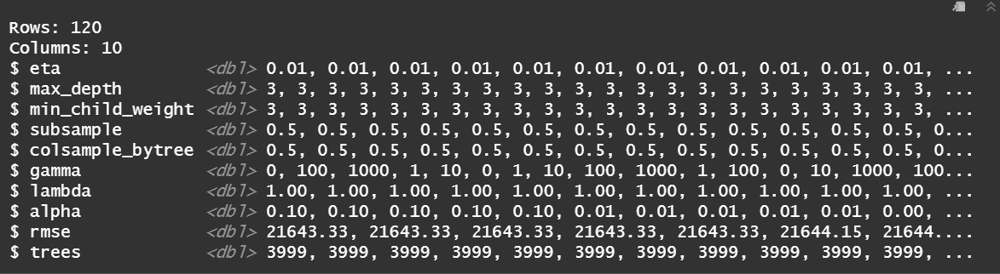

References:

1. [XGBoost: A Scalable Tree Boosting System](https://arxiv.org/abs/1603.02754)
2. [Hands on machine-learning with R](https://bradleyboehmke.github.io/HOML/gbm.html#xgboost)
3. [Predicting marketing performance with ML](https://towardsdatascience.com/predicting-marketing-performance-with-machine-learning-c8472bc7807)
4. [A data-driven approach to predict the success of bank telemarketing](https://doi.org/10.1016/j.dss.2014.03.001)
5. [Extensive tutorial](http://uc-r.github.io/gbm_regression)
6. [Gradient Boosting Essentials in R Using XGBOOST ](http://www.sthda.com/english/articles/35-statistical-machine-learning-essentials/139-gradient-boosting-essentials-in-r-using-xgboost/)
7. [A Gentle Introduction to XGBoost for Applied Machine Learning  ](https://machinelearningmastery.com/gentle-introduction-xgboost-applied-machine-learning/)
8. [Gradient Boosting in R](https://datascienceplus.com/gradient-boosting-in-r/)

## Gradient Boosting

When we talk about machine learning, there are two quite important factors that drive successful application: effective statistical models that are capable of capturing the complex data dependencies and how scalable are learning systems that learn the model from large datasets. Among the machine learning methods commonly used in practice are gradient tree boosting methods. Gradient boosting machines (GBMs) are a very popular machine learning method, and in this chapter we will introduce you R package "xgboost" and show how it can be used for marketing purposes. It is a scalable machine learning system for tree boosting and GMBs have proven successful across many domains and are one of the leading methods you can find across Kaggle competitions.

When it comes to marketing, it can be used in uplift modeling, i.e. can help a company to identify those who are likely to buy products as a result of receiving a discount or a personalized advertisement. Consequently, it helps a company to maximize profits by keeping advertising costs and overall efforts to the minimum. In the perspective of data analysis and marketing, performance of a marketing campaign can be predicted using algoritham such as GBMs. For instance, in the banking industry optimizing targeting for telemarketing used to be one of the main issues, especially under a growing pressure induced by financial crisis in 2008. A commercial bank from Portugal used data-driven model to predict the result of a telemarketing phone call to sell long term deposits is a valuable tool to support clientselection decisions of bank campaign managers. As a result, they identified that inbound calls and an increase in other attributes identified as a highly relevant (such as agent experience or duration of pre-vious calls) enhance the probability for a successful deposit sell.  


### Elements of supervised machine learning
# https://xgboost.readthedocs.io/en/latest/tutorials/model.html
# https://bradleyboehmke.github.io/HOML/intro.html#supervised-learning

xGBoost is used in supervised machine learning. Let us decompose the meaning of supervised machine learning.

Supervised machine learning can be described as a process in which training data with multiple **features **(also called: predictor variables, independent variables, attributes, predictor) is used to predict a **target variable** (also called, dependent variable, response, outcome measurement). 

The final outcome of supervised machine learning is a predictive model, so it is important to define what a model is. **A model**, in the context of supervised machine learning, contains a mathematical structure or algorithm by which the prediction of a target variable is made from the multiple features used as input. For instance, algorithm that helps you to predict the sale price of your house based on the house attributes.

Another important term in the context of machine learning are **parameters**. They denote undetermined part that we need to learn from data. For instance, in case of linear regression, the parameters are the **coefficients **.


Finally, as we said, models we build with supervised machine learning are predictive models. "Supervised" refers to a supervisory role of the target variable, which indicates the task that model needs to learn. More specifically, it means that the data which is used for training a model contains target variable. Given a set of training data, the learning algorithm attempts to find the combination of feature values that results in a predicted value as close to the actual target variable as possible.


### Boosted Trees


### Principle behind boosting

***I think this is a bit complicated. It assumes people know about supervised machine learning and predictive models. I would go straight to what boosting is. There are two ways of thinking about boosting that I find helpful. First, it combines multiple models, each of which is a "weak" learner, i.e. would not perform well on its own, to one "strong" learner. Second, each of the models (or trees, if we introduce the topic of trees first) performs well on a different subset of data (see e.g. column and row subsampling in xgboost but the concept holds for different methods such as Adaboost). I also find the graphic in the original paper about tree ensembles cool but I think it needs an introduction to tree learning first***

Boosting can be explained as a sequential process. That means that at each particular iteration, a new weak model is trained with respect to the error of the whole ensemble learnt by that time. A weak model is one whose predictions (error rate) are only slightly better than random guessing. In simple words, in each iteration a better model is created by adding a new weak model to the existing one, where the purpose of the weak model is to slightly improve the remaining errors of the existing model. This process slowly learns from data and tries to improve its prediction in subsequent iterations.

Among other, boosting is used for solving both regression and classification problems.
Below you can find an illustrative example and explanation for each of them.
```{r,echo = FALSE, error=FALSE,warning=FALSE,message=FALSE,fig.width=10, fig.height = 20,fig.align='center'}
knitr::include_graphics("bigd.png")
```

In the illustration above you can see 4 boxes with pluses and minuses within them representing observations. The ultimate goal of a model we need to develop is of classification nature, i.e. to classify pluses ("+") and minuses (-) within a box as accurate as possible. 

It is important to mention that at the begining all observations are assigned equal weights. However, weights are subject to change after each iteration as misclassified observations in one iteration will be assigned higher weight in the next one. Opposingly, observations that are correctly classified in one iteration will be assigned lower weight in the subsequent iteration.  

In the box 1, the first weak learner identified "+" signs just on the left side of the box. It simply missclassified three "+" signs in the middle "-" upper part and recognized only the two on the left side. Consequently, it split the box in two parts (blue and light red), meaning that everything that appears in the blue "-" marked area is classified as "+", while the rest is classified as "-". 

Although our prediction model at this point does not do great job, it contains information useful for the next weak lerner that is being added in the box 2. Next weak learner assigns more weight to three "+" signs that were previously missclassified. Similarly to the previous split, the weak learner split the box 2 again in blue "-" and red "-" marked area. Again, everything in the blue area (left from the splitting line) was classified as "+", including three minus signs being missclassified. The rest was classified as -". Even though our predicting model looks a bit better, its classification is still incorrect.  

In the box 3, our model is becoming even better in classifying. It splitted the box horizontally, so that everything below the line was classified as "-" and above the line as "+". Despite the progress we still have some missclassified "-" in the blue-marked area as well as wrongly classified "+" below the splitting line (circled signs in the box 3).

Finally, in the box 4 we see the result from combining information obtained from numerous weak learners. It is a weighted combination of the weak classifiers resulting in a strong classifier.Each classifier individually proved pretty poor performance in predicting, as they all show certain misclassification error. However, after combining them, the ultimate goal to classify all points correctly is reached and strong classifier created.


```{r,error=FALSE,warning=FALSE,message=FALSE,fig.width=10,fig.height = 20, fig.cap="Fig 1. Boosted regression tree predictions (courtesy of [Brandon Greenwell](https://github.com/bgreenwell))"}
knitr::include_graphics("boosted_stumps.gif")
```

To understand the whole concept easier, try to follow the image above. On the one hand, the blue curve depicts the real underlying function, while the points depict observations. Moreover, observations include some noise, i.e. errors. On the other hand, you can observe red curve representing constantly improving boosted prediction. More specifically, it illustrates the adjusted predictions after each additional sequential tree is added to the algorithm. At the beginning, you can observe large errors (.i.e. big deviation of the red curve from the blue one) which the boosted algorithm reduces pretty fast. However, as the predictions (.i.e. red curve) get closer to the true underlying function (i.e.blue curve), the contribution to model improvement of each additional tree is smaller and smaller. In the end, the predicted values nearly match to the true underlying function.

## xgboost package

There is an extensive list of packages with GBMs and its variations. However, the most popular implementations which we will cover here is certainly xgboost, which is quite fast and efficient.

### Introduction

XGboost stands for “Extreme Gradient Boosting”, which is an efficient implementation of gradient boosting framework. The xgboost package has been quite popular and successful on Kaggle for data mining competitions.

```{r,error=FALSE,warning=FALSE,message=FALSE, fig.width=10, fig.height = 20,}
# Turn off scientific notation
options(scipen = 9999)

# Helper packages
library(dplyr)      # for general data wrangling needs

# Modeling packages
library(xgboost)    # for fitting extreme gradient boosting
library(rsample)    # for split of data set in the training data and test data
library(AmesHousing)# data set
library(caret)      # for resampling and model training
library(plotly)
library(recipes)
library(pdp)
```

To experience gradient boosting with xgboost, we will use Ames Housing data set and try to build a model that predict sale price for houses. 

```{r, error=FALSE,warning=FALSE,message=FALSE}
# Ames housing data
ames <- AmesHousing::make_ames()
```

First, we perform stratified sampling to break our data set into training and test data, while ensuring we have consistent distributions between the training and test sets. 

```{r, error=FALSE,warning=FALSE,message=FALSE}
# Distribution of sale price in the data set before split
p <- ggplot(ames) + geom_density(aes(x=Sale_Price)) + xlab(label = "Sales price") + ggtitle(label = "Distribution of house sale prices (pre-stratifying)")
ggplotly(p)

# Stratified sampling with the rsample package
set.seed(1234)
split <- initial_split(ames, prop = 0.7, 
                       strata = "Sale_Price")
ames_train  <- training(split)
ames_test   <- testing(split)

# Distribution of separated data
d <- data.frame(x = c(ames_test$Sale_Price, ames_train$Sale_Price), 
                type = rep(c("Test data", "Train data"),c(length(ames_test$Sale_Price), length(ames_train$Sale_Price))))
p <- ggplot(d) + geom_density(aes(x=x, colour=type)) + xlab(label = "Sales price")+ ggtitle(label = "Distribution of house sale prices (post-stratifying)")
ggplotly(p)

```

xgboost package requires a matrix input for the features and the response to be a vector. Consequently, to provide a matrix input of the features we need to encode our categorical variables numerically (i.e. one-hot encoding). The following numerically label encodes all categorical features and converts the training data frame to a matrix. The same is done for test data.

```{r,error=FALSE,message=FALSE,warning=FALSE}
# Turning the test data into matrix with all numerical values
xgb_prep_test<- recipe(Sale_Price ~ ., data = ames_test) %>%
  step_integer(all_nominal()) %>%
  prep(training = ames_test, retain = TRUE) %>%
  juice() 

# Matrix containing all columns from the test data except "Sale_Price"
X_test <- as.matrix(xgb_prep_test[setdiff(names(xgb_prep_test), "Sale_Price")]) 

# Turning the train data into matrix wiht all numerical values
xgb_prep_train <- recipe(Sale_Price ~ ., data = ames_train) %>%
  step_integer(all_nominal()) %>%
  prep(training = ames_train, retain = TRUE) %>%
  juice()

# Matrix containing all columns from the train data except "Sale_Price"
X <- as.matrix(xgb_prep_train[setdiff(names(xgb_prep_train), "Sale_Price")]) 

# Sales price from the train data in a from of a vector
Y <- xgb_prep_train$Sale_Price # Vector with sales price (label)
```

In order to train our data model in the optimal manner, we need to do cross validation by using xgb.cv function. Cross validation 

```{r,error=FALSE,message=FALSE,warning=FALSE}
set.seed(123)
ames_xgb <- xgb.cv(
  data = X, # matrix with train data without sale price
  label = Y, # numerical vector with sale price with train data 
  nrounds = 1000, 
  objective = "reg:linear", # indicating regression model
  #early_stopping_rounds = 50, 
  nfold = 5,
  #params = list(
    #eta = 0.3, # learning rate 
    #max_depth = 6,
    #min_child_weight = 1,
    #subsample = 0.8,
    #colsample_bytree = 1.0),
  verbose = 0
)  

```

The cross validated object we obtained contains very useful information. In particular, we can now assess the "ames_xgb" to identify the minimum root mean square error (RMSE) and the optimal number of trees for both the training data (train_rmse_mean) and the cross-validated error (test_rmse_mean). 

```{r,error=FALSE,message=FALSE,warning=FALSE}
ames_xgb$evaluation_log %>%
  dplyr::summarise(
    ntrees.train = which(train_rmse_mean == min(train_rmse_mean))[1],
    rmse.train   = min(train_rmse_mean),
    ntrees.test  = which(test_rmse_mean == min(test_rmse_mean))[1],
    rmse.test   = min(test_rmse_mean),)
```

We can see that the training error continues to decrease to `r eval$n.trees.train` trees where the RMSE stands at almost 0 (`r eval$rmse.train`). On the other hand, the cross validated error reaches a minimum RMSE of `r eval$rmse.test` with `r eval$ntrees.test` trees. 

```{r,error=FALSE,message=FALSE,warning=FALSE}
# Plot error vs number trees
pe<-ggplot(ames_xgb$evaluation_log) +
  geom_line(aes(iter, train_rmse_mean), color = "red") +
  geom_line(aes(iter, test_rmse_mean), color = "blue")
ggplotly(pe)

```

Our ultimate goal is to reduce cross validated error as much as possible. In that regard, "xgb.cv" provides possibility for better tunning of our cross validation through a couple of additional hyperparameters that might improve our model. The most common hyperparameters are:
1. eta - which dictates the learning rate
2. max_depth - which determines the depth of a tree
3. min_child_weight - minimum number of observations required in each terminal node
4. subsample - percent of training data to sample for each tree
5. colsample_bytrees - percent of columns to sample from for each tree

```{r}
set.seed(123)
ames_xgb1 <- xgb.cv(
  data = X, # matrix with train data without sale price
  label = Y, # numerical vector with sale price with train data 
  nrounds = 2301, 
  objective = "reg:linear", # indicating regression model
  early_stopping_rounds = 50, 
  nfold = 10,
  params = list(
    eta = 0.03, # learning rate 
    max_depth = 3,
    min_child_weight = 3,
    subsample = 0.5,
    colsample_bytree = 0.5,
    lambda=1.0),
  verbose = 0
)  

# Checking results
ames_xgb1$evaluation_log %>%
  dplyr::summarise(
    ntrees.train = which(train_rmse_mean == min(train_rmse_mean))[1],
    rmse.train   = min(train_rmse_mean),
    ntrees.test  = which(test_rmse_mean == min(test_rmse_mean))[1],
    rmse.test   = min(test_rmse_mean),)

# Plot error vs number trees
pr1 <-ggplot(ames_xgb1$evaluation_log) +
  geom_line(aes(iter, train_rmse_mean), color = "red") +
  geom_line(aes(iter, test_rmse_mean), color = "blue")
ggplotly(pr1)
```

After including those hyperparameters (a list called "params") and voluntarily changing some other parmeters, we managed to improve our cross validated error from the previous 28602.11	to 21887.61.
It is clear that it takes increadible effort to manualy seek for the optimal hypperparameters combination. However, there are more elegant, automated solution for it. We can create our hyperparameter search grid along with columns to dump our results in. 

```{r}
# Hyperparameter grid
hyper_grid <- expand.grid(
  eta = c(.01,0.3,05),
  max_depth = 3, 
  min_child_weight = 3,
  subsample = 0.5, 
  colsample_bytree = 0.5,
  gamma = c(0, 1, 10, 100, 1000),
  lambda = c(0, 1e-2, 0.1, 1, 100, 1000, 10000),
  alpha = c(0, 1e-2, 0.1, 1, 100, 1000, 10000),
  rmse = 0,          # a place to dump RMSE results
  trees = 0          # a place to dump required number of trees
)

nrow(hyper_grid)

```

With the code above we create a pretty large search grid consisting of 245 different hyperparameter combinations to model. It is important to note that running such a grid in a loop procedure could take a couple of hours. We will create such a loop procedure to loop through and apply a xgboost model for each hyperparameter combination (245 in our case) and finally provide us the results in the hyper_grid data frame.

```{r, fig.width=10}

```


```{r,eval=F,echo=F}
# Grid search
for(i in seq_len(nrow(hyper_grid))) {
  set.seed(123)
  m <- xgb.cv(
    data = X,
    label = Y,
    nrounds = 4000,
    objective = "reg:linear",
    early_stopping_rounds = 50, 
    nfold = 10,
    verbose = 0,
    params = list( 
      eta = hyper_grid$eta[i], 
      max_depth = hyper_grid$max_depth[i],
      min_child_weight = hyper_grid$min_child_weight[i],
      subsample = hyper_grid$subsample[i],
      colsample_bytree = hyper_grid$colsample_bytree[i],
      gamma = hyper_grid$gamma[i], 
      lambda = hyper_grid$lambda[i], 
      alpha = hyper_grid$alpha[i]
    ) 
  )
  hyper_grid$rmse[i] <- min(m$evaluation_log$test_rmse_mean)
  hyper_grid$trees[i] <- m$best_iteration
}

# Results
hg <- hyper_grid %>%
  filter(rmse > 0) %>%
  arrange(rmse) %>%
  glimpse()

```

Now, when we obtained combinations of hyperparameters in the form of a grid, we can identify optimal combination, i.e. the combination of hyperparameters that results in the the least RMSE. Once we identify the optimal combination we can build our final model. Besides optimized hyperparameters, it is important to include the optimal number of trees found during cross validation. 

```{r}
# The list of optimal hyperparameters
params_optimal <- list(
  eta = 0.01,
  max_depth = 3,
  min_child_weight = 3,
  subsample = 0.5,
  colsample_bytree = 0.5,
  lambda = 1.0,
  alpha = 100
)

# Train final model  with optimal hyperparameters
set.seed(1234)
xgb.fit.optimal <- xgboost(
  params = params_optimal,
  data = X,
  label = Y,
  nrounds = 3999,
  nthreads = 1,
  early_stopping_rounds = 10,
  objective = "reg:linear",
  verbose = 0
)

# Checking results with optimal hyperparameters 
xgb.fit.optimal$evaluation_log %>%
  summarise(
    ntrees.train = which(train_rmse == min(train_rmse))[1],
    rmse.train   = min(train_rmse))
```

After computing the final model, we can make inferences about how features (i.e. variables in our data set besides sale price) are influencing our model. Measurement of feature importance occurs based on the sum of the reduction in the loss function (e.g. SSE) attributed to each variable at each split in a respective tree. In simplier terms, it is the relative contribution of the respective feature to the model computed by taking each feature’s contribution for each tree in the model. Therefore, those features with the highest average decrease in SSE (for regression) are identified as the one with the highest contribution. Thus, these features are among most important ones. To visualize feature importance plot we need to create imporance matrix first then plot it with ggplot-besed function "xgb.ggplot.importance". 

```{r}
#https://liuyanguu.github.io/post/2018/07/09/extreme-gradient-boosting-xgboost-better-than-random-forest-or-gradient-boosting/
# Construct importance matrix
importance_matrix <- xgb.importance(model = xgb.fit.optimal)
# Variable importance plot with ggplot2
xgb.ggplot.importance(importance_matrix, top_n = 10, measure = "Gain")

```

As we identified the most relevant features, now we can try to understand how the response variable (i.e. predicted sale price) changes based on these variables. For this we can use partial dependence plots (PDPs). They show the marginal effect one or two features have on the predicted outcome.
Partical dependency plots depict the change in the average predicted value as specified feature (or more features) vary over their marginal distribution. Let's consider the "Gr_Liv_Area" variable. The PDP plot below displays the average change in predicted sales price as we vary "Gr_Liv_Area" while holding all other variables constant. More specifically, it shows the movement of the predicted sales price as the square footage of the ground floor in a house changes, while holding other variables constant.

```{r,error=F,warning=F,message=F}
library(pdp)
pdp <- xgb.fit.optimal %>%
  pdp::partial(pred.var = "Gr_Liv_Area", n.trees = 3999, grid.resolution = 100, train = X) %>%
  autoplot(rug = TRUE, train = X) +
  scale_y_continuous(labels = scales::dollar) +
  ggplot2::xlab(label= "Ground floor living area")+
  ggplot2::ylab(label="Predicted sale price")+
  ggtitle("Partial dependency plot - Influence of the ground floor size on a house sale price")
ggplotly(pdp)
```

Finally, we use predict function to predict on new observations.

```{r}
# Predict values for test data optimal
pred.optimal <- predict(xgb.fit.optimal, X_test)

# Results with optimal parameters
RMSE(pred.optimal, ames_test$Sale_Price)

```

EXPLAIN RESULTS HERE (IN PROGRESS)

Now we can visualise our optimal model:
```{r,message=F,warning=F,error=F}
# Plot predictions vs actual sale price
ames_test$pred.optimal <- pred.optimal
p<-ggplot(ames_test, aes(x = pred.optimal, y = Sale_Price, Predicted=pred.optimal, Tested=Sale_Price)) + 
  geom_point() +
  geom_smooth(method = "lm", se = TRUE)+
  xlab(label = "Predicted sale price" )+
  ylab(label = "Test sale price")+
  ggtitle(label = "Predicted sale price vs sales price")
ggplotly(p,tooltip = c("Predicted","Tested"))

# Calculate RMSE
ames_test %>%
  mutate(residuals = Sale_Price - pred.optimal) %>%
  summarize(rmse = sqrt(mean(residuals^2)))
```

Additionally, we can illustrate a density plot with our predicted and test data.

```{r,error=FALSE,message=FALSE,warning=FALSE}
# Density of the predicted vs actual values of sale price
xgboost.pred <- predict(xgb.fit.optimal, as.matrix(X_test))
xgboost.pred <- as.data.frame(xgboost.pred)
xgboost.pred$label <- as.data.frame(ames_test)$Sale_Price
pr <- data.frame(x = c(xgboost.pred$xgboost.pred, xgboost.pred$label), 
                Type = rep(c("Prediction", "Test"),c(length(xgboost.pred$xgboost.pred), length(xgboost.pred$label))))
p <- ggplot(pr) + geom_density(aes(x=x, colour=Type)) + xlab(label = "Sales price") + ggtitle(label="Prediction vs Test data")
ggplotly(p)

```


## Exercise (IN PROGRESS)

```{r,error=FALSE,message=FALSE,warning=FALSE,eval=FALSE,echo=FALSE}
escooter.may <- read.csv("bikesJuly.csv")
escooter.aug <- read.csv("bikesAugust.csv")
```

In this exercise you will fit a gradient boosting model using xgboost package to predict the number of e-scooters rented in an hour. Features in the data set are related to weather conditions and other important information. Your task will be to train the model on data from one month (i.e. May) and do prediction on data for another month (i.e. June).

### Exercise to download (IN PROGRESS)

In this exercise you will fit a gradient boosting model using xgboost package to predict the number of e-scooters rented in an hour. Features in the data set are related to weather conditions and other important information. Your task will be to train the model on data from one month (i.e. May) and do prediction on data for another month (i.e. June).

```{r,eval=F,echo=F}
# The number of trees to use, as determined by xgb.cv
ntrees

# Run xgboost
bike_model_xgb <- xgboost(data = as.matrix(bikesJuly.treat), # training data as matrix
                          label = bikesJuly$cnt,  # column of outcomes
                          nrounds = ntrees,       # number of trees to build
                          objective = "reg:linear", # objective
                          eta = 0.3,
                          depth = 6,
                          verbose = 0  # silent
)

# Make predictions
bikesAugust$pred <- predict(bike_model_xgb, as.matrix(bikesAugust.treat))

# Plot predictions vs actual bike rental count
ggplot(bikesAugust, aes(x = pred, y = cnt)) + 
  geom_point() + 
  geom_abline()


```


------------------------------------------------

